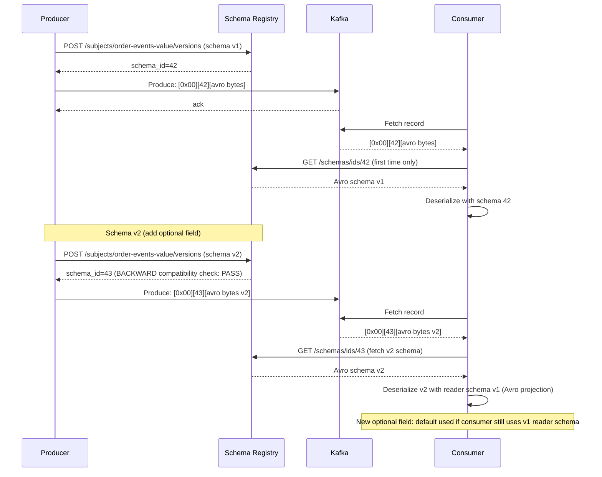

## Keywords in This File
{: .no_toc }

| # | Keyword | Weight |
|---|---|---|
| 1 | [Kafka - META Patterns](#kafka---meta-patterns) | medium |

---

# Kafka - META Patterns

## Event-Driven Design Thinking

---

### 🎯 Model Answer

**30 seconds:**
> Event-driven design thinking: a mental model for deciding when services should communicate via
> events (Kafka) vs synchronous APIs (REST/gRPC). Core question: does the caller need the result
> immediately? If yes: API. If no: event. Secondary question: what is the coupling cost?
> Events: temporal and behavioral decoupling. APIs: tighter coupling. EDA is not a universal
> replacement for REST. It is the right tool for: async workflows, fan-out, event sourcing,
> temporal decoupling.

**3 minutes (Senior):**
> Four questions to decide: (1) **Does the caller need a synchronous response?** Order placement:
> caller needs an order ID immediately. Use API. Notification after order placed: caller doesn't
> care when email sends. Use event. (2) **How many services need to react?** One service: API is
> fine. Many services (inventory, warehouse, analytics, notifications): all react to the same
> order event. Use event. Fan-out: events win. (3) **What is the temporal coupling cost?**
> If Service B is down: API call fails. Event: sits in Kafka, delivered when B recovers. Temporal
> decoupling: events win for non-real-time workflows. (4) **What is the debugging cost?**
> API: call stack. Trace tool: one tree. Event chain: distributed trace. Requires OpenTelemetry
> context propagation through event headers. Events: harder to debug. Choose events only when
> the coupling and availability benefits outweigh the debugging cost.

**Blank Mind Recovery:**

**(1) Restate:** "Events for: async workflows, fan-out, temporal decoupling, event sourcing.
APIs for: synchronous response needed, simple 1:1 service call, strong consistency required,
interactive user-facing flows. Mental model: 'does the caller care about the result immediately?'"

**(2) First principles:** "Events = facts about the past. APIs = requests for actions. Events:
producer doesn't know or care who consumes. APIs: caller knows and depends on the receiver.
Coupling level: events = low, APIs = high. Availability: events = resilient to receiver downtime,
APIs = dependent on receiver uptime."

**(3) Bridge:** "Think of event-driven design as a city announcement board vs a phone call.
Phone call (API): you need to reach someone specific, you need an answer now. Announcement board
(event): 'New job listing for Java developer.' Dozens of applicants react independently, at
their own pace. You don't know or care who reads it. You just post the fact."

---

### 📘 Concept Explanation

**When to use events vs APIs - decision framework:**
```
EVENT VS API DECISION FRAMEWORK:

  Question 1: Is a synchronous response required?
    YES -> Use REST/gRPC. The caller is blocked waiting for a result.
           Example: user login (need JWT token back immediately).
           Example: payment gateway call (need "approved/declined" back).
    NO  -> Event is viable. Continue to question 2.
  
  Question 2: Is there fan-out (multiple consumers)?
    YES -> Use event. One event triggers N reactions.
           Example: "OrderPlaced" -> inventory, billing, notification, analytics (4 consumers).
    NO  -> Single consumer? API may be simpler. Continue to question 3.
  
  Question 3: Can the receiver be temporarily unavailable?
    YES (receiver downtime acceptable) -> Use event. Kafka buffers during downtime.
    NO (receiver must process immediately) -> Use API with circuit breaker.
           Example: fraud detection before authorizing payment: must be synchronous.
  
  Question 4: Does the history matter (replay, audit, event sourcing)?
    YES -> Use event (immutable Kafka log). Can replay to rebuild state.
    NO  -> Either option. API is simpler if replay is not needed.
  
  Decision matrix:
  ┌─────────────────────────────┬──────────────────────────────┐
  │       USE EVENTS            │       USE APIS               │
  ├─────────────────────────────┼──────────────────────────────┤
  │ Fan-out to N consumers      │ Synchronous response needed   │
  │ Async background processing │ Strong consistency required   │
  │ Temporal decoupling needed  │ Simple 1:1 request/response   │
  │ Audit trail / event sourcing│ Interactive user-facing flow  │
  │ Cross-service state sync    │ Low-latency transaction        │
  │ SAGA distributed workflow   │ Fraud check / payment auth     │
  └─────────────────────────────┴──────────────────────────────┘

COUPLING ANALYSIS (why decoupling matters):

  Tight coupling (API-based):
    OrderService --HTTP--> InventoryService
    OrderService --HTTP--> NotificationService
    OrderService --HTTP--> BillingService
    
    Problems:
    - If InventoryService is down: OrderService call fails.
    - If NotificationService is slow: OrderService is slow.
    - Adding a new consumer (e.g., AnalyticsService): modify OrderService.
    - 3 direct dependencies: increasing coupling over time.
  
  Loose coupling (event-based):
    OrderService --[OrderPlaced event]--> Kafka
    Kafka --> InventoryService
    Kafka --> NotificationService
    Kafka --> BillingService
    Kafka --> AnalyticsService (added later: no OrderService change needed)
    
    Benefits:
    - OrderService: one dependency (Kafka). Not on downstream services.
    - Adding new consumer: zero change to OrderService.
    - If NotificationService is down: event waits in Kafka. No order placement failure.

ANTI-PATTERNS IN EVENT-DRIVEN THINKING:

  Anti-pattern 1: "Events for everything."
    Using events even for synchronous user-facing flows:
      User clicks "Place Order" -> event produced -> ... -> response 200ms later.
    Problem: the user is waiting synchronously. You've added Kafka latency
    (2-5ms per hop) + complexity for no benefit. Use REST/gRPC for user-facing operations.
  
  Anti-pattern 2: "Orchestrating services via events without a state machine."
    Complex multi-step workflow via event chain: no persistent state.
    If step 3 fails: who retries? How do you know where the workflow stopped?
    Fix: persist workflow state (SAGA state machine) or use Temporal.
  
  Anti-pattern 3: "Events as commands."
    Publishing "ProcessPayment" event. This is a command, not a fact.
    Events: past tense (something happened). Commands: imperative (do something).
    If the consumer is down: should the command be replayed? What if it processes twice?
    Commands need explicit idempotency design. Events are naturally idempotent (facts don't change).
  
  Anti-pattern 4: "Fat events containing all related data."
    "OrderPlaced" event: 50 fields. All downstream services need 5 fields each, all different.
    Every schema change: update all consumer schemas. Events should contain relevant fields
    for the state change, not everything about the entity.
```

> **Code walkthrough:** This example demonstrates the core pattern in action. The key mechanism shows how the concept works in practice. Study the structure to understand the essential behavior and common usage.

---

### 💻 Code Example

> **Code walkthrough:** The event vs API decision applied in code shows how the same business
> flow uses both patterns appropriately: synchronous for immediate response, async for background work.

```java
// WRONG: everything via events (including synchronous user-facing flow):
@PostMapping("/orders")
public ResponseEntity<String> placeOrder(@RequestBody PlaceOrderRequest req) {
    kafka.send("order-commands", toJson(req));
    // Return 202 Accepted. User: must poll to know if order was placed.
    // UX: terrible. Order may fail validation. User never knows immediately.
    return ResponseEntity.accepted().body("Order submitted");
}

// RIGHT: hybrid - synchronous for immediate validation, async for background work:
@PostMapping("/orders")
public ResponseEntity<OrderResponse> placeOrder(@RequestBody PlaceOrderRequest req) {
    // Synchronous: validate + persist (immediate response needed):
    Order order = orderService.validateAndPersist(req);  // throws if invalid
    
    // Async: background work (fan-out, no response needed):
    kafka.send("order-events", order.getId(),
        toJson(new OrderPlacedEvent(order)));
    // Inventory, billing, notification: react asynchronously.
    // User: gets the order ID and status immediately.
    
    return ResponseEntity.ok(new OrderResponse(order.getId(), "PLACED"));
}

// Downstream service: reacts asynchronously when ready (temporal decoupling):
@KafkaListener(topics = "order-events", groupId = "inventory-service")
public void onOrderPlaced(String payload) {
    OrderPlacedEvent event = parse(payload);
    if ("OrderPlaced".equals(event.getType())) {
        // This runs independently of the user's request.
        // If InventoryService restarts: this event will be reprocessed.
        reserveInventory(event);
    }
}
```

> **Code walkthrough:** The `placeOrder` endpoint shows the correct hybrid pattern. The synchronous
> path: validates and persists the order (fast, returns the order ID to the user). The async path:
> publishes the event for background processing. Inventory reservation and notification happen
> after the user has already received their response. The temporal decoupling benefit: if the
> Inventory Service is restarting during the order placement, the order still succeeds for the
> user. The inventory reservation will happen when the Inventory Service recovers and processes
> the buffered event.

---

### 🎓 Answers by Seniority

**Junior / Mid (0-5 years):**
> Events: use when multiple services need to react, or when the caller doesn't need an immediate
> response. APIs: use when you need a response back right away. Example: creating an order returns
> the order ID (API). Sending a notification after the order is created (event: the order service
> doesn't need to wait for the email to be sent).

---

**Senior / Staff (5+ years):**
> The most important event-driven design decision: event schema design. A poorly designed event
> schema locks you into a tight coupling just as bad as APIs. Example: `OrderPlaced` event
> contains `orderStatus: "PLACED"`. Downstream services parse `orderStatus`. Later: the status
> model changes. You've recreated the coupling problem, just over a message bus instead of HTTP.
> Better: events contain only the facts of what changed (the delta), not derived state. `OrderPlaced`
> contains: order ID, customer ID, items, total, placed timestamp. Not: status, or any fields
> that require the consumer to interpret business logic.

---

### ⚠️ Common Misconceptions

**Misconception: "Event-driven architecture eliminates coupling."**
EDA reduces BEHAVIORAL coupling (services don't call each other) and TEMPORAL coupling (services
don't need to be up simultaneously). But it introduces SCHEMA COUPLING: every consumer depends
on the event schema. If the producer changes the event format: all consumers must adapt. This
is a different form of coupling, not elimination of coupling. Schema Registry (Confluent,
Apicurio) with Avro/Protobuf enforces backward and forward compatibility. This governs how
schema coupling is managed: producers can evolve schemas only in compatible ways. Without
schema governance: EDA creates hidden coupling that surfaces as consumer parse errors at
runtime (often in production, never in testing). The discipline required: every event schema
change must be reviewed for compatibility impact on all consumers. This governance cost is the
price of EDA's other benefits.

---

### ⚖️ Comparison Table

| Pattern | Coupling | Availability | Debugging | Latency |
|---|---|---|---|---|
| REST API | High | Tight (receiver must be up) | Easy (call stack) | Low (direct call) |
| Async event | Low | Decoupled (Kafka buffers) | Hard (distributed trace) | Higher (round-trip via broker) |
| Event sourcing | Minimal | Decoupled | Very hard (replay needed) | Highest (projection lag) |
| Hybrid (sync + async) | Medium | Partial decoupling | Moderate | Low for sync path |

---

### 🏛️ System Design

*(Omit: event-driven design thinking is a decision framework, not a system design component.)*

---

### 📊 Diagram

*(Omit: the decision framework is better expressed as text and code than as a diagram. The key patterns and anti-patterns are visual enough in the concept explanation section.)*

---

### 🚨 Failure Modes and Diagnosis

**Failure: Cascading failure because synchronous user-facing flow used events for all steps.**
```
Symptom: Order placement is slow (5+ seconds) during Kafka lag events.
  Users: see slow checkout. Conversion rate drops.
  Kafka: lag building up on order-commands topic.
  
Root cause: OrderService PUT /orders -> produces to "order-commands" -> 
  waits for a "reply" event from "order-replies" topic (request/response over Kafka).
  This pattern adds: producer send latency + Kafka internal latency + consumer poll interval
  + consumer processing time + reply produce latency + reply consumer poll interval.
  Total: 50-500ms in ideal conditions. 5+ seconds when Kafka is under load.

Diagnosis:
  kafka-consumer-groups.sh --describe --group order-command-processor
  # If lag > 0: orders are queuing. Each order waits longer.
  
  Application traces (OpenTelemetry/Jaeger):
    "order_placement" span duration > 1000ms?
    Child span: "kafka_request_reply" taking most of the time?
  
  This is the "request/reply over Kafka" anti-pattern.

Fix:
  Move order validation back to a synchronous REST call or in-process logic.
  Kafka: only for async background steps (post-placement: inventory, billing, notifications).
  The user's request: served directly by the OrderService without any Kafka round-trip.
  
  Before (broken):
    Client -> OrderService -> Kafka -> CommandProcessor -> Kafka -> OrderService -> Client
  
  After (correct):
    Client -> OrderService (validates + persists) -> Client (immediate response)
                                                  -> Kafka -> [background services]
```

> **Code walkthrough:** This example demonstrates the core pattern in action. The key mechanism shows how the concept works in practice. Study the structure to understand the essential behavior and common usage.

---

### 🎯 Interview Deep-Dive

| Question Category | Time to Answer |
|---|---|
| Events vs APIs decision | 2 minutes |
| Coupling types in EDA | 1 minute |
| Anti-patterns in event design | 2 minutes |
| When EDA is the wrong choice | 1 minute |
| Schema coupling governance | 1 minute |
| Hybrid pattern design | 1 minute |
| Event naming principles | 1 minute |

---

**Q1 (design): Walk me through how you decide whether a service integration should use Kafka or REST.**

A: Four questions. First: does the caller need the result in the same HTTP request? Payment gateway
authorization: yes (user is waiting). Notification after order placed: no (background). If yes:
REST. If no: Kafka is viable. Second: how many services react? One downstream service: REST is
simpler, less infrastructure. Many services (inventory, analytics, billing, notifications all
react to the same event): Kafka fan-out wins. Third: what is the availability requirement for
the producer? If the producer must succeed even if the downstream is down (temporal decoupling):
Kafka buffers the message. REST: caller must handle downstream unavailability with circuit breakers
and retries. Kafka: resilient by design. Fourth: is replay or audit needed? If events must be
replayable (to rebuild state, re-run analytics, backfill a new service): Kafka's persistent log
is the right model. REST: response is gone. Final decision: for synchronous, low-fan-out,
user-facing flows: REST. For async, fan-out, background workflows, temporal decoupling, or
event sourcing: Kafka.

*What separates good from great:* The hybrid pattern is usually the right answer. The order
placement endpoint: synchronous REST (user gets order ID immediately). Everything that happens
after: events. This gives the user a fast response AND the downstream services the decoupling
benefit. The failure mode to watch for: teams that over-apply events to user-facing flows and
then add "request/reply over Kafka" to recover the synchronous response. This is the worst of
both worlds: Kafka's complexity plus synchronous latency. The rule: if you need a synchronous
response, use a synchronous protocol (REST/gRPC). Use Kafka only for genuinely async work.

---

---

## Backpressure and Flow Control

---

### 🎯 Model Answer

**30 seconds:**
> Backpressure: the mechanism by which a slow consumer signals to a fast producer to slow down.
> Kafka producer: `buffer.memory` (default 32MB) is the buffer. When full: `max.block.ms` governs
> how long to block before throwing. Consumer: `pause()`/`resume()` for explicit flow control.
> Rate limiting: custom producer interceptor or `records.per.second` quota per client. Circuit
> breaker: stop consuming when downstream is overwhelmed.

**3 minutes (Senior):**
> Backpressure layers: (1) **Producer buffer**: `buffer.memory=33554432` (32MB). When batch
> accumulation fills the buffer faster than broker acks return: next `send()` call blocks for
> up to `max.block.ms=60000` (60s). After timeout: `BufferExhaustedException`. This is Kafka's
> producer-side backpressure signal. (2) **Consumer pause/resume**: the most powerful explicit
> flow control. Consumer: call `consumer.pause(partitions)` to stop fetching from those partitions.
> Poll loop: still runs (to maintain session). The consumer's assigned partitions: paused (no
> new records). When downstream recovers: `consumer.resume(partitions)`. Spring Kafka:
> `@KafkaListener` + `KafkaListenerEndpointRegistry.stop()/start()`. (3) **Consumer throughput**:
> `max.poll.records=500` limits records per `poll()`. `fetch.max.bytes` limits bytes per fetch.
> Tuning these: controls consumer batch size per iteration. (4) **Quotas**: broker-enforced
> throughput limits per client. Prevents one producer from saturating the broker. `producer_byte_rate`
> and `consumer_byte_rate` per client ID. Broker throttles the client when quota exceeded.

**Blank Mind Recovery:**

**(1) Restate:** "Producer backpressure: buffer.memory fills, max.block.ms blocks, then
BufferExhaustedException. Consumer: pause()/resume() for explicit flow control. Quotas:
broker-enforced per-client throttling. Circuit breaker: stop consuming when downstream
is saturated."

**(2) First principles:** "Flow control: matching production rate to consumption rate. Kafka buffers
spikes. When buffer fills: producer blocks. Consumer can pause to avoid overwhelming its downstream.
Quotas: per-client guardrails. Circuit breaker: system-level protection when the whole downstream
chain is overloaded."

**(3) Bridge:** "Backpressure is like highway traffic management. The highway (Kafka broker):
handles normal flow. Ramp meters (producer buffer): slow down on-ramp traffic when highway is
full. Exit ramps (consumers): can have their own speed limit (pause/resume). Toll plazas (quotas):
enforce per-vehicle speed limits. Emergency brakes (circuit breaker): stop all traffic when
there's an accident downstream."

---

### 📘 Concept Explanation

**Producer buffer, consumer pause/resume, quotas, and circuit breaker:**
```
PRODUCER BACKPRESSURE:

  # Producer memory buffer (records waiting to be batched and sent):
  buffer.memory=33554432       # 32MB (total buffer for all partition batches)
  batch.size=16384             # 16KB max per batch (per partition)
  linger.ms=5                  # wait 5ms to accumulate records before sending
  max.block.ms=60000           # how long send() blocks when buffer is full
  
  # Buffer fills when:
  # - Broker is slow (network congestion, high load)
  # - Broker is down (no acks returning)
  # - Produce rate > ack rate
  
  # When buffer full and max.block.ms exceeded:
  # producer.send() throws BufferExhaustedException.
  # Application must handle this: retry with backoff, or drop (depends on data value).
  
  # Monitoring:
  # JMX: kafka.producer:type=producer-metrics,
  #   attribute=buffer-available-bytes (approaching 0 = pressure)
  # JMX: kafka.producer:type=producer-metrics,
  #   attribute=record-queue-time-avg (increasing = pressure)

CONSUMER PAUSE / RESUME (EXPLICIT FLOW CONTROL):

  @KafkaListener(topics = "orders", groupId = "order-processor")
  public class OrderConsumer {
      @Autowired MessageListenerContainer container;
      @Autowired DownstreamService downstream;
      
      @KafkaHandler
      public void processOrder(ConsumerRecord<String, String> record,
                               Acknowledgment ack,
                               Consumer<?, ?> consumer) {
          try {
              downstream.process(record.value());
              ack.acknowledge();
          } catch (DownstreamOverloadException e) {
              // Downstream saturated. Pause this partition:
              consumer.pause(consumer.assignment());
              log.warn("Pausing Kafka consumption. Downstream overloaded.");
              
              // Schedule resume after cooldown:
              Executors.newSingleThreadScheduledExecutor()
                .schedule(() -> {
                  consumer.resume(consumer.assignment());
                  log.info("Resuming Kafka consumption.");
                }, 5, TimeUnit.SECONDS);
              
              // Re-seek to the current record (do not commit this offset):
              consumer.seek(
                new TopicPartition(record.topic(), record.partition()),
                record.offset());
              // The record will be re-processed when consumer resumes.
          }
      }
  }

BROKER-SIDE QUOTAS:

  # Set per-client throughput quota (prevents noisy neighbor):
  kafka-configs.sh --bootstrap-server broker:9092 \
    --entity-type clients --entity-name analytics-service \
    --alter --add-config producer_byte_rate=1048576  # 1 MB/s max produce
  
  kafka-configs.sh --bootstrap-server broker:9092 \
    --entity-type clients --entity-name analytics-service \
    --alter --add-config consumer_byte_rate=5242880  # 5 MB/s max consume
  
  # Broker: when quota exceeded, throttles the client:
  # Delays fetch responses to slow down the consumer.
  # Delays produce acks to slow down the producer.
  # Client: sees increased latency (not connection drops).
  # Client JMX: produce-throttle-time-avg > 0 = quota being applied.
  
  # Per-user quotas (with SASL authentication):
  kafka-configs.sh --bootstrap-server broker:9092 \
    --entity-type users --entity-name analytics-team \
    --alter --add-config producer_byte_rate=10485760  # 10 MB/s per user

CIRCUIT BREAKER PATTERN:

  # Consumer stops fetching when downstream failure rate exceeds threshold:
  
  @Service
  class ResilientConsumer {
      private final CircuitBreaker circuitBreaker =
          CircuitBreaker.ofDefaults("downstream-db");
      
      @KafkaListener(topics = "orders")
      public void consume(String payload,
                          Acknowledgment ack,
                          Consumer<?, ?> consumer) {
          if (circuitBreaker.getState() == OPEN) {
              // Circuit breaker open: downstream is failing. Pause consumption.
              consumer.pause(consumer.assignment());
              // Record will be re-consumed when circuit closes.
              return;
          }
          
          try {
              circuitBreaker.executeRunnable(
                  () -> databaseService.save(payload));
              ack.acknowledge();
              
              if (consumer.paused().contains(...)) {
                  consumer.resume(consumer.assignment()); // recover
              }
          } catch (Exception e) {
              // Circuit breaker counts failures. Opens after threshold.
              log.error("Processing failed: {}", e.getMessage());
              // Do NOT commit offset: record will be retried.
          }
      }
  }
```

> **Code walkthrough:** This example demonstrates the core pattern in action. The key mechanism shows how the concept works in practice. Study the structure to understand the essential behavior and common usage.

---

### 💻 Code Example

> **Code walkthrough:** Dynamic rate limiting using consumer pause/resume prevents overwhelming
> a slow downstream database during traffic spikes.

```java
// WRONG: consuming as fast as possible without flow control:
@KafkaListener(topics = "orders", groupId = "processor",
               containerFactory = "batchFactory")
public void processBatch(List<String> records) {
    for (String record : records) {
        database.save(record);  // If DB is slow: records pile up, OOM or timeout
    }
    // No backpressure. DB overloaded. Application crashes or data lost.
}

// RIGHT: consumer with rate limiting and pause/resume:
@Component
public class FlowControlledConsumer {
    
    private final AtomicBoolean paused = new AtomicBoolean(false);
    private final RateLimiter rateLimiter =
        RateLimiter.create(500); // 500 records/second max
    
    @KafkaListener(
        topics = "orders",
        groupId = "processor",
        concurrency = "3"   // 3 consumer threads
    )
    public void consume(ConsumerRecord<String, String> record,
                        Acknowledgment ack,
                        Consumer<?, ?> consumer) {
        
        // Rate limiting: 500 records/second per thread:
        rateLimiter.acquire();  // blocks if rate exceeded (natural backpressure)
        
        try {
            database.save(record.value());  // may throw if DB overloaded
            ack.acknowledge();
        } catch (DataAccessException e) {
            if (isTransientError(e)) {
                // Pause all partitions assigned to this consumer:
                Set<TopicPartition> assigned = consumer.assignment();
                consumer.pause(assigned);
                paused.set(true);
                
                // Re-seek to retry this record:
                consumer.seek(
                    new TopicPartition(record.topic(), record.partition()),
                    record.offset());
                
                // Schedule resume with backoff:
                CompletableFuture.delayedExecutor(
                    10, TimeUnit.SECONDS)
                    .execute(() -> {
                        consumer.resume(assigned);
                        paused.set(false);
                        log.info("Consumer resumed after backoff");
                    });
            } else {
                // Non-transient: send to DLQ, commit offset (skip record):
                dlqTemplate.send("orders-dlq", record.key(), record.value());
                ack.acknowledge();
            }
        }
    }
}
```

> **Code walkthrough:** Two mechanisms work together. The `RateLimiter.acquire()` provides
> token-bucket rate limiting: if 500 records/second is exceeded, the call blocks. This is
> natural backpressure: Kafka poll continues (heartbeats maintained) but records are processed
> at the configured rate. For transient database errors: the consumer pauses all its partitions
> and re-seeks to the failed record's offset. A scheduled task resumes consumption after a
> backoff period. For non-transient errors: the record goes to the DLQ (dead letter queue) and
> the offset is committed (skip, don't block forever on a poisoned message).

---

### 🎓 Answers by Seniority

**Junior / Mid (0-5 years):**
> Backpressure: mechanism to prevent fast producers from overwhelming slow consumers. Kafka
> producer: `buffer.memory` fills up, then `send()` blocks. Consumer: can pause partitions
> when downstream is overwhelmed. The `max.poll.records` setting limits how many records are
> processed per poll loop - useful to slow down consumption.

---

**Senior / Staff (5+ years):**
> The most dangerous backpressure anti-pattern: `max.poll.interval.ms` violation. A consumer
> that pauses for too long (> `max.poll.interval.ms=300000`: 5 minutes) will be kicked out of
> the consumer group. The partition is re-assigned to another consumer. The original consumer
> wakes up and tries to commit an offset: it receives `CommitFailedException` or
> `RebalanceInProgressException`. Records may be reprocessed by the new consumer. Solution:
> keep the poll loop running even when paused. The Kafka consumer heartbeat runs in the poll
> loop. Pausing partitions: stops fetching new records, but `consumer.poll()` still runs (with
> nothing to deliver). If the downstream recovery takes > 5 minutes: the consumer must still
> call `poll()` at regular intervals (even if it returns nothing). Design: keep `pause()` +
> continued polling. Never `Thread.sleep(600000)` inside a consumer thread.

---

### ⚠️ Common Misconceptions

**Misconception: "Consumer lag means the consumer is slow."**
Consumer lag (difference between log end offset and consumer offset) can be caused by: (1)
slow consumer processing (the most obvious), but also (2) producer burst producing faster than
the consumer's normal rate (temporary lag, recovers). (3) Consumer paused (intentional lag). (4)
Consumer rebalancing (lag increases during rebalance as partitions are unassigned and reassigned).
(5) Consumer group restarted with `auto.offset.reset=earliest` (intentionally processing from
the beginning). Diagnosing slow consumer vs burst producer: check both consumer throughput
(`records.consumed.rate` JMX) AND producer throughput (`records-per-second` JMX on producers).
If consumer throughput is stable and producer throughput spiked: it's a producer burst (lag will
recover). If consumer throughput dropped: the consumer is the bottleneck. The lag metric alone
is not sufficient for diagnosis. Time lag (lag in seconds = lag / consumer throughput rate) is
more actionable: it tells you how far behind in time the consumer is, which has a direct business
impact (e.g., "fraud detection is 5 minutes behind real-time transactions: 5-minute fraud window").

---

### ⚖️ Comparison Table

| Mechanism | Where | Granularity | Recovery | Use Case |
|---|---|---|---|---|
| buffer.memory full | Producer | Per producer | Natural (when acks return) | Producer-side backpressure |
| max.poll.records | Consumer | Per poll | Automatic | Limit batch size |
| pause/resume | Consumer | Per partition | Manual / scheduled | Downstream overload |
| Broker quota | Broker | Per client ID | Automatic throttle | Noisy neighbor prevention |
| Circuit breaker | Consumer | Per consumer | Configurable threshold | Downstream failure |

---

### 🏛️ System Design

*(Omit: backpressure is a component-level mechanism, not a standalone system architecture design topic.)*

---

### 📊 Diagram

*(Omit: the backpressure mechanisms are most clearly shown in the code examples above.)*

---

### 🚨 Failure Modes and Diagnosis

**Failure: Consumer kicked out of group due to exceeded max.poll.interval.ms.**
```
Symptom: Consumer logs:
  "org.apache.kafka.clients.consumer.CommitFailedException: Commit cannot be
  completed since the group has already rebalanced and assigned the partitions
  to another member."
  
  Or: "Consumer group rebalancing. Consumer kicked for exceeding
  max.poll.interval.ms=300000"
  
  Effect: constant rebalancing, records processed twice, offset commit failures.

Root cause: consumer processing takes > 5 minutes per poll batch.
  Common causes:
  - Downstream DB is slow (query timeout > 5 minutes)
  - Consumer is paused with Thread.sleep() (wrong pause pattern)
  - Batch processing with max.poll.records=500 records, each takes 1 second = 500 seconds > 5 min

Diagnosis:
  kafka-consumer-groups.sh --describe --group order-processor
  # Watch CONSUMER-ID column: does it change frequently? Indicates rebalancing.
  
  Application logs: search for "rebalanced" and "CommitFailedException".
  
  JMX metric: consumer.poll.interval.average
    > 200000ms (approaching max.poll.interval.ms=300000): danger zone.

Fix:
  Option A: reduce max.poll.records (process fewer records per batch):
    max.poll.records=50  # reduce from 500. Each batch: 50 records * 1s = 50s < 5min.
  
  Option B: increase max.poll.interval.ms:
    max.poll.interval.ms=900000  # 15 minutes.
    Risky: slow failure detection. Only if processing genuinely needs that long.
  
  Option C: fix the downstream slowness.
    If DB query takes 1s per record: optimize the query.
    Batch DB inserts: 500 records in one batch INSERT instead of 500 individual inserts.
  
  Option D: use pause/resume correctly (NOT Thread.sleep):
    consumer.pause(partitions);
    // Continue calling consumer.poll() - returns empty, maintains heartbeat.
    // Resume when downstream recovers.
```

> **Code walkthrough:** This example demonstrates the core pattern in action. The key mechanism shows how the concept works in practice. Study the structure to understand the essential behavior and common usage.

---

### 🎯 Interview Deep-Dive

| Question Category | Time to Answer |
|---|---|
| Producer backpressure mechanics | 2 minutes |
| Consumer pause/resume | 2 minutes |
| Broker quotas | 1 minute |
| max.poll.interval.ms violation | 2 minutes |
| Rate limiting pattern | 1 minute |
| Lag vs slow consumer diagnosis | 1 minute |
| Circuit breaker in Kafka consumer | 1 minute |

---

**Q1 (production): A consumer is being repeatedly kicked out of its consumer group. How do you diagnose and fix this?**

A: This is a `max.poll.interval.ms` violation. The consumer is not calling `poll()` frequently
enough. Diagnosis: (1) Check logs for `CommitFailedException` or "group rebalanced" messages.
(2) `kafka-consumer-groups.sh --describe --group my-group`: watch if CONSUMER-ID changes
frequently (every few minutes). (3) Measure time between `poll()` calls: add a metric in the
consumer's poll loop that records `System.currentTimeMillis()` difference between consecutive
polls. (4) If processing time per poll batch is the issue: check `max.poll.records` and per-record
processing time. Fix options: (1) Reduce `max.poll.records` (fewer records per batch = faster
per-batch processing). (2) Move processing to a thread pool and make `poll()` non-blocking.
The consumer thread: only fetches and dispatches. A worker pool processes records. Acknowledge
back to the consumer thread when done (requires careful offset management). (3) Increase
`max.poll.interval.ms` (only if the long processing is expected and not a bug). (4) Fix the
downstream bottleneck: slow DB queries, synchronous HTTP calls in the processing path.

*What separates good from great:* The async processing with manual offset management pattern.
Consumer thread calls `poll()` every second. Records: dispatched to a `CompletableFuture` pool
for processing. After ALL records in the last batch complete: commit the highest offset. This
decouples poll frequency from processing latency. The consumer: always meets `max.poll.interval.ms`
(polling every second). Processing: runs in parallel across the pool. Throughput: linear with
pool size. Risk: if the JVM crashes after dispatching but before the pool finishes: records will
be reprocessed (at-least-once). Acceptable for idempotent consumers. This is how high-throughput
Kafka consumers are built in practice.

---

---

## Schema Evolution Patterns

---

### 🎯 Model Answer

**30 seconds:**
> Schema evolution: the ability to change event schemas over time without breaking existing
> consumers. Avro with Confluent Schema Registry: the production standard. Compatibility modes:
> BACKWARD (new schema reads old data), FORWARD (old schema reads new data), FULL (both).
> Evolution rules: adding optional fields (backward compatible), removing fields (forward
> compatible), changing types (breaking). Register schema before producing. Consumers: deserialize
> with the schema at the time of production.

**3 minutes (Senior):**
> Schema evolution in EDA is the most underestimated operational challenge. The strategy:
> (1) **Schema Registry**: central repository for Avro/Protobuf/JSON Schema definitions.
> Each topic: associated schema subject. Producer: registers schema, gets schema ID. Message:
> 5-byte magic byte + schema ID + avro-encoded payload. Consumer: reads schema ID from header,
> fetches schema from registry, deserializes. (2) **Compatibility modes**: BACKWARD (safe
> default for consumers): new version can read old messages (required fields removed = old
> messages miss the field = add defaults). FORWARD (safe for producers): old consumers can
> read new messages (added fields: old consumers ignore). FULL (both: safest, most restrictive).
> (3) **Evolution checklist**: adding field + default: BACKWARD compatible. Removing field:
> FORWARD compatible (old consumers that read the field see default). Renaming field: BREAKING
> (treat as remove + add). Changing type: BREAKING (e.g., int -> long: usually breaking).
> (4) **Migration pattern**: for breaking changes: introduce a new event type (v2). Run both
> versions in parallel. Migrate consumers. Deprecate v1 after all consumers are migrated.

**Blank Mind Recovery:**

**(1) Restate:** "Schema Registry + Avro. Compatibility modes: BACKWARD (new reads old), FORWARD
(old reads new), FULL (both). Safe changes: add optional field, remove field. Breaking changes:
rename field, change type. Breaking change strategy: add new event type, run v1+v2 in parallel,
migrate consumers, remove v1."

**(2) First principles:** "Events are written once, read many times by many consumers. If the schema
changes: all consumers must handle both old and new format, or reads fail. The Schema Registry
enforces compatibility at produce time: prevents publishing an incompatible schema. This catches
breaking changes before they reach consumers."

**(3) Bridge:** "Schema evolution is like a form with changing fields. BACKWARD compatible: the new
form has an extra field with a default value. Old submissions (without the field): still valid
(default used). FORWARD compatible: old form ignores unknown fields. New submissions: old
readers don't break. FULL: both. Breaking change: the new form removes a required field. Old
submissions are now invalid. Registry: refuses to accept the new schema until it passes
compatibility check."

---

### 📘 Concept Explanation

**Avro, Schema Registry, compatibility modes, migration:**
```
SCHEMA REGISTRY WORKFLOW:

  1. Developer: defines Avro schema:
     {
       "type": "record",
       "name": "OrderPlaced",
       "namespace": "com.example.events",
       "fields": [
         {"name": "orderId", "type": "string"},
         {"name": "customerId", "type": "string"},
         {"name": "total", "type": "double"},
         {"name": "placedAt", "type": "long", "logicalType": "timestamp-millis"}
       ]
     }
  
  2. Producer: registers schema with Schema Registry:
     POST /subjects/order-events-value/versions
     -> Returns schema ID: 42
  
  3. Producer: serializes and sends:
     Wire format:
     [0x00][schema_id: 4 bytes big-endian][avro-encoded payload]
     Producer message: 5-byte magic header + avro bytes.
  
  4. Consumer: reads message:
     1. Read first byte: 0x00 (magic byte, validates format).
     2. Read next 4 bytes: schema ID = 42.
     3. Fetch schema from registry: GET /schemas/ids/42 (cached after first fetch).
     4. Deserialize avro payload using schema 42.
     5. Cast to generated class or use GenericRecord.

COMPATIBILITY MODES:

  BACKWARD (default, most common):
    New schema can read old data (old schema can write, new schema can read).
    
    # Change: add optional field with default:
    {"name": "promotionCode", "type": ["null", "string"], "default": null}
    # Old messages: no promotionCode field -> Avro uses null default. VALID.
    # New schema: reads old messages without error. BACKWARD COMPATIBLE.
    
    # Change: remove a required field (field without default):
    # Old messages have the field. New schema ignores it (Avro handles this).
    # Actually: removing a field WITHOUT default from new schema = BACKWARD COMPATIBLE.
    # Old messages contain the field. New schema simply ignores it.
    
    # BREAKING (BACKWARD INCOMPATIBLE):
    # Add a REQUIRED field (no default):
    {"name": "regionCode", "type": "string"}  // NO default
    # Old messages: no regionCode -> Avro cannot deserialize. ERROR.
    # ALWAYS provide a default for new fields.
  
  FORWARD:
    Old schema can read new data (new schema can write, old schema can read).
    Useful when producers deploy first, consumers later.
    
    # Change: remove field from new schema:
    # Old consumers (reading new messages): field missing -> use default. VALID.
    # New producers: don't include field. Old consumers: see default.
    # FORWARD COMPATIBLE if the removed field had a default.
  
  FULL:
    Both BACKWARD and FORWARD. Most restrictive.
    Allows: add optional fields with defaults. Remove fields that have defaults.
    Disallows: add required fields, remove required fields.
    
  NONE:
    No compatibility check. Dangerous in production. Use for development only.

COMPATIBILITY RULE SUMMARY:

  # ADD field with default    -> BACKWARD and FORWARD (FULL) compatible.
  # ADD field without default -> BACKWARD INCOMPATIBLE. Not safe.
  # REMOVE field with default -> BACKWARD and FORWARD (FULL) compatible.
  # REMOVE field without default -> BACKWARD COMPATIBLE, FORWARD INCOMPATIBLE.
  # RENAME field              -> BREAKING. Treat as: remove old field + add new field.
  # CHANGE type (widening)    -> Depends. int -> long: often compatible in Avro.
  # CHANGE type (narrowing)   -> BREAKING. long -> int: data loss.

MIGRATION PATTERN FOR BREAKING CHANGES:

  Scenario: need to rename "customerId" -> "clientId" (breaking change).
  
  Step 1: Create v2 schema:
    Add "clientId" field. Keep "customerId" for backward compat.
    Register under new subject: "order-events-value" version 2.
  
  Step 2: Producer update:
    Start populating BOTH fields:
    {"orderId": "123", "customerId": "456", "clientId": "456", ...}
    Old consumers: still read "customerId". New consumers: read "clientId".
  
  Step 3: Migrate all consumers to read "clientId".
    Deploy updated consumers. Verify with integration tests.
  
  Step 4: Remove "customerId" from producer output:
    Register v3 schema (removes "customerId" field).
    Consumers already using "clientId" only: unaffected.
    Old consumers still expecting "customerId": now break
    (but they should have been updated in step 3).
  
  Step 5: Remove "customerId" from schema (v4 cleanup).
    Clean schema. Migration complete.
    
  Total time: depends on consumer deployment velocity.
  Typical: 2-4 weeks for large organizations.
  
  For simple breaking changes: introduce a new event type (v2) and deprecate v1.
  Run both topics in parallel.
  New consumers: subscribe to v2 topic.
  After all consumers migrated: stop producing to v1 topic.
  After retention expires: v1 topic is empty (data expired).
```

> **Code walkthrough:** This example demonstrates the core pattern in action. The key mechanism shows how the concept works in practice. Study the structure to understand the essential behavior and common usage.

---

### 💻 Code Example

> **Code walkthrough:** Schema Registry with Avro in Spring Kafka shows the full producer and
> consumer configuration with automatic schema registration and evolution.

```java
// WRONG: using JSON strings without schema validation:
@Bean
public ProducerFactory<String, String> producerFactory() {
    Map<String, Object> config = new HashMap<>();
    config.put(ProducerConfig.VALUE_SERIALIZER_CLASS_CONFIG,
        StringSerializer.class);
    // Any JSON goes. No schema enforcement. Breaking changes:
    // discovered at runtime in production. Consumer parse failures at 3am.
    return new DefaultKafkaProducerFactory<>(config);
}

// RIGHT: Avro with Schema Registry:
@Bean
public ProducerFactory<String, OrderPlacedEvent> producerFactory() {
    Map<String, Object> config = new HashMap<>();
    config.put(ProducerConfig.BOOTSTRAP_SERVERS_CONFIG, "kafka:9092");
    config.put(ProducerConfig.KEY_SERIALIZER_CLASS_CONFIG,
        StringSerializer.class);
    config.put(ProducerConfig.VALUE_SERIALIZER_CLASS_CONFIG,
        KafkaAvroSerializer.class);          // Confluent Avro serializer
    config.put("schema.registry.url",
        "http://schema-registry:8081");      // Schema Registry URL
    config.put("auto.register.schemas", false);  // Do NOT auto-register in prod.
    // Manual registration: schema reviewed and registered via CI/CD pipeline.
    // Auto-register: would allow incompatible schemas to slip through.
    config.put("use.latest.version", true);  // Use latest registered schema.
    return new DefaultKafkaProducerFactory<>(config);
}

@Bean
public ConsumerFactory<String, OrderPlacedEvent> consumerFactory() {
    Map<String, Object> config = new HashMap<>();
    config.put(ConsumerConfig.BOOTSTRAP_SERVERS_CONFIG, "kafka:9092");
    config.put(ConsumerConfig.VALUE_DESERIALIZER_CLASS_CONFIG,
        KafkaAvroDeserializer.class);
    config.put("schema.registry.url",
        "http://schema-registry:8081");
    config.put("specific.avro.reader", true);  // use generated Avro class
    // Consumer: reads the schema ID from message header.
    // Fetches schema from registry. Deserializes with the WRITER schema.
    // Projects to the READER schema (consumer's Avro class).
    // Schema evolution: reader schema may differ from writer schema. Avro handles projection.
    return new DefaultKafkaConsumerFactory<>(config);
}
```

> **Code walkthrough:** `auto.register.schemas=false` is the key production safety setting.
> With auto-registration enabled: the first producer to use a new schema registers it
> automatically, without any compatibility check gate. A developer who accidentally removes a
> required field: their schema is registered and the first message with the incompatible schema
> breaks all consumers. With `auto.register.schemas=false`: schema registration happens in CI/CD
> pipeline via `curl -X POST /subjects/order-events-value/versions -d @schema.avsc`. The CI
> pipeline checks compatibility before merging. Incompatible schemas: fail the PR.

---

### 🎓 Answers by Seniority

**Junior / Mid (0-5 years):**
> Schema evolution: how to change event formats over time without breaking consumers. Avro with
> Schema Registry: the standard approach. Key rule: always add new fields with a default value
> (backward compatible). Never add required fields (breaks old consumers). Schema Registry:
> enforces these rules. Consumers: can read old and new messages because Avro handles missing
> fields via defaults.

---

**Senior / Staff (5+ years):**
> Schema evolution governance is as important as the technical mechanism. Schema changes: should
> require a pull request, a compatibility check in CI, and review by affected consumer teams.
> Schema Registry: the contract between services. Break the contract: break the consumers.
> Operational discipline: (1) `auto.register.schemas=false` in production. (2) Schema changes
> via PR with compatibility check. (3) Consumer teams: notified of schema changes. (4) Breaking
> changes: versioned migration plan (parallel v1/v2, migration window, deprecation date).
> (5) Documentation: each event type has a schema changelog. Version history: visible in
> Schema Registry UI. Without governance: schema changes will cause 3am production incidents.
> With governance: schema changes are safe, predictable, and backward compatible.

---

### ⚠️ Common Misconceptions

**Misconception: "JSON is simpler than Avro for schema evolution."**
JSON is NOT simpler for schema evolution in production. JSON's apparent simplicity hides
critical problems: (1) No schema enforcement: any JSON is valid. A consumer receiving JSON
with a missing field: gets a NullPointerException or silently uses null. No compile-time
check. No produce-time check. (2) No registry: JSON schema changes are implicit. Consumers
don't know when the schema changed. Backward compatibility: only if the consumer defensively
handles missing fields. (3) Size: JSON is verbose (field names repeated in every record).
Avro: field names in schema, not in payload. 3-5x smaller messages. (4) Avro's union type
for optional fields (`["null", "type"]`) explicitly models nullable vs required. JSON: any
field can be absent or null implicitly. Avro's advantages: schema enforcement at produce time,
schema evolution rules enforced by the registry, smaller message size, generated type-safe
classes, and schema history in the registry. The "simplicity" of JSON for schema evolution
is an illusion that collapses in production. JSON + Schema Registry (JSON Schema) is a middle
ground, but Avro or Protobuf are preferable for event streams.

---

### ⚖️ Comparison Table

| Serialization | Schema Registry | Message Size | Type Safety | Evolution | Complexity |
|---|---|---|---|---|---|
| JSON String | Optional | Large | None | Manual | Low |
| JSON + JSON Schema | Supported | Large | Partial | Registry-enforced | Medium |
| Avro | Required | Small | Generated classes | Registry-enforced | Medium |
| Protobuf | Optional | Smallest | Generated classes | Field number-based | Medium |
| Thrift | Optional | Small | Generated classes | Manual | High |

---

### 🏛️ System Design

*(Omit: schema evolution is a component-level concern, not a standalone system architecture design.)*

---

### 📊 Diagram

**Schema Registry workflow:**

```
  PRODUCER                 SCHEMA REGISTRY         CONSUMER
  
  1. Register schema:
     POST /subjects/
       order-events-value  -> Schema ID: 42
     /versions
  
  2. Produce message:
     [0x00][42][avro bytes] -------topic------> 3. Consume message:
                                                   Read schema ID: 42
                                                   GET /schemas/ids/42
                            Schema ID 42 <-------- (cached after first call)
                            -> avro schema
                                                   Deserialize with schema 42
                                                   -> OrderPlacedEvent object
```



> **Diagram walkthrough:** The Schema Registry sits outside the message flow: it is only consulted
> during schema registration (producer) and on the first deserialization of a new schema version
> (consumer). After the first fetch, the schema is cached. The 5-byte wire format header
> (magic byte + schema ID) allows consumers to always know which schema version was used to write
> the message, enabling accurate deserialization even when the consumer has a different schema
> version. Avro schema projection handles mismatches: if the consumer's reader schema is v1 but
> the message was written with v2 (which added an optional field): Avro silently ignores the
> extra field. If v2 removed a field: Avro uses the reader schema's default.

---

### 🚨 Failure Modes and Diagnosis

**Failure: Consumers fail with "Unknown magic byte" or "Schema not found" errors.**
```
Symptom: Consumer logs:
  "io.confluent.kafka.serializers.KafkaAvroDeserializer: Unknown magic byte!"
  Or: "io.confluent.kafka.common.errors.SerializationException: Error
  retrieving Avro schema for id 99"
  
  All messages for a topic: failing to deserialize. Consumer lag growing.

Root cause A ("Unknown magic byte"):
  A message was produced WITHOUT the Schema Registry serializer.
  The consumer: expects [0x00][schema_id][avro bytes].
  The actual message: plain JSON or some other format (no 0x00 magic byte).
  
  Common cause: a developer tested with kafka-console-producer.sh (no Avro).
  Or: a different service wrote to the topic without using Avro serializer.

Root cause B ("Schema not found for id X"):
  The Schema Registry is down or the schema ID was registered in a different environment.
  E.g., schema ID 99 was registered in staging but not in production.
  Message was produced in staging-like environment but consumer is in production.
  Or: Schema Registry wiped (disaster recovery gap).

Diagnosis:
  # Inspect the raw message bytes:
  kafka-dump-log.sh --files /data/kafka/orders-0/00000000000000000000.log \
    --print-data-log | grep "payload" | head -5
  # First byte of payload: 0x00? = Avro. Anything else: wrong serializer.
  
  # Check Schema Registry health:
  curl http://schema-registry:8081/subjects
  # Verify schema ID 99 exists:
  curl http://schema-registry:8081/schemas/ids/99
  
  # Check which client produced without Avro:
  kafka-consumer-groups.sh --describe --group my-consumer | head -20
  # Look at which partition has the bad message (consumer lag).
  # Cross-reference with producer logs around that offset.

Fix:
  Root cause A: find the non-Avro producer and fix it to use the Avro serializer.
    Short-term: skip the bad message (seek past the problematic offset for that partition).
    kafka-consumer-groups.sh --group my-consumer --reset-offsets \
      --topic orders:0:BAD_OFFSET+1 --execute
    Note: message is skipped (data loss for that record).
  
  Root cause B: register the missing schema in the correct environment.
    curl -X POST http://schema-registry:8081/subjects/order-events-value/versions \
      -H "Content-Type: application/vnd.schemaregistry.v1+json" \
      -d '{"schema": "{...schema JSON...}"}'
    Ensure schema ID matches. (Schema IDs are assigned sequentially: if 1-98 exist in prod
    but not 99, register schemas in order to ensure the same IDs are assigned.)
    
Prevention:
  - CI/CD: register schemas to ALL environments before deploying producers.
  - Schema Registry: configure replication from staging to production (Confluent
    Replicator or custom sync script).
  - Monitor Schema Registry availability: PagerDuty alert if down for > 30 seconds.
  - Consumers: implement dead-letter queue for deserialization errors (instead of crashing).
```

> **Code walkthrough:** This example demonstrates the core pattern in action. The key mechanism shows how the concept works in practice. Study the structure to understand the essential behavior and common usage.

---

### 🎯 Interview Deep-Dive

| Question Category | Time to Answer |
|---|---|
| Schema Registry workflow | 2 minutes |
| Compatibility modes explained | 2 minutes |
| BACKWARD vs FORWARD in practice | 1 minute |
| Breaking change migration strategy | 2 minutes |
| Avro vs JSON for evolution | 1 minute |
| auto.register.schemas=false | 1 minute |
| "Unknown magic byte" diagnosis | 1 minute |

---

**Q1 (production): How do you manage schema changes in a large organization with many Kafka consumers?**

A: Schema governance at scale requires a process, not just a technical mechanism. The process:
(1) Schema changes require a PR. The PR includes: the new schema, a compatibility check result
(CI runs `curl -X POST /compatibility/subjects/.../versions` against a staging registry and
verifies 200 OK), and a description of what changed and why. (2) Consumer team review: the PR
is reviewed by teams that own consumers for the affected topic. They verify: their consumers
can handle the new schema (read the Avro compatibility analysis, check defaults). (3) CI/CD:
after PR merge, the deployment pipeline registers the new schema to staging, runs integration
tests (produce with new schema, consume in existing consumers), then registers to production.
`auto.register.schemas=false` on all environments except local development. (4) Breaking changes:
follow the migration pattern (parallel v1/v2, migration window). Breaking change migrations
have a dedicated Jira ticket with a rollout plan, consumer migration checklist, and deprecation
date for v1. (5) Schema registry backup: daily export of all schemas to object storage. If the
registry is lost: restore from backup. Without backup: all schema IDs are lost and all consumers
fail to deserialize.

*What separates good from great:* The "schema change as a first-class release" discipline. Many
organizations treat schema changes as minor configuration changes that bypass the usual release
process. This is how 3am production incidents happen. A schema change: changes the contract
between a producer and dozens of consumers. It has the same blast radius as an API contract
change. The discipline: every schema change is a tracked release with a rollback plan, consumer
acknowledgment, and post-deployment verification (check consumer error rates for 30 minutes
after deployment). Teams that apply this discipline: have zero "Unknown magic byte" or "Schema
not found" incidents in production. Teams that don't: accumulate these incidents as "weird Kafka
issues" that are actually schema governance failures.

---

### 💻 Code Example

*(Omit: this concept does not have a programmatic interface that can be demonstrated in code. The conceptual explanation above is sufficient.)*


---

### 🏛️ System Design

*(Omit: system design diagram not applicable for this concept - see ★★★ keywords for full system design coverage.)*


---

### ⚖️ Comparison Table

*(Omit: this is a ★☆☆ foundational concept with no direct alternatives to compare - see higher-difficulty keywords for trade-off analysis.)*


---

### 📊 Diagram

*(Omit: no standalone visual diagram required for this concept - the explanations and code examples above provide sufficient clarity.)*


