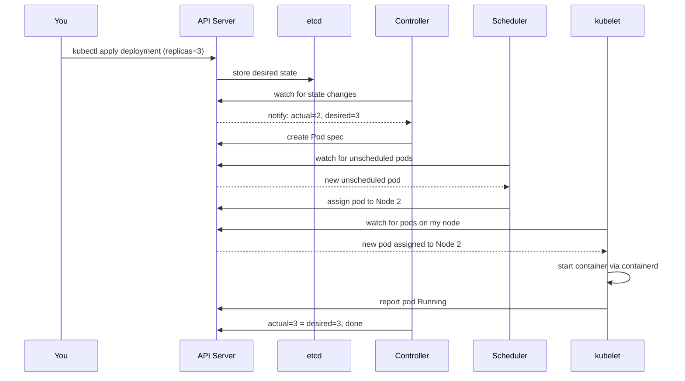
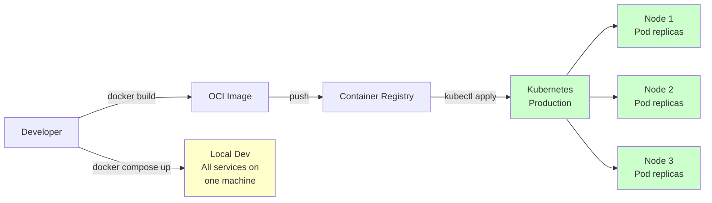
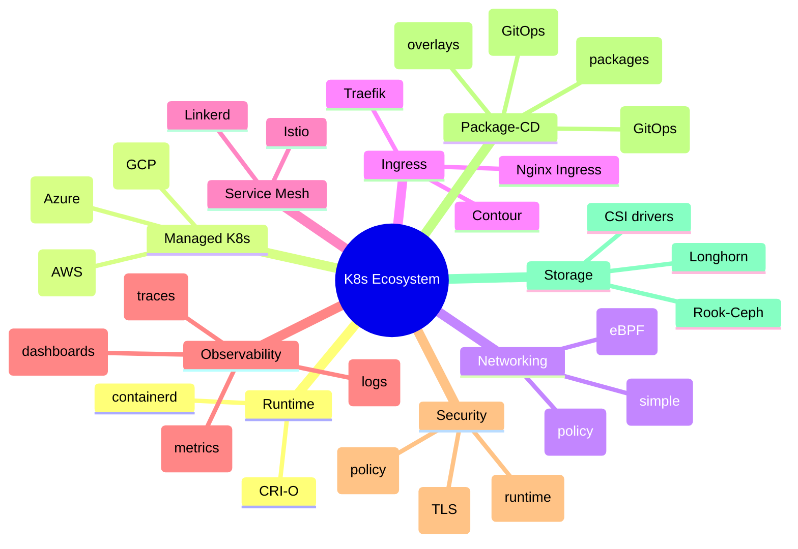

## Keywords in This File

{: .no_toc }

| # | Keyword | Weight |
|---|---------|--------|
| 1 | [What Kubernetes Is and Why It Exists](#what-kubernetes-is-and-why-it-exists) | high |
| 2 | [Kubernetes vs Docker vs Docker Compose](#kubernetes-vs-docker-vs-docker-compose) | medium |
| 3 | [Kubernetes Ecosystem Map](#kubernetes-ecosystem-map) | medium |

---

# What Kubernetes Is and Why It Exists

### 🎯 Model Answer

**30 seconds:**
> Kubernetes is an open-source container orchestration system. You package your
> application into Docker containers, and Kubernetes decides where to run them
> across a cluster of machines, keeps them healthy, restarts failed containers,
> and scales them up or down based on load. It solves the problem of running
> containers reliably in production across many machines without manual coordination.

**3 minutes (Senior):**
> Before Kubernetes, running containers in production meant writing your own tooling
> for scheduling containers across servers, health-checking them, restarting failures,
> handling machine outages, and rolling out new versions. Every team reinvented this
> wheel differently.
>
> Kubernetes (originally from Google, open-sourced in 2014, donated to CNCF) captures
> Google's 15-year experience running production workloads in containers. The core idea
> is "desired state": you declare what you want ("3 replicas of this service") and
> Kubernetes continuously works to make reality match that declaration. If a container
> dies, Kubernetes replaces it. If a node fails, Kubernetes reschedules pods elsewhere.
>
> The key insight: Kubernetes is not just a container runner - it is a distributed
> systems framework. It gives you service discovery, load balancing, rolling deployments,
> secret management, storage orchestration, and horizontal scaling out of the box.
> This is why it became the de-facto standard for cloud-native applications.
>
> The trade-off: Kubernetes has significant operational complexity. A single-node
> Docker run is simpler for one service. Kubernetes earns its cost at scale: when you
> have dozens of services, multiple teams, high-availability requirements, and need
> consistent deployment processes across environments.

**Framework:** WHAT -> WHY -> HOW -> TRADE-OFF -> EXAMPLE

*Adapting up:* Add the control loop architecture (controllers reconciling state),
the etcd-backed state store, how the scheduler works, and when Kubernetes is
overkill (monoliths, low-traffic services, teams with no DevOps expertise).

*Adapting down:* "Kubernetes runs containers reliably across many machines, keeps
them healthy, and scales them. Think of it as a fleet manager for containers."

**Blank Mind Recovery:**

**(1) Restate:** "You're asking what Kubernetes is - let me explain the problem it
solves and the core mechanism."

**(2) First principles:** "From first principles: containers solve packaging, but you
still need to schedule containers across machines, restart failures, and route traffic.
Kubernetes is the automation layer for all of that."

**(3) Bridge:** "This is like an airline operations center - the planes are your
containers, the airports are your nodes, and Kubernetes is the system that decides
which plane flies from which airport, reroutes if an airport closes, and maintains
the schedule."

---

### 📘 Concept Explanation

**What it is:**
Kubernetes (K8s) is an open-source platform for automating the deployment, scaling,
and operation of containerized applications across clusters of machines. It manages
the full lifecycle: scheduling, health-checking, networking, storage, and configuration.

**The problem it solves:**
Running one container on one machine is easy. Running hundreds of containers across
dozens of machines with high availability, zero-downtime deployments, autoscaling,
and consistent configuration is extremely hard. Before Kubernetes, teams wrote custom
scripts and tools for each concern. Kubernetes provides a standard, battle-tested
solution for all of them in a single platform.

**How it works:**
```
KUBERNETES CLUSTER
+------------------------------------------+
| Control Plane (masters)                  |
|  API Server <-- kubectl/CI               |
|  etcd       <-- persistent state         |
|  Scheduler  <-- assigns pods to nodes    |
|  Controllers<-- reconcile desired state  |
+------------------------------------------+
| Worker Nodes                             |
|  Node 1: [Pod A] [Pod B]                 |
|  Node 2: [Pod C] [Pod D]                 |
|  Node 3: [Pod E] [Pod F]                 |
+------------------------------------------+
```
You declare desired state via YAML manifests (e.g., "run 3 replicas of my-app").
The API Server stores this in etcd. The Scheduler assigns pods to nodes. Controllers
watch actual state and continuously reconcile it to match desired state. Kubelets on
each worker node execute the assignments and report status back.

**The key insight:**
Kubernetes operates on "desired state" not "imperative commands". You say what you
want, not how to get there. The system handles the "how" - scheduling, placement,
restart logic, rollout strategy. This declarative model means the cluster is
self-healing: if you declare 3 replicas and 1 crashes, Kubernetes starts a new one
without any human intervention.

**When to use it:**
- Microservices with multiple independent services to deploy and scale
- High-availability production systems requiring zero-downtime deployments
- Teams needing consistent deployment pipelines across dev/staging/prod environments
- Workloads with variable load requiring horizontal pod autoscaling
- Polyglot environments (multiple languages/runtimes) managed consistently

**When NOT to use it:**
- Single-service applications with steady traffic on a single server
- Small teams without DevOps/SRE capacity to operate a cluster
- Applications that cannot be containerized (legacy stateful apps with non-standard deps)
- Dev environments where Docker Compose is sufficient
- Serverless-appropriate workloads (event-driven, short-lived, bursty)

**Alternatives:**
- Docker Swarm - simpler orchestration, far less adoption, weaker ecosystem
- Amazon ECS - AWS-native, simpler than K8s, vendor lock-in
- Nomad (HashiCorp) - simpler, multi-workload (VMs + containers), smaller community
- Serverless (Lambda, Cloud Run) - no server management; suits stateless event-driven work

**First-principles derivation:**
Given (a) containers give us portable, isolated app packaging and (b) production
requires N containers distributed across M machines for availability, then we need
automation for: placement decisions (which container on which machine), failure
recovery (restart/reschedule on crash or node loss), traffic routing (find healthy
instances), and configuration management. These four needs derive exactly what
Kubernetes provides. Any production container platform must solve all four - and
Kubernetes solves them with a coherent, extensible design.

---

### 💻 Code Example

> **Code walkthrough:** This shows the minimal Kubernetes YAML for deploying a
> containerized application - the two most common resource types you write every day.
> The Deployment declares desired state (3 replicas, which image, resource limits).
> The Service exposes it within the cluster. Together they are the foundation of
> every Kubernetes application.

```yaml
# BAD: running directly with kubectl run (no YAML, no version control)
# kubectl run my-app --image=my-app:latest --port=8080
# This is fine for testing but has no rollback, no GitOps, no config reuse.
```

```yaml
# GOOD: Deployment + Service as declarative YAML
# deployment.yaml
apiVersion: apps/v1
kind: Deployment
metadata:
  name: my-app
  labels:
    app: my-app
spec:
  replicas: 3                    # desired state: 3 pods
  selector:
    matchLabels:
      app: my-app
  template:
    metadata:
      labels:
        app: my-app
    spec:
      containers:
      - name: my-app
        image: my-app:1.2.3      # always pin tag - never use :latest
        ports:
        - containerPort: 8080
        resources:
          requests:
            memory: "64Mi"
            cpu: "250m"
          limits:
            memory: "128Mi"
            cpu: "500m"
        readinessProbe:          # don't route traffic until ready
          httpGet:
            path: /health
            port: 8080
          initialDelaySeconds: 5
          periodSeconds: 10
---
# service.yaml
apiVersion: v1
kind: Service
metadata:
  name: my-app-svc
spec:
  selector:
    app: my-app                  # matches pod labels above
  ports:
  - port: 80
    targetPort: 8080
  type: ClusterIP                # internal-only; use LoadBalancer for external
```

> **Code walkthrough:** The Deployment object manages pod lifecycle - Kubernetes
> creates 3 pod replicas, monitors them, and replaces any that fail. Pinning the
> image tag (not `:latest`) ensures reproducible deployments. Resource requests
> allow the scheduler to make informed placement decisions; limits prevent one pod
> from starving neighbors. The readinessProbe prevents routing traffic to pods that
> haven't finished starting up - without it, requests hit pods mid-boot and fail.
> The Service provides stable DNS (`my-app-svc.default.svc.cluster.local`) regardless
> of which pods are currently running.

---

### 🎓 Answers by Seniority

**Junior / Mid (0-5 years):**
> Kubernetes is a container orchestration platform. You define what containers you
> want running, and Kubernetes keeps them running across a cluster. The main building
> blocks are Pods (one or more containers), Deployments (manages pod replicas and
> rolling updates), and Services (stable network endpoint for pods). kubectl is the
> command-line tool you use to deploy and manage everything.

*Push deeper:* Explain the difference between the control plane (API Server, Scheduler,
etcd) and worker nodes (where pods actually run), and why they are separated.

---

**Senior / Staff (5+ years):**
> Kubernetes implements the reconciliation loop pattern at scale: controllers
> continuously compare desired state (stored in etcd) with actual state (cluster
> reality) and take actions to close the gap. This is why Kubernetes is self-healing -
> it's not a one-shot deployer but a continuous control system. The trade-off is
> complexity: you need to understand pod scheduling, resource management, networking
> (CNI plugins), and storage (CSI) to operate it reliably. I've seen teams spend 3-6
> months getting Kubernetes production-ready, versus hours for a managed service like
> ECS or Cloud Run. My rule: K8s earns its cost when you have 10+ services, need
> multi-tenancy, or require capabilities (custom scheduling, operators) that simpler
> platforms don't provide.

*Push deeper:* Discuss operators (extending K8s with custom controllers for
stateful apps), admission webhooks (mutating/validating requests before
they hit etcd), and the CRD ecosystem.

---

### ⚠️ Common Misconceptions

**Misconception 1: "Kubernetes replaces Docker."**
Kubernetes uses Docker (or containerd, CRI-O) as the container runtime. Docker
builds and packages containers; Kubernetes orchestrates and schedules them. They
are complementary layers. Kubernetes does not build images - that remains a
Docker/buildah/Kaniko responsibility.

**Misconception 2: "Kubernetes makes applications highly available automatically."**
Kubernetes enables high availability but doesn't guarantee it. Your app must be
designed for HA: multiple replicas, stateless or properly externalized state,
graceful shutdown handling, readiness/liveness probes. A single-replica deployment
on Kubernetes has no more HA than a single container on a VM.

**Misconception 3: "Kubernetes manages your application's availability."**
Kubernetes manages pod-level availability (restarting failed pods). Application-level
availability - correct logic, handling partial failures, circuit breakers, retry
policies - is still your responsibility. A pod can be RUNNING and unhealthy if your
readiness probe doesn't reflect actual readiness.

**Misconception 4: "You need Kubernetes for every containerized application."**
A single microservice with steady traffic runs fine on Docker Compose or a managed
container service. Kubernetes is appropriate when orchestration complexity would
otherwise fall on your team - multi-service coordination, autoscaling, multi-env
consistency, and advanced deployment strategies (canary, blue-green).

---

### 🚨 Failure Modes and Diagnosis

**Failure 1: CrashLoopBackOff - pod keeps restarting**
Symptom: `kubectl get pods` shows `CrashLoopBackOff` status; restarts count climbing.
Cause: application crashes at startup (misconfiguration, missing env var, startup error).
Diagnostic: `kubectl logs <pod> --previous` (gets logs from crashed container),
`kubectl describe pod <pod>` (shows exit code and reason).
Fix: read logs to find the crash cause; check ConfigMaps, Secrets, and env vars.
Prevention: test image locally (`docker run`) before deploying to cluster.

**Failure 2: ImagePullBackOff - container image can't be fetched**
Symptom: pod stuck in `ImagePullBackOff` or `ErrImagePull` state.
Cause: wrong image tag, private registry without credentials, registry quota exceeded.
Diagnostic: `kubectl describe pod <pod>` shows the exact pull error in Events.
Fix: verify image exists (`docker pull` the exact tag); create `imagePullSecret`
for private registries and reference it in the pod spec.

**Failure 3: Pending pods - scheduler can't find a node**
Symptom: pods stay in `Pending` state indefinitely.
Cause: insufficient cluster resources (CPU/memory), node selectors with no
matching nodes, PVC that can't be bound.
Diagnostic: `kubectl describe pod <pod>` - Events section shows why scheduling failed.
`kubectl describe nodes` to check available capacity.
Fix: scale up node pool, adjust resource requests, or relax node affinity constraints.

---

### 🎯 Interview Deep-Dive

| Question Category | Time to Answer |
|---|---|
| Definition | 30-60 seconds |
| Mechanism | 1-2 minutes |
| Comparison | 1-2 minutes |
| Scenario | 2-3 minutes |
| Debugging | 2-3 minutes |
| Trade-off | 1-2 minutes |
| Ecosystem | 1-2 minutes |

---

**Q1 [JUNIOR] (Definition): What is Kubernetes and what problem does it solve?**

A: Kubernetes is an open-source container orchestration platform. The problem it
solves is production container management at scale. Running one container locally is
easy - Docker handles that. The challenge is running hundreds of containers across
dozens of servers reliably: scheduling them onto the right machines, restarting them
when they crash, routing traffic to healthy instances, rolling out new versions without
downtime, and scaling when load increases.

Before Kubernetes, teams wrote custom tooling for each of these concerns. Kubernetes
provides a standard, battle-tested platform for all of them. It was created at Google
based on their Borg internal system (which ran Google's production workloads for a
decade), open-sourced in 2014, and donated to the CNCF.

The core mechanic is "desired state": you declare what you want (3 replicas of
this container) and Kubernetes continuously works to make reality match that
declaration. If a container crashes, it starts a new one. If a node fails, it
reschedules pods to healthy nodes.

*What separates good from great:* Mentioning the declarative vs imperative distinction -
Kubernetes is declarative (you describe the goal) not imperative (you describe the
steps). This is why it's self-healing.

---

**Q2 [MID] (Mechanism): How does Kubernetes decide where to run a pod?**

A: Pod scheduling is done by the kube-scheduler, which runs as part of the control
plane. When you create a pod, the API Server stores it in etcd with no Node assignment.
The scheduler watches for unscheduled pods via the API Server's watch mechanism.

For each unscheduled pod, the scheduler runs two phases:

Filtering: eliminates nodes that can't run the pod. Filters include: Does the node
have enough CPU and memory (vs the pod's resource requests)? Does the node match
node selectors and affinity rules? Are taints on the node tolerated by the pod?
Is the node Ready?

Scoring: ranks the remaining nodes by multiple factors: how many resources are
available (spread load evenly), whether preferred affinity rules are satisfied,
whether image is already cached on the node, topology spread constraints.

The scheduler picks the highest-scoring node and updates the pod's `spec.nodeName`
field in etcd. The kubelet on that node watches for pods assigned to it and starts
them via the container runtime (containerd/CRI-O).

Critical detail: the scheduler uses resource *requests* (not limits) for placement
decisions. A pod requesting 100m CPU and 64Mi memory will be scheduled on a node
that has that capacity free, even if the actual usage is much lower or higher.

*What separates good from great:* Knowing that resource requests are the scheduling
currency - underspecifying requests causes over-scheduling (nodes become overcommitted);
overspecifying causes under-utilization.

---

**Q3 [MID] (Comparison): When would you choose Kubernetes over Docker Compose?**

A: Docker Compose is the right choice when you have a small number of services
(2-10), you're running on a single machine or simple setup, and you don't need
automatic failover or multi-machine distribution. It's excellent for local
development, integration testing, and small production workloads with stable traffic.

Kubernetes is the right choice when you need: (1) High availability - pods spread
across multiple nodes so node failure doesn't take down the service. (2) Horizontal
autoscaling - HPA scales replica count based on CPU/memory/custom metrics.
(3) Zero-downtime deployments - rolling updates with readiness gates.
(4) Multi-environment consistency - the same YAML manifests work across dev, staging,
and prod (with env-specific configuration via ConfigMaps). (5) Advanced scheduling -
placing pods on specific node types (GPU nodes, spot instances).

The deciding factor: the number of services and the operational requirements.
With 3-5 services on a single server and no HA requirement, Docker Compose is less
complex and easier to understand. With 10+ services requiring HA, autoscaling, and
multi-environment deployment, Kubernetes pays for its complexity.

*What separates good from great:* Acknowledging that managed Kubernetes (EKS, GKE, AKS)
significantly lowers the operational cost - you don't manage control plane upgrades
or etcd backups. This changes the cost calculus considerably vs self-managed K8s.

---

**Q4 [MID] (Scenario): A pod in your cluster keeps restarting every few minutes.
Walk me through how you would diagnose it.**

A: My systematic approach to CrashLoopBackOff:

Step 1: Check the pod status and restart count.
`kubectl get pod <pod-name> -n <namespace>` - confirm the state is
CrashLoopBackOff and check how many restarts.

Step 2: Get logs from the *previous* (crashed) container, not the current one.
`kubectl logs <pod-name> --previous` - this shows what the container printed
before it exited. The error message here usually gives the root cause directly.

Step 3: Describe the pod to see exit codes and Kubernetes events.
`kubectl describe pod <pod-name>` - look at "Last State" (exit code, finished
time) and the "Events" section. Exit code 1 = application error. Exit code 137 =
OOM killed (memory limit exceeded). Exit code 139 = segfault.

Step 4: Check for configuration issues.
If logs show "missing env var" or "can't connect to DB": check that referenced
ConfigMaps and Secrets exist and have the expected keys.

Step 5: Try to reproduce locally.
`docker run` the same image with the same environment variables. If it crashes
locally too, it's an application bug, not a Kubernetes configuration issue.

Common root causes in my experience: missing environment variables, Secret not
found (name typo), memory limit too low (OOMKilled), startup probe timeout too
aggressive, or a configuration file that isn't mounted correctly.

*What separates good from great:* Knowing that `--previous` is critical - the current
container was just restarted and may not have logged anything yet. Debugging without
`--previous` means you're looking at an empty log file.

---

**Q5 [SENIOR] (Debugging): Your deployment has 3 replicas but all traffic is going
to only one pod. How would you investigate?**

A: Uneven traffic distribution usually traces to service selector misconfiguration,
network policy, or session affinity settings.

First check: Service selector matching.
`kubectl get endpoints <service-name>` - this shows which pod IPs the Service has
selected. If only one pod IP appears, the Service selector labels don't match
the labels on the other pods.

Compare: `kubectl describe service <service-name>` (shows selector) vs
`kubectl get pods --show-labels` (shows pod labels). Any mismatch means those
pods are not in the endpoint pool.

Second check: Readiness probe status.
Pods not passing their readiness probe are automatically removed from service
endpoints. `kubectl describe pod <pod-name>` shows readiness probe results.
If 2 pods are failing readiness, the service correctly routes only to the healthy one.

Third check: Session affinity.
`kubectl describe service <service-name>` - if `sessionAffinity: ClientIP`,
all requests from the same source IP go to the same pod. Expected behavior,
but often surprising when testing from one machine.

Fourth check: Network policy.
A NetworkPolicy might allow ingress to only specific pod labels, effectively
filtering which pods receive traffic.

*What separates good from great:* Starting with `kubectl get endpoints` rather than
guessing - endpoints are the ground truth for which pods a Service routes to.

---

**Q6 [SENIOR] (Trade-off): What are the operational costs of running Kubernetes
vs a managed container service like AWS ECS or Google Cloud Run?**

A: Three dimensions of operational cost:

Control plane management: Self-managed Kubernetes requires you to: upgrade
control plane components (API Server, etcd, scheduler) separately from worker
nodes, manage etcd backup and restore, handle control plane HA, and diagnose
control plane failures. Managed K8s (EKS, GKE, AKS) handles this - you only
manage node pools. Cloud Run/ECS removes even node management.

Networking complexity: Kubernetes networking involves CNI plugins (Flannel,
Calico, Cilium), service discovery via CoreDNS, ingress controllers, and
NetworkPolicies. Each layer has configuration and failure modes. ECS networking
is simpler (AWS handles VPC integration). Cloud Run has no networking to configure.

Expertise requirement: Operating Kubernetes requires understanding pod scheduling,
resource quotas, RBAC, admission webhooks, storage classes, and PVC binding.
This is a non-trivial learning curve - typically 2-3 engineers dedicating
significant time to become proficient. ECS requires understanding task definitions
and service auto-scaling. Cloud Run requires essentially nothing.

The ROI equation: Kubernetes is worth the operational cost when you need
capabilities it uniquely provides: custom scheduling, node affinity, stateful
workloads (StatefulSets), operator pattern for stateful infrastructure, or
multi-tenancy with fine-grained RBAC. If none of these apply, a managed
service reduces cost and cognitive load.

*What separates good from great:* Quantifying the cost: a dedicated SRE to manage
a production Kubernetes cluster costs significantly more than the incremental price
of a managed service. The comparison is not just infrastructure cost but team capacity.

---

**Q7 [STAFF] (Ecosystem): What is the CNCF and how does it shape the Kubernetes
ecosystem?**

A: The CNCF (Cloud Native Computing Foundation), a Linux Foundation project,
is the governance body for Kubernetes and 100+ other cloud-native projects.
Its role: vendor-neutral stewardship, project maturity graduation
(Sandbox -> Incubating -> Graduated), and defining "cloud native" as a concept.

The CNCF landscape defines the ecosystem: every Kubernetes-related capability has
multiple CNCF projects addressing it. Networking: Cilium, Calico, Flannel, Linkerd,
Istio. Observability: Prometheus (metrics), Grafana (dashboards), Jaeger (tracing),
Fluentd (logging). Security: Falco (runtime security), OPA/Gatekeeper (policy).
Service mesh: Istio, Linkerd. GitOps: ArgoCD, Flux. Registry: Harbor.

Why this matters for interviews: interviewers at companies using Kubernetes will
ask about your experience with these ecosystem tools, not just K8s itself. Knowing
the landscape - and the rationale for choosing one project over another (e.g.,
Cilium over Flannel for eBPF-based networking with better observability) - signals
production depth.

The architectural implication: Kubernetes by itself is a foundation, not a complete
platform. A production cluster typically has 10-20 additional components from the
CNCF ecosystem. Understanding which components solve which problems, and why
certain stacks are common (e.g., Prometheus + Grafana + Loki + Tempo for full
observability), is what separates a K8s user from a K8s operator.

*What separates good from great:* Understanding that CNCF graduation status indicates
production readiness and community health - a Graduated project has demonstrated
stability, adoption, and governance. Choosing Sandbox projects for production carries
risk.

---

### ⚖️ Comparison Table

*(Omit: L0 orientation keyword - comparison between Kubernetes and alternatives
is covered in the next keyword. See L2+ files for detailed architecture comparisons.)*

---

### 🏛️ System Design

*(Omit: L0 orientation keyword - not applicable at foundational level.
See L4/L5 files for Kubernetes system design and architecture patterns.)*

---

### 📊 Diagram

```
The Kubernetes Desired State Loop:

You declare:                       etcd stores:
"3 replicas of app:v2"  -->  API Server --> { replicas: 3, image: v2 }
                                                    |
                                              Controller watches
                                                    |
                                    Actual: 2 running pods (1 crashed)
                                                    |
                                         Controller creates pod 3
                                                    |
                                          Scheduler assigns to Node 2
                                                    |
                                         kubelet starts container
                                                    |
                                    Actual: 3 running pods = DESIRED
```



> **Diagram walkthrough:** The reconciliation loop is the heart of Kubernetes.
> You submit desired state to the API Server, which persists it in etcd. Controllers
> continuously watch actual state (via API Server watch) and compare to desired.
> When they diverge (a pod died), the controller creates a new pod spec. The scheduler
> claims the unscheduled pod and assigns it to a node. The kubelet on that node
> starts the container. The loop closes when actual matches desired. Every K8s
> operation follows this pattern - it's not "run this command once" but "declare
> what you want and trust the system to converge."

---
---

# Kubernetes vs Docker vs Docker Compose

### 🎯 Model Answer

**30 seconds:**
> Docker builds and runs containers on a single machine. Docker Compose orchestrates
> multiple containers together on a single machine. Kubernetes orchestrates containers
> across a cluster of machines with automatic scheduling, self-healing, and scaling.
> They solve different problems at different scales: Docker = packaging, Compose =
> local multi-service dev, Kubernetes = production fleet management.

**3 minutes (Senior):**
> These three tools operate at different abstraction layers, solving different problems.
> Docker is the container runtime and build tool - it creates OCI images and runs
> containers on a single host. Docker Compose is a developer experience tool for
> running multi-service applications locally - one YAML file defines all services,
> networks, and volumes, and `docker compose up` starts everything. Kubernetes is
> a production orchestration platform for running containers across a fleet of machines.
>
> The confusion: Docker Compose uses a YAML format that looks superficially similar to
> Kubernetes YAML, but they're fundamentally different. Compose runs everything on one
> machine with no HA. Kubernetes distributes across machines with self-healing,
> autoscaling, and network abstraction.
>
> The architecture decision: Docker alone for local dev and CI. Compose for local
> multi-service development and integration testing. Kubernetes (or a managed service
> like ECS or Cloud Run) for production. Most teams use all three - Docker for image
> building, Compose for local development, Kubernetes for production.

**Framework:** WHAT -> WHY -> HOW -> TRADE-OFF -> EXAMPLE

*Adapting up:* Add containerd and CRI - Kubernetes doesn't use Docker directly
anymore (Dockershim was removed in K8s 1.24). K8s uses the CRI (Container Runtime
Interface) and works with containerd or CRI-O.

*Adapting down:* "Docker = one container on one machine. Compose = many containers
on one machine. Kubernetes = many containers on many machines."

**Blank Mind Recovery:**

**(1) Restate:** "You're asking about the difference between Docker, Compose, and
Kubernetes - let me frame it by the problem each one solves."

**(2) First principles:** "Containers need: a way to build them (Docker build),
a way to run multiple locally (Compose), and a way to run them at scale across
many machines with reliability (Kubernetes)."

**(3) Bridge:** "Think of it like restaurant logistics: Docker is the kitchen
(cooking individual dishes), Compose is the kitchen coordinating all stations
for a meal service, and Kubernetes is managing 50 restaurants across the city."

---

### 📘 Concept Explanation

**What it is:**
Docker, Docker Compose, and Kubernetes are complementary tools in the container
ecosystem. Docker is a container runtime and image build tool. Docker Compose is a
tool for defining and running multi-container applications on a single machine.
Kubernetes is a container orchestration platform for managing containers across
a cluster of machines.

**The problem it solves:**
Each tool addresses a different scope:
- Docker solves: "How do I package my app with all its dependencies and run it
  reproducibly on any machine?"
- Docker Compose solves: "How do I run my multi-service app locally (app + db +
  cache) without manually starting each container?"
- Kubernetes solves: "How do I run my multi-service app reliably across N machines
  in production, with HA, autoscaling, and zero-downtime deploys?"

**How it works:**
```
Docker (single-host):
  docker build -> image -> docker run -> container on THIS machine

Docker Compose (single-host, multiple containers):
  docker-compose.yml -> defines services, networks, volumes
  docker compose up -> starts all containers on THIS machine

Kubernetes (multi-host, cluster):
  YAML manifests -> kubectl apply -> API Server -> etcd
  Scheduler distributes pods across N nodes
  Controllers maintain desired state across failures
```

**The key insight:**
Docker Compose was NOT designed for production and does not provide high availability.
If the machine running your Compose setup goes down, your application is down.
Kubernetes distributes pods across multiple nodes so a single node failure does not
take down your service. This is the fundamental architectural difference.

**When to use it:**
- Docker: always - for building images, CI/CD, and as the runtime beneath Compose/K8s
- Docker Compose: local development, integration tests, small single-server productions
- Kubernetes: multi-service production with HA, autoscaling, and multi-environment needs

**When NOT to use it:**
- Don't use Docker Compose as a production deployment strategy for critical services
- Don't use Kubernetes for a simple app that fits on one machine
- Don't use raw Docker for multi-service orchestration - that's what Compose is for

**Alternatives:**
- Podman Compose - rootless Docker Compose alternative, compatible format
- Docker Swarm - multi-machine orchestration built into Docker, far less popular than K8s
- Managed services (ECS, Cloud Run, Fly.io) - abstract away orchestration entirely

**First-principles derivation:**
Containers need four things: a build format (Docker image), a local run mechanism
(docker run), a way to compose multiple services locally (Compose), and a way to
run reliably across machines in production (Kubernetes). These are distinct concerns
at distinct scales - which is exactly why they're separate tools.

---

### 💻 Code Example

> **Code walkthrough:** Comparing equivalent configurations across Docker Compose
> and Kubernetes for the same 2-service application shows the conceptual mapping
> and the critical differences. Compose is simpler but single-host. Kubernetes
> adds replicas, resource management, and self-healing at the cost of more YAML.

```yaml
# Docker Compose (single machine, no HA)
# docker-compose.yml
version: '3.8'
services:
  web:
    image: my-app:1.2.3
    ports:
      - "8080:8080"
    environment:
      - DB_URL=postgres://db:5432/mydb
    depends_on:
      - db
  db:
    image: postgres:15
    environment:
      - POSTGRES_PASSWORD=secret
    volumes:
      - pgdata:/var/lib/postgresql/data
volumes:
  pgdata:
```

```yaml
# Kubernetes equivalent (multi-machine, HA)
# web-deployment.yaml
apiVersion: apps/v1
kind: Deployment
metadata:
  name: web
spec:
  replicas: 3          # HA: 3 pods across nodes
  selector:
    matchLabels:
      app: web
  template:
    metadata:
      labels:
        app: web
    spec:
      containers:
      - name: web
        image: my-app:1.2.3
        env:
        - name: DB_URL
          valueFrom:
            secretKeyRef:       # secure: use Secret not plaintext
              name: db-secret
              key: url
        resources:
          requests: {cpu: "250m", memory: "128Mi"}
          limits: {cpu: "500m", memory: "256Mi"}
---
apiVersion: v1
kind: Service
metadata:
  name: web
spec:
  selector:
    app: web
  ports:
  - port: 8080
    targetPort: 8080
```

> **Code walkthrough:** The Compose version is minimal - services, env vars, volumes
> in 20 lines. No concept of replicas, resource limits, or secrets management.
> The Kubernetes version adds three replicas for availability, uses a Secret for the
> database URL (never put passwords in Deployment YAML), and specifies resource
> requests/limits for scheduler placement. The Kubernetes version is more verbose
> but provides HA, rollback, resource governance, and secrets security that Compose
> cannot.

---

### 🎓 Answers by Seniority

**Junior / Mid (0-5 years):**
> Docker builds and runs containers. Docker Compose runs multiple containers together
> on one machine - great for local dev with a web app plus database plus cache.
> Kubernetes orchestrates containers across multiple machines in production, handling
> failures, scaling, and deployments. Most teams use all three: Docker for building
> images, Compose for local dev, and Kubernetes for production.

*Push deeper:* Explain that Docker Swarm was Docker's answer to Kubernetes but lost
the "container wars" - Kubernetes won and is now the standard.

---

**Senior / Staff (5+ years):**
> Docker and Compose were never designed for production multi-machine orchestration.
> Docker Compose has no concept of node failure, cross-machine networking, or persistent
> storage that survives pod rescheduling. Kubernetes fills all these gaps but at
> significant complexity cost. The architectural decision I make repeatedly: use managed
> services (EKS, GKE) to absorb the control-plane complexity, leaving teams to manage
> only workloads. One important nuance: Kubernetes removed Dockershim in 1.24 - it now
> speaks CRI directly to containerd or CRI-O, so you can run K8s without Docker installed.
> Docker is a build and development tool; containerd is the production runtime.

*Push deeper:* Discuss the OCI (Open Container Initiative) standard - because Docker
images are OCI-compliant, they run on containerd, podman, and CRI-O without Docker.

---

### ⚠️ Common Misconceptions

**Misconception 1: "Docker Compose is a production deployment tool."**
Docker Compose is a developer tool. It has no HA, no node failure handling, no
autoscaling, no rolling updates, and no service mesh. Teams have deployed Compose
to production and found it fails silently when the single machine has issues.
For production multi-service: use Kubernetes, ECS, or a managed alternative.

**Misconception 2: "Kubernetes requires Docker."**
Since Kubernetes 1.24, Dockershim was removed. Kubernetes uses the Container
Runtime Interface (CRI) and works with containerd or CRI-O directly. Docker is
still used to BUILD images (which are OCI-compatible and run on any CRI runtime),
but Docker is not required at runtime on Kubernetes nodes.

**Misconception 3: "docker-compose.yml converts directly to Kubernetes YAML."**
While tools like Kompose can translate, the mental models differ significantly.
Compose `depends_on` has no K8s equivalent (use init containers or retry logic).
Compose volumes map to K8s PVCs differently. Compose networking is flat; K8s
networking involves Services, Ingress, and NetworkPolicies. Direct conversion
produces K8s YAML that misses important production considerations.

**Misconception 4: "Kubernetes is always the better choice."**
For a 2-service startup with 3 engineers and moderate traffic, Docker Compose on
a single VM or a managed service (Cloud Run, Fly.io) is simpler, cheaper, and
easier to operate. Kubernetes is the right choice at scale and complexity - not
by default.

---

### 🚨 Failure Modes and Diagnosis

**Failure 1: Docker Compose "works locally" but fails in Kubernetes**
Symptom: app works with `docker compose up` but pod crashes in Kubernetes.
Common causes: (a) Compose was reading local files that don't exist in the K8s
cluster. (b) Compose used host networking (`network_mode: host`) - doesn't apply
in K8s. (c) Service names as hostnames work in Compose (`http://db:5432`) but
in K8s require proper Service objects.
Diagnostic: compare environment variables, volume mounts, and network config
between Compose and Kubernetes manifests.

**Failure 2: Running containers as root in Kubernetes**
Symptom: security scan flags or Pod Security Admission (PSA) blocks pod creation.
Cause: Dockerfile doesn't set USER directive; container runs as root (UID 0).
This is fine in Docker Compose but violates Kubernetes security policies in
hardened clusters.
Fix: add `USER nonroot` to Dockerfile; set `securityContext.runAsNonRoot: true`
in pod spec.

**Failure 3: Hardcoded localhost references that break in Kubernetes**
Symptom: service can't connect to another service; works in Compose.
Cause: code or config uses `localhost:8080` to reach another service. In Compose,
all services share a network; `localhost` might work. In Kubernetes, pods have
separate IPs; you must use the Kubernetes Service DNS name
(`http://service-name.namespace.svc.cluster.local`).
Fix: use Kubernetes Service names for inter-service communication.

---

### 🎯 Interview Deep-Dive

| Question Category | Time to Answer |
|---|---|
| Definition | 30-60 seconds |
| Mechanism | 1-2 minutes |
| Comparison | 1-2 minutes |
| Scenario | 2-3 minutes |
| Debugging | 1-2 minutes |
| Trade-off | 1-2 minutes |
| Advanced | 1-2 minutes |

---

**Q1 [JUNIOR] (Definition): What's the difference between Docker and Kubernetes?**

A: Docker is a tool for building and running containers on a single machine. When you
run `docker build`, it packages your application into an image. When you run
`docker run`, it starts a container from that image on your local machine.

Kubernetes is a tool for running containers across multiple machines reliably. It
decides which machine to run each container on, restarts containers when they fail,
scales them up and down based on load, and routes traffic to healthy instances.

The analogy: Docker is the shipping container standard - it defines a portable,
standardized package. Kubernetes is the port authority - it decides where containers
are loaded, unloaded, and moved, and manages the whole logistics operation.

In practice, Docker builds the image; Kubernetes runs it in production. They're
complementary - not competing.

*What separates good from great:* Knowing that Kubernetes 1.24+ doesn't use Docker
as the runtime - it uses containerd directly via the CRI interface. Docker is still
used to build OCI-compliant images, but the runtime on Kubernetes nodes is containerd.

---

**Q2 [MID] (Mechanism): How does Kubernetes handle a failing container differently than Docker Compose?**

A: Docker Compose handles container failure with a restart policy (no, always, on-failure,
unless-stopped). If configured with `restart: always`, Compose restarts the failed
container on the same machine. That's it - same machine, same network, no rescheduling.

Kubernetes handles failure with multiple layers of recovery:

Pod-level: kubelet restarts failed containers with exponential backoff (CrashLoopBackOff).
The container is restarted on the same node initially.

Deployment-level: if the node itself fails, the Deployment controller detects that
replicas are missing (by watching the API Server) and creates replacement pods.
The scheduler assigns them to healthy nodes.

Self-healing: Kubernetes continuously reconciles. If a pod becomes unhealthy (fails
readiness probe), it's removed from Service endpoints so traffic stops hitting it.
If it stays unhealthy, the controller may restart or reschedule it.

The key difference: Docker Compose has no concept of a node failing. If your machine
dies, everything running on it is gone and you must manually restart it. Kubernetes
distributes replicas across nodes so a single node failure only affects a fraction
of your pods, and the remaining replicas continue serving traffic while Kubernetes
reschedules the lost ones.

*What separates good from great:* Describing the readiness probe integration - Kubernetes
not only restarts failed containers but also removes unhealthy-but-running containers
from service endpoints, protecting users from requests to degraded pods.

---

**Q3 [MID] (Trade-off): When is Docker Compose the better choice for production?**

A: Docker Compose is the right production choice when the workload is simple enough
that its limitations don't matter:

Single service with no HA requirement: a low-traffic internal tool or batch job
that can afford brief downtime for restarts. Running Docker Compose on a single
server with `restart: always` is far simpler to operate than a Kubernetes cluster.

Team without Kubernetes expertise: the operational cost of running Kubernetes
correctly (upgrades, RBAC, monitoring, PVCs, network policies) requires dedicated
expertise. For small teams, that cost exceeds the benefit for modest workloads.

Cost sensitivity: a single VM running Docker Compose costs $20-50/month. A minimum
viable Kubernetes cluster (3 nodes for HA control plane + workers) costs several
hundred dollars per month.

The honest answer: Docker Compose in production is understandable when the
alternative is poorly configured Kubernetes that nobody on the team understands.
A simple, well-understood system beats a complex, poorly-operated one. I've seen
more production incidents caused by misconfigured Kubernetes than by the limitations
of Docker Compose for small workloads.

*What separates good from great:* Discussing managed alternatives - Google Cloud Run,
Fly.io, Railway - that provide most of Kubernetes' production benefits (rolling deploys,
health checks, autoscaling) without the operational overhead. These are often the
right choice between "Docker Compose" and "full Kubernetes".

---

**Q4 [SENIOR] (Debugging): Your team migrated from Docker Compose to Kubernetes.
Networking between services is broken. Where do you start?**

A: Three most common networking migration failures, in order of frequency:

First check: Service objects exist and selectors match.
In Compose, services communicate using the service name as hostname (e.g., `http://db`).
In Kubernetes, this still works but requires a Service object with the right name.
`kubectl get services -n <namespace>` to confirm Services exist.
`kubectl get endpoints <service-name>` to confirm pods are selected (non-empty
endpoint list means the selector matches running pods).

Second check: Namespace DNS format.
In Kubernetes, the full DNS is `<service>.<namespace>.svc.cluster.local`. Within
the same namespace, just `<service>` works. But if services are in different
namespaces, you must use the full qualified name. Check if the services are in
different namespaces than expected: `kubectl get pods -A` to see all namespaces.

Third check: NetworkPolicy blocking traffic.
If the cluster uses NetworkPolicies, the default behavior after migration may be
"deny all". Check: `kubectl get networkpolicies -n <namespace>`. A NetworkPolicy
that allows only specific egress/ingress patterns may be blocking the communication.

Fourth check: Port mismatches.
Compose uses `ports: [hostPort:containerPort]`. K8s Service `port` (service-facing)
can differ from `targetPort` (container-facing). Verify: `kubectl describe service
<service>` shows both ports and the targetPort matches the container's actual listening
port.

*What separates good from great:* Using `kubectl exec` to debug directly: `kubectl
exec -it <pod> -- curl http://service-name:port/health` lets you test connectivity
from inside the cluster, ruling out external routing issues.

---

**Q5 [SENIOR] (Scenario): A startup wants to move from Docker Compose to Kubernetes.
What's your migration plan?**

A: Migration phases:

Phase 1 - Containerization audit: ensure all services have Dockerfiles that produce
OCI-compliant images (no host-path dependencies, no root requirement, proper
health check endpoints). Run everything with `docker run` in isolation before
involving Kubernetes.

Phase 2 - Kubernetes manifests: for each Compose service, create Deployment + Service.
Map Compose environment variables to K8s ConfigMaps (non-sensitive) and Secrets
(sensitive). Map Compose volumes to PersistentVolumeClaims.

Phase 3 - Local validation: use minikube or kind (Kubernetes in Docker) to validate
manifests locally before touching production. Test probe behavior, service DNS,
and rolling updates.

Phase 4 - Staging environment: deploy to a staging K8s cluster. Run integration
tests. Validate cross-service connectivity, secret injection, and scaling behavior.

Phase 5 - Production cutover: blue-green or canary deploy. Keep Compose running as
fallback for 48h. Monitor error rates and latency.

Phase 6 - Cleanup: remove Docker Compose setup, update runbooks, train team on
kubectl debugging.

Common migration mistakes: trying to migrate all services at once (migrate one at
a time), not setting resource requests/limits (scheduler can't place pods properly),
and forgetting persistent storage (StatefulSets for databases, PVCs for data).

*What separates good from great:* Recommending migrating to a managed K8s service
(EKS, GKE) rather than self-managed, and using Helm for managing K8s manifests
from day one rather than raw kubectl apply.

---

**Q6 [STAFF] (Trade-off): What are the security implications of the Docker Compose
to Kubernetes migration that teams often miss?**

A: Three security gaps that commonly appear:

Container privilege: Docker Compose often runs containers as root (the default)
without issue. Kubernetes clusters with Pod Security Admission in Restricted mode
will reject root containers. Teams discover this only when pods fail to start.
Audit Dockerfiles upfront: every container should have `USER nonroot` and a
non-zero UID.

Secret management: Compose uses `.env` files or inline env vars - both end up
in compose files that get committed to git. Kubernetes Secrets are base64-encoded
(not encrypted) in etcd by default. Teams migrate secrets from .env to K8s Secrets
without enabling etcd encryption at rest or using an external secret store (Vault,
AWS Secrets Manager via External Secrets Operator). The migration should include
a secrets strategy, not just format translation.

Network exposure: Docker Compose typically exposes services via host ports. In
Kubernetes, LoadBalancer services create cloud load balancers for every service,
generating unexpected costs and unnecessary public exposure. Use ClusterIP for
internal services, a single Ingress controller for external traffic, and
NetworkPolicies to restrict inter-pod communication to the minimum required.

RBAC: a Compose-to-K8s migration often starts with admin-level kubectl access
for everyone. Define RBAC from the start: developers get read-only access to
their namespace; CI/CD pipelines get deploy-only access to specific namespaces;
ops get broader but audited access.

*What separates good from great:* Recommending a security review before migration
using tools like `kube-score`, `polaris`, or `kubesec` to validate manifests against
security best practices before they ever reach production.

---

**Q7 [STAFF] (Deep Dive): Kubernetes 1.24 removed Dockershim. What changed
and why does it matter?**

A: Before K8s 1.24, Kubernetes used Docker as the container runtime via "Dockershim" -
a shim layer in kubelet that translated between the Kubernetes Container Runtime
Interface (CRI) and the Docker daemon API. Docker itself runs containerd internally.
So the actual flow was: kubelet -> Dockershim -> Docker daemon -> containerd.

Dockershim was removed because: (1) Maintaining a Docker-specific integration layer
was costly and imposed the entire Docker daemon overhead on K8s nodes. (2) Docker is
not CRI-compliant natively. (3) containerd and CRI-O are lighter, CRI-native runtimes
that skip the intermediate Docker layer. The new flow: kubelet -> containerd (or CRI-O)
directly - two steps, not four.

What changed operationally: Docker doesn't need to be installed on K8s worker nodes
anymore. `docker ps` on a node doesn't show running containers - use `crictl ps`
instead. If your CI pipeline builds images on K8s nodes using Docker socket mounting
(a common but terrible security practice), it breaks. Replace with Kaniko, Buildah,
or img for in-cluster builds.

What didn't change: Docker-built images are OCI-compliant and run unchanged on
containerd. You still use `docker build` locally; the images run fine in Kubernetes.
The only change is the runtime on the K8s worker nodes.

Why it matters: cluster operators need to update their tooling (`docker` -> `crictl`
on nodes), update node setup scripts that install Docker, and ensure any in-cluster
build pipelines don't rely on the Docker socket.

*What separates good from great:* Knowing that Docker Desktop still uses containerd
internally and can be configured to use the Kubernetes-compatible containerd directly -
closing the gap between local development and cluster behavior.

---

### ⚖️ Comparison Table

*(Omit: L0 foundational comparison keyword - detailed comparison table covered
within the keyword content above. See L2+ files for deeper orchestration
platform comparison tables.)*

---

### 🏛️ System Design

*(Omit: L0 foundational keyword - not applicable at this level.
See L4/L5 files for production system design patterns with Kubernetes.)*

---

### 📊 Diagram

```
Container tooling layers:

BUILD             LOCAL DEV          PRODUCTION
+----------+    +--------------+   +------------------+
| Docker   |    | Docker       |   | Kubernetes       |
| docker   |    | Compose      |   |  Control Plane   |
| build    |    |              |   |  +API Server      |
| image    |    | web: my-app  |   |  +Scheduler       |
| push     |--> | db: postgres |-->|  +Controllers     |
|          |    | cache: redis |   |  Worker Nodes     |
| OCI      |    |              |   |  +Node 1: pods    |
| image    |    | Single host  |   |  +Node 2: pods    |
+----------+    +--------------+   |  +Node 3: pods    |
                No HA, no scale    +------------------+
                                   HA, autoscale, multi-machine
```



> **Diagram walkthrough:** Docker handles the left side - building OCI images and
> pushing to a registry. Docker Compose handles local development - all services on
> one machine with no HA. Kubernetes handles the right side - pulling images from
> the registry and distributing pods across multiple nodes with HA and scaling.
> The image format is the same OCI standard throughout; only the runtime environment
> changes from single-machine (Compose) to multi-machine cluster (Kubernetes).

---
---

# Kubernetes Ecosystem Map

### 🎯 Model Answer

**30 seconds:**
> The Kubernetes ecosystem is organized around the CNCF (Cloud Native Computing
> Foundation) and covers: the core K8s distribution, managed services (EKS, GKE, AKS),
> networking (CNI plugins, service mesh), storage (CSI drivers), observability
> (Prometheus, Grafana, Jaeger), security (OPA/Gatekeeper, Falco), package management
> (Helm), and GitOps tooling (ArgoCD, Flux). The ecosystem extends K8s to cover
> every production concern.

**3 minutes (Senior):**
> Kubernetes core provides the orchestration engine, but a production cluster needs
> a full ecosystem of components. Let me map the major layers:
>
> Runtime and distribution: Cloud providers offer managed Kubernetes (EKS, GKE, AKS)
> that handle control plane management, upgrades, and integration with cloud services.
> On-prem options include Rancher, OpenShift, and k3s (lightweight).
>
> Networking: CNI (Container Network Interface) plugins handle pod networking. Calico,
> Cilium (eBPF-based), and Flannel are common. Service meshes (Istio, Linkerd) add
> mTLS, traffic management, and observability at the service communication layer.
>
> Storage: CSI (Container Storage Interface) drivers connect cloud storage (EBS, GCS)
> or on-prem storage to Kubernetes PVCs. Operators like Rook-Ceph manage distributed
> storage within the cluster.
>
> Observability: Prometheus (metrics collection/alerting), Grafana (dashboards), Loki
> (log aggregation), Tempo (distributed tracing), and kube-state-metrics form the
> standard observability stack.
>
> Security: OPA/Gatekeeper (policy enforcement), Falco (runtime threat detection),
> cert-manager (TLS certificate management), and external-secrets-operator (syncing
> secrets from Vault/AWS Secrets Manager).
>
> Package management and GitOps: Helm (K8s package manager with templated charts),
> Kustomize (overlay-based YAML customization), ArgoCD/Flux (GitOps continuous delivery).

**Framework:** WHAT -> WHY -> HOW -> TRADE-OFF -> EXAMPLE

*Adapting up:* Discuss operator pattern (custom controllers for stateful apps like
databases), service mesh performance overhead, and the CNCF landscape evolution -
some tools (Istio) have become de-facto standards while others (Linkerd) remain viable
alternatives with different trade-offs.

*Adapting down:* "The K8s ecosystem has: a core (K8s itself), networking (Calico/Cilium),
monitoring (Prometheus/Grafana), and package management (Helm). Most teams use these."

**Blank Mind Recovery:**

**(1) Restate:** "K8s ecosystem - let me map the key layers: networking, storage,
observability, security, and deployment tooling."

**(2) First principles:** "Kubernetes core is just orchestration. Production needs
networking between services (CNI), a way to manage packages (Helm), monitoring
(Prometheus), and security (RBAC + OPA). Each layer has 2-3 dominant tools."

**(3) Bridge:** "This is like an OS ecosystem - Linux is the kernel, but you need
a package manager (apt/helm), monitoring tools (top/prometheus), and a network
stack (iptables/CNI) to have a complete system."

---

### 📘 Concept Explanation

**What it is:**
The Kubernetes ecosystem is the collection of projects, tools, and integrations
that extend Kubernetes from a container orchestrator to a complete cloud-native
application platform. The ecosystem is curated by the CNCF and hosted across
hundreds of open-source projects.

**The problem it solves:**
Kubernetes core handles scheduling, service discovery, and workload management.
Production applications also need: encrypted inter-service communication, centralized
logging, distributed tracing, policy enforcement, certificate management, secret
rotation, canary deployments, and GitOps-style delivery. Each of these needs is
served by ecosystem projects that integrate with the K8s API.

**How it works:**
```
CNCF Landscape - Key Layers:

Managed K8s:  EKS (AWS) | GKE (GCP) | AKS (Azure) | Rancher
Runtime:      containerd | CRI-O
Networking:   Calico | Cilium | Flannel | WeaveNet
Service Mesh: Istio | Linkerd | Consul Connect
Storage:      Rook-Ceph | Longhorn | OpenEBS | cloud CSI drivers
Observability:Prometheus | Grafana | Loki | Jaeger | OpenTelemetry
Security:     OPA/Gatekeeper | Falco | cert-manager | Vault
Package/CD:   Helm | Kustomize | ArgoCD | Flux
Registry:     Harbor | Docker Hub | AWS ECR | GCR
```

**The key insight:**
The CNCF ecosystem is composable - you pick the tools that fit your needs. There
is no single "complete K8s distribution" you install; instead, you assemble a
platform from well-integrated CNCF components. This is powerful (flexibility) but
complex (you must know which components to choose). Managed distributions (OpenShift,
Rancher) pre-assemble these components with support contracts, trading flexibility
for operational simplicity.

**When to use it:**
Use CNCF ecosystem tools when the vanilla Kubernetes capability is insufficient:
- Networking: when you need NetworkPolicy enforcement, eBPF-based observability
  (Cilium), or mTLS between services (service mesh)
- Package management: Helm when you have reusable chart components across teams
- GitOps: ArgoCD/Flux when you need auditable, declarative delivery pipelines
- Security: OPA/Gatekeeper when you need cluster-wide policy (no root containers,
  required labels, resource limit enforcement)

**When NOT to use it:**
- Don't add service mesh (Istio) before you need it - the overhead and complexity
  is substantial; add it when mTLS or traffic management is genuinely needed
- Don't use all monitoring tools at once - start with Prometheus + Grafana; add
  Jaeger/Tempo only when you need distributed tracing
- Don't use Helm for simple deployments - raw kubectl apply is sufficient for
  small projects; Helm complexity pays off at scale

**Alternatives:**
- OpenShift (Red Hat) - opinionated K8s distribution with Operator Hub, security
  defaults, and enterprise support; less flexible but more batteries-included
- Rancher - multi-cluster K8s management platform; useful for managing many clusters
- k3s - lightweight K8s for edge/IoT/dev environments; same API, much smaller footprint

**First-principles derivation:**
A complete production platform needs: compute orchestration (K8s core), secure
inter-service communication (service mesh/mTLS), observability (metrics/logs/traces),
policy enforcement (admission control), persistent storage, and deployment automation.
K8s provides hooks (CNI, CSI, Admission Webhooks, CRDs) for each of these, enabling
a composable ecosystem. The hook-based design is intentional: it avoids vendor lock-in
while enabling extensibility.

---

### 💻 Code Example

> **Code walkthrough:** Helm is the K8s package manager and is effectively required
> knowledge for any production cluster. This shows the Helm workflow from finding a
> chart to deploying and customizing it - the pattern you use for deploying any
> ecosystem component (Prometheus, Nginx Ingress, cert-manager).

```bash
# BAD: installing cluster components with raw kubectl apply
# No versioning, no easy upgrade path, no value overrides
kubectl apply -f https://raw.githubusercontent.com/kubernetes/ingress-nginx/
  controller-v1.8.0/deploy/static/provider/cloud/deploy.yaml
```

```bash
# GOOD: Helm for ecosystem component management
# 1. Add chart repository
helm repo add ingress-nginx https://kubernetes.github.io/ingress-nginx
helm repo update

# 2. Search for available versions
helm search repo ingress-nginx/ingress-nginx --versions | head -5

# 3. Inspect default values before installing
helm show values ingress-nginx/ingress-nginx > nginx-defaults.yaml

# 4. Create custom values file (only override what you need)
cat > nginx-values.yaml << EOF
controller:
  replicaCount: 2
  service:
    type: LoadBalancer
  resources:
    requests:
      cpu: 100m
      memory: 90Mi
    limits:
      cpu: 500m
      memory: 256Mi
  metrics:
    enabled: true     # expose Prometheus metrics
EOF

# 5. Install with custom values
helm install ingress-nginx ingress-nginx/ingress-nginx \
  --namespace ingress-nginx \
  --create-namespace \
  --values nginx-values.yaml \
  --version 4.8.0     # always pin version

# 6. Upgrade with new values
helm upgrade ingress-nginx ingress-nginx/ingress-nginx \
  --namespace ingress-nginx \
  --values nginx-values.yaml \
  --version 4.9.0

# 7. Rollback if upgrade fails
helm rollback ingress-nginx 1 --namespace ingress-nginx
```

> **Code walkthrough:** Helm manages lifecycle: install, upgrade, rollback, and
> uninstall of complex multi-resource applications as a single unit (a "release").
> The `values.yaml` override model means you track only your customizations, not the
> entire chart. Pinning the version in CI prevents surprise upgrades during unrelated
> deployments. The `--namespace --create-namespace` pattern is standard for
> ecosystem components that get their own namespace. `helm rollback` is the escape
> hatch when an upgrade introduces issues - without Helm, rolling back a 50-resource
> application is a manual nightmare.

---

### 🎓 Answers by Seniority

**Junior / Mid (0-5 years):**
> The K8s ecosystem includes Helm for package management, Prometheus and Grafana for
> monitoring, ArgoCD for GitOps deployments, and Ingress controllers (like Nginx) for
> external traffic routing. Most production clusters also have cert-manager for TLS
> certificates and a secrets management solution. The CNCF (Cloud Native Computing
> Foundation) governs most of these projects and maintains the landscape map at
> landscape.cncf.io.

*Push deeper:* Explain what a CNI plugin does (enables pod-to-pod networking) and
why you need to choose one - without a CNI, pods can't communicate.

---

**Senior / Staff (5+ years):**
> The ecosystem decision framework I use: start minimal (core K8s + Nginx Ingress +
> Prometheus) and add components only when a specific need emerges. I've seen teams
> install Istio on day one and spend weeks fighting its complexity before their first
> service is deployed. Service mesh makes sense when you have 10+ services needing
> mTLS and traffic splitting; it's overkill before that. My opinionated default
> stack for a new cluster: Cilium (CNI with eBPF observability), cert-manager (TLS
> automation), external-secrets-operator (sync from Vault/AWS Secrets Manager), Helm
> (package management), ArgoCD (GitOps delivery), and the kube-prometheus-stack Helm
> chart (Prometheus + Grafana + Alertmanager preconfigured). Everything else is
> justified by a specific use case.

*Push deeper:* Discuss the operator pattern - tools like the Prometheus Operator,
PostgreSQL Operator, or Kafka Operator extend K8s with CRDs and controllers to manage
stateful infrastructure declaratively.

---

### ⚠️ Common Misconceptions

**Misconception 1: "The Kubernetes ecosystem is standardized - all clusters use
the same tools."**
The ecosystem is composable, not standardized. Two production clusters can use
completely different CNI plugins, logging stacks, and CI/CD tools while both
running Kubernetes. This is a feature (flexibility) and a challenge (every cluster
is different). Interview questions like "what networking does your cluster use?" have
company-specific answers.

**Misconception 2: "Istio is required for Kubernetes production."**
Istio (service mesh) is powerful but heavy. Most production clusters run fine without
a service mesh for years. Istio is justified when you need: mTLS between all services
(zero-trust networking), canary traffic splitting, or circuit breaking implemented
at the infrastructure layer. For most workloads, Kubernetes Services + Nginx Ingress
is sufficient.

**Misconception 3: "Helm is just a templating tool."**
Helm is a release management system. It tracks what's installed, supports atomic
upgrades (rollback on failure), handles dependency management between charts, and
provides lifecycle hooks (pre-install, post-upgrade). The templating is one feature;
the release tracking and lifecycle management are equally important.

**Misconception 4: "CNCF graduation means production-ready."**
CNCF graduation indicates maturity, adoption, and governance. It's a strong positive
signal but not a guarantee. The specific version, your use case, and your team's
expertise matter. Always test ecosystem components in staging before production,
regardless of CNCF status.

---

### 🚨 Failure Modes and Diagnosis

**Failure 1: Too many ecosystem components, cluster becomes unmanageable**
Symptom: cluster has 20+ custom components; upgrades break things unpredictably;
nobody understands all the interactions; every incident involves "is it the CNI
or the service mesh or the ingress controller?"
Cause: "let's install everything from the CNCF landscape" approach without
clear justification for each component.
Diagnosis: run `helm list -A` to audit all installed charts; evaluate each for
actual usage.
Fix: a component removal sprint - identify what's actually used, remove what isn't.
Prevention: require a clear use-case justification before adding any ecosystem component.

**Failure 2: Helm release stuck in pending-upgrade state**
Symptom: `helm upgrade` hangs; `helm list` shows status `pending-upgrade`.
Cause: previous upgrade failed mid-way and left a lock.
Diagnostic: `helm history <release-name> -n <namespace>` - shows all revisions
and their status.
Fix: `helm rollback <release-name> <previous-version> -n <namespace>` - rolls back
to last known-good state and clears the pending lock.

**Failure 3: Prometheus scrape configuration not picking up new services**
Symptom: new services not appearing in Prometheus; alerts not firing for new services.
Cause: when using the Prometheus Operator, services need a `ServiceMonitor` CRD
to be scraped. Services without a matching `ServiceMonitor` are invisible to Prometheus.
Diagnostic: `kubectl get servicemonitors -A` to see what's being monitored.
Check: `kubectl describe servicemonitor <name>` - verify label selectors match
service labels.
Fix: create a ServiceMonitor for the service, or configure the Prometheus Operator
to use automatic pod annotation-based discovery.

---

### 🎯 Interview Deep-Dive

| Question Category | Time to Answer |
|---|---|
| Definition | 30-60 seconds |
| Ecosystem | 1-2 minutes |
| Comparison | 1-2 minutes |
| Scenario | 2-3 minutes |
| Debugging | 2-3 minutes |
| Trade-off | 1-2 minutes |
| Advanced | 2-3 minutes |

---

**Q1 [JUNIOR] (Definition): What is Helm and why is it used with Kubernetes?**

A: Helm is the package manager for Kubernetes - it's the apt or npm for K8s workloads.
Instead of maintaining dozens of raw YAML files for a complex application like
Prometheus or an Nginx Ingress controller, Helm bundles them into a "chart" - a
versioned, parameterizable package.

Helm solves three problems: (1) Reusability - a chart can be used by thousands of
teams with different configurations. (2) Versioning - you can install exactly
version 4.8.0 of Nginx Ingress and upgrade to 4.9.0 later. (3) Lifecycle management
- Helm tracks what's installed (releases), supports rollback, and can uninstall all
resources from a chart atomically.

You interact with Helm using: `helm install` (first deployment), `helm upgrade`
(update values or chart version), `helm rollback` (undo an upgrade), and `helm list`
(see all installed releases). For companies using many ecosystem components (Prometheus,
cert-manager, Ingress, ArgoCD), Helm is effectively required for managing their
installation and upgrade lifecycle.

*What separates good from great:* Knowing that Helm v3 (current) removed Tiller
(the server-side component from v2) for security reasons - Helm v3 is client-only
and uses kubeconfig for authentication, eliminating the cluster-admin Tiller
security risk.

---

**Q2 [MID] (Ecosystem): Describe the observability stack you would use for a
production Kubernetes cluster.**

A: My default production observability stack (all open-source, CNCF projects):

Metrics: Prometheus for collection and alerting. The kube-prometheus-stack Helm chart
deploys Prometheus, Alertmanager, and pre-built dashboards for K8s components.
kube-state-metrics exposes K8s object state (pod counts, deployment status) as
Prometheus metrics. node-exporter exposes node-level metrics (CPU, memory, disk).

Dashboards: Grafana with the default kube-prometheus-stack dashboards provides
cluster, node, and workload views out of the box. Teams add application-specific
dashboards for their own services' metrics.

Logs: Loki (log aggregation, built for K8s) with Promtail (log shipper on each node).
Logs are queryable in Grafana alongside metrics - no context switch.

Traces: OpenTelemetry SDK for application instrumentation (vendor-neutral). Tempo
(by Grafana) or Jaeger for trace storage and querying. Grafana can correlate
a trace ID from a log entry to the trace directly.

Alerting: Prometheus AlertManager routes alerts to PagerDuty/Slack/OpsGenie based
on severity and team ownership.

The key: all four signals (metrics, logs, traces, events) are queryable from Grafana
in a unified UI. This is the "observability as code" model - dashboards and alert
rules are stored in git and applied via GitOps.

*What separates good from great:* Mentioning that Prometheus uses a pull model (it
scrapes targets) while most other monitoring systems push. This is a design choice -
pull is better for reliability (Prometheus fails independently of instrumented services)
but requires firewall rules allowing Prometheus to reach pods.

---

**Q3 [MID] (Comparison): Helm vs Kustomize - when do you choose each?**

A: Helm and Kustomize solve related but different problems.

Helm is best when: you are deploying third-party software (Nginx Ingress, Prometheus,
cert-manager) that ships as a Helm chart. You get versioning, parameterization, and
lifecycle management out of the box. Helm also works well for internal applications
that need to be deployed by multiple teams with different configurations - define
the chart once, each team provides their values.yaml.

Kustomize is best when: you have base YAML manifests and need environment-specific
overlays (dev vs staging vs prod). Kustomize is pure YAML merging with no templating
engine - lower cognitive overhead, easier to audit. It's built into kubectl (`kubectl
apply -k`). Kustomize is ideal for "same app, different config per environment".

Many teams use both: Helm for third-party ecosystem components, Kustomize for
environment-specific overlays of their own applications.

The deciding factor: if you're packaging something for others to install with
custom configuration, use Helm. If you're managing environment-specific variants
of your own applications, use Kustomize.

*What separates good from great:* Knowing that ArgoCD supports both natively - you
can have a GitOps repository with Helm-based ecosystem components and Kustomize-based
application overlays, managed by a single ArgoCD instance.

---

**Q4 [SENIOR] (Scenario): You're setting up a new production Kubernetes cluster.
What ecosystem components do you install on day one vs add later?**

A: Day one - the minimum viable production cluster:

Networking: Cilium (CNI). eBPF-based, better performance than Calico for most
workloads, built-in NetworkPolicy enforcement, and excellent Hubble observability
(see which pods are talking to which without modifying application code).

Ingress: Nginx Ingress Controller. Handles all external HTTP/HTTPS traffic,
TLS termination, and basic traffic routing. Install via Helm for easy upgrades.

TLS: cert-manager. Automates TLS certificate issuance and renewal via Let's Encrypt
or internal CA. Without it, manual certificate management becomes a weekly operational
burden within months.

Metrics: kube-prometheus-stack (Prometheus + Grafana + Alertmanager). Essential
from day one - you need cluster health metrics before your first application hits
production.

Secrets: external-secrets-operator connected to AWS Secrets Manager or Vault. Never
manage sensitive secrets as plain K8s Secrets in git.

GitOps delivery: ArgoCD. Every deployment goes through ArgoCD - no manual kubectl
apply in production. This gives audit trail, drift detection, and rollback capability.

Add later (when the need emerges):

Service mesh (Istio/Linkerd): when you have 10+ services needing mTLS, traffic
splitting, or circuit breaking. Not day one - the complexity cost is high.

Log aggregation (Loki + Promtail): add within week 2 when you start debugging
production issues and need centralized logs.

Policy enforcement (OPA/Gatekeeper): add after initial deployment when you need
cluster-wide standards (required labels, no root containers, resource limit
enforcement).

*What separates good from great:* Emphasizing that "add later" doesn't mean "never" -
it means "when the operational value exceeds the complexity cost". Logging is often
day-two; policy enforcement is often month-two. The order matters for team velocity.

---

**Q5 [SENIOR] (Debugging): Your ArgoCD sync is showing "OutOfSync" but
nothing has changed. How do you debug it?**

A: OutOfSync with no apparent changes typically means either drift (something changed
in the cluster outside of Git) or a configuration issue with ArgoCD's comparison.

Step 1: Check what ArgoCD thinks is different.
In the ArgoCD UI, click the application and view the Diff tab - it shows exactly
which resources differ and how. Alternatively: `argocd app diff <app-name>`.

Step 2: Identify the source of drift.
If the diff shows something that wasn't in Git (e.g., a label was added manually),
it's operator drift - someone kubectl-patched something. ArgoCD detects this
and reports OutOfSync. Fix: either sync (apply Git state) or add the change to Git.

Step 3: Check for resource exclusions.
Some resources are intended to drift (like HPA's current replica count, which
changes with autoscaling). These should be in ArgoCD's `ignoreDifferences` config.
If they're not, ArgoCD correctly but annoyingly reports them as drift.

Step 4: Check Helm chart rendering.
If the app is Helm-based, ArgoCD may re-render the chart and get different output
than what's deployed. Common cause: the chart generates timestamps or random
passwords in templates. Fix: use Helm lifecycle hooks with stable values.

Step 5: Check for annotation-based drift.
kubectl apply adds `kubectl.kubernetes.io/last-applied-configuration` annotations.
ArgoCD applying via server-side apply may produce different annotations than
client-side apply, causing spurious diff.

*What separates good from great:* The fix for most drift scenarios is enabling
ArgoCD's `selfHeal: true` - it automatically syncs when drift is detected. But this
should be a conscious decision: selfHeal means ArgoCD can revert manual emergency
changes during an incident.

---

**Q6 [STAFF] (Trade-off): When is a service mesh like Istio worth the operational
overhead?**

A: Istio adds a sidecar proxy (Envoy) to every pod, intercepting all network traffic.
The value: mTLS between all services (zero-trust), fine-grained traffic management
(canary, A/B, circuit breaking), and rich L7 observability (per-service latency,
error rates without code changes).

The overhead: each sidecar adds ~50-100MB memory and 5-10ms latency per hop. Injecting
sidecars requires pod restarts. Istio's control plane (istiod) is a complex component
to operate and upgrade. Debug stack traces become harder to read. Network policy
and routing rules are now split between Kubernetes NetworkPolicy and Istio VirtualServices
- two mental models for the same concern.

It is worth it when:
- Your security posture requires mTLS everywhere (financial, healthcare compliance)
- You need fine-grained traffic management for canary deployments across many services
- Your observability team needs per-service golden signal metrics without code instrumentation
- You have 15+ services and the value-per-service amortizes the operational cost

It is NOT worth it when:
- You have fewer than 10 services - service-level mTLS and traffic management at
  this scale doesn't justify the complexity
- Your team is still learning Kubernetes basics - adding Istio before mastering
  K8s fundamentals is a complexity trap
- Your latency budget is tight - 5-10ms added per hop may be unacceptable

My practical recommendation: consider Linkerd (simpler, lighter) before Istio. If
Linkerd's capabilities suffice (mTLS, basic traffic splitting), use it. Move to Istio
only when Linkerd's feature set is genuinely insufficient.

*What separates good from great:* Knowing about the Ambient Mesh mode in Istio 1.23+
which removes sidecars entirely in favor of node-level L4 tunnels and a per-namespace
L7 proxy. This eliminates the sidecar overhead while retaining most Istio features -
changing the cost calculus significantly for new deployments.

---

**Q7 [STAFF] (Deep Dive): What is GitOps and how does ArgoCD implement it?**

A: GitOps is an operational model where Git is the single source of truth for
infrastructure and application state. Every change - deployment, config update,
cluster configuration - is made via a Git commit, reviewed via pull request, and
applied automatically. The cluster's actual state continuously reconciles toward
what's in Git.

ArgoCD implements GitOps with three components:

Repository watcher: ArgoCD polls Git repositories (or uses webhooks) to detect
changes to Kubernetes manifests.

State synchronizer: when ArgoCD detects Git state differs from cluster state, it
applies the Git state to the cluster. This can be automatic (selfHeal) or require
manual approval.

Drift detector: ArgoCD continuously compares deployed state to Git state. If someone
manually changes a resource with kubectl, ArgoCD detects the drift and reports
OutOfSync (and can auto-revert with selfHeal).

The operational benefits: every deployment is auditable (git log shows who deployed
what and why), rollback is a git revert + commit (not kubectl commands), drift is
detected and correctable, and pull-request reviews become deployment reviews.

The critical security benefit: ArgoCD runs in the cluster and pulls from Git.
CI/CD pipelines don't need kubectl access to the cluster - they just push to Git.
This eliminates the "CI pipeline with cluster-admin credentials" anti-pattern
that creates a major lateral movement risk.

Multi-cluster model: one ArgoCD instance manages many clusters via ApplicationSets -
a single AppSet definition creates ArgoCD applications across all target clusters,
enabling consistent deployment across environments from a single Git repository.

*What separates good from great:* Understanding that GitOps doesn't solve all
deployment problems - it solves the "what's deployed" tracking and auditability.
Secrets management (what's in Git should not include secrets), image build pipelines,
and test automation are still CI concerns that GitOps doesn't replace.

---

### ⚖️ Comparison Table

*(Omit: L0 orientation keyword - ecosystem comparison tables are covered
in individual L2/L3 files for each ecosystem area.)*

---

### 🏛️ System Design

*(Omit: L0 orientation keyword - system design integration covered in
L4/L5 files for specific ecosystem components.)*

---

### 📊 Diagram

```
Kubernetes Ecosystem Layers:

+-----------------------------------------------+
| GitOps / Delivery                             |
|  ArgoCD      Flux      Tekton                 |
+-----------------------------------------------+
| Package Management                            |
|  Helm        Kustomize  OLM (Operators)       |
+-----------------------------------------------+
| Security                                      |
|  OPA/Gatekeeper  Falco  cert-manager  Vault   |
+-----------------------------------------------+
| Observability                                 |
|  Prometheus  Grafana  Loki  Jaeger  Tempo     |
+-----------------------------------------------+
| Service Mesh / Networking                     |
|  Istio  Linkerd  Cilium  Calico  Nginx Ingress|
+-----------------------------------------------+
| Kubernetes Core                               |
|  API Server  etcd  Scheduler  Controllers     |
+-----------------------------------------------+
| Container Runtime                             |
|  containerd  CRI-O                            |
+-----------------------------------------------+
```



> **Diagram walkthrough:** The K8s ecosystem is layered from infrastructure (container
> runtime) through orchestration (K8s core) to application concerns (observability,
> security, delivery). Each layer has 2-3 dominant CNCF projects. Managed Kubernetes
> services (EKS, GKE, AKS) abstract the bottom layers, leaving teams to focus on
> the upper layers. The Graduated + Incubating status in the CNCF landscape is the
> signal for production-readiness. Most production clusters combine 8-15 ecosystem
> components from this map - the art is knowing which ones to add when.
