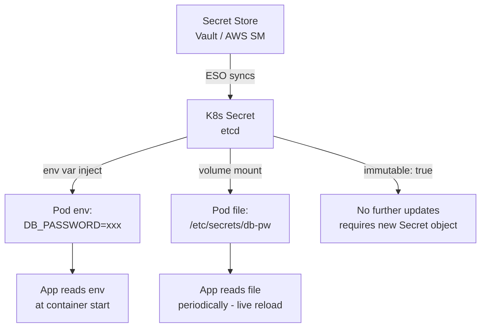
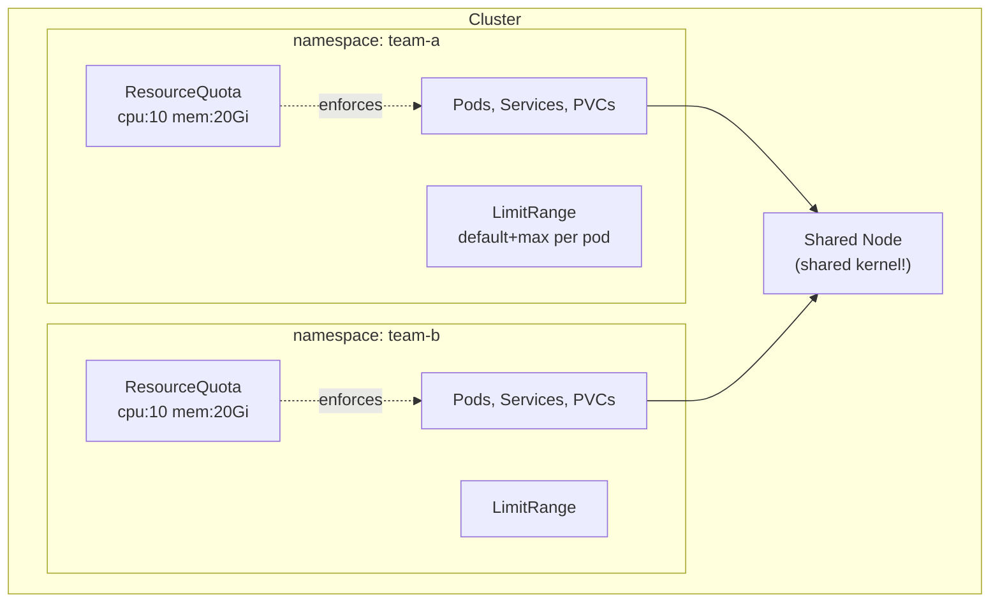
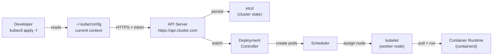

## Keywords in This File

{: .no_toc }

| # | Keyword | Weight |
|---|---------|--------|
| 1 | [ConfigMap and Secret](#configmap-and-secret) | critical |
| 2 | [Namespace and Resource Quotas](#namespace-and-resource-quotas) | high |
| 3 | [kubectl CLI Basics](#kubectl-cli-basics) | high |

---

# ConfigMap and Secret

### 🎯 Model Answer

**30 seconds:**
> ConfigMap and Secret are Kubernetes objects that decouple configuration from
> container images. ConfigMaps store non-sensitive config (env vars, config files).
> Secrets store sensitive data (passwords, tokens, certs) in base64-encoded form.
> Both can be mounted as volumes or injected as environment variables. The key
> rule: never bake config or secrets into container images.

**3 minutes (Senior):**
> The motivation is the twelve-factor app principle: config lives in the environment,
> not the image. You build once and deploy the same image to dev, staging, and
> production - only the ConfigMaps and Secrets differ per environment. This enables
> proper image versioning and environment parity.
>
> ConfigMaps are plain text key-value stores. Secrets are also key-value stores but
> the values are base64-encoded. Important: base64 is NOT encryption - a Secret in
> etcd is only as secure as your etcd access control. For real secret management,
> use Vault or cloud provider secret stores (AWS Secrets Manager, GCP Secret Manager)
> with the External Secrets Operator or CSI Driver integration.
>
> Mounting as a volume vs env var: volumes are updated dynamically when the ConfigMap
> changes (within ~60 seconds), without pod restart. Env vars require a pod restart
> to pick up changes. For config that changes frequently, volumes are preferable.
> For app frameworks that read from env vars (Spring Boot, twelve-factor apps),
> env var injection is simpler but requires restarts for changes.

**Framework:** WHAT -> WHY -> HOW -> TRADE-OFF -> EXAMPLE

*Adapting up:* Add: immutable ConfigMaps/Secrets (immutable: true - prevent accidental
changes, improve performance by removing watch), Kubernetes external secrets operators
(External Secrets Operator, Sealed Secrets), and CSI secret store driver.

*Adapting down:* "ConfigMap = config files or env vars for your app. Secret = same
but for passwords and keys. Neither is baked into the Docker image."

**Blank Mind Recovery:**

**(1) Restate:** "ConfigMap and Secret - configuration and secrets management in K8s.
Let me explain: why they exist (decouple config from image), how they work
(volume mount vs env var), and the security reality of Secrets."

**(2) First principles:** "Build once, deploy everywhere - same image to dev/staging/
prod. The only thing that changes per-environment is config. ConfigMap and Secret
are how K8s provides environment-specific config to a generic image."

**(3) Bridge:** "ConfigMap is like a .env file that lives in Kubernetes and gets
injected into your container. Secret is the same but for sensitive values - like
a locked vault that K8s opens for you at startup."

---

### 📘 Concept Explanation

**What it is:**
ConfigMap stores non-sensitive configuration data as key-value pairs. Secret stores
sensitive data (passwords, API keys, TLS certificates) as base64-encoded key-value
pairs. Both can be injected into pods as environment variables or mounted as files.
They implement the twelve-factor app separation of config from code.

**The problem it solves:**
Baking config into images creates 3 problems: (1) environment-specific images mean
no "build once, deploy everywhere", (2) config changes require image rebuilds and
redeploys, (3) secrets in images end up in container registries and image layers -
a security nightmare. ConfigMap and Secret solve all three by externalizing config.

**How it works:**
```
ConfigMap/Secret -> Pod injection:

Via env var:
  Pod env: APP_DB_URL = "jdbc:postgres://db:5432/mydb"
  (snapshot at pod start - changes require pod restart)

Via volume mount:
  Pod file: /etc/config/application.properties
  (updated dynamically ~60s after ConfigMap change)
  (pod sees new file without restart)
```

When a ConfigMap is mounted as a volume, the files in the mount are symlinks into
a configmap-managed directory. When the ConfigMap is updated, Kubernetes atomically
replaces the symlink target. Applications that re-read the file periodically see
changes without restart.

**The key insight:**
Secrets are NOT encrypted at rest by default - they are stored in etcd as base64-
encoded data. Anyone with etcd read access can decode all secrets. For real security,
enable etcd encryption at rest (EncryptionConfiguration), use RBAC to restrict
Secret access, and consider external secret management (Vault, AWS Secrets Manager).

**When to use it:**
- ConfigMap: application config files, environment-specific settings, feature flags
- Secret: passwords, API keys, TLS certificates, tokens, SSH keys

**When NOT to use it:**
- Don't store binary files larger than 1MB in ConfigMaps (etcd size limits)
- Don't use Kubernetes Secrets as your primary secret management for regulated
  workloads (HIPAA, PCI) - use a dedicated secret management system
- Don't mount secrets as env vars in security-sensitive contexts - they appear
  in process listings and crash dumps

**Alternatives:**
- External Secrets Operator - sync from Vault/AWS Secrets Manager/GCP to K8s Secret
- CSI Secret Store Driver - mount secrets directly from Vault without creating K8s Secret
- Sealed Secrets - encrypted Secret YAMLs safe to store in Git

**First-principles derivation:**
Twelve-factor: config is anything that varies between deploy environments. The
artifact (container image) is environment-agnostic. The runtime (K8s) injects
the environment. ConfigMap and Secret are the K8s implementation of this runtime
injection.

---

### 💻 Code Example

> **Code walkthrough:** Creating ConfigMaps and Secrets, then referencing them
> in a Deployment. The env var injection vs volume mount patterns both shown.
> The immutable ConfigMap pattern prevents accidental config changes in production.

```yaml
# ConfigMap: non-sensitive application config
apiVersion: v1
kind: ConfigMap
metadata:
  name: app-config
  namespace: production
data:
  # env var style: simple key-value
  APP_LOG_LEVEL: "INFO"
  APP_MAX_CONNECTIONS: "50"
  # file style: full config file content
  application.properties: |
    spring.datasource.url=jdbc:postgresql://db-svc:5432/mydb
    spring.datasource.maximum-pool-size=50
    management.endpoints.web.exposure.include=health,info
immutable: true    # prevents accidental changes; also improves perf
```

```yaml
# Secret: sensitive config (base64 values - NOT encrypted, just encoded)
apiVersion: v1
kind: Secret
metadata:
  name: db-secret
  namespace: production
type: Opaque
stringData:                    # plain text -> auto base64-encoded
  DB_PASSWORD: "correct-horse-battery-staple"
  DB_USERNAME: "app_user"
  # TLS certificate
type: kubernetes.io/tls
data:
  tls.crt: LS0tLS1CRUdJTi...   # base64 of cert PEM
  tls.key: LS0tLS1CRUdJTi...   # base64 of key PEM
```

```yaml
# Deployment: consuming ConfigMap and Secret
spec:
  containers:
  - name: app
    image: my-app:1.2.3
    env:
    # inject single keys as env vars
    - name: LOG_LEVEL
      valueFrom:
        configMapKeyRef:
          name: app-config
          key: APP_LOG_LEVEL
    - name: DB_PASSWORD
      valueFrom:
        secretKeyRef:
          name: db-secret
          key: DB_PASSWORD
    # inject all ConfigMap keys as env vars at once
    envFrom:
    - configMapRef:
        name: app-config
    volumeMounts:
    # mount as file - updated dynamically without pod restart
    - name: config-vol
      mountPath: /etc/config
      readOnly: true
  volumes:
  - name: config-vol
    configMap:
      name: app-config
      items:
      - key: application.properties
        path: application.properties
```

> **Code walkthrough:** `stringData` in Secret lets you write plain text values;
> Kubernetes base64-encodes them automatically when storing. `immutable: true` on
> ConfigMap prevents updates - if you need a change, create a new ConfigMap with a
> new name and update the Deployment reference. This is the GitOps-safe pattern:
> treat ConfigMaps as immutable artifacts like container images. Volume mounts are
> updated dynamically by the kubelet when the ConfigMap changes (symlink swap);
> env var injections are set at pod start and require pod restart to update.

---

### 🎓 Answers by Seniority

**Junior / Mid (0-5 years):**
> ConfigMap stores application config like database URLs, feature flags, and log
> levels. Secret stores sensitive data like passwords and API keys. You inject them
> into pods either as environment variables or as mounted files. The key rule: never
> put secrets in your Docker image or in source code - use Secrets. Never put
> environment-specific URLs in your Docker image - use ConfigMaps.

*Push deeper:* Explain the env var vs volume mount choice and when each is appropriate.

---

**Senior / Staff (5+ years):**
> The security reality of Kubernetes Secrets: base64 is not encryption. Secrets
> are stored in etcd and any process that can read etcd can read all your secrets.
> For compliance environments (PCI, HIPAA), this is unacceptable without additional
> controls: enable etcd encryption at rest, restrict Secret access with RBAC
> (use least-privilege ServiceAccounts), audit Secret access, and ideally use
> the External Secrets Operator to sync from AWS Secrets Manager or Vault into
> K8s Secrets. CSI Secret Store Driver is even better - mounts secrets directly
> from Vault without creating a K8s Secret object, reducing the attack surface.
> The other production concern: large ConfigMaps (> 1MB) hit etcd size limits and
> should be stored in object storage (S3, GCS) with a reference in ConfigMap.

*Push deeper:* Immutable ConfigMaps and Secrets - once set, cannot be modified.
This prevents accidental changes, improves kubelet performance (no watch needed),
and enables GitOps-style versioned config management.

---

### ⚠️ Common Misconceptions

**Misconception 1: "Kubernetes Secrets are encrypted."**
Secrets are base64-encoded, not encrypted. Without etcd encryption at rest enabled,
anyone with etcd access can read all Secrets. Treat Secrets as a convenience
mechanism, not a security boundary, unless combined with encryption at rest and
strict RBAC.

**Misconception 2: "Env var injected secrets are safer than mounted volumes."**
The opposite is often true. Env vars: visible in process listings (`/proc/PID/environ`),
appear in crash dumps, logged by misbehaving apps. Volume mounts: can use tmpfs
(in-memory), file permissions restrict access, not logged. For sensitive secrets,
volume mounts are generally safer.

**Misconception 3: "ConfigMap changes are immediately visible to running pods."**
Volume-mounted ConfigMaps are updated within ~60 seconds via the kubelet's cache
invalidation. Env var-injected ConfigMaps require pod restart. The 60-second delay
matters for fast-paced config changes - if you need instant updates, use a config
reload mechanism in your application (Spring Boot Actuator /refresh endpoint,
inotify file watcher).

**Misconception 4: "One ConfigMap per application is the right pattern."**
Large monolithic ConfigMaps that contain all config for all environments in one object
are hard to manage and version. The better pattern: one ConfigMap per concern
(app-config, feature-flags, logging-config), or one ConfigMap per version (immutable
config-v1, config-v2). This enables targeted updates without touching all config.

---

### 🚨 Failure Modes and Diagnosis

**Failure 1: Pod fails to start - ConfigMap or Secret not found**
Symptom: Pod stuck in Init or ContainerCreating; events show "unable to mount volumes"
or "secret not found".
Cause: ConfigMap/Secret referenced in Deployment doesn't exist in the pod's namespace.
Diagnostic: `kubectl describe pod <pod>` -> Events section. Check namespace:
`kubectl get configmap,secret -n <namespace>` - verify objects exist.
Fix: create missing ConfigMap/Secret in the correct namespace.

**Failure 2: Application reads stale config after ConfigMap update**
Symptom: application using old config values after ConfigMap was updated.
Cause: env var injection (requires pod restart) or volume mount cache not yet refreshed.
Diagnostic: check how the ConfigMap is injected (envFrom vs volumeMount).
If envFrom: restart pods. If volume: wait up to 60s or check kubelet sync.
Fix: use volume mounts + app config reload for dynamic config. Use Deployment
rollout restart for env var config: `kubectl rollout restart deployment/<name>`.

**Failure 3: Secret value appears as binary in application (double-base64)**
Symptom: application receives garbled binary data instead of expected string.
Cause: using `data:` field with already-base64-encoded value AND also base64-encoding
when injecting (or vice versa).
Diagnostic: `kubectl get secret <name> -o jsonpath='{.data.KEY}' | base64 -d`
to check the actual decoded value.
Fix: use `stringData:` for plain text values - K8s handles base64 encoding.
Never manually base64-encode when using `stringData:`.

---

### 🎯 Interview Deep-Dive

| Question Category | Time to Answer |
|---|---|
| Definition | 30-60 seconds |
| Mechanism | 1-2 minutes |
| Security | 2-3 minutes |
| Scenario | 2-3 minutes |
| Debugging | 1-2 minutes |
| Trade-off | 1-2 minutes |
| Advanced | 1-2 minutes |

---

**Q1 [JUNIOR] (Definition): What is the difference between a ConfigMap and a Secret?**

A: Both store configuration data as key-value pairs. The difference is sensitivity.

ConfigMap: stores non-sensitive configuration - database URLs (not passwords),
log levels, feature flags, config file contents. Plain text storage in etcd. Anyone
with kubectl access can read them. Appropriate for config that doesn't matter if
seen by other developers.

Secret: stores sensitive data - passwords, API keys, TLS certificates, OAuth tokens.
Values are base64-encoded in etcd. Still readable by anyone with kubectl access to
the Secret object (base64 is not encryption), but the intent is restricted access
via RBAC.

In practice: the main difference is intent and access control. You apply stricter
RBAC to Secrets than ConfigMaps. You'd give developers read access to ConfigMaps
but only give pods the specific Secrets they need via ServiceAccount RBAC.

Both can be injected as env vars or volume-mounted files. Both are namespace-scoped
objects.

*What separates good from great:* Clarifying that base64 is not encryption. The
security boundary for Secrets is RBAC + etcd encryption at rest, not the encoding.

---

**Q2 [MID] (Mechanism): When you update a ConfigMap, what happens in running pods?**

A: It depends on how the ConfigMap is injected:

Env var injection (envFrom or env.valueFrom): the pod is NOT updated. Environment
variables are set once when the container starts. To pick up a ConfigMap change,
you must restart the pods. Command:
`kubectl rollout restart deployment/<name>`

Volume mount injection (configMap volume): the kubelet periodically syncs ConfigMap
changes to mounted volumes. The update happens within approximately 60 seconds
(controlled by `--sync-frequency` on kubelet, default 1m). The update is atomic -
Kubernetes replaces the entire volume directory with a symlink swap, so applications
never see partial file updates.

Application behavior with volume updates: applications must re-read the config file
to pick up changes. Apps that read config once at startup won't benefit. Apps with
a reload mechanism (Spring Boot `/actuator/refresh`, inotify file watcher, SIGHUP
handler) can pick up changes without restart.

For immediate reload scenarios: use a config reload sidecar that watches the mounted
config files (via inotify) and triggers the application's reload endpoint.

*What separates good from great:* Immutable ConfigMaps (immutable: true) are NOT
updated - by design. If you need a change, create a new ConfigMap with a new name
and update the Deployment reference. This is version-controlled config management.

---

**Q3 [SENIOR] (Security): How do you properly secure Kubernetes Secrets in production?**

A: Kubernetes Secrets have several security weaknesses by default that require
explicit hardening:

Layer 1 - RBAC: restrict which ServiceAccounts, users, and groups can access Secrets.
Pods should only access Secrets they explicitly need via per-pod ServiceAccounts,
not the default ServiceAccount. Use `kubectl auth can-i get secrets -n <ns>` to audit.

Layer 2 - Etcd encryption at rest: by default, Secrets are stored in etcd as
base64 (NOT encrypted). Enable `EncryptionConfiguration` with an AES-CBC or AES-GCM
key to encrypt Secret data at rest. Without this, anyone with etcd access reads
all secrets.

Layer 3 - Audit logging: enable Kubernetes audit logging for Secret access
(metadata, request, or requestResponse audit level). Detect unauthorized Secret reads.

Layer 4 - External secret management: for regulated workloads, store secrets in
a dedicated secret manager (HashiCorp Vault, AWS Secrets Manager, GCP Secret Manager)
and sync to K8s with External Secrets Operator. Alternatively, use CSI Secret Store
Driver to mount secrets directly from Vault without creating K8s Secret objects.

Layer 5 - Immutable Secrets: set `immutable: true` once the Secret is provisioned.
Prevents accidental modification. Reduces kubelet load (no watch needed).

The threat model: a compromised application that can call the K8s API can read
Secrets in its namespace. The pod's ServiceAccount permissions determine blast radius.
Least-privilege ServiceAccounts are the most important defense.

*What separates good from great:* Recommending the CSI Secret Store Driver approach
for regulated environments - it mounts secrets from Vault directly into the pod's
filesystem without ever creating a K8s Secret object in etcd. The smallest possible
attack surface.

---

**Q4 [SENIOR] (Scenario): You need to rotate a database password without downtime.
How do you do it in Kubernetes?**

A: Zero-downtime password rotation requires coordination between the database,
the Secret, and the running pods.

Step 1: Create the new password in the database while keeping the old one active.
Most databases support this (add new user, grant permissions, old user still works).

Step 2: Update the Kubernetes Secret with the new password:
`kubectl create secret generic db-secret --from-literal=password=<new> \
  --dry-run=client -o yaml | kubectl apply -f -`

Step 3: If using volume mounts (recommended for rotation): the new password file
appears in all pods within ~60 seconds. If your application re-reads credentials
from the file on each DB connection (or has a reconnect mechanism), it will pick
up the new password automatically.

Step 4: If using env vars: trigger a rolling restart:
`kubectl rollout restart deployment/<name>`
With proper readiness probes, this is zero-downtime - old pods stay up while new
ones start, each picking up the new env var.

Step 5: Once all pods are using the new password, revoke the old password from
the database.

The recommended architecture for production: use External Secrets Operator with
automatic rotation sync - when Vault or AWS Secrets Manager rotates the credential,
ESO automatically updates the K8s Secret and optionally triggers a pod restart.

*What separates good from great:* The graceful rotation assumes the application
handles authentication errors gracefully - if the DB rejects the old password before
all pods have updated, the app must retry with the new credential. Connection pool
libraries (HikariCP, c3p0) typically handle this with reconnect logic.

---

**Q5 [SENIOR] (Trade-off): Volume mount vs env var for Secrets - which is safer?**

A: Volume mounts are generally safer for sensitive secrets. Here's why:

Env var weaknesses:
- Visible in process listing: `/proc/<pid>/environ` on the node
- Appear in container inspect output (Docker, CRI) which may be logged
- Misbehaving apps often log all env vars on startup ("env dump") - secrets appear in logs
- Child processes inherit all env vars (potential over-exposure)

Volume mount advantages:
- Can use `defaultMode: 0400` (read-only by owner only) to restrict file permissions
- Can use `tmpfs` emptyDir as the mount base for in-memory-only secrets
- File content doesn't appear in `kubectl describe pod` output (values truncated)
- Not automatically inherited by child processes

The practical tradeoff: env vars are simpler to configure and work with application
frameworks that read from env vars (12-factor apps, Spring Boot). Volume mounts
require the application to read from files, which not all frameworks support natively.

My recommendation: use env vars for non-security-sensitive config (log levels, URLs).
Use volume mounts for secrets that would cause security incidents if exposed (DB
passwords, API keys, private keys). For the most sensitive secrets (TLS private keys),
use CSI Secret Store with `ephemeral` volumes - the secret is mounted directly from
Vault, exists only in memory, and is never written to disk or stored in etcd.

*What separates good from great:* Knowing that even volume-mounted secrets have a
residual risk: the kubelet caches the secret on the node's disk to handle restart
scenarios. With `--rotate-server-certificates` and kubelet encryption, even this
cache can be protected.

---

**Q6 [STAFF] (Advanced): What are External Secrets and why would you use them over
native K8s Secrets?**

A: External Secrets Operator (ESO) syncs secrets from external secret management
systems (HashiCorp Vault, AWS Secrets Manager, GCP Secret Manager, Azure Key Vault)
into Kubernetes Secrets. You define an `ExternalSecret` object pointing to the
external source, and ESO continuously syncs changes.

Why use ESO over native Secrets:

Centralized secret management: one Vault/Secrets Manager instance for all
environments, not per-cluster K8s Secret management. Rotation in Vault propagates
to all clusters automatically.

Audit trail: external secret managers have comprehensive audit logging - who accessed
what secret, when. Kubernetes audit logging is coarser.

Secret rotation automation: cloud providers rotate secrets automatically (AWS RDS
password rotation, etc.). ESO picks up the rotation and updates K8s Secrets, then
optionally annotates a restart for affected deployments.

Git safety: you can store `ExternalSecret` YAML in Git (it just points to the
external store, not the actual value). Native K8s Secret YAML contains the actual
value (base64) and cannot be safely stored in Git without encryption.

Alternatives to ESO:
- Sealed Secrets: encrypt K8s Secrets for safe Git storage. Decrypted only by
  the cluster's Sealed Secrets controller. No external dependency.
- CSI Secret Store Driver: mounts secrets directly from Vault into pods without
  creating K8s Secret objects. Smallest attack surface.

For regulated environments (SOC 2, PCI): ESO or CSI with Vault is the standard
architecture. For smaller teams or simpler needs, Sealed Secrets is sufficient.

*What separates good from great:* ESO's `refreshInterval` field controls sync
frequency. For frequently rotated secrets (DB passwords), set a short interval
(1m or less). ESO also supports the `rewrite` transformation to normalize secret
key names across different backend naming conventions.

---

**Q7 [STAFF] (Behavioral): Tell me about a time you had a secret exposure incident
in production. What did you do?**

A (STAR format):

Situation: We discovered a database password had been committed to a public GitHub
repository as part of a Kubernetes Secret YAML file. The file had been in the repo
for two weeks. The Secret was for our production recommendation service database.

Task: assess the blast radius, rotate the credential immediately, and prevent
recurrence.

Action:
First, I checked the database audit log to see if the exposed credentials had been
used from unexpected IPs. No external access detected (the database was not publicly
reachable), but we couldn't rule out insider access.

I immediately rotated the database password: create new credential in RDS,
update the K8s Secret, trigger a rolling restart of the affected Deployment
(kubectl rollout restart), verify the new pods came up healthy, then revoke the
old credential.

For prevention: I implemented three controls. (1) Added git-secrets pre-commit hook
scanning for AWS credentials and credential patterns. (2) Migrated all K8s Secrets
to Sealed Secrets - encrypted in-cluster by our sealed-secrets controller, safe to
store in Git. (3) Added a GitHub Actions workflow that runs detect-secrets on every
PR, blocking merges if secrets are detected.

Result: no further secret exposures. The sealed-secrets migration took 3 sprints
to complete for all services but eliminated the root cause.

*What separates good from great:* The response shows systematic incident response
(assess, remediate, prevent) and long-term architectural change, not just rotating
the one credential. The behavioral question is testing whether you learn from incidents.

---

### ⚖️ Comparison Table

*(Omit: L1 foundational keyword - ConfigMap vs Secret is not an alternatives
comparison, it is a complementary pair.)*

---

### 🏛️ System Design

*(Omit: L1 foundational keyword - system design for secrets management at enterprise
scale covered at L4/L5 level.)*

---

### 📊 Diagram

```
Secret Injection Methods:
+------------------+    +-----------------+
| ConfigMap/Secret |    | ConfigMap/Secret|
|  (in etcd)       |    |  (in etcd)      |
+--------+---------+    +--------+--------+
         |                       |
         v (at pod start)        v (dynamic, ~60s)
  env var injection        volume mount
  POD_ENV=value            /etc/config/app.yaml
  (snapshot, static)       (updated by kubelet)
         |                       |
         v                       v
  requires pod restart     app re-reads file
  for config updates       for live updates
```



> **Diagram walkthrough:** The External Secrets Operator syncs from external secret
> stores (Vault, AWS Secrets Manager) into K8s Secrets, centralizing the source of
> truth outside the cluster. From etcd, secrets flow to pods via two paths: env var
> injection (static snapshot at pod start, requires restart on change) or volume
> mount (dynamically updated by kubelet within 60 seconds). Immutable Secrets
> are a one-way door - once set, they cannot be modified; changes require a new
> Secret object and pod reference update. This makes config changes explicit and
> auditable.

---
---

# Namespace and Resource Quotas

### 🎯 Model Answer

**30 seconds:**
> A Namespace is a virtual cluster within a Kubernetes cluster - it provides isolation
> boundaries for resources, access control, and resource limits. ResourceQuota objects
> set hard limits on how much compute (CPU, memory) and how many objects (Pods, Services,
> PVCs) a namespace can consume, preventing noisy-neighbor resource exhaustion.

**3 minutes (Senior):**
> Namespaces are the primary unit of organizational and operational isolation in
> Kubernetes. They enable multi-tenancy on a single cluster by separating environments
> (dev/staging/prod), teams, or applications. RBAC is namespace-scoped, so you can
> give Team A admin rights to their namespace without affecting other teams.
>
> ResourceQuota enforces resource boundaries at the namespace level. Without quotas,
> one noisy tenant can starve other tenants by consuming all cluster CPU and memory.
> With a quota set, Kubernetes rejects pod creation requests that would exceed the
> namespace's allocation. This is how platform teams enforce service-level resource
> contracts across teams.
>
> LimitRange complements ResourceQuota by setting default and maximum resource
> requests/limits for individual Pods and containers. This prevents pods from having
> no resource requests (BestEffort QoS) which makes eviction unpredictable.

**Framework:** WHAT -> WHY -> HOW -> TRADE-OFF -> EXAMPLE

*Adapting up:* Add Network Policy for namespace-level network isolation, namespace
lifecycle management (active vs archived), hierarchical namespaces (HNC), and
virtual clusters as an alternative namespace isolation approach.

*Adapting down:* "A Namespace is like a separate folder for your Kubernetes objects.
Objects in different namespaces don't see each other unless you use full names."

**Blank Mind Recovery:**

**(1) Restate:** "Namespaces and ResourceQuotas - namespace = isolation boundary;
ResourceQuota = resource limit enforcement for that namespace."

**(2) First principles:** "A shared cluster has finite resources and multiple tenants.
Without isolation, any tenant can consume all resources and interfere with others.
Namespace + ResourceQuota create per-tenant boundaries."

**(3) Bridge:** "Namespaces are like separate apartments in a building. ResourceQuota
is the circuit breaker for each apartment - it prevents one tenant from running up
the electric bill for everyone."

---

### 📘 Concept Explanation

**What it is:**
A Namespace is a logical partition of a Kubernetes cluster - a virtual boundary
that groups related resources. ResourceQuota is a Namespace-scoped policy object
that sets hard limits on resource consumption (CPU, memory, object counts).
LimitRange sets per-pod defaults and maximums within a namespace.

**The problem it solves:**
A shared Kubernetes cluster without isolation has the noisy-neighbor problem: one team
can deploy hundreds of pods consuming all CPU, preventing other teams from scheduling.
Namespaces provide the boundary; ResourceQuota enforces it.

**How it works:**
```
Cluster
  |
  +-- Namespace: team-a         ResourceQuota: cpu=10, mem=20Gi
  |     Pod, Service, PVC       (sum of all pods cannot exceed this)
  |
  +-- Namespace: team-b         ResourceQuota: cpu=10, mem=20Gi
  |     Pod, Service, PVC
  |
  +-- Namespace: kube-system    (no quota - system critical)
        CoreDNS, kube-proxy

RBAC: team-a user -> Role -> only namespace team-a
      team-b user -> Role -> only namespace team-b
      platform admin -> ClusterRole -> all namespaces
```

ResourceQuota admission: when a pod is created in a namespace, the ResourceQuota
Admission Controller checks if the namespace's current usage plus the new pod's
resource requests would exceed the quota. If yes: the pod creation is rejected with
HTTP 403.

**The key insight:**
ResourceQuota requires that pods have resource requests set - if a pod has no
requests, the quota controller cannot account for its resource usage. This is why
you should pair ResourceQuota with LimitRange: LimitRange enforces that every pod
has minimum resource requests (preventing BestEffort QoS pods that bypass quota accounting).

**When to use it:**
- Multi-team clusters: one namespace per team or application
- Environment isolation: dev/staging/prod in the same cluster
- ResourceQuota: any shared cluster where one tenant must not starve others
- LimitRange: enforce that all pods have resource requests/limits

**When NOT to use it:**
- Don't use namespaces for strong security isolation between untrusted tenants -
  namespaces do not isolate node-level resources (shared kernel, shared underlying hardware)
- For hostile multi-tenancy (running customer workloads), use separate clusters
- Don't omit ResourceQuota on shared clusters - "soft" agreements aren't enforced

**Alternatives:**
- Separate clusters per team/environment - stronger isolation, higher operational cost
- Virtual clusters (vcluster) - kubernetes-in-kubernetes with full API isolation
- Hierarchical Namespaces (HNC) - namespace trees with inherited policies

**First-principles derivation:**
A cluster is shared infrastructure with finite resources. Multi-tenancy requires:
isolation (teams can't see each other's resources), access control (teams can only
modify their own resources), and resource boundaries (one team can't consume all
capacity). Namespaces provide the first two. ResourceQuota provides the third.

---

### 💻 Code Example

> **Code walkthrough:** Creating a team namespace with ResourceQuota and LimitRange,
> showing how they work together to enforce resource boundaries and prevent BestEffort pods.

```yaml
# Namespace for team
apiVersion: v1
kind: Namespace
metadata:
  name: team-payments
  labels:
    team: payments
    environment: production
```

```yaml
# ResourceQuota: namespace-level hard limits
apiVersion: v1
kind: ResourceQuota
metadata:
  name: team-payments-quota
  namespace: team-payments
spec:
  hard:
    # compute resources (must match resource requests in pods)
    requests.cpu: "8"           # 8 total CPU cores requested
    requests.memory: 16Gi       # 16 GiB total memory requested
    limits.cpu: "16"            # 16 total CPU cores limited
    limits.memory: 32Gi         # 32 GiB total memory limited
    # object count limits
    pods: "50"                  # max 50 pods
    services: "20"
    persistentvolumeclaims: "10"
    services.loadbalancers: "0" # no LBs allowed (use ClusterIP)
    services.nodeports: "0"     # no NodePorts allowed
```

```yaml
# LimitRange: per-pod defaults and maximums
# Forces all pods to have resource requests (required for quota accounting)
apiVersion: v1
kind: LimitRange
metadata:
  name: team-payments-limits
  namespace: team-payments
spec:
  limits:
  - type: Container
    default:                    # applied if container has no limits
      cpu: "500m"
      memory: "256Mi"
    defaultRequest:             # applied if container has no requests
      cpu: "100m"
      memory: "128Mi"
    max:                        # no single container can exceed this
      cpu: "2"
      memory: "4Gi"
    min:                        # no container can go below this
      cpu: "50m"
      memory: "64Mi"
```

> **Code walkthrough:** The ResourceQuota sets team-level hard limits - the sum of
> all pod resource requests in the namespace cannot exceed 8 CPU / 16Gi memory.
> Blocking `services.loadbalancers: "0"` prevents teams from creating expensive
> cloud load balancers; they must use ClusterIP + Ingress instead. The LimitRange
> provides defaults (applied when pods don't specify resources) - critical because
> pods without requests are invisible to the quota controller. If a pod has no
> requests, the LimitRange injects defaults at admission time, ensuring every pod
> is accounted for.

---

### 🎓 Answers by Seniority

**Junior / Mid (0-5 years):**
> A Namespace is like a virtual sub-cluster - it groups related resources together
> and provides a scope for names (two apps can both have a service named "backend"
> if they're in different namespaces). ResourceQuota sets limits on how much CPU,
> memory, and how many objects a namespace can have. This prevents one team from
> accidentally consuming all cluster resources.

*Push deeper:* Explain that RBAC roles are namespace-scoped, which is how you grant
Team A admin rights to their namespace without affecting others.

---

**Senior / Staff (5+ years):**
> Namespace isolation is frequently misunderstood. Namespaces provide logical
> isolation (API-level: objects in one namespace can't be seen by API calls scoped
> to another), RBAC isolation, and resource quota isolation. They do NOT provide
> kernel-level isolation - pods in different namespaces run on the same host with
> the same kernel, same system calls, same hardware. A container breakout affects
> the whole node regardless of namespace. For hostile multi-tenancy (running customer
> workloads), use separate clusters or strong node isolation (dedicated node pools
> per tenant with taints and tolerations). Namespace isolation is appropriate for
> same-organization multi-team scenarios, not cross-organization tenant isolation.

*Push deeper:* Hierarchical Namespaces (HNC) - create namespace trees where child
namespaces inherit policies (ResourceQuota, RBAC) from parents. Useful for organizing
large organizations without duplicating policies.

---

### ⚠️ Common Misconceptions

**Misconception 1: "Namespaces provide strong security isolation."**
Namespaces provide API-level and RBAC isolation, not kernel-level. Pods in different
namespaces share the node kernel. A container escape or node compromise gives access
to all pods on that node regardless of namespace. For hostile multi-tenancy, use
separate clusters.

**Misconception 2: "ResourceQuota works without resource requests on pods."**
ResourceQuota is based on pod resource requests. A pod with no resource requests
is not counted against any quota - it slips through. Always pair ResourceQuota with
LimitRange to enforce minimum requests on every pod.

**Misconception 3: "Network traffic between namespaces is automatically blocked."**
By default, ALL pods in a cluster can communicate with ALL other pods regardless of
namespace. Network isolation requires NetworkPolicy objects. Without NetworkPolicy,
namespace is not a network boundary at all.

**Misconception 4: "You can move objects between namespaces."**
Kubernetes namespace-scoped objects cannot be moved. You must delete and recreate
in the new namespace. Plan your namespace structure before creating resources -
changing it later means downtime and re-creation.

---

### 🚨 Failure Modes and Diagnosis

**Failure 1: Pod creation rejected with quota exceeded**
Symptom: `kubectl apply` returns "forbidden: exceeded quota" error.
Cause: the pod's resource requests would push the namespace over its ResourceQuota.
Diagnostic: `kubectl describe resourcequota -n <namespace>` shows current usage vs limits.
`kubectl get events -n <namespace> | grep Quota` for recent quota violations.
Fix: request quota increase from platform team, or reduce resource requests in pod spec.

**Failure 2: Namespace stuck in Terminating state**
Symptom: `kubectl delete namespace <name>` returns immediately but namespace stays
Terminating for minutes or hours.
Cause: objects with finalizers in the namespace blocking deletion (custom resources,
PVCs with pending operations, stuck Jobs).
Diagnostic: `kubectl get all -n <namespace>` to find remaining objects.
`kubectl api-resources --verbs=list --namespaced -o name | xargs -I{} kubectl get {} -n <namespace>`
to find all objects including custom resources.
Fix: delete remaining objects manually; remove finalizers if controllers are gone.

**Failure 3: Cross-namespace service call failing**
Symptom: service A calls service B using short name `http://service-b` and gets NXDOMAIN.
Cause: short names only resolve within the same namespace.
Fix: use full DNS name: `service-b.namespace-b.svc.cluster.local`.

---

### 🎯 Interview Deep-Dive

| Question Category | Time to Answer |
|---|---|
| Definition | 30-60 seconds |
| Mechanism | 1-2 minutes |
| Design | 2-3 minutes |
| Scenario | 2-3 minutes |
| Security | 1-2 minutes |
| Trade-off | 1-2 minutes |
| Advanced | 1-2 minutes |

---

**Q1 [JUNIOR] (Definition): What is a Kubernetes Namespace?**

A: A Namespace is a virtual partition within a Kubernetes cluster. It groups related
resources together and scopes their names - two different namespaces can both have
a Service named "database" without conflict.

Four default namespaces exist: `default` (where objects go without a namespace
specified), `kube-system` (Kubernetes system components), `kube-public` (publicly
readable, for cluster info), and `kube-node-lease` (node heartbeat leases).

In practice, teams use namespaces to separate environments (team-dev, team-staging,
team-production), applications (payments, orders, users), or access boundaries
(admin namespace vs read-only namespace). RBAC Roles and RoleBindings are
namespace-scoped, so you can give a developer admin access to their team's namespace
without granting cluster-wide permissions.

*What separates good from great:* Some Kubernetes resources are cluster-scoped (not
namespaced): Nodes, PersistentVolumes, ClusterRoles, StorageClasses, Namespaces
themselves. These are cluster-wide resources not isolated by namespace.

---

**Q2 [MID] (Mechanism): How do ResourceQuota and LimitRange work together?**

A: They operate at different scopes:

ResourceQuota: namespace-level aggregate limits. Sets the total resource budget for
the entire namespace. "This namespace can collectively use at most 10 CPU cores and
20Gi memory." Applied at admission time - when a pod is created, the quota controller
checks if adding this pod's requests would exceed the namespace quota.

LimitRange: per-pod or per-container defaults and bounds. "Each individual container
must request at least 50m CPU and at most 2 CPU cores." Also sets defaults for
containers that don't specify requests/limits.

Why both are needed: ResourceQuota tracks resource requests. If a pod has no resource
requests, it contributes 0 to the quota. A namespace with 50 no-request pods could
use all cluster resources while appearing to be within quota. LimitRange prevents
this by injecting default requests for every container that doesn't specify them.

The combination: every container gets default requests from LimitRange (if not set),
every container is bounded by LimitRange max, and the namespace total is bounded
by ResourceQuota.

*What separates good from great:* Understanding the quota scopes: `Terminating` and
`NotTerminating` quota scopes let you set different quotas for batch jobs (short-lived)
vs long-running services. BestEffort quota scope limits containers with no requests/limits.

---

**Q3 [SENIOR] (Design): How would you structure namespaces for a 50-team organization?**

A: For a 50-team organization, namespace-per-team is the right baseline, but the
structure depends on the isolation requirements.

Option A - Flat namespaces (simple):
One namespace per team per environment: `payments-dev`, `payments-staging`, `payments-prod`.
150 namespaces. Simple to understand but duplicate policies everywhere.

Option B - Environment-separated namespaces with RBAC:
`payments` namespace in prod cluster (only prod cluster has payment data).
Separate dev cluster with namespace-per-team.
Fewer namespaces, cleaner isolation between environments at cluster level.

Option C - Hierarchical Namespaces (HNC):
Parent namespaces per business domain: `finance/`, `logistics/`.
Child namespaces per team: `finance/payments`, `finance/billing`.
Policies (ResourceQuota, NetworkPolicy, RBAC) propagate from parent to children.
Allows the platform team to set organization-wide defaults at parent level.

My recommendation for 50 teams: Option B - separate clusters per environment
(cheaper than you think with managed K8s, eliminates entire classes of blast
radius issues) + namespace-per-team within each cluster. Use HNC if there's a
strong organizational hierarchy that maps to policy inheritance.

*What separates good from great:* Recognizing that at 50 teams, a GitOps namespace
provisioning process is essential - teams should not manually create namespaces.
Use Argo CD ApplicationSet or a custom namespace controller to provision namespaces
with standard quota and RBAC templates.

---

**Q4 [SENIOR] (Security): What are the limits of namespace isolation for security?**

A: Namespace isolation provides API isolation and RBAC scoping - not kernel-level
or hardware-level isolation. The security limits:

Shared kernel: all pods on a node share the Linux kernel. A container escape
(via kernel exploit, privileged container, hostPath mount) gives access to the
host and all pods on it, regardless of namespace boundaries.

Shared network (default): pods in different namespaces can communicate freely
unless NetworkPolicy is configured. Network isolation is NOT automatic.

Shared storage classes: PVCs in any namespace can use cluster-level StorageClasses
and provision PersistentVolumes from the same underlying storage. Data isolation
between namespaces requires separate storage classes and backends.

Node-level resources: a pod in any namespace can exhaust node disk I/O, network
bandwidth, or system calls, affecting pods in other namespaces on the same node.

What namespace isolation IS good for: same-organization multi-team scenarios where
tenants are trusted (employees, internal teams). RBAC prevents accidental interference.
ResourceQuota prevents resource starvation.

What requires more: hostile multi-tenancy (external customers, unknown code).
Use separate node pools with taints/tolerations (physical isolation), gVisor or
Kata Containers (kernel-level sandboxing), and ideally separate clusters.

*What separates good from great:* Knowing that even with all of the above, a
supply chain attack in a base image can affect all containers using that image
regardless of namespace. Defense in depth is required.

---

**Q5 [STAFF] (Trade-off): One large cluster with many namespaces vs many small clusters?**

A: This is the "big cluster" vs "small clusters" tradeoff:

Large cluster advantages: lower operational overhead (one control plane to manage),
better resource utilization (pods from light-traffic namespaces fill gaps left by
busy ones), simpler networking (no cross-cluster service discovery needed), lower
cost (one set of control plane nodes, not N).

Large cluster disadvantages: blast radius - a bug in the K8s control plane, an
etcd corruption, or a security compromise affects all tenants. Hard to enforce
strong isolation. Noisy-neighbor issues even with quotas (shared CPU steal, disk I/O).
Complex upgrade coordination (100 teams all affected by one version bump).

Small cluster advantages: complete blast radius isolation per cluster, independent
upgrade schedules, simpler RBAC (everyone in a cluster is trusted), easier to
reason about (smaller etcd, fewer objects). Regulatory compliance: you can place
regulated workloads (PCI, HIPAA) in dedicated clusters with specialized security controls.

My decision framework: start with one cluster per environment (dev/staging/prod).
Add per-team or per-application clusters when: (1) compliance requirements mandate
separation, (2) a team needs K8s API customizations incompatible with shared cluster
policy, (3) blast radius from that team's workload is unacceptable for others, or
(4) the team has SLA requirements beyond what a shared cluster can guarantee.

*What separates good from great:* Multi-cluster management tools (Argo CD,
Fleet, Cluster API) reduce the operational overhead of many clusters significantly.
The "one cluster to rule them all" argument was stronger when cluster management
was 100% manual - modern tooling changes the calculus.

---

**Q6 [STAFF] (Advanced): What is a ResourceQuota scope and how does it help?**

A: ResourceQuota scopes limit which pods a quota applies to, enabling more nuanced
resource accounting.

`Terminating` scope: applies to pods with `activeDeadlineSeconds` set (batch jobs,
CronJobs). Lets you set a separate quota for short-lived workloads vs long-running services.
Example: a namespace can have 50 cores of batch jobs but only 20 cores of services.

`NotTerminating` scope: applies to pods WITHOUT `activeDeadlineSeconds` (long-running services).

`BestEffort` scope: applies only to pods with BestEffort QoS (no resource requests).
You can limit how many BestEffort pods exist in a namespace.

`NotBestEffort` scope: applies to pods with Guaranteed or Burstable QoS.

Priority class scopes: `ScopePriorityClassNameExists`, plus inline matching on
PriorityClass. Lets you set separate quotas per PriorityClass (guarantee batch jobs
can run without starving from long-running services).

Practical use: a data pipeline namespace needs bursty batch workloads (many short
jobs) AND always-on services. Without scopes, they share one quota pool. With scopes:
`Terminating` quota for batch (50 cores), `NotTerminating` quota for services (10 cores).
The batch burst doesn't eat into the service allocation.

*What separates good from great:* Knowing that quota scopes interact with the
Priority and Fair Queuing (PFQ) scheduler - scoped quotas combined with PriorityClass
enable sophisticated multi-workload-type resource management within a single namespace.

---

**Q7 [STAFF] (Behavioral): How have you dealt with a resource quota conflict between teams?**

A (STAR format):

Situation: Two teams in the same cluster - the ML training team and the web services
team - were sharing a production namespace. ML team launched a training job that
consumed all available GPU and CPU, starving the web services team's pods during
a high-traffic period. The web services team was unable to scale up during a Black
Friday traffic spike.

Task: provide both teams their needed resources without requiring a new cluster
(budget constraint), and prevent recurrence.

Action: First, I separated the teams into dedicated namespaces with ResourceQuota.
ML training namespace: `requests.cpu: "40"`, GPU limits set. Web services namespace:
`requests.cpu: "20"`, `LimitRange` preventing any single pod from requesting >4 CPU.

Then I implemented PriorityClasses: web services pods got `PriorityClass: high-priority`
(1000). ML training jobs got `PriorityClass: batch` (100). The scheduler now preempts
batch jobs when high-priority web services pods can't schedule.

Created a `ResourceQuota` with `Terminating` scope for ML batch jobs specifically,
separating their quota pool from the always-on services.

Result: web services team can always scale (high-priority scheduling prevents starvation),
ML training jobs run when capacity is available and get preempted during traffic peaks.
Both teams got their peak resource needs met within the cluster's total capacity.

*What separates good from great:* The PriorityClass addition - simple namespace
separation with quotas would still allow ML batch pods to consume all quota before
web services pods needed to scale. PriorityClass + preemption makes the scheduling
hierarchy explicit.

---

### ⚖️ Comparison Table

*(Omit: L1 foundational keyword - Namespace isolation level comparison
(namespace vs cluster) covered at L3/L4 architecture level.)*

---

### 🏛️ System Design

*(Omit: L1 foundational keyword - multi-cluster architecture covered at L5.)*

---

### 📊 Diagram

```
Namespace isolation layers:

Cluster
+--namespace: team-a----+  +--namespace: team-b----+
| ResourceQuota:        |  | ResourceQuota:        |
|  cpu: 10 / mem: 20Gi  |  |  cpu: 10 / mem: 20Gi  |
| RBAC: team-a only     |  | RBAC: team-b only     |
|                       |  |                       |
| Pod  Pod  Service     |  | Pod  Pod  Service     |
| PVC  ConfigMap        |  | PVC  ConfigMap        |
+-----------^-----------+  +-----------^-----------+
            |                          |
            +-----shared node------+---+
                    kernel         |
                    network (no NetworkPolicy = open!)
```



> **Diagram walkthrough:** Namespaces create API-level boundaries: RBAC restricts
> who can see and modify objects; ResourceQuota limits the total resources consumed.
> But physically, all pods run on shared nodes with a shared kernel. The diagram's
> "shared kernel" label is the key insight - namespace isolation is logical, not
> physical. A privileged pod in team-a could potentially access team-b's data on
> the same node. For true isolation, add NetworkPolicy (network isolation) and
> node affinity with taints/tolerations (physical node isolation per namespace).

---
---

# kubectl CLI Basics

### 🎯 Model Answer

**30 seconds:**
> kubectl is the command-line interface for Kubernetes - it communicates with the
> cluster's API Server to create, read, update, and delete resources. The core
> commands are get (list/inspect), describe (detailed view), apply (declarative
> create/update), delete, logs, exec, and rollout. Every production workflow
> starts with kubectl.

**3 minutes (Senior):**
> kubectl is a thin client that converts commands to REST API calls to the Kubernetes
> API Server. It authenticates using credentials in `~/.kube/config` (the kubeconfig
> file), which stores cluster addresses, user certificates, and context names.
> You can manage multiple clusters by switching contexts: `kubectl config use-context`.
>
> The imperative vs declarative distinction matters: `kubectl create` or `kubectl run`
> are imperative (do this action now), while `kubectl apply` is declarative (make the
> cluster match this desired state). Production workflows use `kubectl apply` with
> YAML files stored in Git - this is the GitOps foundation. Imperative commands are
> useful for exploration and debugging but should not be in production scripts.
>
> Key operational commands: `kubectl get pods` (list), `kubectl describe pod <name>`
> (detailed events and state), `kubectl logs` (container stdout/stderr), `kubectl exec`
> (execute a command in a running container), `kubectl port-forward` (tunnel a local
> port to a pod port for debugging), and `kubectl rollout` (manage Deployment rollouts).

**Framework:** WHAT -> WHY -> HOW -> TRADE-OFF -> EXAMPLE

*Adapting up:* Add: kubectl plugins (krew plugin manager), custom output formats
(JSONPath, custom-columns), server-side apply vs client-side apply, and kustomize
integration (`kubectl apply -k`).

*Adapting down:* "kubectl is the command-line tool for K8s - like git but for your
cluster. `kubectl get`, `apply`, `delete`, `logs`, `exec` are the daily commands."

**Blank Mind Recovery:**

**(1) Restate:** "kubectl CLI - the primary interface for operating Kubernetes.
Let me cover: how it works (API calls), the core commands, and the imperative vs
declarative distinction."

**(2) First principles:** "Every kubectl command translates to an HTTP REST API call
to the Kubernetes API Server. kubectl is just a typed HTTP client with a
helpful command structure."

**(3) Bridge:** "kubectl is like git for your cluster - you declare the desired state
(`kubectl apply`), query the current state (`kubectl get`), and inspect history
(`kubectl rollout history`)."

---

### 📘 Concept Explanation

**What it is:**
kubectl is the command-line tool for interacting with Kubernetes clusters. It
translates user commands into REST API calls to the cluster's API Server,
authenticating via kubeconfig. It provides commands for resource management (CRUD),
inspection, debugging, and operational tasks.

**The problem it solves:**
The Kubernetes API is an HTTP REST API - you could curl it directly, but that's
impractical. kubectl provides a human-friendly CLI that handles authentication,
JSON serialization, common operations, and output formatting.

**How it works:**
```
kubectl get pods
       |
       v
Read ~/.kube/config:
  - current-context: my-cluster
  - cluster.server: https://api.my-cluster.com
  - user.token: <bearer-token>
       |
       v
HTTP GET https://api.my-cluster.com/api/v1/namespaces/default/pods
  Authorization: Bearer <token>
       |
       v
JSON response -> formatted table output
```

kubeconfig contexts let you switch between clusters and namespaces:
`kubectl config use-context prod-cluster`
`kubectl config set-context --current --namespace=payments`

**The key insight:**
`kubectl apply` uses a three-way merge between the last applied configuration, the
current cluster state, and the new desired state. This is why it can handle
concurrent manual changes without overwriting them (unlike `kubectl replace` which
does a full overwrite). Always use `kubectl apply` in scripts and automation.

**When to use it:**
- Daily operations: checking pod status, reading logs, debugging
- Deployment: `kubectl apply -f` for applying configuration
- Debugging: `kubectl exec`, `kubectl port-forward`, `kubectl debug`
- Incident response: quick imperative commands during production incidents

**When NOT to use it:**
- Don't use imperative kubectl commands in CI/CD pipelines - use declarative apply
- Don't run `kubectl delete` without being certain - this is destructive
- Don't use kubectl as a replacement for GitOps tooling (ArgoCD, Flux) for production

**Alternatives:**
- Helm - package manager for Kubernetes; manages charts (sets of YAML templates)
- ArgoCD / Flux - GitOps controllers that apply YAML from Git automatically
- Lens / K9s - GUI/TUI tools for cluster navigation

**First-principles derivation:**
The Kubernetes API is a JSON REST API. kubectl is a structured client for that API
with human-friendly defaults (table output, resource shortcuts). Everything kubectl
does can be replicated with curl + the API Server URL + credentials.

---

### 💻 Code Example

> **Code walkthrough:** The essential daily kubectl commands grouped by use case.
> These represent the actual workflow of a K8s operator from morning stand-up
> through incident response.

```bash
# -- INSPECT --
kubectl get pods                          # list pods in default namespace
kubectl get pods -n kube-system           # specific namespace
kubectl get pods -A                       # all namespaces
kubectl get pods -w                       # watch (live updates)
kubectl get pods -o wide                  # extra info: node, IP
kubectl get pods -l app=backend           # filter by label
kubectl get all -n payments               # all resources in namespace

# -- DESCRIBE: detailed state + events (use when pod fails) --
kubectl describe pod <name>              # events, probe status, conditions
kubectl describe node <name>             # node capacity, allocations

# -- LOGS --
kubectl logs <pod>                        # container stdout/stderr
kubectl logs <pod> -c <container>         # specific container in pod
kubectl logs <pod> -f                     # follow (stream)
kubectl logs <pod> --previous            # logs from crashed previous instance
kubectl logs -l app=backend --tail=100   # all pods matching label, last 100 lines

# -- EXEC: run command in running container --
kubectl exec -it <pod> -- /bin/bash      # interactive shell
kubectl exec <pod> -- curl localhost:8080/health  # one-off command
kubectl exec -it <pod> -c sidecar -- sh  # exec into specific container

# -- APPLY/DELETE --
kubectl apply -f deployment.yaml          # declarative create/update
kubectl apply -f ./k8s/                  # all YAML in directory
kubectl delete -f deployment.yaml        # delete objects in file
kubectl delete pod <name>                # delete specific pod (recreated by Deployment)

# -- ROLLOUT OPERATIONS --
kubectl rollout status deployment/<name> # watch rollout progress
kubectl rollout history deployment/<name>
kubectl rollout undo deployment/<name>
kubectl rollout restart deployment/<name> # rolling restart all pods
```

```bash
# -- DEBUG PATTERNS --
# Port forward: access pod locally without Service
kubectl port-forward pod/<name> 8080:8080
kubectl port-forward svc/<name> 8080:80

# Debug a node (from privileged pod on node)
kubectl debug node/<node-name> -it --image=ubuntu

# Copy files to/from pod
kubectl cp <pod>:/tmp/app.log ./app.log
kubectl cp ./config.yaml <pod>:/etc/config/

# Get raw YAML of any object
kubectl get deployment <name> -o yaml

# JSONPath: extract specific fields
kubectl get pods -o jsonpath='{.items[*].metadata.name}'
kubectl get pod <name> -o jsonpath='{.spec.containers[0].image}'

# Watch events (good for debugging stuck pods)
kubectl get events --sort-by=.lastTimestamp -n <namespace>
kubectl get events --field-selector reason=Failed -A
```

> **Code walkthrough:** `kubectl describe` and `kubectl get events` are the two most
> important debugging commands - when a pod is stuck, describe shows the exact error
> (image pull failure, OOMKill, readiness probe failure) in the Events section.
> `kubectl logs --previous` is critical for diagnosing CrashLoopBackOff pods - it
> shows the logs from the crashed instance before the restart. `kubectl rollout restart`
> performs a rolling restart of all pods in a Deployment (useful for picking up new
> ConfigMap env vars or clearing cached state).

---

### 🎓 Answers by Seniority

**Junior / Mid (0-5 years):**
> kubectl is the command-line interface for Kubernetes. The most-used commands are:
> `kubectl get pods` to see what's running, `kubectl describe pod <name>` to see
> why something is failing, `kubectl logs <pod>` to read container output, and
> `kubectl apply -f file.yaml` to deploy changes. The kubeconfig file in `~/.kube/config`
> stores your cluster credentials and the current context determines which cluster
> you're talking to.

*Push deeper:* Explain the difference between `kubectl apply` and `kubectl create` -
apply is idempotent (safe to run multiple times), create fails if the object exists.

---

**Senior / Staff (5+ years):**
> At the operational level, kubectl is the entry point for incident response. My
> typical incident workflow: `kubectl get pods -A | grep -v Running` to find all
> non-healthy pods, `kubectl describe pod` on the suspect, `kubectl logs --previous`
> for crash logs, `kubectl get events --sort-by=.lastTimestamp` for cluster-wide
> recent events. For deep debugging: `kubectl exec -it <pod> -- bash` to get a shell,
> then standard Linux tools inside. The subtle things: `kubectl apply` vs `kubectl
> apply --server-side` (server-side apply avoids last-applied annotation clutter,
> handles field ownership for GitOps scenarios), and `kubectl diff -f file.yaml`
> (shows what would change before applying - always use before applying to production).

*Push deeper:* `kubectl top pods` (requires metrics-server) for live resource usage,
and krew plugins (kube-capacity, stern for multi-pod log streaming).

---

### ⚠️ Common Misconceptions

**Misconception 1: "kubectl create and kubectl apply are interchangeable."**
`kubectl create` is imperative - it creates a new object and fails if it already
exists. `kubectl apply` is declarative - it creates if new, updates if existing,
using three-way merge. Always use `apply` in scripts and automation.

**Misconception 2: "kubectl exec on a pod changes its state permanently."**
kubectl exec runs a command in the running container but doesn't modify the container
image. Any file changes inside the container are lost when the pod restarts. To
make persistent changes, update the Deployment/image and redeploy.

**Misconception 3: "kubectl get pods shows only pods in the current namespace."**
By default yes, but current namespace is whatever is set in kubeconfig context
(not always `default`). Use `-A` flag for all namespaces. `kubectl config get-contexts`
shows the current namespace. Easy to be in the wrong namespace by accident.

**Misconception 4: "kubectl delete immediately stops the container."**
kubectl delete sends a deletion request to the API Server, which begins graceful
termination (SIGTERM -> wait -> SIGKILL). For a 30-second grace period, the pod
runs for up to 30 seconds after `kubectl delete`. `--grace-period=0 --force` bypasses
this but can leave orphaned processes on the node.

---

### 🚨 Failure Modes and Diagnosis

**Failure 1: kubectl commands slow or timing out**
Symptom: `kubectl get pods` takes 30+ seconds; operations time out.
Cause: API Server overloaded (too many list/watch requests, large etcd), network
issues to API Server, or kubectl connecting to the wrong server (misconfigured kubeconfig).
Diagnostic: `kubectl config current-context` - confirm you're on the right cluster.
`kubectl cluster-info` to check API Server reachability.
If API Server is slow: check kube-apiserver pod logs in kube-system namespace.

**Failure 2: Unauthorized or Forbidden errors**
Symptom: `Error from server (Forbidden): pods is forbidden: User "jane" cannot list
pods in namespace "production"`.
Cause: RBAC permissions missing for the user or ServiceAccount.
Diagnostic: `kubectl auth can-i get pods -n production --as=jane` to simulate.
`kubectl describe rolebinding,clusterrolebinding | grep jane` to find existing bindings.
Fix: create appropriate RoleBinding for the user in the namespace.

**Failure 3: kubectl apply fails with "field is immutable"**
Symptom: apply fails with "field is immutable" or conflict on certain spec fields.
Cause: trying to update an immutable field (like selector.matchLabels on a Deployment)
after the resource is created.
Fix: delete the resource and recreate, or use `--force` on apply (destroys and
recreates - causes brief downtime).

---

### 🎯 Interview Deep-Dive

| Question Category | Time to Answer |
|---|---|
| Definition | 30-60 seconds |
| Mechanism | 1-2 minutes |
| Debugging | 2-3 minutes |
| Operations | 2-3 minutes |
| Trade-off | 1-2 minutes |
| Advanced | 1-2 minutes |
| Behavioral | 2-3 minutes |

---

**Q1 [JUNIOR] (Definition): What is kubectl and how does it communicate with the cluster?**

A: kubectl is the command-line client for Kubernetes. Every kubectl command translates
to an HTTP REST API call to the Kubernetes API Server.

The authentication and routing information comes from the kubeconfig file (typically
`~/.kube/config`). This file stores: cluster API server addresses, user credentials
(certificate, token, or OIDC), and named "contexts" that combine a cluster + user +
namespace. `kubectl config use-context` switches which cluster you're talking to.

Under the hood: `kubectl get pods` becomes
`GET https://api-server/api/v1/namespaces/default/pods` with the user's bearer token.
kubectl formats the JSON response into the table you see.

Key insight: kubectl is stateless. It reads kubeconfig on every command. The
"current state" of your cluster is in etcd on the cluster, not in kubectl.

*What separates good from great:* Knowing that you can use `KUBECONFIG=~/path/to/other-config
kubectl get pods` to temporarily use a different kubeconfig without modifying the
default one - useful for multi-cluster scripts.

---

**Q2 [MID] (Mechanism): What is the difference between kubectl apply and kubectl replace?**

A: Both update an existing resource, but they use different merge strategies:

`kubectl apply` uses a three-way merge: it compares (1) the last applied configuration
(stored as annotation `kubectl.kubernetes.io/last-applied-configuration`), (2) the
current live state in the cluster, and (3) your new YAML. This allows it to detect
and preserve manual changes made between applies. If someone manually added a label
to a pod template between your applies, `kubectl apply` preserves it.

`kubectl replace` does a full overwrite: it takes the current YAML and replaces
the entire resource with it. If the field is not in your YAML, it's removed.
Concurrent changes between your last fetch and your apply are lost.

`kubectl apply` also creates the resource if it doesn't exist - making it idempotent
and safe for CI/CD pipelines. `kubectl replace` fails if the resource doesn't exist.

Use `kubectl apply` for: GitOps, CI/CD, any automated workflow.
Use `kubectl replace` for: deliberately overwriting all fields, or when apply fails
due to managed field conflicts (rare).

*What separates good from great:* `kubectl apply --server-side` (SSA) is the
modern replacement for client-side apply. SSA handles field ownership (preventing
conflicts when multiple controllers manage the same object), works better with
GitOps tools, and avoids the last-applied annotation clutter on large objects.

---

**Q3 [MID] (Debugging): A pod is stuck in CrashLoopBackOff. How do you diagnose it?**

A: CrashLoopBackOff means the container keeps crashing and kubectl is waiting
between retries (with exponential backoff).

Step 1: get the crash logs from the previous instance:
`kubectl logs <pod> --previous`
This shows what the container logged before it crashed. Most application crashes
produce a stack trace or error message here.

Step 2: if logs are empty (process crashed too fast to log), check the exit code:
`kubectl describe pod <pod>` -> "Last State" section shows exit code.
Exit code 1: application error (check logs)
Exit code 137: OOMKilled (memory limit too low)
Exit code 139: segfault (application bug or native library issue)
Exit code 143: SIGTERM not handled, killed by kubelet

Step 3: if the container crashes before producing logs, use an init container or
override the entrypoint to a sleep for manual inspection:
`kubectl debug <pod> --copy-to=debug-pod --container=app -- sleep infinity`
Then `kubectl exec -it debug-pod -c app -- sh` to get a shell and run the app manually.

Step 4: check for missing dependencies:
`kubectl describe pod` -> Events: missing ConfigMap, Secret, or PVC?
Missing volume mounts cause crash before application code runs.

*What separates good from great:* Knowing about `kubectl debug` (alpha, GA in 1.25)
which creates an ephemeral debug container in the running pod or copies a pod with
a modified entrypoint - safer than modifying the production Deployment for debugging.

---

**Q4 [SENIOR] (Operations): How do you perform a zero-downtime forced pod restart?**

A: `kubectl rollout restart deployment/<name>` is the correct command. It performs
a rolling restart: patches the Deployment's pod template annotation with the current
timestamp, triggering a rolling update where old pods are replaced by new pods with
the same image. With readiness probes configured, traffic is only sent to new pods
once they pass readiness.

The annotation it sets:
```yaml
spec:
  template:
    metadata:
      annotations:
        kubectl.kubernetes.io/restartedAt: "2024-01-15T10:30:00Z"
```

This is safe for production because it respects the Deployment's rolling update
strategy (maxSurge, maxUnavailable). The rollout can be paused, watched, or
rolled back with the standard rollout commands.

What NOT to do: `kubectl delete pod <name>` - this deletes one pod at a time manually
and bypasses the Deployment's rollout strategy. If you delete too many at once,
you reduce capacity below the minimum. `kubectl rollout restart` is the idiomatic approach.

When would you use it: when a pod needs to pick up a new env-var-injected ConfigMap,
when you need to cycle pods to a different node, or when a pod is in an unexpected
state and you want a clean restart.

*What separates good from great:* `kubectl rollout restart` creates a revision in
`kubectl rollout history`, enabling rollback if needed. Manually deleting pods does not.

---

**Q5 [SENIOR] (Debugging): How do you access a pod that is running but has no shell?**

A: When a container uses a distroless or scratch image (no bash, no sh), standard
`kubectl exec -it <pod> -- sh` fails.

Option 1: kubectl debug with an ephemeral container (K8s 1.25+):
```bash
kubectl debug -it <pod> --image=busybox --target=app
```
This attaches an ephemeral busybox container to the running Pod, sharing its
process namespace. You can see the app's processes and files without modifying
the running Pod or image.

Option 2: kubectl debug with a copy:
```bash
kubectl debug <pod> --copy-to=debug-pod \
  --container=app --image=ubuntu -- sleep infinity
kubectl exec -it debug-pod -c app -- bash
```
Creates a copy of the Pod with the app container's image replaced by ubuntu.
Useful when you want a full shell in the same environment.

Option 3: nsenter on the node (advanced):
- Find which node the pod runs on: `kubectl get pod <name> -o wide`
- SSH to the node
- `crictl ps | grep <container-id>` to find container
- `nsenter -t <pid> -n -p -u` to enter container's namespaces

For production debugging: Option 1 (ephemeral containers) is the safest - it
doesn't modify the pod or restart any containers. Available for GA since K8s 1.25.

*What separates good from great:* Knowing why distroless images exist (smaller attack
surface, no package manager that attackers can use) and understanding that kubectl debug
ephemeral containers were specifically designed to solve this exact debugging problem
without requiring shell access in the base image.

---

**Q6 [STAFF] (Advanced): What is server-side apply and why does it matter for GitOps?**

A: Server-side apply (SSA) moves the merge logic from kubectl to the API Server.
Instead of storing a `last-applied-configuration` annotation client-side, the API
Server tracks ownership of each field.

Problem with client-side apply (CSA): when multiple controllers or users manage
the same resource, they fight over fields. Argo CD applies a Deployment; the HPA
controller modifies `spec.replicas`. When Argo CD applies again, it overwrites the
HPA's replica change with the value from Git. SSA prevents this with field ownership.

SSA field ownership: when Argo CD applies with SSA, it "owns" the fields it manages.
The HPA controller "owns" `spec.replicas`. When Argo CD applies again, it doesn't
overwrite fields it doesn't own (like `spec.replicas` owned by HPA).

Usage:
```bash
kubectl apply --server-side -f deployment.yaml
kubectl apply --server-side --field-manager=argocd -f deployment.yaml
```

Benefits for GitOps: Argo CD uses SSA by default in newer versions. It eliminates
the common conflict where HPA, KEDA, or other operators modify resources that Argo CD
also manages - each manages only its fields.

Caveat: SSA is stricter about schema validation. Some legacy YAML with unknown fields
will fail SSA validation when it would have been ignored by CSA.

*What separates good from great:* Knowing that conflict resolution in SSA is
explicit: when two managers conflict on the same field, the operation returns a
409 Conflict. You must explicitly `--force-conflicts` to take ownership. This
makes multi-manager scenarios visible and explicit rather than silently overwriting.

---

**Q7 [JUNIOR] (Behavioral): What kubectl commands do you use most in your daily work
and why?**

A (STAR format):

Situation: As part of a team running 15 microservices on Kubernetes, I work with
the cluster daily for deployments, debugging, and monitoring.

Task: maintain service availability and quickly diagnose issues.

Action - daily commands I rely on:

Morning check - `kubectl get pods -A | grep -v Running` to see any pods not in
Running state. `kubectl get events --sort-by=.lastTimestamp -A | tail -20` for
recent cluster activity.

Deployment work - `kubectl apply -f ./k8s/` for applying YAML. `kubectl rollout
status deployment/<name>` to watch rollout progress. `kubectl diff -f ./k8s/`
ALWAYS before applying to production to see exactly what will change.

Debugging - `kubectl describe pod <name>` when a pod fails (Events section tells
me why). `kubectl logs <pod> --previous` for CrashLoopBackOff. `kubectl exec -it
<pod> -- sh` for interactive debugging. `kubectl port-forward svc/<name> 8080:80`
to test a service locally without ingress.

Incident response - `kubectl top pods -n <namespace>` for resource usage.
`kubectl get events -n <namespace> --field-selector reason=OOMKilling` for OOM events.

Result: these commands form a diagnostic workflow that lets me go from "something's
wrong" to "root cause identified" in under 5 minutes for most incidents.

*What separates good from great:* Mentioning `kubectl diff` before every production
apply - it shows exactly what will change before you change it. This prevents
accidental changes to production and is a professional habit that separates
experienced operators from beginners.

---

### ⚖️ Comparison Table

*(Omit: L1 foundational keyword - kubectl vs alternatives (Helm, ArgoCD, Lens)
comparison at L2+ operational tools level.)*

---

### 🏛️ System Design

*(Omit: L1 foundational keyword - kubectl role in GitOps pipeline covered at L3.)*

---

### 📊 Diagram

```
kubectl command flow:
                                           API Server
kubectl get pods                           (REST API)
     |                                        |
     +-- read ~/.kube/config              +---+---+
     |   current-context: prod-cluster    | etcd  |
     |   cluster: api.prod.com            +---+---+
     |   user: admin-cert                     |
     |                                    pod data
     +-- HTTP GET /api/v1/.../pods        returned
         Auth: Bearer <token>             as JSON
         -> format as table
```



> **Diagram walkthrough:** kubectl is just a typed HTTP client. It reads kubeconfig
> for server address and credentials, then sends REST API calls to the API Server.
> The API Server persists state to etcd and notifies controllers via watch. The
> Deployment controller sees the change and creates/updates ReplicaSets. The scheduler
> assigns pods to nodes. The kubelet on the target node starts the actual containers.
> kubectl's role ends after the API call - everything else is driven by the control plane.
