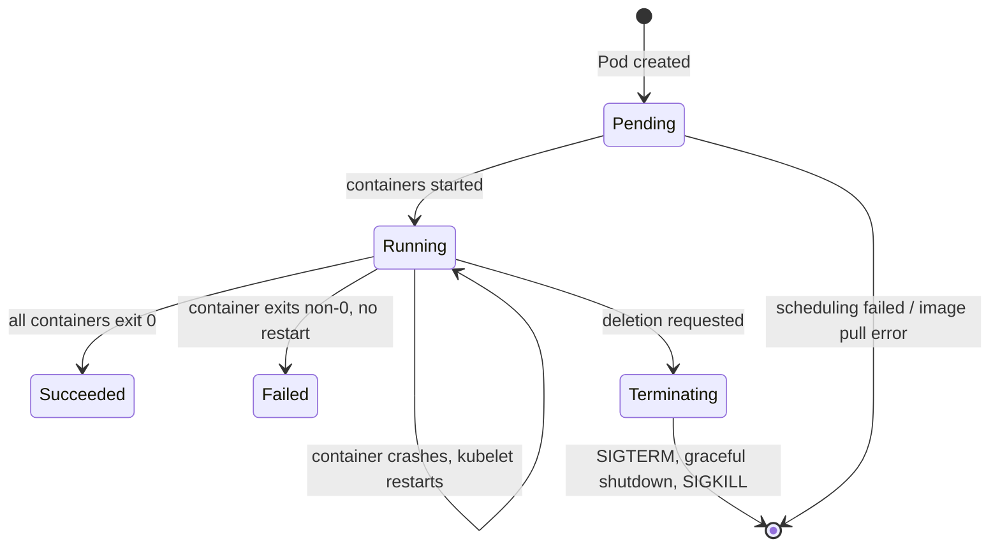
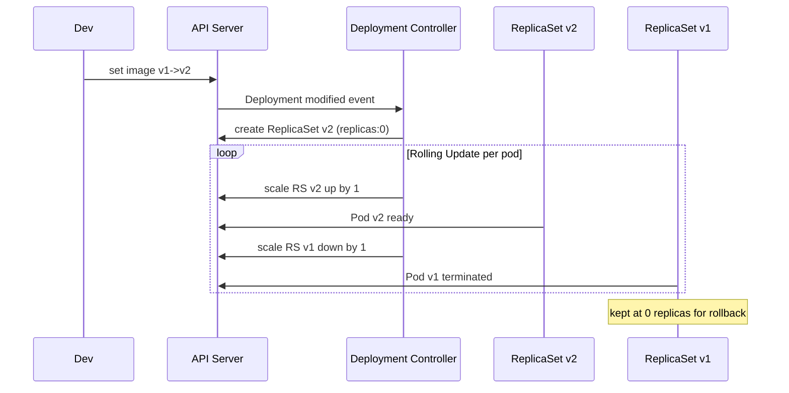

## Keywords in This File

{: .no_toc }

| # | Keyword | Weight |
|---|---------|--------|
| 1 | [Pod](#pod) | critical |
| 2 | [Deployment and ReplicaSet](#deployment-and-replicaset) | critical |
| 3 | [Service and Networking Basics](#service-and-networking-basics) | critical |

---

# Pod

### 🎯 Model Answer

**30 seconds:**
> A Pod is the smallest deployable unit in Kubernetes - it wraps one or more
> containers that share a network namespace and storage. Containers in the same Pod
> communicate via localhost and share volumes. You almost never create Pods directly;
> you create Deployments or StatefulSets that manage Pods for you, handling restarts
> and replacements automatically.

**3 minutes (Senior):**
> The Pod abstraction exists because some applications are composed of tightly-coupled
> processes that must co-locate. For example, a web server plus a log-shipping sidecar
> that must read the same log files. These two containers share a network namespace
> (same IP, same port space) and can share volumes. This is the "sidecar pattern" -
> one main container plus supporting containers in the same Pod.
>
> The key design choice: the Pod is the unit of scheduling. The Kubernetes scheduler
> places Pods (not individual containers) onto nodes. All containers in a Pod always
> run on the same node. This guarantees co-location for sidecar use cases.
>
> In practice, Pods are ephemeral. A Pod can be killed and replaced with a new Pod
> that has a different IP. This is why you never address Pods directly by IP - you
> use Services, which provide a stable virtual IP that load-balances across healthy
> Pods. The Pod lifecycle: Pending -> Running -> Succeeded/Failed/Unknown.
>
> Direct Pod creation is appropriate only for one-off debugging tasks. For anything
> that needs to stay running, use a controller (Deployment for stateless, StatefulSet
> for stateful, DaemonSet for per-node).

**Framework:** WHAT -> WHY -> HOW -> TRADE-OFF -> EXAMPLE

*Adapting up:* Add: init containers (run before app containers, useful for setup
tasks), container lifecycle hooks (postStart, preStop), Pod disruption budgets
(minimum available during voluntary disruptions), and Quality of Service classes
(Guaranteed, Burstable, BestEffort based on resource requests/limits).

*Adapting down:* "A Pod is a wrapper around one or more containers. Think of it
as one 'instance' of your application in Kubernetes."

**Blank Mind Recovery:**

**(1) Restate:** "You're asking about Pods - the fundamental Kubernetes unit.
Let me explain: what it is, why containers are grouped, and how the lifecycle works."

**(2) First principles:** "From first principles: containers are isolated processes.
Some apps need tightly-coupled co-located processes (app + sidecar). The Pod groups
them: same network, same node, same lifecycle."

**(3) Bridge:** "A Pod is like a server process group - multiple processes on the
same virtual machine that share networking but each have their own filesystem."

---

### 📘 Concept Explanation

**What it is:**
A Pod is the smallest deployable compute unit in Kubernetes. It encapsulates one
or more application containers, shared storage volumes, and a unique network identity
(one IP address per Pod). Containers within a Pod share the same network namespace
(localhost) and can share volumes.

**The problem it solves:**
Docker's model is one process per container. Some applications consist of tightly
coupled processes that must co-locate and share resources: a main app container
plus a log shipper, a data processor plus a monitoring agent, a web server plus
a configuration reloader. The Pod models these as a single schedulable unit,
guaranteeing co-location without running them as a single monolithic container.

**How it works:**
```
Pod (one IP: 10.0.0.5)
+-----------------------------------+
| Container A (app)                 |
|  - listens on :8080               |
|  - writes logs to /var/log/app/   |
+-----------------------------------+
| Container B (log-shipper sidecar) |
|  - reads from /var/log/app/       |
|  - ships to central logging       |
+-----------------------------------+
| Shared Volume: /var/log/app/      |
+-----------------------------------+
All containers: same IP, same hostname
Container B reaches Container A via localhost:8080
```

Pod phases:
- Pending: Pod accepted but containers not yet running (image pull, scheduling)
- Running: at least one container running
- Succeeded: all containers exited with code 0 (batch jobs)
- Failed: at least one container exited non-zero and won't restart
- Unknown: node lost contact, status unknown

**The key insight:**
Pods are ephemeral by design. When a Pod dies, Kubernetes creates a NEW Pod with a
new IP, not resurrect the old one. This is why Services (stable virtual IP pointing
to pods) are essential - they decouple consumers from the ephemeral Pod IPs. Never
hardcode Pod IPs anywhere.

**When to use it:**
- Use multi-container Pods for sidecar, ambassador, and adapter patterns
- Direct Pod creation only for debugging (`kubectl run --rm -it` for interactive sessions)
- Otherwise, always use a controller (Deployment, StatefulSet, DaemonSet, Job)

**When NOT to use it:**
- Don't run multiple independent services in one Pod - use separate Pods
- Don't run a database in a Pod without a StatefulSet (you'll lose data on rescheduling)
- Don't address Pods by IP directly - use Services

**Alternatives:**
- Containers on a single VM - fine for small apps, no scheduling or HA
- Separate Pods per process - correct for independently scalable services

**First-principles derivation:**
Given containers solve isolation and portability, and some apps require tightly coupled
co-located processes, we need a unit above the container but below the deployment.
The Pod is exactly this unit: it groups containers that must co-locate, giving them
shared network identity and volume access, while keeping them independently restartable.

---

### 💻 Code Example

> **Code walkthrough:** The BAD example shows what not to do - creating a Pod
> directly without a controller. The GOOD multi-container Pod shows the sidecar
> pattern: app container plus a sidecar sharing a volume. The init container pattern
> shows how to run setup logic before the main container starts. The key lesson:
> never create standalone Pods in production - always use controllers.

```yaml
# BAD: direct Pod creation - no restart, no rollout, no self-healing
apiVersion: v1
kind: Pod
metadata:
  name: my-app-pod      # fixed name, can't have replicas, no rollout
spec:
  containers:
  - name: app
    image: my-app:latest # also bad: latest tag - not pinned
```

```yaml
# GOOD: multi-container Pod with sidecar (log shipper)
apiVersion: v1
kind: Pod
metadata:
  name: app-with-sidecar
  labels:
    app: my-app
spec:
  # init container: runs BEFORE app containers start
  initContainers:
  - name: wait-for-db
    image: busybox:1.35
    command: ['sh', '-c',
      'until nc -z db-service 5432; do sleep 2; done']

  containers:
  # main application container
  - name: app
    image: my-app:1.2.3
    ports:
    - containerPort: 8080
    volumeMounts:
    - name: logs
      mountPath: /var/log/app       # writes logs here

  # sidecar: reads logs written by app container above
  - name: log-shipper
    image: fluentbit:2.0
    volumeMounts:
    - name: logs
      mountPath: /var/log/app       # same path, shared volume

  volumes:
  - name: logs
    emptyDir: {}                    # shared in-memory volume

  # graceful shutdown: give app 30s to finish in-flight requests
  terminationGracePeriodSeconds: 30
```

> **Code walkthrough:** The init container ensures the database is reachable before
> the app starts - solving startup ordering. The sidecar shares the `logs` volume with
> the main container - both see the same files, the core sidecar use case. `emptyDir`
> volumes are ephemeral (data lost on pod death); use PVCs for persistence.
> `terminationGracePeriodSeconds` gives the app time to finish in-flight requests
> before SIGKILL - without this, requests in progress are abruptly cut during
> rolling updates.

---

### 🎓 Answers by Seniority

**Junior / Mid (0-5 years):**
> A Pod is the smallest unit in Kubernetes - it wraps one or more containers and
> gives them a shared IP address. Most of the time you create Deployments, not Pods
> directly, because Deployments manage the Pod lifecycle for you. If a Pod fails,
> the Deployment controller creates a new one. `kubectl get pods` shows running Pods,
> and `kubectl describe pod <name>` shows detailed status and events.

*Push deeper:* Explain the difference between container restarts within a Pod (same IP
preserved) vs Pod deletion and recreation (new IP assigned).

---

**Senior / Staff (5+ years):**
> Pods are the unit of scheduling AND security isolation in Kubernetes. The security
> implication: containers in the same Pod share a network namespace - they can call
> each other on localhost and NetworkPolicy cannot isolate them from each other.
> Only separate Pods can be isolated by NetworkPolicy. Teams accidentally co-locate
> untrusted third-party sidecars with sensitive app containers - those sidecars can
> call the app's localhost endpoints. Also critical: Pod Quality of Service (QoS) -
> if resource requests equal limits, you get Guaranteed QoS (last evicted under
> memory pressure). Always set requests=limits for production pods to get Guaranteed
> QoS and avoid unpredictable evictions.

*Push deeper:* Discuss Pod disruption budgets (PDBs) - they protect Pods during
voluntary disruptions (node drains, cluster upgrades) by preventing Kubernetes from
killing too many replicas at once.

---

### ⚠️ Common Misconceptions

**Misconception 1: "You should create Pods directly for simple deployments."**
Never create standalone Pods in production. A Pod without a controller has no
self-healing. If the node fails, the Pod is gone permanently. Always use Deployments,
StatefulSets, Jobs, or DaemonSets.

**Misconception 2: "Containers in the same Pod are network-isolated."**
They share the same IP and can call each other on localhost. NetworkPolicy cannot
isolate containers within a Pod. If you need network isolation, use separate Pods.

**Misconception 3: "A Pod restart preserves its IP address."**
Container restarts within a running Pod preserve the Pod IP. But if the Pod is
deleted and recreated (node failure, rolling update), the new Pod gets a NEW IP.
Always use Services, not Pod IPs directly.

**Misconception 4: "emptyDir volumes persist across Pod restarts."**
emptyDir survives container restarts within the same Pod. It is erased when the Pod
itself is deleted, evicted, or rescheduled. Never use emptyDir for data you need
to persist across pod lifecycle events - use PersistentVolumeClaims.

---

### 🚨 Failure Modes and Diagnosis

**Failure 1: OOMKilled - container exceeds memory limit**
Symptom: pod restarts; `kubectl describe pod` shows `OOMKilled` reason; exit code 137.
Cause: container used more memory than its `resources.limits.memory`.
Diagnostic: `kubectl describe pod <pod>` -> Last State: Terminated, Reason: OOMKilled.
Check memory trend: Prometheus `container_memory_working_set_bytes`.
Fix: increase memory limit or fix memory leak. A crash loop from OOMKill indicates
a leak unless the limit is simply too low.

**Failure 2: Pod stuck in Init state**
Symptom: `Init:0/1` in `kubectl get pods` - stuck waiting for init container.
Cause: init container failing or waiting for a condition that's never satisfied.
Diagnostic: `kubectl logs <pod> -c <init-container-name>`.
`kubectl describe pod` to see init container exit codes.
Common cause: init container waiting for a service with a typo in the name.

**Failure 3: Evicted pods - node under memory pressure**
Symptom: pods show `Evicted` status.
Cause: node running low on memory; kubelet evicts BestEffort and Burstable pods.
Diagnostic: `kubectl describe node <node>` shows memory pressure conditions.
`kubectl get events --field-selector reason=Evicted -A`.
Fix: ensure critical pods have requests=limits (Guaranteed QoS); right-size nodes.

---

### 🎯 Interview Deep-Dive

| Question Category | Time to Answer |
|---|---|
| Definition | 30-60 seconds |
| Mechanism | 1-2 minutes |
| Scenario | 2-3 minutes |
| Debugging | 2-3 minutes |
| Trade-off | 1-2 minutes |
| Design | 1-2 minutes |
| Advanced | 1-2 minutes |

---

**Q1 [JUNIOR] (Definition): What is a Kubernetes Pod?**

A: A Pod is the smallest deployable unit in Kubernetes. It wraps one or more
containers and gives them a shared identity: a single IP address and access to
shared volumes. Containers inside a Pod communicate with each other using localhost
because they share the same network namespace.

In practice, most Pods contain one container. Multi-container Pods are for the
sidecar pattern: a main application container plus supporting containers (log
shippers, config reloaders, monitoring agents) that must co-locate.

You almost never create Pods directly in production. You create Deployments for
stateless apps, StatefulSets for stateful apps, or DaemonSets for per-node Pods.
These controllers create and manage Pods for you, handling restarts and replacements.

*What separates good from great:* Explaining WHY the Pod abstraction exists - because
some applications need tightly-coupled co-located containers, and the Pod is the
scheduling unit that guarantees co-location.

---

**Q2 [MID] (Mechanism): What happens to a Pod's IP when the Pod is restarted?**

A: Two different scenarios:

Container restart within the same Pod: the Pod's IP is PRESERVED. The Pod object
still exists - only the container process restarted. A CrashLoopBackOff pod keeps
the same IP as it cycles through restarts.

Pod deletion and recreation: if the Pod itself is deleted (rolling update, node
failure, manual deletion), the new Pod created by the controller gets a DIFFERENT IP.
There is no continuity between old and new Pod.

This is why Kubernetes Services are essential. A Service has a stable virtual IP
backed by a dynamically updated set of Pod IPs. Consumers address the Service, not
individual Pod IPs, so they're unaffected when Pods are replaced.

Never store a Pod IP anywhere. Use Service DNS names for all inter-service communication.

*What separates good from great:* Knowing StatefulSets ARE different - each Pod gets
a stable DNS name (`pod-0.service.namespace.svc.cluster.local`) that resolves to the
Pod's current IP. This enables stateful apps to maintain stable identity.

---

**Q3 [MID] (Scenario): You need to run a database migration before your web app
starts. How would you implement this in Kubernetes?**

A: The correct pattern is an init container. Init containers run to completion before
app containers start. The migration init container runs migrations, exits 0 on
success, then the web app container starts.

```yaml
spec:
  initContainers:
  - name: db-migrate
    image: my-app:1.2.3
    command: ["python", "manage.py", "migrate"]
    env:
    - name: DATABASE_URL
      valueFrom:
        secretKeyRef:
          name: db-secret
          key: url
  containers:
  - name: web
    image: my-app:1.2.3
    # starts only AFTER db-migrate exits 0
```

Why init containers over alternatives: running migrations in the main container
causes problems with multi-replica Deployments - all 3 replicas attempt migrations
simultaneously. Using a separate Job is valid but more complex to orchestrate.
Init containers are the idiomatic K8s solution: sequential, atomic, tied to Pod lifecycle.

Important: ensure migrations are idempotent (safe to re-run if Pod restarts
mid-migration). If migration fails (non-zero exit), the init container restarts
with backoff and the app never starts.

*What separates good from great:* For zero-downtime schema migrations, combine init
containers with backward-compatible schema changes - the migration must not break
the currently running version while the new one deploys.

---

**Q4 [SENIOR] (Debugging): A Pod has been running for hours but shows Terminating
and never finishes terminating. Why?**

A: A Pod stuck in Terminating is almost always a finalizer or a graceful shutdown
taking too long.

Most common cause: finalizers. Check `kubectl get pod <name> -o yaml | grep -A5
finalizers`. If finalizers are set by a third-party controller (service mesh, storage)
that is broken or removed, the Pod waits indefinitely.
Fix: `kubectl patch pod <name> -p '{"metadata":{"finalizers":null}}'` - removes
finalizers and allows deletion. Only do this if you're certain the finalizer purpose
is irrelevant.

Second cause: terminationGracePeriodSeconds too long or app not handling SIGTERM.
Kubernetes sends SIGTERM, waits the grace period, then sends SIGKILL. If overridden
to 3600s and the app ignores SIGTERM, the Pod appears stuck for an hour.

Third cause: cloud volume detachment taking too long (can take minutes on some
cloud providers).

Force-delete: `kubectl delete pod --force --grace-period=0` bypasses graceful
shutdown and removes the Pod API object. The container may still run on the node
until the node recovers and kubelet cleans it up.

*What separates good from great:* Knowing that force-delete removes the API object
but doesn't guarantee the container is stopped. For node outage scenarios, this is
the correct escalation path.

---

**Q5 [SENIOR] (Trade-off): Sidecar pattern vs embedding in the main container?**

A: Sidecar benefits: separation of concerns. Log shipping, metrics export, certificate
rotation, and config reloading are infrastructure concerns - a separate container
keeps application code clean. The sidecar can be updated independently. Multiple
applications can reuse the same sidecar image. Service mesh (Istio/Linkerd) is the
extreme case: sidecar handles mTLS, traffic management, and observability without
any application code changes.

Sidecar costs: resource overhead (every sidecar adds CPU/memory across all pods);
debugging complexity (check multiple containers' logs); startup ordering complexity;
sidecar crashes affect Pod health reporting.

In-container benefits: simpler architecture, one container to debug, lower resource
usage, no inter-container coordination needed.

In-container costs: application and infrastructure concerns mixed; updating
infrastructure code requires redeploying the app image.

My rule: use sidecars for concerns that are (1) provided by the platform team,
not the app team, (2) needed by many applications, or (3) requiring independent
update cycles. Embed in-container when the concern is application-specific.

*What separates good from great:* The service mesh sidecar represents the extreme
separation - all cross-cutting concerns (encryption, observability, traffic management)
in a language-agnostic sidecar, no application code changes needed.

---

**Q6 [STAFF] (Design): How does Pod QoS affect cluster reliability?**

A: Kubernetes assigns QoS class based on resource configuration, determining eviction
priority when a node runs low on resources.

Guaranteed (last evicted): all containers have cpu.requests == cpu.limits AND
memory.requests == memory.limits. Most predictable performance.
Use for production workloads where interruption is unacceptable.

Burstable (medium priority): at least one container has requests or limits but
not Guaranteed. Evicted before BestEffort Pods.

BestEffort (first evicted, DO NOT USE in production): no resource requests or
limits at all. First killed during any node memory pressure event.

Design implication: for production, all critical Pods should be Guaranteed.
Set requests = limits. Tradeoff: reduces bin-packing efficiency (scheduler can't
overcommit) but eliminates unpredictable OOMKills and evictions.

CPU vs memory: CPU is compressible (throttled when over limit, not killed).
Memory is incompressible (process killed on OOM limit breach). CPU throttling
degrades performance; memory limit breach kills the process. Set memory limits
carefully - too low causes OOMKills; too high risks node overcommit.

*What separates good from great:* Using separate node pools for reliability tiers -
guaranteed node pool with tight resource definitions for production workloads;
a burstable/spot node pool for batch and non-critical work.

---

**Q7 [STAFF] (Advanced): What are Pod Disruption Budgets and when do you need them?**

A: A PodDisruptionBudget (PDB) limits the number of pods that can be voluntarily
disrupted simultaneously - during node drains, cluster upgrades, or planned maintenance.

The problem: during a Kubernetes node upgrade, the cluster drains nodes by evicting
pods. Without a PDB, the cluster might drain 2 nodes simultaneously, reducing a
3-replica Deployment to 0 replicas - full outage during maintenance.

```yaml
apiVersion: policy/v1
kind: PodDisruptionBudget
metadata:
  name: my-app-pdb
spec:
  minAvailable: 2       # always keep at least 2 pods running
  selector:
    matchLabels:
      app: my-app
```

Or `maxUnavailable: 1` - at most 1 pod unavailable at once.

When you need it: any service with 2+ replicas that cannot tolerate downtime during
maintenance windows. PDBs apply only to VOLUNTARY disruptions (node drains, eviction
API). They do NOT protect against node failures (involuntary) - a dying node takes
its pods regardless.

Critical trap: `minAvailable: replica_count` makes the cluster undrainable - node
drain blocks waiting for PDB compliance but can never satisfy it. Set minAvailable
to at most replica_count - 1.

*What separates good from great:* PDBs interact with PodDisruptionBudget-aware
operators and cluster upgrade tools (e.g., kOps, Cluster API) that respect PDBs
during rolling node upgrades. Without PDBs, even well-intentioned rolling upgrades
can cause service disruptions.

---

### ⚖️ Comparison Table

*(Omit: L1 foundational keyword - Pod has no direct alternatives as the
fundamental K8s unit. Controller comparison at L2 Workloads file.)*

---

### 🏛️ System Design

*(Omit: L1 foundational keyword - system design covered at L4/L5 level.)*

---

### 📊 Diagram

```
Pod Architecture:
+---------------------------------------+
| Pod (IP: 10.0.1.5)                    |
|                                       |
| [Init Container]  (runs first, exits) |
|  wait-for-db: nc -z db:5432           |
|        |                              |
|        v (exits 0)                    |
| [Main Container]  [Sidecar Container] |
|  app:8080          log-shipper        |
|  writes /logs  <-- reads /logs        |
|                                       |
| [Shared Volume: emptyDir /logs]       |
+---------------------------------------+
        |
   Node: worker-1
   (all containers always same node)
```



> **Diagram walkthrough:** A Pod follows a defined state machine. Init containers
> run first and must exit 0 before app containers start - this solves startup ordering.
> App and sidecar containers run in parallel, sharing volumes. The Running self-loop
> represents container restarts within the same Pod - the Pod IP is preserved.
> Terminating begins when delete is requested; the Pod is fully removed after
> terminationGracePeriodSeconds elapses or all containers exit.

---
---

# Deployment and ReplicaSet

### 🎯 Model Answer

**30 seconds:**
> A Deployment is the standard way to run stateless applications in Kubernetes.
> You declare the desired state ("3 replicas of this container at this image version"),
> and the Deployment controller creates and manages a ReplicaSet to ensure exactly
> that many healthy Pods are running at all times. Deployments also handle rolling
> updates - gradually replacing old Pods with new ones without downtime.

**3 minutes (Senior):**
> The Deployment API gives you three things: replica management, rolling updates,
> and rollback. The Deployment creates a ReplicaSet, which owns a set of Pods. When
> you update a Deployment (new image, new config), it creates a NEW ReplicaSet with
> the new spec and gradually scales it up while scaling the old one down - this is
> the rolling update. If something goes wrong, you roll back to the previous
> ReplicaSet with one command.
>
> The ReplicaSet's job is simple: maintain exactly N running pods matching the selector.
> If a Pod dies, the ReplicaSet creates a replacement. You almost never interact with
> ReplicaSets directly - the Deployment manages them.
>
> Rolling updates are controlled by two settings: `maxSurge` (how many extra Pods
> can exist during rollout) and `maxUnavailable` (how many Pods can be down during
> rollout). The default is 25% for both. For a 4-replica Deployment: at most 5 Pods
> and at least 3 during any rollout.

**Framework:** WHAT -> WHY -> HOW -> TRADE-OFF -> EXAMPLE

*Adapting up:* Add rolling update strategy (RollingUpdate vs Recreate), the Deployment/
ReplicaSet/Pod ownership chain, revision history limit, and pause/resume for staged rollouts.

*Adapting down:* "A Deployment keeps N copies of your app running. When you change
the image, it rolls out gradually. If the update goes wrong, one command rolls back."

**Blank Mind Recovery:**

**(1) Restate:** "Deployment and ReplicaSet - Deployment = user-facing controller
for stateless apps; ReplicaSet = internal pod count maintainer."

**(2) First principles:** "You want N instances running, replacement on failure,
and version updates without downtime. Deployment provides all three."

**(3) Bridge:** "A Deployment is like a factory floor manager - keeps N workers
on the floor, hires replacements when someone leaves, and gradually transitions
everyone to new uniforms while keeping the floor staffed."

---

### 📘 Concept Explanation

**What it is:**
A Deployment is a Kubernetes controller that manages stateless application workloads.
It maintains a desired number of Pod replicas using a ReplicaSet, handles rolling
updates to new versions, and enables rollback. A ReplicaSet ensures exactly N Pods
matching a selector exist at all times.

**The problem it solves:**
Without Deployments: manually create Pods (no self-healing), manually delete/recreate
for updates (downtime), no rollback mechanism. Deployments automate the full lifecycle.

**How it works:**
```
Deployment (desired: 3 replicas, image: v2)
  |
  +-- ReplicaSet (new, v2) [scaling up: 0->3]
  |     Pod v2, Pod v2, Pod v2
  |
  +-- ReplicaSet (old, v1) [scaling down: 3->0]
        Pod v1 (terminating)

Rolling update: creates new RS, scales it up,
scales old RS down, alternating until complete.
Old RS kept at 0 replicas for rollback history.
```

Rolling update parameters:
- `maxSurge: 25%` - up to 1 extra Pod can exist (of 4 replicas)
- `maxUnavailable: 25%` - at most 1 Pod can be missing (of 4 replicas)
- Result: 3-5 Pods running throughout a 4-replica rollout

**The key insight:**
Deployments keep old ReplicaSets (scaled to 0) for `revisionHistoryLimit` revisions
(default 10). Rollback is instant because it re-scales the old ReplicaSet. No
re-deployment from scratch - just a reverse rolling update.

**When to use it:**
- Stateless services: web servers, APIs, workers
- Any service where multiple identical replicas can run simultaneously
- Any service needing zero-downtime rolling updates

**When NOT to use it:**
- Stateful services with stable Pod identity or storage (StatefulSet)
- One Pod per node (DaemonSet)
- Batch/one-time tasks (Job or CronJob)
- Singleton workloads that must not have 2 running simultaneously

**Alternatives:**
- StatefulSet - ordered deployment, stable network identity, persistent storage
- DaemonSet - exactly one Pod per node
- Job - runs to completion, not continuously

**First-principles derivation:**
A running service needs: N copies for availability, replacement when a copy dies,
update without downtime, and the ability to undo a bad update. ReplicaSet provides
the first two. Deployment adds the last two by managing a series of ReplicaSets
as versions.

---

### 💻 Code Example

> **Code walkthrough:** A production-grade Deployment with rolling update strategy,
> resource limits, readiness/liveness probes, and pod anti-affinity for HA. The
> rollout commands show the operational workflow every K8s user needs to know.

```yaml
# BAD: Deployment without readiness probe or resource limits
apiVersion: apps/v1
kind: Deployment
metadata:
  name: web-app
spec:
  replicas: 3
  selector:
    matchLabels:
      app: web-app
  template:
    metadata:
      labels:
        app: web-app
    spec:
      containers:
      - name: web
        image: web-app:latest   # unpinned - dangerous
        # no resources, no probes - will cause production incidents
```

```yaml
# GOOD: production-grade Deployment
apiVersion: apps/v1
kind: Deployment
metadata:
  name: web-app
  annotations:
    kubernetes.io/change-cause: "v1.2.3: add rate limiting"
spec:
  replicas: 3
  revisionHistoryLimit: 5
  selector:
    matchLabels:
      app: web-app
  strategy:
    type: RollingUpdate
    rollingUpdate:
      maxSurge: 1          # 1 extra pod allowed during update
      maxUnavailable: 0    # never reduce below desired count
  template:
    metadata:
      labels:
        app: web-app
    spec:
      containers:
      - name: web
        image: web-app:1.2.3
        resources:
          requests:
            cpu: "250m"
            memory: "128Mi"
          limits:
            cpu: "500m"
            memory: "256Mi"
        readinessProbe:
          httpGet:
            path: /actuator/health/readiness
            port: 8080
          initialDelaySeconds: 10
          periodSeconds: 5
          failureThreshold: 3
        livenessProbe:
          httpGet:
            path: /actuator/health/liveness
            port: 8080
          initialDelaySeconds: 30
          periodSeconds: 15
      affinity:
        podAntiAffinity:
          preferredDuringSchedulingIgnoredDuringExecution:
          - weight: 100
            podAffinityTerm:
              labelSelector:
                matchLabels:
                  app: web-app
              topologyKey: kubernetes.io/hostname
```

```bash
# Operational commands
kubectl rollout status deployment/web-app
kubectl rollout history deployment/web-app
kubectl rollout undo deployment/web-app
kubectl rollout undo deployment/web-app --to-revision=3
kubectl rollout pause deployment/web-app
kubectl rollout resume deployment/web-app
```

> **Code walkthrough:** `maxUnavailable: 0` with `maxSurge: 1` maintains 100%
> capacity throughout the rollout - creates one new pod, waits for readiness, then
> terminates one old pod. Slower than default (25%/25%) but maintains full capacity.
> `change-cause` annotation appears in `kubectl rollout history` for context.
> Pod anti-affinity prevents all 3 replicas landing on the same node.
> `revisionHistoryLimit: 5` keeps 5 old ReplicaSets for rollback.

---

### 🎓 Answers by Seniority

**Junior / Mid (0-5 years):**
> A Deployment manages a group of identical Pods for a stateless app. You specify
> how many replicas you want and which container image to run. If a Pod crashes, the
> Deployment creates a new one. When you update the image version, it does a rolling
> update - gradually replacing old Pods with new ones without downtime. If the update
> goes wrong, `kubectl rollout undo` takes you back. A ReplicaSet is what the
> Deployment creates internally to manage pod count - you don't interact with it directly.

*Push deeper:* What happens when you `kubectl apply` a Deployment with a different
image - the Deployment detects the spec change, creates a new ReplicaSet, and begins
the rolling update.

---

**Senior / Staff (5+ years):**
> The Deployment/ReplicaSet architecture is a two-level ownership chain. The old
> ReplicaSet being kept at 0 replicas is what enables instant rollback. Operational
> trap: with maxUnavailable:0, a failing rollout (new pods failing readiness) stalls
> forever - can't scale down old RS because it would violate maxUnavailable. You must
> actively rollback or fix. Always set `progressDeadlineSeconds` (e.g., 600) so the
> Deployment reports DeadlineExceeded after 10 minutes, triggering an alert.
> Another trap: `revisionHistoryLimit: 0` removes rollback capability entirely.
> Keep at least 3-5 revisions.

*Push deeper:* Deployment pause/resume - pause before multiple changes, apply them
all without triggering intermediate rollouts, then resume.

---

### ⚠️ Common Misconceptions

**Misconception 1: "Deleting a ReplicaSet deletes the Deployment."**
Deleting a RS owned by a Deployment causes the Deployment to immediately create a
replacement RS. The Deployment is the source of truth; RS is an implementation detail.

**Misconception 2: "Rolling updates are zero-downtime by default."**
Default settings (maxUnavailable: 25%) DO reduce capacity. For 4 replicas, 1 Pod can
be down. For true zero-downtime, set maxUnavailable: 0 and maxSurge: 1.

**Misconception 3: "kubectl rollout undo just reverts the image."**
`rollout undo` reverts the entire previous ReplicaSet spec - image AND all other
pod spec changes (resource limits, env vars, probes). A complete spec revert.

**Misconception 4: "ReplicaSet ensures Pods are healthy."**
ReplicaSet ensures Pod COUNT matches desired number. A Pod can be RUNNING but
unhealthy (readiness failing). The Service removes it from endpoints, but the
ReplicaSet counts it as running and doesn't replace it.

---

### 🚨 Failure Modes and Diagnosis

**Failure 1: Rollout stalled - new pods never become Ready**
Symptom: `kubectl rollout status` hangs; new pods show 0/1 READY.
Cause: readiness probe failing (misconfiguration, app startup bug, missing config)
or resource limits too tight.
Diagnostic: `kubectl describe pod <new-pod>` for readiness failures and events.
`kubectl logs <new-pod>` for application errors.
Fix: rollback with `kubectl rollout undo` while fixing root cause.
Prevention: `progressDeadlineSeconds: 300`.

**Failure 2: Old ReplicaSets consuming resources**
Symptom: `kubectl get rs` shows dozens of zero-replica RS objects.
Cause: revisionHistoryLimit too high with frequent deployments.
Fix: set `revisionHistoryLimit: 3`; manually delete old RS.

**Failure 3: progressDeadlineSeconds exceeded**
Symptom: deployment shows `ProgressDeadlineExceeded`; rollout timed out.
Cause: rollout took longer than progressDeadlineSeconds (default 600s).
Diagnostic: check pod events for why pods aren't becoming ready.
Fix: address root cause; `kubectl rollout undo`.

---

### 🎯 Interview Deep-Dive

| Question Category | Time to Answer |
|---|---|
| Definition | 30-60 seconds |
| Mechanism | 1-2 minutes |
| Scenario | 2-3 minutes |
| Debugging | 2-3 minutes |
| Trade-off | 1-2 minutes |
| Design | 1-2 minutes |
| Advanced | 1-2 minutes |

---

**Q1 [JUNIOR] (Definition): What is the difference between a Deployment and a ReplicaSet?**

A: A ReplicaSet's sole job is to maintain a fixed number of identical Pods. It watches
for pod failures and creates replacements. It has no concept of versions or updates.

A Deployment is a higher-level controller that manages ReplicaSets. When you create
a Deployment, it creates a ReplicaSet for you. When you update the Deployment (new
image, config change), it creates a NEW ReplicaSet with the updated spec and gradually
shifts pods from old to new - the rolling update. The old ReplicaSet is kept at 0
replicas for rollback purposes.

In practice: always create Deployments, never ReplicaSets directly. The Deployment
is the user-facing API; ReplicaSet is its implementation detail.

*What separates good from great:* The old RS kept at 0 replicas is what enables
instant rollback - `kubectl rollout undo` simply re-scales the old RS.

---

**Q2 [MID] (Mechanism): What happens step-by-step when you update a Deployment image?**

A: The exact sequence:

1. `kubectl set image deployment/app app=app:v2` or `kubectl apply` with updated YAML.
2. API Server updates the Deployment spec.
3. Deployment controller detects the spec change, creates a NEW ReplicaSet with v2
   spec, starting at 0 replicas.
4. Rolling update begins: scale up new RS (per maxSurge), wait for pods to pass
   readiness probe, then scale down old RS (per maxUnavailable). Repeat until done.
5. `kubectl rollout status` shows progress.
6. Once all new pods are Ready and old pods terminated, rollout is complete.
7. Old ReplicaSet remains at 0 replicas for rollback history.

If new pods fail readiness at step 4 with maxUnavailable:0, the old RS can't be
scaled down - rollout stalls until progressDeadlineSeconds elapses.

*What separates good from great:* `kubectl rollout undo` doesn't re-deploy from
scratch - it updates the Deployment template to match the previous RS spec and runs
a reverse rolling update.

---

**Q3 [MID] (Scenario): A Deployment rollout is taking much longer than expected.**

A: `kubectl rollout status deployment/<name>` shows current state.

Step 1: `kubectl get pods -l app=<selector>` - see both old and new pod states.
Are new pods starting (Running) or stuck (Pending/Init)?

Step 2: Check new pod readiness:
`kubectl describe pod <new-pod>` - look at Readiness section and Events.
Readiness probe failing: is initialDelaySeconds too aggressive? Application bug?
Missing ConfigMap or Secret?

Step 3: If pods are Pending: check capacity.
`kubectl describe pod <new-pod>` Events: Insufficient CPU/memory.
`kubectl describe nodes` for available resources.

Step 4: Check image pull:
ImagePullBackOff means the image tag doesn't exist or credentials are wrong.

Step 5: Check rollout strategy:
With maxUnavailable:0, the rollout creates one pod at a time and waits for readiness.
With a 60s readiness check, a 10-pod Deployment takes 10+ minutes minimum - expected.

*What separates good from great:* `kubectl rollout pause` to stop progress while
investigating; `kubectl rollout undo` to roll back immediately if needed.

---

**Q4 [SENIOR] (Scenario): Deploying a new version that requires a database migration.
How do you safely roll it out?**

A: The challenge: rolling updates create a period where old and new app versions
run simultaneously. The new version may require a schema the old version can't handle.

Safe strategy - expand/contract schema migration:

Phase 1 - Backward-compatible migration: add new columns/tables without removing
anything old. Both v1 (reads old schema) and v2 (reads new schema) work simultaneously.

Phase 2 - Rolling update to v2: old and new pods coexist; both work against the
same backward-compatible schema.

Phase 3 - Contract migration: once 100% v2 deployed, remove old columns no longer needed.

In Kubernetes: Phase 1 is a Helm pre-upgrade hook or standalone Job that runs
before the Deployment update. The Job's completion gates the rollout.

Anti-pattern: schema change that breaks old app running simultaneously with rolling
update. If new column is NOT NULL without default, v1 pods inserting rows fail -
production errors during rollout.

*What separates good from great:* This is classic online schema migration (pt-online-
schema-change, gh-ost for MySQL; pg_repack for Postgres). Kubernetes doesn't solve
this - the migration strategy is the application team's responsibility.

---

**Q5 [SENIOR] (Trade-off): When should you use Recreate strategy instead of RollingUpdate?**

A: `strategy.type: Recreate` terminates ALL old pods before creating new ones,
causing brief downtime. Correct when:

Single-instance stateful apps: in-memory state that can't be shared between two
concurrent instances (embedded database, in-memory lock manager). Running two versions
simultaneously causes data corruption.

Exclusive resource requirements: new version needs resources the old version holds
(GPU, hardware lock, specific port) - old must terminate first.

Breaking API changes: v2 and v1 cannot coexist (incompatible message formats,
exclusive registration with external service).

Non-backward-compatible schema migrations: when expand/contract is too complex.

Schedule Recreate rollouts during low-traffic maintenance windows. Add a maintenance
page via ingress during transition.

*What separates good from great:* If your stateless service NEEDS Recreate, it likely
has hidden state preventing horizontal scaling - an architecture problem, not
a deployment strategy preference.

---

**Q6 [STAFF] (Advanced): What happens to in-flight requests during a rolling update?**

A: In-flight handling is a multi-layer concern:

Layer 1 - Endpoint removal: Kubernetes removes a terminating pod from Service
endpoints BEFORE sending SIGTERM. But endpoint propagation via kube-proxy takes
some time - brief window where traffic might still reach the terminating pod.

Layer 2 - preStop hook: bridge this gap with a short sleep:
```yaml
lifecycle:
  preStop:
    exec:
      command: ["/bin/sh", "-c", "sleep 5"]
```
This delays SIGTERM, giving endpoint removal time to propagate.

Layer 3 - Application graceful shutdown: when SIGTERM arrives, the app should
stop accepting new connections, finish in-flight requests, then exit.
Spring Boot: `server.shutdown: graceful`. Configure `terminationGracePeriodSeconds`
to give enough time.

Layer 4 - Connection draining: configure ingress controller's drain timeout to
match terminationGracePeriodSeconds.

Safe shutdown sequence: preStop sleep -> SIGTERM -> app finishes in-flight requests
-> app exits -> SIGKILL if grace period exceeded.

*What separates good from great:* Without preStop sleep, there's a race condition:
SIGTERM sent but kube-proxy hasn't updated iptables - new requests arrive at a pod
that's shutting down and get connection refused.

---

**Q7 [STAFF] (Deep Dive): How does the Deployment controller use a watch/reconcile loop?**

A: The Deployment controller uses the Kubernetes watch API and implements reconciliation:

1. On startup, the controller initializes informers (watch + local cache) for
   Deployments, ReplicaSets, and Pods.

2. The informer receives watch events (ADDED, MODIFIED, DELETED) from the API Server
   and updates its local cache.

3. For each Deployment change event, the controller enqueues the Deployment key into
   a rate-limited work queue.

4. Worker goroutines dequeue keys and run the reconcile function:
   a. List ReplicaSets owned by this Deployment (via ownerReferences)
   b. Calculate desired state: which RS should have N replicas?
   c. Update replica counts via API Server if current doesn't match desired
   d. If new template: create new ReplicaSet, begin rolling update

5. All changes go through the API Server -> etcd -> notifications to other informers
   -> kubelet triggers actual container start/stop.

This is the controller pattern: watch -> enqueue -> reconcile -> act via API Server.
If the controller crashes mid-rollout and restarts, it reconciles from current etcd
state and continues where it left off.

*What separates good from great:* The controller doesn't use a polling sleep - it
uses the watch API (persistent HTTP/2 connection pushing events). This makes the
controller event-driven with near-zero latency between a Pod dying and the controller
creating a replacement.

---

### ⚖️ Comparison Table

*(Omit: L1 foundational keyword - Deployment vs StatefulSet vs DaemonSet
comparison is covered in the L2 Workloads file.)*

---

### 🏛️ System Design

*(Omit: L1 foundational keyword - not applicable at this level.)*

---

### 📊 Diagram

```
Deployment Rolling Update:

Before update:
Deployment -> ReplicaSet-v1 [Pod-v1, Pod-v1, Pod-v1]

During update (maxSurge:1, maxUnavailable:0):
Deployment -> ReplicaSet-v2 [Pod-v2(ready), Pod-v2]
          -> ReplicaSet-v1 [Pod-v1(terminating), Pod-v1]

After update:
Deployment -> ReplicaSet-v2 [Pod-v2, Pod-v2, Pod-v2]
          -> ReplicaSet-v1 [] (0 replicas, kept for rollback)
```



> **Diagram walkthrough:** The Deployment controller creates a new ReplicaSet for
> the new version and gradually shifts replicas from old to new. Scale up one new pod,
> wait for readiness probe, scale down one old pod. The old ReplicaSet is preserved
> at 0 replicas - `kubectl rollout undo` re-scales it back to N and runs a reverse
> rolling update. All state changes go through the API Server; the controller is
> purely event-driven, never polling.

---
---

# Service and Networking Basics

### 🎯 Model Answer

**30 seconds:**
> A Kubernetes Service is a stable network endpoint that routes traffic to a dynamic
> set of Pods selected by label. Since Pod IPs change when pods are replaced, Services
> provide a stable virtual IP (ClusterIP) and DNS name. The Service load-balances
> across matching Pods and automatically removes Pods failing readiness probes from
> the rotation.

**3 minutes (Senior):**
> Pod IPs are ephemeral - when a pod is replaced, the new pod gets a different IP.
> Services solve this with a stable virtual IP (ClusterIP) backed by kube-proxy,
> which maintains iptables (or IPVS) rules on every node. When a packet hits the
> ClusterIP:port, kube-proxy rewrites the destination to one of the healthy Pod IPs
> via DNAT.
>
> The three common Service types: ClusterIP (cluster-internal only), NodePort
> (expose on every node's port), and LoadBalancer (provision a cloud load balancer).
> For production external traffic, the standard pattern is ClusterIP + Ingress
> controller rather than LoadBalancer per service - cheaper and more routing flexibility.
>
> Services find pods via label selectors, not IP lists. Any Pod with matching labels
> is automatically added to the Service's endpoints. When a Pod fails its readiness
> probe, Kubernetes removes its IP from the Endpoints object - traffic stops going
> to it without any manual intervention.

**Framework:** WHAT -> WHY -> HOW -> TRADE-OFF -> EXAMPLE

*Adapting up:* Add headless Services (for StatefulSets), EndpointSlices (replacing
Endpoints for scalability), ExternalName Services, and kube-proxy IPVS mode
vs iptables scalability tradeoffs.

*Adapting down:* "A Service is a stable address for your pods. The Service DNS name
stays constant while pod IPs change. Format: service-name.namespace.svc.cluster.local"

**Blank Mind Recovery:**

**(1) Restate:** "Kubernetes Service - stable network endpoint for pods. Let me
cover: why (pod IP ephemerality), how (kube-proxy + iptables), and the types
(ClusterIP, NodePort, LoadBalancer, Headless)."

**(2) First principles:** "Pod IPs change on restart. Something must provide a
stable address. Service = stable address, updated dynamically as pods come and go."

**(3) Bridge:** "A Service is like a department phone number - the staff (pods)
change over time, but the number (ClusterIP) stays the same."

---

### 📘 Concept Explanation

**What it is:**
A Kubernetes Service is an abstraction that exposes a logical set of Pods as a
network endpoint. It provides a stable DNS name and virtual IP (ClusterIP) that
automatically routes to healthy Pods matching its label selector. Services decouple
consumers from ephemeral Pod IPs.

**The problem it solves:**
Pod IPs are ephemeral. Every time a Pod is created (rolling update, node failure,
scaling), it gets a new IP. Services provide stable addressing backed by dynamic
endpoint tracking - the ClusterIP stays constant while Pod IPs change freely.

**How it works:**
```
Client Pod -> ClusterIP:80 -> kube-proxy (iptables/IPVS)
                                    |
                       +--endpoints--+
                       |     |     |
                   Pod-1:8080 Pod-2:8080 Pod-3:8080
                   (ready)   (ready)   (NOT ready - removed)
```

DNS: CoreDNS resolves `my-service.my-namespace.svc.cluster.local` to the ClusterIP.
Within the same namespace, just `my-service` works.

kube-proxy runs on every node, watches the Endpoints API, and updates iptables rules
to DNAT traffic from ClusterIP:port to backend Pod IPs. iptables random selection
provides basic round-robin load balancing.

**The key insight:**
Services don't proxy traffic - they are pure network address translation. The packet
leaves the client Pod, hits the ClusterIP in iptables on the local node, gets DNAT'd
to a Pod IP, and goes directly to that Pod. No proxy in the data path means essentially
zero overhead.

**When to use it:**
- ClusterIP: all internal service-to-service communication (90%+ of services)
- NodePort: development/testing quick external access
- LoadBalancer: single-service external exposure with a cloud LB
- Headless (clusterIP: None): StatefulSets needing per-pod DNS addressing

**When NOT to use it:**
- Don't use NodePort in production for external traffic - use Ingress
- Don't use LoadBalancer for every service - one Ingress + ClusterIP services
- Don't address Pod IPs directly

**Alternatives:**
- Ingress - L7 HTTP routing by host/path to multiple Services
- Service mesh (Istio/Linkerd) - replaces kube-proxy with Envoy for mTLS and L7
- ExternalName Service - DNS alias to external hostnames

**First-principles derivation:**
Given (a) pods have ephemeral IPs and (b) services need stable addresses, we need
a directory of "which IPs are currently serving service X". The Endpoints controller
maintains this directory. kube-proxy translates ClusterIP to Pod IP in the kernel.
This is the minimal architecture to solve pod IP ephemerality with zero runtime overhead.

---

### 💻 Code Example

> **Code walkthrough:** The three main Service types and the production pattern
> (Ingress + ClusterIP). The Ingress pattern is what most production teams use
> for external HTTP traffic - one cloud load balancer routes to many internal services.

```yaml
# ClusterIP: internal-only, most common type (90%+ of services)
apiVersion: v1
kind: Service
metadata:
  name: backend-svc
spec:
  selector:
    app: backend
  ports:
  - port: 80              # service port (what callers use)
    targetPort: 8080      # container port (what app listens on)
  type: ClusterIP         # default
  # DNS: backend-svc.default.svc.cluster.local
```

```yaml
# BAD: LoadBalancer for every service (expensive at scale)
# 20 services = 20 cloud LBs = $400-1000/month just for LBs
apiVersion: v1
kind: Service
metadata:
  name: every-service-lb  # don't do this for internal services
spec:
  type: LoadBalancer      # creates cloud LB - $20-50/month each
```

```yaml
# GOOD: Ingress + ClusterIP (one LB routes to many services)
# Ingress controller gets one LoadBalancer Service
# All app services use ClusterIP
apiVersion: networking.k8s.io/v1
kind: Ingress
metadata:
  name: app-ingress
  annotations:
    nginx.ingress.kubernetes.io/rewrite-target: /
spec:
  ingressClassName: nginx
  tls:
  - hosts:
    - api.mycompany.com
    secretName: api-tls-cert
  rules:
  - host: api.mycompany.com
    http:
      paths:
      - path: /v1/users
        pathType: Prefix
        backend:
          service:
            name: users-svc    # ClusterIP
            port:
              number: 80
      - path: /v1/orders
        pathType: Prefix
        backend:
          service:
            name: orders-svc   # ClusterIP
            port:
              number: 80
```

> **Code walkthrough:** ClusterIP is the workhorse - provides internal DNS and
> stable routing with zero cloud cost. The `port`/`targetPort` separation allows
> the service API (port 80) to differ from the container's actual listen port
> (8080). The Ingress pattern is the production standard: one cloud LB (ingress
> controller) routes all external HTTP/HTTPS to many ClusterIP services by
> host/path. TLS terminates at the ingress; internal traffic is HTTP (or mTLS
> if you have a service mesh).

---

### 🎓 Answers by Seniority

**Junior / Mid (0-5 years):**
> A Service gives stable addressing to a group of Pods. Pod IPs change when pods
> are replaced, but the Service address stays constant. Define the Service with a
> selector matching your pod labels. Kubernetes automatically adds/removes pod IPs
> as pods come and go. The main types are ClusterIP (internal, default), NodePort
> (node-level exposure), and LoadBalancer (cloud LB). For internal communication,
> use ClusterIP and the Service's DNS name.

*Push deeper:* When a Pod fails its readiness probe, Kubernetes removes its IP
from the Service endpoint list. This is the connection between probes and traffic routing.

---

**Senior / Staff (5+ years):**
> Services are the L4 load balancing layer - DNAT via iptables/IPVS on every node.
> kube-proxy watches Endpoints and updates rules to reflect healthy pods. iptables
> mode is O(n) for n services (linear scan) which degrades past ~2000 services.
> IPVS mode uses hash tables (O(1)) - better for large clusters. For very large
> clusters (10k+ services), Cilium replaces kube-proxy with eBPF for constant-time
> lookups and better observability. The operational trap: LoadBalancer type for
> every service creates one cloud LB per service - at 50 services, that's $1000/month
> just for load balancers. One Ingress controller + ClusterIP services is the
> correct pattern.

*Push deeper:* EndpointSlices - the replacement for the Endpoints API that shards
endpoint lists into slices of 100 for scalability. Critical for clusters with
services that have hundreds of pod backends.

---

### ⚠️ Common Misconceptions

**Misconception 1: "Services proxy traffic through themselves."**
Services are purely iptables/IPVS rules - not a proxy. Traffic goes directly from
client pod to backend pod via DNAT. Zero overhead in the data path.

**Misconception 2: "NodePort is good for production external exposure."**
NodePort opens a port on EVERY node (including control plane), is a security risk,
and requires clients to know node IPs. Use Ingress for external HTTP/HTTPS.

**Misconception 3: "Service selectors can span namespaces."**
Service selectors are namespace-scoped - can only select pods in the same namespace.
Cross-namespace: use full DNS name `service.namespace.svc.cluster.local`.

**Misconception 4: "ClusterIP changes over the Service lifetime."**
ClusterIP is assigned when the Service is created and NEVER changes while the Service
exists. Deleting and recreating gets a new ClusterIP. Use DNS names, not hardcoded IPs.

---

### 🚨 Failure Modes and Diagnosis

**Failure 1: Service returns connection refused - no endpoints**
Symptom: curl to ClusterIP fails; pods are Running.
Cause: Service selector doesn't match pod labels (most common).
Diagnostic: `kubectl get endpoints <service-name>` - if empty, selector mismatch.
`kubectl get pods --show-labels` vs `kubectl describe service` selector.
Fix: align Service selector with pod template labels.

**Failure 2: Sporadic failures from one pod in rotation**
Symptom: occasional 500 errors from specific pod.
Cause: one pod failing readiness probe but endpoint removal is delayed,
or pod has a bug causing a subset of requests to fail.
Diagnostic: `kubectl get endpoints <service>` - check all pod IPs listed.
`kubectl describe pod` for readiness probe status.

**Failure 3: Cross-namespace service calls failing**
Symptom: DNS NXDOMAIN when calling `http://service-name`.
Cause: services are in different namespaces; short name only resolves within namespace.
Diagnostic: `kubectl exec -it <pod> -- nslookup service-name` -> NXDOMAIN.
`kubectl exec -it <pod> -- nslookup service-name.other-ns.svc.cluster.local` -> works.
Fix: use fully qualified service DNS name.

---

### 🎯 Interview Deep-Dive

| Question Category | Time to Answer |
|---|---|
| Definition | 30-60 seconds |
| Mechanism | 1-2 minutes |
| Comparison | 1-2 minutes |
| Scenario | 2-3 minutes |
| Debugging | 2-3 minutes |
| Trade-off | 1-2 minutes |
| Advanced | 1-2 minutes |

---

**Q1 [JUNIOR] (Definition): What types of Kubernetes Services exist?**

A: Four Service types:

ClusterIP (default, ~90% of services): exposes the service only within the cluster.
DNS: `my-svc.namespace.svc.cluster.local`. Use for all internal service-to-service
communication.

NodePort: exposes the service on a static port (30000-32767) on every node's IP.
Use for: dev/test external access, or as the underlying mechanism for LoadBalancer.
Not recommended for production external traffic.

LoadBalancer: provisions an external cloud load balancer. One LB per Service.
Use for: single services needing a dedicated public IP, or non-HTTP protocols.

ExternalName: DNS alias - returns a CNAME to an external hostname.
Use for: making external services (RDS, Cloud SQL) addressable by an in-cluster name.

Production pattern: ClusterIP for all internal services + one LoadBalancer for
the Ingress controller + Ingress resources to route HTTP/HTTPS traffic.

*What separates good from great:* LoadBalancer services also create NodePort
automatically - LoadBalancer is a superset of NodePort which is a superset of ClusterIP.

---

**Q2 [MID] (Mechanism): How does kube-proxy implement Service load balancing?**

A: kube-proxy runs as a DaemonSet (one pod per node). It watches Services and
Endpoints changes and updates network rules on its node.

iptables mode (default): kube-proxy creates iptables PREROUTING/OUTPUT chain rules.
When a packet targets ClusterIP:port, iptables applies DNAT - randomly selects one
backend Pod IP and rewrites the destination. Equal weight round-robin. Rules updated
within seconds of endpoint changes.

IPVS mode: uses Linux kernel IPVS (IP Virtual Server). Hash table lookups vs
iptables linear scan. O(1) vs O(n). Supports multiple LB algorithms (round-robin,
least connection, destination hashing). Enable with `--proxy-mode=ipvs`.

Limitation of both: L4 only (TCP/UDP). No HTTP-level host/path routing - that's
what Ingress provides.

Important edge case: there's a brief window after Pod deletion where its IP might
still be in iptables rules. preStop hooks and graceful shutdown prevent dropped
connections during this window.

*What separates good from great:* Cilium replaces kube-proxy with eBPF programs
that run in kernel space. Faster, more flexible, debuggable with Hubble for
per-connection visibility at kernel level.

---

**Q3 [MID] (Comparison): Ingress vs LoadBalancer Service - when do you choose each?**

A: LoadBalancer Service: one cloud LB per service. Use when you need a dedicated
public IP for one service, especially non-HTTP (TCP/UDP: PostgreSQL, game server UDP,
gRPC without HTTP/2 routing). For 1-3 public services, acceptable.

Ingress: one cloud LB (the Ingress controller) routes HTTP/HTTPS to many ClusterIP
services by host and path. Use when you have multiple HTTP/HTTPS services to expose
externally. Much cheaper (one LB vs N), and gives you TLS termination, rate limiting,
auth middleware, and access logging at one central point.

Economics: cloud LBs cost $20-50/month each. 20 services with LoadBalancer type:
$400-1000/month. 20 services behind one Ingress: $20-50/month.

Deciding factor: HTTP/HTTPS with multiple services? Use Ingress. TCP/UDP or a
single HTTP service? LoadBalancer is simpler.

*What separates good from great:* Cloud providers (AWS ALB Ingress, GKE native
Ingress) provision native cloud LBs as Ingress implementations - native LB
performance with Ingress L7 routing semantics.

---

**Q4 [SENIOR] (Debugging): You deployed a new Service but can't reach it from within
the cluster. Diagnose it.**

A: Systematic service reachability debugging:

Step 1: verify the Service exists.
`kubectl get service <name> -n <namespace>` - check for namespace typos.

Step 2: check endpoints (most common cause).
`kubectl get endpoints <name> -n <namespace>` - if empty, selector mismatch.
`kubectl get pods --show-labels -n <namespace>` - compare with Service selector.
`kubectl describe service <name>` shows the selector.

Step 3: test DNS resolution.
`kubectl exec -it <test-pod> -- nslookup <service-name>`
DNS failure: CoreDNS issue. Check: `kubectl get pods -n kube-system | grep coredns`

Step 4: test direct connection to pod IP.
`kubectl get endpoints <name>` to get a pod IP.
`kubectl exec -it <test-pod> -- curl http://<pod-ip>:<targetPort>/health`
If this works but Service doesn't: kube-proxy/iptables issue.

Step 5: verify port configuration.
`kubectl describe service <name>` - ensure port and targetPort match.
`kubectl exec -it <pod> -- netstat -tlnp` to confirm container listening port.

*What separates good from great:* Checking endpoints first - empty endpoints is
the cause in 99% of service connectivity issues. Takes 5 seconds to check.

---

**Q5 [SENIOR] (Scenario): 20 microservices to expose externally. Architecture?**

A: One Ingress controller + ClusterIP services.

Infrastructure:
1. Deploy Nginx Ingress Controller as Deployment with one LoadBalancer Service.
   This creates ONE cloud load balancer for all 20 services.
2. cert-manager with Let's Encrypt for automated TLS.
3. Each microservice gets a ClusterIP Service.
4. Create Ingress resources with host/path routing to ClusterIP services.

Benefits: one LB for 20 services (cost), centralized TLS, auth middleware as
Ingress annotations, rate limiting at ingress level, single access log point.

Exception: non-HTTP services (public gRPC gateway, game server UDP) need their own
LoadBalancer or TCP proxy mode in the ingress controller.

*What separates good from great:* Manage Ingress resources via GitOps (ArgoCD) -
every routing rule change reviewed, versioned, and auditable.

---

**Q6 [STAFF] (Advanced): What is a headless Service and when do you use it?**

A: A headless Service has `clusterIP: None`. Instead of creating a virtual IP and
iptables rules, CoreDNS returns individual Pod IPs when queried.

Regular Service DNS: `svc.ns.svc.cluster.local` -> always the same ClusterIP
Headless Service DNS: `svc.ns.svc.cluster.local` -> [Pod-1-IP, Pod-2-IP, Pod-3-IP]

StatefulSet use case: each Pod gets a stable DNS:
`pod-0.svc.ns.svc.cluster.local` -> Pod-0's current IP.

This is how distributed systems handle peer discovery: each member knows its stable
DNS name; headless Service returns all members for bootstrap (Kafka `bootstrap.servers`,
Cassandra seeds, Zookeeper ensemble).

```yaml
apiVersion: v1
kind: Service
metadata:
  name: kafka-headless
spec:
  clusterIP: None    # headless
  selector:
    app: kafka
  ports:
  - port: 9092
```

Use headless when: (1) StatefulSets with per-pod addressing, (2) client wants to do
its own load balancing (not rely on iptables), (3) DNS-based discovery returning all IPs.

*What separates good from great:* SRV records - headless Services with named ports
also return SRV DNS records including port numbers. Clients discover service ports
without hardcoding.

---

**Q7 [STAFF] (Trade-off): What are the scalability limits of kube-proxy iptables?**

A: iptables was designed as a firewall, not a service load balancer. At scale:

Linear rule lookup: iptables rules are evaluated sequentially. 1000 Services * 10
pods each = 10,000 DNAT rules. Every packet traverses up to 10,000 rules.
Empirically noticeable degradation past ~1000-2000 services.

Kernel lock contention: iptables updates require an exclusive kernel lock. High
pod churn (CI/CD) means frequent updates, causing lock contention affecting network
performance.

All-or-nothing updates: adding one rule requires rewriting the entire ruleset
(iptables-restore). 10,000 rules replaced on every pod scaling event.

Solutions:

IPVS mode: kernel IPVS uses hash tables (O(1)). Enable: `--proxy-mode=ipvs`.
Better performance, but less visible for debugging.

Cilium (replace kube-proxy entirely): eBPF programs handle packet forwarding.
Fully incremental updates, O(1) lookups, Hubble for per-flow observability.
Recommended for new clusters at scale.

Inflection point: iptables becomes problematic above ~2000 services or 10,000
endpoints. Below that: reliable and well-understood. Above: consider IPVS or Cilium.

*What separates good from great:* Knowing the exact inflection point (~2000 services)
and being able to cite the mechanism (linear scan + exclusive kernel lock) rather
than vaguely saying "it gets slow".
