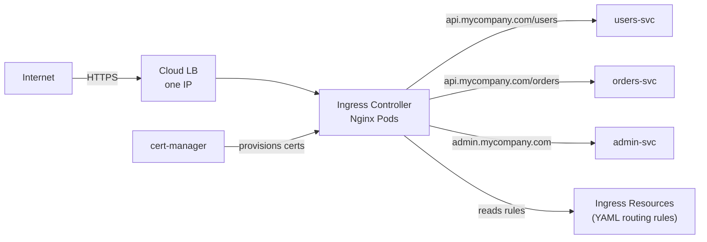
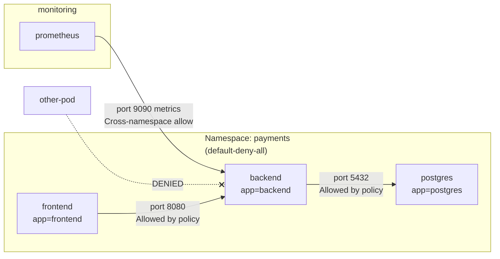

## Keywords in This File

{: .no_toc }

| # | Keyword | Weight |
|---|---------|--------|
| 1 | [Ingress and Load Balancing](#ingress-and-load-balancing) | critical |
| 2 | [NetworkPolicy and Service Types](#networkpolicy-and-service-types) | high |

---

# Ingress and Load Balancing

---

### 🎯 Model Answer

**30 seconds:**
> Ingress is the Kubernetes API for L7 HTTP/HTTPS routing - it routes external
> traffic to internal Services based on hostname and URL path. An Ingress Controller
> (Nginx, Traefik, AWS ALB) watches Ingress objects and configures the actual load
> balancer. One Ingress Controller serves all Ingress rules, replacing the need for
> one cloud load balancer per service.

**3 minutes (Senior):**
> The problem: exposing 20 microservices externally with LoadBalancer Services
> means 20 cloud load balancers at $20-50/month each - expensive and unmanageable.
> Ingress solves this with a single entry point: one Ingress Controller has one
> LoadBalancer Service, and all routing decisions happen at L7 inside the cluster.
>
> The architecture is two layers: the IngressClass/Controller (the actual load
> balancer - runs as a Deployment in the cluster), and Ingress resources (routing
> rules - created by application teams). The controller watches all Ingress objects
> and programs the load balancer accordingly.
>
> Key capabilities: host-based routing (api.mycompany.com vs admin.mycompany.com),
> path-based routing (/api/v1 vs /api/v2), TLS termination with cert-manager integration,
> and middleware (authentication, rate limiting, CORS via annotations or CRDs).
> Ingress is deliberately simple; advanced features (traffic splitting, circuit
> breaking, retries) require a service mesh or a more capable Gateway API implementation.

**Framework:** WHAT -> WHY -> HOW -> TRADE-OFF -> EXAMPLE

*Adapting up:* Add Kubernetes Gateway API (successor to Ingress, richer L7 routing,
role separation), multi-cluster ingress strategies, and the difference between
Ingress on-premise (MetalLB for LoadBalancer IP) vs cloud.

*Adapting down:* "Ingress is a reverse proxy inside Kubernetes. Route api.mycompany.com
to service A, admin.mycompany.com to service B - all through one cloud load balancer."

**Blank Mind Recovery:**

**(1) Restate:** "Ingress and load balancing - how external HTTP traffic reaches K8s
services. Let me explain: the problem (multiple services, one entry point), how Ingress
works (Ingress resource + controller), and TLS termination."

**(2) First principles:** "You have N services but only want to pay for 1 cloud load
balancer. Ingress is the L7 routing layer that sits behind that one LB and routes
to N services based on host/path."

**(3) Bridge:** "Ingress is like a hotel concierge - all guests enter through one
front door (one LB), the concierge (controller) reads their destination (host/path),
and directs them to the right room (service)."

---

### 📘 Concept Explanation

**What it is:**
Ingress is a Kubernetes API object that defines L7 HTTP/HTTPS routing rules:
which hostname maps to which Service, which URL path maps to which backend, and
TLS certificate configuration. An Ingress Controller is the implementation - it
watches Ingress objects and programs an actual load balancer or proxy accordingly.

**The problem it solves:**
LoadBalancer Service creates one cloud LB per service - cost-prohibitive at scale.
Ingress provides a single external entry point with L7 routing to multiple services.
It also centralizes TLS termination, authentication middleware, and rate limiting.

**How it works:**
```
Internet -> Cloud LB (one) -> Ingress Controller (Nginx/Traefik pod)
                                      |
         Ingress rules:               |
         api.mycompany.com/users   -> users-svc:80
         api.mycompany.com/orders  -> orders-svc:80
         admin.mycompany.com       -> admin-svc:80
         (TLS terminated at Ingress Controller)
```

> **Code walkthrough:** This Ingress and Load Balancing example demonstrates a key concept in practice using container. **KEY MECHANISM:** the runtime executes these instructions in sequence with specific memory and execution semantics. **WHY IT MATTERS:** misapplying this pattern causes subtle bugs that only manifest under production load. **TAKEAWAY: understand the execution model before using this pattern in production code.**

The Ingress controller is a regular Deployment with a LoadBalancer Service.
The LoadBalancer Service gives it one external IP. The controller configures
an internal reverse proxy (Nginx, Envoy, HAProxy) based on Ingress resource rules.

cert-manager integration: cert-manager watches Ingress objects with TLS config
and automatically provisions Let's Encrypt certificates, storing them as Secrets.
The Ingress controller loads the Secret for TLS termination.

**The key insight:**
Ingress is deliberately simple by design - just host/path routing and TLS.
For advanced features (traffic splitting A/B, circuit breaking, retries, JWT auth),
use Ingress controller-specific annotations (Nginx: `nginx.ingress.kubernetes.io/*`)
OR migrate to Gateway API (the Ingress successor) which has native support for
these features via HTTPRoute, GRPCRoute, and TCPRoute objects.

**When to use it:**
- Multiple HTTP/HTTPS services to expose externally
- Centralized TLS termination with cert-manager
- Host and path-based routing to multiple backends
- Middleware: rate limiting, authentication, CORS

**When NOT to use it:**
- Non-HTTP protocols (TCP, UDP, gRPC without HTTP/2) - use LoadBalancer Service or Gateway API
- Single service with one public IP - LoadBalancer Service is simpler
- Advanced traffic management (canary, A/B, circuit breaking) - use Gateway API or service mesh

**Alternatives:**
- Gateway API - Ingress successor with richer semantics, role separation, TCP/gRPC support
- Service mesh (Istio Gateway) - combined ingress and service mesh traffic management
- Cloud-native LBs (AWS ALB Ingress Controller) - native cloud LB configured as Ingress

**First-principles derivation:**
Multiple services -> single L7 reverse proxy entry point -> route by host/path.
The Ingress object is the declarative routing config. The controller is the
implementation. This separation allows platform teams to manage the controller
while app teams manage their own Ingress routing rules.

---

### 💻 Code Example

> **Code walkthrough:** A complete Ingress setup with TLS, host/path routing,ice. **KEY MECHANISM:** the runtime executes these instructions in sequence with specific memory and execution semantics. **WHY IT MATTERS:** misapplying this pattern causes subtle bugs that only manifest under production load. **TAKEAWAY: understand the execution model before using this pattern in production code.**
> rate limiting, and cert-manager auto-provisioning. Shows the Ingress resource
> plus ClusterIssuer for TLS and the upstream Services it routes to.

```yaml
# cert-manager ClusterIssuer for Let's Encrypt TLS
apiVersion: cert-manager.io/v1
kind: ClusterIssuer
metadata:
  name: letsencrypt-prod
spec:
  acme:
    server: https://acme-v02.api.letsencrypt.org/directory
    email: ops@mycompany.com
    privateKeySecretRef:
      name: letsencrypt-prod-key
    solvers:
    - http01:
        ingress:
          class: nginx
```

```yaml
# Ingress: routes external traffic to internal ClusterIP services
apiVersion: networking.k8s.io/v1
kind: Ingress
metadata:
  name: api-ingress
  namespace: production
  annotations:
    nginx.ingress.kubernetes.io/rate-limit: "100"
    nginx.ingress.kubernetes.io/ssl-redirect: "true"
    nginx.ingress.kubernetes.io/proxy-body-size: "10m"
    cert-manager.io/cluster-issuer: "letsencrypt-prod"
spec:
  ingressClassName: nginx
  tls:
  - hosts:
    - api.mycompany.com
    secretName: api-tls-cert
  rules:
  - host: api.mycompany.com
    http:
      paths:
      - path: /v1/users
        pathType: Prefix
        backend:
          service:
            name: users-svc
            port:
              number: 80
      - path: /v1/orders
        pathType: Prefix
        backend:
          service:
            name: orders-svc
            port:
              number: 80
      - path: /
        pathType: Prefix
        backend:
          service:
            name: api-gateway-svc
            port:
              number: 80
  - host: admin.mycompany.com
    http:
      paths:
      - path: /
        pathType: Prefix
        backend:
          service:
            name: admin-svc
            port:
              number: 80
```

> **Code walkthrough:** The `ingressClassName: nginx` specifies which Ingressice. **KEY MECHANISM:** the runtime executes these instructions in sequence with specific memory and execution semantics. **WHY IT MATTERS:** misapplying this pattern causes subtle bugs that only manifest under production load. **TAKEAWAY: understand the execution model before using this pattern in production code.**
> Controller processes this rule - multiple controllers can coexist (nginx for
> public traffic, traefik for internal). cert-manager watches for Ingress objects
> with the `cert-manager.io/cluster-issuer` annotation and automatically requests
> a Let's Encrypt certificate, storing it in the specified `secretName`. The
> controller then uses this Secret for TLS termination - all automated.
> `pathType: Prefix` matches the path and all sub-paths; `Exact` matches only the
> exact path. More specific paths must appear before catch-all `/` rules.

---

### 🎓 Answers by Seniority

**Junior / Mid (0-5 years):**
> Ingress is a reverse proxy for HTTP traffic in Kubernetes. You define rules:
> "traffic for api.mycompany.com should go to the api service; traffic for
> admin.mycompany.com should go to the admin service". The Ingress Controller
> (usually Nginx) reads these rules and routes traffic accordingly. It also handles
> TLS - you configure which certificate to use, and HTTPS traffic is decrypted at
> the controller before being forwarded to internal services.

*Push deeper:* What is the difference between Ingress (routing rules) and
Ingress Controller (the implementation that applies those rules)?

---

**Senior / Staff (5+ years):**
> The Ingress API is showing its age - designed for basic HTTP routing, the feature
> gap has been filled by controller-specific annotations that are not portable across
> controllers. Gateway API (GA in K8s 1.28) is the replacement: typed, role-separated,
> and extensible. HTTPRoute, GRPCRoute, TCPRoute are separate resources with proper
> schemas. The ReferenceGrant pattern enables cross-namespace routing securely.
> For new clusters, adopt Gateway API if your controller supports it (Nginx Gateway
> Fabric, Contour, Istio). For existing Ingress: migration paths exist and most
> controllers support both simultaneously during transition.

*Push deeper:* Gateway API role separation - GatewayClass managed by infra team,
Gateway managed by cluster operators, HTTPRoute managed by application teams.

---

### ⚠️ Common Misconceptions

**Misconception 1: "Ingress is part of Kubernetes core networking."**
Ingress is an API spec - without an Ingress Controller, Ingress objects do nothing.
You must separately deploy an Ingress Controller (Nginx, Traefik, AWS ALB Controller).
A cluster can have multiple Ingress Controllers (different IngressClasses).

**Misconception 2: "Ingress terminates TLS and passes encrypted traffic internally."**
TLS terminates at the Ingress Controller; internal traffic to backend Services is
HTTP (unencrypted) by default. For internal encryption (mTLS), you need a service mesh
or configure end-to-end TLS re-encryption mode in the controller.

**Misconception 3: "Ingress handles all L7 features natively."**
Ingress natively handles only host/path routing and TLS. Middleware (rate limiting,
auth, retries) is implemented via controller-specific annotations which are NOT
portable between controllers. This is the primary driver for Gateway API adoption.

**Misconception 4: "One Ingress resource per application."**
One Ingress resource can cover multiple hosts and paths. Multiple teams can have
separate Ingress resources in their namespaces - the controller merges all Ingress
rules into its routing table. Splitting Ingress resources by team enables independent
management without coordination.

---

### 🚨 Failure Modes and Diagnosis

**Failure 1: Ingress returns 404 for valid paths**
Symptom: `curl https://api.mycompany.com/v1/users` returns 404.
Cause: Ingress path rule doesn't match, or IngressClass is wrong.
Diagnostic: `kubectl describe ingress <name>` - check rules and events.
`kubectl get ingress <name> -o yaml` - verify `ingressClassName` matches controller.
Check controller logs: `kubectl logs -n ingress-nginx deploy/ingress-nginx-controller`

**Failure 2: TLS certificate expired - 502/SSL error**
Symptom: browser shows certificate expired or curl fails with SSL error.
Cause: cert-manager failed to renew certificate.
Diagnostic: `kubectl get certificate -n <ns>` - check Ready status.
`kubectl describe certificate <name>` - see renewal failures.
Fix: `kubectl delete certificate <name>` - cert-manager immediately re-provisions.

**Failure 3: Ingress routes to wrong backend**
Symptom: requests to `/v1/orders` reach the users service.
Cause: overlapping path rules; more specific path not listed first.
Diagnostic: `kubectl describe ingress` - review rule order.
Fix: reorder rules - most specific paths first, catch-all `/` last.

---

### 🎯 Interview Deep-Dive

| Question Category | Time to Answer |
|---|---|
| Definition | 30-60 seconds |
| Mechanism | 1-2 minutes |
| Comparison | 2-3 minutes |
| Scenario | 2-3 minutes |
| Debugging | 2-3 minutes |
| Architecture | 2-3 minutes |
| Advanced | 1-2 minutes |
| Design | 2-3 minutes |
| Behavioral | 2-3 minutes |

---

**Q1 [JUNIOR] (Definition): What is the difference between Ingress and a Service?**

A: A Service provides stable L4 networking within the cluster - it load-balances
TCP/UDP traffic to a set of pods and provides a stable DNS name. A Service alone
doesn't provide external access with routing features.

Ingress provides L7 HTTP/HTTPS routing from outside the cluster to Services inside
the cluster. It routes based on host (which domain) and path (/api/v1 vs /api/v2).
It terminates TLS. It can apply middleware like rate limiting and authentication.

The typical architecture: the Ingress Controller has one LoadBalancer Service (one
cloud LB). All external HTTP/HTTPS traffic hits this single IP. The Ingress Controller
reads Ingress rules and routes to the appropriate ClusterIP Service, which routes
to the appropriate pods. You need both: Ingress routes to a Service; the Service
routes to pods. Ingress cannot route directly to pods (would break when pods replace).

*What separates good from great:* Ingress works only for HTTP/HTTPS. For TCP/UDP
services (gRPC with non-HTTP/2, databases, game servers), you need LoadBalancer
Service or Gateway API TCPRoute.

---

**Q2 [MID] (Mechanism): How does an Ingress Controller reconcile Ingress rules?**

A: The Ingress Controller is a Deployment - pods running a reverse proxy (Nginx,
Envoy, Traefik). It uses the standard Kubernetes controller pattern:

1. The controller runs an informer watching Ingress and Service objects in all
   namespaces (or namespaces it manages).
2. When an Ingress object is created, modified, or deleted, the reconcile loop triggers.
3. The reconciler aggregates all Ingress rules across namespaces and generates
   proxy configuration (nginx.conf, Envoy listener config, etc.).
4. For Nginx: generates a new nginx.conf and sends SIGHUP to reload without
   dropping connections.
5. For Envoy-based controllers (Contour, Istio): uses Envoy xDS API to push
   updated configuration without restarting.

The controller also watches Endpoints API - when pods behind a Service change
(scale, rolling update), the controller updates its upstream pool.

Handling conflicts: if two Ingress resources define routes for the same host+path,
the controller applies one (typically older creation timestamp) and logs an error.

*What separates good from great:* Nginx-based controllers occasionally show brief
routing inconsistencies during Ingress updates - the reconcile loop has latency
and nginx.conf reload is not instantaneous. Envoy xDS-based controllers provide
smoother updates via incremental configuration push.

---

**Q3 [MID] (Comparison): What is Gateway API and when should you prefer it over Ingress?**

A: Gateway API is the Kubernetes-native successor to Ingress, GA since K8s 1.28.

Problem 1 - No role separation: Ingress conflates three roles: infra team (what LB
infrastructure exists?), app developer (what routes does my app need?), and platform
admin (what policies apply?). Gateway API splits these: GatewayClass (infra team),
Gateway (cluster operator), HTTPRoute/GRPCRoute (app team).

Problem 2 - Extension via annotations: Ingress extensions are untyped annotations.
Not portable between controllers; no schema validation. Gateway API uses typed CRDs
that controllers extend in a structured way.

Problem 3 - Only HTTP: Ingress cannot route TCP, UDP, gRPC natively. Gateway API
has TCPRoute, UDPRoute, GRPCRoute as first-class resources.

When to prefer Gateway API: new clusters where your controller supports it; teams
needing gRPC, TCP routing, or cross-namespace routing; clear infra/dev role separation.

When to keep Ingress: existing working Ingress deployments; controller doesn't yet
support Gateway API; team not ready for migration complexity.

*What separates good from great:* Gateway API's cross-namespace ReferenceGrant is
significant. An HTTPRoute in `app` namespace can reference a Service in `shared-services`
namespace ONLY if a ReferenceGrant in `shared-services` permits it. Ingress has no equivalent.

---

**Q4 [SENIOR] (Scenario): Design the Ingress architecture for a microservices platform
with 50 teams.**

A: Key concerns: operational isolation, security, cost, and self-service.

Architecture:
1. Dedicated Ingress Controller per environment tier (1 prod, 1 staging).
   Each has one LoadBalancer Service = one cloud LB. All 50 teams share.
2. Each team manages their own Ingress resources in their namespace.
3. Wildcard DNS: `*.api.mycompany.com` -> ingress controller IP.
   Teams claim subdomains: `payments.api.mycompany.com`, `orders.api.mycompany.com`.
4. cert-manager ClusterIssuer handles all TLS certificate lifecycle.
   Teams annotate their Ingress with the issuer.
5. Global rate limiting at controller level, per-IP limits prevent abuse.
6. OAuth2-proxy for centralized authentication on admin routes.

Self-service: teams write Ingress YAML in their namespace. Platform team owns
IngressClass, Nginx Controller, and cert-manager. No coordination for routing changes.

Scaling: 200 Ingress rules is well within Nginx capacity. Separate prod/non-prod
controllers to isolate blast radius.

*What separates good from great:* GitOps for Ingress resources: teams commit Ingress
YAML to Git, ArgoCD applies it. Every routing change is reviewed, versioned, auditable.
Prevents configuration drift and makes rollback trivial.

---

**Q5 [SENIOR] (Debugging): An Ingress route that was working yesterday now returns 502.
Diagnose.**

A: 502 means the controller reached the backend but got an error (vs 503 = no
backend available, 404 = no matching route).

Step 1: check backend service health.
`kubectl get endpoints <service-name> -n <ns>` - endpoints listed?
Empty endpoints = no healthy pods. `kubectl get pods -l <selector>`.

Step 2: test backend directly without Ingress.
`kubectl port-forward svc/<service-name> 8080:80 -n <ns>`
`curl localhost:8080/health` - if 200, Ingress is the issue; if 502, backend is broken.

Step 3: check ingress controller logs.
`kubectl logs -n ingress-nginx deploy/ingress-nginx-controller --tail=100 | grep "502"`
Look for: upstream connection refused, upstream timeout, invalid response.

Step 4: check Service's targetPort matches container port.
`kubectl describe service <name>` - targetPort should match what container listens on.
`kubectl exec -it <pod> -- netstat -tlnp` to confirm.

*What separates good from great:* Connection refused vs timeout in controller logs -
refused means pod accepted TCP but app rejected it (wrong port, not started). Timeout
means TCP accepted but request hung (slow query, deadlock, OOM). Different root causes.

---

**Q6 [STAFF] (Architecture): How do you handle canary deployments with Ingress?**

A: Nginx Ingress supports canary via annotations:

```yaml
# Canary Ingress receives 20% of traffic
apiVersion: networking.k8s.io/v1
kind: Ingress
metadata:
  name: api-canary
  annotations:
    nginx.ingress.kubernetes.io/canary: "true"
    nginx.ingress.kubernetes.io/canary-weight: "20"
spec:
  rules:
  - host: api.mycompany.com
    http:
      paths:
      - path: /
        pathType: Prefix
        backend:
          service:
            name: api-canary-svc
            port:
              number: 80
```

> **Code walkthrough:** This Canary Ingress receives 20% of traffic example demonstrates YAML configuration pattern using container. **KEY MECHANISM:** YAML parsers are whitespace-sensitive; indentation errors cause silent value misinterpretation. **WHY IT MATTERS:** unquoted strings starting with special chars (*, &, ?, |) trigger YAML parser errors. **TAKEAWAY: quote strings containing YAML special chars; validate YAML before deploying to production.**

Gradually increase `canary-weight` from 0 to 100 as confidence builds. At 100%,
delete stable Ingress and rename canary to stable.

Header-based canary: `canary-by-header: X-Canary-Version` routes requests with
that header to canary. QA teams can test without affecting production traffic.

Limitations: Nginx canary is approximate (probabilistic, not exact 20%). For precise
traffic splitting, use Istio VirtualService (exact weight).

*What separates good from great:* Nginx canary is controller-level - all pods behind
`api-canary-svc` receive canary traffic. For true pod-level canary (one pod receives
20% while 4 receive 80%), use a service mesh. The choice depends on precision needed.

---

**Q7 [STAFF] (Advanced): What is Gateway API and how does it improve on Ingress?**

A: Three core resources:

GatewayClass: cluster-scoped, defines what LB infrastructure to create.
Managed by infrastructure team.

Gateway: namespace-scoped, instantiates a GatewayClass. Defines listeners
(port 443 with TLS cert). Managed by cluster operators.

HTTPRoute (GRPCRoute, TCPRoute): namespace-scoped, defines routing from Gateway
to backend Services. Managed by application teams in their namespaces.

Key improvements:

Role separation: infra team doesn't coordinate with app teams on routing. App
teams create HTTPRoute in their namespace; it attaches to Gateway per GatewayClass rules.

Typed extensions: RateLimitFilter, RequestHeaderModifier are typed CRDs, not
untyped annotations. Portable across supporting controllers.

Precise weighted routing (native):
```yaml
backendRefs:
- name: v1
  weight: 80
- name: v2
  weight: 20
```

> **Code walkthrough:** This Canary Ingress receives 20% of traffic example demoice. **KEY MECHANISM:** the runtime executes these instructions in sequence with specific memory and execution semantics. **WHY IT MATTERS:** misapplying this pattern causes subtle bugs that only manifest under production load. **TAKEAWAY: understand the execution model before using this pattern in production code.**

TCP/gRPC native support: first-class resources, not workarounds.

*What separates good from great:* Major controllers have GA Gateway API support
as of 2024 (Nginx Gateway Fabric, Contour, Cilium, Istio). Migration path is gradual
- both Ingress and Gateway API can coexist during transition.

---

**Q8 [MID] (Comparison): When should you use AWS ALB Ingress Controller vs Nginx?**

A: AWS ALB Ingress Controller:
- Each Ingress creates a real AWS ALB natively
- Direct integration: WAF, Shield, Cognito, ACM certificates
- ALB managed by AWS (no ingress controller pods to maintain)
- Cost: one ALB per IngressGroup or per Ingress
- Best for: AWS shops needing WAF/Shield, ACM-managed certificates

Nginx Ingress Controller:
- One Nginx pod proxies ALL Ingress rules - one cloud LB total
- Full control over Nginx configuration
- Works identically across any cloud or on-premise
- Cost: one LB regardless of Ingress rule count
- Best for: cloud-agnostic, on-premise, 50+ services cost optimization

Decision: AWS-native features needed? -> ALB. Multiple clouds or on-prem? -> Ngi
Lowest cost for many services? -> Nginx (1 LB vs N ALBs).

*What separates good from great:* AWS ALB Controller's `alb.ingress.kubernetes.io/group.name`
annotation allows multiple Ingress resources to share a single ALB - combining
benefits of both approaches for AWS users.

---

**Q9 [JUNIOR] (Comparison): What is the difference between Ingress pathType Prefix,
Exact, and ImplementationSpecific?**

A: `pathType` controls how the path matches request URLs:

`Prefix`: matches the path and all paths starting with it at path segment boundaries.
`/api` matches `/api`, `/api/v1`, `/api/v1/users`. Does NOT match `/apilegacy`
(boundary rule). Most common for routing.

`Exact`: matches ONLY the exact path. `/api/v1/health` matches only that URL.
Use when sub-paths should not be accessible via the same Ingress rule.

`ImplementationSpecific`: behavior defined by the controller. For Nginx, treated
as regex if the path contains regex characters. NOT portable - avoid in portable

In practice: use `Prefix` for most routes. Use `Exact` for endpoints that must not
expose sub-paths. List more specific paths before less specific ones.

*What separates good from great:* The path segment boundary rule - `/foo` matche
`/foo` and `/foo/bar` but NOT `/foobar`. Intentional to prevent unintended routing collisions.

---

### ⚖️ Comparison Table

| Dimension| Ingress| Gateway API| LoadBalancer Service|
|---|--------------------|--------------------------------|--------------------|
| L7 routing| Host/path (basic)| Rich (typed headers, methods)| None (L4 only)|
| TLS| Terminate at controller| Terminate at Gateway| Passthrough only|
| TCP/gRPC| No (workarounds)| Native (TCPRoute, GRPCRoute)| Yes|
| Role separation| None| Yes (GatewayClass/Gateway/Route)| N/A|
| Extensions| Annotations (untyped)| Typed CRDs| N/A|
| Cost model| 1 LB for all services| 1+ LB per GatewayClass| 1 LB per Service|
| Maturity| Stable (aging)| GA (1.28+)| Stable|
| Best for| HTTP routing (existing)| New deployments (complex)| Non-HTTP single 

**Decision framework:**
- HTTP/HTTPS routing for multiple services? -> Ingress or Gateway API
- TCP/UDP or gRPC routing? -> Gateway API TCPRoute or LoadBalancer
- Team role separation needed? -> Gateway API
- New deployment, controller supports it? -> Gateway API

---

### 🏛️ System Design

*(Omit: ★★☆ keyword - ingress at 500+ service scale covered at L4/L5.)*

---

### 📊 Diagram

```plaintext
Ingress Architecture:

Internet
   |
   v
Cloud LB (1 IP)
   |
   v
Ingress Controller (Nginx, in cluster)
   |
   +-- api.mycompany.com/v1/users  -> users-svc -> pods
   +-- api.mycompany.com/v1/orders -> orders-svc -> pods
   +-- admin.mycompany.com          -> admin-svc  -> pods
   (TLS terminates at controller; cert-manager manages certs)
```



> **Diagram walkthrough:** All external HTTPS traffic hits one cloud LB (one IP,
> one LB cost). The LB routes to Ingress Controller pods which terminate TLS
> (certificates managed by cert-manager) and forward HTTP internally to ClusterIP
> Services. The separation between Ingress resources (routing rules - owned by app
> teams) and the Ingress Controller (implementation - owned by platform team) enables
> self-service routing. Adding a new service requires only a new Ingress routing rule,
> not a new LB.

---
---

---

### 💻 Code Example

*(Omit: this concept does not have a programmatic interface that can be demonstrated in code. The conceptual explanation above is sufficient.)*


---

### 🏛️ System Design

*(Omit: system design diagram not applicable for this concept - see ★★★ keywords for full system design coverage.)*


---

### ⚖️ Comparison Table

*(Omit: this is a ★☆☆ foundational concept with no direct alternatives to compare - see higher-difficulty keywords for trade-off analysis.)*


---

### 📊 Diagram

*(Omit: no standalone visual diagram required for this concept - the explanations and code examples above provide sufficient clarity.)*


# NetworkPolicy and Service Types

---

### 🎯 Model Answer

**30 seconds:**
> By default, all pods in a Kubernetes cluster can communicate with all other pods.
> NetworkPolicy is the Kubernetes API for restricting this - it defines allow-rules
> for ingress and egress traffic by pod selector, namespace, and IP block. Without
> NetworkPolicy, namespace isolation is not a network boundary. Every production
> cluster running multiple untrusted workloads needs NetworkPolicy.

**3 minutes (Senior):**
> Kubernetes networking has three defaults that are surprising: all pods can reach
> all other pods across all namespaces, all pods can make arbitrary egress connections
> to the internet, and Services expose their endpoints to all pods in the cluster.
> NetworkPolicy changes this from "allow all" to "explicitly allow only what's needed".
>
> NetworkPolicy is a whitelist, not a blacklist. You don't block traffic - you
> specify what IS allowed, and everything else is denied. A pod with no NetworkPolicy
> receives all traffic. A pod with one NetworkPolicy only receives traffic matching
> that policy. This asymmetry is critical: creating a NetworkPolicy doesn't block
> anything on its own - it only restricts traffic TO pods that HAVE a policy.
>
> Implementation: NetworkPolicy is enforced by the CNI plugin (Calico, Cilium).
> Without a CNI that supports NetworkPolicy (e.g., Flannel without Canal),
> NetworkPolicy objects are accepted by the API Server but silently ignored - zero
> enforcement. Always verify your CNI supports NetworkPolicy.

**Framework:** WHAT -> WHY -> HOW -> TRADE-OFF -> EXAMPLE

*Adapting up:* Add Cilium's eBPF-based L7 NetworkPolicy (allow by HTTP method and
path), FQDN-based egress policies (allow DNS-resolved hostnames), and Calico
GlobalNetworkPolicy for cluster-wide rules.

*Adapting down:* "NetworkPolicy is a firewall for your pods. Without it, any pod
can talk to any other pod. With it, you define exactly who can talk to whom."

**Blank Mind Recovery:**

**(1) Restate:** "NetworkPolicy - pod-level network access control. Let me explain:
the default (allow all), how NetworkPolicy changes this (whitelist model), and why
it must be combined with a CNI that enforces it."

**(2) First principles:** "Least-privilege networking: pods should only reach services
they explicitly need. NetworkPolicy implements this at the cluster network level."

**(3) Bridge:** "NetworkPolicy is like a building access control system. By default
every door is unlocked. NetworkPolicy locks specific doors and only gives keys to
pods that explicitly need access."

---

### 📘 Concept Explanation

**What it is:**
NetworkPolicy is a Kubernetes API object specifying how pods are allowed to
communicate with each other and external endpoints. Whitelist model: policies
select pods and specify allowed ingress (inbound) and egress (outbound) traffic.
A pod without any policy is unrestricted; a pod with a policy allows only matching traffic.

**The problem it solves:**
Default Kubernetes networking violates least privilege - all pods can reach all
other pods across namespaces. A compromised payment service pod can connect to the
HR service database. NetworkPolicy enforces micro-segmentation: the payment pod can
only reach the payment database on port 5432; all other connections are denied.

**How it works:**
```
Default (no NetworkPolicy):
  Pod A -> Pod B: ALLOWED
  Pod A -> Pod C: ALLOWED (even different namespace)
  Pod A -> Internet: ALLOWED

With NetworkPolicy on Pod B (whitelist):
  Policy: "allow ingress from pod A on port 8080 only"
  Pod A -> Pod B:8080: ALLOWED (matches)
  Pod C -> Pod B:8080: DENIED (no matching policy)
  Pod A -> Pod B:5432:  DENIED (wrong port)

Pod C with no NetworkPolicy: still receives ALL traffic
```

> **Code walkthrough:** This NetworkPolicy and Service Types example demonstrates a key concept in practice using container. **KEY MECHANISM:** the runtime executes these instructions in sequence with specific memory and execution semantics. **WHY IT MATTERS:** misapplying this pattern causes subtle bugs that only manifest under production load. **TAKEAWAY: understand the execution model before using this pattern in production code.**

CNI enforcement: NetworkPolicy objects are stored in etcd but enforced by the
CNI plugin. The CNI translates policies into iptables rules, eBPF programs, or
OVS flows on each node. Without a supported CNI, policies have no effect.

**The key insight:**
NetworkPolicy does NOT affect how services are exposed. Service types (ClusterIP,
NodePort, LoadBalancer) are separate from NetworkPolicy. NetworkPolicy controls
pod-to-pod and pod-to-external communication - not whether a Service is accessible.

**When to use NetworkPolicy:**
- Multi-team clusters: prevent team A's pods from reaching team B's database
- Compliance: PCI-DSS, HIPAA require network segmentation
- Defense in depth: limit lateral movement if a pod is compromised
- Egress control: prevent pods from calling arbitrary external endpoints

**When NOT to use NetworkPolicy:**
- Don't use it as your only security control - combine with RBAC and PodSecurity
- Don't create policies without testing - silently blocking traffic breaks services
- For L7 policy (allow GET /health but deny POST /admin), use Cilium or service mesh

**Alternatives:**
- Service mesh (Istio mTLS) - identity-based auth, L7 policy, encryption
- Cilium Layer 7 NetworkPolicy - HTTP path and method level filtering
- OPA/Kyverno - policy as code for K8s resources (not traffic)

---

### 💻 Code Example

> **Code walkthrough:** Deny-all default policy followed by specific allow rulesice. **KEY MECHANISM:** the runtime executes these instructions in sequence with specific memory and execution semantics. **WHY IT MATTERS:** misapplying this pattern causes subtle bugs that only manifest under production load. **TAKEAWAY: understand the execution model before using this pattern in production code.**
> for a three-tier application (frontend -> backend -> database). The production
> security pattern: start with deny-all, explicitly allow what's needed.

```yaml
# Step 1: Default deny-all for a namespace
# Pods in this namespace with no other policy: all traffic denied
apiVersion: networking.k8s.io/v1
kind: NetworkPolicy
metadata:
  name: default-deny-all
  namespace: payments
spec:
  podSelector: {}         # select ALL pods in namespace
  policyTypes:
  - Ingress
  - Egress
  # No ingress/egress rules = deny all
```

```yaml
# Step 2: Allow backend to receive from frontend on port 8080
apiVersion: networking.k8s.io/v1
kind: NetworkPolicy
metadata:
  name: allow-frontend-to-backend
  namespace: payments
spec:
  podSelector:
    matchLabels:
      app: backend          # applies to backend pods
  policyTypes:
  - Ingress
  ingress:
  - from:
    - podSelector:
        matchLabels:
          app: frontend     # allow FROM frontend pods
    ports:
    - protocol: TCP
      port: 8080
```

```yaml
# Step 3: Allow backend egress to DB and DNS
# CRITICAL: DNS (port 53) must be explicit in Egress policy
apiVersion: networking.k8s.io/v1
kind: NetworkPolicy
metadata:
  name: backend-egress
  namespace: payments
spec:
  podSelector:
    matchLabels:
      app: backend
  policyTypes:
  - Egress
  egress:
  - to:
    - podSelector:
        matchLabels: {app: postgres}
    ports:
    - protocol: TCP
      port: 5432
  - ports:
    - protocol: UDP       # DNS - without this, service names
      port: 53            # can't be resolved
    - protocol: TCP
      port: 53
```

> **Code walkthrough:** The deny-all policy is the foundation - empty podSelectorice. **KEY MECHANISM:** the runtime executes these instructions in sequence with specific memory and execution semantics. **WHY IT MATTERS:** misapplying this pattern causes subtle bugs that only manifest under production load. **TAKEAWAY: understand the execution model before using this pattern in production code.**
> selects all pods, both Ingress and Egress types, no rules = deny everything.
> The allow policies add back only needed communication. The DNS egress rule is
> critical and easy to forget: when you create an Egress NetworkPolicy, port 53
> UDP/TCP must be explicitly allowed or all DNS resolution fails and service names
> cannot be resolved. This is the most common NetworkPolicy mistake, causing
> "mysterious" service connectivity failures that look unrelated to NetworkPolicy.

---

### 🎓 Answers by Seniority

**Junior / Mid (0-5 years):**
> By default, all pods in Kubernetes can talk to all other pods. NetworkPolicy
> lets you restrict this - define which pods can receive traffic from which sources
> and on which ports. It's a firewall rule for pods. A pod with a NetworkPolicy only
> allows connections matching the policy; everything else is blocked. A pod without
> any NetworkPolicy is completely open.

*Push deeper:* What happens if you create an Egress NetworkPolicy that blocks all
egress but forget to include a rule for DNS (port 53)?

---

**Senior / Staff (5+ years):**
> NetworkPolicy is a whitelist at the IP/TCP level. For production security, I pair
> it with: (1) default deny-all per namespace, (2) explicit allow rules for each
> service's dependencies. The operational challenge: NetworkPolicy requires knowing
> all service communication patterns before deployment. My approach: use Cilium's
> Hubble to observe actual network flows for 24 hours, then generate NetworkPolicy
> from observed flows. Hubble shows: pod A made 523 calls to pod B on port 5432 today.
> This converts observation into policy without breaking anything. Never write
> NetworkPolicies from scratch without observability data.

*Push deeper:* Cilium L7 NetworkPolicy - enforces at HTTP method and path level.
`toEndpoints` with `http.method: GET` and `http.path: /health` allows health checks
but blocks other HTTP methods on the same port.

---

### ⚠️ Common Misconceptions

**Misconception 1: "NetworkPolicy is enforced by the Kubernetes control plane."**
NetworkPolicy objects are stored in etcd and validated by the API Server, but
ENFORCEMENT is by the CNI plugin on each node. Flannel (without Canal or Calico)
does NOT enforce NetworkPolicy. Without a supporting CNI, policies are silently ignored.

**Misconception 2: "A NetworkPolicy blocks all traffic to that pod when created."**
A NetworkPolicy allows only traffic matching its rules - it doesn't automatically
create a default deny. The "deny all" behavior requires an explicit policy with empty
podSelector, both policyTypes, and no rules. A policy with allow rules only blocks
what doesn't match those rules; everything else is still open until a deny-all exists.

**Misconception 3: "Two selectors in one from: list item are OR."**
Two items in `from: []` array are OR. But two selectors in the SAME list item (same
dash level) are AND. `from: [{namespaceSelector: X, podSelector: Y}]` = must match
BOTH. `from: [{namespaceSelector: X}, {podSelector: Y}]` = match EITHER. This
causes subtle security bugs.

**Misconception 4: "NetworkPolicy in namespace A protects namespace B from A."**
NetworkPolicy applies to the TARGET pod (the pod matching podSelector), not the source.
A policy in namespace B restricts what REACHES namespace B's pods. To prevent namespace
A pods from reaching B, you create policy in B (not A) with namespaceSelector.

---

### 🚨 Failure Modes and Diagnosis

**Failure 1: Service connectivity broken after adding NetworkPolicy**
Symptom: service calls fail with "connection refused" or "no such host" after
deploying a NetworkPolicy.
Cause: NetworkPolicy blocked a needed connection (including DNS port 53).
Diagnostic: `kubectl exec -it <pod> -- curl <service>:<port>` to confirm blocked.
With Cilium: `cilium monitor -t drop` shows dropped packets with reason.
Most common: forgot DNS (port 53 UDP/TCP) in Egress policy.
Fix: add the missing allow rule and re-test.

**Failure 2: NetworkPolicy selects wrong pods due to label mismatch**
Symptom: policy created but traffic still flows or is incorrectly blocked.
Cause: podSelector labels don't match actual pod labels.
Diagnostic: `kubectl get pods --show-labels` vs the policy's `podSelector`.
`kubectl describe networkpolicy <name>` shows how many pods match the selector.
Fix: align NetworkPolicy selectors with actual pod labels.

**Failure 3: Cross-namespace policy doesn't work as expected**
Symptom: namespaceSelector rule doesn't block traffic from another namespace.
Cause: namespace doesn't have the expected label; OR AND/OR selector confusion.
Diagnostic: `kubectl get namespace <name> --show-labels` - does the label match?
Since K8s 1.21, `kubernetes.io/metadata.name: <namespace>` is auto-set.
Fix: use `kubernetes.io/metadata.name` label (always present) for namespaceSelector.

---

### 🎯 Interview Deep-Dive

| Question Category | Time to Answer |
|---|---|
| Definition | 30-60 seconds |
| Mechanism | 1-2 minutes |
| Security | 2-3 minutes |
| Debugging | 2-3 minutes |
| Scenario | 2-3 minutes |
| Architecture | 2-3 minutes |
| Advanced | 1-2 minutes |
| Trade-off | 1-2 minutes |
| Design | 2-3 minutes |

---

**Q1 [JUNIOR] (Definition): What is Kubernetes NetworkPolicy and why do you need it?**

A: By default in Kubernetes, every pod can communicate with every other pod in the
cluster regardless of namespace. This "flat networking" model is convenient but
insecure. A compromised frontend pod can reach the database of another team's
application. A bug in a public-facing service can be exploited to reach internal APIs.

NetworkPolicy is the Kubernetes firewall for pod-to-pod communication. You create
policies specifying: which pods this applies to, what inbound traffic is allowed
(ingress), and what outbound traffic is allowed (egress). It's a whitelist model -
anything not explicitly allowed is denied.

You need NetworkPolicy in production because: compliance standards (PCI-DSS, HIPAA)
require network segmentation; security best practices require least-privilege networking;
in multi-team clusters, team A's compromise must not automatically expose team B's data.

Important: NetworkPolicy requires a CNI plugin supporting it (Calico, Cilium, Weave Net).
Flannel alone doesn't enforce NetworkPolicy.

*What separates good from great:* Knowing the "deny all" posture must be explicitly
created. A pod with no NetworkPolicy is completely open. Default in K8s is "allow
all" - not "deny all".

---

**Q2 [MID] (Mechanism): Explain the whitelist model of NetworkPolicy.**

A: A pod with NO NetworkPolicy: receives traffic from any source, any port. Open.

A pod with ONE OR MORE NetworkPolicies: receives traffic ONLY if it matches at
least one allow rule in any of its policies. Everything else is implicitly denied.

The policy applies to the TARGET pod (matching podSelector), not the source.
It says "pods matching X are allowed to receive from Y on port Z" - not "pods
matching Y may send to X".

The additive model: multiple NetworkPolicies on the same pod are OR-ed together.
Policy 1 allows frontend; policy 2 allows monitoring - the pod accepts both.
There is no "deny" rule that overrides an "allow" - pure whitelist.

Subtle trap: `policyTypes: [Ingress]` only restricts inbound; all egress still allowed.
`policyTypes: [Ingress, Egress]` with only ingress rules = all egress denied.

Most common production pattern:
1. Create `default-deny-all` with empty podSelector, both Ingress and Egress types, no rules
2. Create specific allow policies for each service's communication needs

*What separates good from great:* The namespace-level "deny from other namespaces" pattern:
add a policy with `from: [{podSelector: {}}]` - allows all pods in the SAME namespace.
All cross-namespace traffic is denied unless explicitly added with namespaceSelector.

---

**Q3 [SENIOR] (Security): How do you implement network segmentation for a payment
processing service using NetworkPolicy?**

A: PCI-DSS requires the payment service and database to be in a controlled segment,
accessible only from authorized services.

Architecture for payments namespace:
```yaml
# 1. Default deny-all in payments namespace
kind: NetworkPolicy
spec:
  podSelector: {}
  policyTypes: [Ingress, Egress]
  # no rules = deny all

# 2. Allow order-service to call payment-api on 8443
kind: NetworkPolicy
spec:
  podSelector:
    matchLabels: {app: payment-api}
  ingress:
  - from:
    - namespaceSelector:
        matchLabels:
          kubernetes.io/metadata.name: orders
      podSelector:      # AND - must be BOTH namespace AND label
        matchLabels: {app: order-service}
    ports:
    - port: 8443

# 3. Allow payment-api egress to DB and DNS
kind: NetworkPolicy
spec:
  podSelector:
    matchLabels: {app: payment-api}
  egress:
  - to:
    - podSelector: {matchLabels: {app: payment-db}}
    ports:
    - port: 5432
  - ports:              # DNS
    - port: 53
      protocol: UDP

# 4. Allow monitoring to scrape metrics
kind: NetworkPolicy
spec:
  podSelector:
    matchLabels: {app: payment-api}
  ingress:
  - from:
    - namespaceSelector:
        matchLabels:
          kubernetes.io/metadata.name: monitoring
      podSelector:
        matchLabels: {app: prometheus}
    ports:
    - port: 9090
```

> **Code walkthrough:** This 4. Allow monitoring to scrape metrics example demonstrates YAML configuration pattern using SQL. **KEY MECHANISM:** YAML parsers are whitespace-sensitive; indentation errors cause silent value misinterpretation. **WHY IT MATTERS:** unquoted strings starting with special chars (*, &, ?, |) trigger YAML parser errors. **TAKEAWAY: quote strings containing YAML special chars; validate YAML before deploying to production.**

Result: payment-api only receives from order-service and Prometheus; only egresses
to payment-db and DNS. Any pod not explicitly listed is blocked.

*What separates good from great:* The monitoring allow rule is essential - forgetting
it breaks observability of the most critical service. Also: audit-log policy changes
in your SIEM. Any NetworkPolicy change in the payments namespace should trigger a
security review.

---

**Q4 [SENIOR] (Debugging): After deploying a NetworkPolicy, your service suddenly
can't resolve DNS. Why and how do you fix it?**

A: This is the most common NetworkPolicy mistake. When you create an Egress policy,
you specify what outbound connections are allowed. If you don't explicitly allow
DNS (port 53 UDP and TCP), pods can't resolve service names.

Why it happens: every service-to-service call uses DNS. When pod A calls
`http://backend-svc`, it first resolves `backend-svc.namespace.svc.cluster.local`
via CoreDNS (port 53 in kube-system). If Egress policy doesn't include port 53,
CoreDNS calls fail and service names never resolve. The error looks like "name
resolution failed" or "no such host" - not "connection refused", which confuses debugging.

Diagnosis:
`kubectl exec -it <pod> -- nslookup google.com`
If this fails: DNS is blocked by NetworkPolicy.
`kubectl exec -it <pod> -- nslookup google.com 8.8.8.8`
If this works: cluster DNS is blocked, external works - confirms port 53 issue.

Fix - add DNS to every Egress NetworkPolicy:
```yaml
egress:
- ports:
  - protocol: UDP
    port: 53
  - protocol: TCP
    port: 53
```

> **Code walkthrough:** This 4. Allow monitoring to scrape metrics example demonstrates YAML configuration pattern. **KEY MECHANISM:** YAML parsers are whitespace-sensitive; indentation errors cause silent value misinterpretation. **WHY IT MATTERS:** unquoted strings starting with special chars (*, &, ?, |) trigger YAML parser errors. **TAKEAWAY: quote strings containing YAML special chars; validate YAML before deploying to production.**

No `to:` field = allow DNS to any destination. Acceptable since DNS traffic
is low-risk and necessary for all service discovery.

*What separates good from great:* Create a reusable DNS-allow NetworkPolicy that
you apply to every namespace as a base policy. Prevents the "forgot DNS" mistake
as a systematic fix, not a one-time patch.

---

**Q5 [STAFF] (Architecture): How does Cilium eBPF NetworkPolicy differ from iptables?**

A: The fundamental difference is where packet filtering happens:

iptables-based (Calico default, Weave):
- CNI translates NetworkPolicy into iptables rules on each node
- Every packet traverses kernel iptables chains (linear O(n) rule lookup)
- Rule updates require locking iptables and rewriting affected chains
- Limited to L3/L4 (IP/port filtering)
- Hard to observe - no policy-specific visibility

Cilium eBPF:
- Translates NetworkPolicy into eBPF programs loaded into the kernel
- eBPF programs run at XDP (eXpress Data Path), before iptables
- O(1) hash table lookups regardless of policy count
- Incremental updates: change one policy without touching others
- L7 capability: HTTP method, path, headers via eBPF sock-ops
- Hubble: built-in flow observability - see all allowed and denied flows in real-time
- Identity-based: cryptographic pod identities based on labels; no IP churn issues

Performance: at large scale (10k+ pods, 1000+ policies), Cilium shows 30-50%
better network throughput than iptables Calico. Hubble eliminates the blind spot of
"which connections are being dropped?" that plagues iptables debugging.

*What separates good from great:* Cilium's identity-based model is architecturally
superior for dynamic K8s environments. When pods restart with new IPs, IP-based
policies may have brief windows where rules don't apply. Cilium has no such gap.

---

**Q6 [STAFF] (Trade-off): When is service mesh mTLS better than NetworkPolicy?**

A: They solve complementary problems:

NetworkPolicy:
- L3/L4 network access control (IP/port)
- Implemented in kernel by CNI (no application changes)
- No authentication - allows any pod with matching IP
- No encryption - traffic between pods is plaintext
- Best for: blast radius isolation, preventing lateral movement

Service mesh mTLS (Istio):
- L7 authentication and authorization
- Cryptographic identity: verify "this is really the orders-service certificate"
- Fine-grained: "allow GET /health but deny POST /admin from frontend"
- Encryption: all inter-pod traffic encrypted with mutual TLS
- Rich observability: request rates, latencies, error rates per service pair
- Best for: zero-trust architecture, cryptographic service identity, L7 auth

Use NetworkPolicy: network segmentation, preventing port scans, compliance requiring
documented network segmentation, low-overhead kernel enforcement.

Use service mesh: cryptographic service identity beyond IP/port, L7 authorization,
zero-trust architecture, distributed tracing and service mesh observability.

Combined: NetworkPolicy for L3/L4 isolation (fast, kernel-level), service mesh for
L7 auth and encryption. The mesh handles mTLS; NetworkPolicy limits blast radius.

*What separates good from great:* Istio PeerAuthentication in STRICT mode also
blocks non-mTLS traffic, effectively replacing some NetworkPolicy use cases. But
service mesh sidecars add 10-20ms latency and operational complexity. Start with
NetworkPolicy; add service mesh when you need L7 or zero-trust.

---

**Q7 [MID] (Scenario): Allow monitoring to scrape metrics from all pods cluster-wide
without granting other access. Design the NetworkPolicy.**

A: The key is using `namespaceSelector` in Ingress rules:

```yaml
# Apply to ALL application namespaces
# (via kustomize, namespace bootstrapping, or admission controller)
apiVersion: networking.k8s.io/v1
kind: NetworkPolicy
metadata:
  name: allow-prometheus-scrape
spec:
  podSelector: {}         # all pods in this namespace
  policyTypes:
  - Ingress
  ingress:
  - from:
    - namespaceSelector:
        matchLabels:
          kubernetes.io/metadata.name: monitoring   # monitoring namespace
      podSelector:
        matchLabels:
          app: prometheus                           # AND prometheus pods only
    ports:
    - port: 9090          # adjust per application
    - port: 8080
    - port: 2112          # Go default metrics
```

> **Code walkthrough:** This (via kustomize, namespace bootstrapping, or admission controller) example demonstrates YAML configuration pattern using SQL. **KEY MECHANISM:** YAML parsers are whitespace-sensitive; indentation errors cause silent value misinterpretation. **WHY IT MATTERS:** unquoted strings starting with special chars (*, &, ?, |) trigger YAML parser errors. **TAKEAWAY: quote strings containing YAML special chars; validate YAML before deploying to production.**

The `kubernetes.io/metadata.name` label is auto-applied by K8s 1.21+ - always
present, reliable for namespaceSelector.

Deploy as part of namespace bootstrap template: every new namespace automatically
gets this policy via ArgoCD ApplicationSet or OPA Gatekeeper admission webhook.

*What separates good from great:* The `namespaceSelector` + `podSelector` same-item
combination is AND - must match BOTH monitoring namespace AND prometheus label.
Without the `podSelector`, any pod in monitoring namespace could scrape metrics.
Least-privilege within the policy itself.

---

**Q8 [SENIOR] (Advanced): Explain AND vs OR semantics in NetworkPolicy from/to rules.**

A: The from/to selectors have a critical AND vs OR distinction:

AND relationship - same list item, both selectors:
```yaml
ingress:
- from:
  - namespaceSelector:
      matchLabels: {name: frontend-ns}   # AND
    podSelector:                          # same dash = same item = AND
      matchLabels: {app: frontend}
```
> **Code walkthrough:** This (via kustomize, namespace bootstrapping, or admission controller) example demonstrates YAML configuration pattern using SQL. **KEY MECHANISM:** YAML parsers are whitespace-sensitive; indentation errors cause silent value misinterpretation. **WHY IT MATTERS:** unquoted strings starting with special chars (*, &, ?, |) trigger YAML parser errors. **TAKEAWAY: quote strings containing YAML special chars; validate YAML before deploying to production.**

Allows traffic only from pods labeled `app=frontend` IN `frontend-ns` namespace.
Pods labeled `app=frontend` in OTHER namespaces: DENIED.

OR relationship - separate list items:
```yaml
ingress:
- from:
  - namespaceSelector:
      matchLabels: {name: frontend-ns}   # OR
  - podSelector:                          # separate dash = different item = OR
      matchLabels: {app: frontend}
```
> **Code walkthrough:** This (via kustomize, namespace bootstrapping, or admission controller) example demonstrates YAML configuration pattern using SQL. **KEY MECHANISM:** YAML parsers are whitespace-sensitive; indentation errors cause silent value misinterpretation. **WHY IT MATTERS:** unquoted strings starting with special chars (*, &, ?, |) trigger YAML parser errors. **TAKEAWAY: quote strings containing YAML special chars; validate YAML before deploying to production.**

Allows: ANY pod in `frontend-ns` namespace OR any pod labeled `app=frontend`
anywhere (including all other namespaces).

Most developers expect two items in from: to be AND - but in Kubernetes, two
separate list items are OR. The AND behavior requires both selectors in the SAME
list item (no `-` separator between them).

This AND/OR distinction is a common source of NetworkPolicy security bugs - a
policy intended to be restrictive (AND) silently becomes permissive (OR).

*What separates good from great:* Always test NetworkPolicies with Cilium Hubble
or equivalent before production. The observed traffic flow view shows exactly which
pods are allowed through, catching AND/OR mistakes before they become incidents.

---

**Q9 [STAFF] (Design): How would you implement zero-trust networking in Kubernetes?**

A: Zero-trust: never trust, always verify. Every service-to-service call must be
authenticated regardless of network location.

Layer 1 - Default deny NetworkPolicy (every namespace):
```yaml
kind: NetworkPolicy
spec:
  podSelector: {}
  policyTypes: [Ingress, Egress]
  # no rules
```

> **Code walkthrough:** This no rules example demonstrates YAML configuration pattern using SQL. **KEY MECHANISM:** YAML parsers are whitespace-sensitive; indentation errors cause silent value misinterpretation. **WHY IT MATTERS:** unquoted strings starting with special chars (*, &, ?, |) trigger YAML parser errors. **TAKEAWAY: quote strings containing YAML special chars; validate YAML before deploying to production.**

Layer 2 - mTLS with Istio (cryptographic identity):
```yaml
kind: PeerAuthentication
spec:
  mtls:
    mode: STRICT    # all inter-pod traffic must be mTLS
```
> **Code walkthrough:** This no rules example demonstrates YAML configuration pattern using container. **KEY MECHANISM:** YAML parsers are whitespace-sensitive; indentation errors cause silent value misinterpretation. **WHY IT MATTERS:** unquoted strings starting with special chars (*, &, ?, |) trigger YAML parser errors. **TAKEAWAY: quote strings containing YAML special chars; validate YAML before deploying to production.**

Every service gets a SPIFFE/X.509 certificate identity (SVID). Services verify
"this is really the orders-service cert signed by our cluster CA."

Layer 3 - AuthorizationPolicy (L7 access control):
```yaml
kind: AuthorizationPolicy
spec:
  selector:
    matchLabels: {app: payment-api}
  rules:
  - from:
    - source:
        # only the specific SA of order-service (verified by cert)
        principals:
          - cluster.local/ns/orders/sa/order-service
    to:
    - operation:
        methods: ["POST"]
        paths: ["/v1/charge"]
```
> **Code walkthrough:** This only the specific SA of order-service (verified by ice. **KEY MECHANISM:** the runtime executes these instructions in sequence with specific memory and execution semantics. **WHY IT MATTERS:** misapplying this pattern causes subtle bugs that only manifest under production load. **TAKEAWAY: understand the execution model before using this pattern in production code.**

Authorization is by service account identity (verified by certificate), not IP.
A pod spoofing the orders-service IP cannot access payment-api without the cert.

Layer 4 - Audit logging: Istio access logs record every service call with source
identity, destination, method, path, and status. Failed auth attempts are alertable.

Result: NetworkPolicy for L3/L4 blast radius, Istio mTLS for cryptographic identity,
AuthorizationPolicy for L7 access control, audit logging for forensics.

*What separates good from great:* Incremental adoption. Start with NetworkPolicy (L3/L4),
add Istio in PERMISSIVE mode (observe without enforcing), switch to STRICT mode service
by service. This identifies missing policies before enforcement breaks services.

---

### ⚖️ Comparison Table

| Dimension| NetworkPolicy| Service Mesh mTLS| Cloud Firewall|
|--------------|----------------------|-------------------|------------------|
| Layer| L3/L4 (IP/port)| L7 (app-level)| L3/L4 (external)|
| Authentication| None (IP-based)| Cryptographic cert| None (IP-based)|
| Encryption| No| Yes (mTLS)| No|
| Scope| Intra-cluster| Intra-cluster| External->cluster|
| Overhead| Minimal (eBPF)| ~10-20ms sidecar| None|
| Observability| Poor| Excellent| Good|
| Complexity| Low| High| Low|
| Best for| Blast radius isolation| Zero-trust, L7 auth| Perimeter security|

**Decision framework:**
- Prevent lateral movement in cluster? -> NetworkPolicy (minimal overhead)
- Cryptographic service identity? -> Service mesh mTLS
- L7 authorization (by path/method)? -> Service mesh or Cilium L7
- Need all three? -> NetworkPolicy + service mesh (complementary layers)

---

### 🏛️ System Design

*(Omit: ★★☆ keyword - zero-trust K8s architecture covered at L4/L5.)*

---

### 📊 Diagram

```
NetworkPolicy whitelist model:

Without NetworkPolicy (default):
  frontend --> backend: ALLOWED
  random   --> backend: ALLOWED
  attacker --> backend: ALLOWED

With NetworkPolicy (deny-all + explicit allows):
  frontend:8080  --> backend: ALLOWED (policy rule)
  random:8080    --> backend: DENIED (no rule)
  attacker:5432  --> backend: DENIED (no rule)
```



> **Diagram walkthrough:** The payments namespace has a default-deny-all policy.
> Frontend can reach backend only on port 8080 (explicit allow). Backend can reach
> postgres only on port 5432 (explicit allow). Prometheus from the monitoring namespace
> can scrape metrics via a cross-namespace namespaceSelector+podSelector AND rule.
> Any other connection is denied. This is defense-in-depth: even if frontend is
> compromised, the attacker cannot pivot directly to postgres because the
> frontend-to-postgres path was never opened.

---

### 💻 Code Example

*(Omit: this concept does not have a programmatic interface that can be demonstrated in code. The conceptual explanation above is sufficient.)*


---

### 🏛️ System Design

*(Omit: system design diagram not applicable for this concept - see ★★★ keywords for full system design coverage.)*


---

### ⚖️ Comparison Table

*(Omit: this is a ★☆☆ foundational concept with no direct alternatives to compare - see higher-difficulty keywords for trade-off analysis.)*


---

### 📊 Diagram

*(Omit: no standalone visual diagram required for this concept - the explanations and code examples above provide sufficient clarity.)*


