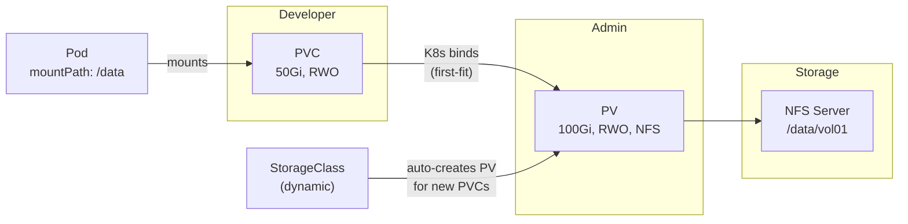
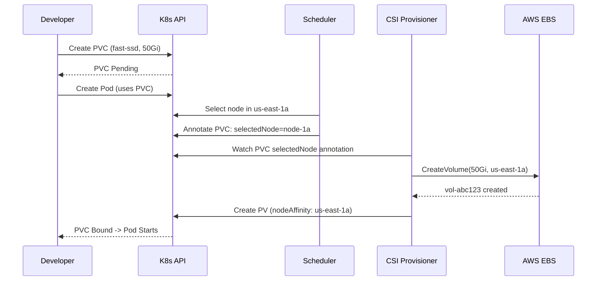

## Keywords in This File

{: .no_toc }

| # | Keyword | Weight |
|---|---------|--------|
| 1 | [PersistentVolume and PVC](#persistentvolume-and-pvc) | critical |
| 2 | [StorageClass and Dynamic Provisioning](#storageclass-and-dynamic-provisioning) | high |

---

# PersistentVolume and PVC

---

### 🎯 Model Answer

**30 seconds:**
> PersistentVolume (PV) is a piece of storage provisioned in the cluster. PersistentVolumeClaim
> (PVC) is a request for storage by a pod. The PVC binds to a matching PV; the pod mounts
> the PVC. This separation decouples the pod from the underlying storage implementation -
> a pod just requests "I need 10Gi RWO"; the cluster figures out which actual disk to use.

**3 minutes (Senior):**
> The PV/PVC system solves the coupling problem: without it, pods must specify exact
> storage paths (`/dev/sdb1`, NFS server IP) in their spec - this makes pods
> infrastructure-specific and non-portable. PV/PVC introduces a layer of abstraction:
> pods declare storage requirements (size, access mode, storage class), and the cluster
> or an administrator provides storage that meets those requirements.
>
> The lifecycle has three phases: provisioning (PV is created - manually by admin or
> dynamically by a StorageClass), binding (a PVC finds a matching PV and binds exclusively),
> and release (when the PVC is deleted, the PV's reclaim policy determines what happens
> to the data). The critical operational note: `Retain` policy keeps data after PVC
> deletion (requires manual cleanup); `Delete` policy auto-deletes the underlying storage.
>
> Access modes define how many nodes can mount the volume simultaneously: ReadWriteOnce
> (RWO - one node), ReadWriteMany (RWX - multiple nodes), ReadOnlyMany (ROX - multiple
> nodes, read-only). Most cloud block storage (EBS, GCE PD) supports only RWO. For RWX
> you need network storage (EFS, NFS, CephFS, Azure Files).

**Framework:** WHAT -> WHY -> HOW -> TRADE-OFF -> EXAMPLE

*Adapting up:* Add VolumeAttributesClass (K8s 1.29+ for storage performance tiers),
volume snapshots and clones for backup/restore, CSI driver architecture, and
volumeMode: Block vs Filesystem.

*Adapting down:* "PVC is a request for a disk. PV is the actual disk. The pod uses
the PVC; Kubernetes connects the PVC to the right PV automatically."

**Blank Mind Recovery:**

**(1) Restate:** "PersistentVolume and PVC - K8s storage abstraction. PV = the disk,
PVC = the request for a disk. Let me walk through: access modes, binding, reclaim policy."

**(2) First principles:** "Pods should not know what kind of disk they're using (EBS,
NFS, Ceph). PVC abstracts this: the pod requests storage by capability; the cluster
provides it."

**(3) Bridge:** "PVC is like a parking reservation form - you specify 'I need a spot
for a large car near exit B'. The parking system (K8s) matches your form to an
available spot (PV) and assigns it exclusively to you."

---

### 📘 Concept Explanation

**What it is:**
PersistentVolume (PV) is a cluster-level resource representing a piece of storage.
It can be provisioned manually by an admin (static provisioning) or automatically by
a StorageClass controller (dynamic provisioning).

PersistentVolumeClaim (PVC) is a namespace-scoped resource representing a request
for storage by a pod. A PVC specifies size, access mode, and optionally a StorageClass.
When a PVC is created, the control plane finds a compatible PV and binds them exclusively.

**The problem it solves:**
Without PV/PVC, pods specify raw storage directly (hostPath, NFS server:path, etc.).
This couples pods to specific infrastructure: the pod can only run on a specific node
(hostPath), or requires knowledge of the NFS server IP. PV/PVC provides infrastructure
abstraction - pods request storage by capability, not by location.

**How it works:**
```plaintext
STATIC:
Admin creates PV (spec: 100Gi, RWO, storageClass: "")
Developer creates PVC (request: 50Gi, RWO, storageClass: "")
  |
  K8s control plane binds PVC to PV (first-fit matching)
  Pod mounts PVC -> pod mounts actual disk

DYNAMIC:
Developer creates PVC (request: 50Gi, RWO, storageClass: "fast-ssd")
  |
  StorageClass controller (CSI driver) automatically creates PV + provisions disk
  PVC binds to new PV
  Pod mounts PVC -> pod mounts cloud disk
```

> **Code walkthrough:** This PersistentVolume and PVC example demonstrates a key concept in practice using container. **KEY MECHANISM:** the runtime executes these instructions in sequence with specific memory and execution semantics. **WHY IT MATTERS:** misapplying this pattern causes subtle bugs that only manifest under production load. **TAKEAWAY: understand the execution model before using this pattern in production code.**

**Access modes:**
- `ReadWriteOnce` (RWO): mounted read/write by ONE node at a time
  - Cloud block storage: EBS, GCE PD, Azure Disk
  - Constraint: if pod moves to different node, volume must be detached/reattached
- `ReadWriteMany` (RWX): mounted read/write by MULTIPLE nodes simultaneously
  - Network storage: Amazon EFS, NFS, CephFS, Azure Files (NFS)
  - Required for Deployments with >1 replica that need shared storage
- `ReadOnlyMany` (ROX): mounted read-only by multiple nodes
  - Config data, ML models, static assets shared across replicas

**Reclaim policies:**
- `Retain`: when PVC is deleted, PV remains with status `Released`. Data preserved.
  Admin must manually clean up PV and underlying storage.
- `Delete`: when PVC is deleted, PV is deleted AND underlying storage is deleted.
  Default for dynamically provisioned volumes.
- `Recycle` (deprecated): performs `rm -rf` on volume - use `Delete` instead.

**The key insight:**
PVC binding is exclusive and permanent (until PVC deletion). A PV bound to a PVC
cannot be bound to another PVC simultaneously. The binding is by capacity and access
mode: a 100Gi PV can bind to a 50Gi PVC (the extra capacity is wasted). To avoid
waste, use dynamic provisioning - volumes are created to exact requested size.

**When to use PV/PVC:**
- Any stateful workload needing persistent storage: databases, caches, file storage
- StatefulSet pods (use `volumeClaimTemplates` which creates PVCs automatically)
- Any pod that must survive restarts with its data intact

**When NOT to use PV/PVC:**
- Truly temporary data: use `emptyDir` (destroyed when pod is deleted)
- Config data: use ConfigMap or Secret
- Host-level data access for infrastructure pods: use `hostPath` directly (not PVC)

**Alternatives:**
- CSI ephemeral volumes: temporary volumes provisioned by CSI driver per pod
- Generic ephemeral volumes: PVC-like but deleted when pod is deleted
- emptyDir with memory backing: tmpfs for performance-sensitive temp data

---

### 💻 Code Example

> **Code walkthrough:** Static and dynamic PVC examples, showing the full lifecycle
> from PV creation through pod mounting. The StatefulSet volumeClaimTemplate pattern
> for per-pod PVCs.

```yaml
# STATIC: Admin creates PV manually
apiVersion: v1
kind: PersistentVolume
metadata:
  name: data-pv-01
spec:
  capacity:
    storage: 100Gi
  accessModes:
  - ReadWriteOnce
  persistentVolumeReclaimPolicy: Retain   # preserve data after PVC deletion
  storageClassName: ""                    # empty = static only (no StorageClass)
  nfs:
    server: 10.0.0.5
    path: /data/vol01
```

```yaml
# PVC binding to the static PV above
apiVersion: v1
kind: PersistentVolumeClaim
metadata:
  name: app-storage
  namespace: production
spec:
  accessModes:
  - ReadWriteOnce
  resources:
    requests:
      storage: 50Gi          # PV has 100Gi; binding works (PV >= request)
  storageClassName: ""       # must match PV storageClassName for static binding
  # volumeName: data-pv-01  # optionally pin to specific PV
```

```yaml
# BAD: Pod with hardcoded hostPath (infrastructure-specific, not portable)
apiVersion: v1
kind: Pod
spec:
  containers:
  - name: app
    volumeMounts:
    - name: data
      mountPath: /data
  volumes:
  - name: data
    hostPath:
      path: /mnt/data      # PROBLEM: tied to this node, no HA
```

```yaml
# GOOD: Pod using PVC (portable, infrastructure-independent)
apiVersion: v1
kind: Pod
metadata:
  name: database
  namespace: production
spec:
  containers:
  - name: postgres
    image: postgres:16
    volumeMounts:
    - name: data
      mountPath: /var/lib/postgresql/data
    env:
    - name: PGDATA
      value: /var/lib/postgresql/data/pgdata
  volumes:
  - name: data
    persistentVolumeClaim:
      claimName: app-storage    # references the PVC
```

> **Code walkthrough:** The static PV specifies the actual NFS server locationice. **KEY MECHANISM:** the runtime executes these instructions in sequence with specific memory and execution semantics. **WHY IT MATTERS:** misapplying this pattern causes subtle bugs that only manifest under production load. **TAKEAWAY: understand the execution model before using this pattern in production code.**
> and total capacity. The PVC requests 50Gi - the control plane binds it to any
> PV with at least 50Gi, RWO, and matching storageClassName. The empty `storageClassName: ""`
> is critical for static binding - if omitted, K8s uses the default StorageClass
> and provisions a new dynamic volume instead of using your static PV. The pod just
> references the PVC by name; the pod doesn't know or care whether it's NFS, EBS,
> or Ceph underneath. This is the portability win.

---

### 🎓 Answers by Seniority

**Junior / Mid (0-5 years):**
> PersistentVolume is a piece of storage in the cluster - think of it as a disk.
> PersistentVolumeClaim is a request for a disk. Your pod says "I need 10GB of
> storage", and Kubernetes finds a matching disk (PV) and gives it to your pod via
> the PVC. The pod mounts the PVC like a directory. When the pod restarts, the same
> disk is reattached - the data is preserved. This is different from emptyDir which
> is destroyed when the pod dies.

*Push deeper:* What are the three access modes and which cloud storage supports ReadWriteMany?

---

**Senior / Staff (5+ years):**
> The operational complexity in PV/PVC that trips production teams: reclaim policy
> on dynamically-provisioned volumes defaults to `Delete`. When a StatefulSet is
> deleted, its PVCs are NOT automatically deleted (by design - data protection).
> But if someone manually deletes a PVC (for a replicated database), the `Delete`
> reclaim policy immediately deletes the cloud disk. Data is gone. The fix: for
> critical databases, set `persistentVolumeReclaimPolicy: Retain` on the StorageClass
> or patch the PV directly after provisioning. Also: volume expansion requires
> `allowVolumeExpansion: true` on the StorageClass. You can expand PVCs online (without
> pod restart) for file system volumes; block volumes require pod restart. Shrinking
> is never supported - plan for capacity at provisioning time.

*Push deeper:* Volume snapshots - CSI-based backup via `VolumeSnapshot` and
`VolumeSnapshotContent` API objects. Clone a PVC from a snapshot for blue-green
database testing without copying data.

---

### ⚠️ Common Misconceptions

**Misconception 1: "PVC deletion always deletes the data."**
Only if the PV's `reclaimPolicy: Delete`. With `reclaimPolicy: Retain`, deleting
the PVC releases the PV but does NOT delete the underlying storage. The PV moves
to `Released` state and must be manually cleaned up. Check reclaim policy before
deleting PVCs in production.

**Misconception 2: "ReadWriteMany is universally supported."**
Cloud block storage (AWS EBS, GCE Persistent Disk, Azure Disk) only supports RWO.
For RWX, you need network/file storage: Amazon EFS (NFS), Azure Files (NFS/SMB),
Google Filestore, CephFS, or a self-managed NFS server. Running multiple pod
replicas that need shared storage requires RWX storage.

**Misconception 3: "A PV binds to the smallest matching PVC."**
K8s binds to the FIRST sufficient PV found, not the best-fit. A 10Gi PVC may
bind to a 1000Gi PV (wasting 990Gi) if that's the first PV with matching access
mode and class. Use dynamic provisioning (StorageClass) to provision exactly the
requested size.

**Misconception 4: "You can shrink a PVC by editing its spec."**
PVC capacity can only INCREASE (with `allowVolumeExpansion: true` StorageClass).
Reduction is not supported by any storage provider. Plan initial capacity generously.

---

### 🚨 Failure Modes and Diagnosis

**Failure 1: Pod stuck Pending - PVC not binding**
Symptom: pod stays in Pending; `kubectl describe pod` shows "pod has unbound PVC".
Cause: no PV matching PVC's storage class, access mode, or capacity.
Diagnostic: `kubectl get pvc -n <ns>` - PVC shows `Pending`.
`kubectl describe pvc <name>` - "no persistent volumes available" or "waiting for
provisioner".
Fix: check StorageClass exists; if static, create a matching PV; if dynamic, check
CSI driver is installed and StorageClass is configured.

**Failure 2: PVC stuck in Terminating state**
Symptom: `kubectl delete pvc` hangs; PVC stays in Terminating.
Cause: a pod is still using the PVC (finalizer `kubernetes.io/pvc-protection` present).
Diagnostic: `kubectl describe pvc <name>` - Finalizers field.
`kubectl get pods --all-namespaces | grep <pvc-name>` - find pods using it.
Fix: delete or stop the pods using the PVC, then PVC deletion completes.

**Failure 3: Data lost after PV deletion with Delete reclaim policy**
Symptom: database pod comes up with empty data after maintenance.
Cause: PVC was deleted (manually or via helm uninstall), triggering PV deletion
with Delete reclaim policy.
Prevention: use `Retain` policy for stateful databases. Set it at StorageClass level
or patch PV: `kubectl patch pv <name> -p '{"spec":{"persistentVolumeReclaimPolicy":"Retain"}}'`

---

### 🎯 Interview Deep-Dive

| Question Category | Time to Answer |
|---|---|
| Definition | 30-60 seconds |
| Mechanism | 1-2 minutes |
| Scenario | 2-3 minutes |
| Debugging | 2-3 minutes |
| Trade-off | 2-3 minutes |
| Design | 2-3 minutes |
| Advanced | 1-2 minutes |
| Production | 2-3 minutes |
| Behavioral | 2-3 minutes |

---

**Q1 [JUNIOR] (Definition): Explain the relationship between Pod, PVC, and PV.**

A: They form a chain: Pod -> PVC -> PV -> actual storage.

PV (PersistentVolume): a cluster-level resource representing actual storage - a cloud
disk, NFS share, or Ceph volume. Created by admins (static) or automatically by a
StorageClass controller (dynamic).

PVC (PersistentVolumeClaim): a namespace-level request for storage. A developer
creates a PVC saying "I need 10Gi, read/write". Kubernetes finds a matching PV
and binds them exclusively.

Pod: references the PVC by name in its spec. When the pod starts, Kubernetes mounts
the PVC's bound PV as a directory in the container at the specified mountPath.

The separation provides abstraction: the pod doesn't know it's using EBS vs NFS vs Ceph.
It just uses a directory. When the pod restarts on the same node, the volume is still
there. When it restarts on a different node, the volume is detached and reattached.

*What separates good from great:* The binding is exclusive (one PVC per PV, one PV
per PVC at a time). Multiple pods CAN mount the same PVC - but only if the PV's
access mode is ReadWriteMany or ReadOnlyMany.

---

**Q2 [MID] (Mechanism): Walk through PVC binding - how does K8s match PVCs to PVs?**

A: The PV controller in kube-controller-manager runs the binding loop:

1. A PVC is created with: requested size, access mode, StorageClass name.

2. For STATIC binding (no StorageClass or storageClassName: ""):
   The controller scans available (unbound) PVs for a match:
   - Access mode must be in the PV's supported accessModes
   - Capacity: PV capacity >= PVC request
   - StorageClass: must match (both empty for static)
   - Volume mode: must match (Filesystem or Block)
   - Selector: if PVC has a label selector, PV labels must match
   First matching PV is bound (not best-fit, first-fit).

3. For DYNAMIC binding (StorageClass specified):
   If no existing PV matches, the StorageClass provisioner is called.
   The provisioner creates a new PV of exactly the requested size.
   The PVC binds to the new PV.

4. Binding is atomic: PV is marked with `claimRef` pointing to the PVC; PVC status
   changes to `Bound`. No other PVC can bind to this PV.

5. Once bound, the association is permanent until the PVC is deleted.
   The pod can be deleted and recreated; it re-uses the same PVC/PV.

*What separates good from great:* The `WaitForFirstConsumer` binding mode on the
StorageClass changes step 3 - the PVC stays Pending until the pod using it is
scheduled. The provisioner then creates the volume in the same zone as the pod.
This prevents cross-AZ volume-pod mismatches.

---

**Q3 [SENIOR] (Scenario): A StatefulSet postgres-0 pod can't start after a node failure.
The PVC exists but the pod is stuck Pending. What do you check?**

A: After a node failure, the most common cause is volume node affinity conflict -
the PVC's PV is bound to the failed AZ.

Step 1: check pod events.
`kubectl describe pod postgres-0` -> Events section.
"1 node(s) had volume node affinity conflict" = PV is in a different AZ than
all available nodes.

Step 2: check PV's node affinity.
`kubectl get pvc data-postgres-0 -o jsonpath='{.spec.volumeName}'` -> get PV name.
`kubectl get pv <pv-name> -o yaml` -> look for `spec.nodeAffinity.required.nodeSelectorTerms`.
This shows which AZ the PV is locked to (common with EBS, GCE PD).

Step 3: options based on situation.
If the node in that AZ will recover: wait for the node to come back.
Add a node in the same AZ: StatefulSet pod can schedule there.
If the AZ is permanently unavailable:
  - Restore from backup to a new PVC in an available AZ
  - For replicated databases: one replica (the one whose PV is in the dead AZ)
    is lost; promote another replica to primary, add a new replica in a live AZ.

Step 4: prevention.
Use `volumeBindingMode: WaitForFirstConsumer` on the StorageClass.
With this mode, PVC binding is delayed until the pod is scheduled.
The provisioner then creates the volume in the SAME AZ as the pod.
No cross-AZ volume-node conflicts possible.

*What separates good from great:* Knowing that StatefulSet and the cloud storage
topology interaction is a well-known cluster reliability issue. Multi-AZ node
groups with `WaitForFirstConsumer` is the standard mitigation in AWS/GCP.

---

**Q4 [SENIOR] (Production): How do you backup and restore a PVC in Kubernetes?**

A: The CSI Volume Snapshot API (GA in K8s 1.20+) provides PVC-based backups:

Setup (one-time):
```yaml
# VolumeSnapshotClass: defines the snapshot driver
apiVersion: snapshot.storage.k8s.io/v1
kind: VolumeSnapshotClass
metadata:
  name: csi-snapclass
driver: ebs.csi.aws.com
deletionPolicy: Delete
```

> **Code walkthrough:** This VolumeSnapshotClass: defines the snapshot driver example demonstrates YAML configuration pattern using SQL. **KEY MECHANISM:** YAML parsers are whitespace-sensitive; indentation errors cause silent value misinterpretation. **WHY IT MATTERS:** unquoted strings starting with special chars (*, &, ?, |) trigger YAML parser errors. **TAKEAWAY: quote strings containing YAML special chars; validate YAML before deploying to production.**

Backup - Create a snapshot:
```yaml
apiVersion: snapshot.storage.k8s.io/v1
kind: VolumeSnapshot
metadata:
  name: postgres-backup-20240115
spec:
  volumeSnapshotClassName: csi-snapclass
  source:
    persistentVolumeClaimName: data-postgres-0
```
> **Code walkthrough:** This VolumeSnapshotClass: defines the snapshot driver example demonstrates YAML configuration pattern. **KEY MECHANISM:** YAML parsers are whitespace-sensitive; indentation errors cause silent value misinterpretation. **WHY IT MATTERS:** unquoted strings starting with special chars (*, &, ?, |) trigger YAML parser errors. **TAKEAWAY: quote strings containing YAML special chars; validate YAML before deploying to production.**

This creates a point-in-time snapshot of the PVC.
For consistency: quiesce the database first (`CHECKPOINT` in Postgres) before
taking the snapshot, or use a database-aware backup tool (Velero, PGBackRest).

Restore - Create PVC from snapshot:
```yaml
apiVersion: v1
kind: PersistentVolumeClaim
metadata:
  name: postgres-restore
spec:
  dataSource:
    name: postgres-backup-20240115
    kind: VolumeSnapshot
    apiGroup: snapshot.storage.k8s.io
  accessModes: [ReadWriteOnce]
  resources:
    requests:
      storage: 100Gi
```
> **Code walkthrough:** This VolumeSnapshotClass: defines the snapshot driver exice. **KEY MECHANISM:** the runtime executes these instructions in sequence with specific memory and execution semantics. **WHY IT MATTERS:** misapplying this pattern causes subtle bugs that only manifest under production load. **TAKEAWAY: understand the execution model before using this pattern in production code.**

The CSI driver provisions a new volume pre-populated with the snapshot data.

Production tooling: Velero automates snapshot scheduling, retention, and cross-c
restore. It also backs up K8s resource definitions alongside the volume snapshots.

*What separates good from great:* Application-consistent backups require coordin
the snapshot with the application. A raw volume snapshot while the database is writing
transactions may capture an inconsistent state. Always use `fsfreeze` (filesystem quiesce)
or database-specific PITR backup for true consistency.

---

**Q5 [SENIOR] (Debugging): A PVC has been in Terminating state for 30 minutes. Diagnose.**

A: A PVC stuck in Terminating has a finalizer preventing deletion. The cause is almost
always a pod still mounting the volume.

Step 1: check the PVC's finalizers.
`kubectl get pvc <name> -o jsonpath='{.metadata.finalizers}'`
You'll see `kubernetes.io/pvc-protection` - this finalizer is added automaticall
by the PVC protection admission controller and removed ONLY when no pods are using it.

Step 2: find the pods mounting this PVC.
`kubectl get pods --all-namespaces -o json | python3 -c "
import json, sys
d = json.load(sys.stdin)
for p in d['items']:
  for v in p['spec'].get('volumes',[]):
    if v.get('persistentVolumeClaim',{}).get('claimName') == '<pvc-name>':
      print(p['metadata']['namespace'], p['metadata']['name'])
"`
Or simpler: `kubectl get pods --all-namespaces | grep <namespace-containing-app>

Step 3: if pods are terminating but stuck:
Check if the node hosting those pods is unavailable.
Force-delete stuck pods: `kubectl delete pod <name> --force --grace-period=0`
(only for unrecoverable situations - force delete skips graceful shutdown)

Step 4: after all pods using the PVC are gone:
The pvc-protection controller removes the finalizer and PVC deletion completes.

*What separates good from great:* `--force --grace-period=0` on a pod is a last 
If the node is just temporarily unavailable and comes back, the pod will restart and
the PVC will be in use again. The safe approach: confirm the node is truly dead
(via cloud console, not just NotReady status) before force-deleting pods.

---

**Q6 [STAFF] (Architecture): Explain the CSI (Container Storage Interface) architecture.**

A: CSI is the standard interface between Kubernetes and external storage systems.
Before CSI, storage drivers were compiled into the Kubernetes core (in-tree) - a
a new storage provider required a Kubernetes release.

CSI architecture:

External Provisioner: a sidecar container running alongside the CSI driver.
Watches for new PVCs with a matching StorageClass and calls the CSI driver's
CreateVolume RPC to provision storage. When PVC is deleted with Delete reclaim policy,
calls DeleteVolume.

External Attacher: watches for VolumeAttachment objects (when a pod is scheduled
to a node) and calls the CSI driver's ControllerPublishVolume RPC to attach the
cloud disk to the node.

Node Plugin (DaemonSet): runs on every node. When a pod using a CSI volume is
scheduled to the node, kubelet calls NodeStageVolume (format/mount the device to a
global path) and NodePublishVolume (bind-mount into the container's directory).

Key RPC calls:
- CreateVolume: provision a new disk
- DeleteVolume: delete a disk
- ControllerPublishVolume: attach disk to node
- NodeStageVolume: mount disk on node globally
- NodePublishVolume: bind-mount into pod directory

This architecture means every storage provider ships a CSI driver as a set of
containers - no kernel module required, no Kubernetes core changes needed.
AWS EBS, GCE PD, Azure Disk, Ceph, NetApp, Pure Storage, MinIO all have CSI drivers.

*What separates good from great:* Volume snapshots are also a CSI extension - no
all CSI drivers support them. Check `kubectl get volumesnapshotclass` - if empty
the installed CSI driver doesn't support snapshots. Different CSI drivers have
different feature matrices (snapshots, clones, volume expansion, topology).

---

**Q7 [MID] (Comparison): hostPath vs emptyDir vs PVC - when to use each?**

A: Three different storage primitives for different purposes:

`hostPath`: mounts a path from the node's filesystem into the container.
Use when: infrastructure pods need to access node files (log collectors accessing
`/var/log`, CSI drivers, node monitoring agents).
Don't use when: for application data - hostPath ties the pod to a specific node.
If the pod reschedules, data is on the old node. Destroys portability.
Security note: hostPath can give containers access to sensitive host data.

`emptyDir`: temporary storage created when the pod starts, deleted when the pod ends.
All containers in the pod share the emptyDir. Size is limited by node disk space
(or memory if `medium: Memory` is set for tmpfs).
Use when: inter-container data sharing (init container downloads file, main cont
processes it), caching within a pod's lifetime, temporary scratch space.
Don't use when: data must survive pod restarts/reschedules.

`PVC (PersistentVolumeClaim)`: durable storage that survives pod restarts and
reschedules. Backed by cloud disk, NFS, or other persistent storage.
Use when: database files, user uploads, any data that must outlive individual pods.

Quick reference:
- Data must survive pod restart? -> PVC
- Data must be shared between pods? -> PVC with RWX StorageClass
- Data only needed during pod lifetime? -> emptyDir
- Need to access host's filesystem? -> hostPath (infrastructure only)
- High-performance temp storage? -> emptyDir with `medium: Memory`

*What separates good from great:* emptyDir with `medium: Memory` uses tmpfs
(RAM-backed filesystem). Dramatically faster than disk for temp data (sorting la
datasets, shuffling in data pipelines). Be careful: counts against container memory
limit; too large causes OOM.

---

**Q8 [SENIOR] (Advanced): How does volume expansion work in Kubernetes?**

A: Volume expansion allows increasing a PVC's capacity after initial provisioning.

Requirements:
- StorageClass must have `allowVolumeExpansion: true`
- CSI driver must support volume expansion
- PVC must be in Bound state

Expansion process:
1. Edit PVC: `kubectl patch pvc <name> -p '{"spec":{"resources":{"requests":{"st
   (or kubectl edit pvc)
2. PVC status shows `resizeStatus: InProgress`
3. The external-resizer sidecar (CSI driver component) detects the PVC change
   and calls CSI driver's `ControllerExpandVolume` RPC to expand the cloud disk.
4. For filesystem expansion: the NodeExpandVolume call runs on the node where
   the pod is scheduled. This resizes the filesystem (ext4 resize2fs, xfs growfs).
5. Once complete, PVC status shows the new capacity.

Online expansion (without pod restart): supported for filesystem volumes on many CSI
drivers (EBS, GCE PD). The filesystem is expanded while the volume is mounted.

Offline expansion (requires pod restart): block volumes. Delete the pod, the
filesystem is resized at node mount time, restart the pod.

Shrinking: NOT supported. PVC capacity can only increase.

*What separates good from great:* The expansion is two-phase: cloud disk expansi
(ControllerExpandVolume - happens first, independent of pod) and filesystem expa
(NodeExpandVolume - requires the pod to be running on the node). If the pod is n
running (pod was deleted), the filesystem won't be expanded until the pod restarts
and mounts the volume again. `kubectl describe pvc` will show "filesystem resize
required" if waiting for pod.

---

**Q9 [STAFF] (Behavioral): Tell me about a storage-related incident you handled 
designed around in production.**

A (STAR format):

Situation: We were running a MongoDB replica set (3 nodes) in Kubernetes on AWS with
EBS volumes. During a routine Kubernetes node upgrade, the cluster autoscaler terminated
a node that had mongo-2's EBS volume. The EBS volume detached from the terminate
node. Due to a bug in our setup, the volume attachment was not properly released
the volume remained "in-use" according to AWS but the node was gone.

Task: restore mongo-2 to the replica set without data loss and prevent recurrenc

Action:
Immediate: `kubectl describe pod mongo-2` showed the pod Pending with "volume in
by another node" error. Confirmed via AWS console the EBS volume showed detached node.
Ran `aws ec2 detach-volume --volume-id <id> --force` to force-detach.
`kubectl delete pod mongo-2` - forced pod rescheduling. Volume attached to new n
mongo-2 re-joined the replica set and caught up via replication.

Root cause: the old node had terminated before kubelet could gracefully unmount the
volume, leaving the attachment in AWS in a stale state. The new node couldn't attach
the volume until the stale attachment was cleared.

Prevention implemented:
1. Added Liveness probe to mongo pods so unhealthy pods are restarted faster.
2. Added node termination handler (AWS Node Termination Handler) to gracefully drain
   nodes before spot instance termination.
3. Switched to `gp3` EBS volumes with Multi-Attach disabled (single-attach enfor
   at AWS level).
4. Added Velero backup taking daily EBS snapshots - restored confidence in RPO.

*What separates good from great:* The force-detach step is a judgment call. Forc
can corrupt a filesystem if the node was still writing. Confirming the node was
genuinely terminated (not just temporarily unavailable) before force-detaching w
critical. This is the "is the node really dead?" problem that all distributed storage
systems face.

---

### ⚖️ Comparison Table

| Dimension| hostPath| emptyDir| PVC (RWO)| PVC (RWX)|
|--------|--------------|------------------|------------------|----------------|
| Durability| Survives pod| Dies with pod| Survives pod| Survives pod|
| Portability| Node-pinned| Any node| Any node (same AZ)| Any node|
| Sharing| Node processes| Same pod| One pod| Multiple pods|
| Performance| Node disk| Node disk (or RAM)| Network disk| Network file|
| Use case| Infrastructure| Temp/cache| Database| Shared files|
| Cloud support| All| All| EBS, GCE PD, Disk| EFS, NFS, CephFS|

**Decision framework:**
- Data must survive pod restart? -> PVC
- Multiple pods need same data? -> PVC with RWX StorageClass
- Temp data within pod lifetime? -> emptyDir
- Need node filesystem access? -> hostPath (infra pods only)
- Ultra-fast temp storage? -> emptyDir with `medium: Memory`

---

### 🏛️ System Design

*(Omit: ★★☆ keyword - storage architecture for distributed systems at L4/L5.)*

---

### 📊 Diagram

```
PV/PVC binding and pod mounting:

Admin creates:     PV [100Gi, RWO, NFS] --+
                                           |
Developer creates: PVC [50Gi, RWO]  -------+--> Bound
                                           |
Pod mounts:        volumeMounts:/data ------+

Node 1: Pod -> mounts PVC -> PV -> NFS server:/data
Node 2: (Pod rescheduled) -> unmounts from Node 1 -> mounts on Node 2 -> same...
```



> **Diagram walkthrough:** The admin creates a PV pointing to the NFS server.
> The developer creates a PVC requesting 50Gi RWO - the K8s control plane binds
> it to the 100Gi PV (first-fit, not best-fit). The pod mounts the PVC at its
> mountPath; at runtime this translates to mounting the NFS share. When StorageClass
> is used (dynamic path), the provisioner auto-creates the PV and the NFS/cloud-disk
> allocation simultaneously, skipping the manual admin PV creation step.

---
---

---

### 💻 Code Example

*(Omit: this concept does not have a programmatic interface that can be demonstrated in code. The conceptual explanation above is sufficient.)*


---

### 🏛️ System Design

*(Omit: system design diagram not applicable for this concept - see ★★★ keywords for full system design coverage.)*


---

### ⚖️ Comparison Table

*(Omit: this is a ★☆☆ foundational concept with no direct alternatives to compare - see higher-difficulty keywords for trade-off analysis.)*


---

### 📊 Diagram

*(Omit: no standalone visual diagram required for this concept - the explanations and code examples above provide sufficient clarity.)*


# StorageClass and Dynamic Provisioning

---

### 🎯 Model Answer

**30 seconds:**
> StorageClass is a Kubernetes API object that defines storage provisioner parameters
> and policies. When a PVC references a StorageClass, the associated provisioner
> automatically creates (provisions) the underlying storage and a PV - no manual
> admin intervention. StorageClass eliminates the need for admins to pre-create PVs.
> Different StorageClasses model different storage tiers: fast-ssd, standard-hdd,
> archive.

**3 minutes (Senior):**
> Before dynamic provisioning, every PV had to be manually created by an admin before
> a developer could create a PVC. At scale (hundreds of microservices each needing
> storage), this created a bottleneck and operational overhead. StorageClass with dynamic
> provisioning removes this: developers create PVCs, provisioners create the storage
> automatically.
>
> The StorageClass defines: which provisioner handles it (ebs.csi.aws.com, pd.csi.storage.gke.io,
> kubernetes.io/nfs), provisioner-specific parameters (disk type, IOPS tier, encryption),
> binding mode (Immediate vs WaitForFirstConsumer), reclaim policy, and whether volume
> expansion is allowed.
>
> Critical production parameter: `volumeBindingMode: WaitForFirstConsumer`. With
> `Immediate` (default), the PVC is bound and the volume is provisioned as soon as
> the PVC is created - before any pod is scheduled. If the pod later schedules to
> a different AZ than the volume, it can't start. `WaitForFirstConsumer` delays
> provisioning until the first pod using the PVC is scheduled, so the volume is
> always created in the correct AZ.

**Framework:** WHAT -> WHY -> HOW -> TRADE-OFF -> EXAMPLE

*Adapting up:* Add VolumeAttributesClass (K8s 1.31 beta - modify IOPS/throughput
of existing volumes without re-provisioning), zone-aware StorageClasses with topology
constraints, and StorageClass as organizational storage policy governance.

*Adapting down:* "StorageClass is a template for creating disks. When you create
a PVC that references a StorageClass, Kubernetes automatically creates the disk for you."

**Blank Mind Recovery:**

**(1) Restate:** "StorageClass and dynamic provisioning - automatic disk creation
for PVCs. Let me cover: what StorageClass defines, Immediate vs WaitForFirstConsumer,
and reclaim policy gotcha."

**(2) First principles:** "Manual PV creation is an admin bottleneck at scale.
StorageClass + provisioner automates disk provisioning: developer requests storage,
cloud disk is created automatically."

**(3) Bridge:** "StorageClass is like a menu item at a restaurant. 'fast-ssd' is
the menu item; the kitchen (CSI provisioner) prepares it on demand when you order
(create a PVC)."

---

### 📘 Concept Explanation

**What it is:**
StorageClass is a cluster-level Kubernetes API object that defines storage provisioning
parameters: which CSI driver provisions the storage, storage-specific parameters
(disk type, IOPS, encryption), volume binding mode, reclaim policy, and expansion policy.

When a PVC specifies a StorageClass, the associated provisioner automatically creates
both the cloud disk and a PV that binds to the PVC. This is "dynamic provisioning" -
storage is created on demand without admin intervention.

**The problem it solves:**
Static provisioning requires admins to pre-create PVs before developers can use them.
At scale, this creates operational overhead and coordination requirements. Dynamic
provisioning with StorageClasses enables self-service storage: developers request
storage via PVC, infrastructure is provisioned automatically.

**How it works:**
```
Developer creates PVC:
  storageClassName: fast-ssd
  request: 50Gi, RWO
    |
    v
K8s finds StorageClass "fast-ssd":
  provisioner: ebs.csi.aws.com
  parameters: {type: gp3, iops: "3000", encrypted: "true"}
    |
    v
CSI external-provisioner calls ebs.csi.aws.com:
  CreateVolume(50Gi, AZ from topology)
  AWS creates gp3 EBS volume in the right AZ
    |
    v
K8s creates PV pointing to the new EBS volume
PVC binds to PV -> pod can start
```

> **Code walkthrough:** This StorageClass and Dynamic Provisioning example demonstrates a key concept in practice using container. **KEY MECHANISM:** the runtime executes these instructions in sequence with specific memory and execution semantics. **WHY IT MATTERS:** misapplying this pattern causes subtle bugs that only manifest under production load. **TAKEAWAY: understand the execution model before using this pattern in production code.**

**Key StorageClass fields:**
- `provisioner`: CSI driver identifier (ebs.csi.aws.com, pd.csi.storage.gke.io)
- `parameters`: driver-specific config (disk type, IOPS, encrypted, fsType)
- `reclaimPolicy`: Retain or Delete (default Delete for dynamic)
- `allowVolumeExpansion`: true/false (can PVCs be resized?)
- `volumeBindingMode`: Immediate or WaitForFirstConsumer
- `allowedTopologies`: restrict provisioning to specific zones

**Binding modes:**
`Immediate`: PVC is bound and volume provisioned as soon as PVC is created.
Risk: volume may be provisioned in a different AZ than the pod schedules.
Result: pod stuck Pending with "volume node affinity conflict".

`WaitForFirstConsumer`: PVC stays Pending until the first pod using it is scheduled.
The provisioner uses the pod's scheduling topology to create the volume in the same AZ.
Resolves cross-AZ issues. Required for zonal storage (EBS, GCE PD, Azure Disk).

**The key insight:**
The default StorageClass is used when a PVC doesn't specify `storageClassName`.
A cluster can have multiple StorageClasses for different storage tiers.
Platform teams define the menu of storage options (StorageClasses); developers
just reference the name.

**When to use StorageClass:**
- Any production cluster where developers need self-service storage
- Multiple storage tiers (SSD for databases, HDD for logs, NFS for shared storage)
- Any cloud-managed Kubernetes (EKS, GKE, AKS) where CSI drivers are available

**When NOT to use StorageClass:**
- On-premise without a dynamic provisioner - use static PVs
- When you need precise control over which specific disk a pod gets (use volumeName
  in PVC to pin to a specific PV)

**Alternatives:**
- Local StorageClass with `volumeBindingMode: WaitForFirstConsumer` - provision
  PVs from local node disks; highest performance, but pod is node-pinned
- Rook/Ceph StorageClass - software-defined storage for on-premise K8s

---

### 💻 Code Example

> **Code walkthrough:** Multiple StorageClasses modeling storage tiers, a PVCice. **KEY MECHANISM:** the runtime executes these instructions in sequence with specific memory and execution semantics. **WHY IT MATTERS:** misapplying this pattern causes subtle bugs that only manifest under production load. **TAKEAWAY: understand the execution model before using this pattern in production code.**
> using dynamic provisioning, and the WaitForFirstConsumer configuration for
> AZ-safe provisioning.

```yaml
# BAD: StorageClass without WaitForFirstConsumer on zonal storage
# Risk: PVC binds in wrong AZ; pod can never schedule
apiVersion: storage.k8s.io/v1
kind: StorageClass
metadata:
  name: fast-ssd-wrong
provisioner: ebs.csi.aws.com
parameters:
  type: gp3
# volumeBindingMode defaults to Immediate - dangerous for EBS
```

```yaml
# GOOD: Multiple StorageClasses for different tiers
apiVersion: storage.k8s.io/v1
kind: StorageClass
metadata:
  name: fast-ssd
  annotations:
    storageclass.kubernetes.io/is-default-class: "true"  # default class
provisioner: ebs.csi.aws.com
parameters:
  type: gp3
  iops: "3000"
  throughput: "125"
  encrypted: "true"
  fsType: ext4
reclaimPolicy: Delete
allowVolumeExpansion: true                # allow PVC resize
volumeBindingMode: WaitForFirstConsumer   # wait for pod scheduling

---
apiVersion: storage.k8s.io/v1
kind: StorageClass
metadata:
  name: standard-hdd
provisioner: ebs.csi.aws.com
parameters:
  type: sc1                   # Cold HDD - cheapest, lowest perf
  encrypted: "true"
reclaimPolicy: Delete
allowVolumeExpansion: true
volumeBindingMode: WaitForFirstConsumer

---
apiVersion: storage.k8s.io/v1
kind: StorageClass
metadata:
  name: retain-ssd            # For databases: retain data after PVC deletion
provisioner: ebs.csi.aws.com
parameters:
  type: gp3
  iops: "16000"
  throughput: "1000"
  encrypted: "true"
reclaimPolicy: Retain          # DATA PRESERVED after PVC deletion
allowVolumeExpansion: true
volumeBindingMode: WaitForFirstConsumer
```

```yaml
# PVC using the fast-ssd StorageClass (dynamic provisioning)
apiVersion: v1
kind: PersistentVolumeClaim
metadata:
  name: database-storage
  namespace: production
spec:
  accessModes:
  - ReadWriteOnce
  storageClassName: retain-ssd  # use the retain policy for databases
  resources:
    requests:
      storage: 100Gi
```

> **Code walkthrough:** Three StorageClasses model three storage tiers: fast-ssdice. **KEY MECHANISM:** the runtime executes these instructions in sequence with specific memory and execution semantics. **WHY IT MATTERS:** misapplying this pattern causes subtle bugs that only manifest under production load. **TAKEAWAY: understand the execution model before using this pattern in production code.**
> for databases (gp3 with high IOPS), standard-hdd for cold data (sc1), and retain-ssd
> for critical databases where data must be preserved after PVC deletion. All use
> `WaitForFirstConsumer` - essential for EBS which is AZ-locked. Without it, the
> PVC binds immediately in a random AZ; if the pod schedules to a different AZ,
> it cannot start. `allowVolumeExpansion: true` enables online volume growth without
> repriovisioning. The `retain-ssd` class uses `reclaimPolicy: Retain` - when the PVC
> is deleted (e.g., during a helm uninstall), the EBS volume and data are preserved.

---

### 🎓 Answers by Seniority

**Junior / Mid (0-5 years):**
> StorageClass is a template for creating storage. When you create a PVC and reference
> a StorageClass (e.g., `storageClassName: fast-ssd`), Kubernetes automatically creates
> a cloud disk for you - you don't need an admin to manually create it. The StorageClass
> defines what kind of disk to create (EBS gp3, GCE PD SSD) and the policy (keep or
> delete data when done). Different StorageClasses represent different storage tiers.

*Push deeper:* What is WaitForFirstConsumer and why is it important for cloud storage?

---

**Senior / Staff (5+ years):**
> The StorageClass design decision I care about most in production: reclaim policy.
> The default for dynamically provisioned volumes is `Delete` - when PVC is deleted,
> cloud disk is deleted. For databases, this is a disaster waiting to happen. A helm
> uninstall or accidental kubectl delete pvc destroys your data. My standard practice:
> create a separate StorageClass (`retain-ssd`, `retain-standard`) with `reclaimPolicy: Retain`
> for all database PVCs. But `Retain` also means orphaned PVs accumulate after PVC
> deletion - you need a process to audit and clean up Released PVs periodically.
> In large clusters, I use an operator or CronJob that scans for Released PVs older
> than 7 days and alerts the team before auto-deleting. Balances data protection with
> cleanup automation.

*Push deeper:* VolumeAttributesClass (K8s 1.31 beta) - allows modifying IOPS and
throughput of existing volumes without deleting and recreating. Useful for right-sizing
database I/O after initial deployment.

---

### ⚠️ Common Misconceptions

**Misconception 1: "StorageClass with Immediate binding works fine for cloud block storage."**
Cloud block storage (EBS, GCE PD, Azure Disk) is AZ-locked. With `Immediate` binding,
the PVC is provisioned in a random AZ before the pod is scheduled. If the pod schedules
to a different AZ, it cannot start ("volume node affinity conflict"). Always use
`WaitForFirstConsumer` for zonal block storage.

**Misconception 2: "Deleting a StorageClass deletes all PVCs using it."**
Deleting a StorageClass only prevents future dynamic provisioning for that class.
Existing PVCs and PVs that were provisioned using the StorageClass continue to work.
The StorageClass reference in existing PVCs becomes stale but doesn't break them.

**Misconception 3: "Default StorageClass is mandatory."**
A PVC without `storageClassName` uses the default StorageClass (if one exists).
If no default StorageClass is configured, PVCs without `storageClassName` remain
Pending (waiting for a matching static PV). Setting `storageClassName: ""` explicitly
requests static binding only.

**Misconception 4: "reclaimPolicy: Retain means the PVC data is always safe."**
`Retain` means the PV is not deleted when the PVC is deleted. But if you then
manually delete the PV (or the operator or admin deletes it), the underlying storage
IS deleted. `Retain` only provides protection from automatic deletion - manual
deletion is still possible.

---

### 🚨 Failure Modes and Diagnosis

**Failure 1: PVC Pending - dynamic provisioning fails**
Symptom: PVC stays in Pending; `kubectl describe pvc` shows "waiting for volume
controller to provision volume" or provisioner error.
Cause: CSI driver not installed, StorageClass provisioner name wrong, IAM permissions
missing (for AWS EBS: ec2:CreateVolume, ec2:AttachVolume permissions needed).
Diagnostic: `kubectl get events -n <ns>` for provisioner error messages.
`kubectl get storageclass` - StorageClass exists?
`kubectl logs -n kube-system deploy/ebs-csi-controller` for CSI errors.

**Failure 2: Pod stuck Pending - volume node affinity conflict**
Symptom: pod Pending with "volume node affinity conflict" after PVC is Bound.
Cause: StorageClass used `Immediate` binding; PVC provisioned in wrong AZ.
Diagnostic: `kubectl get pv <name> -o yaml` -> check `nodeAffinity.required.nodeSelectorTerms`.
Compare with available node AZs: `kubectl get nodes -L topology.kubernetes.io/zone`.
Fix: delete PVC (if Delete reclaim policy - data lost), update StorageClass to
`WaitForFirstConsumer`, recreate PVC.

**Failure 3: Multiple default StorageClasses conflict**
Symptom: PVCs without `storageClassName` behave unpredictably.
Cause: two StorageClasses both have `storageclass.kubernetes.io/is-default-class: "true"`.
Diagnostic: `kubectl get sc` - shows PROVISIONER and DEFAULT columns.
`kubectl get sc -o jsonpath='{range .items[?(@.metadata.annotations.storageclass\.kubernetes\.io/is-default-class=="true")]}{.metadata.name}{"\n"}{end}'`
Fix: remove the annotation from all but one StorageClass.

---

### 🎯 Interview Deep-Dive

| Question Category | Time to Answer |
|---|---|
| Definition | 30-60 seconds |
| Mechanism | 1-2 minutes |
| Scenario | 2-3 minutes |
| Debugging | 2-3 minutes |
| Trade-off | 2-3 minutes |
| Design | 2-3 minutes |
| Advanced | 1-2 minutes |
| Production | 2-3 minutes |
| Behavioral | 2-3 minutes |

---

**Q1 [JUNIOR] (Definition): What is the purpose of a StorageClass in Kubernetes?**

A: StorageClass serves two purposes: it defines storage provisioner parameters, and
it enables dynamic provisioning.

Without StorageClass: an admin must manually create a PersistentVolume (the actual
cloud disk + PV object) before any developer can use it. For 50 services each needing
storage, the admin creates 50 PVs manually. This is a bottleneck.

With StorageClass: the admin creates StorageClass objects defining WHAT kind of storage
should be created (EBS gp3 with 3000 IOPS, encrypted). Developers just create PVCs
referencing the StorageClass by name. The CSI provisioner automatically creates the
cloud disk and PV object - no admin intervention needed.

StorageClass also models storage tiers: `fast-ssd` for databases, `standard-hdd` for
logs, `nfs-shared` for files shared across pods. Developers pick the right tier;
platform teams define the options.

*What separates good from great:* Knowing that the "default StorageClass" is used when
a PVC doesn't specify `storageClassName`. If no default StorageClass exists, PVCs
without explicit `storageClassName` stay Pending indefinitely - a common gotcha on
self-managed clusters without a default StorageClass configured.

---

**Q2 [MID] (Mechanism): What is WaitForFirstConsumer and when must you use it?**

A: `volumeBindingMode: WaitForFirstConsumer` delays PVC binding and volume provisioning
until the first pod using the PVC is scheduled to a node.

Why it matters: cloud block storage (EBS, GCE PD, Azure Disk) is zone-specific.
An EBS volume in us-east-1a can only be attached to nodes in us-east-1a. If a PVC
is provisioned with `Immediate` binding (default), the volume is created before
any pod is scheduled. The pod might then schedule to us-east-1b - and the volume
is in us-east-1a. The pod cannot start.

With `WaitForFirstConsumer`:
1. Developer creates PVC - PVC stays Pending (no volume created yet)
2. Pod is created referencing the PVC
3. Kubernetes scheduler considers pod requirements + available nodes + storage topology
4. Scheduler selects a node in us-east-1b
5. Only NOW does the provisioner create the EBS volume - in us-east-1b (same AZ as pod)
6. PVC binds, pod starts on us-east-1b with its volume also in us-east-1b

You MUST use `WaitForFirstConsumer` for:
- Any zonal cloud block storage (EBS, GCE PD, Azure Disk)
- Local storage volumes (local-path provisioner)

`Immediate` is acceptable only for:
- Network storage with no zone affinity (Amazon EFS, CephFS, NFS)
- Storage that's available cluster-wide without zonal restrictions

*What separates good from great:* `WaitForFirstConsumer` interacts with the Karpenter
or Cluster Autoscaler. If no node in the right zone exists, the autoscaler must
provision one before the PVC can bind. The scheduler's topology constraints + PVC
binding + autoscaler work together to ensure both the node and the volume end up
in the same zone.

---

**Q3 [SENIOR] (Scenario): Design the StorageClass configuration for a company
running 15 microservices, 5 of which are stateful databases.**

A: Design for three storage tiers and operational safety:

Tier 1 - Database tier (`retain-ssd`):
```yaml
# For all 5 database StatefulSets
provisioner: ebs.csi.aws.com
parameters: {type: gp3, iops: "6000", throughput: "250", encrypted: "true"}
reclaimPolicy: Retain              # never auto-delete database data
allowVolumeExpansion: true
volumeBindingMode: WaitForFirstConsumer
```

> **Code walkthrough:** This For all 5 database StatefulSets example demonstrates YAML configuration pattern using SQL. **KEY MECHANISM:** YAML parsers are whitespace-sensitive; indentation errors cause silent value misinterpretation. **WHY IT MATTERS:** unquoted strings starting with special chars (*, &, ?, |) trigger YAML parser errors. **TAKEAWAY: quote strings containing YAML special chars; validate YAML before deploying to production.**

Tier 2 - Application tier (`fast-ssd`, default):
```yaml
# For 10 stateless services that occasionally need cache/temp storage
annotations:
  storageclass.kubernetes.io/is-default-class: "true"
provisioner: ebs.csi.aws.com
parameters: {type: gp3, iops: "3000", encrypted: "true"}
reclaimPolicy: Delete              # ephemeral, auto-cleanup is fine
allowVolumeExpansion: true
volumeBindingMode: WaitForFirstConsumer
```

> **Code walkthrough:** This For 10 stateless services that occasionally need cache/temp storage example demonstrates YAML configuration pattern using SQL. **KEY MECHANISM:** YAML parsers are whitespace-sensitive; indentation errors cause silent value misinterpretation. **WHY IT MATTERS:** unquoted strings starting with special chars (*, &, ?, |) trigger YAML parser errors. **TAKEAWAY: quote strings containing YAML special chars; validate YAML before deploying to production.**

Tier 3 - Shared files (`efs-rwo`):
```yaml
# For any service needing ReadWriteMany (shared ML models, user uploads)
provisioner: efs.csi.aws.com
parameters: {provisioningMode: efs-ap, fileSystemId: fs-xxx}
reclaimPolicy: Retain
allowVolumeExpansion: false        # EFS is elastic, no capacity concept
volumeBindingMode: Immediate       # EFS is multi-zone, no topology issue
```

> **Code walkthrough:** This For any service needing ReadWriteMany (shared ML models, user uploads) example demonstrates YAML configuration pattern. **KEY MECHANISM:** YAML parsers are whitespace-sensitive; indentation errors cause silent value misinterpretation. **WHY IT MATTERS:** unquoted strings starting with special chars (*, &, ?, |) trigger YAML parser errors. **TAKEAWAY: quote strings containing YAML special chars; validate YAML before deploying to production.**

Operational policies:
- `retain-ssd` PVs are reviewed weekly by the DB team
- Alerting when Released PVs (orphaned after PVC deletion) accumulate >5
- Database teams must use `retain-ssd`; enforced via OPA Gatekeeper policy
  that validates PVC storageClassName against allowed list per namespace

*What separates good from great:* The OPA policy enforcing `retain-ssd` for database
namespaces. Without enforcement, a developer might accidentally use the default
`fast-ssd` with `Delete` reclaim for a database, and lose data on next helm upgrade.
Organizational policies around StorageClass usage must be machine-enforced.

---

**Q4 [SENIOR] (Debugging): A CSI provisioner is failing to create volumes. Debug.**

A: CSI provisioner failures surface as PVC stuck in Pending.

Step 1: find the provisioning error.
`kubectl describe pvc <name> -n <ns>` -> Events section.
Example: "error getting secret: secrets not found" or "InvalidParameterValue: IOPS..."

Step 2: check CSI controller pod.
`kubectl get pods -n kube-system -l app=ebs-csi-controller`
`kubectl logs -n kube-system deploy/ebs-csi-controller -c csi-provisioner --tail=50`
Look for: API errors, permission errors, AWS SDK errors.

Step 3: verify IAM permissions (AWS).
The EBS CSI driver's ServiceAccount needs IAM policies for CreateVolume, AttachVolume.
`kubectl describe serviceaccount ebs-csi-controller-sa -n kube-system`
Check IRSA (IAM Role for Service Account) annotation.
Test: `aws sts get-caller-identity` from the CSI pod using the SA.

Step 4: check StorageClass parameters.
Invalid IOPS value for volume size (EBS gp3 IOPS > 16000 or IOPS/GB ratio wrong).
`kubectl describe storageclass <name>` - review parameters.
AWS constraint: gp3 max 500 IOPS/GB, max 16000 IOPS total.

Step 5: check resource quotas.
`kubectl describe resourcequota -n <ns>` - storage request quota exceeded?
`kubectl get pvc --all-namespaces | grep Pending` - any cluster-wide provisioning issues?

*What separates good from great:* Setting up alerts on `kubectl get events --all-namespaces
--field-selector reason=ProvisioningFailed` via Prometheus/alertmanager. Provisioning
failures that sit for hours (while pod is stuck Pending) are a common SLA miss because
they're silent without alerting.

---

**Q5 [STAFF] (Trade-off): When would you use local volumes instead of cloud block storage?**

A: Local volumes use the node's directly-attached storage (NVMe SSDs) instead of
network-attached cloud disks. This trades availability for performance.

Performance case for local volumes:
- NVMe SSD: 1-3 million IOPS, sub-100 microsecond latency
- EBS gp3: 16,000 IOPS maximum, 1-2ms latency
- For databases handling 100k+ transactions/second, this 10-100x latency difference is significant

Use local volumes when:
- You need storage performance that cloud block storage can't provide (high-frequency
  trading, real-time analytics, cache databases like Redis at extreme scale)
- You're already using dedicated database nodes (i3/r5d instances in AWS) with local NVMe
- Your application handles its own replication and availability (Cassandra, Kafka)

The critical trade-off:
Local volumes are node-pinned. If the node fails, the pod cannot reschedule to a
different node (no volume to move). For applications that handle replication internally
(Kafka with 3x replication factor, Cassandra with RF=3), one node failure doesn't
lose data - the replica on another node is still available.

But for a single-node database (Postgres primary with no standby), local volume + node
failure = unavailability until the node recovers. This requires explicit HA design
(primary + standby on different nodes, automatic promotion on failure).

Configuration:
```yaml
kind: StorageClass
provisioner: kubernetes.io/no-provisioner   # no dynamic provisioning
volumeBindingMode: WaitForFirstConsumer     # required for local
metadata:
  name: local-nvme
```

> **Code walkthrough:** This For any service needing ReadWriteMany (shared ML models, user uploads) example demonstrates YAML configuration pattern using Kafka messaging. **KEY MECHANISM:** YAML parsers are whitespace-sensitive; indentation errors cause silent value misinterpretation. **WHY IT MATTERS:** unquoted strings starting with special chars (*, &, ?, |) trigger YAML parser errors. **TAKEAWAY: quote strings containing YAML special chars; validate YAML before deploying to production.**

PVs must be created manually pointing to specific node paths.
Or: use the Local Path Provisioner (Rancher) for auto-provisioning from local paths.

*What separates good from great:* Knowing that local storage is appropriate for
Kafka and Cassandra exactly because they were designed for "local disk + network
replication" architectures. Using EBS for Kafka trading performance for portability
is often the wrong tradeoff.

---

**Q6 [MID] (Mechanism): How does the CSI provisioner know what zone to provision
a volume in with WaitForFirstConsumer?**

A: The pod scheduler and CSI provisioner communicate via the PVC's `selectedNode`
annotation.

Flow with WaitForFirstConsumer:
1. PVC created -> stays Pending (no volume yet).
2. Pod is created referencing the PVC.
3. The scheduler evaluates the pod, considering: node resources, node affinity,
   pod affinity, topology spread constraints.
4. Scheduler selects a node (e.g., `ip-10-0-1-5.us-east-1a.compute.internal` in us-east-1a).
5. The scheduler annotates the PVC: `volume.kubernetes.io/selected-node: ip-10-0-1-5`.
6. The external-provisioner sidecar watches for PVC `selectedNode` annotation changes.
7. Provisioner reads the node's zone label: `topology.kubernetes.io/zone: us-east-1a`.
8. Provisioner calls CSI driver CreateVolume with topology requirement: must be in us-east-1a.
9. CSI driver creates EBS volume in us-east-1a, returns volume ID.
10. Provisioner creates PV with nodeAffinity for us-east-1a.
11. PVC binds to the PV -> pod can start (pod and volume are in the same AZ).

If no node is available in any zone: the scheduler can't select a node, so
`selectedNode` is never set, PVC stays Pending. Cluster autoscaler may provision
a new node if configured.

*What separates good from great:* The `allowedTopologies` field on StorageClass
restricts which zones can be provisioned. If your database nodes only run in us-east-1a
and us-east-1b, set `allowedTopologies` to those two zones. This prevents volumes
from being created in us-east-1c where you have no database nodes.

---

**Q7 [STAFF] (Design): How would you implement storage tier governance across 50 teams
in a shared Kubernetes cluster?**

A: The goal: teams can self-serve storage, but accidentally destroying production
database data or incurring unexpected costs is prevented.

Governance architecture:

1. StorageClass catalog: platform team defines the menu.
   - `fast-ssd`: gp3, 3000 IOPS, Delete policy (default)
   - `retain-ssd`: gp3, high IOPS, Retain policy (databases)
   - `standard-hdd`: sc1, Delete policy (logs, archive)
   - `shared-efs`: EFS, RWX, for shared files

2. OPA Gatekeeper policies:
   Rule: namespaces labeled `tier: database` can ONLY use `retain-ssd` or `retain-hdd`.
   Rule: maximum PVC size per namespace (prevent runaway disk usage).
   Rule: StorageClasses with `reclaimPolicy: Retain` require a label `backup: enabled`
   on the PVC (ensures teams acknowledge they must backup retained volumes).

3. Cost allocation: label all PVCs with team and environment labels.
   Use kubecost or cloud-native billing tagging to show each team their storage costs.
   Monthly report: team X spent $2,400 on EBS this month.

4. PV cleanup automation: a CronJob scans for Released PVs older than 7 days.
   Sends Slack notification to owning team. Auto-deletes after 30 days with audit log.

5. Backup policy: all PVCs with `tier: database` label get automated daily snapshots
   via Velero CronJob. Snapshot retention: 30 days.

*What separates good from great:* The OPA policy enforcement is the safety net. If
a team labels their PVC correctly (`retain-ssd` for a database), and someone later
accidentally runs `helm uninstall`, the Retain policy prevents data loss. The policy
layer ensures correct class selection is enforced, not just recommended.

---

**Q8 [SENIOR] (Advanced): How do volume snapshots work and how do you use them
for database backup?**

A: Volume snapshots are a CSI API that captures a point-in-time copy of a PVC.

Three resources:
- `VolumeSnapshotClass`: defines the snapshot driver and deletion policy
- `VolumeSnapshot`: a request to snapshot a specific PVC
- `VolumeSnapshotContent`: the actual snapshot resource (auto-created by controller)

```yaml
# Take a snapshot
apiVersion: snapshot.storage.k8s.io/v1
kind: VolumeSnapshot
metadata:
  name: postgres-snap-daily
spec:
  volumeSnapshotClassName: ebs-vsc
  source:
    persistentVolumeClaimName: data-postgres-0
```

> **Code walkthrough:** This Take a snapshot example demonstrates YAML configuration pattern. **KEY MECHANISM:** YAML parsers are whitespace-sensitive; indentation errors cause silent value misinterpretation. **WHY IT MATTERS:** unquoted strings starting with special chars (*, &, ?, |) trigger YAML parser errors. **TAKEAWAY: quote strings containing YAML special chars; validate YAML before deploying to production.**

For application-consistent backup, coordinate with the database:
```bash
# Pre-snapshot: quiesce the database
kubectl exec postgres-0 -- psql -c "CHECKPOINT;"
# Create snapshot (ideally atomic)
kubectl apply -f snapshot.yaml
# Post-snapshot: resume normal operations
```

> **Code walkthrough:** This Post-snapshot: resume normal operations example demonstrates shell script pattern. **KEY MECHANISM:** the shell executes commands sequentially; pipes pass stdout of one command to stdin of the next. **WHY IT MATTERS:** unquoted variables with spaces cause word splitting - IFS splits the value into multiple arguments. **TAKEAWAY: always double-quote variables: "$VAR"; use [[ ]] instead of [ ] for safer conditionals.**

Restore from snapshot:
```yaml
apiVersion: v1
kind: PersistentVolumeClaim
metadata:
  name: postgres-restore
spec:
  dataSource:
    name: postgres-snap-daily
    kind: VolumeSnapshot
    apiGroup: snapshot.storage.k8s.io
  storageClassName: retain-ssd
  resources:
    requests:
      storage: 100Gi
```
> **Code walkthrough:** This Post-snapshot: resume normal operations example demonstrates YAML configuration pattern. **KEY MECHANISM:** YAML parsers are whitespace-sensitive; indentation errors cause silent value misinterpretation. **WHY IT MATTERS:** unquoted strings starting with special chars (*, &, ?, |) trigger YAML parser errors. **TAKEAWAY: quote strings containing YAML special chars; validate YAML before deploying to production.**

The CSI driver provisions a new EBS volume pre-cloned from the snapshot.
No data copy needed (copy-on-write at the block level) - very fast.

*What separates good from great:* Velero's Kubernetes-aware backup: it saves both
the PVC data (via volume snapshots) and the Kubernetes object definitions (StatefulSet,
ConfigMap, Secret). Restoring to a new cluster or namespace restores both the data
and the K8s resources in one operation.

---

**Q9 [STAFF] (Behavioral): How have you managed storage costs in a Kubernetes environment?**

A (STAR format):

Situation: our Kubernetes cluster was spending $45,000/month on EBS storage. Finance
flagged it as an anomaly. We had no visibility into which team or application was
causing the growth.

Task: identify the storage cost drivers, implement controls, and reduce EBS spend
by 30% without impacting any production workloads.

Action:
1. Installed Kubecost with EBS cost allocation. Tagged all PVCs with team, service,
   and environment labels. Within 1 week: identified that 3 services in the dev
   environment had accumulated 50TB of snapshots that were never cleaned up (old
   Velero backups with no retention policy). Cost: $12,000/month.

2. Fixed Velero retention: added `ttl: 720h` (30 days) to all backup schedules.
   Old snapshots deleted. Month-over-month: $12,000/month savings.

3. Found 200 orphaned PVs in `Released` state (from StatefulSets that were
   deleted without PVC cleanup). All had Retain policy but were never reviewed.
   Audited each with the owning team. 180 were safe to delete (old test environments).
   Deleted + cleaned up. $8,000/month savings.

4. Introduced StorageClass governance: OPA policy requiring PVC labels (team,
   environment, service). Monthly Slack reports per team showing their storage costs.

Result: storage costs reduced from $45k to $24k/month ($21k savings, 47% reduction).
Ongoing: automated orphaned PV detection alerts, team cost reports prevent future drift.

*What separates good from great:* The orphaned PV problem is systematic in clusters
without governance. StatefulSet deletion doesn't delete PVCs - teams clean up their
Deployments but forget about PVCs. Automated detection (CronJob checking for PVs
in Released state > 7 days) is the systemic fix.

---

### ⚖️ Comparison Table

| Dimension | Immediate Binding | WaitForFirstConsumer |
|---|---|---|
| PVC provisioning | On PVC creation | On first pod scheduling |
| Zone selection | Random/uncontrolled | Matches pod's scheduled zone |
| Suitable for | Network storage (EFS, NFS) | Block storage (EBS, GCE PD) |
| Pod scheduling | May fail (AZ mismatch) | Guaranteed AZ match |
| Latency to bind | Immediate | Delayed (waits for pod) |

**StorageClass selection guide:**
| Use Case | Recommended StorageClass Params |
|---|---|
| Database (critical) | gp3, high IOPS, Retain, WaitForFirstConsumer |
| Database (dev) | gp3, standard IOPS, Delete, WaitForFirstConsumer |
| Logs/Archive | sc1 or st1, Delete, WaitForFirstConsumer |
| Shared files | EFS/NFS, RWX, Retain or Delete, Immediate |
| High-perf local | local-nvme, Retain, WaitForFirstConsumer |

---

### 🏛️ System Design

*(Omit: ★★☆ keyword - distributed storage architecture at production scale covered at L4/L5.)*

---

### 📊 Diagram

```
Dynamic provisioning with WaitForFirstConsumer:

1. Developer: kubectl apply PVC (storageClass: fast-ssd)
   PVC -> Pending (no volume yet)

2. Developer: kubectl apply Pod (uses PVC)
   Scheduler: selects node in us-east-1a
   Scheduler: annotates PVC: selected-node=node-1a

3. Provisioner: reads selectedNode -> zone = us-east-1a
   Provisioner: calls AWS CreateVolume(50Gi, us-east-1a)
   AWS: creates EBS volume in us-east-1a

4. PV created -> PVC Bound -> Pod starts on node-1a
   Volume and Pod in same AZ
```



> **Diagram walkthrough:** The sequence shows the two-phase nature of WaitForFirstConsumer.
> The PVC stays Pending until the scheduler selects a node and annotates the PVC with
> the selected node. Only then does the CSI provisioner create the volume - in the
> same AZ as the selected node. This ensures the pod and its volume always end up in
> the same zone, preventing the cross-AZ binding failure that Immediate mode causes.
> The scheduler is the orchestrator of the topology information; the provisioner just
> acts on it.

---

### 💻 Code Example

*(Omit: this concept does not have a programmatic interface that can be demonstrated in code. The conceptual explanation above is sufficient.)*


---

### 🏛️ System Design

*(Omit: system design diagram not applicable for this concept - see ★★★ keywords for full system design coverage.)*


---

### ⚖️ Comparison Table

*(Omit: this is a ★☆☆ foundational concept with no direct alternatives to compare - see higher-difficulty keywords for trade-off analysis.)*


---

### 📊 Diagram

*(Omit: no standalone visual diagram required for this concept - the explanations and code examples above provide sufficient clarity.)*


