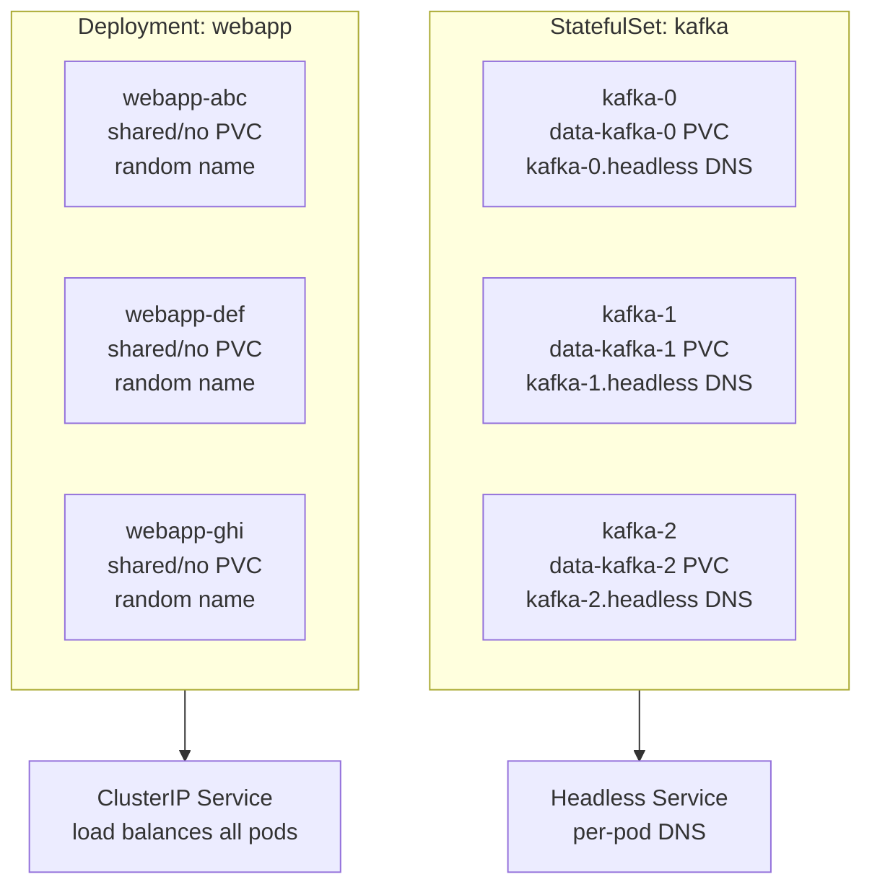
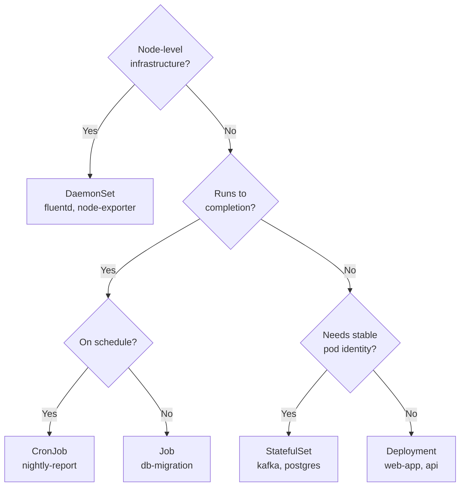

## Keywords in This File

{: .no_toc }

| # | Keyword | Weight |
|---|---------|--------|
| 1 | [StatefulSet vs Deployment](#statefulset-vs-deployment) | critical |
| 2 | [DaemonSet and Job](#daemonset-and-job) | high |

---

# StatefulSet vs Deployment

### 🎯 Model Answer

**30 seconds:**
> Use Deployment for stateless apps where all replicas are identical and interchangeable.
> Use StatefulSet for stateful apps where each instance needs a stable identity -
> a predictable hostname, persistent storage that follows the pod, and ordered
> startup/shutdown. Databases, message brokers, and distributed coordination services
> (Kafka, Cassandra, Zookeeper) require StatefulSet.

**3 minutes (Senior):**
> The fundamental difference: Deployment treats all pods as identical and interchangeable
> (cattle). StatefulSet treats each pod as unique with a persistent identity (pets).
> StatefulSet gives each pod three guarantees that Deployment does not:
>
> First, stable network identity: pods get names like `kafka-0`, `kafka-1`, `kafka-2`
> and DNS names `kafka-0.kafka-headless.ns.svc.cluster.local` that survive pod
> restarts. When `kafka-1` crashes and is replaced, the new pod is still named
> `kafka-1` with the same DNS name. Other cluster members can re-connect by name.
>
> Second, stable storage: each pod gets its own PersistentVolumeClaim that is bound
> to that pod index. `kafka-1` always gets `data-kafka-1`, regardless of which
> physical node it runs on after rescheduling.
>
> Third, ordered operations: StatefulSets deploy pods in order (0, 1, 2...) and
> delete in reverse order (2, 1, 0). Each pod must be Running before the next starts.
> This is critical for Raft/Paxos consensus clusters that must form quorum before
> accepting writes.

**Framework:** WHAT (identity needs) -> WHY (distributed state) -> HOW (stable name + PVC) -> TRADE-OFF -> EXAMPLE

*Adapting up:* Add: `updateStrategy: OnDelete` vs `RollingUpdate` for StatefulSets,
partition rolling updates (update only pods above a partition index, enabling canary
for stateful apps), and headless service requirement for StatefulSet DNS.

*Adapting down:* "StatefulSet = database pods that remember which pod they are.
Deployment = web server pods that are all exactly the same."

**Blank Mind Recovery:**

**(1) Restate:** "StatefulSet vs Deployment - the choice between stateless and
stateful workloads. Let me cover: what makes a workload stateful, the three
StatefulSet guarantees, and when each is the wrong choice."

**(2) First principles:** "Stateful means: the instance identity matters. A database
node needs to be reachable by the same name after restart and access the same data.
Deployment can't provide this; StatefulSet can."

**(3) Bridge:** "Deployment is a cattle ranch - all cows are identical, replace any
one when it dies. StatefulSet is a sports team - player 7 is specifically player 7,
has their own locker (#7), and if they get injured and return, they're still #7."

---

### 📘 Concept Explanation

**What it is:**
Deployment manages stateless pods where all replicas are identical and interchangeable.
StatefulSet manages stateful pods where each instance has a persistent identity:
a stable ordinal hostname (`app-0`, `app-1`), its own PersistentVolumeClaim, and
guaranteed ordered startup and shutdown.

**The problem StatefulSet solves:**
Distributed stateful systems (databases, message brokers, consensus clusters)
cannot function without stable instance identity. If Kafka broker `kafka-1` crashes
and comes back with a different hostname, the cluster cannot re-establish the partition
leader mapping. If `kafka-1` gets a different PVC with different data, the broker's
partition offsets are corrupted. Deployment has no mechanism for stable identity
or per-pod storage - it was designed for stateless workloads.

**How it works:**
```
StatefulSet: kafka (replicas: 3)
  Headless Service: kafka-headless (required for DNS)
    |
    +-- Pod: kafka-0  <-> PVC: data-kafka-0 (PV: disk-1)
    |   DNS: kafka-0.kafka-headless.ns.svc.cluster.local
    |
    +-- Pod: kafka-1  <-> PVC: data-kafka-1 (PV: disk-2)
    |   DNS: kafka-1.kafka-headless.ns.svc.cluster.local
    |
    +-- Pod: kafka-2  <-> PVC: data-kafka-2 (PV: disk-3)
        DNS: kafka-2.kafka-headless.ns.svc.cluster.local

If kafka-1 crashes -> replaced as kafka-1 on same (or different) node
PVC data-kafka-1 reattaches to the new pod -> data preserved
DNS name unchanged -> other brokers reconnect to kafka-1 at same address
```

Ordered operations:
- Scale up: 0 -> 1 -> 2 (each waits for previous to be Running+Ready)
- Scale down: 2 -> 1 -> 0 (reverse)
- Rolling update: highest ordinal first (2 -> 1 -> 0) or partition-controlled

**The key insight:**
A StatefulSet's PVCs are NOT deleted when the StatefulSet is deleted or a pod is
removed. This is by design - to prevent accidental data loss. You must manually
delete the PVCs after deleting the StatefulSet. This is a common operational
gotcha for teams new to StatefulSets.

**When to use StatefulSet:**
- Databases: MySQL, PostgreSQL, MongoDB replica sets
- Message brokers: Kafka, RabbitMQ clusters
- Consensus/coordination: ZooKeeper, etcd, Consul
- Distributed caches needing stable identity: Redis Sentinel
- Distributed search: Elasticsearch, OpenSearch nodes

**When NOT to use StatefulSet:**
- Stateless apps with no per-instance state or identity needs (use Deployment)
- Apps that externalize all state to a managed database (use Deployment)
- Single-replica databases that don't form clusters (a standalone Postgres pod
  with a single PVC works with Deployment + manual PVC binding)

**Alternatives:**
- Operators (PostgreSQL Operator, Kafka Operator) - manage StatefulSets + orchestrate
  database-specific operations (backup, failover, schema migration)
- Managed cloud services (RDS, Cloud SQL, MSK) - offload stateful management entirely

**First-principles derivation:**
State + distribution = identity requirements. A single-node database is simple
(one pod, one PVC, Deployment works). A cluster of nodes (Kafka, Cassandra) requires
each node to know: "I am node 2. My data is on disk-2. Other nodes reach me at
kafka-2.kafka-headless." StatefulSet provides exactly these three guarantees.

---

### 💻 Code Example

> **Code walkthrough:** A StatefulSet for Kafka showing the headless service
> requirement, VolumeClaimTemplate (per-pod PVC creation), and ordered pod naming.
> The Deployment comparison shows why Deployment fails for stateful clusters.

```yaml
# BAD: Deployment for a clustered database
# All pods share one PVC (or each gets different data on restart)
# No stable DNS names - cluster can't form stable quorum
apiVersion: apps/v1
kind: Deployment
metadata:
  name: kafka-wrong       # DON'T use Deployment for Kafka
spec:
  replicas: 3
  template:
    spec:
      containers:
      - name: kafka
        image: kafka:3.5
        # Problem 1: all 3 pods get the same env; no ordinal identity
        # Problem 2: no stable hostname - cluster.peers="?" can't be set
        # Problem 3: shared PVC or no persistence
```

```yaml
# Headless Service: required for StatefulSet DNS names
apiVersion: v1
kind: Service
metadata:
  name: kafka-headless
spec:
  clusterIP: None         # headless - returns individual Pod IPs
  selector:
    app: kafka
  ports:
  - port: 9092
    name: broker
  - port: 9093
    name: controller

---
# GOOD: StatefulSet for Kafka cluster
apiVersion: apps/v1
kind: StatefulSet
metadata:
  name: kafka
spec:
  serviceName: kafka-headless  # required - binds to headless service
  replicas: 3
  selector:
    matchLabels:
      app: kafka
  template:
    metadata:
      labels:
        app: kafka
    spec:
      containers:
      - name: kafka
        image: confluentinc/cp-kafka:7.5.0
        env:
        # Each pod gets its own ordinal via downward API
        - name: POD_NAME
          valueFrom:
            fieldRef:
              fieldPath: metadata.name    # kafka-0, kafka-1, kafka-2
        - name: KAFKA_BROKER_ID
          # Extract ordinal from pod name: kafka-0 -> 0
          value: "$(echo $POD_NAME | rev | cut -d'-' -f1 | rev)"
        - name: KAFKA_ADVERTISED_LISTENERS
          # Stable DNS name for inter-broker communication
          value: "PLAINTEXT://$(POD_NAME).kafka-headless.default.svc.cluster.local:9092"
        volumeMounts:
        - name: data
          mountPath: /var/lib/kafka/data
  volumeClaimTemplates:   # creates PVC per pod: data-kafka-0, data-kafka-1, etc.
  - metadata:
      name: data
    spec:
      accessModes: ["ReadWriteOnce"]
      storageClassName: fast-ssd
      resources:
        requests:
          storage: 100Gi
```

> **Code walkthrough:** The headless service is mandatory - it provides the DNS
> infrastructure for per-pod addressing. `serviceName: kafka-headless` in the
> StatefulSet spec links the two. `volumeClaimTemplates` is the key StatefulSet
> feature - Kubernetes automatically creates one PVC per pod (data-kafka-0,
> data-kafka-1, data-kafka-2), and each pod always gets the same PVC after restart.
> The KAFKA_ADVERTISED_LISTENERS env var uses the stable pod DNS name - this is
> what allows other brokers to reconnect after a crash. If this were a Deployment
> with a random hostname, the broker address would change on every restart, breaking
> the cluster topology.

---

### 🎓 Answers by Seniority

**Junior / Mid (0-5 years):**
> Deployment is for stateless apps like web servers - all pods are identical and
> interchangeable. StatefulSet is for stateful apps like databases that need: stable
> hostnames (kafka-0, kafka-1 survive pod restarts), their own persistent storage
> (each pod's data follows it), and ordered startup (pod 0 starts before pod 1).
> Any time you run a database or message broker in Kubernetes, you almost certainly
> need a StatefulSet.

*Push deeper:* What happens to StatefulSet PVCs when you delete the StatefulSet?

---

**Senior / Staff (5+ years):**
> The StatefulSet vs Deployment decision maps to a fundamental architectural question:
> does this workload need instance identity? If yes: StatefulSet. If no: Deployment.
> The nuance: many teams try to use StatefulSet "just to have persistent storage"
> for a single-replica database. For single-replica, a Deployment + explicit PVC
> binding works fine - you only need StatefulSet when forming a cluster with multiple
> instances that need to identify each other. The production complexity: StatefulSet
> rolling updates are risky for databases. Updating kafka-0 (the controller) while
> kafka-1 and kafka-2 are running can cause brief unavailability. Use `updateStrategy:
> OnDelete` and manually control which pods to restart for database version upgrades.
> Even better: use a purpose-built operator (Strimzi for Kafka, CrunchyData for
> Postgres) that understands the database's specific upgrade semantics.

*Push deeper:* StatefulSet partition rolling updates - update only pods with ordinal
>= partition index. Set partition: 2 to update only kafka-2 first; once validated,
set partition: 1 to update kafka-1, etc. This is canary deployment for stateful apps.

---

### ⚠️ Common Misconceptions

**Misconception 1: "StatefulSets are for any app that needs persistent storage."**
A single-replica app with one PVC works fine with Deployment + manually-created PVC.
StatefulSet adds complexity (ordered operations, headless service, per-pod PVCs)
that only pays off when you need multiple instances with per-instance persistent
identity. Don't use StatefulSet for a single-replica PostgreSQL pod.

**Misconception 2: "Deleting a StatefulSet deletes its PVCs."**
PVCs created by `volumeClaimTemplates` are NOT deleted when the StatefulSet is deleted.
This is intentional data protection. After deleting the StatefulSet, run
`kubectl delete pvc -l app=<name>` to clean up. Forgetting this leaves orphaned PVCs
incurring storage costs.

**Misconception 3: "StatefulSet rolling updates are safe for all databases."**
Rolling updates follow the ordinal ordering but don't understand database semantics
(leader election, replication lag, quorum health). A rolling update of a Raft cluster
can cause brief leader elections and availability windows. For databases, use
`updateStrategy: OnDelete` and coordinate updates manually, or use a database operator.

**Misconception 4: "StatefulSet pods always run on the same node."**
StatefulSet does NOT pin pods to nodes. When a node fails, Kubernetes reschedules
the pod to a different node - but reattaches the same PVC. The PVC follows the pod
identity, not the physical node. The storage must support multi-node access via
network storage (EBS, PD, EFS, Ceph).

---

### 🚨 Failure Modes and Diagnosis

**Failure 1: StatefulSet pod stuck in Pending - PVC not binding**
Symptom: kafka-1 stuck in Pending; `kubectl describe pod kafka-1` shows
"0/1 nodes are available: pod has unbound immediate PersistentVolumeClaims".
Cause: no PersistentVolume available for the PVC (StorageClass not configured,
no dynamic provisioner, or storage capacity exhausted).
Diagnostic: `kubectl get pvc -n <ns>` - PVC should be `Pending`.
`kubectl describe pvc data-kafka-1` - shows "no persistent volumes available".
Fix: check StorageClass exists, dynamic provisioner is running, storage quota not exceeded.

**Failure 2: StatefulSet pod replacements always start on the same failed node**
Symptom: kafka-1 keeps being scheduled back to a failed/tainted node.
Cause: PVC is bound to a specific availability zone; new pod must schedule in same zone.
Diagnostic: `kubectl get pvc data-kafka-1 -o jsonpath='{.spec.storageClassName}'`
and check AZ topology constraints.
Fix: topology-aware provisioning via `volumeBindingMode: WaitForFirstConsumer` on
StorageClass delays PVC binding until pod scheduling, allowing cross-AZ flexibility.

**Failure 3: StatefulSet stuck rolling update - pod crashes at new version**
Symptom: rollout updates pod-2 but it crashes; pod-1 never gets updated.
Cause: new version has a bug; StatefulSet rolling update stops on first failure.
Diagnostic: `kubectl rollout status statefulset/<name>` shows stalled.
`kubectl logs <pod> --previous` for crash reason.
Fix: `kubectl rollout undo statefulset/<name>` OR use `updateStrategy: OnDelete`
and manually restart specific pods after validating the update.

---

### 🎯 Interview Deep-Dive

| Question Category | Time to Answer |
|---|---|
| Definition | 30-60 seconds |
| Mechanism | 1-2 minutes |
| Trade-off | 2-3 minutes |
| Scenario | 2-3 minutes |
| Debugging | 2-3 minutes |
| Architecture | 2-3 minutes |
| Advanced | 1-2 minutes |
| Production | 2-3 minutes |
| Behavioral | 2-3 minutes |

---

**Q1 [JUNIOR] (Definition): When should you use StatefulSet instead of Deployment?**

A: Use StatefulSet when your application requires:

Stable pod identity: each pod needs a predictable hostname that survives restarts.
Kafka brokers, Elasticsearch nodes, and ZooKeeper ensemble members need to be
reachable at the same address after a crash. StatefulSet provides `app-0`, `app-1`,
`app-2` as stable names; Deployment gives pods random names like `app-abc123`.

Per-pod persistent storage: each instance needs its own data that follows it.
A database primary and its replicas each have their own data directory. StatefulSet
creates one PVC per pod via `volumeClaimTemplates`; Deployment would share one PVC
or give all pods different data on restart.

Ordered startup/shutdown: distributed consensus systems (Raft, Paxos) need at
least (N/2)+1 nodes to form quorum before accepting writes. StatefulSet ensures
pod 0 is Running before pod 1 starts; Deployment starts all pods simultaneously.

If your app doesn't need any of these three things - if it's a stateless web server,
an API, or a worker that reads from a queue - use Deployment.

*What separates good from great:* Noting that "stateful" doesn't automatically mean
"StatefulSet". A single-node database (one PVC, one pod) can use Deployment with
a manually-bound PVC. The StatefulSet complexity only pays off for clustered,
multi-instance stateful systems.

---

**Q2 [MID] (Mechanism): Explain the StatefulSet pod identity guarantees.**

A: StatefulSet provides three tightly-coupled identity guarantees:

Guarantee 1 - Stable ordinal hostname: pods are named `<statefulset-name>-<ordinal>`.
`kafka-0`, `kafka-1`, `kafka-2`. When kafka-1 crashes and is replaced, the new pod
is STILL named kafka-1. It has the same identity as the original.

Guarantee 2 - Stable network identity: requires a headless Service (clusterIP: None).
Each pod gets a stable DNS A record: `kafka-1.kafka-headless.default.svc.cluster.local`.
This DNS name resolves to the pod's current IP, which changes on reschedule - but
the NAME is stable. Cluster members discover each other by name.

Guarantee 3 - Stable storage: via `volumeClaimTemplates`, each pod gets its own
PVC: `data-kafka-0`, `data-kafka-1`. These PVCs are bound to the pod's ordinal,
not its node. When kafka-1 is rescheduled to a different node, it reattaches to
`data-kafka-1` on the new node. The pod never sees a different volume.

These three work together: when kafka-1 crashes on node-A and restarts on node-B:
- Same name: `kafka-1` (ordinal stable)
- Same DNS: `kafka-1.kafka-headless...` resolves to new IP on node-B
- Same data: `data-kafka-1` detaches from node-A and attaches to node-B

From the perspective of other cluster members: kafka-1 "moved" but is still kafka-1
with the same data. Cluster membership is maintained.

*What separates good from great:* The DNS resolution behavior - `kafka-1.kafka-headless`
resolves to the pod's CURRENT IP. When the pod restarts on a new node with a new IP,
the headless service DNS updates within seconds. No manual configuration change needed.

---

**Q3 [MID] (Scenario): You need to run a 3-node PostgreSQL cluster with replication in
Kubernetes. How would you design this?**

A: A 3-node PostgreSQL cluster with streaming replication requires:

Architecture: 1 primary (read/write) + 2 replicas (read-only, HA failover).
The replicas must know the primary's stable address to connect for replication.
After primary failure, one replica must be promoted and others re-point to the new primary.

The naive StatefulSet approach works but you'd have to implement all the operator logic:
- postgres-0: primary (hardcoded by convention - ordinal 0)
- postgres-1, postgres-2: replicas
- Headless service: stable DNS for replication

```yaml
kind: StatefulSet
# postgres-0: PGDATA on data-postgres-0, accepts writes
# postgres-1: streams from postgres-0.postgres-headless...
# postgres-2: streams from postgres-0.postgres-headless...
```

My recommendation: use the Crunchy Data PGO or Zalando PostgreSQL Operator.
These operators wrap StatefulSet + orchestrate:
- Automatic failover via Patroni (leader election with etcd/consul)
- Replica promotion to primary
- Automatic replica re-sync after failover
- Backup via pgBackRest
- Connection pooling via PgBouncer

The operator approach is 90% less custom code and handles edge cases (split brain,
cascading failures, network partitions) that DIY StatefulSet gets wrong.

For production: managed database (Cloud SQL, RDS, Azure Database) unless you have
a strong reason to run in-cluster (data residency, latency, cost at scale).

*What separates good from great:* Knowing that PostgreSQL failover is hard because
Postgres doesn't have built-in leader election. Patroni (DCS-based HA) is what all
production Postgres K8s operators use. The StatefulSet is just the pod management
layer; Patroni handles the database clustering logic.

---

**Q4 [SENIOR] (Trade-off): When would you use a managed database service instead of
running it in Kubernetes?**

A: The decision framework: run in K8s if you need deep customization, data residency,
or cost optimization at very large scale. Use managed if you need operational simplicity.

Use managed services (RDS, Cloud SQL, Cosmos DB) when:
Operational simplicity is a priority: managed services handle backups, patching,
failover, and scaling automatically. Running Postgres in K8s means owning all of these.
Team expertise: a 5-person team running 10 microservices cannot also maintain deep
expertise in Kafka, PostgreSQL, Redis, and Elasticsearch clustering. Managed services
offload the operational expertise requirement.
SLA requirements: AWS RDS promises 99.95% availability. Matching this with in-cluster
Postgres requires a highly sophisticated operator, right-sized nodes, and operational
discipline that takes months to build.
Storage costs: managed databases often provide SSD storage at competitive prices
without you managing StorageClasses and PVs.

Run in Kubernetes when:
Cost at scale: at 100+ TB data or very high throughput, managed services become
significantly more expensive than self-managed on spot/reserved nodes.
Compliance: some regulated industries require data to stay within specific infrastructure
you control, where cloud-managed services don't satisfy audit requirements.
Performance customization: managed services have feature ceilings. If you need
custom PostgreSQL extensions, specific PostgreSQL versions, or extreme tuning of
storage I/O, self-managed gives full control.
Data locality: if your processing workloads run in K8s and need sub-millisecond
latency to data, co-located in-cluster databases eliminate network hops.

*What separates good from great:* Recognizing that "run in K8s" doesn't mean
"just create a StatefulSet". It means taking on responsibility for backups, failover,
upgrades, and monitoring at production quality. That's a non-trivial operational commitment.

---

**Q5 [SENIOR] (Debugging): Your StatefulSet kafka-1 pod is in a Pending state after
a node failure. Diagnose.**

A: A StatefulSet pod stuck Pending after node failure is almost always a storage
issue - the PVC cannot be reattached to the new node.

Step 1: confirm kafka-1 is the stuck pod.
`kubectl get pods -n kafka -o wide` - kafka-1 shows Pending; others are Running.

Step 2: check the pod's scheduling issue.
`kubectl describe pod kafka-1 -n kafka` -> Events section.
Common messages:
- "0/3 nodes are available: pod has unbound PersistentVolumeClaims" -> PVC issue
- "1 node(s) had volume node affinity conflict" -> volume in different AZ than available nodes
- "Insufficient memory" -> no node has capacity

Step 3: if "volume node affinity conflict":
`kubectl get pvc data-kafka-1 -n kafka -o yaml` -> look for `nodeAffinity` in PV spec.
`kubectl get pv <pv-name> -o yaml` -> check `nodeAffinity.required.nodeSelectorTerms`.
This shows which AZ the PV is locked to. If no nodes in that AZ are available,
kafka-1 cannot schedule.

Fix options:
- Add a node in the same AZ as the PV (correct fix)
- If the AZ is permanently down: `kubectl delete pvc data-kafka-1`, let StatefulSet
  create a new PVC on available nodes, then restore data from backup/replica sync

Step 4: for StorageClass with `WaitForFirstConsumer`: ensure the StorageClass is
configured this way to allow cross-AZ PVC binding flexibility.

*What separates good from great:* Knowing the AZ topology issue is common in AWS
where EBS volumes are AZ-locked. `WaitForFirstConsumer` binding mode is the
prevention. `allowedTopologies` in StorageClass can restrict PVC binding to AZs
where your nodes exist.

---

**Q6 [STAFF] (Architecture): How do StatefulSet Operators improve on raw StatefulSets?**

A: A raw StatefulSet provides the infrastructure primitives (stable identity, ordered
ops, per-pod PVCs) but knows nothing about the application's semantics. An Operator
extends Kubernetes with application-specific operational knowledge.

What a database operator adds on top of StatefulSet:

Health-aware operations: before restarting a pod, the operator checks replication lag.
If a replica is 10GB behind the primary, it delays the restart until caught up.
A raw StatefulSet rolling update doesn't check this.

Automatic failover: when the primary pod dies, the operator runs the database's
promotion process (pg_ctl promote, kafka leader re-election) and updates the
Service selector to point to the new primary. A raw StatefulSet just restarts the
crashed pod as-is.

Backup orchestration: the operator schedules and monitors backups (pgBackRest for
Postgres, Kafka Mirror Maker for Kafka), handles backup validation, and can restore
from backup as part of pod initialization.

Custom resource API: instead of managing StatefulSet YAML directly, you create a
custom `PostgresCluster` or `Kafka` object. The operator translates this to StatefulSets,
Services, ConfigMaps, and orchestrates the database-specific lifecycle.

The pattern: operator = StatefulSet + reconciliation loops for domain-specific operations.
The controller for your custom resource watches for cluster state changes and acts on
them (create replica, handle failover, schedule backup).

Recommendation: use operators for production database workloads. Writing a reliable
database operator takes months; using a battle-tested operator (Strimzi for Kafka,
CrunchyData for Postgres, MongoDB Atlas Operator) is almost always the right choice.

*What separates good from great:* The Operator Pattern's design principle - Kubernetes
controllers should be idempotent reconciliation loops, not imperative scripts. A good
operator converges from any state to the desired state; a bad operator assumes the
current state matches what it last set.

---

**Q7 [STAFF] (Behavioral): Describe how you migrated a stateful application to Kubernetes.**

A (STAR format):

Situation: Our team had a 3-node Kafka cluster running on bare metal VMs. The
infrastructure team was sunsetting the VM fleet. We needed to migrate Kafka to
Kubernetes without losing any messages or causing producer/consumer disruption.

Task: migrate the Kafka cluster to Kubernetes with zero message loss and minimal
producer/consumer disruption (< 5 minute pause acceptable).

Action:
First, I evaluated Strimzi (Kafka Operator for K8s) vs raw StatefulSet. Chose Strimzi
for automatic rolling upgrades, integrated TLS management, and Cruise Control
integration for partition rebalancing.

Week 1: deployed Strimzi in the Kubernetes cluster. Created a new 3-broker Kafka
cluster using the `Kafka` custom resource. Created matching topics.

Week 2: deployed MirrorMaker 2 to replicate all data from the old cluster to the
new cluster. Verified replication lag was consistently < 1 second.

Week 3: migration window. At T=0: paused all producer applications. At T=1 minute:
confirmed replication lag = 0 (all messages copied). At T=2 minutes: updated all
producer and consumer application configs to point to the new cluster. At T=3 minutes:
resumed producers. At T=5 minutes: verified end-to-end message flow on new cluster.
At T=10 minutes: stopped MirrorMaker, decommissioned old cluster.

Monitoring: Prometheus + Grafana dashboards for consumer lag (must return to zero
within minutes of migration); producer send rate (must resume without errors).

Result: migration completed in the planned window with < 4 minutes of producer pause
and zero message loss. No consumer group offsets were lost (Strimzi preserved group
offsets via MirrorMaker 2 offset translation).

*What separates good from great:* Using MirrorMaker 2 for offset translation -
consumer group offsets are cluster-specific. MirrorMaker 2 translates old cluster
offsets to new cluster offsets, so consumers resumed from exactly where they left
off rather than re-reading from the beginning.

---

**Q8 [STAFF] (Production): How do you perform a zero-downtime StatefulSet rolling update
for a database?**

A: StatefulSet rolling updates for databases are risky because the database
controller (StatefulSet) knows nothing about database semantics. The safe approach:

Option 1: `updateStrategy: OnDelete` (recommended for production databases)
Set `updateStrategy.type: OnDelete`. The StatefulSet will NOT automatically update
pods on spec change. You manually delete pods one at a time, controlling the order
and timing based on database health.

Procedure for a 3-node Kafka cluster:
1. Update the StatefulSet spec (new image). Pod updates are BLOCKED (OnDelete).
2. Check cluster health: `kafka-topics.sh --describe` - all partitions have ISR=3.
3. Delete kafka-2 (a follower, not the controller): `kubectl delete pod kafka-2`.
4. Wait for kafka-2 to restart with new image AND all partitions to return to ISR=3.
5. Repeat for kafka-1.
6. For kafka-0 (controller): verify all partitions have alternative leaders, then
   delete kafka-0. The controller re-election is automatic.
7. Verify ISR=3 after each step before proceeding.

Option 2: Strimzi/Operator-managed rolling update
Strimzi's `KafkaRollingUpdate` is semantics-aware: it checks replication health
before restarting each broker, waits for ISR to recover, and handles controller
migration explicitly. This is the production-grade approach.

Option 3: RollingUpdate with partition (canary approach)
Set `updateStrategy.rollingUpdate.partition: 2` - only kafka-2 is updated. Once
validated, set partition: 1, then partition: 0.

For PostgreSQL: NEVER use automated rolling update for the primary. Always update
replicas first, then promote a replica to primary, update the old primary as a new
replica. This requires database operator awareness.

*What separates good from great:* Understanding that "zero downtime database upgrade"
is application-dependent. A stateless API can tolerate a rolling restart. A
single-primary database needs a leader handoff. These are fundamentally different
operations that a generic StatefulSet controller cannot orchestrate correctly.

---

**Q9 [JUNIOR] (Comparison): When would a managed cloud database (RDS, Cloud SQL)
be better than running in Kubernetes?**

A: Managed databases are better in almost all cases for teams that don't specialize
in database operations.

Choose managed database when: you want automated backups with point-in-time recovery
(RDS takes automated snapshots, provides PITR to any second); you want automatic
failover without any configuration (Multi-AZ RDS promotes a standby in 60-120
seconds with no operator intervention); you want automated minor version patching
(security patches applied during maintenance windows); you want integrated monitoring
without setting up Prometheus/Grafana (CloudWatch/Cloud Monitoring is built-in).
Most importantly: you want no on-call for database infrastructure. If RDS has a
hardware failure at 2am, AWS fixes it. If your StatefulSet Postgres has a PVC
corruption at 2am, you fix it.

Choose in-Kubernetes when: you have very specific extension requirements (custom
PostgreSQL extensions), extreme cost sensitivity at large scale (spot nodes cost
60-90% less than managed service), data sovereignty requirements, or you're running
a platform that serves hundreds of customers who each need their own isolated database
instance (cost of hundreds of RDS instances vs self-managed operators).

The honest answer: for most teams and most use cases, managed databases provide more
reliability with less operational burden. Only consider self-managed databases in
Kubernetes after you've built significant K8s operations maturity.

*What separates good from great:* Knowing that this is a cost/capability/risk tradeoff,
not a technical one. Small teams should default to managed. Large platform teams
with database expertise and cost sensitivity should consider self-managed.

---

### ⚖️ Comparison Table

| Dimension | Deployment | StatefulSet |
|---|---|---|
| Pod identity | Random names (app-abc123) | Stable ordinals (app-0, app-1) |
| Pod DNS | Via Service ClusterIP only | Per-pod stable DNS via headless svc |
| Storage | Shared PVC or no persistence | Per-pod PVC (volumeClaimTemplates) |
| Startup order | All pods start simultaneously | Ordered: 0 -> 1 -> 2 (each waits) |
| Shutdown order | Any order | Reverse: 2 -> 1 -> 0 |
| Rolling update | Simultaneous batches | Ordered, highest ordinal first |
| PVC on delete | PVC deleted with pods | PVC preserved (must delete manually) |
| Best for | Stateless: web servers, APIs | Stateful: databases, brokers, caches |
| Complexity | Simple | Higher (headless svc, PVC lifecycle) |
| Recovery | Replace any pod, identical | Replace by ordinal, reattaches PVC |

**Decision framework:**
- Does each pod need its own persistent data? -> StatefulSet
- Does each pod need a stable, predictable hostname? -> StatefulSet
- Are all pods identical and interchangeable? -> Deployment
- Is it a web server, API, or stateless worker? -> Deployment
- Is it a database, message broker, or consensus cluster? -> StatefulSet (or operator)

**Rapid Decision Tree:**
```
Does the app form a cluster where members identify each other?
  YES -> StatefulSet (or Operator)
  NO  -> Does each instance have its own persistent state?
           YES -> StatefulSet
           NO  -> Deployment
```

---

### 🏛️ System Design

*(Omit: ★★☆ keyword - system design for distributed stateful systems
covered in L4/L5 Kafka and etcd files.)*

---

### 📊 Diagram

```
StatefulSet vs Deployment pod replacement:

DEPLOYMENT: pod dies, replacement is generic
  [app-abc] dies
  New pod: [app-xyz] - new name, new IP, no specific data

STATEFULSET: pod dies, replacement maintains identity
  [kafka-1] dies
  New pod: [kafka-1] - SAME name
    - reattaches data-kafka-1 PVC (same data)
    - DNS kafka-1.headless... resolves to new IP
    - cluster sees "kafka-1 reconnected" not "kafka-1 replaced"
```



> **Diagram walkthrough:** The StatefulSet structure shows each pod with its own
> stable identity: ordinal name, dedicated PVC, and per-pod DNS via the headless
> service. When kafka-1 is replaced, all three attributes persist - the new pod
> reassumes the kafka-1 identity. The Deployment pods are anonymous - they share
> a ClusterIP service that load-balances across all identical replicas, and there
> is no concept of "which pod is which". The fundamental difference: StatefulSet
> pods are pets; Deployment pods are cattle.

---
---

# DaemonSet and Job

### 🎯 Model Answer

**30 seconds:**
> DaemonSet ensures exactly one Pod runs on every node (or every node matching
> a selector) - used for node-level infrastructure like log collectors, monitoring
> agents, and CNI plugins. Job runs a Pod to completion for batch work; CronJob
> schedules Jobs on a cron schedule. Use these three controllers when Deployment
> semantics (N replicas, always running) don't fit your workload shape.

**3 minutes (Senior):**
> DaemonSet solves the "run on every node" requirement. When you add a new node to
> the cluster, the DaemonSet controller automatically schedules the DaemonSet pod
> there. When a node is removed, the pod is garbage collected. This is how Kubernetes
> itself installs node-level infrastructure: fluentd, node-exporter (Prometheus),
> kube-proxy, and CNI plugins (Calico, Flannel) all run as DaemonSets.
>
> Job solves batch/one-time workloads. Unlike Deployment (runs forever), a Job
> runs until its pods complete successfully (exit 0) and then considers itself done.
> Failure handling is configurable: `backoffLimit` sets how many retries, `restartPolicy`
> controls whether to restart failed pods or create new ones. For distributed batch
> work, Job's `completions` and `parallelism` fields run multiple pods in parallel
> until the total completion count is reached.
>
> CronJob is a Job factory on a cron schedule. It creates Job objects at the
> specified time; the Job then manages the pods. Critical operational concern:
> with `concurrencyPolicy: Allow` (default), if a CronJob's previous run hasn't
> finished when the next is scheduled, both run simultaneously - this causes problems
> for jobs that aren't designed for concurrent execution.

**Framework:** WHAT -> WHY -> HOW -> TRADE-OFF -> EXAMPLE

*Adapting up:* Add: DaemonSet update strategies (RollingUpdate vs OnDelete),
Job indexed completion mode (each pod gets an index for partitioned batch work),
TTL controller for automatic Job cleanup, and WorkQueue pattern for distributed
batch processing.

*Adapting down:* "DaemonSet = one pod per node automatically. Job = run once and stop.
CronJob = run Job on a schedule."

**Blank Mind Recovery:**

**(1) Restate:** "DaemonSet and Job - two controllers for non-standard workload patterns.
DaemonSet = node-level infrastructure; Job/CronJob = batch/scheduled work."

**(2) First principles:** "Not all work is 'run N replicas forever'. Node-level work
needs exactly-one-per-node semantics. Batch work needs run-once-and-complete semantics.
DaemonSet and Job provide these."

**(3) Bridge:** "DaemonSet is like installing a software agent on every server in
your fleet - automatically on new servers, automatically removed on decommissioned
ones. Job is like a scheduled script that runs once and exits."

---

### 📘 Concept Explanation

**What it is:**
DaemonSet ensures exactly one Pod runs on each node (or nodes matching a selector).
Pods are added automatically when nodes join the cluster and removed when nodes leave.

Job manages Pods that run to completion. It creates pods, tracks completions, retries
on failure, and marks itself Done when the target completion count is reached.

CronJob creates Job objects on a schedule (cron syntax). Each scheduled run creates
a new Job, which creates pods.

**The problem they solve:**
Three workload shapes that Deployment cannot handle:
- Node-level infrastructure: must run on every node; Deployment's N replicas can't
  guarantee exactly-one-per-node
- Batch processing: run until done, not run forever; Deployment would restart pods
  after successful completion (exit 0)
- Scheduled batch: run at specific times, not continuously

**How it works:**
```
DaemonSet: fluentd-logging
  Node A -> fluentd pod (auto-created)
  Node B -> fluentd pod (auto-created)
  Node C -> fluentd pod (auto-created)
  + Node D added -> fluentd pod (auto-created by DaemonSet controller)
  - Node E removed -> fluentd pod (auto-deleted)

Job: data-migration (completions:1, parallelism:1)
  Pod created -> runs migration -> exits 0 -> Job: Complete
  Pod fails -> backoffLimit retry -> (retry 1, retry 2, retry 3) -> Job: Failed

CronJob: nightly-report (schedule: "0 2 * * *")
  02:00 -> creates Job -> Job creates Pod -> Pod runs report -> exits 0 -> Job: Complete
  (Job auto-deleted after TTL)
```

**The key insight:**
DaemonSet bypasses the scheduler for node assignment - it places pods directly on
specific nodes, even nodes tainted with `NoSchedule` (using tolerations). This is
how infrastructure DaemonSets (kube-proxy, CNI plugin) run on ALL nodes including
control plane nodes that reject regular workloads via taints.

For Jobs: `restartPolicy: Never` (create new pod on failure) vs `restartPolicy:
OnFailure` (restart same pod). `Never` is generally preferred for debugging (you
can inspect the failed pod's logs) and for batch work that leaves files behind.

**When to use DaemonSet:**
- Log collection (fluentd, filebeat) - needs access to host log files on every node
- Node monitoring (node-exporter, datadog-agent) - collects node-level metrics
- Network plugins (CNI: Calico, Flannel, Cilium) - must run on all nodes
- Storage plugins (CSI drivers) - node-local storage management
- Security agents (Falco) - kernel-level security monitoring

**When to use Job/CronJob:**
- Database migrations (one-time, run to completion)
- Data pipeline batch processing (process all records in queue, then stop)
- Report generation (nightly/weekly scheduled)
- Cleanup tasks (delete old records, archive data)
- ETL jobs (extract, transform, load from one system to another)

**When NOT to use DaemonSet:**
- Don't use DaemonSet for app-level services that need N replicas; use Deployment
- Don't use DaemonSet when you only need a service on specific nodes; use NodeAffinity
  on a Deployment instead

**When NOT to use Job:**
- Don't use CronJob for work that runs continuously (use Deployment)
- Don't use CronJob without setting `concurrencyPolicy: Forbid` for non-idempotent jobs
- Don't let Jobs accumulate without `ttlSecondsAfterFinished` cleanup

**Alternatives:**
- Argo Workflows - complex DAG-based batch workflows, more features than Job
- Apache Spark on K8s - distributed data processing
- Tekton - CI/CD pipeline as K8s native resources

**First-principles derivation:**
Workload shapes: (1) always-on, N replicas = Deployment, (2) always-on, one per
node = DaemonSet, (3) run-to-completion, one run = Job, (4) run-to-completion on
schedule = CronJob. These four shapes cover nearly all real-world workloads. The
controller primitive should match the workload shape.

---

### 💻 Code Example

> **Code walkthrough:** A DaemonSet for Prometheus node-exporter showing tolerations
> for running on all nodes including control-plane. A Job for a one-time migration.
> A CronJob with proper concurrencyPolicy and cleanup settings.

```yaml
# DaemonSet: Prometheus node-exporter on ALL nodes
apiVersion: apps/v1
kind: DaemonSet
metadata:
  name: node-exporter
  namespace: monitoring
spec:
  selector:
    matchLabels:
      app: node-exporter
  updateStrategy:
    type: RollingUpdate           # update one node at a time
    rollingUpdate:
      maxUnavailable: 1           # at most 1 node unmonitored during update
  template:
    metadata:
      labels:
        app: node-exporter
    spec:
      # Run on ALL nodes including control-plane (which is tainted NoSchedule)
      tolerations:
      - key: node-role.kubernetes.io/control-plane
        effect: NoSchedule
      - key: node.kubernetes.io/not-ready
        operator: Exists
        effect: NoSchedule        # stay on not-ready nodes to collect metrics
      hostPID: true               # access host process metrics
      hostNetwork: true           # access host network metrics
      containers:
      - name: node-exporter
        image: prom/node-exporter:v1.7.0
        args:
        - '--path.procfs=/host/proc'
        - '--path.sysfs=/host/sys'
        volumeMounts:
        - name: proc
          mountPath: /host/proc
          readOnly: true
        - name: sys
          mountPath: /host/sys
          readOnly: true
        resources:
          requests:
            cpu: "100m"
            memory: "30Mi"
          limits:
            cpu: "200m"
            memory: "50Mi"
      volumes:
      - name: proc
        hostPath:
          path: /proc             # host proc filesystem
      - name: sys
        hostPath:
          path: /sys
```

```yaml
# BAD: CronJob without concurrency protection or cleanup
apiVersion: batch/v1
kind: CronJob
metadata:
  name: weekly-cleanup
spec:
  schedule: "0 1 * * 0"    # every Sunday 1am
  jobTemplate:
    spec:
      template:
        spec:
          containers:
          - name: cleanup
            image: cleanup-job:latest
          restartPolicy: OnFailure
  # MISSING: concurrencyPolicy, ttlSecondsAfterFinished, backoffLimit
  # Risk: old jobs accumulate, concurrent runs if job is slow
```

```yaml
# GOOD: CronJob with proper operational settings
apiVersion: batch/v1
kind: CronJob
metadata:
  name: nightly-report
spec:
  schedule: "0 2 * * *"          # 2am daily
  timeZone: "UTC"
  concurrencyPolicy: Forbid       # skip if previous run still running
  successfulJobsHistoryLimit: 3   # keep 3 successful job records
  failedJobsHistoryLimit: 5       # keep 5 failed job records for debugging
  startingDeadlineSeconds: 300    # skip run if cluster was down for >5min
  jobTemplate:
    spec:
      ttlSecondsAfterFinished: 3600  # clean up Job 1hr after completion
      backoffLimit: 2                # retry up to 2 times on failure
      template:
        spec:
          containers:
          - name: report-generator
            image: reports:1.2.3
            env:
            - name: REPORT_DATE
              value: "$(date -d yesterday +%Y-%m-%d)"
            resources:
              requests:
                cpu: "500m"
                memory: "1Gi"
          restartPolicy: Never       # create new pod on failure (keep logs)
```

> **Code walkthrough:** The DaemonSet tolerates the `control-plane: NoSchedule` taint
> which normally prevents non-system pods from running on control plane nodes - this
> is required for monitoring agents that need to cover ALL nodes. `hostPID: true` and
> `hostNetwork: true` give the container access to the node's process list and network
> interfaces for metrics collection - these are security-sensitive and should only be
> granted to trusted infrastructure pods. The CronJob's `concurrencyPolicy: Forbid`
> is critical: if your report takes 25 hours to run and the cron fires at 2am the
> next day, `Forbid` skips the new run. `Allow` (default) would start a second
> concurrent run, corrupting output or hammering the database.

---

### 🎓 Answers by Seniority

**Junior / Mid (0-5 years):**
> DaemonSet runs one pod on each node - perfect for monitoring agents and log
> collectors that need to run everywhere. Job runs pods to completion (exit 0) and
> stops - used for one-time migrations or batch processing. CronJob runs Jobs on a
> schedule (cron syntax like "0 2 * * *" for 2am daily). Unlike Deployment, Jobs
> don't restart pods after successful completion.

*Push deeper:* What is `restartPolicy: Never` vs `OnFailure` on a Job?

---

**Senior / Staff (5+ years):**
> DaemonSets have a security implication worth understanding: many DaemonSets
> (node-exporter, Falco, CNI plugins) require elevated host access - `hostPID`,
> `hostNetwork`, `hostPath` mounts. These bypass Pod Security Standards. A
> compromised DaemonSet pod with hostPID access can see all host processes.
> Restrict DaemonSet pod permissions to only the host resources they actually need.
> For Jobs: the indexed completion mode (K8s 1.21+) is a significant capability upgrade
> - each pod in a Job gets a unique `JOB_COMPLETION_INDEX` env var (0 to N-1),
> enabling perfectly partitioned batch work without a work queue. Process record
> batch[index] of the total dataset in each pod. This replaces complex work queue
> patterns for many batch use cases.

*Push deeper:* Job's `workQueue` pattern with `parallelism > 1` and `completions` set -
the Job keeps creating pods until `completions` pods have exited 0.

---

### ⚠️ Common Misconceptions

**Misconception 1: "DaemonSet replaces node affinity for running on specific nodes."**
Use `nodeSelector` or `affinity` on a DaemonSet to restrict it to specific nodes
(e.g., nodes with SSDs only). But DaemonSet is not a replacement for node affinity
on Deployments - if you want 3 replicas but only on GPU nodes, use Deployment with
node affinity, not DaemonSet (which would run on every node, not just GPU nodes).

**Misconception 2: "Job restarts completed pods if they exit 0."**
Job marks itself Complete when the required number of pods have exited 0 - completed
pods are NOT restarted. This is the key difference from Deployment. Set
`restartPolicy: Never` on Job pods; `restartPolicy: Always` is not allowed on Jobs.

**Misconception 3: "CronJob concurrencyPolicy: Allow is safe by default."**
`Allow` means if the previous run is still running when the next fires, both run
simultaneously. For idempotent jobs, this may be fine. For non-idempotent jobs
(payment processing, report generation that overwrites data), this causes duplicate
execution and data corruption. Default to `Forbid` for any job that isn't designed
for concurrent runs.

**Misconception 4: "Old Job objects clean themselves up."**
By default, completed Jobs accumulate indefinitely. A cluster running daily CronJobs
for a year has 365 stale Job objects (and their pods). Use `ttlSecondsAfterFinished`
on Jobs and `successfulJobsHistoryLimit` on CronJobs to control cleanup.

---

### 🚨 Failure Modes and Diagnosis

**Failure 1: CronJob never creates a Job (missed schedules)**
Symptom: CronJob schedule has passed but no Job was created.
Cause: `startingDeadlineSeconds` elapsed (cluster was down during scheduled time),
or the CronJob has too many missed schedules (> 100 missed = CronJob stops scheduling).
Diagnostic: `kubectl describe cronjob <name>` -> "Events" and "Last Schedule Time".
`kubectl get jobs -l app=<name>` to see if any Jobs were created.
Fix: check `startingDeadlineSeconds` setting; manually trigger: `kubectl create job
--from=cronjob/<name> manual-run`.

**Failure 2: Job runs indefinitely - pods keep restarting**
Symptom: `kubectl get jobs` shows Active pods but no Completions; pods cycle.
Cause: `restartPolicy: OnFailure` with the container exiting non-zero repeatedly.
`backoffLimit` is set too high or not set (default 6 retries).
Diagnostic: `kubectl describe job <name>` -> backoffLimit vs retry count.
`kubectl logs <pod-name> --previous` for failure reason.
Fix: investigate failure cause; set lower `backoffLimit`; fix application error.

**Failure 3: DaemonSet pod fails to schedule on some nodes**
Symptom: `kubectl get daemonset` shows DESIRED=5 but READY=3; 2 nodes missing a pod.
Cause: DaemonSet pod tolerations don't cover all node taints; or resource requests
exceed available capacity on those nodes.
Diagnostic: `kubectl describe node <problem-node>` for taints.
`kubectl describe pod <daemonset-pod-failing>` for scheduling failure reason.
Fix: add appropriate tolerations to DaemonSet spec; or reduce resource requests.

---

### 🎯 Interview Deep-Dive

| Question Category | Time to Answer |
|---|---|
| Definition | 30-60 seconds |
| Mechanism | 1-2 minutes |
| Trade-off | 2-3 minutes |
| Scenario | 2-3 minutes |
| Debugging | 2-3 minutes |
| Design | 2-3 minutes |
| Advanced | 1-2 minutes |
| Production | 2-3 minutes |
| Behavioral | 2-3 minutes |

---

**Q1 [JUNIOR] (Definition): What is the difference between DaemonSet, Job, and Deployment?**

A: They model different workload shapes:

Deployment: runs N identical replicas continuously. If a pod dies, creates a new
one. Perfect for web servers, APIs, and workers that run indefinitely.

DaemonSet: runs exactly ONE pod on EACH node. Automatically adds pods when nodes
join the cluster, removes when nodes leave. Perfect for node-level infrastructure
that must run everywhere: log collectors, monitoring agents, network plugins.

Job: runs pods until they COMPLETE (exit 0). Doesn't restart successfully completed
pods. Retries on failure up to `backoffLimit`. Perfect for one-time batch work:
database migrations, report generation, data processing.

CronJob: creates Job objects on a cron schedule (e.g., "0 2 * * *" = 2am daily).
The CronJob manages the schedule; the Job manages the pods.

Rule of thumb: always-running same everywhere -> Deployment. Must cover every node ->
DaemonSet. Run once -> Job. Run on schedule -> CronJob.

*What separates good from great:* StatefulSet is the fourth controller type - for
stateful clustered apps needing stable pod identity and per-pod storage.

---

**Q2 [MID] (Mechanism): How does DaemonSet ensure exactly one pod per node?**

A: The DaemonSet controller (part of kube-controller-manager) runs a reconciliation
loop:

1. Watch for changes to Nodes and DaemonSets.
2. For each active Node: check if a DaemonSet pod with the correct labels is running.
3. If the DaemonSet has `nodeSelector` or `affinity`: check if the node matches.
4. If no pod exists on a matching node: directly create a pod with `nodeName` set
   to that specific node, bypassing the scheduler.
5. If a pod exists on a non-matching node (node was re-labeled): delete the extra pod.
6. If a node is added: create a DaemonSet pod on it.
7. If a node is removed: the pod is garbage-collected with the node.

Key point: DaemonSet pods are created with `spec.nodeName` set explicitly - this
BYPASSES the normal Kubernetes scheduler. The DaemonSet controller is its own
"mini-scheduler" that places pods directly. This is why DaemonSet pods can run on
nodes marked `Unschedulable` (via kubectl cordon) - cordoning prevents the Kubernetes
scheduler from placing pods there, but DaemonSet bypasses the scheduler.

DaemonSet tolerations: DaemonSet pods automatically get tolerations for common node
taints (`not-ready`, `unreachable`, `memory-pressure`). This ensures infrastructure
pods (log collectors, monitoring) stay on distressed nodes to collect diagnostic data.

*What separates good from great:* The bypass of the scheduler is why DaemonSet is
used for critical infrastructure. Even during node drain (which sets `Unschedulable`),
DaemonSet pods can be scheduled if their toleration includes `NoSchedule` effect.

---

**Q3 [MID] (Mechanism): Explain Job's parallelism and completions fields.**

A: These two fields control how many pods run and for how long:

`completions: N`: the Job is done when N pods have exited successfully (exit 0).
`parallelism: P`: at most P pods run simultaneously.

The Job controller creates pods up to `parallelism` count and replaces them as
they complete until `completions` count is reached.

Example: `completions: 100, parallelism: 10` - processes 100 work items with
10 pods in parallel. Pod indices 0-9 run first; as each finishes, the next pod
starts. Total duration: 10 batches of 10 pods.

Fixed task (default): `completions: 1, parallelism: 1` - single pod runs once.
Parallel batch: `completions: N, parallelism: M` - M pods run until N completions.
Work queue: `completions: unset, parallelism: M` - M pods run until ALL pods
complete successfully (pod signals no more work by exiting 0 with nothing to do).

Indexed jobs (K8s 1.21+): `completionMode: Indexed` - each pod gets a unique
`JOB_COMPLETION_INDEX` env var (0 to completions-1). Pods can use this index to
process a specific slice of work without a shared queue.

*What separates good from great:* The indexed completion mode eliminates the need
for a message queue for many batch scenarios. Instead of reading from SQS/Kafka to
get work assignments, each pod just reads its index and processes records[index * batch_size :
(index+1) * batch_size].

---

**Q4 [SENIOR] (Scenario): You need to process 10 million records from a database
daily. How do you design this with Kubernetes Jobs?**

A: The design: CronJob triggers a daily batch; Job creates parallel pods that
each process a partition of the 10M records.

Approach 1 - Indexed completion mode (simple, no queue):
```yaml
kind: Job
spec:
  completions: 100        # 100 partitions
  parallelism: 20         # 20 pods at a time
  completionMode: Indexed # each pod gets JOB_COMPLETION_INDEX 0-99
```
Each pod processes records [index * 100000 : (index+1) * 100000].
No queue needed. Deterministic partitioning. Re-run failed pod for its index.

Approach 2 - Work queue pattern (more flexible):
Pre-populate a Redis/SQS queue with 100 work items.
Set `completions: unset, parallelism: 20`.
Each pod pops a work item, processes it, pops next. Exits 0 when queue is empty.
Job succeeds when all 20 pods have exited 0 (no more work in queue).

Approach 3 - MapReduce style with Argo Workflows:
For complex dependencies (map step produces intermediate results; reduce step
aggregates), Argo Workflows DAG is more appropriate than a simple Job.

Operational considerations:
- Set `backoffLimit: 3` - retry failed pods up to 3 times
- Set `ttlSecondsAfterFinished: 86400` - clean up Job 1 day after completion
- Set `activeDeadlineSeconds: 3600` - kill the Job if it runs more than 1 hour
  (prevents cost overruns from stuck jobs)
- Use Pod resource requests to right-size the worker pods

*What separates good from great:* `activeDeadlineSeconds` is critical for batch jobs
- without it, a stuck or slow job runs indefinitely, consuming resources and blocking
the next day's run.

---

**Q5 [SENIOR] (Debugging): CronJob hasn't run in 2 days. Diagnose.**

A: Step 1: confirm the CronJob exists and its schedule.
`kubectl get cronjob <name> -n <ns>` - check LAST SCHEDULE column.
`kubectl describe cronjob <name>` - see Active/Last Schedule, and Events.

Step 2: check for missed schedule threshold.
Kubernetes stops scheduling new runs if a CronJob has missed 100 schedules.
Diagnostic: check if `lastScheduleTime` is very old AND there are 100+ missed slots.
This happens if the cluster was down or the control plane had an outage.
Fix: delete and recreate the CronJob (resets the missed schedule counter).

Step 3: check startingDeadlineSeconds.
If set (e.g., 60 seconds), and the cluster wasn't available within 60 seconds of
the scheduled time, the run is skipped.
Diagnostic: `kubectl describe cronjob <name>` -> "startingDeadlineSeconds" field.
If cluster downtime exceeded this: missed runs are not recovered.

Step 4: check for existing active jobs with concurrencyPolicy: Forbid.
`kubectl get jobs -l app=<name>` - if a previous job is still Running and
concurrencyPolicy: Forbid is set, new runs are skipped.
Diagnostic: `kubectl get jobs` - any old job still in Running state?

Step 5: check RBAC and namespace issues.
`kubectl get events -n <ns> | grep cronjob` for authorization errors.

*What separates good from great:* Knowing the 100-missed-schedules limit is a
common gotcha after cluster maintenance windows. The fix (delete + recreate CronJob)
loses the history but restores scheduling.

---

**Q6 [STAFF] (Design): How would you use DaemonSets for node-level security monitoring?**

A: Node-level security monitoring (using Falco, Sysdig, or Aqua) requires access
to the Linux kernel's audit subsystem or eBPF tracing - capabilities only available
on the host, not from a regular container.

DaemonSet design for Falco (runtime security):

```yaml
kind: DaemonSet
spec:
  template:
    spec:
      tolerations:
      - operator: "Exists"    # run on ALL nodes including tainted ones
      hostPID: true            # see all host processes
      volumes:
      - name: proc
        hostPath:
          path: /proc
      - name: dev
        hostPath:
          path: /dev
      - name: boot
        hostPath:
          path: /boot
          type: Directory
      containers:
      - name: falco
        image: falcosecurity/falco:0.37.0
        securityContext:
          privileged: true    # required for eBPF kernel probes
```

Security implications of privileged: a privileged container has full host access.
Compromise of a Falco DaemonSet pod = full node compromise. Mitigate by:
- Pinning the DaemonSet to specific node pools (not shared with application workloads)
- Using pod security admission to create exemptions ONLY for the monitoring namespace
- Running the security DaemonSet in an isolated namespace with strict RBAC
- Using eBPF probe (non-privileged alternative) if supported on kernel version

Operational pattern: separate the monitoring DaemonSet into a dedicated namespace
(e.g., `security-monitoring`) with cluster-admin ServiceAccount scoped only to that
DaemonSet. Use OPA Gatekeeper to enforce that only the security team can create
DaemonSets with `privileged: true`.

*What separates good from great:* Knowing that the principle of least privilege
applies to infrastructure DaemonSets too. A monitoring agent that only needs to read
metrics should not have `privileged: true`. Audit each DaemonSet's hostPath mounts,
hostPID, and privileged settings. Falco specifically offers a non-privileged eBPF
driver that's safer than the privileged kernel module.

---

**Q7 [STAFF] (Trade-off): Kubernetes Jobs vs cloud-native batch services (AWS Batch,
Dataflow, Spark)?**

A: The tradeoff is depth of batch semantics vs operational simplicity:

Kubernetes Jobs are general-purpose pod orchestration. They don't understand:
- Data partitioning schemes (you implement with indexed completions)
- Dynamic scaling (jobs start with fixed parallelism, no auto-scale)
- Checkpointing and restart semantics (you implement in application code)
- Data locality (pods may schedule far from the data)
- Shuffle operations (no built-in map-reduce)

When Kubernetes Jobs are sufficient:
- Simple embarrassingly parallel batch (no inter-pod coordination)
- Short jobs (under 1 hour) where restart overhead is acceptable
- Applications already containerized for Kubernetes
- Teams who want one platform (K8s) for all workloads
- Small-medium scale (< 1M records, < 100 pods)

When to use specialized services:

AWS Batch: tightly integrated with EC2 Spot Fleet for cost optimization;
handles job queuing, priorities, and compute environment scaling natively.
Use when: AWS shop, cost-sensitive batch, simple container-based jobs.

Apache Spark on K8s: built-in MapReduce, shuffle operations, lazy evaluation,
DataFrame optimizations, Structured Streaming. Use when: complex data transformations,
joins, aggregations at petabyte scale; team has Spark expertise.

Google Dataflow (Apache Beam): unified batch and streaming, auto-scaling runner,
built-in connectors to GCS/BigQuery. Use when: GCP shop, complex DAG pipelines,
need streaming/batch unification.

My framework: start with Kubernetes Jobs (simplest, already in your stack). When
you hit limits (complex shuffles, need Spot scaling, petabyte scale), adopt the
appropriate specialized service.

*What separates good from great:* The insight that "batch on K8s" often means using
Argo Workflows or Prefect on top of K8s Jobs - these add dependency management,
retry policies, parameterization, and observability that raw Jobs lack.

---

**Q8 [SENIOR] (Advanced): What happens to DaemonSet pods during a rolling update?**

A: DaemonSet rolling update strategy is controlled by `updateStrategy`:

`type: RollingUpdate` (default): Kubernetes updates pods one at a time (or in small
batches). The rolling update works differently from Deployment because there are no
"replicas" to gradually shift - there's one pod per node.

`maxUnavailable`: how many node's DaemonSet pods can be unavailable at once during
the update. Default is 1 - updates one node at a time.
`maxSurge` (K8s 1.22+): allows creating a new pod on the node BEFORE deleting the
old one. Set `maxSurge: 1` for zero-downtime updates of infrastructure DaemonSets.

`type: OnDelete`: pods are only updated when manually deleted. Used for critical
infrastructure DaemonSets where you want to control exactly which nodes are updated.

Update sequence with RollingUpdate (maxUnavailable: 1):
1. Select one node's DaemonSet pod to update
2. Delete the old pod on that node
3. Create new pod (new image) on that node
4. Wait for new pod to be Ready
5. Move to next node

With `maxSurge: 1`:
1. Create new pod on node while old pod is still running
2. Wait for new pod to be Ready
3. Delete old pod
4. Move to next node (zero downtime per node)

Important: DaemonSet updates don't have a `revisionHistoryLimit` equivalent that
preserves old DaemonSets for rollback. Rollback is `kubectl rollout undo daemonset/<name>`.

*What separates good from great:* For critical node-level infrastructure (CNI plugin
DaemonSet), a failed update can take down the entire node's networking. Use
`maxUnavailable: 1` to limit blast radius. For the CNI plugin update, use
`OnDelete` and manually update one node at a time, verifying network connectivity
before proceeding.

---

**Q9 [MID] (Comparison): Job vs Deployment with manual deletion - when do you need Job?**

A: A Deployment that runs to completion and then gets manually deleted works but
has several operational problems that Job solves:

Problem 1 - Automatic restart: Deployment's `restartPolicy: Always` means a
container that exits 0 (success) is immediately restarted. You'd have to use
`restartPolicy: OnFailure` with a Deployment, but that's not valid - Deployment
only supports `Always`. Job supports `Never` and `OnFailure`.

Problem 2 - Completion tracking: a Deployment doesn't have a "Complete" state.
You can't `kubectl wait --for=condition=complete deployment/<name>` in a script.
Job does: `kubectl wait --for=condition=complete job/<name> --timeout=1h`.

Problem 3 - Success/failure semantics: Job tracks how many pods succeeded and
can report `BackoffLimitExceeded` when all retries are exhausted. Deployment has
no concept of "this task failed after N attempts."

Problem 4 - CronJob integration: CronJob creates Job objects on schedule.
It cannot create Deployment objects.

The only reason to use Deployment for batch work is if you're already in a codebase
that uses Deployments for everything and don't want to introduce a new resource type.
But for any new batch workload, always use Job - the semantics match perfectly.

*What separates good from great:* Knowing that `kubectl create job --from=cronjob/<name>
manual-run` creates a one-off Job from a CronJob template without waiting for the
schedule - useful for triggering a run on demand or testing the CronJob configuration.

---

### ⚖️ Comparison Table

| Dimension | Deployment | DaemonSet | Job | CronJob |
|---|---|---|---|---|
| Pod count | N replicas | 1 per node | 1-N until completions | 1-N per scheduled run |
| Lifecycle | Runs forever | Runs forever | Runs to completion | Runs on schedule |
| Identity | Random pod names | Random pod names | Random pod names | Random pod names |
| Storage | Shared PVC or none | HostPath common | Ephemeral common | Ephemeral common |
| Self-healing | Yes (replaces failed) | Yes (per node) | Retries to backoffLimit | Retries per run |
| Best for | Stateless services | Node infrastructure | Batch/one-time tasks | Scheduled batch |
| Rollout | Rolling update | Per-node rolling | N/A (not versioned) | N/A |

**Decision framework:**
```
Is the work node-level infrastructure?
  YES -> DaemonSet (log collectors, monitoring, CNI)
  NO  -> Does it run to completion and stop?
           YES -> Is it scheduled?
                    YES -> CronJob
                    NO  -> Job
           NO  -> Stateful with stable identity needed?
                    YES -> StatefulSet
                    NO  -> Deployment
```

---

### 🏛️ System Design

*(Omit: ★★☆ keyword - not applicable at this level.)*

---

### 📊 Diagram

```
Four Controller Types - Workload Shapes:

Deployment:  [P1][P2][P3]  <-- always N running, replace on failure

DaemonSet:   Node1:[P]  Node2:[P]  Node3:[P]  <-- 1 per node always

Job:         [P1]->done [P2]->done ... Nx done -> Complete

CronJob:     02:00 -> Job1 -> Pod -> done
             02:00 -> Job2 -> Pod -> done  (next day)
```



> **Diagram walkthrough:** The decision tree maps workload characteristics to the
> correct Kubernetes controller. Node-level infrastructure always means DaemonSet.
> Run-to-completion work uses Job or CronJob depending on whether it's scheduled.
> Always-running work uses Deployment (stateless) or StatefulSet (stateful with
> identity requirements). Choosing the wrong controller forces you to implement
> missing semantics in application code - choose the controller that matches
> your workload shape.
