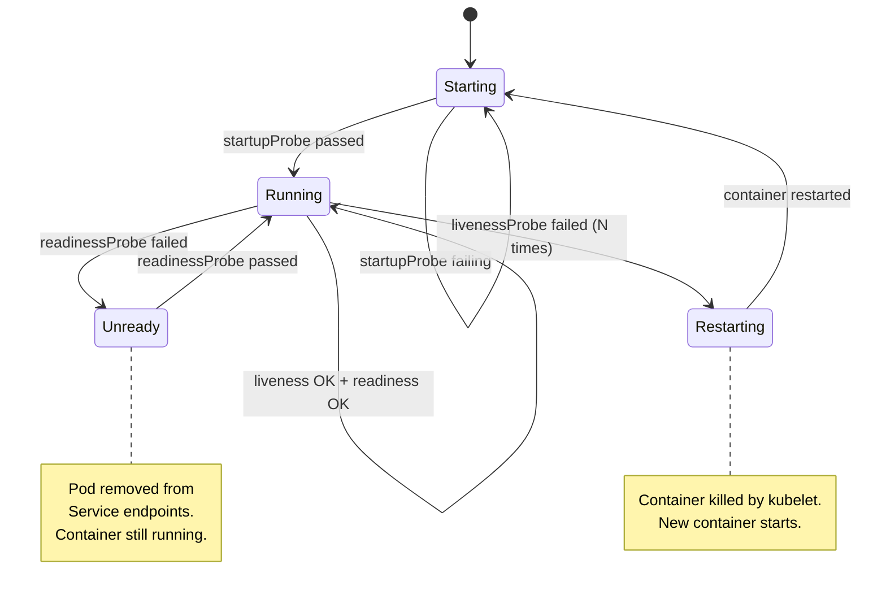
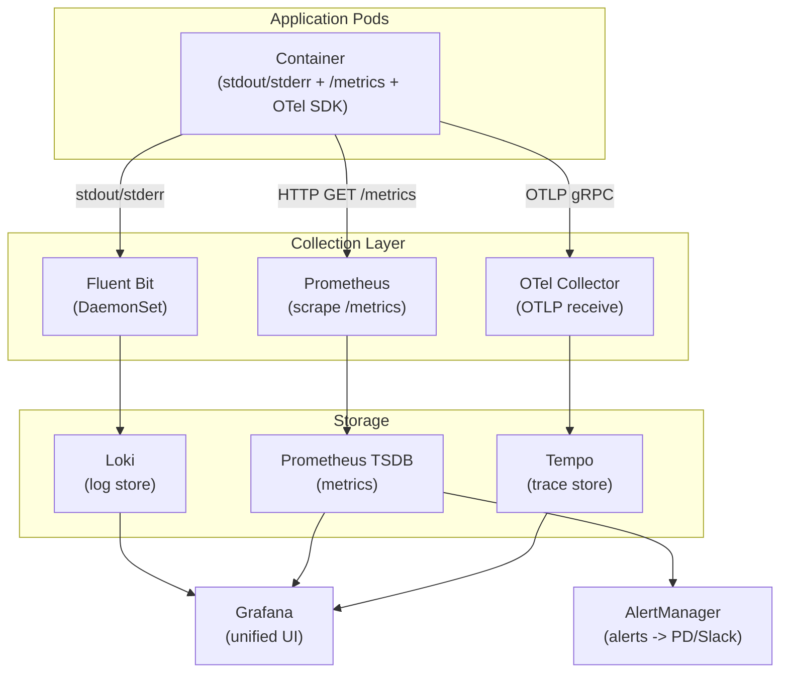

## Keywords in This File

{: .no_toc }

| # | Keyword | Weight |
|---|---------|--------|
| 1 | [Health Checks: Liveness, Readiness, and Startup Probes](#health-checks-liveness-readiness-and-startup-probes) | critical |
| 2 | [Kubernetes Logging and Monitoring Strategy](#kubernetes-logging-and-monitoring-strategy) | high |

---

# Health Checks: Liveness, Readiness, and Startup Probes

---

### 🎯 Model Answer

**30 seconds:**
> Kubernetes uses three probes to manage container health. Liveness determines if
> the container is alive (failure restarts it). Readiness determines if the container
> should receive traffic (failure removes it from Service endpoints). Startup delays
> liveness/readiness checks until a slow-starting container is ready. Using the wrong
> probe type is one of the most common causes of cascading failures in Kubernetes.

**3 minutes (Senior):**
> The three probes serve distinct purposes and have very different failure consequences:
>
> Liveness: "is the container stuck?" Failure causes a restart. Use for deadlocks or
> corrupted state that the container can't self-heal from. The classic use case: a
> JVM app that enters a deadlock. The JVM is "running" but not doing anything useful.
> Liveness catches this and restarts. DANGER: if liveness is too aggressive (tight
> thresholds), it restarts containers under normal load spikes. A health check hitting
> a database that's temporarily slow can kill a healthy container.
>
> Readiness: "is the container ready to serve?" Failure removes the pod from the
> Service's endpoint list - traffic is redirected to healthy pods. The container is NOT
> restarted. Use for: warming up cache, waiting for dependent service, running below
> capacity. Readiness protects users; liveness protects the container.
>
> Startup: "is the container still initializing?" Blocks liveness and readiness checks
> until the startup probe succeeds. Prevents liveness from killing a slow-starting
> container before it's had time to initialize. Essential for Java apps with long
> startup times (15-120 seconds).
>
> The most dangerous mistake: using liveness where readiness should be used. If your
> liveness check calls a backend service and that service is slow, liveness fails ->
> container restarts -> remaining containers get more load -> they also fail liveness
> -> all containers restart simultaneously. Cascading restart loop.

**Framework:** THREE-PROBES -> CONSEQUENCES -> FAILURE-MODES -> BEST-PRACTICES

*Adapting up:* Add grpc health checking protocol (GRPC probe type), startup probe
failureThreshold calculation for variable startup times, and probe tuning for 0-
downtime rolling deployments.

*Adapting down:* "Liveness = is the pod broken? Restart it if yes. Readiness = is
the pod ready for traffic? Remove from load balancer if no."

**Blank Mind Recovery:**

**(1) Restate:** "Liveness, readiness, and startup probes - Kubernetes health checks.
Liveness restarts broken containers. Readiness gates traffic. Startup protects
slow-starting containers from premature liveness killing."

**(2) First principles:** "Containers fail in three ways: they crash (K8s detects
automatically), they deadlock/corrupt (need liveness), or they're temporarily unready
for traffic (need readiness). Three failure modes, three solutions."

**(3) Bridge:** "Liveness = smoke alarm (fire = reset everything). Readiness = OPEN/
CLOSED sign on the restaurant door. Startup = 'we're still getting ready, don't check
yet'. Each is a different failure response: restart, redirect, or wait."

---

### 📘 Concept Explanation

**What it is:**
Kubernetes probes are periodic checks on containers that determine their health and
readiness. Three probe types:

- **Liveness probe**: is the container still alive (not deadlocked or corrupted)?
  Failure -> container is killed and restarted. kubelet restarts the container.
- **Readiness probe**: is the container ready to receive traffic?
  Failure -> pod is REMOVED from Service endpoints (no traffic sent). Container NOT restarted.
- **Startup probe**: has the container finished its startup process?
  While failing (startup in progress): blocks liveness and readiness checks.
  Success: hands off to liveness and readiness checks.
  Failure (exceeded failureThreshold): container is killed.

**Probe mechanisms (4 types):**

1. HTTP GET: sends HTTP request to the specified path. Success: 200-399. Failure: 4xx/5xx or no response.
2. TCP Socket: opens a TCP connection. Success: connection established. Use for non-HTTP services.
3. Exec: runs a command inside the container. Success: exit code 0.
4. gRPC: uses gRPC health checking protocol. Success: SERVING status.

**Key configuration parameters:**

```yaml
livenessProbe:
  httpGet:
    path: /healthz
    port: 8080
  initialDelaySeconds: 30    # wait 30s before first check
  periodSeconds: 10          # check every 10s
  timeoutSeconds: 5          # timeout per check
  failureThreshold: 3        # fail 3 consecutive checks to trigger restart
  successThreshold: 1        # (liveness/startup: must be 1)
```

> **Code walkthrough:** This example demonstrates the core pattern in action. The key mechanism shows how the concept works in practice. Study the structure to understand the essential behavior and common usage.

**The startup probe pattern for slow applications:**
```yaml
startupProbe:
  httpGet:
    path: /healthz
    port: 8080
  failureThreshold: 30     # allow up to 30 * 10s = 300s startup
  periodSeconds: 10

livenessProbe:
  httpGet:
    path: /healthz
    port: 8080
  failureThreshold: 3      # restarts after 3 * 10s = 30s of failure
  periodSeconds: 10
```
> **Code walkthrough:** This example demonstrates the core pattern in action. The key mechanism shows how the concept works in practice. Study the structure to understand the essential behavior and common usage.

The startup probe gives up to 300 seconds for startup. Once it passes, liveness
takes over with stricter thresholds. Without startup probe, you'd need
`initialDelaySeconds: 300` which wastes 5 minutes on every restart.

**The critical semantic difference:**

| | Liveness Failure | Readiness Failure |
|---|---|---|
| Container restart | YES | No |
| Traffic removed | Briefly (during restart) | YES |
| Pod stays in Ready | No | No (shows 0/1 or 0/N) |
| Use for | Deadlocks, fatal corruption | Warm-up, dependency unavailable |

**What to put in liveness health endpoint:**
- Container's own in-process health (memory, internal state)
- NOT external dependencies (database, cache)
- NOT resource-intensive checks (could timeout under load)

**What to put in readiness health endpoint:**
- Everything in liveness PLUS
- External dependency checks (can the pod serve requests end-to-end?)
- Cache warmup status (is the local cache populated?)

---

### 💻 Code Example

> **Code walkthrough:** Complete probe configuration for a Java microservice with
> slow startup, and the dangerous anti-pattern of liveness checking external dependencies.

```yaml
# BAD: Liveness checks external database
# If DB is slow, liveness fails -> container restart
# Multiple containers fail simultaneously -> cascading restart loop
spec:
  containers:
  - name: api
    livenessProbe:
      httpGet:
        path: /health/live   # endpoint checks DB connection!
        port: 8080
      failureThreshold: 3
      periodSeconds: 10
```

```yaml
# GOOD: Proper probe separation for a Java service
spec:
  containers:
  - name: java-api
    image: java-api:1.0

    # Startup: give Java up to 120s to start
    startupProbe:
      httpGet:
        path: /actuator/health/liveness  # Spring Boot liveness
        port: 8080
      failureThreshold: 12   # 12 * 10s = 120s max startup time
      periodSeconds: 10

    # Liveness: is the JVM alive? Check ONLY internal state
    livenessProbe:
      httpGet:
        path: /actuator/health/liveness  # Spring: LivenessStateHealthIndicator
        port: 8080
      initialDelaySeconds: 0     # startup probe handles this
      periodSeconds: 10
      timeoutSeconds: 5
      failureThreshold: 3        # 30s of failure -> restart

    # Readiness: ready to serve? Check dependencies too
    readinessProbe:
      httpGet:
        path: /actuator/health/readiness # Spring: ReadinessStateHealthIndicator
        port: 8080
      initialDelaySeconds: 0     # startup probe handles this
      periodSeconds: 5           # check more frequently than liveness
      timeoutSeconds: 3
      failureThreshold: 3        # 15s unready -> remove from Service
      successThreshold: 1
```

```java
// Spring Boot health endpoint implementation
// Liveness: ONLY internal JVM state - no external calls
@Component
public class CustomLiveness implements AvailabilityChangeEventPublisher {
    // Spring Boot manages this automatically via:
    // /actuator/health/liveness -> LivenessState.CORRECT/BROKEN
    // Set to BROKEN to trigger restart:
    // AvailabilityChangeEvent.publish(ctx, LivenessState.BROKEN);
}

// Readiness: check external dependencies
@Component
public class DatabaseReadinessIndicator
    implements HealthIndicator {
  @Override
  public Health health() {
    // Check DB connection pool availability
    if (dataSource.getConnection() != null) {
      return Health.up().build();
    }
    return Health.down()
      .withDetail("reason", "DB unavailable")
      .build();
    // Down -> readiness fails -> pod removed from endpoints
    // Container NOT restarted - just stops receiving traffic
  }
}
```

> **Code walkthrough:** The BAD example checks the database in the liveness endpoint.
> When the DB is slow (common under load), liveness fails -> container restart ->
> remaining containers get more traffic -> they also hit liveness failures -> cascading
> restarts take down the entire service. The GOOD example separates concerns: startup
> probe handles slow JVM initialization, liveness checks only the JVM's own health
> (no DB calls), and readiness checks both JVM health AND external dependencies.
> Spring Boot's actuator automatically provides `/health/liveness` and `/health/readiness`
> endpoints that implement this exact split, making correct probe configuration easy.

---

### 🎓 Answers by Seniority

**Junior / Mid (0-5 years):**
> Liveness tells Kubernetes if the container is still running correctly - failure
> triggers a restart. Readiness tells Kubernetes if the container should receive
> traffic - failure removes it from the load balancer without restarting. Startup
> probe prevents liveness from killing a container that's still starting up. Always
> use startup probe for applications that take more than 10-15 seconds to start.

*Push deeper:* What happens to in-flight requests when a pod fails its readiness probe?

---

**Senior / Staff (5+ years):**
> The most important insight: never put external dependency checks in liveness probes.
> If your liveness endpoint checks the database and the database has a brief slowdown,
> your liveness probe times out. kubelet kills and restarts the container. During
> restart, the remaining containers handle extra traffic. They also hit the slow
> database. Their liveness probes fail. Cascading restart loop takes down your entire
> service in 30-60 seconds. Readiness failure is safe: it removes the pod from traffic
> and waits. Liveness failure is dangerous: it restarts the container. Use liveness
> only for conditions that REQUIRE a restart to fix (deadlock, unrecoverable error,
> JVM panic). Use readiness for all other health conditions including dependency
> failures. If your pod can't serve traffic because the DB is down, make the pod
> unready - don't kill it.

*Push deeper:* The `successThreshold` for liveness and startup probes must be 1 (the
spec requires it). Only readiness can have `successThreshold > 1` to prevent flapping:
if a pod goes READY then UNREADY then READY, successThreshold: 2 requires TWO
consecutive readiness successes before the pod is added back to endpoints.

---

### ⚠️ Common Misconceptions

**Misconception 1: "Readiness failure restarts the container."**
Readiness failure ONLY removes the pod from Service endpoints. The container continues
running. It receives no traffic until readiness succeeds again. Liveness failure is
what triggers restarts.

**Misconception 2: "You need initialDelaySeconds if you use a startup probe."**
The startup probe is DESIGNED to replace `initialDelaySeconds`. While the startup probe
is failing (startup in progress), liveness and readiness probes are suspended. Set
`initialDelaySeconds: 0` on liveness/readiness when a startup probe is configured.
Using both `startupProbe` AND large `initialDelaySeconds` on liveness wastes time.

**Misconception 3: "More aggressive probes = faster failure detection = better."**
Aggressive probes (short periods, low failureThreshold) cause false positives under
normal load spikes. If a container does a GC pause, a 1-second probe with
failureThreshold: 1 kills the container. Start conservative: periodSeconds: 10,
failureThreshold: 3, timeoutSeconds: 5. Tighten only if you have evidence of
slow failure detection causing production impact.

**Misconception 4: "A container not in Ready state means it's crashed."**
A container can be Running but not Ready. This happens when readiness fails - the
container is alive and running but not serving traffic. `kubectl get pods` shows
`0/1` in the READY column. The container is fine; it's just waiting for a dependency
or warming up. Don't restart it - it will self-heal when the dependency recovers.

---

### 🚨 Failure Modes and Diagnosis

**Failure 1: Cascading restart loop from liveness checking external dependencies**

Symptom: all pods simultaneously restart; brief total service outage during restart
cycle; `kubectl get pods` shows all pods Restarting/CrashLoopBackOff.

Cause: liveness endpoint calls external service (DB, cache) that is slow;
all pods fail liveness simultaneously.

Diagnostic: `kubectl describe pod <name>` -> Events -> "Liveness probe failed".
Check liveness endpoint implementation: does it call any external services?

Fix: remove external dependency checks from liveness endpoint. Move to readiness.
Liveness should ONLY check JVM thread health, internal deadlock detection.

**Failure 2: Pod stuck not-ready after startup**

Symptom: `kubectl get pods` shows `0/1` Ready; container is Running; no restarts.
Pod never receives traffic.

Cause: readiness probe is failing; container can't reach a dependency; cache not
warmed up; initialization not complete.

Diagnostic: `kubectl describe pod <name>` -> Events -> "Readiness probe failed: ...".
`kubectl exec <pod> -- curl localhost:8080/health/ready` manually test readiness endpoint.

Fix: investigate the dependency the readiness check is testing. Container is healthy;
the dependency or warmup is the issue.

**Failure 3: Slow-starting app killed before initialization**

Symptom: container restarts repeatedly during startup; logs show startup in progress;
`CrashLoopBackOff` after only a few attempts.

Cause: liveness probe fires before application has finished starting; no startup probe;
`initialDelaySeconds` is too short.

Diagnostic: `kubectl describe pod <name>` -> "Liveness probe failed" events during startup.
Check container logs: is the app still starting when the first failure occurs?

Fix: add a startup probe with failureThreshold = max_startup_seconds / periodSeconds.
Or increase `initialDelaySeconds` on liveness as a temporary workaround.

---

### 🎯 Interview Deep-Dive

| Question Category | Time to Answer |
|---|---|
| Definition | 30-60 seconds |
| Mechanism | 1-2 minutes |
| Scenario | 2-3 minutes |
| Debugging | 2-3 minutes |
| Trade-off | 2-3 minutes |
| Architecture | 2-3 minutes |
| Design | 2-3 minutes |
| Advanced | 1-2 minutes |
| Behavioral | 2-3 minutes |

---

**Q1 [JUNIOR] (CONCEPTUAL): What are the three probe types in Kubernetes and what
does each one do?**

A: Kubernetes provides three probes to monitor container health:

Liveness probe: answers "is this container still working?" The kubelet runs this
check periodically. If it fails enough times consecutively, the kubelet kills the
container and restarts it. Use for: detecting deadlocks, unrecoverable errors, or
any state the container can't self-heal from. Failure response: restart.

Readiness probe: answers "is this container ready to receive traffic?" If it fails,
the pod is removed from the Service's endpoint list. Traffic goes to other pods.
The container is NOT restarted. Use for: dependency availability, warmup, overload
detection. Failure response: no traffic, wait for recovery.

Startup probe: answers "has the container finished starting up?" While it's failing
(container is starting), liveness and readiness checks are suspended. Once it passes,
liveness and readiness take over. Use for: containers with variable or long startup
times (Java, Spring Boot, large ML models). Prevents premature liveness failure kills.

Quick summary: Liveness = restart if broken. Readiness = traffic gate. Startup = startup protection.

*What separates good from great:* The failure consequence difference is critical in practice.
Liveness failure is disruptive (restarts). Readiness failure is safe (redirects traffic).
Most health conditions - dependency slowness, temporary overload - should use readiness, not liveness.

---

**Q2 [MID] (HANDS-ON): How do you configure probes for a Spring Boot application
that takes 60-90 seconds to start?**

A: Use a startup probe to protect the long startup, then hand off to liveness and readiness.

Spring Boot 2.3+ provides dedicated actuator endpoints for this:
- `/actuator/health/liveness` - LivenessState (JVM health)
- `/actuator/health/readiness` - ReadinessState (including dependencies)

```yaml
containers:
- name: spring-app
  # Allow up to 150s for startup (15 checks * 10s)
  startupProbe:
    httpGet:
      path: /actuator/health/liveness
      port: 8080
    failureThreshold: 15  # 15 * 10s = 150s max startup
    periodSeconds: 10

  # After startup: kill if JVM is deadlocked/broken
  livenessProbe:
    httpGet:
      path: /actuator/health/liveness
      port: 8080
    periodSeconds: 10
    failureThreshold: 3   # 30s of liveness failure -> restart

  # After startup: remove from traffic if dependencies unavailable
  readinessProbe:
    httpGet:
      path: /actuator/health/readiness
      port: 8080
    periodSeconds: 5      # check readiness more often
    failureThreshold: 3   # 15s unready -> remove from endpoints
    successThreshold: 1
```

> **Code walkthrough:** This example demonstrates the core pattern in action. The key mechanism shows how the concept works in practice. Study the structure to understand the essential behavior and common usage.

The `failureThreshold` for startup is the key calculation:
`max_startup_seconds / periodSeconds = failureThreshold`
For 90s startup with 10s period: failureThreshold >= 9. Use 15 for a safety buffer.

*What separates good from great:* The startup probe path and liveness probe path can
be the SAME endpoint. Once startup passes, liveness uses the same endpoint with
stricter thresholds. Some teams use a separate `/health/started` endpoint that
does more thorough initialization checks, while `/health/liveness` just checks thread
health. Both patterns are valid.

---

**Q3 [SENIOR] (TRADE-OFF): Why should you never put external service checks in a
liveness probe?**

A: Liveness failure triggers a restart. External service checks make liveness
dependent on factors outside the container's control.

The cascading failure scenario:
1. Your cluster has 10 pods behind a Service.
2. The database has a 30-second slowdown (common during GC or schema migration).
3. All 10 pods' liveness endpoints call the database.
4. All 10 liveness checks timeout simultaneously.
5. All 10 containers are killed and start restarting.
6. During restart, each pod's missing capacity is shifted to remaining pods.
7. The remaining pods are already overloaded from the database issue.
8. Their liveness probes also fail.
9. All pods restart simultaneously. Complete service outage.

The database had a 30-second slowdown. Your liveness probe turned it into a
multi-minute service outage with cascading restarts.

The correct approach:
Liveness endpoint: check only the container's OWN internal state.
- Are the JVM threads alive and not deadlocked?
- Is the event loop processing events?
- Does the application consider itself in a valid state?
- NO external I/O, NO database calls, NO cache checks.

Readiness endpoint: check external dependencies.
- Can we reach the database?
- Is the connection pool healthy?
- Are required upstream services responding?

Readiness failure is safe: the pod gets no traffic and waits for the dependency
to recover. No restart. No cascading failure.

*What separates good from great:* Even in readiness probes, external checks should
have short timeouts (`timeoutSeconds: 2-3`). A readiness probe that takes 10 seconds
to timeout means pods are removed from endpoints after 30+ seconds of dependency
failure. That's too slow for fast failover. Use circuit breakers in the application
layer for faster dependency failure detection.

---

**Q4 [SENIOR] (DEBUGGING): Pods are in `0/1` Ready state but not crashing. Debug.**

A: `0/1` Ready with no restarts = readiness probe is failing. The container is running
but unhealthy by its own readiness definition.

Step 1: check the readiness probe events.
`kubectl describe pod <name>` -> Events section -> "Readiness probe failed: ...".
The failure message often tells you exactly what's wrong.

Step 2: manually test the readiness endpoint.
`kubectl exec <pod> -- curl -s localhost:8080/health/ready`
This runs the readiness check from inside the container, bypassing network issues.
If it returns 200: the probe path or port configuration is wrong.
If it returns an error: the endpoint is actually failing.

Step 3: check external dependencies.
`kubectl exec <pod> -- nc -zv <db-host> 5432` - can the pod reach the database?
If the readiness check calls DB and DB is unreachable: readiness fails correctly.
Fix the DB connectivity, not the probe.

Step 4: check for OOMKilled recently.
`kubectl describe pod <name>` -> Containers -> Last State -> check for OOMKilled.
An OOMKilled container that restarted can be Running but readiness failing while
re-warming its cache.

Step 5: check for port misconfiguration.
`kubectl describe pod <name>` -> readiness probe port vs containerPort.
If probe targets port 8080 but container listens on 8081: always-fail.

*What separates good from great:* `kubectl exec <pod> -- curl localhost:8080/healthz`
is faster than reading logs. Most readiness failures show up immediately when you
test the endpoint directly from inside the container. Start here, not with log analysis.

---

**Q5 [SENIOR] (HANDS-ON): A deployment has 5 replicas. One pod is flapping
(rapidly oscillating ready/not-ready). Debug.**

A: Flapping readiness (oscillating between ready and not-ready) suggests an intermittent
external dependency or an endpoint that's on the edge of its timeout.

Step 1: watch the pod in real-time.
`kubectl get pod <name> -w` - observe transitions between Ready and Not-Ready.
How long is the not-ready period? Pattern: 30s every 5 minutes = correlated with
a periodic event (cron job, GC, connection pool timeout).

Step 2: check readiness probe configuration.
`kubectl describe pod <name>` -> readiness probe settings.
`periodSeconds`, `timeoutSeconds`, `failureThreshold`.
If `timeoutSeconds: 1` and the endpoint occasionally takes 1.5s: intermittent failure.

Step 3: check the endpoint response time.
In Prometheus: `histogram_quantile(0.99, http_request_duration_seconds{path="/health"})`.
If P99 health endpoint latency > timeoutSeconds: flapping.

Step 4: fixes.
Increase `timeoutSeconds` on the probe (e.g., 1s -> 3s).
Optimize the health endpoint to respond in < 100ms.
Add `successThreshold: 2` to readiness to require 2 consecutive successes before
marking the pod ready (prevents oscillation on borderline conditions).

Step 5: check if the pod is receiving too much traffic.
Flapping readiness can be a circuit-breaker pattern: pod becomes overloaded,
readiness fails (removing it from endpoints), other pods compensate, first pod
recovers, readiness passes, gets traffic again, overloads again. Cycle.
Fix: add HPA to scale out, or investigate the load distribution.

*What separates good from great:* `successThreshold: 2` on readiness is underused.
It prevents rapid oscillation between ready/not-ready by requiring two consecutive
health check passes before adding the pod back to the endpoint list. This is exactly
what you want for intermittent flapping.

---

**Q6 [STAFF] (ARCHITECTURE): How do you implement zero-downtime rolling deployments
using readiness probes?**

A: Zero-downtime rolling deployments require readiness probes to be correctly
configured so Kubernetes doesn't send traffic to a pod before it's ready.

Deployment rolling strategy configuration:
```yaml
spec:
  replicas: 6
  strategy:
    type: RollingUpdate
    rollingUpdate:
      maxUnavailable: 0   # never reduce capacity below 6 pods
      maxSurge: 2         # allow 2 extra pods during update
```

> **Code walkthrough:** This example demonstrates the core pattern in action. The key mechanism shows how the concept works in practice. Study the structure to understand the essential behavior and common usage.

With `maxUnavailable: 0`: Kubernetes will not remove old pods until new pods pass
readiness. The update proceeds: create 2 new pods (maxSurge), wait for both to be
Ready, then delete 2 old pods, create 2 more, repeat.

Readiness probe requirements:
1. The readiness endpoint must return 200 ONLY when the pod is fully initialized
   and can serve production traffic.
2. For gradually-warming services (cache prefill, connection pool ready): readiness
   must remain failing until warmup is complete.
3. If the new version has a bug that causes readiness to always fail: the rollout
   stalls (old pods remain serving). This is the CORRECT behavior - Kubernetes
   protects production by refusing to remove working pods.

Rollout progress monitoring:
`kubectl rollout status deployment/<name>` - blocks until rollout completes or fails.
`kubectl rollout undo deployment/<name>` - instant rollback to previous version.

Readiness probe timing for zero-downtime:
`periodSeconds` should be low (5s) during rollouts so Kubernetes rapidly detects
when new pods are ready. Combined with `maxUnavailable: 0`, this minimizes the
window where you're running above normal capacity (the surge pods).

*What separates good from great:* `minReadySeconds` on the Deployment spec adds a
delay between a pod becoming Ready and the rollout considering it stable. With
`minReadySeconds: 30`, a pod that passes readiness but crashes after 10 seconds
is NOT counted as a successful rollout step. This provides an extra stability gate
beyond the readiness probe.

---

**Q7 [STAFF] (COMPARISON): HTTP vs exec vs TCP probes - when to use each?**

A: Probe mechanism choice depends on the service protocol and what you can expose.

HTTP GET (most common):
Use when: container exposes an HTTP/HTTPS endpoint.
Pros: response code and body available; can test actual HTTP serving; most container
frameworks (Spring, Express, Flask) have built-in health endpoints.
Cons: requires HTTP server; overhead per check.
Config: `httpGet.path`, `httpGet.port`, `httpGet.httpHeaders` for auth headers.

TCP Socket:
Use when: non-HTTP services (Postgres: 5432, Redis: 6379, SMTP: 25).
Tests: can the container accept TCP connections?
Pros: zero-overhead; works for any TCP service.
Cons: only tests "port is open", not "service is actually healthy".
A database that accepts connections but returns errors passes TCP but fails HTTP.
Use TCP only when no better option exists.

Exec:
Use when: the check requires custom logic not expressible as HTTP or TCP.
Examples: check a Redis key exists, verify a file was written, run a diagnostic.
Pros: maximum flexibility.
Cons: spawns a new process in the container per check (expensive); adds to container
process overhead; slow (100ms+ for shell scripts).
Avoid for high-frequency checks (periodSeconds < 30).

gRPC (K8s 1.24+ stable):
Use when: the service uses gRPC protocol.
Implements the gRPC health checking protocol.
Much better than exec-based gRPC health scripts.

Priority: HTTP > gRPC > TCP > Exec.

*What separates good from great:* The exec probe's per-check process spawn is an
often-ignored performance cost. If you have 100 pods each with an exec probe running
every 5 seconds: 20 process spawns per second per node. For shell scripts this is
significant. Convert exec probes to HTTP probes where possible by exposing a simple
health HTTP endpoint.

---

**Q8 [MID] (CONCEPTUAL): What does `failureThreshold` control for each probe type?**

A: `failureThreshold` is the number of consecutive failures before taking action.
The action differs by probe type:

Liveness: `failureThreshold` consecutive failures -> container is killed and restarted.
With `failureThreshold: 3` and `periodSeconds: 10`: container restarts after 30 seconds
of continuous liveness failure.

Readiness: `failureThreshold` consecutive failures -> pod removed from Service endpoints.
With `failureThreshold: 3` and `periodSeconds: 5`: pod removed after 15 seconds.
Pod is re-added when `successThreshold` consecutive successes occur.

Startup: `failureThreshold` exhausted -> container is killed (same as liveness).
`failureThreshold * periodSeconds` = the total startup time budget.
With `failureThreshold: 30` and `periodSeconds: 10`: 300 second startup budget.

The `successThreshold` is less discussed:
- Liveness and Startup: must be 1 (K8s enforces this).
- Readiness: can be > 1. With `successThreshold: 2`: the pod must pass readiness
  twice consecutively before being added back to endpoints. Prevents flapping.

Tuning guidance:
- Too low failureThreshold: false positives, unnecessary restarts/endpoint removal
- Too high failureThreshold: slow detection of genuine failures
- Default starting point: failureThreshold: 3, periodSeconds: 10 (30s total)

*What separates good from great:* `failureThreshold` directly maps to "how long we
tolerate degraded service before action". For payment services: shorter tolerance
(failureThreshold: 2, periodSeconds: 5 = 10s). For batch processors: longer tolerance
(failureThreshold: 6, periodSeconds: 10 = 60s). Tune based on the cost of false
positives (unnecessary restarts) vs detection latency.

---

**Q9 [STAFF] (BEHAVIORAL): Describe a production incident caused by misconfigured probes.**

A (STAR format):

Situation: during a database maintenance window (planned rolling restart of a 3-node
PostgreSQL cluster), our API service experienced a complete outage lasting 8 minutes.
The database was only unavailable for approximately 90 seconds per node, not the
entire cluster simultaneously.

Task: diagnose why a brief database maintenance caused an 8-minute service outage and
implement a fix.

Action:
Post-incident analysis: our API deployment had a liveness probe that called
`/health/live` on each container. That endpoint checked the database connection pool.

During the database maintenance:
- All three PostgreSQL nodes restarted within 90 seconds
- During that window, all API pods' liveness checks returned 503
- `failureThreshold: 3` with `periodSeconds: 10` = 30 seconds to trigger restart
- After 30 seconds: ALL 12 API pods were killed simultaneously
- They restarted, but the database was still restarting
- The cycle repeated twice before the database stabilized

Root cause: liveness probe checked an external dependency (the database). Brief
DB unavailability -> all pods restart simultaneously -> outage during restart.

Fix:
1. Changed liveness endpoint to check ONLY JVM thread health (Spring Boot LivenessState).
   Removed ALL external calls from `/health/live`.
2. Moved database connectivity check to `/health/ready` (readiness probe).
3. Added readiness `successThreshold: 2` to prevent flapping during DB recovery.

Result: the next database maintenance window saw 0 pod restarts. API pods became
temporarily unready (no traffic) for 90 seconds during DB restart, then automatically
recovered without any manual intervention.

*What separates good from great:* The key lesson is "what does restart fix?" If the
container's problem is external (DB is down), restarting doesn't help - the new
container also can't reach the DB. Only use liveness to detect problems where a
restart IS the fix: deadlock, corrupted state, unrecoverable JVM error.

---

### ⚖️ Comparison Table

| | Liveness | Readiness | Startup |
|---|---|---|---|
| Failure action | Restart container | Remove from endpoints | Kill container |
| Container killed | Yes | No | Yes (if exhausted) |
| Traffic removed | Temporarily (restart) | Yes | N/A (no traffic yet) |
| Use for | Deadlock/fatal error | Dependency/warmup | Slow startup |
| External deps? | NEVER | Yes | Same as liveness |
| Typical failureThreshold | 3 | 3-6 | 15-30 |
| successThreshold | Must be 1 | Can be > 1 | Must be 1 |

---

### 🏛️ System Design

*(Omit: ★★☆ keyword - health check gateway patterns and service mesh health management covered at L4.)*

---

### 📊 Diagram

```
Probe lifecycle:

  Container starts
       |
  [startupProbe running]  <- liveness/readiness SUSPENDED
       |                     until startup passes
  [startup passes]
       |
  [livenessProbe] AND [readinessProbe] both run independently
       |                   |
  [liveness fails 3x]  [readiness fails 3x]
       |                   |
  Container killed     Pod removed from
  and restarted        Service endpoints
```



> **Diagram walkthrough:** The state machine shows the three phases: Starting (startup
> probe active, liveness/readiness suspended), Running (all probes active, pod in
> endpoints), and Unready (readiness failed, pod removed from endpoints, container
> continues running). The critical insight is the two separate failure paths: readiness
> failure leads to Unready (reversible, no restart), while liveness failure leads to
> Restarting (irreversible per instance, new container starts fresh). Choosing the
> wrong probe type changes the failure consequence from "graceful degradation" to
> "restart and potential cascading failure".

---
---

---

### 💻 Code Example

*(Omit: this concept does not have a programmatic interface that can be demonstrated in code. The conceptual explanation above is sufficient.)*


---

### 🏛️ System Design

*(Omit: system design diagram not applicable for this concept - see ★★★ keywords for full system design coverage.)*


---

### ⚖️ Comparison Table

*(Omit: this is a ★☆☆ foundational concept with no direct alternatives to compare - see higher-difficulty keywords for trade-off analysis.)*


---

### 📊 Diagram

*(Omit: no standalone visual diagram required for this concept - the explanations and code examples above provide sufficient clarity.)*


# Kubernetes Logging and Monitoring Strategy

---

### 🎯 Model Answer

**30 seconds:**
> Kubernetes itself provides no long-term log storage or metrics. Containers write to
> stdout/stderr; kubelet captures these for `kubectl logs` (recent only). For
> production observability, you need: a log aggregation stack (EFK, Loki), a metrics
> stack (Prometheus+Grafana), and distributed tracing (Jaeger, Tempo). The three
> pillars of observability - logs, metrics, traces - each solve different diagnosis
> scenarios.

**3 minutes (Senior):**
> The Kubernetes logging architecture is intentionally minimal. Each container writes
> to stdout/stderr. kubelet writes these to node-level log files (`/var/log/containers/`).
> `kubectl logs` reads from there, but only recent data (rotated after 10MB or 5 files).
> For any log older than minutes, or for aggregated search across pods, you need a
> centralized log stack.
>
> The standard patterns: EFK (Elasticsearch + Fluentd/Fluent Bit + Kibana) is mature
> but operationally heavy. Loki (Grafana) is a label-indexed log store - much cheaper
> to operate because it indexes only labels (not full text). Promtail or Fluent Bit
> ship logs to Loki. For search-heavy use cases (full-text search), EFK is better.
> For Kubernetes-native log correlation with metrics, Loki + Grafana + Prometheus
> in one stack is ideal.
>
> Metrics: Prometheus scrapes `/metrics` endpoints. kube-state-metrics exposes cluster
> object state (pod counts, deployment rollout status). metrics-server provides
> resource usage for HPA and kubectl top. The key insight: metrics-server is NOT
> a replacement for Prometheus - it has no persistence, no alerting, no historical data.
> Prometheus is the production metrics system.
>
> Tracing: distributed traces correlate a single request across multiple services.
> Jaeger and Tempo are the two main options. Without tracing, a 500ms latency spike
> in a microservices architecture is nearly impossible to diagnose: is it service A,
> B, or C? A trace shows you the entire call tree with timing for each hop.

**Framework:** PILLARS -> LOG ARCHITECTURE -> METRICS -> TRACING -> TOOL SELECTION

*Adapting up:* Add OpenTelemetry as the unified instrumentation standard, eBPF-based
observability (Hubble, Cilium, Pixie) for zero-instrumentation tracing, SLO-based
alerting, and cost analysis of log storage.

*Adapting down:* "Kubernetes stores logs on each node briefly. You need a tool to
collect all pod logs into one searchable place. Prometheus collects numbers from pods
over time and lets you alert on them."

**Blank Mind Recovery:**

**(1) Restate:** "Kubernetes logging and monitoring strategy - three pillars: logs,
metrics, traces. Each answers a different question: what happened (logs), is it
happening now (metrics), where in the call chain (traces)."

**(2) First principles:** "Kubernetes is a distributed system. Nodes fail, pods reschedule,
there are dozens of services. Observability is not optional - without it, production
problems are undiscoverable. Three pillars: logs (events), metrics (state over time),
traces (cross-service causality)."

**(3) Bridge:** "Logs = the black box flight recorder - what happened. Metrics = the
airplane's instrument panel - current altitude, speed, fuel. Traces = the ATC radar -
shows every aircraft's path simultaneously."

---

### 📘 Concept Explanation

**What it is:**
Kubernetes observability requires three complementary systems:

1. **Logs**: structured or unstructured text events from containers
2. **Metrics**: numeric time-series data (CPU, memory, request counts, error rates)
3. **Distributed Traces**: request path across multiple services

None of these are provided by Kubernetes itself beyond basic node-level buffering.

**The Kubernetes log architecture:**

```
Container -> stdout/stderr
               |
            kubelet
               |
    /var/log/containers/<pod>_<ns>_<container>-<id>.log
               |
         kubectl logs (node-local, temporary)
               |
    Log shipper (Fluent Bit DaemonSet)
               |
    Central log store (Elasticsearch/Loki)
               |
    Query UI (Kibana/Grafana)
```

> **Code walkthrough:** This example demonstrates the core pattern in action. The key mechanism shows how the concept works in practice. Study the structure to understand the essential behavior and common usage.

kubelet performs log rotation: by default 10MB per file, 5 files retained.
A high-volume container can exhaust this in minutes. Always deploy a log shipper.

**The stdout/stderr contract:**
Containers MUST write to stdout/stderr. Writing to files inside the container means:
- Logs are lost when the container is killed
- `kubectl logs` cannot see them
- Log shippers cannot collect them
Never write application logs only to files inside the container.

**Metrics architecture:**

```
App container  <- /metrics endpoint (Prometheus format)
kube-state-metrics (deployment/pod/node state)
metrics-server (CPU/memory for kubectl top and HPA)
node-exporter (system metrics: CPU, disk, network)
               |
         Prometheus scrape
               |
         Prometheus TSDB (time-series database)
               |
         AlertManager (alerts)
         Grafana (dashboards)
```

> **Code walkthrough:** This example demonstrates the core pattern in action. The key mechanism shows how the concept works in practice. Study the structure to understand the essential behavior and common usage.

Key metrics to monitor:
- `container_cpu_usage_seconds_total` - actual CPU usage
- `container_memory_working_set_bytes` - RSS memory
- `kube_deployment_status_replicas_unavailable` - unhealthy replicas
- `kubelet_running_pods` - pods running per node
- Custom: `http_requests_total`, `http_request_duration_seconds` (RED method)

**Distributed tracing:**
Each service adds trace context headers to outgoing requests. The receiving service
extracts and propagates them. Trace spans are collected and assembled into a trace tree.

OpenTelemetry (OTel) is now the standard: one SDK for all languages, vendor-neutral
export to Jaeger, Tempo, Zipkin, or commercial APMs.

**The three pillars - when to use which:**
- Metrics: detect and alert (latency spike, error rate up, pod count drop)
- Logs: investigate specific events (what error message appeared? what request failed?)
- Traces: attribute latency (which service in the call chain caused the slowdown?)

---

### 💻 Code Example

> **Code walkthrough:** Fluent Bit DaemonSet for log collection, Prometheus
> application metric exposition, and OpenTelemetry tracing setup.

```yaml
# BAD: Application writes logs to a file in the container
# kubectl logs shows nothing; logs lost on pod restart
apiVersion: apps/v1
kind: Deployment
spec:
  template:
    spec:
      containers:
      - name: app
        command: ["java", "-jar", "app.jar",
                  "--log.file=/var/log/app.log"]  # WRONG
```

```yaml
# GOOD: Application writes to stdout/stderr
# All output captured by kubelet, then shipped by Fluent Bit
apiVersion: apps/v1
kind: Deployment
spec:
  template:
    spec:
      containers:
      - name: app
        command: ["java", "-jar", "app.jar"]
        # Log configuration in application.yml:
        # logging.pattern.console={"ts":"%d","level":"%p","msg":"%m"}
        # Structured JSON to stdout - makes Loki/ES querying easier
```

```yaml
# Fluent Bit DaemonSet: collect all pod logs from every node
apiVersion: apps/v1
kind: DaemonSet
metadata:
  name: fluent-bit
  namespace: logging
spec:
  template:
    spec:
      tolerations:
      - key: node-role.kubernetes.io/master
        effect: NoSchedule        # run on control plane nodes too
      containers:
      - name: fluent-bit
        image: fluent/fluent-bit:2.1
        volumeMounts:
        - name: varlog
          mountPath: /var/log     # read kubelet log files
        - name: config
          mountPath: /fluent-bit/etc
      volumes:
      - name: varlog
        hostPath:
          path: /var/log          # node's log directory
      - name: config
        configMap:
          name: fluent-bit-config
```

```yaml
# Fluent Bit config: tail pod logs, add Kubernetes metadata, ship to Loki
apiVersion: v1
kind: ConfigMap
metadata:
  name: fluent-bit-config
data:
  fluent-bit.conf: |
    [INPUT]
        Name              tail
        Path              /var/log/containers/*.log
        Parser            docker
        Tag               kube.*
        Refresh_Interval  5
        Mem_Buf_Limit     10MB
    [FILTER]
        Name                kubernetes
        Match               kube.*
        Kube_URL            https://kubernetes.default.svc:443
        Merge_Log           On    # parse JSON logs into fields
        K8S-Logging.Parser  On
    [OUTPUT]
        Name   loki
        Match  *
        Host   loki.monitoring.svc.cluster.local
        Port   3100
        Labels job=fluentbit,cluster=prod
```

> **Code walkthrough:** The BAD example writes logs to a file inside the container -
> kubectl logs shows nothing, and when the container is killed, all logs are lost
> permanently. The GOOD example writes structured JSON to stdout (the Kubernetes
> contract). Fluent Bit as a DaemonSet runs on every node and reads from
> `/var/log/containers/` where kubelet writes all container stdout/stderr. The
> Kubernetes filter enriches each log line with pod name, namespace, and labels -
> this metadata makes filtering ("show only logs from payment-gateway in prod") fast.
> The Loki output ships to a central log store with cluster-level labels for
> cross-cluster log correlation.

---

### 🎓 Answers by Seniority

**Junior / Mid (0-5 years):**
> Kubernetes keeps container logs on each node for a short time. `kubectl logs` reads
> from there. For production, you deploy Fluent Bit as a DaemonSet on every node to
> collect and ship all pod logs to a central store like Loki or Elasticsearch.
> Prometheus scrapes metrics endpoints exposed by your app and by Kubernetes components.
> AlertManager sends alerts based on Prometheus rules. Grafana visualizes both logs
> and metrics in one place.

*Push deeper:* What happens to logs if a pod is rescheduled to a different node?

---

**Senior / Staff (5+ years):**
> The most important operational decision in Kubernetes logging is EFK vs Loki.
> Elasticsearch indexes the full text of every log line, enabling powerful full-text
> search. But indexing everything is expensive: a 100-pod cluster logging at 10KB/s
> = 1GB/hour of log data, which Elasticsearch stores and indexes fully. Loki only
> indexes labels (pod name, namespace, level) and stores log lines compressed.
> It can't do arbitrary full-text search without scanning all logs matching the label
> filter. For logs that are predominantly queried by pod/namespace/service (which is
> 95% of Kubernetes debugging), Loki is 10x cheaper. For full-text search (finding all
> logs mentioning a specific error string across all services): Elasticsearch is required.
> Most teams overbuy on Elasticsearch and could use Loki effectively. OpenTelemetry is
> the right answer for new instrumentation: one SDK, vendor-neutral output, spans map
> to traces, spans carry log context correlation.

*Push deeper:* OpenTelemetry's Exemplars feature: Prometheus metrics can carry embedded
trace IDs in exemplar data. When you see a latency spike in Grafana, you can click on
the spike and jump directly to a trace that occurred during that period. This is the
"golden signal" connection between metrics (detection) and traces (investigation).

---

### ⚠️ Common Misconceptions

**Misconception 1: "metrics-server is a production monitoring solution."**
metrics-server provides only the last few minutes of CPU/memory data, used for
`kubectl top` and HPA. It has no persistence, no alerting, no historical data.
It is NOT a replacement for Prometheus. You need BOTH: metrics-server for K8s
autoscaling, Prometheus for production monitoring.

**Misconception 2: "kubectl logs gives you all logs since the pod started."**
kubectl logs reads from the node's log buffer. kubelet rotates logs when they exceed
10MB (default) with 5 files retained. A high-volume container logging at 1MB/s
exhausts this in 50 seconds. kubectl logs only shows recent logs. For older logs,
you need a central log store.

**Misconception 3: "Writing logs to a file in the container is fine - I'll mount a volume."**
Mounting a volume for logs adds complexity (storage class, PV, PVC) and breaks the
Kubernetes logging architecture (log shippers watch /var/log/containers, not arbitrary
volumes). Write to stdout/stderr. If you need local file-based log tools, use a sidecar
that writes to a shared volume AND to stdout.

**Misconception 4: "Once a pod is deleted, all its logs are gone."**
kubectl logs from a deleted pod: gone. But if Fluent Bit shipped the logs to Loki/ES
before deletion, they're preserved. With `kubectl logs --previous` you can see logs
from the PREVIOUS container instance (before last restart) as long as the pod exists.
For truly persistent logs, central aggregation is required.

---

### 🚨 Failure Modes and Diagnosis

**Failure 1: No logs visible for recent pod events**

Symptom: `kubectl logs <pod>` returns empty or shows only a few lines; pod was
recently restarted multiple times.

Cause: log rotation erased older logs; pod restarts reset the local log buffer.

Diagnostic: `kubectl logs <pod> --previous` for the last container instance.
`kubectl describe pod <name>` -> restart count and reason.

Fix: deploy a log aggregation stack (Fluent Bit + Loki). Set higher log rotation
limits in kubelet config: `--container-log-max-size=100Mi --container-log-max-files=10`.

**Failure 2: Prometheus not scraping application metrics**

Symptom: application metrics missing from Grafana; pods show in k8s but not in Prometheus.

Cause: missing ServiceMonitor or annotations; network policy blocking port 9090;
wrong label selectors on ServiceMonitor.

Diagnostic: `kubectl get servicemonitor -n <ns>` - does one exist?
Check Prometheus targets: access Prometheus UI -> Status -> Targets.
If pod missing: verify `prometheus.io/scrape: "true"` annotation OR ServiceMonitor
`matchLabels` matches the Service labels.

Fix: add annotation `prometheus.io/scrape: "true"` and `prometheus.io/port: "8080"`
to pod template OR create a ServiceMonitor with matching labels.

**Failure 3: Log shipper (Fluent Bit) unable to keep up with log volume**

Symptom: gaps in Loki logs; Fluent Bit pod shows high CPU; log buffer filling up;
recent logs appear but older logs (minutes ago) are missing.

Cause: log volume exceeds Fluent Bit's throughput; back-pressure from Loki.

Diagnostic: Fluent Bit metrics: `fluentbit_input_bytes_total` vs `fluentbit_output_bytes_total`.
If input >> output: back-pressure or Loki performance.
`kubectl top pod -n logging` shows Fluent Bit CPU/memory.

Fix: increase Fluent Bit CPU limits; scale Loki write path; add buffering (`[OUTPUT] storage.type filesystem`);
reduce log volume (structured logging at WARN+ in production, not DEBUG).

---

### 🎯 Interview Deep-Dive

| Question Category | Time to Answer |
|---|---|
| Definition | 30-60 seconds |
| Architecture | 2-3 minutes |
| Trade-off | 2-3 minutes |
| Debugging | 2-3 minutes |
| Production | 2-3 minutes |
| Design | 2-3 minutes |
| Advanced | 1-2 minutes |
| Hands-on | 1-2 minutes |
| Behavioral | 2-3 minutes |

---

**Q1 [JUNIOR] (CONCEPTUAL): How does Kubernetes log collection work?**

A: Kubernetes collects container logs through a straightforward pipeline:

1. The application writes to stdout and/or stderr (this is the requirement).
2. The container runtime (containerd/Docker) captures this output.
3. kubelet writes the output to log files on the node:
   `/var/log/containers/<pod>_<namespace>_<container>-<id>.log`
4. `kubectl logs` reads directly from these node-local files.
5. For production: a log shipper DaemonSet (Fluent Bit, Fluentd) runs on every node,
   reads the same files, and ships them to a central store (Loki, Elasticsearch).

Key constraint: kubelet rotates these log files (default: 10MB max, 5 files).
High-volume containers can exhaust this buffer in seconds or minutes.
`kubectl logs` only shows what's in the current rotation window.

For any production use case (searching logs, alerting on log patterns, audit trails),
you need a centralized log aggregation stack.

*What separates good from great:* After a pod is deleted (`kubectl delete pod`),
the node-local logs are also deleted. Any logs not yet shipped to the central store
are permanently lost. This is why log shippers must run as DaemonSets (on every node)
and must stay healthy with their own resource guarantees.

---

**Q2 [MID] (ARCHITECTURE): What is the difference between metrics-server and Prometheus?**

A: metrics-server and Prometheus serve different purposes despite both dealing with
Kubernetes metrics.

metrics-server:
- Collects CPU and memory usage from kubelet on each node
- Stores in-memory only: no disk persistence, data survives minutes not days
- Exposes the Kubernetes Metrics API: `kubectl top nodes/pods`
- Required for Horizontal Pod Autoscaler (HPA) and Vertical Pod Autoscaler (VPA)
- Cannot be queried with PromQL; no alerting; no custom metrics
- Extremely lightweight (minimal CPU/memory overhead)
- Purpose: real-time resource usage for K8s autoscaling components

Prometheus:
- Scrapes `/metrics` endpoints (Prometheus exposition format) from any target
- Stores on disk: configurable retention (default 15 days); petabytes supported
- Full PromQL query language: aggregate, calculate rates, percentiles, predictions
- AlertManager integration: alerts on any metric condition
- Supports custom application metrics (request rates, queue depths, business metrics)
- kube-state-metrics add-on: K8s object state (deployment replicas, pod conditions)
- Purpose: production monitoring, alerting, dashboards for humans and automated systems

Both are needed. metrics-server is for HPA; Prometheus is for everything else.
They don't replace each other.

*What separates good from great:* Prometheus Operator (via kube-prometheus-stack Helm chart)
automates Prometheus configuration in Kubernetes: ServiceMonitor CRDs define what to
scrape, PrometheusRule CRDs define alerts, and everything is Kubernetes-native. Without
the Operator, configuring Prometheus to discover Kubernetes services requires manual
maintenance as services come and go.

---

**Q3 [SENIOR] (TRADE-OFF): EFK vs Loki - how do you choose?**

A: The choice hinges on query patterns and operational budget:

EFK (Elasticsearch + Fluentd/Fluent Bit + Kibana):
- Elasticsearch indexes every word in every log line (inverted index)
- Enables full-text search: "find all logs containing 'NullPointerException' in any service"
- Powerful aggregations: count occurrences of an error pattern over time
- Operational cost: Elasticsearch is stateful, requires JVM memory (8-32GB for small clusters),
  needs careful index lifecycle management, and scale-out is complex
- Storage cost: full-text indexing adds 30-100% overhead over raw log size

Loki:
- Indexes ONLY labels (pod name, namespace, app, level)
- Stores compressed log lines without full-text indexing
- Query: first filter by labels (fast), then grep within results (sequential scan)
- 10x lower storage cost than Elasticsearch for equivalent log volume
- Operational simplicity: stateless read path, scalable write path
- Limitation: log search that doesn't filter by known labels first is slow
  (must scan all logs for the time range)
- Tight Grafana integration: correlate logs + metrics + traces in one UI

Decision:
- Query pattern is "show me logs for pod X in last 30 minutes": use Loki
- Query pattern is "find all services logging this error string": use Elasticsearch
- Budget-conscious, most logs queried by pod/service/namespace: use Loki
- Compliance/security (SIEM, full-text log search required): use Elasticsearch
- Most Kubernetes shops can use Loki effectively

*What separates good from great:* Grafana Loki's LogQL allows pattern extraction and
aggregation: `sum by (level) (count_over_time({app="payment"} | json | level="error"[5m]))`.
This is roughly equivalent to Elasticsearch's query DSL for many common use cases.
The gap between Loki and Elasticsearch has narrowed significantly with LogQL.

---

**Q4 [SENIOR] (DEBUGGING): A distributed request is slow. How do you use traces to find the cause?**

A: Distributed tracing gives you the call tree for a specific request, with timing for
each service.

Step 1: find the slow trace.
In Jaeger/Tempo UI: search by service name + duration > threshold.
Or: in Grafana, use an Exemplar from a latency histogram metric to jump to a trace
for a specific slow request.

Step 2: examine the trace waterfall.
A trace shows a tree of spans: each span = one service or operation.
The waterfall shows parallel and sequential spans with their start time and duration.
Find the longest span: is it in service A, B, or a database call from service C?

Step 3: examine the slow span.
Click on the slow span to see:
- Tags: HTTP status, URL, error messages
- Logs within the span (OpenTelemetry span events)
- Parent span (what called this service)
- Children spans (what this service called)

Step 4: if it's a database span.
Slow database spans often have the SQL query in tags. Take the query to the database's
`EXPLAIN ANALYZE` command for query analysis.

Step 5: if it's a service span.
Check the span logs for errors. Check if the span has high self-time (slow processing)
vs high wait time (waiting for a child call). High self-time = this service is slow.
High wait time = a downstream dependency is slow.

Step 6: correlate with metrics.
Use the trace timestamp to check Prometheus metrics for the slow service around that time.
Was CPU throttled? Was memory high? Was the connection pool exhausted?

*What separates good from great:* The combination of exemplars (Prometheus linking to
specific traces) + structured logging with trace IDs embedded in log messages creates
the "unified observability" experience. From a Grafana latency alert, you can click to
a trace, from the trace you can jump to logs for the specific request ID.

---

**Q5 [STAFF] (DESIGN): How would you design the observability stack for a 200-service
Kubernetes cluster?**

A: Three-tier observability architecture with OpenTelemetry as the unified instrumentation layer.

Instrumentation tier (application side):
- OpenTelemetry SDK in all services (Java: opentelemetry-java-agent as javaagent)
- Automatic instrumentation: HTTP, JDBC, Redis, Kafka spans auto-generated
- All services emit: metrics (OTel -> Prometheus format), traces (OTel -> OTLP format),
  structured logs with trace IDs embedded (JSON to stdout)
- No vendor-specific SDKs: OTel is vendor-neutral

Collection tier (DaemonSet/collector):
- Fluent Bit DaemonSet: collect all pod logs -> Loki (label: cluster, namespace, pod, level)
- Prometheus + kube-state-metrics + node-exporter: scrape all /metrics endpoints
- OpenTelemetry Collector Deployment: receive OTLP traces, batch, and forward to Tempo
- Retain: logs 30 days (Loki), metrics 90 days (Prometheus), traces 7 days (Tempo storage)

Storage tier:
- Loki: log storage (S3 backend for cost; label shards for query speed)
- Prometheus + Thanos: metrics with long-term retention (Thanos query for global view)
- Tempo: trace storage (S3 backend; trace ID index)

Visualization and alerting:
- Single Grafana instance with all three data sources
- Grafana Alerting (replaces AlertManager for new setups)
- Runbooks linked from alerts -> Grafana dashboards with drill-down

Multi-tenant: each team has a Grafana team folder with their service dashboards.
Loki label-based tenant isolation: teams can only query their namespace's logs.

*What separates good from great:* Cost consciousness in observability is critical.
Uncontrolled tracing can generate more data than application traffic. Use head-based
or tail-based sampling: sample 100% of error traces, 10% of slow traces (>500ms),
1% of normal traces. This reduces Tempo storage 10-100x while preserving all
actionable data.

---

**Q6 [SENIOR] (PRODUCTION): How do you set up alerting for Kubernetes cluster health?**

A: Alerting requires a layered strategy: infrastructure alerts, workload alerts, and
SLO-based alerts.

Layer 1 - Infrastructure alerts (cluster health):
```yaml
# Node alerts
- alert: NodeNotReady
  expr: kube_node_status_condition{condition="Ready",status="true"} == 0
  for: 5m
  annotations:
    summary: "Node {{ $labels.node }} is not Ready"

- alert: NodeDiskPressure
  expr: kube_node_status_condition{condition="DiskPressure",
                                   status="true"} == 1
  for: 2m
```

> **Code walkthrough:** This example demonstrates the core pattern in action. The key mechanism shows how the concept works in practice. Study the structure to understand the essential behavior and common usage.

Layer 2 - Workload alerts (pod health):
```yaml
- alert: PodCrashLooping
  expr: rate(kube_pod_container_status_restarts_total[15m]) > 0
  for: 5m

- alert: DeploymentReplicasMismatch
  expr: kube_deployment_spec_replicas !=
        kube_deployment_status_replicas_available
  for: 10m

- alert: ContainerOOMKilled
  expr: kube_pod_container_status_last_terminated_reason{
          reason="OOMKilled"} == 1
  for: 1m
```

> **Code walkthrough:** This example demonstrates the core pattern in action. The key mechanism shows how the concept works in practice. Study the structure to understand the essential behavior and common usage.

Layer 3 - SLO alerts (user-facing):
```yaml
# Error rate SLO: < 1% errors in 1 hour
- alert: HighErrorRate
  expr: |
    sum(rate(http_requests_total{
              status=~"5.."}[1h]))
    /
    sum(rate(http_requests_total[1h]))
    > 0.01
  for: 5m
  labels:
    severity: critical
```

> **Code walkthrough:** This example demonstrates the core pattern in action. The key mechanism shows how the concept works in practice. Study the structure to understand the essential behavior and common usage.

Alert routing: critical alerts (PodCrashLooping, NodeNotReady) -> PagerDuty.
Warning alerts (DeploymentReplicasMismatch) -> Slack. SLO violations -> incident.

*What separates good from great:* Alert fatigue from alert storms is the top failure
mode of alert systems. Apply "symptom-based" alerting at the service level (error rate,
latency, saturation) rather than "cause-based" alerting at the infrastructure level.
"Too many CrashLoops" is a cause. "Payment service error rate > 1%" is a symptom.
Alert on symptoms; investigate causes.

---

**Q7 [MID] (HANDS-ON): How do you correlate logs from multiple pods serving the same request?**

A: Correlation requires a shared request identifier (trace ID or correlation ID) in logs.

Option 1 - Trace ID correlation (recommended):
Inject trace ID in every log statement using OpenTelemetry:
```java
// Spring Boot with OTel auto-instrumentation
// trace ID is automatically added to MDC
@RestController
public class OrderController {
  private static final Logger log =
    LoggerFactory.getLogger(OrderController.class);

  @PostMapping("/orders")
  public Order createOrder(@RequestBody OrderRequest req) {
    log.info("Creating order: {}", req.orderId);
    // Log output (JSON): {"msg":"Creating order","traceId":"abc123",
    //                      "spanId":"def456","pod":"order-svc-xyz"}
    return orderService.create(req);
  }
}
```

> **Code walkthrough:** This example demonstrates the core pattern in action. The key mechanism shows how the concept works in practice. Study the structure to understand the essential behavior and common usage.

In Loki: `{app="order-svc"} | json | traceId="abc123"` finds all logs for this trace.
In Grafana: from a slow Tempo trace span, click "Logs" to see correlated logs.

Option 2 - Custom correlation ID (simpler):
Generate a UUID at the API gateway, propagate via HTTP headers (X-Correlation-ID).
Every service logs this ID. Search by correlation ID in Kibana/Loki.

The OpenTelemetry approach is superior because:
- Trace ID is standardized (W3C TraceContext)
- Spans give you timing AND log correlation simultaneously
- No custom header propagation code needed

*What separates good from great:* Structured JSON logging is mandatory for trace
correlation. Log line `"Processing order abc123 for user 456"` is unparseable.
Log line `{"event":"processing_order","orderId":"abc123","userId":"456","traceId":"xyz"}` is.
Loki's `| json` parser extracts fields for filtering. This is the difference between
"search all logs for 'abc123'" (slow regex scan) and "filter by orderId=abc123" (fast).

---

**Q8 [STAFF] (COMPARISON): OpenTelemetry vs vendor-specific APM (Datadog, New Relic)?**

A: OpenTelemetry is the vendor-neutral instrumentation standard. Vendor APMs provide
proprietary SDKs and backend platforms.

OpenTelemetry:
- Open standard: W3C TraceContext, OpenMetrics, OTLP protocol
- Single SDK per language: auto-instrumentation for common frameworks
- Vendor-neutral export: send to Jaeger, Tempo, Prometheus, or any OTLP backend
- No vendor lock-in: change backend without re-instrumenting
- Community-driven: broad framework support
- Cost: pay only for the backend storage you choose
- Limitation: no out-of-box APM UI, dashboards are manual setup

Vendor APM (Datadog, New Relic, Dynatrace):
- Full platform: instrumentation + storage + UI + alerts in one product
- Faster time-to-value: deploy agent, get dashboards in minutes
- Advanced features: anomaly detection, ML-based alerting, infrastructure maps
- Cost: expensive at scale ($15-50/host/month for enterprise features)
- Lock-in: deep instrumentation = hard to switch vendors

Decision:
- Large engineering organization, cost-sensitive, multi-cloud: OpenTelemetry + OSS backends (Loki+Prometheus+Tempo)
- Startup or team that needs fast observability without ops burden: vendor APM
- Regulated industry requiring data residency: OSS backends (data never leaves your cluster)

*What separates good from great:* OpenTelemetry Collector is the key infrastructure piece.
It acts as a buffer and pipeline: receive OTLP from services, transform, filter, and
fan-out to multiple backends simultaneously. Run it as a Deployment (centralized) or
DaemonSet (sidecar mode). The Collector allows changing backends without touching
application code - swap Jaeger for Tempo by changing Collector output only.

---

**Q9 [STAFF] (BEHAVIORAL): Describe how you implemented observability for a new
microservices platform.**

A (STAR format):

Situation: our team was migrating a monolith to 15 microservices on Kubernetes.
Previously, all logging and APM was in the monolith with a vendor APM agent.
We needed end-to-end observability for the new distributed system without the
vendor APM cost ($8,000/month for 15 services).

Task: design and implement a complete observability stack: logs, metrics, and traces
for 15 services, team-accessible dashboards, and alerting.

Action:
Week 1-2: deployed the Grafana LGTM stack (Loki, Grafana, Tempo, Mimir) via Helm
into a dedicated monitoring namespace. Set up:
- Fluent Bit DaemonSet shipping all pod logs to Loki
- Prometheus + kube-state-metrics + node-exporter
- Tempo for traces with S3 backend (cost: ~$30/month storage)

Week 3: instrumented all 15 services with OpenTelemetry Java agent (zero code change -
just added javaagent JVM flag via Deployment env var JAVA_TOOL_OPTIONS).
Auto-instrumentation covered: HTTP requests, database queries, Kafka messages.
Structured JSON logging configured in logback.xml to emit traceId/spanId fields.

Week 4: built Grafana dashboards using the RED method (Rate, Errors, Duration) per service.
Created 3 alert rules: error rate > 1% (critical), P99 latency > 500ms (warning),
pod restart rate > 0 (warning).

Result: after 2 weeks of production traffic:
- Found a N+1 SQL query in the order service via slow database spans in traces
- Caught a memory leak in the notification service via steadily-growing memory metric
- Reduced mean-time-to-detect from "user complaint" to 2 minutes (alert fires first)

Cost: ~$100/month infrastructure vs $8,000/month vendor APM.

*What separates good from great:* The OpenTelemetry Java agent's zero-code-change
deployment was transformative. Adding `-javaagent:/otel/opentelemetry-javaagent.jar`
to JAVA_TOOL_OPTIONS via a Kubernetes environment variable on all Deployments gave
us 80% of the observability value (HTTP traces, DB spans, Kafka tracing) without
any code changes in 15 services. This is the right way to bootstrap observability
in a large organization.

---

### ⚖️ Comparison Table

| | EFK/Elasticsearch | Grafana Loki | CloudWatch/Datadog |
|---|---|---|---|
| Log indexing | Full-text (all words) | Labels only | Full-text or label |
| Search capability | Arbitrary full-text | Label filter + grep | Varies |
| Storage cost | High (index overhead) | Low (compressed, no index) | Medium-High |
| Ops complexity | High (JVM, indices, ILM) | Low (stateless read path) | None (managed) |
| K8s integration | Via Fluentd/Fluent Bit | Native Promtail/Fluent Bit | Agent per node |
| Best for | Compliance/SIEM/full-text | K8s-native cost-efficient | Turnkey/managed |
| Not for | Budget-constrained | Full-text search | On-prem/data-residency |

---

### 🏛️ System Design

*(Omit: ★★☆ keyword - multi-cluster observability and centralized observability platform
architecture covered at L5 Production Operations.)*

---

### 📊 Diagram

```
Kubernetes Observability Three Pillars:

  Pod stdout/stderr
      -> kubelet -> /var/log/containers/
      -> Fluent Bit DaemonSet -> Loki -> Grafana

  Pod /metrics endpoint
      -> Prometheus -> TSDB -> Grafana, AlertManager

  HTTP requests (OTel SDK)
      -> OTel Collector -> Tempo -> Grafana
```



> **Diagram walkthrough:** Each observability pillar has its own collection, storage,
> and query path. All three converge in Grafana for unified visualization. Fluent Bit
> as a DaemonSet ensures every node's container logs are collected continuously.
> Prometheus uses pull-based scraping on a configurable interval. The OTel Collector
> acts as a buffer and pipeline for trace data. AlertManager operates independently
> from Grafana - it receives Prometheus alerts and routes them to PagerDuty or Slack.
> This separation ensures alerting continues even when Grafana has an outage.

---

### 💻 Code Example

*(Omit: this concept does not have a programmatic interface that can be demonstrated in code. The conceptual explanation above is sufficient.)*


---

### 🏛️ System Design

*(Omit: system design diagram not applicable for this concept - see ★★★ keywords for full system design coverage.)*


---

### ⚖️ Comparison Table

*(Omit: this is a ★☆☆ foundational concept with no direct alternatives to compare - see higher-difficulty keywords for trade-off analysis.)*


---

### 📊 Diagram

*(Omit: no standalone visual diagram required for this concept - the explanations and code examples above provide sufficient clarity.)*


