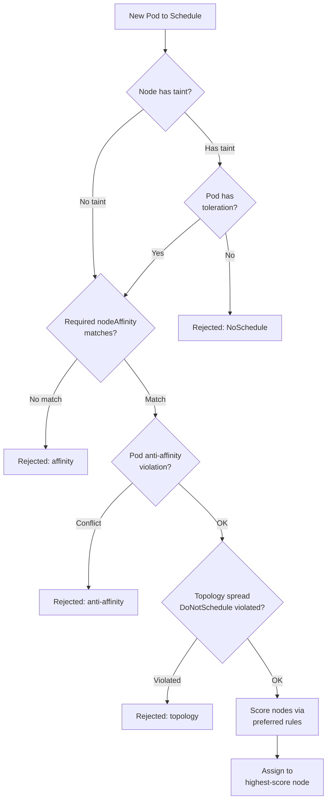
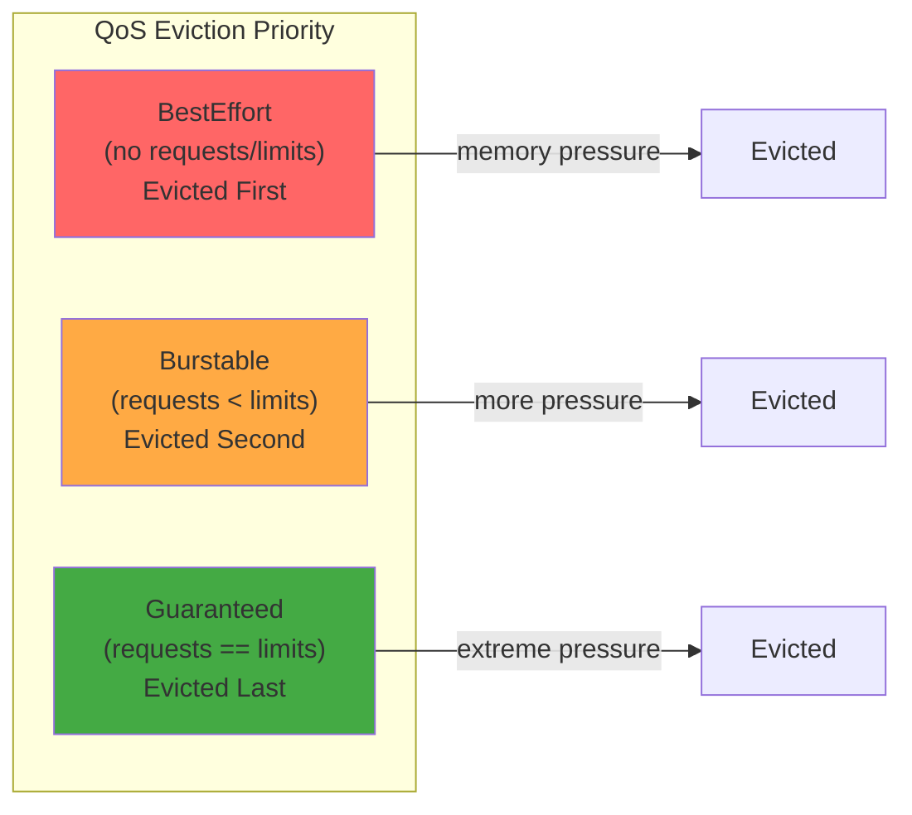

## Keywords in This File

{: .no_toc }

| # | Keyword | Weight |
|---|---------|--------|
| 1 | [Pod Scheduling: Affinity, Taints, and Tolerations](#pod-scheduling-affinity-taints-and-tolerations) | high |
| 2 | [Resource Requests and Limits](#resource-requests-and-limits) | critical |

---

# Pod Scheduling: Affinity, Taints, and Tolerations

### 🎯 Model Answer

**30 seconds:**
> The Kubernetes scheduler places pods on nodes based on resource availability by
> default. Affinity rules let pods ATTRACT to specific nodes or other pods.
> Taints let nodes REPEL pods. Tolerations are exceptions that allow pods to
> schedule on tainted nodes. These three mechanisms give you precise control over
> where workloads run.

**3 minutes (Senior):**
> Scheduling controls answer a single question: "which pods can run on which nodes?"
> There are three orthogonal mechanisms:
>
> Node affinity (pull toward): rules on the pod saying "I want to run on nodes with
> label X" (preferred) or "I must run on nodes with label X" (required). Required
> affinity hard-fails scheduling if no matching node exists. Preferred affinity is
> a scoring hint - the scheduler prefers matching nodes but will use others.
>
> Pod affinity/anti-affinity: rules saying "schedule me near pods with label Y"
> (affinity) or "spread me away from pods with label Y" (anti-affinity). Used for
> co-location (put the cache pod near its database) or spreading (put replicas on
> different nodes for HA).
>
> Taints and tolerations (push away + exceptions): taints on nodes say "don't
> schedule here unless you have the matching toleration". The NoSchedule effect
> prevents new pods. PreferNoSchedule is a soft version. NoExecute evicts existing
> pods. Tolerations on pods explicitly opt-in to a tainted node.
>
> The most common production use: taint GPU nodes with `gpu: true:NoSchedule` so
> only GPU workloads (with the toleration) run there. Add `requiredDuringScheduling`
> nodeAffinity to ensure GPU pods actually land on GPU nodes.

**Framework:** WHAT -> WHY -> HOW -> TRADE-OFF -> EXAMPLE

*Adapting up:* Add topology spread constraints (fine-grained zone/node spreading,
replaces old affinity hacks), the scheduler extender and custom schedulers, and
Pod Topology Spread with `minDomains` for zone-balanced deployments.

*Adapting down:* "Node affinity: put this pod on nodes labeled GPU=true. Taint:
GPU nodes repel normal pods. Toleration: GPU pods say 'I'm OK on GPU nodes.'"

**Blank Mind Recovery:**

**(1) Restate:** "Pod scheduling - affinity, taints, and tolerations. I'll cover
node affinity (pull toward), pod anti-affinity (spread replicas), taints (node
repels pods), and tolerations (pod opts in)."

**(2) First principles:** "Default scheduler places pods on any node with capacity.
You need to override this when: specialized hardware (GPUs), HA spreading, or
isolation of tenant workloads."

**(3) Bridge:** "Affinity = magnet rules (pods attracted to nodes or other pods).
Taint = 'keep out' sign on the node. Toleration = 'I have a key to get past this
sign'. Together they implement arbitrary placement policies."

---

### 📘 Concept Explanation

**What it is:**
Kubernetes scheduling controls are mechanisms for influencing where pods are placed:

- **Node Affinity**: pod-level rules expressing preference/requirement for specific nodes
- **Pod Affinity/Anti-affinity**: pod-level rules expressing co-location or spreading requirements relative to other pods
- **Taints**: node-level labels that repel pods
- **Tolerations**: pod-level declarations that allow scheduling on tainted nodes
- **Topology Spread Constraints**: fine-grained control over pod distribution across zones/nodes

**The problem they solve:**
Default scheduling only considers resource availability. You need scheduling control for:
- Hardware isolation: GPU pods only on GPU nodes; database pods on high-memory nodes
- High availability: spread replicas across zones and nodes; avoid single points of failure
- Tenant isolation: team A's pods on dedicated nodes; team B's pods elsewhere
- Co-location: cache pod on the same node as its database for minimal latency
- System pod reservation: control plane components should not compete with app pods

**Node Affinity:**
```yaml
affinity:
  nodeAffinity:
    # HARD: must match (pod fails to schedule if no match)
    requiredDuringSchedulingIgnoredDuringExecution:
      nodeSelectorTerms:
      - matchExpressions:
        - key: kubernetes.io/arch
          operator: In
          values: [amd64]
    # SOFT: prefer but not required
    preferredDuringSchedulingIgnoredDuringExecution:
    - weight: 100
      preference:
        matchExpressions:
        - key: topology.kubernetes.io/zone
          operator: In
          values: [us-east-1a]
```

**Pod Anti-affinity (spread replicas):**
```yaml
affinity:
  podAntiAffinity:
    # HARD: never put two replicas on the same node
    requiredDuringSchedulingIgnoredDuringExecution:
    - labelSelector:
        matchLabels: {app: my-app}
      topologyKey: kubernetes.io/hostname  # spread across nodes
```

**Taints and Tolerations:**
```yaml
# Node taint (set by cluster admin)
kubectl taint node gpu-node-1 gpu=true:NoSchedule

# Pod toleration (in pod spec)
tolerations:
- key: "gpu"
  operator: "Equal"
  value: "true"
  effect: "NoSchedule"
```

Taint effects:
- `NoSchedule`: new pods without toleration don't schedule here
- `PreferNoSchedule`: soft - prefer not to schedule here
- `NoExecute`: existing pods WITHOUT toleration are evicted + no new pods

**Topology Spread Constraints (modern approach):**
```yaml
topologySpreadConstraints:
- maxSkew: 1              # max difference in pod count between zones
  topologyKey: topology.kubernetes.io/zone
  whenUnsatisfiable: DoNotSchedule  # hard (or ScheduleAnyway = soft)
  labelSelector:
    matchLabels: {app: my-app}
```
More precise than pod anti-affinity for zone spreading: controls SKEW (max difference
in replica count across zones) rather than binary co-location rules.

**The key insight:**
`IgnoredDuringExecution` in affinity type names means: rules are enforced ONLY at
scheduling time. If a node loses a label AFTER a pod is scheduled, the pod is NOT
evicted. Only `NoExecute` taints can evict running pods. This asymmetry is intentional
but surprises teams.

**When to use each:**
- Node affinity: specialized hardware (GPU, high-memory), zone preference
- Pod anti-affinity: HA spreading (don't put replicas on same node or zone)
- Taints+Tolerations: node reservation (dedicated nodes for specific workloads)
- Topology spread: precise zone-balanced deployments with maxSkew control

---

### 💻 Code Example

> **Code walkthrough:** Complete scheduling configuration for a production
> high-availability deployment: zone spreading, node affinity for SSD nodes,
> and a GPU node pool with taints.

```yaml
# BAD: No scheduling constraints
# All replicas may land on same node (no HA)
# May schedule on GPU nodes (expensive, wastes capacity)
apiVersion: apps/v1
kind: Deployment
metadata:
  name: api-server
spec:
  replicas: 6
  template:
    spec:
      containers:
      - name: api
        image: api:1.0
```

```yaml
# GOOD: HA deployment with zone spreading and node affinity
apiVersion: apps/v1
kind: Deployment
metadata:
  name: api-server
spec:
  replicas: 6
  template:
    metadata:
      labels:
        app: api-server
    spec:
      # Spread replicas across zones AND nodes for HA
      topologySpreadConstraints:
      - maxSkew: 1
        topologyKey: topology.kubernetes.io/zone   # spread across AZs
        whenUnsatisfiable: DoNotSchedule
        labelSelector:
          matchLabels: {app: api-server}
      - maxSkew: 1
        topologyKey: kubernetes.io/hostname        # no 2 pods on same node
        whenUnsatisfiable: ScheduleAnyway          # soft - best effort
        labelSelector:
          matchLabels: {app: api-server}
      # Only schedule on application nodes (not GPU or spot)
      affinity:
        nodeAffinity:
          requiredDuringSchedulingIgnoredDuringExecution:
            nodeSelectorTerms:
            - matchExpressions:
              - key: node-type
                operator: In
                values: [application]             # labeled application nodes only
          preferredDuringSchedulingIgnoredDuringExecution:
          - weight: 80
            preference:
              matchExpressions:
              - key: node.kubernetes.io/instance-type
                operator: In
                values: [c5.2xlarge, c5.4xlarge]  # prefer compute-optimized
      containers:
      - name: api
        image: api:1.0
```

```yaml
# GPU node pool: tainted so only GPU workloads run there
# Apply to nodes: kubectl taint node gpu-1 gpu=true:NoSchedule

# GPU workload with affinity + toleration
apiVersion: apps/v1
kind: Deployment
metadata:
  name: ml-inference
spec:
  template:
    spec:
      tolerations:
      - key: gpu
        operator: Equal
        value: "true"
        effect: NoSchedule          # tolerate the NoSchedule taint
      affinity:
        nodeAffinity:
          requiredDuringSchedulingIgnoredDuringExecution:
            nodeSelectorTerms:
            - matchExpressions:
              - key: gpu
                operator: In
                values: ["true"]    # ALSO require the label (not just tolerate)
      containers:
      - name: inference
        image: ml-model:latest
        resources:
          limits:
            nvidia.com/gpu: 1
```

> **Code walkthrough:** The HA deployment uses two topology spread constraints: the
> zone spread (hard: DoNotSchedule) ensures replicas are balanced across AZs for
> true availability. The node spread (soft: ScheduleAnyway) prevents multiple replicas
> on the same node as a best-effort HA improvement without blocking scheduling if
> nodes are constrained. The GPU example demonstrates the toleration+affinity pattern:
> the toleration allows the pod to run on GPU-tainted nodes; the affinity REQUIRES
> it to run on GPU-labeled nodes. Without the affinity, the pod COULD run on any node
> (it tolerates the taint but isn't required to use it). Both are needed to ensure
> GPU pods run ONLY on GPU nodes.

---

### 🎓 Answers by Seniority

**Junior / Mid (0-5 years):**
> Node affinity is like a job requirement: "this pod needs to run on nodes labeled
> gpu=true". Taints are like a "do not enter" sign on a node: by default, pods can't
> schedule there. Tolerations are the key that lets a specific pod enter a tainted
> node. You use these together to dedicate nodes: taint the node so regular pods
> can't go there, give GPU pods a toleration to enter, and add an affinity to ensure
> they actually land on GPU nodes.

*Push deeper:* What is the difference between `requiredDuringScheduling` and
`preferredDuringScheduling` node affinity?

---

**Senior / Staff (5+ years):**
> The biggest scheduling footgun I've seen: teams use pod anti-affinity
> `requiredDuringSchedulingIgnoredDuringExecution` with
> `topologyKey: kubernetes.io/hostname` for HA. This works with N replicas and N+
> nodes. But if the cluster scales down to fewer nodes than replicas, pods are stuck
> Pending forever - anti-affinity can't be satisfied. Topology spread constraints
> with `whenUnsatisfiable: ScheduleAnyway` is better: it's a best-effort spread that
> degrades gracefully. For strong HA guarantees, use `ScheduleAnyway` for node
> spreading (best effort) and `DoNotSchedule` for ZONE spreading (hard guarantee).
> This ensures zone-level HA is always maintained, while node-level spreading is
> best-effort when capacity is constrained.

*Push deeper:* `minDomains` in topology spread constraints (K8s 1.26 GA) - specifies
the minimum number of eligible domains. With `minDomains: 3` and `maxSkew: 1`, if
only 2 zones have nodes, scheduling is blocked until the 3rd zone has capacity.
Enables strict multi-zone HA requirements.

---

### ⚠️ Common Misconceptions

**Misconception 1: "Toleration means the pod will schedule on tainted nodes."**
Toleration only ALLOWS scheduling on tainted nodes - it doesn't REQUIRE it. A pod
with a gpu toleration can schedule on ANY node (tainted GPU nodes AND untainted
application nodes). To ensure GPU pods run ONLY on GPU nodes, you need BOTH a
toleration AND a matching nodeAffinity/nodeSelector.

**Misconception 2: "IgnoredDuringExecution means the rule doesn't apply."**
`IgnoredDuringExecution` means: rules are NOT re-evaluated for pods already running.
If you change a node label after a pod is scheduled, the already-running pod is NOT
evicted. Affinity rules are enforced only at scheduling time.

**Misconception 3: "Pod anti-affinity spreads pods across zones."**
`topologyKey: kubernetes.io/hostname` spreads across nodes. For zone spreading, use
`topologyKey: topology.kubernetes.io/zone`. These are different. Using hostname anti-
affinity for "zone HA" is wrong - you could have all pods on different nodes in the
same zone.

**Misconception 4: "NoSchedule taint prevents all pods from running on the node."**
Only pods WITHOUT the matching toleration are prevented. System pods (CoreDNS,
kube-proxy) automatically get tolerations for common taints and run on all nodes.
Custom pods without the toleration are blocked. DaemonSet pods with broad tolerations
(`key: operator: Exists`) run on ALL nodes regardless of taints.

---

### 🚨 Failure Modes and Diagnosis

**Failure 1: Pods stuck Pending due to unsatisfiable affinity**

Symptom: pod stays Pending; `kubectl describe pod` shows "0/3 nodes available:
3 node(s) didn't match node affinity/selector".

Cause: required affinity references labels that no nodes have, or pod anti-affinity
requires more nodes than are available.

Diagnostic: `kubectl get nodes --show-labels` vs pod's nodeAffinity labels.
`kubectl describe pod <name>` -> Events -> scheduling failure reason.

Fix: update node labels to match affinity OR relax required -> preferred.

**Failure 2: Tainted node still receives regular pods**

Symptom: regular application pods are scheduling on dedicated infra nodes.

Cause: taint was added after pods were scheduled; `NoSchedule` doesn't evict existing pods.

Diagnostic: `kubectl describe node <name>` -> Taints section; `kubectl get pods -o wide`.

Fix: use `NoExecute` effect to evict existing pods; or manually drain + re-taint.

**Failure 3: Topology spread constraint prevents all scheduling**

Symptom: all pods stuck Pending; describe shows "...didn't match topology constraints".

Cause: `whenUnsatisfiable: DoNotSchedule` with too few nodes per zone to satisfy maxSkew.

Diagnostic: count pods per zone: `kubectl get pods -o wide` + node zone labels.
Check: `kubectl describe pod` -> "cannot satisfy topology constraints".

Fix: add more nodes to underrepresented zones OR change `whenUnsatisfiable: ScheduleAnyway`.

---

### 🎯 Interview Deep-Dive

| Question Category | Time to Answer |
|---|---|
| Definition | 30-60 seconds |
| Mechanism | 1-2 minutes |
| Scenario | 2-3 minutes |
| Debugging | 2-3 minutes |
| Trade-off | 2-3 minutes |
| Architecture | 2-3 minutes |
| Advanced | 1-2 minutes |
| Design | 2-3 minutes |
| Behavioral | 2-3 minutes |

---

**Q1 [JUNIOR] (CONCEPTUAL): What is the difference between node affinity and pod anti-affinity?**

A: Node affinity is a relationship between a pod and NODES. It says "I want to run
on nodes with this characteristic" (label). Example: GPU pods need to run on nodes
labeled `gpu: true`. Node affinity controls which node types a pod targets.

Pod anti-affinity is a relationship between a pod and OTHER PODS. It says "don't
put me on the same node/zone as pods with these labels". Example: for high
availability, you don't want two replicas of the same service on the same node.
Pod anti-affinity with `topologyKey: kubernetes.io/hostname` ensures each replica
lands on a different node.

Quick comparison:
- Node affinity: pod -> node characteristic (hardware, zone, labels)
- Pod anti-affinity: pod -> other pods' location (HA, spreading)

Both have required (hard) and preferred (soft) variants.

*What separates good from great:* There's also pod AFFINITY (not anti-affinity) -
place me NEAR pods with these labels. Used for co-location: put a sidecar proxy on
the same node as the service it proxies to minimize latency.

---

**Q2 [MID] (HANDS-ON): How do taints and tolerations work together for node isolation?**

A: Taints and tolerations implement the "dedicated node pool" pattern:

1. Admin taints the nodes: `kubectl taint node <name> team=ml:NoSchedule`
   The taint has three parts: key (team), value (ml), effect (NoSchedule).

2. NoSchedule effect: only pods WITH the matching toleration can schedule here.
   Pods without the toleration are rejected at scheduling time.

3. ML team adds toleration to their pod specs:
   ```yaml
   tolerations:
   - key: team
     operator: Equal
     value: ml
     effect: NoSchedule
   ```

4. BUT toleration alone doesn't force ML pods to ML nodes - it just allows it.
   The pod could still schedule on non-ML nodes. Add nodeAffinity for that:
   ```yaml
   affinity:
     nodeAffinity:
       requiredDuringSchedulingIgnoredDuringExecution:
         nodeSelectorTerms:
         - matchExpressions:
           - key: team
             operator: In
             values: [ml]
   ```

5. Result: ML node rejects non-ML pods (taint); ML pods are required to go to
   ML nodes (affinity) and allowed to (toleration). Complete isolation both ways.

*What separates good from great:* `NoExecute` taint is stronger. It not only prevents
new pods from scheduling but also EVICTS existing pods without the matching toleration.
`tolerationSeconds` specifies how long the pod can remain before eviction. Used for
graceful node maintenance.

---

**Q3 [SENIOR] (ARCHITECTURE): You have a 3-zone cluster with a Deployment of 6 replicas.
How do you ensure exactly 2 replicas per zone?**

A: Topology spread constraints are the right tool for this.

```yaml
topologySpreadConstraints:
- maxSkew: 1
  topologyKey: topology.kubernetes.io/zone
  whenUnsatisfiable: DoNotSchedule
  labelSelector:
    matchLabels: {app: my-service}
```

With `maxSkew: 1` and 6 replicas across 3 zones: target is 2 per zone. The constraint
ensures no zone has more than 1 more pod than any other zone. With 3 zones and
maxSkew: 1, this is essentially "2 per zone".

Edge cases:
- Zone goes down (only 2 zones available): 6 replicas, maxSkew: 1 across 2 zones
  = 3+3. `DoNotSchedule` prevents bringing new pods until 3 zones are available.
  Consider `ScheduleAnyway` for graceful degradation.
- New pods added: distribution maintained automatically.
- Scaling from 6 to 9: topology spread ensures 3 per zone.

For strict "exactly 2 per zone": combine topology spread with `minDomains: 3`
(K8s 1.26+) - blocks scheduling if fewer than 3 zone domains are available.
Fails closed when a zone is lost.

Production recommendation: use `DoNotSchedule` for zone spreading (hard guarantee
on availability) and `ScheduleAnyway` for node spreading (best effort, degrades
gracefully when capacity is constrained).

*What separates good from great:* `maxSkew: 1` doesn't guarantee EXACT equal
distribution - it guarantees the SKEW (difference between highest and lowest count)
is at most 1. With 7 replicas in 3 zones: 3+2+2 is valid (skew=1). Accept best-
effort spread rather than requiring exact count.

---

**Q4 [SENIOR] (DEBUGGING): A Deployment has 6 replicas but 2 pods are stuck Pending.
Node affinity is configured. Debug.**

A: Two pods Pending with affinity suggests partial matching - some nodes match
affinity, but not enough for all 6 pods.

Step 1: check scheduling events.
`kubectl describe pod <pending-pod>` -> Events section.
"0/5 nodes available: 2 node(s) didn't match node affinity, 3 had taint..."
This tells you exactly which constraints blocked scheduling.

Step 2: count matching nodes.
`kubectl get nodes -l <label>=<value>` - how many nodes match the required affinity?
If only 4 nodes match and you have 6 replicas with `requiredDuringScheduling` +
anti-affinity `topologyKey: hostname`: impossible to schedule 6 on 4 nodes.

Step 3: check pod anti-affinity if present.
`kubectl get pods -o wide` - are 4 pods already on 4 different nodes?
The 5th and 6th can't schedule because there are no unused affinity-matching nodes.

Step 4: decide on fix.
Option 1: add more nodes with the required labels.
Option 2: change `required` -> `preferred` for non-critical constraints.
Option 3: reduce anti-affinity strictness (hostname -> zone).
Option 4: scale down replicas to match available nodes.

*What separates good from great:* `kubectl get nodes -l <label>` is the fastest
first diagnostic. Before investigating complex scheduling logic, confirm: "How many
nodes actually match this affinity?" If the answer is 4 and you have 6 replicas
with node-level anti-affinity, the problem is immediately clear.

---

**Q5 [SENIOR] (TRADE-OFF): When would you use pod anti-affinity vs topology spread constraints?**

A: Both spread pods across nodes/zones, but with different semantics:

Pod anti-affinity with `requiredDuringScheduling`:
- Binary: "never put me on the same node as pod with label X"
- Failure mode: if N replicas and fewer than N matching nodes, pods are stuck Pending
- No skew control: "at most one per node" but not "even distribution"
- Use when: strict isolation (no two replicas ever share a node)

Topology spread constraints:
- Skew control: maxSkew specifies allowed DIFFERENCE in replica count
- Graceful degradation: `ScheduleAnyway` continues even when constraints can't
  be perfectly satisfied
- Zone-level: explicitly target AZ topology with topology.kubernetes.io/zone
- Multiple constraints: specify both zone spread AND node spread simultaneously
- Use when: HA spreading that should degrade gracefully; zone-balanced deployments

In practice:
- Zone HA: topology spread with `topologyKey: zone` and `DoNotSchedule`
- Node spreading: topology spread with `hostname` and `ScheduleAnyway`
- Avoid `required` pod anti-affinity for general HA - creates hard Pending when
  capacity is insufficient.

*What separates good from great:* Pod anti-affinity is still valid for specific cases
like "never run primary and standby database on the same node" where binary isolation
is exactly correct. The question is "never together" (anti-affinity) vs "spread evenly"
(topology spread). Different semantics for different needs.

---

**Q6 [STAFF] (SYSTEM DESIGN): How would you implement multi-tenant node isolation in a
shared Kubernetes cluster?**

A: Isolating tenant workloads onto dedicated node pools with Taints, Tolerations,
and Node Affinity:

Architecture:
1. Node pools: create separate node groups per tenant (or tenant tier).
   Label: `tenant: team-a`, `tenant: team-b`
   Taint: `tenant=team-a:NoSchedule`, `tenant=team-b:NoSchedule`

2. Shared system pool: untainted nodes for shared infrastructure.
   Label: `node-type: system`
   CoreDNS, monitoring, ingress controller run here.

3. Tenant namespace configuration via admission controller (OPA Gatekeeper webhook):
   Auto-injects toleration + nodeAffinity to all pods in tenant namespace:
   ```yaml
   # Auto-injected for namespace team-a
   tolerations:
   - key: tenant
     value: team-a
     effect: NoSchedule
   affinity:
     nodeAffinity:
       requiredDuringSchedulingIgnoredDuringExecution:
         nodeSelectorTerms:
         - matchExpressions:
           - key: tenant
             operator: In
             values: [team-a]
   ```

4. Namespace labels drive the webhook: `kubectl label namespace team-a tenant=team-a`

5. ResourceQuota per namespace limits total resource consumption within each pool.

Result: team-a pods run ONLY on team-a nodes. team-b pods can't reach team-a nodes.
System pods run on the shared pool. Teams self-serve within their quota.

*What separates good from great:* The admission webhook injection is critical. If teams
must manually add tolerations and affinities to all their pods, they'll forget. The
webhook enforces isolation automatically. Combined with ResourceQuota and RBAC (teams
can't modify their namespace labels), this creates strong tenant isolation.

---

**Q7 [STAFF] (COMPARISON): Explain topology spread constraints with minDomains.**

A: `minDomains` (GA in K8s 1.26) addresses a gap in topology spread: what happens
when some zones don't have nodes?

Without `minDomains`: if you have 3 zones but zone-c has no nodes, the constraint
sees only 2 domains and distributes pods across 2 zones. No guarantee of 3-zone
distribution.

With `minDomains: 3`: the constraint requires at least 3 eligible domains before
scheduling any pods. If only 2 zones have available nodes, pods are stuck Pending
until the 3rd zone has capacity.

```yaml
topologySpreadConstraints:
- maxSkew: 1
  topologyKey: topology.kubernetes.io/zone
  whenUnsatisfiable: DoNotSchedule
  minDomains: 3         # block scheduling if fewer than 3 zones
  labelSelector:
    matchLabels: {app: payment-api}
```

This implements strict 3-zone HA: the service only runs if all 3 AZs are available.
If zone-c fails, new pods are blocked (not re-distributed to 2 zones). Fails closed:
unavailable rather than silently degraded to 2-zone availability.

For compliance workloads: correct behavior. For general services: omit `minDomains`
and allow graceful degradation.

*What separates good from great:* `minDomains` interacts with cluster autoscaler. If
zone-c has no nodes and `minDomains: 3` is set, the cluster autoscaler should
provision nodes in zone-c to unblock scheduling. Ensure node groups cover all 3 zones.

---

**Q8 [MID] (COMPARISON): nodeSelector vs nodeAffinity - which to use?**

A: `nodeSelector` is the simple, older approach. `nodeAffinity` is more flexible.
Prefer nodeAffinity in all new configurations.

`nodeSelector`:
```yaml
spec:
  nodeSelector:
    gpu: "true"   # pod MUST run on node with label gpu=true
```
Simple, but only supports equality matching, always required (no soft version).

`nodeAffinity` is a superset:
- Supports `In`, `NotIn`, `Exists`, `DoesNotExist`, `Gt`, `Lt` operators
- Has `required` (hard) and `preferred` (soft) variants
- Multiple requirements (OR of multiple node selectors)

```yaml
affinity:
  nodeAffinity:
    requiredDuringSchedulingIgnoredDuringExecution:
      nodeSelectorTerms:
      - matchExpressions:
        - key: gpu
          operator: Exists        # any value - just must have the label
    preferredDuringSchedulingIgnoredDuringExecution:
    - weight: 50
      preference:
        matchExpressions:
        - key: gpu-type
          operator: In
          values: [A100, H100]    # prefer high-end GPUs
```

Use nodeSelector only for simple, always-required constraints.
Use nodeAffinity for everything else.

*What separates good from great:* Both nodeSelector and nodeAffinity can be set on the
same pod and are AND-combined. This allows gradual migration from nodeSelector to
nodeAffinity without breaking existing constraints.

---

**Q9 [STAFF] (BEHAVIORAL): Describe a scheduling problem you diagnosed in production.**

A (STAR format):

Situation: after a Kubernetes version upgrade, our payment gateway Deployment
(6 replicas) had 4 running but 2 stuck Pending. Service was degraded but not down.

Task: diagnose the scheduling failure and restore all 6 replicas without disruption.

Action:
`kubectl describe pod payment-gateway-<id>` showed: "0/8 nodes are available:
8 node(s) didn't match pod affinity/anti-affinity".

The pod spec had `requiredDuringScheduling` pod anti-affinity with
`topologyKey: kubernetes.io/hostname`. After the K8s upgrade, our node count dropped
from 10 to 8 temporarily (rolling node replacement). 4 nodes had running replicas.
The other 4 nodes had Terminating pods from an old failed deployment with the SAME
app labels. Anti-affinity counted the Terminating pods as "present" - scheduling
blocked because "a pod with app=payment-gateway already exists on this node".

Fix:
1. Force-deleted the 2 Terminating pods (`kubectl delete pod <name> --force`).
2. 2 Pending pods immediately scheduled.
3. Long-term: switched to topology spread with `ScheduleAnyway` for more forgiving
   behavior; added lifecycle hooks to clean up Terminating pods faster.

Root cause: Terminating pods count for pod anti-affinity calculations. A known K8s
behavior but easy to miss under node replacement pressure.

*What separates good from great:* Knowing that Terminating pods count for anti-affinity
is a real-world gotcha. Topology spread constraints with `ScheduleAnyway` are more
forgiving and don't deadlock under Terminating pod situations.

---

### ⚖️ Comparison Table

| Mechanism | What It Controls | Required/Soft | Direction |
|---|---|---|---|
| nodeSelector | Pod -> Node label | Required only | Pod attracts to node |
| nodeAffinity | Pod -> Node label | Both | Pod attracts to node |
| podAffinity | Pod -> Pod location | Both | Pod co-locates with pod |
| podAntiAffinity | Pod -> Pod location | Both | Pod spreads from pod |
| Taint | Node repels pods | NoSchedule/NoExecute | Node repels |
| Toleration | Pod accepts taint | Exemption | Pod opts in to node |
| Topology Spread | Pod distribution skew | Both (maxSkew) | Balanced spread |

**Decision framework:**
- Specialized hardware (GPU, SSD)? -> nodeAffinity (required)
- HA spread across zones? -> Topology spread (topologyKey: zone, DoNotSchedule)
- HA spread across nodes? -> Topology spread (topologyKey: hostname, ScheduleAnyway)
- Dedicated node pools? -> Taints (NoSchedule) + Tolerations + nodeAffinity
- Co-location for performance? -> podAffinity
- Never share a node? -> podAntiAffinity (required)

---

### 🏛️ System Design

*(Omit: ★★☆ keyword - custom scheduler architecture covered at L4 Control Plane.)*

---

### 📊 Diagram

```
Scheduling filter pipeline:

Pod wants to schedule on Node:
  1. Taint check: node has taint? pod has toleration? -> pass/fail
  2. Node affinity (required): labels match? -> pass/fail
  3. Pod anti-affinity: no conflict on this node? -> pass/fail
  4. Topology spread (DoNotSchedule): skew OK? -> pass/fail
  5. Scoring: preferred rules, resource fit -> pick best node
```



> **Diagram walkthrough:** The scheduler applies hard filters first (taints, required
> affinity, anti-affinity, topology spread with DoNotSchedule), then scores remaining
> nodes using soft rules (preferred affinity, resource fit, topology spread with
> ScheduleAnyway). Understanding this filter-then-score pipeline helps diagnose
> "0/N nodes available" errors: each rejection reason maps to a specific filter stage.
> ScheduleAnyway topology constraints appear in the scoring phase, not the filter phase.

---
---

# Resource Requests and Limits

### 🎯 Model Answer

**30 seconds:**
> Resource requests tell the scheduler how much CPU and memory the container needs
> (used for scheduling decisions). Resource limits are the maximum the container can
> use (enforced at runtime). Always set both. Under-requesting causes noisy neighbor
> issues; over-requesting wastes capacity. The ratio of limits to requests determines
> the pod's QoS class, which determines eviction priority.

**3 minutes (Senior):**
> Requests and limits serve two different purposes. Requests are scheduling promises:
> the scheduler only places a pod on a node where `sum(requests) <= allocatable`.
> Limits are runtime enforcement: cgroups enforce the limit at the kernel level.
> A container exceeding CPU limit is throttled (not killed). A container exceeding
> memory limit is OOM-killed.
>
> The QoS class system determines eviction order under node pressure. Guaranteed QoS
> (requests == limits) is evicted last. Burstable (requests < limits) is evicted second.
> BestEffort (no requests or limits) is evicted first. For critical services, set
> requests == limits for Guaranteed QoS and predictable performance.
>
> The most critical production insight: CPU throttling is invisible by default.
> A container hitting its CPU limit is NOT killed - the kernel just time-slices
> CPU away from it. The container continues running but slower. This manifests as
> increased latency that doesn't appear in memory/crash metrics. Services with tight
> P99 latency SLOs can violate them silently due to CPU throttling.

**Framework:** WHAT -> WHY -> HOW -> TRADE-OFF -> EXAMPLE

*Adapting up:* Add CPU throttling detection with `container_cpu_throttled_seconds_total`
metric, VPA for automatic right-sizing, LimitRange for namespace-level defaults, and
cgroups v2 behavior change (CFS burst feature for bursty workloads).

*Adapting down:* "CPU request = guaranteed CPU slice. CPU limit = maximum - if
exceeded, the container slows down. Memory request = guaranteed. Memory limit =
exceeding it kills the pod."

**Blank Mind Recovery:**

**(1) Restate:** "Resource requests and limits - CPU and memory boundaries for pods.
Requests = scheduling guarantee. Limits = runtime ceiling. QoS class = eviction priority."

**(2) First principles:** "Multi-tenant cluster: pods compete for node resources.
Requests prevent over-subscription at scheduling time. Limits prevent one pod
starving others at runtime."

**(3) Bridge:** "Requests = hotel reservation (guaranteed room size). Limits = the
maximum room allowed (can't expand beyond this). BestEffort = no reservation,
evicted first if the hotel is full."

---

### 📘 Concept Explanation

**What it is:**
Resources (`cpu` and `memory`) in a pod spec have two settings:

`requests`: the GUARANTEED minimum. The scheduler uses requests to find a node with
sufficient allocatable resources. The container is guaranteed at least this much CPU
time and memory. Node allocatable = node capacity - system reserved - kubelet reserved.

`limits`: the MAXIMUM. Runtime enforcement via Linux cgroups. CPU limits throttle
(slow down); memory limits OOM-kill.

**The problem they solve:**
Without requests: the scheduler places pods without knowing how much they need. Nodes
become oversubscribed - 10 pods each using 2 CPUs on a 4-CPU node.
Without limits: one misbehaving pod (memory leak) can consume all node resources and
kill every other pod on the node (noisy neighbor).

**QoS classes (determined automatically from requests/limits values):**

| Class | Condition | Eviction Priority |
|---|---|---|
| Guaranteed | requests == limits (both set) | Last |
| Burstable | requests < limits OR only one set | Middle |
| BestEffort | neither requests nor limits set | First |

```yaml
# Guaranteed QoS - deterministic performance
resources:
  requests:
    cpu: "1"
    memory: "1Gi"
  limits:
    cpu: "1"       # same as request
    memory: "1Gi"  # same as request

# Burstable QoS - can burst under low load
resources:
  requests:
    cpu: "0.5"
    memory: "512Mi"
  limits:
    cpu: "2"        # burst to 4x request
    memory: "2Gi"

# BestEffort - no guarantees
# (no resources block - use only for fault-tolerant batch)
```

**CPU behavior:**
- `cpu: "1"` = 1 vCPU = 1000m (millicores)
- CPU request: guaranteed time-slice via CFS (Completely Fair Scheduler)
- CPU limit: enforced per 100ms CFS period. If a container uses all its CPU quota in
  the first 50ms of a 100ms period, it's throttled for the remaining 50ms
- CPU throttling does NOT kill the container - it just slows it down
- Throttling is invisible in default metrics: no restarts, no OOM, just slower

**Memory behavior:**
- Memory request: scheduling hint + eviction protection (not killed unless node pressure)
- Memory limit: hard kill. Exceeds limit -> immediate OOM kill -> restart
- Memory is NOT throttled like CPU: there's no "slow down" - just death

**The key insight:**
Never set memory limit very close to request for JVM apps. GC pauses temporarily
spike memory. The "sweet spot": memory limit 1.5-2x request for JVM apps (handles GC
overhead), exact or 1.1x for stable services.

**When to use Guaranteed QoS:**
- Latency-sensitive services with tight P99 SLOs
- Databases (predictable memory, no eviction tolerance)
- System-critical components

**LimitRange (namespace-level defaults):**
```yaml
kind: LimitRange
spec:
  limits:
  - default:
      cpu: "500m"
      memory: "512Mi"
    defaultRequest:
      cpu: "100m"
      memory: "128Mi"
    type: Container
```
Automatically applied to containers that don't set resources.

---

### 💻 Code Example

> **Code walkthrough:** Resource configuration for production services showing
> QoS class selection and Java JVM memory sizing.

```yaml
# BAD: No resource limits - noisy neighbor risk
apiVersion: apps/v1
kind: Deployment
spec:
  template:
    spec:
      containers:
      - name: api
        image: api:1.0
        # Missing: no resources block
        # Risk: on traffic spike, pod consumes all node CPU/memory
```

```yaml
# GOOD: Burstable QoS for standard web API
# Request = baseline steady-state; Limit = peak traffic burst
apiVersion: apps/v1
kind: Deployment
metadata:
  name: api-server
spec:
  template:
    spec:
      containers:
      - name: api
        image: api:1.0
        resources:
          requests:
            cpu: "500m"     # guaranteed 0.5 vCPU
            memory: "512Mi" # guaranteed 512MB
          limits:
            cpu: "2"        # burst to 2 vCPU on traffic spikes
            memory: "1Gi"   # OOM kill if exceeds 1GB
---
# GOOD: Guaranteed QoS for latency-sensitive critical service
apiVersion: apps/v1
kind: Deployment
metadata:
  name: payment-gateway
spec:
  template:
    spec:
      containers:
      - name: payment
        image: payment:1.0
        resources:
          requests:
            cpu: "1"        # Guaranteed 1 vCPU
            memory: "2Gi"   # Guaranteed 2GB
          limits:
            cpu: "1"        # Same = Guaranteed QoS class
            memory: "2Gi"   # Same = no OOM unless node OOM
---
# Java app: account for JVM overhead and GC memory spikes
apiVersion: apps/v1
kind: Deployment
metadata:
  name: java-service
spec:
  template:
    spec:
      containers:
      - name: java
        image: java-service:1.0
        env:
        - name: JAVA_OPTS
          value: "-Xms512m -Xmx1024m -XX:MaxMetaspaceSize=256m"
        resources:
          requests:
            cpu: "500m"
            memory: "1Gi"  # Xms512m + Metaspace + overhead
          limits:
            cpu: "2"
            memory: "2Gi"  # 2x request: headroom for GC + metaspace
```

> **Code walkthrough:** The BAD example has no resources - on a traffic spike, the
> container can consume 100% of node CPU/memory and starve other pods. The Burstable
> API shows the "request = baseline, limit = peak" pattern. The Guaranteed payment
> gateway has requests == limits: pod gets an exclusive CPU slice, won't be throttled
> or evicted under normal memory pressure. The Java example is critical: JVM uses
> memory beyond the heap (Xmx). Non-heap includes Metaspace (~256Mi for typical apps),
> CodeCache (~256Mi for JIT), thread stacks, and off-heap buffers. Setting limit = Xmx
> almost always causes OOM kills due to non-heap allocation. Start with limit = Xmx + 512Mi.

---

### 🎓 Answers by Seniority

**Junior / Mid (0-5 years):**
> CPU requests are the amount of CPU the scheduler guarantees the pod. CPU limits
> are the maximum it can use - if exceeded, the container is slowed down (throttled).
> Memory requests are the guaranteed minimum. Memory limits are the maximum - if
> exceeded, the container is OOM killed and restarted. Always set both; without
> limits, one misbehaving pod can consume all node resources.

*Push deeper:* What is the difference between CPU throttling and OOM kill?

---

**Senior / Staff (5+ years):**
> The production issue most teams miss: CPU throttling is invisible. A container
> hitting its CPU limit is throttled by the kernel CFS scheduler - it continues
> running but with reduced CPU time. No restarts, no alerts, just increased latency.
> A service with a P99 SLO of 200ms can silently degrade to 500ms P99 under load,
> purely from CPU throttling. Monitor `container_cpu_throttled_seconds_total` in
> Prometheus: if throttle percentage > 25%, the CPU limit is too low. For latency-
> sensitive services, set CPU requests == limits (Guaranteed QoS) to eliminate
> throttling. The JVM-specific issue: memory limit must account for non-heap.
> JVM Xmx = heap max, but JVM also uses Metaspace, CodeCache, thread stacks, and
> off-heap (Netty direct buffers). Rule: limit = Xmx + 512Mi minimum.

*Push deeper:* cgroups v2 (default in newer kernels) adds CFS burst: containers can
"save up" CPU time and spend it in bursts, reducing throttling for bursty workloads
without changing the limit value. Whether your cluster uses cgroups v1 or v2 matters
for CPU throttling behavior.

---

### ⚠️ Common Misconceptions

**Misconception 1: "CPU limit throttles and kills the container."**
CPU limits ONLY throttle (slow down) the container. The container is never killed for
CPU limit violations. Only MEMORY limit violations cause OOM kill. CPU throttling is
often invisible: no restarts, no events, just slower responses.

**Misconception 2: "Setting high limits wastes cluster capacity."**
Limits are runtime ceilings, not reservations. Setting limits high doesn't prevent
other pods from using capacity. What wastes capacity is high REQUESTS. Requests are
scheduling reservations: node allocatable is reduced by total requests, not limits.
Over-requesting leads to bin-packing inefficiency.

**Misconception 3: "Memory request prevents OOM kill."**
Memory request affects eviction priority but does NOT prevent OOM kill if the container
exceeds its LIMIT. A Guaranteed QoS pod with limit: 1Gi WILL be OOM killed if it
allocates 1.1Gi.

**Misconception 4: "No limits means best performance."**
Without CPU limits, containers compete without guaranteed allocation, causing noisy
neighbor effects. Without memory limits, a single memory leak can kill all other pods
on the node. Limits protect the cluster from one pod's misbehavior.

---

### 🚨 Failure Modes and Diagnosis

**Failure 1: Container repeatedly OOM killed**

Symptom: `kubectl get pods` shows OOMKilled status; pod restart count increasing.
`kubectl describe pod <name>` -> "OOMKilled" in container state.

Cause: container exceeded memory limit.

Diagnostic: `kubectl top pod <name>` shows current memory usage near limit.
`kubectl logs <pod> --previous` for application context before kill.

Fix: increase memory limit (and request proportionally). For Java: check Xmx vs limit;
set limit = Xmx + 512Mi minimum.

**Failure 2: High latency with no obvious cause (CPU throttling)**

Symptom: P99 latency spikes under load; no OOM kills; no errors in logs.

Cause: container hitting CPU limit; kernel throttles CPU time.

Diagnostic: `kubectl top pod` shows CPU near the limit.
Prometheus: `container_cpu_throttled_seconds_total` rate > 0.
`container_cpu_cfs_throttled_periods_total / container_cpu_cfs_periods_total`
= throttle percentage.

Fix: increase CPU limit; OR set requests == limits for Guaranteed QoS.

**Failure 3: Node OOM despite pods within limits**

Symptom: node OOM; multiple pods evicted; kubelet shows memory pressure.

Cause: sum of actual container memory usage exceeds node capacity; requests are
set too low (underestimated), so scheduler over-packed the node.

Diagnostic: `kubectl describe node <name>` -> Allocated resources vs capacity.
If requests total < actual usage: requests are mis-calibrated.

Fix: tune requests to match actual P90 usage. Use VPA in recommendation mode to
collect usage data, then set requests based on recommendations.

---

### 🎯 Interview Deep-Dive

| Question Category | Time to Answer |
|---|---|
| Definition | 30-60 seconds |
| Mechanism | 1-2 minutes |
| Scenario | 2-3 minutes |
| Debugging | 2-3 minutes |
| Trade-off | 2-3 minutes |
| Design | 2-3 minutes |
| Advanced | 1-2 minutes |
| Production | 2-3 minutes |
| Behavioral | 2-3 minutes |

---

**Q1 [JUNIOR] (CONCEPTUAL): What is the difference between resource requests and limits?**

A: Requests and limits serve different purposes at different stages of the pod lifecycle.

Resource requests: used by the scheduler. Before placing a pod on a node, the
scheduler checks that the node has `allocatable_resources >= sum of pod requests`.
If a 4-CPU node has 3.5 CPUs worth of requests already, only a pod requesting
<= 0.5 CPUs can schedule there. Requests are the "reservation" - guarantee the pod
will have at least these resources available.

Resource limits: enforced at runtime by the kernel. CPU limits throttle the container
(slow down without killing). Memory limits kill the container (OOM) if exceeded.
Limits are the "ceiling" - the container cannot consume beyond this.

Key asymmetry: a container can use MORE than its request (up to the limit) if the
node has idle resources. But it's guaranteed at least the requested amount.

Always set both. Without requests: scheduler can't make informed placement decisions.
Without limits: one misbehaving container can consume all node resources.

*What separates good from great:* CPU throttling is silent - no OOM, no restart,
just slower responses. This is the most common invisible performance issue in
Kubernetes that operators miss because they only alert on OOM kills and restarts.

---

**Q2 [MID] (HANDS-ON): How does CPU limit enforcement work at the kernel level?**

A: CPU limits are enforced by the Linux CFS (Completely Fair Scheduler) via cgroups.

The mechanism uses CFS quota and period:
- `cpu.cfs_period_us`: the time period (default 100ms = 100,000 microseconds)
- `cpu.cfs_quota_us`: the CPU time allowed per period

If you set `cpu: "0.5"` (500m): quota = 50,000 microseconds per 100ms period.
The container can use CPU for 50ms in every 100ms window. Once 50ms is consumed,
the container is throttled (kernel stops scheduling it) for the remaining 50ms.

This creates the "bursty workload throttling" problem:
A Go web server handling a request might need 80ms of CPU in a 100ms burst.
After 50ms of work, it's throttled for 50ms - the request takes 130ms total instead
of 80ms. This adds 50ms of kernel-imposed latency to every request needing >50ms CPU.

Diagnosis:
`container_cpu_throttled_seconds_total` shows total throttled time.
`rate(container_cpu_cfs_throttled_periods_total[5m]) /
 rate(container_cpu_cfs_periods_total[5m])` = throttle percentage.
> 25% throttle = performance impact.

*What separates good from great:* The 100ms CFS period is configurable via the
`--cpu-cfs-quota-period` kubelet flag. Reducing to 10ms reduces throttling burst
latency but increases kernel scheduling overhead. cgroups v2's CFS burst feature
allows containers to "save" unused CPU quota and spend it in bursts, mitigating
bursty throttling without changing the limit.

---

**Q3 [SENIOR] (PRODUCTION): A Java service is OOM killed repeatedly despite heap being
under Xmx. Why and how do you fix it?**

A: JVM uses memory beyond the heap (Xmx). JVM memory components:

- Heap: controlled by Xmx (what most operators set)
- Metaspace: class metadata, unbounded by default in Java 8+ (often 200-500Mi)
- CodeCache: JIT-compiled code (100-400Mi for large apps)
- Thread stacks: each thread ~512KB-1MB native memory
- Direct buffers: off-heap NIO ByteBuffer (Netty, HTTP/2: 50-200Mi)

If you set memory limit = Xmx, the JVM heap fits but everything else causes OOM.

Calculation for a typical Java microservice:
- Xmx: 1024Mi (heap max)
- Metaspace: ~256Mi
- CodeCache: ~256Mi
- Thread stacks (100 threads): ~50Mi
- Direct buffers: ~100Mi
- Safety buffer: ~100Mi
- Total needed: ~1.8Gi for an Xmx=1024Mi service

Rule of thumb: set memory limit to Xmx + 512Mi as minimum.
For services using Netty/gRPC: Xmx + 768Mi to 1Gi.

Diagnosis:
`kubectl logs <pod> --previous | grep "OutOfMemory"`
If "java.lang.OutOfMemoryError: Metaspace": add `-XX:MaxMetaspaceSize=256m`
If container OOM (not Java OOM): the Linux OOM killer fired - limit is too low.
`kubectl describe pod <name>` -> "OOMKilled" in container state.

```yaml
env:
- name: JAVA_OPTS
  value: >-
    -Xms512m -Xmx1024m
    -XX:MaxMetaspaceSize=256m
    -XX:ReservedCodeCacheSize=256m
resources:
  requests:
    memory: "1.5Gi"
  limits:
    memory: "2Gi"  # Xmx(1Gi) + Metaspace(256M) + Code(256M) + buffer
```

*What separates good from great:* The `-XX:NativeMemoryTracking=summary` JVM flag
plus `jcmd <pid> VM.native_memory` shows exactly how JVM allocates native memory.
This eliminates guessing and gives exact numbers for limit sizing.

---

**Q4 [SENIOR] (DEBUGGING): A service's P99 latency is 500ms but P50 is 20ms.
You suspect CPU throttling. How do you diagnose it?**

A: P99 spike with normal P50 is classic CPU throttling signature. Throttling affects
a subset of requests that arrive when CPU quota is exhausted.

Step 1: check current CPU usage vs limit.
`kubectl top pod <name>` - is CPU close to the limit?
If using 900m of a 1000m limit: throttling likely.

Step 2: check throttling metrics in Prometheus.
```
rate(container_cpu_cfs_throttled_periods_total{pod="<name>"}[5m])
/ rate(container_cpu_cfs_periods_total{pod="<name>"}[5m])
```
= throttle percentage. > 25% = significant throttling.

Step 3: correlate with latency metrics.
Plot throttle percentage and P99 latency on the same timeline. If they spike
together during traffic peaks: CPU throttling confirmed.

Step 4: remediation.
Immediate: increase CPU limit. If limit is reasonable (2x average), try 4x.
Verify P99 improves.
Systematic: HPA to add replicas under load instead of relying on CPU bursting.
Long-term: profile the hot path to reduce CPU work per request.

Step 5: for P99 SLO < 100ms: set requests == limits (Guaranteed QoS) to give
the pod a dedicated CPU slice not shared with bursts from other containers.

*What separates good from great:* Create a proactive alert:
`rate(container_cpu_cfs_throttled_periods_total[5m]) /
 rate(container_cpu_cfs_periods_total[5m]) > 0.25`
Throttling is a leading indicator that fires before latency SLO violations.

---

**Q5 [STAFF] (SYSTEM DESIGN): How do you implement resource governance for 50 teams
in a shared cluster?**

A: Three-layer governance: LimitRange (defaults), ResourceQuota (caps), VPA (optimization).

Layer 1 - LimitRange per namespace (defaults for teams that don't configure resources):
```yaml
apiVersion: v1
kind: LimitRange
spec:
  limits:
  - default: {cpu: "500m", memory: "512Mi"}
    defaultRequest: {cpu: "100m", memory: "128Mi"}
    max: {cpu: "4", memory: "8Gi"}  # per-container cap
    type: Container
```

Layer 2 - ResourceQuota per namespace (total namespace caps):
```yaml
apiVersion: v1
kind: ResourceQuota
spec:
  hard:
    requests.cpu: "20"
    requests.memory: 40Gi
    limits.cpu: "80"
    limits.memory: 160Gi
    pods: "100"
    persistentvolumeclaims: "20"
```

Layer 3 - VPA in recommendation mode:
```yaml
apiVersion: autoscaling.k8s.io/v1
kind: VerticalPodAutoscaler
spec:
  updatePolicy:
    updateMode: "Off"  # recommendation only
```
VPA watches actual usage and recommends right-sized requests. Monthly review:
"team X's service requests 4 CPUs, actual P90 is 0.8 CPUs." Teams right-size
based on VPA recommendations.

OPA/Kyverno policy: REJECT pods without resource specs (prevents BestEffort
in production namespaces, ensures LimitRange defaults are last resort not standard).

*What separates good from great:* OPA/Kyverno enforcement is more important than
LimitRange. LimitRange fills in defaults for pods without resources (silently).
OPA REJECTS pods explicitly missing required resources - forcing teams to set
appropriate values rather than relying on potentially-wrong defaults.

---

**Q6 [SENIOR] (TRADE-OFF): When would you choose Guaranteed vs Burstable QoS?**

A: The choice trades between predictability and resource efficiency:

Guaranteed QoS (requests == limits):
Pros: dedicated CPU slice, no throttling, evicted last under memory pressure,
predictable latency at all load levels.
Cons: wastes capacity when running below limit most of the time.
2-CPU Guaranteed pod averaging 0.2 CPU = 90% waste.

Use for: latency-sensitive services with P99 SLOs < 100ms, databases, payment
processing, auth services - anything where consistent low latency is required.

Burstable QoS (requests < limits):
Pros: efficient bin-packing; request represents typical usage, limit allows
bursting during peaks; better cluster utilization.
Cons: under heavy load, multiple pods burst simultaneously; CPU throttling causes
P99 latency spikes; evicted before Guaranteed under memory pressure.

Use for: web servers, batch processors, services with latency SLOs > 500ms.

Rule: Guaranteed for critical path (payment, auth, core APIs).
Burstable for everything else. BestEffort only for truly expendable batch work.

*What separates good from great:* The Guaranteed vs Burstable choice is also a
cluster efficiency design decision. A 32-CPU node can run 32 Guaranteed 1-CPU pods
or 320 Burstable 0.1-CPU-request pods. Clusters running all Guaranteed see lower
utilization but more predictable performance. Workload-appropriate QoS class
selection is as important as right-sizing the values.

---

**Q7 [STAFF] (CONCEPTUAL): How does VPA (Vertical Pod Autoscaler) work and when
do you use it?**

A: VPA automatically adjusts pod resource requests and limits based on historical usage.

Components:
- VPA Recommender: watches actual pod resource usage (metrics-server/Prometheus)
  and calculates recommended requests
- VPA Updater: evicts pods with out-of-date resource settings (in Auto mode)
- VPA Admission Controller: modifies resource settings at pod creation time

Update modes:
- `Off`: recommendation only. Best for observability - never modifies pods.
- `Initial`: sets resources only at pod creation, not updated afterward.
- `Recreate`: evicts pods to apply new resource settings. Accepts downtime.
- `Auto`: in-place updates without eviction (K8s 1.27+ experimental).

When to use:
- Right-sizing: don't know correct resources for a new service - run VPA in
  Off mode for 1-2 weeks, then set resources based on recommendations.
- Dynamic workloads: service has very different load patterns (batch vs OLTP).

VPA + HPA conflict:
VPA changes CPU requests; HPA scales replicas based on CPU utilization vs requests.
Changing requests changes the HPA denominator - causes scaling instability.
Solution: VPA for memory right-sizing + HPA for CPU-based scaling (separate axes).
Or: KEDA (event-driven autoscaler) instead of HPA for stable scaling alongside VPA.

*What separates good from great:* VPA in `Off` mode for 2 weeks observing recommendations
before applying is the safest start. If VPA suggests 10x lower memory than configured:
the team is massively over-requesting. Apply gradually to avoid node capacity surprises.

---

**Q8 [SENIOR] (DEBUGGING): LimitRange defaults aren't being applied to some pods. Debug.**

A: LimitRange defaults apply ONLY to pods that have NO resource specs. Partial specs
bypass defaults.

Step 1: check LimitRange exists in namespace.
`kubectl get limitrange -n <namespace>`
`kubectl describe limitrange <name> -n <namespace>`

Step 2: check if the pod has partial resource spec.
`kubectl get pod <name> -o yaml | grep -A 10 resources`
If the pod has `limits:` set but no `requests:`, LimitRange adds `defaultRequest`
but does NOT override the existing `limits`. Partial specs break default injection.

Step 3: check LimitRange scope.
`type: Container` applies per-container. Multi-container pod where container-1 has
resources: LimitRange fills container-2 but does NOT modify container-1.

Step 4: check timing.
LimitRange applies at pod CREATION via admission webhook. Pods created BEFORE the
LimitRange was installed don't have defaults applied. Delete and recreate.

Fix: use OPA Gatekeeper or Kyverno to REQUIRE resource specs on all containers,
rather than relying on LimitRange defaults which are easily bypassed with partial specs.

*What separates good from great:* LimitRange defaults are best-effort safeguards.
Teams with mature resource governance use OPA/Kyverno to VALIDATE and REJECT pods
without proper resource configuration, ensuring limits are always explicitly set
rather than silently defaulted.

---

**Q9 [STAFF] (BEHAVIORAL): Describe how you right-sized resources for a service that
was causing node OOM events.**

A (STAR format):

Situation: our payment gateway pods had no resource limits. During a traffic spike,
one pod per node consumed 4-8GB of memory, triggering node OOM events. 3 nodes had
all their pods evicted in 10 minutes.

Task: set appropriate resource requests and limits without causing OOM kills on the
payment gateway itself.

Action:
Week 1 - Measurement: deployed VPA in `Off` mode alongside existing pods. Ran
Prometheus queries for P90 and P99 memory usage over 30 days:
P50 memory: 800Mi. P90: 1.2Gi. P99: 1.8Gi. Peak observed: 2.4Gi (GC pressure
during traffic spike).

CPU analysis: `container_cpu_throttled_seconds_total` rate showed 35% throttle
ratio at P90 load. Active CPU throttling was causing latency spikes.

Week 2 - Initial configuration:
```yaml
resources:
  requests:
    cpu: "1"        # P90 CPU usage
    memory: "1.5Gi" # P90 + 25% headroom
  limits:
    cpu: "2"        # 2x request for burst
    memory: "3Gi"   # P99 * 1.5 for GC headroom
```

Week 3 - Validation: monitored for 1 week. CPU throttle dropped to 5%. No OOM kills.
P99 latency improved from 380ms to 120ms. Node OOM events: zero.

Week 4 - Fine-tuned: payment gateway is critical path, changed to Guaranteed QoS:
`cpu: "2" / requests.cpu: "2"` to eliminate remaining 5% throttle.

Result: zero OOM events for 6 months. P99 latency SLO (< 200ms) consistently met.

*What separates good from great:* GC-aware memory headroom is critical for Java
services. Setting limit = P99 is not enough because GC can temporarily double
memory usage during a major collection cycle. The "1.5x P99" rule accounts for
GC spikes without excessive over-allocation.

---

### ⚖️ Comparison Table

| | Guaranteed | Burstable | BestEffort |
|---|---|---|---|
| Definition | requests == limits | requests < limits | no requests/limits |
| CPU throttling | None (at dedicated limit) | Yes (when above request) | Yes (no guarantee) |
| Eviction priority | Last | Middle | First |
| Performance | Predictable | Variable under load | Unpredictable |
| Efficiency | Lower (reserved > used) | Higher (request=typical) | Highest (wasteful) |
| Use case | Latency-sensitive | General workloads | Batch/test |

**Request sizing guide:**

| Metric | Request | Limit |
|---|---|---|
| CPU | P90 usage (5-min average) | 2-4x request |
| Memory | P90 usage | 1.5-2x request |
| Memory (Java) | P90 + Xmx headroom | Xmx + 512Mi minimum |
| Memory (database) | P90 + 30% buffer | 1.1-1.25x request |

---

### 🏛️ System Design

*(Omit: ★★☆ keyword - cluster capacity planning and resource governance architecture
covered at L4 HPA and Autoscaling.)*

---

### 📊 Diagram

```
QoS classes and eviction order under node memory pressure:

  BestEffort pods:  [pod A][pod B]        <- evicted FIRST
  Burstable pods:   [pod C][pod D][pod E] <- evicted SECOND
  Guaranteed pods:  [pod F][pod G]        <- evicted LAST

CPU throttling (CFS 100ms window, limit=500m):
  [CPU 50ms used][throttled 50ms][CPU 50ms][throttled 50ms]
                  ^--- latency added here
```



> **Diagram walkthrough:** QoS eviction order directly maps to the requests/limits
> configuration. BestEffort pods (no resources set) are evicted first because they
> made no promises and the node doesn't track their expected allocation. Burstable pods
> are next when pressure increases. Guaranteed pods (requests == limits) are last because
> the scheduler fully "accounts for" their capacity on the node. For critical services,
> Guaranteed QoS combined with LimitRange defaults and ResourceQuota caps provides
> comprehensive resource governance across the cluster.
