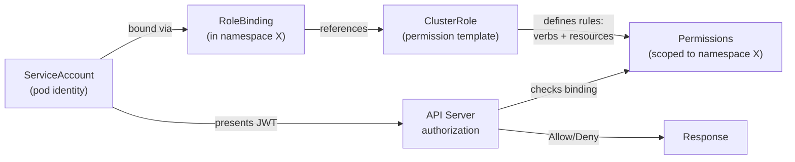
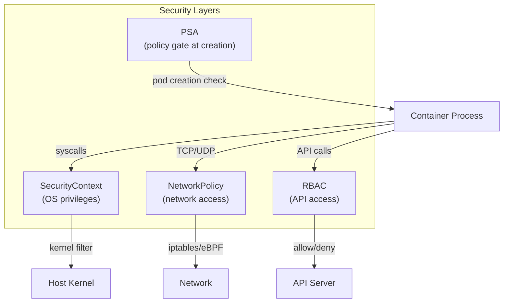

## Keywords in This File

{: .no_toc }

| # | Keyword | Weight |
|---|---------|--------|
| 1 | [RBAC: Role-Based Access Control](#rbac-role-based-access-control) | critical |
| 2 | [Pod Security: SecurityContext and Pod Security Admission](#pod-security-securitycontext-and-pod-security-admission) | high |

---

# RBAC: Role-Based Access Control

---

### 🎯 Model Answer

**30 seconds:**
> Kubernetes RBAC controls what operations (verbs) principals (users, groups, service
> accounts) can perform on which resources (pods, secrets, deployments) in which scope
> (namespace or cluster). Roles define allowed actions. Bindings attach Roles to
> principals. Always apply least privilege: grant only what is explicitly needed.

**3 minutes (Senior):**
> RBAC in Kubernetes has four core objects: Role, ClusterRole, RoleBinding, and
> ClusterRoleBinding. The distinction between Role and ClusterRole is scope: Roles are
> namespace-scoped (can only grant permissions within one namespace). ClusterRoles are
> cluster-scoped (can grant permissions cluster-wide OR can be used as templates bound
> to specific namespaces via RoleBinding).
>
> The binding objects connect roles to subjects: RoleBinding attaches a Role (or
> ClusterRole) to subjects within a specific namespace. ClusterRoleBinding attaches a
> ClusterRole to subjects cluster-wide. This combination gives you flexibility: a
> ClusterRole defines "what a developer can do" and you create RoleBindings in each
> team's namespace to apply it, without creating duplicate Roles per namespace.
>
> ServiceAccounts are the identity for pods. Every pod runs as a ServiceAccount.
> Without explicit assignment, pods use the `default` ServiceAccount in their namespace.
> The default SA typically has no permissions, but in older clusters it may have
> overly broad access. Always create dedicated ServiceAccounts per workload and grant
> minimum permissions. On cloud platforms (EKS, GKE), use IRSA (IAM Roles for Service
> Accounts) or Workload Identity to give pods cloud permissions without static credentials.

**Framework:** PRINCIPALS -> ROLES -> BINDINGS -> SCOPE -> LEAST-PRIVILEGE

*Adapting up:* Add RBAC aggregation rules (ClusterRole labels for additive composability),
audit logging for RBAC violations, and IRSA/Workload Identity for cloud provider RBAC.

*Adapting down:* "Role = permission list (can list pods). RoleBinding = 'grant this Role
to this user'. ServiceAccount = a pod's identity."

**Blank Mind Recovery:**

**(1) Restate:** "Kubernetes RBAC - Role-Based Access Control. Controls who can do what
on which resources. Roles define permissions, bindings attach roles to subjects (users,
groups, service accounts)."

**(2) First principles:** "In a multi-tenant cluster, every operation must be authorized:
kubectl by developers, pod API calls from apps, operators running reconcile loops. RBAC
is the single authorization system for all of these."

**(3) Bridge:** "Role = job description ('developer: can view pods'). RoleBinding = HR
record ('Alice is a developer'). ServiceAccount = employee ID for a pod. The combination
controls what any actor in the cluster is allowed to do."

---

### 📘 Concept Explanation

**The four RBAC objects:**

**Role** (namespace-scoped): defines allowed verbs on resources within one namespace.
```yaml
kind: Role
apiVersion: rbac.authorization.k8s.io/v1
metadata:
  name: pod-reader
  namespace: team-a             # scope: only team-a namespace
rules:
- apiGroups: [""]               # "" = core API group
  resources: ["pods", "pods/log"]
  verbs: ["get", "list", "watch"]
- apiGroups: ["apps"]
  resources: ["deployments"]
  verbs: ["get", "list"]
```

> **Code walkthrough:** This RBAC: Role-Based Access Control example demonstrates YAML configuration pattern using container. **KEY MECHANISM:** YAML parsers are whitespace-sensitive; indentation errors cause silent value misinterpretation. **WHY IT MATTERS:** unquoted strings starting with special chars (*, &, ?, |) trigger YAML parser errors. **TAKEAWAY: quote strings containing YAML special chars; validate YAML before deploying to production.**

**ClusterRole** (cluster-scoped): same structure as Role but applies cluster-wide OR
can be used as a reusable template for namespace-level bindings.
```yaml
kind: ClusterRole
apiVersion: rbac.authorization.k8s.io/v1
metadata:
  name: developer-view
rules:
- apiGroups: ["", "apps", "batch"]
  resources: ["pods", "deployments", "jobs", "configmaps"]
  verbs: ["get", "list", "watch"]
# No namespace field = cluster-scoped
```

> **Code walkthrough:** This No namespace field = cluster-scoped example demonstrates YAML configuration pattern using container. **KEY MECHANISM:** YAML parsers are whitespace-sensitive; indentation errors cause silent value misinterpretation. **WHY IT MATTERS:** unquoted strings starting with special chars (*, &, ?, |) trigger YAML parser errors. **TAKEAWAY: quote strings containing YAML special chars; validate YAML before deploying to production.**

**RoleBinding** (namespace-scoped): attaches a Role OR ClusterRole to subjects within
one namespace.
```yaml
kind: RoleBinding
metadata:
  name: alice-is-developer
  namespace: team-a
subjects:
- kind: User
  name: alice@example.com     # from OIDC/X.509 identity
- kind: ServiceAccount
  name: my-sa
  namespace: team-a
roleRef:
  kind: ClusterRole            # can reference either Role or ClusterRole
  name: developer-view
  apiGroup: rbac.authorization.k8s.io
```

> **Code walkthrough:** This No namespace field = cluster-scoped example demonstrates YAML configuration pattern using authentication. **KEY MECHANISM:** YAML parsers are whitespace-sensitive; indentation errors cause silent value misinterpretation. **WHY IT MATTERS:** unquoted strings starting with special chars (*, &, ?, |) trigger YAML parser errors. **TAKEAWAY: quote strings containing YAML special chars; validate YAML before deploying to production.**

**ClusterRoleBinding**: attaches a ClusterRole to subjects CLUSTER-WIDE.
```yaml
kind: ClusterRoleBinding
metadata:
  name: cluster-admins
subjects:
- kind: Group
  name: cluster-admins@example.com
roleRef:
  kind: ClusterRole
  name: cluster-admin          # built-in: full cluster access
  apiGroup: rbac.authorization.k8s.io
```

> **Code walkthrough:** This No namespace field = cluster-scoped example demonstrates YAML configuration pattern using authentication. **KEY MECHANISM:** YAML parsers are whitespace-sensitive; indentation errors cause silent value misinterpretation. **WHY IT MATTERS:** unquoted strings starting with special chars (*, &, ?, |) trigger YAML parser errors. **TAKEAWAY: quote strings containing YAML special chars; validate YAML before deploying to production.**

**ServiceAccounts:**
Every pod needs an identity for API server calls. ServiceAccount provides this.
```yaml
# Create dedicated SA per workload
kind: ServiceAccount
metadata:
  name: metrics-collector
  namespace: monitoring
---
# Bind minimal permissions
kind: ClusterRole
metadata:
  name: metrics-reader
rules:
- apiGroups: [""]
  resources: ["nodes", "pods"]
  verbs: ["get", "list", "watch"]
---
kind: ClusterRoleBinding
metadata:
  name: metrics-collector-reader
subjects:
- kind: ServiceAccount
  name: metrics-collector
  namespace: monitoring
roleRef:
  kind: ClusterRole
  name: metrics-reader
```

> **Code walkthrough:** This Bind minimal permissions example demonstrates YAML configuration pattern using container. **KEY MECHANISM:** YAML parsers are whitespace-sensitive; indentation errors cause silent value misinterpretation. **WHY IT MATTERS:** unquoted strings starting with special chars (*, &, ?, |) trigger YAML parser errors. **TAKEAWAY: quote strings containing YAML special chars; validate YAML before deploying to production.**

**Common verbs:** `get`, `list`, `watch`, `create`, `update`, `patch`, `delete`,
`deletecollection`, `exec` (for pods/exec), `portforward` (for pods/portforward).

**The key insight - ClusterRole + RoleBinding pattern:**
Use ClusterRole to define reusable permission templates. Use RoleBinding (not
ClusterRoleBinding) to apply them per-namespace. This gives per-namespace scoping
with cluster-level role management - no need to create identical Roles in every namespace.

**IRSA (IAM Roles for Service Accounts) on EKS:**
Annotate ServiceAccount with IAM role ARN. Pod's token is projected to the container.
AWS SDK automatically exchanges token for IAM credentials. No static credentials in Secrets.
```yaml
kind: ServiceAccount
metadata:
  name: s3-reader
  annotations:
    eks.amazonaws.com/role-arn: arn:aws:iam::123456789:role/s3-reader
```

> **Code walkthrough:** This Bind minimal permissions example demonstrates YAML configuration pattern. **KEY MECHANISM:** YAML parsers are whitespace-sensitive; indentation errors cause silent value misinterpretation. **WHY IT MATTERS:** unquoted strings starting with special chars (*, &, ?, |) trigger YAML parser errors. **TAKEAWAY: quote strings containing YAML special chars; validate YAML before deploying to production.**

---

### 💻 Code Example

> **Code walkthrough:** Complete RBAC setup for a multi-team cluster with developer
> access, CI/CD pipeline permissions, and an operator ServiceAccount.

```yaml
# BAD: Binding cluster-admin to a CI/CD service account
# CI/CD can delete any resource in any namespace - catastrophic if compromised
kind: ClusterRoleBinding
metadata:
  name: ci-cd-admin
subjects:
- kind: ServiceAccount
  name: ci-cd
  namespace: ci
roleRef:
  kind: ClusterRole
  name: cluster-admin          # full cluster access - WAY too broad
```

```yaml
# GOOD: Minimal CI/CD permissions per namespace
# CD pipeline for team-a can only update Deployments in team-a namespace

# ClusterRole: defines the permission template
kind: ClusterRole
apiVersion: rbac.authorization.k8s.io/v1
metadata:
  name: deployer
rules:
- apiGroups: ["apps"]
  resources: ["deployments"]
  verbs: ["get", "list", "patch", "update"]
- apiGroups: [""]
  resources: ["configmaps", "services"]
  verbs: ["get", "list", "create", "update", "patch"]
---
# ServiceAccount for the CI/CD runner
kind: ServiceAccount
apiVersion: v1
metadata:
  name: team-a-deployer
  namespace: ci
---
# RoleBinding: scopes to team-a namespace only
kind: RoleBinding
apiVersion: rbac.authorization.k8s.io/v1
metadata:
  name: team-a-deployer
  namespace: team-a             # CI can only deploy to team-a
subjects:
- kind: ServiceAccount
  name: team-a-deployer
  namespace: ci
roleRef:
  kind: ClusterRole
  name: deployer
  apiGroup: rbac.authorization.k8s.io
```


```yaml
# BAD: anti-pattern shown for contrast
# This approach has the issues the GOOD example fixes
```

```yaml
# GOOD: Kubernetes operator ServiceAccount with minimal cluster access
# Operator watches all namespaces but only manages its own CRDs

kind: ServiceAccount
metadata:
  name: payment-operator
  namespace: operators
---
kind: ClusterRole
metadata:
  name: payment-operator
rules:
# Watch and manage the operator's custom resources
- apiGroups: ["payments.example.com"]
  resources: ["paymentprocessors", "paymentprocessors/status"]
  verbs: ["get", "list", "watch", "create", "update", "patch"]
# Watch pods to understand health of managed components
- apiGroups: [""]
  resources: ["pods"]
  verbs: ["get", "list", "watch"]
# Create/update Deployments and Services for managed resources
- apiGroups: ["apps"]
  resources: ["deployments"]
  verbs: ["get", "list", "create", "update", "patch", "delete"]
- apiGroups: [""]
  resources: ["services", "configmaps"]
  verbs: ["get", "list", "create", "update", "patch"]
# Events for operator status reporting
- apiGroups: [""]
  resources: ["events"]
  verbs: ["create", "patch"]
---
kind: ClusterRoleBinding
metadata:
  name: payment-operator
subjects:
- kind: ServiceAccount
  name: payment-operator
  namespace: operators
roleRef:
  kind: ClusterRole
  name: payment-operator
```

> **Code walkthrough:** The BAD example gives the CI/CD ServiceAccount cluster-admin
> access - if the CI system is compromised, the attacker has full cluster access and
> can delete everything or exfiltrate all secrets. The GOOD CI/CD example creates a
> minimal `deployer` ClusterRole (update Deployments/ConfigMaps/Services) and binds it
> only to the team-a namespace via RoleBinding. The operator example shows the least-
> privilege pattern for operators: watch CRDs, manage Deployments for owned resources,
> create Events. Notice: no access to Secrets (not needed), no access to other CRDs
> (not needed). RBAC should model exactly what the workload needs - nothing more.

---

### 🎓 Answers by Seniority

**Junior / Mid (0-5 years):**
> RBAC controls who can do what in Kubernetes. A Role defines permissions: "can list
> pods in namespace X". A RoleBinding says "grant this Role to user Alice". ClusterRole
> and ClusterRoleBinding are the same but for cluster-wide access. ServiceAccounts
> give pods an identity for API calls. Always use the minimal permissions needed.
> Never give developers or pipelines cluster-admin access.

*Push deeper:* What is the difference between a RoleBinding referencing a Role vs
a RoleBinding referencing a ClusterRole?

---

**Senior / Staff (5+ years):**
> The most important security principle: separate identities. Every CI/CD pipeline, every
> operator, every application that calls the Kubernetes API should have its OWN
> ServiceAccount with minimal permissions. The `default` ServiceAccount in each namespace
> should have NO permissions (verify with `kubectl auth can-i list pods --as=system:serviceaccount:myns:default`).
> The most dangerous permission to grant: `secrets` with verbs `get`/`list`. Any pod
> with this permission can read ALL Secrets in the bound namespace, which typically
> includes database passwords, TLS certificates, and API keys. Operators often need
> to watch resources cluster-wide but should only create/update in specific namespaces -
> use ClusterRole for the watch/get permissions and RoleBindings in specific namespaces
> for create/update/delete. This "narrow read + scoped write" pattern is the foundation
> of operator least-privilege RBAC.

*Push deeper:* RBAC aggregation: label a ClusterRole with
`rbac.authorization.k8s.io/aggregate-to-view: "true"` and it is automatically added
to the built-in `view` ClusterRole. This allows CRD permissions to aggregate into
standard roles without modifying the built-in roles.

---

### ⚠️ Common Misconceptions

**Misconception 1: "ClusterRoleBinding to a ClusterRole with namespace-scoped resources
grants cluster-wide access to those resources."**
Correct. ClusterRoleBinding grants the role's permissions across ALL namespaces. If you
want to give a developer access to pods in only ONE namespace, use RoleBinding (not
ClusterRoleBinding) referencing the ClusterRole. ClusterRoleBinding + any role = cluster-wide.

**Misconception 2: "The 'default' ServiceAccount has no permissions by default."**
In modern clusters, yes - the default SA has no RBAC permissions. But many clusters have
legacy configurations or third-party tools that grant broad permissions to the default SA.
Always verify: `kubectl auth can-i list secrets --as=system:serviceaccount:default:default`.
If that returns "yes", your cluster has over-privileged defaults.

**Misconception 3: "RBAC controls what pods can DO (network, syscalls, filesystem)."**
RBAC only controls access to the Kubernetes API server. It does NOT control:
- Network connections (use NetworkPolicy)
- System calls (use seccomp)
- File system access (use SecurityContext)
- Linux capabilities (use SecurityContext)
RBAC is API authorization only.

**Misconception 4: "Granting 'list' permission on secrets is safe because they're encrypted."**
`list secrets` returns secret data (base64-encoded, not encrypted). Listing secrets
gives full access to all secret values. `list` on Secrets is effectively `get all`.
Audit regularly: `kubectl auth can-i list secrets --as=system:serviceaccount:ns:sa`.

---

### 🚨 Failure Modes and Diagnosis

**Failure 1: Pod unable to call Kubernetes API (403 Forbidden)**

Symptom: application logs show "403 Forbidden" or "RBAC: forbidden" when calling
Kubernetes API (listing pods, reading ConfigMaps, etc.).

Cause: pod's ServiceAccount lacks the required RBAC permissions.

Diagnostic:
`kubectl auth can-i list pods --as=system:serviceaccount:<namespace>:<sa-name>`
Returns "yes" or "no". Identify exactly which resource/verb is missing.

Fix: create Role/ClusterRole with needed permissions; bind to the ServiceAccount.

**Failure 2: Over-privileged ServiceAccount discovered in security audit**

Symptom: security scan shows pods with cluster-admin or wildcard resource access.

Cause: developer granted broad access for convenience; never reduced later.

Diagnostic: `kubectl get clusterrolebindings -o json | jq '.items[] |
  select(.roleRef.name=="cluster-admin") | .subjects'`
Lists all subjects with cluster-admin binding.

Fix: audit and replace cluster-admin bindings with minimal role sets.
Use `rbac-audit` tool to find all permissions per ServiceAccount.

**Failure 3: Namespace isolation broken by ClusterRoleBinding**

Symptom: team-a pod can list pods in team-b namespace; intended isolation violated.

Cause: ClusterRoleBinding (not RoleBinding) was used for the ServiceAccount.
ClusterRoleBinding grants the role cluster-wide.

Diagnostic: `kubectl get clusterrolebindings -o wide` - check if team-a SA is in a
ClusterRoleBinding.

Fix: replace ClusterRoleBinding + ClusterRole with RoleBinding + ClusterRole, scoped
to team-a namespace only.

---

### 🎯 Interview Deep-Dive

| Question Category | Time to Answer |
|---|---|
| Definition | 30-60 seconds |
| Mechanism | 1-2 minutes |
| Scenario | 2-3 minutes |
| Debugging | 2-3 minutes |
| Trade-off | 2-3 minutes |
| Architecture | 2-3 minutes |
| Advanced | 1-2 minutes |
| Hands-on | 1-2 minutes |
| Behavioral | 2-3 minutes |

---

**Q1 [JUNIOR] (CONCEPTUAL): What is the difference between Role and ClusterRole?**

A: The difference is scope:

Role is namespace-scoped. A Role can only grant permissions for resources within a
single namespace. When you create a Role in namespace `team-a`, the permissions it
defines apply only to resources in `team-a`. You cannot use a Role to grant access
to cluster-scoped resources (like nodes, PersistentVolumes, or ClusterRoles themselves).

ClusterRole is cluster-scoped. It can:
1. Grant permissions to cluster-scoped resources (nodes, PVs, namespaces)
2. Grant permissions to namespace-scoped resources, but across ALL namespaces
   (when bound via ClusterRoleBinding)
3. Be used as a reusable template bound to specific namespaces (via RoleBinding)

The powerful pattern: define a ClusterRole once as a "developer permissions template",
then create RoleBindings in each team's namespace. The ClusterRole is reused; the
RoleBinding scopes it per namespace. This avoids creating identical Roles in every namespace.

Built-in ClusterRoles: `cluster-admin` (full access), `admin` (namespace admin),
`edit` (namespace read/write), `view` (namespace read-only). Use these as starting points.

*What separates good from great:* The `admin` ClusterRole gives full access to most
namespace resources but cannot modify RBAC objects itself (can't grant itself more
permissions). `cluster-admin` can do everything including modify RBAC. Never grant
`cluster-admin` to application service accounts.

---

**Q2 [MID] (HANDS-ON): How do you give a pod running in one namespace the ability to
read ConfigMaps in a different namespace?**

A: This requires a ClusterRole (for cross-namespace access) bound with a RoleBinding
in the TARGET namespace (where the ConfigMaps are).

```yaml
# Step 1: ClusterRole defining the permission (reusable template)
kind: ClusterRole
apiVersion: rbac.authorization.k8s.io/v1
metadata:
  name: configmap-reader
rules:
- apiGroups: [""]
  resources: ["configmaps"]
  verbs: ["get", "list", "watch"]
---
# Step 2: ServiceAccount for the pod in its namespace
kind: ServiceAccount
metadata:
  name: config-reader-sa
  namespace: team-a             # pod lives here
---
# Step 3: RoleBinding in the TARGET namespace (where ConfigMaps are)
kind: RoleBinding
apiVersion: rbac.authorization.k8s.io/v1
metadata:
  name: team-a-reads-shared-config
  namespace: shared-config      # ConfigMaps are HERE
subjects:
- kind: ServiceAccount
  name: config-reader-sa
  namespace: team-a             # SA is in team-a
roleRef:
  kind: ClusterRole
  name: configmap-reader
  apiGroup: rbac.authorization.k8s.io
```

> **Code walkthrough:** This Step 3: RoleBinding in the TARGET namespace (where ConfigMaps are) example demonstrates YAML configuration pattern using container. **KEY MECHANISM:** YAML parsers are whitespace-sensitive; indentation errors cause silent value misinterpretation. **WHY IT MATTERS:** unquoted strings starting with special chars (*, &, ?, |) trigger YAML parser errors. **TAKEAWAY: quote strings containing YAML special chars; validate YAML before deploying to production.**

The pod in `team-a` using `config-reader-sa` can now read ConfigMaps in `shared-config`
namespace. It cannot read ConfigMaps in `team-b` or any other namespace.

Key insight: the RoleBinding's namespace determines WHERE the permissions apply. The
ServiceAccount's namespace determines WHO gets the permissions.

*What separates good from great:* This is the "cross-namespace ServiceAccount" pattern.
It's useful for shared configuration namespaces. However, for secrets, this pattern
grants one team's pods access to another namespace's secrets - be careful. Prefer
sharing configuration via namespace-specific copies rather than cross-namespace access
for sensitive data.

---

**Q3 [SENIOR] (ARCHITECTURE): How do you design RBAC for a multi-team cluster where
each team manages their own namespace?**

A: Multi-tenant RBAC with the "namespace-as-team-boundary" pattern:

Layer 1 - ClusterRole definitions (cluster admin manages, teams can only use):
```yaml
# Developer: can deploy, view, exec
kind: ClusterRole
metadata:
  name: namespace-developer
rules:
- apiGroups: ["apps"]
  resources: ["deployments", "replicasets"]
  verbs: ["get", "list", "watch", "create", "update", "patch"]
- apiGroups: [""]
  resources: ["pods", "pods/log", "pods/exec", "services",
              "configmaps"]
  verbs: ["get", "list", "watch", "create", "update", "patch",
          "delete"]
# Explicitly NOT included: secrets (use separate role), RBAC
```

> **Code walkthrough:** This Explicitly NOT included: secrets (use separate role), RBAC example demonstrates YAML configuration pattern using SQL. **KEY MECHANISM:** YAML parsers are whitespace-sensitive; indentation errors cause silent value misinterpretation. **WHY IT MATTERS:** unquoted strings starting with special chars (*, &, ?, |) trigger YAML parser errors. **TAKEAWAY: quote strings containing YAML special chars; validate YAML before deploying to production.**

Layer 2 - RoleBindings per namespace (one per team):
```yaml
# Bind developer ClusterRole to team-a group in team-a namespace
kind: RoleBinding
metadata:
  name: developers
  namespace: team-a
subjects:
- kind: Group
  name: team-a@example.com   # OIDC group
roleRef:
  kind: ClusterRole
  name: namespace-developer
```

> **Code walkthrough:** This Bind developer ClusterRole to team-a group in team-a namespace example demonstrates YAML configuration pattern. **KEY MECHANISM:** YAML parsers are whitespace-sensitive; indentation errors cause silent value misinterpretation. **WHY IT MATTERS:** unquoted strings starting with special chars (*, &, ?, |) trigger YAML parser errors. **TAKEAWAY: quote strings containing YAML special chars; validate YAML before deploying to production.**

Layer 3 - Automated binding via Namespace controller:
When a new namespace is created with label `managed-by: team`, an admission webhook
or operator automatically creates the standard RoleBindings for that team's group.
No manual RBAC management per team.

Layer 4 - Secret access (separate, explicit):
Secrets get a separate `secret-reader` Role created per-namespace. Access requires
explicit request and approval (not automatic for all developers).

Result: teams self-service within their namespace. Developers cannot access other
teams' namespaces. Secret access is audited and explicit.

*What separates good from great:* Using OIDC groups (not individual users) in RoleBindings
is critical for manageability. When a developer joins or leaves team-a, you change
group membership in your IdP (Okta, Google Groups). No RBAC changes in Kubernetes.
One RoleBinding per namespace per role, regardless of team size.

---

**Q4 [SENIOR] (DEBUGGING): An application pod receives 403 errors when calling the
Kubernetes API. Debug.**

A: 403 = RBAC denied. The pod's ServiceAccount lacks permission for the requested action.

Step 1: identify the ServiceAccount.
`kubectl get pod <name> -o yaml | grep serviceAccountName`
Which SA is this pod using? If `default`: it's using the default SA.

Step 2: simulate the permission check.
`kubectl auth can-i <verb> <resource> --namespace <ns> \
  --as=system:serviceaccount:<namespace>:<sa-name>`
Examples:
`kubectl auth can-i list pods --as=system:serviceaccount:team-a:my-app-sa`
`kubectl auth can-i get secrets --as=system:serviceaccount:default:default`
Returns "yes" or "no".

Step 3: check existing RBAC for the SA.
`kubectl get rolebindings,clusterrolebindings -A -o json | \
  jq '.items[] | select(.subjects[]?.name=="my-app-sa")'`
Lists all bindings that reference this SA.

Step 4: check application logs for the exact API call failing.
`kubectl logs <pod>` -> what resource/verb/namespace is being accessed?
The 403 response body usually contains the exact forbidden action.

Step 5: create the minimal Role.
Grant only the specific resource + verb combination failing. Don't over-provision.

*What separates good from great:* `kubectl auth can-i` is the fastest tool and
should always be the first step. It directly tests the authorization decision for
a specific identity. No need to read Role YAML to understand what's allowed.

---

**Q5 [SENIOR] (TRADE-OFF): When do you use ClusterRoleBinding vs RoleBinding
with a ClusterRole?**

A: The choice is about scope of effect:

ClusterRoleBinding: the ClusterRole applies cluster-wide, across all namespaces.
Use when: the subject legitimately needs cluster-wide access. Examples:
- Prometheus monitoring (needs to scrape metrics from all namespaces)
- Cluster autoscaler (needs to read nodes and manage pods cluster-wide)
- `cluster-admin` binding for cluster administrators

RoleBinding + ClusterRole (namespace-scoped effect): the ClusterRole's permissions
apply ONLY within the namespace where the RoleBinding exists.
Use when: same permissions needed in multiple namespaces, but each instance is
scoped independently. Examples:
- Developer access: ClusterRole `namespace-developer`, RoleBinding per team namespace
- CI/CD deployer: ClusterRole `deployer`, RoleBinding in each team's namespace
- Operator managing a specific namespace's resources

The key security question: "does this subject need access to resources in ALL
namespaces simultaneously?" If yes: ClusterRoleBinding. If no: RoleBinding.

Most application ServiceAccounts should use RoleBinding (not ClusterRoleBinding).
Only infrastructure components (monitoring, networking, cluster operators) need
ClusterRoleBinding.

*What separates good from great:* An easy way to catch ClusterRoleBinding over-use:
run `kubectl get clusterrolebindings -o json` and review any binding that gives
access to namespace-scoped resources. If it's an application SA (not infrastructure):
it should probably be a RoleBinding instead. This audit should be part of regular
security reviews.

---

**Q6 [STAFF] (SYSTEM DESIGN): How do you implement IRSA (IAM Roles for Service Accounts)
for pods that need AWS API access?**

A: IRSA binds Kubernetes ServiceAccounts to IAM roles without static credentials.

Prerequisites: EKS cluster with OIDC provider configured. The cluster's OIDC issuer
URL is registered as a trusted identity provider in IAM.

Step 1: create IAM role with trust policy for the ServiceAccount:
```json
{
  "Version": "2012-10-17",
  "Statement": [{
    "Effect": "Allow",
    "Principal": {
      "Federated": "arn:aws:iam::ACCOUNT:oidc-provider/OIDC_ISSUER"
    },
    "Action": "sts:AssumeRoleWithWebIdentity",
    "Condition": {
      "StringEquals": {
        "OIDC_ISSUER:sub":
          "system:serviceaccount:NAMESPACE:SERVICE_ACCOUNT_NAME"
      }
    }
  }]
}
```

> **Code walkthrough:** This Bind developer ClusterRole to team-a group in team-a namespace example demonstrates a key concept in practice. **KEY MECHANISM:** the runtime executes these instructions in sequence with specific memory and execution semantics. **WHY IT MATTERS:** misapplying this pattern causes subtle bugs that only manifest under production load. **TAKEAWAY: understand the execution model before using this pattern in production code.**

Step 2: annotate the ServiceAccount:
```yaml
kind: ServiceAccount
metadata:
  name: s3-reader
  namespace: team-a
  annotations:
    eks.amazonaws.com/role-arn: arn:aws:iam::ACCOUNT:role/s3-reader
```

> **Code walkthrough:** This Bind developer ClusterRole to team-a group in team-a namespace example demonstrates YAML configuration pattern. **KEY MECHANISM:** YAML parsers are whitespace-sensitive; indentation errors cause silent value misinterpretation. **WHY IT MATTERS:** unquoted strings starting with special chars (*, &, ?, |) trigger YAML parser errors. **TAKEAWAY: quote strings containing YAML special chars; validate YAML before deploying to production.**

Step 3: pod automatically gets projected token:
When a pod uses this ServiceAccount, EKS mutating webhook injects:
- Environment variable: `AWS_ROLE_ARN` and `AWS_WEB_IDENTITY_TOKEN_FILE`
- Volume mount: `/var/run/secrets/eks.amazonaws.com/serviceaccount/token`

The AWS SDK reads these automatically. No credentials in pods or Secrets.

Token exchange: pod presents the OIDC JWT to STS `AssumeRoleWithWebIdentity`.
STS validates the token signature against the OIDC issuer, checks the trust condition
(SA name matches), and returns temporary credentials. Credentials are automatically
refreshed before expiry.

*What separates good from great:* IRSA enables per-ServiceAccount IAM scoping.
Each application workload gets a unique IAM role with exactly the S3 buckets / DynamoDB
tables / SQS queues it needs. A compromise of one pod's credentials grants access
only to that pod's specific resources, not all AWS resources for the cluster. This
is a massive improvement over using node instance profile IAM roles, where all pods
on a node share the same IAM permissions.

---

**Q7 [MID] (COMPARISON): What is the difference between `get` and `list` verbs for secrets?**

A: For most resources, `get` retrieves a specific object by name; `list` retrieves
all objects of that type. For Secrets, both are dangerous in different ways.

`get secrets`: read a specific Secret by name. To do this, the caller must know the
Secret's name. Grants access to one Secret at a time.

`list secrets` (and `watch secrets`): retrieves ALL Secrets in the scope (namespace
or cluster). The response includes the full Secret data for every Secret.

Common mistake: granting `list` on Secrets thinking it only shows Secret names.
It returns all Secret values. `list secrets` is effectively "read all secrets".

The more restrictive pattern: grant `get` only on specific Secret names using
`resourceNames`:
```yaml
rules:
- apiGroups: [""]
  resources: ["secrets"]
  verbs: ["get"]
  resourceNames: ["my-specific-secret"] # ONLY this one Secret
```

> **Code walkthrough:** This Bind developer ClusterRole to team-a group in team-a namespace example demonstrates YAML configuration pattern. **KEY MECHANISM:** YAML parsers are whitespace-sensitive; indentation errors cause silent value misinterpretation. **WHY IT MATTERS:** unquoted strings starting with special chars (*, &, ?, |) trigger YAML parser errors. **TAKEAWAY: quote strings containing YAML special chars; validate YAML before deploying to production.**

This allows the pod to read `my-specific-secret` but NOT list all Secrets and NOT
read any other Secret.

For most workloads: use `resourceNames` to restrict which specific Secrets can be
accessed. Never grant `list` on Secrets to application ServiceAccounts.

*What separates good from great:* `watch secrets` is equally dangerous - a watch
stream delivers every Secret update (including values) in real-time. When auditing
RBAC for Secret access, check for `get`, `list`, AND `watch` verbs.

---

**Q8 [STAFF] (PRODUCTION): How do you audit RBAC to find over-privileged service accounts?**

A: Regular RBAC audits should identify: (1) accounts with cluster-admin, (2) accounts
with secret access, (3) accounts with cross-namespace access not intended.

Tool-based audit:
```bash
# Find all ClusterRoleBindings granting cluster-admin
kubectl get clusterrolebindings -o json | jq \
  '.items[] | select(.roleRef.name=="cluster-admin") |
  {name: .metadata.name, subjects: .subjects}'

# Find all ServiceAccounts that can list secrets in any namespace
kubectl auth can-i list secrets \
  --as=system:serviceaccount:default:default

# Loop through all SA in all namespaces
for ns in $(kubectl get ns -o name | cut -d/ -f2); do
  for sa in $(kubectl get sa -n $ns -o name | cut -d/ -f2); do
    result=$(kubectl auth can-i list secrets -n $ns \
      --as=system:serviceaccount:$ns:$sa 2>/dev/null)
    if [ "$result" = "yes" ]; then
      echo "WARNING: $ns/$sa can list secrets"
    fi
  done
done
```

> **Code walkthrough:** This Loop through all SA in all namespaces example demonstrates shell script pattern using SQL. **KEY MECHANISM:** the shell executes commands sequentially; pipes pass stdout of one command to stdin of the next. **WHY IT MATTERS:** unquoted variables with spaces cause word splitting - IFS splits the value into multiple arguments. **TAKEAWAY: always double-quote variables: "$VAR"; use [[ ]] instead of [ ] for safer conditionals.**

Tools: `rbac-lookup` (Fairwinds), `rakkess`, `kubectl-who-can` - all query RBAC
and show which subjects have specific permissions.

OPA/Kyverno policies for ongoing enforcement:
- Reject any ClusterRoleBinding granting cluster-admin to non-approved subjects
- Warn on any Role granting `list secrets`
- Require all ServiceAccounts to have a `managed-by` label

Audit log review: `kubectl audit` or review API server audit logs for RBAC denials.
Repeated RBAC denials from a ServiceAccount = it's missing permissions. Zero denials
= either it has correct permissions or it's over-privileged (never hits a denial).

*What separates good from great:* Regular automated RBAC reviews (weekly/monthly)
matter more than one-time audits. RBAC creep is real: permissions are added for
debugging, never removed. A cron job that emails the security team a list of
ServiceAccounts with `list secrets` permission every week creates accountability.

---

**Q9 [STAFF] (BEHAVIORAL): Describe a security incident related to Kubernetes RBAC
and how you responded.**

A (STAR format):

Situation: during a routine security audit of our staging cluster, we discovered that
a CI/CD ServiceAccount had been granted `cluster-admin` 6 months earlier by a
developer trying to debug a deployment permission issue. The ServiceAccount token was
stored in our CI/CD system (GitLab CI). We had no evidence of compromise but the
exposure was significant.

Task: immediately remediate the over-privilege without breaking the CI/CD pipeline,
and implement controls to prevent recurrence.

Action:
Hour 1 - Containment: rotated the ServiceAccount token (deleted and re-created the SA,
which invalidates the token). Updated GitLab CI with the new token. Verified CI/CD
pipeline still worked with the new token (it used a different SA we created in parallel).

Hour 2 - Minimal permissions: audited exactly what the CI/CD pipeline needed to do:
update Deployment images (kubectl set image). Created a minimal ClusterRole:
```yaml
rules:
- apiGroups: ["apps"]
  resources: ["deployments"]
  verbs: ["get", "patch", "list"]
```
> **Code walkthrough:** This Loop through all SA in all namespaces example demonice. **KEY MECHANISM:** the runtime executes these instructions in sequence with specific memory and execution semantics. **WHY IT MATTERS:** misapplying this pattern causes subtle bugs that only manifest under production load. **TAKEAWAY: understand the execution model before using this pattern in production code.**

Created per-namespace RoleBindings for each deployment namespace. Tested pipelin

Hour 3 - Investigation: reviewed audit logs for the 6-month window for any anoma
API calls from that ServiceAccount. No evidence of compromise. Documented as "unintended
privilege, no evidence of abuse."

Prevention:
1. OPA Gatekeeper policy: block any new ClusterRoleBinding to `cluster-admin` un
   the binding is in an approved list (cluster-admin group members only).
2. Weekly RBAC audit script emailing security team.
3. Added RBAC review to PR checklist for any Kubernetes manifest changes.

*What separates good from great:* Token rotation as the first response to any potential
SA token compromise is the most impactful containment action. It invalidates all existing
tokens for that SA immediately, stopping any active exploitation, while the investigation
continues in parallel.

---

### ⚖️ Comparison Table

|| Role| ClusterRole| RoleBinding| ClusterRoleBinding|
|---|---|----------------------|---------------------|-------------------------|
| Scope| Namespace| Cluster| Namespace| Cluster|
| Grants access to| Resources in one NS| Resources in all NS or cluster-scoped| 
| Use for| NS-local permissions| Reusable templates, cluster resources| Scoped t
| With ClusterRole| N/A| Define permission set| Scope a CR to one NS| Apply CR c

**Decision tree:**

- Cluster-scoped resources (nodes, PVs)? -> ClusterRole + ClusterRoleBinding
- Infrastructure component (Prometheus, autoscaler)? -> ClusterRole + ClusterRol
- Team/dev access to specific namespace? -> ClusterRole + RoleBinding per namesp
- App calling API in its own namespace? -> Role + RoleBinding in same namespace
- App calling API in ANOTHER namespace? -> ClusterRole + RoleBinding in target n

---

### 🏛️ System Design

*(Omit: ★★☆ keyword - multi-tenant RBAC architecture and policy-as-code enforcem
covered at L4 and L5 levels.)*

---

### 📊 Diagram

```plaintext
RBAC authorization flow:

  kubectl / pod API call
         |
  [Authentication: who are you?]
  (X.509, OIDC token, ServiceAccount JWT)
         |
  [Authorization: what can you do?]
  RBAC: check Role/ClusterRole bindings for subject
         |
  [Admission Control: is this allowed by policy?]
  OPA Gatekeeper, Kyverno
         |
  [Execute: perform the API action]
```



> **Diagram walkthrough:** The authorization flow shows the three-phase sequence:
> authentication establishes identity (who is calling), RBAC authorization checks
> what that identity is allowed to do, and admission control applies policy rules.
> The RBAC check specifically follows the ServiceAccount -> RoleBinding -> Role/ClusterRole
> chain. A ClusterRole bound via RoleBinding grants permissions scoped to the
> RoleBinding's namespace, while the same ClusterRole bound via ClusterRoleBinding
> grants permissions cluster-wide. The scope is determined by the binding type, not
> the role type.

---
---

---

### 💻 Code Example

*(Omit: this concept does not have a programmatic interface that can be demonstrated in code. The conceptual explanation above is sufficient.)*


---

### 🏛️ System Design

*(Omit: system design diagram not applicable for this concept - see ★★★ keywords for full system design coverage.)*


---

### ⚖️ Comparison Table

*(Omit: this is a ★☆☆ foundational concept with no direct alternatives to compare - see higher-difficulty keywords for trade-off analysis.)*


---

### 📊 Diagram

*(Omit: no standalone visual diagram required for this concept - the explanations and code examples above provide sufficient clarity.)*


# Pod Security: SecurityContext and Pod Security Admission

---

### 🎯 Model Answer

**30 seconds:**
> Pod security controls prevent container privilege escalation. SecurityContext configures
> Linux security settings for individual pods and containers: run as non-root, drop
> capabilities, read-only filesystem, seccomp profiles. Pod Security Admission (PSA)
> is the cluster-level policy that enforces security profiles: privileged (no restriction),
> baseline (blocks most privilege escalation), and restricted (hardened). Use restricted
> mode for all production workloads.

**3 minutes (Senior):**
> Container security is about limiting blast radius. If a container is compromised,
> what can the attacker do? Without security controls: the attacker has root access
> inside the container, can potentially escape to the node, access other pods' data,
> and pivot through the cluster.
>
> SecurityContext operates at two levels: pod-level (applies to all containers) and
> container-level (overrides pod-level for specific containers). Key settings:
> `runAsNonRoot: true` prevents root processes. `runAsUser: 1000` sets a specific
> non-root UID. `allowPrivilegeEscalation: false` prevents `setuid` binaries and
> sudo from gaining extra privileges. `capabilities.drop: [ALL]` removes all Linux
> capabilities; add back only what's needed.
>
> Pod Security Admission (PSA, GA in K8s 1.25, replaced Pod Security Policies) applies
> at the namespace level via labels. Three modes: `enforce` (reject violating pods),
> `warn` (warn but allow), `audit` (log but allow). Three policy levels: privileged,
> baseline, restricted. Apply `restricted` to production namespaces; use `warn` for
> gradual migration. The restricted profile requires: non-root, no privilege escalation,
> seccomp RuntimeDefault or Localhost, dropped capabilities.

**Framework:** SECURITYCONTEXT -> PSA POLICIES -> THREAT MODEL -> PRODUCTION

*Adapting up:* Add seccomp profiles (blocking syscalls), AppArmor profiles, runtime
security (Falco for syscall-level detection), and supply chain security (image scanning,
SBOM, cosign for image signing).

*Adapting down:* "SecurityContext: run the container as a non-root user, don't allow
privilege escalation. PSA: namespace-level policy that enforces these settings across
all pods in the namespace."

**Blank Mind Recovery:**

**(1) Restate:** "Pod security - SecurityContext and Pod Security Admission. SecurityContext
sets Linux security for individual containers. PSA enforces security policy at namespace level."

**(2) First principles:** "Container security goal: limit what a compromised container
can do. If running as root, it can potentially escape to the host. If it has capabilities,
it can reconfigure networking. Deny all, add back only what's needed."

**(3) Bridge:** "SecurityContext = security settings on your employee badge (what access
level this person has). PSA = building security policy ('no contractor badges allowed in
the server room'). One is per-employee, one is per-building-area."

---

### 📘 Concept Explanation

**SecurityContext settings:**

Pod-level SecurityContext (applies to all containers in the pod):
```yaml
spec:
  securityContext:
    runAsNonRoot: true         # reject root user (UID 0)
    runAsUser: 1000            # run as UID 1000
    runAsGroup: 3000           # run as GID 3000
    fsGroup: 2000              # volume ownership: files readable by this group
    seccompProfile:
      type: RuntimeDefault     # default seccomp filter
```

> **Code walkthrough:** This Pod Security: SecurityContext and Pod Security Admission example demonstrates YAML configuration pattern. **KEY MECHANISM:** YAML parsers are whitespace-sensitive; indentation errors cause silent value misinterpretation. **WHY IT MATTERS:** unquoted strings starting with special chars (*, &, ?, |) trigger YAML parser errors. **TAKEAWAY: quote strings containing YAML special chars; validate YAML before deploying to production.**

Container-level SecurityContext (overrides pod-level):
```yaml
spec:
  containers:
  - name: app
    securityContext:
      allowPrivilegeEscalation: false  # prevent sudo/setuid escalation
      readOnlyRootFilesystem: true     # filesystem is read-only
      capabilities:
        drop: ["ALL"]                  # remove all capabilities
        add: ["NET_BIND_SERVICE"]      # add back only port < 1024 binding
      runAsNonRoot: true
      seccompProfile:
        type: RuntimeDefault
```

> **Code walkthrough:** This Pod Security: SecurityContext and Pod Security Admission example demonstrates YAML configuration pattern using container. **KEY MECHANISM:** YAML parsers are whitespace-sensitive; indentation errors cause silent value misinterpretation. **WHY IT MATTERS:** unquoted strings starting with special chars (*, &, ?, |) trigger YAML parser errors. **TAKEAWAY: quote strings containing YAML special chars; validate YAML before deploying to production.**

**Key SecurityContext fields:**

`runAsNonRoot`: if `true`, K8s rejects pods where the container would run as UID 0
(root). The container image must specify a non-root USER.

`allowPrivilegeEscalation`: if `false`, the container cannot gain more privileges
than its parent process. Prevents `setuid` binaries (sudo, ping) from escalating.
Required for restricted PSA.

`readOnlyRootFilesystem`: the container's root filesystem is mounted read-only.
Application must write to mounted volumes only. Prevents attackers from modifying
container binaries or dropping malware.

`capabilities`: Linux capabilities are subsets of root privilege. Dropping ALL
and adding back specific capabilities is the least-privilege approach.
Common needed caps: `NET_BIND_SERVICE` (bind port < 1024), `NET_RAW` (raw sockets
for ping/traceroute). Drop everything else.

`seccompProfile`: system call filtering. `RuntimeDefault` uses the container runtime's
default seccomp profile (blocks ~300 dangerous syscalls out of ~430). `Localhost` uses
a custom profile.

**Pod Security Admission (PSA):**

Enabled by labeling namespaces:
```yaml
kind: Namespace
metadata:
  name: production
  labels:
    # Mode: enforce (reject), warn, audit
    # Level: privileged, baseline, restricted
    pod-security.kubernetes.io/enforce: restricted
    pod-security.kubernetes.io/enforce-version: latest
    pod-security.kubernetes.io/warn: restricted
    pod-security.kubernetes.io/audit: restricted
```

> **Code walkthrough:** This Level: privileged, baseline, restricted example demonstrates YAML configuration pattern using container. **KEY MECHANISM:** YAML parsers are whitespace-sensitive; indentation errors cause silent value misinterpretation. **WHY IT MATTERS:** unquoted strings starting with special chars (*, &, ?, |) trigger YAML parser errors. **TAKEAWAY: quote strings containing YAML special chars; validate YAML before deploying to production.**

Policy levels:

**Privileged**: no restrictions. Use for system namespaces (kube-system, monitoring).

**Baseline**: prevents known privilege escalations.
Blocks: privileged containers, hostNetwork/hostPID/hostIPC, host path volumes,
hostPort, capabilities beyond a safe set.
Allows: running as root, no seccomp requirement.

**Restricted**: heavily restricted. Requires:
- runAsNonRoot OR specific non-root UID
- allowPrivilegeEscalation: false
- seccompProfile RuntimeDefault or Localhost
- Capabilities: drop ALL (add back only NET_BIND_SERVICE if needed)
- Volume types restricted to safe set

Recommended: `restricted` for all application namespaces. `privileged` only for
kube-system and monitoring. Audit before enforce.

**Migration strategy:**
1. Apply `warn` + `audit` to all namespaces to see violations without blocking
2. Fix violations: add SecurityContext to offending pods
3. Change `warn` to `enforce` once violations are zero

---

### 💻 Code Example

> **Code walkthrough:** Non-root container configuration and PSA namespace labeling.

```yaml
# BAD: Container runs as root, no security restrictions
# If compromised: attacker has root access, can modify filesystem,
# potentially escape container
spec:
  containers:
  - name: app
    image: nginx:latest      # default nginx runs as root!
    # No securityContext = running as root with all capabilities
```

```yaml
# GOOD: Hardened container following restricted PSA requirements
apiVersion: apps/v1
kind: Deployment
metadata:
  name: secure-api
spec:
  template:
    spec:
      # Pod-level: non-root identity
      securityContext:
        runAsNonRoot: true
        runAsUser: 1000        # match the user in the container image
        runAsGroup: 1000
        fsGroup: 1000          # volumes readable by this group
        seccompProfile:
          type: RuntimeDefault # default syscall filtering

      containers:
      - name: api
        image: api:1.0         # image must have USER 1000 in Dockerfile
        securityContext:
          allowPrivilegeEscalation: false  # no sudo, no setuid
          readOnlyRootFilesystem: true     # immutable container FS
          capabilities:
            drop: ["ALL"]      # remove all Linux capabilities
        # Read-only FS requires writable tmp volume for temp files
        volumeMounts:
        - name: tmp
          mountPath: /tmp
        - name: varlog
          mountPath: /var/log/app

      volumes:
      - name: tmp
        emptyDir: {}           # ephemeral, writable for temp files
      - name: varlog
        emptyDir: {}           # writable for log files
```

```yaml
# Namespace PSA labeling for production workloads
apiVersion: v1
kind: Namespace
metadata:
  name: production
  labels:
    pod-security.kubernetes.io/enforce: restricted
    pod-security.kubernetes.io/enforce-version: latest
    pod-security.kubernetes.io/warn: restricted
    pod-security.kubernetes.io/audit: restricted
---
# System namespace: privileged (monitoring, network plugins need root)
apiVersion: v1
kind: Namespace
metadata:
  name: kube-system
  labels:
    pod-security.kubernetes.io/enforce: privileged
```

> **Code walkthrough:** The BAD example uses nginx:latest which runs as root byice. **KEY MECHANISM:** the runtime executes these instructions in sequence with specific memory and execution semantics. **WHY IT MATTERS:** misapplying this pattern causes subtle bugs that only manifest under production load. **TAKEAWAY: understand the execution model before using this pattern in production code.**
> default - a compromised nginx process has full root access inside the container and
> potentially on the host if other protections fail. The GOOD example implements all
> restricted PSA requirements: non-root user, no privilege escalation, read-only
> filesystem, all capabilities dropped, RuntimeDefault seccomp. The read-only filesystem
> requires explicit writable emptyDir volumes for /tmp and log directories - many apps
> need these and this is the correct pattern. The namespace labeling shows using `enforce`
> (reject violating pods) for production and `privileged` for kube-system (required for
> system components that legitimately need host access).

---

### 🎓 Answers by Seniority

**Junior / Mid (0-5 years):**
> SecurityContext controls the security settings for a container: what user it runs as,
> whether it can escalate privileges, which Linux capabilities it has. The key settings:
> `runAsNonRoot: true` prevents root processes. `allowPrivilegeEscalation: false` prevents
> sudo-style privilege gaining. `capabilities.drop: [ALL]` removes all dangerous Linux
> permissions. Pod Security Admission applies these requirements at the namespace level:
> label a namespace with `restricted` policy and Kubernetes rejects any pod that doesn't
> meet the security requirements.

*Push deeper:* Why does `readOnlyRootFilesystem: true` improve security?

---

**Senior / Staff (5+ years):**
> The most impactful security control is running as non-root with `allowPrivilegeEscalation:
> false`. Combined, these prevent the two most common container escape vectors: process
> runs as UID 0 (same UID as host root in many configurations) and setuid binary abuse
> (a compromised container uses a setuid binary to escalate to root). The `restricted`
> PSA profile enforces both. The operational challenge: most public images (nginx, redis,
> postgres) run as root by default. Migrating to non-root images requires building custom
> images or using distroless alternatives. Dropless/Bitnami non-root images exist for
> most common services. For Java services: use a base image that creates a non-root user
> and sets USER in Dockerfile. The `readOnlyRootFilesystem` requirement is the hardest:
> many applications write to /tmp, /var/log, or the app directory. Audit what files your
> app creates and provide writable emptyDir volumes for exactly those paths.

*Push deeper:* seccomp `RuntimeDefault` vs `Localhost`: RuntimeDefault uses the container
runtime's (containerd, Docker) built-in seccomp profile. This blocks ~300 dangerous syscalls
like `ptrace` (debugger attach), `clone` with `CLONE_NEWUSER` (user namespace creation
for container escape), and `mount`. A `Localhost` profile is a custom JSON file defining
exactly which syscalls are allowed. Production use: start with RuntimeDefault; add Localhost
profiles for services with known, bounded syscall sets.

---

### ⚠️ Common Misconceptions

**Misconception 1: "runAsNonRoot: true prevents root access by setting a user."**
`runAsNonRoot: true` validates that the container's effective UID is NOT 0 at startup.
It does NOT set the user - it only REJECTS root. The user must be set either in the
container image (Dockerfile `USER 1000`) or in `securityContext.runAsUser`. Without
either, the pod fails to start with "container has runAsNonRoot and image has non-numeric user".

**Misconception 2: "capabilities.drop: [ALL] makes the container completely secure."**
Dropping capabilities reduces the Linux kernel permissions available to the container
process, but it does not prevent all attacks. The container can still: make network
connections, access secrets mounted as volumes, call the Kubernetes API via the projected
service account token, and read all files it has permissions to. Capabilities are one
layer in a defense-in-depth strategy.

**Misconception 3: "PSA restricted mode applies to all pods automatically after labeling."**
PSA admission only applies at pod CREATION time. Existing pods in the namespace are
NOT affected. When you label a namespace with `enforce: restricted`, only NEW pods
(and pods recreated after the label) are checked. Existing pods that violate restricted
continue running. Run `kubectl get pods -o json | jq ...` to audit existing pods' security
settings separately.

**Misconception 4: "readOnlyRootFilesystem prevents all file writes."**
Read-only root filesystem means the container's base filesystem layers are read-only.
But mounted volumes (emptyDir, PVC, configMap, secret) are writable based on their own
permissions. The application can still write to mounted paths. Read-only filesystem
prevents writing to the container image layers - preventing persistence of malware
in the container filesystem.

---

### 🚨 Failure Modes and Diagnosis

**Failure 1: Pod fails to start with runAsNonRoot validation error**

Symptom: pod stuck in ContainerCannotRun; `kubectl describe pod` -> "container has
runAsNonRoot and image will run as root (pod: \"\", container: app)".

Cause: `runAsNonRoot: true` is set but the container image's default USER is root
(UID 0) and no `runAsUser` is set in securityContext.

Fix: add `securityContext.runAsUser: <non-zero-uid>` matching a UID that exists in
the container image OR rebuild the image with a non-root USER in the Dockerfile.

**Failure 2: Application fails at runtime due to read-only filesystem**

Symptom: container crashes on startup; application logs show "Read-only file system"
errors when trying to write to /tmp, /var/log, or application directories.

Cause: `readOnlyRootFilesystem: true` but the application writes to paths in the
container filesystem.

Fix: identify all paths the application writes to. Mount writable emptyDir or PVC
volumes at those paths:
```yaml
volumeMounts:
- {name: tmp, mountPath: /tmp}
volumes:
- {name: tmp, emptyDir: {}}
```

> **Code walkthrough:** This System namespace: privileged (monitoring, network plugins need root) example demonstrates YAML configuration pattern. **KEY MECHANISM:** YAML parsers are whitespace-sensitive; indentation errors cause silent value misinterpretation. **WHY IT MATTERS:** unquoted strings starting with special chars (*, &, ?, |) trigger YAML parser errors. **TAKEAWAY: quote strings containing YAML special chars; validate YAML before deploying to production.**

**Failure 3: PSA enforce blocks system component pods**

Symptom: kube-system pods are rejected after accidentally labeling kube-system with
`restricted` PSA policy. Node components fail.

Cause: kube-system components (kubelet, CNI, CSI drivers) run privileged and use
host networking. `restricted` PSA rejects them.

Fix: label kube-system with `privileged` PSA level:
`kubectl label namespace kube-system pod-security.kubernetes.io/enforce=privileged`
Never apply restricted PSA to kube-system.

---

### 🎯 Interview Deep-Dive

| Question Category | Time to Answer |
|---|---|
| Definition | 30-60 seconds |
| Mechanism | 1-2 minutes |
| Scenario | 2-3 minutes |
| Debugging | 2-3 minutes |
| Trade-off | 2-3 minutes |
| Architecture | 2-3 minutes |
| Advanced | 1-2 minutes |
| Hands-on | 1-2 minutes |
| Behavioral | 2-3 minutes |

---

**Q1 [JUNIOR] (CONCEPTUAL): Why should containers not run as root?**

A: Running as root in a container creates multiple security risks:

1. Container escape risk: the root user (UID 0) inside a container may map to the
   host's root user in some configurations or via kernel vulnerabilities. A compromised
   root process in a container has a better chance of escaping to the host.

2. Mounted volume access: a root process can read files owned by root on mounted
   volumes, including secrets that other users can't access.

3. Capability access: root processes have all Linux capabilities by default, including
   `CAP_NET_ADMIN` (modify network settings), `CAP_SYS_PTRACE` (debug other processes),
   and `CAP_CHOWN` (change file ownership). These can be used to attack other containers
   or the node.

4. Lateral movement: a compromised root container can attempt to access the Kubernetes
   API, read mounted service account tokens, and use them to make API calls.

The fix is simple: use `runAsUser: 1000` and `runAsNonRoot: true` in SecurityContext,
and ensure your container image creates a non-root user in its Dockerfile.

*What separates good from great:* Most application code doesn't need root. The most
common reason services run as root is "because the base image defaults to root" and
no one ever changed it. Switching to a non-root user is typically a one-line Dockerfile
change (`USER appuser`). The security benefit far outweighs the one-time migration cost.

---

**Q2 [MID] (HANDS-ON): What does `allowPrivilegeEscalation: false` do?**

A: `allowPrivilegeEscalation: false` sets the `no_new_privs` flag on the container
process via Linux's PR_SET_NO_NEW_PRIVS mechanism.

Effect: the container process and all its children CANNOT gain more Linux privileges
than the initial process had. Specifically:
- `setuid` binaries don't work: running `sudo` or other setuid binaries has no effect
- `setgid` binaries don't escalate
- Linux `execve()` can't gain new privileges

Why this matters: even if a container starts as a non-root user, some attack paths use
setuid binaries to escalate to root. A classic attack: find a setuid root binary in
the container image (ping, sudo, pkexec), exploit a vulnerability in it to escalate
to root. With `allowPrivilegeEscalation: false`, these attacks are blocked at the
kernel level.

This is different from `capabilities.drop: [ALL]`. Dropping capabilities removes
privileges that the process currently HAS. `allowPrivilegeEscalation: false` prevents
gaining NEW privileges through `setuid` binaries.

Both should be set together for defense-in-depth.

*What separates good from great:* `allowPrivilegeEscalation: false` is automatically
set to false when `runAsNonRoot: true` AND the container runs as a non-root user AND
no securityContext override sets it to true. However, explicitly setting it is better
practice - it makes intent clear and doesn't rely on implicit rules.

---

**Q3 [SENIOR] (TRADE-OFF): PSA baseline vs restricted - when do you use each?**

A: The choice depends on application security requirements and migration readiness.

**Baseline** policy: blocks the most dangerous privilege escalation paths.
Blocks: privileged containers, host namespace sharing (hostNetwork, hostPID),
unsafe capabilities (most beyond the default set), host path volumes, hostPort.
Allows: running as root, no seccomp requirement, most capabilities within the
default set.

Use for: legacy applications that haven't been hardened yet, applications that
legitimately need to run as root (legacy, vendor containers), system components
that need some host access but not full privileged mode.

**Restricted** policy: full hardening. Requires non-root, no privilege escalation,
RuntimeDefault or Localhost seccomp, ALL capabilities dropped.
Use for: all new application workloads, production services, multi-tenant namespaces.

Migration path:
1. Label all application namespaces with `warn: restricted` (non-blocking)
2. Fix warnings: add SecurityContext to violating pods
3. Change `warn` to `enforce` once warnings are zero

For existing legacy workloads: start with `baseline` enforcement. Add `warn: restricted`
simultaneously. Fix restricted violations on a roadmap. Graduate to `restricted` enforce.

*What separates good from great:* `audit` mode (logs violations without blocking or
warning) is valuable for initial assessment: `pod-security.kubernetes.io/audit: restricted`.
Violations appear in API server audit logs. Use this to get a complete picture of
what would break BEFORE applying warn or enforce.

---

**Q4 [SENIOR] (DEBUGGING): A pod is rejected by Pod Security Admission. Debug.**

A: PSA rejection happens at pod creation time with a clear error message.

Step 1: see the rejection reason.
`kubectl apply -f deployment.yaml` will fail with an error like:
"pods 'my-pod' is forbidden: violates PodSecurity 'restricted:latest':
allowPrivilegeEscalation != false (container 'app' must set
securityContext.allowPrivilegeEscalation=false)"

The message names the specific field that's missing or wrong.

Step 2: check namespace PSA labels.
`kubectl get namespace <ns> --show-labels`
What policy level and mode is set?
`pod-security.kubernetes.io/enforce: restricted` = will reject violating pods.

Step 3: check what policy level requires.
PSA levels have documented requirements. For `restricted`:
- allowPrivilegeEscalation: false
- runAsNonRoot: true (OR specific non-zero runAsUser)
- seccompProfile.type: RuntimeDefault or Localhost
- capabilities.drop: [ALL] (capabilities.add: [NET_BIND_SERVICE] is the only allowed add)
- No privileged containers
- Volume types restricted to: configMap, downwardAPI, emptyDir, persistentVolumeClaim,
  projected, secret

Step 4: add missing fields and re-apply.
Most violations require adding SecurityContext fields. The fix is usually 5-10 lines of YAML.

*What separates good from great:* Run `kubectl label namespace <ns>
pod-security.kubernetes.io/enforce=restricted --dry-run=server` before changing a
namespace's PSA level. This shows you what would fail if you applied `enforce:restricted`
TODAY without actually blocking any pods.

---

**Q5 [STAFF] (ARCHITECTURE): How do you harden a container image to meet restricted PSA?**

A: Image hardening addresses the root cause: base images that default to root.

Step 1 - Dockerfile changes:
```dockerfile
FROM eclipse-temurin:17-jre-alpine AS runtime

# Create non-root user and group
RUN addgroup -g 1000 appgroup && \
    adduser -u 1000 -G appgroup -D appuser

# Set working directory with correct ownership
WORKDIR /app
COPY --chown=appuser:appgroup target/app.jar ./

# Switch to non-root user before runtime
USER appuser  # ALL processes in container run as UID 1000

# Verify with: docker build -t img . && docker run img id
# Expected: uid=1000(appuser) gid=1000(appgroup)
```

> **Code walkthrough:** This Expected: uid=1000(appuser) gid=1000(appgroup) example demonstrates a key concept in practice using container. **KEY MECHANISM:** the runtime executes these instructions in sequence with specific memory and execution semantics. **WHY IT MATTERS:** misapplying this pattern causes subtle bugs that only manifest under production load. **TAKEAWAY: understand the execution model before using this pattern in production code.**

Step 2 - Remove unnecessary setuid binaries:
```dockerfile
# Find setuid binaries: `find / -perm -4000 -type f 2>/dev/null`
# Remove ones not needed:
RUN chmod a-s /usr/bin/ping /usr/bin/traceroute 2>/dev/null || true
```

> **Code walkthrough:** This Remove ones not needed: example demonstrates a key concept in practice. **KEY MECHANISM:** the runtime executes these instructions in sequence with specific memory and execution semantics. **WHY IT MATTERS:** misapplying this pattern causes subtle bugs that only manifest under production load. **TAKEAWAY: understand the execution model before using this pattern in production code.**

Step 3 - Use distroless base images (minimal attack surface):
```dockerfile
FROM gcr.io/distroless/java17-debian11:nonroot
# No shell, no package manager, no setuid binaries
# Runs as UID 65532 (nonroot) by default
COPY target/app.jar /app/app.jar
ENTRYPOINT ["java", "-jar", "/app/app.jar"]
```

> **Code walkthrough:** This Runs as UID 65532 (nonroot) by default example demonstrates a key concept in practice. **KEY MECHANISM:** the runtime executes these instructions in sequence with specific memory and execution semantics. **WHY IT MATTERS:** misapplying this pattern causes subtle bugs that only manifest under production load. **TAKEAWAY: understand the execution model before using this pattern in production code.**

Step 4 - Verify with container security scanners:
```bash
# Trivy scan for known vulnerabilities + config misconfigurations
trivy image --security-checks vuln,config api:1.0

# Check if image runs as root
docker run --rm api:1.0 id
# Should NOT return uid=0(root)
```

> **Code walkthrough:** This Should NOT return uid=0(root) example demonstrates shell script pattern using container. **KEY MECHANISM:** the shell executes commands sequentially; pipes pass stdout of one command to stdin of the next. **WHY IT MATTERS:** unquoted variables with spaces cause word splitting - IFS splits the value into multiple arguments. **TAKEAWAY: always double-quote variables: "$VAR"; use [[ ]] instead of [ ] for safer conditionals.**

*What separates good from great:* Distroless images are the gold standard for production.
They contain only the runtime and application (no shell, no package manager, no utilities).
This eliminates the entire class of "attacker finds utility in container to execute
commands" attacks. The tradeoff: harder to debug (no shell). Mitigation: use a debug
sidecar image or ephemeral containers (`kubectl debug`) that has debugging tools.

---

**Q6 [SENIOR] (COMPARISON): SecurityContext vs NetworkPolicy vs RBAC - which threat
does each mitigate?**

A: These three security controls operate at different layers and address different threats.

SecurityContext: controls what a container process CAN DO on the host OS.
Threat model: compromised container trying to escape to the node, escalate privileges,
modify files, or make dangerous syscalls.
What it mitigates: container escape (runAsNonRoot, no privilege escalation), host
filesystem access (readOnlyRootFilesystem), kernel exploitation (seccomp), network
privilege abuse (drop CAP_NET_ADMIN).
What it does NOT address: network traffic to/from the pod, Kubernetes API access.

NetworkPolicy: controls which pods can communicate with which other pods and external endpoints.
Threat model: compromised container trying to reach other services laterally, exfiltrate data,
or communicate with C2 servers.
What it mitigates: lateral movement between services, data exfiltration to external IPs,
unauthorized service-to-service communication.
What it does NOT address: what the container process does locally, Kubernetes API permissions.

RBAC: controls which principals can perform which operations on the Kubernetes API.
Threat model: compromised process (pod or external) trying to list secrets, modify deployments,
or escalate cluster permissions.
What it mitigates: secret exfiltration via API, unauthorized Deployment changes, privilege
escalation via RBAC manipulation.
What it does NOT address: container OS privileges, network traffic.

Together: SecurityContext + NetworkPolicy + RBAC forms a defense-in-depth strategy.
Compromise one layer: the other two limit the attacker's options.

*What separates good from great:* The layered model has an implicit priority. SecurityContext
prevents initial escalation within the container. NetworkPolicy prevents lateral movement
if the container is compromised. RBAC prevents API-level escalation if the attacker
has a token. If only one control is applied, always start with SecurityContext (prevents
root access) and RBAC (prevents secret theft) as the highest-value, lowest-cost controls.

---

**Q7 [MID] (HANDS-ON): How do you migrate existing pods to comply with restricted PSA?**

A: Migration is a progressive process, not a flag flip:

Step 1 - Audit current state (non-blocking):
```bash
kubectl label namespace production \
  pod-security.kubernetes.io/audit=restricted \
  pod-security.kubernetes.io/audit-version=latest
# Look in API server audit logs for violations
```

> **Code walkthrough:** This Look in API server audit logs for violations example demonstrates shell script pattern using container. **KEY MECHANISM:** the shell executes commands sequentially; pipes pass stdout of one command to stdin of the next. **WHY IT MATTERS:** unquoted variables with spaces cause word splitting - IFS splits the value into multiple arguments. **TAKEAWAY: always double-quote variables: "$VAR"; use [[ ]] instead of [ ] for safer conditionals.**

Or use a dry-run approach:
```bash
kubectl label namespace production \
  pod-security.kubernetes.io/enforce=restricted --dry-run=server
```

> **Code walkthrough:** This Look in API server audit logs for violations example demonstrates shell script pattern using container. **KEY MECHANISM:** the shell executes commands sequentially; pipes pass stdout of one command to stdin of the next. **WHY IT MATTERS:** unquoted variables with spaces cause word splitting - IFS splits the value into multiple arguments. **TAKEAWAY: always double-quote variables: "$VAR"; use [[ ]] instead of [ ] for safer conditionals.**

Step 2 - Identify violations by type.
Most common: missing `allowPrivilegeEscalation: false`, root user, no seccomp.
Use: `kubectl get pods -n production -o json | jq '.items[] |
  {name: .metadata.name,
   runAsNonRoot: .spec.securityContext.runAsNonRoot,
   allowPrivEsc: .spec.containers[].securityContext.allowPrivilegeEscalation}'`

Step 3 - Fix the most common issues (batch):
Add SecurityContext to all Deployments:
```yaml
securityContext:
  runAsNonRoot: true
  seccompProfile: {type: RuntimeDefault}
containers:
- securityContext:
    allowPrivilegeEscalation: false
    capabilities: {drop: ["ALL"]}
```

> **Code walkthrough:** This Look in API server audit logs for violations example demonstrates YAML configuration pattern using container. **KEY MECHANISM:** YAML parsers are whitespace-sensitive; indentation errors cause silent value misinterpretation. **WHY IT MATTERS:** unquoted strings starting with special chars (*, &, ?, |) trigger YAML parser errors. **TAKEAWAY: quote strings containing YAML special chars; validate YAML before deploying to production.**

Step 4 - Enable `warn` mode:
```bash
kubectl label namespace production \
  pod-security.kubernetes.io/warn=restricted
```
> **Code walkthrough:** This Look in API server audit logs for violations example demonstrates shell script pattern using container. **KEY MECHANISM:** the shell executes commands sequentially; pipes pass stdout of one command to stdin of the next. **WHY IT MATTERS:** unquoted variables with spaces cause word splitting - IFS splits the value into multiple arguments. **TAKEAWAY: always double-quote variables: "$VAR"; use [[ ]] instead of [ ] for safer conditionals.**

Developers see warnings but pods are not rejected. Fix remaining warnings.

Step 5 - Enable `enforce` once warnings are zero.

*What separates good from great:* Kyverno or OPA Gatekeeper policy with `warn` or
`audit` effect is more granular than PSA. PSA has only three levels; OPA/Kyverno can
enforce very specific policies (e.g., "allow running as root ONLY in monitoring namespace").
PSA for broad enforcement; OPA/Kyverno for nuanced exceptions.

---

**Q8 [STAFF] (ADVANCED): What is seccomp and how does RuntimeDefault work?**

A: seccomp (Secure Computing Mode) is a Linux kernel feature that restricts which
system calls a process can make. A seccomp profile is a JSON allowlist/denylist of
syscalls.

Why it matters: containers communicate with the host kernel via syscalls. A kernel
exploit (rare but real: Dirty COW, Looney Tunables) starts with a dangerous syscall.
seccomp blocks those syscalls before they can be used.

`RuntimeDefault` profile:
The container runtime (containerd, Docker) ships a built-in seccomp profile that
blocks syscalls that are:
- Not needed by typical applications (e.g., `reboot`, `kexec_load`)
- Commonly used in container escape exploits (e.g., `ptrace`, `clone` with CLONE_NEWUSER)
- Dangerous kernel operations (e.g., `mount`, `swapon`)

Blocked syscalls in RuntimeDefault include:
- `ptrace` - debugger attach (blocked by default; enable with `add: ["SYS_PTRACE"]`)
- `mount`/`umount2` - filesystem mounting
- `reboot`/`kexec_load` - host control operations
- `bpf` - eBPF programs (powerful for container escape)
- `clone` with `CLONE_NEWUSER` - user namespace creation

Your application typically doesn't need any of these. RuntimeDefault is a safe default
for 99% of applications.

For the remaining 1% (debuggers, network tools, service meshes): use `Localhost`
profile with a precisely defined allowed syscall list.

*What separates good from great:* `Localhost` seccomp profiles can be generated using
`strace` on the application under load to capture all syscalls it actually makes, then
creating an allowlist from that set. This produces a tighter profile than RuntimeDefault.
However, this requires profile maintenance when the app's syscall patterns change.
RuntimeDefault is the practical choice for most teams.

---

**Q9 [STAFF] (BEHAVIORAL): Describe how you implemented pod security standards in a
cluster with 50 existing workloads.**

A (STAR format):

Situation: our Kubernetes cluster had 50 Deployments across 8 namespaces, all predating
our security requirements. A security audit found: 80% of pods were running as root,
none had capabilities dropped, no seccomp profiles. We needed to reach `restricted`
PSA compliance within 60 days.

Task: migrate 50 workloads to `restricted` PSA without service disruption and without
blocking new deployments during migration.

Action:
Week 1 - Audit and categorize:
Applied `audit: restricted` label to all application namespaces. Gathered violations
from API server logs via a 5-minute audit log analysis script. Categorized violations:
- 40 deployments: only missing `allowPrivilegeEscalation: false` + capabilities.drop - easy fix
- 8 deployments: needed non-root image changes (root user in Dockerfile)
- 2 deployments: vendor containers that couldn't be changed (security exception needed)

Week 2-3 - Automated fix for 40 easy deployments:
Wrote a kubectl patch script that added SecurityContext to all 40 Deployments:
```bash
kubectl patch deployment <name> -n <ns> --type='json' \
  -p='[{"op":"add","path":"/spec/template/spec/securityContext",
       "value":{"runAsNonRoot":true,"seccompProfile":{"type":"RuntimeDefault"}}},
      {"op":"add","path":"/spec/template/spec/containers/0/securityContext",
       "value":{"allowPrivilegeEscalation":false,"capabilities":{"drop":["ALL"]}}}]'
```
> **Code walkthrough:** This Look in API server audit logs for violations examplice. **KEY MECHANISM:** the runtime executes these instructions in sequence with specific memory and execution semantics. **WHY IT MATTERS:** misapplying this pattern causes subtle bugs that only manifest under production load. **TAKEAWAY: understand the execution model before using this pattern in production code.**

Applied to all 40. Tested in staging, deployed to production in rolling updates.

Week 4 - Non-root image migration for 8 deployments:
Built custom base images with non-root users. Deployed in canary (10% traffic) t
Promoted to 100% after 24 hours of stable operation.

Week 5 - Security exceptions for 2 vendor containers:
Created a dedicated `legacy` namespace with `baseline` (not restricted) PSA.
Moved vendor containers there. Documented exceptions with owner and review date.

Week 6 - Enable enforce:
Applied `enforce: restricted` to all application namespaces except `legacy`.
Zero violations at enforce time.

*What separates good from great:* The automated patch script for the "easy fix" category
was the highest-leverage action. 40 deployments patched in 2 hours vs weeks of m
YAML editing. The security exception namespace (`baseline`) for truly non-compli
vendor containers is pragmatic: don't let perfect be the enemy of good. Isolate
exceptions, document them, and revisit when vendors update.

---

### ⚖️ Comparison Table

| SecurityContext Field| What it prevents| PSA Level|
|------------------------|---------------------------------|-------------------|
| runAsNonRoot: true| Root process in container| restricted|
| allowPrivilegeEscalation: false| setuid/sudo escalation| restricted|
| readOnlyRootFilesystem: true| Container filesystem modification| Not required 
| capabilities.drop: [ALL]| Linux capability abuse| restricted|
| seccompProfile: RuntimeDefault| Dangerous syscall execution| restricted|
| privileged: false (default)| Full host kernel access| baseline|

**PSA Level Comparison:**

|| Privileged| Baseline| Restricted|
|---|---------------------------------|-------------------|--------------------|
| Privileged containers| Allowed| Blocked| Blocked|
| Host namespaces| Allowed| Blocked| Blocked|
| Root user| Allowed| Allowed| Blocked|
| seccomp required| No| No| Yes (RuntimeDefault)|
| allowPrivEsc| Allowed| Allowed| Must be false|
| Drop capabilities| No| Partial| ALL required|
| Use for| kube-system| Legacy apps| Production apps|

---

### 🏛️ System Design

*(Omit: ★★☆ keyword - runtime security architecture (Falco, OPA/Kyverno policy e
and supply chain security covered at L4 level.)*

---

### 📊 Diagram

```
Container security layers:

  RBAC: what can I ask the API server?
    -> Kubernetes API (secrets, deployments)

  SecurityContext: what can my process do?
    -> runAsNonRoot, capabilities, seccomp
    -> Linux kernel restrictions

  NetworkPolicy: who can I talk to?
    -> Inbound and outbound traffic rules

  PSA: does this pod meet cluster security policy?
    -> Enforced at pod creation time
```



> **Diagram walkthrough:** The four security layers address different threat surfaces.
> PSA acts as a creation-time gate - violating pods never start. SecurityContext limits
> what a running container process can do at the kernel level (capabilities, syscalls,
> user identity). NetworkPolicy controls which TCP/UDP connections are allowed. RBAC
> controls Kubernetes API access. All four must be present for defense-in-depth. Failing
> to implement any one layer creates a gap: a pod that passes PSA can still have overly
> broad network access (NetworkPolicy missing) or can list all secrets via the API (RBAC
> missing). Each layer is necessary; together they are sufficient for most threat models.

---

### 💻 Code Example

*(Omit: this concept does not have a programmatic interface that can be demonstrated in code. The conceptual explanation above is sufficient.)*


---

### 🏛️ System Design

*(Omit: system design diagram not applicable for this concept - see ★★★ keywords for full system design coverage.)*


---

### ⚖️ Comparison Table

*(Omit: this is a ★☆☆ foundational concept with no direct alternatives to compare - see higher-difficulty keywords for trade-off analysis.)*


---

### 📊 Diagram

*(Omit: no standalone visual diagram required for this concept - the explanations and code examples above provide sufficient clarity.)*


