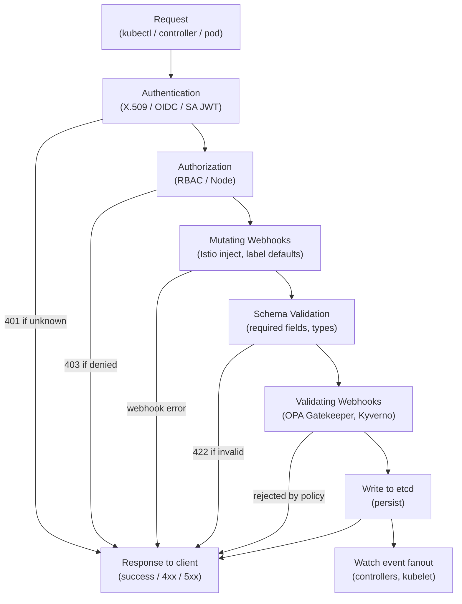

## Keywords in This File

{: .no_toc }

| # | Keyword | Weight |
|---|---------|--------|
| 1 | [API Server, Scheduler, and Controller Manager Internals](#api-server-scheduler-and-controller-manager-internals) | critical |

---

# API Server, Scheduler, and Controller Manager Internals

---

### 🎯 Model Answer

**30 seconds:**
> The Kubernetes control plane is three components: kube-apiserver (the only component
> that writes to etcd, handles all REST operations and enforces policy via admission),
> kube-scheduler (selects a node for unscheduled pods using filter+score pipeline),
> and kube-controller-manager (runs all built-in controllers via reconcile loops that
> compare desired state to actual state). Understanding their internals explains every
> cluster behavior: why pods land on certain nodes, how deployments roll out, and what
> happens during failures.

**3 minutes (Senior):**
> kube-apiserver is the gateway to the cluster. Every kubectl command, every controller
> operation, every pod's API call goes through it. The request pipeline has three phases:
> authentication (who are you? - X.509, OIDC, ServiceAccount JWT), authorization (what
> can you do? - RBAC check), and admission (is this allowed by policy? - mutating then
> validating webhooks). Only after all three phases does the API server write to etcd.
> Admission webhooks are the extensibility point where tools like Istio (sidecar inject),
> OPA Gatekeeper, and Kyverno operate.
>
> kube-scheduler works in two phases: Filter (eliminate nodes that cannot run the pod)
> and Score (rank remaining nodes, highest score wins). Filters include: resource fit
> (does the node have enough CPU/memory?), affinity/anti-affinity rules, taints and
> tolerations, PodTopologySpread. After filtering, scoring plugins rank nodes by
> available resources, zone balance, and image locality. The scheduler is stateless
> and only writes its decision back to the pod's `spec.nodeName` field via the API server.
>
> kube-controller-manager runs all built-in controllers (Deployment, ReplicaSet,
> StatefulSet, Job, Node, ServiceAccount...) as goroutines in a single process. Each
> controller uses the informer framework: list+watch from the API server, maintain an
> in-memory cache, queue reconcile events. The reconcile loop compares desired state
> (from the cache) to actual state (also from the cache) and makes the minimum changes
> needed to converge. This level-triggered design means if a reconcile fails, it's
> retried from the current state - idempotent.

**Framework:** API-SERVER -> SCHEDULER -> CONTROLLER-MANAGER -> INFORMERS -> RECONCILE

*Adapting up:* Admission webhook design (mutating vs validating, webhook configuration,
failure modes), custom scheduler extenders and scheduler plugins, operator framework
(controller-runtime, informers, work queues), leader election for HA control plane.

*Adapting down:* "API server = gateway and validator. Scheduler = decides which node
a pod runs on. Controller manager = watches for changes and takes action to fix them."

**Blank Mind Recovery:**

**(1) Restate:** "Kubernetes control plane internals. kube-apiserver: gateway, admission
chain. kube-scheduler: filter+score to place pods. kube-controller-manager: reconcile
loops driving desired state."

**(2) First principles:** "Kubernetes is a control system. Each component has a single
responsibility: apiserver validates and persists, scheduler places, controllers reconcile.
No component writes to etcd except the apiserver."

**(3) Bridge:** "Apiserver = city planning department (every proposal goes through it,
it checks the rules, then officially records the decision). Scheduler = assignment desk
(here's an unassigned project, which team/node has capacity?). Controllers = operational
teams (real-time: 'actual state doesn't match plan? fix it')."

---

### 📘 Concept Explanation

**kube-apiserver - Request Pipeline:**

Every request follows the same pipeline:
```
Request ->
  Authentication: who are you?
  (X.509 cert, OIDC Bearer token, ServiceAccount JWT)
        |
  Authorization: what can you do?
  (RBAC, Node, ABAC, Webhook modes)
        |
  Admission Control: is this allowed by policy?
    Phase 1 - Mutating webhooks (can modify the object)
    Phase 2 - Object schema validation (required fields, types)
    Phase 3 - Validating webhooks (can reject, cannot modify)
        |
  Persist to etcd (only here does the write happen)
        |
  Return response to client
```

> **Code walkthrough:** This API Server, Scheduler, and Controller Manager Internals example demonstrates a key concept in practice using authentication. **KEY MECHANISM:** the runtime executes these instructions in sequence with specific memory and execution semantics. **WHY IT MATTERS:** misapplying this pattern causes subtle bugs that only manifest under production load. **TAKEAWAY: understand the execution model before using this pattern in production code.**

Why mutating before validating: mutating webhooks (e.g., Istio's sidecar injector)
add fields (the sidecar container). Validating webhooks then check the FINAL object
(including mutations) for policy compliance. This ordering ensures validators see
the full object.

**Admission webhook mechanics:**
```yaml
kind: MutatingWebhookConfiguration
metadata:
  name: sidecar-injector.istio.io
webhooks:
- name: sidecar-injector.istio.io
  clientConfig:
    service:
      name: istiod
      namespace: istio-system
      path: /inject
  rules:
  - operations: [CREATE]
    apiGroups: [""]
    apiVersions: ["v1"]
    resources: ["pods"]
  namespaceSelector:
    matchLabels:
      istio-injection: enabled
  failurePolicy: Fail   # if webhook is down, reject the pod creation
  # Fail = safer but requires high webhook availability
  # Ignore = continue without mutation if webhook unavailable
```

> **Code walkthrough:** This Ignore = continue without mutation if webhook unavailable example demonstrates YAML configuration pattern using SQL. **KEY MECHANISM:** YAML parsers are whitespace-sensitive; indentation errors cause silent value misinterpretation. **WHY IT MATTERS:** unquoted strings starting with special chars (*, &, ?, |) trigger YAML parser errors. **TAKEAWAY: quote strings containing YAML special chars; validate YAML before deploying to production.**

**kube-scheduler - Filter+Score pipeline:**

Filter phase (eliminates nodes):
- `NodeResourcesFit`: node has enough CPU/memory for requests
- `NodeAffinity`: pod's nodeAffinity rules match node labels
- `TaintToleration`: pod tolerates all node taints
- `PodTopologySpread`: spread constraints (not already too many pods in this zone)
- `VolumeBinding`: node has the required PVs available
- `InterPodAffinity`: pod's affinities/anti-affinities satisfied

Score phase (ranks remaining nodes, 0-100 scale):
- `LeastAllocated`: prefer nodes with most free resources
- `NodeAffinity`: preferred affinity rules add points
- `ImageLocality`: node already has the image (avoids image pull)
- `InterPodAffinity`: soft affinities/anti-affinities
- `PodTopologySpread`: balanced spread across zones

The winner: highest total weighted score. Ties broken by random selection.

Scheduler decision: the scheduler writes `pod.spec.nodeName = "worker-3"` via a
`Binding` API call. The kubelet on that node sees the binding via watch and starts the pod.

**kube-controller-manager - Informer Framework:**

Every controller uses the same framework:
1. SharedInformer: a list+watch on a resource type, shared across all controllers
   watching the same resource (one API server connection per resource type, not per controller)
2. Indexer: in-memory cache of all objects (maintained by the informer's event handlers)
3. Work queue: rate-limited queue of (namespace, name) keys to reconcile
4. Reconcile function: reads current state from cache, computes required actions, calls
   API server to effect changes

```plaintext
etcd change -> API server -> watch event -> Informer (updates cache)
                                         -> Event handler adds key to work...
                                         <- Reconcile loop dequeues key
                                            Reads object from cache
                                            Computes desired vs actual
                                            Calls API server to fix divergence
```

> **Code walkthrough:** This Ignore = continue without mutation if webhook unavailable example demonstrates a key concept in practice using SQL. **KEY MECHANISM:** the runtime executes these instructions in sequence with specific memory and execution semantics. **WHY IT MATTERS:** misapplying this pattern causes subtle bugs that only manifest under production load. **TAKEAWAY: understand the execution model before using this pattern in production code.**

Level-triggered: if a reconcile fails, the key is re-queued (with backoff). The next
reconcile reads CURRENT state (not the failed state). This is idempotent: repeated
reconciles converge to the correct state regardless of how many times they run.

**Leader election for HA control plane:**
kube-scheduler and kube-controller-manager run active-active by default? No - only ONE
instance is the active leader. Others are standby.

Leader election uses an etcd-based mechanism (via Kubernetes Lease objects):
```yaml
# The active leader holds this Lease
kind: Lease
metadata:
  name: kube-controller-manager
  namespace: kube-system
spec:
  holderIdentity: "node1"
  leaseDurationSeconds: 15
  renewTime: "2024-01-01T12:00:00Z"
```

> **Code walkthrough:** This The active leader holds this Lease example demonstrates YAML configuration pattern. **KEY MECHANISM:** YAML parsers are whitespace-sensitive; indentation errors cause silent value misinterpretation. **WHY IT MATTERS:** unquoted strings starting with special chars (*, &, ?, |) trigger YAML parser errors. **TAKEAWAY: quote strings containing YAML special chars; validate YAML before deploying to production.**

The active instance renews the Lease every `renewTime`. If it fails to renew within
`leaseDurationSeconds`, the standby instances compete to acquire the Lease. New leader
detected within ~15-30 seconds.

---

### 💻 Code Example

> **Code walkthrough:** Admission webhook implementation, scheduler policy, andice. **KEY MECHANISM:** the runtime executes these instructions in sequence with specific memory and execution semantics. **WHY IT MATTERS:** misapplying this pattern causes subtle bugs that only manifest under production load. **TAKEAWAY: understand the execution model before using this pattern in production code.**
> controller reconcile loop pattern.

```go
// BAD: Controller that reads from API server directly instead of informer cache
// Every reconcile = API server call = etcd read = high load at scale
func (r *MyReconciler) Reconcile(req reconcile.Request) (reconcile.Result, error) {
  obj := &MyType{}
  // BAD: direct API call on every reconcile - 1000 objects = 1000 API calls/second
  if err := r.client.Get(ctx, req.NamespacedName, obj); err != nil {
    // ...
  }
  // ...
}
```

```go
// GOOD: Controller using controller-runtime (informer-backed cache)
// All reads from local in-memory cache - near zero API server load
func (r *MyReconciler) Reconcile(
  ctx context.Context, req ctrl.Request) (ctrl.Result, error) {

  // Read from informer cache (in-memory) - NOT an API call
  obj := &v1alpha1.PaymentProcessor{}
  if err := r.Get(ctx, req.NamespacedName, obj); err != nil {
    if errors.IsNotFound(err) {
      return ctrl.Result{}, nil  // deleted, nothing to do
    }
    return ctrl.Result{}, err
  }

  // Check if we need to reconcile (compare desired vs actual)
  desired := r.buildDeployment(obj)
  existing := &appsv1.Deployment{}
  if err := r.Get(ctx, types.NamespacedName{
    Name: desired.Name, Namespace: desired.Namespace,
  }, existing); err != nil {
    if errors.IsNotFound(err) {
      // Create the deployment
      return ctrl.Result{}, r.Create(ctx, desired)
    }
    return ctrl.Result{}, err
  }

  // Update if spec differs (idempotent: safe to call repeatedly)
  if !reflect.DeepEqual(existing.Spec, desired.Spec) {
    existing.Spec = desired.Spec
    return ctrl.Result{}, r.Update(ctx, existing)
  }

  // Already in desired state, nothing to do
  return ctrl.Result{}, nil
}
```


```go
// BAD: ignoring error
f, _ := os.Open("config.json") // _ discards error
defer f.Close()               // panic if f is nil
```

```go
// GOOD: Admission webhook - mutating webhook for injecting labels
// Receives AdmissionReview, returns patch or rejection

func (h *LabelInjector) Handle(
  ctx context.Context,
  req admission.Request) admission.Response {

  pod := &corev1.Pod{}
  if err := h.decoder.Decode(req, pod); err != nil {
    return admission.Errored(http.StatusBadRequest, err)
  }

  // Mutate: add required labels if missing
  if pod.Labels == nil {
    pod.Labels = make(map[string]string)
  }
  if _, ok := pod.Labels["app.kubernetes.io/managed-by"]; !ok {
    pod.Labels["app.kubernetes.io/managed-by"] = "platform-team"
  }

  // Return JSON patch
  marshaledPod, err := json.Marshal(pod)
  if err != nil {
    return admission.Errored(http.StatusInternalServerError, err)
  }
  return admission.PatchResponseFromRaw(req.Object.Raw, marshaledPod)
}
```

> **Code walkthrough:** The BAD controller calls the API server on every reconcile,
> which at scale creates thousands of API calls per second and saturates the API server.
> The GOOD controller uses controller-runtime's cache-backed client: `r.Get()` reads from
> the local in-memory informer cache. This is the fundamental pattern that makes
> Kubernetes controllers scale to thousands of objects. The reconcile loop is idempotent:
> it checks if the Deployment already exists and matches desired spec. The admission webhook
> shows the mutating pattern: decode the incoming object, modify it, return a JSON patch.
> The key design choice: `failurePolicy` on the webhook configuration. `Fail` means
> if the webhook is unreachable, the admission is rejected. This is safer but requires
> the webhook to be highly available.

---

### 🎓 Answers by Seniority

**Junior / Mid (0-5 years):**
> The control plane has three main components. The API server is the front door: all
> kubectl commands and controller operations go through it. It validates requests, checks
> RBAC, runs admission webhooks, and writes to etcd. The scheduler picks which node a
> pod runs on - it looks at node resources, pod affinity rules, and taints/tolerations.
> The controller manager runs control loops: the Deployment controller watches for
> desired vs actual state and creates or deletes ReplicaSets as needed.

*Push deeper:* What is an admission webhook and why would you use one?

---

**Senior / Staff (5+ years):**
> The critical insight about the control plane: each component is stateless except for
> the API server's dependency on etcd. If the API server pod restarts, it reconnects to
> etcd and serves from its rebuilt cache (re-lists all objects on startup). If the
> scheduler restarts, it rebuilds its internal view of unscheduled pods via watch. If a
> controller restarts, it reconciles all objects (re-lists + re-queues). This stateless
> design means horizontal scaling is simple (run multiple instances with leader election)
> and recovery is fast (just restart). The scheduler's "extender" and "plugin" mechanisms
> allow custom scheduling logic: scheduler plugins are the preferred approach (in-process,
> faster), extender is an HTTP API (out-of-process, more latency). Large organizations
> often add custom score plugins for GPU allocation, spot-instance preference, or workload
> cost optimization.

*Push deeper:* The API server's aggregation layer allows registering custom API groups
(extensions) that are served by the API server but backed by a separate aggregated API
server. This is how Metrics API (metrics.k8s.io) and Custom Metrics API work. The API
server proxies requests to the aggregated server. This is different from CRDs: CRDs are
handled natively by the API server itself (no separate process), while aggregated APIs
run as separate pods.

---

### ⚠️ Common Misconceptions

**Misconception 1: "kube-scheduler reads from etcd to find nodes and pods."**
kube-scheduler never reads from etcd directly. It reads from the API server via the
informer/watch mechanism, which maintains an in-memory cache. No Kubernetes component
(except the API server) talks to etcd directly.

**Misconception 2: "Multiple kube-scheduler instances all schedule pods."**
Only ONE kube-scheduler instance is the active leader. Others are standby. Leader
election via Kubernetes Lease objects ensures only the leader processes scheduling
decisions. If you run multiple schedulers, they don't distribute work - one leads,
others wait.

**Misconception 3: "Validating webhooks can modify the object."**
Validating webhooks can only ALLOW or REJECT. They cannot modify the object. Modifications
(mutations) happen only in mutating webhooks, which run before validating webhooks.
Attempting to modify in a validating webhook is a design error.

**Misconception 4: "Controller reconcile loops hold state between runs."**
Controllers are level-triggered: each reconcile reads CURRENT state from the informer
cache and computes the required actions from scratch. There is no "previous state"
variable. If a reconcile fails and is retried, the retry re-reads current state.
This is intentional: it makes controllers resilient to missed events and concurrent
modifications.

---

### 🚨 Failure Modes and Diagnosis

**Failure 1: Pods stuck in Pending - scheduler not functioning**

Symptom: new pods remain in Pending indefinitely; `kubectl describe pod` shows no
scheduling events; no "Successfully assigned" message.

Cause: kube-scheduler is down, has no leader, or is experiencing errors.

Diagnostic:
`kubectl get pods -n kube-system | grep kube-scheduler` - is it Running?
`kubectl logs -n kube-system kube-scheduler-<node>` - any errors?
`kubectl get lease -n kube-system kube-scheduler` - when was it last renewed?
`kubectl describe pod <pending-pod>` - look at Events section for scheduler errors.

Common sub-causes: no schedulable nodes (all tainted, all resource-exhausted),
admission webhook blocking pod creation, PVC that can't be bound.

Fix: check each sub-cause in order: scheduler health -> node resources
(`kubectl top nodes`) -> taints (`kubectl get nodes -o custom-columns=NAME:.metadata.name,TAINTS:.spec.taints`)
-> admission webhooks.

**Failure 2: Webhook timeout causing pod creation failures**

Symptom: `kubectl apply` returns "context deadline exceeded" or "failed calling webhook";
new pod/deployment creations fail; existing pods unaffected.

Cause: admission webhook (mutating or validating) is slow or unreachable.
The API server has a timeout per webhook invocation (default 10-30 seconds).

Diagnostic:
`kubectl get validatingwebhookconfigurations,mutatingwebhookconfigurations`
Identify which webhook is configured. Check the webhook pod's health.
`kubectl logs -n <webhook-namespace> <webhook-pod>` - processing errors?

Fix: scale up the webhook pod. Check if the webhook is CPU/memory constrained.
If webhook is non-critical: change `failurePolicy` to `Ignore` temporarily.
If webhook is unavailable: delete the WebhookConfiguration to unblock new pod creation.

**Failure 3: Controller manager reconcile storm after restart**

Symptom: after kube-controller-manager restart, high API server load; many
controller-induced creates/updates/deletes; temporary cluster instability.

Cause: on startup, controllers re-list all objects and queue all for reconcile.
With many objects, this creates a reconcile storm: all objects reconciled simultaneously.

Diagnostic: `kubectl top pod -n kube-system kube-controller-manager-<node>` - high CPU.
API server metrics: `apiserver_request_total` rate spikes immediately after restart.

Mitigation: controllers use rate-limited work queues. Default: 10 reconciles/second.
For large clusters, increase `--concurrent-<controller>-syncs` flags to parallelize
but also spread the storm.

---

### 🎯 Interview Deep-Dive

| Question Category | Time to Answer |
|---|---|
| Conceptual | 1-2 minutes |
| Mechanism | 2-3 minutes |
| Debugging | 2-3 minutes |
| Trade-off | 2-3 minutes |
| Architecture | 3-4 minutes |
| Advanced | 2-3 minutes |
| Hands-on | 2-3 minutes |
| System Design | 3-5 minutes |
| Security | 2-3 minutes |
| Production | 2-3 minutes |
| Behavioral | 2-3 minutes |
| Comparison | 2-3 minutes |

---

**Q1 [MID] (CONCEPTUAL): What is the API server's role and why does everything go through it?**

A: kube-apiserver is the single entry point and the only writer to etcd. This centralization
is a deliberate design choice that provides several properties:

Single source of truth: all writes go through the API server, which means RBAC is
enforced once (not per-component), admission policies are applied once, and all
changes are recorded in etcd atomically.

Validation: the API server validates that all objects conform to their schema (required
fields, type constraints, enum values) before accepting them. Invalid objects are rejected
at the API server, not discovered later by controllers.

Authentication and authorization: every request is authenticated (who are you?) and
authorized (can you do this?) at the API server. No component needs to implement
its own auth.

Watch hub: the API server acts as a fan-out for etcd watch events. When etcd notifies
the API server of a change, the API server fans it out to all watching clients
(controllers, kubelet, kubectl watch). Without this, all controllers would establish
their own watches directly to etcd, potentially overwhelming it.

No direct etcd access: controllers, kubelet, and kubectl all use the API server's REST
interface. Only the API server talks to etcd. This means etcd's access control is simple
(only allow API server connections) and etcd's load is predictable.

*What separates good from great:* The API server's in-memory watch cache means most
reads (from controllers using informers) are served from RAM, not etcd. etcd only
receives writes and the initial list requests. This is the fundamental reason large
Kubernetes clusters remain performant: most read traffic is served by the API server's
in-memory cache, not by etcd.

---

**Q2 [SENIOR] (MECHANISM): Walk through what happens when you run `kubectl apply -f deployment.yaml`.**

A: A complete request lifecycle for a Deployment apply:

Phase 1 - Transport: kubectl reads your kubeconfig, extracts the server URL and token.
Sends HTTP PATCH (for apply) or POST (for create) to the API server.

Phase 2 - Authentication: API server checks the Bearer token or client certificate.
`Bearer token` -> checked against OIDC provider or ServiceAccount token validator.
`Client cert` -> validated against cluster CA. On success: establishes identity.

Phase 3 - Authorization: RBAC check. Can this identity perform `create/update deployments`
in this namespace? If no: 403 Forbidden returned immediately.

Phase 4 - Admission control:
- Mutating webhooks are called (in order): each can add/modify the object.
  Example: Istio's webhook adds `istio-proxy` container.
- Object defaulting: API server fills default values (strategy.type: RollingUpdate, etc.)
- Schema validation: API server validates required fields, type constraints.
- Validating webhooks: each can approve or reject. OPA Gatekeeper checks if the
  Deployment violates any policy (resource limits required? replica count reasonable?).

Phase 5 - etcd write: object stored at `/registry/deployments/namespace/name`.
The write includes the resource version (etcd revision).

Phase 6 - Watch delivery: etcd notifies the API server. API server delivers watch
events to all watching clients: Deployment controller, HPA controller, and others.

Phase 7 - Deployment controller reconcile: receives watch event. Compares desired
Deployment spec to existing ReplicaSets. Creates or updates ReplicaSet to match.

Phase 8 - ReplicaSet controller reconcile: creates Pod objects (writes to API server ->
etcd) for desired replicas.

Phase 9 - Scheduler: sees unscheduled Pods. Runs filter+score. Writes `spec.nodeName`.

Phase 10 - kubelet: watch event on Pods assigned to its node. Pulls images, creates
containers via CRI. Updates pod status.

Entire path from kubectl apply to container running: typically 2-10 seconds for a cached image.

*What separates good from great:* Every component in this chain is asynchronous and
decoupled. The API server returns after Phase 5 (the write to etcd). Phases 6-10 happen
asynchronously. `kubectl apply` returning "deployment.apps/my-app configured" does NOT
mean pods are running. This is why you need `kubectl rollout status deployment/my-app`
to wait for the controller reconciliation to complete.

---

**Q3 [SENIOR] (MECHANISM): How does the kube-scheduler decide which node to assign a pod?**

A: The scheduler uses a two-phase pipeline: filter then score.

Filtering phase - eliminate ineligible nodes:
The scheduler evaluates each node against all filter plugins. A node passes only if ALL
filters pass:

1. NodeResourcesFit: does the node have enough allocatable CPU and memory for the pod's
   requests? (not usage - requests)
2. TaintToleration: the pod must tolerate all NoSchedule/NoExecute taints on the node.
3. NodeAffinity: if the pod has required nodeAffinity (`requiredDuringSchedulingIgnoredDuringExecution`),
   the node must match the label selector.
4. PodTopologySpread: if the pod has topologySpreadConstraints with `whenUnsatisfiable:
   DoNotSchedule`, check that placing the pod here doesn't violate the maxSkew.
5. VolumeBinding: if the pod requires PVs, check that the node is in the right zone
   for the PVs.
6. InterPodAffinity: required pod affinity/anti-affinity rules must be satisfied.

After filtering: if 0 nodes remain -> pod stays Pending. If multiple nodes pass -> scoring.

Scoring phase - rank eligible nodes:
Each scoring plugin gives each node a 0-100 score. Plugins are weighted.
Final score = sum of (plugin_score * plugin_weight) across all plugins.

Key scoring plugins:
- `LeastAllocated`: nodes with more free resources score higher
- `ImageLocality`: node already has the container image (avoids pull delay)
- `PodTopologySpread`: soft spread constraints
- `InterPodAffinity`: preferred anti-affinity reduces score for nodes with conflicting pods

Highest total score wins. Ties broken randomly (for even distribution).

Binding: scheduler writes a `Binding` object (`pod.spec.nodeName = "selected-node"`)
via the API server. kubelet on that node sees the binding, pulls images, starts containers.

*What separates good from great:* The scheduler is pre-filtering in real implementations.
With 5,000 nodes, evaluating every filter plugin on every node for every pod would be
O(n*m) where n=nodes and m=pods. The scheduler uses a "feasible nodes percentage" heuristic:
for large clusters, it stops filtering once it has `max(5%, minFeasibleNodesToFind=100)`
feasible nodes. It doesn't try all 5,000 nodes for every pod. This is a deliberate
trade-off: slightly suboptimal placement in exchange for practical scheduling performance.

---

**Q4 [STAFF] (ARCHITECTURE): Explain the informer framework used by Kubernetes controllers.**

A: The informer framework is the architectural pattern that makes all Kubernetes controllers
work efficiently. Understanding it explains how controllers achieve reactive behavior
at scale without overwhelming the API server.

Component 1 - ListWatch: an HTTP connection to the API server that performs an initial
List (get all current objects) followed by a long-running Watch (stream of change events).
The Watch is a persistent HTTP/2 or HTTP/1.1 chunked connection. The API server sends
events on this stream whenever any matching object changes.

Component 2 - Informer (SharedInformer): wraps a ListWatch. On start: lists all objects,
populates the cache, starts the watch. Handles reconnects transparently. Multiple
controllers watching the same resource type SHARE one informer (one connection to API
server per resource type, not per controller).

Component 3 - Indexer (ThreadSafeStore): in-memory cache of all objects, maintained by
the informer's event handlers. Supports indexing for fast lookups (find all pods by label,
find all pods on a specific node).

Component 4 - Work queue (rate-limited queue): when an informer event fires (ADD/UPDATE/DELETE),
an event handler adds the object's key (namespace/name) to the work queue. The queue
deduplicates: if key X is queued twice before being processed, it's processed once.
The queue rate-limits to prevent thundering herd on restart.

Component 5 - Reconcile loop: a goroutine that dequeues keys and calls the reconcile
function. Reconcile reads the current state from the Indexer (in-memory, not API server),
computes required changes, and calls the API server for mutations.

Why this design is efficient:
- Watches deliver events in real-time (milliseconds from etcd commit to controller)
- All reads are from in-memory cache (zero API server load for reads)
- Rate-limited queues prevent cascading failures
- Deduplication ensures one reconcile per object change, not one per event

*What separates good from great:* The SharedInformer's `AddEventHandlerWithResyncPeriod`
method adds a periodic full resync: every N minutes, all objects are re-queued for
reconcile regardless of changes. This is a safety net for any events missed due to bugs
or race conditions. Without it, a bug that causes missed events would leave objects
diverged permanently. With it, worst case is N minutes of divergence. Production
controllers use a 10-30 minute resync period.

---

**Q5 [SENIOR] (DEBUGGING): A Deployment is not rolling out after `kubectl apply`. Debug.**

A: The rollout involves three controllers (Deployment -> ReplicaSet -> Pods) and
the scheduler. Debugging means checking each layer.

Step 1: check the Deployment status.
```bash
kubectl rollout status deployment/my-app -n team-a
# "Waiting for deployment to finish: 1 of 3 updated pods are available"
kubectl describe deployment my-app -n team-a
# Look at: Events, Conditions, and Replicas count
```

> **Code walkthrough:** This Look at: Events, Conditions, and Replicas count example demonstrates shell script pattern using SQL. **KEY MECHANISM:** the shell executes commands sequentially; pipes pass stdout of one command to stdin of the next. **WHY IT MATTERS:** unquoted variables with spaces cause word splitting - IFS splits the value into multiple arguments. **TAKEAWAY: always double-quote variables: "$VAR"; use [[ ]] instead of [ ] for safer conditionals.**

Step 2: check the ReplicaSet created by the Deployment controller.
```bash
kubectl get rs -n team-a -l app=my-app
# Is a NEW ReplicaSet created? If not: Deployment controller issue
kubectl describe rs <new-rs-name> -n team-a
# Events: was it unable to create Pods?
```

> **Code walkthrough:** This Events: was it unable to create Pods? example demonstrates shell script pattern using container. **KEY MECHANISM:** the shell executes commands sequentially; pipes pass stdout of one command to stdin of the next. **WHY IT MATTERS:** unquoted variables with spaces cause word splitting - IFS splits the value into multiple arguments. **TAKEAWAY: always double-quote variables: "$VAR"; use [[ ]] instead of [ ] for safer conditionals.**

Step 3: check the Pods.
```bash
kubectl get pods -n team-a -l app=my-app
# Status: Pending / ContainerCreating / CrashLoopBackOff / ImagePullBackOff?
kubectl describe pod <new-pod> -n team-a
# Events: why is it Pending? Insufficient resources? Admission rejected?
```

> **Code walkthrough:** This Events: why is it Pending? Insufficient resources? Admission rejected? example demonstrates shell script pattern using container. **KEY MECHANISM:** the shell executes commands sequentially; pipes pass stdout of one command to stdin of the next. **WHY IT MATTERS:** unquoted variables with spaces cause word splitting - IFS splits the value into multiple arguments. **TAKEAWAY: always double-quote variables: "$VAR"; use [[ ]] instead of [ ] for safer conditionals.**

Common causes by pod status:
- Pending: no schedulable nodes (resources, taints, affinity), PVC not bound
- ImagePullBackOff: wrong image name, missing imagePullSecret, registry unavailable
- CrashLoopBackOff: application error; `kubectl logs <pod>` for details
- ContainerCreating: pulling large image, or CSI volume mount slow
- Admission rejected: check API server events or admission webhook logs

Step 4: check Deployment controller logs if no ReplicaSet was created.
```bash
kubectl logs -n kube-system kube-controller-manager-<node> | grep -i "my-app"
```

> **Code walkthrough:** This Events: why is it Pending? Insufficient resources? Admission rejected? example demonstrates shell script pattern. **KEY MECHANISM:** the shell executes commands sequentially; pipes pass stdout of one command to stdin of the next. **WHY IT MATTERS:** unquoted variables with spaces cause word splitting - IFS splits the value into multiple arguments. **TAKEAWAY: always double-quote variables: "$VAR"; use [[ ]] instead of [ ] for safer conditionals.**

Step 5: check admission webhooks (if pod creation is rejected immediately).
`kubectl describe pod <pod>` -> Events: "admission webhook denied"

*What separates good from great:* `kubectl rollout status --timeout=5m` exits non-zero
if the rollout doesn't complete in time. Use this in CI/CD pipelines to detect failed
rollouts automatically. Don't rely on `kubectl apply` exit code - it only confirms the
manifest was accepted (wrote to etcd), not that the rollout completed.

---

**Q6 [STAFF] (TRADE-OFF): When do you use a Mutating webhook vs a Validating webhook?**

A: Mutating and validating webhooks serve different purposes and have different safety profiles.

Mutating webhooks: modify the incoming object before it's stored.
Use for:
- Sidecar injection: Istio, Linkerd inject proxy containers automatically
- Default value injection: add required labels, resource limits when missing
- Security hardening: automatically add `runAsNonRoot: true`, `seccompProfile` to pods
- Namespace injection: add namespace-specific annotations

Risk: mutations are invisible to the user. A developer applies a Deployment, gets a
"configured" response, but the actual stored object has extra containers or modified
fields. This can cause confusion ("I didn't add that sidecar") and debugging difficulty.
Always: document what mutations apply in which namespaces.

Validating webhooks: approve or reject the object based on policy.
Use for:
- Policy enforcement: "all Deployments must have resource limits" (OPA Gatekeeper)
- Naming conventions: "Service names must follow the pattern"
- Security gates: "no privileged containers in production namespace"
- Business rules: "PVC size must not exceed 100GB for team namespaces"

Risk: a validating webhook that's too strict blocks legitimate operations. If the webhook
is down with `failurePolicy: Fail`, all new pod creations fail cluster-wide.

Combined pattern: Kyverno uses mutating webhooks to add missing defaults (mutation first)
and validating webhooks to reject remaining violations (after mutations are applied).
This is more user-friendly: the user sees mutations as "compliant defaults applied"
rather than rejection errors.

*What separates good from great:* Webhook `failurePolicy` is the most important operational
decision. `Fail` is safer (policy enforcement can't be bypassed by webhook downtime) but
creates a dependency: your cluster's ability to create pods depends on your admission
webhook being available. For production: run webhook deployments with at minimum 2
replicas, PodDisruptionBudget, and readiness probes. Or use `Ignore` for non-security-critical
webhooks and accept that they may miss mutations/validations during webhook downtime.

---

**Q7 [SENIOR] (HANDS-ON): How do you implement a custom scheduler plugin?**

A: Custom scheduling logic is implemented via scheduler framework plugins, which are
in-process (vs old extender approach that was HTTP-based).

Scheduler framework plugin points:
```go
// A plugin implements one or more extension points
// Example: custom scoring based on node "cost" label

type CostPlugin struct {
  handle framework.Handle
}

func (p *CostPlugin) Name() string { return "CostAwarePlugin" }

// Score phase: give lower scores to expensive nodes
func (p *CostPlugin) Score(
  ctx context.Context,
  state *framework.CycleState,
  pod *v1.Pod,
  nodeName string) (int64, *framework.Status) {

  nodeInfo, err := p.handle.SnapshotSharedLister().
    NodeInfos().Get(nodeName)
  if err != nil {
    return 0, framework.AsStatus(err)
  }

  // Read cost label (lower cost = higher score)
  costStr := nodeInfo.Node().Labels["node.example.com/hourly-cost"]
  cost, _ := strconv.ParseFloat(costStr, 64)
  // Normalize 0-100: cost $0.10/hr -> score 90, $1.00/hr -> score 10
  score := int64(100 - (cost * 100))
  if score < 0 { score = 0 }
  return score, nil
}
```

> **Code walkthrough:** This Events: why is it Pending? Insufficient resources? Admission rejected? example demonstrates Go pattern using container. **KEY MECHANISM:** the Go runtime uses a work-stealing scheduler across GOMAXPROCS OS threads. **WHY IT MATTERS:** data races crash with -race flag; concurrent map access panics without sync.Map or mutex. **TAKEAWAY: run go test -race on all packages; use sync primitives for any shared mutable state.**

To use: build as a Go plugin (or as a custom scheduler binary). Configure via
KubeSchedulerConfiguration:
```yaml
profiles:
- schedulerName: default-scheduler
  plugins:
    score:
      enabled:
      - name: CostAwarePlugin
        weight: 100
```

> **Code walkthrough:** This Events: why is it Pending? Insufficient resources? Admission rejected? example demonstrates YAML configuration pattern. **KEY MECHANISM:** YAML parsers are whitespace-sensitive; indentation errors cause silent value misinterpretation. **WHY IT MATTERS:** unquoted strings starting with special chars (*, &, ?, |) trigger YAML parser errors. **TAKEAWAY: quote strings containing YAML special chars; validate YAML before deploying to production.**

*What separates good from great:* The Filter plugin point is the most powerful for
custom logic: it can block a node based on arbitrary criteria (license availability,
GPU type, compliance zone). However, Filter plugins run for EVERY node for EVERY pod.
Performance matters: a Filter plugin that makes a network call or database query will
catastrophically slow scheduling. All Filter plugins should read from the informer cache
(populated via `Handle.SnapshotSharedLister()`), never from external systems.

---

**Q8 [STAFF] (ADVANCED): Explain the API server's admission webhook failure modes and mitigations.**

A: Admission webhooks are required dependencies for certain operations. Their failure
modes directly impact cluster operability.

Failure Mode 1 - Webhook Pod is Down:
If `failurePolicy: Fail`: ALL operations that match the webhook's rules fail.
For a pod creation webhook: no new pods can be created anywhere.
This includes system pods in kube-system (if the webhook matches kube-system).

Mitigation:
- Use `namespaceSelector` to exclude kube-system:
  ```yaml
  namespaceSelector:
    matchExpressions:
    - key: kubernetes.io/metadata.name
      operator: NotIn
      values: [kube-system, kube-public, cert-manager]
  ```
> **Code walkthrough:** This Events: why is it Pending? Insufficient resources? Admission rejected? example demonstrates YAML configuration pattern using SQL. **KEY MECHANISM:** YAML parsers are whitespace-sensitive; indentation errors cause silent value misinterpretation. **WHY IT MATTERS:** unquoted strings starting with special chars (*, &, ?, |) trigger YAML parser errors. **TAKEAWAY: quote strings containing YAML special chars; validate YAML before deploying to production.**

- Run webhook deployments with >= 2 replicas, anti-affinity rules
- Use PodDisruptionBudget: `minAvailable: 1`

Failure Mode 2 - Webhook Times Out:
The API server has a per-webhook timeout (default 10s, configurable via `timeoutSeconds`).
If the webhook doesn't respond in time: `failurePolicy` determines behavior.

Cause: webhook is overloaded, or the webhook needs to call an external service (slow DB
query, external policy engine).

Mitigation: keep webhooks fast (< 100ms). Cache external lookups. Never make external
API calls in the hot path.

Failure Mode 3 - Certificate Expiry:
Webhook servers use TLS. If the serving certificate expires, the API server rejects the
TLS handshake. All webhook calls fail (same as "webhook is down").

Mitigation: use cert-manager to automatically rotate webhook certificates. Set certificate
expiry alerts (90 days before expiry).

Failure Mode 4 - Webhook Creating Objects That Trigger Itself:
A webhook watching pod creation that creates pods = infinite loop.
The webhook operator creates a pod to handle the webhook request, which triggers the webhook...

Mitigation: use `objectSelector` or `namespaceSelector` to exclude the webhook's own namespace.

*What separates good from great:* The "safeguard against kube-system lockout" is the most
critical design rule for admission webhooks. Any webhook that matches kube-system pods
with `failurePolicy: Fail` can prevent system components from restarting after failures.
If kube-dns or kube-proxy can't be recreated because a webhook is down, the entire cluster
degrades. Always exclude system namespaces from admission webhooks.

---

**Q9 [STAFF] (PRODUCTION): How do you investigate high API server latency?**

A: API server latency impacts every component: controllers, kubelets, CI/CD. Diagnosis
layers from user-visible to root cause.

Layer 1 - Confirm and quantify:
Prometheus: `apiserver_request_duration_seconds_bucket{verb="LIST",resource="pods"}`
P99 latency by verb and resource. Which resource types are slow?
P99 > 1 second for GET/PATCH: significant; > 10 seconds: severe.

Layer 2 - Identify the slow path:
```bash
# API server audit log for slow requests:
kubectl logs -n kube-system kube-apiserver-<node> | \
  grep "slow request" | head -20
# Output: "slow request" with requestURI, verb, duration

# Check etcd backend commit latency:
etcdctl endpoint status --write-out=json | \
  jq '.[0].dbSize'
# Also: Prometheus etcd_disk_backend_commit_duration_seconds
```

> **Code walkthrough:** This Also: Prometheus etcd_disk_backend_commit_duration_seconds example demonstrates shell script pattern. **KEY MECHANISM:** the shell executes commands sequentially; pipes pass stdout of one command to stdin of the next. **WHY IT MATTERS:** unquoted variables with spaces cause word splitting - IFS splits the value into multiple arguments. **TAKEAWAY: always double-quote variables: "$VAR"; use [[ ]] instead of [ ] for safer conditionals.**

Layer 3 - Root cause categories:

A. etcd slow: high WAL fsync latency -> disk I/O issue on etcd nodes.
Fix: isolate etcd to dedicated SSDs; move event storage to separate etcd cluster.

B. Expensive LIST operations: `kubectl get pods --all-namespaces` with large clusters
causes large etcd reads and high API server CPU for serialization.
Fix: use label selectors to narrow lists; paginate (`--chunk-size=500`); use watch
instead of repeated list.

C. Admission webhook latency: admission webhooks add to every write operation's latency.
Prometheus: `admission_webhook_admission_latencies_seconds` per webhook.
Fix: profile slow webhooks; cache external lookups; reduce webhook scope.

D. API server overloaded (CPU/memory): rate limiting kicking in.
`apiserver_dropped_requests_total` - requests being rate-limited.
`process_resident_memory_bytes` for API server pod - is it near limit?
Fix: increase API server resource limits; increase replica count for HA API server.

E. Large object serialization: some objects (ConfigMaps, Secrets, CRD instances)
are very large. Repeated serialization is CPU-intensive.
Fix: split large ConfigMaps; reduce frequency of large object updates.

*What separates good from great:* The LIST vs WATCH pattern is the most impactful
optimization. Controllers that poll (list every N seconds) instead of watch generate
continuous expensive LIST operations. Each LIST scans etcd. Replacing polling with
informer watches eliminates this class of load entirely. If you see high API server
latency with many LIST operations: audit which clients are polling and migrate them to watches.

---

**Q10 [STAFF] (SECURITY): How do you harden the kube-apiserver?**

A: API server hardening focuses on reducing attack surface, enforcing authentication
strength, and preventing privilege escalation.

Authentication hardening:
1. Disable anonymous authentication: `--anonymous-auth=false`
   (prevents unauthenticated API access on the anonymous user)
2. Require strong authentication: disable BasicAuth and static token files
   (deprecated, credentials stored in plaintext files)
3. OIDC integration: use `--oidc-issuer-url`, `--oidc-client-id` for external IdP
   (Okta, Dex, Google). Short-lived tokens (1 hour).
4. Client certificate rotation: kubelets use client certificates; rotate before expiry.

Authorization hardening:
1. Enable RBAC (always enabled by default in modern K8s): `--authorization-mode=Node,RBAC`
2. Enable Node authorization: `--authorization-mode=Node,RBAC` (Node authorizer restricts
   what kubelets can do - they can only access their own pods' secrets)
3. Audit logging: `--audit-log-path`, `--audit-policy-file` - log all API operations
   for security analysis

Admission hardening:
1. Enable admission plugins: `--enable-admission-plugins=NodeRestriction,PodSecurity`
2. PodSecurity: enforce PSA at API server level (namespace labels)
3. NodeRestriction: prevents kubelets from modifying objects they don't own

Network hardening:
1. Restrict API server network exposure: put API server behind private load balancer
2. CIDR restrict access: `--allow-privileged` should be false for non-system workloads
3. etcd connection uses TLS with client certificates (not just server cert)
4. Rotate API server's own certificates: TLS cert for HTTPS, etcd client cert

*What separates good from great:* Audit log analysis is the highest-signal security
practice. Configure the audit policy to log all writes (create/update/delete/patch)
at the Metadata level (request info, no request body) and sensitive reads (get secrets,
exec, portforward) at the Request level (includes request body). Ship audit logs to
a SIEM. Alert on: `kubectl exec` to production pods by non-authorized users, secret
reads from unexpected service accounts, cluster-admin binding changes.

---

**Q11 [STAFF] (ADVANCED): How does leader election work for the controller manager and scheduler?**

A: In an HA control plane (3 control plane nodes), each runs a kube-scheduler and
kube-controller-manager pod. But only ONE instance should be the active leader.
Multiple concurrent schedulers would conflict (same pod assigned to multiple nodes).

Mechanism: Kubernetes Lease objects (since K8s 1.14, GA in 1.20).

The Lease:
```yaml
kind: Lease
metadata:
  name: kube-controller-manager
  namespace: kube-system
spec:
  holderIdentity: "node1_<uid>"     # unique ID of the current leader
  leaseDurationSeconds: 15           # how long the lease is valid
  acquireTime: "2024-01-01T12:00:00Z"
  renewTime: "2024-01-01T12:00:10Z"  # updated every renewDeadline interval
  leaderTransitions: 3               # how many times leadership has changed
```

> **Code walkthrough:** This Also: Prometheus etcd_disk_backend_commit_duration_seconds example demonstrates YAML configuration pattern using SQL. **KEY MECHANISM:** YAML parsers are whitespace-sensitive; indentation errors cause silent value misinterpretation. **WHY IT MATTERS:** unquoted strings starting with special chars (*, &, ?, |) trigger YAML parser errors. **TAKEAWAY: quote strings containing YAML special chars; validate YAML before deploying to production.**

Active leader behavior:
- Acquires the Lease (writes its identity) on startup
- Renews the Lease every `renewDeadline` (default: 10 seconds)
- Performs all controller/scheduling work

Standby behavior:
- Periodically checks if the current holder's Lease is expired
- Lease is "expired" if `renewTime` > `leaseDurationSeconds` ago (15 seconds)
- If expired: attempts to acquire (compare-and-swap: update Lease only if current holder
  matches expired identity)
- Multiple standby instances race to acquire; one wins (CAS prevents double-acquisition)

Failover timeline:
1. Active leader crashes at T=0
2. Lease was last renewed at T=-5s
3. Lease expires at T=10s (15s leaseDuration - 5s already elapsed)
4. Standby instances detect expiry at T=10-15s (polling interval)
5. New leader acquired at T=10-15s
6. New leader begins processing events from informer cache

Typical failover: 10-30 seconds. During this window, no new reconciliation or scheduling.
Existing pods keep running; no cluster crash.

*What separates good from great:* The `--leader-elect-lease-duration` (15s), `--leader-elect-renew-deadline` (10s), and `--leader-elect-retry-period` (2s) flags tune the failover speed vs stability tradeoff. Shorter durations: faster failover but more susceptible to false positives (transient network blip causes unnecessary leader change). Longer durations: more stable but slower failover. Default 15s/10s/2s is well-tested. Tuning is rarely necessary unless you have extremely latency-sensitive control plane requirements.

---

**Q12 [STAFF] (BEHAVIORAL): Describe a time you diagnosed a Kubernetes control plane issue
that wasn't obvious.**

A (STAR format):

Situation: production cluster (2,000 nodes) started experiencing intermittent pod
scheduling delays. New pods were staying in Pending for 5-10 minutes instead of the
normal 5-10 seconds. The issue was not constant - it appeared for 30-minute windows,
then resolved. No alerts fired because the P99 latency remained below our threshold
over 5-minute windows.

Task: diagnose the root cause of intermittent scheduling delays without a consistent
repro and with no obvious error messages.

Action:
Investigation approach (2 hours):
First, eliminated obvious causes: kube-scheduler was running and healthy, no nodes were
all-tainted or resource-exhausted, no admission webhooks were erroring.

Key observation: delays correlated with our Helm release pipelines. CI/CD deployed ~50
Helm charts in parallel every 30 minutes. Each Helm release creates 5-20 Kubernetes
objects.

Hypothesis: scheduling delay was caused by scheduler informer cache falling behind during
high write volumes.

Verification: looked at kube-scheduler metrics. Found:
`scheduler_pending_pods{queue="activeQ"}` - spiked to 500+ during batch deployments.
`scheduler_framework_extension_point_duration_seconds{extension_point="Filter"}` - 
P99 filter duration was 15ms per node, and we had 2000 nodes.
Per-pod scheduling time = 2000 nodes x 15ms filter = 30 seconds per pod scheduled.

Root cause: a custom Filter plugin we had written for "GPU type matching" was
querying an external HTTP endpoint to get GPU metadata per node. During batch deployments,
this plugin was called 2000 times (once per node) per pod, with each call taking 15ms.
50 pods needing scheduling = 50 x 2000 x 15ms = 25 minutes of sequential filter calls.

The plugin author assumed it would only be called for GPU workloads (which was rare).
But the plugin ran for ALL pods due to a missing early-exit check.

Fix: added `if !podNeedsGPU(pod) { return nil }` at the start of the Filter function.
For non-GPU pods (95% of workloads): zero external calls. Scheduling delay dropped
from 5-10 minutes to < 5 seconds immediately.

Long-term: added `scheduler_framework_extension_point_duration_seconds` to our
alerting, migrated GPU metadata to node labels (eliminates external call entirely).

*What separates good from great:* The critical diagnostic insight was correlating
scheduling delays with batch deploy windows - not just looking at "is scheduler up?".
Scheduler performance issues are often hidden in average metrics. P99 per-pod scheduling
latency is the right metric. Prometheus `scheduler_e2e_scheduling_duration_seconds`
gives end-to-end scheduling time per pod. If P99 > 10 seconds: scheduling is the bottleneck.

---

### ⚖️ Comparison Table

| Control Plane Component | Role | Active Instances | Data Source | Writes to |
|---|---|---|---|---|
| kube-apiserver | Gateway, validation, auth | Multiple (all active) | etcd | etcd |
| kube-scheduler | Pod placement | 1 leader + N standby | API server cache | API server (pod binding) |
| kube-controller-manager | Reconcile desired state | 1 leader + N standby | API server cache | API server (object CRUD) |
| etcd | Persistent storage | 3-5 (Raft quorum) | Disk (WAL) | Disk (WAL) |
| kubelet | Node-level pod lifecycle | 1 per node (always active) | API server | API server (pod status) |

---

### 🏛️ System Design

**HA Control Plane for 1,000-Node Production Kubernetes Cluster**

Requirements: 3-AZ HA, API server must survive single node failure, control plane
failover < 30 seconds, audit logging enabled, zero-downtime API server upgrades.

Architecture:

```
           AZ1              AZ2              AZ3
    +--------------+  +--------------+  +--------------+
    | kube-apiserver|  | kube-apiserver|  | kube-apiserver|
    | kube-scheduler|  | kube-scheduler|  | kube-scheduler|
    | kube-ctrl-mgr|  | kube-ctrl-mgr|  | kube-ctrl-mgr|
    |   etcd-1     |  |   etcd-2     |  |   etcd-3     |
    +--------------+  +--------------+  +--------------+
            |                |                |
       Network Load Balancer (NLB)
       api.cluster.example.com (private)
            |
     Worker Nodes (communicate with NLB)
```

> **Code walkthrough:** This Unknown example demonstrates a key concept in practice. **KEY MECHANISM:** the runtime executes these instructions in sequence with specific memory and execution semantics. **WHY IT MATTERS:** misapplying this pattern causes subtle bugs that only manifest under production load. **TAKEAWAY: understand the execution model before using this pattern in production code.**

kube-apiserver configuration:
- 3 instances (one per AZ on control plane nodes)
- ALL instances are active (API servers are stateless, all serve traffic)
- NLB health checks: TCP port 6443. Unhealthy instance removed automatically
- Resources: 8 vCPU, 32GB RAM per instance (large cache for 1000 nodes)
- Rate limiting: `--max-requests-inflight=1200`, `--max-mutating-requests-inflig
- Audit: `--audit-log-path=/var/log/kubernetes/audit.log --audit-policy-file=/et
- etcd endpoints: all 3 etcd members specified (client-side load balancing)

kube-scheduler:
- 3 instances (one per AZ), leader election enabled (1 active, 2 standby)
- Lease duration 15s: failover < 30 seconds
- Resources: 2 vCPU, 8GB RAM

kube-controller-manager:
- 3 instances (one per AZ), leader election enabled
- Concurrent syncs tuned: `--concurrent-deployment-syncs=10`,
  `--concurrent-replicaset-syncs=10` (for 1000 nodes, higher parallelism)

Zero-downtime upgrade strategy:
1. Pre-upgrade: check RBAC API compatibility, addon compatibility
2. Upgrade API servers one at a time (not all simultaneously)
   - Drain: remove from NLB by scaling the LB target group
   - Upgrade: `kubeadm upgrade` on control plane node
   - Re-add: health check passes, NLB routes to upgraded instance
   - Clients reconnect automatically (kubeconfig targets NLB)
3. Upgrade controller manager and scheduler (automatic leader re-election)
4. Upgrade worker nodes (drain -> upgrade -> uncordon, rolling)

Admission webhook reliability:
- All critical webhooks (PSA enforcement, Gatekeeper): 3 replicas minimum, anti-
- `failurePolicy: Fail` for security-critical; `Ignore` for non-critical
- Webhooks exclude kube-system via namespaceSelector
- Certificate rotation via cert-manager (auto-rotation 30 days before expiry)

*What separates good from great:* API server resource sizing is frequently under
At 1000 nodes with 10 pods each, the API server's in-memory cache holds 10,000+ 
thousands of configmaps/secrets, and serves thousands of watch streams. 32GB RAM per API
server instance is the floor for this scale. Running API servers at OOMKilled risk means
the control plane fails when it's most needed (peak load, incident response). Use actual
memory metrics to right-size, not guesswork.

---

### 📊 Diagram

```
API server request pipeline:

  kubectl / controller / pod
        |
   [Authentication]    (who? - X.509, OIDC, SA JWT)
        |
   [Authorization]     (can? - RBAC)
        |
  [Mutating Webhooks]  (Istio inject, defaults)
        |
  [Schema Validation]  (required fields, types)
        |
  [Validating Webhooks] (OPA, Kyverno policies)
        |
   [Write to etcd]     (persist object)
        |
   Return response
```



> **Diagram walkthrough:** The API server pipeline shows the exact sequence of
> gates that every request must pass. Authentication (401 if failed) is first - no
> RBAC check happens for unknown identities. Authorization (403 if denied) comes
> second - before any expensive admission processing. Mutating webhooks run before
> validating webhooks: this ordering is critical because validators must see the
> fully-mutated object (with injected sidecars, added labels) to make correct decisions.
> Only after ALL five gates pass does the write to etcd happen. The watch event fanout
> (to controllers and kubelet) is asynchronous after the etcd write - the API server
> returns success to the client without waiting for controllers to act. This is the
> source of the "eventual consistency" in Kubernetes: `kubectl apply` confirms the
> write was accepted, not that the resulting pods are running.

---

### 💻 Code Example

*(Omit: this concept does not have a programmatic interface that can be demonstrated in code. The conceptual explanation above is sufficient.)*


---

### 🏛️ System Design

*(Omit: system design diagram not applicable for this concept - see ★★★ keywords for full system design coverage.)*


---

### ⚖️ Comparison Table

*(Omit: this is a ★☆☆ foundational concept with no direct alternatives to compare - see higher-difficulty keywords for trade-off analysis.)*


---

### 📊 Diagram

*(Omit: no standalone visual diagram required for this concept - the explanations and code examples above provide sufficient clarity.)*


