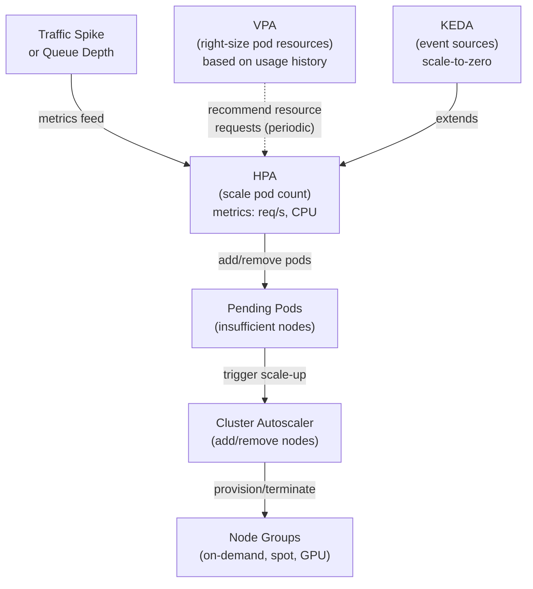

## Keywords in This File

{: .no_toc }

| # | Keyword | Weight |
|---|---------|--------|
| 1 | [HPA, VPA, and Cluster Autoscaler](#hpa-vpa-and-cluster-autoscaler) | critical |

---

# HPA, VPA, and Cluster Autoscaler

---

### 🎯 Model Answer

**30 seconds:**
> Kubernetes has three autoscaling dimensions. HPA (Horizontal Pod Autoscaler) scales
> the number of pod replicas based on CPU/memory/custom metrics. VPA (Vertical Pod
> Autoscaler) adjusts pod CPU/memory requests/limits over time based on actual usage.
> Cluster Autoscaler adds or removes nodes when pods can't be scheduled or nodes are
> underutilized. The three work together: HPA handles traffic spikes, VPA right-sizes
> individual pods, CA ensures there are enough nodes for all pods.

**3 minutes (Senior):**
> HPA works by reading metrics from the Metrics API (`metrics.k8s.io` for resource
> metrics, or Custom Metrics API for custom/external metrics), computing the desired
> replica count using the target utilization formula, and patching the target's scale
> subresource. The key formula: `desiredReplicas = ceil(currentReplicas * (currentMetric /
> desiredMetric))`. HPA has a stabilization window (default 300s scale-down, 0s scale-up)
> to prevent rapid oscillation. Custom metrics (via Prometheus Adapter, Datadog Cluster
> Agent) enable business-metric-driven scaling: queue depth, request latency, active sessions.
>
> VPA continuously monitors pod resource usage and provides recommendations (Recommendation
> mode) or automatically applies them (Update mode). VPA's modes: Off (no automation),
> Initial (set on pod creation only), Recreate (update running pods by restart), Auto
> (like Recreate + initial). VPA and HPA conflict if both target CPU: HPA scales replicas
> based on CPU utilization; if VPA simultaneously increases CPU requests, it changes the
> denominator, confusing HPA. Solution: use HPA on custom/external metrics; VPA for CPU/memory.
>
> Cluster Autoscaler (CA) monitors pods in Pending state. For each Pending pod, it
> simulates adding nodes from configured node groups and determines which node group(s)
> would allow the pod to be scheduled. It then increases that node group's desired size.
> For scale-down: if a node is underutilized (all its pods would fit on other nodes)
> for 10 minutes continuously, CA drains and removes it. KEDA (Kubernetes Event-Driven
> Autoscaler) extends HPA for event-driven scale-to-zero: scale from 0 replicas when
> events arrive, back to 0 when the queue is empty.

**Framework:** HPA -> VPA -> CA -> KEDA -> CONFLICT-RESOLUTION

*Adapting up:* Multi-dimensional scaling (HPA + VPA separation of concerns), KEDA
ScaledJob for batch workloads, CA priority expanders for mixed instance type groups,
predictive scaling with custom metrics, Karpenter as CA replacement.

*Adapting down:* "HPA = more copies when busy. VPA = bigger copies when under-resourced.
CA = more nodes when pods can't fit. Together they automatically right-size the cluster."

**Blank Mind Recovery:**

**(1) Restate:** "Kubernetes autoscaling - HPA, VPA, Cluster Autoscaler. Three dimensions:
pod count (HPA), pod size (VPA), node count (CA). Plus KEDA for event-driven scale-to-zero."

**(2) First principles:** "Autoscaling solves: waste when over-provisioned, failure when
under-provisioned. HPA = horizontal scaling (more units). VPA = vertical scaling (bigger
units). CA = infrastructure scaling (more machines). Each operates at a different level."

**(3) Bridge:** "Traffic spike at an online store: CA adds nodes (more servers in the data
center), HPA adds pods (more checkout processes), VPA makes each checkout process use
memory more efficiently. Three dials, three scopes."

---

### 📘 Concept Explanation

**Horizontal Pod Autoscaler (HPA):**

The HPA controller runs in kube-controller-manager (or as a separate component).
Every 15 seconds it:
1. Reads current replica count from the target (Deployment/ReplicaSet/StatefulSet)
2. Queries metrics from the Metrics API or Custom Metrics API
3. Computes desired replicas
4. Patches the target's `scale` subresource if a change is needed

Desired replica formula:
```
desiredReplicas = ceil[currentReplicas * (currentMetricValue / desiredMetricValue)]
```

> **Code walkthrough:** This HPA, VPA, and Cluster Autoscaler example demonstrates a key concept in practice. **KEY MECHANISM:** the runtime executes these instructions in sequence with specific memory and execution semantics. **WHY IT MATTERS:** misapplying this pattern causes subtle bugs that only manifest under production load. **TAKEAWAY: understand the execution model before using this pattern in production code.**

Example: CPU target = 50%, current usage = 80%, current replicas = 4:
`desiredReplicas = ceil(4 * (80 / 50)) = ceil(6.4) = 7`

Stabilization window: prevents rapid scale oscillation.
- Scale-up: no stabilization (immediate). `--horizontal-pod-autoscaler-initial-readiness-delay=30`
  waits 30s for new pods before sampling their metrics.
- Scale-down: 5 minutes stabilization. The HPA uses the MAXIMUM desired replica count
  computed in the last 5 minutes to prevent scale-down during brief metric dips.

HPA spec (with mixed metrics):
```yaml
kind: HorizontalPodAutoscaler
apiVersion: autoscaling/v2
spec:
  scaleTargetRef:
    kind: Deployment
    name: api
  minReplicas: 3
  maxReplicas: 100
  metrics:
  - type: Resource
    resource:
      name: cpu
      target:
        type: Utilization
        averageUtilization: 70  # 70% of CPU request
  - type: Pods
    pods:
      metric:
        name: http_requests_per_second  # custom metric
      target:
        type: AverageValue
        averageValue: 1000  # 1000 rps per pod
  behavior:
    scaleDown:
      stabilizationWindowSeconds: 300  # 5 min cooldown
      policies:
      - type: Percent
        value: 25           # scale down max 25% per minute
        periodSeconds: 60
    scaleUp:
      stabilizationWindowSeconds: 0   # immediate scale up
      policies:
      - type: Pods
        value: 10           # add max 10 pods per minute
        periodSeconds: 60
```

> **Code walkthrough:** This HPA, VPA, and Cluster Autoscaler example demonstrates YAML configuration pattern using container. **KEY MECHANISM:** YAML parsers are whitespace-sensitive; indentation errors cause silent value misinterpretation. **WHY IT MATTERS:** unquoted strings starting with special chars (*, &, ?, |) trigger YAML parser errors. **TAKEAWAY: quote strings containing YAML special chars; validate YAML before deploying to production.**

**Vertical Pod Autoscaler (VPA):**

VPA components:
- Recommender: watches pod resource usage (from Metrics API), computes recommendations
- Updater: identifies pods that need to be evicted to apply new resource requests
- Admission controller: injects recommended requests/limits at pod creation time

VPA modes:
```yaml
kind: VerticalPodAutoscaler
spec:
  targetRef:
    kind: Deployment
    name: backend
  updatePolicy:
    updateMode: "Auto"   # Off / Initial / Recreate / Auto
    # Off: recommendations only, no changes
    # Initial: apply at pod creation time (no in-place updates)
    # Recreate: evict pods to apply new recommendations
    # Auto: like Recreate; will use in-place updates when available (K8s 1.27+)
  resourcePolicy:
    containerPolicies:
    - containerName: backend
      minAllowed:
        cpu: 100m
        memory: 128Mi
      maxAllowed:
        cpu: 4
        memory: 8Gi
      controlledResources: [cpu, memory]
```

> **Code walkthrough:** This Auto: like Recreate; will use in-place updates when available (K8s 1.27+) example demonstrates YAML configuration pattern using SQL. **KEY MECHANISM:** YAML parsers are whitespace-sensitive; indentation errors cause silent value misinterpretation. **WHY IT MATTERS:** unquoted strings starting with special chars (*, &, ?, |) trigger YAML parser errors. **TAKEAWAY: quote strings containing YAML special chars; validate YAML before deploying to production.**

**Cluster Autoscaler (CA):**

CA runs as a Deployment in kube-system. It evaluates cluster state every 10 seconds.

Scale-up trigger: pods in Pending state due to insufficient resources.
CA simulates: "if I add a node of type X, would this pod be scheduled?"
If yes: increases the node group's desired count.

Scale-down trigger: underutilized node.
"All pods on this node could fit on other nodes."
Safety conditions: pod is NOT a:
- DaemonSet pod (can't be moved)
- Pod with local storage (can't be moved)
- Pod with `cluster-autoscaler.kubernetes.io/safe-to-evict: false` annotation

Prevented by:
- PodDisruptionBudget: CA respects PDB `minAvailable/maxUnavailable`
- `cluster-autoscaler.kubernetes.io/safe-to-evict: false` annotation
- `--scale-down-delay-after-add=10m`: wait 10 min after adding a node before scaling down

Karpenter (CA replacement, cloud-native):
- Direct node provisioning (uses cloud API, not managed node groups)
- Bin-packing: selects exact instance type for each pod's needs
- Much faster than CA (~60s to node ready vs 3-5 min for CA)
- Node consolidation: replaces multiple underutilized nodes with one larger node

**KEDA (Kubernetes Event-Driven Autoscaler):**

KEDA extends HPA for event-driven scaling, enabling scale-to-zero (0 replicas):
```yaml
kind: ScaledObject
apiVersion: keda.sh/v1alpha1
spec:
  scaleTargetRef:
    kind: Deployment
    name: consumer
  minReplicaCount: 0   # scale to zero when no events!
  maxReplicaCount: 50
  triggers:
  - type: rabbitmq
    metadata:
      queueName: orders
      queueLength: "5"  # 5 messages per pod
  - type: prometheus
    metadata:
      serverAddress: http://prometheus:9090
      metricName: active_sessions
      query: sum(active_sessions)
      threshold: "100"  # 100 sessions per pod
```

> **Code walkthrough:** This Auto: like Recreate; will use in-place updates when available (K8s 1.27+) example demonstrates YAML configuration pattern using Kafka messaging. **KEY MECHANISM:** YAML parsers are whitespace-sensitive; indentation errors cause silent value misinterpretation. **WHY IT MATTERS:** unquoted strings starting with special chars (*, &, ?, |) trigger YAML parser errors. **TAKEAWAY: quote strings containing YAML special chars; validate YAML before deploying to production.**

KEDA installs a KEDA controller that reads trigger sources (RabbitMQ queue depth,
Redis list length, SQS queue size, Prometheus query) and feeds the values to the
HPA's external metrics API. The HPA does the actual scaling.

---

### 💻 Code Example

> **Code walkthrough:** HPA with custom metrics, VPA configuration, CA annotations,
> and KEDA scale-to-zero.

```yaml
# BAD: Static resource allocation - over-provisioned during low traffic,
# under-provisioned during spikes
kind: Deployment
spec:
  replicas: 10   # always 10 pods, even at 3 AM with 10% traffic
  template:
    spec:
      containers:
      - name: api
        resources:
          requests:
            cpu: "2"     # guessed, not measured - likely 10x over-provisioned
            memory: 4Gi  # guessed
          limits:
            cpu: "2"     # equal to request: Guaranteed QoS but can't burst
            memory: 4Gi
# Result: $10,000/month in wasted compute at 3 AM
```

```yaml
# GOOD: HPA + VPA + proper resource requests

# Step 1: VPA in recommendation mode first
# Run for 1 week before setting updateMode: Auto
kind: VerticalPodAutoscaler
metadata:
  name: api-vpa
spec:
  targetRef:
    kind: Deployment
    name: api
  updatePolicy:
    updateMode: "Off"   # recommendation only, don't change pods yet
  resourcePolicy:
    containerPolicies:
    - containerName: api
      minAllowed:
        cpu: 100m
        memory: 256Mi
      maxAllowed:
        cpu: 4
        memory: 8Gi
---
# Check VPA recommendations after 1 week:
# kubectl describe vpa api-vpa
# Recommendations: cpu request 800m, memory 1.2Gi (vs our 2000m/4Gi guesses)
# Use these values as Deployment resource requests

# Step 2: HPA on both CPU and custom metric
kind: HorizontalPodAutoscaler
apiVersion: autoscaling/v2
metadata:
  name: api-hpa
spec:
  scaleTargetRef:
    kind: Deployment
    name: api
  minReplicas: 2      # always have 2 for availability
  maxReplicas: 50     # cap to control cost
  metrics:
  - type: Resource
    resource:
      name: cpu
      target:
        type: Utilization
        averageUtilization: 60  # scale up when avg > 60% request
  - type: External
    external:
      metric:
        name: pending_jobs    # from Prometheus Adapter
      target:
        type: AverageValue
        averageValue: "50"   # 50 pending jobs per pod
  behavior:
    scaleDown:
      stabilizationWindowSeconds: 300
      policies:
      - type: Percent
        value: 30          # max 30% reduction per step
        periodSeconds: 60
```


```yaml
# BAD: anti-pattern shown for contrast
# This approach has the issues the GOOD example fixes
```

```yaml
# GOOD: KEDA for event-driven scale-to-zero (consumer workload)
# SQS queue: 0 messages = 0 pods, 1000 messages = 10 pods

kind: ScaledObject
apiVersion: keda.sh/v1alpha1
metadata:
  name: order-processor
spec:
  scaleTargetRef:
    kind: Deployment
    name: order-processor
  minReplicaCount: 0    # zero pods when queue is empty
  maxReplicaCount: 20
  pollingInterval: 30   # check queue every 30 seconds
  cooldownPeriod: 120   # wait 2 min after queue empty before scaling to 0
  triggers:
  - type: aws-sqs-queue
    authenticationRef:
      name: keda-aws-creds
    metadata:
      queueURL: https://sqs.us-east-1.amazonaws.com/123/orders
      queueLength: "50"      # 50 messages per pod
      awsRegion: us-east-1
```

```bash
# Cluster Autoscaler: annotate pods that should prevent scale-down
# Use for stateful or long-running pods that shouldn't be evicted

kubectl annotate pod my-stateful-pod \
  cluster-autoscaler.kubernetes.io/safe-to-evict=false

# For node groups: tag nodes so CA knows about them
# AWS ASG tag (required):
# k8s.io/cluster-autoscaler/enabled = true
# k8s.io/cluster-autoscaler/<cluster-name> = owned
```

> **Code walkthrough:** The BAD example shows the common "static allocation with guessed
> resources" anti-pattern. With requests 2x-10x higher than actual usage, the cluster is
> massively over-provisioned. The GOOD example chains VPA (measure actual usage first)
> with HPA (scale replicas based on load). The key insight: run VPA in `Off` mode for a
> week to get data before setting any requests. The KEDA example shows scale-to-zero for
> a queue consumer - impossible with standard HPA (minimum 1 replica). Zero replicas when
> the queue is empty means zero cost for that workload. The 2-minute cooldown prevents
> rapid scale-down when messages arrive in bursts with short quiet periods.

---

### 🎓 Answers by Seniority

**Junior / Mid (0-5 years):**
> HPA automatically adjusts the number of pods based on CPU/memory usage. When CPU is
> high, it adds pods; when low, it removes them. VPA automatically adjusts how much CPU
> and memory each pod requests, based on actual usage history. Cluster Autoscaler adds
> nodes when pods can't be scheduled due to resource exhaustion, and removes nodes when
> they're underutilized. Together, they prevent both over-provisioning (waste) and
> under-provisioning (outages).

*Push deeper:* Why can't you use both HPA and VPA targeting CPU at the same time?

---

**Senior / Staff (5+ years):**
> The VPA + HPA conflict is the most critical operational concern. If both target CPU:
> VPA increases CPU requests for each pod (because pods are using more than requested).
> HPA measures CPU *utilization* (usage / request). Higher requests = lower utilization
> percentage for the same actual usage. So VPA's changes cause HPA to think load is low
> and scale DOWN, exactly when VPA is increasing resources because pods are overloaded.
> The resolution: HPA on custom/business metrics (queue depth, request rate, active
> connections) + VPA on CPU/memory requests with `controlledResources: [memory]` only
> (exclude CPU from VPA). Cluster Autoscaler doesn't conflict with either: it operates
> at the node level, triggered by pods in Pending state, not by per-pod metrics. For
> KEDA: KEDA works alongside HPA - KEDA effectively manages the HPA's external metrics;
> it doesn't conflict with HPA but extends it with event-source awareness.

*Push deeper:* Karpenter vs Cluster Autoscaler: Karpenter provisions individual nodes
directly using cloud APIs (EC2 RunInstances) and selects the optimal instance type per
pod's requirements in real-time. CA works with pre-defined node groups (ASGs). CA's
limitation: if the right instance type isn't in any node group, the pod stays Pending.
Karpenter's NodePool can include ANY instance type and picks the most cost-effective
option. For cost optimization: Karpenter with Spot instances + binpacking typically
reduces node costs by 40-60% vs CA with fixed node groups.

---

### ⚠️ Common Misconceptions

**Misconception 1: "HPA targets current resource usage."**
HPA targets utilization relative to requests. CPU utilization 70% means "average pod is
using 70% of its CPU REQUEST". If requests are set too low (pod uses 500m, request is
100m: utilization = 500%), HPA scales aggressively and never stabilizes. Set resource
requests accurately - VPA can help calibrate them.

**Misconception 2: "VPA Auto mode can update running pods without restart."**
VPA's Recreate and Auto modes currently evict (restart) pods to apply new resource
requests. In-place vertical pod autoscaling (VEP `InPlacePodVerticalScaling`) is alpha
in K8s 1.27+, not yet stable. For most clusters: VPA with update mode Auto = pod
restarts. Design for this: ensure pods have graceful shutdown, Deployment has surge
capacity, and HPA min replicas ensure availability during VPA evictions.

**Misconception 3: "Cluster Autoscaler removes underutilized nodes immediately."**
CA waits `--scale-down-unneeded-time` (default 10 minutes) of continuous underutilization
before considering a node for removal. Then it checks PDB compliance, safe-to-evict
annotations, and pod disruption. Scale-down can take 15-30 minutes from when a node
becomes underutilized to when it's actually terminated. This is intentional: prevents
removing nodes that are temporarily underloaded but will soon have pods scheduled.

**Misconception 4: "Setting HPA maxReplicas high is free insurance."**
A high maxReplicas can cause a cost incident. If your metrics spike unexpectedly (bug
causes CPU loop, DDoS, runaway job), HPA scales to maxReplicas within minutes. With
maxReplicas=500 and $0.10/pod-hour: a 4-hour incident = $200. Set maxReplicas to a
number that balances: (a) enough to handle real traffic spikes, (b) not so high that
a runaway autoscale destroys your cloud budget. Use cost alerts independently.

---

### 🚨 Failure Modes and Diagnosis

**Failure 1: HPA not scaling - "unknown" metrics**

Symptom: `kubectl describe hpa` shows `<unknown>/70%` for CPU metric target.
HPA is not scaling despite high CPU.

Cause: metrics-server is not installed or failing. HPA can't get CPU/memory metrics.

Diagnostic:
`kubectl top pods` - if this fails: metrics-server is down.
`kubectl get pods -n kube-system | grep metrics-server`
`kubectl logs -n kube-system metrics-server-<pod>`

Fix: install/upgrade metrics-server via Helm or manifest. Verify `--kubelet-insecure-tls`
flag if TLS issues in cloud environments.

**Failure 2: HPA oscillating (thrashing) - constantly scaling up and down**

Symptom: pod count changes every 1-2 minutes; pods are constantly creating and terminating.
Logs show HPA scaling up then immediately down.

Cause: metric is noisy (high variance per minute), stabilization window too short,
or target utilization set at a threshold where small changes in load cross the boundary.

Diagnostic: `kubectl describe hpa <name>` - check Events section for recent scale events.
What metrics are driving the scaling? Are they fluctuating rapidly?

Fix:
1. Increase stabilization window: `behavior.scaleDown.stabilizationWindowSeconds: 600`
2. Adjust target utilization: if target is 50%, small variations cause constant adjustment.
   Increase to 70% for more headroom.
3. For custom metrics: if the metric is inherently noisy, apply smoothing at the
   metrics collection layer (Prometheus `avg_over_time` query).

**Failure 3: Cluster Autoscaler not adding nodes**

Symptom: pods stuck in Pending for > 5 minutes; expected CA to add nodes but hasn't.

Cause: node group at maxSize, CA can't determine suitable node group, pod has
constraints CA can't satisfy.

Diagnostic:
`kubectl describe pod <pending>` -> Events: "no nodes available matching pod's requirements"
vs "insufficient CPU/memory".
`kubectl logs -n kube-system deployment/cluster-autoscaler | grep -i "scale up"`
CA logs show WHY it's not scaling: max node group size, taint conflicts, no suitable
node group.

Fix: check node group maxSize. Check if pod has affinity/toleration requirements that
no node group can satisfy. Check CA IAM permissions (for cloud providers).

---

### 🎯 Interview Deep-Dive

| Question Category | Time to Answer |
|---|---|
| Conceptual | 1-2 minutes |
| Mechanism | 2-3 minutes |
| Debugging | 2-3 minutes |
| Trade-off | 2-3 minutes |
| Architecture | 3-4 minutes |
| Advanced | 2-3 minutes |
| Hands-on | 2-3 minutes |
| System Design | 3-5 minutes |
| Security | 1-2 minutes |
| Production | 2-3 minutes |
| Behavioral | 2-3 minutes |
| Comparison | 2-3 minutes |

---

**Q1 [MID] (CONCEPTUAL): What is the difference between HPA and VPA?**

A: HPA and VPA operate on different dimensions of autoscaling:

HPA (Horizontal Pod Autoscaler): scales the NUMBER of pod replicas. When load increases,
more pods are created (horizontally scaling). When load decreases, excess pods are
terminated. The resources per pod don't change - more pods share the work.
Works best for: stateless services that can run multiple identical instances.

VPA (Vertical Pod Autoscaler): scales the RESOURCES (CPU/memory requests/limits) of
existing pods. When a pod consistently uses more CPU than its request, VPA increases
the request. The number of pods stays the same (unless HPA is also running).
Works best for: stateful workloads with variable resource needs that can't easily be
replicated (JVMs with heap sizing, databases, single-threaded services).

Why both exist: not all workloads can scale horizontally. A single-primary database
can't add replicas for write load. A batch job processes a fixed dataset regardless
of how many replicas you run. For these: vertical scaling is the only option. For
stateless REST APIs: horizontal scaling is preferred (no downtime for scale events,
better fault isolation).

The conflict: running both HPA and VPA targeting CPU causes competing behaviors
(VPA raises requests, HPA sees lower utilization percentage, scales down). Resolution:
HPA on custom/business metrics, VPA on CPU/memory (which VPA doesn't share with HPA).

*What separates good from great:* VPA is also valuable as a rightsizing tool without
`Auto` mode. Running VPA in `Off` mode for a week and reading `kubectl describe vpa`
recommendations gives production-calibrated resource request values. This reduces waste
without any automation risk. Many teams use VPA for recommendations only and manually
update Deployment resources quarterly.

---

**Q2 [SENIOR] (MECHANISM): How does HPA calculate the desired replica count?**

A: HPA uses the following formula per metric:
```
desiredReplicas = ceil[currentReplicas * (currentMetricValue / desiredMetricValue)]
```

> **Code walkthrough:** This k8s.io/cluster-autoscaler/<cluster-name> = owned example demonstrates a key concept in practice. **KEY MECHANISM:** the runtime executes these instructions in sequence with specific memory and execution semantics. **WHY IT MATTERS:** misapplying this pattern causes subtle bugs that only manifest under production load. **TAKEAWAY: understand the execution model before using this pattern in production code.**

For resource metrics (CPU/memory), currentMetricValue is the AVERAGE across all pods.
Example:
- 4 pods, each using 200m CPU, requests = 500m CPU each
- CPU utilization: 200/500 = 40% per pod
- Target: 70%
- desiredReplicas = ceil(4 * (40/70)) = ceil(2.28) = 3
- HPA SCALES DOWN (current 40% < target 70% means too many pods for the load)

For scale-up:
- 4 pods, each using 500m CPU, requests = 500m
- CPU utilization: 100% per pod
- Target: 70%
- desiredReplicas = ceil(4 * (100/70)) = ceil(5.71) = 6
- HPA SCALES UP

Multi-metric HPA: when multiple metrics are specified, HPA computes the desired count
for EACH metric independently, then takes the MAXIMUM. This ensures scale-up whenever
ANY metric indicates more capacity is needed.

Missing metrics: if a metric is unavailable (metrics-server down), HPA doesn't act
(doesn't scale to 0 or to max). It waits for metrics to return.

Stabilization window for scale-down: HPA tracks desired replicas computed in the last
`stabilizationWindowSeconds` (default 300s). It uses the MAXIMUM value in that window
as the final scale-down decision. This prevents scale-down during brief metric dips.

*What separates good from great:* The "tolerance" parameter (`--horizontal-pod-autoscaler-tolerance`,
default 0.1 = 10%) prevents trivial scaling events. If the computed desired replicas
is within 10% of the current count, HPA doesn't scale. This prevents single-digit
percentage fluctuations from triggering unnecessary scale events.

---

**Q3 [SENIOR] (TRADE-OFF): HPA on CPU vs HPA on custom metrics - when to use each?**

A: CPU-based HPA is simpler but has important limitations:

CPU HPA pros:
- Built-in: no additional components (metrics-server is standard)
- Directly measures resource pressure
- Works out of the box

CPU HPA cons:
- CPU doesn't always correlate with user-visible load (I/O bound services: CPU low,
  latency high)
- CPU throttling from CPU limits distorts the metric (pod appears "idle" because it's
  being throttled, not because it's truly unloaded)
- VPA conflict: VPA adjusting CPU requests changes the denominator

Custom/external metric HPA pros:
- Business-relevant: scale on queue depth, response time, active users, requests/second
- Avoids CPU/memory measurement noise
- Enables scale-to-zero (KEDA): CPU can never be "zero" for HPA, but queue depth can be
- Better for I/O bound services (scale on requests/second, not CPU)

Custom metric requirements:
- Prometheus Adapter (for Prometheus metrics) OR
- Datadog Cluster Agent (for Datadog metrics) OR
- KEDA (for event sources: SQS, RabbitMQ, Redis, Kafka)

Recommended pattern:
- HPA on request rate per second (Prometheus: `rate(http_requests_total[2m])`)
- minReplicas set for availability SLO
- maxReplicas set with cost budget in mind
- CPU HPA as a secondary metric (failsafe for CPU-intensive unexpected scenarios)

*What separates good from great:* Queue depth is the most reliable autoscaling metric
for batch/worker workloads. Queue depth directly measures "backlog to process". CPU
does not. If your 5 workers are idle (queue empty: no work), CPU = 0%. If queue has
10,000 items, you want more workers - but if the queue just arrived, CPU may still be
low (workers haven't started). Queue-depth-based scaling reacts to the signal that
actually matters: backlog.

---

**Q4 [STAFF] (ARCHITECTURE): How does Cluster Autoscaler decide which node group to scale?**

A: CA's node group selection algorithm for scale-up is called "expanders".

Default expander: `random` - CA randomly selects among node groups that could satisfy
the pending pod's requirements.

Common expanders:

`least-waste` (recommended for cost): among all node groups that could schedule the
pending pod, choose the one that wastes the least CPU/memory on the new node. This
packs pods efficiently onto fewer node types.

`priority`: node groups have explicit priority labels. Scale up higher priority groups
first (prefer spot instances; fall back to on-demand).

`price`: select the cheapest node group (requires cloud provider price info).

`most-pods`: select the node group that can schedule the most pending pods in one scale event.

Multi-group example:
```
Node Group A: t3.xlarge (4 vCPU, 16GB) - on-demand
Node Group B: c5.2xlarge (8 vCPU, 16GB) - spot
Node Group C: m5.4xlarge (16 vCPU, 64GB) - spot

Pending pod: 2 vCPU, 8GB
Group A: would waste 2 vCPU, 8GB = 50% waste
Group B: would waste 6 vCPU, 8GB = 88% waste
Group C: would waste 14 vCPU, 56GB = 95% waste

With least-waste expander: Group A wins (minimum waste)
With price expander: Group B might win (spot instances cost less)
```

> **Code walkthrough:** This Unknown example demonstrates a key concept in practice using container. **KEY MECHANISM:** the runtime executes these instructions in sequence with specific memory and execution semantics. **WHY IT MATTERS:** misapplying this pattern causes subtle bugs that only manifest under production load. **TAKEAWAY: understand the execution model before using this pattern in production code.**

Scale-up timing: CA evaluates Pending pods every 10 seconds. After deciding to scale,
it sets the node group desired count +N. The cloud provider (ASG, GKE node pool) then
provisions the node. Time to running node: 2-5 minutes for managed groups, ~60 seconds
for Karpenter.

*What separates good from great:* The `priority` expander is the production pattern for
cost optimization. Configure: scale spot instance groups first, on-demand as fallback.
Spot instances can be 60-70% cheaper. When spot is interrupted, pod is evicted, CA
falls back to on-demand. For this to work without disruption: all pods must have
graceful shutdown, Deployments must have rolling update strategy and minAvailable PDB.

---

**Q5 [STAFF] (ADVANCED): Explain the VPA and HPA interaction and how to resolve conflicts.**

A: The conflict mechanism in detail:

Step 1 - VPA increases requests: VPA observes pod CPU usage at 800m, request is 500m.
VPA recommends request = 900m.

Step 2 - VPA evicts pod: VPA updater evicts the pod. Pod restarts with request = 900m.

Step 3 - HPA sees utilization drop: the same 800m CPU usage, now request = 900m.
CPU utilization = 800/900 = 89% -> was above target -> HPA should have been scaling up.
But now after VPA restart: utilization = 89%, HPA formula computes desired replicas
and may scale up OR the stabilization window prevents immediate change.

Step 4 - More insidiously: if VPA restarts multiple pods simultaneously (all pods
in the Deployment), there's a window where pods are Starting, metrics are unavailable
for those pods, and HPA sees lower current replica count with lower metric averages.
HPA may scale DOWN during this window.

Resolution strategies:

Strategy 1 - Separate metric domains:
HPA: use request rate or queue depth (NOT CPU)
VPA: manage CPU and memory requests
No conflict: different metrics.

Strategy 2 - VPA Only (for non-scalable workloads):
Use VPA Auto, no HPA. Good for: stateful single-instance workloads (caches, singleton
workers), JVM applications where memory tuning is the primary concern.

Strategy 3 - HPA Only with periodic VPA recommends:
Run VPA in `Off` mode. Read recommendations. Manually update Deployment resource
requests quarterly. Then use HPA on CPU. VPA is advisory; HPA is operational.

Strategy 4 - VPA for memory, HPA for CPU:
```yaml
# VPA only manages memory
vpa:
  resourcePolicy:
    containerPolicies:
    - containerName: api
      controlledResources: [memory]  # CPU excluded from VPA control
```
> **Code walkthrough:** This VPA only manages memory example demonstrates YAML configuration pattern using container. **KEY MECHANISM:** YAML parsers are whitespace-sensitive; indentation errors cause silent value misinterpretation. **WHY IT MATTERS:** unquoted strings starting with special chars (*, &, ?, |) trigger YAML parser errors. **TAKEAWAY: quote strings containing YAML special chars; validate YAML before deploying to production.**

HPA manages CPU utilization. VPA right-sizes memory without affecting HPA's denominator.

*What separates good from great:* The in-place vertical scaling feature (alpha in K8s 1.27,
InPlacePodVerticalScaling feature gate) changes this equation. When GA, VPA can update
CPU/memory requests without pod restart. This eliminates the "pod restart window" during
which HPA sees distorted metrics. In-place VPA + CPU-based HPA become safe to use
together once this feature is stable.

---

**Q6 [SENIOR] (DEBUGGING): HPA is showing `<unknown>` for CPU metric. How do you fix it?**

A: `<unknown>` for CPU in HPA means the metrics-server is not providing data for those pods.

Step 1: check if metrics-server is running.
```bash
kubectl get pods -n kube-system | grep metrics-server
# Should show Running
```

> **Code walkthrough:** This Should show Running example demonstrates shell script pattern using container. **KEY MECHANISM:** the shell executes commands sequentially; pipes pass stdout of one command to stdin of the next. **WHY IT MATTERS:** unquoted variables with spaces cause word splitting - IFS splits the value into multiple arguments. **TAKEAWAY: always double-quote variables: "$VAR"; use [[ ]] instead of [ ] for safer conditionals.**

Step 2: check if metrics work at all.
```bash
kubectl top nodes
kubectl top pods -n <namespace>
# If both fail: metrics-server is down or can't reach kubelets
```

> **Code walkthrough:** This If both fail: metrics-server is down or can't reach kubelets example demonstrates shell script pattern using container. **KEY MECHANISM:** the shell executes commands sequentially; pipes pass stdout of one command to stdin of the next. **WHY IT MATTERS:** unquoted variables with spaces cause word splitting - IFS splits the value into multiple arguments. **TAKEAWAY: always double-quote variables: "$VAR"; use [[ ]] instead of [ ] for safer conditionals.**

Step 3: check metrics-server logs.
```bash
kubectl logs -n kube-system deployment/metrics-server
# Common errors:
# "failed to scrape node: x509: certificate signed by unknown authority"
# -> need --kubelet-insecure-tls flag (in cloud environments)
# "no such host": DNS resolution issue for node names
```

> **Code walkthrough:** This "no such host": DNS resolution issue for node names example demonstrates shell script pattern using authentication. **KEY MECHANISM:** the shell executes commands sequentially; pipes pass stdout of one command to stdin of the next. **WHY IT MATTERS:** unquoted variables with spaces cause word splitting - IFS splits the value into multiple arguments. **TAKEAWAY: always double-quote variables: "$VAR"; use [[ ]] instead of [ ] for safer conditionals.**

Step 4: verify HPA can see the Metrics API.
```bash
kubectl get --raw "/apis/metrics.k8s.io/v1beta1/pods"
# Should return pod metrics JSON
# If 404: metrics-server is not registered as an API extension
```

> **Code walkthrough:** This If 404: metrics-server is not registered as an API extension example demonstrates shell script pattern using container. **KEY MECHANISM:** the shell executes commands sequentially; pipes pass stdout of one command to stdin of the next. **WHY IT MATTERS:** unquoted variables with spaces cause word splitting - IFS splits the value into multiple arguments. **TAKEAWAY: always double-quote variables: "$VAR"; use [[ ]] instead of [ ] for safer conditionals.**

Step 5: check if pods have resource requests set.
HPA CPU utilization requires `resources.requests.cpu` on the container. Without it:
HPA can't compute utilization %.
```bash
kubectl get deployment <name> -o jsonpath='{.spec.template.spec.containers[0].resources}'
```

> **Code walkthrough:** This If 404: metrics-server is not registered as an API extension example demonstrates shell script pattern using container. **KEY MECHANISM:** the shell executes commands sequentially; pipes pass stdout of one command to stdin of the next. **WHY IT MATTERS:** unquoted variables with spaces cause word splitting - IFS splits the value into multiple arguments. **TAKEAWAY: always double-quote variables: "$VAR"; use [[ ]] instead of [ ] for safer conditionals.**

Fix path:
1. If metrics-server down: restart or reinstall it
2. If TLS issue: add `--kubelet-insecure-tls` to metrics-server args
3. If no resource requests: add `resources.requests.cpu: 500m` to container spec

*What separates good from great:* `kubectl get --raw "/apis/metrics.k8s.io/v1beta1/pods"`
is the definitive test. If this returns data, HPA CAN read metrics. If HPA still shows
`<unknown>`: the pods don't have CPU requests set. If this returns 404: metrics-server
isn't registered as an API aggregation extension. Two different diagnostic branches.

---

**Q7 [SENIOR] (HANDS-ON): Configure HPA to scale a payment service on request rate.**

A: Payment service: stateless REST API, p99 latency SLO. Scale on requests/second
per pod. Use Prometheus Adapter for custom metrics.

```yaml
# Step 1: Prometheus query for requests/second per pod
# In Prometheus Adapter config:
# - seriesQuery: 'http_requests_total{namespace!="",pod!=""}'
#   name: {matches: "http_requests_total", as: "requests_per_second"}
#   metricsQuery: 'rate(http_requests_total{<<.LabelMatchers>>}[2m])'

# Step 2: HPA configuration
kind: HorizontalPodAutoscaler
apiVersion: autoscaling/v2
metadata:
  name: payment-service-hpa
  namespace: payments
spec:
  scaleTargetRef:
    apiVersion: apps/v1
    kind: Deployment
    name: payment-service
  minReplicas: 3        # min 3 for availability SLO
  maxReplicas: 30       # cost cap: 30 pods max
  metrics:
  - type: Pods           # per-pod metric: each pod handles max N rps
    pods:
      metric:
        name: requests_per_second
      target:
        type: AverageValue
        averageValue: "500"   # 500 requests/second per pod target
  - type: Resource       # secondary: CPU as failsafe
    resource:
      name: cpu
      target:
        type: Utilization
        averageUtilization: 80
  behavior:
    scaleUp:
      stabilizationWindowSeconds: 0     # scale up immediately
      policies:
      - type: Percent
        value: 100        # can double in one step (large traffic spike)
        periodSeconds: 30
    scaleDown:
      stabilizationWindowSeconds: 300   # 5 min before scale down
      policies:
      - type: Percent
        value: 25
        periodSeconds: 60               # max 25% reduction per minute
```

> **Code walkthrough:** This Step 2: HPA configuration example demonstrates YAML configuration pattern using container. **KEY MECHANISM:** YAML parsers are whitespace-sensitive; indentation errors cause silent value misinterpretation. **WHY IT MATTERS:** unquoted strings starting with special chars (*, &, ?, |) trigger YAML parser errors. **TAKEAWAY: quote strings containing YAML special chars; validate YAML before deploying to production.**

The `AverageValue` target means: if current total requests/second across all pods is
6000, and target is 500/pod: desiredReplicas = ceil(6000/500) = 12 pods.

*What separates good from great:* Payment services often have variable latency per request
(simple check: 1ms, fraud analysis: 200ms). Requests/second is a better metric than CPU
because a burst of fraud-check requests causes high latency even at moderate request rates.
Consider using `http_requests_in_flight` (active in-flight requests) as the metric: this
more directly measures concurrency pressure than completed request rate.

---

**Q8 [STAFF] (SYSTEM DESIGN): Design autoscaling for a batch processing system that
must handle 1000x traffic spikes.**

A: Batch processing systems have specific autoscaling requirements:
- Idle periods: zero or minimal resource usage (cost to zero)
- Burst periods: scale to handle full batch quickly, then back to zero
- Completion guarantee: don't terminate jobs mid-processing

Design:

Layer 1 - KEDA scale-to-zero for workers:
```yaml
kind: ScaledJob
apiVersion: keda.sh/v1alpha1
metadata:
  name: batch-worker
spec:
  jobTargetRef:
    template:
      spec:
        containers:
        - name: worker
          image: batch-worker:1.0
          resources:
            requests: {cpu: "2", memory: 4Gi}
        restartPolicy: Never
  pollingInterval: 10
  maxReplicaCount: 100
  triggers:
  - type: aws-sqs-queue
    metadata:
      queueURL: https://sqs.us-east-1.amazonaws.com/123/batch
      queueLength: "1"   # 1 job per worker pod
```

> **Code walkthrough:** This Step 2: HPA configuration example demonstrates YAML configuration pattern using container. **KEY MECHANISM:** YAML parsers are whitespace-sensitive; indentation errors cause silent value misinterpretation. **WHY IT MATTERS:** unquoted strings starting with special chars (*, &, ?, |) trigger YAML parser errors. **TAKEAWAY: quote strings containing YAML special chars; validate YAML before deploying to production.**

`ScaledJob` creates Kubernetes Jobs (not Deployments) for each batch item.
Jobs run to completion. Completed Jobs don't count against replica limits.
At 0 messages: 0 workers. At 1000 messages: 100 workers (max).

Layer 2 - Cluster Autoscaler with spot instances:
Batch workloads tolerate interruption (if spot terminated: job re-queues).
Configure CA to scale spot instance groups first (60-70% cost savings).

Layer 3 - Node group pre-warming:
For predictable batch windows (e.g., nightly processing starts at 2 AM),
use scheduled HPA or a CronJob to pre-scale before the batch arrives.
1-2 minutes of pre-scaling eliminates the cold-start latency of node provisioning.

Layer 4 - PodDisruptionBudget (optional for batch):
If jobs are idempotent and can be retried: no PDB needed (CA can freely drain nodes).
If jobs have side effects: `minAvailable: N` to ensure in-flight jobs complete.

Cost model:
- Idle: 0 workers, minimal control plane (3 control plane nodes)
- Peak: 100 workers on spot instances (~$0.05/pod-hour)
- 1000x spike lasting 1 hour: $5 total for workers vs $500/month for static allocation

*What separates good from great:* The KEDA ScaledJob vs ScaledObject distinction matters:
`ScaledObject` targets Deployments (persistent processes). `ScaledJob` creates new Job
objects for each work item and lets Kubernetes Job controller handle completion/retry.
For batch processing where each message = one job: `ScaledJob` is the correct abstraction.
The Job's success/failure is reported via Job status, and failed Jobs can be retried
with `backoffLimit`. This is significantly better than having a Deployment worker that
processes messages: if the Deployment pod crashes mid-message, the message may need
manual re-queuing.

---

**Q9 [STAFF] (PRODUCTION): How do you prevent autoscaling from causing an outage?**

A: Autoscaling can cause or exacerbate outages through three mechanisms: scale-down
during transient dips, aggressive scale-up exhausting resources, and CA removing nodes
with in-flight traffic.

Protection 1 - Scale-down stabilization:
```yaml
behavior:
  scaleDown:
    stabilizationWindowSeconds: 600   # 10 min (vs default 5 min)
    policies:
    - type: Percent
      value: 10             # only remove 10% of pods per step
      periodSeconds: 120    # wait 2 minutes between steps
```
> **Code walkthrough:** This Step 2: HPA configuration example demonstrates YAML configuration pattern using container. **KEY MECHANISM:** YAML parsers are whitespace-sensitive; indentation errors cause silent value misinterpretation. **WHY IT MATTERS:** unquoted strings starting with special chars (*, &, ?, |) trigger YAML parser errors. **TAKEAWAY: quote strings containing YAML special chars; validate YAML before deploying to production.**

Slow scale-down: even if metrics dip briefly, 10-minute stabilization prevents premature removal.

Protection 2 - minReplicas matching availability SLO:
```yaml
minReplicas: 3   # even at zero traffic, maintain 3 pods
```
> **Code walkthrough:** This Step 2: HPA configuration example demonstrates YAML configuration pattern using container. **KEY MECHANISM:** YAML parsers are whitespace-sensitive; indentation errors cause silent value misinterpretation. **WHY IT MATTERS:** unquoted strings starting with special chars (*, &, ?, |) trigger YAML parser errors. **TAKEAWAY: quote strings containing YAML special chars; validate YAML before deploying to production.**

With zone-spread pod topology, 3 pods in 3 AZs survives AZ failure. Never set minReplicas
below your availability SLO floor.

Protection 3 - CA PodDisruptionBudget enforcement:
```yaml
kind: PodDisruptionBudget
spec:
  minAvailable: "80%"    # always keep 80% of pods available
  selector:
    matchLabels:
      app: payment-service
```
> **Code walkthrough:** This Step 2: HPA configuration example demonstrates YAML configuration pattern using SQL. **KEY MECHANISM:** YAML parsers are whitespace-sensitive; indentation errors cause silent value misinterpretation. **WHY IT MATTERS:** unquoted strings starting with special chars (*, &, ?, |) trigger YAML parser errors. **TAKEAWAY: quote strings containing YAML special chars; validate YAML before deploying to production.**

CA respects PDB: if evicting a pod from a draining node would violate PDB, CA waits.

Protection 4 - preStop hook for graceful termination:
```yaml
containers:
- lifecycle:
    preStop:
      exec:
        command: ["/bin/sh", "-c", "sleep 30"]
  terminationGracePeriodSeconds: 60
```
> **Code walkthrough:** This Step 2: HPA configuration example demonstrates YAML configuration pattern using container. **KEY MECHANISM:** YAML parsers are whitespace-sensitive; indentation errors cause silent value misinterpretation. **WHY IT MATTERS:** unquoted strings starting with special chars (*, &, ?, |) trigger YAML parser errors. **TAKEAWAY: quote strings containing YAML special chars; validate YAML before deploying to production.**

30-second preStop hook: pod stays Up on the load balancer while it finishes in-flight
requests before termination signal.

Protection 5 - HPA maxReplicas as cost protection:
Set maxReplicas to a number that balances availability with cost safety. Pair with
CloudWatch/Prometheus alert: "HPA at maxReplicas for > 5 minutes" -> page on-call.

*What separates good from great:* Pod readiness gates are the most underused protection.
When HPA adds a new pod, it's included in the HPA's metric average immediately (even
before it's Ready and in the Endpoints). If pod startup takes 60 seconds, those 60
seconds of "not serving" are counted as low utilization, potentially triggering
premature scale-down. The `startup probe` prevents this for the container's own health.
But the `readinessGate` condition lets you keep the pod out of HPA averaging until
an external system (load balancer controller, service mesh) confirms it's serving traffic.

---

**Q10 [STAFF] (ADVANCED): How does KEDA differ from native HPA for custom metrics?**

A: KEDA (Kubernetes Event-Driven Autoscaler) is built on top of HPA, not a replacement.
Understanding the layering explains when to use each:

Native HPA with Custom Metrics API:
- Requires a custom metrics adapter (Prometheus Adapter, Datadog Cluster Agent)
- The adapter implements the `custom.metrics.k8s.io` API
- HPA queries this API every 15 seconds
- Cannot scale to 0 replicas (minimum 1)
- Good for: continuous service metrics (requests/second, latency percentile)

KEDA:
- Installs its own CRDs (`ScaledObject`, `ScaledJob`)
- KEDA controller reads from event sources (SQS, RabbitMQ, Kafka, Redis, etc.)
  directly (supports 50+ scalers natively)
- KEDA translates event source metrics into HPA `external.metrics.k8s.io`
- The underlying HPA still does the actual scaling
- CAN scale to 0 replicas (KEDA activates the HPA when events > 0)
- When events = 0: KEDA pauses the HPA and sets replicas to 0 directly
- Good for: event-driven workloads with natural "idle" periods

Scale-to-zero mechanism:
```
Queue depth = 0:
  KEDA sees 0 messages -> sets Deployment.spec.replicas = 0
  HPA is paused (can't scale below 1 normally; KEDA bypasses this)

Queue depth = 50 (first message arrives):
  KEDA detects > 0 messages -> sets Deployment.spec.replicas = 1 (activation)
  HPA resumes -> formula: desiredReplicas = ceil(50 / targetPerPod)
```

> **Code walkthrough:** This Unknown example demonstrates a key concept in practice using container. **KEY MECHANISM:** the runtime executes these instructions in sequence with specific memory and execution semantics. **WHY IT MATTERS:** misapplying this pattern causes subtle bugs that only manifest under production load. **TAKEAWAY: understand the execution model before using this pattern in production code.**

When to choose KEDA:
- Event sources beyond CPU/memory (queues, databases, HTTP requests, Cron schedules)
- Scale-to-zero for cost savings during idle periods
- Batch workloads (ScaledJob)

When to use native HPA:
- Already have Prometheus Adapter installed
- Continuous metrics (no true "zero" state)
- Simpler architecture without additional components

*What separates good from great:* KEDA's external scalers allow custom scalers written
in any language (gRPC interface). If your autoscaling signal doesn't have a built-in
KEDA scaler, you can implement a custom scaler that KEDA calls. This makes KEDA
extensible to any business metric: "number of incomplete orders in database" could
drive autoscaling if you implement a KEDA external scaler that queries your order service.

---

**Q11 [STAFF] (COMPARISON): Cluster Autoscaler vs Karpenter - when do you choose each?**

A:

Cluster Autoscaler (CA):
- Works with pre-defined managed node groups (AWS ASG, GKE node pools)
- You define the node types in advance; CA adjusts group sizes
- Cloud-agnostic with cloud-specific providers (AWS, GCP, Azure, etc.)
- Scale-up: set desired count on ASG -> cloud provisions -> node joins K8s
- Typical node ready time: 2-5 minutes
- Scale-down: drains node -> terminates it
- Expanders determine which pre-defined group gets nodes

Karpenter (AWS-native, K8s native for other clouds via compatible implementations):
- Provisions individual nodes directly via cloud API (EC2 RunInstances for AWS)
- No pre-defined node groups - Karpenter picks instance type dynamically
- NodePool defines constraints (instance families, spot/on-demand, zones)
- Scale-up: Karpenter directly calls EC2 API -> node ready in ~60 seconds
- Scale-down: consolidation mode moves pods to fewer nodes (bin-packing optimization)
  and terminates underutilized nodes proactively
- Cost optimization: always selects cheapest instance type that fits the pod's needs

Choose CA when:
- Multi-cloud or cloud-agnostic requirement
- Need specific pre-validated node configurations
- Existing node group infrastructure investment
- Requirement for manual node management alongside autoscaling

Choose Karpenter when:
- AWS cluster (Karpenter is most mature on AWS)
- Cost optimization is a priority (right-sizing per workload)
- Faster scale-up is needed (batch workloads, traffic spikes)
- Node consolidation to reduce waste (underutilized node replacement)

*What separates good from great:* Karpenter's consolidation is its highest-value feature.
CA only scales down when a node is underutilized AND all its pods fit elsewhere.
Karpenter goes further: it simulates replacing 2 underutilized m5.large nodes with 1
m5.xlarge (same capacity, half the nodes, less cost) and proactively performs that
consolidation. In practice, this reduces node count by 15-30% in stable clusters
compared to CA. The tradeoff: consolidation causes pod moves (restarts), so workloads
need graceful shutdown and Deployments need rolling update tolerance.

---

**Q12 [STAFF] (BEHAVIORAL): Describe a cost incident caused by autoscaling and how you
diagnosed and fixed it.**

A (STAR format):

Situation: our Kubernetes cluster on AWS unexpectedly incurred $15,000 in a single day,
6x the normal daily cost. CloudWatch billing alert fired at 2 AM. On-call received
a PagerDuty alert for "AWS cost anomaly detected."

Task: diagnose the cost spike, stop the bleeding, and prevent recurrence.

Action:
Immediate investigation (30 minutes):
AWS Cost Explorer showed EC2 charges for m5.4xlarge instances: normally 10 nodes,
now showing 500+ instance-hours in the last 24 hours.

Kubernetes investigation: `kubectl get nodes | wc -l` returned 487 nodes (normal: 50).
CA had scaled to nearly maxSize (500 nodes).

Root cause: found a deployment with HPA configured:
```yaml
minReplicas: 1
maxReplicas: 10000   # ← intended 100, typo added an extra zero
```
> **Code walkthrough:** This Unknown example demonstrates YAML configuration pattern. **KEY MECHANISM:** YAML parsers are whitespace-sensitive; indentation errors cause silent value misinterpretation. **WHY IT MATTERS:** unquoted strings starting with special chars (*, &, ?, |) trigger YAML parser errors. **TAKEAWAY: quote strings containing YAML special chars; validate YAML before deploying to production.**

A load test earlier that day generated 100x normal traffic. HPA scaled to 10,000 pods.
CA added nodes to accommodate all 10,000 pods. 487 nodes running for 18 hours
before alert fired.

Immediate mitigation:
1. Scaled down the HPA max: `kubectl patch hpa my-hpa --patch '{"spec":{"maxReplicas":100}}'`
2. HPA immediately dropped desired replicas to 100
3. CA began draining and terminating 400+ nodes
4. Node termination took ~2 hours (CA's gradual scale-down)

Total cost: $15,000 (vs $2,500 normal daily cost) - $12,500 incident cost.

Root cause analysis: the PR that added HPA config had `maxReplicas: 10000`. The PR
reviewer saw "10000" and assumed it was intentional for a high-traffic service.
No automated check existed for unreasonably high maxReplicas.

Prevention:
1. Kyverno policy: reject any HPA with `maxReplicas > 500` without explicit annotation
   `autoscaling.company.com/high-max-approved: "true"`
2. AWS budget alert: trigger PagerDuty IMMEDIATELY at 2x daily cost threshold
   (was alerting at 5x which took too long)
3. CA maxSize: set node group maxSize to 100 nodes (prevent 487 nodes even if HPA misbehaves)
4. Monthly review: automated report of HPA maxReplicas configuration for all services

*What separates good from great:* The three-layer defense that would have prevented this
incident: (1) policy check at PR merge time blocking `maxReplicas > 500`, (2) CA maxSize
capping at 100 nodes regardless of pod demand, (3) cost alert at 2x not 5x normal spend.
Any one of these would have contained the incident. Defense-in-depth applies to cost
controls the same way it applies to security.

---

### ⚖️ Comparison Table

| | HPA | VPA | Cluster Autoscaler | KEDA |
|---|---|---|---|---|
| Scales | Pod replicas | Pod resources | Nodes | Pod replicas (to 0) |
| Based on | CPU/memory/custom metrics | Historical resource usage | Pending pods / underutilized nodes | Event sources (queue, DB, metrics) |
| Min scale | 1 replica | Existing pods | Existing nodes | 0 replicas |
| Best for | Stateless services | Stateful/singleton workloads | Any cluster | Event-driven / batch |
| Conflict with | VPA on same metric | HPA on CPU | PodDisruptionBudget | None (extends HPA) |
| Latency | 15s metric -> scale action | Minutes to evict+restart | 2-5 min node provision | Event-driven (seconds to minutes) |

---

### 🏛️ System Design

**Autoscaling Architecture for a Multi-Workload Platform**

Three workload types: API services (traffic-driven), batch workers (event-driven),
ML inference (GPU, variable batch size). Platform must minimize cost while meeting SLOs.

```
API Services (HPA on req/s):
  minReplicas=3, maxReplicas=50
  HPA: requests_per_second target=500/pod
  Prometheus Adapter -> Custom Metrics API
  -> CA scales general-purpose node group

Batch Workers (KEDA ScaledJob):
  ScaledJob: 1 job per SQS message
  minReplicaCount=0, maxReplicaCount=100
  -> CA scales Spot instance node group (60% cost savings)

ML Inference (HPA on gpu_utilization):
  minReplicas=0 (KEDA), maxReplicas=10
  KEDA: external metric = inference_queue_depth
  -> CA scales GPU node group (p3.2xlarge)

Node Groups:
  general: m5.xlarge on-demand (API services)
  spot-batch: c5.2xlarge spot (batch workers)
  gpu: p3.2xlarge on-demand (ML inference)
```

> **Code walkthrough:** This Unknown example demonstrates a key concept in practice. **KEY MECHANISM:** the runtime executes these instructions in sequence with specific memory and execution semantics. **WHY IT MATTERS:** misapplying this pattern causes subtle bugs that only manifest under production load. **TAKEAWAY: understand the execution model before using this pattern in production code.**

Key decisions:
1. CA expander: `priority` - spot-batch first, general on-demand fallback
2. KEDA for all event-driven and ML (scale-to-zero when no requests)
3. HPA on custom metrics (not CPU) for API: req/s from Prometheus
4. VPA in `Off` mode for all services: quarterly manual right-sizing from recomm
5. Karpenter for API services: node consolidation saves ~20% node cost at night

Cost optimization:
- Batch workers on spot: $0.12/pod-hour vs $0.35/pod-hour on-demand
- ML inference at scale-to-zero: $0 during nights and weekends (vs $500/day idle
- CA node consolidation overnight: 50 nodes during peak -> 15 nodes at 3 AM

*What separates good from great:* The "ML inference at scale-to-zero" pattern is
transformative for GPU costs. GPU nodes are $3-10/hour. Keeping 5 GPU nodes idle
overnight = $200-500/night in waste. KEDA ScaledObject with minReplicaCount=0 el
this entirely: nodes are terminated when no inference requests exist, provisioned when
a new inference request arrives (cold start ~90 seconds with Karpenter). For SLOs that
don't require < 90s response to the FIRST request, this is a significant cost wi

---

### 📊 Diagram

```
Three-tier autoscaling overview:

 [Traffic] -> HPA -> Pod count
               |
 [Pending pods] -> CA -> Node count
               |
 [Pod resource usage] -> VPA -> Pod size

 KEDA extends HPA for:
   - Event sources (queues, streams)
   - Scale-to-zero (minReplicas=0)
```



> **Diagram walkthrough:** The three-tier autoscaling chain shows the dependency flow:
> traffic metrics drive HPA (pod count), insufficient nodes for pending pods drive CA
> (node count), and actual usage history informs VPA (pod sizing). The dotted VPA->HPA
> arrow represents the advisory relationship: VPA doesn't directly trigger HPA but its
> resource right-sizing affects HPA's utilization calculations. KEDA extends HPA to add
> event-source awareness and scale-to-zero, shown as extending the HPA box. The key
> insight: all three tiers must be configured coherently. HPA scaling up pods fast but
> CA slow to add nodes creates a Pending limbo. CA eager to remove nodes but HPA slow to
> scale down means nodes terminate then must be immediately re-provisioned. Tune all
> three stabilization windows and thresholds as a system, not independently.

---

### 💻 Code Example

*(Omit: this concept does not have a programmatic interface that can be demonstrated in code. The conceptual explanation above is sufficient.)*


---

### 🏛️ System Design

*(Omit: system design diagram not applicable for this concept - see ★★★ keywords for full system design coverage.)*


---

### ⚖️ Comparison Table

*(Omit: this is a ★☆☆ foundational concept with no direct alternatives to compare - see higher-difficulty keywords for trade-off analysis.)*


---

### 📊 Diagram

*(Omit: no standalone visual diagram required for this concept - the explanations and code examples above provide sufficient clarity.)*


