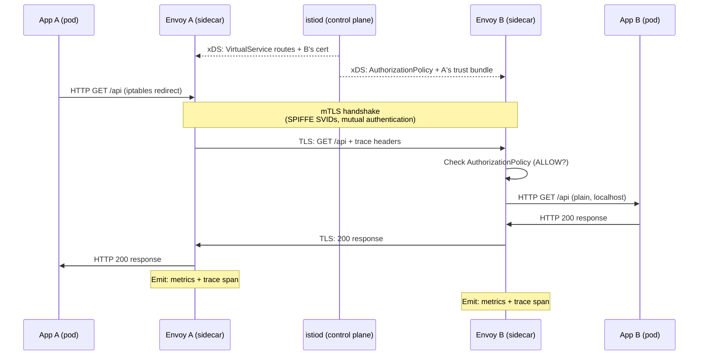

## Keywords in This File

{: .no_toc }

| # | Keyword | Weight |
|---|---------|--------|
| 1 | [Service Mesh: Istio and Envoy Sidecar Pattern](#service-mesh-istio-and-envoy-sidecar-pattern) | high |

---

# Service Mesh: Istio and Envoy Sidecar Pattern

### 🎯 Model Answer

**30 seconds:**
> A service mesh adds a transparent network proxy (the Envoy sidecar) to every pod.
> The sidecar intercepts all inbound and outbound traffic, enabling mTLS encryption,
> traffic management (canary routing, circuit breaking), and observability (distributed
> traces, per-request metrics) without any application code changes. Istio is the most
> common service mesh control plane: it configures all Envoy sidecars via xDS APIs,
> manages certificate issuance for mTLS, and provides traffic policy via VirtualService
> and DestinationRule resources.

**3 minutes (Senior):**
> The sidecar pattern is the fundamental architectural choice: each pod gets an Envoy
> proxy injected alongside the application container. Istio's mutating webhook
> (in istiod) injects the `istio-proxy` container into pods in namespaces labeled
> `istio-injection: enabled`. The injected proxy intercepts ALL network traffic via
> iptables rules added by an init container. The application code calls `localhost:servicePort`;
> the iptables rule redirects to Envoy which handles the connection.
>
> For mTLS: istiod runs a CA (SPIFFE-based, using SVID x.509 certificates). Each
> Envoy proxy gets a certificate tied to its pod's ServiceAccount identity. When pod A
> connects to pod B, Envoy-A presents its certificate; Envoy-B verifies it. Both sides
> verify each other (mutual TLS). From the application's perspective: it makes plain
> HTTP; Envoy handles TLS transparently. Authentication is based on service identity
> (ServiceAccount), not network IP.
>
> Traffic management: VirtualService defines routing rules (send 10% to v2 canary).
> DestinationRule defines connection policies (circuit breaker thresholds, load balancing
> strategy, outlier detection). These are applied at the Envoy proxy level - the source
> pod's Envoy routes traffic according to the policy. This enables canary deployments,
> fault injection for chaos testing, retries, and timeouts without application changes.

**Framework:** SIDECAR INJECTION -> mTLS -> xDS CONFIG -> TRAFFIC MANAGEMENT -> OBSERVABILITY

*Adapting up:* SPIFFE/SPIRE for cross-cluster identity, Envoy xDS API internals
(CDS/EDS/LDS/RDS), ambient mesh (sidecar-less Istio), eBPF-based alternatives (Cilium).

*Adapting down:* "A service mesh puts a proxy next to every app. The proxy handles
encryption, routing, and monitoring so your app code doesn't have to."

**Blank Mind Recovery:**

**(1) Restate:** "Service mesh, Istio, Envoy sidecar. Sidecar proxy intercepts all traffic.
mTLS between services. Traffic routing (canary, circuit breaker) via VirtualService/DestinationRule.
xDS API configures all proxies from central control plane."

**(2) First principles:** "Microservices need: encryption (mTLS), routing control (canary),
reliability (retries/circuit breaker), observability (traces). Implementing each in every
service is repetitive and error-prone. The sidecar moves all of this to the network layer."

**(3) Bridge:** "Service mesh = a building's smart HVAC system vs each tenant managing their
own heating. Central control (Istio) configures all units (Envoy). Tenants (applications) stay
simple. The infrastructure handles the complexity."

---

### 📘 Concept Explanation

**Sidecar injection mechanics:**

When a pod is created in a namespace with `istio-injection: enabled` label:
1. kube-apiserver calls Istio's mutating webhook (istiod at `/inject`)
2. istiod transforms the pod spec: adds `istio-proxy` container (Envoy), adds
   `istio-init` init container (sets iptables rules)
3. Init container runs before app: adds iptables rules to redirect all inbound
   (port 15006) and outbound (port 15001) traffic through Envoy
4. App starts: every outgoing connection goes through Envoy; every incoming connection
   comes from Envoy

The application sees: `localhost:other-service-port` -> Envoy intercepts -> handles
mTLS, retries, observability -> sends to destination service's Envoy.

Manual injection (without webhook): `istioctl kube-inject -f deployment.yaml`

**mTLS (Mutual TLS):**

Traditional TLS: client verifies server identity. One-way.
mTLS: both client AND server present certificates. Both verify each other.

In Istio's mesh:
- Each pod's Envoy holds a certificate issued by Istiod's CA
- Certificate's Subject Alternative Name (SAN) = SPIFFE URI:
  `spiffe://<trust-domain>/ns/<namespace>/sa/<serviceaccount>`
- When pod-A's Envoy connects to pod-B's Envoy:
  - A presents its certificate (I am the `payment-service` SA in `payments` namespace)
  - B verifies A's cert against the mesh CA
  - B presents its certificate
  - A verifies B's cert
  - Encrypted channel established
- Authorization policy can then enforce: "only `payments` SA can call `inventory` service"

```yaml
# Require mTLS for all services in the mesh
kind: PeerAuthentication
apiVersion: security.istio.io/v1beta1
metadata:
  name: default
  namespace: istio-system  # applies mesh-wide
spec:
  mtls:
    mode: STRICT  # STRICT: reject non-mTLS; PERMISSIVE: allow both
```

**Istio xDS API - control plane to data plane:**

Istio uses Envoy's xDS (discovery service) protocol to configure all Envoy proxies.
xDS APIs:
- LDS (Listener Discovery Service): TCP/HTTP listeners and filter chains
- RDS (Route Discovery Service): HTTP routing rules (VirtualService)
- CDS (Cluster Discovery Service): upstream service definitions (DestinationRule)
- EDS (Endpoint Discovery Service): actual pod IP endpoints per cluster

istiod watches Kubernetes Services, Endpoints, VirtualServices, DestinationRules and
translates them into xDS configuration pushed to all Envoy sidecars. Envoy proxies
maintain long-lived gRPC streams to istiod to receive these configurations.

**Traffic Management:**

VirtualService - routing rules:
```yaml
kind: VirtualService
apiVersion: networking.istio.io/v1alpha3
spec:
  hosts: [checkout]   # applies to traffic to 'checkout' service
  http:
  - match:
    - headers:
        x-canary: {exact: "true"}
    route:
    - destination:
        host: checkout
        subset: v2    # canary: requests with x-canary header -> v2
  - route:
    - destination:
        host: checkout
        subset: v1
        weight: 90    # 90% of traffic -> v1
    - destination:
        host: checkout
        subset: v2
        weight: 10    # 10% -> v2 canary
```

DestinationRule - connection policies per subset:
```yaml
kind: DestinationRule
apiVersion: networking.istio.io/v1alpha3
spec:
  host: checkout
  trafficPolicy:
    connectionPool:
      http:
        http1MaxPendingRequests: 100  # circuit breaker
        http2MaxRequests: 1000
    outlierDetection:
      consecutiveErrors: 5           # eject after 5 consecutive errors
      interval: 30s                  # check every 30s
      baseEjectionTime: 30s          # minimum ejection time
  subsets:
  - name: v1
    labels: {version: v1}
  - name: v2
    labels: {version: v2}
```

**Authorization Policy:**

After mTLS establishes identity, authorization controls access:
```yaml
kind: AuthorizationPolicy
apiVersion: security.istio.io/v1beta1
metadata:
  name: inventory-access
  namespace: inventory
spec:
  action: ALLOW
  rules:
  - from:
    - source:
        principals:
          # only payment-service SA can call inventory
          - "cluster.local/ns/payments/sa/payment-service"
    to:
    - operation:
        methods: [GET]
        paths: ["/api/v1/inventory/*"]
```

**Observability:**

Envoy emits per-request metrics to Prometheus:
- `istio_requests_total`: request count with labels (source, destination, response code)
- `istio_request_duration_milliseconds`: request latency histogram

Distributed tracing: Envoy automatically propagates `x-b3-traceid` headers (Zipkin B3
format) and emits spans to Jaeger/Zipkin/Tempo. Application must forward trace headers
(NOT automatically done - app must propagate `x-b3-*` headers from incoming to outgoing requests).

---

### 💻 Code Example

> **Code walkthrough:** Istio canary deployment, mTLS enforcement, circuit breaker, and
> authorization policy.

```yaml
# BAD: Canary deployment via multiple Services + Deployment split
# (without service mesh)
# Problem: can't achieve exact percentage split without complex
# replica math (want 10% canary = 1 of 10 replicas exactly)
# Also: no per-request header routing possible
kind: Deployment
metadata:
  name: checkout-v2
spec:
  replicas: 1   # "10%" only if v1 has exactly 9 replicas
  # This is fragile: replica counts are not percentages
```

```yaml
# GOOD: Istio canary with exact traffic splitting

# Step 1: Both versions as one Service (same selector minus version)
kind: Service
metadata:
  name: checkout
spec:
  selector:
    app: checkout   # selects BOTH v1 and v2 pods

---
# Step 2: VirtualService for traffic split
kind: VirtualService
apiVersion: networking.istio.io/v1alpha3
metadata:
  name: checkout
spec:
  hosts: [checkout]
  http:
  # Header-based routing for testers (QA flag)
  - match:
    - headers:
        x-qa-canary: {exact: "true"}
    route:
    - destination:
        host: checkout
        subset: v2
        port: {number: 8080}
  # Weight-based split for production (10% canary)
  - route:
    - destination:
        host: checkout
        subset: v1
        port: {number: 8080}
      weight: 90
    - destination:
        host: checkout
        subset: v2
        port: {number: 8080}
      weight: 10
    timeout: 5s       # request timeout
    retries:
      attempts: 3
      perTryTimeout: 2s
      retryOn: connect-failure,5xx

---
# Step 3: DestinationRule for subsets + circuit breaker
kind: DestinationRule
apiVersion: networking.istio.io/v1alpha3
metadata:
  name: checkout
spec:
  host: checkout
  subsets:
  - name: v1
    labels: {version: v1}
  - name: v2
    labels: {version: v2}
  trafficPolicy:
    outlierDetection:
      consecutiveGatewayErrors: 5
      interval: 10s
      baseEjectionTime: 30s
      maxEjectionPercent: 50
```

```yaml
# GOOD: Strict mTLS and authorization policy
# Only the frontend SA can call the checkout service

kind: PeerAuthentication
apiVersion: security.istio.io/v1beta1
metadata:
  name: checkout-mtls
  namespace: checkout
spec:
  mtls:
    mode: STRICT   # reject any non-mTLS traffic

---
kind: AuthorizationPolicy
apiVersion: security.istio.io/v1beta1
metadata:
  name: checkout-authz
  namespace: checkout
spec:
  selector:
    matchLabels:
      app: checkout
  action: ALLOW
  rules:
  - from:
    - source:
        principals:
          # Only frontend SA is allowed to call checkout
          - "cluster.local/ns/frontend/sa/frontend-service"
    to:
    - operation:
        methods: [POST]
        paths: ["/api/v1/checkout"]
```

> **Code walkthrough:** The BAD example shows the classic "split traffic via replica count"
> anti-pattern. With HPA and deployment rollouts, the exact replica counts are not guaranteed.
> A 10% canary requires exactly 9 v1 + 1 v2 pod, but HPA might change these counts
> independently. The GOOD example uses VirtualService weight splitting which is exact: 10%
> traffic always goes to v2 regardless of replica counts. The header-based routing allows
> QA testers to explicitly target the canary. The DestinationRule outlier detection configures
> circuit breakers: after 5 consecutive errors from a pod, it's ejected from the load
> balancing pool for 30 seconds. The authorization policy shows zero-trust networking:
> the checkout service only accepts connections from the frontend's ServiceAccount identity,
> verified via mTLS.

---

### 🎓 Answers by Seniority

**Junior / Mid (0-5 years):**
> A service mesh adds a proxy to every pod that handles encryption, routing, and monitoring
> automatically. Istio is the most popular service mesh. It injects an Envoy proxy sidecar
> into each pod. The proxy encrypts traffic between services with mutual TLS (mTLS). It
> also lets you do canary deployments by routing 10% of traffic to a new version. Envoy
> reports metrics and traces to Prometheus and Jaeger so you can see exactly how services
> communicate and where latency comes from.

*Push deeper:* What is the difference between VirtualService and DestinationRule?

---

**Senior / Staff (5+ years):**
> The most important insight about service meshes: the sidecar solves the "Kubernetes
> network is flat" problem. Without a mesh, any pod can call any other pod. With Istio
> mTLS + AuthorizationPolicy: only explicitly permitted service-to-service communication
> is allowed. This implements zero-trust networking where each connection is authenticated
> (mTLS) and authorized (AuthorizationPolicy) regardless of where the request comes from.
> The operational complexity: every pod now runs two containers (app + istio-proxy).
> Resource overhead: 50-100m CPU and 64-128MB memory per proxy. For a cluster with 1000
> pods: 50-100 CPU cores and 64-128GB memory just for proxies. This is significant.
> The decision to adopt a service mesh must weigh: value of mTLS + traffic management +
> observability vs cost of proxy overhead + operational complexity (new CRDs to learn,
> debug proxy issues, webhook dependency). For clusters with strong security and
> observability requirements: worth it. For simple microservices with good existing
> observability: evaluate carefully.

*Push deeper:* Ambient mesh (Istio 1.22 GA in 2024) replaces per-pod sidecars with
a node-level proxy (ztunnel for L4 mTLS) and optional per-namespace waypoint proxies
for L7 traffic management. Eliminates the per-pod memory/CPU overhead entirely.
The tradeoff: ztunnel handles L4 only; L7 features (VirtualService routing, HTTP metrics)
require a waypoint proxy deployed per namespace. This is the architectural future of Istio.

---

### ⚠️ Common Misconceptions

**Misconception 1: "mTLS in a service mesh encrypts data at rest."**
mTLS encrypts data IN TRANSIT between services (pod-to-pod network traffic). It does
not encrypt data stored in etcd, databases, or volumes. Encryption at rest requires
etcd encryption configuration and application-level encryption. mTLS = transport security.

**Misconception 2: "With a service mesh, applications don't need to handle retries."**
Envoy-level retries are for transient network failures (connection refused, TCP reset,
5xx from infrastructure). They are NOT a substitute for application-level retry logic.
Envoy retries the SAME request; they don't handle application-level idempotency.
A non-idempotent request (financial transaction) retried by Envoy = possible duplicate
transaction. Set `retryOn: connect-failure` not `retryOn: 5xx` for non-idempotent operations.

**Misconception 3: "Distributed tracing is automatic with Istio."**
Istio's Envoy sidecar automatically generates spans for inbound and outbound requests.
But it CANNOT automatically propagate trace context between inbound and outbound calls
within the same application. If your app receives a request with trace headers (`x-b3-traceid`)
and makes downstream calls, the app must forward those headers. Without forwarding,
traces appear as disconnected spans, not as a unified request trace. Application code
must propagate: `x-b3-traceid`, `x-b3-spanid`, `x-b3-parentspanid`, and `x-b3-sampled`.

**Misconception 4: "PERMISSIVE mTLS mode is secure."**
Istio's `PERMISSIVE` mTLS mode accepts BOTH mTLS and plain HTTP traffic. This is intended
for gradual migration: gradually introduce mTLS-enabled services while allowing legacy
services to continue without it. In PERMISSIVE mode: any service (inside or outside the
mesh) can call any mesh service in plain HTTP with no authentication. PERMISSIVE is a
migration tool, not a security posture. Production clusters should use STRICT mode after
all services are mesh-enrolled.

---

### 🚨 Failure Modes and Diagnosis

**Failure 1: Pod stuck in Init state after mesh injection**

Symptom: pod in `Init:0/1` state indefinitely. `kubectl describe pod` shows
`istio-init` container is Running but never completes.

Cause: istio-init sets iptables rules. On some container runtimes or security contexts
with `allowPrivilegeEscalation: false` + `NET_ADMIN` capability dropped, iptables
modification fails.

Diagnostic:
`kubectl logs <pod> -c istio-init`
"iptables: No chain/target/match by that name" or "Operation not permitted"

Fix: Istio's init container needs `NET_ADMIN` and `NET_RAW` capabilities. If PSA
`restricted` mode blocks this: use Istio CNI plugin (replaces init container with a
DaemonSet that handles iptables changes from the node level, no sidecar capabilities needed).

**Failure 2: 503 errors between services in mesh**

Symptom: services that communicate normally suddenly return 503 errors.
Envoy access logs show: `upstream_cx_connect_fail` or `upstream_reset_before_response`.

Cause: could be mTLS configuration mismatch (one service in STRICT, calling service
not in mesh), circuit breaker open (outlier detection triggered), or endpoint not ready.

Diagnostic:
```bash
# Check mTLS state between services
istioctl authn tls-check <pod> <service>
# Shows: CLIENT-TLS and SERVER-TLS settings

# Check Envoy proxy config for the source pod
istioctl proxy-config route <pod>
istioctl proxy-config cluster <pod>

# Check Envoy access logs for error codes
kubectl logs <pod> -c istio-proxy | grep -v "200\|304"
```

Fix: if mTLS mismatch: add the calling service to the mesh or change PeerAuthentication
to PERMISSIVE temporarily. If circuit breaker: check destination service health and
adjust outlierDetection thresholds.

**Failure 3: Sidecar injection not happening**

Symptom: pods in a namespace don't have the `istio-proxy` container even though they
should be injected.

Cause: namespace missing `istio-injection: enabled` label, or pod has
`sidecar.istio.io/inject: "false"` annotation, or Istio webhook is down.

Diagnostic:
`kubectl get namespace <ns> --show-labels` - does it have `istio-injection: enabled`?
`kubectl get mutatingwebhookconfiguration istio-sidecar-injector` - is it present?
`kubectl get pods -n istio-system` - is istiod running and healthy?

Fix: `kubectl label namespace <ns> istio-injection=enabled`
Existing pods won't be updated (injection is at creation time). Restart pods:
`kubectl rollout restart deployment -n <ns>`

---

### 🎯 Interview Deep-Dive

| Question Category | Time to Answer |
|---|---|
| Conceptual | 1-2 minutes |
| Mechanism | 2-3 minutes |
| Debugging | 2-3 minutes |
| Trade-off | 2-3 minutes |
| Architecture | 3-4 minutes |
| Advanced | 2-3 minutes |
| Hands-on | 2-3 minutes |
| System Design | 3-5 minutes |
| Security | 2-3 minutes |
| Production | 2-3 minutes |
| Behavioral | 2-3 minutes |
| Comparison | 2-3 minutes |

---

**Q1 [MID] (CONCEPTUAL): What problem does a service mesh solve that Kubernetes doesn't?**

A: Kubernetes provides service discovery (Services/DNS) and basic load balancing. What
it doesn't provide out of the box:

1. Encryption between services: Kubernetes Services route plaintext traffic between pods.
   Any pod on the cluster network can potentially intercept traffic between services.
   A service mesh adds mTLS: all pod-to-pod traffic is encrypted and authenticated.

2. Service identity verification: Kubernetes RBAC controls API server access. But service
   A calling service B over HTTP has no built-in authentication. Any pod can call any
   other pod's exposed port. A service mesh verifies the caller's identity via mTLS
   certificates tied to ServiceAccount identities.

3. Traffic management at the request level: Kubernetes Services load balance at L4 (TCP).
   No built-in support for weighted routing (canary), fault injection, retries, timeouts,
   or circuit breakers. A service mesh adds L7 traffic management.

4. Per-request observability: Kubernetes provides pod-level metrics (CPU, memory).
   No built-in service-to-service request metrics (latency, error rate by service pair).
   A service mesh adds per-request distributed tracing and service-level metrics automatically.

5. Consistent policy across services: implementing retries, timeouts, and circuit breakers
   in each microservice's code requires consistent library usage and configuration.
   A service mesh moves this to the infrastructure layer, applied uniformly.

Summary: Kubernetes manages pods and routing. Service mesh manages communication between pods.

*What separates good from great:* The "service mesh is optional" reality: many successful
microservices deployments don't use a service mesh. They implement encryption via
TLS-terminating load balancers at the ingress layer, handle retries in application code
or via resilience libraries (Resilience4j), and use centralized logging for observability.
The service mesh provides these capabilities transparently at a cost (proxy overhead,
operational complexity). Evaluate whether the gains justify the costs for your specific
architecture.

---

**Q2 [SENIOR] (MECHANISM): How does Istio inject the Envoy sidecar into a pod?**

A: Sidecar injection happens via a Kubernetes mutating admission webhook.

Step 1 - Namespace labeling: the namespace must have label `istio-injection: enabled`.
This labels the namespace as a mesh namespace.

Step 2 - Pod creation: when a pod is created in the labeled namespace, the API server
calls all registered mutating webhooks. Istio registers a MutatingWebhookConfiguration
that matches pod resources in injection-enabled namespaces.

Step 3 - Istiod webhook (at `/inject`): istiod receives the pod spec via the webhook call.
Istiod applies the injection template - adding:
- `istio-init` init container: sets up iptables rules to redirect all traffic through Envoy
- `istio-proxy` container: the Envoy proxy process
- Additional volumes for certificates, configuration

Injected init container (key function):
```bash
# Sets iptables rules to redirect ALL outbound to port 15001 (Envoy)
# and ALL inbound to port 15006 (Envoy)
iptables -t nat -A OUTPUT -p tcp -j ISTIO_OUTPUT
iptables -t nat -A ISTIO_OUTPUT ! -d 127.0.0.1/32 -j ISTIO_REDIRECT
iptables -t nat -A ISTIO_REDIRECT -p tcp -j REDIRECT --to-port 15001
```

After injection: the application thinks it's sending to `service:8080`. iptables
redirects to Envoy at port 15001. Envoy handles mTLS, routing, and observability,
then forwards to the actual destination.

Application visibility: zero. The application never knows about the proxy.

*What separates good from great:* The `sidecar.istio.io/inject: "false"` annotation on
a pod disables injection for that specific pod, even in an injection-enabled namespace.
Use this for: batch jobs that complete quickly (sidecar would prevent pod termination),
pods with host networking, or pods that must not have the proxy for debugging purposes.

---

**Q3 [SENIOR] (MECHANISM): Explain how Istio's mTLS works and what certificates are used.**

A: Istio mTLS is built on SPIFFE (Secure Production Identity Framework for Everyone),
an industry standard for workload identity.

Certificate structure:
- Trust domain: `cluster.local` (the cluster's identity domain)
- SVID (SPIFFE Verifiable Identity Document): x.509 certificate with SAN:
  `spiffe://cluster.local/ns/<namespace>/sa/<service-account>`
- Certificate lifetime: short-lived, default 24 hours (auto-rotated by istiod)

Istiod acts as the CA:
- Issues certificates to Envoy proxies via SDS (Secret Discovery Service) API
- Each Envoy proxy makes an API call to istiod: "I am pod X in namespace Y running as SA Z"
- Istiod verifies the pod's ServiceAccount JWT (proves identity), issues x.509 cert
- Envoy uses this cert for all mTLS connections
- Certs are rotated automatically before expiry

mTLS handshake between pod A and pod B:
1. A's Envoy initiates TLS connection to B's service IP
2. B's Envoy presents its SVID: `spiffe://cluster.local/ns/inventory/sa/inventory-service`
3. A's Envoy verifies B's cert against the mesh CA (from istiod)
4. A's Envoy presents its SVID: `spiffe://cluster.local/ns/payments/sa/payment-service`
5. B's Envoy verifies A's cert
6. TLS session established with mutual authentication
7. Authorization policy checked: is `payments/payment-service` allowed to call `inventory`?

PERMISSIVE vs STRICT:
- PERMISSIVE: accept both mTLS and plain HTTP. No peer authentication.
- STRICT: require mTLS for all connections. Plain HTTP is rejected.
- Migrate: PERMISSIVE during enrollment, STRICT once all services are injected.

*What separates good from great:* Certificate rotation is automatic and happens every
24 hours (default). The short certificate lifetime limits the blast radius of a
compromised certificate. An attacker who obtains a certificate can use it for at most
24 hours before it expires. Compare to static API keys or long-lived certificates
(years) used in many systems. This short-lived credential rotation is one of the key
security benefits of SPIFFE-based identity.

---

**Q4 [STAFF] (ARCHITECTURE): How do you implement a canary deployment with Istio?**

A: Istio canary deployment is the most reliable way to gradually roll out traffic to a
new version with exact percentage control and header-based targeting.

Architecture:

```
               requests
                   |
            [VirtualService]
            /             \
        90%                10%
   [checkout v1]       [checkout v2]
   Deployment v1       Deployment v2
   replicas=5          replicas=1
```

Key insight: replica count doesn't determine traffic percentage. VirtualService weight does.
You can have 1 v2 pod receiving 10% of traffic, or 5 v2 pods receiving 10%.

Implementation:
```yaml
# VirtualService: traffic split
kind: VirtualService
apiVersion: networking.istio.io/v1alpha3
metadata:
  name: checkout
spec:
  hosts: [checkout]
  http:
  # Canary testers always get v2
  - match:
    - headers:
        x-canary-user: {regex: ".+"}
    route:
    - destination:
        host: checkout
        subset: v2
  # Production: 10/90 split
  - route:
    - destination:
        host: checkout
        subset: v1
      weight: 90
    - destination:
        host: checkout
        subset: v2
      weight: 10
    retries:
      attempts: 3
      perTryTimeout: 2s
      retryOn: "5xx,connect-failure"
    timeout: 10s

---
# DestinationRule: define subsets + outlier detection
kind: DestinationRule
apiVersion: networking.istio.io/v1alpha3
metadata:
  name: checkout
spec:
  host: checkout
  subsets:
  - name: v1
    labels: {version: v1}
  - name: v2
    labels: {version: v2}
  trafficPolicy:
    outlierDetection:  # auto-eject unhealthy v2 pods
      consecutiveGatewayErrors: 5
      interval: 10s
      baseEjectionTime: 30s
```

Progressive rollout automation:
Start at 1%, check error rate and latency for 15 minutes.
Increment to 5%, 10%, 25%, 50%, 100% with automated checks at each stage.
Automate via GitOps (Argo Rollouts with Istio integration): defines the rollout
strategy as code, automatically adjusts weights and monitors metrics.

Rollback: change VirtualService weight to 100% v1, 0% v2. Instantaneous traffic cutover.

*What separates good from great:* The AUTOMATED canary analysis is what separates manual
from production-grade canary deployments. Argo Rollouts + Prometheus: define success
criteria ("p99 latency < 500ms, error rate < 1%"). Argo Rollouts queries Prometheus at
each stage. If metrics degrade: automatic rollback. If metrics pass: promote to next weight.
Zero human intervention for normal rollouts. Human involvement only when something goes wrong.

---

**Q5 [STAFF] (TRADE-OFF): Service mesh vs no service mesh for mTLS and observability.**

A: The decision depends on cluster size, security requirements, and operational maturity.

Arguments for service mesh:
- Zero-trust networking: every connection authenticated without app code changes
- Consistent observability: all services get the same metrics and tracing automatically
- Traffic management: canary deployments, circuit breakers, retries in config not code
- Certificate rotation: automated short-lived certificates vs manual long-lived certs

Arguments against / when to avoid:
- Resource overhead: 50-150MB RAM + 50-100m CPU per pod. At 500 pods: 25-75 GB RAM,
  25-50 CPU cores just for proxies
- Latency overhead: double network hop (source Envoy -> destination Envoy). Typically
  1-5ms per hop. For 10ms request latency: 10-50% overhead. For 100ms requests: minimal.
- Operational complexity: new CRDs to learn (VirtualService, DestinationRule, PeerAuthentication),
  webhook dependency for pod creation, sidecar debugging requires `istioctl` tooling
- Debugging complexity: "is the error in my app or in Envoy?" requires new skills

Alternatives to a full service mesh:
- mTLS only: use cert-manager to provision certificates for each service; configure apps
  to use TLS directly. No proxy overhead. More app code changes.
- Application-level observability: OpenTelemetry SDK in each service for tracing, Prometheus
  client libraries for metrics. Per-language implementation but no proxy overhead.
- Ingress-only mTLS: TLS termination at ingress, plain HTTP inside cluster with NetworkPolicy
  for segmentation. Not zero-trust but simpler.

Decision framework:
- < 50 services, low security requirements: skip service mesh
- 50-200 services, moderate requirements: evaluate sidecar overhead vs benefit
- > 200 services, strict compliance (PCI-DSS, HIPAA, zero-trust mandate): service mesh
  worth the complexity

*What separates good from great:* The "ambient mesh" architecture (Istio 1.22 GA) changes
this calculation. Ambient mode uses a node-level ztunnel (no sidecar) for L4 mTLS,
with optional namespace-level waypoint proxies for L7 features. Memory overhead drops
from 50-150MB per pod to ~50MB per NODE. For a 100-node cluster with 1000 pods: 5GB
overhead (ambient) vs 50-150GB overhead (sidecar). As ambient mesh matures, the
resource overhead objection weakens significantly.

---

**Q6 [SENIOR] (DEBUGGING): A service is returning 503 errors in the mesh. Diagnose.**

A: 503 in Istio typically means Envoy couldn't connect to the upstream (destination)
service or the circuit breaker is open.

Step 1: check Envoy access logs for the source pod.
```bash
kubectl logs <source-pod> -c istio-proxy | tail -50
# Look for: `upstream_reset_before_response_started{connection_failure}`,
# `upstream_cx_destroy_remote_with_active_rq`, `circuit_breaker_open`
```

Step 2: check Istio proxy status for the source.
```bash
# Check if Envoy knows about the destination endpoints
istioctl proxy-config endpoints <source-pod> | grep <destination-service>
# Shows: ENDPOINT | STATUS | OUTLIER CHECK | CLUSTER
# If OUTLIER CHECK = FAILED: circuit breaker tripped for this endpoint
```

Step 3: check mTLS configuration.
```bash
istioctl authn tls-check <source-pod> <destination-service>
# Output: ok (mTLS), or mismatch (one side strict, other not in mesh)
```

Step 4: check if PeerAuthentication is in STRICT mode but caller is not injected.
```bash
kubectl get peerauthentication -n <destination-namespace>
# If STRICT: the source service MUST be injected with Envoy
# If source has no sidecar: plain HTTP rejected
```

Step 5: check destination service pods are healthy.
```bash
kubectl get pods -n <destination-namespace> -l app=<service>
# Any pods in CrashLoopBackOff or not Ready?
kubectl describe pod <destination-pod>
# Readiness probe failing? Service unavailable?
```

Common root causes:
- Circuit breaker open: `outlierDetection` triggered due to errors in destination pods
- mTLS mode mismatch: source not in mesh, destination STRICT
- No healthy endpoints: all destination pods failing readiness checks
- Resource limits: destination pod CPU throttled, causing timeouts

*What separates good from great:* `istioctl proxy-config` commands are the service mesh
equivalent of `kubectl describe`. Always start debugging with the proxy config of the
SOURCE pod (not destination): the source's Envoy is the one making routing decisions.
`proxy-config endpoints` shows exactly which endpoints Envoy knows about and their
outlier detection status. A `FAILED` outlier check = circuit breaker is open for that
endpoint. Checking this takes 5 seconds and immediately identifies whether the issue
is in routing or in the destination.

---

**Q7 [STAFF] (ADVANCED): Explain the Envoy xDS API and how Istio uses it.**

A: xDS (Discovery Service) is the protocol by which Istio's control plane (istiod)
communicates its configuration to all Envoy data plane proxies.

The four core xDS APIs:

LDS (Listener Discovery Service): configures Envoy's TCP/HTTP listeners. A listener
defines "what port to listen on" and its filter chain (what to do with connections).
For a service: listener at `:8080`, HTTP filter chain that routes to clusters based on
Host header and URL path.

RDS (Route Discovery Service): configures HTTP routing. For listeners using HTTP/HCM
(HTTP Connection Manager) filter: RDS provides the routing table. Maps (virtual host,
path, headers) -> cluster name. This is how VirtualService routing rules are represented.

CDS (Cluster Discovery Service): configures upstream clusters. A "cluster" in Envoy
is a named group of upstream hosts. Each Kubernetes Service becomes a CDS cluster.
Cluster config includes: load balancing policy, connection pool settings, outlier detection
thresholds. This is how DestinationRule policies are applied.

EDS (Endpoint Discovery Service): provides the actual pod IP:port endpoints for each
CDS cluster. When a pod comes up or goes down, EDS updates the endpoint list without
changing the CDS cluster configuration. This is how Kubernetes Endpoints (pod IPs) are
translated to Envoy's upstream routing.

```
Kubernetes objects -> istiod -> xDS push -> Envoy sidecars

Service/Endpoints -> CDS + EDS -> cluster + endpoints
VirtualService -> RDS -> routing table
DestinationRule -> CDS -> connection policies
PeerAuthentication -> LDS -> TLS filter
AuthorizationPolicy -> LDS -> RBAC filter
```

xDS update mechanism: Envoy establishes a long-lived gRPC stream to istiod. istiod
pushes config updates when any relevant Kubernetes object changes. Updates are
incremental (delta xDS) for large meshes: only send what changed, not the entire
config.

*What separates good from great:* The delta xDS (dxDS) protocol is critical for large
meshes. In a mesh with 1000 services and 10,000 Envoy proxies: if every Kubernetes
Endpoint change sent the full EDS config to all 10,000 proxies, the config overhead
would be massive. Delta xDS sends only the changed endpoints to proxies that are
interested in that service. istiod's control plane efficiency at scale is largely
about minimizing unnecessary xDS pushes.

---

**Q8 [SENIOR] (HANDS-ON): How do you debug a distributed trace that shows high latency in the mesh?**

A: Distributed traces in Istio show latency at each hop. High latency diagnosis:

Step 1: get the trace from Jaeger/Tempo/Zipkin.
The trace shows spans: each Envoy emits an inbound span (receiving the request) and
an outbound span (forwarding to upstream). High gap between spans = processing time in
that service.

Step 2: identify the span with high latency.
```
[frontend Envoy: 0ms -> 350ms] -> [checkout Envoy in: 5ms -> 345ms]
  [checkout app: 10ms -> 340ms]
    [db Envoy out: 15ms -> 330ms] -> [db Envoy in: 20ms -> 325ms]
```
The `checkout app` span is long. The DB call is also long. Is it the application or the DB?

Step 3: check Istio metrics for that service pair.
```bash
# Prometheus: latency histogram for checkout->db
istio_request_duration_milliseconds{
  source_app="checkout",
  destination_app="db",
  response_code="200"
}
# P99 latency for this specific service pair
```

Step 4: check Envoy metrics for connection pool exhaustion.
```bash
kubectl exec <checkout-pod> -c istio-proxy -- \
  pilot-agent request GET /stats | grep -i "pending_overflow\|circuit_breakers"
# pending_overflow = requests queued waiting for connection
# circuit_breakers.*.cx_open = circuit breaker open count
```

Step 5: check if it's an mTLS overhead issue.
For very high-frequency short calls (10ms target, 5ms mTLS overhead = 50% overhead):
`istioctl proxy-config cluster <pod> --fqdn <service>` - verify TLS is negotiated once
per connection (HTTP/2 connection reuse) not per request.

Resolution depends on findings:
- Application slow: optimize the DB query or add caching
- Connection pool exhausted: increase `connectionPool.http.http2MaxRequests` in DestinationRule
- Circuit breaker too aggressive: adjust `outlierDetection.consecutiveGatewayErrors`
- mTLS per-request overhead: ensure HTTP/2 (connection reuse) is used

*What separates good from great:* The most subtle latency source: head-of-line blocking
in HTTP/1.1 connection pools. If Envoy's connection pool to the upstream uses HTTP/1.1
with `maxConnections: 1`, all requests queue behind each other. A single slow request
blocks all following requests. The fix: configure HTTP/2 (multiplexing eliminates
head-of-line blocking) or increase `connectionPool.http.http1MaxPendingRequests`.
`istioctl proxy-config cluster <pod>` shows the connection pool config.

---

**Q9 [STAFF] (SECURITY): Explain SPIFFE and how it enables zero-trust between services.**

A: SPIFFE (Secure Production Identity Framework for Everyone) is an open standard for
workload identity in dynamic infrastructure. It solves: "how do services identify each
other in environments where IPs and hostnames are ephemeral?"

Core SPIFFE concepts:

SPIFFE ID: a structured URI uniquely identifying a workload:
`spiffe://<trust-domain>/<path>`
In Kubernetes via Istio: `spiffe://cluster.local/ns/<namespace>/sa/<service-account>`

SVID (SPIFFE Verifiable Identity Document): the concrete representation of a SPIFFE ID
as an x.509 certificate. The certificate's SAN extension contains the SPIFFE ID.
Envoy proxies hold SVIDs issued by istiod's CA.

Trust domain: `cluster.local` is the cluster's trust domain. Certificates from this
domain are trusted within the cluster. For cross-cluster trust: configure SPIFFE trust
bundles from both clusters.

Why this enables zero-trust:

1. Identity is based on workload (ServiceAccount), not network location (IP).
   A compromised pod can't impersonate another service just by knowing its IP.

2. Credentials are short-lived and auto-rotated (24 hours). Static secrets
   (API keys, long-lived certs) are a common compromise vector. Short-lived SVIDs
   limit the breach window.

3. AuthorizationPolicy is identity-based, not IP-based:
   `payments/payment-service SA -> inventory/inventory-service: POST /checkout`
   This policy is stable even as pods are rescheduled to different IPs.

4. Cross-cluster: with SPIFFE trust bundles shared across clusters, services in
   cluster-A can authenticate to services in cluster-B using the same mechanism,
   enabling zero-trust multi-cluster communication.

SPIRE (SPIFFE Runtime Environment) extends SPIFFE beyond Kubernetes to heterogeneous
environments (VMs, bare metal, cloud functions), using node attestation to prove workload
identity.

*What separates good from great:* The fundamental zero-trust principle that SPIFFE enables:
every connection is authenticated regardless of where it originates. Traditional perimeter
security ("trust everything inside the VPC") fails when one service is compromised and
makes lateral connections. With SPIFFE + Istio AuthorizationPolicy: a compromised
`frontend` pod can only call services that the `frontend` ServiceAccount is explicitly
authorized to call. It cannot call the `admin-api` or the `billing-service` even though
they're in the same cluster and reachable by IP.

---

**Q10 [STAFF] (PRODUCTION): How do you monitor Istio mesh health in production?**

A: Mesh health monitoring covers three layers: control plane health, data plane health,
and application-level service health.

Control plane (istiod):
```bash
# Number of xDS push errors (config push failures to Envoy proxies)
pilot_xds_push_errors_total

# Proxy configuration conflict rate
pilot_conflict_outbound_listener_tcp_over_current_tcp

# Number of managed Envoy proxies connected
pilot_total_xds_connections
```

Alert on: `pilot_xds_push_errors_total > 0` (configuration changes not propagating).

Data plane - per-service health:
```bash
# Error rate per service pair
sum(rate(istio_requests_total{response_code=~"5.."}[1m]))
  by (source_app, destination_app)
/
sum(rate(istio_requests_total[1m]))
  by (source_app, destination_app)

# P99 latency per service pair
histogram_quantile(0.99,
  sum(rate(istio_request_duration_milliseconds_bucket[1m]))
    by (source_app, destination_app, le))
```

Certificate expiry:
```bash
# Time until certificate expires for each workload
istio_agent_cert_expiry_seconds

# Alert when < 48 hours remaining
```

Proxy version drift (when upgrading Istio):
```bash
# Shows all proxy versions - should match after upgrade
istioctl proxy-status
# Output: NAME | CDS | LDS | EDS | RDS | SYNCED
# SYNCED = proxy is up to date with istiod config
```

Kiali dashboard: service topology, error rates, and traffic visualization.
Run Kiali in production for visual debugging: `istioctl dashboard kiali`.

*What separates good from great:* The `pilot_xds_push_errors_total` and
`pilot_total_xds_connections` metrics are the most important for mesh health.
A spike in push errors means Istio can't configure its Envoy proxies - VirtualService
and DestinationRule changes aren't taking effect. If a canary deployment depends on
Istio traffic routing and Istio can't push config updates, the canary routes to 100%
traffic. This is silent until you check istiod metrics. Alert on push errors before
they affect production traffic.

---

**Q11 [STAFF] (COMPARISON): Istio vs Linkerd vs Consul Connect - when do you choose each?**

A:

Istio:
- Most features: full L7 traffic management (VirtualService, DestinationRule, fault injection)
- Widest ecosystem (Kiali, Argo Rollouts integration, SPIFFE native)
- Most complex: steep learning curve, many CRDs, most resource overhead
- Best for: large organizations with complex traffic requirements (canary, A/B testing,
  fault injection for chaos engineering), strong compliance/security requirements

Linkerd:
- Simpler and lighter: 10x less proxy memory overhead (Linkerd-proxy in Rust vs Envoy in C++)
- Fewer CRDs and less configuration
- Automatic mTLS with simpler setup
- Limited L7 features compared to Istio (no VirtualService-style granular routing)
- Best for: teams that want mTLS and observability without the complexity of Istio,
  clusters where proxy overhead is a concern

Consul Connect:
- Multi-platform: works across Kubernetes, VMs, bare metal (Consul agent on each host)
- Service discovery + service mesh in one (Consul catalog + Connect intentions)
- Better for hybrid environments (K8s + non-K8s services in same mesh)
- Less Kubernetes-native than Istio/Linkerd
- Best for: organizations using HashiCorp stack, environments with non-K8s services
  that need to be in the same mesh

eBPF-based (Cilium Service Mesh):
- No sidecar: uses kernel eBPF for transparent mTLS and observability
- Near-zero overhead (kernel level, no proxy process)
- Requires kernel 5.10+ and Cilium CNI
- Less mature than Istio for L7 features
- Best for: performance-critical environments, cost-sensitive clusters

*What separates good from great:* The sidecar vs sidecar-less decision is becoming the
dominant architectural choice. Istio ambient mesh (sidecar-less) and Cilium both move
the proxy to the node level. For new deployments in 2024+: evaluate ambient mesh first.
If Istio ambient provides the needed features without sidecar overhead, it's the
preferred architecture over traditional sidecar-based meshes.

---

**Q12 [STAFF] (BEHAVIORAL): Describe a production incident related to a service mesh
and how you resolved it.**

A (STAR format):

Situation: during a Kubernetes cluster upgrade (1.23 to 1.24), we simultaneously
upgraded Istio from 1.13 to 1.14. After the upgrade, 30% of our microservices started
returning 503 errors intermittently. The errors appeared on random service pairs and
were not consistent (sometimes A->B would fail, sometimes succeed).

Task: diagnose the root cause and restore service availability, which was now breaching
our 99.9% uptime SLO.

Action:
Investigation (30 minutes):

Checked Istio metrics: `pilot_total_xds_connections` had dropped from 450 (expected)
to 280. 170 Envoy proxies were not connected to istiod. Those proxies were using
stale configuration.

Root cause: during the Istio control plane upgrade, istiod pods were briefly unavailable
(rolling restart of the istiod Deployment). Envoy proxies tried to reconnect but the new
istiod version required a different API handshake that the old proxies (not yet upgraded)
couldn't complete. This caused 170 old-version proxies to lose their xDS connection.

With stale configuration: those proxies had outdated endpoint lists (pods that no longer
existed) and outdated routing rules. Requests to stale endpoints returned 503.

Immediate fix:
Forced a rolling restart of all pods whose proxies had lost xDS connection:
```bash
# Get pods with disconnected proxies
istioctl proxy-status | grep "NOT SYNCED" | awk '{print $1}'
# Force restart to get new Envoy proxy version
kubectl rollout restart deployment -n <affected-namespaces>
```

New proxy version connected to new istiod successfully. xDS connections restored to 450.
503 errors resolved within 10 minutes of rollout restart.

Root cause confirmed: the Istio upgrade documentation specified upgrading the data plane
(pods) BEFORE upgrading the control plane (istiod). We upgraded control plane first.
With the correct order (data plane first: all pods restarted to latest proxy, then istiod
upgrade), the proxies would already be on the new version and could connect to the new istiod.

Prevention:
1. Followed Istio canary upgrade procedure: upgrade istiod first in canary mode,
   validate with test namespace, then roll out to all namespaces (which was still wrong)
2. Actually correct: for next upgrade, use `istio.io/rev` label-based revision upgrade
   (istioctl upgrade) which maintains both old and new istiod simultaneously,
   allowing gradual per-namespace migration with rollback capability.

*What separates good from great:* The revision-based upgrade is the operationally safe
approach. `istio.io/rev=1-14` label on a namespace: new pods get istiod 1.14's proxy.
`istio.io/rev=1-13` on another namespace: old proxy version. Old and new istiod run
in parallel. Gradual migration: move namespaces to new revision one by one, validate,
continue. Rollback: re-label namespace to old revision. This eliminates the "big bang"
upgrade risk entirely.

---

### ⚖️ Comparison Table

| | Istio | Linkerd | Consul Connect | Cilium (eBPF) |
|---|---|---|---|---|
| Proxy | Envoy (C++) | Linkerd-proxy (Rust) | Envoy (C++) | eBPF (kernel) |
| Memory overhead | 50-150MB/pod | 5-20MB/pod | 50-100MB/pod | ~50MB/node |
| L7 traffic mgmt | Full (VirtualService) | Limited | Limited | Limited |
| mTLS | SPIFFE/SVID | TLS cert auto-rotate | mTLS with intentions | Transparent (kernel) |
| Multi-cluster | Yes (with federation) | Yes (multi-cluster) | Yes (Consul federation) | Yes (Cluster Mesh) |
| Operational complexity | High | Low | Medium (with Consul) | Medium |
| Best for | Complex traffic mgmt | Simple mTLS + observability | HashiCorp shops | Performance-critical |

---

### 🏛️ System Design

**Service Mesh Architecture for a 200-Service Microservices Platform**

Requirements: zero-trust security (mTLS required), canary deployment support, distributed
tracing, 200 services across 5 namespaces (payments, inventory, users, frontend, infra).

Topology:
```
                    [Istio: istiod (HA, 3 replicas)]
                            xDS push
                    [Envoy sidecars in all pods]
                           |
     [mTLS: all pod-to-pod traffic encrypted + authenticated]
                           |
  [VirtualService routing: canary, A/B, retry, circuit breaker]
                           |
  [Prometheus: istio_requests_total, latency, error rate]
  [Jaeger: distributed traces]
  [Kiali: service topology visualization]
```

Security posture:
- PeerAuthentication: STRICT mode for all namespaces (mTLS enforced)
- AuthorizationPolicy per namespace: explicit allow lists for each service
  ("payments can call inventory, but inventory cannot call frontend")
- External traffic: Ingress Gateway with TLS termination at edge

Traffic management:
- All new deployments: canary with Argo Rollouts + Istio weight split
- Circuit breaker in DestinationRule for all downstream DB calls
- Automatic retries for GET/HEAD requests (idempotent); no retries for POST

Observability:
- RED dashboard (Rate/Error/Duration) per service pair in Grafana
- Trace sampling: 10% in production (100% sampling creates too much data)
- Alert: error rate > 1% for any service pair for > 2 minutes

Upgrade strategy:
- Istio revision-based upgrades (new istiod revision + gradual namespace migration)
- Istio pilot canary: test new istiod on `staging` namespace before production

*What separates good from great:* AuthorizationPolicy default-deny is the zero-trust
foundation. Add a default-deny policy to every namespace:
```yaml
kind: AuthorizationPolicy
metadata: {name: default-deny, namespace: payments}
spec: {}  # empty spec = deny all
```
Then explicitly allow each needed communication path. This means every inter-service
communication is documented in code (AuthorizationPolicy), auditable, and enforced.
Any new service that tries to call a service it's not authorized for: 403, visible in
Istio metrics, alertable. This eliminates the "I didn't know service X was calling service Y"
problem that makes blast radius analysis impossible.

---

### 📊 Diagram

```
Istio data plane - per-request flow:

  App -> [iptables] -> Envoy (15001 outbound)
  -> mTLS handshake with destination Envoy
  -> VirtualService routing (100% v1 or 10% v2)
  -> [destination iptables] -> destination Envoy (15006 inbound)
  -> App

  Side effects per request:
  - Prometheus metrics emitted (latency, status code)
  - Distributed trace span emitted (Jaeger)
  - Access log entry (structured JSON)
```



> **Diagram walkthrough:** The sequence diagram shows the two-plane architecture.
> istiod (control plane) pre-configures both Envoys via xDS before any request arrives:
> routing rules for A's Envoy, authorization policies and trust bundles for B's Envoy.
> When App A makes a request, iptables redirects it to Envoy A. Envoy A performs the mTLS
> handshake with Envoy B (both exchange SPIFFE SVIDs). Envoy B checks the AuthorizationPolicy
> before forwarding to App B. App B receives plain HTTP from its local Envoy - it never
> knows about TLS or the mesh. Both Envoys emit metrics and trace spans. The application
> code is unchanged: it makes plain HTTP calls to service names. All security, traffic
> management, and observability happen transparently in the proxy layer.
