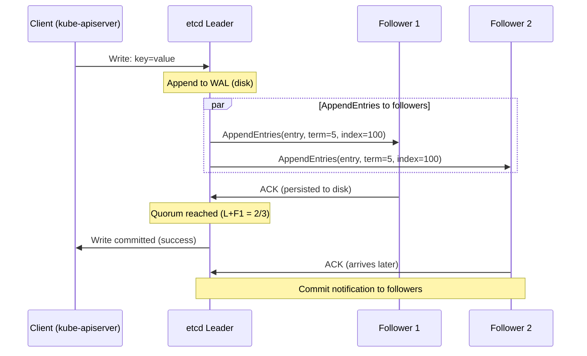

## Keywords in This File

{: .no_toc }

| # | Keyword | Weight |
|---|---------|--------|
| 1 | [etcd Architecture and Consistency](#etcd-architecture-and-consistency) | critical |

---

# etcd Architecture and Consistency

---

### 🎯 Model Answer

**30 seconds:**
> etcd is Kubernetes' distributed key-value store and its single source of truth.
> Every cluster object (pods, deployments, secrets) is stored in etcd. etcd uses
> the Raft consensus algorithm to maintain strong consistency across 3-5 nodes.
> Writes go through the Raft leader; reads from any node return linearizable data.
> etcd failure is cluster failure: no writes can be committed, no objects created.

**3 minutes (Senior):**
> etcd is the most critical component in a Kubernetes cluster. Its health determines
> the API server's ability to function. etcd's consistency guarantees come from Raft:
> a distributed consensus algorithm where a leader receives writes, appends them to a
> replicated log, and commits them only when a quorum (majority) of members acknowledges.
> With 3 nodes: quorum = 2. With 5 nodes: quorum = 3. This is why 3 is the minimum
> for production HA - you can lose 1 node and still have quorum.
>
> The watch API is equally important: clients (kube-apiserver) establish long-lived watch
> streams on key prefixes. When any key changes, etcd pushes the event to all watchers
> immediately. This is how the entire Kubernetes control loop works: controllers watch
> for changes, react, and write back. A slow etcd directly causes controller lag.
>
> Production concerns: etcd stores ALL Kubernetes state, including Secrets (base64-encoded,
> not encrypted by default - you must enable encryption-at-rest). etcd performance degrades
> with large databases; compact and defragment regularly. etcd requires fast disks
> (SSD/NVMe) because Raft log write latency directly impacts API server commit latency.
> Network latency between etcd nodes matters: each write requires a round-trip to quorum.
> Keep etcd nodes in the same datacenter/AZ, never across wide-area networks.

**Framework:** WHAT -> RAFT -> WATCH -> OPERATIONS -> FAILURE

*Adapting up:* Add etcd multi-revision MVCC (multi-version concurrency control),
compaction strategy (periodic vs revision-based), etcd cluster sizing for large
Kubernetes clusters (10,000+ nodes), and etcd as a standalone service (etcd outside
Kubernetes for other distributed systems).

*Adapting down:* "etcd is the database for Kubernetes. It stores all the YAML you
apply. It keeps 3 copies so if one node fails, the cluster keeps working."

**Blank Mind Recovery:**

**(1) Restate:** "etcd architecture and consistency. etcd is K8s's distributed database
using Raft consensus. Writes need majority quorum. The watch API drives all controller
loops. Operations: backup, compaction, defragmentation."

**(2) First principles:** "Distributed systems need consensus to agree on a single value
despite failures. Raft solves this: elect a leader, log writes sequentially, commit only
when quorum confirms. etcd implements Raft for K8s cluster state."

**(3) Bridge:** "etcd's Raft log = a bank's transaction ledger. Every write is appended.
Committed = majority of banks acknowledged the entry. Leader = head teller who coordinates
all transactions. Follower = branch copy of the ledger. Loss of majority = bank can't
process transactions."

---

### 📘 Concept Explanation

**What etcd stores:**
All Kubernetes objects: pods, deployments, services, configmaps, secrets, RBAC rules,
namespaces, persistent volumes - everything. Stored as key-value pairs under
`/registry/{resource}/{namespace}/{name}`.

Example keys:
```
/registry/pods/default/nginx-xyz
/registry/secrets/production/db-password
/registry/deployments/team-a/frontend
```

> **Code walkthrough:** This etcd Architecture and Consistency example demonstrates a key concept in practice using container. **KEY MECHANISM:** the runtime executes these instructions in sequence with specific memory and execution semantics. **WHY IT MATTERS:** misapplying this pattern causes subtle bugs that only manifest under production load. **TAKEAWAY: understand the execution model before using this pattern in production code.**

**Raft consensus:**

Raft is etcd's consensus algorithm. Three roles:

Leader: the node that processes all writes. Receives write request -> appends to its
log -> sends AppendEntries RPC to all followers -> commits once majority ACKs ->
responds to client.

Follower: receives log entries from leader, persists to disk, sends ACK. Does not
process writes directly.

Candidate: follower that hasn't received heartbeat from leader, initiates leader election
by requesting votes from peers. Becomes leader if it receives majority votes.

**Raft write flow:**
```
Client -> Leader: write key=value
Leader: appends entry to log (disk write)
Leader -> Followers: AppendEntries(entry)
Followers: persist to disk, ACK to leader
Leader (majority ACKs received): marks entry committed
Leader -> Client: success
Leader -> Followers: commit notification
```

> **Code walkthrough:** This etcd Architecture and Consistency example demonstrates a key concept in practice. **KEY MECHANISM:** the runtime executes these instructions in sequence with specific memory and execution semantics. **WHY IT MATTERS:** misapplying this pattern causes subtle bugs that only manifest under production load. **TAKEAWAY: understand the execution model before using this pattern in production code.**

Write latency = leader disk write + network round-trip to quorum followers + follower
disk write. This is why etcd requires low-latency SSDs and same-datacenter deployment.

**Quorum and availability:**

| Cluster size | Quorum needed | Can lose N nodes |
|---|---|---|
| 1 | 1 | 0 |
| 3 | 2 | 1 |
| 5 | 3 | 2 |
| 7 | 4 | 3 |

Recommendation: 3 nodes for most clusters (HA without excessive overhead). 5 nodes for
very large or critical clusters. Never 2 or 4 (even numbers don't improve fault tolerance
and can cause split-brain).

**The watch API:**
etcd's most powerful feature. Clients watch key prefixes for changes:
```go
// kube-apiserver establishes watches on all resource types
watchChan := client.Watch(ctx, "/registry/pods/",
  clientv3.WithPrefix()) // watch all pods
for event := range watchChan {
  // event.Type: PUT or DELETE
  // event.Kv.Key, event.Kv.Value: the changed object
  // dispatch to controllers
}
```

> **Code walkthrough:** This etcd Architecture and Consistency example demonstrates Go pattern using SQL. **KEY MECHANISM:** the Go runtime uses a work-stealing scheduler across GOMAXPROCS OS threads. **WHY IT MATTERS:** data races crash with -race flag; concurrent map access panics without sync.Map or mutex. **TAKEAWAY: run go test -race on all packages; use sync primitives for any shared mutable state.**

Watch events have a revision number (monotonically increasing). If a watcher
disconnects, it can re-establish with the last seen revision to receive all missed events.
This ensures no event is lost.

**MVCC (Multi-Version Concurrency Control):**
etcd stores multiple versions of each key. Every write creates a new revision.
Reads can specify a revision to read the state at a point in time. Compaction deletes
old revisions below a threshold to reclaim disk space.

**Operations:**

Compaction (prevents disk exhaustion):
```bash
# Compact revisions older than current - 5000
ETCDCTL_API=3 etcdctl --endpoints=<> compact $(etcdctl endpoint status --write-out=json | jq -r '.[0].header.revision - 5000')
```

> **Code walkthrough:** This 5000 example demonstrates shell script pattern. **KEY MECHANISM:** the shell executes commands sequentially; pipes pass stdout of one command to stdin of the next. **WHY IT MATTERS:** unquoted variables with spaces cause word splitting - IFS splits the value into multiple arguments. **TAKEAWAY: always double-quote variables: "$VAR"; use [[ ]] instead of [ ] for safer conditionals.**

Defragmentation (reclaims space after compaction):
```bash
# Defrag releases disk space freed by compaction
# Run during maintenance: causes brief unavailability
ETCDCTL_API=3 etcdctl --endpoints=<> defrag
```

> **Code walkthrough:** This Run during maintenance: causes brief unavailability example demonstrates shell script pattern. **KEY MECHANISM:** the shell executes commands sequentially; pipes pass stdout of one command to stdin of the next. **WHY IT MATTERS:** unquoted variables with spaces cause word splitting - IFS splits the value into multiple arguments. **TAKEAWAY: always double-quote variables: "$VAR"; use [[ ]] instead of [ ] for safer conditionals.**

Backup (critical for disaster recovery):
```bash
ETCDCTL_API=3 etcdctl --endpoints=<> snapshot save snapshot.db
# Verify:
ETCDCTL_API=3 etcdctl snapshot status snapshot.db
```

> **Code walkthrough:** This Verify: example demonstrates shell script pattern. **KEY MECHANISM:** the shell executes commands sequentially; pipes pass stdout of one command to stdin of the next. **WHY IT MATTERS:** unquoted variables with spaces cause word splitting - IFS splits the value into multiple arguments. **TAKEAWAY: always double-quote variables: "$VAR"; use [[ ]] instead of [ ] for safer conditionals.**

Restore:
```bash
ETCDCTL_API=3 etcdctl snapshot restore snapshot.db \
  --name=etcd-1 \
  --data-dir=/var/lib/etcd-restored \
  --initial-cluster="etcd-1=https://etcd1:2380"
```

> **Code walkthrough:** This Verify: example demonstrates shell script pattern. **KEY MECHANISM:** the shell executes commands sequentially; pipes pass stdout of one command to stdin of the next. **WHY IT MATTERS:** unquoted variables with spaces cause word splitting - IFS splits the value into multiple arguments. **TAKEAWAY: always double-quote variables: "$VAR"; use [[ ]] instead of [ ] for safer conditionals.**

**Encryption at rest:**
Secrets are stored base64-encoded (NOT encrypted) by default. Enable encryption:
```yaml
# /etc/kubernetes/encryption-config.yaml
kind: EncryptionConfiguration
resources:
- resources: [secrets]
  providers:
  - aescbc:
      keys:
      - name: key1
        secret: <base64-encoded-32-byte-key>
  - identity: {}  # fallback for existing unencrypted
```
> **Code walkthrough:** This /etc/kubernetes/encryption-config.yaml example demonstrates YAML configuration pattern using container. **KEY MECHANISM:** YAML parsers are whitespace-sensitive; indentation errors cause silent value misinterpretation. **WHY IT MATTERS:** unquoted strings starting with special chars (*, &, ?, |) trigger YAML parser errors. **TAKEAWAY: quote strings containing YAML special chars; validate YAML before deploying to production.**

Pass `--encryption-provider-config` to kube-apiserver. All new Secrets encrypted;
rotate existing with `kubectl get secrets -A -o json | kubectl replace -f -`.

---

### 💻 Code Example

> **Code walkthrough:** etcd health check commands, performance monitoring,ice. **KEY MECHANISM:** the runtime executes these instructions in sequence with specific memory and execution semantics. **WHY IT MATTERS:** misapplying this pattern causes subtle bugs that only manifest under production load. **TAKEAWAY: understand the execution model before using this pattern in production code.**
> backup/restore procedure, and leader election verification.

```bash
# BAD: Running etcd without regular health checks and backups
# Production clusters have failed catastrophically from unmonitored etcd
# growing until disk full -> data corruption -> cluster unrecoverable

# BAD: etcd on HDD (spinning disk) - WAL writes cause extreme latency
# etcd write latency on HDD: 5-50ms
# etcd write latency on NVMe SSD: 0.5-5ms
# 10x difference directly impacts API server responsiveness
```

```bash
# GOOD: etcd health and performance monitoring

# Check cluster health
ETCDCTL_API=3 etcdctl \
  --endpoints=https://etcd1:2379,https://etcd2:2379,https://etcd3:2379 \
  --cacert=/etc/kubernetes/pki/etcd/ca.crt \
  --cert=/etc/kubernetes/pki/etcd/peer.crt \
  --key=/etc/kubernetes/pki/etcd/peer.key \
  endpoint health

# Expected output:
# https://etcd1:2379 is healthy: committed=123456 ...
# https://etcd2:2379 is healthy: committed=123456 ...
# https://etcd3:2379 is healthy: committed=123456 ...

# Check endpoint status (leader, raft index, database size)
ETCDCTL_API=3 etcdctl endpoint status \
  --endpoints=https://etcd1:2379,https://etcd2:2379,https://etcd3:2379 \
  --write-out=table

# Output: ID | STATUS | LEADER | RAFT INDEX | RAFT APPLIED | DB SIZE | IS LEADER

# Find the current leader
ETCDCTL_API=3 etcdctl endpoint status \
  --endpoints=https://etcd1:2379 \
  --write-out=json | jq '.[0].isLeader'
```

```bash
# GOOD: etcd backup procedure (run from a control plane node)

# 1. Take snapshot
ETCDCTL_API=3 etcdctl \
  --endpoints=https://127.0.0.1:2379 \
  --cacert=/etc/kubernetes/pki/etcd/ca.crt \
  --cert=/etc/kubernetes/pki/etcd/healthcheck-client.crt \
  --key=/etc/kubernetes/pki/etcd/healthcheck-client.key \
  snapshot save /backup/etcd-snapshot-$(date +%Y%m%d%H%M%S).db

# 2. Verify the snapshot
ETCDCTL_API=3 etcdctl snapshot status \
  /backup/etcd-snapshot-20240101120000.db --write-out=table

# Output: HASH | REVISION | TOTAL KEYS | TOTAL SIZE
# Verify: total keys should match your cluster object count

# 3. Upload to object storage (S3, GCS)
aws s3 cp /backup/etcd-snapshot-*.db s3://my-etcd-backups/

# Automate as CronJob in kube-system:
# - runs hourly, retains 24 snapshots, alerts on failure
```


```bash
# BAD: unsafe shell scripting pattern
```

```bash
# GOOD: etcd compaction and defrag (monthly maintenance)

# Step 1: Get current revision
REV=$(ETCDCTL_API=3 etcdctl \
  --endpoints=https://etcd1:2379 \
  endpoint status --write-out=json \
  | jq -r '.[0].header.revision')

# Step 2: Compact (delete old revisions)
# Keep last 5000 revisions for watch backfill
ETCDCTL_API=3 etcdctl compact $((REV - 5000)) \
  --endpoints=https://etcd1:2379

# Step 3: Defrag EACH member (one at a time to avoid quorum loss)
# defrag causes brief unavailability on that member
for endpoint in https://etcd1:2379 https://etcd2:2379 https://etcd3:2379; do
  echo "Defragging $endpoint..."
  ETCDCTL_API=3 etcdctl defrag --endpoints=$endpoint
  sleep 30  # Wait for member to recover before next
done

# Step 4: Verify DB size reduced
ETCDCTL_API=3 etcdctl endpoint status \
  --endpoints=https://etcd1:2379,https://etcd2:2379,https://etcd3:2379 \
  --write-out=table
# DB SIZE should be smaller after defrag
```

> **Code walkthrough:** The first code block shows the dangerous non-practices: running
> etcd without monitoring and using spinning disks. etcd's Raft requires frequent disk
> writes; HDDs add 5-50ms per write which directly cascades to API server latency. The
> health check commands show the essential operational toolkit: endpoint health (is it
> alive?), endpoint status (who's the leader? what's the DB size?). The backup script
> shows the exact procedure including verification and offsite storage - a backup that
> hasn't been verified and tested is no backup at all. The compaction/defrag workflow
> is critical: without regular compaction, etcd grows unboundedly until it hits the
> storage quota (default 2GB) and enters a maintenance mode where it rejects all writes.

---

### 🎓 Answers by Seniority

**Junior / Mid (0-5 years):**
> etcd is the database Kubernetes uses to store everything. When you run kubectl apply,
> the API server writes the object to etcd. When a controller needs to know what pods
> exist, it reads from etcd. etcd runs as a cluster of 3 or 5 nodes so that if one
> fails, the cluster keeps working. It uses the Raft algorithm to keep all copies in
> sync. If etcd goes down, Kubernetes can't create or update any objects.

*Push deeper:* Why must etcd have an odd number of nodes (3, 5) rather than even (2, 4)?

---

**Senior / Staff (5+ years):**
> The most critical insight about etcd: it's the single point of failure for the entire
> Kubernetes control plane. Losing a majority of etcd nodes (losing 2 of 3, or 3 of 5)
> makes the cluster read-only at best and completely down at worst. Recovery requires
> restoring from a backup - meaning you lose all state since the last backup. This is why
> etcd backups are the most critical disaster recovery action in Kubernetes. Take hourly
> snapshots, store off-cluster (S3/GCS), test restore procedures quarterly. The performance
> insight: etcd write latency = Raft round-trip latency. With 3 nodes in the same AZ on
> NVMe SSDs: 1-5ms commit latency. With 3 nodes across AZs: 10-30ms commit latency
> (cross-AZ RTT). Cross-AZ etcd is possible but meaningfully slower. For large clusters
> (1000+ nodes), etcd database size becomes a concern: each object type (pods, events) can
> add gigabytes. Event objects (which flood in) should be stored in a separate etcd cluster
> (`--etcd-servers-overrides` in kube-apiserver) to prevent event spam from impacting
> core cluster state performance.

*Push deeper:* etcd learner nodes (K8s 1.24 etcd 3.4+): a new member that joins as a
non-voting learner, receives log replication but doesn't participate in quorum. Useful for:
adding a new member without risking quorum during data sync (the new member receives the
full log without impacting write availability). Promote to full voting member once caught up.

---

### ⚠️ Common Misconceptions

**Misconception 1: "etcd encrypts Secrets."**
By default, etcd stores Secrets as base64-encoded (NOT encrypted) values. Anyone
with etcd access can read all Secrets. Encryption-at-rest must be explicitly configured
via kube-apiserver's `--encryption-provider-config`. After enabling encryption, existing
Secrets must be force-written to encrypt: `kubectl get secrets -A -o json | kubectl replace -f -`.

**Misconception 2: "Losing one etcd node makes Kubernetes read-only."**
Losing ONE node from a 3-node cluster leaves 2 nodes alive - that's still quorum (2/3).
Kubernetes remains fully functional. Read-only happens only when you LOSE quorum (lose 2
of 3, or 3 of 5). The misconception comes from confusing "node lost" with "quorum lost".

**Misconception 3: "etcd is just a database - I can use any replacement."**
etcd provides specific guarantees that Kubernetes requires: linearizability (reads see
the most recent write), the watch API (push notifications for key changes), and MVCC
(transactional conditional updates with `compare-and-swap`). Regular databases (Postgres,
MySQL) don't provide these guarantees or the watch API. etcd is purpose-built for this use case.

**Misconception 4: "compaction and defragmentation are the same operation."**
Compaction marks old revisions as eligible for reclamation (logical deletion).
Defragmentation physically reorganizes the database file to reclaim the space freed by
compaction. Both are needed: compact first (identify what's garbage), then defrag
(actually free the disk space). Compaction without defrag: space remains allocated.
Defrag without prior compact: nothing to reclaim, minimal effect.

---

### 🚨 Failure Modes and Diagnosis

**Failure 1: etcd storage quota exceeded (writes rejected)**

Symptom: all kubectl write operations fail with "etcdserver: mvcc: database space exceeded".
Cluster becomes effectively read-only.

Cause: etcd DB size exceeded quota (default 2GB). Occurs when compaction is not performed
regularly, or when large objects (Helm releases, operator data) fill the store.

Diagnostic:
`etcdctl endpoint status --write-out=table` -> DB SIZE column near 2GB.
`etcdctl alarm list` -> "NOSPACE" alarm active.

Fix:
1. Compact: `etcdctl compact <revision>`
2. Defrag: `etcdctl defrag`
3. Clear alarm: `etcdctl alarm disarm`
4. Increase quota: kube-apiserver flag `--etcd-quota-backend-bytes=4294967296` (4GB)
5. Long-term: automate monthly compact + defrag; set alarm on DB SIZE > 1.5GB

**Failure 2: etcd leader election storm (split-brain)**

Symptom: API server flapping; etcd logs show repeated leader elections; cluster unstable.

Cause: network partition between etcd nodes; high latency causing election timeouts;
disk I/O starvation causing heartbeat delays.

Diagnostic:
`etcdctl endpoint status` - is the leader stable or changing?
`journalctl -u etcd` - "etcdserver: failed to send message" entries indicate network issues.
`iostat -x 1` on etcd nodes - high I/O wait indicates disk pressure.

Fix: ensure etcd nodes have dedicated SSDs; separate etcd data from OS disk; check
network latency between etcd nodes (`ping` between nodes should be < 5ms for same-AZ).

**Failure 3: Watch stream lag causing controller delays**

Symptom: slow pod scheduling; deployment updates lag minutes behind kubectl apply;
etcd metrics show high watch latency.

Cause: etcd under load can't serve watch events fast enough; too many watchers; large
watch event payloads (large objects being updated frequently).

Diagnostic:
Prometheus: `etcd_debugging_mvcc_watcher_total` - count of active watchers.
`etcd_network_peer_sent_bytes_total` rate - is etcd saturating its network interface?
`etcd_disk_wal_fsync_duration_seconds` - is disk I/O causing latency?

Fix: reduce object churn (events are the worst offenders - store in separate etcd cluster);
add etcd nodes for read scaling (etcd 3.4+ supports lease-based read balancing); upgrade
to faster disks; increase etcd node CPU for serialization overhead.

**Failure 4: etcd backup restore - data loss scenario**

Symptom: etcd cluster unrecoverable; quorum permanently lost; cluster must be rebuilt
from backup.

Diagnostic: `etcdctl endpoint health` returns all endpoints unhealthy.
Cannot establish new quorum with available members.

Recovery procedure:
1. Stop kube-apiserver on all control plane nodes (prevents new writes)
2. Stop etcd on all nodes
3. Restore snapshot on each member:
   `etcdctl snapshot restore snapshot.db --data-dir=/var/lib/etcd --name=etcd-1 --initial-cluster=...`
4. Start etcd on all members
5. Verify cluster health: `etcdctl endpoint health`
6. Start kube-apiserver
7. Verify: `kubectl get nodes`

Data loss = all state since last backup. etcd backup RPO is the key metric.

---

### 🎯 Interview Deep-Dive

| Question Category | Time to Answer |
|---|---|
| Conceptual | 1-2 minutes |
| Raft mechanism | 2-3 minutes |
| Operational | 2-3 minutes |
| Debugging | 2-3 minutes |
| Trade-off | 2-3 minutes |
| Architecture | 3-4 minutes |
| Advanced | 2-3 minutes |
| Production | 2-3 minutes |
| System Design | 3-5 minutes |
| Security | 2-3 minutes |
| Behavioral | 2-3 minutes |
| Performance | 2-3 minutes |

---

**Q1 [MID] (CONCEPTUAL): What is etcd's role in Kubernetes?**

A: etcd is the persistent storage layer for the entire Kubernetes cluster state.

Every Kubernetes object - pods, deployments, services, configmaps, secrets, nodes,
namespaces, RBAC rules - is stored in etcd. When you run `kubectl apply -f deployment.yaml`,
the kube-apiserver serializes the object and writes it to etcd. When the kube-scheduler
or any controller needs to read cluster state, it reads from etcd (via the API server,
which maintains an in-memory cache).

etcd's guarantees that Kubernetes relies on:
1. Strong consistency: reads always return the most recent write (linearizability)
2. Watch API: push notifications when keys change (powers controller reconcile loops)
3. Atomic compare-and-swap: `if currentVersion==N, update to V` (prevents race conditions)

etcd is the single source of truth. If etcd says a pod exists, it exists. If etcd
doesn't have it, it doesn't exist. All K8s components' in-memory caches are derived
from etcd and updated via watches.

Consequence: etcd failure = Kubernetes cluster failure. API server can't commit writes.
Controllers can't update state. Existing pods keep running (kubelet has local state)
but no new pods can be created, no changes can be applied.

*What separates good from great:* The API server's internal cache (using watch+list
to populate) means most reads don't actually hit etcd. Controllers talk to the API
server's cache, not etcd directly. But the API server itself needs etcd to be available
to accept writes and to sync its cache. The distinction matters for understanding why
read-heavy loads don't saturate etcd but write-heavy loads do.

---

**Q2 [SENIOR] (MECHANISM): Explain the Raft leader election process.**

A: Raft leader election uses randomized election timeouts to avoid split elections.

Initial state: all nodes start as followers. Each follower has a randomized election
timeout (150-300ms in etcd).

Heartbeat absence: followers expect heartbeats from the leader every heartbeat interval
(100ms in etcd). If a follower doesn't receive a heartbeat within its election timeout,
it assumes the leader is dead.

Election starts: the follower increments its term number, transitions to Candidate,
votes for itself, and sends RequestVote RPCs to all other nodes.

Voting rules: a node grants a vote if:
1. The candidate's term is >= the voter's current term
2. The voter hasn't voted in this term yet
3. The candidate's log is at least as up-to-date as the voter's log (prevents stale leaders)

Majority wins: the candidate becomes leader if it receives votes from a majority (N/2 + 1)
of nodes. Sends heartbeats immediately to all followers to assert leadership and reset
their election timers.

Split vote: if multiple followers time out simultaneously, no candidate may reach majority.
Randomized timeouts make simultaneous elections rare. If a split occurs, all candidates
time out, increment their term, and try again. The random jitter in timeouts ensures
one candidate eventually gets a head start.

Current term: each term has at most one leader. The term number is persisted to disk.
Stale messages from previous-term leaders are rejected (their term is lower).

*What separates good from great:* The "most up-to-date log" requirement in voting is
critical for safety. A node that's behind in log entries should NOT become leader,
because it might overwrite committed entries that other nodes have. Raft's log comparison
uses (lastLogTerm, lastLogIndex): higher term wins; equal term, longer log wins.
This ensures the elected leader has all committed entries.

---

**Q3 [SENIOR] (MECHANISM): How does etcd's watch API work and why is it critical for Kubernetes?**

A: etcd watches are long-lived gRPC streams that deliver key-change events in real time.

Client establishes a watch:
```go
watchChan := etcd.Watch(ctx, "/registry/pods/default/",
  clientv3.WithPrefix(),         // watch entire subtree
  clientv3.WithRevision(lastRev)) // start from a specific revision
```

> **Code walkthrough:** This Unknown example demonstrates Go pattern using goroutine. **KEY MECHANISM:** the Go runtime uses a work-stealing scheduler across GOMAXPROCS OS threads. **WHY IT MATTERS:** data races crash with -race flag; concurrent map access panics without sync.Map or mutex. **TAKEAWAY: run go test -race on all packages; use sync primitives for any shared mutable state.**

Server side: etcd maintains a "watcher hub" that maps key prefixes to active client
streams. When any key under the watched prefix changes (PUT/DELETE), etcd sends a
WatchResponse with the event type, key, old value, and new value.

Revision-based continuity: each event has a monotonic revision number. If a watcher
disconnects at revision 12345, it reconnects with `WithRevision(12345)` to receive
all events from revision 12345 onward - no events missed, no need to re-list.

Why critical for Kubernetes:
All controllers use the watch API via the informer framework. The kube-apiserver
establishes watches on all resource types in etcd. Informers maintain in-memory
caches of all objects, updated by watch events. This is the event-driven architecture
that makes Kubernetes responsive: pod created -> watch event -> scheduler receives
event within milliseconds -> schedules immediately.

Without the watch API, controllers would need to poll. Polling at 1-second intervals
across thousands of resource types would flood etcd with reads. Watch events are
push-based: zero overhead when nothing changes, immediate delivery when something does.

*What separates good from great:* The watch event compaction issue: if a client is
disconnected for a long time, the revisions it missed may have been compacted. The
client receives an `ErrCompacted` error and must re-list (full state sync) before
resuming watching. The informer framework handles this transparently via a `Resync`
mechanism. Understanding compaction's effect on watches matters for configuring
compaction intervals: compact too aggressively (keep only 100 revisions) and clients
that briefly disconnect need expensive re-lists. Keep enough history for realistic
reconnect scenarios.

---

**Q4 [SENIOR] (OPERATIONAL): What is etcd compaction and why is it necessary?**

A: etcd maintains a revision history for every key (MVCC). Every write creates a new
revision. Without cleanup, the database grows unboundedly.

Why compaction is necessary: etcd's default storage quota is 2GB. In an active cluster:
- 1000 pods, each updated 10x/day = 10,000 pod revisions/day
- 100 configmaps, each updated 5x/day = 500 configmap revisions/day
- Controllers constantly updating status fields = thousands of writes/day

At this rate, a 2GB etcd can fill in days to weeks without compaction.

What compaction does: marks all revisions below a specified revision number as
deletable. The data isn't immediately freed - it's marked as garbage.

After compaction, defragmentation is needed: physically reorganizes the DB file,
returning the garbage-marked space to the OS. Compact without defrag = space stays
allocated. Defrag without compact = nothing is marked for deletion, minimal effect.

Automated compaction in etcd 3.3+:
etcd supports `--auto-compaction-retention` flag. With `--auto-compaction-mode=periodic
--auto-compaction-retention=1h`: automatically compacts every hour, keeping only the
last hour of revision history.

Monitoring:
```bash
# Check DB size - alert if > 1.5GB (approaching 2GB quota)
etcdctl endpoint status --write-out=json | \
  jq '.[0].dbSize'
```

> **Code walkthrough:** This alert if > 1.5GB (approaching 2GB quota) example demonstrates shell script pattern. **KEY MECHANISM:** the shell executes commands sequentially; pipes pass stdout of one command to stdin of the next. **WHY IT MATTERS:** unquoted variables with spaces cause word splitting - IFS splits the value into multiple arguments. **TAKEAWAY: always double-quote variables: "$VAR"; use [[ ]] instead of [ ] for safer conditionals.**

Defrag best practice: run on one member at a time. Defrag causes the member to be
briefly unavailable (it flushes and rebuilds the database file). Other members maintain
quorum. Don't defrag all members simultaneously.

*What separates good from great:* The tradeoff in compaction retention: keep fewer
revisions (compact aggressively) = smaller DB, but watchers that disconnect may need
to re-list (expensive). Keep more revisions = larger DB, better tolerance for watch
client disconnects. In practice: set auto-compaction to 1 hour retention. This provides
60 minutes for a disconnected watcher to reconnect before needing a re-list, while
keeping the DB from unbounded growth.

---

**Q5 [STAFF] (TRADE-OFF): Why is cross-AZ etcd slower and when is it acceptable?**

A: etcd commit latency directly depends on the network round-trip time between the
leader and its followers.

Raft write commit requires: leader receives write -> sends AppendEntries to followers
-> waits for quorum ACK -> responds to client. The commit latency = leader disk write +
max(RTT to quorum followers) + follower disk write.

Same-AZ RTT: 0.1-0.5ms. Cross-AZ RTT: 1-30ms (depends on cloud provider and region).

Impact: an etcd commit that takes 2ms same-AZ takes 15-30ms cross-AZ. This directly
impacts kube-apiserver write throughput (API server waits for etcd commit) and latency.
Cluster operations that require many sequential writes (Helm install with many resources,
operator reconciliation loops) are noticeably slower with cross-AZ etcd.

When cross-AZ etcd is acceptable:
1. Availability > performance: you need etcd to survive a full AZ failure (not just
   a node failure). Cross-AZ etcd survives AZ loss; same-AZ-cluster etcd does not.
2. Low write volume: development clusters, small clusters with infrequent writes.
3. Control plane write SLO > 100ms: if your API server's write SLO is loose, cross-AZ
   latency is acceptable.

Typical production pattern (active-active HA):
- Control plane nodes across 3 AZs: AZ1, AZ2, AZ3
- etcd members colocated with control plane nodes
- Accepts the cross-AZ latency for AZ-level HA
- Mitigated by: NVMe SSDs on etcd nodes, dedicated network, minimizing write volume

Alternative: single-AZ etcd with cross-AZ standby (active-passive). Lower latency,
but AZ loss means failover time (minutes) not automatic recovery.

*What separates good from great:* The "same AZ for etcd, different AZ for control plane
replicas" hybrid: all 3 etcd members in AZ1 (low latency), control plane nodes in AZ1,
AZ2, AZ3. If AZ1 fails: etcd loses all members = cluster down, requires restore from
backup. If AZ2 or AZ3 loses control plane: etcd in AZ1 is fine, remaining control
plane nodes take over. Optimizes latency but still fails on AZ1 loss. This is the
trade-off: maximize etcd performance vs survive any single AZ failure.

---

**Q6 [STAFF] (DEBUGGING): etcd is reporting high fsync latency. Diagnose and fix.**

A: High fsync latency is the most common etcd performance issue. fsync = the OS
syscall that flushes the WAL (write-ahead log) to disk.

Diagnosis:

Step 1: confirm the symptom.
Prometheus: `etcd_disk_wal_fsync_duration_seconds{quantile="0.99"}` > 10ms = high.
`etcd_disk_backend_commit_duration_seconds` > 25ms = database commit slow.
etcd logs: "slow fdatasync" warnings.

Step 2: identify disk root cause.
`iostat -x 1 -d /dev/<etcd-disk>` - is %util (disk utilization) near 100%?
`iotop -ao` - which process is generating the I/O? Is etcd competing with another
process (kubelet log rotation, system backups)?

Step 3: check disk type.
`lsblk -d -o name,rota` - rota=1 means rotating disk (HDD). rota=0 = SSD/NVMe.
HDD: fsync takes 5-50ms. NVMe SSD: fsync takes 0.1-2ms.

Step 4: check for I/O scheduling interference.
On cloud VMs, the disk may be throttled (IOPS limit exceeded).
`cat /sys/block/<dev>/queue/scheduler` - "mq-deadline" or "none" is better than "cfq".
AWS EBS: check CloudWatch metrics for BurstBalance (exhausted = throttled).

Fixes:
1. Move etcd to dedicated NVMe SSD or instance store (fastest option).
2. Separate etcd data disk from OS disk (etcd competes with OS writes).
3. On cloud: use provisioned IOPS (AWS io2) instead of general purpose gp3.
4. Set I/O priority: `ionice -c 1 -n 0 -p <etcd-pid>` (realtime I/O class).
5. Disable `--experimental-initial-corrupt-check` in non-production (expensive disk scan).

*What separates good from great:* For EKS/GKE/AKS managed control planes, you can't
directly control etcd disk. The cloud provider handles this. For self-managed control
planes, using local NVMe instance store (not EBS) is the gold standard for etcd
performance. AWS i3.xlarge instance type has local NVMe storage and is commonly used
for etcd nodes in high-performance clusters.

---

**Q7 [STAFF] (ARCHITECTURE): How does etcd handle a leader failure? Walk through the timeline.**

A: When the etcd leader fails, Raft election recovers the cluster within seconds.

Timeline:

T=0: Leader node (etcd-1) crashes (hardware failure, OOM kill, network partition).

T=0 to T=150ms: Followers (etcd-2, etcd-3) stop receiving heartbeats. Each follower
has a randomized election timeout (150-300ms). They are waiting to see if heartbeats
resume. No elections yet.

T=150-300ms: One follower (whichever times out first, say etcd-2) doesn't receive
a heartbeat by its timeout. It transitions to Candidate, increments term to (old_term+1),
votes for itself, and sends RequestVote to etcd-3.

T~200ms: etcd-3 receives the RequestVote from etcd-2. etcd-3 hasn't voted in this
term. etcd-2's log is at least as up-to-date. etcd-3 grants its vote.

T~210ms: etcd-2 has votes from itself + etcd-3 = 2 out of 3 = majority. etcd-2
becomes the new leader. Sends immediate heartbeats to etcd-3.

T~210ms to T~500ms: kube-apiserver connection to the old leader (etcd-1) fails.
kube-apiserver retries connection to etcd-2 (other endpoints). Re-establishes watch
streams. Resumes serving write requests.

T=500ms-2s: Normal operation restored. New leader election complete. Cluster is
functional.

During the T=0 to T~500ms window:
- New pod creations fail (API server can't commit writes)
- In-flight requests may fail (clients need to retry)
- Existing pods keep running (kubelet has local state, doesn't need API server for
  pod lifecycle)

For clients: use retry with exponential backoff. Most Kubernetes components handle
this automatically.

*What separates good from great:* The kube-apiserver maintains connections to ALL
etcd endpoints, not just the leader. When it detects the leader's connection is lost,
it routes writes to the new leader (which etcd clients discover via the member list).
The etcd client library handles this leader redirect transparently. The failure window
is typically 500ms-2s, not the full election timeout, because the kube-apiserver retries
aggressively.

---

**Q8 [STAFF] (PRODUCTION): How do you restore a Kubernetes cluster from an etcd snapshot?**

A: etcd restore is the Kubernetes disaster recovery procedure. It restores all cluster
state to the snapshot point-in-time.

Prerequisites: a valid etcd snapshot file (`etcdctl snapshot status` shows non-zero
keys), and knowledge of the original cluster configuration (member names, peer URLs).

Restore procedure (for a 3-node etcd cluster):

Step 1: stop kube-apiserver on all control plane nodes.
```bash
# Move manifests out of static pod directory to stop API server
mv /etc/kubernetes/manifests/kube-apiserver.yaml /tmp/
```

> **Code walkthrough:** This Move manifests out of static pod directory to stop API server example demonstrates shell script pattern using container. **KEY MECHANISM:** the shell executes commands sequentially; pipes pass stdout of one command to stdin of the next. **WHY IT MATTERS:** unquoted variables with spaces cause word splitting - IFS splits the value into multiple arguments. **TAKEAWAY: always double-quote variables: "$VAR"; use [[ ]] instead of [ ] for safer conditionals.**

Step 2: stop etcd on all members.
```bash
systemctl stop etcd
# or: move etcd manifest: mv /etc/kubernetes/manifests/etcd.yaml /tmp/
```

> **Code walkthrough:** This or: move etcd manifest: mv /etc/kubernetes/manifests/etcd.yaml /tmp/ example demonstrates shell script pattern using container. **KEY MECHANISM:** the shell executes commands sequentially; pipes pass stdout of one command to stdin of the next. **WHY IT MATTERS:** unquoted variables with spaces cause word splitting - IFS splits the value into multiple arguments. **TAKEAWAY: always double-quote variables: "$VAR"; use [[ ]] instead of [ ] for safer conditionals.**

Step 3: restore the snapshot on EACH member (different --name and peer URLs per member):
```bash
# On etcd-1:
ETCDCTL_API=3 etcdctl snapshot restore /backup/snapshot.db \
  --name=etcd-1 \
  --data-dir=/var/lib/etcd \
  --initial-cluster="etcd-1=https://etcd1:2380,etcd-2=https://etcd2:2380,etcd-3=https://etcd3:2380" \
  --initial-cluster-token=etcd-cluster-1 \
  --initial-advertise-peer-urls=https://etcd1:2380

# On etcd-2 (same snapshot, different --name and --initial-advertise-peer-urls):
ETCDCTL_API=3 etcdctl snapshot restore /backup/snapshot.db \
  --name=etcd-2 \
  --data-dir=/var/lib/etcd \
  --initial-cluster="etcd-1=https://etcd1:2380,etcd-2=https://etcd2:2380,..." \
  --initial-advertise-peer-urls=https://etcd2:2380
```

> **Code walkthrough:** This On etcd-2 (same snapshot, different --name and --initial-advertise-peer-urls): example demonstrates shell script pattern using authentication. **KEY MECHANISM:** the shell executes commands sequentially; pipes pass stdout of one command to stdin of the next. **WHY IT MATTERS:** unquoted variables with spaces cause word splitting - IFS splits the value into multiple arguments. **TAKEAWAY: always double-quote variables: "$VAR"; use [[ ]] instead of [ ] for safer conditionals.**

Step 4: start etcd on all members (restore creates a new cluster with the snapshot state).
```bash
systemctl start etcd
# or: mv /tmp/etcd.yaml /etc/kubernetes/manifests/
```

> **Code walkthrough:** This or: mv /tmp/etcd.yaml /etc/kubernetes/manifests/ example demonstrates shell script pattern using container. **KEY MECHANISM:** the shell executes commands sequentially; pipes pass stdout of one command to stdin of the next. **WHY IT MATTERS:** unquoted variables with spaces cause word splitting - IFS splits the value into multiple arguments. **TAKEAWAY: always double-quote variables: "$VAR"; use [[ ]] instead of [ ] for safer conditionals.**

Step 5: verify etcd is healthy.
`etcdctl endpoint health` - all members should be healthy.

Step 6: start kube-apiserver.
```bash
mv /tmp/kube-apiserver.yaml /etc/kubernetes/manifests/
```

> **Code walkthrough:** This or: mv /tmp/etcd.yaml /etc/kubernetes/manifests/ example demonstrates shell script pattern using container. **KEY MECHANISM:** the shell executes commands sequentially; pipes pass stdout of one command to stdin of the next. **WHY IT MATTERS:** unquoted variables with spaces cause word splitting - IFS splits the value into multiple arguments. **TAKEAWAY: always double-quote variables: "$VAR"; use [[ ]] instead of [ ] for safer conditionals.**

Step 7: verify cluster state.
`kubectl get nodes` - should show pre-backup state.
Check running pods, services - state is as of snapshot time.

Post-restore actions: pods that were running but not in the snapshot may need to be
recreated; workloads may need manual reconciliation; notify teams of data loss window.

*What separates good from great:* The `--initial-cluster-token` flag creates a new
cluster ID, distinguishing the restored cluster from any stale members. Without this,
etcd may refuse to form a cluster if old member data exists. Always use a new unique
token on restore to ensure clean membership.

---

**Q9 [STAFF] (SECURITY): etcd stores Kubernetes Secrets. What are the security implications?**

A: By default, etcd stores Secrets as base64-encoded values, providing encoding (not
encryption). Any actor with etcd read access can retrieve all Secrets.

Threat vectors:
1. Direct etcd access: anyone who can run `etcdctl get /registry/secrets/` gets all
   Secret data. etcd should be accessible ONLY from control plane nodes.
2. etcd snapshot files: a stolen snapshot contains all Secrets in plaintext (base64).
   Snapshots stored in object storage must be encrypted at rest.
3. etcd member certificates: compromise of etcd peer or client certificates allows
   etcd API access. Rotate certificates annually; use short-lived certificates.

Encryption at rest (mitigates risks 1 and 2):
```yaml
# /etc/kubernetes/encryption-config.yaml
apiVersion: apiserver.config.k8s.io/v1
kind: EncryptionConfiguration
resources:
- resources: [secrets]
  providers:
  - aescbc:
      keys:
      - name: key1
        secret: <32-byte-base64-key>  # generate: head -c 32 /dev/urandom | base64
  - identity: {}  # fallback: read unencrypted existing secrets
```

> **Code walkthrough:** This /etc/kubernetes/encryption-config.yaml example demonstrates YAML configuration pattern using container. **KEY MECHANISM:** YAML parsers are whitespace-sensitive; indentation errors cause silent value misinterpretation. **WHY IT MATTERS:** unquoted strings starting with special chars (*, &, ?, |) trigger YAML parser errors. **TAKEAWAY: quote strings containing YAML special chars; validate YAML before deploying to production.**

kube-apiserver flag: `--encryption-provider-config=/etc/kubernetes/encryption-config.yaml`

After enabling: ALL new Secrets are encrypted. Existing Secrets remain unencrypted
until force-written: `kubectl get secrets -A -o json | kubectl replace -f -`.

Key rotation: to rotate keys, add the new key FIRST (as provider 1), old key second.
Run the force-write loop to re-encrypt with the new key. Then remove the old key.
Removing the old key before re-encrypting leaves Secrets unreadable.

External secrets management (better approach for highly regulated environments):
Use HashiCorp Vault, AWS Secrets Manager, or GCP Secret Manager via the secrets-store-csi-driver.
Secrets never stored in etcd - injected directly into pods as files or environment variables.
etcd stores only a reference, not the secret value.

*What separates good from great:* Encryption-at-rest protects against stolen etcd
backup files or physical disk access. It does NOT protect against compromise of the
kube-apiserver (which decrypts before returning to clients) or against a malicious
cluster admin running `kubectl get secret -o yaml`. Defense-in-depth requires:
encryption-at-rest + restrictive RBAC on secrets + audit logging for secret access
+ external secrets manager for most sensitive values.

---

**Q10 [STAFF] (ADVANCED): What is etcd's MVCC implementation and how does it affect performance?**

A: etcd uses MVCC (Multi-Version Concurrency Control) to provide snapshot isolation
and the watch API without locking.

Core mechanism: every write creates a new revision (monotonically increasing integer).
The revision is etcd's "global clock". A key can have multiple versions:
```
key=/registry/pods/default/nginx, revision=100, value=<pod v1>
key=/registry/pods/default/nginx, revision=105, value=<pod v2>  <- current
```

> **Code walkthrough:** This /etc/kubernetes/encryption-config.yaml example demonstrates a key concept in practice using container. **KEY MECHANISM:** the runtime executes these instructions in sequence with specific memory and execution semantics. **WHY IT MATTERS:** misapplying this pattern causes subtle bugs that only manifest under production load. **TAKEAWAY: understand the execution model before using this pattern in production code.**

Benefits of MVCC:
1. Reads don't block writes (no read lock needed): a reader can snapshot at revision 100
   while a writer creates revision 105.
2. Watch history: watchers can request all events from a specific revision,
   enabling missed-event recovery without data loss.
3. CAS operations: `compare-and-swap` uses the revision: "update this key only if its
   current revision is still X". This prevents lost updates in concurrent controllers.

Performance implications:
- Every write creates a new revision entry - more disk writes than a simple overwrite
- High write rates create many revision entries - compaction becomes critical
- Watch event delivery: events are stored as revision entries, delivered to watchers in order
- Database B-tree growth: many revisions = larger B-tree = slower key lookups
  (mitigated by compaction removing old revisions)

Memory usage: etcd keeps an in-memory B-tree index mapping (key, revision) to data
offsets. Large clusters with many object types (1M+ total revisions) can use several
GB of RAM for the index. This is why etcd needs dedicated nodes with substantial RAM
for large clusters.

*What separates good from great:* The B-tree index is rebuilt in memory on startup from
the on-disk database. etcd startup time for a large (10GB) database can be minutes.
This is why etcd can't be simply stopped and restarted quickly; it needs to be kept
healthy. For fast recovery scenarios: keeping etcd healthy at all times is the strategy
(not quick restart). When the index is large, consider running etcd defrag more frequently
to keep the database size manageable.

---

**Q11 [STAFF] (ADVANCED): How do you size an etcd cluster for a 5,000-node Kubernetes cluster?**

A: Large Kubernetes clusters create extreme etcd load. Sizing requires addressing both
performance and storage.

Load analysis at 5,000 nodes:
- 50,000+ pods: each pod update = etcd write. 100 pod updates/second = sustained.
- Events: Kubernetes events (pod scheduling, container starts) are high-volume.
  In large clusters: 1000+ events/minute. Each event = etcd write + watch event to all watchers.
- Lease renewal: node heartbeats use etcd leases. 5,000 nodes renewing every 40s = 125 writes/second.
  This alone can exhaust a modest etcd cluster.

Key sizing decisions:

1. Separate event storage: events are noisy and ephemeral. Move them to a separate
   etcd cluster (`--etcd-servers-overrides` on kube-apiserver for event resource).
   This prevents event spam from degrading core cluster state performance.

2. Increase etcd quota: default 2GB is insufficient. Set 8-16GB.
   `--quota-backend-bytes=8589934592` (8GB).

3. etcd hardware (per node):
   - CPU: 8 vCPUs (serialization/deserialization is CPU-bound)
   - RAM: 32GB (in-memory B-tree index for large databases)
   - Disk: dedicated NVMe, 250GB+ (database + WAL + snapshots)
   - Network: dedicated 10Gbps (watch stream traffic to many watchers)

4. Increase etcd node count: at 5,000 nodes, consider 5-member etcd cluster (tolerates
   2 node failures vs 1 for 3-member).

5. defrag schedule: run weekly, not monthly. Large cluster generates large etcd databases
   quickly.

Monitoring thresholds for large clusters:
- DB size: alert at 4GB, critical at 6GB (before quota at 8GB)
- WAL fsync: alert at P99 > 25ms
- Backend commit: alert at P99 > 50ms
- Watch event delivery latency: alert at P99 > 100ms

*What separates good from great:* The event etcd separation is the single highest-impact
optimization for large clusters. Events are written by every component for every significant
action (pod scheduled, image pulled, container started). A 5,000-node cluster can generate
5,000+ events per minute. Moving events to a separate etcd cluster eliminates ~70% of
the write load from the main etcd cluster, dramatically improving performance for
everything else.

---

**Q12 [STAFF] (BEHAVIORAL): Describe a production etcd incident you diagnosed or prevented.**

A (STAR format):

Situation: our 800-node Kubernetes cluster started experiencing intermittent API server
errors. Deployment updates were timing out. `kubectl get pods` returned stale data.
Alerts fired for elevated API server error rates (HTTP 500/503). The on-call engineer
noted the issue occurred specifically during our nightly Velero backup window.

Task: diagnose the root cause of etcd performance degradation and prevent it from
recurring.

Action:
Investigation (15 minutes):
Checked etcd metrics in Grafana: `etcd_disk_wal_fsync_duration_seconds{quantile="0.99"}`
spiked from 3ms to 180ms exactly at backup start time. `etcd_disk_backend_commit_duration_seconds`
spiked similarly.

Root cause: Velero's backup process used `kubectl` to list all objects across all
namespaces. The list operations hit the API server's informer cache - but the
ETCD_WATCH_EVENTS from the list triggered high watch event volume in etcd. Additionally:
Velero's restic backup ran on each node, causing high I/O on the nodes. On our control
plane nodes (which co-hosted etcd on the same storage), this I/O contention caused
etcd's WAL fsync to spike.

Two root causes confirmed:
1. Velero backup I/O competing with etcd writes (disk contention)
2. Backup's list-all generating high API watch event volume

Immediate mitigation:
Moved the backup window from 2 AM (nightly batch window) to 6 AM (lower cluster activity).
This reduced severity but didn't fix root cause.

Long-term fix:
1. Moved etcd data directory to dedicated instance store SSDs (no more competition
   with EBS volume shared with kubelet, log rotation, etc.)
2. Configured Velero to use `--parallel-files-upload=2` (reduced concurrent backup I/O)
3. Added Prometheus alert: `etcd_disk_wal_fsync_duration_seconds{quantile="0.99"} > 20ms`
   fires before it becomes user-impacting
4. Documented runbook: etcd high fsync -> check iostat, check backup schedules,
   check for unexpected I/O from colocated processes

Result: no etcd-related API server incidents in the following 6 months. The P99 WAL
fsync dropped from periodic 180ms spikes to a stable 2-5ms.

*What separates good from great:* The disk contention root cause is subtle and commonly
missed. etcd documentation explicitly warns against sharing disks with other I/O-intensive
processes. But in practice, many clusters initially use single-EBS-volume control plane
nodes. The dedicated NVMe fix eliminated an entire class of etcd performance incidents.
The alert on WAL fsync latency is now our leading indicator - it fires 30 minutes before
API server impact, giving us time to investigate proactively.

---

### ⚖️ Comparison Table

| | 3-node etcd | 5-node etcd | 7-node etcd |
|---|---|---|---|
| Quorum needed | 2 | 3 | 4 |
| Can lose N nodes | 1 | 2 | 3 |
| Write latency | Lower (fewer ACKs) | Higher | Highest |
| Read scalability | Moderate | Better | Best |
| Operational complexity | Low | Medium | High |
| Use for | Most clusters | Large/critical | Very large/high-availability |

**etcd vs other KV stores:**

| | etcd | Consul | ZooKeeper |
|---|---|---|---|
| Consensus | Raft | Raft | ZAB |
| Watch API | Native (gRPC stream) | Long-poll | Native (watches) |
| Kubernetes native | Built-in | Not used | Legacy only |
| Linearizability | Strict | Strict | Near-linearizable |
| Complexity | Low | Medium | High |
| Best for | Kubernetes | Service mesh + service discovery | Legacy JVM systems |

---

### 🏛️ System Design

**Highly Available etcd for a Production Kubernetes Cluster**

Requirements: 3-AZ deployment, etcd must survive single AZ failure, RPO < 1 hour,
RTO < 10 minutes, cluster size up to 2000 nodes.

Architecture:

```
           AZ1              AZ2              AZ3
    +--------------+  +--------------+  +--------------+
    | Control Plane|  | Control Plane|  | Control Plane|
    |   etcd-1     |  |   etcd-2     |  |   etcd-3     |
    |  (leader)    |  |  (follower)  |  |  (follower)  |
    | NVMe SSD     |  | NVMe SSD     |  | NVMe SSD     |
    |  250GB       |  |  250GB       |  |  250GB       |
    +--------------+  +--------------+  +--------------+
           |                  |                 |
    Dedicated 10Gbps private network (etcd peer traffic)
           |                  |                 |
    +--------------+  +--------------+  +--------------+
    | kube-apiserver|  | kube-apiserver|  | kube-apiserver|
    | (same node)  |  | (same node)  |  | (same node)  |
    +--------------+  +--------------+  +--------------+
                           |
                    NLB / kube-vip
                    (single endpoint for kubectl)
```

> **Code walkthrough:** This Unknown example demonstrates a key concept in practice. **KEY MECHANISM:** the runtime executes these instructions in sequence with specific memory and execution semantics. **WHY IT MATTERS:** misapplying this pattern causes subtle bugs that only manifest under production load. **TAKEAWAY: understand the execution model before using this pattern in production code.**

etcd member specification per node:
- 8 vCPUs, 32GB RAM, dedicated NVMe 500GB
- etcd data: /var/lib/etcd on NVMe (separate from OS disk)
- etcd WAL: /var/lib/etcd/wal on NVMe (same disk, but could separate for higher 
- Network: dedicated 10Gbps for etcd peer traffic (prevents contention with appl

Data protection:
- Automated hourly snapshots via CronJob in kube-system:
  `etcdctl snapshot save` -> S3 with server-side encryption (SSE-S3)
- Snapshot verification: separate verify job tests each snapshot
- Retention: 24 hourly + 7 daily + 4 weekly snapshots
- Encryption at rest: `EncryptionConfiguration` for Secrets resource

Monitoring:
- Prometheus alerts: WAL fsync P99 > 20ms, backend commit P99 > 50ms, DB size > 
- Leader election events: alert on leader change > 3 times/hour
- Member health: alert if any member unhealthy for > 2 minutes

Maintenance schedule:
- Compaction: automated with `--auto-compaction-mode=periodic --auto-compaction-
- Defrag: monthly, one member at a time
- Certificate rotation: annual (or 90-day with automation)
- Disaster recovery drill: quarterly (restore from snapshot in staging environme

Scaling for 2000+ nodes:
- Event storage: move events to separate etcd cluster
  (`--etcd-servers-overrides=events.k8s.io/v1=https://etcd-events:2379`)
- DB quota: increase to 8GB for large clusters
- etcd on dedicated nodes: don't colocate with worker workloads

RPO: 1 hour (automated hourly snapshots). RTO: 10 minutes (restored snapshot procedure
is documented, automated where possible). AZ failure: automatic recovery (quorum maintained
with 2 remaining members). Full cluster failure: restore from snapshot (RTO: 10-
depending on cluster size).

*What separates good from great:* Quarterly disaster recovery drills are the most
important operational practice. A documented restore procedure that's never been tested
is a false safety net. The drill should: use a real snapshot, restore to a staging cluster,
verify Kubernetes objects are present and controllers reconcile, and time the en
process. This catches procedure gaps (expired certificates, wrong flags, missing tools)
before the real incident.

---

### 📊 Diagram

```
Raft write commit timeline:

  Client -> Leader: write (key=v)
  t=0ms:  Leader appends to WAL (disk write)
  t=1ms:  Leader sends AppendEntries to F1, F2 (network)
  t=3ms:  F1 writes to WAL, sends ACK (disk + network)
  t=3ms:  F2 writes to WAL, sends ACK (disk + network)
  t=4ms:  Leader has 2/3 ACKs = COMMITTED
  t=4ms:  Leader responds to Client: success
  t=5ms:  Leader sends commit notification to F1, F2
  Total write latency: ~4ms (same-AZ, NVMe)
```



> **Diagram walkthrough:** The sequence diagram shows the Raft write commit path. The
> leader appends the entry to its write-ahead log (disk), then sends AppendEntries in
> parallel to all followers. The critical insight: the leader responds to the client as
> soon as a QUORUM (majority) of nodes has persisted the entry - it doesn't wait for ALL
> followers. With 3 nodes, the leader commits after the FASTER of the two followers
> responds. The write latency is determined by the faster follower's disk+network, not
> the slower one. This is why having one slower etcd node (different hardware, higher
> disk latency) doesn't linearly degrade write performance - the leader only needs the
> faster follower to commit. However, if the slow follower is always behind, the cluster
> is effectively running as a 2-node cluster for durability purposes.

---

### 💻 Code Example

*(Omit: this concept does not have a programmatic interface that can be demonstrated in code. The conceptual explanation above is sufficient.)*


---

### 🏛️ System Design

*(Omit: system design diagram not applicable for this concept - see ★★★ keywords for full system design coverage.)*


---

### ⚖️ Comparison Table

*(Omit: this is a ★☆☆ foundational concept with no direct alternatives to compare - see higher-difficulty keywords for trade-off analysis.)*


---

### 📊 Diagram

*(Omit: no standalone visual diagram required for this concept - the explanations and code examples above provide sufficient clarity.)*


