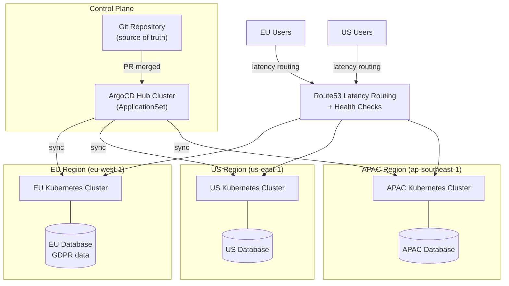

## Keywords in This File

{: .no_toc }

| # | Keyword | Weight |
|---|---------|--------|
| 1 | [Multi-Cluster and Federation Strategy](#multi-cluster-and-federation-strategy) | high |

---

# Multi-Cluster and Federation Strategy

### 🎯 Model Answer

**30 seconds:**
> Multi-cluster Kubernetes means running multiple independent clusters for isolation,
> resilience, or geographic distribution. Active-active deploys workloads in all clusters
> simultaneously with traffic routing. Active-passive keeps standby clusters ready for
> failover. GitOps tools (ArgoCD, Flux) deploy consistently across clusters. Cross-cluster
> service discovery requires federation: Cilium Cluster Mesh for network-level,
> Istio multi-primary for service mesh. The key trade-off: operational complexity per
> cluster multiplied by number of clusters.

**3 minutes (Senior):**
> Multi-cluster motivation: a single cluster can't span multiple cloud regions (latency
> kills distributed Raft/etcd). Regulatory requirements demand data residency in specific
> regions (EU data in EU clusters). Blast radius containment (a misconfigured deployment
> in cluster-A shouldn't affect cluster-B). Tenant isolation (customer A's workloads
> never share a control plane with customer B).
>
> Active-active multi-region: the hardest pattern. Every region runs its own cluster
> with its own etcd and control plane. Application state must be replicated across regions
> (databases: CockroachDB/Spanner for global SQL, DynamoDB Global Tables, Redis Enterprise
> geo-replication). Traffic routing uses global load balancers (AWS Route53 latency routing,
> Cloudflare, Fastly) to route users to their nearest healthy region. Kubernetes itself
> doesn't manage this inter-cluster routing; it's handled at the DNS/load balancer layer.
>
> GitOps for multi-cluster: ArgoCD manages clusters from a central hub. Each cluster
> has an ArgoCD agent (Application controller) registered with the hub. An `Application`
> CRD points to Git source and target cluster. One Git repository = source of truth for
> all clusters. Promotion (dev -> staging -> prod) is a Git operation (branch or path
> change), not a kubectl command. This provides an audit trail, rollback, and consistent
> drift detection across all clusters.

**Framework:** ISOLATION -> FEDERATION -> ROUTING -> GITOPS -> DISASTER-RECOVERY

*Adapting up:* SPIFFE/SPIRE for cross-cluster identity without mesh, service mesh
federation (Istio multi-primary), Karmada for policy-based multi-cluster workload
scheduling, Cell-based architecture for extreme scale.

*Adapting down:* "Multiple clusters = multiple independent Kuberneteses. GitOps deploys
the same code to all of them. Global load balancer routes users to the nearest cluster.
Harder to run but more resilient."

**Blank Mind Recovery:**

**(1) Restate:** "Multi-cluster Kubernetes strategy. Why multiple clusters: isolation,
geo-distribution, blast radius. Patterns: active-active, active-passive. Tools: ArgoCD
for GitOps, Cilium Cluster Mesh or Istio for cross-cluster networking."

**(2) First principles:** "Kubernetes is designed for one cluster. etcd can't span regions
(latency kills consensus). So multi-region = multiple independent clusters. This trades
simplicity for resilience and isolation. Every operational task now multiplied by N clusters."

**(3) Bridge:** "Multi-cluster = multiple independent banks with shared currency and
exchange rules. Each bank (cluster) manages its own vault (etcd). Customers (users)
are routed to their nearest branch by a global routing system. Moving money between
banks (cross-cluster calls) requires an explicit protocol."

---

### 📘 Concept Explanation

**Why multiple clusters?**

The four primary motivations:

1. Geographic distribution / latency: a cluster in eu-west-1 + us-east-1 + ap-southeast-1
   serves users from the nearest region. Single-cluster multi-region is impossible
   (etcd requires < 10ms RTT between members; cross-region is 80-200ms).

2. Blast radius isolation: cluster-A's misconfigured HPA doesn't affect cluster-B.
   A Helm chart with `replicas: 0` applied to cluster-A doesn't cascade. This is why
   large organizations run per-environment (dev/staging/prod) separate clusters, not
   namespaces.

3. Compliance and data residency: EU GDPR: user PII must stay in EU. HIPAA: PHI must
   not leave specific regions. A dedicated EU cluster ensures data never transits to
   a US cluster.

4. Multi-tenant isolation: SaaS providers run a cluster per large enterprise tenant
   (or cluster per tier: shared cluster for SMB, dedicated cluster for enterprise).
   Namespace isolation is insufficient for strong tenant separation.

**Deployment topologies:**

Active-Active: all clusters serve live traffic simultaneously.
```
Users (EU) -> eu-cluster (active, serving EU users)
Users (US) -> us-cluster (active, serving US users)
Users (AP) -> ap-cluster (active, serving AP users)
       |
Global Load Balancer:
  - Latency-based routing (Route53): route to nearest healthy region
  - Health check per region: mark region down if health checks fail
  - Session affinity: keep user on same region for session consistency
```

Pros: lowest latency for all users; withstands full region failure.
Cons: application state must be synchronized across regions; complex.

Active-Passive: one cluster serves traffic; others are on standby.
```
Users -> primary-cluster (active, all traffic)
         |
         | async replication
         |
         standby-cluster (passive, replicated state, no traffic)
```

Pros: simpler (no cross-cluster state sync during operation).
Cons: failover requires DNS change (minutes); standby capacity costs money while idle.

Active-Passive with warm standby: standby cluster runs minimal replicas (1 instead of 10).
On failover: scale up standby rapidly before or alongside DNS switch.

**GitOps for multi-cluster (ArgoCD):**

Central hub architecture:
```
[ArgoCD Hub Cluster]
   |
   |-- Application: "prod-eu" -> git/prod/eu -> target: eu-cluster
   |-- Application: "prod-us" -> git/prod/us -> target: us-cluster
   |-- Application: "staging" -> git/staging -> target: staging-cluster
```

ArgoCD ApplicationSet - templated multi-cluster deployment:
```yaml
kind: ApplicationSet
apiVersion: argoproj.io/v1alpha1
metadata:
  name: my-app
spec:
  generators:
  - list:
      elements:
      - cluster: eu-cluster
        url: https://k8s.eu.example.com
        env: production
      - cluster: us-cluster
        url: https://k8s.us.example.com
        env: production
  template:
    spec:
      project: default
      source:
        repoURL: https://github.com/company/k8s-config
        targetRevision: HEAD
        path: apps/my-app/{{env}}
      destination:
        server: '{{url}}'
        namespace: my-app
      syncPolicy:
        automated:
          prune: true
          selfHeal: true
```

ApplicationSet creates one ArgoCD Application per cluster. Sync policy `selfHeal: true`
means if anyone manually changes a cluster (kubectl edit), ArgoCD reconciles it back
to Git. This is drift detection.

**Cilium Cluster Mesh:**

Cilium CNI supports multi-cluster networking. Each cluster has its own Cilium deployment.
Cluster Mesh creates a federation of clusters:

```yaml
# On each cluster: configure cluster mesh
# cilium-mesh-init connects the clusters

# Cross-cluster Service:
kind: Service
metadata:
  annotations:
    service.cilium.io/global: "true"  # expose to all clusters in mesh
    # Requests can be load balanced across clusters
```

With Cluster Mesh: a Service in cluster-A with `global: true` is reachable from cluster-B
using DNS. Load balancing across clusters is handled by Cilium at the kernel level (eBPF).

Identity: Cilium uses Kubernetes identity (namespace + labels). Cross-cluster connections
are subject to NetworkPolicy from both clusters.

**Istio Multi-Primary (Multi-Cluster):**

Each cluster runs its own Istio control plane (istiod). Clusters share a SPIFFE trust
domain. Cross-cluster service discovery via Kubernetes remote secrets.

```yaml
# Register cluster-B's API server with cluster-A's Istio
kubectl create secret generic istio-remote-secret-cluster-b \
  --from-file=cluster-b=/path/to/kubeconfig-b \
  -n istio-system

# ServiceEntry for cross-cluster service
kind: ServiceEntry
apiVersion: networking.istio.io/v1alpha3
spec:
  hosts: [payments.payments.svc.cluster.local]
  location: MESH_INTERNAL
  ports:
  - number: 8080
    name: http
  resolution: DNS
  addresses: [240.0.0.5]  # VIP for cross-cluster routing
```

mTLS works across clusters: both clusters trust the same SPIFFE CA. Certificates from
cluster-A are valid for service calls to cluster-B.

---

### 💻 Code Example

> **Code walkthrough:** ArgoCD ApplicationSet for multi-cluster deployment and
> cross-cluster service exposure.

```yaml
# BAD: Manual kubectl apply to each cluster
# kubectl apply -f deployment.yaml -> cluster-1
# kubectl apply -f deployment.yaml -> cluster-2
# kubectl apply -f deployment.yaml -> cluster-3
# Problems:
# - No drift detection (what if someone edits cluster-2 manually?)
# - No audit trail (who applied what and when?)
# - Ordering not guaranteed (cluster-2 might be on v1 while cluster-3 is on v2)
# - Rollback requires manual coordination across all clusters
```

```yaml
# GOOD: ArgoCD ApplicationSet for consistent multi-cluster deployment

kind: ApplicationSet
apiVersion: argoproj.io/v1alpha1
metadata:
  name: payment-service
  namespace: argocd
spec:
  generators:
  # Cluster generator: auto-discovers all registered clusters
  - clusters:
      selector:
        matchLabels:
          tier: production    # only production clusters
  template:
    metadata:
      name: 'payment-service-{{name}}'  # unique name per cluster
    spec:
      project: payments-project
      source:
        repoURL: https://github.com/company/platform
        targetRevision: main
        path: services/payment-service/overlays/{{metadata.labels.region}}
        # Each cluster gets its region-specific overlay (replica counts, ingress domains)
      destination:
        server: '{{server}}'       # cluster's API server URL
        namespace: payments
      syncPolicy:
        automated:
          prune: true              # remove resources not in Git
          selfHeal: true           # auto-fix manual changes
        retry:
          limit: 3
          backoff: {duration: 5s, factor: 2, maxDuration: 3m}
      ignoreDifferences:
      - group: apps
        kind: Deployment
        jsonPointers: [/spec/replicas]  # HPA manages this, ignore in diff
```

```yaml
# GOOD: Cross-cluster service exposure with Cilium Cluster Mesh

# Cluster-A: expose payments service globally
kind: Service
metadata:
  name: payments
  namespace: payments
  annotations:
    service.cilium.io/global: "true"
    # Users in cluster-B can now call this service
    # Cilium routes cross-cluster via encrypted tunnel

---
# Cluster-B: consuming cross-cluster service
# Application code: http://payments.payments.svc.cluster.local:8080
# Cilium resolves this to the remote endpoint in cluster-A if no
# local endpoint exists
```

```bash
# Disaster recovery: promote passive cluster to active
# Step 1: scale up standby (if warm standby with reduced replicas)
for deployment in $(kubectl --context=standby-cluster get deploy -n payments -o name); do
  kubectl --context=standby-cluster scale $deployment --replicas=10
done

# Step 2: validate standby cluster health
kubectl --context=standby-cluster get pods -n payments
kubectl --context=standby-cluster top nodes

# Step 3: switch DNS (Route53 health check failover triggers automatically)
# OR manually: update Route53 weighted record to 100% standby
aws route53 change-resource-record-sets \
  --hosted-zone-id Z1234 \
  --change-batch file://failover.json

# Step 4: verify traffic flowing to standby
kubectl --context=standby-cluster logs -n payments -l app=payments -f
```

> **Code walkthrough:** The BAD example shows the multi-cluster anti-pattern: manual
> kubectl apply creates configuration drift as soon as one cluster is changed manually.
> The ApplicationSet generator pattern is the correct approach: one definition generates
> one ArgoCD Application per cluster. Each Application syncs independently but from the
> same Git source. `selfHeal: true` means any manual change is immediately reverted to
> match Git. The `ignoreDifferences` for `spec.replicas` is a critical detail: HPA
> manages replica counts in production, and ArgoCD should not fight HPA by reverting
> replicas to the Git value. The cluster mesh annotation shows the simplest form of
> cross-cluster service exposure: one annotation makes a Service globally addressable.

---

### 🎓 Answers by Seniority

**Junior / Mid (0-5 years):**
> Multi-cluster means running multiple separate Kubernetes clusters, usually in different
> regions or environments (dev/staging/prod). Each cluster is independent - its own etcd,
> its own control plane. GitOps tools like ArgoCD deploy applications consistently across
> clusters by watching a Git repository and syncing each cluster to match. This way, the
> Git repo is the source of truth for all clusters. If someone changes something manually,
> ArgoCD detects the drift and reverts it.

*Push deeper:* Why can't we just use one cluster with multiple namespaces instead of
multiple clusters?

---

**Senior / Staff (5+ years):**
> The fundamental question for multi-cluster strategy is: what's your actual failure domain?
> A cluster is not a failure domain boundary for everything. VMs in the same AZ can
> all fail together (AZ failure). A cluster per AZ doesn't help if the AZ is down.
> For geographic HA: clusters in different REGIONS (not just AZs). For team isolation:
> namespace-level isolation is usually sufficient (RBAC + NetworkPolicy). Cluster-level
> isolation adds: control plane isolation (admin can't accidentally affect another team),
> blast radius containment (HPA/scheduling storm can't cascade), and independent upgrade
> windows. The cost: each cluster multiplies your operational burden (upgrades, monitoring,
> RBAC management, secret rotation). My heuristic: start with namespaces. Add clusters
> when you need: geo-distribution, compliance data residency, or blast radius between
> teams/environments large enough to justify the cost. Don't add clusters for namespace
> isolation - RBAC + NetworkPolicy + ResourceQuota + LimitRange handles that well.

*Push deeper:* Cell-based architecture (Stripe, Shopify, GitHub patterns): divide the
platform into cells, each a complete deployment stack (cluster + data store + regional
endpoints). Each cell is independently upgradeable. A bad deployment reaches 1% of users
(one cell) before promotion to other cells. Cells can be different sizes: a "canary cell"
gets new deployments first. This is multi-cluster at the organizational level.

---

### ⚠️ Common Misconceptions

**Misconception 1: "Multi-cluster means high availability."**
Multi-cluster provides HA only if: traffic routing fails over to healthy clusters when
one fails, application state is replicated across clusters so the standby can serve requests,
and DNS TTLs are short enough for fast failover. Multi-cluster without these properties
is just extra complexity. Two clusters both using the same single database in one region
does not provide database HA.

**Misconception 2: "ArgoCD ensures all clusters are always in sync."**
ArgoCD detects and can correct drift automatically (with `selfHeal`). But drift detection
requires the ArgoCD hub cluster to be healthy and connected to all managed clusters. If
the hub cluster is down or a managed cluster's API server is unreachable, drift detection
stops. Additionally, `selfHeal` can cause unintended rollbacks if the Git repo is the
source of a bug that all clusters need to temporarily diverge from.

**Misconception 3: "Kubernetes federation solves cross-cluster networking."**
Kubernetes Federation (KubeFed) is a CONTROL PLANE federation tool: it propagates resource
definitions (Deployments, Services) across clusters. It does NOT handle network connectivity
between clusters. Pods in cluster-A cannot call pods in cluster-B just because KubeFed
is installed. Cross-cluster networking requires Cilium Cluster Mesh, Istio multi-cluster,
or VPN/peering setup at the infrastructure level.

**Misconception 4: "Blue-green clusters make upgrades risk-free."**
Blue-green cluster upgrades (create new cluster, migrate workloads, terminate old) eliminate
in-place upgrade risk but introduce migration risk: stateful workloads (databases, PVCs)
require data migration, admission webhook configurations must be recreated, node-local
data is lost, and applications may have cluster-specific configurations. Blue-green works
best for stateless workloads. Stateful workloads need careful migration planning regardless.

---

### 🚨 Failure Modes and Diagnosis

**Failure 1: Split-brain between active-active clusters**

Symptom: cluster-A and cluster-B both accept writes to the same entity; data is
inconsistent between clusters; users see different data depending on which cluster serves them.

Cause: cross-cluster database replication lag or failure; traffic routing that sends
the same user to different clusters on different requests.

Diagnostic: check replication lag:
```bash
# For PostgreSQL with streaming replication:
SELECT now() - pg_last_xact_replay_timestamp() AS replication_lag;
# If > 0ms: there is replication lag
```

Fix: implement application-level conflict resolution (CRDTs, last-write-wins), or enforce
session affinity at the global load balancer (pin user to one region for their session),
or use a globally consistent database (CockroachDB, Spanner) that handles conflicts natively.

**Failure 2: GitOps drift between clusters**

Symptom: cluster-B is running a different version than cluster-A; ArgoCD shows one
cluster as OutOfSync; manual investigation reveals unauthorized manual change.

Cause: direct kubectl access to the cluster bypassed GitOps; ArgoCD selfHeal disabled;
ArgoCD hub cluster was down during a critical change.

Diagnostic:
```bash
# ArgoCD CLI: check sync status
argocd app list | grep -v Synced
# Show what's different
argocd app diff my-app-cluster-b
```

Fix: enable ArgoCD selfHeal; restrict direct kubectl access (require ArgoCD for all
changes via RBAC: limit who has cluster-admin or namespace-admin ClusterRoleBindings);
audit who has direct cluster access.

**Failure 3: Cross-cluster DNS resolution failure**

Symptom: services in cluster-B can't resolve services in cluster-A; cross-cluster calls
fail with "No such host" errors.

Cause: Cilium Cluster Mesh disconnected; etcd between clusters unreachable; service
not annotated as global.

Diagnostic:
```bash
# Check Cluster Mesh status
cilium clustermesh status --context=cluster-b
# Should show: all clusters connected, status: Ready
# If not: check connectivity between Cilium agents
```

Fix: restart Cilium pods (`kubectl rollout restart daemonset/cilium -n kube-system`);
check network connectivity between clusters (VPN/peering, security groups); verify
service has `service.cilium.io/global: "true"` annotation.

---

### 🎯 Interview Deep-Dive

| Question Category | Time to Answer |
|---|---|
| Conceptual | 1-2 minutes |
| Architecture | 3-4 minutes |
| Trade-off | 2-3 minutes |
| Debugging | 2-3 minutes |
| GitOps | 2-3 minutes |
| Security | 2-3 minutes |
| System Design | 3-5 minutes |
| Disaster Recovery | 2-3 minutes |
| Networking | 2-3 minutes |
| Advanced | 2-3 minutes |
| Production | 2-3 minutes |
| Behavioral | 2-3 minutes |

---

**Q1 [MID] (CONCEPTUAL): Why would you use multiple Kubernetes clusters instead of namespaces?**

A: Namespaces provide soft multi-tenancy: shared control plane, shared API server, shared
etcd. Clusters provide hard isolation.

When namespaces are sufficient:
- Team isolation: RBAC limits namespace access
- Resource quotas: ResourceQuota per namespace prevents one team exhausting resources
- Network isolation: NetworkPolicy controls inter-namespace communication
- Cost: much less overhead than a separate cluster

When you need separate clusters:

1. Geographic distribution: namespaces can't be in different regions. etcd requires
   low-latency consensus (< 10ms). Cross-region latency (80-200ms) makes a single
   cluster spanning regions impossible.

2. Blast radius at the control plane level: a misconfigured admission webhook in
   namespace-A can affect all pods cluster-wide. A crashing etcd in a single cluster
   affects all namespaces. With separate clusters: cluster-A's issues don't affect cluster-B.

3. Compliance: GDPR requires EU data to stay in EU. A single cluster must keep all
   EU-tenant data in EU nodes - this requires node affinity policies that are complex
   and breakable. A dedicated EU cluster is simpler and safer.

4. Upgrade independence: you may need to upgrade cluster-A's Kubernetes version without
   affecting cluster-B. In-cluster: all workloads upgrade together. Multi-cluster:
   canary your new K8s version on one cluster before all clusters.

5. Different security postures: a cluster running internal admin tools may have different
   PSA settings, network policies, and access controls than a customer-facing cluster.
   Enforcing different policies per cluster is cleaner than per namespace.

*What separates good from great:* The decision has a cost: every new cluster multiplies
operational burden. Upgrades, monitoring, certificate rotation, RBAC management - all
multiplied by N. The break-even point differs by organization size. For a 5-engineer
team: 2-3 clusters maximum (prod, staging, dev). For a 100-engineer platform team:
20-50 clusters across regions and environments becomes manageable with strong automation.
The multiplier is the key decision variable: how much does your cluster count multiply
your operational cost?

---

**Q2 [SENIOR] (ARCHITECTURE): Compare active-active vs active-passive multi-cluster.**

A:

Active-Active:
All clusters serve live traffic simultaneously. Traffic split by geography (latency-routing)
or by workload type (batch on cluster-A, API on cluster-B).

Requirements:
- Application state must be consistent across clusters (or partitioned: EU users' data
  only in EU cluster)
- Global load balancer for intelligent routing
- Database replication: async (lag acceptable) or synchronous (consistency required)
- Each cluster must handle 100% load (if one fails, others absorb full traffic)

Pros:
- Lowest latency: users served from nearest cluster
- No failover time: traffic shifts instantly (DNS health check cutover)
- Full utilization: all clusters serve traffic, no idle standby cost

Cons:
- Complex state replication: avoiding split-brain requires careful design
- Higher cost: all clusters running at 100% capacity
- Complex operations: testing a change requires coordination across clusters

Active-Passive:
One cluster (active) serves all traffic. Other clusters (passive) are warm standbys.

Requirements:
- State replication to standby (database replication, PVC snapshots)
- Runbook for failover (tested quarterly)
- DNS TTL tuned for failover speed (60s TTL = 60s failover delay)

Pros:
- Simpler operations: only one cluster serving traffic at a time
- Simpler state model: no split-brain (only active writes)
- Lower cost for passive: warm standby at reduced capacity

Cons:
- Latency for users not near the active cluster
- Failover delay (DNS propagation, scale-up of standby)
- Failover testing required (passive clusters drift if untested)

Hybrid: active-active per region, active-passive for DR.
EU-west and EU-central are active-active (within EU for data residency).
US cluster is active-passive DR for EU (disaster scenario only).

*What separates good from great:* The "N+1 capacity" requirement for active-active is
often underestimated. Each cluster must handle the full load of N clusters if all other
clusters fail. So for 3 active clusters each serving 1/3 of traffic: each must be sized
to handle 100% load. That's 3x the capacity needed for 1/3 utilization normally. For
cost-sensitive environments: active-passive with fast scale-up (pre-warmed standby nodes)
is often better than active-active with full capacity in all clusters.

---

**Q3 [STAFF] (GITOPS): How does ArgoCD ApplicationSet enable multi-cluster GitOps?**

A: ApplicationSet is ArgoCD's templating mechanism for multi-cluster deployments.

Core concept: one ApplicationSet defines a TEMPLATE for Applications. A Generator
produces the parameters to instantiate the template for each target. One ApplicationSet
can create 50 ArgoCD Applications across 50 clusters from a single definition.

Generators:
1. List generator: explicit list of clusters and parameters:
   ```yaml
   generators:
   - list:
       elements:
       - {cluster: eu-west, env: prod, region: eu}
       - {cluster: us-east, env: prod, region: us}
   ```

2. Cluster generator: auto-discovers ArgoCD-registered clusters:
   ```yaml
   generators:
   - clusters:
       selector:
         matchLabels: {tier: production}
   ```
   New clusters registered with ArgoCD and labeled `tier: production` automatically
   get Applications created.

3. Git generator: discovers target directories from Git:
   ```yaml
   generators:
   - git:
       repoURL: https://github.com/company/platform
       directories:
       - path: clusters/*
   ```
   Adding `clusters/new-cluster/` to Git automatically creates a new Application.

4. Matrix generator: combine two generators (all environments x all regions):
   ```yaml
   generators:
   - matrix:
       generators:
       - list:
           elements: [{env: prod}, {env: staging}]
       - clusters: {selector: {matchLabels: {tier: production}}}
   ```

Promotion strategy via Git:
- All clusters sync from `main` branch: change in `main` = instant deploy to all clusters
- Controlled promotion: clusters watch different branches/paths:
  - dev cluster: `develop` branch
  - staging: `staging` branch (promote via PR from develop)
  - prod: `main` branch (promote via PR from staging)
  Each promotion is a documented Git merge request, not a manual kubectl command.

*What separates good from great:* The `Annotations` and `Labels` on Application objects
generated by ApplicationSet can include cluster-specific metadata that other systems
consume. For example: annotating Applications with the cluster's on-call team ID,
cost center, or compliance zone. Tooling can then: send alerts to the right team based
on which cluster's Application is out of sync, or block sync for compliance-zone clusters
unless an approval workflow completes.

---

**Q4 [STAFF] (TRADE-OFF): When is Cilium Cluster Mesh vs Istio multi-cluster the right choice?**

A:

Cilium Cluster Mesh:
Works at L3/L4 (TCP/IP), using eBPF for cross-cluster routing.
Requirements: Cilium must be the CNI plugin on ALL clusters.
Cross-cluster service discovery: DNS-based, built into Cilium. Service A in cluster-1
can call Service B in cluster-2 using the same DNS name.
Identity: Cilium uses K8s identity (namespace + labels). NetworkPolicy applies cross-cluster.
mTLS: transparent via WireGuard tunnels between clusters (Cilium 1.14+).
No control plane overhead: no istiod, no xDS - all handled by kernel eBPF.

Use Cilium Cluster Mesh when:
- Already using Cilium as CNI (don't want to add Istio)
- L3/L4 cross-cluster routing is sufficient (no HTTP-level routing needed)
- Performance is critical (eBPF is faster than userspace proxies)
- Simple cross-cluster service discovery without full service mesh

Istio Multi-Primary / Multi-Mesh:
Works at L7 (HTTP/gRPC) with full Istio capabilities across clusters.
Requires Istio installed on ALL clusters with shared trust domain.
Cross-cluster service discovery via Kubernetes remote secrets (each cluster's API server
registered with Istio). ServiceEntry for cross-cluster endpoints.
mTLS: SPIFFE certificates shared across clusters via trust bundle.
Full L7 features: VirtualService routing, DestinationRule circuit breakers,
AuthorizationPolicy - all work cross-cluster.

Use Istio multi-primary when:
- Already running Istio service mesh in all clusters
- Need L7 traffic management cross-cluster (canary routing across clusters)
- Need consistent AuthorizationPolicy enforcement across clusters
- Need distributed tracing that spans clusters

Hybrid: Cilium for cross-cluster network (fast, eBPF-level) + Istio within each cluster
for L7 service mesh. Cross-cluster calls go through Cilium tunnel; in-cluster calls
through Istio Envoy sidecars. This avoids double-proxy overhead for cross-cluster paths.

*What separates good from great:* The "don't operate what you don't need" principle applies
to cross-cluster networking. Istio multi-cluster adds significant operational complexity
(synchronized trust bundles, cross-cluster service entries, coordinated certificate rotation).
For most multi-cluster deployments, the services only need to call WITHIN their cluster
(cluster-A handles EU users, cluster-B handles US users - they don't cross-call). In this
case: per-cluster Istio (no multi-cluster config) is sufficient, and cross-cluster
failover is handled at the DNS/load balancer layer, not the service mesh layer.

---

**Q5 [STAFF] (DISASTER RECOVERY): How do you design disaster recovery for multi-cluster Kubernetes?**

A: Disaster recovery (DR) for Kubernetes has two components: cluster state recovery
(etcd snapshots) and application state recovery (database backups).

Cluster state (Kubernetes objects):
```bash
# etcd backup: runs as a CronJob in kube-system
# Every hour: snapshot to S3

# Restore after disaster: creates new cluster from scratch
# Apply etcd snapshot: recovers all K8s objects (Deployments, Services, Secrets)
# Time: 10-30 minutes for cluster restore
```

Application state (databases, PVCs):
- Databases: point-in-time recovery (PITR) via database-native replication
  (PostgreSQL streaming replication, MySQL binlog replication)
- PVCs: Velero backups to S3 (Velero handles PVC snapshots)
- Stateless workloads: no state to recover (just redeploy from Git)

RTO (Recovery Time Objective) targets:
- Control plane: 10-30 minutes (restore etcd snapshot + spin up cluster)
- Stateless workloads: 5-10 minutes (ArgoCD syncs from Git after cluster ready)
- Stateful workloads: 30-60 minutes (depends on database recovery time)
- Target for business: typically RTO = 4 hours for Tier-1, 24 hours for Tier-2

RPO (Recovery Point Objective):
- Control plane: time since last etcd snapshot (1 hour with hourly backups)
- Databases: time since last synchronous or async replication commit

Disaster recovery runbook:

Step 1 (0-5 min): detect failure via PagerDuty / synthetic monitoring.
Step 2 (5-15 min): declare incident, notify stakeholders, start runbook.
Step 3 (15-45 min): provision new cluster in DR region (Terraform/Pulumi).
Step 4 (45-60 min): restore etcd snapshot if needed (or let ArgoCD sync from Git).
Step 5 (60-120 min): database failover (promote replica, or restore from backup).
Step 6 (120-180 min): update DNS to point to DR cluster.
Step 7 (180-240 min): validate, notify users, monitor error rates.

Testing: quarterly DR drills. Simulate a full region failure in staging environment.
Time the end-to-end RTO. Identify gaps in the runbook. Update documentation.

*What separates good from great:* The quarterly DR drill is the most critical practice.
An untested runbook is a fiction. During the drill: use a real etcd snapshot from production
(not a synthetic one), restore in a staging cluster that matches production configuration
(same cluster version, same networking), and validate that ArgoCD syncs all applications
correctly. Measure actual RTO vs target. Find the gaps (expired certificates, missing
IAM permissions, DNS TTL too high) BEFORE the actual disaster.

---

**Q6 [SENIOR] (NETWORKING): How does cross-cluster service discovery work?**

A: Without federation, services in one cluster are not reachable by name from another cluster.
DNS in cluster-A knows about services in cluster-A's etcd only. `payments.payments.svc.cluster.local`
resolves in cluster-A but not in cluster-B.

Options for cross-cluster service discovery:

Option 1 - External Service (no federation):
```yaml
# In cluster-B: define an ExternalName service pointing to cluster-A's service
kind: Service
metadata:
  name: payments
  namespace: payments
spec:
  type: ExternalName
  externalName: payments-lb.eu.example.com
  # Requires cluster-A's service to have an external load balancer
```
Pros: simple, no mesh required. Cons: requires external load balancers; loses service
mesh features; not DNS-consistent (different hostname per cluster).

Option 2 - Cilium Cluster Mesh:
```yaml
# cluster-A service: annotate as global
kind: Service
metadata:
  annotations:
    service.cilium.io/global: "true"
spec: ...  # normal ClusterIP service
```
cluster-B can now call `payments.payments.svc.cluster.local` and Cilium routes it
to cluster-A's pods. DNS name is identical in both clusters.

Option 3 - Istio ServiceEntry:
```yaml
# In cluster-B: define entry for cluster-A service
kind: ServiceEntry
spec:
  hosts: [payments.payments.svc.cluster.local]
  resolution: DNS
  endpoints:
  - address: payments.cluster-a.internal
    ports: {http: 8080}
```
Allows Istio traffic policies (retries, circuit breaker, mTLS) to apply to cross-cluster calls.

Option 4 - KubeFed FederatedService: propagates the Service object to multiple clusters.
All clusters have the same Service definition. Clients within each cluster call the local
instance. No cross-cluster routing needed (each cluster has its own replica).

Best option for most cases: deploy a local replica of each service in every cluster
(option 4). Cross-cluster calls add latency and complexity; they should be minimized.
Design partitioned by cluster, not federated.

*What separates good from great:* The "prefer local" design principle: services should
have replicas in every cluster that needs them. Cross-cluster calls are emergency fallback
(if local replica fails) not the primary path. This means: design the application to be
regionally complete. All dependencies deployed in each cluster. Cross-cluster calls only
for globally unique resources (like a global identity service). This avoids the latency
and reliability penalties of cross-cluster networking as a primary architecture.

---

**Q7 [STAFF] (ADVANCED): What is cell-based architecture in the context of Kubernetes?**

A: Cell-based architecture (used by Stripe, Shopify, GitHub) partitions the platform into
independent "cells", each being a complete deployment of the entire application stack.

A cell contains:
- A dedicated Kubernetes cluster (or a set of clusters per region)
- A dedicated database shard (or regional replica)
- A dedicated ingress and load balancer
- A specific percentage of users or tenants

Cell properties:
- Self-contained: no cell depends on another cell for normal operation
- Independently deployable: rolling out to cell-1 doesn't affect cell-2
- Independently upgradable: kubernetes version, application version per cell
- Bounded blast radius: a bad deployment reaches N users (one cell's worth), not all users

Deployment strategy with cells:
```
Canary cell (1% users):    deploy first, monitor 15 min
Early adopter cell (5%):   deploy if canary green, monitor 30 min
Normal cells (94% users):  deploy progressively if early adopters green
```

Cell routing: at the edge layer (CDN or global load balancer), users are assigned
to cells based on a consistent hash of their user ID or region. The cell assignment
persists for the user's session to prevent cross-cell state inconsistency.

Scale to extreme volumes:
- Single cluster: 5,000 nodes maximum (practical etcd + scheduler limit)
- Cells: each cell is 500-1000 nodes. 100 cells = 100,000 nodes total
- This is how platforms like Stripe operate at extreme scale

Implementation in Kubernetes:
- Each cell is a Kubernetes cluster (or namespace, for lighter isolation)
- ArgoCD ApplicationSet deploys to all cells with cell-specific configuration
- Cell ID is a label on the cluster, used for routing and targeting

*What separates good from great:* The cell model's key insight: failure domains map
to user impact. "Cluster-A is down" means "users assigned to cluster-A are affected."
With cells: "cell-3 is down" means "3% of users are affected." This makes incident
severity proportional to cell count, not total scale. It also enables "dark launches":
deploy to cell-1 without routing any user traffic (cell disabled in load balancer),
run load tests, validate, then enable. The cell is a complete test environment that
mirrors production exactly.

---

**Q8 [STAFF] (SECURITY): How do you manage secrets across multiple clusters?**

A: Multi-cluster secret management has two problems: distribution (getting secrets to
the right cluster) and consistency (keeping secrets synchronized when rotated).

Anti-pattern: committing secrets to Git (even encrypted with SOPS or Sealed Secrets).
This puts the encryption key as the single point of failure and requires re-encrypting
when key rotation occurs.

Recommended: External Secrets Operator (ESO) + central secret store (HashiCorp Vault,
AWS Secrets Manager, GCP Secret Manager).

```yaml
# Installed on each cluster: ExternalSecret polls central Vault
kind: ExternalSecret
apiVersion: external-secrets.io/v1beta1
metadata:
  name: db-password
  namespace: payments
spec:
  refreshInterval: 1h       # re-sync from Vault every hour
  secretStoreRef:
    name: vault-backend
    kind: SecretStore
  target:
    name: db-password       # creates a Kubernetes Secret
    creationPolicy: Owner
  data:
  - secretKey: password
    remoteRef:
      key: payments/db
      property: password
```

Each cluster has a SecretStore configured with its own identity (AWS IRSA, GCP Workload Identity,
or Vault AppRole). The central secret store holds the canonical secret. ESO creates a
local Kubernetes Secret on each cluster. When the secret is rotated in Vault, all clusters
pick up the new value within `refreshInterval`.

Rotation strategy: rotate in the central store, all clusters auto-refresh. Zero per-cluster
manual operation.

Key management: for encryption at rest (etcd encryption), each cluster has its own encryption
key (stored securely, different from other clusters). A compromise of one cluster's encryption
key doesn't expose other clusters' data.

Cross-cluster RBAC: centralize with identity provider (Okta, Google Groups). Platform
engineers authenticate to each cluster's API server via OIDC. Group membership in Okta
determines cluster access level. No per-cluster user management.

*What separates good from great:* Sealed Secrets (the common multi-cluster approach) has
a critical limitation: if the Sealed Secrets private key is lost (which happens during
cluster recreation), all secrets encrypted with that key are permanently unreadable.
Recovery requires re-encrypting all secrets. External Secrets Operator avoids this entirely:
the authoritative secret is in Vault, the cluster just holds a cached copy. Re-creating
the cluster: install ESO, configure SecretStore, ExternalSecrets re-sync automatically.
Zero secret recovery work.

---

**Q9 [STAFF] (PRODUCTION): How do you manage Kubernetes version upgrades across a fleet of clusters?**

A: Fleet upgrades follow a ring-based rollout: canary ring -> early adopters -> general availability.

Ring definition:
- Ring 0 (canary): 1-2 non-critical clusters (dev, sandbox). First to upgrade.
- Ring 1 (early): 3-5 low-stakes clusters (staging, internal tools). Upgrade after Ring 0 stable.
- Ring 2 (standard): bulk of production clusters. Upgrade after Ring 1 stable (usually 1 week).
- Ring 3 (critical): your most business-critical clusters. Last to upgrade.

Upgrade validation at each ring:
1. Upgrade control plane: `kubeadm upgrade plan` -> `kubeadm upgrade apply v1.X.Y`
   (or managed cluster upgrade button for EKS/GKE/AKS)
2. Run validation suite: deploy test workloads, verify API compatibility, run smoke tests
3. Monitor 48-72 hours: check error rates, latency, API server logs for deprecation warnings
4. If all clear: promote to next ring

API deprecation handling (the main upgrade risk):
```bash
# Check for deprecated API usage before upgrade
kubectl convert --local -f deployment.yaml \
  --output-version apps/v1

# Pluto: automated deprecated API scanner
pluto detect-files -d deploy/
# Or for live clusters:
pluto detect-helm -o markdown

# Check what's using deprecated APIs:
kubectl get apiservice | grep -v True
```

Automation for fleet upgrades:
- ArgoCD ApplicationSet: update the Kubernetes version parameter in Git -> all rings
  deploy in sequence (with manual approval gates between rings)
- Terraform/Pulumi for cluster lifecycle: version is a variable, updated per ring

Managed cluster upgrades (EKS/GKE/AKS):
- EKS: update eksctl config, `eksctl upgrade nodegroup`
- GKE: automatic upgrade (can configure maintenance windows)
- AKS: `az aks upgrade`
These handle control plane upgrades. Node groups still need rolling replacement.

*What separates good from great:* The 1-2 version skew rule: Kubernetes supports
kubelet/kube-apiserver version skew of N-2 (kubelet can be 2 minor versions behind
kube-apiserver). This means you CAN upgrade the control plane 2 minor versions ahead
of node upgrades. For large clusters with slow node upgrades: upgrade control plane
first (immediate), then roll node upgrades over days/weeks. Nodes on old version
still work with new apiserver. This derisks the upgrade: control plane is modern,
nodes upgrade gradually during maintenance windows.

---

**Q10 [STAFF] (COMPARISON): GitOps with ArgoCD vs Flux - architectural differences.**

A:

ArgoCD:
- Hub architecture: one ArgoCD instance can manage N clusters
- CRD-driven: Application, AppProject, ApplicationSet
- UI-first: rich dashboard for sync status, diff visualization, manual sync triggers
- RBAC built-in: fine-grained access control to which teams can sync which Applications
- Better for: large organizations with many teams managing many clusters, centralized
  platform team managing deployments

Flux:
- Agent architecture: one Flux instance per cluster (installed IN the cluster)
- GitRepository, Kustomization, HelmRelease CRDs
- Event-driven push: image update automation (Flux detects new image tags, commits to Git)
- Dependency management: `dependsOn` field for deployment ordering (install CRDs before operators)
- Better for: teams who prefer cluster-local agents, image update automation

Key architectural difference:
ArgoCD: central hub pulls from Git, pushes to many clusters. Security: hub cluster has
admin credentials for all managed clusters. Compromise of hub = compromise of all clusters.
Flux: each cluster has its own Flux agent, connects only to Git. No single hub with
cross-cluster credentials. Security posture: each cluster manages itself.

For highly security-sensitive environments: Flux's agent-per-cluster model is preferred
(blast radius of a compromised agent = one cluster). ArgoCD's hub model requires
careful security of the hub cluster.

Both support: Helm, Kustomize, plain manifests; multi-cluster; GitOps reconciliation loop.

*What separates good from great:* The ArgoCD ApplicationSet + Cluster generator combination
(auto-discovers clusters) makes ArgoCD superior for large fleets (50+ clusters). Adding
a new cluster: register with ArgoCD, add a label. ApplicationSet automatically creates
Applications for it. With Flux: each cluster needs its own Flux install and bootstrap.
For < 10 clusters: Flux is lighter and simpler. For > 20 clusters: ArgoCD's centralized
management justifies the hub-cluster security risk (mitigated by strong hub security).

---

**Q11 [STAFF] (ADVANCED): How does SPIFFE enable cross-cluster zero-trust without a service mesh?**

A: SPIFFE without a mesh is implemented via SPIRE (SPIFFE Runtime Environment), which
provides workload identity independent of the service mesh.

SPIRE architecture:
- SPIRE Server: a centralized service that issues SPIFFE identities (SVIDs)
- SPIRE Agent: a DaemonSet on each node, attests workload identity to the server
- Workload API: a local socket on each node that workloads use to get their SVID

Trust federation across clusters:
```yaml
# SPIRE Server on cluster-A trusts SPIRE Server on cluster-B
# via "trust bundle federation"
# cluster-A's SPIRE Server publishes its CA cert at a well-known endpoint
# cluster-B's SPIRE Server registers cluster-A's CA as a trusted domain
```

How workloads use it (without Envoy):
1. Your application calls the Workload API via gRPC (using SPIFFE SDKs for Java, Go, Python)
2. SPIRE Agent attests: "this process running as SA X in pod Y" -> issues x.509 SVID
3. Application uses SVID to establish mTLS with the target service
4. Target verifies the SVID against the trusted SPIRE CA

Cross-cluster: cluster-A workload has SVID `spiffe://cluster-a/ns/payments/sa/payment-service`.
Cluster-B workload verifies this SVID against the federated trust bundle from cluster-A.
Each workload handles its own TLS - no proxy needed.

When to use SPIRE vs Istio for cross-cluster identity:
- Istio: easier, automatic (no app code changes) but requires Istio everywhere
- SPIRE: more work (SDK integration) but language-agnostic, works for VMs + bare metal,
  and doesn't require a service mesh

For Kubernetes-only: Istio multi-cluster is simpler. For hybrid (K8s + VMs + Lambda):
SPIRE is the only practical option for consistent identity.

*What separates good from great:* SPIRE's node attestation is its trust root. The SPIRE
Agent proves to the SPIRE Server that it's running on a legitimate node via platform
attestation: on AWS, it uses the EC2 instance identity document (signed by AWS KMS).
On GKE, it uses the node's service account token. This chain of trust goes from: AWS/GCP
proves this is a real instance -> SPIRE proves this is a specific node -> SPIRE proves
this workload is running as a specific ServiceAccount -> Application holds an SVID.
No static credentials anywhere in the chain.

---

**Q12 [STAFF] (BEHAVIORAL): Describe how you implemented multi-cluster for a global SaaS platform.**

A (STAR format):

Situation: our SaaS platform served 10,000 enterprise customers from a single US-based
Kubernetes cluster. EU customers had latency of 150-200ms (US-East to EU). Three EU
customers required GDPR data residency: "no EU user data can leave the EU." Our single
cluster also had one outage in the previous year that affected all customers for 3 hours.

Task: design and implement multi-cluster architecture that: (1) reduced EU customer latency,
(2) achieved GDPR data residency, (3) reduced blast radius so a future outage affects
fewer customers.

Action (over 6 months):

Phase 1 (Month 1-2) - Cluster topology design:
Decided on: us-east-1 (existing, 60% of customers), eu-west-1 (new, EU customers),
us-west-2 (new, West Coast + APAC). Routing: Route53 latency-based routing.
Data model: each cluster gets its own database (no cross-cluster database calls).
EU customers' data written to eu-west-1 database only (GDPR compliance).

Phase 2 (Month 2-3) - GitOps foundation:
Deployed ArgoCD on a dedicated management cluster. Created ApplicationSets for all
services (template: one Application per cluster per service). Git structure:
`services/{service}/overlays/{cluster}/` with cluster-specific values (replica counts,
resource limits, domain names).

Phase 3 (Month 3-4) - EU cluster buildout:
Provisioned eu-west-1 cluster via Terraform. ArgoCD automatically created and synced
all Applications. Used External Secrets Operator pulling from AWS Secrets Manager
eu-west-1 region (secrets never left EU). DNS record for eu.app.example.com pointing
to EU cluster's load balancer.

Phase 4 (Month 4-5) - EU customer migration:
Migrated EU customers' data from US database to EU database (online migration via
dual-write + backfill). Flipped DNS for EU customers to eu.app.example.com.
Latency for EU customers: 150ms -> 20ms (7.5x improvement).

Phase 5 (Month 5-6) - us-west-2 and hardening:
Added third cluster. Updated ApplicationSets. DR runbook validated: simulated
us-east-1 failure, traffic shifted to us-west (within 60 seconds via Route53 health
check failover). RTO target: 10 minutes. Actual: 8 minutes.

Result: GDPR compliance achieved. EU latency reduced 7.5x. Any future single-cluster
outage now affects maximum 40% of customers (reduced from 100%).

*What separates good from great:* The GDPR compliance outcome was the highest-value
deliverable but also the highest-risk. Data migration between databases while serving
live traffic required careful dual-write strategy: write to both US and EU databases
during migration, verify consistency, then flip the read path. Any bug in the dual-write
logic would corrupt data. We used a dedicated reconciliation job that compared data
between databases daily during the migration period and flagged any divergence. Zero
data issues at migration completion.

---

### ⚖️ Comparison Table

| | Single cluster | Multi-cluster (active-passive) | Multi-cluster (active-active) |
|---|---|---|---|
| Setup complexity | Low | Medium | High |
| Operational overhead | Low | 2x per cluster | 2x+ per cluster |
| Blast radius | All workloads | All if active fails | 1/N clusters |
| Geo-latency | Depends on placement | Depends on placement | User served from nearest |
| GDPR compliance | Complex | Yes (dedicated cluster) | Yes (per-region cluster) |
| Cost | Lowest | 2x active (passive standby) | Nx (all active) |
| State replication | N/A | Async replication to passive | Sync or partition required |

---

### 🏛️ System Design

**Global Multi-Cluster Platform for a B2B SaaS with Data Residency Requirements**

Requirements: EU GDPR data residency, < 50ms P99 API latency globally, 99.99% availability,
1000+ enterprise customers.

Architecture:

```
      [Global: Route53 Latency Routing + Health Checks]
              |           |             |
        [EU cluster]  [US cluster]  [APAC cluster]
        eu-west-1     us-east-1     ap-southeast-1
              |           |             |
      [EU DB/RDS]  [US DB/RDS]   [APAC DB/RDS]
      (EU data      (US data      (APAC data
      stays EU)     stays US)     stays APAC)
              |
    [ArgoCD Management Cluster]
    (deploys to all 3 clusters)
    (not in traffic path)
```

Key design decisions:

1. Data residency: each cluster has its own dedicated database in the same region.
   EU customers: always written to and read from EU cluster + EU database.
   No cross-region database calls. GDPR: EU data physically never leaves eu-west-1.

2. Customer routing: Route53 latency-based routing with geolocation override for EU
   customers (always to EU cluster regardless of latency).

3. Stateless services: deploy to all 3 clusters via ArgoCD ApplicationSet.
   Each cluster serves its regional customers independently.

4. Identity/auth service: single global instance (no user data, stateless JWT validation).
   Exceptions to the "data residency" rule must be stateless.

5. Secret management: External Secrets Operator on each cluster; pulls from regional
   Secrets Manager (eu-west-1 Secrets Manager for EU cluster). Secrets never cross regions.

6. GitOps: ArgoCD ApplicationSet with Cluster generator. Promotion via Git: PR to merge
   staging -> main triggers production sync to all clusters.

7. Observability: Prometheus per cluster + central Grafana (federated data). PagerDuty
   alerts route to regional on-call teams. Jaeger traces sampled and sent to regional
   Elasticsearch.

HA within each cluster:
- 3 availability zones per region
- HPA min=3, maxReplicas scaled to handle 200% of normal traffic (if another region fails)
- PodDisruptionBudget: minAvailable=80% for all critical services

DR scenario: eu-west-1 full region failure:
- Route53 health checks detect failure within 30 seconds
- EU customers automatically routed to us-east-1 (GDPR exception: emergency failover)
- Incident runbook documents the GDPR implications (DPA notification required)
- RTO: 5 minutes (DNS propagation)
- When EU region recovers: data sync and re-route EU customers back

*What separates good from great:* The GDPR emergency failover is the hardest governance
decision. Pure GDPR compliance says "EU data stays in EU, always." But 99.99% availability
requires failover. The resolution: document the GDPR emergency exception with your Data
Protection Officer (DPO), notify affected EU customers within 72 hours as required by
Article 33, keep cross-region failover temporary, restore EU residency when the EU
region recovers. This is a documented, pre-approved governance decision, not an
ad-hoc response during an incident.

---

### 📊 Diagram

```
Multi-cluster GitOps with ArgoCD:

  [Git Repository]
       |  PR merged to main
       |
  [ArgoCD Hub]
  ApplicationSet: generates one App per cluster
       |
   +---+---+---+
   |   |   |   |
  EU  US APAC  staging
  cluster cluster cluster
  (sync)  (sync)  (sync)

Cross-cluster traffic routing:
  [DNS: Route53 latency routing]
  User (EU) -> eu-cluster.example.com
  User (US) -> us-cluster.example.com
```



> **Diagram walkthrough:** The architecture separates the control plane (GitOps via ArgoCD)
> from the data plane (cluster traffic). ArgoCD is not in the traffic path - it only
> manages configuration deployment. Each cluster is autonomous: it runs independently,
> serves its regional users, and connects to its regional database. Route53 latency routing
> directs users to their nearest cluster without any cross-cluster communication needed.
> The data residency requirement is met by the database partitioning: EU data physically
> stays in eu-west-1. If the EU cluster fails, Route53 health checks fail over to the
> US cluster (with the GDPR emergency exception documented). The Git repository is the
> single source of truth: every configuration change across all three clusters originates
> from a Git commit, providing complete audit trail and rollback capability.
