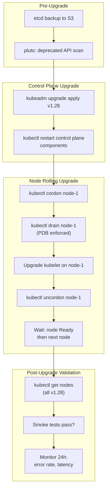

## Keywords in This File

{: .no_toc }

| # | Keyword | Weight |
|---|---------|--------|
| 1 | [Kubernetes Production Operations and Upgrade Strategy](#kubernetes-production-operations-and-upgrade-strategy) | high |

---

# Kubernetes Production Operations and Upgrade Strategy

### 🎯 Model Answer

**30 seconds:**
> Kubernetes production operations means keeping the cluster healthy, updating it safely,
> and responding to incidents without downtime. Cluster upgrades follow a specific order:
> control plane first, then node groups (rolling replacement). Node drain safely evicts pods.
> PodDisruptionBudget (PDB) guarantees minimum availability during drain. GitOps (ArgoCD,
> Flux) ensures configuration consistency. Monitoring via Prometheus + Alertmanager,
> with runbooks for each alert.

**3 minutes (Senior):**
> Production Kubernetes operations involves three activities: day-to-day operations
> (scaling, troubleshooting, deployments), scheduled maintenance (upgrades, certificate
> rotation, node replacement), and incident response (outage investigation and recovery).
>
> Cluster upgrades are the highest-risk maintenance operation. The upgrade order is rigid:
> (1) backup etcd, (2) upgrade control plane (kube-apiserver, controller-manager, scheduler,
> etcd), (3) upgrade CoreDNS and kube-proxy, (4) cordon nodes, drain pods, replace nodes
> with new version, uncordon. For managed clusters (EKS, GKE, AKS): the managed service
> handles control plane upgrades; you manage node groups.
>
> PodDisruptionBudget is the safety mechanism for node maintenance. PDB says "during
> voluntary disruptions (drain, node upgrade), maintain at least X replicas." A deployment
> with 3 replicas and PDB minAvailable=2: drain evicts one pod, waits until it's rescheduled
> and running elsewhere, then evicts another. Never drops below 2 running. Without PDB:
> kubectl drain can evict all pods simultaneously, causing complete service outage.
>
> GitOps for production: every cluster configuration change is a Git commit. No kubectl
> apply in production directly. ArgoCD detects drift (manual changes) and alerts or
> auto-corrects. This gives: audit trail (who changed what), rollback (revert the commit),
> and consistent state (all clusters match Git).

**Framework:** UPGRADE STRATEGY -> PDB -> NODE MAINTENANCE -> GITOPS -> INCIDENT RESPONSE

*Adapting up:* Cluster API for declarative cluster lifecycle management, Karpenter vs
Cluster Autoscaler tradeoffs, FinOps for Kubernetes (cost visibility and optimization),
CRD version management across upgrades.

*Adapting down:* "Kubernetes upgrades = update the server software carefully. Use PDB so
pods aren't all killed at once. Use GitOps so you always know what's running."

**Blank Mind Recovery:**

**(1) Restate:** "Kubernetes production ops: cluster upgrades (control plane first, then nodes),
PodDisruptionBudget for safe node drain, GitOps for consistency, monitoring for visibility,
incident response runbooks."

**(2) First principles:** "A cluster is software running on VMs. Software needs updates.
Updates break things. PDB limits how many pods can be disrupted at once. GitOps prevents
untracked manual changes from causing unknown state."

**(3) Bridge:** "Cluster upgrade = replacing airplane engines mid-flight. Start with the
cockpit instruments (control plane) - everything depends on those. Then replace one engine
at a time (node rolling update) while the plane continues flying. PDB = minimum thrust
requirement: don't replace the engine if it would drop below minimum thrust."

---

### 📘 Concept Explanation

**Cluster Upgrade Process (Self-Managed):**

Version compatibility constraints:
- kube-apiserver: must be upgraded first (other components communicate with it)
- kubelet/kube-proxy on nodes: can be 2 minor versions behind kube-apiserver
- Upgrade one minor version at a time: 1.27 -> 1.28 -> 1.29 (not 1.27 -> 1.29)

Step-by-step upgrade (kubeadm):
```bash
# Step 1: Backup etcd
ETCDCTL_API=3 etcdctl snapshot save /backup/etcd-$(date +%Y%m%d).db \
  --endpoints=https://127.0.0.1:2379 \
  --cacert=/etc/kubernetes/pki/etcd/ca.crt \
  --cert=/etc/kubernetes/pki/etcd/server.crt \
  --key=/etc/kubernetes/pki/etcd/server.key

# Step 2: Check upgrade plan
kubeadm upgrade plan
# Output: lists available versions, any compatibility issues

# Step 3: Upgrade kubeadm
apt-mark unhold kubeadm
apt-get install kubeadm=1.28.0-00
apt-mark hold kubeadm

# Step 4: Apply upgrade (control plane only)
kubeadm upgrade apply v1.28.0
# Upgrades: apiserver, controller-manager, scheduler, etcd, coreDNS, kube-proxy

# Step 5: Upgrade kubelet and kubectl on control plane nodes
apt-get install kubelet=1.28.0-00 kubectl=1.28.0-00
systemctl restart kubelet

# Step 6: Upgrade worker nodes (one at a time)
kubectl cordon node-1      # prevent new pod scheduling
kubectl drain node-1 \
  --ignore-daemonsets \    # DaemonSets don't prevent drain
  --delete-emptydir-data \ # pods using emptyDir can be evicted
  --force
# Then SSH to node-1:
# apt-get install kubeadm=1.28.0-00 kubelet=1.28.0-00
# kubeadm upgrade node
# systemctl restart kubelet
kubectl uncordon node-1    # allow scheduling again
# Wait for node-1 to be Ready before draining node-2
```

Managed clusters (EKS/GKE/AKS):
- Control plane upgrade: one click or eksctl command (managed service handles it)
- Node group upgrade: create new node group on new version, drain old nodes, delete old group
- Or: in-place node rolling update (EKS managed node groups support this)

**PodDisruptionBudget:**

```yaml
kind: PodDisruptionBudget
apiVersion: policy/v1
metadata:
  name: api-server-pdb
spec:
  selector:
    matchLabels:
      app: api-server
  minAvailable: 2   # OR: maxUnavailable: 1
  # minAvailable: at least 2 pods must be running during disruption
  # maxUnavailable: at most 1 pod can be unavailable at a time
```

How PDB interacts with node drain:

`kubectl drain node-1` attempts to evict each pod via the Eviction API
(NOT delete). The Eviction API checks all PDBs. If evicting pod-X would violate
its PDB: eviction is BLOCKED (returns 429 Too Many Requests). kubectl drain retries
until another pod is scheduled and the PDB allows eviction.

Without PDB: drain deletes all pods on the node simultaneously. For a Deployment
with 3 pods all on node-1: drain kills all 3 -> 0 running -> full service outage.

Best practices:
- Every production Deployment/StatefulSet should have a PDB
- `minAvailable >= 50%` for critical services
- For StatefulSets: `maxUnavailable: 1` (PDB prevents losing quorum for clustered apps)
- PDB with 1 replica is useless (evicting the only pod satisfies PDB - `minAvailable: 1`
  with 1 replica = minAvailable is 100% so drain blocks forever)

**Node Maintenance Workflow:**

```
cordon -> drain -> maintenance -> uncordon

kubectl cordon <node>    # mark node Unschedulable (no new pods)
                         # existing pods continue running
kubectl drain <node> \
  --ignore-daemonsets \
  --delete-emptydir-data \
  --timeout=5m           # fail after 5 minutes (don't wait forever)

# Perform maintenance: OS patch, kubelet upgrade, node replacement
# Verify node health: kubectl describe node <node> (check conditions)

kubectl uncordon <node>  # allow scheduling again
```

Emergency: if drain blocks indefinitely (pod can't be rescheduled):
```bash
# Find which PDB is blocking
kubectl get pdb -A
# Check if pods can schedule elsewhere (check resource availability)
kubectl describe pdb <name> -n <namespace>
# If truly stuck: force-delete the pod (only if acceptable to skip PDB)
kubectl delete pod <pod> --force --grace-period=0
```

**Production Monitoring Stack:**

```
[kube-state-metrics]  [node-exporter]  [kubelet metrics]
        |                    |                  |
              [Prometheus (scrape)]
                      |
              [Alertmanager]
              -> PagerDuty (critical)
              -> Slack (warning)
                      |
              [Grafana dashboards]
              (cluster overview, namespace view, workload view)
```

Critical alerts to configure:
```yaml
# Node not ready
- alert: NodeNotReady
  expr: kube_node_status_condition{status="true",condition="Ready"} == 0
  for: 5m
  labels: {severity: critical}

# High pod restart rate (crash loop)
- alert: PodCrashLooping
  expr: rate(kube_pod_container_status_restarts_total[15m]) > 0
  for: 5m

# PersistentVolume claim pending (storage issue)
- alert: PVCPending
  expr: kube_persistentvolumeclaim_status_phase{phase="Pending"} == 1
  for: 10m

# Certificate expiry (kubeconfig, etcd, API server cert)
- alert: CertificateExpiringSoon
  expr: certmanager_certificate_expiration_timestamp_seconds - time() < 604800
  # Alert 7 days before expiry
```

---

### 💻 Code Example

> **Code walkthrough:** Safe node maintenance, PDB configuration, upgrade automation,
> and cluster health validation.

```bash
# BAD: Direct pod deletion during "maintenance"
# Forces immediate removal - no graceful eviction, no PDB check
kubectl delete pod api-server-7d4f9b8-xk2p --force --grace-period=0
# Problem: bypasses PDB, may drop cluster below minimum healthy pods
# Causes: sudden loss of in-flight requests, incomplete transactions,
# corrupted connections from clients
```

```bash
# GOOD: Proper node drain with safety checks before and after

# Step 1: Pre-drain health check
echo "=== Node status before drain ==="
kubectl get nodes
kubectl get pods --all-namespaces -o wide | grep <node-name>

# Step 2: Check PDB will allow the drain
kubectl get pdb --all-namespaces
# Ensure ALLOWED DISRUPTIONS > 0 for services on this node

# Step 3: Cordon first (prevent new scheduling)
kubectl cordon <node-name>

# Step 4: Drain with timeout and DaemonSet ignore
kubectl drain <node-name> \
  --ignore-daemonsets \          # DaemonSet pods stay
  --delete-emptydir-data \       # OK to evict emptyDir pods
  --grace-period=60 \            # 60s graceful shutdown
  --timeout=300s \               # give up after 5 minutes
  --pod-selector='!job-name'     # skip Jobs (optional)

echo "=== Post-drain: verify no non-daemonset pods on node ==="
kubectl get pods --all-namespaces -o wide | \
  grep <node-name> | grep -v "DaemonSet"

# Step 5: Perform maintenance
# ...

# Step 6: Uncordon and verify
kubectl uncordon <node-name>
# Wait for node Ready
kubectl wait node/<node-name> \
  --for=condition=Ready --timeout=120s
echo "Node is Ready"
```

```yaml
# GOOD: PDB for a stateless API service
kind: PodDisruptionBudget
apiVersion: policy/v1
metadata:
  name: api-pdb
  namespace: backend
spec:
  selector:
    matchLabels: {app: api}
  maxUnavailable: 1     # at most 1 pod unavailable at a time
  # With 5 replicas: always >= 4 available during drain
  # Drain evicts 1 pod, waits for it to reschedule, evicts next

---
# GOOD: PDB for a clustered StatefulSet (e.g., Kafka, ZooKeeper)
kind: PodDisruptionBudget
apiVersion: policy/v1
metadata:
  name: kafka-pdb
  namespace: kafka
spec:
  selector:
    matchLabels: {app: kafka}
  maxUnavailable: 1     # never lose quorum: for 3 brokers, max 1 down
  # Losing 2 of 3 Kafka brokers = no quorum = cluster unavailable
```

```bash
# GOOD: Cluster upgrade validation script
#!/usr/bin/env bash
set -euo pipefail

echo "=== Pre-upgrade validation ==="

# 1. Check deprecated APIs in use (will break in new K8s version)
kubectl api-resources --verbs=list -o name | while read res; do
  kubectl get "$res" --all-namespaces 2>/dev/null || true
done

# Better: use pluto for deprecated API detection
pluto detect-all-in-cluster \
  --target-versions k8s=v1.28.0

# 2. Verify etcd health before upgrade
ETCDCTL_API=3 etcdctl endpoint health \
  --endpoints=https://127.0.0.1:2379 \
  --cacert=/etc/kubernetes/pki/etcd/ca.crt \
  --cert=/etc/kubernetes/pki/etcd/server.crt \
  --key=/etc/kubernetes/pki/etcd/server.key

# 3. Take etcd backup
ETCDCTL_API=3 etcdctl snapshot save \
  "/backup/etcd-pre-upgrade-$(date +%Y%m%d-%H%M%S).db" \
  --endpoints=https://127.0.0.1:2379 \
  --cacert=/etc/kubernetes/pki/etcd/ca.crt \
  --cert=/etc/kubernetes/pki/etcd/server.crt \
  --key=/etc/kubernetes/pki/etcd/server.key
echo "Backup created"

# 4. Check node readiness
NOT_READY=$(kubectl get nodes \
  --no-headers | grep -v Ready | wc -l)
if [ "$NOT_READY" -gt 0 ]; then
  echo "ERROR: $NOT_READY nodes not ready. Fix before upgrading."
  exit 1
fi
echo "All nodes Ready"

# 5. Check for pending pods
PENDING=$(kubectl get pods --all-namespaces \
  --field-selector=status.phase=Pending \
  --no-headers | wc -l)
echo "Pending pods: $PENDING"
# If too many pending: cluster may be resource-constrained

echo "Pre-upgrade validation complete. Safe to proceed."
```

> **Code walkthrough:** The BAD example shows force-deletion which bypasses the Eviction
> API and PDB checks entirely. Force deletion is only appropriate for truly stuck pods
> (completed Jobs that won't terminate, pods on unreachable nodes). The GOOD drain sequence
> is the correct operational procedure: cordon first so no new pods schedule, then drain
> which respects PDB by using the Eviction API. The PDB examples show the two patterns:
> `maxUnavailable: 1` is the standard choice (simple, works for stateless services and
> most StatefulSets). For clustered applications with quorum requirements (Kafka 3 nodes:
> max 1 down = maintains majority), the same `maxUnavailable: 1` is correct. The validation
> script prevents the most common upgrade failure: deprecated APIs being used in the cluster
> that will break after the upgrade.

---

### 🎓 Answers by Seniority

**Junior / Mid (0-5 years):**
> Kubernetes production operations involves keeping the cluster updated and running smoothly.
> For upgrades: you upgrade the control plane first (the kube-apiserver and controllers),
> then upgrade the worker nodes one by one. When upgrading a node: drain it first (moves
> all pods to other nodes), do the upgrade, then uncordon it (allows pods to schedule again).
> PodDisruptionBudget (PDB) is a policy that says "during maintenance, always keep at
> least X pods running." This prevents draining a node from accidentally taking all
> pods offline at once.

*Push deeper:* What's the difference between `kubectl delete pod` and `kubectl drain`?

---

**Senior / Staff (5+ years):**
> The most dangerous production operation is the cluster upgrade. Two failure modes:
>
> 1. API deprecation: Kubernetes removes deprecated APIs across versions
>    (v1beta1 -> v1). If you have HelmCharts or controllers using the old API,
>    they stop working after upgrade. Prevention: scan with `pluto` before every upgrade.
>    Detect and fix deprecated API usage in staging before touching production.
>
> 2. Admission webhook compatibility: webhooks that validate or mutate resources may
>    not handle the new API version's fields. After upgrade, creating pods might fail
>    with webhook rejection errors. Prevention: test webhook compatibility in staging;
>    add `failurePolicy: Ignore` on non-critical webhooks during the upgrade window.
>
> For Node upgrades at scale: the "rolling node replacement" pattern is more reliable
> than in-place upgrade. Create new node group with the new kubelet version, drain old
> nodes one by one (PDB ensures no outage), delete old node group when empty. This is
> blue-green for node pools. It's safer because you can stop at any point: if 50% of
> nodes are drained and the new nodes show a problem, old nodes are still available
> (just uncordon them). With in-place upgrade, rolling back requires re-running the
> upgrade process in reverse.

*Push deeper:* For EKS: use Karpenter (node autoprovisioner) for node upgrades.
Karpenter's `drift` feature: when you update the EC2NodeClass (new AMI version),
Karpenter automatically marks all nodes using the old AMI as "drifted" and
replaces them with new nodes running the new AMI. Zero manual drain operations.
Fully automated, respects PDBs.

---

### ⚠️ Common Misconceptions

**Misconception 1: "kubectl drain is always safe."**
kubectl drain is "safe" only if: all pods are covered by a controller (Deployment,
StatefulSet, DaemonSet) that will reschedule them, PDBs are configured to maintain
minimum availability, and there is enough cluster capacity to reschedule evicted pods
elsewhere. If the cluster has no remaining capacity (all other nodes are full), evicted
pods land in Pending state, and services may be degraded even with PDB. Always check
cluster capacity before draining a node.

**Misconception 2: "You can skip minor Kubernetes versions during upgrades."**
The Kubernetes upgrade path requires sequential minor version upgrades. You cannot
upgrade from 1.26 directly to 1.28. Each minor version upgrade may introduce breaking
changes, deprecated API removals, or behavior changes that need to be validated
independently. The kubeadm tool enforces this: `kubeadm upgrade apply` will reject
a version skip. Managed clusters (EKS/GKE) also enforce sequential minor version upgrades.

**Misconception 3: "PDB with minAvailable=1 is safe for critical services."**
`minAvailable: 1` means: "at least 1 pod must be available during disruption." If your
Deployment has 2 replicas: this PDB allows draining to evict 1 pod, leaving 1 running.
That 1 remaining pod handles 100% of traffic. If that pod also has issues: the service
is down. For critical services: `minAvailable >= 50%` (majority), and ensure replicas
are spread across nodes with pod anti-affinity so multiple pods aren't co-located.

**Misconception 4: "etcd backup only matters for disaster recovery."**
etcd backups have immediate operational value beyond DR. During a failed cluster upgrade:
restoring from a pre-upgrade etcd backup is the fastest path to recovery (faster than
rerunning the upgrade and fixing issues). For accidental mass deletion (`kubectl delete
namespace production`): etcd restore recovers all resources. Scheduled etcd backups
(hourly, retained for 30 days) should be considered as essential as database backups.

---

### 🚨 Failure Modes and Diagnosis

**Failure 1: Node drain stuck indefinitely**

Symptom: `kubectl drain node-1` hangs, never completes. Pod not evicted.

Cause A: PDB blocking eviction. All pods of a Deployment are on this node and the PDB
minAvailable prevents reducing below current count.
Diagnostic:
```bash
kubectl get pdb --all-namespaces
# DISRUPTIONS ALLOWED = 0 for some PDB -> this is blocking

kubectl describe pdb <name> -n <namespace>
# Shows: current healthy, desired healthy, min available
```
Fix: wait for pods to become healthy on other nodes first (might need manual scaling),
OR temporarily increase replicas to allow PDB to allow eviction.

Cause B: Pod in terminating state, not terminating. Pod has finalizers that are not
being cleared (a controller stopped working).
Diagnostic: `kubectl describe pod <pod>` - check Finalizers field.
Fix: identify which controller manages the finalizer, fix the controller. As last resort
(data safety guaranteed): `kubectl patch pod <pod> -p '{"metadata":{"finalizers":[]}}'`

**Failure 2: Upgrade fails - API server won't start after upgrade**

Symptom: after `kubeadm upgrade apply`, kube-apiserver pod fails to start. etcd data
might be incompatible with new version, or TLS certificates are stale.

Diagnostic:
```bash
# Check API server pod logs (it's a static pod)
cat /var/log/pods/kube-system_kube-apiserver-*/kube-apiserver/*.log
# Or: journalctl -u kubelet | grep apiserver

# Check static pod manifest for errors
cat /etc/kubernetes/manifests/kube-apiserver.yaml
```

Fix: if TLS cert issue: `kubeadm alpha certs renew all` (may need to happen before upgrade)
If incompatible etcd data: restore from pre-upgrade etcd backup (the reason backups are mandatory)
```bash
# Restore etcd from backup
ETCDCTL_API=3 etcdctl snapshot restore /backup/etcd-pre-upgrade.db \
  --data-dir=/var/lib/etcd-restored
# Stop etcd, copy restored data, restart
```

**Failure 3: Certificate expiry causing cluster connectivity failure**

Symptom: kubectl commands fail with "certificate has expired or is not yet valid".
API server or etcd certificates have expired.

Diagnostic:
```bash
# Check certificate expiry
kubeadm certs check-expiration
# Shows each cert and its expiry date

# API server cert specifically
openssl x509 -in /etc/kubernetes/pki/apiserver.crt \
  -noout -enddate
```

Fix: renew certificates:
```bash
kubeadm certs renew all
# Restart control plane components (static pods):
mv /etc/kubernetes/manifests/kube-apiserver.yaml /tmp/
mv /tmp/kube-apiserver.yaml /etc/kubernetes/manifests/
# kubelet auto-restarts static pods when manifest changes
```

For managed clusters: EKS auto-rotates certificates. Check cert-manager for application
certificates; set up `CertificateRequest` with short TTL and `renewBefore: 168h` (7 days).

---

### 🎯 Interview Deep-Dive

| Question Category | Time to Answer |
|---|---|
| Conceptual | 1-2 minutes |
| Mechanism | 2-3 minutes |
| Upgrade | 3-4 minutes |
| Debugging | 2-3 minutes |
| Production | 2-3 minutes |
| Security | 2-3 minutes |
| GitOps | 2-3 minutes |
| FinOps | 2-3 minutes |
| Automation | 3-4 minutes |
| Node management | 2-3 minutes |
| System Design | 3-5 minutes |
| Behavioral | 2-3 minutes |

---

**Q1 [MID] (CONCEPTUAL): Explain the Kubernetes upgrade process end-to-end.**

A: Kubernetes upgrades follow a strict order because of version compatibility constraints.
The kube-apiserver must run N; other components can be N-2 at most.

Preparation:
1. Review the Kubernetes changelog for the target version - identify breaking changes,
   removed API versions, and required migrations
2. Scan for deprecated API usage: `pluto detect-all-in-cluster --target-versions k8s=vN.N`
3. Upgrade and test in staging cluster first
4. Schedule maintenance window, notify stakeholders
5. Backup etcd: `etcdctl snapshot save`

Control plane upgrade:
1. Upgrade kubeadm tool on control plane node
2. `kubeadm upgrade plan` - verify compatibility
3. `kubeadm upgrade apply vN.N.N` - upgrades kube-apiserver, kube-controller-manager,
   kube-scheduler, etcd, CoreDNS, kube-proxy
4. Upgrade kubelet and kubectl on control plane nodes
5. Verify: `kubectl get nodes` - control plane shows new version

Worker node upgrade (repeat for each node):
1. `kubectl cordon node-X` - stop new pod scheduling
2. `kubectl drain node-X --ignore-daemonsets --delete-emptydir-data` - evict pods
3. SSH to node: upgrade kubeadm, run `kubeadm upgrade node`, upgrade kubelet
4. `kubectl uncordon node-X` - allow scheduling
5. Wait for node Ready and pods rescheduled before moving to next node

For managed clusters: control plane is handled by the managed service. Worker node upgrade:
update the node group AMI/version, trigger rolling update (or use Karpenter drift).

Post-upgrade:
1. Run workload smoke tests
2. Check for deprecation warnings in API server logs
3. Monitor error rates and latency for 24 hours
4. Update documentation with new cluster version

*What separates good from great:* The reason for upgrading one node at a time vs all at once:
if you drain all nodes simultaneously (or quickly), pods have nowhere to reschedule.
The cluster needs available nodes to absorb evicted pods from other nodes. With N nodes:
upgrade N-1 simultaneously while keeping at least 1 node running the current version.
In practice: upgrade 20-30% of nodes at a time for large clusters, verifying each batch
before continuing.

---

**Q2 [SENIOR] (MECHANISM): How does PodDisruptionBudget interact with kubectl drain?**

A: PDB and drain interact via the Kubernetes Eviction API. This is the key: drain uses
EVICTION (not deletion). The Eviction API is subject to PDB checks.

Without PDB: `kubectl drain` calls `kubectl delete pod` on each pod. Immediate deletion.
All pods on the node deleted simultaneously. Service goes to zero pods.

With PDB: `kubectl drain` calls the Eviction API for each pod:
```
POST /api/v1/namespaces/{ns}/pods/{pod}/eviction
```

The API server processes the eviction request:
1. Check all PDBs that select this pod
2. If evicting this pod would violate any PDB: return `HTTP 429 Too Many Requests`
3. kubectl drain retries (backoff: default 5 seconds between retries)
4. Meanwhile: the evicted pod (if any) reschedules to another node
5. When PDB allows: pod is evicted and drain continues

PDB `minAvailable: 2` with 3 replicas:
- Pod A, B, C on node-1 (poor scheduling, all on same node)
- Drain attempts to evict A: PDB allows (2 still available after: B, C? wait...)
  Actually: A is evicted, B and C still running = 2 available = PDB satisfied. Allowed.
- A rescheduled to node-2. Now 3 replicas running again.
- Drain attempts to evict B: A (on node-2) + C (still on node-1) = 2 available. Allowed.
- B rescheduled. Now 3 running.
- Drain attempts to evict C: A (node-2) + B (node-3) = 2 available. Allowed.
- Drain complete. At no point did availability drop below 2.

Without PDB (or with maxUnavailable: 100%):
- Drain evicts A, B, C simultaneously
- 0 pods running for the time until they reschedule
- Service unavailable

*What separates good from great:* There's a subtle issue with PDB and single-pod Deployments.
`minAvailable: 1` with 1 replica = "always at least 1 pod available." Drain tries to evict
the pod: `minAvailable: 1` says 1 must be available, current = 1. Evicting would leave 0.
PDB blocks the eviction FOREVER. Drain is stuck. This is a common operational trap.
For single-replica Deployments: either don't set PDB, or set `minAvailable: 0` (allows
temporary zero pods). For true HA: have >= 2 replicas before setting `minAvailable: 1`.

---

**Q3 [STAFF] (UPGRADE): How do you handle API deprecations during Kubernetes upgrades?**

A: API deprecations are the most common cause of post-upgrade failures. Kubernetes
regularly promotes APIs from beta to stable and removes the beta version 9-12 months later.

Common deprecation patterns:
- `extensions/v1beta1 Ingress` -> `networking.k8s.io/v1 Ingress`
- `batch/v1beta1 CronJob` -> `batch/v1 CronJob`
- `policy/v1beta1 PodSecurityPolicy` -> removed (use PSA instead)
- `policy/v1beta1 PodDisruptionBudget` -> `policy/v1 PodDisruptionBudget`

Detection:

1. pluto (static analysis):
```bash
# Scan all manifests in your Git repo
pluto detect-files -d ./deploy --target-versions k8s=v1.28
# Also scan Helm charts
pluto detect-helm --target-versions k8s=v1.28
# Scan live cluster resources
pluto detect-all-in-cluster --target-versions k8s=v1.28
```

2. kube-no-trouble (kubent): similar to pluto, scans live cluster:
```bash
kubent  # scans current cluster automatically
# Output: lists resources using deprecated APIs
```

3. API server audit logs: deprecated API usage triggers warning in audit log:
```
"audit.k8s.io/deprecated-resource-use": "extensions/v1beta1 Deployment is deprecated"
```

Migration process:
1. Scan (pluto or kubent) before and after target version announcement
2. Identify all manifests, Helm charts, and operators using deprecated APIs
3. Update each: change `apiVersion: extensions/v1beta1` -> `networking.k8s.io/v1`
   (also add required fields - v1 Ingress requires `pathType` which v1beta1 didn't)
4. For Helm charts: update Chart.yaml minimum kubernetes version; update templates
5. For third-party operators: check their release notes for K8s compatibility;
   upgrade the operator before upgrading the cluster

Critical: some resource fields are IMMUTABLE and require delete+recreate to migrate.
Deployments can be updated in-place. CRDs may require schema migration tooling.

*What separates good from great:* The Kubernetes API Migration Guide
(kubernetes.io/docs/reference/using-api/deprecation-guide) is the canonical reference.
Bookmark it and check before every minor version upgrade. The guide also lists
MIGRATION NOTES: things that changed in behavior (not just API version). For example:
Ingress v1 requires `pathType: Prefix` or `pathType: Exact` - it's not just an API
rename, it's a semantic change. Read the migration notes, not just run pluto.

---

**Q4 [STAFF] (PRODUCTION): How do you implement zero-downtime node rolling updates at scale?**

A: At scale (100+ nodes), naive sequential drain is too slow. But parallel drain risks
outages if nodes are removed faster than pods can reschedule.

Strategy: parallel rolling drain with PDB as safety net.

```bash
# Drain in batches (drain 5 nodes in parallel, not 1 at a time)
# Uses gnu parallel or xargs for parallelism

# Step 1: Identify nodes to upgrade (e.g., old AMI version)
OLD_NODES=$(kubectl get nodes \
  -o jsonpath='{.items[?(@.metadata.labels.eks\.amazonaws\.com/nodegroup=="old")].metadata.name}')

# Step 2: Cordon all old nodes first (no new scheduling on any of them)
echo "$OLD_NODES" | xargs -I{} kubectl cordon {}

# Step 3: Drain in batches of 5 concurrently
echo "$OLD_NODES" | \
  xargs -P5 -I{} kubectl drain {} \
    --ignore-daemonsets \
    --delete-emptydir-data \
    --grace-period=60 \
    --timeout=10m
```

Better approach for managed clusters: Karpenter with drift.

```yaml
# EC2NodeClass: define target AMI
kind: EC2NodeClass
metadata:
  name: production
spec:
  amiFamily: AL2023
  amiSelectorTerms:
  - alias: al2023@latest     # always latest AL2023 AMI

# NodePool references the NodeClass
kind: NodePool
spec:
  template:
    spec:
      nodeClassRef: {name: production}
  disruption:
    consolidationPolicy: WhenEmptyOrUnderutilized
    consolidateAfter: 30s
    budgets:
    - nodes: "20%"         # max 20% of nodes disrupted at once
    - schedule: "0 9 * * 1-5"   # business hours: different budget
      duration: 8h
      nodes: "10%"
```

When a new AL2023 AMI is released: Karpenter marks all nodes on the old AMI as "drifted."
It replaces them one by one (or in batches via `budgets`), respecting PDBs.
Zero manual drain operations. Budget: `nodes: "20%"` = at most 20% of the cluster's
nodes being disrupted simultaneously. This is the production-grade approach for large clusters.

Blue-green node pools (alternative for risky upgrades):
1. Create new node group with new K8s version (provisioned but no workloads)
2. Taint new nodes to prevent scheduling: `kubectl taint node <new> new-version:NoSchedule`
3. Validate new nodes are healthy and ready
4. Remove taint: new pods schedule to new nodes
5. Drain old nodes (pods move to new nodes, PDB protected)
6. Delete old node group after all pods migrated

*What separates good from great:* The `budgets` field in Karpenter's NodePool is the
production-ready replacement for manual drain scripts. It expresses the disruption budget
as a policy: "at most 20% of nodes disrupted simultaneously, except during business hours
(09:00-17:00 Mon-Fri): at most 10%." This means: cluster autoscaler replaces nodes
responsibly, respecting business hours for reduced risk, while still completing upgrades
within a reasonable time window. Manual drain scripts don't have time-window awareness.

---

**Q5 [STAFF] (DEBUGGING): A Kubernetes node is showing NotReady. Diagnose.**

A: Node NotReady means kubelet stopped reporting healthy status to the API server.
The node controller waits 40s before marking NotReady and starts evicting pods after 5 minutes.

Step 1: get node status.
```bash
kubectl describe node <node-name>
# Key sections to check:
# Conditions: MemoryPressure, DiskPressure, PIDPressure, Ready
# Allocatable: vs Capacity (if all used: resource exhaustion)
# Events: (recent events on the node)
```

Common conditions:
- `DiskPressure: True`: disk usage > 85% (default eviction threshold)
- `MemoryPressure: True`: memory pressure (kubelet eviction)
- `PIDPressure: True`: too many PIDs (often container/process leak)
- `Ready: False`: kubelet unhealthy or network unreachable

Step 2: SSH to the node (if reachable).
```bash
# Check kubelet status
systemctl status kubelet
journalctl -u kubelet -n 100

# Check disk usage
df -h / /var/lib/docker /var/lib/kubelet
# Disk pressure: clean up old container images
crictl images | grep -v "REPOSITORY"
crictl rmi --prune  # or: docker system prune

# Check memory
free -h
dmesg | grep -i "oom"   # OOM killer events

# Check network connectivity
curl -k https://kube-apiserver:6443/healthz
```

Step 3: if node unreachable (lost SSH access):
```bash
# Check cloud provider: AWS/GCP console - is VM running?
# Check instance health: system status check / instance status check
# VMs can pass health checks but have networking issues

# Force-delete node from Kubernetes if you're replacing it
kubectl delete node <node-name>
```

Step 4: post-recovery.
After fixing root cause: `systemctl restart kubelet`. Node re-registers with API server.
After ~30s: shows Ready. Pods get rescheduled.

Most common root causes by category:
- Disk: container logs filling `/var/log`, large container images, incomplete cleanup
- Memory: workload with memory leak not controlled by Limits
- Networking: security group rule change blocking kubelet-to-apiserver port
- Resource: node running too many pods (exceeds `max-pods` kubelet config, typically 110)

*What separates good from great:* The `node.kubernetes.io/disk-pressure: NoSchedule` taint
is automatically added by kubelet when DiskPressure condition is True. This prevents new
pods from scheduling to the node. But pods ALREADY on the node are only evicted if
`eviction-hard: imagefs.available<5%` threshold is breached. The node can be in DiskPressure
(no new pods scheduled) but still serving existing pods. Proactive disk usage alerting
at 70% and 80% thresholds prevents reaching the critical 85% eviction threshold during
active traffic.

---

**Q6 [STAFF] (GITOPS): How do you manage production Kubernetes configuration changes safely?**

A: Safe configuration management for production follows the Pull Request -> Review -> Merge
-> Auto-sync -> Validate pipeline.

The principle: no direct kubectl apply to production. Every change goes through Git.

Workflow:
```
Engineer creates branch -> changes Kubernetes manifest in Git
  |
PR review (team reviews the change)
  |
Automated checks:
  - kube-score / kubeconform (validates manifest syntax)
  - kube-linter (checks for common misconfigurations: missing limits, no PDB, etc.)
  - OPA/Gatekeeper policy: enforce organizational standards
  |
PR merged to main
  |
ArgoCD detects change (polls every 3 min or webhook push)
  |
Sync to production cluster
  |
Automated smoke tests (if integrated)
  |
On failure: ArgoCD marks sync failed, sends alert to Slack/PagerDuty
Engineer reverts the commit -> ArgoCD resyncs to previous state
```

Emergency change (break-glass):
Sometimes production has an urgent issue requiring immediate change. Policy:
1. Engineer makes change directly via kubectl (break-glass access, requires MFA/approval)
2. ArgoCD detects OutOfSync: alerts the team
3. Engineer MUST create a PR with the same change and merge within 24 hours
4. Audit log captures the break-glass access (who, what, when)
5. Post-incident review: could the break-glass have been avoided?

ArgoCD drift detection:
```bash
# Check sync status of all applications
argocd app list | grep -v Synced

# Get the diff for an out-of-sync app
argocd app diff my-app

# App is in OutOfSync state: view why
argocd app get my-app --show-params
```

Organizational maturity levels:
- Level 1: all apply via ArgoCD, manual approval required for production sync
- Level 2: automated sync for staging, manual approval for production
- Level 3: automated sync everywhere with automated post-sync validation
- Level 4: automated progressive delivery (Argo Rollouts + canary analysis)

*What separates good from great:* The `ignoreDifferences` configuration in ArgoCD is
essential for avoiding false OutOfSync alerts. Common examples: `spec.replicas` (HPA
manages this, ArgoCD shouldn't report drift), `metadata.annotations` modified by
controllers, `status` subresource. Without `ignoreDifferences`: every HPA scale event
causes ArgoCD to show OutOfSync, desensitizing engineers to drift alerts. Configure
`ignoreDifferences` for known auto-modified fields to keep the OutOfSync signal meaningful.

---

**Q7 [SENIOR] (SECURITY): How do you handle Kubernetes secret rotation in production?**

A: Secret rotation is the process of changing credentials (database passwords, API keys,
TLS certificates) without causing downtime. In Kubernetes: the secret change must propagate
to running pods without restart (if possible) or with graceful rolling restart.

Rotation approaches by secret type:

Database passwords (using External Secrets Operator + Vault):
```yaml
# ExternalSecret: auto-rotates when Vault secret changes
kind: ExternalSecret
spec:
  refreshInterval: 1h     # checks Vault every hour
  target:
    name: db-secret
    creationPolicy: Owner
```
When Vault secret is rotated: ESO updates the Kubernetes Secret within 1 hour.
Pods using the Secret as environment variables: must restart to pick up the new value
(env vars are set at pod start, not dynamically).
Pods mounting Secret as volume: automatically get updated content without restart
(kubelet syncs mounted Secrets every `syncFrequency`, default 1 minute).

Best practice: mount database credentials as files (not env vars) so rotation propagates
without pod restart. Application reads credentials from the file on each connection attempt.

TLS certificates (cert-manager):
```yaml
kind: Certificate
spec:
  secretName: api-tls
  duration: 2160h      # 90 days
  renewBefore: 360h    # renew 15 days before expiry
```
cert-manager auto-renews. New cert written to Kubernetes Secret. Pods mounting the secret
as a volume get the new cert within ~1 minute (no restart needed for most TLS termination
approaches).

Rolling restart after secret rotation (safe approach):
```bash
# Trigger rolling restart (respects RollingUpdate strategy and PDB)
kubectl rollout restart deployment my-app -n production
# Pods replace one at a time, PDB ensures minimum healthy pods throughout
```

Secret leak response (emergency rotation):
1. Immediately rotate the secret in the secret store (Vault/AWS Secrets Manager)
2. Apply `kubectl rollout restart deployment` to all affected deployments
3. Identify the source of the leak (audit logs, git history)
4. Document the incident

*What separates good from great:* The `kubectl rollout restart` command is better than
scale-to-zero-then-scale-up for secret rotation. Rolling restart honors RollingUpdate
strategy (maxUnavailable, maxSurge) and PDB. Scale-to-zero drops all pods simultaneously.
For sensitive secrets (database master credentials): rotate during low-traffic periods,
stage the rotation (new credential alongside old credential - dual-write support at the
database level), then remove old credential after all pods are using the new one.

---

**Q8 [STAFF] (FINOPS): How do you optimize Kubernetes cluster costs?**

A: Kubernetes cost optimization has three levers: resource right-sizing, idle resource
elimination, and instance type/pricing optimization.

1. Resource right-sizing:
The most impactful: most teams over-provision resource requests (safety margin becomes
permanent waste). VPA (Vertical Pod Autoscaler) in recommendation mode:
```bash
# VPA gives recommendations without actually changing pods
kubectl get vpa -n production
# Output per pod: Lower Bound, Target, Upper Bound, Uncapped Target
# "Target" = VPA's recommended request based on actual usage
```
Compare VPA recommended request vs configured request. A service requesting 2 CPU but
VPA recommends 200m = 10x over-provisioned.

2. Namespace cost attribution:
```bash
# Kubecost (or OpenCost): per-namespace cost breakdown
kubectl cost namespace --show-all-resources

# Manual: node cost / node CPU * namespace CPU usage
# kube-state-metrics: kube_namespace_labels (tag with team, cost-center)
```
Make cost visible per team -> teams optimize their own services.

3. Idle node elimination:
Node utilization < 30% CPU and < 30% memory: Karpenter/Cluster Autoscaler consolidation.
```yaml
# Karpenter: consolidation removes underutilized nodes
kind: NodePool
spec:
  disruption:
    consolidationPolicy: WhenEmptyOrUnderutilized
    consolidateAfter: 30s  # consolidate after 30s of underutilization
```

4. Spot/Preemptible instances for non-critical workloads:
```yaml
# Karpenter: try spot first, fall back to on-demand
kind: NodePool
spec:
  template:
    spec:
      requirements:
      - key: karpenter.sh/capacity-type
        operator: In
        values: ["spot", "on-demand"]  # prefer spot, fall back on-demand
```
Spot instances: 60-90% cheaper than on-demand. For stateless, restartable workloads.

5. Reserved/Committed instances:
Analyze baseline cluster size (always-on capacity). Buy 1-year or 3-year reserved
instances for that baseline. Spot handles burst. Typical savings: 30-40% vs all on-demand.

*What separates good from great:* The hardest part of cost optimization is organizational:
making teams responsible for their own costs. Technical tools (Kubecost, resource recommendations)
are easy to implement. Getting teams to act on recommendations requires: visible cost dashboards
(monthly cost report per team), cost budgets with alerts (alert when namespace cost > $10K/month),
and leadership buy-in (make cloud cost part of engineering metrics alongside reliability and performance).

---

**Q9 [STAFF] (NODE MANAGEMENT): Compare Karpenter vs Cluster Autoscaler for node provisioning.**

A:

Cluster Autoscaler (CA):
- Works with pre-defined node groups (autoscaling groups in AWS, node pools in GCP/Azure)
- Scales UP: when pods are Pending and no node has capacity
- Scales DOWN: when a node has been underutilized (< 50% CPU and memory) for 10 minutes
- Node type: fixed per node group - all nodes in a group are the same instance type
- Multi-node-group: CA selects which node group to expand via "expander" strategy
  (random, least-waste, priority, etc.)
- Consolidation: basic (scale down empty or underutilized nodes)

Karpenter:
- Cloud-native node provisioner (AWS-first, Azure in preview)
- No pre-defined node groups: Karpenter decides dynamically what instance type to provision
- Provisioning speed: 30-60 seconds (vs CA: 3-5 minutes for ASG to provision)
- Bin packing: Karpenter chooses the most efficient instance type for the specific pod
  requirements (a pod needing 8 CPU and 32GB gets an m5.2xlarge; a pod needing 1 CPU and
  512MB gets a t3.small)
- Spot: native spot fallback with interruption handling
- Drift: auto-replaces nodes using old AMIs
- Consolidation: aggressive (moves pods to fewer nodes, terminates empty nodes)

When to use each:
- Cluster Autoscaler: when using managed node groups (EKS, GKE, AKS) and the cloud
  provider's autoscaling is tightly integrated; teams familiar with node group management
- Karpenter: new clusters, AWS-native workloads, want fastest provisioning and best
  bin packing; want Spot with automatic diversification

Not compatible: Karpenter and CA should not both manage the same nodes. Use one or the other.

*What separates good from great:* Karpenter's instance type diversification for spot is
a significant reliability advantage. Spot interruptions happen when AWS reclaims instances.
If all your nodes are the same instance type (m5.xlarge) and AWS needs those instances back:
your cluster loses many nodes simultaneously. Karpenter with spot diversification provisions
from multiple instance type families (m5, m4, c5, c4, r5): an interruption event for one
family doesn't cascade. CA with spot node groups requires manually maintaining a list of
instance types and creating separate ASGs - tedious and often under-maintained.

---

**Q10 [STAFF] (ADVANCED): How do you manage CRD version upgrades?**

A: CRDs (Custom Resource Definitions) need their own version management strategy,
separate from Kubernetes version upgrades. CRD schema evolution follows Kubernetes API
versioning patterns but is managed by the controller/operator maintainers.

CRD versioning mechanics:
```yaml
kind: CustomResourceDefinition
spec:
  versions:
  - name: v1           # current stable
    served: true       # API server serves this version
    storage: true      # this version is stored in etcd
  - name: v1beta1      # old version, still served for compatibility
    served: true       # old clients can still read v1beta1
    storage: false     # stored as v1, converted on read
    deprecated: true   # warning in API server for v1beta1 requests
```

Conversion webhooks: when stored version (v1) is read as requested version (v1beta1),
a conversion webhook translates the schema. Required when fields are renamed or restructured.

Safe CRD upgrade process:
1. Operator upgrade: usually the operator manages CRD upgrades. Upgrade the operator first.
2. Multi-version CRDs: operator ships CRD with both old and new versions served.
   Existing resources still accessible via old API version.
3. Migrate: update all existing resources to new API version (`kubectl convert`).
4. Deprecate old version: set `served: false` for the old version.
5. Remove old version after migration is complete (Kubernetes 3-version deprecation
   policy: served=true -> deprecated=true -> served=false -> removed, across 3 releases).

Breaking change in CRD schema (forced migration):
```bash
# List all instances of the CRD that need migration
kubectl get <crd-resource> --all-namespaces -o yaml > backup.yaml

# Migrate using kubectl convert (if conversion rule defined)
kubectl convert -f backup.yaml --output-version new-group/v2 \
  > migrated.yaml

# Apply migrated resources
kubectl apply -f migrated.yaml
```

*What separates good from great:* The storage version is the single most critical CRD
field. All resources in etcd are stored in the storage version. Changing the storage
version requires all existing objects to be migrated. If you change the storage version
without running migration: new objects use the new schema, old objects use the old schema.
A controller that doesn't handle both schemas will crash or misbehave. The safe migration:
run `kubectl annotate <resource>` or a migration job to touch every existing resource,
which triggers re-serialization in the new storage version. Only then is it safe to
remove the old version from the CRD spec.

---

**Q11 [STAFF] (PRODUCTION): How do you conduct a Kubernetes incident response?**

A: Kubernetes incident response follows the same pattern as any SRE incident but with
Kubernetes-specific tooling and escalation paths.

Severity classification:
- SEV1: production down, users cannot use the service (100% error rate)
- SEV2: degraded service, partial impact (elevated errors or latency)
- SEV3: minor issue, limited user impact

Response workflow:

1. Detection (0-5 min): PagerDuty alert or user report. Incident commander (IC) declares
   incident, creates incident channel (#incident-2024-0315-api-down).

2. Triage (5-15 min):
```bash
# Cluster health
kubectl get nodes           # any NotReady nodes?
kubectl get pods --all-namespaces | grep -v Running | grep -v Completed

# Service error rate (Prometheus)
# rate(http_requests_total{status=~"5.."}[1m])

# Recent events
kubectl get events --all-namespaces \
  --sort-by='.lastTimestamp' | tail -30

# Check the specific failing service
kubectl describe deployment <service> -n production
kubectl logs -l app=<service> -n production --tail=100
```

3. Mitigation (15-60 min): restore service as fast as possible.
Common mitigations:
- Rollback: `kubectl rollout undo deployment <name>` (immediate)
- Scale up: `kubectl scale deployment <name> --replicas=N`
- Restart: `kubectl rollout restart deployment <name>`
- Redirect traffic: update Ingress or Service to point to healthy version

4. Resolution: root cause identified and permanently fixed.

5. Post-incident review (within 48 hours): document timeline, root cause, and action items.

Runbook structure:
Each alert in Alertmanager links to a runbook:
```yaml
- alert: APIHighErrorRate
  annotations:
    runbook: https://wiki.example.com/runbooks/api-high-error-rate
    # Runbook contains:
    # 1. What this alert means
    # 2. Diagnostic commands to run
    # 3. Common root causes and fixes
    # 4. Escalation path
```

*What separates good from great:* The "blast radius mitigation first, root cause second"
discipline. During a SEV1: first restore service (rollback, scale, redirect), then find
root cause. Every minute spent debugging before mitigating is another minute users can't
use the product. The post-incident review is where root cause analysis belongs. During
the incident: reduce user impact. After the incident: understand why and prevent recurrence.
Many incidents are worsened by engineers spending 30 minutes debugging the root cause
before attempting the obvious mitigation (rollback).

---

**Q12 [STAFF] (BEHAVIORAL): Describe a significant production Kubernetes incident and how you handled it.**

A (STAR format):

Situation: our primary API service stopped accepting traffic. SEV1 declared at 2:17 AM.
Customer-facing API returning 503 for 100% of requests. Service had 99.9% SLO; we were
burning SLO error budget at ~10% per minute.

Task: diagnose and restore service within the SLO burn rate threshold (under 15 minutes
to avoid breaching the 99.9% monthly SLO).

Action:

2:17 AM - PagerDuty fires. I join incident channel.

2:19 AM - Triage:
```bash
kubectl get pods -n production -l app=api | grep -v Running
# Output: 8 of 10 pods in CrashLoopBackOff
kubectl logs api-deployment-xxx -n production --previous | tail -20
# Error: "Error: cannot open config file: /etc/config/database.yaml: no such file"
```

2:21 AM - Root cause hypothesis: the ConfigMap mount is missing or empty.
```bash
kubectl get configmap api-config -n production
# Error: configmaps "api-config" not found
```

The ConfigMap was deleted. Git blame on the ArgoCD ApplicationSet showed: 5 minutes
before the incident, a PR was merged that accidentally deleted the `ConfigMap.yaml` file
from the repository. ArgoCD saw the file gone, applied prune policy, and deleted the
ConfigMap from the cluster. Pods started failing immediately on the next health check cycle.

2:23 AM - Mitigation:
```bash
# Restore ConfigMap from git history
git show HEAD~1:k8s/production/api-configmap.yaml | \
  kubectl apply -f -
# Wait for pods to restart (livenessProbe failure triggers restart)
kubectl rollout restart deployment api -n production
```

2:26 AM - Service restored. All pods Running. 9 minutes from incident declaration.

2:28 AM - Post-mitigation actions:
1. Reverted the offending PR in Git
2. ArgoCD re-synced to pre-incident state
3. Opened post-incident review for 2:00 PM same day

Post-incident review findings:
- Root cause: prune policy deleted a critical ConfigMap
- Contributing factor: PR review didn't catch the ConfigMap deletion (it was in a large diff)
- Contributing factor: no alert for ConfigMap deletion

Action items:
1. Add OPA Gatekeeper policy: prevent pruning of Secrets and ConfigMaps without explicit
   annotation (`argocd.argoproj.io/managed: "true"` + `argocd.argoproj.io/sync-prune: "allowed"`)
2. Add Prometheus alert: `kube_configmap_info` for critical ConfigMaps - alert if missing
3. Add GitHub required review for files in `k8s/production/` directory (larger review team)

Result: implemented all three action items. No similar incident in 18 months following.

*What separates good from great:* The "defense in depth" approach to the ConfigMap deletion.
A single control (PR review) failed. The fix added three independent controls: OPA policy
(prevents even an approved PR from silently deleting ConfigMaps), monitoring alert (detects
if it happens anyway), and improved PR review process (harder to miss the deletion). Any
one of these three controls would have prevented the incident. Multiple independent controls
reduce the probability of another similar incident to near-zero.

---

### ⚖️ Comparison Table

| | kubeadm (self-managed) | EKS (managed) | GKE (managed) | Cluster API |
|---|---|---|---|---|
| Control plane management | You manage | AWS manages | GCP manages | Declarative via CAPI |
| Upgrade experience | Manual steps | Console/CLI/API | Auto-upgrade option | Git-driven |
| Node upgrade | Manual drain/replace | Managed node groups | Node pools | MachineDeployment rolling |
| etcd management | You manage | AWS manages | GCP manages | You manage (usually) |
| Flexibility | Maximum | AWS-specific | GCP-specific | Cloud-agnostic |
| Operational overhead | Highest | Medium | Low-Medium | High (CAPI complexity) |
| Best for | On-prem, air-gapped | AWS-native | GCP-native | Multi-cloud uniformity |

---

### 🏛️ System Design

**Production Kubernetes Operations Platform for 50-Cluster Fleet**

Requirements: 50 clusters across 3 cloud providers (AWS, GCP, Azure), Kubernetes upgrades
quarterly, zero downtime during upgrades, 99.9% SLO across all clusters.

Architecture:

```
[GitOps Hub: ArgoCD on dedicated management cluster]
  Applications for all 50 clusters from single Git repo

[Cluster Lifecycle: Cluster API]
  Declarative cluster definitions in Git
  Upgrade = change K8s version in Git -> CAPI applies rolling upgrade

[Observability Stack: centralized]
  Prometheus (per cluster) -> Thanos (cross-cluster aggregation)
  Grafana: global fleet health view
  PagerDuty: alert routing by cluster owner

[Secret Management: HashiCorp Vault]
  External Secrets Operator on every cluster
  Vault as single secret source of truth
  Auto-rotation with configurable TTLs
```

Upgrade strategy for 50 clusters:
Ring 0 (2 clusters): dev/sandbox. Upgrade immediately on new K8s release.
Ring 1 (5 clusters): staging, tooling. Upgrade after Ring 0 stable (1 week).
Ring 2 (30 clusters): standard production. Upgrade after Ring 1 stable (1 week).
Ring 3 (13 clusters): critical production. Upgrade after Ring 2 stable (2 weeks).

Total upgrade cycle: ~6 weeks from K8s release to all-clusters-upgraded.

Automation:
```yaml
# Cluster API MachineDeployment: rolling node upgrade
kind: MachineDeployment
spec:
  template:
    spec:
      version: v1.28.0   # change this = triggers rolling upgrade
  strategy:
    type: RollingUpdate
    rollingUpdate:
      maxUnavailable: 1   # respects PDB indirectly (nodes upgraded one at a time)
      maxSurge: 1
```

Runbook standardization: every cluster has the same runbooks. Incident response is
identical regardless of cluster. Every engineer can handle any cluster's incident.
Runbooks link to in Alertmanager annotations: `runbook: https://wiki.example.com/runbooks/k8s-{alert-name}`.

Certificate management: cert-manager on every cluster, issuing from Vault PKI backend.
Certs 90-day TTL, auto-renewed 30 days before expiry. Alert 14 days before expiry
(safety net for cert-manager failures).

*What separates good from great:* The "upgrade as code" principle via Cluster API makes
the 50-cluster upgrade tractable. Without CAPI: 50 manual upgrades, 50 maintenance windows,
50 different people following slightly different runbooks. With CAPI: change `version: v1.28.0`
in the MachineDeployment spec for Ring 0. ArgoCD syncs. CAPI handles the rolling node
upgrade. Two weeks later: bump Ring 1. The upgrade is a Git commit. The execution is
automated. The fleet moves forward consistently. This is the operational leverage that
makes a 2-person platform team able to manage 50 clusters.

---

### 📊 Diagram

```
Kubernetes upgrade flow:

  1. etcd backup (snapshot to S3)
  2. Control plane upgrade
     [kube-apiserver] -> [kube-controller-manager]
     -> [kube-scheduler] -> [etcd] -> [CoreDNS]
  3. Node rolling upgrade
     [node-1: cordon -> drain -> upgrade -> uncordon]
     [node-2: ...] (after node-1 Ready)
  4. Verify: kubectl get nodes (all on new version)

  PDB protection during drain:
  PDB: minAvailable=2, replicas=3
  Drain node-1: evict pod-A
  -> PDB check: 2 pods remain (pod-B, pod-C) -> ALLOWED
  -> pod-A rescheduled to node-2
  -> Now 3 running again
  Drain node-1: evict pod-B
  -> PDB check: pod-A (node-2) + pod-C (node-1) = 2 -> ALLOWED
```



> **Diagram walkthrough:** The upgrade flow shows the four phases with dependencies.
> etcd backup must happen before any upgrade starts (it's the recovery option if anything
> goes wrong). The deprecated API scan gates the upgrade: if any deprecated APIs are found,
> the upgrade stops until they're migrated. Control plane components are upgraded as a unit
> via kubeadm. Nodes upgrade sequentially: each node goes through cordon-drain-upgrade-uncordon
> before the next node starts. The PDB ensures service availability during the drain phase:
> Kubernetes' Eviction API checks PDB compliance before allowing eviction. Post-upgrade
> validation runs smoke tests immediately and monitors the cluster for 24 hours to catch
> subtle regressions that only appear under production load patterns.
