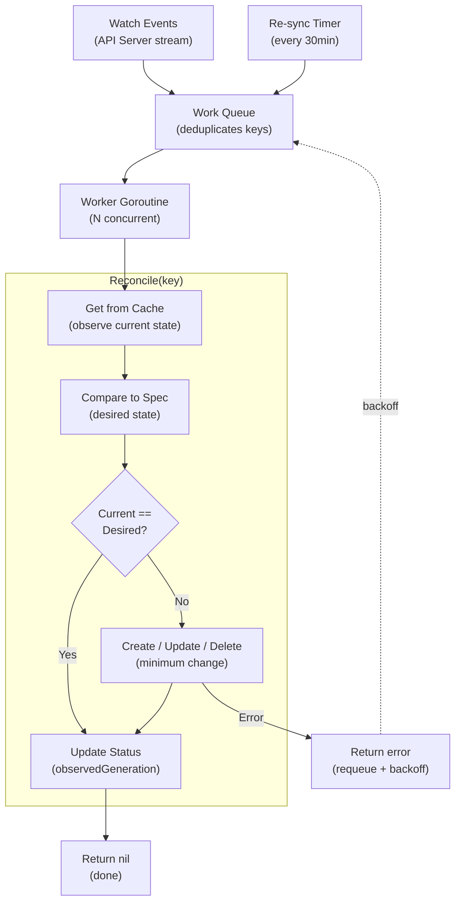
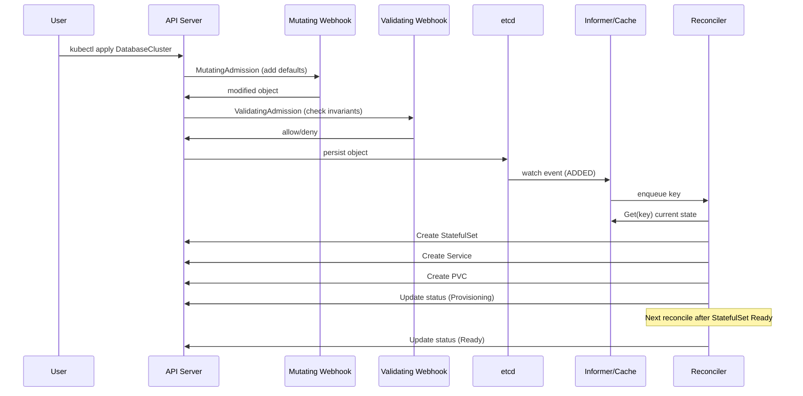

## Keywords in This File

{: .no_toc }

| # | Keyword | Weight |
|---|---------|--------|
| 1 | [Desired State and Reconciliation Loops Theory](#desired-state-and-reconciliation-loops-theory) | medium |
| 2 | [Kubernetes API Machinery and Operator Pattern](#kubernetes-api-machinery-and-operator-pattern) | medium |

---

# Desired State and Reconciliation Loops Theory

---

### 🎯 Model Answer

**30 seconds:**
> Kubernetes is built on the desired state pattern: you declare what you want (spec),
> and controllers continuously compare actual state to desired state, then take actions
> to reconcile the difference. This is level-triggered control: controllers don't react
> to events, they observe current state and decide what to do. The result: eventual
> consistency - given enough time and no new changes, the system converges to the desired
> state and stays there.

**3 minutes (Senior):**
> The desired state pattern separates WHAT you want from HOW to achieve it. You write
> `replicas: 3` and the ReplicaSet controller ensures 3 pods exist - whether by creating
> them, waiting for nodes, retrying failures. You don't write imperative instructions.
>
> The core of every Kubernetes controller is the reconciliation loop:
> Observe current state -> Compare to desired state -> Act if different -> Wait for
> next observation. This is the "level-triggered" model. Compare to edge-triggered:
> an edge-triggered system reacts to events (pod died -> create pod). Level-triggered:
> periodically check state (current pods = 2, desired = 3 -> create 1 pod). Level-triggered
> is more resilient: even if events are missed, the next reconciliation loop corrects the state.
>
> Controllers use informers (list+watch) to observe state efficiently. Informer:
> initial list to populate the local cache, then watch for incremental changes. Changes
> are enqueued in a work queue. The controller worker dequeues and calls Reconcile.
> The work queue deduplicates: if the same object changes rapidly, only one reconcile
> runs (not one per change). This prevents the thundering herd problem.

**Framework:** DESIRED STATE -> OBSERVE -> DIFF -> ACT -> EVENTUAL CONSISTENCY

*Adapting up:* Level-triggered vs edge-triggered formal analysis, Kubernetes API extension
patterns (webhooks, CRDs, aggregated API servers), formal verification of reconciliation
logic.

*Adapting down:* "Kubernetes is like a thermostat. You set the desired temperature.
The thermostat checks the actual temperature, turns heating/cooling on if needed, then
waits and checks again. It doesn't matter how the temperature got wrong - it always
fixes it."

**Blank Mind Recovery:**

**(1) Restate:** "Desired state pattern. Controllers observe actual state, compare to desired
(spec), reconcile the difference. Level-triggered: check state periodically, not just
on events. Informers: list+watch for efficient state observation. Work queue: deduplication."

**(2) First principles:** "Imperative systems are fragile: missed events = permanent drift.
Declarative desired state systems are self-healing: missed events don't matter because the
next reconciliation loop detects and corrects the drift regardless of how it happened."

**(3) Bridge:** "Desired state = GPS navigation. You declare the destination. The GPS
continuously checks your current position and recalculates the route if you deviate.
If you miss a turn: GPS recalculates. It doesn't care HOW you got off course, just
that you're off course and here's how to get back."

---

### 📘 Concept Explanation

**Desired State vs Imperative:**

Imperative: "create 3 pods of type X"
- Executed once
- If pods die: must explicitly issue another create command
- No self-healing

Declarative desired state: "I want 3 pods of type X"
- Controller continuously enforces this intent
- Pods die -> controller detects current=2, desired=3 -> creates 1
- Self-healing: the declaration is continuously enforced

**Level-Triggered vs Edge-Triggered:**

Edge-triggered (event-driven): react to state change events.
Example: pod dies -> PodDeleted event -> create new pod.
Problem: if the event is missed (controller was down), the pod stays dead.

Level-triggered (state-based): periodically observe current state, take action based on
observed state vs desired state.
Example: controller wakes up -> observes 2 pods running, desired=3 -> creates 1 pod.
Problem being solved: what happens if the event that CAUSED the drift was missed?
Answer: doesn't matter - the next observation catches it.

Kubernetes uses level-triggered control for resilience. All controllers re-list and
re-sync periodically (default: every 30 seconds or 10 minutes) even if no events arrive.
This guarantees eventual convergence even through controller restarts, event drops,
or network partitions.

**Informer Architecture:**

```
            [API Server]
                |
         List (initial)
         Watch (streaming updates)
                |
           [Informer]
                |
            [Cache]  <-- local in-memory store
                |
         +------+--------+
         |               |
   [Event handlers]   [Store access]
   (Add, Update, Del)  (GetByKey, List)
         |
     [Work Queue]
     (deduplicates)
         |
   [Controller workers]
   goroutine pool
         |
   [Reconcile(key)]
   observe -> compare -> act
```

> **Code walkthrough:** This Desired State and Reconciliation Loops Theory example demonstrates a key concept in practice using SQL. **KEY MECHANISM:** the runtime executes these instructions in sequence with specific memory and execution semantics. **WHY IT MATTERS:** misapplying this pattern causes subtle bugs that only manifest under production load. **TAKEAWAY: understand the execution model before using this pattern in production code.**

The informer pattern provides:
- Cache: controller reads from cache (fast, no API call) not from API server
- Watch: incremental updates from API server (not polling)
- Deduplication: if the same object changes 5 times while Reconcile is queued, only
  one Reconcile call happens (for the CURRENT state, not 5 intermediate states)
- Re-sync: periodically re-adds all objects to the queue to catch missed events

**Reconciliation Loop Contract:**

The reconciliation loop has a fundamental requirement: IDEMPOTENCY.
Reconcile may be called multiple times for the same state (re-sync, retry after error).
The result must be the same regardless of how many times it's called.

```go
// Pseudo-code: idempotent reconcile
func (r *MyReconciler) Reconcile(key types.NamespacedName) error {
    obj := r.cache.Get(key)     // read current state from cache
    if obj == nil {
        return nil              // object deleted: nothing to do
    }

    // Observe: what does the world currently look like?
    current := r.observeExternalState(obj)

    // Compare: does current match desired?
    if current == obj.Spec.DesiredState {
        return nil              // already reconciled: nothing to do
    }

    // Act: take minimum actions to reach desired state
    r.applyChanges(current, obj.Spec.DesiredState)

    // Return nil = success; return err = retry (re-queued)
    return nil
}
```

> **Code walkthrough:** This Desired State and Reconciliation Loops Theory example demonstrates Go pattern using SQL. **KEY MECHANISM:** the Go runtime uses a work-stealing scheduler across GOMAXPROCS OS threads. **WHY IT MATTERS:** data races crash with -race flag; concurrent map access panics without sync.Map or mutex. **TAKEAWAY: run go test -race on all packages; use sync primitives for any shared mutable state.**

Idempotency means: creating a resource that already exists is a no-op (use
`kubectl apply` semantics: create if not exists, update if exists but different).

**Eventual Consistency Model:**

Between reconciliation loops: actual state may diverge from desired state.
A pod deleted externally: detected on next reconcile (watch event or re-sync).
A ConfigMap updated externally: propagated to pods using volume mounts within ~1 minute.
This is eventual consistency: the system converges to desired state, but not instantly.

For strong consistency requirements (e.g., a security policy MUST be applied before
a pod starts): use admission webhooks (synchronous, in the request path) not controllers
(asynchronous).

---

### 💻 Code Example

> **Code walkthrough:** Controller-runtime Reconcile function showing the observe-compare-act
> pattern.

```go
// BAD: Edge-triggered reconciler (event handler creates pods directly)
// Problem: if the Created event is missed, pod is never created.
// Problem: no idempotency - calling twice creates two pods.

func onPodDeleted(pod *v1.Pod) {
    // This only runs when we receive the Deleted event
    // If the event is missed: pod stays dead
    client.Create(newPod(pod.Labels))
}
```

```go
// GOOD: Level-triggered reconciler (controller-runtime pattern)
// Always checks current state; idempotent; self-healing

type ReplicaSetReconciler struct {
    client.Client              // Kubernetes API client
    Scheme *runtime.Scheme
}

// Reconcile is called when ReplicaSet or its Pods change
func (r *ReplicaSetReconciler) Reconcile(
    ctx context.Context,
    req ctrl.Request,            // NamespacedName of the ReplicaSet
) (ctrl.Result, error) {

    // Step 1: Fetch desired state from cache
    rs := &appsv1.ReplicaSet{}
    if err := r.Get(ctx, req.NamespacedName, rs); err != nil {
        if errors.IsNotFound(err) {
            return ctrl.Result{}, nil  // deleted: nothing to do
        }
        return ctrl.Result{}, err
    }

    // Step 2: Observe actual state
    // List pods owned by this ReplicaSet
    podList := &v1.PodList{}
    r.List(ctx, podList, client.InNamespace(rs.Namespace),
        client.MatchingLabels(rs.Spec.Selector.MatchLabels))

    // Count only Running/Pending pods (not Terminating)
    currentReplicas := countActivePods(podList.Items)
    desiredReplicas := *rs.Spec.Replicas

    // Step 3: Compare and act
    if currentReplicas < desiredReplicas {
        // Create missing pods (one at a time for safety)
        toCreate := desiredReplicas - currentReplicas
        for i := int32(0); i < toCreate; i++ {
            pod := newPodForRS(rs)
            if err := r.Create(ctx, pod); err != nil {
                return ctrl.Result{}, err
            }
        }
    } else if currentReplicas > desiredReplicas {
        // Delete excess pods (LIFO: delete newest first)
        toDelete := currentReplicas - desiredReplicas
        pods := sortPodsByCreationTime(podList.Items)
        for i := int32(0); i < toDelete; i++ {
            r.Delete(ctx, &pods[i])
        }
    }
    // If equal: no action needed (idempotent - calling again = same result)

    // Update status
    rs.Status.Replicas = currentReplicas
    r.Status().Update(ctx, rs)

    return ctrl.Result{}, nil  // nil = success, no requeue needed
}
```

> **Code walkthrough:** The BAD example shows the edge-triggered anti-pattern: reacting
> to a single event with no current-state check. The GOOD example follows the canonical
> observe-compare-act structure. The first `Get` reads desired state from the informer cache
> (no API server call). The `List` observes actual state (current pods). The comparison
> determines the action: create, delete, or no-op. Critically: calling Reconcile multiple
> times for the same state always produces the same result (idempotent). If `Create` fails:
> the error is returned, the key is re-queued, and Reconcile is retried - which is safe
> because it checks current state again before creating.

---

### 🎓 Answers by Seniority

**Junior / Mid (0-5 years):**
> Desired state means you tell Kubernetes what you want (3 pods running), and Kubernetes
> figures out how to make it happen. If a pod dies, Kubernetes automatically creates a
> new one to maintain the desired state. The controller that does this is a reconciliation
> loop: it checks whether the current state matches desired, and if not, takes action to
> fix it. This happens continuously - not just once.

*Push deeper:* What's the difference between a controller watching for events vs checking
the current state periodically?

---

**Senior / Staff (5+ years):**
> The level-triggered model is Kubernetes' most important reliability property. Here's
> what breaks in edge-triggered systems: network partition -> events not delivered ->
> controller misses "pod died" event -> controller restarts -> no event to react to ->
> pod stays dead until someone notices. Level-triggered: controller restarts -> re-syncs
> state from API server -> observes pod count is 2, desired is 3 -> creates a pod.
> Event history is irrelevant. Current state is all that matters.
>
> The practical implication for custom controllers: your Reconcile function must be
> written to NEVER assume why it was called. It might be called after a Create event,
> an Update event, a Delete event, a re-sync timer, or a retry after error. In all cases:
> check current state, compare to desired, act. Never assume the state is what the event
> implies it is. The object in the cache is the current state; act on THAT, not on the
> event that triggered the call.

---

### ⚠️ Common Misconceptions

**Misconception 1: "Kubernetes provides strong consistency - changes apply immediately."**
Kubernetes is eventually consistent. A Deployment update is processed by the Deployment
controller, which creates a new ReplicaSet, which creates pods, which are scheduled, which
pull images and start. This takes seconds to minutes. During that time: both old and new
pods may be running. Applications must tolerate this transient inconsistency. For hard
consistency requirements (network policy must be active before pod traffic flows):
use admission webhooks which are synchronous in the API path.

**Misconception 2: "If I see it in kubectl get, it's running."**
`kubectl get pod` shows the last known state from etcd. The pod's actual state (container
processes running on the node) may differ. A pod showing `Running` might have its container
process dead if the kubelet hasn't reported yet. Use `kubectl get pod -w` to watch for
transitions, and `kubectl describe pod` for the full event timeline. The health you care
about is the readiness probe status: `READY 1/1` means the container reported itself ready.

---

### 🚨 Failure Modes and Diagnosis

**Failure 1: Controller in infinite reconciliation loop**

Symptom: controller logs show thousands of reconcile calls per second for the same object.
High CPU on the controller pod. Objects updating rapidly (new ResourceVersion each second).

Cause: controller's reconcile logic is not idempotent. Every reconcile call modifies the
object (e.g., updates an annotation), which triggers a new watch event, which triggers
another reconcile - infinite loop.

Diagnostic:
```bash
kubectl logs <controller-pod> | grep "Reconciling" | head -20
# Rapid same-key reconcile messages = reconcile loop

# Check object update rate
kubectl get <object> -o yaml | grep resourceVersion
# Run twice 5s apart: if resourceVersion changes each time = controller loop
```

> **Code walkthrough:** This Run twice 5s apart: if resourceVersion changes each time = controller loop example demonstrates shell script pattern using SQL. **KEY MECHANISM:** the shell executes commands sequentially; pipes pass stdout of one command to stdin of the next. **WHY IT MATTERS:** unquoted variables with spaces cause word splitting - IFS splits the value into multiple arguments. **TAKEAWAY: always double-quote variables: "$VAR"; use [[ ]] instead of [ ] for safer conditionals.**

Fix: fix reconcile logic to be idempotent. Before updating an annotation: check if the
annotation already has the desired value. If already correct: return nil without any API call.

**Failure 2: Controller falling behind (work queue growing)**

Symptom: objects updated but changes not reflected for minutes. Controller logs show
work queue depth growing. Reconcile calls taking longer than events arriving.

Cause: reconcile is too slow (external API calls, synchronous operations). Or controller
has too few worker goroutines for the load.

Diagnostic:
```bash
# Controller metrics (controller-runtime exposes these)
controller_runtime_reconcile_time_seconds_bucket
controller_runtime_queue_length
```

> **Code walkthrough:** This Controller metrics (controller-runtime exposes these) example demonstrates shell script pattern. **KEY MECHANISM:** the shell executes commands sequentially; pipes pass stdout of one command to stdin of the next. **WHY IT MATTERS:** unquoted variables with spaces cause word splitting - IFS splits the value into multiple arguments. **TAKEAWAY: always double-quote variables: "$VAR"; use [[ ]] instead of [ ] for safer conditionals.**

Fix: increase number of concurrent reconciler workers in controller setup:
`ctrl.Options{MaxConcurrentReconciles: 10}`. Add timeouts to external API calls.
Profile the reconcile function to find slow operations.

---

### 🎯 Interview Deep-Dive

| Question Category | Time to Answer |
|---|---|
| Conceptual | 1-2 minutes |
| Mechanism | 2-3 minutes |
| Trade-off | 2-3 minutes |
| Debugging | 2-3 minutes |
| Architecture | 3-4 minutes |
| Design | 2-3 minutes |
| Advanced | 2-3 minutes |
| Theory | 2-3 minutes |
| Behavioral | 2-3 minutes |

---

**Q1 [MID] (CONCEPTUAL): What is the difference between level-triggered and edge-triggered control?**

A: In control systems theory: edge-triggered reacts to state transitions (edges); level-triggered
checks state continuously (levels).

Edge-triggered in software: an event handler fires when a state change event arrives.
Example: HTTP webhook - "pod died" event arrives -> create new pod. If the event is dropped
(network issue, handler was down): no recovery until the next event. Event history cannot
be reconstructed.

Level-triggered in software: a process periodically samples current state and compares to
desired state. Example: Kubernetes ReplicaSet controller - every 30 seconds (or on watch
events): count current pods, compare to desired, create/delete as needed. If the controller
was down and missed 10 "pod died" events: on restart, it checks current state, sees deficit,
and creates the needed pods. Event history is irrelevant.

Kubernetes advantages of level-triggered:
1. Resilience: controller restarts, network partitions, missed events - all self-correcting
2. Re-sync: periodic re-list catches any drift not reported via events
3. Convergence guarantee: given time and no external interference, state converges to desired

Trade-off of level-triggered: reconciliation has latency proportional to reconcile period.
If a pod dies and the next reconcile is 30 seconds away, there's up to 30 seconds of
degraded capacity. In practice: watch events trigger reconciles immediately (<1 second).
The periodic re-sync is the safety net, not the primary mechanism.

*What separates good from great:* The hybrid design in Kubernetes: watch for fast reaction
(within milliseconds of a change) + periodic re-sync for resilience (catch anything the
watch missed). This combines the best of both approaches. The watch is the fast path;
the re-sync is the correctness guarantee. Applications that process Kubernetes events
should do the same: react to watch events for low latency, but also reconcile periodically
to catch missed events.

---

**Q2 [SENIOR] (MECHANISM): Explain how informers work in Kubernetes.**

A: Informers are the client-side caching layer that all Kubernetes controllers use to
efficiently observe cluster state without overloading the API server.

Without informers: every reconcile call would do `client.Get()` from the API server.
With 1000 controllers each reconciling 100 objects every minute: 100,000 API calls/minute
to the API server. This would overwhelm etcd.

Informer lifecycle:
1. Initial List: informer calls `GET /api/v1/pods?labelSelector=...` with `resourceVersion=0`.
   API server returns all matching pods + current `resourceVersion`.
2. Watch: informer opens a long-lived HTTP/2 stream: `GET /api/v1/pods?watch=true&resourceVersion=<rv>`.
   API server streams every change (ADDED, MODIFIED, DELETED events) from that resourceVersion.
3. Cache: all listed and watched objects are stored in an in-memory thread-safe store
   (`cache.Store`). Controller reads from the cache: `cache.Get("namespace/name")`.
   No API call needed for reads.
4. Watch error handling: if the watch connection drops (network issue), informer detects
   the error, waits briefly, then re-lists to get current state + new resourceVersion,
   then re-opens the watch. This prevents cache inconsistency from dropped events.

Re-sync: every `resyncPeriod` (typically 10-30 minutes), informer re-adds all cached
objects to the event handler queue. This triggers a reconcile for all objects even if
nothing changed. Purpose: catch any state divergence that wasn't caught by watch events.

SharedInformer: the same informer can be shared by multiple controllers watching the
same resource type. Only one List+Watch connection to the API server per resource type,
regardless of how many controllers use it.

*What separates good from great:* The `resourceVersion` is the key to the watch protocol
correctness. The API server stores a monotonically increasing resourceVersion in etcd for
every change. The watch stream starts from a specific resourceVersion and delivers all
subsequent changes. If the watch drops and reconnects: it provides the last seen resourceVersion.
The API server delivers all changes since that version. This guarantees: no events are
missed between disconnect and reconnect, as long as the API server's watch cache hasn't
compacted beyond that resourceVersion. If too old: the API server returns a `410 Gone`
error, causing the informer to do a full re-list. This is the resilience mechanism.

---

**Q3 [STAFF] (ARCHITECTURE): What is the purpose of the work queue in controller architecture?**

A: The work queue decouples event receipt from reconciliation processing. It provides three
critical properties: deduplication, rate limiting, and backoff for failed items.

Deduplication:
```plaintext
Events arriving:     Pod-A updated -> Pod-A updated -> Pod-A updated -> Pod-A...
Work queue:          [Pod-A]        [Pod-A - still there]       (already in queue: skip)
Reconcile calls:     reconcile(Pod-A)       reconcile(Pod-A)
```

> **Code walkthrough:** This Controller metrics (controller-runtime exposes these) example demonstrates a key concept in practice using SQL. **KEY MECHANISM:** the runtime executes these instructions in sequence with specific memory and execution semantics. **WHY IT MATTERS:** misapplying this pattern causes subtle bugs that only manifest under production load. **TAKEAWAY: understand the execution model before using this pattern in production code.**

If Pod-A changes 5 times while a reconcile is in progress: only one additional reconcile
runs after the current one completes. Each reconcile processes CURRENT state, so
intermediate states don't need individual reconciliation.

Rate limiting: controllers use a rate-limited work queue. After an error: the key is
re-queued with exponential backoff (5s, 10s, 20s, 40s, ...). This prevents a controller
from hammering the API server when the reconcile keeps failing (e.g., target resource
doesn't exist yet).

```go
// Work queue configuration (controller-runtime)
ctrl.NewControllerManagedBy(mgr).
    For(&myv1.MyResource{}).
    WithOptions(controller.Options{
        RateLimiter: workqueue.NewItemExponentialFailureRateLimiter(
            5*time.Millisecond, 1000*time.Second,
        ),
    })
```

> **Code walkthrough:** This Controller metrics (controller-runtime exposes these) example demonstrates Go pattern. **KEY MECHANISM:** the Go runtime uses a work-stealing scheduler across GOMAXPROCS OS threads. **WHY IT MATTERS:** data races crash with -race flag; concurrent map access panics without sync.Map or mutex. **TAKEAWAY: run go test -race on all packages; use sync primitives for any shared mutable state.**

Parallel processing: the work queue allows N worker goroutines to drain it concurrently.
Each worker calls `reconcile(key)`. Different keys can be processed in parallel. The
same key is processed by at most one worker at a time (the queue deduplication prevents
two workers from simultaneously reconciling the same object).

*What separates good from great:* The work queue's failure handling is subtle but critical.
When reconcile returns an error: `ctrl.Result{}, err`. controller-runtime re-queues the
key with exponential backoff. When reconcile returns a re-queue request: `ctrl.Result{RequeueAfter: 30s}, nil`.
The key is re-queued after 30 seconds (not as an error, not with backoff). Use re-queue
for: "I've done what I can now, but this object needs periodic re-evaluation" (e.g., check
if a Certificate is about to expire). Use error return for: "something went wrong, retry
ASAP with backoff". Wrong: returning error for everything (causes aggressive retry flood).
Right: return nil with RequeueAfter for expected eventual completion scenarios.

---

**Q4 [STAFF] (TRADE-OFF): Controllers vs Admission Webhooks - when to use each?**

A: Controllers and admission webhooks are both extension points but serve fundamentally
different purposes due to their position in the request lifecycle.

Admission webhooks (synchronous, in the API request path):
- Validating webhook: validates a resource and either allows or rejects the request
- Mutating webhook: transforms a resource before it's stored (adds defaults, injects sidecars)
- Called BEFORE the object is persisted to etcd
- Must respond in milliseconds (default timeout: 10-15 seconds, but best practice: < 1 second)
- If webhook is down and `failurePolicy: Fail`: ALL API requests for that resource type fail

Use admission webhooks when:
- Policy enforcement at creation/update time (reject invalid configurations immediately)
- Defaulting (add missing fields before storage)
- Sidecar injection (Istio, linkerd) - must happen before pod is created
- Constraint: "a Service without a specific label may not be created"

Controllers (asynchronous, watching state):
- Runs independently of the API request path
- Can create, update, or delete other resources
- Retries on failure
- Eventually consistent (lag between desired state and actual state)
- Failure doesn't block API requests (loose coupling)

Use controllers when:
- Creating secondary resources from a primary resource (create a ConfigMap for each Deployment)
- Reacting to changes over time (certificate rotation, scaling decisions)
- Managing external resources (cloud load balancers, DNS records)

Anti-pattern: using a controller for policy enforcement.
```
BAD: Controller watches pods, deletes non-compliant ones
     (race condition: pod runs for time between creation and controller action)
GOOD: Validating webhook rejects non-compliant pods at creation time
      (synchronous: pod never starts if policy is violated)
```

> **Code walkthrough:** This Controller metrics (controller-runtime exposes these) example demonstrates a key concept in practice using SQL. **KEY MECHANISM:** the runtime executes these instructions in sequence with specific memory and execution semantics. **WHY IT MATTERS:** misapplying this pattern causes subtle bugs that only manifest under production load. **TAKEAWAY: understand the execution model before using this pattern in production code.**

*What separates good from great:* The `failurePolicy: Fail` vs `failurePolicy: Ignore`
decision for admission webhooks is an availability trade-off. `Fail`: any webhook error
(timeout, 5xx) blocks the API request. Maximum security but creates a hard dependency on
webhook availability. `Ignore`: webhook errors allow the request through. Reduced security
(policy not enforced during webhook outage) but higher availability. For critical security
policies: `Fail` with high availability webhook deployment (3+ replicas, pod anti-affinity
across nodes, aggressive liveness probes). For non-critical defaults: `Ignore`.

---

**Q5 [STAFF] (DEBUGGING): How do you debug a controller that isn't reconciling correctly?**

A: Debugging controllers requires understanding the observe-compare-act loop and finding
where it breaks.

Step 1: Check if reconcile is being called.
```bash
kubectl logs <controller-pod> | grep "Reconciling\|reconcile"
# If no reconcile logs: the controller isn't receiving events
# If rapid reconcile logs: possible reconcile loop (check Step 3)
```

> **Code walkthrough:** This If rapid reconcile logs: possible reconcile loop (check Step 3) example demonstrates shell script pattern using container. **KEY MECHANISM:** the shell executes commands sequentially; pipes pass stdout of one command to stdin of the next. **WHY IT MATTERS:** unquoted variables with spaces cause word splitting - IFS splits the value into multiple arguments. **TAKEAWAY: always double-quote variables: "$VAR"; use [[ ]] instead of [ ] for safer conditionals.**

Step 2: Check informer/cache health.
```bash
# Controller-runtime metrics:
controller_runtime_reconcile_total{controller="mycontroller"}
# If this is not incrementing when you make changes: events not reaching controller
# Possible: watch is broken, labelSelector mismatch, RBAC issue
```

> **Code walkthrough:** This Possible: watch is broken, labelSelector mismatch, RBAC issue example demonstrates shell script pattern using SQL. **KEY MECHANISM:** the shell executes commands sequentially; pipes pass stdout of one command to stdin of the next. **WHY IT MATTERS:** unquoted variables with spaces cause word splitting - IFS splits the value into multiple arguments. **TAKEAWAY: always double-quote variables: "$VAR"; use [[ ]] instead of [ ] for safer conditionals.**

Check RBAC: controller ServiceAccount must have Get/List/Watch on watched resources:
```bash
kubectl auth can-i list pods \
  --as=system:serviceaccount:default:my-controller
```

> **Code walkthrough:** This Possible: watch is broken, labelSelector mismatch, RBAC issue example demonstrates shell script pattern using container. **KEY MECHANISM:** the shell executes commands sequentially; pipes pass stdout of one command to stdin of the next. **WHY IT MATTERS:** unquoted variables with spaces cause word splitting - IFS splits the value into multiple arguments. **TAKEAWAY: always double-quote variables: "$VAR"; use [[ ]] instead of [ ] for safer conditionals.**

Step 3: Check reconcile output (add strategic logging).
```go
// Add structured logging in Reconcile:
log := ctrl.LoggerFrom(ctx).WithValues(
    "object", req.NamespacedName,
)
log.Info("Starting reconcile",
    "observed_replicas", currentReplicas,
    "desired_replicas", desiredReplicas,
)
```

> **Code walkthrough:** This Possible: watch is broken, labelSelector mismatch, RBAC issue example demonstrates Go pattern. **KEY MECHANISM:** the Go runtime uses a work-stealing scheduler across GOMAXPROCS OS threads. **WHY IT MATTERS:** data races crash with -race flag; concurrent map access panics without sync.Map or mutex. **TAKEAWAY: run go test -race on all packages; use sync primitives for any shared mutable state.**

Step 4: Check error handling.
If reconcile returns an error: the object is re-queued. If it returns nil but doesn't
update status: you can't tell if reconcile ran. Best practice: always update status with
`ObservedGeneration` and `LastReconcileTime`.

Step 5: Dry-run to see what changes would be made without applying:
```bash
kubectl apply --dry-run=server -f resource.yaml
# Server-side dry-run: runs admission webhooks, returns what WOULD happen
```

> **Code walkthrough:** This Server-side dry-run: runs admission webhooks, returns what WOULD happen example demonstrates shell script pattern. **KEY MECHANISM:** the shell executes commands sequentially; pipes pass stdout of one command to stdin of the next. **WHY IT MATTERS:** unquoted variables with spaces cause word splitting - IFS splits the value into multiple arguments. **TAKEAWAY: always double-quote variables: "$VAR"; use [[ ]] instead of [ ] for safer conditionals.**

*What separates good from great:* The `ObservedGeneration` status field is the most
powerful debugging tool for controllers. It means: "this controller has processed the
resource at generation N." When you update a resource: the `metadata.generation` increments.
The controller reconciles and sets `status.observedGeneration = metadata.generation`. You
can tell immediately if the controller has processed your latest change: if
`observedGeneration != generation`, the controller hasn't reconciled the latest spec yet.
Without this: you'd have to correlate timestamps between your change and the controller log.

---

**Q6 [SENIOR] (ADVANCED): What guarantees does the Kubernetes API provide for eventual consistency?**

A: Kubernetes provides a set of specific consistency guarantees via etcd and the watch API.

1. Write linearizability: etcd provides linearizable writes. When you `kubectl apply` and
   receive a 200 OK: the object is durably stored in etcd. Any subsequent read from any
   client will see this write (or a later version). There is no "write accepted but not yet
   visible" window after the API server confirms success.

2. Read consistency via ResourceVersion: each object has a monotonically increasing
   `resourceVersion`. If you read an object at `resourceVersion: 1000`, any subsequent
   read with `resourceVersion >= 1000` returns data at least as current. You can request
   `?resourceVersion=1000` (read at that version) or `?resourceVersion=0` (read from cache,
   possibly slightly stale) or no resourceVersion (read from etcd, guaranteed current).

3. Watch event ordering: watch events are delivered in the order they occurred in etcd
   (by resourceVersion). If you see an event with resourceVersion=1005, you have seen
   all events up to 1005.

4. No guarantees: Kubernetes does NOT guarantee: that your controller processes events
   before another controller, that state changes propagate to all components simultaneously,
   or that two concurrent writes to different controllers produce a consistent combined state.

Practical implication: two controllers modifying the same object can cause conflicts.
When `r.Update()` returns a Conflict error (409): the object was modified since last read.
The correct handling:
```go
err := r.Update(ctx, obj)
if errors.IsConflict(err) {
    // Re-read the latest version and re-apply our changes
    return ctrl.Result{Requeue: true}, nil
}
```

> **Code walkthrough:** This Server-side dry-run: runs admission webhooks, returns what WOULD happen example demonstrates Go pattern using SQL. **KEY MECHANISM:** the Go runtime uses a work-stealing scheduler across GOMAXPROCS OS threads. **WHY IT MATTERS:** data races crash with -race flag; concurrent map access panics without sync.Map or mutex. **TAKEAWAY: run go test -race on all packages; use sync primitives for any shared mutable state.**

*What separates good from great:* The optimistic concurrency model in Kubernetes is
implicit in the resourceVersion. When you `Get` an object: the response includes
`resourceVersion: 1234`. When you `Update` the same object: the request must include
the same `resourceVersion: 1234`. If anyone else updated the object between your Get
and Update (resourceVersion is now 1235): the API server returns 409 Conflict. Your
controller must handle this by re-reading and retrying. controller-runtime does NOT
automatically retry conflicts - your Reconcile must handle the 409 explicitly or return
an error (which causes a re-queue and re-read on next reconcile).

---

**Q7 [STAFF] (THEORY): How does Kubernetes handle split-brain and network partitions?**

A: Kubernetes' architecture around etcd determines its split-brain and partition behavior.

etcd and Raft consensus:
etcd uses the Raft consensus algorithm. For a write to succeed: a quorum of etcd members
must acknowledge it (quorum = majority: 3 of 5, 2 of 3). During a network partition:

Partition scenario (5-node etcd cluster, partition splits 3+2):
- Partition with 3 nodes (majority): quorum met -> can accept writes -> continues operating
- Partition with 2 nodes (minority): quorum not met -> refuses writes -> read-only mode

Result: no split-brain. Only one partition (the majority) can accept writes. The minority
partition stops accepting writes rather than risk inconsistency.

API server behavior during partition:
- API servers connected to the majority partition: serve read and write requests normally
- API servers connected to the minority partition: reads may succeed (stale data from cache)
  but writes fail (can't reach etcd quorum)

Node (kubelet) behavior during control plane partition:
- If kubelet loses connection to API server: continues running existing pods (does not
  stop running pods just because it can't reach the control plane)
- After `node-monitor-grace-period` (default 40s): node marked NotReady by controller
- After `pod-eviction-timeout` (default 5 minutes): pods on NotReady nodes are evicted
  (and rescheduled to healthy nodes, if possible)

Zombie pod prevention: StatefulSet pods in a partitioned node are NOT immediately evicted
(to prevent split-brain in stateful applications like databases). You must manually force-delete
the pod after confirming the node is truly unreachable.

*What separates good from great:* The `pod-eviction-timeout` and StatefulSet zombie pod
problem is a real production failure mode. A database pod (PostgreSQL primary) is on a
network-partitioned node. After 5 minutes: Kubernetes evicts the pod and schedules a new
primary on a healthy node. If the old node's PostgreSQL is still running (process alive,
just no network): you have two PostgreSQL instances both believing they're primary. This
is split-brain. Protection: use fencing (STONITH - Shoot The Other Node In The Head) -
a mechanism that hard-stops the old node before starting the new primary. Without fencing:
don't use Kubernetes for stateful databases without understanding this failure mode.

---

**Q8 [STAFF] (DESIGN): How would you design an idempotent reconciler for a database operator?**

A: A database operator (example: creates and manages PostgreSQL clusters) is the highest-risk
application of the reconciler pattern because mistakes cause data loss.

Design principles:

1. Never delete data without explicit intent.
```go
// Check: was this PVC deletion requested explicitly (finalizer)?
if !containsFinalizer(db, "postgres-operator/pvc-cleanup") {
    // Don't delete PVCs; they contain data
    log.Info("Skipping PVC deletion: no explicit cleanup finalizer")
}
```

> **Code walkthrough:** This Server-side dry-run: runs admission webhooks, returns what WOULD happen example demonstrates Go pattern using SQL. **KEY MECHANISM:** the Go runtime uses a work-stealing scheduler across GOMAXPROCS OS threads. **WHY IT MATTERS:** data races crash with -race flag; concurrent map access panics without sync.Map or mutex. **TAKEAWAY: run go test -race on all packages; use sync primitives for any shared mutable state.**

2. Idempotency for creates:
```go
// Always check if resource exists before creating
secret := &v1.Secret{}
err := r.Get(ctx, secretKey, secret)
if errors.IsNotFound(err) {
    r.Create(ctx, newSecret(db))
} else if err != nil {
    return err // unexpected error
}
// If already exists: use existing (don't overwrite with new random password)
```

> **Code walkthrough:** This Server-side dry-run: runs admission webhooks, returns what WOULD happen example demonstrates Go pattern. **KEY MECHANISM:** the Go runtime uses a work-stealing scheduler across GOMAXPROCS OS threads. **WHY IT MATTERS:** data races crash with -race flag; concurrent map access panics without sync.Map or mutex. **TAKEAWAY: run go test -race on all packages; use sync primitives for any shared mutable state.**

3. Status-driven state machine:
Use `status.phase` to track the operator's progress across reconcile calls:
```go
switch db.Status.Phase {
case "": 
    // Uninitialized: create PVCs, set phase = "provisioning"
case "provisioning":
    // Check if PVCs are bound, then create StatefulSet
    // Set phase = "initializing" when StatefulSet ready
case "initializing":
    // Run pg_hba.conf setup, create roles
    // Set phase = "running" when healthy
case "running":
    // Normal operation: check health, handle scale up/down
}
```

> **Code walkthrough:** This Server-side dry-run: runs admission webhooks, returns what WOULD happen example demonstrates Go pattern. **KEY MECHANISM:** the Go runtime uses a work-stealing scheduler across GOMAXPROCS OS threads. **WHY IT MATTERS:** data races crash with -race flag; concurrent map access panics without sync.Map or mutex. **TAKEAWAY: run go test -race on all packages; use sync primitives for any shared mutable state.**

4. Idempotent configuration:
Generating PostgreSQL configuration: pg_hba.conf must be idempotent (same input produces
same output). Use deterministic templates, not random values for things like max_connections
(base it on pod resources, not random choice).

5. Finalizers for cleanup:
```go
// Add finalizer on creation
controllerutil.AddFinalizer(db, "postgres-operator/cleanup")

// Before deletion: drain connections, take final backup
if !db.DeletionTimestamp.IsZero() {
    r.drainConnections(db)
    r.takeBackup(db)
    controllerutil.RemoveFinalizer(db, "postgres-operator/cleanup")
}
```

> **Code walkthrough:** This Server-side dry-run: runs admission webhooks, returns what WOULD happen example demonstrates Go pattern. **KEY MECHANISM:** the Go runtime uses a work-stealing scheduler across GOMAXPROCS OS threads. **WHY IT MATTERS:** data races crash with -race flag; concurrent map access panics without sync.Map or mutex. **TAKEAWAY: run go test -race on all packages; use sync primitives for any shared mutable state.**

*What separates good from great:* The "assume nothing" principle for production database
operators: every reconcile starts with a fresh observation. Don't assume the StatefulSet
exists because you created it in a previous reconcile. Don't assume the database is healthy
because it was healthy 30 seconds ago. Re-read and re-verify every assumption on every
reconcile call. The performance cost of re-reading from the informer cache is negligible
(in-memory read, no API call). The correctness benefit is significant: no stale assumptions
cause destructive actions.

---

**Q9 [STAFF] (BEHAVIORAL): Describe how you designed a Kubernetes controller for a production use case.**

A (STAR format):

Situation: our platform team managed 200+ microservices. Each service needed: a Deployment,
a Service, an HPA, a PodDisruptionBudget, an Istio VirtualService, and an Istio DestinationRule.
Engineers were creating these manually, leading to inconsistency: some services had no PDB,
HPA min-replicas varied wildly, VirtualService configurations were copy-pasted and stale.
We had 30 "incident-caused" outages in a year from missing PDBs or misconfigured HPAs.

Task: design a Kubernetes operator (CRD + controller) that accepts a simplified `AppDeployment`
CRD and manages all 7 Kubernetes resources from it.

Action:

CRD design: `AppDeployment` spec - simplified surface area:
```yaml
kind: AppDeployment
spec:
  image: ghcr.io/company/payments:v1.2.3
  targetCPUUtilization: 70    # HPA target
  minReplicas: 2
  maxReplicas: 10
  pdBMinAvailable: 50%        # automatically creates PDB
  traffic:
    canaryWeight: 10          # % to send to canary subset
```

> **Code walkthrough:** This Unknown example demonstrates YAML configuration patice. **KEY MECHANISM:** the runtime executes these instructions in sequence with specific memory and execution semantics. **WHY IT MATTERS:** misapplying this pattern causes subtle bugs that only manifest under production load. **TAKEAWAY: understand the execution model before using this pattern in production code.**

Controller design (controller-runtime):
- Watches: AppDeployment (primary), Deployment/HPA/PDB/VirtualService (secondary
- Owner references: all 7 created resources have owner reference to the AppDeplo
  (enables automatic garbage collection when AppDeployment is deleted)
- Status: `status.conditions` with: `DeploymentReady`, `HPAConfigured`, `PDBConf
  `TrafficConfigured`

Reconcile logic:
1. Fetch AppDeployment
2. Ensure Deployment exists and matches spec (create or update)
3. Ensure HPA exists and matches targetCPUUtilization (create or update)
4. Ensure PDB exists with the specified minAvailable (create or update)
5. Ensure VirtualService matches canaryWeight (create or update)
6. Update status.conditions to reflect current state

Results:
- 200 services migrated from raw manifests to AppDeployment CRDs over 3 months
- PDB coverage: 0% -> 100% (controller enforces PDB for all AppDeployments)
- HPA misconfiguration incidents: 30/year -> 2/year
- New service onboarding: was 2 hours of writing manifests -> 10 minutes writing
- Controller has reconciled ~2M times in 18 months with zero data corruption

*What separates good from great:* The owner reference and garbage collection was the most
critical correctness property. When an engineer deletes an AppDeployment: all 7 managed
resources are automatically garbage collected by Kubernetes. Without owner references:
orphaned Deployments, HPAs, and VirtualServices would accumulate. The owner reference
approach means we don't need cleanup logic in the controller. The Kubernetes garbage
collector handles it. This simplified the controller code significantly and eliminated
a class of resource leak bugs.

---

### ⚖️ Comparison Table

|| Level-triggered control| Edge-triggered control|
|---|--------------------------------------|-----------------------------------|
| Recovery from missed events| Automatic (next observation catches it)| Manual (
| Reconciliation latency| Bound by observation period (+ watch events)| Immediat
| Resilience to controller restart| High (re-reads state on start)| Low (missed 
| Idempotency requirement| Mandatory| Optional (deduplicate events)|
| Resource usage| Periodic observation overhead| Low (only on events)|
| Common in| Kubernetes controllers| Traditional event-driven systems|

---

*(Omit: 🏛️ System Design - this is a ★★☆ keyword; System Design section is requi

---

### 📊 Diagram

```
Reconciliation loop:

  Watch events OR re-sync timer
          |
   [Work Queue]
   (deduplicates)
          |
   [Worker goroutine]
          |
   Reconcile(key):
     Get(key) from cache   <- Observe
          |
     Compare spec vs actual  <- Diff
          |
     if diff: Create/Update/Delete  <- Act
          |
     Update status
          |
   Return nil (done) OR err (requeue with backoff)
```



> **Diagram walkthrough:** The reconciliation loop has two input paths: watch events
> (immediate, low latency) and re-sync timer (periodic safety net). Both funnel through
> the deduplicating work queue: if the same object changes 10 times in 1 second, only
> one reconcile runs (for the current state). The worker reads current state from the
> informer cache (no API call), compares to desired spec, and takes the minimum action
> needed. If already reconciled: return nil with no API calls. On error: the item
> is re-queued with exponential backoff, preventing retry flooding. Status is always
> updated so operators can tell if the controller processed the latest spec version.

---

---

---

### 💻 Code Example

*(Omit: this concept does not have a programmatic interface that can be demonstrated in code. The conceptual explanation above is sufficient.)*


---

### 🏛️ System Design

*(Omit: system design diagram not applicable for this concept - see ★★★ keywords for full system design coverage.)*


---

### ⚖️ Comparison Table

*(Omit: this is a ★☆☆ foundational concept with no direct alternatives to compare - see higher-difficulty keywords for trade-off analysis.)*


---

### 📊 Diagram

*(Omit: no standalone visual diagram required for this concept - the explanations and code examples above provide sufficient clarity.)*


# Kubernetes API Machinery and Operator Pattern

---

### 🎯 Model Answer

**30 seconds:**
> The Operator pattern extends Kubernetes with domain-specific controllers and Custom
> Resource Definitions (CRDs). A CRD defines a new resource type (like a DatabaseCluster
> or a KafkaTopic). An operator is a controller that watches these custom resources and
> manages the lifecycle of the domain object - provisioning, configuration, upgrades,
> backups, and recovery. Operators encode operational knowledge as code. kubebuilder and
> Operator SDK are the standard frameworks for building operators.

**3 minutes (Senior):**
> CRDs extend the Kubernetes API without modifying the core. When you apply a CRD: the
> API server registers a new REST endpoint (`/apis/group/version/resource`), validates
> objects against the CRD's schema (OpenAPI v3), and stores them in etcd. Your custom
> resources are first-class Kubernetes objects: they support kubectl get/describe/watch,
> RBAC, admission webhooks, owner references, and all standard API machinery.
>
> The operator is the controller that gives your CRD meaning. A CRD for `DatabaseCluster`
> without an operator is just a storage schema. The operator watches DatabaseCluster objects,
> and for each one: creates the Pods, PVCs, Services, and Secrets needed to run the database.
> When the DatabaseCluster spec changes (e.g., version update): the operator performs an
> upgrade (rolling restart, WAL archiving, etc.). This operational knowledge - HOW to
> upgrade a database safely - is encoded in Go code, not in runbooks.
>
> Admission webhooks in operators: validating webhooks enforce invariants at creation time
> ("can't change the storage size of a StatefulSet"). Mutating webhooks add defaults
> ("if no backup schedule specified, default to daily"). These are synchronous and prevent
> invalid resources from being stored.

**Framework:** CRD -> OPERATOR CONTROLLER -> RECONCILE -> WEBHOOKS -> LIFECYCLE MANAGEMENT

*Adapting up:* Aggregated API servers (AA servers) for custom resources that need non-etcd
storage or custom validation beyond OpenAPI; controller-runtime framework internals;
CRD structural schema and CEL validation.

*Adapting down:* "An operator is a robot that knows how to manage a specific piece of software
(like a database) by watching for instructions (custom resources) you give it in Kubernetes."

**Blank Mind Recovery:**

**(1) Restate:** "Operator pattern: CRD defines the resource type; controller watches it and
manages the domain lifecycle. kubebuilder scaffolds operators. Admission webhooks enforce
invariants at creation time. Status subresource tracks operator progress."

**(2) First principles:** "Kubernetes core manages generic compute (pods, services, volumes).
Operators extend Kubernetes with domain knowledge. A PostgreSQL operator knows about Postgres:
replication, backups, schema migrations. A generic K8s controller doesn't. Operators bring
this knowledge into the control loop."

**(3) Bridge:** "Operator = a domain expert embedded in the cluster. A PostgreSQL DBA who
never sleeps, constantly checks the database health, performs upgrades following best practices,
creates backups on schedule, and restores from backup when needed - all automatically."

---

### 📘 Concept Explanation

**CRD Anatomy:**

```yaml
kind: CustomResourceDefinition
apiVersion: apiextensions.k8s.io/v1
metadata:
  name: databaseclusters.db.example.com  # <plural>.<group>
spec:
  group: db.example.com
  names:
    kind: DatabaseCluster
    plural: databaseclusters
    singular: databasecluster
    shortNames: [dbcluster]
  scope: Namespaced   # or Cluster
  versions:
  - name: v1
    served: true
    storage: true     # stored in etcd as v1
    schema:
      openAPIV3Schema:
        type: object
        properties:
          spec:
            type: object
            properties:
              version:
                type: string
                pattern: '^\d+\.\d+$'   # validation: must be "X.Y"
              replicas:
                type: integer
                minimum: 1
                maximum: 9
            required: [version, replicas]
          status:
            type: object
            x-kubernetes-preserve-unknown-fields: true
    subresources:
      status: {}         # enable /status subresource (separate RBAC)
      scale:
        specReplicasPath: .spec.replicas
        statusReplicasPath: .status.replicas
    additionalPrinterColumns:
    - name: Version
      type: string
      jsonPath: .spec.version
    - name: Ready
      type: string
      jsonPath: .status.conditions[?(@.type=='Ready')].status
```

> **Code walkthrough:** This Kubernetes API Machinery and Operator Pattern example demonstrates YAML configuration pattern using container. **KEY MECHANISM:** YAML parsers are whitespace-sensitive; indentation errors cause silent value misinterpretation. **WHY IT MATTERS:** unquoted strings starting with special chars (*, &, ?, |) trigger YAML parser errors. **TAKEAWAY: quote strings containing YAML special chars; validate YAML before deploying to production.**

Key CRD features:
- Schema validation: OpenAPI v3 schema validates objects at creation/update time
- CEL validation (K8s 1.25+): complex cross-field validation using Common Expression Language
- Subresources: `/status` (status updates don't increment metadata.generation) and
  `/scale` (allows kubectl scale to work)
- Printer columns: what `kubectl get databaseclusters` shows

**kubebuilder (Operator Framework):**

kubebuilder scaffolds the operator structure:
```bash
kubebuilder init --domain db.example.com --repo github.com/org/db-operator
kubebuilder create api --group db --version v1 --kind DatabaseCluster
# Generates: api/v1/databasecluster_types.go (Go struct for the CRD)
#            controllers/databasecluster_controller.go (reconciler)
#            config/crd/bases/*.yaml (CRD manifests)
```

> **Code walkthrough:** This config/crd/bases/*.yaml (CRD manifests) example demonstrates shell script pattern. **KEY MECHANISM:** the shell executes commands sequentially; pipes pass stdout of one command to stdin of the next. **WHY IT MATTERS:** unquoted variables with spaces cause word splitting - IFS splits the value into multiple arguments. **TAKEAWAY: always double-quote variables: "$VAR"; use [[ ]] instead of [ ] for safer conditionals.**

The generated reconciler structure:
```go
type DatabaseClusterReconciler struct {
    client.Client
    Scheme *runtime.Scheme
    Log    logr.Logger
}

func (r *DatabaseClusterReconciler) Reconcile(
    ctx context.Context, req ctrl.Request,
) (ctrl.Result, error) {
    log := r.Log.WithValues("databasecluster", req.NamespacedName)

    // Fetch the DatabaseCluster
    db := &dbv1.DatabaseCluster{}
    if err := r.Get(ctx, req.NamespacedName, db); err != nil {
        return ctrl.Result{}, client.IgnoreNotFound(err)
    }

    // TODO: implement reconciliation logic

    return ctrl.Result{}, nil
}
```

> **Code walkthrough:** This config/crd/bases/*.yaml (CRD manifests) example demonstrates Go pattern. **KEY MECHANISM:** the Go runtime uses a work-stealing scheduler across GOMAXPROCS OS threads. **WHY IT MATTERS:** data races crash with -race flag; concurrent map access panics without sync.Map or mutex. **TAKEAWAY: run go test -race on all packages; use sync primitives for any shared mutable state.**

**Webhook Implementation:**

```go
// Validating webhook: enforce invariants at creation/update
func (r *DatabaseCluster) ValidateUpdate(old runtime.Object) error {
    oldDB := old.(*DatabaseCluster)
    // Storage size cannot be decreased
    if r.Spec.StorageGB < oldDB.Spec.StorageGB {
        return fmt.Errorf("storage cannot be decreased: %d -> %d",
            oldDB.Spec.StorageGB, r.Spec.StorageGB)
    }
    // Replica count can't jump by more than 2 at once
    delta := abs(r.Spec.Replicas - oldDB.Spec.Replicas)
    if delta > 2 {
        return fmt.Errorf(
            "replicas can only change by 2 at a time: %d -> %d",
            oldDB.Spec.Replicas, r.Spec.Replicas)
    }
    return nil
}

// Defaulting webhook: set sensible defaults
func (r *DatabaseCluster) Default() {
    if r.Spec.BackupSchedule == "" {
        r.Spec.BackupSchedule = "0 2 * * *"  // Daily at 2 AM
    }
    if r.Spec.Replicas == 0 {
        r.Spec.Replicas = 1
    }
}
```

> **Code walkthrough:** This config/crd/bases/*.yaml (CRD manifests) example demonstrates Go pattern using SQL. **KEY MECHANISM:** the Go runtime uses a work-stealing scheduler across GOMAXPROCS OS threads. **WHY IT MATTERS:** data races crash with -race flag; concurrent map access panics without sync.Map or mutex. **TAKEAWAY: run go test -race on all packages; use sync primitives for any shared mutable state.**

**Status Conditions:**

The `conditions` pattern is the standard way to communicate operator state:
```go
// Status condition types
const (
    DatabaseReady         = "Ready"
    DatabaseProvisioning  = "Provisioning"
    DatabaseUpgrading     = "Upgrading"
)

// Setting a condition in reconcile
meta.SetStatusCondition(&db.Status.Conditions, metav1.Condition{
    Type:               DatabaseReady,
    Status:             metav1.ConditionTrue,
    ObservedGeneration: db.Generation,
    Reason:             "DatabaseRunning",
    Message:            "All replicas running and healthy",
})
r.Status().Update(ctx, db)
```

> **Code walkthrough:** This config/crd/bases/*.yaml (CRD manifests) example demonstrates Go pattern using SQL. **KEY MECHANISM:** the Go runtime uses a work-stealing scheduler across GOMAXPROCS OS threads. **WHY IT MATTERS:** data races crash with -race flag; concurrent map access panics without sync.Map or mutex. **TAKEAWAY: run go test -race on all packages; use sync primitives for any shared mutable state.**

`kubectl get databasecluster my-db -o yaml` shows the conditions:
```yaml
status:
  conditions:
  - type: Ready
    status: "True"
    observedGeneration: 3   # processed spec generation 3
    reason: DatabaseRunning
    message: "All replicas running and healthy"
```

> **Code walkthrough:** This config/crd/bases/*.yaml (CRD manifests) example demonstrates YAML configuration pattern. **KEY MECHANISM:** YAML parsers are whitespace-sensitive; indentation errors cause silent value misinterpretation. **WHY IT MATTERS:** unquoted strings starting with special chars (*, &, ?, |) trigger YAML parser errors. **TAKEAWAY: quote strings containing YAML special chars; validate YAML before deploying to production.**

---

### 💻 Code Example

> **Code walkthrough:** CRD-backed operator with admission webhook and status tracking.

```go
// BAD: No status tracking, no idempotency, no ownership
func badReconcile(db *DatabaseCluster) error {
    // Creates StatefulSet on every reconcile call (no check if exists)
    sts := buildStatefulSet(db)
    err := kubeClient.Create(context.Background(), sts)
    // Error: StatefulSet already exists on 2nd call -> stuck
    return err
}
```

```go
// GOOD: Idempotent reconcile with status + owner references

func (r *DatabaseClusterReconciler) Reconcile(
    ctx context.Context, req ctrl.Request,
) (ctrl.Result, error) {
    log := r.Log.WithValues("db", req.NamespacedName)

    db := &dbv1.DatabaseCluster{}
    if err := r.Get(ctx, req.NamespacedName, db); err != nil {
        return ctrl.Result{}, client.IgnoreNotFound(err)
    }

    // Handle deletion via finalizer
    if !db.DeletionTimestamp.IsZero() {
        return r.handleDeletion(ctx, db)
    }

    // Ensure finalizer is present
    if !controllerutil.ContainsFinalizer(db, "db.example.com/cleanup") {
        controllerutil.AddFinalizer(db, "db.example.com/cleanup")
        r.Update(ctx, db)
        return ctrl.Result{}, nil  // re-queue after update
    }

    // Reconcile StatefulSet
    sts, err := r.ensureStatefulSet(ctx, db)
    if err != nil {
        r.setCondition(db, "Ready", metav1.ConditionFalse,
            "StatefulSetFailed", err.Error())
        r.Status().Update(ctx, db)
        return ctrl.Result{}, err
    }

    // Reconcile Service
    if err := r.ensureService(ctx, db); err != nil {
        return ctrl.Result{}, err
    }

    // Check if StatefulSet is ready
    if sts.Status.ReadyReplicas < *sts.Spec.Replicas {
        log.Info("Waiting for StatefulSet to be ready",
            "ready", sts.Status.ReadyReplicas,
            "desired", *sts.Spec.Replicas)
        r.setCondition(db, "Ready", metav1.ConditionFalse,
            "Progressing", "Waiting for replicas to be ready")
        r.Status().Update(ctx, db)
        // Re-check in 10 seconds
        return ctrl.Result{RequeueAfter: 10 * time.Second}, nil
    }

    // All good: set Ready condition
    r.setCondition(db, "Ready", metav1.ConditionTrue,
        "DatabaseRunning", "All replicas running")
    db.Status.ObservedGeneration = db.Generation
    r.Status().Update(ctx, db)
    return ctrl.Result{}, nil
}

// ensureStatefulSet: idempotent create-or-update
func (r *DatabaseClusterReconciler) ensureStatefulSet(
    ctx context.Context, db *dbv1.DatabaseCluster,
) (*appsv1.StatefulSet, error) {
    desired := buildStatefulSet(db)

    // Set owner reference (GC deletes StatefulSet if DatabaseCluster deleted)
    controllerutil.SetControllerReference(db, desired, r.Scheme)

    existing := &appsv1.StatefulSet{}
    err := r.Get(ctx, client.ObjectKeyFromObject(desired), existing)
    if errors.IsNotFound(err) {
        return desired, r.Create(ctx, desired)  // Create
    }
    if err != nil {
        return nil, err
    }
    // Update if spec changed
    existing.Spec.Replicas = desired.Spec.Replicas
    existing.Spec.Template = desired.Spec.Template
    return existing, r.Update(ctx, existing)
}
```

> **Code walkthrough:** The BAD example creates a StatefulSet on every reconcile with no
> existence check - it fails on the second call. The GOOD example uses the create-or-update
> (ensure) pattern: try Get first; if NotFound: Create; else: Update. `SetControllerReference`
> is the owner reference that enables garbage collection - when the DatabaseCluster is deleted,
> the API server automatically deletes the owned StatefulSet (and its pods and PVCs if ownership
> chain is set up). The finalizer prevents the DatabaseCluster from being deleted until the
> `handleDeletion` function (which does cleanup: drain connections, take final backup) completes.
> Status conditions provide visibility into the operator's state: `observedGeneration` lets
> users know if the operator has processed their latest spec change.

---

### 🎓 Answers by Seniority

**Junior / Mid (0-5 years):**
> An operator is a custom controller that manages a specific application on Kubernetes.
> You create a Custom Resource Definition (CRD) to define a new type of resource (like a
> `PostgreSQLCluster`). The operator watches for these resources and automatically creates
> and manages all the Kubernetes objects needed to run PostgreSQL (StatefulSets, Services,
> PVCs, Secrets). When you want to upgrade PostgreSQL: you update the CRD resource with the
> new version number, and the operator handles the upgrade process automatically, following
> the best practices for upgrading PostgreSQL without data loss.

*Push deeper:* What is an admission webhook and why would an operator need one?

---

**Senior / Staff (5+ years):**
> The operator pattern's key insight: operational knowledge is code, not documentation.
> A company's PostgreSQL runbook (how to upgrade, how to take backups, how to failover)
> encodes years of accumulated operational experience. When that knowledge is in a runbook:
> it gets outdated, people skip steps under pressure, and humans make mistakes at 3 AM.
> When that knowledge is in an operator: it runs every time, consistently, without fatigue.
> The test for whether an operator is worth building: "How much operational toil does this
> eliminate vs the cost of writing and maintaining the operator code?" For databases, message
> queues, and complex stateful systems: usually worth it. For simple stateless services:
> the standard Deployment/HPA/PDB combo is sufficient. Don't write operators to replace
> simple Kubernetes objects - that's over-engineering.

---

### ⚠️ Common Misconceptions

**Misconception 1: "CRDs are only for operators - custom resources have no value without a controller."**
CRDs can be used for configuration storage without a controller. Example: store environment
configuration as custom resources (feature flags, rate limits, circuit breaker thresholds).
Applications read these custom resources via the Kubernetes API. The API server provides:
authentication, RBAC, audit logging, and watch events (app reacts to config changes
immediately). This is a valid use case even with no reconciliation controller.

**Misconception 2: "Admission webhooks are optional for operators."**
For production operators managing critical resources, validating webhooks are essential.
Without a validating webhook: users can create invalid resources (e.g., a DatabaseCluster
spec with incompatible fields) that the controller will try to reconcile and fail.
With a validating webhook: invalid resources are rejected at creation time with a clear
error message before any state is changed. This is the difference between "fails silently
after creation" and "fails immediately with a helpful error."

---

### 🚨 Failure Modes and Diagnosis

**Failure 1: CRD schema validation blocking valid resources**

Symptom: `kubectl apply` fails with "validation error: spec.field: Invalid value".
The resource looks correct but is rejected.

Cause: CRD OpenAPI schema is too strict or has a bug. Or the schema was updated and
the resource is using a deprecated field.

Diagnostic:
```bash
kubectl get crd <crd-name> -o yaml | grep -A 50 "openAPIV3Schema"
# Inspect the schema; check the failing field's constraints
kubectl apply -f resource.yaml --validate=false
# If --validate=false succeeds: it's a schema validation issue, not an auth issue
```

> **Code walkthrough:** This If --validate=false succeeds: it's a schema validation issue, not an auth issue example demonstrates shell script pattern using authentication. **KEY MECHANISM:** the shell executes commands sequentially; pipes pass stdout of one command to stdin of the next. **WHY IT MATTERS:** unquoted variables with spaces cause word splitting - IFS splits the value into multiple arguments. **TAKEAWAY: always double-quote variables: "$VAR"; use [[ ]] instead of [ ] for safer conditionals.**

Fix: update the CRD schema to allow the valid value. Use `x-kubernetes-int-or-string: true`
for fields that accept both types. Use CEL validation for complex cross-field rules.

**Failure 2: Operator stuck in CrashLoopBackOff**

Symptom: operator pod restarts continuously. Reconciliation not happening.

Cause: operator code panicking in Reconcile, or unhandled error in main(), or dependency
(webhook cert) not ready.

Diagnostic:
```bash
kubectl logs <operator-pod> -n <operator-namespace> --previous
# Look for: panic, fatal error, cert not ready

kubectl describe pod <operator-pod> -n <operator-namespace>
# Check events: ImagePullBackOff, OOMKilled
```

> **Code walkthrough:** This Check events: ImagePullBackOff, OOMKilled example demonstrates shell script pattern using container. **KEY MECHANISM:** the shell executes commands sequentially; pipes pass stdout of one command to stdin of the next. **WHY IT MATTERS:** unquoted variables with spaces cause word splitting - IFS splits the value into multiple arguments. **TAKEAWAY: always double-quote variables: "$VAR"; use [[ ]] instead of [ ] for safer conditionals.**

Fix: if panic: fix the nil pointer dereference or unhandled error in Reconcile.
If cert not ready: cert-manager not issuing the webhook cert; check cert-manager logs.

---

### 🎯 Interview Deep-Dive

| Question Category | Time to Answer |
|---|---|
| Conceptual | 1-2 minutes |
| Mechanism | 2-3 minutes |
| Design | 3-4 minutes |
| Webhooks | 2-3 minutes |
| Trade-off | 2-3 minutes |
| Debugging | 2-3 minutes |
| Advanced | 2-3 minutes |
| Architecture | 3-4 minutes |
| Behavioral | 2-3 minutes |

---

**Q1 [MID] (CONCEPTUAL): What is the difference between a CRD and an Aggregated API Server?**

A: Both extend the Kubernetes API with new resource types, but at different levels.

CRD (Custom Resource Definition):
- Stores objects in etcd (same storage as built-in resources)
- Validation via OpenAPI v3 schema or CEL expressions
- Limited to CRUD operations on objects (no streaming, no exec-like behavior)
- Simple to install (just apply the CRD YAML)
- Best for: domain-specific configuration objects that need RBAC, watch, and audit logging

Aggregated API Server (AA Server):
- A separate API server process registered with the main API server
- Custom storage backend (not etcd - could be PostgreSQL, memory, S3)
- Full REST API flexibility: custom verbs, custom subresources, streaming endpoints
- Handles its own authentication delegation (to main API server via TokenReview API)
- Complex to implement and operate (another service to manage, scale, monitor)
- Best for: Metrics API (in-memory, not stored in etcd), custom exec-like operations,
  resources that need different storage characteristics

Examples:
- `metrics.k8s.io/v1beta1 PodMetrics`: AA Server (metrics are transient, stored in memory not etcd)
- `custom.example.com/v1 Widget`: CRD (CRUD operations, stored in etcd)
- `apiregistration.k8s.io/v1 APIService`: AA Server (kubectl top nodes/pods use this)

*What separates good from great:* The Kubernetes Metrics API is the canonical example of
when AA Server is the right choice and why. Pod/Node metrics are ephemeral (last 5 minutes
of CPU/memory data). Storing metrics in etcd would: rapidly fill etcd storage, require
etcd compaction of huge volumes of time-series data, and add write load to the critical
etcd cluster. The Metrics API AA Server stores data in memory, aggregated from kubelet.
Fast reads, no storage overhead. This is a use case that CRDs fundamentally cannot serve.

---

**Q2 [SENIOR] (MECHANISM): How does the CRD schema validation work?**

A: CRD schema validation is implemented using OpenAPI v3 schema definitions within the CRD
spec. The API server validates incoming resources against this schema before storing them.

Validation layers:

1. OpenAPI v3 structural schema: validates type, format, required fields, patterns:
```yaml
spec:
  type: object
  properties:
    replicas:
      type: integer
      minimum: 1
      maximum: 9     # enforces maximum
    name:
      type: string
      maxLength: 63
      pattern: '^[a-z][a-z0-9-]*$'  # DNS-compatible names only
  required: [replicas, name]  # both fields required
```

> **Code walkthrough:** This Check events: ImagePullBackOff, OOMKilled example demonstrates YAML configuration pattern. **KEY MECHANISM:** YAML parsers are whitespace-sensitive; indentation errors cause silent value misinterpretation. **WHY IT MATTERS:** unquoted strings starting with special chars (*, &, ?, |) trigger YAML parser errors. **TAKEAWAY: quote strings containing YAML special chars; validate YAML before deploying to production.**

2. CEL validation (K8s 1.25+ GA): complex cross-field validation that OpenAPI can't express:
```yaml
x-kubernetes-validations:
- rule: "self.maxReplicas >= self.minReplicas"
  message: "maxReplicas must be >= minReplicas"
- rule: "self.spec.version != oldSelf.spec.version || 
         !self.status.conditions.exists(c, c.type == 'Ready')"
  message: "Cannot change version while database is not ready"
```

> **Code walkthrough:** This Check events: ImagePullBackOff, OOMKilled example demonstrates YAML configuration pattern using container. **KEY MECHANISM:** YAML parsers are whitespace-sensitive; indentation errors cause silent value misinterpretation. **WHY IT MATTERS:** unquoted strings starting with special chars (*, &, ?, |) trigger YAML parser errors. **TAKEAWAY: quote strings containing YAML special chars; validate YAML before deploying to production.**

CEL can reference `self` (new value) and `oldSelf` (previous value for updates).
This enables immutability constraints: "storage size cannot be decreased":
```yaml
x-kubernetes-validations:
- rule: "self.storageGB >= oldSelf.storageGB"
  message: "storage cannot be decreased"
```

> **Code walkthrough:** This Check events: ImagePullBackOff, OOMKilled example demonstrates YAML configuration pattern using container. **KEY MECHANISM:** YAML parsers are whitespace-sensitive; indentation errors cause silent value misinterpretation. **WHY IT MATTERS:** unquoted strings starting with special chars (*, &, ?, |) trigger YAML parser errors. **TAKEAWAY: quote strings containing YAML special chars; validate YAML before deploying to production.**

Structural schema requirement: CRD schemas MUST be "structural" (every field has a type).
Non-structural schemas are deprecated. Structural schemas enable server-side pruning
(unknown fields are removed) and defaulting (API server fills in defaults).

*What separates good from great:* The `x-kubernetes-preserve-unknown-fields: true` annotation
on the status subresource is a practical necessity. Operators often add dynamic fields to
status (condition timestamps, observed state snapshots) that aren't all defined in the schema
upfront. Without this annotation: the API server prunes unknown fields from status updates.
Your operator sets `status.lastBackupTime` and it disappears because it's not in the schema.
Add `x-kubernetes-preserve-unknown-fields: true` to the status section (but NOT to spec,
where you want strict validation).

---

**Q3 [STAFF] (DESIGN): How do you design an operator for a stateful application like Kafka?**

A: Designing a Kafka operator requires handling Kafka's specific operational complexity:
broker ID stability, partition rebalancing, and rolling upgrades with no data loss.

CRD design principles for stateful operators:

1. Express intent, not instructions:
```yaml
kind: KafkaCluster
spec:
  brokers: 3            # desired broker count
  version: "3.5.0"      # desired Kafka version
  storage:
    size: 100Gi
    class: fast-ssd
  config:
    replicationFactor: 3
    minInsyncReplicas: 2
```
> **Code walkthrough:** This Check events: ImagePullBackOff, OOMKilled example demonstrates YAML configuration pattern using Kafka messaging. **KEY MECHANISM:** YAML parsers are whitespace-sensitive; indentation errors cause silent value misinterpretation. **WHY IT MATTERS:** unquoted strings starting with special chars (*, &, ?, |) trigger YAML parser errors. **TAKEAWAY: quote strings containing YAML special chars; validate YAML before deploying to production.**

NOT: "create pod X, assign it broker ID 2, wait for it to join, then..."

2. Broker identity: StatefulSet names are stable (kafka-0, kafka-1, kafka-2).
   Kafka broker ID = ordinal index. PVC per pod (keep data when pod restarts).

3. Upgrade: Kafka requires rolling upgrade (one broker at a time). Operator logic:
```go
// In reconcile: detect version change and upgrade one broker at a time
for i := 0; i < replicas; i++ {
    if podVersion(pods[i]) != desiredVersion {
        // Wait for all partitions on this broker to be in-sync
        if !r.isClusterHealthy(kafka) {
            return ctrl.Result{RequeueAfter: 30*time.Second}, nil
        }
        // Scale down this pod (StatefulSet deletePolicy)
        r.deletePodForRestart(pods[i])
        return ctrl.Result{RequeueAfter: 30*time.Second}, nil
        // Next reconcile: pod restarted with new version; check health; continue
    }
}
```

> **Code walkthrough:** This Check events: ImagePullBackOff, OOMKilled example demonstrates Go pattern using SQL. **KEY MECHANISM:** the Go runtime uses a work-stealing scheduler across GOMAXPROCS OS threads. **WHY IT MATTERS:** data races crash with -race flag; concurrent map access panics without sync.Map or mutex. **TAKEAWAY: run go test -race on all packages; use sync primitives for any shared mutable state.**

4. Topic management via CRD:
```yaml
kind: KafkaTopic
spec:
  partitions: 12
  replicationFactor: 3
  config:
    retentionMs: 604800000  # 7 days
```
> **Code walkthrough:** This Check events: ImagePullBackOff, OOMKilled example demonstrates YAML configuration pattern using Kafka messaging. **KEY MECHANISM:** YAML parsers are whitespace-sensitive; indentation errors cause silent value misinterpretation. **WHY IT MATTERS:** unquoted strings starting with special chars (*, &, ?, |) trigger YAML parser errors. **TAKEAWAY: quote strings containing YAML special chars; validate YAML before deploying to production.**

Topic operator creates/updates topics via Kafka Admin API.

5. Security CRDs: `KafkaUser` CRD creates ACLs via Kafka ACL API and generates credentials.

Admission webhook for Kafka:
- Validate: `replicationFactor <= brokers` (can't have 3x replication with 2 brokers)
- Validate: `minInsyncReplicas < replicationFactor` (otherwise no writes succeed)
- Immutable: `spec.storage.size` can only increase (shrinking Kafka storage = data loss)

*What separates good from great:* Strimzi (the production Kafka operator) uses a
"StrimziPodSet" abstraction instead of StatefulSet for fine-grained pod control. StatefulSet
rolling updates don't give enough control over Kafka's specific upgrade requirements
(need to check partition in-sync replicas before each broker restart). Strimzi's operator
manages pods directly, implementing Kafka's specific upgrade procedure. This is the right
approach: when the standard Kubernetes abstractions (StatefulSet rolling update) don't meet
the application's operational requirements, the operator controls pod lifecycle directly.

---

**Q4 [SENIOR] (WEBHOOKS): How do you make admission webhooks highly available?**

A: Admission webhooks are in the API request path. If the webhook is unavailable and
`failurePolicy: Fail`, ALL pod creations (or deployments, or whatever the webhook targets)
fail. This is a critical availability dependency.

High availability requirements:
1. Multiple replicas: minimum 3 replicas for the webhook service
2. Pod anti-affinity: spread across nodes (don't let a single node failure kill all webhook pods)
3. Pod anti-affinity for AZ: for critical webhooks, spread across availability zones
4. PodDisruptionBudget: `minAvailable: 2` - drain doesn't reduce below 2 replicas

```yaml
kind: Deployment
spec:
  replicas: 3
  template:
    spec:
      affinity:
        podAntiAffinity:
          requiredDuringSchedulingIgnoredDuringExecution:
          - labelSelector:
              matchLabels: {app: my-webhook}
            topologyKey: kubernetes.io/hostname  # different nodes
---
kind: PodDisruptionBudget
spec:
  selector:
    matchLabels: {app: my-webhook}
  minAvailable: 2
```

> **Code walkthrough:** This Unknown example demonstrates YAML configuration pattern using SQL. **KEY MECHANISM:** YAML parsers are whitespace-sensitive; indentation errors cause silent value misinterpretation. **WHY IT MATTERS:** unquoted strings starting with special chars (*, &, ?, |) trigger YAML parser errors. **TAKEAWAY: quote strings containing YAML special chars; validate YAML before deploying to production.**

Certificate management: webhook TLS certificate must be valid and trusted by the API server.
Use cert-manager:
```yaml
kind: Certificate
spec:
  secretName: webhook-tls
  duration: 8760h    # 1 year
  renewBefore: 720h  # renew 30 days before expiry
  dnsNames:
  - my-webhook.my-ns.svc
  - my-webhook.my-ns.svc.cluster.local
issuerRef:
  name: selfsigned-issuer  # or: cluster-level issuer
```

> **Code walkthrough:** This Unknown example demonstrates YAML configuration pattern. **KEY MECHANISM:** YAML parsers are whitespace-sensitive; indentation errors cause silent value misinterpretation. **WHY IT MATTERS:** unquoted strings starting with special chars (*, &, ?, |) trigger YAML parser errors. **TAKEAWAY: quote strings containing YAML special chars; validate YAML before deploying to production.**

Webhook configuration references the secret:
```yaml
webhooks:
- name: validate.db.example.com
  clientConfig:
    service:
      name: db-operator-webhook
      namespace: db-operator
      path: /validate
    caBundle: <base64 CA cert>  # cert-manager injects this automatically
  failurePolicy: Fail
  timeoutSeconds: 10    # must respond within 10 seconds
  rules:
  - apiGroups: [db.example.com]
    resources: [databaseclusters]
    operations: [CREATE, UPDATE]
```

> **Code walkthrough:** This Unknown example demonstrates YAML configuration pattern using SQL. **KEY MECHANISM:** YAML parsers are whitespace-sensitive; indentation errors cause silent value misinterpretation. **WHY IT MATTERS:** unquoted strings starting with special chars (*, &, ?, |) trigger YAML parser errors. **TAKEAWAY: quote strings containing YAML special chars; validate YAML before deploying to production.**

*What separates good from great:* The webhook timeout is the most commonly under-configured
parameter. Default is 10 seconds. But: the API server's overall request timeout is 60 seconds.
If your webhook does expensive operations (calls an external API, queries a database): the
entire kubectl apply may time out. Target: < 200ms for simple validation, < 1 second for
complex validation. Expensive operations should be moved to the reconciliation controller
(async, not in the request path). Webhooks should be fast, stateless, and CPU-bound only.

---

**Q5 [STAFF] (TRADE-OFF): Build a new operator vs use an existing one (e.g., Strimzi vs custom).**

A: The decision between using an existing community operator vs building a custom one
depends on the operator's maturity, your requirements, and your team's operational capacity.

Use existing operators when:
- The operator is mature and production-proven (Strimzi for Kafka: used by major companies,
  hundreds of contributors, 5+ years of production hardening)
- Your requirements are standard (standard Kafka cluster, standard PostgreSQL - not exotic configurations)
- You don't want to maintain operator code (operators are complex - webhook certs, CRD versioning,
  cross-version upgrade testing)
- The operator provides the CRDs and operational knowledge you need out of the box

Build custom operators when:
- No mature operator exists for your technology
- Existing operators don't support your specific requirements
  (custom networking, specific compliance requirements, integration with proprietary systems)
- You need tight integration with your platform's other CRDs
  (your `AppDeployment` CRD that also creates a monitoring configuration)
- The complexity of the technology justifies it (proprietary databases, custom middleware)

Evaluation checklist for existing operators:
- Helm chart or OLM installable?
- Version compatibility matrix: which K8s versions are tested?
- Last commit date: actively maintained?
- Issue tracker: are critical bugs fixed promptly?
- Breaking changes: CRD API versions stable? Upgrade paths documented?
- Community size: is the operator widely deployed? Many production users?

*What separates good from great:* The "operator maturity model" (from the Operator SDK docs):
Level 1 (Basic Install), Level 2 (Seamless Upgrades), Level 3 (Full Lifecycle), Level 4
(Deep Insights), Level 5 (Auto Pilot). Most community operators reach Level 2-3. Reaching
Level 4 (automated health assessment, advanced monitoring) and Level 5 (auto-tuning,
self-remediation) requires significant investment. When evaluating operators: ask "what
level is this operator?" A Level 1 operator (basic install only) for a critical database
is not production-ready. A Level 4 operator (deep insights, automated failure detection)
is a significant operational advantage.

---

**Q6 [STAFF] (DEBUGGING): An operator is creating duplicate resources. How do you fix it?**

A: Duplicate resources from an operator indicate a missing idempotency check: the operator
creates a resource without first checking if it already exists.

Diagnosis:
```bash
# Check for duplicate resources (e.g., duplicate Services)
kubectl get services -n <namespace> -l managed-by=my-operator
# Multiple services with similar names = duplicate creation

# Check operator logs for "already exists" errors
kubectl logs <operator-pod> | grep "AlreadyExists\|already exists"
# If no such logs: operator isn't handling AlreadyExists error correctly
```

> **Code walkthrough:** This If no such logs: operator isn't handling AlreadyExists error correctly example demonstrates shell script pattern using container. **KEY MECHANISM:** the shell executes commands sequentially; pipes pass stdout of one command to stdin of the next. **WHY IT MATTERS:** unquoted variables with spaces cause word splitting - IFS splits the value into multiple arguments. **TAKEAWAY: always double-quote variables: "$VAR"; use [[ ]] instead of [ ] for safer conditionals.**

Common cause: operator calls `r.Create()` without first checking `r.Get()`.
On retry (after error or re-sync): tries to create the same resource again.
If it ignores the AlreadyExists error: the original resource remains but the operator
thinks creation failed and doesn't track it.

Fix - use the ensure pattern:
```go
// Instead of r.Create() directly:
func ensureService(ctx context.Context, r client.Client,
    desired *v1.Service) error {
    existing := &v1.Service{}
    err := r.Get(ctx, client.ObjectKeyFromObject(desired), existing)
    if errors.IsNotFound(err) {
        return r.Create(ctx, desired)  // create if not exists
    }
    if err != nil {
        return err
    }
    // Update spec fields if changed
    existing.Spec.Ports = desired.Spec.Ports
    return r.Update(ctx, existing)
}
```

> **Code walkthrough:** This If no such logs: operator isn't handling AlreadyExists error correctly example demonstrates Go pattern using SQL. **KEY MECHANISM:** the Go runtime uses a work-stealing scheduler across GOMAXPROCS OS threads. **WHY IT MATTERS:** data races crash with -race flag; concurrent map access panics without sync.Map or mutex. **TAKEAWAY: run go test -race on all packages; use sync primitives for any shared mutable state.**

Alternative: use `controller-runtime`'s `CreateOrUpdate`:
```go
mutateFn := func() error {
    existing.Spec.Ports = desired.Spec.Ports
    return nil
}
_, err = controllerutil.CreateOrUpdate(ctx, r.Client, existing, mutateFn)
```

> **Code walkthrough:** This If no such logs: operator isn't handling AlreadyExists error correctly example demonstrates Go pattern using SQL. **KEY MECHANISM:** the Go runtime uses a work-stealing scheduler across GOMAXPROCS OS threads. **WHY IT MATTERS:** data races crash with -race flag; concurrent map access panics without sync.Map or mutex. **TAKEAWAY: run go test -race on all packages; use sync primitives for any shared mutable state.**

*What separates good from great:* The owner reference is the long-term fix for duplicate
resources. When you set `controllerutil.SetControllerReference(parent, child, scheme)`:
the child resource is owned by the parent. When the parent is updated: a reconcile is
triggered, and the controller can find all child resources via
`r.List(ctx, childList, client.MatchingFields{"metadata.ownerReferences[0].uid": parent.UID})`.
The controller manages ONE set of child resources tied to the parent. Any duplicate (without
the owner reference) is detectable and removable. Owner references are the architectural
solution; idempotent creates are the tactical fix.

---

**Q7 [STAFF] (ADVANCED): How do you handle CRD versioning and migration?**

A: CRD versioning follows Kubernetes' API versioning conventions: beta versions are
stable enough for production, v1 is GA, and old versions are deprecated then removed.

Version lifecycle in a CRD:
```
v1alpha1 -> v1beta1 -> v1
(experimental)  (mostly stable)  (GA, no breaking changes)
```

> **Code walkthrough:** This If no such logs: operator isn't handling AlreadyExists error correctly example demonstrates a key concept in practice. **KEY MECHANISM:** the runtime executes these instructions in sequence with specific memory and execution semantics. **WHY IT MATTERS:** misapplying this pattern causes subtle bugs that only manifest under production load. **TAKEAWAY: understand the execution model before using this pattern in production code.**

Supporting multiple versions (with conversion):
```yaml
versions:
- name: v1
  served: true
  storage: true    # only one version can be storage version
- name: v1beta1
  served: true     # old clients can still use v1beta1
  storage: false   # stored internally as v1, converted to v1beta1 on read
  deprecated: true
  deprecationWarning: "v1beta1 is deprecated. Use v1."
```

> **Code walkthrough:** This If no such logs: operator isn't handling AlreadyExists error correctly example demonstrates YAML configuration pattern. **KEY MECHANISM:** YAML parsers are whitespace-sensitive; indentation errors cause silent value misinterpretation. **WHY IT MATTERS:** unquoted strings starting with special chars (*, &, ?, |) trigger YAML parser errors. **TAKEAWAY: quote strings containing YAML special chars; validate YAML before deploying to production.**

Conversion webhook (required when schemas differ between versions):
```go
// Convert v1beta1 -> v1
func (src *DatabaseClusterV1beta1) ConvertTo(
    dstRaw conversion.Hub,
) error {
    dst := dstRaw.(*DatabaseClusterV1)
    dst.Spec.Replicas = src.Spec.Replicas
    // v1 added a new field with default:
    if src.Spec.BackupEnabled == nil {
        dst.Spec.Backup.Enabled = true  // default for old resources
    } else {
        dst.Spec.Backup.Enabled = *src.Spec.BackupEnabled
    }
    return nil
}
```

> **Code walkthrough:** This If no such logs: operator isn't handling AlreadyExists error correctly example demonstrates Go pattern. **KEY MECHANISM:** the Go runtime uses a work-stealing scheduler across GOMAXPROCS OS threads. **WHY IT MATTERS:** data races crash with -race flag; concurrent map access panics without sync.Map or mutex. **TAKEAWAY: run go test -race on all packages; use sync primitives for any shared mutable state.**

Migration procedure:
1. Release new operator version with v1 served and v1beta1 still served
2. Users migrate their resources: `kubectl get databasecluster -o yaml | sed 's/v1beta1/v1/'`
   or use a migration job
3. Verify all resources on v1: `kubectl get databaseclusters -o json | jq '.items[].apiVersion'`
4. Next operator release: set v1beta1 `served: false`
5. Following release: remove v1beta1 from CRD entirely

*What separates good from great:* The migration job pattern: an operator upgrade job that
automatically reads all existing custom resources and re-writes them using the new API version.
This removes the manual step from users. Implementation: a Kubernetes Job runs on operator
startup (or manually): `kubectl get databaseclusters --all-namespaces -o json | ...apply v1`.
The Job uses a ServiceAccount with Get/List/Update permissions on the CRD. After migration:
the Job is a no-op (all resources already on v1). This makes the CRD version migration
transparent to users - they upgrade the operator, migration happens automatically.

---

**Q8 [STAFF] (ARCHITECTURE): Design the operator architecture for a multi-tenant SaaS database platform.**

A: Multi-tenant database platform: customers create `DatabaseCluster` CRDs; the operator
provisions isolated databases per customer.

CRD hierarchy:
```yaml
# Tenant-level: one per customer
kind: DatabaseTenant
spec:
  tier: enterprise            # small/medium/large/enterprise
  maxDatabases: 20
  networkPolicy: strict       # no cross-tenant access

---
# Database-level: created by customer within their tenant
kind: DatabaseCluster
spec:
  engine: postgres
  version: "15.4"
  replicas: 3
  storage: 100Gi
  tenantRef:
    name: customer-abc
```

> **Code walkthrough:** This Database-level: created by customer within their tenant example demonstrates YAML configuration pattern. **KEY MECHANISM:** YAML parsers are whitespace-sensitive; indentation errors cause silent value misinterpretation. **WHY IT MATTERS:** unquoted strings starting with special chars (*, &, ?, |) trigger YAML parser errors. **TAKEAWAY: quote strings containing YAML special chars; validate YAML before deploying to production.**

Operator architecture:

Tenant controller: watches DatabaseTenant, creates:
- Dedicated namespace (tenant isolation)
- NetworkPolicy (block all cross-namespace traffic)
- ResourceQuota (limit CPU/memory per tenant)
- ServiceAccount (limited RBAC within namespace)

Database controller: watches DatabaseCluster within tenant namespace:
- Creates StatefulSet, Services, PVCs
- Enforces tenant's ResourceQuota (rejects if would exceed quota)
- Reports usage to billing system (via external API)

Admission webhook for multi-tenancy:
```go
// Validate DatabaseCluster: tenant must exist and have quota
func (r *DatabaseCluster) ValidateCreate() error {
    tenant := r.getTenant(r.Spec.TenantRef)
    if tenant == nil {
        return errors.New("tenant not found")
    }
    if !tenant.HasCapacity() {
        return fmt.Errorf("tenant %s at database limit %d",
            tenant.Name, tenant.Spec.MaxDatabases)
    }
    return nil
}
```

> **Code walkthrough:** This Database-level: created by customer within their teice. **KEY MECHANISM:** the runtime executes these instructions in sequence with specific memory and execution semantics. **WHY IT MATTERS:** misapplying this pattern causes subtle bugs that only manifest under production load. **TAKEAWAY: understand the execution model before using this pattern in production code.**

Isolation guarantees:
- Network: NetworkPolicy + namespace isolation (no pod can reach another tenant'
- Storage: separate PVCs per database (no shared volumes)
- RBAC: customers manage only resources in their namespace
- Resource limits: ResourceQuota per namespace prevents noisy neighbor

*What separates good from great:* The billing integration is the production challenge.
The operator needs to report resource usage to a billing system after each database creation,
scale event, or deletion. This external API call in the reconcile loop is dangerous:
if the billing API is slow or unavailable, reconcile is blocked. Solution: the controller
enqueues billing events to a separate queue (Kafka or Redis); a billing worker processes
the queue and calls the billing API asynchronously. The controller never waits for billing.
The billing queue is durable (at-least-once delivery). If a billing event is mis
the billing worker queries current state from the cluster (re-sync strategy) to 
billing state. Same level-triggered pattern applied to billing.

---

**Q9 [STAFF] (BEHAVIORAL): Describe how your team adopted the Operator pattern in production.**

A (STAR format):

Situation: our company ran 80 PostgreSQL databases, each managed by a different team.
Maintenance was inconsistent: some databases had no connection pooling (causing connection
storms), different backup schedules (some weekly, some never), and no standardized upgrade
process. We had 3 data corruption incidents in 2 years from improper manual upgrades.

Task: standardize PostgreSQL management using an operator to eliminate the inconsistency
and manual operation risk.

Action:

Phase 1 - Evaluation (Month 1): evaluated Zalando Postgres Operator, CloudNative
CrunchyData PGO. CloudNativePG was selected for: active maintenance, clean CRD API,
good documentation, and native support for our version requirements (Postgres 15

Phase 2 - Lab testing (Month 2-3): installed in staging cluster. Created 5 test 
with CloudNativePG's `Cluster` CRD. Tested: initial provision, minor version upgrade
(15.3 -> 15.4), major version upgrade (14 -> 15 via pg_upgrade), failover (delet
pod), backup to S3, restore from backup. Documented all procedures, identified gaps.

Phase 3 - Migration tooling (Month 4): wrote a migration script that:
- Read existing PostgreSQL configurations
- Generated `Cluster` CRDs matching the existing databases
- Applied them to a parallel cluster
- Validated data integrity (pg_dump comparison)

Phase 4 - Production migration (Month 5-6):
Migrated 80 databases in batches of 10 per week. Per database: 2-hour maintenanc
pg_dump from old, restore to new CloudNativePG cluster, application connection string
update (new Service name), old database decommission after 1 week verification.

Results:
- Backup coverage: 30% -> 100% (CloudNativePG enforces backup policy)
- Upgrade incidents: 3/2 years -> 0/18 months
- Time to provision new database: 4 hours (manual) -> 15 minutes (kubectl apply)
- Connection pooling: added PgBouncer to all 80 databases via CloudNativePG's bu
  PgBouncer CRD (would have been weeks of manual work)

*What separates good from great:* The parallel validation before decommissioning was the
risk mitigation that made the migration safe. Running both old and new PostgreSQL instances
for 1 week after migration, with automated comparison queries running hourly, gave us high
confidence before disconnecting the old instance. The automated comparison caught 2 minor
data inconsistencies (from in-flight transactions during the cutover) that we re
before decommission. The week-long parallel run was "expensive" in compute cost 
per database for 1 week) but eliminated the risk of data loss entirely. The cost was worth
the confidence.

---

### ⚖️ Comparison Table

|| Raw CRD + Helm| kubebuilder Operator| Operator SDK| Metacontroller|
|---|---|---------------|-----------------------------|------------------------|
| Complexity| Low| High| High| Medium|
| Language| N/A (YAML)| Go (primary)| Go / Ansible / Helm| Any (JSON/YAML webhoo
| Framework provided| None| Full (client, cache, webhooks)| Full (similar to kub
| Production readiness| Medium (no controllers)| High| High| Medium|
| Webhook scaffolding| Manual| Automatic| Automatic| N/A|
| Best for| Simple config storage| Complex stateful operators| Same as kubebuild

---

*(Omit: 🏛️ System Design - this is a ★★☆ keyword; System Design section is requi

---

### 📊 Diagram

```
Operator architecture:

  [User] applies DatabaseCluster CRD
              |
       [API Server]
       validates against CRD schema
       calls mutating webhook (add defaults)
       calls validating webhook (check invariants)
              |
       stores in [etcd]
              |
       [Informer] watch event
              |
       [Work Queue]
              |
       [Reconciler.Reconcile()]
              |
       Create StatefulSet + Services + PVCs
       Set owner references
       Update status.conditions
```



> **Diagram walkthrough:** The operator request flow shows the synchronous and asynchronous
> phases. The synchronous path (admission webhooks) runs in the API request, completing
> before kubectl apply returns. The mutating webhook adds defaults; the validating webhook
> enforces invariants. After etcd persistence, the asynchronous phase begins: the informer
> delivers the watch event to the reconciler via the work queue. The reconciler reads current
> state from the informer cache and creates the child resources (StatefulSet, Service, PVC)
> with owner references back to the DatabaseCluster. Status is updated as the operator
> progresses through provisioning. The separation of synchronous (policy enforcement) and
> asynchronous (resource creation) phases is fundamental to the operator's reliability:
> the create path is always fast (webhook validates and returns), while the actual work
> happens reliably in the background.

---

### 💻 Code Example

*(Omit: this concept does not have a programmatic interface that can be demonstrated in code. The conceptual explanation above is sufficient.)*


---

### 🏛️ System Design

*(Omit: system design diagram not applicable for this concept - see ★★★ keywords for full system design coverage.)*


---

### ⚖️ Comparison Table

*(Omit: this is a ★☆☆ foundational concept with no direct alternatives to compare - see higher-difficulty keywords for trade-off analysis.)*


---

### 📊 Diagram

*(Omit: no standalone visual diagram required for this concept - the explanations and code examples above provide sufficient clarity.)*


