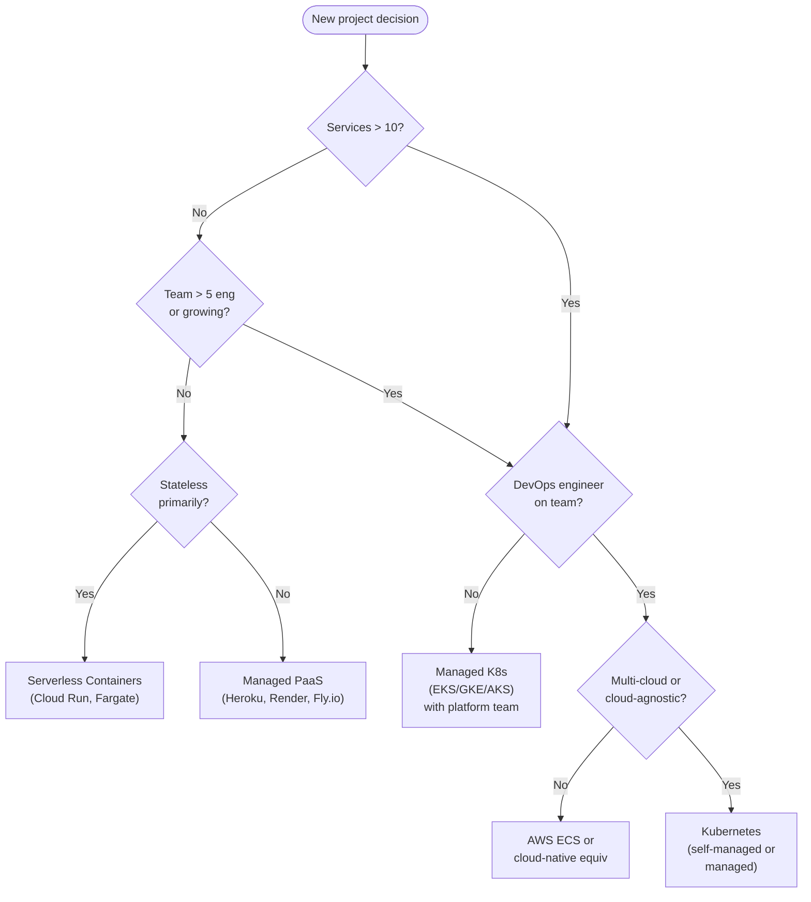
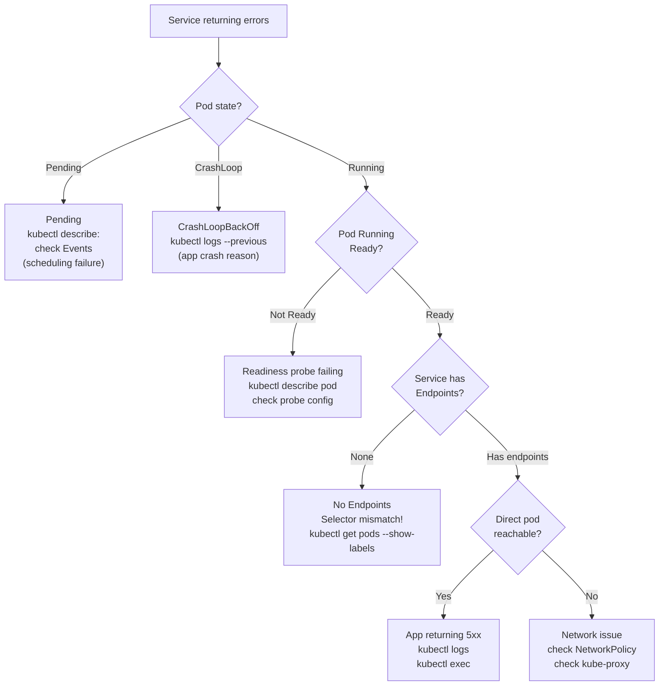
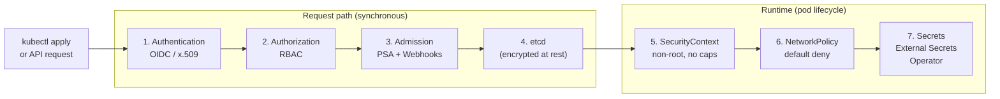

## Keywords in This File

{: .no_toc }

| # | Keyword | Weight |
|---|---------|--------|
| 1 | [Kubernetes Decision Framework: When K8s Is Overkill](#kubernetes-decision-framework-when-k8s-is-overkill) | low |
| 2 | [Kubernetes Debugging Mental Model](#kubernetes-debugging-mental-model) | medium |
| 3 | [Kubernetes Security Hardening Checklist](#kubernetes-security-hardening-checklist) | medium |

---

# Kubernetes Decision Framework: When K8s Is Overkill

---

### 🎯 Model Answer

**30 seconds:**
> Kubernetes is the right choice when you need: container orchestration at scale,
> automated scaling, self-healing deployments, complex networking between services, or
> multi-team access control. It's overkill when you have: a single-process application,
> a small team with minimal operational experience, or requirements that simpler tools
> (Docker Compose, a single VM, managed services like App Engine or Fargate) handle more
> cheaply with less complexity. The question isn't "can Kubernetes do this?" - it's "is
> Kubernetes the simplest tool that meets the requirements?"

**3 minutes (Senior):**
> Kubernetes adds real cost: someone must manage it (upgrades, certificates, monitoring).
> Even with managed Kubernetes (EKS, GKE), you manage node groups, PodDisruptionBudgets,
> Ingress controllers, cert-manager, and cluster upgrades. The operational tax is real.
>
> When Kubernetes earns its complexity: 10+ services that need service discovery and
> independent scaling; continuous deployment pipelines deploying frequently (multiple
> times per day); autoscaling requirements where traffic is bursty; multi-team access
> where different teams own different services and need isolation.
>
> When simpler alternatives win: a startup with 2 services and 3 engineers. Use a managed
> container service (ECS, Cloud Run, Fly.io) and eliminate the Kubernetes tax entirely.
> A batch processing pipeline. Use managed cloud functions or a queue + compute service.
> A monolith being decomposed. Start with fewer, larger services before adding Kubernetes
> orchestration complexity.
>
> The meta-principle: choose the tool whose complexity is proportional to your problem's
> complexity. Kubernetes at scale (50+ services, 10+ teams) has its complexity well-justified.
> Kubernetes for a 2-service startup is complexity that adds no value.

**Framework:** REQUIREMENTS -> ALTERNATIVES -> COST ANALYSIS -> DECISION POINT

*Adapting up:* Platform engineering perspective: Kubernetes as an organizational investment
(platform team, abstraction layer, developer productivity), not just a technical choice.

*Adapting down:* "Kubernetes is a complex platform. If your problem is simple, use a simple
tool. Use Kubernetes when the complexity of your problem justifies the complexity of the tool."

**Blank Mind Recovery:**

**(1) Restate:** "Kubernetes decision framework: when does K8s earn its complexity? Scale,
multiple services, team isolation, autoscaling. When is it overkill? Small teams, few services,
simpler managed alternatives available."

**(2) First principles:** "Every tool has an operational cost. Kubernetes' cost is high.
The benefit of Kubernetes is proportional to the complexity of the problem it solves.
Small problems get better ROI from simpler tools."

**(3) Bridge:** "Kubernetes is like a factory assembly line. Transformative at scale (1000
cars/day). Absurd for a craftsman making 5 cars/year. The craftsman needs a workshop,
not an assembly line."

---

### 📘 Concept Explanation

**Decision Matrix:**

| Signal | Use K8s | Use Alternatives |
|--------|---------|-----------------|
| Service count | 10+ services | 1-3 services |
| Team size | 5+ engineers | 1-3 engineers |
| Deploy frequency | Many times/day | Weekly/monthly |
| Scaling needs | Autoscale required | Fixed capacity OK |
| Stateful workloads | Stateless primarily | Mostly stateful |
| Cost sensitivity | Have DevOps capacity | Minimize operational cost |

**Alternatives by use case:**

Single service / simple API: Cloud Run (GCP), App Engine, AWS Lambda + API Gateway,
Fly.io. Managed scaling, zero node management, pay per request.

Multi-service (2-5): Docker Compose (local), ECS (AWS), Cloud Run Jobs, Render.com.
Service discovery, basic scaling, less operational overhead.

Batch processing: AWS Batch, GCP Dataflow, Apache Airflow on managed service,
GitHub Actions / GitLab CI for CI/CD. Kubernetes Jobs work but adding K8s for batch alone
is usually overkill.

Data pipelines: managed services (Airflow on Cloud Composer, Databricks, Snowflake Pipelines).
No container orchestration needed.

When to RECOMMEND Kubernetes to your team:
1. You have or plan to hire a DevOps/Platform engineer
2. You have 10+ services with independent scaling requirements
3. You need multi-team access control and namespace isolation
4. You need sophisticated deployment strategies (canary, blue-green at scale)
5. You're in cloud-agnostic mode (avoid cloud vendor lock-in for compute)

---

### 💻 Code Example

*(Omit: this keyword is a decision framework; no programmatic interface to demonstrate)*

---

### 🎓 Answers by Seniority

**Junior / Mid (0-5 years):**
> Kubernetes is powerful but complex. It makes sense when you have many services that
> need to work together, or when you need to automatically scale up and down, or when
> multiple teams each deploy their own services. But if you have a small project with
> one or two services, there are much simpler options like Docker Compose (for local
> development), Heroku, or managed container services like AWS ECS or Google Cloud Run.
> These handle a lot of the infrastructure for you without needing to manage Kubernetes.

---

**Senior / Staff (5+ years):**
> The most dangerous anti-pattern: "we chose Kubernetes because it's the industry standard."
> This reasoning ignores the cost side of the equation. Kubernetes is the standard for
> large-scale container orchestration. That doesn't mean it's the right choice for every
> context. My decision heuristic: "Will this team have at least one person who understands
> Kubernetes deeply and will maintain it?" If no: the cluster will drift, upgrades will
> be missed, certificates will expire, and incidents will be harder to debug. The organizational
> readiness question is as important as the technical requirements question. A team with no
> Kubernetes expertise should use managed alternatives until they have that expertise.

---

### ⚠️ Common Misconceptions

**Misconception 1: "Kubernetes saves money because it's open-source."**
Kubernetes itself is free. Running it is not. Node costs (the underlying VMs) are identical
to any other container platform. The operational overhead (DevOps engineer salary, incident
time, upgrade time) adds real cost. For small teams: managed platforms (Heroku, Render,
Fly.io) often cost LESS in total (platform fee + zero DevOps overhead) than Kubernetes
clusters (compute costs + DevOps engineer time).

**Misconception 2: "Kubernetes is too complex for stateful applications."**
Kubernetes runs stateful applications at scale - databases, message queues, and caches via
StatefulSets. The misconception is understandable (earlier K8s versions had limited storage
support), but modern Kubernetes with operators (Strimzi, CloudNativePG, Redis Enterprise)
provides robust stateful application management. The complexity is real, but it's manageable
with the right operators and expertise.

---

### 🚨 Failure Modes and Diagnosis

**Failure 1: Under-resourced cluster due to miscalibrated expectations**

Symptom: Kubernetes works in development but gets overwhelmed in production. Pods OOMKilled,
nodes at 100% CPU, frequent evictions.

Cause: development cluster had generous resource limits; production traffic was underestimated;
no autoscaling configured.

Diagnostic: `kubectl top nodes`, `kubectl top pods`, `kubectl describe nodes` for resource
pressure conditions.

Fix: set appropriate resource requests and limits based on profiling in staging; enable HPA;
provision cluster with proper baseline capacity.

**Failure 2: "We over-Kubernetes'd" - too much complexity for the use case**

Symptom: engineers spend more time managing Kubernetes (upgrades, networking issues, RBAC)
than building product features. Simple deployments take hours due to cluster configuration.

Cause: organizational decision to use Kubernetes before having the team complexity that
justifies it.

Fix: evaluate migration to simpler platform. For stateless services: Cloud Run or ECS often
reduces operational overhead by 80%. Migration is painful but sometimes correct.

---

### 🎯 Interview Deep-Dive

| Question Category | Time to Answer |
|---|---|
| Conceptual | 1-2 minutes |
| Trade-off | 2-3 minutes |
| Architecture | 2-3 minutes |
| Decision | 2-3 minutes |
| Production | 2-3 minutes |
| Comparison | 2-3 minutes |
| Behavioral | 2-3 minutes |

---

**Q1 [MID] (CONCEPTUAL): When would you NOT recommend Kubernetes for a new project?**

A: Kubernetes is overkill when the problem doesn't justify its operational complexity.
I wouldn't recommend Kubernetes for:

1. Small teams (1-3 engineers) without DevOps expertise: someone needs to manage the cluster.
   Upgrades, certificate rotation, monitoring setup, incident response. Without a dedicated
   platform/DevOps person, Kubernetes becomes a liability that slows down feature development.

2. Single-service applications: if your entire backend is one service, Kubernetes provides
   service discovery, load balancing, and orchestration for one service. All of that is
   built into any managed container service (Cloud Run, ECS) with zero configuration.

3. Mostly stateful workloads: if your primary workload is databases, Kubernetes adds
   complexity over managed database services (RDS, Cloud SQL, MongoDB Atlas). Unless you
   have a specific reason to run databases on Kubernetes (cost at massive scale, data
   residency, compliance), managed database services are operationally simpler.

4. Infrequent deployments: teams that deploy weekly or monthly don't benefit from
   Kubernetes' sophisticated rolling update mechanics. A simple blue-green swap via a load
   balancer is sufficient and much simpler.

Alternatives I'd recommend: Google Cloud Run (serverless containers, zero cluster management),
AWS Fargate (managed container compute without nodes), Fly.io (global container deployment
with excellent DX), Railway/Render (managed platforms with good developer experience).

*What separates good from great:* The "Kubernetes as a platform investment" framing changes
the decision. If your organization plans to hire a Platform team, invest in internal developer
platforms, and grow to 50+ services: starting on Kubernetes even at smaller scale pays
dividends later (engineers learn it, tooling is built around it). The question is about
the organizational trajectory, not just current scale.

---

**Q2 [SENIOR] (TRADE-OFF): Compare Kubernetes vs ECS vs Cloud Run for a microservices platform.**

A:

Kubernetes (EKS/GKE/AKS):
- Full control: networking (choose CNI), ingress (choose controller), service mesh, RBAC
- Portable: same Kubernetes manifests work on any cloud or on-premises
- Operational overhead: cluster upgrades, node management, add-on management
- Cost: EC2/GCE compute costs + additional management overhead
- Best for: large teams, complex requirements, cloud-agnostic strategy

AWS ECS (Elastic Container Service):
- AWS-native: deep integration with IAM, ALB, CloudWatch, ECR
- Less portable: ECS task definitions are AWS-specific
- Less operational overhead than EKS: AWS manages control plane; you manage task definitions
- Simpler networking: ECS+ALB handles service-to-service routing for simple cases
- Best for: AWS-native teams, smaller to mid-sized microservices, don't need Kubernetes portability

Google Cloud Run:
- Serverless containers: zero node management, zero cluster
- Scales to zero: pay nothing when no traffic (cost advantage for low-traffic services)
- Cold start: first request after scale-to-zero has latency (100ms-1s depending on image)
- Limited: no stateful workloads, no long-running background jobs, HTTP-only
- Best for: stateless API services, event-driven workloads, startups optimizing for operational simplicity

Decision framework:
- Cloud-agnostic, complex requirements, large team: Kubernetes
- AWS-native, medium complexity, don't want full K8s: ECS
- Stateless APIs, cost optimization, small team: Cloud Run or similar serverless containers

*What separates good from great:* The "right-size your platform" principle. A common mistake:
choosing one platform for ALL services. Better: Cloud Run for lightweight stateless services
(static-content API, authentication callbacks), ECS or Kubernetes for compute-intensive
services that can't tolerate cold starts, and managed databases for stateful needs. Mix
and match based on each service's requirements rather than forcing everything through one platform.

---

**Q3 [SENIOR] (DECISION): A startup is building an MVP with 2 services and 3 engineers. K8s or not?**

A: Not Kubernetes for the MVP. Possibly Kubernetes after product-market fit.

For the MVP (2 services, 3 engineers):
- Services don't need sophisticated orchestration
- Engineers should focus on product, not infrastructure
- Time to production should be days, not weeks

Recommendation: Google Cloud Run or AWS Fargate.
- Deploy Docker containers: push to registry, configure the managed service, done
- Automatic scaling (scale to zero for MVP: pays nothing when no users)
- HTTPS included (managed TLS)
- Zero cluster management
- CI/CD: GitHub Actions -> push image -> deploy in 5 minutes

When to add Kubernetes:
After product-market fit, when the team is 10+ engineers and has:
- Multiple services with independent scaling requirements
- A dedicated DevOps/Platform person joining
- Complexity that managed services can't handle efficiently
- Portability requirements (multi-cloud strategy)

Estimated transition: at 10-20 services and 15+ engineers, the ROI of Kubernetes starts
making sense. Before that: managed services provide the same capabilities with less overhead.

*What separates good from great:* The "Kubernetes is a platform, not a feature" insight.
Kubernetes enables building internal developer platforms (IDPs): self-service deployment,
namespace-level isolation, consistent GitOps workflows. A startup at 3 engineers doesn't
need an IDP. At 50 engineers: an IDP saves significant developer time and is worth the
investment. The question isn't just "can we run on Kubernetes" but "is it time to invest
in Kubernetes as an organizational platform?"

---

**Q4 [SENIOR] (ARCHITECTURE): How does Kubernetes compare to serverless for a variable-traffic API?**

A: Variable traffic (0 at 3 AM, 1000 req/s at noon) creates a cost and latency decision.

Kubernetes:
- Minimum cluster: always has some running nodes (minimum cost even at zero traffic)
- HPA: scales pods from min=2 to max=50 based on CPU/RPS
- Cluster Autoscaler: adds/removes nodes as pod count changes
- Latency: pod already warm, request served immediately
- Scale to zero: NOT possible in standard Kubernetes (min replicas must be >= 1)
  Exception: KEDA + queue-based scaling can scale to 0 for batch workloads
- Cost model: pay for nodes whether they're idle or busy

Serverless (Cloud Run, Lambda):
- Scale to zero: service costs nothing at 0 traffic
- Cold start: first request after idle period has latency (100ms-2s)
- Scale up: fast (seconds), scale down: also fast
- Cost model: pay per request + per CPU/memory per 100ms

For variable traffic with hard latency SLAs:
- API with < 100ms P99 requirement: Kubernetes (warm pods, no cold start)
- API where occasional 500ms response is acceptable: Cloud Run (cold starts happen)

For variable traffic with cost optimization:
- 95% of time 0 traffic, 5% burst: Cloud Run wins (0 cost at 0 traffic)
- 40% of time at capacity, 60% at minimum: Kubernetes with spot nodes may win

Hybrid: Kubernetes for base capacity (always warm), Cloud Run for burst overflow.
Traffic routing via load balancer: base cluster handles steady-state, Cloud Run handles
spikes beyond cluster capacity.

*What separates good from great:* Cloud Run's "minimum instances" setting bridges the
gap. Set `min-instances: 1` for a service that can't tolerate cold starts but still benefits
from serverless operations (no cluster management). One warm instance at all times, auto-scales
above 1 during load. For most API services: this eliminates the cold start concern while
keeping operational simplicity of serverless.

---

**Q5 [STAFF] (PRODUCTION): What's the minimum viable Kubernetes setup for a small production deployment?**

A: Minimum viable but production-grade Kubernetes for a 3-5 service application:

Cluster: managed Kubernetes (EKS, GKE, or AKS) - never manage your own etcd and control
plane for a small team. Cost of managed control plane: ~$70-150/month. Worth it.

Node groups:
- Minimum: 3 nodes (for HA) across 3 availability zones
- Instance type: m5.large or similar (2 CPU, 8GB memory) as starting point
- Autoscaling: Cluster Autoscaler with min=3, max=10

Essential add-ons only:
1. Ingress controller (NGINX or AWS ALB controller): L7 routing, TLS termination
2. cert-manager: automatic TLS certificates (Let's Encrypt)
3. External Secrets Operator: secrets from AWS Secrets Manager
4. Metrics Server: enables HPA
5. kube-state-metrics + node-exporter + Prometheus + Grafana: monitoring

DO NOT add on day 1:
- Service mesh (Istio): adds ~100MB per pod; add when you have 20+ services
- ArgoCD: overkill for 3 services; use Helm + GitHub Actions first
- Multiple node pools: start single pool; add GPU or spot pools when needed

Deployment: Helm charts for each service. Simple GitHub Actions: build -> push -> helm upgrade.

This runs 3-5 services on ~$400-600/month (3 m5.large nodes + managed control plane + storage).
Less than alternative managed platforms at similar scale.

*What separates good from great:* The "add-ons on demand" discipline. Every add-on has
a CPU/memory footprint and operational overhead. On day 1: the bare minimum that works.
NGINX ingress: 100-200MB. cert-manager: 100MB. External Secrets: 50MB. Prometheus stack:
1-2 GB. That's ~2-3 GB of add-on overhead on a 3-node cluster. Know what you're adding
and why, before adding it.

---

**Q6 [STAFF] (COMPARISON): Kubernetes vs Nomad for container orchestration.**

A:

HashiCorp Nomad:
- Polyglot scheduler: schedules not just containers but Java processes, bash scripts,
  Firecracker VMs, bare metal tasks. Kubernetes only schedules containers.
- Simpler: fewer concepts (Jobs, Task Groups, Tasks vs K8s' many resources)
- Lower operational overhead: one binary (Nomad server), no etcd management, simpler upgrade
- Better for hybrid workloads: mix containerized and non-containerized applications
- Integrates with Consul (service mesh) and Vault (secrets) naturally
- Lacks: Kubernetes' rich ecosystem (Helm, hundreds of operators, broad community)

Kubernetes:
- Container-only: designed for containers (Docker/OCI)
- Richer ecosystem: operators for every major database/message queue/service
- More complex: CRDs, controllers, admission webhooks, many moving parts
- Larger community: more tutorials, more tooling, more talent market
- Industry default: most DevOps engineers know Kubernetes; fewer know Nomad

When to choose Nomad over Kubernetes:
- Mixed workloads (containers + VMs + bare metal)
- HashiCorp-native organization (already using Consul, Vault, Terraform)
- Simpler orchestration needs with lower operational overhead
- On-premises deployments without managed Kubernetes options

When Kubernetes wins:
- Container-only workloads
- Need operators for complex stateful applications
- Kubernetes expertise in the team
- Cloud-native (managed K8s available)
- Need the broad OSS ecosystem

*What separates good from great:* Nomad 1.6 introduced native service mesh and graduated
workload identity, closing some gaps with Kubernetes. But the most important differentiator
remains the ecosystem: the 3000+ Helm charts, hundreds of Kubernetes operators, and broad
cloud provider integrations (EKS add-ons, GKE features) give Kubernetes an ecosystem
advantage that Nomad can't match. For new projects with no existing HashiCorp investment:
Kubernetes is the default choice because of ecosystem breadth.

---

**Q7 [STAFF] (BEHAVIORAL): How did you convince your team to use a simpler alternative to Kubernetes?**

A (STAR format):

Situation: our team was about to adopt Kubernetes for a new microservices project. We had
4 services, 6 engineers (none with Kubernetes experience), and a 3-month deadline to production.
A senior engineer was advocating for Kubernetes ("it's the industry standard, we'll need it
eventually"). I had concerns about the timeline and operational readiness.

Task: evaluate the decision objectively and present a recommendation to the team.

Action: I proposed a decision analysis rather than a debate. I outlined evaluation criteria:
time to first production deployment, operational overhead per month (estimated), required
expertise vs available expertise, and flexibility for future growth.

I created a comparison:

Kubernetes (EKS):
- Time to production-ready cluster: 4-6 weeks (learn K8s, set up cluster, add-ons, CI/CD)
- Ongoing ops: ~1 day/week (upgrades, monitoring, incident response)
- Expertise gap: large (0 of 6 engineers know K8s in depth)

AWS ECS + Fargate:
- Time to production: 1-2 weeks (ECS is simpler, AWS managed service)
- Ongoing ops: ~0.5 days/week (AWS manages the control plane)
- Expertise gap: small (ECS similar to Docker Compose semantics, good docs)

My recommendation: start with ECS + Fargate for MVP. Plan Kubernetes for 18 months later
when: (1) team grows to 15+ engineers, (2) we hire a platform engineer, (3) service count
reaches 15+.

The team agreed after seeing the timeline comparison. We hit production in 6 weeks on ECS.

18 months later: we migrated to Kubernetes (team was now 18 engineers, hired a platform
engineer, had 20+ services). The earlier ECS experience made the migration easier because
engineers understood container orchestration concepts.

Result: reached production on schedule. Kubernetes added when organizational readiness
justified it. No 3 AM incidents from Kubernetes misconfiguration during the MVP phase.

*What separates good from great:* The "validate now, migrate when ready" approach requires
actually following through on the migration plan. Many teams that choose the simpler tool
"for now" never migrate when the time is right. I put the migration criteria in writing
(team size, service count, platform engineer hire) and revisited the decision at 12 months.
When all three criteria were met: we executed the migration. The explicit criteria prevented
the decision from being indefinitely deferred.

---

*(Omit: ⚖️ Comparison Table - this is a ★☆☆ keyword; Comparison Table is required for ★★☆ and above only)*

*(Omit: 🏛️ System Design - this is a ★☆☆ keyword; System Design is required for ★★★ only)*

---

### 📊 Diagram

```
Kubernetes decision tree (simplified):

  Services > 10?  --No--> Team > 10 engineers?  --No--> Use managed PaaS
  |Yes                    |Yes
  |                       +--> K8s worth evaluating
  |
  DevOps capacity?  --No--> Use managed K8s (EKS/GKE) + add-ons
  |Yes
  |
  Multi-cloud needed?  --No--> ECS (AWS) or Cloud Run (GCP)
  |Yes
  |
  Use Kubernetes
```



> **Diagram walkthrough:** The decision flowchart shows the key variables in order of
> importance. Service count and team size are first because they determine whether
> orchestration complexity is justified at all. DevOps capacity is the organizational
> readiness check: Kubernetes without someone who can manage it becomes a liability.
> Multi-cloud / cloud-agnostic requirements distinguish Kubernetes (portable) from ECS
> (AWS-native). The "No" paths consistently lead to simpler options (serverless, PaaS,
> cloud-native managed services). Kubernetes appears only when multiple conditions
> are satisfied: meaningful scale, team readiness, and portability requirements.

---

---

---

### 💻 Code Example

*(Omit: this concept does not have a programmatic interface that can be demonstrated in code. The conceptual explanation above is sufficient.)*


---

### 🏛️ System Design

*(Omit: system design diagram not applicable for this concept - see ★★★ keywords for full system design coverage.)*


---

### ⚖️ Comparison Table

*(Omit: this is a ★☆☆ foundational concept with no direct alternatives to compare - see higher-difficulty keywords for trade-off analysis.)*


---

### 📊 Diagram

*(Omit: no standalone visual diagram required for this concept - the explanations and code examples above provide sufficient clarity.)*


# Kubernetes Debugging Mental Model

---

### 🎯 Model Answer

**30 seconds:**
> Kubernetes debugging follows a top-down approach: cluster layer -> node layer -> pod layer ->
> container layer. `kubectl describe` is your first tool - it shows events that explain
> why something is in its current state. `kubectl logs` shows what the container is doing.
> `kubectl exec` gets you inside a running container. Start with "what state is this object
> in?" then "why is it in that state?" using events and logs.

**3 minutes (Senior):**
> Every Kubernetes problem maps to one of four failure domains: scheduling (pod can't land
> on a node), runtime (pod starts but container crashes), networking (pod runs but can't
> communicate), or configuration (pod runs but behaves incorrectly due to bad config/secrets).
>
> The diagnostic flow starts at the highest-level object and works down. Service not
> responding? Start with the Service: `kubectl describe service` - does it have endpoints?
> No endpoints = Pods not matching the selector. Then `kubectl get pods` - are pods Running?
> Not Running = scheduling or runtime failure. Investigate with `kubectl describe pod` -
> events show the reason. Container crashes: `kubectl logs --previous` shows what happened
> before the crash.
>
> The key mental shift: Kubernetes is a state machine. Every object has a current state
> and a desired state. When debugging: ask "what is the current state?" and "why doesn't it
> match the desired state?" The gap between desired and actual state IS the bug. kubectl
> describe events are the system's explanation of why it can't achieve desired state.

**Framework:** DESCRIBE (state + events) -> LOGS (behavior) -> EXEC (direct investigation)
-> EVENTS (cluster-wide what-happened)

*Adapting up:* Distributed tracing with Jaeger for cross-service debugging, eBPF debugging
(Hubble, bpftrace) for network-level issues, coredump analysis for container process crashes.

*Adapting down:* "Kubernetes debugging = describe (shows what K8s thinks is happening),
logs (shows what your app says), exec (get inside and look around). Start at the top,
work down."

**Blank Mind Recovery:**

**(1) Restate:** "Kubernetes debug flow: describe (events explain current state), logs (app behavior),
exec (interactive investigation). Top-down: cluster -> node -> pod -> container.
Four failure domains: scheduling, runtime, networking, configuration."

**(2) First principles:** "Kubernetes has layers: cluster, node, pod, container. Problems
manifest at the highest visible layer but originate at a lower layer. Start visible, trace
down. kubectl describe events are Kubernetes' own explanation of why desired state is not achieved."

**(3) Bridge:** "Kubernetes debugging = doctor's diagnosis. Start with symptoms (pod not running).
Examine history (describe events). Run tests (logs, exec). Narrow to organ (node? container?
network?). Treat the actual cause, not the symptom."

---

### 📘 Concept Explanation

**Four Failure Domains:**

1. Scheduling: pod is in Pending state.
   - Insufficient resources: node doesn't have enough CPU/memory for requests
   - Node selector mismatch: `nodeSelector` or `nodeAffinity` rules can't be satisfied
   - Taint not tolerated: node has taint, pod doesn't tolerate it
   - PVC not bound: StorageClass provisioner failed to create a PersistentVolume
   Diagnostic: `kubectl describe pod <pending-pod>` -> Events section

2. Runtime: pod transitions from ContainerCreating -> CrashLoopBackOff or Error.
   - Image pull failure: wrong image name, wrong tag, auth required
   - Container crashes: process exits non-zero (OOM, uncaught exception, missing config)
   - Liveness probe failure: container running but probe fails -> restart loop
   Diagnostic: `kubectl logs <pod> --previous` + `kubectl describe pod` events

3. Networking: pod runs but can't communicate.
   - Service selector mismatch: Service's labelSelector doesn't match pod labels
   - NetworkPolicy blocking: NP rules deny expected traffic
   - DNS failure: CoreDNS not resolving service names
   - Ingress misconfiguration: Ingress rule not routing to correct Service
   Diagnostic: `kubectl describe service` (check Endpoints), `kubectl exec` + curl

4. Configuration: pod runs but application misbehaves.
   - Wrong ConfigMap content: application reads wrong values
   - Missing Secret: volume mount fails silently or environment variable empty
   - Wrong image version: unexpected behavior from outdated container
   Diagnostic: `kubectl exec` -> inspect env vars and mounted files

**kubectl Diagnostic Toolkit:**

```bash
# Universal first step: describe (events tell the story)
kubectl describe pod <pod-name> -n <namespace>
kubectl describe node <node-name>
kubectl describe service <service-name> -n <namespace>

# Logs (current and previous container)
kubectl logs <pod> -n <namespace>
kubectl logs <pod> -n <namespace> --previous   # previous container run
kubectl logs <pod> -n <namespace> -c <container>  # specific container
kubectl logs -l app=myapp -n <namespace> --all-containers  # all pods

# Interactive debugging
kubectl exec -it <pod> -n <namespace> -- bash
kubectl exec -it <pod> -n <namespace> -- sh   # if no bash

# Port forwarding (test service locally)
kubectl port-forward pod/<pod> 8080:8080 -n <namespace>
kubectl port-forward svc/<service> 8080:8080 -n <namespace>

# Network debug pod (when exec not available)
kubectl run debug-pod --image=busybox --rm -it \
  --restart=Never -- sh
# Inside: wget http://myservice:8080, nslookup myservice

# Cluster-wide events (sorted by time)
kubectl get events --all-namespaces \
  --sort-by='.lastTimestamp' | tail -30
```

> **Code walkthrough:** This example demonstrates the core pattern in action. The key mechanism shows how the concept works in practice. Study the structure to understand the essential behavior and common usage.

**Common Error Patterns:**

CrashLoopBackOff: container repeatedly starting and crashing.
```bash
kubectl describe pod <pod>  # check events: Exit Code
# Exit Code 1: app exited with error (check logs)
# Exit Code 137: OOM killed (check memory limits)
# Exit Code 139: segfault (check app code)
kubectl logs <pod> --previous  # last run's logs
```

> **Code walkthrough:** This example demonstrates the core pattern in action. The key mechanism shows how the concept works in practice. Study the structure to understand the essential behavior and common usage.

ImagePullBackOff:
```bash
kubectl describe pod <pod>
# Events: "Failed to pull image: not found" -> wrong tag
# Events: "Failed to pull image: 401 Unauthorized" -> missing imagePullSecret
kubectl create secret docker-registry myregistry \
  --docker-server=... --docker-username=... --docker-password=...
```

> **Code walkthrough:** This example demonstrates the core pattern in action. The key mechanism shows how the concept works in practice. Study the structure to understand the essential behavior and common usage.

Service has 0 endpoints:
```bash
kubectl describe service myservice
# Endpoints: <none>  <- problem
kubectl get pods -l app=myapp   # are pods running?
kubectl describe service myservice | grep Selector
# Selector must match pod labels exactly
kubectl get pods --show-labels | grep myapp
```

> **Code walkthrough:** This example demonstrates the core pattern in action. The key mechanism shows how the concept works in practice. Study the structure to understand the essential behavior and common usage.

---

### 💻 Code Example

> **Code walkthrough:** Systematic debugging workflow for a broken deployment.

```bash
# BAD: Random debugging - checking logs first without understanding state
kubectl logs broken-api-abc123
# Might show nothing useful if the problem is scheduling, not the app itself
# Wastes time checking the wrong layer
```

```bash
# GOOD: Systematic top-down debugging

# Step 1: What state is the deployment in?
kubectl get deployment my-api -n production
# NAME      READY   UP-TO-DATE   AVAILABLE
# my-api    0/3     3            0
# 0 of 3 ready - problem at pod level

# Step 2: What state are the pods in?
kubectl get pods -n production -l app=my-api
# NAME               READY   STATUS             RESTARTS   AGE
# my-api-xxx-abc     0/1     CrashLoopBackOff   5          10m
# Problem: CrashLoopBackOff -> container crashes immediately

# Step 3: Why is it crashing? (describe + previous logs)
kubectl describe pod my-api-xxx-abc -n production
# Events section will show: Exit Code 1

kubectl logs my-api-xxx-abc -n production --previous
# "Error: cannot connect to database at postgres:5432
# "dial tcp postgres:5432: connect: connection refused"
# Root cause: postgres service not reachable

# Step 4: Is the postgres service working?
kubectl get svc postgres -n production
kubectl describe svc postgres -n production
# Endpoints: <none>  <- postgres pods not running

# Step 5: What happened to postgres pods?
kubectl get pods -n production -l app=postgres
# my-postgres-0   0/1   Pending   0   15m
# Postgres pod is Pending - scheduling problem

kubectl describe pod my-postgres-0 -n production
# Events: "0/3 nodes are available: 3 Insufficient memory"
# Root cause: not enough memory on any node for postgres

# Fix: add a node or reduce postgres memory request
kubectl top nodes  # shows actual node memory usage
```

> **Code walkthrough:** The BAD approach checks logs immediately without understanding
> the pod's state - logs would be empty or misleading for a scheduling problem. The GOOD
> approach follows the dependency chain: Deployment -> Pods -> Pod state -> Root cause.
> Each step narrows the search. The discovery: the API crashes because Postgres is unreachable.
> Postgres is unreachable because its pod is Pending. The pod is Pending because of insufficient
> memory. This is a three-level causality chain: memory shortage -> postgres pending ->
> API crash. Only the top-down approach reveals all three levels efficiently.

---

### 🎓 Answers by Seniority

**Junior / Mid (0-5 years):**
> When something is broken in Kubernetes, I start with `kubectl describe` on the broken
> resource. The Events section at the bottom usually explains what went wrong (like "Failed
> to pull image" or "Insufficient memory"). Then I check `kubectl logs` to see what the
> application itself says. If I need to investigate inside the container, I use `kubectl exec`
> to open a shell. The key is to start at the highest level (is the Deployment ready?) and
> work down to the container level (what is the app saying in its logs?).

---

**Senior / Staff (5+ years):**
> The most important debugging insight: in Kubernetes, symptoms and causes are often
> separated by multiple abstraction layers. A user report of "the API is down" traces to:
> Pod -> Container crash (symptom) -> Database connection refused (cause of crash) ->
> Database pod Pending (reason database unreachable) -> Node out of memory (root cause of Pending).
> kubectl describe and get events do the dependency tracing for you if you read them correctly.
> I always read events BACKWARDS (newest to oldest): the newest event is closest to the
> problem; older events give context. Also: never debug purely from kubectl - add structured
> logging to your applications and distributed tracing. kubectl gives you Kubernetes-level
> insight; logs and traces give you application-level insight. You need both.

---

### ⚠️ Common Misconceptions

**Misconception 1: "Running pods means healthy pods."**
A pod in `Running` state has its containers started. It does NOT guarantee:
the container process is healthy (it might be in an infinite loop), the application is
accepting requests (readiness probe may be failing), or the container will continue running
(it might be about to crash for the 6th time). Use `READY` column: `1/1 Ready` means the
container passed its readiness probe and can receive traffic.

**Misconception 2: "`kubectl logs` shows the current run if the container crashed."**
After a container crashes and restarts: `kubectl logs <pod>` shows logs of the CURRENT
(newly started) container, not the one that crashed. To see the crashed container's logs:
`kubectl logs <pod> --previous`. This is the most important flag in Kubernetes debugging
and the most commonly forgotten by junior engineers.

---

### 🚨 Failure Modes and Diagnosis

**Failure 1: Debugging fails because container has no shell**

Symptom: `kubectl exec -it <pod> -- bash` fails with "exec: bash not found".
Distroless or scratch containers have no shell for security.

Fix option 1: ephemeral debug container (K8s 1.23+ GA):
```bash
kubectl debug -it <pod> --image=busybox --target=<container-name>
# Attaches a temporary debug container to the pod's process namespace
# Can inspect /proc/<pid> of the target container
```

> **Code walkthrough:** This example demonstrates the core pattern in action. The key mechanism shows how the concept works in practice. Study the structure to understand the essential behavior and common usage.

Fix option 2: copy-with-debug:
```bash
kubectl debug <pod> -it \
  --copy-to=debug-pod \
  --image=ubuntu:22.04 \
  --set-image=my-container=ubuntu:22.04
# Creates a copy of the pod with a debuggable image
```

> **Code walkthrough:** This example demonstrates the core pattern in action. The key mechanism shows how the concept works in practice. Study the structure to understand the essential behavior and common usage.

**Failure 2: Pod logs missing (log rotation)**

Symptom: `kubectl logs` returns empty or shows only recent lines. Old log lines gone.

Cause: log rotation on the node. Kubernetes rotates container logs (default: 100MB per file,
5 files retained). For long-running pods: old logs from days ago may be gone.

Fix: use centralized logging (FluentBit -> Elasticsearch/Loki). Never rely on kubectl logs
for historical debugging.

---

### 🎯 Interview Deep-Dive

| Question Category | Time to Answer |
|---|---|
| Conceptual | 1-2 minutes |
| Hands-on | 2-3 minutes |
| Mechanism | 2-3 minutes |
| Debugging | 2-3 minutes |
| Architecture | 2-3 minutes |
| Production | 2-3 minutes |
| Behavioral | 2-3 minutes |

---

**Q1 [JUNIOR] (CONCEPTUAL): How do you debug a pod that's stuck in CrashLoopBackOff?**

A: CrashLoopBackOff means: the container starts, crashes, Kubernetes waits (exponential
backoff), starts again, crashes again - loop. The "BackOff" refers to the increasing wait
between restarts (5s, 10s, 20s, 40s... up to 5 minutes).

Diagnosis steps:

1. Get the exit code and events:
```bash
kubectl describe pod <pod-name>
# Events: "Container: Started / Killed / Back-off restarting failed container"
# State: Last State: Terminated, Exit Code: N
# Exit Code 1: app exited with error
# Exit Code 137: OOM killed (memory limit exceeded)
# Exit Code 143: SIGTERM (graceful kill - may be normal)
```

> **Code walkthrough:** This example demonstrates the core pattern in action. The key mechanism shows how the concept works in practice. Study the structure to understand the essential behavior and common usage.

2. Get the logs from the previous run (not the current empty run):
```bash
kubectl logs <pod-name> --previous
# Shows output from the container that JUST crashed
```

> **Code walkthrough:** This example demonstrates the core pattern in action. The key mechanism shows how the concept works in practice. Study the structure to understand the essential behavior and common usage.

3. Common root causes by exit code:
- Exit Code 1: application error. Check logs for the error message.
- Exit Code 137: memory limit hit. Solution: increase memory limit or fix memory leak.
- Exit Code 2: misuse of shell built-in or bad entrypoint command. Check Dockerfile CMD/ENTRYPOINT.
- Exit Code 125/126: container runtime error (image issue or permission issue).

4. If logs are empty: the container crashed before writing any output. Check:
- Is the entrypoint correct? `kubectl describe pod` shows the command
- Does the image exist? `kubectl describe pod` events show ImagePullBackOff if not

*What separates good from great:* The exponential backoff exists to prevent a crashing
container from consuming all cluster resources with rapid restart loops. The maximum backoff
is 5 minutes. So a pod in CrashLoopBackOff state may have its last crash 5 minutes ago.
`kubectl logs <pod> --previous` shows the output from that last crash.
After fixing the issue: `kubectl delete pod <pod-name>` forces an immediate fresh start
without waiting for the next backoff cycle.

---

**Q2 [MID] (HANDS-ON): A service is returning 504 Gateway Timeout. How do you debug it?**

A: 504 Gateway Timeout means: the Ingress/load balancer received the request, forwarded
it to the backend service, but the backend didn't respond within the timeout window.

Step 1: verify which layer is slow.
```bash
# Test from inside the cluster (bypass Ingress)
kubectl port-forward svc/my-backend 8080:8080 -n production
curl -w "@curl-format.txt" http://localhost:8080/api/endpoint
# If this is also slow: problem is in the backend service, not the Ingress
# If this is fast: problem is in Ingress configuration (proxy timeout too short)
```

> **Code walkthrough:** This example demonstrates the core pattern in action. The key mechanism shows how the concept works in practice. Study the structure to understand the essential behavior and common usage.

Step 2: check backend pod health.
```bash
kubectl get pods -l app=my-backend -n production
kubectl top pods -l app=my-backend -n production
# CPU throttled? Memory high? Any restarts?
```

> **Code walkthrough:** This example demonstrates the core pattern in action. The key mechanism shows how the concept works in practice. Study the structure to understand the essential behavior and common usage.

Step 3: check if the request reaches the backend.
```bash
kubectl logs -l app=my-backend -n production --tail=50
# Do you see incoming request logs? If not: network issue (service selector? NetworkPolicy?)
# If you see logs: backend received request but is slow
```

> **Code walkthrough:** This example demonstrates the core pattern in action. The key mechanism shows how the concept works in practice. Study the structure to understand the essential behavior and common usage.

Step 4: check Ingress configuration timeouts.
```bash
kubectl describe ingress my-ingress -n production
# Annotations: nginx.ingress.kubernetes.io/proxy-read-timeout: "60"
# Default is 60 seconds; if backend takes > 60s: 504

# Check NGINX configmap for global defaults
kubectl get configmap ingress-nginx-controller -n ingress-nginx -o yaml
```

> **Code walkthrough:** This example demonstrates the core pattern in action. The key mechanism shows how the concept works in practice. Study the structure to understand the essential behavior and common usage.

Step 5: check external dependencies (if request reaches backend but is slow).
```bash
# Check database connection pool from inside the pod
kubectl exec -it <backend-pod> -n production -- sh
# Run diagnostic: check DB connection count, query times
```

> **Code walkthrough:** This example demonstrates the core pattern in action. The key mechanism shows how the concept works in practice. Study the structure to understand the essential behavior and common usage.

Root causes in order of likelihood:
1. Backend service is slow (database query, external API call)
2. Ingress timeout too short (increase `proxy-read-timeout`)
3. Backend not enough replicas (queue building up, requests waiting)
4. Network issue (DNS slow, connection pool exhausted)

*What separates good from great:* The `kubectl port-forward` bypass is the most efficient
first step. It immediately tells you: is the problem in Ingress/networking layer (504 from
ingress but not from direct port-forward) or in the backend service (slow on direct call too).
This one test splits the problem space in half and focuses investigation on the right layer.

---

**Q3 [SENIOR] (MECHANISM): How does kubectl exec work under the hood?**

A: `kubectl exec` establishes an interactive channel through the API server to the target
container, using a WebSocket or SPDY multiplexed connection.

Flow:
1. kubectl makes an HTTP upgrade request to the API server:
   `POST /api/v1/namespaces/{ns}/pods/{pod}/exec?command=bash&stdin=true&stdout=true&tty=true`
2. API server upgrades the connection to WebSocket or SPDY (multiplexed streams: stdin,
   stdout, stderr)
3. API server forwards the exec request to the kubelet on the node where the pod runs
   (via the Node's `/exec` endpoint)
4. kubelet calls the container runtime (containerd/CRI-O) which uses `exec` syscall to
   start a new process inside the container's namespace (PID, network, mount namespaces)
5. stdin/stdout are streamed back through: kubelet -> API server -> kubectl

Security implications:
- `kubectl exec` requires `pods/exec` RBAC permission (separate from `pods` permission)
- In production: restrict exec to specific service accounts (CI/CD, on-call runbooks)
- Exec is not available in distroless containers (no bash/sh)
- All exec commands are logged in API server audit logs (security audit trail)

When exec fails:
```bash
kubectl exec -it <pod> -- bash
# error: unable to upgrade connection: ... pod not found

# Means: pod was deleted after you ran the command, or
# kubelet on that node is unreachable (node issue)

# Verify pod is still running:
kubectl get pod <pod-name>
# If node is NotReady: kubelet is unreachable
```

> **Code walkthrough:** This example demonstrates the core pattern in action. The key mechanism shows how the concept works in practice. Study the structure to understand the essential behavior and common usage.

*What separates good from great:* The audit log implications of kubectl exec in production.
Every `kubectl exec` command, including the full command run inside, is logged in the API
server audit log. This is a security compliance requirement: "show me all exec sessions to
production pods in the last 30 days." Shipping API server audit logs to your SIEM (Splunk,
Datadog) and alerting on exec to specific namespaces (production databases, security-sensitive
services) provides detection for unauthorized access.

---

**Q4 [SENIOR] (DEBUGGING): A pod is Running but the service is returning 503. Debug it.**

A: 503 from a Service (not Ingress) means: the Service reached a pod but the pod returned
503. Or: the Service has no endpoints.

Step 1: check if the Service has endpoints.
```bash
kubectl describe service my-service -n production
# Endpoints: 10.244.1.5:8080, 10.244.2.3:8080  <- healthy
# Endpoints: <none>  <- no matching pods

# If no endpoints: pod label selector mismatch
kubectl get pods -n production --show-labels | grep my-service-app
# Compare Service selector with pod labels
```

> **Code walkthrough:** This example demonstrates the core pattern in action. The key mechanism shows how the concept works in practice. Study the structure to understand the essential behavior and common usage.

Step 2: test connectivity to pod directly (bypass Service).
```bash
kubectl exec -it debug-pod -- wget -O- http://10.244.1.5:8080/health
# Direct pod IP: if this fails = pod itself is not responding
# If this succeeds but Service fails = kube-proxy/iptables issue
```

> **Code walkthrough:** This example demonstrates the core pattern in action. The key mechanism shows how the concept works in practice. Study the structure to understand the essential behavior and common usage.

Step 3: check pod readiness.
```bash
kubectl get pods -l app=my-service -n production
# READY column: 0/1 means readiness probe failing
# Service sends traffic only to READY pods

kubectl describe pod <pod-name>
# Look for: Readiness probe failed: ...
# Common: wrong port in readinessProbe, app not ready yet
```

> **Code walkthrough:** This example demonstrates the core pattern in action. The key mechanism shows how the concept works in practice. Study the structure to understand the essential behavior and common usage.

Step 4: check NetworkPolicy.
```bash
kubectl get networkpolicy -n production
# Any policy that might block the calling pod -> service?
kubectl describe networkpolicy <policy> -n production
```

> **Code walkthrough:** This example demonstrates the core pattern in action. The key mechanism shows how the concept works in practice. Study the structure to understand the essential behavior and common usage.

Step 5: if pod is returning 503 itself.
```bash
kubectl logs <pod-name> -n production | grep 503
# App is generating the 503: look for upstream connection failures in app logs
```

> **Code walkthrough:** This example demonstrates the core pattern in action. The key mechanism shows how the concept works in practice. Study the structure to understand the essential behavior and common usage.

*What separates good from great:* The readiness probe is the most common cause of unexpected
503s. A pod in Running state with a failing readiness probe is excluded from Service
endpoints. Common failure: the readiness probe checks `/health` but the health endpoint
takes 5 seconds to initialize, and the probe fires every 3 seconds with `failureThreshold: 1`.
Result: pod starts, readiness probe fires immediately, fails, pod excluded from Service,
never gets traffic. Fix: `initialDelaySeconds: 10` to give the app time to start before
probing, and `failureThreshold: 3` to tolerate transient failures.

---

**Q5 [STAFF] (PRODUCTION): How do you debug intermittent failures in a production Kubernetes service?**

A: Intermittent failures are the hardest Kubernetes problems because they don't reproduce
reliably. Key insight: intermittent failures usually have a pattern - specific time of day,
specific pod, specific downstream call.

Step 1: establish the pattern.
```bash
# Query error rate from Prometheus for the last 24 hours
rate(http_requests_total{app="my-service", status=~"5.."}[5m])
# Look for: spikes (burst pattern), gradual increase (leak pattern),
# specific hours (traffic-related), random (infrastructure instability)
```

> **Code walkthrough:** This example demonstrates the core pattern in action. The key mechanism shows how the concept works in practice. Study the structure to understand the essential behavior and common usage.

Step 2: correlate with resource usage.
```bash
# CPU throttling (causes latency spikes -> timeouts -> 5xx errors)
container_cpu_throttled_seconds_total{container="my-service"}
# If high: increase CPU limit or reduce requests

# Memory approaching limit (pre-OOM: GC pressure -> latency)
container_memory_working_set_bytes{container="my-service"}
```

> **Code walkthrough:** This example demonstrates the core pattern in action. The key mechanism shows how the concept works in practice. Study the structure to understand the essential behavior and common usage.

Step 3: check if specific pods are failing.
```bash
# Get error count per pod (source pod label in istio metrics or custom metrics)
sum by(pod) (rate(http_requests_total{status=~"5.."}[5m]))
# If one pod has 10x higher error rate: that pod is unhealthy
# -> check that pod specifically: logs, resources, node health
```

> **Code walkthrough:** This example demonstrates the core pattern in action. The key mechanism shows how the concept works in practice. Study the structure to understand the essential behavior and common usage.

Step 4: check node health for pods on failing nodes.
```bash
kubectl describe node <node-where-failing-pod-runs>
# DiskPressure? MemoryPressure? NetworkUnavailable?
# Also check: kernel syslog for hardware errors
dmesg -T | grep -i "error\|warning\|fail"
```

> **Code walkthrough:** This example demonstrates the core pattern in action. The key mechanism shows how the concept works in practice. Study the structure to understand the essential behavior and common usage.

Step 5: check external dependency intermittency.
```bash
# If errors correlate with a specific downstream service:
kubectl exec -it <pod> -- sh
# Run repeated HTTP calls to the downstream service:
for i in {1..100}; do wget -O- http://downstream-service/health; done
# Look for occasional failures vs all failures
```

> **Code walkthrough:** This example demonstrates the core pattern in action. The key mechanism shows how the concept works in practice. Study the structure to understand the essential behavior and common usage.

*What separates good from great:* Distributed tracing is the game-changer for intermittent
failures. Without tracing: you see "service A had errors at 2:15 PM." With tracing: you see
"service A at 2:15 PM made a call to service B which made a call to the database, and the
database query took 5 seconds on trace ID xyz." The trace tells you exactly which path
was slow, on which specific request. Sampling at 1% trace rate: 1% of all requests are
fully traced. Intermittent issues at 0.1% rate may need higher sampling (10%) or
tail-based sampling (always trace slow or errored requests). Set up tracing before
you need to debug intermittent issues.

---

**Q6 [STAFF] (ARCHITECTURE): How do you set up observability for a Kubernetes cluster?**

A: Kubernetes observability has four pillars: metrics, logs, traces, and events.

Metrics (Prometheus stack):
```yaml
# kube-prometheus-stack (Helm chart): installs everything
# - prometheus-operator
# - prometheus + alertmanager
# - grafana (with pre-built dashboards)
# - kube-state-metrics (K8s object metrics)
# - node-exporter (node-level metrics)

# Key dashboards:
# - Cluster overview: node CPU/memory/disk
# - Namespace view: resource usage per namespace
# - Workload view: CPU, memory, network per Deployment
# - Kubernetes events: error events timeline
```

> **Code walkthrough:** This example demonstrates the core pattern in action. The key mechanism shows how the concept works in practice. Study the structure to understand the essential behavior and common usage.

Logs (FluentBit + Loki or Elasticsearch):
```yaml
# FluentBit DaemonSet: reads from /var/log/containers/* on each node
# Parses JSON container logs, adds Kubernetes metadata
# Ships to Loki (log aggregation) or Elasticsearch

# Grafana Loki: like Prometheus but for logs
# LogQL query: {namespace="production", app="my-service"} |= "ERROR"
```

> **Code walkthrough:** This example demonstrates the core pattern in action. The key mechanism shows how the concept works in practice. Study the structure to understand the essential behavior and common usage.

Traces (OpenTelemetry + Jaeger):
```yaml
# Application: instrument with OpenTelemetry SDK
# OTLP export to Jaeger or Tempo collector in cluster
# Sampling: 10% in production, 100% in staging
```

> **Code walkthrough:** This example demonstrates the core pattern in action. The key mechanism shows how the concept works in practice. Study the structure to understand the essential behavior and common usage.

Kubernetes events (kube-events-exporter):
Events are stored in etcd (TTL: 1 hour by default). Exporter ships events to
logging system before they expire:
```bash
kubectl get events --all-namespaces --sort-by='.lastTimestamp' | tail -50
```

> **Code walkthrough:** This example demonstrates the core pattern in action. The key mechanism shows how the concept works in practice. Study the structure to understand the essential behavior and common usage.

Alert strategy:
- Node: CPU > 80%, Memory > 80%, Disk > 85% (15-minute averages)
- Pod: CrashLoopBackOff, OOMKilled, Pending > 10 minutes
- Application: error rate > 1%, P99 latency > 500ms

*What separates good from great:* The "USE method" (Utilization, Saturation, Errors) for
infrastructure metrics + "RED method" (Rate, Errors, Duration) for service metrics is the
framework for what to measure. USE for nodes: CPU utilization (%), CPU saturation (throttling),
disk errors. RED for services: request rate (req/s), error rate (%), duration (latency P50/P99).
These two frameworks cover the majority of production issues. If USE metrics are normal but
RED metrics are bad: the problem is in the application, not infrastructure. If USE metrics
are bad (CPU throttling) and RED metrics are bad (high latency): the application is
CPU-starved. This framework focuses debugging effort immediately.

---

**Q7 [STAFF] (BEHAVIORAL): Describe a particularly difficult Kubernetes debugging incident.**

A (STAR format):

Situation: our primary API service intermittently returned 500 errors for about 0.5% of
requests. The pattern: errors clustered in 30-second bursts, then nothing for 5-10 minutes.
The pattern persisted for 2 weeks. We had 3 engineers spend time on it with no resolution.

Task: find the root cause of intermittent 500 errors affecting 0.5% of API traffic.

Action:

Week 1 investigation (by others): checked application logs (no errors during bursts,
which was suspicious), checked database connection pool (healthy), checked pod resource
usage (normal). Dead ends.

My investigation - correlation analysis:
I queried the 500 errors in Prometheus and correlated with:
- Time of day: no pattern
- Specific pod: yes! One specific pod (my-api-abc123) had 95% of the errors
- Node: that pod was on node-7

Checked node-7:
```bash
kubectl describe node node-7
# Conditions: Ready=True (seemed healthy)
# But: DiskPressure events in last 24h appearing briefly

dmesg -T on node-7 | grep -i "error"
# [Thu Oct 12 02:15:33 2023] EXT4-fs error (device xvda1):
# ext4_journal_check_start: journal has aborted
# This appeared every ~7 minutes
```

> **Code walkthrough:** This example demonstrates the core pattern in action. The key mechanism shows how the concept works in practice. Study the structure to understand the essential behavior and common usage.

The disk was experiencing intermittent I/O errors. The kernel was logging these but
Kubernetes' DiskPressure detection (based on available disk space) wasn't triggering
because it was a different kind of disk issue (I/O errors, not out of space).

The pod on node-7 wrote logs and temporary files to disk. During the I/O error period:
log writes failed, which caused the application's logger to throw an exception, which
caused the request handler to catch an unexpected exception and return 500.

Root cause: failing disk on node-7 -> I/O errors -> logger exception -> 500 errors.

Fix:
1. Drained node-7 and replaced the EBS volume
2. Pod moved to a healthy node: 0 errors immediately
3. Added disk I/O error monitoring: `node_disk_io_now` metric + alert on I/O error count
   in kernel logs (using FluentBit pattern matching for "journal has aborted")

*What separates good from great:* The correlation to a specific pod was the breakthrough.
Without that correlation: we'd have spent weeks looking at application code. With pod-level
error correlation: we immediately knew "this is an infrastructure issue" and focused on the
node. The lesson: always start by correlating errors to specific infrastructure entities
(pod, node, zone) before investigating application behavior. Infrastructure failure disguised
as application failure is common in Kubernetes because the cluster is responsible for the
infrastructure that your application runs on.

---

*(Omit: ⚖️ Comparison Table - this is a ★☆☆ keyword; Comparison Table required for ★★☆+ only)*

*(Omit: 🏛️ System Design - this is a ★☆☆ keyword; System Design required for ★★★ only)*

---

### 📊 Diagram

```
Kubernetes debugging decision tree:

  Pod not Running?
    -> Pending: kubectl describe pod (Events: scheduling reason)
    -> CrashLoopBackOff: kubectl logs --previous
    -> ImagePullBackOff: check image name + imagePullSecret

  Pod Running but service 5xx?
    -> kubectl describe service (Endpoints: none?)
    -> kubectl get pods --show-labels (selector mismatch?)
    -> kubectl logs (app error?)
    -> kubectl exec (test connectivity)

  Pod running, service 2xx, but slow?
    -> kubectl top pods (CPU throttled?)
    -> Distributed traces (which downstream is slow?)
    -> kubectl exec + direct downstream test
```



> **Diagram walkthrough:** The debugging flowchart mirrors the Kubernetes object hierarchy.
> Every branch starts by checking the actual state (not making assumptions about what it
> should be). Pending pods point to scheduling; CrashLoopBackOff points to application
> crashes. A Ready pod with no Service endpoints indicates a label selector mismatch between
> the Service and the pods. A pod reachable directly but not via Service suggests a
> kube-proxy/iptables issue. Each branch terminates with the specific kubectl command
> to diagnose that failure mode. This decision tree can be memorized and applied in any
> Kubernetes debugging situation regardless of the specific application.

---

---

---

### 💻 Code Example

*(Omit: this concept does not have a programmatic interface that can be demonstrated in code. The conceptual explanation above is sufficient.)*


---

### 🏛️ System Design

*(Omit: system design diagram not applicable for this concept - see ★★★ keywords for full system design coverage.)*


---

### ⚖️ Comparison Table

*(Omit: this is a ★☆☆ foundational concept with no direct alternatives to compare - see higher-difficulty keywords for trade-off analysis.)*


---

### 📊 Diagram

*(Omit: no standalone visual diagram required for this concept - the explanations and code examples above provide sufficient clarity.)*


# Kubernetes Security Hardening Checklist

---

### 🎯 Model Answer

**30 seconds:**
> Kubernetes security hardening covers four layers: API access (RBAC + authentication),
> workload isolation (SecurityContext, Pod Security Admission), network segmentation
> (NetworkPolicy), and supply chain (image scanning, admission webhooks). The most critical
> hardening: least-privilege RBAC (no cluster-admin for application service accounts),
> Pod Security Admission to enforce non-root containers, NetworkPolicy to block unwanted
> traffic, and external secret management to avoid secrets in YAML.

**3 minutes (Senior):**
> The Kubernetes attack surface has four domains: cluster access (who can use kubectl),
> workload security (what containers can do), network security (what containers can reach),
> and secret security (how credentials are stored and rotated).
>
> Cluster access: RBAC with least privilege. Service accounts for applications should have
> only the permissions needed (list pods in their namespace - not cluster-admin). Human access
> should be via OIDC (Okta/Google) not static kubeconfig credentials. Audit logging on the
> API server shows who did what.
>
> Workload security: Pod Security Admission (PSA) enforces that containers run as non-root,
> drop capabilities, use read-only filesystems. This limits what an attacker can do after
> compromising a container (they can't write to the filesystem, they can't use privileged
> syscalls). Container images should be scanned for vulnerabilities before deployment.
>
> Network security: NetworkPolicy with default-deny - block all traffic, then explicitly
> allow what's needed. This prevents lateral movement: a compromised frontend pod cannot
> call the database directly. Zero-trust within the cluster.
>
> Secret security: use External Secrets Operator (or similar) with HashiCorp Vault or
> cloud KMS. Never store secrets in Git. Never use environment variables for highly sensitive
> values (they appear in `kubectl describe pod`).

**Framework:** RBAC -> PSA -> NETWORK POLICY -> SECRETS -> IMAGE SCANNING

*Adapting up:* SPIFFE/SPIRE for workload identity, OPA/Gatekeeper for policy enforcement,
admission webhooks for preventative controls, eBPF-based runtime security (Falco, Tetragon).

*Adapting down:* "Kubernetes security = who can access the API, what can containers do,
what can containers reach, and where are secrets stored. Harden each layer."

**Blank Mind Recovery:**

**(1) Restate:** "Kubernetes security: RBAC (least privilege), PSA (non-root containers),
NetworkPolicy (default-deny), external secrets (not in YAML). Plus: image scanning, admission
webhooks for prevention, audit logs for detection."

**(2) First principles:** "Containers share the kernel with the host. A container breakout
= host compromise. Every permission a container doesn't need is an attack surface eliminated.
Limit: what containers can do (SecurityContext), what they can reach (NetworkPolicy), and
who can deploy them (RBAC + webhooks)."

**(3) Bridge:** "Kubernetes security = castle defense in depth. RBAC = who gets through the
gate. PSA = what weapons are allowed inside. NetworkPolicy = which rooms can talk to each other.
Secret management = where the keys are stored. Multiple walls: breaching one doesn't compromise
the others."

---

### 📘 Concept Explanation

**1. RBAC Least Privilege:**

Principle: every service account, user, and group should have the minimum permissions
required for their function.

Common RBAC mistakes:
```yaml
# BAD: Application service account with cluster-admin
kind: ClusterRoleBinding
subjects:
- kind: ServiceAccount
  name: my-app
  namespace: production
roleRef:
  kind: ClusterRole
  name: cluster-admin   # full admin access to everything
```

```yaml
# GOOD: Principle of least privilege
kind: Role
metadata:
  namespace: production
rules:
- apiGroups: [""]
  resources: ["configmaps"]
  verbs: ["get", "list", "watch"]    # read-only
  resourceNames: ["my-app-config"]   # specific configmap only
---
kind: RoleBinding
subjects:
- kind: ServiceAccount
  name: my-app
  namespace: production
roleRef:
  kind: Role
  name: my-app-configmap-reader
```

> **Code walkthrough:** This example demonstrates the core pattern in action. The key mechanism shows how the concept works in practice. Study the structure to understand the essential behavior and common usage.

Audit existing permissions:
```bash
# Check who has cluster-admin
kubectl get clusterrolebindings -o wide | grep cluster-admin

# What can a service account do?
kubectl auth can-i --list \
  --as=system:serviceaccount:production:my-app

# rakkess: visualizes RBAC permissions
kubectl rakkess account my-app
```

> **Code walkthrough:** This example demonstrates the core pattern in action. The key mechanism shows how the concept works in practice. Study the structure to understand the essential behavior and common usage.

**2. Pod Security Admission (PSA):**

PSA replaces PodSecurityPolicy (removed in K8s 1.25). Enforces security standards at
namespace level.

Three profiles:
- `privileged`: no restrictions (cluster-admin tools, monitoring)
- `baseline`: prevents known escalations (no hostPID, no privileged containers)
- `restricted`: hardened (non-root, no privilege escalation, drop all capabilities)

```yaml
# Namespace labels enforce PSA:
kind: Namespace
metadata:
  name: production
  labels:
    pod-security.kubernetes.io/enforce: restricted
    pod-security.kubernetes.io/enforce-version: v1.28
    pod-security.kubernetes.io/warn: restricted   # warns for restricted
    pod-security.kubernetes.io/audit: restricted  # audit log violations
```

> **Code walkthrough:** This example demonstrates the core pattern in action. The key mechanism shows how the concept works in practice. Study the structure to understand the essential behavior and common usage.

Pod SecurityContext for restricted compliance:
```yaml
spec:
  securityContext:
    runAsNonRoot: true
    runAsUser: 10001        # non-root UID
    seccompProfile:
      type: RuntimeDefault  # restricts syscalls
  containers:
  - name: app
    securityContext:
      allowPrivilegeEscalation: false  # can't sudo
      readOnlyRootFilesystem: true     # no writes to container fs
      capabilities:
        drop: [ALL]          # drop all Linux capabilities
        add: [NET_BIND_SERVICE]  # only if port < 1024 needed
```

> **Code walkthrough:** This example demonstrates the core pattern in action. The key mechanism shows how the concept works in practice. Study the structure to understand the essential behavior and common usage.

**3. NetworkPolicy Default-Deny:**

```yaml
# Default deny all ingress and egress in a namespace
kind: NetworkPolicy
metadata:
  name: default-deny-all
  namespace: production
spec:
  podSelector: {}     # applies to all pods
  policyTypes:
  - Ingress
  - Egress
  # No ingress/egress rules = deny all

---
# Then explicitly allow needed traffic:
kind: NetworkPolicy
metadata:
  name: allow-api-ingress
  namespace: production
spec:
  podSelector:
    matchLabels: {app: my-api}
  policyTypes: [Ingress]
  ingress:
  - from:
    - namespaceSelector:
        matchLabels: {app.kubernetes.io/name: ingress-nginx}
    ports:
    - port: 8080
      protocol: TCP
```

> **Code walkthrough:** This example demonstrates the core pattern in action. The key mechanism shows how the concept works in practice. Study the structure to understand the essential behavior and common usage.

**4. External Secrets and Secret Management:**

Never store secrets in Git (even encrypted SOPS secrets require careful key management).
Use External Secrets Operator with cloud KMS:

```yaml
kind: ExternalSecret
spec:
  refreshInterval: 1h
  secretStoreRef:
    name: aws-secretsmanager
    kind: ClusterSecretStore
  target:
    name: db-credentials
  data:
  - secretKey: password
    remoteRef:
      key: production/db
      property: password
```

> **Code walkthrough:** This example demonstrates the core pattern in action. The key mechanism shows how the concept works in practice. Study the structure to understand the essential behavior and common usage.

**5. Image Security:**

```yaml
# Admission webhook: block images with critical vulnerabilities
# Trivy Operator + Kyverno policy:
kind: ClusterPolicy
apiVersion: kyverno.io/v1
metadata:
  name: check-image-vulnerability
spec:
  validationFailureAction: enforce
  rules:
  - name: check-trivy-scan
    match:
      resources: {kinds: [Pod]}
    validate:
      message: "Image must pass Trivy vulnerability scan"
      deny:
        conditions:
        - key: "{{ image_scan_results[request.object.spec.containers[0].image].vulnerabilities.critical }}"
          operator: GreaterThan
          value: 0
```

> **Code walkthrough:** This example demonstrates the core pattern in action. The key mechanism shows how the concept works in practice. Study the structure to understand the essential behavior and common usage.

---

### 💻 Code Example

> **Code walkthrough:** RBAC minimal permissions, PSA-compliant pod spec, and NetworkPolicy setup.

```yaml
# BAD: Over-privileged service account + privileged container
kind: ServiceAccount
---
kind: ClusterRoleBinding
metadata: {name: my-app-admin}
roleRef: {name: cluster-admin}  # full admin - terrible

---
apiVersion: v1
kind: Pod
spec:
  containers:
  - name: app
    securityContext:
      privileged: true       # full host access
      runAsUser: 0           # runs as root
      # No capability restrictions
```

```yaml
# GOOD: Minimal RBAC + restricted SecurityContext + NetworkPolicy

# 1. Minimal RBAC: only needs to read its own ConfigMap
kind: Role
metadata: {name: app-config-reader, namespace: payments}
rules:
- apiGroups: [""]
  resources: ["configmaps"]
  resourceNames: ["payments-config"]  # specific object
  verbs: ["get"]
---
kind: RoleBinding
metadata: {name: payments-app-binding, namespace: payments}
subjects:
- {kind: ServiceAccount, name: payments-sa, namespace: payments}
roleRef: {kind: Role, name: app-config-reader}

# 2. Restricted SecurityContext
kind: Deployment
spec:
  template:
    spec:
      serviceAccountName: payments-sa
      securityContext:
        runAsNonRoot: true
        runAsUser: 10001
        fsGroup: 10001
        seccompProfile: {type: RuntimeDefault}
      containers:
      - name: payments
        securityContext:
          allowPrivilegeEscalation: false
          readOnlyRootFilesystem: true
          capabilities: {drop: [ALL]}
        volumeMounts:
        - name: tmp
          mountPath: /tmp    # writable temp if app needs it
      volumes:
      - name: tmp
        emptyDir: {}         # ephemeral, not persistent

# 3. NetworkPolicy: payments only accepts from frontend
kind: NetworkPolicy
metadata: {name: payments-ingress, namespace: payments}
spec:
  podSelector: {matchLabels: {app: payments}}
  policyTypes: [Ingress, Egress]
  ingress:
  - from:
    - namespaceSelector: {matchLabels: {name: frontend}}
      podSelector: {matchLabels: {app: frontend}}
    ports: [{port: 8080}]
  egress:
  - to:
    - namespaceSelector: {matchLabels: {name: database}}
    ports: [{port: 5432}]    # only to database
  - to:
    - namespaceSelector: {matchLabels: {name: kube-system}}
    ports: [{port: 53, protocol: UDP}]  # DNS
```

> **Code walkthrough:** The BAD example uses cluster-admin for an application service account
> (allows kubectl delete nodes from inside the pod) and runs as root in privileged mode
> (equivalent to root on the host). A container escape = full cluster compromise. The GOOD
> example uses minimal RBAC (only GET on one specific ConfigMap), runs as UID 10001 (non-root),
> drops all Linux capabilities, and uses a read-only root filesystem (attacker can't modify
> the container filesystem). The NetworkPolicy restricts ingress to only the frontend namespace
> and egress to only the database and DNS. Even if the payments pod is compromised: the attacker
> can only reach the database (and only on port 5432), not lateral move to other services.

---

### 🎓 Answers by Seniority

**Junior / Mid (0-5 years):**
> Kubernetes security has several important areas. RBAC controls who can do what in the
> cluster - application service accounts should only have the minimum permissions they need.
> Containers should run as non-root users and have their capabilities restricted (Pod Security
> Admission enforces this). NetworkPolicy controls which pods can talk to each other - by
> default nothing is blocked, so you should add policies to restrict traffic. Secrets should
> be managed securely - don't put them in Git; use a secrets manager like HashiCorp Vault
> or AWS Secrets Manager.

---

**Senior / Staff (5+ years):**
> The most impactful single security improvement in most Kubernetes clusters: switching from
> static kubeconfig files to OIDC-based authentication. Static kubeconfig files with long-lived
> credentials are a significant security risk: anyone who gets the file has permanent cluster
> access. OIDC ties authentication to your identity provider (Okta, Google Workspace): credentials
> expire every hour, access is revocable (disable the user in Okta), and all access is attributed
> to a real person in audit logs. Combined with least-privilege RBAC: the blast radius of any
> compromised credential is bounded by the RBAC role. Cluster-admin access should require
> MFA + time-limited certificate (via kubectl-oidc-login or similar) not a permanent kubeconfig.

---

### ⚠️ Common Misconceptions

**Misconception 1: "Namespaces provide security isolation."**
Namespaces are organizational boundaries, not security boundaries. Without RBAC restrictions:
a user with permissions in namespace-A can also access namespace-B. Without NetworkPolicy:
pods in namespace-A can call pods in namespace-B freely. Namespaces become security boundaries
ONLY when combined with: RBAC that restricts cross-namespace access, NetworkPolicy that
blocks cross-namespace traffic, and Pod Security Admission that enforces container security.

**Misconception 2: "The API server is the only attack vector."**
Container breakouts (escaping from a container to the host node) bypass the API server entirely.
A compromised container that runs as root and has privileged=true can escape to the host and
run as root on the node. From there: access the kubelet's credentials, access etcd, compromise
the entire cluster. Hardening containers (non-root, no privileged, no hostPID/hostNetwork)
is as important as hardening API server access.

---

### 🚨 Failure Modes and Diagnosis

**Failure 1: PSA blocking legitimate workload**

Symptom: pod creation fails with "violates PodSecurity 'restricted'". Monitoring or
system-level pods (cert-manager, Prometheus node-exporter) are blocked.

Cause: namespace labeled `restricted` but pods need elevated privileges (DaemonSet
running as root, node-exporter needs hostPID).

Fix: use `baseline` enforcement for system namespaces, `restricted` for application namespaces.
Or: use label-based exemptions for specific controllers:
```yaml
# PSA exemptions in kube-apiserver admission configuration
exemptions:
  runtimeClasses: []
  namespaces: [kube-system, cert-manager]  # exempt system namespaces
  usernames: []
```

> **Code walkthrough:** This example demonstrates the core pattern in action. The key mechanism shows how the concept works in practice. Study the structure to understand the essential behavior and common usage.

**Failure 2: NetworkPolicy blocking DNS (pod can't resolve names)**

Symptom: pod returns "Name or service not known" for any DNS resolution. Workload is isolated.

Cause: default-deny egress NetworkPolicy blocks UDP port 53 (CoreDNS).

Fix: always include a DNS egress rule in any default-deny NetworkPolicy:
```yaml
spec:
  egress:
  - to:
    - namespaceSelector:
        matchLabels: {kubernetes.io/metadata.name: kube-system}
    ports:
    - port: 53
      protocol: UDP
    - port: 53
      protocol: TCP  # DNS over TCP for large responses
```

> **Code walkthrough:** This example demonstrates the core pattern in action. The key mechanism shows how the concept works in practice. Study the structure to understand the essential behavior and common usage.

---

### 🎯 Interview Deep-Dive

| Question Category | Time to Answer |
|---|---|
| Conceptual | 1-2 minutes |
| RBAC | 2-3 minutes |
| Network Security | 2-3 minutes |
| Secrets | 2-3 minutes |
| Runtime | 2-3 minutes |
| Supply Chain | 2-3 minutes |
| Behavioral | 2-3 minutes |

---

**Q1 [MID] (CONCEPTUAL): What are the key security areas to harden in a Kubernetes cluster?**

A: Kubernetes security has five key areas:

1. Authentication and Authorization (RBAC): who can access the cluster and what can they do?
   - Replace static kubeconfig with OIDC (identity provider: Okta, Google)
   - Least-privilege RBAC: every service account has only needed permissions
   - No cluster-admin for applications

2. Workload security (PSA, SecurityContext): what can running containers do?
   - Run as non-root
   - Drop all Linux capabilities (add back only what's needed)
   - Read-only root filesystem
   - No privilege escalation

3. Network security (NetworkPolicy): what can containers reach?
   - Default deny all ingress and egress
   - Explicitly allow needed traffic
   - Prevents lateral movement after compromise

4. Secret management: where are credentials stored?
   - External Secrets Operator + Vault/cloud KMS
   - No secrets in Git
   - No sensitive values in environment variables (visible in kubectl describe)

5. Supply chain security: are the images safe?
   - Image scanning (Trivy, Grype) in CI pipeline
   - Admission control: block images with critical CVEs
   - Image signing (Cosign/Sigstore): verify image wasn't tampered with

These five areas provide layered defense: compromise one layer and the others limit damage.

*What separates good from great:* The "assume breach" mindset. Security hardening assumes
an attacker WILL compromise at least one container. The hardening goal: limit what they can
do after the breach. Non-root (can't install software easily), no capabilities (can't use
raw sockets), read-only filesystem (can't persist malware), NetworkPolicy (can't reach
other services), minimal RBAC (can't call the API server). Defense in depth means each
layer is independently valuable.

---

**Q2 [SENIOR] (RBAC): How do you implement least-privilege RBAC in Kubernetes?**

A: Least-privilege RBAC requires: correct scoping (Role vs ClusterRole), correct verbs,
and specific resource names where applicable.

Scoping:
- Role: namespace-scoped (preferred for applications)
- ClusterRole: cluster-scoped (needed for: cluster-level resources like nodes, PVs, or
  reading from multiple namespaces)

Only use ClusterRole when: the controller watches cluster-wide resources (nodes, CRDs)
or aggregated from multiple namespaces.

Minimal verbs by use case:
```yaml
# Read-only watcher (informer/controller pattern):
verbs: [get, list, watch]

# Status updater (controller that updates status):
verbs: [get, list, watch, patch, update]
# Use patch (PATCH) over update (PUT): patch changes only specified fields,
# not the entire object. Less risk of accidentally overwriting fields.

# Full CRUD for owned resources:
verbs: [create, get, list, watch, update, patch, delete]
```

> **Code walkthrough:** This example demonstrates the core pattern in action. The key mechanism shows how the concept works in practice. Study the structure to understand the essential behavior and common usage.

Resource name restriction (highest privilege reduction):
```yaml
# Service account can only get ONE specific ConfigMap
rules:
- apiGroups: [""]
  resources: ["configmaps"]
  resourceNames: ["my-app-config"]   # specific object name
  verbs: ["get"]
```

> **Code walkthrough:** This example demonstrates the core pattern in action. The key mechanism shows how the concept works in practice. Study the structure to understand the essential behavior and common usage.

Audit existing permissions:
```bash
# Check all roles granted to a service account
kubectl get rolebindings,clusterrolebindings \
  --all-namespaces -o wide | \
  grep "my-service-account"

# Check what permissions a SA has (requires auth/can-i)
kubectl auth can-i --list \
  --as=system:serviceaccount:production:my-app \
  -n production
```

> **Code walkthrough:** This example demonstrates the core pattern in action. The key mechanism shows how the concept works in practice. Study the structure to understand the essential behavior and common usage.

*What separates good from great:* The `list` verb is more dangerous than it appears.
`list` on `secrets` in a namespace = read all secrets in that namespace. Many RBAC
configurations grant `list` to secrets thinking it's harmless. In practice: `kubectl get secret -o yaml`
lists all secrets' base64-encoded values. Never grant `list` on secrets unless the service
account genuinely needs to enumerate all secrets.

---

**Q3 [SENIOR] (NETWORK SECURITY): How do you implement zero-trust networking in Kubernetes?**

A: Zero-trust networking in Kubernetes: default deny, explicit allow, identity-based authorization.

Layer 1 - NetworkPolicy (L3/L4):
```yaml
# Step 1: Default deny all in the namespace
kind: NetworkPolicy
metadata: {name: default-deny, namespace: payments}
spec:
  podSelector: {}        # all pods
  policyTypes: [Ingress, Egress]
  # No rules = deny all

# Step 2: Explicit allow for each needed flow
kind: NetworkPolicy
metadata: {name: allow-frontend-to-payments, namespace: payments}
spec:
  podSelector: {matchLabels: {app: payments}}
  ingress:
  - from:
    - namespaceSelector: {matchLabels: {name: frontend}}
      podSelector: {matchLabels: {app: frontend-api}}
    ports: [{port: 8080}]
```

> **Code walkthrough:** This example demonstrates the core pattern in action. The key mechanism shows how the concept works in practice. Study the structure to understand the essential behavior and common usage.

Layer 2 - Istio AuthorizationPolicy (L7, identity-based):
```yaml
# Requires mTLS + SPIFFE identity (Istio service mesh)
kind: AuthorizationPolicy
metadata: {name: payments-policy, namespace: payments}
spec:
  selector: {matchLabels: {app: payments}}
  action: ALLOW
  rules:
  - from:
    - source:
        principals:
          - "cluster.local/ns/frontend/sa/frontend-api"
    to:
    - operation:
        methods: [POST]
        paths: ["/api/v1/checkout"]
```

> **Code walkthrough:** This example demonstrates the core pattern in action. The key mechanism shows how the concept works in practice. Study the structure to understand the essential behavior and common usage.

NetworkPolicy = IP-based allow lists. Istio AuthorizationPolicy = identity-based allow lists.
Together: defense in depth for network traffic.

Verification:
```bash
# Test that network policy works:
# From frontend pod: should succeed
kubectl exec frontend-pod -- wget -O- http://payments:8080/api/v1/checkout

# From unrelated pod (not frontend): should fail
kubectl exec random-pod -- wget -O- http://payments:8080/api/v1/checkout
# Connection timed out = NetworkPolicy blocking correctly
```

> **Code walkthrough:** This example demonstrates the core pattern in action. The key mechanism shows how the concept works in practice. Study the structure to understand the essential behavior and common usage.

*What separates good from great:* The `namespaceSelector` in NetworkPolicy must match a
label on the namespace, not the namespace name. By default, namespaces don't have a `name`
label. You must explicitly add `kubectl label namespace frontend name=frontend` and create
the NetworkPolicy to use `matchLabels: {name: frontend}`. Without this: the NetworkPolicy's
namespace selector doesn't match anything, and the policy either allows too much or too little.
Kubernetes 1.22+ automatically adds `kubernetes.io/metadata.name: <namespace-name>` to all
namespaces, making this the preferred selector for namespace-based NetworkPolicy rules.

---

**Q4 [STAFF] (SECRETS): Compare Kubernetes Secret vs External Secrets Operator vs Sealed Secrets.**

A:

Kubernetes Secret (native):
- Stored in etcd (base64 encoded, NOT encrypted by default)
- Access controlled by RBAC (`get secrets` = read plaintext value)
- Enable Encryption at Rest: `EncryptionConfiguration` with AES or KMS provider
- No rotation: manually `kubectl create secret` or update existing
- Best for: simple deployments, non-sensitive values, or when combined with etcd encryption

Sealed Secrets (Bitnami):
- Git-safe: SealedSecret CRD stores asymmetrically encrypted secret
- Sealed by a cluster-specific key (controller has the decryption key)
- `kubeseal < secret.yaml > sealed-secret.yaml` -> commit to Git
- Rotation: rotate in cluster controller, re-seal all secrets (painful)
- Key loss: if controller key is lost, all sealed secrets are permanently unreadable
- Best for: GitOps-first teams that want secrets in Git, small to medium clusters

External Secrets Operator (ESO):
- Secrets stay in external store (Vault, AWS SM, GCP SM, Azure KV)
- ESO pulls secrets and creates Kubernetes Secrets in the cluster
- Auto-rotation: re-syncs on configurable interval
- No secrets in Git: `ExternalSecret` CRD only references the secret name, not value
- Multi-cluster: each cluster has ESO, all pull from the same central store
- Key advantage: secret exists independently of the cluster
- Best for: production clusters, multi-cluster environments, compliance requirements

Comparison for common scenarios:
- Startup, one cluster, no compliance: Kubernetes Secret + etcd encryption
- Teams with GitOps, no central secret store: Sealed Secrets
- Enterprise, multi-cluster, compliance: External Secrets Operator

*What separates good from great:* The cluster deletion scenario exposes the key weakness
of Sealed Secrets. If you need to recreate a cluster (DR, migration, upgrade): install the
Sealed Secrets controller, restore the controller's private key (from backup), then all
SealedSecrets decrypt correctly. If you lose the private key backup: all secrets are gone
forever. You must re-generate and re-seal every secret. With ESO: recreate cluster, install
ESO, configure SecretStore with cloud credentials, all ExternalSecrets automatically pull
from the cloud store. Zero secret recovery work.

---

**Q5 [STAFF] (RUNTIME): What is Pod Security Admission and how does it replace PSP?**

A: Pod Security Admission (PSA) is the Kubernetes-native replacement for PodSecurityPolicy
(PSP, removed in K8s 1.25). PSA enforces security standards at the namespace level.

Why PSP was removed:
- Complex: required ClusterRole + ClusterRoleBinding for every SA that needed to use it
- Common mistake: accidentally granting `use` verb on PSP to `system:authenticated` = all users
  bypass all restrictions
- Non-intuitive: you needed RBAC to use PSP, but RBAC was also controlled by PSP

PSA design:
- Label-based: namespace labels control which security standard is enforced
- Three standards: privileged (none), baseline (moderate), restricted (hardened)
- Three modes: enforce (reject), warn (allow + warning), audit (allow + audit log)

```yaml
# namespace labels:
pod-security.kubernetes.io/enforce: restricted  # reject violating pods
pod-security.kubernetes.io/warn: restricted     # warn in kubectl output
pod-security.kubernetes.io/audit: restricted    # log to audit API
```

> **Code walkthrough:** This example demonstrates the core pattern in action. The key mechanism shows how the concept works in practice. Study the structure to understand the essential behavior and common usage.

Restricted standard requirements:
- `spec.securityContext.runAsNonRoot: true`
- `spec.containers[*].securityContext.allowPrivilegeEscalation: false`
- `spec.containers[*].securityContext.capabilities.drop: [ALL]`
- `spec.securityContext.seccompProfile.type: RuntimeDefault or Localhost`
- No `hostPID`, `hostIPC`, `hostNetwork: true`
- No privileged containers

Migration from PSP:
1. Install PSA (built into K8s 1.23+, no installation needed)
2. Identify which PSPs are in use and what they allow
3. Add PSA labels in `warn` mode first: see what would be blocked
4. Fix pods that would be blocked (add SecurityContext fields)
5. Switch to `enforce` mode for namespaces

*What separates good from great:* The `audit` mode is the migration safety net. Before
enforcing: label the namespace with `audit: restricted`. Violating pods are allowed but logged.
Query audit logs to find all violations. Fix them. Then enable `enforce: restricted`. This
gives you a complete list of things to fix before enforcement blocks anything. The enforce+warn+audit
combination: `enforce: baseline` + `warn: restricted` + `audit: restricted` = enforce moderate
restrictions, warn about everything that would fail restricted, and audit-log violations.
Teams can gradually move toward restricted over time with full visibility.

---

**Q6 [STAFF] (SUPPLY CHAIN): How do you secure the container image supply chain?**

A: Supply chain security ensures that what you deploy is what you built, and it's free of known vulnerabilities.

Vulnerability scanning in CI:

```yaml
# GitHub Actions: scan before pushing
- name: Scan image
  uses: aquasecurity/trivy-action@master
  with:
    image-ref: my-app:${{ github.sha }}
    severity: HIGH,CRITICAL
    exit-code: 1   # fail the pipeline if HIGH/CRITICAL CVEs
```

> **Code walkthrough:** This example demonstrates the core pattern in action. The key mechanism shows how the concept works in practice. Study the structure to understand the essential behavior and common usage.

Image signing (Sigstore/Cosign):
```bash
# Sign image after building and scanning
cosign sign --key cosign.key my-registry/my-app:${{ SHA }}
# Creates a signature stored in the registry alongside the image

# Verify before deploying (admission webhook or manual)
cosign verify --key cosign.pub my-registry/my-app:1.2.3
```

> **Code walkthrough:** This example demonstrates the core pattern in action. The key mechanism shows how the concept works in practice. Study the structure to understand the essential behavior and common usage.

Admission policy (Kyverno):
```yaml
# Block unsigned images
kind: ClusterPolicy
apiVersion: kyverno.io/v1
spec:
  validationFailureAction: enforce
  rules:
  - name: verify-signature
    match: {resources: {kinds: [Pod]}}
    verifyImages:
    - image: "my-registry.example.com/*"
      key: |-
        -----BEGIN PUBLIC KEY-----
        (cosign public key)
        -----END PUBLIC KEY-----
```

> **Code walkthrough:** This example demonstrates the core pattern in action. The key mechanism shows how the concept works in practice. Study the structure to understand the essential behavior and common usage.

Base image policy:
- Use minimal base images: `distroless` or `scratch` (no shell = smaller attack surface)
- Never use `latest` tag in production (immutable tags only: `my-app:v1.2.3-abc1234`)
- Private registry: don't pull from public DockerHub (rate limits, availability risk, trust issues)

SBOM (Software Bill of Materials):
```bash
# Generate SBOM with syft
syft my-app:1.2.3 -o spdx-json > sbom.json
# Submit to Grype for vulnerability scanning
grype sbom:./sbom.json
```

> **Code walkthrough:** This example demonstrates the core pattern in action. The key mechanism shows how the concept works in practice. Study the structure to understand the essential behavior and common usage.

*What separates good from great:* The "tag is not immutable" insight. Docker `v1.2.3` tag
can be overwritten with a different image. A vulnerability fix might push a new image with
the same tag. Production deployments using a tag might get a different image than intended.
Solution: use image DIGEST references (`my-app@sha256:abc123...`), not tags, in production.
The digest is cryptographically tied to the image content. This combined with image signing:
an attacker who pushes a malicious image with the same tag still can't deploy it (digest
mismatch), and the signature won't verify (different image = different digest).

---

**Q7 [STAFF] (BEHAVIORAL): How did you improve security posture for a Kubernetes cluster in production?**

A (STAR format):

Situation: our Kubernetes cluster passed a CIS Kubernetes Benchmark automated scan at 40%.
We failed most checks in: RBAC configuration, container security contexts, and secret management.
A security audit found: 3 service accounts with cluster-admin, 60% of pods running as root,
all secrets stored as Kubernetes Secrets with no etcd encryption.

Task: improve CIS Benchmark score from 40% to > 85% and address the critical findings.

Action (8-week project):

Week 1-2 - RBAC cleanup:
Audited all service accounts with `kubectl auth can-i --list`.
Found 3 service accounts with cluster-admin (CI/CD pipeline, monitoring agent, one legacy app).
Replaced with minimum permissions: CI/CD needs create/update on Deployments only;
monitoring needs read-only on pods and nodes; legacy app needed only configmap read.
Changed ClusterRoleBindings to Roles (namespace-scoped where possible).

Week 3-4 - PSA deployment:
Added `pod-security.kubernetes.io/warn: restricted` to all production namespaces.
Catalogued all warnings in `kubectl apply` output and application admission webhooks.
Found: 45 pods running as root, 20 with privileged=true (mostly monitoring and system pods).
Worked with application teams: updated Dockerfiles to add non-root USER, added SecurityContext.
For system pods: used PSA exemptions (kube-system namespace exempted, monitoring in `baseline`).
Switched production namespaces to `enforce: restricted` after 3-week warning period.

Week 5-6 - Secret management migration:
Deployed External Secrets Operator + configured AWS Secrets Manager backend.
Migrated 40 Kubernetes Secrets to AWS SM over 2 weeks.
Enabled etcd encryption at rest for remaining Kubernetes Secrets (in case migration missed any).

Week 7-8 - NetworkPolicy:
Added default-deny NetworkPolicy to all production namespaces.
Discovered 8 unexpected service dependencies (apps calling services they shouldn't).
Worked with service owners to either formalize the dependency (add NP rule) or remove it.
Added DNS egress rule to all namespaces (common mistake: forgetting to allow port 53).

Result: CIS Benchmark: 40% -> 89%. Zero violations in security audit repeat.
Bonus: discovered and removed 8 undocumented service dependencies that were security risks.

*What separates good from great:* The NetworkPolicy work's unexpected finding - undocumented
service dependencies - provided value beyond security. We discovered services calling other
services in ways that the service owners didn't know about (leftover from feature experiments,
copy-paste code calling wrong endpoints). These "zombie" service calls were not intentional
and potentially sending data to unintended services. The security work created a map of actual
service communication that informed the architecture team's documentation. Security hardening
often reveals system behavior that nobody knew about.

---

*(Omit: ⚖️ Comparison Table - this is a ★☆☆ keyword; Comparison Table required for ★★☆+ only)*

*(Omit: 🏛️ System Design - this is a ★☆☆ keyword; System Design required for ★★★ only)*

---

### 📊 Diagram

```
Kubernetes security layers (defense in depth):

  Layer 1: Authentication (who can access?)
    OIDC -> API Server -> [Authenticated User/SA]

  Layer 2: Authorization (what can they do?)
    [RBAC] -> Allow/Deny API request

  Layer 3: Admission (is the resource valid and safe?)
    [PSA] [Kyverno/OPA] -> Allow/Mutate/Deny resource

  Layer 4: Runtime (what can the container do?)
    [SecurityContext] -> Restrict syscalls, filesystem, root

  Layer 5: Network (what can the container reach?)
    [NetworkPolicy] -> Allow/Deny pod-to-pod traffic

  Layer 6: Secrets (how are credentials stored?)
    [External Secrets + Vault] -> Not in Git, auto-rotated
```



> **Diagram walkthrough:** The security architecture separates two phases: the API request
> path (synchronous, blocks bad requests before they're persisted) and the runtime phase
> (enforces security on running workloads). The request path has three gates: authentication
> (who are you?), authorization (what are you allowed to do?), and admission (is what you're
> trying to do safe?). PSA and admission webhooks block insecure pod specs before they reach
> etcd. The runtime phase then applies: SecurityContext restricts what the container can do,
> NetworkPolicy restricts what it can reach, and External Secrets Operator ensures credentials
> are properly managed. Each layer is independently enforced: disabling one layer (e.g., a
> misconfigured NetworkPolicy) doesn't disable the others.

---

### 💻 Code Example

*(Omit: this concept does not have a programmatic interface that can be demonstrated in code. The conceptual explanation above is sufficient.)*


---

### 🏛️ System Design

*(Omit: system design diagram not applicable for this concept - see ★★★ keywords for full system design coverage.)*


---

### ⚖️ Comparison Table

*(Omit: this is a ★☆☆ foundational concept with no direct alternatives to compare - see higher-difficulty keywords for trade-off analysis.)*


---

### 📊 Diagram

*(Omit: no standalone visual diagram required for this concept - the explanations and code examples above provide sufficient clarity.)*


