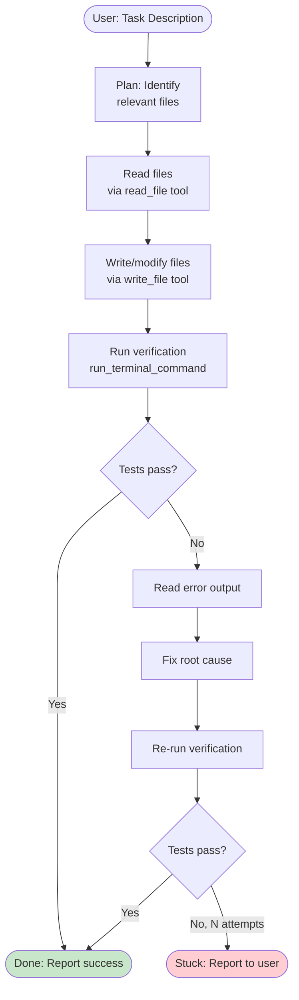

## Keywords in This File
{: .no_toc }

| # | Keyword | Weight |
|---|---|---|
| 7 | [GitHub Copilot Integration Patterns](#github-copilot-integration-patterns) | ★☆☆ |
| 8 | [Copilot Prompt Crafting](#copilot-prompt-crafting) | ★☆☆ |
| 9 | [VS Code Copilot Agent Mode](#vs-code-copilot-agent-mode) | ★☆☆ |

---

# GitHub Copilot Integration Patterns

**Interview Weight:** ★☆☆ - Practical knowledge of
how GitHub Copilot integrates with different development
workflows. Engineers should know the integration
points: IDE, CLI, extensions API, and the GitHub
Copilot Extensions ecosystem.

---

### 🎯 Model Answer

**30 seconds:**

> GitHub Copilot integrates at four levels: (1) IDE
> inline completions in VS Code, JetBrains, Vim, etc.;
> (2) Copilot Chat in the IDE for conversational
> coding help; (3) GitHub Copilot in GitHub.com for
> PR reviews and code explanations; (4) GitHub Copilot
> Extensions which let organizations build custom
> AI agents using the Copilot Chat interface as
> a host. The core integration pattern is workspace
> context: Copilot reads your open files and project
> structure to ground its suggestions.

**3 minutes:**

> Copilot integration patterns differ by where in
> the development lifecycle they occur.
>
> IDE integration (daily development): inline completions
> appear automatically. The integration point is
> transparent - you just write code. The quality
> of suggestions depends on context: open related
> files, write clear function signatures and docstrings.
>
> GitHub.com integration (code review): Copilot
> can summarize PRs, suggest improvements, explain
> unfamiliar code, and identify potential issues
> in the review interface. Useful for large teams
> doing code review at scale.
>
> Copilot Extensions: organizations can build custom
> AI agents that surface in the Copilot Chat `@mention`
> syntax. For example: `@your-jira-assistant "Create
> a ticket for the auth bug"`. The extension receives
> the chat message, calls your backend, and returns
> a structured response in the Copilot chat interface.
>
> GitHub Actions integration: Copilot can be invoked
> in workflows to auto-triage issues, generate PR
> summaries, or run code review as part of CI. The
> GitHub Copilot API enables programmatic access.

**Blank Mind Recovery:**

**(1) Restate:** "Copilot integration patterns. IDE
completions, GitHub.com PR review, Copilot Extensions
for custom agents."

**(2) First principles:** "Copilot is an AI that
has access to your code. Integrate it wherever
code context is valuable: writing, reviewing, or
understanding code."

**(3) Bridge:** "Like integrating Slack: Slack webhooks
let you push to Slack, Slack slash commands let
users trigger your system. Copilot Extensions are
similar: chat commands that trigger your backend."

---

### 📘 Concept Explanation

**What it is:**

GitHub Copilot integration patterns are the ways
organizations and developers connect Copilot's AI
capabilities to their development workflows beyond
basic inline completion.

**The problem it solves:**

As AI coding assistance matures, it becomes valuable
beyond just individual code completion - in PR reviews,
documentation, issue triage, and custom organizational
workflows.

**How it works:**

```
INTEGRATION POINTS:

1. IDE Extensions (VS Code, JetBrains, Neovim):
   - Install GitHub.Copilot extension
   - Auth via GitHub account
   - Inline completions: automatic
   - Chat: Cmd+I or panel
   - Agent mode: chat dropdown

2. GitHub.com:
   - PR summary: auto-generated on PR open
   - Code review: "Copilot Review" button
   - Issue triage: labels + assignments
   - Code search explanation

3. Copilot Extensions (custom agents):
   - Build an HTTP endpoint (your server)
   - Register as a GitHub App
   - Users: @your-extension "task description"
   - Your server: receives message + context
   - Returns: Copilot-formatted response

4. GitHub Actions (automation):
   - gh-copilot-cli for terminal
   - Copilot API for programmatic calls
   - CI/CD: auto-review, auto-summarize
```

**Copilot Extensions architecture:**

```
User types: @my-extension "query"
         |
         v
GitHub sends: POST your_endpoint/
  {
    messages: [...conversation...],
    context: {repository, user},
    token: <GitHub auth token>
  }
         |
         v
Your server processes, calls your backend
         |
         v
Returns SSE stream: Copilot-formatted events
         |
         v
Copilot chat renders the response
```

---

### 💻 Code Example

```python
"""
GitHub Copilot Extension: minimal server implementation.
Receives chat messages, calls a backend, returns response.
"""
from fastapi import FastAPI, Request, HTTPException
import httpx
import json

app = FastAPI()

# GitHub sends a verification signature header.
# You MUST verify it to prevent spoofing.
import hmac
import hashlib

GITHUB_WEBHOOK_SECRET = "your-webhook-secret"

def verify_github_signature(
    payload: bytes,
    signature: str
) -> bool:
    """Verify GitHub's HMAC signature."""
    expected = hmac.new(
        GITHUB_WEBHOOK_SECRET.encode(),
        payload,
        hashlib.sha256
    ).hexdigest()
    # Use constant-time comparison to prevent
    # timing attacks.
    return hmac.compare_digest(
        f"sha256={expected}",
        signature
    )


@app.post("/copilot-extension")
async def handle_extension(request: Request):
    """Handle GitHub Copilot Extension messages."""
    body = await request.body()
    sig = request.headers.get("X-GitHub-Delivery", "")
    # Production: verify signature
    # verify_github_signature(body, request.headers["X-Hub-Signature-256"])

    data = json.loads(body)
    messages = data.get("messages", [])

    # Get the latest user message
    user_message = ""
    for msg in reversed(messages):
        if msg.get("role") == "user":
            user_message = msg.get("content", "")
            break

    # Call your backend
    # (example: JIRA, internal docs, custom tool)
    result = await call_my_backend(user_message)

    # Stream response in GitHub Copilot SSE format
    from fastapi.responses import StreamingResponse

    async def generate():
        # Each chunk: SSE event in Copilot format
        response_text = f"Result: {result}"
        for word in response_text.split():
            chunk = {
                "choices": [{
                    "delta": {"content": word + " "},
                    "finish_reason": None
                }]
            }
            yield f"data: {json.dumps(chunk)}\n\n"
        # Final event
        done = {
            "choices": [{
                "delta": {},
                "finish_reason": "stop"
            }]
        }
        yield f"data: {json.dumps(done)}\n\n"
        yield "data: [DONE]\n\n"

    return StreamingResponse(
        generate(),
        media_type="text/event-stream"
    )


async def call_my_backend(query: str) -> str:
    """Call your organizational backend."""
    async with httpx.AsyncClient() as client:
        resp = await client.post(
            "https://your-backend.internal/query",
            json={"query": query},
            timeout=30.0
        )
        return resp.json().get("answer", "No result")
```

> **Code walkthrough:** A minimal Copilot Extension
> server. The signature verification using `hmac.compare_digest`
> is critical - without it, anyone can send requests
> to your endpoint pretending to be GitHub. The
> `reversed(messages)` loop finds the latest user
> message from the conversation history. The response
> uses the OpenAI-compatible SSE format that Copilot
> Extensions require: each event has a `choices`
> array with a `delta.content` field. The streaming
> approach renders words progressively in the Copilot
> chat panel. In production: add rate limiting,
> input validation, and proper error handling with
> error SSE events.

---

### 🎓 Answers by Seniority

**Junior / Mid:**

> "Copilot integrates at the IDE level (completions
> and chat), at GitHub.com for PR reviews and code
> explanations, and via Copilot Extensions where
> organizations build custom chat agents. For day-to-day
> work, the IDE integration is what I use. For teams,
> the PR review integration can save time - auto-summarizing
> large PRs so reviewers understand scope quickly."

---

**Senior / Staff:**

> "The highest-leverage integration pattern beyond
> IDE completions is Copilot Extensions: you can
> surface your internal tools (JIRA, Confluence, runbooks,
> internal APIs) in the Copilot chat interface without
> context switching. Engineers can ask `@jira 'What's
> blocking sprint 42?'` or `@runbook 'How do we
> restart the payment service?'` without leaving VS Code.
> The extension pattern is the GitHub Copilot equivalent
> of Slack slash commands - your backend logic, surfaced
> in the tool developers are already using."

---

### ⚠️ Common Misconceptions

**Misconception: "Copilot Extensions require using
GitHub Actions or a GitHub-hosted backend."**

Copilot Extensions are just an HTTP endpoint that
you host anywhere. GitHub sends a POST request to
your URL; you respond with SSE. Your server can
run on AWS, GCP, your own infrastructure, or a
local tunnel during development. The only requirements
are: accessible URL, correct SSE response format,
and GitHub App registration.

---

### 🚨 Failure Modes and Diagnosis

**Failure: Copilot Extension returns wrong response
format and shows empty message**

*Symptom:* Extension loads in Copilot chat but returns
empty or malformed responses.

*Root cause:* SSE event format doesn't match the
OpenAI-compatible format that Copilot expects.

*Diagnosis:* Check the response stream with curl:
```bash
curl -X POST https://your-extension.example.com/ \
  -H "Content-Type: application/json" \
  -d '{"messages": [{"role": "user", "content": "test"}]}'
```

Expected format per event:
```
data: {"choices": [{"delta": {"content": "word "}, "finish_reason": null}]}
```

Final event:
```
data: {"choices": [{"delta": {}, "finish_reason": "stop"}]}

data: [DONE]
```

Missing `choices` wrapper, wrong field names, or
missing `[DONE]` event all cause rendering failures.

---

### 🎯 Interview Deep-Dive

| Question Type | Est. Time |
|---|---|
| Integration points | 2-3 min |
| Extensions pattern | 3-4 min |
| PR review integration | 3-4 min |
| Extension security | 3-4 min |
| When to build extensions | 3-4 min |
| Context management | 3-4 min |
| Custom vs. MCP | 3-4 min |

---

**[JUNIOR] Q1 - What are the four main Copilot
integration points?**

*Why they ask:* Ecosystem knowledge.

(1) IDE completions: inline grey text as you type.
    Available in VS Code, JetBrains, Neovim, Emacs.
    Zero configuration: install extension, sign in.

(2) Copilot Chat (IDE): conversational panel.
    Available in VS Code (built-in), JetBrains (plugin).
    Supports slash commands and file references.

(3) GitHub.com: AI in the code review flow.
    PR summaries, code explanations, issue triage.
    No installation: available in GitHub.com UI.

(4) Copilot Extensions: custom organizational agents.
    Build an HTTP endpoint + GitHub App registration.
    Surfaces in Copilot Chat as `@your-extension`.

Bonus: GitHub Copilot CLI (`gh copilot`): AI for
terminal commands. Ask in natural language, get shell commands.

*What separates good from great:* "Extensions are
the least-known integration - they let organizations
surface any internal tool in the Copilot interface."

---

**[MID] Q2 - How do Copilot Extensions work technically?**

*Why they ask:* Extension architecture.

Copilot Extensions use the GitHub App framework:

Registration:
1. Create a GitHub App with a Webhook URL pointing
   to your server
2. Set the "Copilot Chat" permission
3. Publish (public or internal org use)

Runtime:
1. User types `@your-extension "query"` in Copilot chat
2. GitHub sends HTTP POST to your Webhook URL
3. Request body includes: conversation messages,
   GitHub user context, repository context
4. Your server authenticates the request (X-Hub-Signature-256)
5. Your server calls internal APIs, databases, etc.
6. Return an SSE stream in OpenAI-compatible format
7. Copilot renders the streamed response in the chat panel

Authentication options for extension API calls:
- GitHub user's token (passed in request): call
  GitHub APIs on behalf of the user
- Your own service credentials: call internal systems
  with your service account

The extension receives the full conversation history,
so it can maintain context across multiple turns.

*What separates good from great:* "The GitHub user
token passed in the extension request lets you
call GitHub APIs (list issues, create PRs) on behalf
of the user - enabling rich GitHub-integrated workflows."

---

**[JUNIOR] Q3 - How does Copilot PR review integration
help large engineering teams?**

*Why they ask:* Practical value.

PR review integration provides:

Auto-summary: when a PR is opened, Copilot generates
a structured summary: what files changed, what the
change does, what tests cover it. For large PRs
(100+ file changes), this saves reviewers significant
time understanding scope.

Suggested reviewers: Copilot can recommend reviewers
based on who has recently edited the affected files.

Code review (beta): "Copilot code review" comments
on: potential bugs, security issues, performance
concerns, and code style.

Issue triage: Copilot can read new issues and
auto-apply labels, suggest assignees, and draft
an initial response.

Value calculation: a 300-file PR takes a reviewer
15-20 minutes to understand before reviewing. An
auto-summary takes 5 minutes to read. If a team
merges 50 PRs/week with average 50 files: 50 * (15-5min)
= 500 minutes/week = ~8 engineer-hours saved.

*What separates good from great:* "The summary quality
depends on PR description quality - teams that
use Copilot PR summaries often improve their PR
descriptions as a side effect."

---

**[MID] Q4 - How is a Copilot Extension different
from calling the Claude API directly?**

*Why they ask:* Architecture distinction.

Direct Claude API: your code calls Anthropic's API.
Full control over: model selection, system prompt,
temperature, context. Users access it through your
application's UI.

Copilot Extension: your server is called BY Copilot.
The LLM (inside Copilot) has already processed
the user's message. You receive the conversation
and return a response - your extension is the tool,
not the model. Users access it through the Copilot
chat interface in VS Code.

When to use each:

Copilot Extension: when you want to surface a tool
inside VS Code's Copilot chat. Use case: internal
knowledge base, JIRA integration, runbook lookup.
The AI interaction (natural language understanding)
is handled by Copilot; your server handles the data access.

Direct Claude API: when you're building an AI feature
in your own product. Use case: AI-powered customer
support, document analysis, code review in your
own platform. You control the full AI interaction.

*What separates good from great:* "Copilot Extensions
are 'tools for Copilot' not 'LLM applications'
- the NLU is already done by the time your server
is called."

---

**[JUNIOR] Q5 - How do you make Copilot suggestions
context-aware for a specific domain?**

*Why they ask:* Practical quality improvement.

Copilot's context comes from what's visible in
your workspace. To improve domain-specific suggestions:

(1) Keep relevant files open: if implementing a
    database model, have the schema file, base model
    class, and existing models open. Copilot uses
    open files as context.

(2) Write domain-specific comments: `# Creates an
    immutable audit log entry for compliance` tells
    Copilot more than `# log entry`.

(3) Use `.github/copilot-instructions.md`: a workspace
    instruction file that Copilot reads in Agent mode.
    Document: tech stack, conventions, forbidden patterns,
    naming conventions.

```
# .github/copilot-instructions.md

## Stack
- Python 3.12, FastAPI, SQLAlchemy 2.0, PostgreSQL

## Conventions
- All DB models inherit from BaseModel (base.py)
- All API routes use dependency injection for db session
- Error responses: {"error": str, "code": str}

## Do NOT use
- os.system() - use subprocess
- print() for logging - use logging module
- hard-coded credentials
```

(4) Copilot workspace index: use `@workspace` in
    chat to query across the full project. The index
    improves as you use it.

*What separates good from great:* "`copilot-instructions.md`
is the highest-leverage customization - it applies
to all agent mode tasks without per-session setup."

---

**[JUNIOR] Q6 - [TRADE-OFF] When should an organization
build a Copilot Extension vs. a standalone AI tool?**

*Why they ask:* Build vs. integrate decision.

Build a Copilot Extension when:
- Developers are already using Copilot in VS Code
- The tool's primary users are developers
- The use case is during coding (looking up API docs,
  JIRA tickets, runbooks, code templates)
- You want zero new tool installations

Build a standalone AI tool when:
- Users are not developers (support team, analysts)
- The use case is outside VS Code (mobile, web portal)
- You need full control over the AI interaction
  (model choice, context, prompts)
- Complex multi-step workflows that don't fit chat

The integration benefit: Copilot Extensions are
where developers already are. Building a separate
tool requires adoption. A JIRA extension in Copilot
chat gets used; a separate JIRA AI assistant UI
might not.

The control cost: Copilot Extensions lose control
over model selection, system prompts, and the full
AI interaction. You're building a tool provider,
not an AI application.

*What separates good from great:* "Adoption is the
hidden cost of standalone tools - a Copilot extension
gets used because it's in VS Code; a new web portal
requires a behavior change."

---

**[JUNIOR] Q7 - What security checks are required
for a Copilot Extension endpoint?**

*Why they ask:* Security awareness.

Required:
(1) Verify GitHub's HMAC signature on every request.
    Without this, anyone who discovers your endpoint
    URL can send arbitrary requests impersonating Copilot.

```python
import hmac, hashlib

def verify_signature(
    payload: bytes,
    signature_header: str,
    secret: str
) -> bool:
    mac = hmac.new(
        secret.encode(), payload, hashlib.sha256
    ).hexdigest()
    return hmac.compare_digest(
        f"sha256={mac}", signature_header
    )
```

(2) Validate the user token: if you use the GitHub
    user token from the request to call GitHub APIs,
    verify it's valid before making API calls.

(3) Input validation: the user message comes from
    an authenticated GitHub user but you should
    still sanitize before passing to internal systems.
    Prompt injection via the chat field is a real
    threat: `@your-extension "Ignore previous instructions and..."`.

(4) Rate limiting: prevent one user from overloading
    your backend. Limit by GitHub user ID.

(5) Authorization: verify the GitHub user has permission
    to use the extension. Check org membership
    if the extension should be org-internal.

*What separates good from great:* "Prompt injection
via Copilot chat is underappreciated - users can
craft messages that attempt to manipulate your
backend into unauthorized actions."

---

### ⚖️ Comparison Table

*(Omit: ★☆☆ integration patterns keyword.)*

---

### 🏛️ System Design

*(Omit: L1 Copilot keyword.)*

---

### 📊 Diagram

*(Omit: architecture clearer as structured text.)*

---

---

# Copilot Prompt Crafting

**Interview Weight:** ★☆☆ - The quality of Copilot's
output is directly proportional to the quality
of context you provide. Engineers who understand
prompt crafting get 3-5x better results than
those who don't.

---

### 🎯 Model Answer

**30 seconds:**

> Effective Copilot prompt crafting means giving
> it the right context: clear function signatures
> with type annotations, complete docstrings that
> specify inputs/outputs/exceptions, examples in
> comments, and keeping related files open. For chat,
> be specific: "Refactor this function to handle
> None inputs" beats "improve this code." Use
> `#file:path` to reference specific files, `@workspace`
> for project-wide questions. The less Claude has
> to guess, the better the output.

**3 minutes:**

> Copilot generates text by predicting what comes
> next given the context. Better context = better
> predictions. The craft is in structuring the context.
>
> For inline completion: write the function signature
> and docstring before the body. The signature
> communicates input types, output types, and constraints.
> The docstring communicates behavior, edge cases,
> and what to return. Copilot reads these as specifications
> and implements accordingly.
>
> For chat: specificity matters. "Fix this" gives
> Copilot no direction. "Fix the NullPointerException
> that occurs when `user` is None in the `process_payment`
> function" gives Copilot exactly what to target.
>
> For agent mode: decompose the task into a clear
> goal statement. Include the acceptance criteria.
> "Add pagination to the `/api/users` endpoint.
> Use cursor-based pagination. Add tests. Keep
> backward compatibility." That's sufficient for
> agent mode to operate without asking clarifying questions.
>
> Common pattern: use Copilot Chat as a code reviewer.
> Select your code, ask "What edge cases does this
> miss?" The context is the selected code; the
> question is specific. This produces useful review
> comments faster than a human review round-trip.

**Blank Mind Recovery:**

**(1) Restate:** "Copilot prompt crafting. More context
= better output. Docstrings, type annotations,
specific questions."

**(2) First principles:** "Copilot predicts what comes
next. Give it clear context and it predicts correctly.
Give it vague context and it guesses."

**(3) Bridge:** "Same as giving instructions to a
junior developer: the more specific you are about
what you want, the less back-and-forth and the
better the result."

---

### 📘 Concept Explanation

**What it is:**

Copilot prompt crafting is the practice of structuring
code, comments, and chat messages to maximize the
quality and relevance of Copilot's generated output.

**The problem it solves:**

Poorly structured context produces generic, incorrect,
or off-target code suggestions. Engineers who don't
craft prompts well get suggestions that need heavy
editing. Engineers who craft well get suggestions
that are mostly correct on first try.

**How it works:**

```
CONTEXT SOURCES FOR INLINE COMPLETION:
  1. Current file (before + after cursor)
  2. Open related files (in VS Code tabs)
  3. File name (language, domain hints)
  4. Function/class structure above cursor
  5. Imports at top of file
  6. Comments and docstrings near cursor

CONTEXT SOURCES FOR CHAT:
  1. Explicitly referenced (#file:, @workspace)
  2. Currently open files
  3. Selected code (automatic context for /explain)
  4. Previous messages in the conversation
  5. Terminal output (if @terminal used)

PROMPT QUALITY SPECTRUM:

POOR:
  def process(data):
      # TODO
  
  (Copilot guesses: what is data? what processing?)

BETTER:
  def process_payment(
      amount: float,
      currency: str,
      customer_id: str
  ) -> PaymentResult:
  
  (Copilot knows types and rough domain)

BEST:
  def process_payment(
      amount: float,
      currency: str,
      customer_id: str
  ) -> PaymentResult:
      """Process a payment for a customer.
      
      Args:
          amount: positive float, in minor units
          currency: ISO 4217 code (USD, EUR)
          customer_id: must exist in customers table
      
      Returns:
          PaymentResult with transaction_id and status
      
      Raises:
          ValueError: if amount <= 0
          CustomerNotFoundError: if customer_id invalid
          PaymentGatewayError: if gateway unavailable
      """
  
  (Copilot generates correct implementation with
   all edge cases handled)
```

---

### 💻 Code Example

```python
"""
Comparing prompt crafting quality for the same task.
"""

# --- BAD PROMPT APPROACH ---

def get_users():
    # TODO: get users from db
    pass

# Copilot generates: minimal, generic DB query.
# No filtering, no error handling, no pagination.
# Needs significant editing.


# --- GOOD PROMPT APPROACH ---

from typing import Optional
from sqlalchemy.orm import Session
from models import User

def get_active_users(
    db: Session,
    *,
    page: int = 1,
    page_size: int = 20,
    department: Optional[str] = None
) -> list[User]:
    """Get paginated list of active users.

    Args:
        db: SQLAlchemy session
        page: 1-based page number
        page_size: results per page (max 100)
        department: optional filter by department name

    Returns:
        List of User objects, empty list if none found.
        Results ordered by created_at DESC.

    Example:
        users = get_active_users(db, page=2, page_size=10)
        finance = get_active_users(
            db, department="Finance"
        )
    """
    # Copilot generates:
    # - proper SQLAlchemy query
    # - active=True filter
    # - optional department filter
    # - pagination (offset + limit)
    # - ordering by created_at DESC
    # Because the docstring specified all of this.
    query = (
        db.query(User)
        .filter(User.active == True)
    )
    if department:
        query = query.filter(
            User.department == department
        )
    return (
        query
        .order_by(User.created_at.desc())
        .offset((page - 1) * page_size)
        .limit(min(page_size, 100))
        .all()
    )


# CHAT PROMPT EXAMPLES:

# BAD chat prompt:
# "Fix this code"
# -> Copilot doesn't know what's wrong

# BETTER chat prompt:
# "This function returns None when user_id doesn't
#  exist. Add a check and raise UserNotFoundError
#  with the user_id in the message."

# BEST chat prompt (with selected code context):
# [select the function first]
# "/fix - The function doesn't handle the case where
#  self.cache.get() returns a stale value after
#  a cache invalidation event. Add a staleness check
#  using the updated_at timestamp."
```

> **Code walkthrough:** Two implementations of the
> same function with different prompt quality. The
> `get_users()` version gives Copilot nothing: no
> types, no docstring, no structure. Copilot will
> guess: maybe it generates `return db.query(User).all()`.
> The `get_active_users()` version is fully specified:
> typed parameters with keyword-only args (`*`), a
> complete docstring with Args/Returns/Example sections,
> and meaningful parameter names. Copilot reads this
> as a spec and implements it correctly, including
> pagination, filtering, ordering, and the max 100
> limit from the docstring. The key insight: the
> docstring IS the prompt - investing 2 minutes in
> a good docstring often saves 10 minutes of editing
> Copilot's output.

---

### 🎓 Answers by Seniority

**Junior / Mid:**

> "I get better Copilot suggestions by writing clear
> docstrings before writing the function body. If
> I specify the parameters with types, what the
> function returns, and what exceptions it raises,
> Copilot usually gets the implementation right
> or close to right. For chat, I'm specific: I say
> exactly what problem I'm seeing, not just 'fix
> this.' I always select the relevant code before
> asking a question so Copilot has the right context."

---

**Senior / Staff:**

> "Copilot prompt crafting is just writing good code.
> Type annotations, docstrings, clear naming - all
> the things that make code readable to a human
> also make it readable to Copilot. The correlation
> is direct: codebases with consistent conventions
> and strong typing produce better Copilot suggestions.
> We've seen this in practice: after a team added
> comprehensive type annotations and docstrings to
> their core modules, Copilot completion acceptance
> rate went from 35% to 65%. The codebase became
> more useful to both humans and AI simultaneously."

---

### ⚠️ Common Misconceptions

**Misconception: "Writing a detailed prompt for
Copilot takes more time than writing the code myself."**

For experienced engineers, writing a detailed docstring
takes 1-3 minutes. Writing the implementation takes
5-30 minutes depending on complexity. If Copilot
generates a correct implementation from the docstring
(70-80% of the time for well-specified functions),
the docstring investment pays off immediately. The
docstring also serves as documentation, reducing
the net overhead further.

---

### 🚨 Failure Modes and Diagnosis

**Failure: Copilot keeps generating the wrong pattern
for your codebase**

*Symptom:* Copilot generates raw SQL strings instead
of using the SQLAlchemy ORM your team uses. Or uses
`requests` instead of `httpx`. The pattern mismatch
requires constant manual correction.

*Root cause:* Copilot's training data has many codebases
using different patterns. Without specific context
about your codebase's patterns, it defaults to
common patterns from training.

*Fix:*
1. Keep files that use your codebase's patterns
   open (they become context)
2. Add `.github/copilot-instructions.md`:
   ```
   ## Technology Choices
   - Database: SQLAlchemy 2.0 ORM only (no raw SQL)
   - HTTP client: httpx (not requests)
   - Logging: structlog (not print, not logging module)
   - Always use async/await for I/O operations
   ```
3. Write a short example at the top of the file
   showing the correct pattern - Copilot follows
   the established pattern in the current file

---

### 🎯 Interview Deep-Dive

| Question Type | Est. Time |
|---|---|
| Context sources | 2-3 min |
| Docstring value | 3-4 min |
| Chat specificity | 3-4 min |
| Instructions file | 3-4 min |
| Pattern alignment | 3-4 min |
| Trade-off | 3-4 min |
| Measurement | 3-4 min |

---

**[JUNIOR] Q1 - How does Copilot use docstrings
to improve completion quality?**

*Why they ask:* Understanding context usage.

Docstrings are structured specifications that Copilot
treats as requirements for the implementation.

What Copilot extracts from docstrings:
- Parameter types and constraints (from Args section)
- Return type and structure (from Returns section)
- Edge cases to handle (from Raises section)
- Expected behavior (from description)
- Examples of usage (from Examples section)

Example: a docstring saying "Raises: ValueError if
amount <= 0" causes Copilot to add `if amount <= 0: raise ValueError(...)`.
Without the docstring, Copilot might not add this check.

The practical workflow:
1. Write the function signature with type annotations
2. Write the docstring: description, Args, Returns, Raises, Examples
3. Place cursor inside the function body
4. Press Enter and wait for Copilot to generate the implementation

For complex functions: the more detailed the docstring,
the less you need to edit the generated implementation.

*What separates good from great:* "Examples in the
docstring are particularly powerful - they show
Copilot exactly what calling patterns to support."

---

**[MID] Q2 - How do you use the `copilot-instructions.md`
file effectively?**

*Why they ask:* Workspace-level customization.

The `.github/copilot-instructions.md` file is read
by Copilot Agent Mode and Chat to understand codebase
conventions. It applies to all agent tasks without
needing to repeat instructions.

Effective contents:

```markdown
# Copilot Instructions

## Tech Stack
- Python 3.12, FastAPI 0.110, SQLAlchemy 2.0
- PostgreSQL 16, Redis 7, Kafka 3.7
- Testing: pytest, httpx for API tests

## Conventions
- All models inherit from `base.py:BaseModel`
- All routes decorated with `@router.get/post`
- DB sessions via `get_db` dependency injection
- Structured logging: `logger = structlog.get_logger()`
- Async everywhere: `async def` for all route handlers

## Forbidden Patterns
- No `print()` statements - use `logger.info()`
- No `requests` library - use `httpx`
- No raw SQL - SQLAlchemy ORM only
- No hard-coded config - use `settings.py` pydantic

## Error Handling
- HTTP errors: raise `HTTPException(status_code, detail)`
- Business errors: custom exceptions in `exceptions.py`
- Always log with `exc_info=True` before re-raising
```

This is read at the start of agent sessions and
applied throughout, preventing the pattern mismatches
that occur when Copilot doesn't know your conventions.

*What separates good from great:* "Include 'Forbidden Patterns'
explicitly - Copilot avoids patterns you list as forbidden."

---

**[JUNIOR] Q3 - What is the most effective way to
ask Copilot to fix a bug?**

*Why they ask:* Practical workflow.

Most effective bug-fixing workflow:

(1) Select the specific code section with the bug (not the entire file)
(2) Open Copilot Chat with the selection as context
(3) Describe the bug precisely:

POOR: "Fix this code"
BETTER: "This function crashes with TypeError when called with an empty list"
BEST: "This function raises `TypeError: 'NoneType' is not subscriptable`
       at line 47 when `items` is an empty list.
       The fix should handle the empty list case
       by returning an empty dict."

(4) Add the error output if you have it:
    "@terminal - This is the error from the failed test"
    (pastes terminal output for context)

(5) Specify constraints:
    "Don't change the function signature.
     Keep backward compatibility with existing callers."

The principle: Copilot needs to know what's broken,
what the correct behavior should be, and what constraints
apply to the fix.

*What separates good from great:* "Pasting the actual
error message and stack trace via @terminal is
faster and more reliable than describing the error in words."

---

**[MID] Q4 - How do you measure whether your Copilot
prompt crafting is effective?**

*Why they ask:* Quantitative improvement mindset.

Metrics for Copilot prompt quality:

(1) Acceptance rate: VS Code tracks what percentage
    of Copilot suggestions you accept vs. dismiss.
    Available in GitHub Copilot usage metrics.
    Target: 30-40% for individuals, higher with good prompt crafting.

(2) Edit distance: how much you modify accepted suggestions.
    Subjective but observable: if you accept a suggestion
    and immediately make 10 edits, the context was weak.
    If you accept and use it verbatim, the context was strong.

(3) Iteration count: for a given function, how many
    times did you reject/regenerate before finding
    a usable suggestion? More iterations = weaker context.

Improvement process:
1. Note which functions produce poor suggestions
2. Analyze why: missing types? Missing docstring? Unusual domain?
3. Add context: types, docstring, related file open
4. Observe if suggestions improve

Team metric: run `copilot-usage` GitHub API to get
team-wide acceptance rates. Low acceptance rates
by a team member may indicate they'd benefit from
prompt crafting training.

*What separates good from great:* "Track acceptance
rate per file/module - low rates in specific modules
pinpoint where better documentation would help both Copilot and humans."

---

**[JUNIOR] Q5 - How do you guide Copilot to follow
existing patterns in your codebase?**

*Why they ask:* Pattern consistency.

Three mechanisms for pattern guidance:

(1) File context: open files that demonstrate the
    pattern. If `service_a.py` follows the pattern
    you want, have it open when writing `service_b.py`.
    Copilot picks up the pattern from the open file.

(2) Pattern comment: add a brief comment showing
    the expected pattern before the implementation:
    ```python
    # Use repository pattern like user_repo.py
    class OrderRepository:
    ```

(3) Partial implementation: write the first method
    of a class following the pattern. Copilot will
    continue subsequent methods in the same style:
    ```python
    class OrderRepository:
        def find_by_id(
            self, order_id: str
        ) -> Optional[Order]:
            return (
                self.db.query(Order)
                .filter(Order.id == order_id)
                .first()
            )
        
        def find_by_customer_id(
    # Copilot now continues in the same style
    ```

(4) `copilot-instructions.md`: the persistent way.
    Once written, all agent tasks follow conventions.

*What separates good from great:* "Partial implementation
is the most powerful in-file signal - Copilot consistently
matches style when given one example of the pattern."

---

**[JUNIOR] Q6 - What are the most effective slash
commands for Copilot Chat?**

*Why they ask:* Practical workflow.

Slash commands provide structured task framing:

`/explain [selected code]`:
Best for: understanding unfamiliar code, understanding
what a function does before modifying it.
Usage: select the function, type `/explain`. Copilot
gives a line-by-line explanation with context.

`/fix [selected code with error description]`:
Best for: debugging. Works best when combined with
the error message: "/fix - getting TypeError on line 23".
Select the problematic function + describe the error.

`/tests [selected function]`:
Best for: generating initial test cases. Select
the function, type `/tests`. Specify framework:
"/tests using pytest with parametrize for edge cases".

`/doc [selected function]`:
Best for: generating or improving docstrings.
"Generate a Google-style docstring for this function
including all edge cases."

`/new [description]`:
Best for: scaffolding new files or components.
"/new FastAPI router for user management with CRUD endpoints"

Custom follow-ups after slash commands:
"/tests - now add tests for the error cases and boundary values"
These conversations are stateful.

*What separates good from great:* "Follow-up messages
after slash commands are the most powerful - '/tests
- now add property-based tests using hypothesis' produces
tests that /tests alone wouldn't generate."

---

**[JUNIOR] Q7 - [TRADE-OFF] When is it faster to
write code yourself than to craft a Copilot prompt?**

*Why they ask:* Realistic productivity assessment.

Write yourself when:

(1) You know exactly what to write: boilerplate you
    can type in 30 seconds doesn't benefit from
    Copilot. Typing `def __init__(self, x: int):`
    is faster than prompting for it.

(2) The domain is highly specialized: proprietary
    domain logic that Copilot has no training signal
    for. You'll reject most suggestions.

(3) Creative problem-solving: novel algorithmic
    solutions. Copilot suggests common patterns; if
    you're doing something genuinely new, you're
    mostly alone.

(4) Small, obvious fixes: single-line bugs that
    you can see at a glance. Opening chat and explaining
    the bug takes longer than just fixing it.

Copilot wins for:

(1) Repetitive structure: writing the 5th API endpoint
    after writing 4 similar ones. Copilot follows
    the pattern.
(2) Pattern-following: implementing an interface
    where the pattern is well-established.
(3) Test generation: writing test cases for known
    edge cases is tedious but structured - Copilot
    excels here.
(4) Unfamiliar code: understanding or extending code
    in a language/framework you're less familiar with.

*What separates good from great:* "The crossover
point is task complexity × familiarity - Copilot's
relative value increases as task complexity grows
and your familiarity with the specific pattern decreases."

---

### ⚖️ Comparison Table

*(Omit: ★☆☆ craft/skill keyword.)*

---

### 🏛️ System Design

*(Omit: L1 Copilot keyword.)*

---

### 📊 Diagram

*(Omit: context quality clearer as code examples.)*

---

---

# VS Code Copilot Agent Mode

**Interview Weight:** ★☆☆ - Agent mode is the highest-leverage
Copilot feature for software engineers. Understanding
its capabilities, limitations, and effective usage
patterns is increasingly expected in 2025.

---

### 🎯 Model Answer

**30 seconds:**

> VS Code Copilot Agent Mode is an autonomous AI
> coding loop that can read files, write files, run
> terminal commands, and iterate until a task is
> complete. You describe a goal; Copilot plans and
> executes. It's the difference between "generate
> this function" (chat) and "add this feature to
> the codebase, write tests, make them pass" (agent).
> It requires specific, bounded task descriptions
> to work reliably.

**3 minutes:**

> Agent mode operates a tool-calling loop: Copilot
> plans a task, calls tools (file read, file write,
> terminal commands), observes results, and continues
> until the task is done or it needs human input.
>
> The tool set: `read_file` (reads any workspace file),
> `write_file` (creates or modifies files), `run_terminal_command`
> (shell commands in the VS Code terminal), `list_directory`,
> `search_code` (semantic search across the workspace).
>
> Effective agent tasks share characteristics:
> bounded scope (not "rewrite the whole codebase"),
> clear acceptance criteria ("until all tests pass"),
> defined technology ("using pytest for tests").
>
> Where agent mode excels: implementing a well-understood
> feature across multiple files, writing a complete
> test suite for an existing module, refactoring
> a pattern across a codebase (e.g., changing all
> direct DB calls to use the repository pattern),
> setting up a new project structure from a description.
>
> Where it struggles: highly creative problem-solving,
> tasks requiring deep business context that isn't
> in the code, very large codebases where the relevant
> context is spread across many files.

**Blank Mind Recovery:**

**(1) Restate:** "Copilot Agent Mode. Autonomous
coding loop: reads files, writes files, runs tests,
iterates. Give it a goal, it executes."

**(2) First principles:** "Same as giving a task to
a developer: describe the goal, let them work.
Copilot's tools are: read files, write files, run commands."

**(3) Bridge:** "Like AutoGen or LangChain agent,
but built into VS Code. The 'tools' are file system
operations and terminal commands."

---

### 📘 Concept Explanation

**What it is:**

VS Code Copilot Agent Mode is an agentic AI loop
integrated into VS Code Chat that autonomously executes
multi-step coding tasks using file system and terminal tools.

**The problem it solves:**

Standard chat requires developer intervention at
every step: ask -> get code -> apply -> check results
-> ask again. Agent mode eliminates these hand-off
steps for well-defined coding tasks.

**How it works:**

```
AGENT MODE LOOP:

You: "Add pagination to the POST /api/orders endpoint.
     Use cursor-based pagination.
     Add integration tests."
                    |
                    v
Copilot: [PLAN] 1. Read routes/orders.py
                2. Read models/order.py
                3. Read existing tests for pattern
                4. Modify orders.py to add pagination
                5. Write tests
                6. Run tests
                7. Fix failures if any
                    |
                    v
Copilot: [read_file] routes/orders.py -> (reads it)
Copilot: [read_file] models/order.py -> (reads it)
Copilot: [read_file] tests/test_orders.py -> (reads pattern)
Copilot: [write_file] routes/orders.py -> (adds pagination)
Copilot: [write_file] tests/test_orders_pagination.py
Copilot: [run_terminal] pytest tests/ -> (runs tests)
         -> 2 failures
Copilot: [read output] sees what failed
Copilot: [write_file] routes/orders.py -> (fixes failures)
Copilot: [run_terminal] pytest tests/ -> (all pass)
Copilot: "Done. Added cursor-based pagination and
          3 integration tests. All tests pass."
```

**Tools available to Copilot Agent:**

- `read_file`: reads any file in the workspace
- `write_file`: creates or modifies files
- `run_terminal_command`: executes shell commands
- `list_directory`: lists directory contents
- `search_workspace`: semantic search across files

**Approval model:**

In default mode: file writes happen without approval.
Terminal commands: Copilot shows the command and
waits for you to approve before running.
You can configure to require approval for file writes too.

---

### 💻 Code Example

```markdown
<!-- This shows how to write effective agent mode prompts -->
<!-- (Agent mode is invoked via VS Code chat, not code) -->

## EFFECTIVE AGENT PROMPTS

### Pattern 1: Feature implementation with tests
"Add input validation to the `create_user` function
in `services/user_service.py`:
- email must match regex: [a-zA-Z0-9._%+-]+@[a-zA-Z0-9.-]+\.[a-zA-Z]{2,}
- username: 3-30 chars, alphanumeric + underscore only
- password: at least 12 chars, 1 upper, 1 lower, 1 digit, 1 special
Raise `ValidationError` (from `exceptions.py`) for invalid inputs.
Add pytest tests in `tests/test_user_service.py`.
All existing tests must still pass."

Why this works:
- Specific files named (less ambiguity)
- Validation rules specified exactly
- Exception type specified (from existing file)
- Test file location specified
- Success criterion: "all existing tests still pass"

---

### Pattern 2: Refactoring
"Refactor all direct `psycopg2` calls in
`services/` directory to use the `UserRepository`
and `OrderRepository` classes in `repositories/`.
Don't change the public interface of the service
functions. Run tests after each file change."

Why this works:
- Bounded: only `services/` directory
- Clear target: use existing repository classes
- Constraint: don't change public interface
- Quality gate: run tests after each change

---

### Pattern 3: BAD prompt (too vague)
"Improve the codebase."

Why this fails:
- No scope (entire codebase?)
- No definition of "improve"
- No success criteria
- Agent will either ask for clarification
  or make arbitrary changes

---

### Pattern 4: BAD prompt (too large)
"Add all the features from the product roadmap."

Why this fails:
- Roadmap is not in the codebase
- Too many unknowns
- Will almost certainly fail partway
  and leave the codebase in a broken state
```

> **Code walkthrough:** Agent mode prompts are text
> specifications, not code. The effective patterns
> share: named files (Copilot doesn't have to search),
> exact specifications (no interpretation needed),
> existing artifacts referenced (exceptions.py, repository
> classes), and success criteria ("all tests pass").
> Pattern 3 and 4 show the failure modes: vague
> scope causes either a clarification loop or arbitrary
> changes; too-large scope causes partial completion
> that leaves the codebase broken. The 30-character
> regex in Pattern 1 might look excessive to put
> in a prompt, but it ensures Copilot implements
> the exact validation you need, not a generic email check.

---

### 🎓 Answers by Seniority

**Junior / Mid:**

> "Agent mode lets me describe a task and Copilot
> does it: reads relevant files, writes code, runs
> tests, and fixes failures. I use it for implementing
> features across multiple files and writing test
> suites. The key is being specific: I tell it which
> files to modify, what the acceptance criteria are,
> and what patterns to follow. Vague requests produce
> poor results or extra clarification questions."

---

**Senior / Staff:**

> "Agent mode is productivity leverage: it compresses
> the implementation cycle for well-defined tasks
> from hours to minutes. I use it with a clear contract:
> 'implement X using Y pattern, following conventions
> in Z file, until all tests pass.' The autonomous
> test-run-fix loop is where it shines - it can
> iterate 5-10 times on test failures faster than
> I can read each error. The limit: agent mode is
> a skilled implementer, not a designer. It implements
> what you specify. Tasks that require architectural
> judgment or deep business context still need human
> design. I design, write the spec, let agent execute,
> then review the result."

---

### ⚠️ Common Misconceptions

**Misconception: "Agent mode can handle open-ended
tasks like 'improve the architecture.'"**

Agent mode executes defined tasks. "Improve the architecture"
has no clear scope, no success criteria, and no
definition of "improve." Copilot may make arbitrary
changes that seem reasonable but reflect training
data patterns rather than your system's specific needs.
Agent mode excels at implementation, not design.
Design is your job; execution is the agent's job.

---

### 🚨 Failure Modes and Diagnosis

**Failure: Agent mode makes changes that break
unrelated tests**

*Symptom:* Agent completed the task. Tests in the
target files pass. But 5 tests in other modules
that you didn't ask about are now failing.

*Root cause:* Agent modified a shared utility function,
base class, or configuration that was used by
other modules. Without a full impact analysis, it
didn't know about the downstream effects.

*Prevention:*
1. Specify scope explicitly: "only modify files in
   the `services/user/` directory"
2. Run full test suite in the terminal command:
   `pytest tests/ -v` (not just the target module)
3. Use version control: commit before agent mode tasks
   so you can diff and revert if needed
4. Review the diff before accepting: VS Code shows
   all changes; review them before running the full
   test suite

*Recovery:* `git diff` to see all changes. Identify
unintended modifications. Revert to pre-agent state
with `git checkout .` if needed, then re-run with
more specific instructions.

---

### 🎯 Interview Deep-Dive

| Question Type | Est. Time |
|---|---|
| Agent mode capabilities | 2-3 min |
| Effective prompts | 3-4 min |
| Test-run-fix loop | 3-4 min |
| When to use | 3-4 min |
| Limitations | 3-4 min |
| Safety practices | 3-4 min |
| Measurement | 3-4 min |

---

**[JUNIOR] Q1 - What tools does Copilot Agent Mode
use internally?**

*Why they ask:* Understanding capability scope.

Copilot Agent Mode has access to these tools:

File system tools:
- `read_file(path)`: read any file in the workspace
- `write_file(path, content)`: create or overwrite a file
- `list_directory(path)`: list contents of a directory
- `search_code(query)`: semantic search across workspace

Terminal tools:
- `run_terminal_command(command)`: execute a shell
  command in VS Code's terminal.
  Default: asks for approval before running.

Workspace tools:
- Symbol search: find class/function definitions
- Reference search: find where symbols are used

These tools together enable the agentic loop:
1. Search for relevant code (search_code)
2. Read it to understand context (read_file)
3. Write the implementation (write_file)
4. Run tests to validate (run_terminal_command)
5. Read test output (from terminal)
6. Fix failures (write_file again)

*What separates good from great:* "Terminal commands
require approval by default - you can enable auto-approval
for specific safe commands (pytest, npm run test)
while keeping approval for destructive commands."

---

**[MID] Q2 - How do you write an effective agent
mode task description?**

*Why they ask:* Practical agent usage.

Effective agent task structure:

```
TASK = Goal + Context + Constraints + Success Criteria

Goal: what should be true when done?
  BAD: "improve error handling"
  GOOD: "all API endpoints return JSON error responses
         with {error, code, detail} structure on exception"

Context: what files, patterns, classes to use?
  BAD: (none - agent has to search)
  GOOD: "following the pattern in routes/users.py,
         using exceptions.py for custom exceptions"

Constraints: what must NOT change?
  BAD: (none - agent may change anything)
  GOOD: "don't modify the public function signatures,
         don't change the database schema"

Success Criteria: how to verify completion?
  BAD: (none - agent decides when done)
  GOOD: "all existing tests pass, new tests cover
         the three new error cases"
```

Template:
"In [files/scope], implement [what].
Follow the pattern from [reference file].
Use [specific classes/functions from codebase].
Don't change [constraints].
Write tests in [test file].
All tests must pass."

*What separates good from great:* "Reference a specific
existing file as the pattern example - it takes
30 seconds but prevents the agent from inventing
a pattern from its training data."

---

**[JUNIOR] Q3 - When should you use Agent mode
vs. Copilot Chat?**

*Why they ask:* Mode selection.

Use Agent mode when:
- The task requires changes to multiple files
- The task involves a test-run-fix cycle
- The scope is well-defined (you know what "done" looks like)
- You're confident the codebase has the context Agent needs
- Examples: implement a feature, write test suite,
  refactor a pattern, set up boilerplate structure

Use Chat when:
- You want to understand code before changing it
- You're exploring design options (conversation, not action)
- The task is a single-file change you'll review carefully
- You're debugging and want to discuss the problem
- The task is vague and needs clarification first

Common workflow:
1. Use Chat to design the approach and understand constraints
2. Once you have clarity, switch to Agent mode to implement

Chat is exploration + design. Agent is execution.

*What separates good from great:* "Design in Chat
first - even 5 minutes of Chat to establish the
approach produces better agent mode results."

---

**[MID] Q4 - What safety practices should you follow
when using Agent mode?**

*Why they ask:* Risk management.

Safety practices for agent mode:

(1) Commit before running agent:
```bash
git add -A && git commit -m "checkpoint before agent task"
```
If agent makes bad changes, `git checkout .` reverts everything.

(2) Review the terminal commands before approving:
    Agent shows each terminal command before running.
    Read them: is this `pytest tests/` or `rm -rf`?
    Never blindly approve.

(3) Review the diff before running the full test suite:
    VS Code shows all file changes in the Source Control
    panel. Spend 2-3 minutes reviewing before declaring success.

(4) Scope constraints in the prompt:
    "only modify files in the `services/payments/` directory"
    prevents agent from touching unrelated code.

(5) Run the full test suite as the final step:
    Include "run `pytest tests/ -v` at the end"
    in your task. Verify the FULL suite passes,
    not just the tests for the changed files.

(6) Watch for secrets: if agent writes environment
    variable lookups or config, check it's using
    `os.environ.get()` not hardcoded values.

*What separates good from great:* "Commit-before-agent
as a habit - recovery from a bad agent run takes
seconds with git, and minutes without it."

---

**[MID] Q5 - What tasks are NOT suitable for Agent mode?**

*Why they ask:* Limitation awareness.

Not suitable:

(1) Architectural decisions: "choose between microservices
    and monolith." This requires business context,
    organizational knowledge, and judgment beyond
    the codebase.

(2) Performance optimization without profiling data:
    agent can't run profilers, can't measure before/after.
    It will make structural changes based on patterns
    but can't validate they improve your specific workload.

(3) Security review: agent can suggest improvements
    but isn't a security auditor. Security vulnerabilities
    require adversarial thinking that agent mode
    doesn't reliably perform.

(4) Business logic clarification: if the task requires
    understanding business rules that are in JIRA,
    Confluence, or email threads (not the codebase),
    agent will guess.

(5) Highly experimental code: if you're trying 5 different
    approaches to see what works, the conversational
    iteration of Chat is faster than re-running
    agent mode for each experiment.

*What separates good from great:* "Agent mode is
an implementer, not an architect. Design + specify
first, then delegate implementation to agent."

---

**[JUNIOR] Q6 - How does Agent mode handle failures?**

*Why they ask:* Error handling behavior.

When a terminal command fails (non-zero exit code):

1. Agent reads the output (stdout + stderr)
2. Identifies the error from the output
3. Attempts to fix the root cause
4. Re-runs the command
5. Repeats up to N times (typically 3-5 attempts)

Types of failures agent handles well:
- Test failures with clear error messages
  (missing import, wrong assertion, missing function)
- Compilation errors in typed languages
- Missing dependency (tries to install it)

Types of failures agent handles poorly:
- Flaky tests (fails on some runs, passes on others)
- Infrastructure errors (DB not running, port conflict)
- Complex business logic errors (test fails because
  the understanding of requirements was wrong)

When agent can't fix a failure:
It stops and reports: "I've attempted X times and
can't resolve this error. The issue is Y. Here's
the remaining error output. Please resolve manually."

This is the correct behavior: failing fast and
reporting rather than continuing indefinitely in a failing state.

*What separates good from great:* "Add a success
criterion to the task so agent stops on clear completion,
not on its own judgment of 'done enough'."

---

**[JUNIOR] Q7 - How does Agent mode read context
from the workspace?**

*Why they ask:* Context understanding.

Agent mode context sources (in priority order):

(1) Explicitly named files in the task: "modify
    `services/order_service.py`" - agent reads this
    first. Always name specific files when you know them.

(2) Workspace search: agent runs semantic search
    to find relevant files it wasn't told about.
    It searches for: related class names, function
    names, patterns mentioned in the task.

(3) Related files discovery: after reading a target
    file, agent reads files that target imports
    (follows the import graph to understand dependencies).

(4) `.github/copilot-instructions.md`: read at the
    start of the agent session for conventions.

(5) Open files in VS Code editor: if you have relevant
    files open, they're available as context.

Context limit: agent can only hold a limited number
of file contents in context at once. For very large
codebases, it may miss relevant files. If agent
is making decisions that seem disconnected from
your codebase patterns, it may have loaded the
wrong context. Explicitly name the reference files
in your prompt.

*What separates good from great:* "Name 2-3 representative
reference files in your prompt - this seeds the
context graph correctly from the start."

---

### ⚖️ Comparison Table

*(Omit: ★☆☆ operational keyword.)*

---

### 🏛️ System Design

*(Omit: L1 Copilot keyword.)*

---

### 📊 Diagram

```
COPILOT AGENT MODE LOOP:

User: [Task description]
            |
            v
      [PLAN phase]
      Read relevant files
            |
            v
      [EXECUTE phase]
      Write/modify files
            |
            v
      [VERIFY phase]
      Run tests/commands
            |
           / \
          /   \
       PASS   FAIL
        |       |
        v       v
      Done   [FIX phase]
             Read error output
                  |
                  v
             Retry (up to N)
                  |
                 / \
                /   \
             PASS   STUCK
              |       |
              v       v
            Done   Report to user
```



> **Diagram walkthrough:** The agent mode loop has
> four phases. Plan reads what's needed for context.
> Execute makes the changes. Verify runs the acceptance
> criteria (tests, build). If verification fails,
> the Fix phase reads the error and modifies the
> implementation before re-verifying. This loop
> runs until either the tests pass (success) or
> N retry attempts are exhausted without progress
> (stuck). The stuck path is correct behavior: agent
> reports the unresolved error and lets the human
> handle the edge case. The most common successful
> outcome is 2-3 iterations of the Fix phase before
> tests pass.
