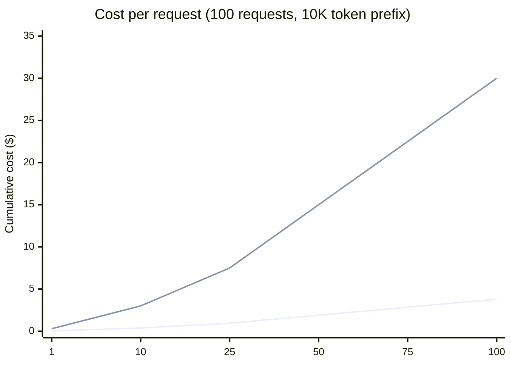
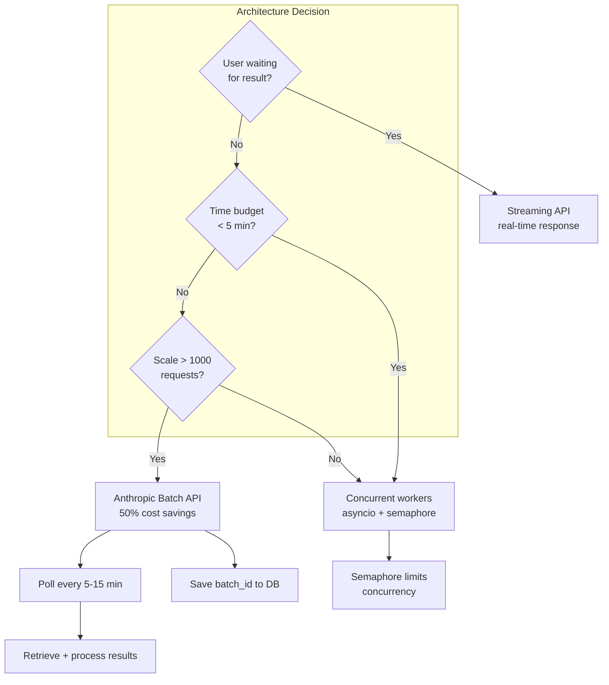

## Keywords in This File
{: .no_toc }

| # | Keyword | Weight |
|---|---|---|
| 12 | [Prompt Caching](#prompt-caching) | ★★☆ |
| 13 | [Batch API and Async LLM Processing](#batch-api-and-async-llm-processing) | ★★☆ |

---

# Prompt Caching

**Interview Weight:** ★★☆ - Prompt caching is the
single highest-ROI optimization for applications
with large, repeated context. Understanding the
mechanics (cache write cost, cache hit price, TTL,
cache invalidation) and design implications (what
to put in the cacheable prefix) separates engineers
who treat AI APIs as black boxes from those who
optimize for production economics.

---

### 🎯 Model Answer

**30 seconds:**

> Anthropic prompt caching lets you mark a prefix
> of your request for server-side caching. The first
> call pays 125% of normal input price to write
> the cache. Cache hits cost 10% of normal input
> price and the TTL is 5 minutes (extended on each
> hit). For a 10,000-token system prompt sent 1,000
> times per day, caching reduces input cost from
> $30 to ~$3/day. The critical constraint: the cached
> prefix must be byte-for-byte identical across requests -
> any change invalidates the cache.

**3 minutes:**

> Prompt caching works by designating a prefix of
> the input tokens as cacheable. On the first call,
> Anthropic computes and stores a representation
> of those tokens. On subsequent calls with the
> same prefix, the cached representation is reused,
> skipping the computation for those tokens.
>
> Mechanics: Mark sections with `"cache_control":
> {"type": "ephemeral"}`. The cache TTL is 5 minutes
> from the last use (not creation). Each cache hit
> resets the TTL. With frequent traffic, the cache
> stays warm indefinitely.
>
> What to cache: anything large and stable that
> appears in every request - system prompts, reference
> documents (PDF extractions, product catalogs),
> few-shot examples. For a legal AI that includes
> a 50-page contract as context in every query:
> cache the contract, pay 10% for each query after
> the first.
>
> What NOT to cache: dynamic data (conversation history,
> user-specific context, current time). These change
> per request - they can't be in the cached prefix.
>
> Multi-section caching: you can mark multiple sections
> with `cache_control`. Each creates a separate
> cache point. But: the cached sections must appear
> in the SAME order and at the SAME position every
> time. If your system prompt is 3,000 tokens and
> your document is 20,000 tokens, cache both - they're
> static. Don't cache the conversation history.

**Blank Mind Recovery:**

**(1) Restate:** "Cache the static prefix. First
call: 125% cost (write). Subsequent calls: 10% cost
(hit). TTL: 5 minutes per hit."

**(2) First principles:** "Claude recomputes input
tokens every call. Caching means 'I already processed
these tokens - reuse the result.' Cost is proportional
to computation, not data transfer."

**(3) Bridge:** "Same as a CDN for web assets: first
load is expensive (origin), subsequent loads are
cheap (edge cache). Your system prompt is the asset;
Anthropic's servers are the edge."

---

### 📘 Concept Explanation

**What it is:**

Prompt caching is an Anthropic feature that allows
designating a prefix of the input for server-side
caching, reducing cost and latency on repeated API
calls that share that prefix.

**The problem it solves:**

LLM APIs charge per input token. Applications that
include large, stable context (system prompts, documents)
in every request pay full price for those tokens
on every call, even though the content never changes.

**How it works:**

```
STANDARD REQUEST (no caching):
  request 1: [SYS 5K tokens] [MSG] -> pay $15/M for 5K tokens
  request 2: [SYS 5K tokens] [MSG] -> pay $15/M for 5K tokens
  request N: [SYS 5K tokens] [MSG] -> pay $15/M for 5K tokens

  1000 requests/day: 5M tokens -> $15/day

WITH PROMPT CACHING:
  request 1: [SYS 5K tokens*] [MSG] -> pay $18.75/M for 5K (write)
              * cache_control: ephemeral
  request 2: [SYS 5K CACHE HIT] [MSG] -> pay $1.50/M for 5K tokens
  request N: [SYS 5K CACHE HIT] [MSG] -> pay $1.50/M for 5K tokens

  1000 requests/day: 1 write + 999 reads
  = (5K * $18.75/M) + (5K * 999 * $1.50/M)
  = $0.09 + $7.49 = $7.58/day (vs $15/day = 50% savings)

  For 10K token system prompt (3x cache hit savings):
  No cache: 10K * 1000 * $3/M = $30/day
  With cache: 10K * $3.75/M + 10K * 999 * $0.30/M = $3.04/day
  = 90% savings
```

> **Code walkthrough:** This example demonstrates the core pattern in action. The key mechanism shows how the concept works in practice. Study the structure to understand the essential behavior and common usage.

*Note: prices approximate, check current Anthropic pricing.*

**Cache TTL and keep-alive:**

```
TTL behavior:
  t=0: write cache (first request)
  t=4: cache hit (second request) -> TTL resets to 9
  t=8: cache hit (third request)  -> TTL resets to 13
  t=14: next request -> TTL expired -> cache miss
                        -> re-write cache

  With steady traffic (>1 req/5 min): cache stays warm indefinitely
  With bursty traffic: may see cache misses and re-writes
```

> **Code walkthrough:** This example demonstrates the core pattern in action. The key mechanism shows how the concept works in practice. Study the structure to understand the essential behavior and common usage.

---

### 💻 Code Example

```python
"""
Prompt caching: implementation and measurement.
"""
import anthropic
import os
import time

client = anthropic.Anthropic(
    api_key=os.environ["ANTHROPIC_API_KEY"]
)

# Large reference document (simulated)
REFERENCE_DOCUMENT = """
Company Policy Manual v4.2 (January 2025)

Section 1: Expense Policy
All expenses over $500 require manager approval.
Travel expenses must be submitted within 30 days.
Meal per diem: $75/day domestic, $120/day international.
Hotel cap: $250/night domestic, $400/night international.
Flight booking: must use corporate travel portal.

Section 2: Code of Conduct
[... 15,000 more tokens of policy text ...]
""" + " policy content " * 2500  # simulate large doc

SYSTEM_PROMPT = """You are an HR assistant for Acme Corp.
Answer questions about company policy accurately.
Only answer questions about the reference document.
If a topic is not covered, say so clearly."""


# --- BAD: No caching, pays full price every time ---
def ask_hr_question_no_cache(question: str) -> tuple[str, int]:
    """No caching: expensive at scale."""
    msg = client.messages.create(
        model="claude-3-5-sonnet-20241022",
        max_tokens=512,
        system=SYSTEM_PROMPT + "\n\n" + REFERENCE_DOCUMENT,
        messages=[{"role": "user", "content": question}]
    )
    total_tokens = msg.usage.input_tokens
    return msg.content[0].text, total_tokens


# --- GOOD: Caching applied to stable content ---
CACHED_SYSTEM = [
    {
        "type": "text",
        "text": SYSTEM_PROMPT,
        "cache_control": {"type": "ephemeral"}
    },
    {
        "type": "text",
        "text": REFERENCE_DOCUMENT,
        "cache_control": {"type": "ephemeral"}
    }
]


def ask_hr_question_cached(question: str) -> tuple[str, dict]:
    """With caching: ~90% input cost reduction after first call."""
    msg = client.messages.create(
        model="claude-3-5-sonnet-20241022",
        max_tokens=512,
        system=CACHED_SYSTEM,
        messages=[{"role": "user", "content": question}]
    )
    usage = {
        "input_tokens": msg.usage.input_tokens,
        "cache_read_input_tokens": getattr(
            msg.usage, "cache_read_input_tokens", 0
        ),
        "cache_creation_input_tokens": getattr(
            msg.usage, "cache_creation_input_tokens", 0
        )
    }
    return msg.content[0].text, usage


def measure_cache_savings():
    """Run two requests and compare cache hit vs miss."""
    questions = [
        "What is the meal per diem for international travel?",
        "Do I need approval for a $600 expense?",
    ]

    print("First request (cache write):")
    start = time.time()
    _, usage1 = ask_hr_question_cached(questions[0])
    elapsed1 = time.time() - start
    print(f"  Time: {elapsed1:.2f}s")
    print(f"  Input tokens: {usage1['input_tokens']}")
    print(f"  Cache created: {usage1['cache_creation_input_tokens']}")
    print(f"  Cache read: {usage1['cache_read_input_tokens']}")

    print("\nSecond request (cache hit):")
    start = time.time()
    _, usage2 = ask_hr_question_cached(questions[1])
    elapsed2 = time.time() - start
    print(f"  Time: {elapsed2:.2f}s")
    print(f"  Input tokens: {usage2['input_tokens']}")
    print(f"  Cache created: {usage2['cache_creation_input_tokens']}")
    print(f"  Cache read: {usage2['cache_read_input_tokens']}")
    # cache_read > 0 confirms a cache hit
```

> **Code walkthrough:** The BAD/GOOD pair shows the
> key difference: in the bad version, the system
> prompt and document are concatenated into a plain
> string - Anthropic processes all tokens on every
> call. In the good version, the `system` parameter
> receives a list of content blocks, each with a
> `cache_control` marker. The first call writes
> the cache (`cache_creation_input_tokens > 0`); the
> second call hits it (`cache_read_input_tokens > 0`
> while `cache_creation_input_tokens == 0`). Two
> separate `cache_control` markers mean two cache
> points: the system prompt is cached separately
> from the document. Use `getattr` with a default
> of 0 for the cache-related usage fields because
> they only appear when caching is active.

---

### 🎓 Answers by Seniority

**Junior / Mid:**

> "Prompt caching marks parts of my request for
> Anthropic to cache. The first call pays more to
> create the cache. Subsequent calls that hit the
> cache pay 10% of normal input price. I put the
> cache_control marker on my system prompt and any
> large documents that don't change between requests.
> The cache lives for 5 minutes and resets on each hit."

---

**Senior / Staff:**

> "Prompt caching is a cost architecture decision.
> The design rule: segregate static context (cacheable)
> from dynamic context (not cacheable). The system
> prompt, reference documents, and few-shot examples
> should always precede conversation history in
> the request - because caching requires the cached
> prefix to be at the beginning. The worst pattern
> I've seen: injecting a per-user personalization
> string into the system prompt. This invalidates
> the cache for every user, eliminating all savings.
> The fix: keep the system prompt identical for all
> users; inject per-user context in the first user
> message (not cacheable, but small). I track cache
> hit rate in metrics: below 80% suggests request
> structure is breaking cache consistency."

---

### ⚠️ Common Misconceptions

**Misconception: "Prompt caching works per-user -
each user gets their own cache."**

Prompt caching is not user-scoped. The cache key
is the content of the marked prefix. If 1,000 users
send requests with the identical system prompt (same
bytes), all 1,000 users benefit from the same
cache entry. If your system prompt includes anything
user-specific (user ID, user name, account tier),
the cache key is unique per user and per-user caching
occurs - but only for repeated requests from the
same user with the same prompt. For true per-user
caching savings, the user must repeat the same
conversation context, which is unusual. For application-level
savings (same system prompt across all users), keep
the system prompt universal.

---

### 🚨 Failure Modes and Diagnosis

**Failure: Cache is never hit despite expecting it**

*Symptom:* Every request shows `cache_creation_input_tokens > 0`
and `cache_read_input_tokens == 0`. Full input price
is being paid every call.

*Diagnostic:* Check whether the system prompt is
truly byte-for-byte identical:

```python
import hashlib

def hash_system_for_cache_debug(system: list[dict]) -> str:
    """Hash the cacheable portions to check consistency."""
    cacheable = [
        block["text"]
        for block in system
        if block.get("cache_control")
    ]
    content = "||".join(cacheable)
    return hashlib.md5(content.encode()).hexdigest()

# Log this hash with every request
# If hashes differ across requests: cache miss
```

> **Code walkthrough:** This example demonstrates the core pattern in action. The key mechanism shows how the concept works in practice. Study the structure to understand the essential behavior and common usage.

Common causes of cache invalidation:
- System prompt includes a timestamp or request ID
- String formatting adds random whitespace
- Unicode normalization varies between calls
- Per-user content injected into the system prompt
- Model version changed (cache is model-specific)

*Fix:* Log the hash of the cacheable prefix for
every request. If hashes differ: find the varying element
and move it out of the cached section.

---

### 🎯 Interview Deep-Dive

| Question Type | Est. Time |
|---|---|
| Cache mechanics | 3-4 min |
| Cost calculation | 3-4 min |
| What to cache | 3-4 min |
| Cache invalidation | 3-4 min |
| Design implications | 3-4 min |
| Multi-tenant caching | 3-4 min |
| Latency impact | 3-4 min |
| Debugging | 3-4 min |
| Trade-offs | 3-4 min |

---

**[MID] Q1 - Explain the prompt caching price model.
When does it save money and when does it not?**

*Why they ask:* Understanding the economics before deciding to implement.

Pricing model (approximate, verify current Anthropic pricing):
- Cache write: 125% of standard input token price
- Cache hit: 10% of standard input token price
- Cache miss (TTL expired): 125% to re-write

Break-even: at what request volume does caching save money?

Break-even = 1 + (cache_write_premium / cache_read_savings)
For the numbers above:
= 1 + (0.25 / 0.90) = 1.28 requests

This means: if you send 2+ requests with the same
prefix within the TTL window, you save money.
At 10+ requests: you've saved ~85% on cached tokens.

When caching does NOT save money:
- Single requests: you pay more (125% vs 100%)
- Cache expires between requests (traffic < 1 req/5min):
  you keep paying the write premium
- Prefix changes between requests: every request
  is a cache write at 125% cost

When caching saves the most:
- High-traffic applications (>10 req/min)
- Large stable prefixes (> 5K tokens)
- Same prefix shared across many users

*What separates good from great:* "For low-traffic
applications, measure actual cache hit rate before
committing to the caching design - the write premium
may exceed savings if traffic is below 1 req/5min."

---

**[MID] Q2 - What content should you put before
vs. after the cache boundary?**

*Why they ask:* Implementation design.

The cache boundary is set by the `cache_control` marker.
Everything before the last marker is cacheable;
everything after is not.

Before cache boundary (cacheable, must be static):
- System prompt (role, rules, constraints)
- Reference documents (legal texts, product manuals)
- Few-shot examples
- Knowledge base chunks from RAG

After cache boundary (not cacheable, can be dynamic):
- Conversation history
- Current user message
- Per-user personalization
- Session context

Structure pattern:
```
[Block 1: system prompt - cache_control]
[Block 2: reference document - cache_control]
[Messages array: conversation history + current message]
```

> **Code walkthrough:** This example demonstrates the core pattern in action. The key mechanism shows how the concept works in practice. Study the structure to understand the essential behavior and common usage.

The messages array is NEVER cacheable - it changes
every request. The system parameter (list of blocks)
contains the cacheable prefix.

Critical order constraint: the cached portion must
always be at the same position. If you sometimes
put a large document before the system prompt and
sometimes after, the cache key changes and the
cache misses.

*What separates good from great:* "The system parameter
is a list - you can cache multiple distinct sections
with separate cache_control markers, not just one monolithic block."

---

**[JUNIOR] Q3 - How do you tell if a cache hit occurred?**

*Why they ask:* Observability.

The API response includes usage statistics that
show cache activity:

```python
msg = client.messages.create(...)

# Standard usage (always present)
print(msg.usage.input_tokens)      # total input tokens
print(msg.usage.output_tokens)     # total output tokens

# Cache-specific (only present when caching is active)
cache_read = getattr(
    msg.usage, "cache_read_input_tokens", 0
)
cache_write = getattr(
    msg.usage, "cache_creation_input_tokens", 0
)

if cache_write > 0:
    print(f"Cache written: {cache_write} tokens")
if cache_read > 0:
    print(f"Cache hit: {cache_read} tokens (90% savings)")
if cache_read == 0 and cache_write == 0:
    print("No caching (no cache_control markers)")

# Calculate effective cost
# Approximate per-token cost savings
REGULAR_COST = 3.0 / 1_000_000  # per token
CACHE_READ_COST = 0.30 / 1_000_000  # per token
saved = cache_read * (REGULAR_COST - CACHE_READ_COST)
print(f"Saved ~${saved:.5f} this request")
```

> **Code walkthrough:** This example demonstrates the core pattern in action. The key mechanism shows how the concept works in practice. Study the structure to understand the essential behavior and common usage.

*What separates good from great:* "Track cache_read_input_tokens
in your monitoring. The ratio cache_read / (cache_read + cache_write)
is your cache hit rate - target > 90% for maximum savings."

---

**[MID] Q4 - How does prompt caching affect latency?**

*Why they ask:* Performance impact, not just cost.

Prompt caching reduces latency in addition to cost:

Cache write (first request): slightly slower than
a standard request because Anthropic processes and
stores the cache. Overhead: typically 50-100ms extra.

Cache hit (subsequent requests): significantly faster
because the cached portion is not reprocessed.
For a 10,000-token system prompt:
- Without caching: model processes 10K input tokens before generating
- With cache hit: model starts generation almost immediately
  for the cached portion

Latency impact by prefix size:
- 1K tokens: minimal difference
- 10K tokens: 100-300ms TTFT improvement
- 100K tokens: 500ms-1s TTFT improvement

Why: the time-to-first-token (TTFT) correlates with
input size. Larger cached prefixes see proportionally
larger latency improvements.

This means prompt caching is both a cost optimization
AND a latency optimization for large-context applications
(document analysis, code review assistants, legal AI).

*What separates good from great:* "Measure P99 TTFT
with and without cache. At 100K context, the latency
improvement from caching can be the difference between
a responsive and an unresponsive UX."

---

**[MID] Q5 - What is the relationship between prompt
caching and few-shot examples?**

*Why they ask:* Advanced caching design.

Few-shot examples are the highest-value content
to cache after the system prompt:

(1) They're large: a good few-shot section can
    be 3,000-10,000 tokens.
(2) They're stable: they rarely change (maybe
    weekly updates vs. per-request changes).
(3) They're effective: few-shot learning dramatically
    improves output quality.

Without caching: large few-shot examples are a
cost multiplier on every request. A 8,000-token
few-shot section at 1,000 req/day = 8M tokens/day
= $24/day just for examples.

With caching: 8,000 tokens at 10% price = $2.40/day.

Pattern:
```python
CACHED_SYSTEM = [
    # Block 1: Role and rules (small, stable)
    {"type": "text", "text": SYSTEM_PROMPT,
     "cache_control": {"type": "ephemeral"}},
    # Block 2: Few-shot examples (large, stable)
    {"type": "text", "text": FEW_SHOT_EXAMPLES,
     "cache_control": {"type": "ephemeral"}},
]
# Messages array: user query only (not cached)
```

> **Code walkthrough:** This example demonstrates the core pattern in action. The key mechanism shows how the concept works in practice. Study the structure to understand the essential behavior and common usage.

Update strategy: when you update few-shot examples,
the cache is invalidated (new content = new cache key).
The first request after an update pays the write premium.
For 1,000 req/day, the update cost is negligible.

*What separates good from great:* "Cache the few-shot
examples separately from the system prompt - if
you need to update one but not the other, only
the updated block's cache is invalidated."

---

**[MID] Q6 - [TRADE-OFF] Prompt caching vs. fine-tuning:
when do you use each for consistent behavior?**

*Why they ask:* Architecture decision for production AI.

Prompt caching:
- Injects behavior instructions and context at runtime
- No training required (fast to iterate)
- Visible, editable instructions
- Cost: 10% of normal on cache hits for the cached tokens
- Limitations: still uses context window; behavior
  can drift if instructions are complex

Fine-tuning:
- Bakes behavior into model weights
- Training required (days + significant cost)
- Instructions are not visible in the request
- Cost: fine-tuned model costs more per token than
  base model, but can use shorter prompts (less context)
- Limitations: expensive to update; requires training data

Use caching when:
- Behavior changes frequently (you iterate on instructions)
- Context is domain-specific reference data
- You need auditability (see exactly what you prompted)
- Time-to-iteration matters

Use fine-tuning when:
- You have 10K+ high-quality training examples
- The behavior is fixed and won't change
- The task is highly specific and base models underperform
- You need to reduce context window usage significantly

In practice: use caching for instructions and context;
use fine-tuning only when cache-based prompting
can't achieve the required quality.

*What separates good from great:* "Fine-tuning is
rarely the right first step - prompt engineering
with caching is faster, cheaper to iterate, and
achieves strong results for most tasks."

---

**[JUNIOR] Q7 - How does the cache TTL work and
how do you keep the cache warm for low-traffic apps?**

*Why they ask:* Operational mechanics.

Default cache TTL: 5 minutes from last use (not creation).
Each cache hit resets the TTL by 5 minutes.

For high-traffic apps (>1 req/5min): cache stays
warm indefinitely. No action needed.

For low-traffic apps (<1 req/5min): the cache may
expire between requests. When it expires:
- Next request pays 125% (cache write) instead of 10%
- Latency increases back to uncached level

Keep-warm strategy for low-traffic:
```python
import threading
import time

def keep_cache_warm(system_prompt: list[dict]):
    """Send a minimal request every 4 minutes
    to keep the cache alive."""
    while True:
        time.sleep(240)  # 4 minutes
        try:
            client.messages.create(
                model="claude-3-5-haiku-20241022",
                max_tokens=1,
                system=system_prompt,
                messages=[{
                    "role": "user",
                    "content": "ping"
                }]
            )
        except Exception:
            pass  # Best-effort; don't break app

# Start in background thread
threading.Thread(
    target=keep_cache_warm,
    args=(CACHED_SYSTEM,),
    daemon=True
).start()
```

> **Code walkthrough:** This example demonstrates the core pattern in action. The key mechanism shows how the concept works in practice. Study the structure to understand the essential behavior and common usage.

Cost of keep-warm: 1 request every 4 minutes = 360 requests/day.
At max_tokens=1, these are near-zero cost calls.

*What separates good from great:* "Keep-warm is
a trade-off: it costs a few dollars/month but saves
the cache write premium and latency spike for low-traffic
apps. Only worth it when the cached prefix is large."

---

**[SENIOR] Q8 - How do you design a multi-tenant
application to maximize cache hit rates?**

*Why they ask:* System design with caching constraints.

Challenge: a multi-tenant app where each tenant
has a slightly different system prompt (their company name, policies).

Anti-pattern (breaks caching):
```python
# BAD: unique prompt per tenant = no cache sharing
def make_system_prompt(tenant: str) -> str:
    return f"You are an assistant for {tenant}. ..."
```

> **Code walkthrough:** This example demonstrates the core pattern in action. The key mechanism shows how the concept works in practice. Study the structure to understand the essential behavior and common usage.

Every tenant gets a different cache key. With 1000 tenants
and 10 req/day each: 10,000 requests, but each tenant
only hits their cache 9 times. Limited savings.

Better pattern: shared static prompt + dynamic injection:
```python
# GOOD: static prompt (cached) + tenant context in messages
STATIC_SYSTEM = [
    {
        "type": "text",
        "text": "You are an enterprise support assistant. "
                "Reference the company context in [COMPANY INFO] "
                "sections in the user messages.",
        "cache_control": {"type": "ephemeral"}
    }
]

def make_messages(tenant_context: str, user_msg: str):
    return [
        {
            "role": "user",
            "content": f"[COMPANY INFO]\n{tenant_context}\n\n"
                       f"[USER QUESTION]\n{user_msg}"
        }
    ]
```

> **Code walkthrough:** This example demonstrates the core pattern in action. The key mechanism shows how the concept works in practice. Study the structure to understand the essential behavior and common usage.

All 1000 tenants share one cached system prompt.
The `tenant_context` moves to the message (not cached),
but the large, stable system instruction is cached.
With 10,000 req/day, all hitting the same cache key:
~99% cache hit rate.

*What separates good from great:* "Decompose prompts
into stable (cacheable) and dynamic (not cacheable)
parts. A small change to dynamic context costs nothing
if the large stable prefix is cached."

---

**[MID] Q9 - [DEBUGGING] A deployment shows cache
hit rate dropped from 95% to 5%. How do you investigate?**

*Why they ask:* Operational debugging.

Investigation steps:

(1) Check deployment changes: did the system prompt
    change in the last deploy? Even a whitespace
    change invalidates the cache.
```bash
git diff HEAD~1 -- src/prompts/system.txt
```

> **Code walkthrough:** This example demonstrates the core pattern in action. The key mechanism shows how the concept works in practice. Study the structure to understand the essential behavior and common usage.

(2) Check per-request hash of the cached prefix:
```python
import hashlib
cache_key = hashlib.sha256(
    "".join(
        b["text"] for b in CACHED_SYSTEM
        if b.get("cache_control")
    ).encode()
).hexdigest()
print(f"Cache key: {cache_key}")
```
> **Code walkthrough:** This example demonstrates the core pattern in action. The key mechanism shows how the concept works in practice. Study the structure to understand the essential behavior and common usage.

If this hash changes between requests: find the
varying element.

(3) Check for dynamic injection in the cached sections:
    Search code for anything that modifies the system
    prompt list between requests (request IDs, timestamps,
    user personalization injected into blocks with
    cache_control).

(4) Check model version: if the model parameter changed,
    the cache is model-specific and previous entries
    are invalid.

(5) Check traffic pattern: if traffic dropped below
    1 req/5min, the TTL may be expiring. Check
    `cache_creation_input_tokens` timestamps.

Most common cause: a "minor" change to the system
prompt in a deploy that "won't matter" but invalidates
the cache for every request until traffic warms it again.

*What separates good from great:* "Alert on cache_hit_rate
< 80% in production monitoring - it's a leading
indicator of a configuration or deployment issue."

---

### ⚖️ Comparison Table

| Aspect | Prompt Caching | No Caching | Fine-tuning |
|---|---|---|---|
| Cost (cached tokens) | 10% of normal | 100% | N/A (model cost) |
| Cache write cost | 125% (one-time per TTL) | 100% | Training cost |
| Setup complexity | Low (add cache_control) | None | High (data + training) |
| Iteration speed | Immediate | Immediate | Days |
| Content visibility | Visible in prompt | Visible in prompt | Hidden in weights |
| Context window usage | Uses window | Uses window | Reduced |
| Best for | Large repeated context | Small context | Fixed, specific behaviors |

---

### 🏛️ System Design

*(Omit: not a ★★★ keyword.)*

---

### 📊 Diagram

```
PROMPT CACHING COST CURVE:

Cost/request (for cached prefix tokens)

1.25x |*
      |  \
1.00x |----+...........
      |        \
0.10x |----------*-------> constant for all hits

      Cache  No cache  Cache hit
      write            (after TTL)

CACHE ARCHITECTURE:

  STATIC (cacheable):
    [System Prompt] <- cache_control
    [Reference Doc] <- cache_control

  DYNAMIC (not cacheable):
    [Conversation History]
    [Current User Message]
```



> **Diagram walkthrough:** The cost curve shows two
> regions: the initial write at 125% (the first
> request), then a dramatic drop to 10% for all
> cache hits. After just 2 requests, total cost
> is lower than the no-cache baseline. The chart
> shows cumulative cost: caching line (blue) reaches
> $3.80 at 100 requests vs. $30 for no caching.
> The architecture diagram shows the segregation
> principle: static content (system prompt + reference
> doc) gets `cache_control` markers and lives before
> the messages array; dynamic content (conversation
> history + current message) is never cached and
> sits in the messages array.

---

---

---

### 💻 Code Example

*(Omit: this concept does not have a programmatic interface that can be demonstrated in code. The conceptual explanation above is sufficient.)*


---

### 🏛️ System Design

*(Omit: system design diagram not applicable for this concept - see ★★★ keywords for full system design coverage.)*


---

### ⚖️ Comparison Table

*(Omit: this is a ★☆☆ foundational concept with no direct alternatives to compare - see higher-difficulty keywords for trade-off analysis.)*


---

### 📊 Diagram

*(Omit: no standalone visual diagram required for this concept - the explanations and code examples above provide sufficient clarity.)*


# Batch API and Async LLM Processing

**Interview Weight:** ★★☆ - Batch processing is
the right architecture for non-interactive AI workloads:
document analysis, classification, embedding generation,
report generation. Understanding when to use batch
vs. streaming vs. synchronous, the tradeoffs (latency
vs. cost), and how to implement reliable async pipelines
separates engineers who build production AI systems
from those who only build demos.

---

### 🎯 Model Answer

**30 seconds:**

> The Anthropic Batch API accepts up to 10,000 requests
> in a single batch, processes them asynchronously,
> and gives 50% cost reduction. It's designed for
> offline workloads: document analysis, classification,
> nightly report generation. You submit the batch,
> poll for completion (typically 1-24 hours), then
> retrieve results. For real-time workloads: use
> the synchronous API with streaming. For offline
> workloads: use the Batch API to cut costs in half.

**3 minutes:**

> Async LLM processing is an architectural pattern
> for AI workloads that don't require real-time responses.
> The core insight: LLM APIs are expensive and latency-sensitive.
> If you're processing 10,000 documents overnight,
> you don't need sub-second responses - you need
> throughput and cost efficiency.
>
> Anthropic Batch API: submit up to 10,000 requests
> as a JSONL file. Each request is a full Messages API
> call with its own messages, system, max_tokens.
> Anthropic processes the batch asynchronously and
> makes results available within 24 hours (typically
> 1-3 hours). Cost: 50% reduction compared to
> synchronous API calls.
>
> When to use:
> - Document analysis pipeline (classify 5,000 support tickets)
> - Nightly data enrichment (summarize 10,000 news articles)
> - Embedding generation at scale
> - QA generation for a new product catalog
> - Batch testing/evaluation of prompts
>
> When NOT to use:
> - User-facing features (user is waiting for response)
> - Real-time event processing
> - Anything with a time requirement < 1 hour
>
> Alternative async pattern (without Batch API):
> for moderate-scale workloads, a task queue (Celery,
> Redis Queue, AWS SQS) with worker processes that
> call the synchronous API concurrently. This gives
> more control, flexible error handling, and real-time
> progress tracking at the cost of more complexity
> and no built-in cost discount.

**Blank Mind Recovery:**

**(1) Restate:** "Batch API: up to 10K requests,
50% cost reduction, async, results in 1-24 hours.
For offline workloads only."

**(2) First principles:** "LLM APIs are priced per
token. Batch processing gets a discount because
Anthropic can defer execution to off-peak times.
Trade latency for cost savings."

**(3) Bridge:** "Same as batch vs. interactive in
databases: OLAP (batch analytics) vs. OLTP (real-time queries).
You don't use an analytical batch job when a user
is waiting for an answer."

---

### 📘 Concept Explanation

**What it is:**

Async LLM processing encompasses patterns for handling
LLM API calls outside of real-time user interactions:
Anthropic's native Batch API, task queues with worker
processes, and background job systems.

**The problem it solves:**

Real-time LLM API calls are expensive (full price)
and limited by rate limits. For offline workloads
(batch analysis, nightly jobs, bulk processing),
a real-time architecture wastes cost budget and
complexity.

**How the Batch API works:**

```
ANTHROPIC BATCH API FLOW:

1. SUBMIT BATCH
   POST /v1/messages/batches
   Body: {requests: [{custom_id, params}, ...]}
   Response: {id: "msgbatch_abc", status: "in_progress"}

2. POLL FOR COMPLETION
   GET /v1/messages/batches/msgbatch_abc
   Response status: "in_progress" | "ended"

3. RETRIEVE RESULTS (when status == "ended")
   GET /v1/messages/batches/msgbatch_abc/results
   Returns: JSONL stream
   {custom_id, result: {type, message}} per line

BATCH LIMITS:
  - Max requests per batch: 10,000
  - Max tokens per request: 100K
  - Results retention: 29 days
  - Estimated processing time: 1 minute - 24 hours
```

> **Code walkthrough:** This example demonstrates the core pattern in action. The key mechanism shows how the concept works in practice. Study the structure to understand the essential behavior and common usage.

**Task queue pattern (alternative):**

```
TASK QUEUE ASYNC PATTERN:

                +--------+
User/Job -----> | Queue  | <------+
                +--------+        |
                    |             |
               +----+----+   retry logic
               |         |
           Worker 1   Worker 2   (N workers)
               |         |
               v         v
           Claude API (concurrent)
               |         |
               v         v
           Result DB (Postgres, Redis)
               |
           Callback / Webhook / SSE
```

> **Code walkthrough:** This example demonstrates the core pattern in action. The key mechanism shows how the concept works in practice. Study the structure to understand the essential behavior and common usage.

---

### 💻 Code Example

```python
"""
Batch API and async LLM processing patterns.
"""
import anthropic
import os
import time
import json
import asyncio
import httpx

client = anthropic.Anthropic(
    api_key=os.environ["ANTHROPIC_API_KEY"]
)


# --- ANTHROPIC BATCH API ---
def classify_tickets_batch(
    tickets: list[dict]  # [{id, text}, ...]
) -> dict[str, str]:  # {id: category}
    """Classify support tickets using Batch API."""

    # Build batch requests
    requests = [
        {
            "custom_id": f"ticket-{t['id']}",
            "params": {
                "model": "claude-3-5-haiku-20241022",
                "max_tokens": 64,
                "messages": [{
                    "role": "user",
                    "content": (
                        "Classify this support ticket into one "
                        "category: billing, technical, general\n\n"
                        f"Ticket: {t['text']}\n\n"
                        "Response format: billing OR technical OR general"
                    )
                }]
            }
        }
        for t in tickets
    ]

    # Submit batch (up to 10,000 requests)
    batch = client.beta.messages.batches.create(
        requests=requests
    )
    print(f"Batch ID: {batch.id}")
    print(f"Status: {batch.processing_status}")

    # Poll for completion (retry with backoff)
    while batch.processing_status == "in_progress":
        time.sleep(60)  # check every 60 seconds
        batch = client.beta.messages.batches.retrieve(
            batch.id
        )
        print(
            f"Status: {batch.processing_status} | "
            f"Succeeded: {batch.request_counts.succeeded} | "
            f"Errored: {batch.request_counts.errored}"
        )

    # Retrieve and parse results
    results = {}
    for result in client.beta.messages.batches.results(
        batch.id
    ):
        if result.result.type == "succeeded":
            ticket_id = result.custom_id.replace("ticket-", "")
            category = result.result.message.content[0].text.strip()
            results[ticket_id] = category
        else:
            # Errored result - log and skip
            print(
                f"Error for {result.custom_id}: "
                f"{result.result.error}",
                flush=True
            )

    return results


# --- ASYNC WORKER PATTERN (for real-time + parallel) ---
async def call_claude_async(
    session: httpx.AsyncClient,
    api_key: str,
    payload: dict
) -> dict:
    """Single async call to Claude API."""
    resp = await session.post(
        "https://api.anthropic.com/v1/messages",
        json=payload,
        headers={
            "x-api-key": api_key,
            "anthropic-version": "2023-06-01",
            "content-type": "application/json"
        },
        timeout=60.0
    )
    resp.raise_for_status()
    return resp.json()


async def process_documents_parallel(
    documents: list[str],
    max_concurrent: int = 10
) -> list[str]:
    """Process N documents with a concurrency limit."""
    semaphore = asyncio.Semaphore(max_concurrent)
    api_key = os.environ["ANTHROPIC_API_KEY"]

    async def process_one(doc: str) -> str:
        async with semaphore:
            async with httpx.AsyncClient() as session:
                result = await call_claude_async(
                    session, api_key,
                    {
                        "model": "claude-3-5-haiku-20241022",
                        "max_tokens": 256,
                        "messages": [{
                            "role": "user",
                            "content": f"Summarize: {doc[:2000]}"
                        }]
                    }
                )
                return result["content"][0]["text"]

    # Run all tasks with controlled concurrency
    summaries = await asyncio.gather(
        *[process_one(doc) for doc in documents],
        return_exceptions=True
    )

    # Handle errors
    final = []
    for i, s in enumerate(summaries):
        if isinstance(s, Exception):
            final.append(f"[Error processing doc {i}: {s}]")
        else:
            final.append(s)
    return final


# --- TASK QUEUE WORKER (Celery pattern) ---
# In a production app, this would be a Celery task:
#
# @celery_app.task(
#     bind=True, max_retries=3,
#     default_retry_delay=30
# )
# def process_document_task(self, document_id: str):
#     try:
#         doc = get_document(document_id)
#         result = client.messages.create(...)
#         save_result(document_id, result)
#     except anthropic.RateLimitError as exc:
#         raise self.retry(exc=exc, countdown=60)
```

> **Code walkthrough:** Three patterns cover the
> async processing spectrum. `classify_tickets_batch`
> shows the Batch API lifecycle: create with a list
> of request objects (each needs a `custom_id` for
> result correlation), poll with 60-second intervals
> (don't poll more frequently - it's a batch), retrieve
> results as a JSONL stream and match back to original
> IDs using `custom_id`. The `processing_status`
> transitions from `in_progress` to `ended`. `process_documents_parallel`
> shows the semaphore concurrency pattern: `asyncio.Semaphore(max_concurrent)`
> limits how many concurrent API calls are in-flight
> at once. `asyncio.gather` with `return_exceptions=True`
> ensures one failure doesn't block all others.
> The Celery pattern comment shows how this maps
> to a production task queue: the task decorator
> handles retry logic and `self.retry` with `countdown=60`
> handles rate limit backoff.

---

### 🎓 Answers by Seniority

**Junior / Mid:**

> "The Anthropic Batch API lets me submit up to
> 10,000 requests at once for 50% cost savings.
> It's for offline workloads - I submit the batch,
> it processes in the background, and I retrieve
> results when done. For real-time workloads I use
> the regular API, possibly with asyncio to run
> multiple calls concurrently with a semaphore to
> control the concurrency level."

---

**Senior / Staff:**

> "The core design decision is: real-time vs. batch
> vs. async queue. For user-facing features: real-time
> streaming. For background jobs (nightly reports,
> document processing pipelines): Anthropic Batch
> API gives 50% savings and handles up to 10K requests
> per batch - just build a polling loop and result
> retrieval step. For moderate-scale real-time workloads
> (e.g., 100 documents triggered by user action,
> expected within 5 minutes): async worker pattern
> with semaphore concurrency. The semaphore limit
> should match your rate limit tier: if your tier
> supports 50 req/min, set max_concurrent to 40
> (leave headroom for retries). Track batch results
> in a status table so users can see progress."

---

### ⚠️ Common Misconceptions

**Misconception: "Using asyncio with multiple concurrent
API calls will hit rate limits."**

Rate limits apply to requests per minute, not concurrency.
You can have 50 concurrent in-flight requests as
long as they don't exceed the requests-per-minute
limit. The semaphore pattern (limiting max concurrent)
is a practical way to stay within rate limits:
if your limit is 60 req/min and each call takes
~2 seconds, then 2 concurrent calls = ~60 req/min.
More concurrent = more throughput, but also more
risk of rate limit errors. The right concurrency
setting depends on your rate limit tier and the
average latency of your API calls. Monitor
`anthropic.RateLimitError` to detect when your
concurrency is too high.

---

### 🚨 Failure Modes and Diagnosis

**Failure: Batch API returns partial results -
some requests have errored status**

*Symptom:* `batch.request_counts.errored > 0`.
Some document IDs are missing from the results.

*Root cause:* Individual requests in the batch
can fail for several reasons: token limits exceeded,
invalid request format, content policy violations.
Each request fails independently - the batch itself
succeeds.

*Diagnosis:*
```python
errors = []
successes = []
for result in client.beta.messages.batches.results(
    batch.id
):
    if result.result.type == "errored":
        errors.append({
            "id": result.custom_id,
            "type": result.result.error.type,
            "message": result.result.error.message
        })
    else:
        successes.append(result)

if errors:
    print(f"Failed: {len(errors)}/{len(errors)+len(successes)}")
    for e in errors[:5]:  # show first 5
        print(f"  {e['id']}: {e['type']} - {e['message']}")
```

> **Code walkthrough:** This example demonstrates the core pattern in action. The key mechanism shows how the concept works in practice. Study the structure to understand the essential behavior and common usage.

*Fix:* For failed requests, either: (a) fix the
request (reduce max_tokens if token limit exceeded),
or (b) submit a new batch containing only the failed
IDs. Use `custom_id` to track which documents still
need processing.

---

### 🎯 Interview Deep-Dive

| Question Type | Est. Time |
|---|---|
| When to use Batch API | 3-4 min |
| Batch vs. async workers | 3-4 min |
| Concurrency and rate limits | 3-4 min |
| Error handling in batches | 3-4 min |
| Progress tracking | 3-4 min |
| Cost calculation | 3-4 min |
| Polling strategy | 3-4 min |
| Retry logic | 3-4 min |
| Architecture decision | 3-4 min |

---

**[MID] Q1 - When should you use the Anthropic Batch
API vs. synchronous API calls with concurrency?**

*Why they ask:* Architecture decision.

Use Batch API when:
- Processing large volumes (hundreds to thousands of items)
- Latency tolerance: results needed in hours, not seconds
- Cost is the primary concern (50% savings)
- The workload is predictable and scheduled (nightly jobs)

Use concurrent synchronous calls when:
- Sub-5-minute turnaround needed
- User is waiting for progress (can show partial results)
- Flexible error handling required (retry immediately)
- Workload is dynamic (triggered by user actions)

Decision matrix:
- "Process 10,000 tickets overnight" -> Batch API
- "User uploads 50 docs, expects results in 3 min" -> concurrent async
- "Real-time chat with tool use" -> synchronous API
- "Weekly analytics report generation" -> Batch API

The Batch API's 24-hour processing window is its
defining constraint. If "by tomorrow morning" is
acceptable, use it and save 50%. If "within 5 minutes"
is required, use concurrent synchronous calls.

*What separates good from great:* "Hybrid: use Batch
API for the bulk of the work, trigger a synchronous
call only for items the user is actively waiting on."

---

**[JUNIOR] Q2 - Walk through the code to submit
and poll a batch request.**

*Why they ask:* Practical implementation.

Three phases: create, poll, retrieve.

```python
# Phase 1: Create
batch = client.beta.messages.batches.create(
    requests=[
        {
            "custom_id": f"item-{i}",
            "params": {
                "model": "claude-3-5-haiku-20241022",
                "max_tokens": 256,
                "messages": [{"role": "user",
                               "content": f"Process: {text}"}]
            }
        }
        for i, text in enumerate(texts)
    ]
)
batch_id = batch.id  # save this to DB

# Phase 2: Poll (in a background job)
while True:
    batch = client.beta.messages.batches.retrieve(
        batch_id
    )
    if batch.processing_status == "ended":
        break
    time.sleep(60)  # 60 seconds between polls

# Phase 3: Retrieve
results = {}
for result in client.beta.messages.batches.results(
    batch_id
):
    if result.result.type == "succeeded":
        item_id = result.custom_id.replace("item-", "")
        results[item_id] = \
            result.result.message.content[0].text
```

> **Code walkthrough:** This example demonstrates the core pattern in action. The key mechanism shows how the concept works in practice. Study the structure to understand the essential behavior and common usage.

Production additions:
- Save `batch_id` to a database on creation (don't
  lose it - you need it to retrieve results)
- Implement a maximum wait time (24 hours) and
  handle batches that never complete
- Handle partial results (some succeeded, some errored)

*What separates good from great:* "Save batch_id
immediately after creation - if your polling process
crashes, you can resume polling by reading the ID from the database."

---

**[MID] Q3 - How do you implement rate-limit-aware
concurrency for LLM API calls?**

*Why they ask:* Production reliability.

Rate limits are per-minute (typically: requests/min and tokens/min).
The relationship between concurrency and request rate:

requests_per_min = concurrent_calls / avg_call_latency_seconds * 60

If calls average 3 seconds:
- 10 concurrent -> 200 req/min
- 5 concurrent -> 100 req/min

Set concurrency to stay within your rate limit tier.

Implementation with adaptive backoff:
```python
import asyncio
from anthropic import RateLimitError

async def controlled_batch_process(
    items: list[str],
    max_concurrent: int = 10,
    initial_delay: float = 1.0
) -> list[str]:
    semaphore = asyncio.Semaphore(max_concurrent)
    delay = initial_delay

    async def process_one(item: str) -> str:
        nonlocal delay
        async with semaphore:
            for attempt in range(5):
                try:
                    # ... call Claude ...
                    delay = max(1.0, delay * 0.9)  # decay
                    return "result"
                except RateLimitError:
                    wait = delay * (2 ** attempt)
                    await asyncio.sleep(wait)
                    delay = min(60.0, delay * 1.5)  # grow
            return "[rate limit exceeded]"

    return list(await asyncio.gather(
        *[process_one(item) for item in items]
    ))
```

> **Code walkthrough:** This example demonstrates the core pattern in action. The key mechanism shows how the concept works in practice. Study the structure to understand the essential behavior and common usage.

Monitor `RateLimitError` count per minute as a
signal to reduce `max_concurrent`.

*What separates good from great:* "Adaptive concurrency:
start low, increase until you see rate limit errors,
back off on errors. Don't guess the right number - measure it."

---

**[JUNIOR] Q4 - How do you track progress of a
large batch for a user-facing dashboard?**

*Why they ask:* UX design for async workloads.

Progress tracking approach:

```python
from dataclasses import dataclass
from datetime import datetime

@dataclass
class BatchJob:
    batch_id: str
    total: int
    submitted_at: datetime
    status: str  # pending/running/complete/failed
    succeeded: int = 0
    errored: int = 0

# In your database/Redis:
def update_job_progress(batch_id: str) -> BatchJob:
    batch = client.beta.messages.batches.retrieve(
        batch_id
    )
    return BatchJob(
        batch_id=batch_id,
        total=batch.request_counts.processing
              + batch.request_counts.succeeded
              + batch.request_counts.errored,
        submitted_at=batch.created_at,
        status=batch.processing_status,
        succeeded=batch.request_counts.succeeded,
        errored=batch.request_counts.errored
    )

# Dashboard endpoint
def get_progress_for_user(job_id: str) -> dict:
    job = load_job_from_db(job_id)
    pct = (job.succeeded / job.total * 100
           if job.total > 0 else 0)
    return {
        "status": job.status,
        "progress": f"{pct:.0f}%",
        "succeeded": job.succeeded,
        "errored": job.errored,
        "total": job.total
    }
```

> **Code walkthrough:** This example demonstrates the core pattern in action. The key mechanism shows how the concept works in practice. Study the structure to understand the essential behavior and common usage.

UX guideline: for batch jobs > 1 hour, show progress
as "X of Y documents processed" not as a spinner.
Users tolerate long waits when they can see progress.
Email notification on completion > polling the dashboard.

*What separates good from great:* "Show estimated
time to completion: (elapsed / succeeded) * remaining.
Even a rough estimate reduces user anxiety during long batches."

---

**[SENIOR] Q5 - How do you design a robust document
processing pipeline using async LLM calls?**

*Why they ask:* Production architecture.

Robust pipeline components:

(1) Input validation before submission:
    Check document size (token limit), format validity.
    Reject invalid inputs before paying for API calls.

(2) Idempotent processing:
    Each document has a stable ID. Check if result
    already exists before processing. Re-submitting
    the same document ID is safe: return the cached result.

(3) Dead letter queue:
    Documents that fail after N retries go to DLQ
    for human review. Don't silently drop failures.

(4) Progress checkpointing:
    For large Batch API jobs: save the batch_id immediately.
    On restart, resume polling from the saved ID.

(5) Result validation:
    LLMs can return unexpected output. Validate
    responses against expected format before writing to DB.

```
PIPELINE:
  Input -> Validate -> Check cache -> Submit batch
                                          |
                                      Poll status
                                          |
                                   Process results
                                    |          |
                               Success    Error
                                  |          |
                              Write DB   Retry (3x)
                                              |
                                         DLQ if still failing
```

> **Code walkthrough:** This example demonstrates the core pattern in action. The key mechanism shows how the concept works in practice. Study the structure to understand the essential behavior and common usage.

*What separates good from great:* "Idempotency is
the most important property - document processing
pipelines crash, restart, and retry. Every step must
be safe to re-run without duplicating results."

---

**[MID] Q6 - [TRADE-OFF] Compare Anthropic Batch API
with OpenAI Batch API.**

*Why they ask:* Technology comparison.

| Aspect | Anthropic Batch API | OpenAI Batch API |
|---|---|---|
| Cost savings | 50% | 50% |
| Max requests/batch | 10,000 | 50,000 |
| Results retention | 29 days | 24 hours |
| Completions API | Messages only | Chat completions + embeddings |
| Status checks | REST polling | REST polling |
| Processing SLA | 24 hours | 24 hours |
| SDKs | Python, TypeScript | Python, TypeScript |

Both follow the same pattern: submit JSONL, poll
for completion, download results. The primary operational
difference: OpenAI supports embeddings in batches
(useful for bulk embedding generation); Anthropic
supports only Messages. Anthropic has longer results
retention (29 days vs. 24 hours).

For a mixed provider strategy: prefer the batch
API of whichever provider has the best model for
your task. The operational patterns are nearly identical;
migration is mostly API surface changes.

*What separates good from great:* "The 29-day retention
on Anthropic is operationally significant - it means
your result retrieval job can fail and be retried
several times without losing results."

---

**[MID] Q7 - How do you handle a batch where some
requests fail and need reprocessing?**

*Why they ask:* Error handling.

Pattern: extract failed IDs, submit a new batch.

```python
def process_batch_with_resubmit(
    items: list[dict],
    max_retries: int = 2
) -> dict[str, str]:
    remaining = items
    all_results = {}

    for attempt in range(max_retries + 1):
        if not remaining:
            break

        print(f"Attempt {attempt+1}: {len(remaining)} items")
        batch = client.beta.messages.batches.create(
            requests=[
                {"custom_id": item["id"],
                 "params": build_params(item)}
                for item in remaining
            ]
        )

        # Poll...
        while batch.processing_status == "in_progress":
            time.sleep(60)
            batch = client.beta.messages.batches.retrieve(
                batch.id
            )

        # Collect results
        failed_ids = set()
        for result in client.beta.messages.batches.results(
            batch.id
        ):
            if result.result.type == "succeeded":
                all_results[result.custom_id] = \
                    result.result.message.content[0].text
            else:
                failed_ids.add(result.custom_id)

        # Prepare retry with only failed items
        remaining = [
            item for item in remaining
            if item["id"] in failed_ids
        ]

    if remaining:
        # Permanently failed after max_retries
        for item in remaining:
            all_results[item["id"]] = "[PROCESSING_FAILED]"

    return all_results
```

> **Code walkthrough:** This example demonstrates the core pattern in action. The key mechanism shows how the concept works in practice. Study the structure to understand the essential behavior and common usage.

*What separates good from great:* "Distinguish error
types before retrying: `overloaded_error` is worth
retrying; `invalid_request_error` (bad input) is
not - retrying it wastes batch quota."

---

**[MID] Q8 - [BEHAVIORAL] Describe an architecture
decision involving LLM batch processing you made.**

*Why they ask:* System design experience.

Scenario: we built a content moderation pipeline
for a platform with 100,000 new posts/day. Each
post needed to be classified as safe/unsafe using Claude.

Initial approach: synchronous API call for each
post as it was created. Cost: 100K requests/day
* $0.001/request = $100/day. Latency: 1-2 seconds
per post (acceptable for moderation). Problem:
rate limits. At peak traffic (10,000 posts/hour),
we hit 166 req/min - close to our tier limit.

Decision: move to batch processing for non-urgent content.
New architecture:
- Priority queue: posts from verified users go to
  sync processing (immediate, user-visible)
- Batch queue: posts from new/unverified users
  go to nightly batch processing (cost: 50% less)
- Batch window: 6-hour batches (post visible but
  unmoderated for up to 6 hours; acceptable for
  most content)

Result: 70% of traffic moved to batch (cost savings),
30% stayed real-time (user experience preserved).
Net cost: $30/day vs. $100/day. Rate limit pressure: reduced by 70%.

*What separates good from great:* "Not all content
has equal urgency - tiered processing (real-time
for priority, batch for bulk) is the right architecture
for mixed-urgency workloads."

---

**[JUNIOR] Q9 - What polling interval should you use
when waiting for a batch to complete?**

*Why they ask:* Operational best practices.

Polling too frequently: wastes API quota (polling
calls count toward rate limits) and doesn't speed
up processing.

Recommended intervals:
- First 5 minutes: poll every 60 seconds (batch
  may complete quickly for small batches)
- After 5 minutes: poll every 5 minutes
- After 1 hour: poll every 15-30 minutes

```python
def poll_with_adaptive_interval(
    batch_id: str,
    timeout_hours: int = 24
) -> str:
    start = time.time()
    interval = 60  # start at 60 seconds

    while (time.time() - start) < timeout_hours * 3600:
        batch = client.beta.messages.batches.retrieve(
            batch_id
        )
        if batch.processing_status == "ended":
            return batch.processing_status

        elapsed_min = (time.time() - start) / 60
        if elapsed_min > 60:
            interval = 900  # 15 min
        elif elapsed_min > 5:
            interval = 300  # 5 min

        time.sleep(interval)

    return "timeout"
```

> **Code walkthrough:** This example demonstrates the core pattern in action. The key mechanism shows how the concept works in practice. Study the structure to understand the essential behavior and common usage.

For production: use a scheduled job (cron) that
checks all in-progress batches once per minute.
This is more efficient than a dedicated polling loop
per batch: O(1) polling overhead regardless of
how many concurrent batches are running.

*What separates good from great:* "Store batch_id
in DB and use a cron job to poll - then a server
restart doesn't lose track of in-progress batches."

---

### ⚖️ Comparison Table

| Approach | Cost | Latency | Scale | Complexity | Use Case |
|---|---|---|---|---|---|
| Sync API | 100% | Seconds | Low-medium | Low | Real-time user facing |
| Sync + concurrency | 100% | Seconds (parallel) | Medium | Medium | Bulk triggered by user |
| Anthropic Batch API | 50% | 1-24 hours | High (10K/batch) | Low | Offline/nightly jobs |
| Task queue (Celery) | 100% | Minutes | Very high | High | Mixed priority, complex retry |
| OpenAI Batch API | 50% | 1-24 hours | High (50K/batch) | Low | Same as Anthropic Batch |

---

### 🏛️ System Design

*(Omit: not a ★★★ keyword.)*

---

### 📊 Diagram

```
ASYNC LLM PROCESSING ARCHITECTURE:

Realtime workload:
  User -> [Sync API call] -> Claude -> Response
  Latency: 1-5s, Cost: 100%

Batch workload (Anthropic Batch API):
  Job scheduler -> [Batch API create] -> Anthropic
  Background poller -> [Retrieve] -> Results DB
  Latency: 1-24h, Cost: 50%

Concurrent workers (custom):
  Job queue -> [Worker pool, max N concurrent]
            -> Claude API (N parallel calls)
            -> Results collector
  Latency: minutes, Cost: 100%, High throughput
```



> **Diagram walkthrough:** The decision tree captures
> the three async LLM processing patterns. The primary
> decision is user-facing (real-time) vs. background.
> For background, the second question is latency
> tolerance: if results are needed within 5 minutes,
> concurrent workers with asyncio and a semaphore
> provide high throughput without the batch API's
> 1-24 hour delay. If results can wait 1-24 hours
> and the scale is high (>1,000 items), the Batch
> API's 50% cost discount is compelling. The cron-based
> polling is shown as a separate concern from the
> batch job: one cron checks all in-progress batches,
> decoupled from the batch creation logic.

---

### 💻 Code Example

*(Omit: this concept does not have a programmatic interface that can be demonstrated in code. The conceptual explanation above is sufficient.)*


---

### 🏛️ System Design

*(Omit: system design diagram not applicable for this concept - see ★★★ keywords for full system design coverage.)*


---

### ⚖️ Comparison Table

*(Omit: this is a ★☆☆ foundational concept with no direct alternatives to compare - see higher-difficulty keywords for trade-off analysis.)*


---

### 📊 Diagram

*(Omit: no standalone visual diagram required for this concept - the explanations and code examples above provide sufficient clarity.)*


