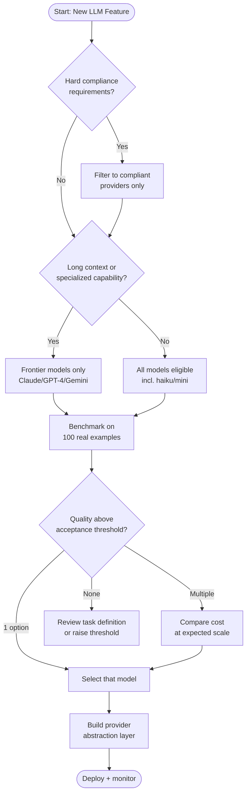

## Keywords in This File
{: .no_toc }

| # | Keyword | Weight |
|---|---|---|
| 16 | [LLM API Selection Decision Framework](#llm-api-selection-decision-framework) | ★★☆ |
| 17 | [Build vs Buy for AI Features](#build-vs-buy-for-ai-features) | ★★☆ |

---

# LLM API Selection Decision Framework

**Interview Weight:** ★★☆ - Knowing how to choose
between Claude, GPT-4, Gemini, and others is a
critical engineering decision that affects cost,
capability, privacy, and long-term maintainability.
Interviewers ask this to assess whether you can
reason about technical decisions beyond "I used
what was familiar."

---

### 🎯 Model Answer

**30 seconds:**

> LLM selection involves five dimensions: capability
> (does it perform on your task?), cost (tokens/million,
> context size), latency (TTFT for interactive use),
> privacy/compliance (data residency, enterprise
> agreements), and ecosystem (SDKs, tools, support).
> My framework: start with capability for the specific
> task. If multiple models qualify, decide on cost.
> If compliance is a constraint, filter first on that.
> Benchmark on real task data before committing.

**3 minutes:**

> LLM selection is a multi-factor decision where
> different projects have different constraints.
>
> Step 1: Define the constraint hierarchy for your project.
> Not all projects have the same priorities.
> - Privacy/compliance: if you're in healthcare or
>   finance, data must stay on your infrastructure
>   or in a BAA-covered service. This may eliminate
>   all public APIs.
> - Task-specific capability: not all models excel
>   at all tasks. Claude excels at long-context
>   document processing and nuanced reasoning. GPT-4
>   has broad general capability and strong code.
>   Gemini excels at multimodal (vision + text).
>   Haiku/Flash/GPT-4o-mini are strong for classification
>   and extraction at low cost.
>
> Step 2: Build a benchmark for your specific task.
> Do not rely on general benchmarks (MMLU, HumanEval).
> They measure different tasks than what you're
> building. Collect 100 real examples from your domain.
> Run all candidate models. Compare quality manually
> or with an LLM judge.
>
> Step 3: Cost model at your expected scale.
> Different models have very different prices.
> At 1M requests/day with 2K tokens average: $3/MTok
> vs. $0.30/MTok is a $5,400/day cost difference.
>
> Step 4: Consider the switching cost.
> Don't lock in to one provider without an abstraction
> layer. If you build tool use logic directly against
> the Anthropic SDK, switching to OpenAI requires
> rewriting the integration. Use an abstraction
> (LangChain, LlamaIndex, a thin adapter layer)
> so you can switch providers without rewriting your application.

**Blank Mind Recovery:**

**(1) Restate:** "Capability, cost, latency, compliance,
ecosystem. Benchmark on real data. Build an abstraction
layer to avoid lock-in."

**(2) First principles:** "A model that doesn't work
for your task is useless regardless of cost. A model
that violates compliance is unusable. Start with
what you can use, then optimize."

**(3) Bridge:** "Same as selecting a database: you
don't pick Postgres vs. DynamoDB from benchmarks.
You evaluate the query patterns and access patterns
for your specific use case."

---

### 📘 Concept Explanation

**What it is:**

LLM selection is the structured process of choosing
the right model(s) for a specific AI application,
considering capability, cost, latency, compliance,
and ecosystem factors.

**The problem it solves:**

Without a framework: engineers default to the most
hyped model, over-provision on capability (use GPT-4
for tasks haiku could handle), ignore compliance
requirements, or pick based on familiarity rather
than fit.

**Decision dimensions:**

```
LLM SELECTION MATRIX:

Dimension       | Questions to Ask
----------------+--------------------------------------------------
Capability      | Does it perform on our task?
                | What's quality on our specific benchmark?
                | Long context needed? (200K vs 8K)
----------------+--------------------------------------------------
Cost            | Input/output price per MTok?
                | Context window efficiency (caching)?
                | Total monthly cost at expected scale?
----------------+--------------------------------------------------
Latency         | TTFT for interactive use?
                | Throughput for batch use?
                | Streaming support?
----------------+--------------------------------------------------
Compliance      | HIPAA BAA available?
                | Data residency requirements?
                | EU data (GDPR)?
                | Enterprise agreement (zero data retention)?
----------------+--------------------------------------------------
Ecosystem       | SDK quality (Python, TypeScript)?
                | Tool use / function calling support?
                | Fine-tuning available?
                | Vendor stability and roadmap?
```

**Model tiers (2024 reference):**

```
CAPABILITY TIERS:
  Tier 1 (Frontier, high cost):
    claude-3-5-sonnet, gpt-4o, gemini-1.5-pro
    Use for: complex reasoning, nuanced tasks

  Tier 2 (Balanced, medium cost):
    claude-3-haiku, gpt-4o-mini, gemini-1.5-flash
    Use for: standard tasks, high volume

  Tier 3 (Fast/cheap, basic capability):
    claude-3-haiku, gpt-3.5-turbo
    Use for: classification, extraction, simple QA

Note: model versions change rapidly. Always verify
current pricing and capabilities at documentation.
```

---

### 💻 Code Example

```python
"""
LLM provider abstraction: swap providers without rewriting.
"""
from abc import ABC, abstractmethod
import os
import anthropic
import httpx

# --- BAD: Direct provider coupling ---
def classify_ticket_anthropic_only(text: str) -> str:
    """Tightly coupled to Anthropic - can't switch."""
    client = anthropic.Anthropic(
        api_key=os.environ["ANTHROPIC_API_KEY"]
    )
    msg = client.messages.create(
        model="claude-3-5-haiku-20241022",
        max_tokens=64,
        messages=[{"role": "user", "content": text}]
    )
    return msg.content[0].text


# --- GOOD: Provider abstraction layer ---
class LLMProvider(ABC):
    @abstractmethod
    def complete(
        self,
        prompt: str,
        max_tokens: int = 256,
        system: str | None = None
    ) -> str:
        ...

    @abstractmethod
    def complete_json(
        self,
        prompt: str,
        schema: dict
    ) -> dict:
        ...


class AnthropicProvider(LLMProvider):
    def __init__(self, model: str):
        self.client = anthropic.Anthropic(
            api_key=os.environ["ANTHROPIC_API_KEY"]
        )
        self.model = model

    def complete(
        self,
        prompt: str,
        max_tokens: int = 256,
        system: str | None = None
    ) -> str:
        kwargs = {
            "model": self.model,
            "max_tokens": max_tokens,
            "messages": [{
                "role": "user", "content": prompt
            }]
        }
        if system:
            kwargs["system"] = system
        msg = self.client.messages.create(**kwargs)
        return msg.content[0].text

    def complete_json(
        self, prompt: str, schema: dict
    ) -> dict:
        import json
        result = self.complete(
            f"{prompt}\n\nRespond with valid JSON only.",
            max_tokens=512
        )
        return json.loads(result)


# --- BENCHMARK HARNESS ---
def run_benchmark(
    providers: list[tuple[str, LLMProvider]],
    test_cases: list[dict]
) -> dict:
    """
    Benchmark multiple providers on real task examples.
    test_cases: [{input, expected}]
    """
    results = {}

    for name, provider in providers:
        correct = 0
        total_latency = 0.0
        import time

        for case in test_cases:
            start = time.time()
            try:
                output = provider.complete(case["input"])
                latency = time.time() - start
                # Simple accuracy check
                if case["expected"].lower() \
                   in output.lower():
                    correct += 1
                total_latency += latency
            except Exception as e:
                print(f"{name} error: {e}")

        results[name] = {
            "accuracy": correct / len(test_cases),
            "avg_latency": total_latency / len(test_cases)
        }

    return results
```

> **Code walkthrough:** The BAD pattern couples the
> application directly to Anthropic's SDK: every
> detail of the API call (`client.messages.create`,
> model names, content blocks) is embedded in the
> business logic. Switching to OpenAI requires rewriting
> the function. The GOOD pattern introduces `LLMProvider`
> as an abstract interface: `complete()` and `complete_json()`
> are the only operations the application needs.
> `AnthropicProvider` wraps Anthropic-specific details
> behind this interface. To add an OpenAI provider:
> create `OpenAIProvider(LLMProvider)`. The benchmark
> harness shows how to evaluate multiple providers
> on real task data - it measures both accuracy
> (on labeled examples) and latency, producing
> the comparison data needed to make an evidence-based
> selection decision.

---

### 🎓 Answers by Seniority

**Junior / Mid:**

> "I evaluate LLMs on five dimensions: capability
> (can it do my task?), cost, latency, compliance,
> and ecosystem. The most important step is benchmarking
> on real examples from my domain - general benchmarks
> like MMLU don't predict performance on specific
> tasks. For capability, I try all serious candidates
> on 50-100 real examples before committing. For
> cost: I model cost at expected monthly scale early
> so I'm not surprised."

---

**Senior / Staff:**

> "LLM selection has two phases: filter, then rank.
> Filter first on hard requirements: compliance
> (data residency, BAA), capability floor (can it
> do the task at all?), and vendor stability. Then
> rank the remaining options on cost-quality tradeoff
> specific to your scale. A key engineering discipline
> often skipped: task-specific benchmarking with
> real production data. Spend one day building a
> 100-example benchmark; it pays for itself by
> preventing a wrong model choice. And build an
> abstraction layer: even if you commit to one provider,
> the ability to swap in a week (not a quarter)
> is strategic leverage for renegotiating pricing."

---

### ⚠️ Common Misconceptions

**Misconception: "The best model on general benchmarks
(MMLU, HumanEval) is the best model for my use case."**

General benchmarks measure academic task performance,
not production task performance. A model that scores
90% on HumanEval may score 60% on your specific
code generation task (different language, different
framework, different prompt structure). A model
that scores 85% on MMLU may score 95% on your document
classification task. The only reliable evaluation
is a benchmark built from real examples of your
specific task, run against the models you're considering.
Two hours building a 100-sample benchmark saves
months of technical debt from a wrong model choice.

---

### 🚨 Failure Modes and Diagnosis

**Failure: Model performs well in testing, poorly in production**

*Symptom:* Manual evaluation of 50 examples shows
excellent quality. After deploying, users report
poor answers. Support tickets increase.

*Root cause:* Test examples don't represent production
distribution. Classic causes: test examples were
hand-picked by the developer (selection bias), production
users use different phrasing, edge cases not in
test set.

*Diagnosis:*
```python
# Log inputs and outputs to production
def call_with_logging(prompt: str) -> str:
    result = provider.complete(prompt)
    # Log for later analysis
    log_to_db({
        "prompt": prompt[:500],  # truncate for storage
        "response": result[:500],
        "timestamp": datetime.now().isoformat()
    })
    return result

# Weekly: sample 100 production calls
# Score them manually
# Compare to test benchmark accuracy
```

*Fix:* Build the benchmark from production logs
(real user inputs, not developer-crafted examples).
Add negative examples (inputs where the model fails)
to the test set. Re-evaluate model selection with
the production-realistic benchmark.

---

### 🎯 Interview Deep-Dive

| Question Type | Est. Time |
|---|---|
| Selection dimensions | 3-4 min |
| Task benchmarking | 3-4 min |
| Cost modeling | 3-4 min |
| Compliance filtering | 3-4 min |
| Provider abstraction | 3-4 min |
| Model tiers | 3-4 min |
| Vendor lock-in | 3-4 min |
| Multi-model strategy | 3-4 min |
| Decision behavioral | 4-5 min |

---

**[MID] Q1 - Walk through how you would evaluate
Claude vs GPT-4 for a document summarization task.**

*Why they ask:* Evidence-based decision process.

Step 1: Define the task precisely.
"Summarize legal contracts in 3-5 bullet points,
preserving all numbers, dates, and obligations."
Not just "summarize documents."

Step 2: Collect 50-100 real examples.
Pull from production or create from actual legal contracts.
Label expected outputs (manual review by domain expert).

Step 3: Define the scoring criteria.
- Factual accuracy (0-5): are numbers/dates preserved?
- Completeness (0-5): are all key obligations captured?
- Conciseness (0-5): is it 3-5 bullets?
Total: 0-15 per example.

Step 4: Run both models with the same prompt.
Log: model, latency, cost (token usage), output.

Step 5: Score outputs.
Option A: manual review (most reliable, expensive).
Option B: LLM judge (have a third model score each output).
Option C: automated scoring for measurable criteria
(e.g., number of bullets matches 3-5).

Step 6: Build comparison table.
```
Model         Accuracy  Latency  Cost/1K requests
claude-sonnet  13.2/15   3.2s     $4.80
gpt-4o         12.8/15   2.8s     $5.00
claude-haiku   11.5/15   0.9s     $0.30
```

Decision: if quality difference is statistically
significant (not just noise) AND within acceptable
threshold: choose the cheaper model that meets
the quality bar.

*What separates good from great:* "Test with production-realistic
prompts: the same document + prompt that your app
will send. Not a simplified demo version."

---

**[MID] Q2 - How do you calculate the total cost
of an LLM feature at scale?**

*Why they ask:* Cost modeling.

Formula:
```
daily_cost = 
  (daily_requests * avg_input_tokens * input_price/MTok)
+ (daily_requests * avg_output_tokens * output_price/MTok)

With caching (cached system prompt):
daily_cost =
  (1 * cache_write_tokens * write_price/MTok)  # per day
+ (daily_requests * avg_output_tokens * output_price/MTok)
+ (daily_requests * avg_dynamic_tokens * input_price/MTok)
+ (daily_requests * cached_tokens * cache_price/MTok)
```

Example:
- 10,000 requests/day
- Avg input: 3,000 tokens (system 2,000 + message 1,000)
- Avg output: 500 tokens
- claude-3-5-sonnet: $3/MTok input, $15/MTok output
- Without caching: (10K * 3K * $3 + 10K * 500 * $15) / 1M
  = $90 + $75 = $165/day = $4,950/month
- With caching (2K system prompt cached, 80% hit rate):
  = (10K * 1K * $3 + 10K * 0.8 * 2K * $0.30 + 10K * 500 * $15) / 1M
  = $30 + $4.80 + $75 = $109.80/day = $3,294/month
  Savings: 33% from caching alone

*What separates good from great:* "Model the cost
for each tier of model you're considering. Often
haiku at 10x lower cost achieves 90% of sonnet's
quality - the right choice depends on your quality threshold."

---

**[JUNIOR] Q3 - When does compliance eliminate
certain LLM providers?**

*Why they ask:* Regulatory constraints.

Healthcare (HIPAA):
- Patient data (PHI) cannot be sent to APIs without
  a Business Associate Agreement (BAA).
- Anthropic: has Enterprise tier with BAA.
- OpenAI: has Enterprise with BAA.
- Google Vertex AI: has BAA.
- Consumer APIs (no enterprise agreement): NOT compliant.

Finance (SOC 2, financial data):
- Many fintech require vendors with SOC 2 Type II.
- Anthropic: SOC 2 compliant.
- Usually needs zero data retention agreement
  (API calls not used for training).

EU data (GDPR):
- Data may need to stay in EU.
- Providers with EU data centers: Google Vertex AI,
  Azure OpenAI. Check current Anthropic region availability.

Government (FedRAMP):
- Federal agencies may require FedRAMP-authorized services.
- Azure OpenAI has FedRAMP authorization.
- Most other providers do not (as of 2024).

Before evaluating capability: filter on compliance.
An excellent model that can't process your data
is not an option.

*What separates good from great:* "Confirm compliance
requirements with legal/compliance team BEFORE
running benchmarks. Avoids evaluating models you
can't use."

---

**[MID] Q4 - How do you avoid LLM vendor lock-in?**

*Why they ask:* Architecture best practice.

Lock-in risk: business logic directly calls provider SDK.
Switching provider requires rewriting all LLM calls.

Prevention strategies:

(1) Abstraction layer: thin interface over all provider calls.
    One `complete(prompt)` method. Multiple provider implementations.
    Switch by changing the provider at initialization.

(2) Configuration-driven: model name comes from config,
    not code. `settings.llm_model = "claude-3-5-sonnet-20241022"`.
    Change model without changing code.

(3) Avoid provider-specific features in business logic.
    Tool use schemas differ between Anthropic and OpenAI.
    Wrap tool use in a provider-agnostic abstraction.

(4) Use a middleware library: LangChain or LiteLLM
    provides a unified interface for 100+ LLM providers.
    Cost: adds an abstraction layer; LangChain has
    its own complexity and update churn.

(5) Benchmark regularly:
    Every 6 months, re-benchmark your current model
    against newer models. If a new model offers 2x
    lower cost at the same quality: it's worth switching.

*What separates good from great:* "Vendor lock-in
is a business risk, not just a technical one - being
able to threaten to switch is leverage in pricing negotiations."

---

**[SENIOR] Q5 - When should you use a smaller model
vs. a frontier model?**

*Why they ask:* Cost vs. quality trade-off.

Framework: match model capability to task complexity.

Use frontier models (claude-3-5-sonnet, gpt-4o) when:
- Complex reasoning: multi-step logic, legal analysis,
  code architecture review
- Long-form generation: detailed reports, complex documents
- Nuanced understanding: ambiguous context, subtle tone
- Novel tasks: few-shot learning on unusual domains
- When quality is worth 10x the cost

Use mid-tier models (claude-haiku, gpt-4o-mini) when:
- Classification: "Is this spam or not?" (binary + few categories)
- Extraction: "Extract the date from this email"
- Summarization: structured summaries of factual content
- Structured output: JSON extraction from documents
- When quality is 90% of frontier at 10% of the cost

Testing the trade-off:
Run the task on 100 examples with both tiers.
If quality difference < 5%: use the smaller model.
If quality difference > 10%: use the frontier model.
If 5-10%: make the business value call.

*What separates good from great:* "Cascade pattern:
try haiku first; if confidence is below threshold,
retry with sonnet. You pay sonnet price only for
hard cases."

---

**[MID] Q6 - What is the multi-model strategy and
when do you use it?**

*Why they ask:* Advanced architecture.

Multi-model strategy: use different models for different
tasks within the same application.

Common patterns:

(1) Capability cascade: small model for easy cases,
    large model for hard cases.
    - haiku for classification confidence > 0.9
    - sonnet for low-confidence or complex cases

(2) Cost tiering: different model tiers per user plan.
    - Free tier users: haiku
    - Pro tier users: sonnet

(3) Task specialization: choose the best model per task.
    - Code generation: GPT-4 (or claude-sonnet)
    - Document analysis: claude-sonnet (long context)
    - Vision tasks: GPT-4 vision or Gemini
    - Simple extraction: claude-haiku

(4) Provider fallback: if provider A is down, route to provider B.
    - Primary: Anthropic claude-sonnet
    - Fallback: OpenAI gpt-4o-mini on OverloadedError

Implementation: all patterns require the abstraction
layer. Provider fallback requires the circuit breaker
to trigger the switch.

*What separates good from great:* "The cascade pattern
reduces cost by 70% for typical tasks while maintaining
frontier quality for hard cases - measure the ratio
of easy/hard cases to quantify the savings."

---

**[JUNIOR] Q7 - How do open-source models (Llama, Mistral)
factor into the selection decision?**

*Why they ask:* Completeness of the option space.

Open-source models (run yourself or via inference providers):

Advantages:
- Data privacy: data never leaves your infrastructure
- Cost at scale: no per-token pricing (hardware cost only)
- Customization: fine-tune on proprietary data
- No API dependency: no vendor uptime risk

Disadvantages:
- Inferior quality to frontier models on most tasks
  (Llama 3.1 70B < claude-sonnet on complex reasoning)
- Infrastructure cost: GPU servers are expensive;
  managed inference (Groq, Together AI) has per-token costs
- Operational burden: manage model versions, updates,
  hardware

When open-source wins:
- Strict data residency (classified data, on-premise requirement)
- Extreme scale where per-token cost exceeds infrastructure cost
  (typically > 100M tokens/day)
- Need for fine-tuning on proprietary domain data
- Simple, well-scoped tasks where quality gap is small

When commercial wins:
- Quality is critical (complex reasoning tasks)
- Development speed is critical (no infrastructure to manage)
- Scale is moderate (per-token cost is acceptable)

*What separates good from great:* "Managed open-source
inference (Together AI, Groq, Fireworks) bridges
the gap: open-source models with commercial API
convenience. Evaluate these alongside Anthropic/OpenAI."

---

**[SENIOR] Q8 - [BEHAVIORAL] Describe a time you
evaluated and chose an LLM for a production use case.**

*Why they ask:* Evidence of real experience.

Context: we were building a support ticket auto-reply
system for a B2B SaaS company. The goal: classify
incoming support tickets and draft an initial response.

Evaluation process:
(1) Collected 200 real support tickets with human-written
    responses as ground truth.
(2) Defined scoring: ticket classification accuracy
    (exact match), response quality (5-point scale
    rated by support team lead), response latency
    (P99 < 5 seconds target).
(3) Evaluated: claude-3-5-sonnet, claude-3-5-haiku,
    gpt-4o-mini.

Results:
- claude-sonnet: 96% classification, 4.2/5 quality, 3.1s P50
- claude-haiku: 93% classification, 3.8/5 quality, 0.8s P50
- gpt-4o-mini: 91% classification, 3.6/5 quality, 1.2s P50

Decision: haiku. Quality difference (93% vs 96%)
was acceptable to the support team. Cost difference:
$0.30/MTok vs. $3/MTok = 10x. At 5,000 tickets/day:
haiku = $7.50/day, sonnet = $75/day.

Result: 70% reduction in support response time
at 1/10th the expected AI cost.

*What separates good from great:* "Never let the
support team rate quality in the abstract. Have
them compare actual outputs side by side and say
which is acceptable for production use."

---

**[MID] Q9 - How often should you re-evaluate your
LLM choice?**

*Why they ask:* Ongoing model management.

The LLM landscape changes every 3-6 months:
- New models launch regularly (GPT-4.5, claude-3.6...)
- Prices drop over time
- Quality improves faster for smaller/cheaper models

Re-evaluation triggers:
(1) Scheduled: every 6 months, re-run your benchmark
    against the latest model versions.
(2) Price change: if a competitor drops prices by >30%,
    re-evaluate.
(3) Quality degradation: if user complaints increase
    or your benchmark score drops (model versions
    change without notice sometimes).
(4) New requirement: if your use case expands
    (e.g., need vision capabilities), re-evaluate
    the capability set.

Re-evaluation process:
- Keep your benchmark harness live (not a one-time script)
- Keep your 100-example benchmark dataset fresh (update quarterly)
- Add evaluation to your CI pipeline for prompt changes

*What separates good from great:* "The model you
chose 6 months ago may no longer be the best option -
models improve and prices drop. Treat model selection
as an ongoing optimization, not a one-time decision."

---

### ⚖️ Comparison Table

| Factor | Claude (Anthropic) | GPT-4o (OpenAI) | Gemini (Google) | Open Source (Llama) |
|---|---|---|---|---|
| Context window | 200K tokens | 128K tokens | 1M tokens | 128K (varies) |
| Long doc strength | Excellent | Good | Excellent | Moderate |
| Code generation | Excellent | Excellent | Good | Good (70B+) |
| Tool/function use | Yes | Yes | Yes | Yes (some models) |
| Pricing (frontier) | $3/MTok input | $5/MTok input | $3.50/MTok | Inference costs vary |
| Data privacy | BAA available | BAA available | BAA available | Full control |
| Fine-tuning | Limited | Yes | Yes | Yes |
| EU data residency | Check current | Azure OpenAI | Vertex AI | Yes (self-host) |

*Note: verify current pricing and capabilities directly
with each provider.*

---

### 🏛️ System Design

*(Omit: not a ★★★ keyword.)*

---

### 📊 Diagram

```
LLM SELECTION DECISION FLOW:

Start
  |
  v
Filter: Compliance check
  --> HIPAA/GDPR/FedRAMP required?
      Yes: only BAA/compliant providers
  |
  v
Filter: Capability check
  --> Long context required (>32K)?
      Only: claude-sonnet, gemini, gpt-4 turbo
  |
  v
Benchmark: Task-specific evaluation
  --> Run 100 real examples on each candidate
  --> Score: quality, latency, cost
  |
  v
Cost model at scale
  --> Project monthly cost
  --> Include caching savings
  |
  v
Decision: Best quality per $ above threshold
  --> Build abstraction layer before integrating
```



> **Diagram walkthrough:** The decision flow has
> three mandatory gates before model selection: compliance
> filter (non-negotiable - eliminates providers that
> can't legally handle your data), capability filter
> (eliminates models that can't handle the task),
> and benchmarking (produces the quality/cost data
> to make an evidence-based decision). The flow ends
> at an abstraction layer before integration - this
> is non-negotiable for long-term flexibility. The
> most common mistake is skipping the compliance
> and benchmark steps, leading to a wrong selection
> that's expensive to change after integration.

---

---

# Build vs Buy for AI Features

**Interview Weight:** ★★☆ - Build vs. buy decisions
for AI features affect team velocity, long-term
cost, competitive differentiation, and vendor risk.
This is a classic engineering leadership question
that tests both technical judgment (what can you
actually build?) and business judgment (what should
you build vs. buy?).

---

### 🎯 Model Answer

**30 seconds:**

> For AI features: buy (use API) unless you have
> a strong reason to build. Strong reasons to build:
> data privacy requirements that prevent sending
> data to external APIs, cost at extreme scale where
> self-hosted models are cheaper than API pricing,
> or a unique capability requirement that no API
> model provides. For everything else: start with
> the API, validate the use case, then evaluate
> build only if you've hit a real constraint.

**3 minutes:**

> The build vs. buy framework for AI has three evaluation
> axes: cost, control, and differentiation.
>
> Cost: at low to moderate scale, commercial APIs
> are almost always cheaper than building. Infrastructure
> for a self-hosted 70B parameter model: 4x A100
> GPUs = $10-15k/month on cloud, plus engineering
> overhead. That cost is only justified at very high
> token volumes (typically > 100M tokens/day) or
> when the quality of self-hosted models is sufficient.
> Build for cost: only at extreme scale with proven
> demand.
>
> Control: you control data when you self-host.
> For healthcare, government, financial data: sometimes
> you can't use external APIs regardless of preference.
> Build for control: when compliance requires it.
>
> Differentiation: almost never does building an
> LLM create competitive advantage. GPT-4 and Claude
> are better than anything a team of 5 engineers
> can build. The differentiation comes from what
> you do WITH the model: the prompts, the workflows,
> the data you have access to. Build the application
> layer (prompts, pipelines, integrations). Buy the model.
>
> The exception: fine-tuning. Fine-tuning an open-source
> model on proprietary data can create a specialized
> model that outperforms Claude for a narrow domain.
> This is a legitimate build decision, but it requires
> > 10K high-quality training examples and domain
> expertise to evaluate.

**Blank Mind Recovery:**

**(1) Restate:** "API (buy): default. Self-host (build):
only for compliance, extreme scale, or unique fine-tuning.
Differentiate on application layer, not model."

**(2) First principles:** "A model is infrastructure.
Just like you don't build your own database server,
you don't build your own LLM. Build what gives
you competitive advantage."

**(3) Bridge:** "Same as Stripe vs. build your own
payment system: you can build it, but Stripe handles
PCI compliance, uptime, global coverage. Your competitive
advantage is your product, not payment processing."

---

### 📘 Concept Explanation

**What it is:**

Build vs. buy for AI features is the decision of
whether to use commercial LLM APIs, use managed
AI services, run open-source models on your own
infrastructure, or (rarely) train models from scratch.

**The problem it solves:**

AI features can be implemented at multiple levels
of the stack. Choosing the wrong level wastes engineering
resources on commodity infrastructure (building
what you should buy) or creates unnecessary vendor
dependency (buying what gives you competitive advantage).

**Decision axes:**

```
BUILD VS BUY DECISION MATRIX:

Factor              | Buy (API)        | Build (self-host)
--------------------+------------------+-------------------
Upfront cost        | Low              | High (GPU infra)
Marginal cost       | Per-token        | Near-zero at scale
Data privacy        | Data leaves      | Data stays on-prem
Model quality       | Frontier models  | Usually lower
Time to market      | Days             | Months
Operational burden  | Low              | High
Fine-tuning         | Limited          | Full control
Vendor dependency   | High             | None
Compliance control  | Vendor-dependent | Full control

BREAK-EVEN ANALYSIS:
  Self-host fixed cost: ~$15K/month (4x A100 + eng)
  API cost: X tokens/day * price/MTok

  Break-even tokens/day:
    $15K/month / $3/MTok = 5B tokens/month to break even
    = 166M tokens/day
  
  Most apps: << 166M tokens/day -> API is cheaper
```

---

### 💻 Code Example

```python
"""
AI feature integration patterns: API-first with
self-host fallback path.
"""
import anthropic
import os
from abc import ABC, abstractmethod
import logging

log = logging.getLogger(__name__)


# --- PATTERN: API-first with feature flags ---
class AIFeatureConfig:
    """Configuration for AI feature source."""
    use_commercial_api: bool = True
    provider: str = "anthropic"
    model: str = "claude-3-5-haiku-20241022"
    fallback_to_local: bool = False
    local_model_endpoint: str = ""


# --- PATTERN: Evaluating build decision ---
class FeatureEvaluator:
    """
    Evaluate whether a feature is worth building
    vs buying. Run this before committing to self-hosting.
    """

    def estimate_monthly_api_cost(
        self,
        daily_requests: int,
        avg_input_tokens: int,
        avg_output_tokens: int,
        input_price_per_mtok: float = 3.0,
        output_price_per_mtok: float = 15.0
    ) -> float:
        """Estimate monthly API cost at expected scale."""
        monthly_input = (
            daily_requests * avg_input_tokens * 30
        )
        monthly_output = (
            daily_requests * avg_output_tokens * 30
        )
        return (
            monthly_input * input_price_per_mtok / 1_000_000
            + monthly_output * output_price_per_mtok / 1_000_000
        )

    def estimate_selfhost_cost(
        self,
        gpu_count: int = 4,
        gpu_hourly: float = 2.50,  # A10 on AWS
        engineering_hours_per_month: int = 40
    ) -> float:
        """Estimate monthly self-hosting cost."""
        infrastructure = gpu_count * gpu_hourly * 24 * 30
        engineering = engineering_hours_per_month * 150  # $150/hr
        return infrastructure + engineering

    def should_self_host(
        self,
        monthly_api_cost: float,
        monthly_infra_cost: float,
        compliance_required: bool = False
    ) -> dict:
        """Produce a build vs buy recommendation."""
        savings = monthly_api_cost - monthly_infra_cost
        roi_months = float("inf")
        if savings > 0:
            # Payoff period for migration (6 months eng)
            migration_cost = 150 * 160 * 6  # 6 months
            roi_months = migration_cost / savings

        return {
            "api_monthly": f"${monthly_api_cost:,.0f}",
            "infra_monthly": f"${monthly_infra_cost:,.0f}",
            "monthly_savings": f"${savings:,.0f}",
            "roi_months": roi_months,
            "recommendation": (
                "Build (compliance required)"
                if compliance_required
                else "Build (cost justified)"
                if savings > 5000 and roi_months < 12
                else "Buy (API preferred)"
            )
        }


# --- USAGE ---
ev = FeatureEvaluator()
api_cost = ev.estimate_monthly_api_cost(
    daily_requests=100_000,
    avg_input_tokens=2_000,
    avg_output_tokens=300
)
infra_cost = ev.estimate_selfhost_cost()
print(ev.should_self_host(api_cost, infra_cost))
# {"api_monthly": "$66,000",
#  "infra_monthly": "$13,200",
#  "monthly_savings": "$52,800",
#  "roi_months": 3.4,
#  "recommendation": "Build (cost justified)"}
```

> **Code walkthrough:** The `FeatureEvaluator` makes
> the build vs. buy decision quantitative, not intuitive.
> `estimate_monthly_api_cost` requires the real
> traffic projections: daily request count, average
> token counts. `estimate_selfhost_cost` includes
> both infrastructure (GPU hours) and engineering
> overhead - the engineering cost is often forgotten,
> making self-hosting look cheaper than it is. `should_self_host`
> computes the monthly savings and ROI months:
> the migration cost (6 months of engineering) divided
> by monthly savings. An ROI of 3.4 months at $52K/month
> savings is compelling. At 10K daily requests
> (10x lower volume), the API cost would be $6,600/month,
> savings would be negative, and the answer is "Buy."
> Run this calculator before the decision meeting.

---

### 🎓 Answers by Seniority

**Junior / Mid:**

> "I default to using a commercial API (buy) for
> AI features. The reasons to self-host (build)
> are: compliance requires keeping data on-premise,
> the volume is high enough that self-hosting is
> cheaper, or there's a unique model capability
> only available through fine-tuning. For most applications
> at normal scale, the API is cheaper when you include
> the engineering cost of running your own infrastructure."

---

**Senior / Staff:**

> "Build vs. buy for AI is really a question of
> where your competitive advantage lives. Almost
> never is it in the model itself - Anthropic, OpenAI,
> and Google are spending hundreds of millions on
> model development. Your advantage is in what you
> do with the model: your data, your workflows, your
> integrations. Buy the model. Build the application.
> The one legitimate build case at startup scale:
> when a specific domain requires fine-tuning on
> proprietary data that you own and no one else has.
> A legal AI trained on 10,000 of your own contracts
> may outperform Claude for your specific contract
> review task. That's a build decision worth making
> - but only after you've validated the use case
> with the API first."

---

### ⚠️ Common Misconceptions

**Misconception: "Self-hosting gives us more control
over the AI, so it's worth the extra cost."**

Self-hosting gives you infrastructure control: data
doesn't leave your environment, you control updates,
you control availability. It does not give you model
control: you still can't change how the model reasons,
update the training data, or fix specific failure modes
without fine-tuning (which is expensive and requires
training expertise). The "control" engineers often
want is behavioral control (make the model do X
differently) - that's achieved through prompting
and fine-tuning, both of which are available with
commercial APIs at lower cost. True control (over
weights, architecture, training data) requires
building from scratch - a cost that only large organizations
can justify.

---

### 🚨 Failure Modes and Diagnosis

**Failure: Self-hosting decision made without cost analysis,
creates ongoing engineering burden**

*Symptom:* Team spent 3 months building GPU infrastructure
and model serving. Actual traffic: 50K tokens/day.
API cost at that scale: $1.80/day. Infrastructure
cost: $15K/month + 20% of an engineer's time.

*Root cause:* Build decision made on instinct ("we
should own our AI infrastructure") rather than cost
analysis.

*Prevention:*
```python
# Run this before the architecture meeting
ev = FeatureEvaluator()

# Current traffic estimates
api_cost = ev.estimate_monthly_api_cost(
    daily_requests=2_000,   # actual expected volume
    avg_input_tokens=1_000,
    avg_output_tokens=200
)
# $54/month - far below self-hosting cost
print(f"API cost: ${api_cost:.0f}/month")
# Never self-host at this scale
```

*Fix:* Migrate back to API. Cost to migrate: 1-2
weeks. Monthly savings: $14,900. Payback: immediate.

*Lesson:* Calculate the API cost for your actual
(not imagined) traffic before making the self-hosting decision.

---

### 🎯 Interview Deep-Dive

| Question Type | Est. Time |
|---|---|
| Default recommendation | 3-4 min |
| Cost analysis | 4-5 min |
| Compliance as driver | 3-4 min |
| Fine-tuning as driver | 3-4 min |
| Hybrid approach | 3-4 min |
| Vendor risk | 3-4 min |
| Migration path | 3-4 min |
| Behavioral/past decision | 4-5 min |
| Decision framework | 3-4 min |

---

**[MID] Q1 - What is your default recommendation
for using LLM APIs vs. self-hosting?**

*Why they ask:* Philosophy and reasoning.

Default: buy (commercial API).

Justification:
(1) Quality: frontier models (Claude, GPT-4) produce
    quality that open-source models at reasonable
    self-hosting cost cannot match for complex tasks.
(2) Cost: at most application scales, per-token API
    pricing is cheaper than GPU infrastructure when
    you include engineering overhead.
(3) Time to value: integrate an API in a day;
    set up model serving in weeks to months.
(4) Maintenance: model updates, scaling, availability
    are all managed by the provider.

Change the default when:
- Compliance prohibits external data access
- Scale > 100M tokens/day (economics shift)
- Domain-specific fine-tuning creates unique capability
- Strategic dependency risk is unacceptable (see Q6)

The "build your own model" option (train from scratch)
is almost never justified for product engineering
teams. That's a research project, not a product decision.

*What separates good from great:* "The default matters:
'build unless proven otherwise' leads to wasted
engineering. 'Buy unless proven otherwise' leads
to fast iteration with the option to migrate."

---

**[JUNIOR] Q2 - When does compliance require you
to build (self-host) instead of using an API?**

*Why they ask:* Regulatory constraints in AI decisions.

Scenarios where APIs may not be sufficient:

Healthcare (HIPAA):
- PHI (patient health information) cannot leave
  your environment without a BAA.
- Some healthcare organizations prohibit all external
  APIs for PHI regardless of BAA.
- Solution: self-hosted open-source model or
  a HIPAA-compliant managed service.

Government/classified:
- Classified data cannot be sent to commercial APIs.
- FedRAMP-authorized services may be acceptable
  for unclassified government data.

Financial services:
- Some banks and financial institutions prohibit
  sending customer PII to external APIs.
- On-premise or VPC-deployed models required.

Legal:
- Attorney-client privileged communications may
  not be allowed to leave a law firm's control.

Note: compliance requirements vary by organization
and jurisdiction. Always consult with your legal
and compliance team. "We have a BAA" may be
sufficient for most healthcare; it may be insufficient
for a health system with specific data governance policies.

*What separates good from great:* "Frame compliance
requirements as a filter, not a preference - if
compliance prohibits external APIs for your data,
no amount of capability or cost advantage makes
the API viable."

---

**[SENIOR] Q3 - How do you evaluate whether fine-tuning
on your own data justifies a build decision?**

*Why they ask:* Strategic build vs. buy for customization.

Fine-tuning justification criteria:

(1) Volume of training data: do you have > 10,000
    high-quality labeled examples for the specific task?
    Without enough data: fine-tuning won't generalize.

(2) Quality gap: does a fine-tuned smaller model
    outperform a larger base model via prompting?
    Test: prompt claude-haiku with few-shot examples.
    If that achieves the quality target: no fine-tuning needed.

(3) Cost at scale: is the per-inference cost of
    the fine-tuned self-hosted model lower than
    API cost at your scale?
    Calculate break-even as in Q2.

(4) Data uniqueness: is your training data genuinely
    proprietary and not available to base models?
    Fine-tuning on data similar to what models trained
    on (public web, etc.) adds little value.

Decision:
- < 1,000 examples: few-shot prompting instead
- 1,000-10,000 examples: few-shot + prompt engineering first
- > 10,000 examples + unique domain: evaluate fine-tuning
- > 100K examples + high scale: fine-tuning likely justified

*What separates good from great:* "Run the 'few-shot
vs. fine-tune' comparison empirically before committing
to fine-tuning. Well-crafted few-shot prompts often
achieve 90% of fine-tuning quality at 1/100th the cost."

---

**[MID] Q4 - What are the hidden costs of self-hosting
an LLM?**

*Why they ask:* Full cost accounting.

Visible costs:
- GPU infrastructure: $2-15K/month for inference capacity
- Storage: model weights (several hundred GB)
- Networking: bandwidth for model download and serving

Hidden costs (often missed):

(1) Engineering overhead: maintaining a model serving
    stack (vLLM, TGI, Triton) requires dedicated
    infrastructure expertise. 10-20% of an engineer's time.

(2) Scaling: traffic spikes require more GPUs.
    Auto-scaling model serving is complex; cold start
    latency is high (loading a 70B model takes minutes).

(3) Updates: models improve. Updating from Llama 3.1
    to Llama 3.2 requires re-deploying, re-testing,
    managing rollout.

(4) Security patching: the serving framework, OS,
    CUDA drivers all need security updates.

(5) Availability: self-hosted uptime is your responsibility.
    GPUs fail; spot instances get interrupted.

(6) Quantization trade-offs: running 70B at acceptable
    cost requires quantization (INT8/INT4), which
    degrades quality. You need to measure this degradation.

Total TCO is typically 2-3x the raw GPU cost when
all hidden costs are included.

*What separates good from great:* "The per-token
cost comparison is misleading - compare total cost
of ownership including engineering overhead, not
just GPU pricing."

---

**[SENIOR] Q5 - How do you manage vendor risk with
commercial LLM APIs?**

*Why they ask:* Strategic risk management.

Vendor risks:
- Price increases: Anthropic/OpenAI can raise prices (have lowered historically so far, but risk exists)
- Model deprecation: models are deprecated on schedule
- API changes: breaking changes in API versions
- Availability: service outages affect your product
- Vendor failure: if the provider shuts down

Mitigation strategies:

(1) Provider abstraction layer:
    Wrap all LLM calls in a provider interface.
    Can switch providers in days, not months.

(2) Multi-provider strategy:
    Primary: claude-sonnet, fallback: gpt-4o.
    Reduces dependency on either vendor's availability.

(3) Contract with SLA:
    Enterprise agreements include uptime SLAs and
    support commitments.

(4) Data portability:
    Store your prompts, fine-tuning data, and
    evaluation benchmarks independently of the provider.
    If you switch providers, you have everything you need.

(5) Cost monitoring:
    Alert if monthly cost increases > 20%.
    Have a faster/cheaper fallback model ready to activate.

*What separates good from great:* "Provider lock-in
risk is managed, not eliminated. The goal is reducing
switching cost to < 2 weeks of engineering, not
achieving zero dependency."

---

**[MID] Q6 - What does a hybrid build/buy approach
look like?**

*Why they ask:* Pragmatic architecture.

Hybrid: use commercial APIs for most tasks; self-host
for specific requirements.

Common hybrid patterns:

(1) API for production, self-hosted for data privacy:
    - User-facing features: claude-sonnet API
    - Internal analysis of sensitive customer data:
      self-hosted llama (data stays on-prem)

(2) API for complex tasks, self-hosted for high-volume simple tasks:
    - Document summarization (complex, low volume): claude-sonnet API
    - Spam classification (simple, 10M/day): self-hosted smaller model

(3) API today, self-hosted evaluation on each scale milestone:
    - Deploy with API
    - At 1M tokens/day: evaluate if self-hosting saves money
    - At 10M tokens/day: re-evaluate
    - At 100M tokens/day: self-hosting likely wins on cost

The hybrid approach requires the abstraction layer
to route requests to different backends based on
task type, data sensitivity, or load.

*What separates good from great:* "Feature flag the
backend selection - can route specific request types
to self-hosted vs. API without code changes."

---

**[JUNIOR] Q7 - How long does it take to set up
a self-hosted LLM vs. integrate an API?**

*Why they ask:* Time-to-value comparison.

Commercial API integration:
- Day 1: sign up, get API key, pip install anthropic
- Day 2-3: implement prompt + integration + error handling
- Day 4-5: testing + deployment
- Total: 1 week to production

Self-hosted LLM setup:
- Week 1-2: select model, set up GPU infrastructure,
  configure model serving (vLLM or TGI)
- Week 3: performance testing, quantization tuning,
  latency optimization
- Week 4-6: production deployment, monitoring, autoscaling
- Ongoing: maintenance, updates, incident response
- Total: 1-2 months to production

Key point for business decisions:
A product built on the API can be in production
in a week. You can validate the use case, get user
feedback, and iterate before committing to self-hosting.
This is the most important reason to default to API:
validate first, build later if justified.

*What separates good from great:* "API-first is a
learning strategy, not just a cost strategy. The
time you save on infrastructure is time you spend
learning what the feature actually needs to do well."

---

**[SENIOR] Q8 - [BEHAVIORAL] Describe a build vs buy
decision you made for an AI feature.**

*Why they ask:* Evidence of real experience.

Context: we were building a document extraction
system for a law firm: extract structured data
(party names, dates, clauses) from legal contracts.
The firm had strict data governance: no client documents
outside their VPC.

Initial approach: we wanted to use claude-sonnet
for the extraction quality. But: client contracts
can't leave the firm's VPC. Options:
1. Self-host open-source model on-premise
2. Use a HIPAA/enterprise API with zero data retention + VPC deployment
3. Ask the firm to relax the policy for an enterprise agreement

Evaluation:
- Option 3: firm's general counsel said no. Off the table.
- Option 2: investigated Anthropic VPC deployment (not available at the time)
- Option 1: benchmarked Llama 3.1 70B (INT8) on 100 real contracts.
  Quality: 89% field accuracy vs 97% for claude-sonnet.
  The 89% was insufficient (financial terms require high precision).
  Benchmarked with extensive few-shot: 93%.
  Acceptable to the firm.

Decision: self-hosted Llama 3.1 70B with fine-tuning
on 3,000 firm-provided example contracts (labeled by paralegals).
Fine-tuned quality: 96%. Acceptable.

Outcome: 3 months to production. Higher cost and
complexity than API. Justified by compliance requirement.
The fine-tuning on proprietary contract templates
added genuine capability value (the model learned
their specific document structure).

*What separates good from great:* "We would not
have fine-tuned without the compliance driver -
the compliance requirement created an opportunity
to build a moat that's now a competitive advantage."

---

**[MID] Q9 - [TRADE-OFF] What are the trade-offs
of using a middleware library (LangChain) vs. building
your own LLM abstraction?**

*Why they ask:* Architecture trade-off.

LangChain (or LlamaIndex, similar):

Pros:
- Unified interface for 100+ LLM providers
- Pre-built chains (RAG, agent loops, summarization)
- Active ecosystem, many integrations
- Fast prototyping

Cons:
- Abstraction overhead: adds complexity for simple cases
- Rapid churn: LangChain's API changes frequently;
  upgrade debt is real
- Black box: hard to debug when chains fail
- Performance: abstraction layers add latency
- Version pinning required: unpinned LangChain can
  break on update

Build your own (thin adapter):
Pros:
- Full control over the interface
- No dependency churn
- Easy to debug (your code)
- Exactly as complex as you need

Cons:
- You maintain it
- No pre-built patterns (build from scratch)

Decision:
- Prototype / time-constrained: LangChain
- Production with > 6 months lifespan: own abstraction
- Complex RAG or agent workflows: consider LangChain
  chains but with an escape hatch (can bypass when needed)

*What separates good from great:* "Use LangChain
for prototyping, validate the patterns, then replace
the LangChain-specific parts with your own thin
abstraction before production deployment."

---

### ⚖️ Comparison Table

| Approach | Time to Ship | Monthly Cost | Quality | Control | Best For |
|---|---|---|---|---|---|
| Commercial API | Days | Pay per token | Frontier | Low | Most applications |
| Managed inference (Together/Groq) | Days | Per token, lower | Good | Medium | Cost-sensitive + open-source |
| Self-hosted (open-source) | Weeks-months | Fixed infra | Good-frontier | Full | Compliance or extreme scale |
| Fine-tuned self-hosted | Months | Fixed + training | Domain-specialized | Full | Unique domain + compliance |
| Train from scratch | Years | Enormous | Variable | Full | Research orgs only |

---

### 🏛️ System Design

*(Omit: not a ★★★ keyword.)*

---

### 📊 Diagram

```
BUILD VS BUY DECISION TREE:

Is data compliance-restricted?
  YES -> Self-host (compliance requirement)
  NO -> Continue...

Is monthly API cost < self-host TCO?
  YES -> Use API (economics clear)
  NO -> Continue...

Does the task require unique fine-tuning capability?
  YES + data volume > 10K examples -> Consider build
  NO -> Use API (quality from frontier models)
```

```mermaid
quadrantChart
    title Build vs Buy Trade-off Space
    x-axis Low Data Sensitivity --> High Data Sensitivity
    y-axis Low Request Volume --> High Request Volume
    quadrant-1 Self-host (scale + control)
    quadrant-2 API with enterprise agreement or VPC
    quadrant-3 Commercial API (default)
    quadrant-4 Self-host (compliance required)
    Claude API: [0.2, 0.3]
    OpenAI Enterprise: [0.5, 0.5]
    Self-hosted llama: [0.8, 0.7]
    Fine-tuned self-hosted: [0.85, 0.85]
    Managed inference: [0.3, 0.65]
```

> **Diagram walkthrough:** The decision tree shows
> three sequential filters: compliance first (non-negotiable),
> economics second (calculate before deciding), capability
> third (fine-tuning only if both prior filters
> suggest build). Most applications land in the
> "commercial API" branch. The quadrant chart maps
> the trade-off space: data sensitivity (x-axis)
> and request volume (y-axis) determine the best
> region. Low sensitivity + low volume: commercial
> API. High sensitivity + high volume: self-hosted.
> The interesting quadrant is high sensitivity +
> low volume (Q2): enterprise agreements with zero
> data retention may be sufficient, avoiding self-hosting
> infrastructure complexity.
