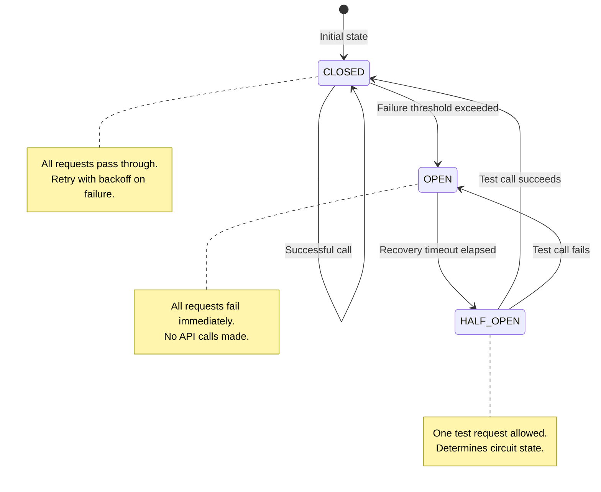
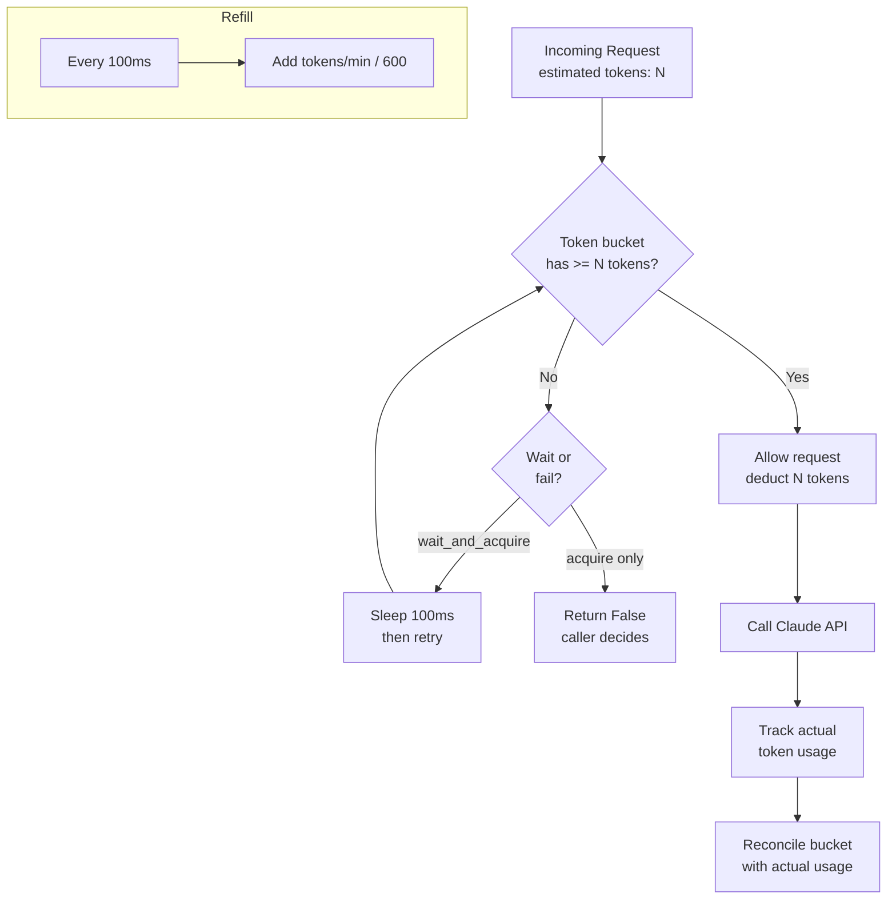

## Keywords in This File
{: .no_toc }

| # | Keyword | Weight |
|---|---|---|
| 14 | [LLM API Error Handling and Retry Strategy](#llm-api-error-handling-and-retry-strategy) | ★★☆ |
| 15 | [Rate Limiting and Quota Management](#rate-limiting-and-quota-management) | ★★☆ |

---

# LLM API Error Handling and Retry Strategy

**Interview Weight:** ★★☆ - LLM API errors are
frequent in production. Claude API documentation
lists six error types; knowing which are retryable,
which retry timelines to use, and how to build a
resilient retry pipeline separates engineers who
ship stable AI features from those who ship brittle demos.

---

### 🎯 Model Answer

**30 seconds:**

> LLM APIs return six main error types. Two are
> retryable with exponential backoff: `overloaded_error`
> (503) and `api_error` (500). Two require immediate
> abort: `invalid_request_error` (400, fix the input)
> and `authentication_error` (401, fix the key).
> `rate_limit_error` (429) is retryable but requires
> delay (check `retry-after` header). The retry
> pattern: exponential backoff with jitter, max
> 3-5 attempts. Use `tenacity` in Python for clean
> implementation.

**3 minutes:**

> Error handling for LLM APIs has two principles:
> (1) not all errors are retryable - some require
> a fix before retrying; (2) retryable errors need
> backoff, not immediate retry, to avoid amplifying
> the problem.
>
> Anthropic error taxonomy:
> - `400 invalid_request_error`: malformed request,
>   token limit exceeded, invalid model name. NOT
>   retryable - retry will fail again. Fix the request.
> - `401 authentication_error`: wrong API key. NOT
>   retryable. Fix the credential.
> - `403 permission_error`: API key lacks access
>   to the model. NOT retryable.
> - `404 not_found_error`: model doesn't exist. NOT
>   retryable. Fix the model name.
> - `429 rate_limit_error`: too many requests. RETRYABLE.
>   Wait for `retry-after` header value or default 30s.
> - `500 api_error`: internal Anthropic error. RETRYABLE
>   with backoff.
> - `529 overloaded_error`: Anthropic is temporarily
>   overloaded. RETRYABLE with backoff.
>
> The tenacity library provides a clean decorator-based
> retry mechanism. The key pattern:
> `wait=wait_exponential(multiplier=1, min=4, max=60)`
> with `stop=stop_after_attempt(5)` and reraise=True
> for non-retryable errors.
>
> At scale: add a circuit breaker. If error rate
> exceeds 50% in a 30-second window, stop sending
> requests for 60 seconds. This prevents request
> floods from amplifying an outage.

**Blank Mind Recovery:**

**(1) Restate:** "400/401/403/404: not retryable.
429/500/503: retryable with exponential backoff.
Never retry immediately."

**(2) First principles:** "Retry on transient failure
(server overload, network blip). Abort on permanent
failure (your request is wrong). Exponential backoff:
give the server time to recover."

**(3) Bridge:** "Same as database retry logic: a
connection timeout is retryable; a constraint violation
is not. Know which is which before writing retry code."

---

### 📘 Concept Explanation

**What it is:**

LLM API error handling is the set of practices for
classifying API errors by retryability, implementing
appropriate retry strategies (immediate abort, backoff,
circuit breaking), and maintaining application reliability
when the LLM API is unavailable or overloaded.

**The problem it solves:**

LLM APIs are external services that fail intermittently.
Without proper error handling: API failures cascade
to user-facing errors. Without retry logic: transient
failures cause unnecessary feature outages. Without
abort logic: retrying non-retryable errors wastes
time and cost.

**Error taxonomy:**

```
ANTHROPIC ERROR HIERARCHY:

anthropic.APIError (base)
  ├── anthropic.APIStatusError
  │     ├── 400: APIStatusError (invalid_request)
  │     ├── 401: AuthenticationError
  │     ├── 403: PermissionDeniedError
  │     ├── 404: NotFoundError
  │     ├── 429: RateLimitError
  │     ├── 500: InternalServerError
  │     └── 529: OverloadedError
  └── anthropic.APIConnectionError
        ├── APITimeoutError
        └── APIConnectionError (network)
```

> **Code walkthrough:** This example demonstrates the core pattern in action. The key mechanism shows how the concept works in practice. Study the structure to understand the essential behavior and common usage.

**Retry decision matrix:**

```
RETRYABLE:
  429 RateLimitError     -> wait retry-after, then retry
  500 InternalServerError -> exponential backoff
  529 OverloadedError    -> exponential backoff
  APITimeoutError        -> exponential backoff
  APIConnectionError     -> exponential backoff

NOT RETRYABLE (abort immediately):
  400 invalid_request    -> fix the request
  401 authentication     -> fix the API key
  403 permission         -> fix model access
  404 not_found          -> fix model name or endpoint
```

> **Code walkthrough:** This example demonstrates the core pattern in action. The key mechanism shows how the concept works in practice. Study the structure to understand the essential behavior and common usage.

---

### 💻 Code Example

```python
"""
LLM API error handling: from basic to production-grade.
"""
import anthropic
import os
import time
import random
import logging
from dataclasses import dataclass, field
from collections import deque

client = anthropic.Anthropic(
    api_key=os.environ["ANTHROPIC_API_KEY"]
)
log = logging.getLogger(__name__)


# --- BAD: No error handling ---
def call_claude_naive(prompt: str) -> str:
    """Will crash on first error."""
    msg = client.messages.create(
        model="claude-3-5-sonnet-20241022",
        max_tokens=512,
        messages=[{"role": "user", "content": prompt}]
    )
    return msg.content[0].text


# --- GOOD: Full retry with classification ---
RETRYABLE_ERRORS = (
    anthropic.RateLimitError,
    anthropic.InternalServerError,
    anthropic.OverloadedError,
    anthropic.APITimeoutError,
    anthropic.APIConnectionError,
)

NON_RETRYABLE_ERRORS = (
    anthropic.BadRequestError,
    anthropic.AuthenticationError,
    anthropic.PermissionDeniedError,
    anthropic.NotFoundError,
)


def call_with_retry(
    prompt: str,
    max_attempts: int = 5,
    base_delay: float = 1.0,
    max_delay: float = 60.0
) -> str:
    """Call Claude with exponential backoff retry."""
    for attempt in range(max_attempts):
        try:
            msg = client.messages.create(
                model="claude-3-5-sonnet-20241022",
                max_tokens=512,
                messages=[{
                    "role": "user", "content": prompt
                }]
            )
            return msg.content[0].text

        except NON_RETRYABLE_ERRORS as e:
            # Fix the request - retrying won't help
            log.error(
                "Non-retryable error: %s - %s",
                type(e).__name__, str(e)
            )
            raise  # propagate immediately

        except anthropic.RateLimitError as e:
            if attempt == max_attempts - 1:
                raise
            # Check retry-after header
            retry_after = int(
                e.response.headers.get("retry-after", 30)
            )
            log.warning(
                "Rate limited. Waiting %ds (attempt %d/%d)",
                retry_after, attempt + 1, max_attempts
            )
            time.sleep(retry_after)

        except RETRYABLE_ERRORS as e:
            if attempt == max_attempts - 1:
                raise
            # Exponential backoff with jitter
            delay = min(
                base_delay * (2 ** attempt)
                + random.uniform(0, 1),
                max_delay
            )
            log.warning(
                "Retryable error: %s. Retrying in %.1fs "
                "(attempt %d/%d)",
                type(e).__name__, delay,
                attempt + 1, max_attempts
            )
            time.sleep(delay)

    # Should never reach here
    raise RuntimeError("Retry loop exhausted unexpectedly")


# --- PRODUCTION: Circuit breaker pattern ---
@dataclass
class CircuitBreaker:
    """Simple circuit breaker for LLM API calls."""
    failure_threshold: int = 5
    recovery_timeout: float = 60.0
    window_seconds: float = 30.0

    _failures: deque = field(
        default_factory=lambda: deque(maxlen=100)
    )
    _open_since: float | None = None

    def _recent_failures(self) -> int:
        now = time.time()
        return sum(
            1 for t in self._failures
            if now - t < self.window_seconds
        )

    def call_allowed(self) -> bool:
        if self._open_since is None:
            return True
        if time.time() - self._open_since > self.recovery_timeout:
            self._open_since = None  # half-open: allow one try
            return True
        return False

    def record_success(self):
        self._open_since = None

    def record_failure(self):
        self._failures.append(time.time())
        if self._recent_failures() >= self.failure_threshold:
            self._open_since = time.time()
            log.error("Circuit OPEN: too many failures")


_breaker = CircuitBreaker()


def call_with_circuit_breaker(prompt: str) -> str:
    if not _breaker.call_allowed():
        raise RuntimeError(
            "Circuit is open: LLM API unavailable. "
            "Retry in 60 seconds."
        )
    try:
        result = call_with_retry(prompt)
        _breaker.record_success()
        return result
    except RETRYABLE_ERRORS:
        _breaker.record_failure()
        raise
```

> **Code walkthrough:** Three layers of error handling
> build on each other. The naive version crashes
> on any error. The retry version classifies errors
> into retryable and non-retryable tuples - non-retryable
> errors are re-raised immediately (no sleep wasted).
> `RateLimitError` gets special treatment: extract
> `retry-after` from the response header to wait
> exactly as long as the API says. Other retryable
> errors use exponential backoff with jitter (`random.uniform(0,1)`)
> to prevent synchronized retry storms when many
> callers hit the same error simultaneously. The
> circuit breaker tracks failure count within a
> 30-second window: once the threshold is reached,
> all calls return immediately with an error until
> the recovery timeout passes. This prevents a flood
> of retries from amplifying an outage into a cascade.

---

### 🎓 Answers by Seniority

**Junior / Mid:**

> "Anthropic errors fall into two categories: ones
> I should retry (rate limit, server error, overloaded)
> and ones I should abort on (bad request, auth error,
> not found). For retryable errors I use exponential
> backoff: wait 2 seconds, then 4, then 8, up to
> 60 seconds max. For rate limit errors I read the
> `retry-after` header to know exactly how long to
> wait. I use the tenacity library to clean up the
> retry logic."

---

**Senior / Staff:**

> "Error handling for LLM APIs has three layers:
> per-request retry (exponential backoff, 3-5 attempts),
> circuit breaker (stop sending requests when error
> rate is high - this protects the upstream service
> too), and graceful degradation (when the circuit
> is open, serve a cached response or fallback message
> rather than propagating a 500 to the user). The
> design failure I see most often: engineers add
> retry logic but no circuit breaker, so during
> an Anthropic outage they send 50,000 requests
> per minute instead of 5,000 - amplifying the problem.
> The rule: retry individual failures; circuit-break
> systemic failures."

---

### ⚠️ Common Misconceptions

**Misconception: "Adding more retries makes the
application more resilient."**

More retries without backoff amplifies problems.
If 100 clients all retry every second on a 503
error, they send 10x the normal load to an already
overloaded server. Exponential backoff with jitter
is what makes retries safe: clients spread out
over time, reducing the thundering herd. In practice,
3 retries with backoff is more reliable than 10
retries without. The right question is not "how
many retries?" but "what is the total wait time
before giving up, and does the backoff spread load appropriately?"

---

### 🚨 Failure Modes and Diagnosis

**Failure: Retry storms during an Anthropic outage**

*Symptom:* During an Anthropic service degradation,
your application's error rate climbs to 100%. Logs
show thousands of retry attempts per second.

*Root cause:* No circuit breaker. Clients retry
aggressively, amplifying load on an already struggling
service, extending the outage.

*Diagnosis:*
```python
# Log the error rate per minute
errors_last_minute = count_errors(window_seconds=60)
if errors_last_minute > CIRCUIT_BREAKER_THRESHOLD:
    log.error(
        "Possible service outage: %d errors/min",
        errors_last_minute
    )
```

> **Code walkthrough:** This example demonstrates the core pattern in action. The key mechanism shows how the concept works in practice. Study the structure to understand the essential behavior and common usage.

*Fix:* Add a circuit breaker with a 30-second window.
Check Anthropic's status page (status.anthropic.com)
in your monitoring. When the circuit opens, serve
a degraded response ("AI features temporarily unavailable")
rather than retrying.

---

### 🎯 Interview Deep-Dive

| Question Type | Est. Time |
|---|---|
| Error taxonomy | 3-4 min |
| Retry design | 3-4 min |
| Exponential backoff with jitter | 3-4 min |
| rate_limit_error handling | 3-4 min |
| Circuit breaker | 4-5 min |
| Graceful degradation | 3-4 min |
| Timeout configuration | 3-4 min |
| Debugging | 3-4 min |
| Trade-offs | 3-4 min |

---

**[MID] Q1 - Which Anthropic API errors are retryable
and which are not?**

*Why they ask:* Core error handling knowledge.

Not retryable (fix required):
- `400 BadRequestError (invalid_request_error)`:
  your request is malformed. Most common: `max_tokens`
  exceeds model limit, unknown model name, malformed
  messages array. Fix the code.
- `401 AuthenticationError`: wrong API key. Fix the key.
- `403 PermissionDeniedError`: key doesn't have
  access to the requested model/feature.
- `404 NotFoundError`: model name is wrong.

Retryable (transient):
- `429 RateLimitError`: too many requests per minute
  or tokens per minute. Use `retry-after` header.
- `500 InternalServerError (api_error)`: Anthropic
  internal issue. Retry with exponential backoff.
- `529 OverloadedError (overloaded_error)`: Anthropic
  is temporarily overloaded. Retry with backoff.
- `APITimeoutError`: network timeout. Retry.
- `APIConnectionError`: network connectivity. Retry.

A critical pattern: always re-raise non-retryable
errors immediately. Don't log-and-swallow a 400:
it signals a code bug, not a transient condition.
Surface it as a programming error.

*What separates good from great:* "Distinguish
`invalid_request_error` subtypes: `context_window_exceeded`
means your input is too long (fix content, not code);
`invalid_parameter` means a code bug."

---

**[MID] Q2 - How do you implement exponential backoff
with jitter?**

*Why they ask:* Retry implementation details.

Exponential backoff: delay doubles on each attempt.
Jitter: add randomness to prevent all clients retrying
at the same moment (thundering herd).

```python
import time
import random

def backoff_delay(attempt: int,
                  base: float = 1.0,
                  max_delay: float = 60.0) -> float:
    """
    Calculate delay for attempt N (0-indexed).
    attempt=0: 1-2s, attempt=1: 2-4s, attempt=2: 4-8s
    """
    exponential = base * (2 ** attempt)
    jitter = random.uniform(0, exponential * 0.1)
    return min(exponential + jitter, max_delay)

# Usage:
for attempt in range(5):
    try:
        result = call_claude(...)
        break
    except RetryableError:
        if attempt == 4:
            raise
        delay = backoff_delay(attempt)
        time.sleep(delay)
```

> **Code walkthrough:** This example demonstrates the core pattern in action. The key mechanism shows how the concept works in practice. Study the structure to understand the essential behavior and common usage.

Jitter strategies:
- Full jitter: `random.uniform(0, exponential)` - maximizes spread
- Decorrelated jitter: AWS recommendation for high
  contention scenarios
- Small jitter (`0-10%`): minimal spread, use when
  clients are few and coordination isn't needed

For LLM APIs: full jitter is correct. You're often
one of thousands of concurrent clients; you want
maximum spread.

*What separates good from great:* "Full jitter is
better than no jitter for shared rate limits - without
jitter, all 1,000 clients retry at t+4s simultaneously,
creating a retry storm at the rate limit boundary."

---

**[MID] Q3 - How do you handle the `rate_limit_error`
specifically?**

*Why they ask:* Rate limit handling.

Rate limit errors are retryable, but you should
wait for the time specified in the `retry-after`
response header, not use a generic backoff.

```python
except anthropic.RateLimitError as e:
    # Two types of rate limits:
    # 1. Requests per minute (RPM)
    # 2. Tokens per minute (TPM)

    # Extract server-recommended wait time
    retry_after = int(
        e.response.headers.get("retry-after", "30")
    )

    log.warning(
        "Rate limited. Type: %s. Waiting %ds.",
        "RPM" if "requests" in str(e) else "TPM",
        retry_after
    )
    time.sleep(retry_after)
```

> **Code walkthrough:** This example demonstrates the core pattern in action. The key mechanism shows how the concept works in practice. Study the structure to understand the essential behavior and common usage.

Two distinct rate limits:
- RPM (requests per minute): exceeded request frequency
- TPM (tokens per minute): exceeded token throughput

For TPM rate limits: reducing concurrent calls
helps. For RPM limits: implement request queuing
with a rate limiter (e.g., `asyncio-throttle` library).

Proactive rate management (better than reactive retry):
```python
# Rate limiter: max 50 req/min
import asyncio
tokens = 50
lock = asyncio.Lock()
async def acquire_rate_limit():
    global tokens
    async with lock:
        if tokens <= 0:
            await asyncio.sleep(1)  # wait 1 second
            tokens = 50  # reset
        tokens -= 1
```

> **Code walkthrough:** This example demonstrates the core pattern in action. The key mechanism shows how the concept works in practice. Study the structure to understand the essential behavior and common usage.

*What separates good from great:* "Proactive token
bucket rate limiting prevents rate limit errors
entirely. Reactive retry is the fallback for when
rate limits are miscalibrated."

---

**[SENIOR] Q4 - When should you use a circuit breaker
with LLM API calls?**

*Why they ask:* Resilience patterns.

Circuit breaker: stop sending requests when error
rate is high, allow recovery, then test with one request.

States:
- CLOSED (normal): all requests pass through
- OPEN (failing): all requests fail immediately
  without calling the API (fail fast)
- HALF-OPEN (recovering): one test request allowed

When to use a circuit breaker:
- High-traffic applications (>100 req/min): a 30-second
  Anthropic outage causes 3,000 failed requests.
  Without a circuit breaker: all 3,000 retry, sending
  15,000 requests to a recovering server.
- With a circuit breaker: after 10 failures in 30 seconds,
  circuit opens. Zero requests for 60 seconds. One test
  request. If successful: circuit closes. Cost: 10 errors
  instead of 15,000.

When you don't need a circuit breaker:
- Low-traffic apps (<10 req/min): the retry overhead
  is negligible. Simpler retry logic suffices.
- Short-lived scripts/batch jobs: circuit breaking
  across one execution window has no value.

Parameters to tune:
- `failure_threshold`: how many errors in the window
  trigger opening (5-10 is typical)
- `window_seconds`: how recent the failures must be (30-60s)
- `recovery_timeout`: how long the circuit stays open (30-120s)

*What separates good from great:* "Alert when the
circuit opens - it means Anthropic may be having
a service incident. Check status.anthropic.com."

---

**[JUNIOR] Q5 - How do you set request timeouts
for the Anthropic SDK?**

*Why they ask:* Basic reliability configuration.

The Python SDK accepts a `timeout` parameter:
```python
import anthropic

client = anthropic.Anthropic(
    api_key=os.environ["ANTHROPIC_API_KEY"],
    timeout=60.0  # 60 seconds for all requests
)

# Or per-request:
msg = client.messages.create(
    model="claude-3-5-sonnet-20241022",
    max_tokens=512,
    messages=[...],
    timeout=30.0
)
```

> **Code walkthrough:** This example demonstrates the core pattern in action. The key mechanism shows how the concept works in practice. Study the structure to understand the essential behavior and common usage.

Timeout values:
- Default: 600 seconds (10 minutes)
- Recommended for user-facing features: 30-60 seconds
- Recommended for background jobs: 120-300 seconds

The 600-second default is too long for user-facing
features: users won't wait 10 minutes. Set a realistic
timeout based on your UX budget.

For streaming: the timeout applies to the first
token, not the entire stream. A 30-second timeout
means: if the first token doesn't arrive within
30 seconds, raise `APITimeoutError`. The full stream
can take much longer.

*What separates good from great:* "For streaming,
set separate connect_timeout (first byte) vs. read_timeout
(between bytes). The SDK's `httpx_settings` parameter
allows fine-grained control."

---

**[MID] Q6 - [TRADE-OFF] What are the downsides
of aggressive retry strategies?**

*Why they ask:* Understanding the trade-offs.

Aggressive retry (many attempts, short delays):

Pros:
- Higher success rate for transient errors
- Lower visible latency if errors resolve quickly

Cons:

(1) Cost amplification: each retry is a billable API call.
    5 retries on a failed request = 5x the cost.
    At scale: 1,000 concurrent users, 5 retries each
    = 5,000 API calls during an outage instead of 1,000.

(2) Thundering herd: without jitter, all retriers
    hit the API at the same moment, creating a spike
    that extends the outage.

(3) Latency masking: if you retry 5 times with 60s
    delays, a user waits 5 minutes for an error response.
    A faster fail (2 retries, 10s total) gives a better
    user experience.

(4) Quota exhaustion: rate limits are shared across
    all your instances. Aggressive retries from one
    feature exhaust the quota for all features.

Right balance:
- 3 retries (not 10)
- Exponential backoff with jitter (not immediate)
- Circuit breaker (stop before you amplify the outage)
- User-visible timeout (30-60 seconds total, not 5 minutes)

*What separates good from great:* "Retry budget:
total retry cost is max_attempts * expected_cost.
Budget this separately - a retry storm can 10x your AI costs."

---

**[MID] Q7 - How do you handle partial failures
in a batch of LLM calls?**

*Why they ask:* Real-world error handling.

Pattern: partial success tracking.

```python
import asyncio
from dataclasses import dataclass

@dataclass
class LLMResult:
    id: str
    success: bool
    content: str | None
    error: str | None

async def process_batch_with_partial_failures(
    items: list[dict]
) -> list[LLMResult]:
    results = []
    for item in items:
        try:
            text = await call_claude_async(item["text"])
            results.append(LLMResult(
                id=item["id"],
                success=True,
                content=text,
                error=None
            ))
        except anthropic.BadRequestError as e:
            # Input problem: record failure, continue
            results.append(LLMResult(
                id=item["id"],
                success=False,
                content=None,
                error=f"Invalid input: {str(e)}"
            ))
        except Exception as e:
            # Unexpected error: record, continue
            results.append(LLMResult(
                id=item["id"],
                success=False,
                content=None,
                error=f"Unexpected: {str(e)}"
            ))
    return results

# After processing:
def report_results(results: list[LLMResult]):
    failures = [r for r in results if not r.success]
    print(f"Success: {len(results)-len(failures)}")
    print(f"Failures: {len(failures)}")
    for f in failures:
        print(f"  {f.id}: {f.error}")
```

> **Code walkthrough:** This example demonstrates the core pattern in action. The key mechanism shows how the concept works in practice. Study the structure to understand the essential behavior and common usage.

Principle: one item's failure should never prevent
other items from being processed. Use `return_exceptions=True`
with `asyncio.gather` or explicit try/except per item.

*What separates good from great:* "Categorize failures:
input errors (dead-end, skip), transient errors
(retry later), quota errors (throttle the batch).
Don't retry input errors - they'll always fail."

---

**[JUNIOR] Q8 - [DEBUGGING] Your application is
intermittently returning 503 errors. How do you diagnose?**

*Why they ask:* Operational debugging.

503 from Anthropic = `OverloadedError`. Intermittent
503s are almost always:

(1) Anthropic service pressure (check status.anthropic.com)
(2) Your traffic spike exceeding Anthropic's capacity allocation

Diagnostic steps:

(1) Check Anthropic status page for incidents.
    Status: status.anthropic.com

(2) Check your error rate over time:
```python
# Log with timestamp
import datetime
log.warning(
    "OverloadedError at %s (attempt %d)",
    datetime.datetime.utcnow().isoformat(),
    attempt
)
```
> **Code walkthrough:** This example demonstrates the core pattern in action. The key mechanism shows how the concept works in practice. Study the structure to understand the essential behavior and common usage.

If errors correlate with traffic spikes: your
capacity allocation is too low. Contact Anthropic
sales for a higher tier.

(3) Check if errors are from a specific model:
    `claude-3-5-sonnet` may be more loaded than
    `claude-3-5-haiku`. Try falling back to haiku
    when sonnet returns 503.

(4) Implement model fallback:
```python
MODELS_IN_PRIORITY_ORDER = [
    "claude-3-5-sonnet-20241022",
    "claude-3-5-haiku-20241022"
]

for model in MODELS_IN_PRIORITY_ORDER:
    try:
        return client.messages.create(
            model=model, ...
        )
    except anthropic.OverloadedError:
        if model == MODELS_IN_PRIORITY_ORDER[-1]:
            raise
        continue
```

> **Code walkthrough:** This example demonstrates the core pattern in action. The key mechanism shows how the concept works in practice. Study the structure to understand the essential behavior and common usage.

*What separates good from great:* "Model fallback
is a reliable mitigation - haiku is lower load than
sonnet, so it typically succeeds when sonnet is overloaded."

---

**[MID] Q9 - How do you test error handling logic
without calling the real API?**

*Why they ask:* Testing practices.

Mock the Anthropic client to inject specific errors:

```python
import unittest.mock as mock
import anthropic

def test_retry_on_overloaded():
    """Verify retry logic on OverloadedError."""
    call_count = 0

    def mock_create(**kwargs):
        nonlocal call_count
        call_count += 1
        if call_count < 3:
            raise anthropic.OverloadedError(
                "Overloaded",
                response=mock.MagicMock(
                    status_code=529
                )
            )
        return mock.MagicMock(
            content=[mock.MagicMock(text="success")]
        )

    with mock.patch.object(
        client.messages, "create",
        side_effect=mock_create
    ):
        result = call_with_retry("test prompt")
        assert result == "success"
        assert call_count == 3

def test_no_retry_on_bad_request():
    """Verify non-retryable errors are not retried."""
    call_count = 0

    def mock_create(**kwargs):
        nonlocal call_count
        call_count += 1
        raise anthropic.BadRequestError(
            "invalid_request_error",
            response=mock.MagicMock(status_code=400)
        )

    with mock.patch.object(
        client.messages, "create",
        side_effect=mock_create
    ):
        try:
            call_with_retry("test prompt")
            assert False, "Should have raised"
        except anthropic.BadRequestError:
            assert call_count == 1  # No retry
```

> **Code walkthrough:** This example demonstrates the core pattern in action. The key mechanism shows how the concept works in practice. Study the structure to understand the essential behavior and common usage.

*What separates good from great:* "Test the circuit
breaker too: inject N failures, verify circuit opens,
verify fast-fail on next call, wait for recovery timeout,
verify circuit closes."

---

### ⚖️ Comparison Table

| Strategy | Handles | When to Use | Complexity |
|---|---|---|---|
| No retry | Nothing | Development only | None |
| Simple retry (N times) | Transient errors | Low traffic | Low |
| Backoff + jitter | Transient + rate limits | Medium traffic | Low |
| tenacity decorator | All retryable errors | Production standard | Low |
| Circuit breaker | Systemic outages | High traffic | Medium |
| Fallback model | Overloaded specific model | Multi-model setup | Medium |

---

### 🏛️ System Design

*(Omit: not a ★★★ keyword.)*

---

### 📊 Diagram

```
RETRY + CIRCUIT BREAKER FLOW:

API Call
  |
  v
[Circuit Breaker]
  |-- OPEN? --> Return cached/degraded response
  |
  v
[Retry Loop (max N)]
  |
  +--> API Call --> Success? --> Record success
  |                              Return result
  |-- RetryableError ---------->
  |   Wait (backoff + jitter)
  |   Record failure
  |
  +--> API Call (attempt 2)
  ...
  |
  +--> Max attempts exceeded?
  |    --> Record failure
  |    --> Throw to caller
  |
  +--> NonRetryableError --> Throw immediately
```



> **Diagram walkthrough:** The retry flow shows the
> decision sequence: circuit breaker check first
> (fail fast if the circuit is open), then the retry
> loop with backoff. Non-retryable errors exit immediately
> (no backoff wasted). Retryable errors sleep with
> exponential+jitter delay before the next attempt.
> After max attempts: propagate the error. The state
> diagram shows circuit breaker transitions: CLOSED
> is normal operation, OPEN means the circuit has
> tripped (too many failures in the window), HALF_OPEN
> is the probe state where one test request determines
> if recovery is complete. This prevents extended
> outages from triggering thousands of retries.

---

---

---

### 💻 Code Example

*(Omit: this concept does not have a programmatic interface that can be demonstrated in code. The conceptual explanation above is sufficient.)*


---

### 🏛️ System Design

*(Omit: system design diagram not applicable for this concept - see ★★★ keywords for full system design coverage.)*


---

### ⚖️ Comparison Table

*(Omit: this is a ★☆☆ foundational concept with no direct alternatives to compare - see higher-difficulty keywords for trade-off analysis.)*


---

### 📊 Diagram

*(Omit: no standalone visual diagram required for this concept - the explanations and code examples above provide sufficient clarity.)*


# Rate Limiting and Quota Management

**Interview Weight:** ★★☆ - Rate limits are the
primary operational constraint in production LLM
applications. Engineers who understand the rate
limit model (RPM, TPM, per-model limits), how to
measure consumption, and how to design systems
that stay within limits gracefully are essential
for teams scaling AI features beyond demos.

---

### 🎯 Model Answer

**30 seconds:**

> Anthropic rate limits have two dimensions: requests
> per minute (RPM) and tokens per minute (TPM), each
> per API key and model. Exceeding either returns
> a 429. Production management requires: measuring
> actual token usage per request, implementing a
> token bucket rate limiter or semaphore to stay
> within limits, and having a 429 handler that waits
> for the `retry-after` header. At scale: request
> prioritization and quota allocation per feature.

**3 minutes:**

> Rate limits are Anthropic's mechanism for ensuring
> fair resource allocation across customers. Every
> API key has two simultaneous limits per model:
>
> RPM (Requests Per Minute): how many API calls
> you can make per minute. Exceeding this: 429 immediately
> after the threshold request.
>
> TPM (Tokens Per Minute): how many total tokens
> (input + output) you can process per minute.
> A single large request can exhaust the TPM limit
> even if RPM is fine.
>
> Tier system: limits increase as you spend more
> (higher billing tier). Tier 1 (new accounts): 50 RPM,
> 40,000 TPM. Tier 4 (high spend): 4,000 RPM, 400,000 TPM.
>
> Production design principles:
> (1) Measure first: log `msg.usage.input_tokens` and
>     `output_tokens` per request. Build a tokens/minute
>     dashboard before designing rate limiting.
> (2) Stay under the limit: implement proactive rate
>     limiting (token bucket or semaphore). Don't
>     rely purely on reactive 429 handling.
> (3) Prioritize: define which features get quota
>     priority. User-facing chat > background jobs.
>     Route high-priority requests through when limits are tight.

**Blank Mind Recovery:**

**(1) Restate:** "Two limits: RPM (requests/min)
and TPM (tokens/min). Exceed either: 429. Fix: proactive
token bucket, then reactive retry-after."

**(2) First principles:** "Rate limits are resource
throttling. The resource is compute. Token count
= compute estimate. Staying within limits = fair access."

**(3) Bridge:** "Same as database connection pools:
you don't just retry on 'too many connections' -
you design your pool size to stay within the limit."

---

### 📘 Concept Explanation

**What it is:**

Rate limiting and quota management is the set of
practices for understanding your API limits, measuring
actual usage, designing systems that proactively
stay within limits, and handling limit exceedances
gracefully.

**The problem it solves:**

LLM APIs enforce rate limits to ensure fair resource
allocation. Without quota management, spikes in
one feature can starve other features, background
jobs can consume quota meant for user-facing traffic,
and 429 errors cause user-visible failures.

**Anthropic rate limit dimensions:**

```
RATE LIMIT TYPES:

RPM (Requests Per Minute)
  - counts: each API call to /v1/messages
  - resets: every minute (rolling window)
  - 429 message: "Rate limit exceeded: RPM"

TPM (Tokens Per Minute)
  - counts: input_tokens + output_tokens per request
  - resets: every minute (rolling window)
  - 429 message: "Rate limit exceeded: TPM"

EXAMPLE TIER 3 LIMITS:
  Model                 | RPM  | TPM
  claude-3-5-sonnet     | 1000 | 80,000
  claude-3-5-haiku      | 2000 | 100,000
  claude-3-opus         | 500  | 40,000

TOKEN CONSUMPTION EXAMPLE:
  input: 3,000 tokens
  output: 500 tokens
  per-request consumption: 3,500 TPM
  At tier 3 (80K TPM): max ~22 concurrent calls
```

> **Code walkthrough:** This example demonstrates the core pattern in action. The key mechanism shows how the concept works in practice. Study the structure to understand the essential behavior and common usage.

**Token bucket algorithm:**

```
TOKEN BUCKET:

Bucket capacity: 80,000 tokens
Refill rate: 80,000 tokens/minute
(i.e., 1,333 tokens/second)

Request arrives: needs 3,500 tokens
  tokens_available >= 3,500? -> allow, subtract
  tokens_available < 3,500? -> reject (rate limit)

Bucket refills continuously as tokens drain.
```

> **Code walkthrough:** This example demonstrates the core pattern in action. The key mechanism shows how the concept works in practice. Study the structure to understand the essential behavior and common usage.

---

### 💻 Code Example

```python
"""
Rate limit management: measurement and proactive control.
"""
import anthropic
import os
import time
import asyncio
import threading
from dataclasses import dataclass, field

client = anthropic.Anthropic(
    api_key=os.environ["ANTHROPIC_API_KEY"]
)


# --- USAGE MEASUREMENT ---
@dataclass
class UsageStats:
    """Track token consumption per minute."""
    rpm_window: list[float] = field(default_factory=list)
    tpm_window: list[tuple[float, int]] = field(
        default_factory=list
    )
    _lock: threading.Lock = field(
        default_factory=threading.Lock
    )

    def record(self, tokens: int):
        now = time.time()
        with self._lock:
            self.rpm_window.append(now)
            self.tpm_window.append((now, tokens))
            # Clean up entries older than 60 seconds
            cutoff = now - 60
            self.rpm_window = [
                t for t in self.rpm_window if t > cutoff
            ]
            self.tpm_window = [
                (t, n) for t, n in self.tpm_window
                if t > cutoff
            ]

    @property
    def current_rpm(self) -> int:
        now = time.time()
        with self._lock:
            return sum(
                1 for t in self.rpm_window
                if now - t < 60
            )

    @property
    def current_tpm(self) -> int:
        now = time.time()
        with self._lock:
            return sum(
                n for t, n in self.tpm_window
                if now - t < 60
            )


stats = UsageStats()


def call_with_usage_tracking(prompt: str) -> str:
    msg = client.messages.create(
        model="claude-3-5-sonnet-20241022",
        max_tokens=512,
        messages=[{"role": "user", "content": prompt}]
    )
    total_tokens = (
        msg.usage.input_tokens + msg.usage.output_tokens
    )
    stats.record(total_tokens)
    return msg.content[0].text


# --- PROACTIVE RATE LIMITER (token bucket) ---
class TokenBucketRateLimiter:
    """Token bucket rate limiter for LLM API calls."""

    def __init__(
        self,
        tpm_limit: int = 80_000,
        rpm_limit: int = 1_000
    ):
        self.tpm_limit = tpm_limit
        self.rpm_limit = rpm_limit
        self._tokens = tpm_limit
        self._last_refill = time.time()
        self._requests_this_minute = 0
        self._minute_start = time.time()
        self._lock = threading.Lock()

    def _refill(self):
        now = time.time()
        elapsed = now - self._last_refill
        self._tokens = min(
            self.tpm_limit,
            self._tokens + int(
                elapsed * self.tpm_limit / 60
            )
        )
        self._last_refill = now

        if now - self._minute_start >= 60:
            self._requests_this_minute = 0
            self._minute_start = now

    def acquire(self, estimated_tokens: int) -> bool:
        """
        Attempt to acquire capacity for a request.
        Returns True if allowed, False if rate limited.
        """
        with self._lock:
            self._refill()

            if self._requests_this_minute >= self.rpm_limit:
                return False

            if self._tokens < estimated_tokens:
                return False

            self._tokens -= estimated_tokens
            self._requests_this_minute += 1
            return True

    def wait_and_acquire(
        self,
        estimated_tokens: int,
        timeout: float = 60.0
    ) -> bool:
        """Block until capacity is available."""
        deadline = time.time() + timeout
        while time.time() < deadline:
            if self.acquire(estimated_tokens):
                return True
            time.sleep(0.1)
        return False


limiter = TokenBucketRateLimiter(
    tpm_limit=80_000,
    rpm_limit=1_000
)


def rate_limited_call(
    prompt: str,
    estimated_tokens: int = 2000
) -> str:
    """Call Claude with proactive rate limiting."""
    if not limiter.wait_and_acquire(
        estimated_tokens, timeout=30.0
    ):
        raise RuntimeError(
            "Rate limit exceeded: could not acquire "
            "capacity within 30 seconds"
        )

    msg = client.messages.create(
        model="claude-3-5-sonnet-20241022",
        max_tokens=512,
        messages=[{"role": "user", "content": prompt}]
    )
    # Update with actual usage
    actual = (
        msg.usage.input_tokens + msg.usage.output_tokens
    )
    stats.record(actual)
    return msg.content[0].text


# --- PRIORITY QUEUING ---
import heapq

class PriorityLLMQueue:
    """Priority queue for LLM requests."""

    def __init__(self, rate_limiter: TokenBucketRateLimiter):
        self._queue: list[tuple[int, int, asyncio.Future, str]]
        self._queue = []
        self._counter = 0
        self._rate_limiter = rate_limiter

    def submit(
        self,
        prompt: str,
        priority: int = 5  # 1=highest, 10=lowest
    ) -> asyncio.Future:
        future: asyncio.Future = asyncio.Future()
        heapq.heappush(
            self._queue,
            (priority, self._counter, future, prompt)
        )
        self._counter += 1
        return future

    async def run(self):
        """Process requests in priority order."""
        while True:
            if not self._queue:
                await asyncio.sleep(0.05)
                continue

            priority, _, future, prompt = heapq.heappop(
                self._queue
            )
            # Acquire rate limit (non-blocking in async)
            while not self._rate_limiter.acquire(2000):
                await asyncio.sleep(0.1)

            try:
                msg = client.messages.create(
                    model="claude-3-5-sonnet-20241022",
                    max_tokens=512,
                    messages=[{
                        "role": "user", "content": prompt
                    }]
                )
                future.set_result(msg.content[0].text)
            except Exception as e:
                future.set_exception(e)
```

> **Code walkthrough:** Three components implement
> full rate limit management. `UsageStats` tracks
> actual RPM and TPM using a rolling 60-second window -
> this is measurement-first: understand your actual
> consumption before applying limits. `TokenBucketRateLimiter`
> implements the token bucket algorithm: a fixed-capacity
> bucket that drains per request and refills continuously
> at the TPM rate. `acquire()` is non-blocking (returns
> False if denied), while `wait_and_acquire()` blocks
> until capacity is available or the timeout expires.
> `PriorityLLMQueue` combines rate limiting with
> priority queuing using Python's `heapq`: user-facing
> requests (priority=1) are processed before background
> jobs (priority=10) when the system is near capacity.
> This is the architecture that prevents background
> jobs from starving user-facing features.

---

### 🎓 Answers by Seniority

**Junior / Mid:**

> "Anthropic rate limits are per-API-key and have
> two dimensions: requests per minute (RPM) and
> tokens per minute (TPM). Exceeding either gives
> a 429. I handle 429s by reading the `retry-after`
> header and waiting that long before retrying.
> For proactive management I use asyncio with a
> semaphore to limit concurrent calls - fewer concurrent
> calls = less chance of hitting limits."

---

**Senior / Staff:**

> "Rate limit management at scale is a resource
> allocation problem. I approach it in three layers:
> (1) measurement - log all token usage, build a
> dashboard of RPM and TPM consumption over time;
> (2) proactive limiting - token bucket rate limiter
> that tracks consumption and throttles requests
> before we hit the API limit; (3) prioritization -
> user-facing features get quota priority over
> background jobs. In practice: background analytics
> jobs that run at night have caused 429 outages
> for real-time chat the next morning when the nightly
> job consumed disproportionate quota. The fix is
> always the same: separate the quota budget by
> feature, with hard limits per feature."

---

### ⚠️ Common Misconceptions

**Misconception: "Rate limits are per-model, so
you can route around them by switching models."**

Limits are per-model (each model has its own RPM/TPM
limits). Switching to a different model when one
is limited works, but only if the models are truly
interchangeable for your task. `claude-3-5-haiku`
has higher limits than `claude-3-5-sonnet`, but
it's a less capable model. "Route to haiku when
sonnet is rate-limited" is a valid pattern for
tasks where haiku quality is acceptable - but it's
not a general workaround. You still need to stay
within haiku's limits. The right solution for hitting
limits consistently is: optimize token usage (shorter
prompts, caching), upgrade to a higher billing tier,
or use the Batch API for non-interactive workloads.

---

### 🚨 Failure Modes and Diagnosis

**Failure: User-facing chat feature returns 429 during
business hours due to background job consumption**

*Symptom:* Chat works fine off-hours. During peak
hours (9-5), users get "service temporarily unavailable"
errors. Background analytics job runs continuously.

*Root cause:* Background job consuming TPM quota
that the chat feature needs. No quota isolation
between features.

*Diagnosis:*
```python
# Add feature label to usage tracking
def record_usage(tokens: int, feature: str):
    stats.record(tokens, label=feature)

# Dashboard: TPM breakdown by feature
for feature, tpm in stats.tpm_by_feature.items():
    print(f"{feature}: {tpm} TPM (last 1 min)")
# Output:
#   chat: 12,000 TPM
#   analytics_job: 65,000 TPM  <- consuming most quota
```

> **Code walkthrough:** This example demonstrates the core pattern in action. The key mechanism shows how the concept works in practice. Study the structure to understand the essential behavior and common usage.

*Fix:*
1. Rate-limit the analytics job to max X TPM/RPM,
   leaving headroom for chat.
2. Move analytics job to off-hours (e.g., 2-4 AM).
3. Move analytics to Batch API (50% cost savings
   and runs at off-peak time).
4. Use separate API keys per feature with separate
   billing tiers if volume warrants it.

---

### 🎯 Interview Deep-Dive

| Question Type | Est. Time |
|---|---|
| Rate limit dimensions | 3-4 min |
| Token bucket algorithm | 4-5 min |
| Proactive vs reactive | 3-4 min |
| TPM calculation | 3-4 min |
| Priority queuing | 3-4 min |
| Quota isolation | 3-4 min |
| Tier upgrade decision | 3-4 min |
| Debugging | 3-4 min |
| Trade-offs | 3-4 min |

---

**[MID] Q1 - What are the two dimensions of Anthropic
rate limits and what triggers each?**

*Why they ask:* Core rate limit understanding.

RPM (Requests Per Minute):
- Triggered by: request count, regardless of token size
- 429 message: "Rate limit exceeded. Please retry after X seconds."
- Most common cause: many small, rapid calls (e.g.,
  classifying many short documents without concurrency limiting)
- Fix: reduce concurrent requests, add request queuing

TPM (Tokens Per Minute):
- Triggered by: sum of (input_tokens + output_tokens) per minute
- 429 message includes "tokens" in the message
- Most common cause: large documents in context,
  long conversations, or high max_tokens settings
- Fix: reduce context size, use caching, reduce max_tokens

Why both matter:
- A 1-token request with max_tokens=100,000 hits TPM limit
  even though it doesn't hit RPM limit.
- 50 tiny requests all hit RPM limit even if total
  tokens is low.
- Production design: measure both dimensions; design
  the rate limiter to respect both.

*What separates good from great:* "TPM is usually
the binding constraint for LLM applications - input
context is large and output token costs are high.
RPM is rarely hit unless you're making many small calls."

---

**[JUNIOR] Q2 - How do you read your current rate
limit usage from API responses?**

*Why they ask:* Observability basics.

The Anthropic API returns rate limit headers on every response:

```python
msg = client.messages.create(...)

# Rate limit information in response headers
headers = msg.headers  # or e.response.headers for errors

# Remaining capacity
rpm_remaining = headers.get(
    "anthropic-ratelimit-requests-remaining"
)
tpm_remaining = headers.get(
    "anthropic-ratelimit-tokens-remaining"
)
rpm_limit = headers.get(
    "anthropic-ratelimit-requests-limit"
)
tpm_limit = headers.get(
    "anthropic-ratelimit-tokens-limit"
)
rpm_reset = headers.get(
    "anthropic-ratelimit-requests-reset"
)  # ISO 8601 timestamp when window resets

print(f"RPM: {rpm_remaining}/{rpm_limit}")
print(f"TPM: {tpm_remaining}/{tpm_limit}")
print(f"Reset: {rpm_reset}")
```

> **Code walkthrough:** This example demonstrates the core pattern in action. The key mechanism shows how the concept works in practice. Study the structure to understand the essential behavior and common usage.

When a 429 error occurs:
```python
except anthropic.RateLimitError as e:
    print(e.response.headers.get("retry-after"))
    # Number of seconds to wait
```

> **Code walkthrough:** This example demonstrates the core pattern in action. The key mechanism shows how the concept works in practice. Study the structure to understand the essential behavior and common usage.

Build a monitoring metric from these headers:
log `rpm_remaining/rpm_limit` and `tpm_remaining/tpm_limit`
ratios. Alert when either drops below 20%.

*What separates good from great:* "Monitoring remaining
capacity is proactive rate management - you can
alert before hitting the limit and take action."

---

**[SENIOR] Q3 - How do you design quota isolation
between features sharing one API key?**

*Why they ask:* Production architecture.

Problem: one API key, multiple features all calling
Claude. Background job takes too much quota, starving
user-facing features.

Pattern 1: Separate API keys per feature.
Each key has its own billing and limits. Background
jobs use a key with Batch API access; user chat
uses a key with synchronous API. Cost: more API keys
to manage, separate billing per feature.

Pattern 2: Application-level quota allocation.
```python
QUOTA_ALLOCATION = {
    "user_chat": {"tpm": 40_000, "rpm": 600},
    "analytics_job": {"tpm": 20_000, "rpm": 200},
    "document_summary": {"tpm": 20_000, "rpm": 200},
}

# Each feature has its own rate limiter
limiters = {
    feature: TokenBucketRateLimiter(
        tpm_limit=quota["tpm"],
        rpm_limit=quota["rpm"]
    )
    for feature, quota in QUOTA_ALLOCATION.items()
}

def call_for_feature(
    prompt: str, feature: str
) -> str:
    limiter = limiters[feature]
    if not limiter.wait_and_acquire(2000):
        raise RuntimeError(
            f"Feature {feature} is rate limited"
        )
    return call_claude(prompt)
```

> **Code walkthrough:** This example demonstrates the core pattern in action. The key mechanism shows how the concept works in practice. Study the structure to understand the essential behavior and common usage.

Pattern 3: Priority queue with quota floors.
Background jobs are queued at low priority.
When the system is under quota pressure, background
jobs wait; user-facing calls proceed immediately.
High-priority features get guaranteed quota floors;
low-priority features get the remainder.

*What separates good from great:* "Quota allocation
should be tested under load: simulate peak traffic
and verify that high-priority features maintain
their SLA when low-priority features are concurrently running."

---

**[MID] Q4 - How does token estimation affect
rate limit design?**

*Why they ask:* Implementation precision.

The rate limiter needs to know token count before
making the API call (to decide if the call is allowed).
But the actual token count is only known after the call.

Three approaches:

(1) Estimate before, reconcile after:
    Estimate: `len(prompt) // 4` (rough: 1 token per 4 chars)
    After call: record actual tokens and adjust the bucket.
    Use this approach.

(2) Use the tokenizer API:
    `client.beta.messages.count_tokens(...)` returns
    the exact token count before the call.
    Cost: one API call per token count check.
    When to use: only when precision matters (e.g.,
    large documents near the context limit).

(3) Over-reserve:
    Reserve `max_tokens + estimated_input` upfront.
    Conservative but ensures no limit exceedance.

In practice: use estimation (approach 1) for the
rate limiter. It's good enough for rate limiting
purposes. Use the tokenizer API only when checking
whether a specific document fits in the context window.

*What separates good from great:* "A rough estimator
(chars/4) with a 20% safety margin is sufficient
for rate limiting. The error in estimation is small
compared to the reserve margin."

---

**[MID] Q5 - When should you upgrade your Anthropic
API tier vs. optimizing for the current limits?**

*Why they ask:* Cost and capacity decision.

Optimize first if:
- Token usage is high due to oversized context (fix with caching, RAG, or summarization)
- Concurrent calls are high due to unnecessary parallelism
- Background jobs are consuming quota meant for production

Upgrade if:
- You've optimized context and concurrency but still
  hit limits during business hours
- Your traffic grows predictably and you've modeled
  the limit you'll hit in 2 months
- A single tier upgrade gives 4x more TPM at proportional cost

Cost model for upgrade decision:
```
Current tier 2: 50K TPM, $100/month spend
Tier 3 cost: $500/month spend required to unlock

Current utilization: 85% of 50K TPM (hitting limits daily)
After optimization: estimated 70% = still near limit

Decision: tier upgrade justified if:
  - Monthly AI cost > tier threshold anyway
  - Hitting limits is causing user-visible errors
  - Optimization ROI is less than upgrade cost
```

> **Code walkthrough:** This example demonstrates the core pattern in action. The key mechanism shows how the concept works in practice. Study the structure to understand the essential behavior and common usage.

*What separates good from great:* "Model the tier
upgrade as an ROI decision: the revenue impact of
rate limit errors vs. the cost of the next tier."

---

**[JUNIOR] Q6 - How do you use a semaphore to limit
concurrent API calls?**

*Why they ask:* Practical concurrency control.

An asyncio semaphore limits the number of concurrent
in-flight API calls without a full token bucket:

```python
import asyncio
import anthropic

client = anthropic.Anthropic(
    api_key=os.environ["ANTHROPIC_API_KEY"]
)
MAX_CONCURRENT = 10
semaphore = asyncio.Semaphore(MAX_CONCURRENT)


async def call_claude_limited(
    prompt: str
) -> str:
    async with semaphore:  # blocks if 10 already in-flight
        # Async call using httpx under the hood
        msg = client.messages.create(  # or async client
            model="claude-3-5-haiku-20241022",
            max_tokens=256,
            messages=[{
                "role": "user",
                "content": prompt
            }]
        )
        return msg.content[0].text


async def process_all(prompts: list[str]) -> list[str]:
    return list(await asyncio.gather(
        *[call_claude_limited(p) for p in prompts]
    ))
```

> **Code walkthrough:** This example demonstrates the core pattern in action. The key mechanism shows how the concept works in practice. Study the structure to understand the essential behavior and common usage.

How to size the semaphore:
- Know your rate limit (e.g., 1000 RPM, 80K TPM)
- Know average call latency (e.g., 3 seconds)
- Max concurrent = (RPM / 60) * avg_latency_seconds
  = (1000 / 60) * 3 = 50 concurrent

Setting `MAX_CONCURRENT = 50` approaches the rate limit.
Start lower (10-20) and increase as you observe
actual 429 rates.

*What separates good from great:* "Size the semaphore
empirically: start conservative, increase while
monitoring 429 error rate. Stop increasing when
429 rate > 1%."

---

**[MID] Q7 - [TRADE-OFF] What is the cost of over-engineering
rate limiting vs. under-engineering?**

*Why they ask:* Design pragmatism.

Under-engineering (no proactive limiting, only reactive 429 handling):
- Development cost: low (just add retry-after sleep)
- Risk: rate limit errors reach users (UX degradation)
- Suitable for: low-traffic apps, prototypes, non-user-facing tools

Moderate engineering (semaphore or simple token bucket):
- Development cost: medium (100-200 lines)
- Risk: minor latency increase when near limits
- Suitable for: most production apps

Over-engineering (priority queues, per-feature allocation,
adaptive concurrency, full observability):
- Development cost: high (500+ lines, monitoring setup)
- Risk: complexity introduces bugs; rate limiting code itself may fail
- Suitable for: high-traffic, multi-feature applications
  where quota contention is a real, observed problem

Decision rule:
- < 100 req/day: no proactive limiting needed
- 100-10K req/day: semaphore + retry-after handling
- > 10K req/day: token bucket with usage monitoring
- Multi-feature shared key: add quota isolation

Start minimal. Add complexity only when you've
observed the problem it solves.

*What separates good from great:* "The most common
mistake is adding complex rate limiting before measuring
actual usage - engineers build token buckets for
apps that make 50 calls/day, when a semaphore(5)
would suffice."

---

**[SENIOR] Q8 - [DEBUGGING] How do you find the
root cause when a feature intermittently returns
429 errors?**

*Why they ask:* Operational debugging.

Intermittent 429s suggest bursty usage, not steady
over-limit consumption. Investigation:

(1) Capture 429 timing:
```python
import datetime
except anthropic.RateLimitError as e:
    log.error(
        "429 at %s | rpm_remaining=%s | tpm_remaining=%s",
        datetime.datetime.utcnow().isoformat(),
        e.response.headers.get(
            "anthropic-ratelimit-requests-remaining"
        ),
        e.response.headers.get(
            "anthropic-ratelimit-tokens-remaining"
        )
    )
```

> **Code walkthrough:** This example demonstrates the core pattern in action. The key mechanism shows how the concept works in practice. Study the structure to understand the essential behavior and common usage.

(2) Check if 429s cluster at a specific time:
    - Correlates with user traffic spike? -> need higher limits
    - Correlates with a cron job start time? -> background job interference
    - Random? -> external service pattern (Anthropic congestion)

(3) Check which limit is being hit (RPM or TPM):
    - `anthropic-ratelimit-requests-remaining: 0` -> RPM
    - `anthropic-ratelimit-tokens-remaining: 0` -> TPM
    This tells you whether to optimize concurrency (RPM)
    or context size (TPM).

(4) Check concurrent requests:
    Add a counter to your rate limiter:
    `current_in_flight = len(active_tasks)`
    If bursts to 200+ at the 429 time: concurrency issue.

(5) Check if multiple app instances are sharing the limit:
    Each deployment competes for the same API key quota.
    At 5 replicas with 10 concurrent each: 50 concurrent.

*What separates good from great:* "Distinguish RPM-limited
from TPM-limited 429s immediately - they have different
root causes and different fixes."

---

**[JUNIOR] Q9 - What are the rate limit headers
in a 429 response and how do you use them?**

*Why they ask:* Practical 429 handling.

429 responses include two key headers:
- `retry-after`: seconds to wait before retrying
- `anthropic-ratelimit-requests-remaining`: remaining RPM capacity
- `anthropic-ratelimit-tokens-remaining`: remaining TPM capacity
- `anthropic-ratelimit-requests-reset`: ISO 8601 timestamp when RPM resets

```python
except anthropic.RateLimitError as e:
    headers = e.response.headers

    # How long to wait
    retry_after = int(headers.get("retry-after", 30))

    # What was depleted
    req_remaining = headers.get(
        "anthropic-ratelimit-requests-remaining", "?"
    )
    tok_remaining = headers.get(
        "anthropic-ratelimit-tokens-remaining", "?"
    )

    log.warning(
        "429: req_remaining=%s, tok_remaining=%s. "
        "Waiting %ds.",
        req_remaining, tok_remaining, retry_after
    )
    time.sleep(retry_after)
```

> **Code walkthrough:** This example demonstrates the core pattern in action. The key mechanism shows how the concept works in practice. Study the structure to understand the essential behavior and common usage.

Using `retry-after` vs. backoff:
- For 429 specifically: use `retry-after`. This is
  the server telling you exactly when capacity will
  be available. Waiting less: immediate 429 again.
  Waiting more: wastes time.
- For 500/503: use backoff (no server timing provided).

*What separates good from great:* "Log `req_remaining`
and `tok_remaining` from every 429 response. Over time
this tells you which limit you're hitting most often
and whether your rate limiter is correctly calibrated."

---

### ⚖️ Comparison Table

| Approach | Complexity | Effectiveness | When to Use |
|---|---|---|---|
| Reactive only (retry-after) | Low | Low | < 100 req/day |
| Semaphore concurrency limit | Low | Medium | 100-1K req/day |
| Token bucket rate limiter | Medium | High | 1K-10K req/day |
| Priority queue + quota | High | Very High | Multi-feature, shared key |
| Separate API keys | Medium | Very High | High-traffic, quota isolation needed |

---

### 🏛️ System Design

*(Omit: not a ★★★ keyword.)*

---

### 📊 Diagram

```
TOKEN BUCKET RATE LIMITER:

Capacity: 80,000 tokens
Refill: 80,000/min = 1,333 tokens/sec

Timeline:
  t=0   [##############################] 80K full
        Request A: needs 3,500 tokens
  t=0.1 [############################  ] 76.5K
        Request B: needs 3,500 tokens
  ...
  t=1   [###                           ] 10K tokens left
        Bucket too low: queue Request Z
  t=2   [########                      ] refilled 1,333 tokens
        Request Z allowed: 3,500 > 11,333K? No, wait more
  t=5   [##########                    ] enough, allow Z
```



> **Diagram walkthrough:** The token bucket acts
> as a capacity guard at the front of every API call.
> The bucket holds a maximum of TPM tokens and refills
> continuously. Each request deducts an estimated
> token count. When the bucket is depleted, requests
> either wait (blocking mode) or return False (non-blocking).
> The reconciliation step after each call is important:
> the pre-call estimate may be off by 20%; updating
> the bucket with actual usage keeps the limiter
> accurate over time. The refill runs on a timer
> or is computed lazily on each `acquire()` call
> (lazy is simpler and equally correct).

---

### 💻 Code Example

*(Omit: this concept does not have a programmatic interface that can be demonstrated in code. The conceptual explanation above is sufficient.)*


---

### 🏛️ System Design

*(Omit: system design diagram not applicable for this concept - see ★★★ keywords for full system design coverage.)*


---

### ⚖️ Comparison Table

*(Omit: this is a ★☆☆ foundational concept with no direct alternatives to compare - see higher-difficulty keywords for trade-off analysis.)*


---

### 📊 Diagram

*(Omit: no standalone visual diagram required for this concept - the explanations and code examples above provide sufficient clarity.)*


