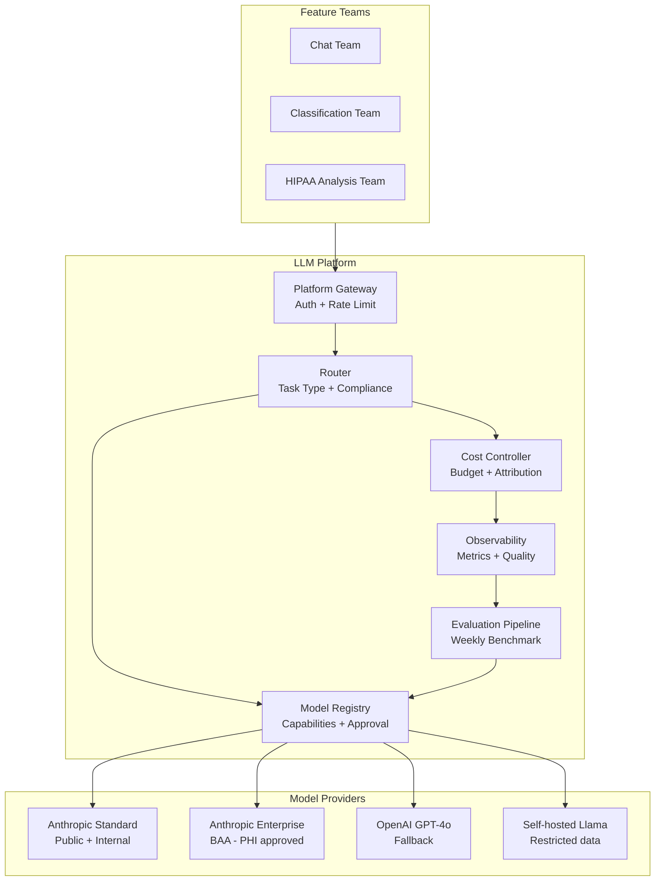

## Keywords in This File
{: .no_toc }

| # | Keyword | Weight |
|---|---|---|
| 19 | [Multi-Model LLM Platform Strategy](#multi-model-llm-platform-strategy) | ★★★ |

---

# Multi-Model LLM Platform Strategy

**Interview Weight:** ★★★ - Platform strategy for
LLM integration is a Staff/Principal engineer and
Engineering Manager topic. It covers how organizations
should design their AI infrastructure to avoid lock-in,
optimize costs at scale, manage multiple models
and providers, and build a sustainable AI platform
that can evolve as the model landscape changes
every 6 months.

---

### 🎯 Model Answer

**30 seconds:**

> A multi-model LLM platform strategy abstracts
> the application layer from the model layer. You
> build one application interface, route requests
> to the right model based on task requirements
> (capability, cost, latency, compliance), and switch
> models as the landscape evolves. The core components:
> a provider abstraction layer, a routing engine
> (task -> model assignment), cost monitoring, and
> a continuous evaluation pipeline to detect when
> a newer/cheaper model can replace your current choice.

**3 minutes:**

> The LLM landscape changes every 3-6 months. A
> strategy built around a single model will require
> rearchitecting every time a better or cheaper model
> launches. The multi-model platform avoids this
> by separating concerns:
>
> Application layer: defines what tasks need AI.
> Platform layer: routes each task to the optimal model.
> Model layer: the actual LLM API calls.
>
> Platform capabilities:
>
> (1) Routing: different tasks go to different models.
>     Document analysis (long context) -> claude-sonnet.
>     Classification (high volume, low cost) -> claude-haiku.
>     Vision tasks -> GPT-4 Vision.
>     Compliance-restricted data -> self-hosted llama.
>
> (2) Fallback: if the primary model is unavailable
>     (rate limited, outage), route to the fallback.
>     claude-sonnet overloaded -> gpt-4o as fallback.
>
> (3) Cost optimization: cascade pattern. Try the
>     cheapest model first. If confidence is below
>     threshold, escalate to a more expensive model.
>
> (4) Continuous evaluation: run new model versions
>     against your benchmark suite. When a cheaper
>     model achieves the same quality: trigger a
>     migration. This is automated model version
>     management.
>
> (5) Observability: per-model cost, quality metrics,
>     error rates, latency. Know which model is causing
>     problems and which is over/under-utilized.
>
> Governance: track model approvals. Not every model
> is approved for every data category. A governance
> registry maps data classifications to approved
> models.

**Blank Mind Recovery:**

**(1) Restate:** "Abstract application from model.
Route by task requirements. Monitor cost/quality.
Automate model migration when better alternatives emerge."

**(2) First principles:** "Models are infrastructure.
Infrastructure should be replaceable without rewriting
applications. Build the abstraction before you
need to swap."

**(3) Bridge:** "Same as database abstraction (ORM).
You don't write raw SQL that depends on MySQL specifics.
You write queries against an abstraction. Swapping
MySQL for Postgres shouldn't break the application.
Same principle for LLMs."

---

### 📘 Concept Explanation

**What it is:**

Multi-model LLM platform strategy is the architectural
approach of designing AI infrastructure as a managed
platform that abstracts model selection, routing,
cost optimization, and governance from individual
feature teams.

**The problem it solves:**

Without a platform strategy: each feature team picks
its own model, integrates directly with the provider SDK,
builds its own retry logic and error handling, creates
billing surprises, and can't respond quickly when
a new model makes their choice obsolete.

**Platform architecture components:**

```
MULTI-MODEL LLM PLATFORM:

Feature Teams:
  Team A (chat)     Team B (analysis)     Team C (search)
       |                  |                    |
       v                  v                    v
  [LLM Platform Gateway]
       |
  +----+----+
  |         |
  v         v
[Router]  [Cost Controller]
  |             |
  | task type   | budget limits
  v             v
[Model Registry]
  +--> claude-sonnet (general, compliant)
  +--> claude-haiku (high volume)
  +--> gpt-4o (vision, fallback)
  +--> llama-70b (on-prem, restricted data)
       |
  [Evaluation Pipeline]
  +--> Benchmark suite (per task type)
  +--> Quality monitor
  +--> Cost tracker

[Observability]
  +--> Cost per model, per team, per task
  +--> Quality metrics (benchmark scores)
  +--> Error rates, latency P50/P99
```

> **Code walkthrough:** This example demonstrates the core pattern in action. The key mechanism shows how the concept works in practice. Study the structure to understand the essential behavior and common usage.

**Routing decision factors:**

```
ROUTING MATRIX:

Task Type           | Primary         | Fallback   | Override
--------------------+-----------------+------------+---------
Long doc analysis   | claude-3-5-sonnet| gpt-4o     | -
Classification      | claude-3-haiku  | haiku-v2   | -
Vision              | gpt-4o-vision   | gemini-pro | -
Restricted data     | llama-70b-onprem| -          | compliance
High urgency        | claude-sonnet   | gpt-4o     | priority
Batch/offline       | claude-haiku    | -          | cost
```

> **Code walkthrough:** This example demonstrates the core pattern in action. The key mechanism shows how the concept works in practice. Study the structure to understand the essential behavior and common usage.

---

### 💻 Code Example

```python
"""
Multi-model LLM platform: routing, fallback,
cost tracking, and model governance.
"""
import anthropic
import os
import time
import json
import logging
from dataclasses import dataclass, field
from enum import Enum
from typing import Callable

log = logging.getLogger(__name__)


# --- MODEL REGISTRY ---
class DataClassification(Enum):
    PUBLIC = "public"
    INTERNAL = "internal"
    RESTRICTED = "restricted"  # no external APIs


@dataclass
class ModelConfig:
    provider: str        # "anthropic", "openai", "local"
    model_id: str
    input_price_per_mtok: float
    output_price_per_mtok: float
    context_window: int
    supports_vision: bool
    supports_tools: bool
    max_concurrent: int
    approved_data_classes: list[DataClassification]


MODEL_REGISTRY: dict[str, ModelConfig] = {
    "claude-sonnet": ModelConfig(
        provider="anthropic",
        model_id="claude-3-5-sonnet-20241022",
        input_price_per_mtok=3.0,
        output_price_per_mtok=15.0,
        context_window=200_000,
        supports_vision=True,
        supports_tools=True,
        max_concurrent=50,
        approved_data_classes=[
            DataClassification.PUBLIC,
            DataClassification.INTERNAL
        ]
    ),
    "claude-haiku": ModelConfig(
        provider="anthropic",
        model_id="claude-3-5-haiku-20241022",
        input_price_per_mtok=0.80,
        output_price_per_mtok=4.0,
        context_window=200_000,
        supports_vision=False,
        supports_tools=True,
        max_concurrent=200,
        approved_data_classes=[
            DataClassification.PUBLIC,
            DataClassification.INTERNAL
        ]
    ),
    # Self-hosted (placeholder for local inference)
    "llama-70b-local": ModelConfig(
        provider="local",
        model_id="meta-llama/Llama-3.1-70B-Instruct",
        input_price_per_mtok=0.0,  # infra cost only
        output_price_per_mtok=0.0,
        context_window=128_000,
        supports_vision=False,
        supports_tools=False,
        max_concurrent=10,
        approved_data_classes=[
            DataClassification.PUBLIC,
            DataClassification.INTERNAL,
            DataClassification.RESTRICTED  # on-prem
        ]
    )
}


# --- TASK TYPES AND ROUTING RULES ---
@dataclass
class TaskRequirements:
    task_type: str
    data_classification: DataClassification
    requires_vision: bool = False
    requires_tools: bool = False
    min_context_tokens: int = 0
    max_cost_per_request: float = 0.10
    max_latency_p50_seconds: float = 10.0
    is_batch: bool = False


ROUTING_RULES: dict[str, list[str]] = {
    # task_type -> ordered list of model names (preference order)
    "classification": ["claude-haiku", "claude-sonnet"],
    "document_analysis": ["claude-sonnet", "claude-haiku"],
    "restricted_data": ["llama-70b-local"],
    "vision": ["claude-sonnet"],  # haiku no vision
    "batch_processing": ["claude-haiku", "claude-sonnet"],
    "default": ["claude-sonnet", "claude-haiku"],
}


# --- PLATFORM ROUTER ---
class LLMPlatformRouter:
    """Routes requests to the optimal model."""

    def __init__(self):
        self._cost_tracker: dict[str, float] = {}

    def select_model(
        self,
        requirements: TaskRequirements
    ) -> str | None:
        """Select the best model for the task."""
        candidates = ROUTING_RULES.get(
            requirements.task_type,
            ROUTING_RULES["default"]
        )

        for model_name in candidates:
            config = MODEL_REGISTRY.get(model_name)
            if not config:
                continue

            # Compliance: check data classification
            if requirements.data_classification \
               not in config.approved_data_classes:
                log.debug(
                    "Model %s not approved for %s data",
                    model_name,
                    requirements.data_classification
                )
                continue

            # Capability checks
            if requirements.requires_vision \
               and not config.supports_vision:
                continue
            if requirements.requires_tools \
               and not config.supports_tools:
                continue
            if requirements.min_context_tokens \
               > config.context_window:
                continue

            return model_name

        return None  # No eligible model found


# --- PLATFORM CLIENT ---
class LLMPlatformClient:
    """Unified client with routing, fallback, and tracking."""

    def __init__(self):
        self._anthropic = anthropic.Anthropic(
            api_key=os.environ["ANTHROPIC_API_KEY"]
        )
        self._router = LLMPlatformRouter()
        self._usage_log: list[dict] = []

    def call(
        self,
        prompt: str,
        requirements: TaskRequirements,
        system: str | None = None
    ) -> str:
        """Route and call with fallback."""
        model_name = self._router.select_model(requirements)
        if not model_name:
            raise RuntimeError(
                f"No eligible model for task {requirements.task_type} "
                f"with {requirements.data_classification} data"
            )

        config = MODEL_REGISTRY[model_name]
        start = time.time()

        try:
            result = self._call_provider(
                config, prompt, system
            )
            elapsed = time.time() - start

            self._log_usage(
                model_name=model_name,
                task_type=requirements.task_type,
                success=True,
                latency=elapsed,
                estimated_cost=self._estimate_cost(
                    config, len(prompt) // 4, 100
                )
            )
            return result

        except Exception as e:
            log.error("Model %s failed: %s", model_name, e)
            # Try fallback models
            candidates = ROUTING_RULES.get(
                requirements.task_type,
                ROUTING_RULES["default"]
            )
            for fallback_name in candidates:
                if fallback_name == model_name:
                    continue
                fallback_config = MODEL_REGISTRY.get(
                    fallback_name
                )
                if not fallback_config:
                    continue
                if requirements.data_classification \
                   not in fallback_config.approved_data_classes:
                    continue
                try:
                    return self._call_provider(
                        fallback_config, prompt, system
                    )
                except Exception:
                    continue

            raise RuntimeError(
                f"All models failed for task {requirements.task_type}"
            ) from e

    def _call_provider(
        self,
        config: ModelConfig,
        prompt: str,
        system: str | None
    ) -> str:
        if config.provider == "anthropic":
            kwargs = {
                "model": config.model_id,
                "max_tokens": 1024,
                "messages": [{
                    "role": "user",
                    "content": prompt
                }]
            }
            if system:
                kwargs["system"] = system
            msg = self._anthropic.messages.create(**kwargs)
            return msg.content[0].text
        elif config.provider == "local":
            # Placeholder for local model inference
            raise NotImplementedError("Local model call")
        else:
            raise ValueError(f"Unknown provider: {config.provider}")

    def _estimate_cost(
        self,
        config: ModelConfig,
        input_tokens: int,
        output_tokens: int
    ) -> float:
        return (
            input_tokens * config.input_price_per_mtok / 1_000_000
            + output_tokens * config.output_price_per_mtok / 1_000_000
        )

    def _log_usage(self, **kwargs):
        self._usage_log.append(kwargs)

    def get_cost_summary(self) -> dict[str, float]:
        """Cost per model over all logged calls."""
        summary: dict[str, float] = {}
        for entry in self._usage_log:
            model = entry["model_name"]
            summary[model] = summary.get(model, 0) + \
                             entry.get("estimated_cost", 0)
        return summary


# --- CONTINUOUS EVALUATION ---
class ModelEvaluationPipeline:
    """
    Compare current and candidate models on benchmark data.
    """

    def __init__(
        self,
        client: LLMPlatformClient,
        benchmark: list[dict]  # [{input, expected_output}]
    ):
        self.client = client
        self.benchmark = benchmark

    def evaluate_model(
        self,
        requirements: TaskRequirements,
        judge_fn: Callable[[str, str], float]
    ) -> dict:
        """
        Run benchmark, score with judge_fn.
        judge_fn(actual, expected) -> float 0-1
        """
        scores = []
        costs = []
        latencies = []

        for case in self.benchmark:
            start = time.time()
            try:
                output = self.client.call(
                    case["input"], requirements
                )
                score = judge_fn(output, case["expected_output"])
                scores.append(score)
                latencies.append(time.time() - start)
            except Exception as e:
                scores.append(0.0)
                latencies.append(time.time() - start)

        avg_cost = sum(self.client.get_cost_summary().values())
        return {
            "avg_score": sum(scores) / len(scores),
            "p95_latency": sorted(latencies)[
                int(len(latencies) * 0.95)
            ],
            "total_cost": avg_cost,
            "n": len(scores)
        }
```

> **Code walkthrough:** The platform consists of
> five interlocking components. `ModelConfig` captures
> all properties that affect routing: provider, pricing,
> capability flags, and critically `approved_data_classes` -
> this is the governance layer that prevents RESTRICTED
> data from going to cloud APIs. `MODEL_REGISTRY`
> is a configuration-driven registry: adding a new
> provider means adding an entry here, not changing
> application code. `LLMPlatformRouter.select_model`
> iterates through the priority-ordered candidate
> list, applying compliance and capability filters
> - the first model that passes all filters wins.
> `LLMPlatformClient.call` adds the fallback layer:
> if the primary model fails (exception), the loop
> tries each fallback in priority order. `ModelEvaluationPipeline`
> is the continuous evaluation harness: given a
> benchmark of expected input/output pairs and a
> scoring function, it measures actual model performance.
> Running this weekly on new model versions automates
> the "should we switch?" decision.

---

### 🎓 Answers by Seniority

**Junior / Mid:**

> "A multi-model strategy means not locking all AI
> features to one specific model. I build a thin
> abstraction layer that knows which model to use
> for which task. Classification tasks use the cheaper
> haiku; complex document analysis uses sonnet.
> If one model is unavailable, there's a fallback.
> The benefit: I can update the model assignment
> without touching feature code when a better or
> cheaper model launches."

---

**Senior / Staff:**

> "A multi-model platform strategy is an organizational
> pattern as much as a technical one. Feature teams
> shouldn't be in the business of picking models,
> managing rate limits, and handling provider failures -
> that's platform infrastructure. The platform team
> owns: the provider abstraction, the routing rules
> (updated as the model landscape changes), the
> cost allocation, and the compliance registry (which
> models are approved for which data types). Feature
> teams say 'I need to classify documents at high
> volume with internal data.' The platform says 'use
> haiku - it's approved for internal data, has the
> capacity, and is 10x cheaper than sonnet for this
> task.' The feature team never changes when the
> platform team migrates to a better model."

---

### ⚠️ Common Misconceptions

**Misconception: "Multi-model means using different
models for different users based on pricing tier."**

Using a more capable model for premium users and
a cheaper model for free users is one application
of multi-model routing, but it's not the strategic
goal. The strategic goal is: separating task routing
decisions from application code so that model selection
can evolve independently. The routing rules encode:
task type (what capability is needed?), data classification
(what's approved?), and cost budget (what's affordable?).
User tier is one input into routing, but routing
has many more dimensions. A multi-model platform
that only routes by user tier is underutilizing
the architecture.

---

### 🚨 Failure Modes and Diagnosis

**Failure: Platform abstraction adds latency and
becomes a bottleneck**

*Symptom:* After adding the LLM platform layer,
P99 latency increases by 200ms even for simple requests.
Feature teams start bypassing the platform to call
providers directly.

*Root cause:* The platform router is synchronous,
adds network overhead (if it's a remote service),
or has complex routing logic that's slow to evaluate.

*Diagnosis:*
```python
import time

def timed_route(requirements: TaskRequirements):
    start = time.time()
    model = router.select_model(requirements)
    routing_latency = (time.time() - start) * 1000
    if routing_latency > 5:  # > 5ms is too slow
        log.warning(
            "Routing took %.1fms for task %s",
            routing_latency, requirements.task_type
        )
    return model
```

> **Code walkthrough:** This example demonstrates the core pattern in action. The key mechanism shows how the concept works in practice. Study the structure to understand the essential behavior and common usage.

*Fix:*
1. Run the router in-process (not as a remote service).
   Routing logic should be a library call, not an RPC.
2. Cache routing decisions for the same `(task_type, data_classification)`
   tuple - they don't change per-request.
3. Pre-compile routing rules at startup (not on each call).

*Target:* routing overhead < 1ms. If it's > 5ms,
the abstraction cost is visible to users.

---

### 🎯 Interview Deep-Dive

| Question Type | Est. Time |
|---|---|
| Platform architecture overview | 4-5 min |
| Model routing logic | 4-5 min |
| Compliance registry design | 4-5 min |
| Fallback and failover | 3-4 min |
| Cost allocation | 3-4 min |
| Continuous evaluation | 4-5 min |
| Build vs. buy (LiteLLM, BedRock) | 3-4 min |
| Governance at scale | 4-5 min |
| Team structure | 3-4 min |
| Migration management | 3-4 min |
| Observability design | 3-4 min |
| Organizational trade-offs | 4-5 min |

---

**[STAFF] Q1 - Why does a multi-model platform
matter at organizational scale?**

*Why they ask:* Strategic thinking.

At small scale (1 team, 1 AI feature): direct provider
integration is fine. Complexity isn't justified.

At organizational scale (multiple teams, multiple AI features):
Without a platform:
- Each team integrates the provider SDK separately
  (duplicated code, inconsistent error handling)
- No unified cost visibility ("which team is responsible for
  this $50K AI bill?")
- No governance ("is this team sending RESTRICTED data
  to an external API?")
- Model changes require updating each team separately
- Rate limits shared across teams, no allocation

With a platform:
- Single integration point (one place to update)
- Cost allocation per team/feature
- Compliance enforcement at the platform layer
- Model updates happen in the platform; teams unaffected
- Shared rate limit budget with priority allocation

The platform becomes necessary when: (a) > 5 teams
using LLM APIs, (b) AI spend > $10K/month (audit needed),
(c) compliance requirements (HIPAA, GDPR) require centralized control.

*What separates good from great:* "The platform enables the organization to move faster - teams get AI capabilities without needing to become AI infrastructure experts."

---

**[STAFF] Q2 - How do you design the routing logic
for a multi-model platform?**

*Why they ask:* Core platform design.

Routing dimensions:

(1) Task type: the most important dimension. Different
    tasks have different capability requirements.
    Classification -> haiku. Document analysis -> sonnet.
    Encode as a task registry with model preferences.

(2) Data classification: compliance filter applied
    before capability considerations. RESTRICTED data
    can only use approved models (self-hosted).

(3) Cost budget: per-request cost ceiling. If a feature
    team has set max_cost_per_request=0.001 ($0.001),
    sonnet at 0.003/request is excluded.

(4) Capability requirements: vision, tool use, context length.
    Hard filters: if vision is required, exclude non-vision models.

(5) Current model health: if the primary model is
    returning 529 (overloaded), route to fallback proactively.

Routing algorithm:
1. Filter by compliance (hard constraint)
2. Filter by capability (hard constraint)
3. Sort by task preference (from routing table)
4. Within same preference: sort by health, then cost

*What separates good from great:* "Don't over-engineer routing. Start with a simple rules table. Add dynamic routing (health-based) only after you've observed the need for it in production."

---

**[STAFF] Q3 - How do you manage model governance
across an organization?**

*Why they ask:* Compliance and risk management.

Model governance registry - what it contains:
```python
MODEL_GOVERNANCE = {
    "claude-3-5-sonnet": {
        "approved_by": "security_team",
        "approval_date": "2024-01-15",
        "approved_for": ["PUBLIC", "INTERNAL"],
        "not_approved_for": ["RESTRICTED", "PII_STRICT"],
        "requires_zero_data_retention": False,
        "vendor_baa_signed": False,
        "review_date": "2025-01-15",  # annual review
    },
    "claude-3-5-sonnet-hipaa": {
        # Same model, Enterprise with BAA
        "approved_by": "security_team + legal",
        "approved_for": ["PUBLIC", "INTERNAL", "PHI"],
        "vendor_baa_signed": True,
    }
}
```

> **Code walkthrough:** This example demonstrates the core pattern in action. The key mechanism shows how the concept works in practice. Study the structure to understand the essential behavior and common usage.

Process:
1. New model submission: team requests approval
   for a new model or data classification combination.
2. Review: security team checks: data processing agreement,
   privacy controls, zero data retention, SOC 2, relevant certifications.
3. Approval: updates governance registry.
4. Platform update: platform team updates routing rules
   to include the newly approved model.

Feature teams never directly manage provider agreements.
They request capabilities from the platform team.

*What separates good from great:* "Annual review dates in the governance registry - model security practices change, and a model approved today may need re-review after a provider policy change."

---

**[STAFF] Q4 - How do you implement continuous
model evaluation in a production platform?**

*Why they ask:* Automated quality management.

Continuous evaluation loop:

(1) Benchmark suite: maintained for each task type.
    100-200 labeled examples per task.
    Updated quarterly with new production samples.

(2) Scheduled evaluation:
    Weekly CI job that:
    - Runs the benchmark against the current production model
    - Runs against newly released model versions
    - Compares quality score, cost, latency

(3) Alert on regression:
    If current production model's score drops (model degradation
    is real - providers sometimes quietly change behavior):
    alert and trigger manual investigation.

(4) Migration trigger:
    If a new model achieves:
    - Same or better quality (within 2% tolerance)
    - Lower cost (> 10% savings)
    Then: automated PR to update routing to the new model version.
    Requires human approval before merge.

(5) A/B testing:
    Before full migration: shadow test new model on 5% of traffic.
    Compare actual production quality (using LLM judge or human review).
    If shadow results confirm benchmark: approve full migration.

*What separates good from great:* "The benchmark suite must include adversarial examples (edge cases, out-of-distribution inputs) not just easy cases. Models that perform well on easy benchmarks may degrade badly on hard inputs."

---

**[SENIOR] Q5 - How do you allocate costs to feature
teams using the shared LLM platform?**

*Why they ask:* Engineering economics.

Cost allocation patterns:

(1) Tag-based allocation:
    Each API call includes a `team` and `feature` tag
    in the metadata logged by the platform.
    ```python
    def call_with_attribution(
        prompt: str,
        requirements: TaskRequirements,
        team: str,
        feature: str
    ) -> str:
        result = platform_client.call(prompt, requirements)
        log_usage(
            model=selected_model,
            team=team,
            feature=feature,
            input_tokens=...,
            cost=...
        )
        return result
    ```
> **Code walkthrough:** This example demonstrates the core pattern in action. The key mechanism shows how the concept works in practice. Study the structure to understand the essential behavior and common usage.

    Monthly: query the usage log, aggregate by (team, feature).
    Report to team leads.

(2) Budget limits:
    Optional: set monthly budget per team. Alert at 80%.
    Hard limit at 100%: degrade to cheaper fallback models.

(3) Chargeback:
    For large organizations: charge AI costs to team budgets.
    Incentivizes teams to optimize their prompts and model choices.

(4) Cost dashboard:
    Real-time dashboard: cost per team, per feature, per model.
    Trend: week-over-week cost change (spike detection).

*What separates good from great:* "Cost attribution reveals which features have efficient prompts and which are wasting context. It creates the right incentive to optimize."

---

**[STAFF] Q6 - What is the build vs. buy decision
for the LLM platform itself?**

*Why they ask:* Meta-strategy.

Options:
(1) Build your own (as described in this entry): maximum control, matches your specific needs, significant engineering investment.

(2) LiteLLM (open-source proxy): unified interface for 100+ providers, built-in routing, cost tracking, caching. Self-hosted or managed.

(3) AWS Bedrock: managed service on AWS, multiple models (Claude, Llama, Titan), IAM-based access control, audit logging. Best for AWS-native organizations.

(4) Azure OpenAI + AI Studio: Azure-hosted GPT-4 and other models, enterprise security, Azure AD integration.

(5) LangChain / LlamaIndex: application framework, not a platform. Useful for building agents; not a replacement for a routing/governance platform.

Decision criteria:
- Team size < 20 engineers: use LiteLLM (fast, low overhead)
- AWS organization: use Bedrock (security, compliance built-in)
- Azure organization: use Azure AI
- Specific governance requirements: build custom governance on top of LiteLLM or Bedrock
- Research team: build custom for maximum flexibility

*What separates good from great:* "LiteLLM as the provider proxy + custom governance registry on top is the fastest path to a production-grade multi-model platform for most organizations."

---

**[STAFF] Q7 - How do you manage model version
migrations across the platform?**

*Why they ask:* Operational engineering.

Model version management challenges:
- Anthropic deprecates models on a schedule (claude-3 deprecated, etc.)
- New versions can change behavior (output format, verbosity, reasoning)
- Multiple teams depend on the current model

Migration process:

(1) Announcement: when Anthropic announces deprecation,
    create a migration issue with the deadline.

(2) Evaluation: run the continuous evaluation pipeline
    (Q4) against the new model version.

(3) Feature team notification: if evaluation shows
    behavioral changes, notify affected teams.

(4) Shadow testing: route 5% of traffic to new version,
    compare outputs with LLM judge.

(5) Gradual rollout: 5% -> 25% -> 50% -> 100%
    with monitoring at each step.

(6) Rollback plan: keep the ability to revert
    the routing config to the previous model for 30 days
    after migration.

```python
ROUTING_CONFIG = {
    "claude-sonnet": {
        "model_id": "claude-3-5-sonnet-20241022",
        "shadow_model_id": "claude-3-5-sonnet-20250101",  # new version
        "shadow_percent": 5,  # 5% to new version
    }
}
```

> **Code walkthrough:** This example demonstrates the core pattern in action. The key mechanism shows how the concept works in practice. Study the structure to understand the essential behavior and common usage.

*What separates good from great:* "The shadow percent config means migrations happen without emergency coordination. Gradually increase shadow percent over 2 weeks, monitor quality - then flip to 100%."

---

**[STAFF] Q8 - How do you handle cross-provider
model selection and evaluation?**

*Why they ask:* Provider-agnostic strategy.

Cross-provider challenges:
- Different SDKs (anthropic, openai, google-generativeai)
- Different request/response schemas (tool_use vs function_calling)
- Different pricing structures
- Different rate limit approaches

Abstraction strategy:
The platform's provider layer normalizes these differences.
The application sends: `{prompt, requirements}`.
The platform sends: provider-specific API calls.

Testing cross-provider:
- Run the same benchmark against all providers
- Compare quality scores, latency, cost
- The routing table is updated when a provider
  wins on cost/quality for a specific task type

Cross-provider complexity at tool use:
Tool definitions differ between Anthropic (JSON Schema in `tools`)
and OpenAI (JSON Schema in `functions`). The platform must
either: (a) maintain two tool definition formats,
or (b) adopt a provider-agnostic tool schema and
translate at the provider layer.

*What separates good from great:* "Don't abstract at too high a level - some provider-specific features (like Anthropic's prompt caching) have significant cost implications. The abstraction should expose these as optional optimizations."

---

**[MID] Q9 - How do you design the observability
layer for a multi-model platform?**

*Why they ask:* Operational excellence.

Metrics to track per model:

```python
LLM_METRICS = {
    "per_model_per_hour": [
        "request_count",           # RPM usage
        "input_tokens",            # TPM usage
        "output_tokens",
        "cost_usd",
        "error_rate",              # fraction of failed calls
        "error_types",             # 400/429/500/529 breakdown
        "p50_latency_seconds",     # median TTFT
        "p99_latency_seconds",     # tail latency
        "cache_hit_rate",          # for cached prompts
    ],
    "per_team_per_day": [
        "cost_usd",
        "request_count",
        "model_breakdown",  # which models the team uses
    ],
    "per_task_type_per_day": [
        "quality_score",     # from benchmark
        "cost_per_request",
        "avg_latency"
    ]
}
```

> **Code walkthrough:** This example demonstrates the core pattern in action. The key mechanism shows how the concept works in practice. Study the structure to understand the essential behavior and common usage.

Alerting rules:
- error_rate > 5% over 5 minutes: alert on-call
- cost_usd > 110% of daily average: alert
- cache_hit_rate < 80%: alert (caching may be broken)
- p99_latency > 30 seconds: alert

Dashboard:
- Real-time cost by team (bar chart)
- Model health (error rate over time)
- Quality score trend (benchmark results over time)
- Rate limit headroom (remaining TPM/RPM)

*What separates good from great:* "Quality score trend is the most important metric that teams typically miss - error rates measure availability, not quality. Add the benchmark score to your dashboards."

---

**[STAFF] Q10 - What team structure supports a
multi-model LLM platform?**

*Why they ask:* Engineering leadership.

Platform team responsibilities:
- Owns the LLM platform infrastructure
- Maintains provider integrations and abstractions
- Runs the continuous evaluation pipeline
- Manages model governance registry
- Owns observability and cost allocation

Feature team responsibilities:
- Defines task requirements (type, data classification)
- Owns the prompts and application logic
- Requests new model approvals when needed
- Reviews quality alerts from the platform

Size guidance:
- < 50 engineers total: one person owns the platform part-time
- 50-200 engineers: 2-3 person platform team
- > 200 engineers: dedicated AI platform team (5-10)

Anti-pattern: each feature team owns their own
model selection and provider integration. Results in:
duplicate code, inconsistent security, no unified cost view,
no model migration coordination.

*What separates good from great:* "The platform team's success metric is feature team velocity - not the sophistication of the platform. A simple platform that every team uses is better than a complex platform that teams bypass."

---

**[STAFF] Q11 - How do you manage prompt versioning
across model migrations?**

*Why they ask:* Operational continuity.

Problem: a prompt optimized for claude-3.5-sonnet-20241022
may need adjustment for the 2025 version if the model
changes its default output format or verbosity.

Strategies:

(1) Prompt as code, version-controlled:
    Every prompt is a file in the repository.
    Changes tracked via git. Rollback possible.

(2) Prompt testing on model upgrade:
    When a new model version ships: run the prompt
    test suite against both versions.
    Tests check output format, key assertions:
    ```python
    def test_classification_prompt(model_id: str):
        result = call_model(
            model_id,
            CLASSIFICATION_PROMPT,
            "This order is delayed and the customer is angry"
        )
        assert result.strip().lower() in ("urgent", "normal", "low")
    ```

> **Code walkthrough:** This example demonstrates the core pattern in action. The key mechanism shows how the concept works in practice. Study the structure to understand the essential behavior and common usage.

(3) Per-model prompt variants (when necessary):
    If prompt adjustments are needed for a new model,
    maintain variants in the registry:
    ```python
    PROMPTS = {
        "classify_ticket": {
            "default": "Classify this ticket as: ...",
            "claude-3-sonnet-2025": "Updated: Classify ..."
        }
    }
    ```

> **Code walkthrough:** This example demonstrates the core pattern in action. The key mechanism shows how the concept works in practice. Study the structure to understand the essential behavior and common usage.

(4) Behavioral pin: use `top_p=1, temperature=0` for
    deterministic outputs. This reduces variance between
    model versions for extraction tasks.

*What separates good from great:* "Prompt test suites are the migration insurance policy - without them, you discover behavioral regressions in production, not before."

---

**[STAFF] Q12 - [SYSTEM DESIGN] Design the LLM
platform for an organization with 10 teams,
$100K/month AI spend, and HIPAA requirements
for 2 teams.**

*Why they ask:* Capstone system design.

Requirements summary:
- 10 teams, varied tasks (chat, classification, document analysis)
- $100K/month = cost monitoring and allocation critical
- HIPAA: 2 teams process PHI, need BAA + zero data retention

Architecture:

Tier 1: Provider configuration
- Anthropic standard (8 teams): public/internal data
- Anthropic Enterprise + BAA (2 HIPAA teams): PHI approved
- Self-hosted Llama (optional, for RESTRICTED non-PHI): on-prem

Tier 2: Governance registry
- 4 data classifications: PUBLIC, INTERNAL, PHI, RESTRICTED
- Per-model approval for each classification
- Annual review workflow

Tier 3: Platform router (in-process library, not remote service)
- Routing table: task_type -> [model preferences]
- Compliance filter: model must be approved for data class
- Capability filter: vision, tools, context window
- Health-based routing: skip overloaded models

Tier 4: Cost controller
- Per-team monthly budget: configured by FinOps
- Usage tracking: per call, per team, per feature
- Alert: 80% of budget consumed
- Throttle: at 100%, degrade to cheapest approved model

Tier 5: Observability
- OpenTelemetry traces for every LLM call
- Metrics: cost, error rate, latency, cache hit rate
- Quality score: weekly benchmark run
- Dashboard: Grafana (or cloud-native equivalent)

Tier 6: Evaluation pipeline
- Weekly CI: benchmark all active models
- Compare new versions to current
- Automated PR if new version is cheaper + same quality

Team interfaces:
```python
result = platform.call(
    prompt=user_message,
    requirements=TaskRequirements(
        task_type="document_analysis",
        data_classification=DataClassification.PHI,  # HIPAA team
        requires_tools=False
    ),
    attribution=Attribution(team="billing", feature="summary")
)
```

> **Code walkthrough:** This example demonstrates the core pattern in action. The key mechanism shows how the concept works in practice. Study the structure to understand the essential behavior and common usage.

The platform selects: Anthropic Enterprise (BAA) - only model approved for PHI.
The billing team never needs to know which specific model was used.

*What separates good from great:* "The governance registry is a living document: when Anthropic updates their DPA or a security team identifies a new risk, only the registry needs updating - no feature code changes."

---

### ⚖️ Comparison Table

| Approach | Teams Served | Cost Visibility | Compliance Control | Migration Agility | Overhead |
|---|---|---|---|---|---|
| Direct SDK per team | Each team independent | Per-team only | None (each team manages) | Low (each team changes) | None |
| Shared adapter library | All teams share | Unified | Enforced in library | Medium (library update) | Low |
| LiteLLM proxy | All teams | Built-in | Policy-based | High | Medium |
| Custom platform | All teams | Full attribution | Full governance | Very high | High |
| AWS Bedrock | AWS-native teams | AWS Cost Explorer | IAM + SCPs | High | Medium |

---

### 🏛️ System Design

```
MULTI-MODEL LLM PLATFORM REFERENCE ARCHITECTURE:

Feature Team A    Feature Team B    Feature Team C
  (chat)          (classification)  (doc analysis, PHI)
      |                |                 |
      +----------------+-----------------+
                       |
               [LLM Platform API]
                       |
           +-----------+-----------+
           |           |           |
      [Router]    [Governance]  [Cost Ctrl]
           |           |           |
           v           v           v
    [Model Registry]  [Data       [Budget
     - claude-sonnet   Class       Limits
     - claude-haiku    Registry]   Per Team]
     - llama-local]
           |
   +-------+-------+--------+
   |       |       |        |
Anthropic OpenAI  Google  On-prem
Standard  (fallbk) (vision)  (PHI)
           |
    [Observability]
     - Cost metrics
     - Quality scores
     - Error rates
     - [Evaluation Pipeline]
       weekly benchmark
```



> **Diagram walkthrough:** The platform has two
> boundaries: the team interface (top) and the provider
> interface (bottom). Feature teams interact only
> with the platform gateway - they never call providers
> directly. The router uses the model registry to
> select the appropriate model based on task type
> and compliance requirements: HIPAA data automatically
> routes to Anthropic Enterprise (BAA); restricted
> data routes to the on-prem Llama. The cost controller
> tracks spend per team and enforces budget limits.
> The evaluation pipeline continuously compares model
> versions, feeding results back into the model
> registry to trigger version updates. The observability
> layer provides the feedback loop: quality regressions,
> cost spikes, and error rates all feed into routing
> and evaluation decisions. The key design principle:
> all model selection intelligence is centralized
> in the platform; feature teams are isolated from
> the complexity.

---

### 💻 Code Example

*(Omit: this concept does not have a programmatic interface that can be demonstrated in code. The conceptual explanation above is sufficient.)*


---

### 🏛️ System Design

*(Omit: system design diagram not applicable for this concept - see ★★★ keywords for full system design coverage.)*


---

### ⚖️ Comparison Table

*(Omit: this is a ★☆☆ foundational concept with no direct alternatives to compare - see higher-difficulty keywords for trade-off analysis.)*


---

### 📊 Diagram

*(Omit: no standalone visual diagram required for this concept - the explanations and code examples above provide sufficient clarity.)*


