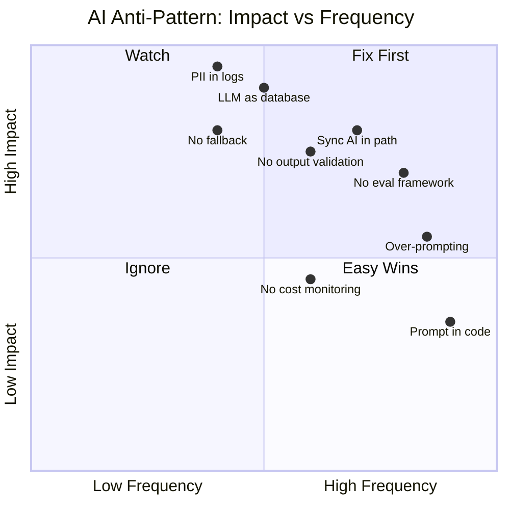
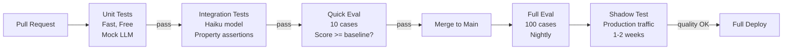
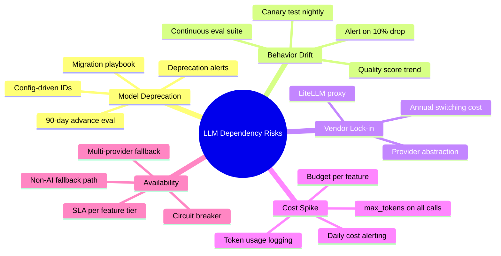

## Keywords in This File
{: .no_toc }

| # | Keyword | Weight |
|---|---|---|
| 20 | [AI Feature Development Anti-Patterns](#ai-feature-development-anti-patterns) | ★☆☆ |
| 21 | [LLM Integration Testing Patterns](#llm-integration-testing-patterns) | ★☆☆ |
| 22 | [LLM Dependency Risk Management](#llm-dependency-risk-management) | ★☆☆ |

---

# AI Feature Development Anti-Patterns

**Interview Weight:** ★☆☆ - Transferable meta-knowledge.
Engineers who've shipped AI features recognize
these anti-patterns; those who haven't will repeat
them. This keyword shows pattern recognition and
hard-won experience.

---

### 🎯 Model Answer

**30 seconds:**

> The most common AI feature anti-pattern: over-prompting.
> Engineers write enormous system prompts with every
> edge case they can imagine, making the prompt brittle,
> expensive, and hard to debug. The second pattern:
> treating the LLM as a database (asking it to recall
> specific facts it was never given). The third:
> no evaluation framework (how do you know if the
> AI got better or worse after your last change?).

**3 minutes:**

> AI feature development has a specific set of failure
> patterns that repeat across organizations:
>
> (1) Over-prompting: 5,000-word system prompts with
>     every edge case covered. The LLM starts ignoring
>     parts of the prompt. Debugging requires reading
>     thousands of words. Rule: start minimal, add
>     constraints only when you observe a specific failure.
>
> (2) Memory hallucination: "Remember that the user
>     lives in Berlin." The LLM doesn't have memory
>     unless you build it. Relying on implicit memory
>     between sessions causes user-visible failures.
>     Build explicit context management.
>
> (3) No eval framework: "It seems to work" is not
>     a quality metric. Without a test suite and
>     quality score, you can't tell if prompt changes
>     made things better or worse. Regression is
>     invisible.
>
> (4) Production prompts in code: prompts embedded
>     in Python strings, scattered across files.
>     No version control discipline. No A/B testing.
>     Treat prompts as artifacts with their own lifecycle.
>
> (5) Synchronous AI everywhere: every user action
>     blocks on an LLM call (2-5 second wait). Design
>     for async: queue AI tasks, stream responses,
>     pre-generate where possible.
>
> (6) Trusting LLM output as ground truth: the LLM
>     confidently produces wrong answers. Without
>     output validation and graceful degradation,
>     the application propagates hallucinations.

**Blank Mind Recovery:**

**(1) Restate:** "Six patterns: over-prompting, memory
hallucination, no eval, prompt in code, sync everywhere,
trust output."

**(2) First principles:** "AI features fail for
the same reason software features fail: building
without feedback loops. Evals are the feedback loop."

**(3) Bridge:** "Same as software: code without tests
is fragile. Prompts without evals are fragile. Add
the feedback loop."

---

### 📘 Concept Explanation

**What it is:**

A catalog of recurring mistakes engineers make
when building LLM-powered features, with diagnosis
signals and correction patterns.

**The problem it solves:**

Teams repeat the same mistakes when building their
first and second AI features. Pattern awareness
accelerates the learning curve and prevents production
failures.

**Anti-pattern taxonomy:**

```
AI FEATURE ANTI-PATTERNS:

Prompt engineering failures:
  - Over-prompting (too much = ignored instructions)
  - Instruction conflict (contradictory rules)
  - Example-free prompts (no few-shot guidance)
  - Static prompts (never updated from feedback)

Architecture failures:
  - Synchronous AI in critical path
  - No fallback path when LLM unavailable
  - Exposing raw LLM output to end users
  - LLM as database (asking for stored facts)

Evaluation failures:
  - No test suite for LLM outputs
  - "Vibe check" quality assessment
  - No regression detection on prompt changes
  - No user feedback loop

Operational failures:
  - Prompts embedded in code (not versioned)
  - No cost monitoring (bill surprise)
  - No rate limit handling (cascading failures)
  - Logging full prompts with PII
```

---

### 💻 Code Example

```python
"""
AI feature anti-patterns: BAD vs GOOD examples.
"""
import anthropic
import os
import json
import asyncio
from typing import Any

client = anthropic.Anthropic(
    api_key=os.environ["ANTHROPIC_API_KEY"]
)


# ANTI-PATTERN 1: Over-prompting
# BAD: Massive prompt covering every edge case
SYSTEM_PROMPT_BAD = """
You are a helpful assistant for Acme Corp.
You help users with questions about products.
Always be polite and professional. Never be rude.
Always respond in the user's language. If you
don't know the language, use English. Never share
confidential information. When users ask about
pricing, always redirect to the pricing page.
When users complain, acknowledge their frustration.
When users ask about competitors, be neutral.
When users ask about features, explain clearly.
When users ask about refunds, direct them to support.
When users ask about delivery, check their order.
Never make promises you can't keep. Always verify
before confirming. If you're unsure, say so.
... (500 more lines of edge cases)
"""

# GOOD: Minimal, specific system prompt
# Add rules only when a specific failure is observed
SYSTEM_PROMPT_GOOD = """
You are Acme Support. Help users with Acme products.
Rules:
- For pricing: direct to acme.com/pricing
- For refunds: direct to support@acme.com
- Acknowledge before answering complaints"""


# ANTI-PATTERN 2: LLM as database
# BAD: Asking Claude to remember external facts
def get_user_account_bad(user_id: str) -> str:
    msg = client.messages.create(
        model="claude-3-5-haiku-20241022",
        max_tokens=256,
        messages=[{
            "role": "user",
            "content": (
                f"What is the account status for "
                f"user_id {user_id}?"
            )
        }]
    )
    return msg.content[0].text
    # Claude has NO IDEA - will hallucinate


# GOOD: Fetch from real data source, use LLM for language
def get_user_account_good(user_id: str) -> str:
    # 1. Fetch actual data
    account_data = fetch_account_from_db(user_id)
    # 2. Use LLM only for natural language summary
    msg = client.messages.create(
        model="claude-3-5-haiku-20241022",
        max_tokens=256,
        messages=[{
            "role": "user",
            "content": (
                f"Summarize this account status "
                f"in one sentence:\n{json.dumps(account_data)}"
            )
        }]
    )
    return msg.content[0].text


def fetch_account_from_db(user_id: str) -> dict:
    """Placeholder for actual database call."""
    return {"id": user_id, "status": "active", "plan": "pro"}


# ANTI-PATTERN 3: Synchronous AI in critical path
# BAD: Every page load blocks on a 3-second LLM call
def get_personalized_greeting_bad(user_name: str) -> dict:
    msg = client.messages.create(  # 2-5 second wait
        model="claude-3-5-sonnet-20241022",
        max_tokens=100,
        messages=[{
            "role": "user",
            "content": (
                f"Write a personalized greeting for {user_name}"
            )
        }]
    )
    return {
        "user": user_name,
        "greeting": msg.content[0].text
    }
    # Page load = 2-5 seconds. Users abandon after 3s.


# GOOD: Pre-generate or use fallback
_GREETING_CACHE: dict[str, str] = {}

async def get_personalized_greeting_good(
    user_name: str
) -> dict:
    # Return cached if available (pre-generated on login)
    if user_name in _GREETING_CACHE:
        return {
            "user": user_name,
            "greeting": _GREETING_CACHE[user_name]
        }

    # Fallback: immediate response, update async
    asyncio.create_task(
        _prefetch_greeting(user_name)
    )
    return {
        "user": user_name,
        "greeting": f"Welcome back, {user_name}!"  # instant
    }


async def _prefetch_greeting(user_name: str):
    """Pre-generate and cache for next request."""
    msg = client.messages.create(
        model="claude-3-5-haiku-20241022",
        max_tokens=100,
        messages=[{
            "role": "user",
            "content": (
                f"Write a brief, friendly greeting "
                f"for {user_name} (1 sentence)"
            )
        }]
    )
    _GREETING_CACHE[user_name] = msg.content[0].text


# ANTI-PATTERN 4: No validation of LLM output
# BAD: Trust and execute
def process_task_bad(description: str) -> dict:
    msg = client.messages.create(
        model="claude-3-5-sonnet-20241022",
        max_tokens=256,
        messages=[{
            "role": "user",
            "content": (
                f"Return JSON: {{priority: high/med/low, "
                f"category: billing/tech/general}} for: "
                f"'{description}'"
            )
        }]
    )
    return json.loads(msg.content[0].text)  # Fails if not JSON


# GOOD: Validate and handle gracefully
def process_task_good(description: str) -> dict:
    msg = client.messages.create(
        model="claude-3-5-haiku-20241022",
        max_tokens=256,
        messages=[{
            "role": "user",
            "content": (
                f"Return ONLY valid JSON "
                f"(no other text): "
                f'{{\"priority\": "high"|"med"|"low", '
                f'\"category\": "billing"|"tech"|"general"}} '
                f"for: '{description}'"
            )
        }]
    )
    raw = msg.content[0].text.strip()
    # Handle possible markdown wrapping
    if raw.startswith("```"):
        raw = raw.split("```")[1]
        if raw.startswith("json"):
            raw = raw[4:]
    try:
        result = json.loads(raw)
        # Validate schema
        assert result.get("priority") in (
            "high", "med", "low"
        )
        assert result.get("category") in (
            "billing", "tech", "general"
        )
        return result
    except (json.JSONDecodeError, AssertionError):
        # Graceful degradation
        return {"priority": "med", "category": "general"}
```

> **Code walkthrough:** Four BAD-before-GOOD pairs
> demonstrate the most common anti-patterns. The
> over-prompting pair shows that SYSTEM_PROMPT_GOOD
> achieves the same goals in 5 lines vs 500 - the
> LLM infers most behavior from context. The database
> pair shows that Claude has no access to external
> systems - `get_user_account_bad` will hallucinate
> a plausible but wrong answer; `get_user_account_good`
> fetches real data and uses Claude only for language.
> The synchronous AI pair shows the async pre-generation
> pattern: `_prefetch_greeting` runs in the background
> after the first request; subsequent requests get
> the cached LLM response with zero latency. The
> validation pair shows the defensive JSON parsing
> pattern: Claude sometimes wraps JSON in markdown
> code blocks; strip them before parsing; validate
> the schema; return safe defaults on failure.

---

### 🎓 Answers by Seniority

**Junior / Mid:**

> "The most common mistake I've seen is treating
> the LLM as if it knows things it wasn't given.
> You have to pass everything it needs in the prompt.
> The second mistake is having no way to measure
> quality - if you change a prompt, you don't know
> if it got better or worse. I always write at least
> a handful of test cases before changing a prompt
> in production."

---

**Senior / Staff:**

> "The anti-pattern I watch for in code reviews:
> synchronous LLM calls in request handlers for
> any user-facing surface. A 3-second wait degrades
> conversion rates measurably. The fix is always
> the same: async the AI task, stream or use pre-generation.
> The deeper pattern behind most AI failures:
> no eval framework. Without a measurable quality
> score, prompt changes are random walks. You optimize
> for the last anecdote you saw. I mandate: any
> AI feature in production must have a benchmark
> suite before launch. That score is your quality
> regression test."

---

### ⚠️ Common Misconceptions

**Misconception: "More detailed prompts = better results."**

There's a common assumption that including more
context, more rules, and more edge case handling
in the system prompt always improves quality. Research
and production experience show the opposite: very
long prompts cause "lost in the middle" failures
where the model focuses on the beginning and end
but ignores middle sections. Contradictory rules
in long prompts cause the model to follow whichever
rule appears closest to the current context. Short,
specific prompts outperform long, comprehensive ones.
The correct approach: start minimal, observe specific
failure modes in production, add targeted instructions
to address each observed failure. Never add instructions
preemptively.

---

### 🚨 Failure Modes and Diagnosis

**Failure: LLM quality silently degrades after prompt change**

*Symptom:* User complaints increase after a prompt
update. No automated detection caught the regression.

*Root cause:* No eval framework. Quality is measured
by anecdote, not benchmark.

*Prevention:*
```python
# Simple LLM quality eval suite
import json

TEST_CASES = [
    {
        "input": "I want to cancel my subscription",
        "assert": lambda r: "support@" in r or "cancel" in r.lower()
    },
    {
        "input": "What's your pricing?",
        "assert": lambda r: "acme.com/pricing" in r
    },
]

def run_eval(system_prompt: str) -> float:
    passed = 0
    for case in TEST_CASES:
        msg = client.messages.create(
            model="claude-3-5-haiku-20241022",
            max_tokens=256,
            system=system_prompt,
            messages=[{
                "role": "user",
                "content": case["input"]
            }]
        )
        if case["assert"](msg.content[0].text):
            passed += 1
    score = passed / len(TEST_CASES)
    return score

# Run before and after every prompt change:
score_before = run_eval(CURRENT_PROMPT)
score_after = run_eval(UPDATED_PROMPT)
if score_after < score_before:
    print("REGRESSION DETECTED - reject change")
```

---

### 🎯 Interview Deep-Dive

| Question Type | Est. Time |
|---|---|
| Anti-pattern identification | 3-4 min |
| Over-prompting diagnosis | 3-4 min |
| Eval framework design | 3-4 min |
| Async AI patterns | 3-4 min |
| LLM as database failure | 2-3 min |
| Output validation | 2-3 min |
| Prompt versioning | 2-3 min |

---

**[MID] Q1 - What is "over-prompting" and how do
you detect it in an existing system?**

*Why they ask:* Practical prompt engineering.

Over-prompting: a system prompt that has grown
to hundreds or thousands of words through accretion
of edge case handling, resulting in instructions
the model partially ignores.

Detection signals:
- System prompt is > 500 words
- Prompt contains "never", "always", "must" more than 10 times
- Testing reveals the model ignoring specific instructions
- Multiple contradictory rules (added over time)
- Instructions that say "if X then Y, unless Z, except when W"

Diagnosis:
Remove sections one at a time and run your eval suite.
If removing a section doesn't change quality: it was dead weight.
If removing a section improves quality: it was conflicting.

Fix: rewrite from scratch based on observed failures, not anticipated ones.

*What separates good from great:* "Prompts have a 'useful density' limit - beyond which additional instructions reduce quality. Treat prompts like code: refactor regularly."

---

**[MID] Q2 - How do you build a minimal eval framework
for an LLM feature?**

*Why they ask:* Quality engineering for AI.

Minimal eval in 4 steps:

1. Collect 20-50 real production examples (with good output).
2. For each: write an assertion function (Python):
   `assert lambda response: "expected_phrase" in response`
3. Store as test cases in a JSON file.
4. Run against any prompt change: `score = passing / total`

What to assert:
- Contains required information (e.g., link to pricing page)
- Does NOT contain prohibited content (competitor names)
- Matches expected format (is valid JSON, has required fields)
- Tone: use an LLM judge for subjective quality

LLM judge pattern:
```python
def llm_judge(response: str, expected: str) -> float:
    """Score 0-1 using Claude as judge."""
    msg = client.messages.create(
        model="claude-3-5-haiku-20241022",
        max_tokens=10,
        messages=[{
            "role": "user",
            "content": (
                f"Score 0-10 how well this response "
                f"addresses the need.\n"
                f"Expected: {expected}\n"
                f"Got: {response}\n"
                f"Return only a number."
            )
        }]
    )
    try:
        return float(msg.content[0].text.strip()) / 10
    except ValueError:
        return 0.5
```

*What separates good from great:* "Start with 20 cases and simple assertions. Expand the suite only when you observe a specific quality failure. The suite grows from production observations, not upfront design."

---

**[MID] Q3 - Why is "no fallback for LLM failures"
an architectural anti-pattern?**

*Why they ask:* Reliability design.

If the LLM API call is in the critical path and
there's no fallback:
- API outage -> feature unavailable
- Rate limit hit -> feature unavailable
- High latency spike -> user-facing timeout

Fallback strategies by feature type:

| Feature | Primary | Fallback |
|---|---|---|
| Product search | Semantic (LLM embedding) | Keyword search |
| Document summary | LLM summary | "View full document" link |
| Email classification | LLM classify | Rule-based classifier |
| Chatbot | LLM response | "Contact support" prompt |

Design pattern: every AI feature must have a non-AI
fallback path. The fallback may be less good, but
it keeps the feature functional.

Circuit breaker: if the LLM API error rate exceeds
10% in 60 seconds, open the circuit and use fallback
for all requests for 30 seconds. Prevents cascading
failures and reduces cost during outages.

*What separates good from great:* "Design the fallback first - it clarifies what's essential (the non-AI version) vs. what's enhancement (the AI version)."

---

**[MID] Q4 - How should prompts be versioned
and deployed?**

*Why they ask:* Engineering discipline for AI.

Treat prompts as code:
- Store in version control (git), not in database
- Code review for all prompt changes
- Tag the prompt version in API calls (for debugging)
- A/B test changes before full rollout
- Run eval suite on every prompt change in CI

Organization pattern:
```
prompts/
  support_agent/
    v1.0.0.txt   <- baseline
    v1.1.0.txt   <- added pricing rule
    current.txt  <- symlink to active version
    CHANGELOG.md <- what changed and why
```

Deployment process:
1. Edit prompt in feature branch
2. Run eval suite: `python eval.py prompts/v1.1.0.txt`
3. If score >= current: merge to main
4. Shadow test: route 5% of production traffic to new version
5. Compare production quality (user feedback, explicit ratings)
6. Full rollout: update `current.txt`

Anti-pattern: prompt in Python f-string in application code.
Problem: no history, no diff, no A/B testing, mixed with logic.

*What separates good from great:* "Prompts have a different change frequency than code. Separate them into their own files with their own review process."

---

**[SENIOR] Q5 - What are the top 3 AI feature
anti-patterns you look for in a code review?**

*Why they ask:* Engineering judgment.

1. Synchronous LLM call in a request handler:
   `response = llm.call(...)` in a Django view handler
   with no streaming, no async, no fallback.
   Impact: every user waits 2-5 seconds.

2. No output validation before acting:
   `json.loads(llm_response)` with no try/except,
   no schema validation, result passed directly to
   the next system.
   Impact: one malformed LLM response crashes the feature.

3. Personal data logged to application logs:
   The log statement `logger.info("Prompt: %s", prompt)`
   where `prompt` contains user's PII or sensitive data.
   Impact: PII in log aggregation services, compliance violation.

Bonus (4th):
LLM used for data that's available from a real database.
Example: asking Claude "what's the order status for
order 12345?" - Claude has no access to your database.
Impact: hallucinated answers, user trust failure.

*What separates good from great:* "The most impactful fix from a code review is usually the synchronous AI call - it's the anti-pattern with the largest user-visible effect."

---

**[MID] Q6 - How do you handle the cost surprise
anti-pattern?**

*Why they ask:* Engineering economics.

Cost surprise: AI spend unexpectedly large, discovered
at month-end when the bill arrives.

Common causes:
- Debug logging that passes large contexts to the LLM
- No upper bound on max_tokens
- A loop that calls the LLM N times per user action
- Forgetting that prompt caching only helps repeated exact prefixes

Prevention:
```python
# Monitor cost in code - estimate before production
def estimate_call_cost(
    input_text: str,
    model: str = "claude-3-5-sonnet-20241022"
) -> float:
    """Rough cost estimate before calling."""
    PRICING = {
        "claude-3-5-sonnet-20241022": (3.0, 15.0),
        "claude-3-5-haiku-20241022": (0.80, 4.0),
    }
    input_price, output_price = PRICING.get(
        model, (3.0, 15.0)
    )
    approx_input_tokens = len(input_text) / 4  # rough
    approx_output_tokens = 500  # estimate
    cost = (
        approx_input_tokens * input_price / 1_000_000
        + approx_output_tokens * output_price / 1_000_000
    )
    if cost > 0.01:  # > $0.01 per call: log a warning
        log.warning(
            "High estimated cost: $%.4f for %d chars",
            cost, len(input_text)
        )
    return cost
```

Cloud monitoring: set up billing alerts at 50%, 80%, 100% of monthly budget.

*What separates good from great:* "Track cost per feature/team from day 1. Cost surprises are feedback that the feature's AI usage is out of bounds."

---

**[MID] Q7 - What is the "LLM as database" anti-pattern
and how do you avoid it?**

*Why they ask:* Conceptual clarity.

LLM as database: using the LLM to retrieve specific
facts, records, or current state that exist in
real data systems.

Examples of this anti-pattern:
- "What is the current price of product X?" (use your product catalog)
- "Has order 12345 shipped?" (use your order management system)
- "What did the user say in their last session?" (use your session store)
- "What's the current account balance?" (use your finance system)

Why it fails: LLMs generate plausible text. They
don't have access to your systems. Claude will
produce a confident, plausible answer that is
entirely fabricated.

The correct pattern: LLM for language, real systems for data.
1. Fetch the actual data from the real source (DB, API, cache).
2. Pass the data to the LLM in the prompt.
3. Ask the LLM to synthesize, summarize, or format the data.

Where LLMs genuinely add value:
- Interpreting natural language queries
- Generating natural language from structured data
- Reasoning over data that was provided in context
- Classifying or tagging content
- Summarizing documents

*What separates good from great:* "A useful mental model: the LLM is a language function, not a data store. It processes text in -> text out. All data it needs must come in."

---

### ⚖️ Comparison Table

*(Omit: ★☆☆ foundational - comparison table not applicable to anti-pattern catalog)*

---

### 🏛️ System Design

*(Omit: not a system design keyword - pattern catalog applies across system designs)*

---

### 📊 Diagram

```
AI FEATURE ANTI-PATTERN IMPACT MAP:

Anti-Pattern         Impact Level  First Symptom
-----------------    ------------  ----------------------
Over-prompting       Medium        Inconsistent behavior
LLM as database      Critical      Hallucinated answers
No eval framework    High          Silent regressions
Sync AI in path      High          User-facing latency
No output validation High          Crashes on LLM errors
No fallback          High          Feature down on outage
No cost monitoring   Medium        Bill surprise
Prompt in code       Low           Hard to iterate
PII in logs          Critical      Compliance violation
```



> **Diagram walkthrough:** The quadrant chart maps
> anti-patterns by how frequently teams encounter
> them (x-axis) vs. how much user-visible impact
> they cause (y-axis). The top-right quadrant (Fix
> First) contains the highest-priority issues: sync
> AI in the critical path is both common and high-impact
> (slow page loads). PII in logs is in the upper-left
> (Watch) because it's less common but critically
> impactful when it occurs. Prompt-in-code is in
> the lower-right (Easy Wins) - very common but
> relatively low impact (mainly slows iteration
> velocity). The quadrant framing helps teams prioritize:
> address Fix First before Easy Wins.

---

---

# LLM Integration Testing Patterns

**Interview Weight:** ★☆☆ - Transferable meta-knowledge.
Testing LLM-powered features requires different
techniques than testing deterministic functions.
Engineers who understand this write better quality
signals for AI features.

---

### 🎯 Model Answer

**30 seconds:**

> Testing LLM features requires three layers: unit
> tests (test your code around the LLM, mock the
> LLM call), integration tests (call the real LLM
> with known inputs, assert output properties),
> and eval suites (measure quality score across
> a benchmark dataset). The key insight: don't
> assert the exact output - assert properties of
> the output (format, content presence, safety).

**3 minutes:**

> LLM output is non-deterministic. You can't assert
> `assertEqual(response, "expected exact text")`.
> Instead, you test properties:
> - Format: is the response valid JSON?
> - Content: does it mention the required information?
> - Safety: does it NOT contain prohibited content?
> - Behavior: does the tool use call happen as expected?
>
> Testing layers:
>
> (1) Unit tests: mock the LLM. Test your business
>     logic - parsing, validation, routing - without
>     calling the real API. Fast, cheap, deterministic.
>
> (2) Integration tests: call the real API with
>     known inputs. Use a small, fast model (haiku)
>     to keep costs low. Assert properties, not exact
>     values. Run in CI but cache results to avoid
>     re-running unchanged tests.
>
> (3) Eval suite: quality measurement. Not pass/fail,
>     but a score. Run against your full test dataset.
>     Compare before/after prompt changes. Track
>     the score over time.
>
> (4) Shadow testing: route real production traffic
>     to a new model or prompt (in parallel with
>     the current version). Compare outputs asynchronously.
>     No user impact.
>
> (5) LLM judge: for subjective quality, use another
>     LLM call to score the output. Cheaper and
>     more scalable than human review for large sets.

**Blank Mind Recovery:**

**(1) Restate:** "Five layers: unit (mock LLM), integration
(real API, property assertions), eval suite (quality score),
shadow test (parallel comparison), LLM judge (subjective
quality)."

**(2) First principles:** "LLM output is probabilistic.
Tests for probabilistic systems check distributions
and properties, not exact values. Same as testing
a sorting algorithm: check output is sorted, not
that it matches a specific permutation."

**(3) Bridge:** "Same as web testing: you don't
assert the exact HTML. You assert: page loads,
contains the product name, buy button is clickable.
Assert properties, not values."

---

### 📘 Concept Explanation

**What it is:**

LLM integration testing is the set of testing
strategies for validating LLM-powered features
across the spectrum from unit tests (deterministic,
fast) to eval suites (quality measurement, slow)
to shadow tests (production validation).

**The problem it solves:**

Traditional unit tests can't validate non-deterministic
AI output. A feature "seems to work" in development
but has invisible regressions after prompt changes.
LLM testing patterns provide structured ways to
measure quality before it degrades in production.

**Testing pyramid for LLM features:**

```
LLM TESTING PYRAMID:

         [Shadow Tests]  <- production validation
              /\
             /  \
        [Eval Suite]     <- quality measurement
           /      \
          /        \
   [Integration]         <- real API, property tests
     /          \
    /            \
[Unit Tests]             <- mock LLM, test business logic
```

The pyramid mirrors traditional testing: many cheap
unit tests at the base, fewer expensive integration
tests, and a thin layer of production validation
at the top.

---

### 💻 Code Example

```python
"""
LLM integration testing: unit, integration, eval,
and LLM judge patterns.
"""
import anthropic
import unittest
from unittest.mock import MagicMock, patch
import json
import os

client = anthropic.Anthropic(
    api_key=os.environ.get("ANTHROPIC_API_KEY", "test")
)


# --- LAYER 1: UNIT TEST (mock LLM) ---
def classify_ticket(
    user_message: str,
    llm_client=None
) -> str:
    """Classify a support ticket as high/med/low priority."""
    if llm_client is None:
        llm_client = client

    msg = llm_client.messages.create(
        model="claude-3-5-haiku-20241022",
        max_tokens=10,
        messages=[{
            "role": "user",
            "content": (
                f"Priority (high/med/low)? "
                f"Reply with one word only: '{user_message}'"
            )
        }]
    )
    priority = msg.content[0].text.strip().lower()
    if priority not in ("high", "med", "low"):
        return "med"  # safe default
    return priority


class TestClassifyTicket(unittest.TestCase):
    """Unit tests - mock the LLM."""

    def _make_mock_response(self, text: str):
        """Helper: create mock LLM response."""
        mock = MagicMock()
        mock.content = [MagicMock()]
        mock.content[0].text = text
        return mock

    def test_returns_high_for_critical(self):
        mock_client = MagicMock()
        mock_client.messages.create.return_value = (
            self._make_mock_response("high")
        )
        result = classify_ticket("URGENT outage", mock_client)
        self.assertEqual(result, "high")

    def test_handles_invalid_output(self):
        """LLM returns unexpected value -> safe default."""
        mock_client = MagicMock()
        mock_client.messages.create.return_value = (
            self._make_mock_response("CRITICAL")  # unexpected
        )
        result = classify_ticket("some issue", mock_client)
        self.assertEqual(result, "med")  # safe default

    def test_strips_whitespace(self):
        mock_client = MagicMock()
        mock_client.messages.create.return_value = (
            self._make_mock_response("  low\n")
        )
        result = classify_ticket("minor cosmetic issue", mock_client)
        self.assertEqual(result, "low")


# --- LAYER 2: INTEGRATION TEST (real API) ---
# Note: requires ANTHROPIC_API_KEY, costs ~$0.001/run
def test_classify_ticket_integration():
    """Integration test: real API, property assertions."""
    # Property: result must be a valid priority value
    result = classify_ticket("URGENT: production is down")
    assert result in ("high", "med", "low"), (
        f"Expected high/med/low, got: {result}"
    )
    # Property: known-urgent input should be high priority
    # (not exact, but this should reliably classify as high)
    assert result == "high", (
        f"Expected 'high' for outage message, got: {result}"
    )


# --- LAYER 3: EVAL SUITE ---
EVAL_DATASET = [
    {
        "input": "Production is completely down, users can't log in",
        "expected_priority": "high"
    },
    {
        "input": "The button color looks slightly off",
        "expected_priority": "low"
    },
    {
        "input": "I can't find the billing settings",
        "expected_priority": "med"
    },
    {
        "input": "URGENT: payment processing is failing for all users",
        "expected_priority": "high"
    },
]


def run_classification_eval() -> dict:
    """Run eval suite, return quality score."""
    correct = 0
    results = []

    for case in EVAL_DATASET:
        predicted = classify_ticket(case["input"])
        is_correct = predicted == case["expected_priority"]
        if is_correct:
            correct += 1
        results.append({
            "input": case["input"][:50],
            "expected": case["expected_priority"],
            "predicted": predicted,
            "correct": is_correct
        })

    score = correct / len(EVAL_DATASET)
    return {
        "score": score,
        "correct": correct,
        "total": len(EVAL_DATASET),
        "results": results
    }


# --- LAYER 4: LLM JUDGE (for subjective quality) ---
def llm_judge_quality(
    prompt: str,
    response: str,
    rubric: str
) -> float:
    """
    Use Claude to score the quality of an LLM response.
    Returns float 0.0 - 1.0.
    """
    judge_prompt = (
        f"Rate this AI response on a scale of 0-10.\n\n"
        f"Rubric: {rubric}\n\n"
        f"User prompt: {prompt}\n\n"
        f"AI response: {response}\n\n"
        f"Return only the number (0-10):"
    )
    msg = client.messages.create(
        model="claude-3-5-haiku-20241022",  # cheap judge
        max_tokens=5,
        messages=[{
            "role": "user",
            "content": judge_prompt
        }]
    )
    try:
        score = float(msg.content[0].text.strip())
        return min(max(score / 10.0, 0.0), 1.0)
    except ValueError:
        return 0.5  # fallback if judge returns non-numeric
```

> **Code walkthrough:** Four testing layers in one
> file. The unit test layer injects a mock client
> via dependency injection - `classify_ticket` accepts
> `llm_client=None`, defaulting to the real client
> but accepting a mock for tests. `TestClassifyTicket`
> uses `MagicMock` to control LLM responses precisely,
> testing the business logic (output validation,
> safe default) without API calls. The integration
> test calls the real API but asserts properties
> (`in ("high", "med", "low")`) not exact text.
> `run_classification_eval` runs the full eval suite:
> expected outputs are ground-truth labeled; the
> score is the fraction of correct classifications.
> `llm_judge_quality` uses haiku as an inexpensive
> judge model to score free-form responses against
> a rubric - the 0-10 scale is normalized to 0.0-1.0
> for composability with other quality metrics.

---

### 🎓 Answers by Seniority

**Junior / Mid:**

> "The key insight for testing LLM features: don't
> assert the exact text, assert properties. Is the
> response valid JSON? Does it contain the word 'urgent'?
> Does it NOT contain competitor names? I write unit
> tests that mock the LLM to test my parsing and
> validation code, and integration tests that call
> the real API but only assert properties of the
> output."

---

**Senior / Staff:**

> "I think of LLM testing in three modes: correctness
> (unit/integration tests with property assertions),
> quality (eval suite with a score), and production
> validation (shadow testing). The most neglected
> is quality measurement - teams know if the feature
> works, but they don't know if it's getting better
> or worse over time. I run the eval suite before
> and after every prompt change and track the score
> trend. A prompt change that improves UX in one
> test case but drops the overall score by 2% is
> a net regression. You can't see that without the
> score."

---

### ⚠️ Common Misconceptions

**Misconception: "LLM features can't be unit tested
because the output is non-deterministic."**

The non-determinism is in the LLM call, not in
your code. The code around the LLM - input validation,
output parsing, response routing, error handling,
fallback logic - is deterministic. Mock the LLM
call (one line of code with `unittest.mock.MagicMock`)
and all of that code becomes fully unit-testable.
The mock returns a controlled response; your tests
verify that your code handles it correctly. Only
the integration tests need to call the real API,
and even those test properties (format, content
presence) rather than exact values.

---

### 🚨 Failure Modes and Diagnosis

**Failure: Integration tests are flaky (sometimes
pass, sometimes fail) due to LLM non-determinism**

*Symptom:* CI build fails intermittently on LLM
integration tests. Re-running usually fixes it.

*Root cause:* Tests assert exact output values
(or brittle properties) that vary between LLM calls.

*Fix:*
1. Assert stable properties only (format, key content, safety).
   Not: `assert response == "high"`. 
   Yes: `assert response in ("high", "med", "low")`.

2. Use `temperature=0` for integration tests.
   `temperature=0` gives near-deterministic output
   (same prompt -> same result most of the time).
   ```python
   msg = client.messages.create(
       model="claude-3-5-haiku-20241022",
       max_tokens=10,
       temperature=0,  # near-deterministic
       messages=[...]
   )
   ```

3. For naturally variable outputs (summaries, generation):
   use the LLM judge test approach - score quality
   rather than checking exact content.

*What separates good from great:* "Flaky LLM tests are a design smell: the test is checking something that the LLM shouldn't need to be consistent about."

---

### 🎯 Interview Deep-Dive

| Question Type | Est. Time |
|---|---|
| Unit test structure for LLM | 3-4 min |
| Integration test design | 3-4 min |
| Eval suite design | 4-5 min |
| LLM judge pattern | 3-4 min |
| Shadow testing | 3-4 min |
| CI integration | 2-3 min |
| Handling non-determinism | 2-3 min |

---

**[MID] Q1 - How do you unit test code that makes
LLM API calls?**

*Why they ask:* Testing fundamentals.

Strategy: dependency injection + mocking.

Make the LLM client injectable (parameter with
default = real client). In tests, pass a mock.

```python
def process(message: str, client=None):
    client = client or real_client
    response = client.messages.create(...)
    return parse(response.content[0].text)

# Test:
mock = MagicMock()
mock.messages.create.return_value = make_mock_response("high")
result = process("urgent issue", client=mock)
assert result == "high"
```

What to test with unit tests:
- Input validation logic
- Output parsing and validation
- Error handling (mock a 429/500 response)
- Fallback behavior
- Retry logic

What NOT to test with unit tests:
- Whether Claude gives good answers (that's the eval suite)
- Exact LLM output format (may change with model updates)

*What separates good from great:* "Test the application logic around the LLM, not the LLM itself."

---

**[MID] Q2 - What should an LLM integration test
actually assert?**

*Why they ask:* Test design.

Property-based assertions (stable):
- Format: `json.loads(response)` doesn't throw
- Schema: required keys present in the JSON
- Range: `response in valid_set`
- Absence: `"competitor_name" not in response.lower()`
- Presence: `"pricing" in response.lower()`

Avoid (brittle):
- `response == "exact expected text"`
- `len(response) == 147`
- `response.split()[0] == "high"`

Strategy for free-form responses:
Use a second LLM call (LLM judge) to check quality.
The judge is more stable than exact string matching.

Cost control:
Use haiku (not sonnet) for integration tests.
Cache responses: if the prompt didn't change, don't re-run.

*What separates good from great:* "Assertion stability = the test passes consistently when the feature is correct. If your assertions are too tight, you'll have flaky tests."

---

**[SENIOR] Q3 - How do you build an eval pipeline
that runs in CI?**

*Why they ask:* CI/CD for AI.

CI eval pipeline stages:
1. On pull request (affecting prompts):
   - Run unit tests (fast, no API calls)
   - Run quick eval subset (10 cases, haiku, < 30 seconds)
   - Compare score vs main branch: block if regression > 5%

2. Nightly (or weekly):
   - Full eval suite (100+ cases, sonnet)
   - Trend report: score over time
   - Regression alert: notify if score drops across last 3 runs

3. On model version change:
   - Full eval against both old and new model version
   - Comparison report: quality delta, cost delta

Cost management:
- Eval uses haiku for quick checks (10x cheaper than sonnet)
- Cache eval results: skip re-running if prompt unchanged
- Full eval (sonnet) only on schedule, not every PR

CI tool options:
- GitHub Actions with `ANTHROPIC_API_KEY` secret
- Store scores in a simple JSON file or SQLite (committed to repo)
- Alert via PR comment if score drops

*What separates good from great:* "The eval pipeline score becomes the AI feature's equivalent of test coverage. It makes quality visible and degradation detectable."

---

**[MID] Q4 - How does shadow testing work for
LLM features?**

*Why they ask:* Production validation.

Shadow test: route some production traffic to
both the current system and the new system simultaneously.
Users see only the current system's response.
The new system's responses are logged for comparison.

Implementation:
```python
async def handle_request(prompt: str) -> str:
    # Primary: serves the user
    primary = await current_system.call(prompt)

    # Shadow: logged only, no user impact
    asyncio.create_task(
        run_shadow(prompt, primary)
    )
    return primary  # user only sees this

async def run_shadow(prompt: str, primary: str):
    try:
        shadow = await new_system.call(prompt)
        log_comparison(prompt, primary, shadow)
    except Exception:
        pass  # shadow failure never affects users
```

What to analyze from shadow logs:
- Quality: LLM judge scores for primary vs shadow
- Output diff: cases where the responses diverge significantly
- Error rate: shadow model's error rate vs primary
- Latency: shadow model's latency distribution

Shadow test period: 1-2 weeks of production traffic
gives enough samples for statistical significance.
If shadow quality >= primary quality: promote new system.

*What separates good from great:* "Shadow tests answer the question prompts and evals can't: 'Does the new model behave better on our actual production distribution?'"

---

**[MID] Q5 - How do you handle test cost when
running LLM integration tests in CI?**

*Why they ask:* Practical engineering.

Cost minimization strategies:

1. Model tier: use haiku for all CI tests (~10x cheaper than sonnet).
   Only use sonnet for final eval suite before deploy.

2. Response caching: if the prompt hasn't changed,
   return the cached response from the previous run.
   Store cache keyed by `hash(model + prompt)`.
   Cache invalidated when prompt template changes.

3. Subset strategy: CI runs a 10-case "smoke eval".
   Full 100-case eval runs nightly only.

4. mock vs real:
   Unit tests: always mock (zero cost).
   Integration tests: only run on PRs that change prompts or AI logic.

5. max_tokens limits: set tight `max_tokens` for classification
   tests (10-50 tokens). Never use large max_tokens
   in eval tests where short responses are expected.

Typical cost for a well-managed eval suite:
- 100 cases * haiku * 500 tokens avg = ~$0.04/run
- Run nightly = $1.20/month

*What separates good from great:* "Eval cost < $5/month should not block you from having a proper eval suite. The cost of not having evals is much higher."

---

**[MID] Q6 - What is the LLM judge pattern and
when should you use it?**

*Why they ask:* Advanced testing.

LLM judge: using a second LLM call to score the
quality of the first LLM's output.

When to use:
- Free-form responses where exact matching is impossible
- Subjective quality (tone, helpfulness, clarity)
- Safety checks (does the response contain harmful content?)
- Consistency checks (does this response align with previous ones?)

When NOT to use:
- Simple format checks (is this valid JSON?) - use assertions
- Known-set checks (is priority high/med/low?) - use assertions
- Exact fact verification (does it mention the right price?) - use assertions

LLM judge calibration:
The judge's scores should correlate with human ratings.
To calibrate: have humans rate 50 examples on a 1-10 scale.
Run the LLM judge on the same 50 examples.
Check Pearson correlation: > 0.7 = good calibration.

Cost consideration: the judge call is an additional
LLM call. For large eval suites (1000+ cases):
use haiku as the judge to keep costs manageable.

*What separates good from great:* "Calibrate the LLM judge against human ratings before using it as a quality gate. An uncalibrated judge may have systematic biases."

---

**[MID] Q7 - How do you test LLM tool use?**

*Why they ask:* Advanced integration testing.

Tool use adds complexity: the test must verify
(a) the right tool was called, (b) with the right
inputs, and (c) the agent handled the tool result
correctly.

Unit test for tool use:
```python
def test_uses_search_tool_for_product_query():
    """Agent should call search_tool when asked about products."""
    mock_client = MagicMock()

    # Mock response: tool use call
    mock_tool_use = MagicMock()
    mock_tool_use.type = "tool_use"
    mock_tool_use.name = "search_products"
    mock_tool_use.input = {"query": "red widgets"}
    mock_response = MagicMock()
    mock_response.stop_reason = "tool_use"
    mock_response.content = [mock_tool_use]
    mock_client.messages.create.return_value = mock_response

    result = agent.process("Find red widgets", mock_client)
    # Verify tool was called
    assert result["tool_called"] == "search_products"
    assert "red widgets" in result["tool_input"]["query"]
```

Integration test for tool use:
- Use a real "test" tool that returns known data
- Verify the agent asks for the right tool in the right situation
- Verify the agent correctly processes the tool result

*What separates good from great:* "Test the tool selection logic separately from the tool execution. The LLM's choice of which tool to call is testable via property assertions."

---

### ⚖️ Comparison Table

*(Omit: ★☆☆ foundational - comparison table not applicable)*

---

### 🏛️ System Design

*(Omit: not a system design keyword - testing patterns apply within existing system designs)*

---

### 📊 Diagram

```
LLM TESTING PYRAMID:

          [Shadow Tests]      Production validation
        --------------      Parallel production traffic
       [Full Eval Suite]    Quality score, 100+ cases
      ------------------    Nightly CI
     [Integration Tests]    Real API, property assertions
    --------------------    On PR (AI-relevant changes)
   [Unit Tests]             Mock LLM, logic & parsing
  ----------------------    Every PR, fast, free
         ^^^
  Pyramid = many cheap tests at base,
            few expensive tests at top
```



> **Diagram walkthrough:** The testing pipeline
> gates progressively more expensive tests behind
> the success of cheaper ones. Unit tests run on
> every PR: they mock the LLM and test application
> logic (zero cost). Integration tests run only
> on PRs that change AI-relevant code: they use
> haiku (cheap) and assert output properties. The
> quick eval (10 cases) runs in CI and blocks the
> merge if quality regresses. The full eval (100+
> cases) runs nightly for trend tracking. Shadow
> tests run in production over 1-2 weeks to validate
> on the real traffic distribution before a model
> or prompt change is fully deployed. Each stage
> acts as a quality gate that protects the next stage.

---

---

# LLM Dependency Risk Management

**Interview Weight:** ★☆☆ - Transferable meta-knowledge.
Building on LLM APIs creates a set of third-party
dependency risks that don't exist in traditional
software. Understanding these risks and their mitigations
is a mark of engineering maturity.

---

### 🎯 Model Answer

**30 seconds:**

> LLM APIs are third-party dependencies with specific
> risks: model deprecation (the model you depend
> on stops being available), behavior drift (the
> model changes subtly between versions), vendor
> lock-in (switching providers requires rewriting
> integrations), and cost unpredictability (token
> prices change). Mitigations: provider abstraction
> layer, eval-driven migration readiness, and a
> clear deprecation response playbook.

**3 minutes:**

> Five dependency risks unique to LLM APIs:
>
> (1) Model deprecation: providers deprecate old models
>     on a schedule. claude-3-opus was deprecated
>     once claude-3.5-sonnet launched. If you've
>     built hard dependencies on specific model IDs,
>     you have an emergency migration when deprecation
>     hits. Mitigation: abstract the model ID behind
>     a configuration variable; have an eval-validated
>     alternative ready.
>
> (2) Behavior drift: even with the same model ID,
>     behavior can change as providers update safety
>     filters, default parameters, or the model itself.
>     A prompt that works today may produce different
>     output after a silent backend update.
>     Mitigation: continuous eval; detect regressions.
>
> (3) Vendor lock-in: Anthropic-specific features
>     (prompt caching, system prompt format, tool
>     definition schema) don't transfer to OpenAI.
>     Hard-coding Anthropic SDK patterns makes switching
>     expensive. Mitigation: provider abstraction layer.
>
> (4) Cost unpredictability: token prices change
>     (usually down). But feature usage can spike.
>     An AI feature with no cost ceiling can generate
>     an unexpected bill. Mitigation: cost monitoring,
>     per-feature budget limits, max_tokens constraints.
>
> (5) Availability risk: a single provider outage
>     takes down all AI features if no fallback exists.
>     Mitigation: multi-provider fallback for critical paths.

**Blank Mind Recovery:**

**(1) Restate:** "Five risks: deprecation, behavior
drift, lock-in, cost unpredictability, availability.
Mitigations: abstract, eval, monitor, budget, fallback."

**(2) First principles:** "Any third-party dependency
introduces risk. LLM APIs have higher change frequency
than most (model updates every few months). The
mitigation framework is the same as any dependency:
abstract, monitor, have a migration plan."

**(3) Bridge:** "Same as database vendor risk: if
you write MySQL-specific SQL, switching to Postgres
is painful. The ORM abstraction solves that. The
LLM provider abstraction solves the same problem
for AI APIs."

---

### 📘 Concept Explanation

**What it is:**

LLM dependency risk management is the set of architectural
and operational practices for protecting an AI-powered
application against third-party LLM provider risks:
model deprecation, behavior drift, vendor lock-in,
cost surprises, and availability failures.

**The problem it solves:**

Teams that build AI features without considering
dependency risk find themselves in emergency migrations
when models are deprecated, experiencing invisible
quality regressions from behavior drift, locked
into a single provider with no migration option,
and receiving unexpected bills from cost spikes.

**Risk taxonomy:**

```
LLM DEPENDENCY RISK MAP:

Risk Category    Likelihood  Impact   Mitigation
---------------  ----------  ------   -----------
Model deprecation High        High     Abstraction +
                                       migration playbook
Behavior drift    Medium      Medium   Continuous eval
Vendor lock-in    Low         High     Provider abstraction
Cost spike        Medium      Medium   Budget limits +
                                       monitoring
Outage            Low         High     Multi-provider
                                       fallback
Price increase    Low         Medium   Multi-provider
                                       competition
API change        Low         Medium   Version pinning +
                                       integration tests
```

---

### 💻 Code Example

```python
"""
LLM dependency risk mitigations: configuration,
abstraction, cost limits, and deprecation readiness.
"""
import anthropic
import os
import time
import json
import logging
from datetime import datetime

log = logging.getLogger(__name__)


# RISK 1: MODEL DEPRECATION
# BAD: Hard-coded model ID in every call
def summarize_document_bad(text: str) -> str:
    msg = anthropic.Anthropic(
        api_key=os.environ["ANTHROPIC_API_KEY"]
    ).messages.create(
        model="claude-3-opus-20240229",  # deprecated!
        max_tokens=500,
        messages=[{"role": "user", "content": f"Summarize: {text}"}]
    )
    return msg.content[0].text


# GOOD: Configuration-driven model ID
MODEL_CONFIG = {
    "document_summary": {
        "primary": os.getenv(
            "SUMMARY_MODEL",
            "claude-3-5-sonnet-20241022"
        ),
        "fallback": os.getenv(
            "SUMMARY_FALLBACK_MODEL",
            "claude-3-5-haiku-20241022"
        ),
        "deprecated_after": "2026-01-01",  # monitor
    }
}


def summarize_document_good(text: str) -> str:
    config = MODEL_CONFIG["document_summary"]
    model = config["primary"]

    # Warn if approaching deprecation
    if "deprecated_after" in config:
        dep_date = datetime.fromisoformat(
            config["deprecated_after"]
        )
        days_left = (dep_date - datetime.now()).days
        if days_left < 90:
            log.warning(
                "Model %s deprecated in %d days",
                model, days_left
            )

    client = anthropic.Anthropic(
        api_key=os.environ["ANTHROPIC_API_KEY"]
    )
    msg = client.messages.create(
        model=model,
        max_tokens=500,
        messages=[{
            "role": "user",
            "content": f"Summarize: {text}"
        }]
    )
    return msg.content[0].text


# RISK 2: COST SPIKE PROTECTION
class BudgetedLLMClient:
    """LLM client with per-call cost ceiling."""

    def __init__(
        self,
        max_cost_per_call: float = 0.05,
        max_input_tokens: int = 50_000
    ):
        self._client = anthropic.Anthropic(
            api_key=os.environ["ANTHROPIC_API_KEY"]
        )
        self.max_cost_per_call = max_cost_per_call
        self.max_input_tokens = max_input_tokens
        self._total_cost = 0.0

    def call(
        self,
        model: str,
        prompt: str,
        max_tokens: int = 1024
    ) -> str:
        # Check: input size within budget
        approx_input = len(prompt) // 4
        if approx_input > self.max_input_tokens:
            raise ValueError(
                f"Input too large: ~{approx_input} tokens, "
                f"max {self.max_input_tokens}"
            )

        # Estimate cost before calling
        INPUT_PRICES = {
            "claude-3-5-sonnet-20241022": 3.0,
            "claude-3-5-haiku-20241022": 0.80,
        }
        price_per_mtok = INPUT_PRICES.get(model, 3.0)
        est_cost = (
            approx_input * price_per_mtok / 1_000_000
            + max_tokens * price_per_mtok * 5 / 1_000_000
        )

        if est_cost > self.max_cost_per_call:
            raise ValueError(
                f"Estimated cost ${est_cost:.4f} exceeds "
                f"limit ${self.max_cost_per_call}"
            )

        msg = self._client.messages.create(
            model=model,
            max_tokens=max_tokens,
            messages=[{
                "role": "user",
                "content": prompt
            }]
        )

        # Track actual cost
        actual_cost = (
            msg.usage.input_tokens * price_per_mtok / 1_000_000
            + msg.usage.output_tokens * price_per_mtok * 5 / 1_000_000
        )
        self._total_cost += actual_cost
        log.debug(
            "LLM call cost: $%.5f (total: $%.4f)",
            actual_cost, self._total_cost
        )

        return msg.content[0].text


# RISK 3: BEHAVIOR DRIFT DETECTION
class BehaviorDriftMonitor:
    """
    Detect when model behavior changes between calls.
    Uses a small fixed test suite as a canary.
    """

    CANARY_TESTS = [
        {
            "prompt": (
                "Classify: 'The system is down'. "
                "Reply: urgent/normal/low"
            ),
            "expected": "urgent"
        },
        {
            "prompt": (
                "Classify: 'Minor UI adjustment'. "
                "Reply: urgent/normal/low"
            ),
            "expected": "low"
        },
    ]

    def __init__(self, client: anthropic.Anthropic):
        self._client = client
        self._last_score: float | None = None

    def check(self, model: str) -> float:
        """Run canary tests. Returns pass rate 0-1."""
        passed = 0
        for test in self.CANARY_TESTS:
            msg = self._client.messages.create(
                model=model,
                max_tokens=10,
                temperature=0,
                messages=[{
                    "role": "user",
                    "content": test["prompt"]
                }]
            )
            response = msg.content[0].text.strip().lower()
            if test["expected"] in response:
                passed += 1

        score = passed / len(self.CANARY_TESTS)

        if self._last_score is not None:
            if score < self._last_score - 0.1:  # >10% drop
                log.warning(
                    "BEHAVIOR DRIFT DETECTED: "
                    "canary score dropped %.1f -> %.1f",
                    self._last_score, score
                )

        self._last_score = score
        return score
```

> **Code walkthrough:** Three mitigations for the
> top LLM dependency risks. `MODEL_CONFIG` is the
> deprecation mitigation: model IDs are configuration
> (environment variable), not code constants. The
> `deprecated_after` field enables automated deprecation
> warnings at 90 days - a notice before an emergency.
> `BudgetedLLMClient` handles cost spike risk: it
> estimates the cost before the call (using the known
> input token count and pricing), rejects calls
> that would exceed the per-call budget, and tracks
> cumulative cost. The estimate uses `//4` as a
> rough characters-to-tokens ratio (good enough for
> budget checks). `BehaviorDriftMonitor` runs a tiny
> canary test suite (2 classification prompts with
> known answers) and compares the score to the previous
> run. A >10% drop triggers an alert. This is scheduled
> to run weekly and will catch silent provider-side
> model behavior changes before they affect production
> quality metrics.

---

### 🎓 Answers by Seniority

**Junior / Mid:**

> "The main LLM API dependency risks I watch for:
> model IDs getting deprecated (so I never hard-code
> them - always from config), cost spikes (I set
> max_tokens and monitor spending), and provider
> outages (I have a fallback model or path for critical
> features). These are the three that cause the most
> pain in production."

---

**Senior / Staff:**

> "I think about LLM dependencies in the same framework
> as any third-party infrastructure: rate of change,
> blast radius, and migration cost. LLM providers
> have high rate of change (model updates quarterly,
> pricing changes, behavior updates). The blast radius
> of a provider outage is all AI features simultaneously.
> The migration cost without abstraction is very
> high (rewriting all integrations). So the investment
> in a provider abstraction layer has very high ROI.
> The one risk teams consistently underestimate:
> behavior drift. The same model ID can produce
> different output after a provider-side update.
> Without continuous eval, you discover this from
> user complaints."

---

### ⚠️ Common Misconceptions

**Misconception: "Pinning to a specific model version
eliminates behavior risk."**

Model version pinning (`claude-3-5-sonnet-20241022`)
does reduce behavior drift risk, but it doesn't
eliminate it entirely. Providers make safety filter
updates that can affect behavior even within a
pinned model version. More significantly, all models
are eventually deprecated - the specific version
you've pinned will stop being available on a published
timeline. Pinning to a specific version is a mitigation,
not a long-term strategy. The correct approach:
pin to a version AND maintain an eval-validated
migration plan AND monitor the deprecation timeline.
Treat model versions like library versions: you
pin for stability, but you regularly test newer
versions and plan upgrades before forced deprecations.

---

### 🚨 Failure Modes and Diagnosis

**Failure: Feature breaks when Anthropic deprecates
a model version**

*Symptom:* API calls return 404 or "model not found"
error. All AI features using the deprecated model
stop working.

*Prevention:*
1. Subscribe to provider changelog (Anthropic's changelog, status page).
2. Set up deprecation tracking in your model config.
3. Run eval suite against the replacement model
   at least 30 days before deprecation date.
4. Deploy model config change before the deadline.

*Response playbook:*
```python
# Immediate fix (< 5 minutes):
# In MODEL_CONFIG or environment variable:
SUMMARY_MODEL = "claude-3-5-sonnet-20241022"
# Change to the replacement model
# No code change required if using config-driven IDs.

# Verify:
def smoke_test_model(model_id: str) -> bool:
    """Quick test that the model responds."""
    try:
        msg = client.messages.create(
            model=model_id,
            max_tokens=5,
            messages=[{
                "role": "user",
                "content": "Say 'ok'"
            }]
        )
        return bool(msg.content[0].text)
    except Exception as e:
        log.error("Model %s smoke test failed: %s", model_id, e)
        return False

# Run before deploying model change:
assert smoke_test_model("claude-3-5-sonnet-20241022")
```

*Recovery time objective:* If model IDs are config-driven:
fix is a config change + deploy. < 30 minutes.
If model IDs are hard-coded: fix requires code change + deploy.
Could be 1-2 hours.

---

### 🎯 Interview Deep-Dive

| Question Type | Est. Time |
|---|---|
| Dependency risk taxonomy | 3-4 min |
| Deprecation playbook | 3-4 min |
| Vendor lock-in mitigation | 3-4 min |
| Cost risk management | 3-4 min |
| Behavior drift detection | 3-4 min |
| Availability risk | 2-3 min |
| Multi-provider strategy | 2-3 min |

---

**[MID] Q1 - What are the main dependency risks
when building on LLM APIs and how do you mitigate
them?**

*Why they ask:* Engineering maturity.

Five risks + mitigations:

1. Model deprecation -> Configuration-driven model IDs, eval-validated migration plan, deprecation date monitoring.

2. Behavior drift -> Continuous eval suite, canary tests on schedule, alert on quality drop.

3. Vendor lock-in -> Provider abstraction layer, use provider-agnostic tool schemas where possible.

4. Cost unpredictability -> Per-feature budget limits, max_tokens constraints, real-time cost monitoring.

5. Availability -> Multi-provider fallback for critical paths, circuit breaker, graceful degradation to non-AI fallback.

*What separates good from great:* "Rank risks by likelihood x impact for your specific system. For most teams: deprecation and behavior drift are highest likelihood; lock-in and availability are highest impact."

---

**[MID] Q2 - How do you prepare for a model deprecation
before it happens?**

*Why they ask:* Operational readiness.

Proactive deprecation readiness checklist:

- Monitor the provider's model deprecation announcements (subscribe to blog/changelog)
- Store model IDs in configuration, not code
- Run eval suite against the next model version at least 30 days before deprecation
- Document any prompt adjustments needed for the new model
- Test the config change in staging
- Schedule the deployment before the deprecation deadline (not day-of)

Anti-pattern: "we'll deal with it when it happens."
Result: emergency deployment, elevated error rates,
on-call team scrambling during business hours.

*What separates good from great:* "The deprecation response is a planned, low-risk config change if you prepared. It's an emergency if you didn't."

---

**[MID] Q3 - What is vendor lock-in risk for LLM
APIs and how do you limit it?**

*Why they ask:* Architectural decisions.

Lock-in risk: features of the Anthropic API that
don't exist in other providers.
- Prompt caching: Anthropic-specific
- Tool use schema: different from OpenAI function_calling
- Message format: similar but not identical

Lock-in mitigation:
1. Provider abstraction layer (as described in L5 Platform Strategy).
2. Avoid features with no cross-provider equivalent in critical paths.
   (Use prompt caching as an optimization, not a fundamental requirement.)
3. Evaluate switching cost annually: run your benchmark against OpenAI/Gemini.
   Know the migration effort.

When lock-in is acceptable:
- The feature is using a genuinely unique capability (extended thinking)
- The cost of abstraction exceeds the risk
- The organization has committed to a single provider

When lock-in is a problem:
- The provider changes pricing significantly
- A competitor model is substantially better for your use case
- Compliance requirements change and require a different provider

*What separates good from great:* "Lock-in risk is a cost-of-switching calculation, not a binary good/bad. Quantify the switching cost; if it's < 2 weeks of engineering, the abstraction is probably not worth the complexity."

---

**[MID] Q4 - How do you detect behavior drift
in production LLM applications?**

*Why they ask:* Operational monitoring.

Behavior drift signals:

(1) Quality score drop: eval suite score decreases
    without a prompt change. Indicates provider-side
    model behavior change.

(2) Output format change: feature expects JSON,
    starts getting text with prose. Provider may
    have changed default verbosity.

(3) Refusal rate increase: feature starts getting
    more refusals for edge cases. Provider tightened
    safety filters.

(4) Error type distribution change: new error
    types appearing that weren't present before.

Detection implementation:
- Run canary eval suite nightly (5-10 known cases)
- Compare to last week's score
- Alert if drop > 10%
- Dashboard: quality score trend over 90 days

Production signal: if user-facing error rate
or negative feedback spikes without a code change:
suspect behavior drift, run the eval suite immediately.

*What separates good from great:* "Behavior drift is invisible without eval monitoring. It looks like a random increase in user complaints, not a technical failure."

---

**[SENIOR] Q5 - How do you design an application
to work with multiple LLM providers?**

*Why they ask:* Multi-provider architecture.

Multi-provider design requirements:

1. Common request schema:
   Translate `{prompt, system, tools, max_tokens}` to each provider's format.

2. Common response schema:
   Extract `{text, tool_calls, usage}` from each provider's response.

3. Tool definition translation:
   Anthropic: `tools: [{name, description, input_schema}]`
   OpenAI: `functions: [{name, description, parameters}]`
   Both use JSON Schema, but the wrapping differs.

4. Error normalization:
   Map each provider's error codes to common codes (rate_limit, server_error, etc.)

Practical starting point: LiteLLM as the provider proxy.
It handles the translation layer for 100+ providers.
Build governance, routing, and monitoring on top.

*What separates good from great:* "The abstraction is worth building when you have a second provider you actually use. Don't build it preemptively for a theoretical future provider."

---

**[MID] Q6 - How do you manage the availability
risk from depending on a single LLM provider?**

*Why they ask:* Reliability engineering.

Single provider availability risk:
- Anthropic had 529 (overloaded) and 500 (server error) events in 2024
- API outages of 10-30 minutes
- Rate limiting during peak usage

Mitigation by feature criticality:

Critical features (core user flow):
- Multi-provider fallback: primary = Anthropic, fallback = OpenAI
- Circuit breaker: open after 5% error rate in 60 seconds
- Non-AI fallback path: if both LLMs down, use rule-based system

Important features (enhanced UX):
- Single provider with retry (exponential backoff)
- Graceful degradation: show "feature temporarily unavailable"

Nice-to-have features:
- Retry only, no fallback
- User-visible "AI features may be slow"

Implementation: see L3 Reliability file for circuit breaker pattern.

*What separates good from great:* "Not all AI features have the same availability requirement. Match the fallback complexity to the business impact of the feature being unavailable."

---

**[MID] Q7 - What is your approach to tracking
LLM API costs before they become a surprise?**

*Why they ask:* Engineering economics.

Cost tracking approach:

1. Log actual token usage from every API response:
   `msg.usage.input_tokens + msg.usage.output_tokens`

2. Calculate actual cost: `tokens * price_per_token`

3. Tag by feature and team in the log.

4. Daily aggregation: total cost by feature/team.

5. Alerting:
   - Alert at 80% of monthly budget per team
   - Alert when daily cost is 2x the 7-day average (spike)
   - Alert when a single call exceeds $0.10 (large input)

6. Dashboard: cost trend by week. Easy to spot features
   that are growing rapidly.

Common surprises and their causes:
- Debug code that sends full documents to sonnet: add `max_input_tokens` limit
- A loop that calls LLM N times per request: redesign to batch or reduce calls
- A feature with no max_tokens: set explicit max_tokens on all calls

*What separates good from great:* "Cost per feature per user is the most actionable metric - it lets you calculate unit economics for AI features and decide whether to optimize or cut."

---

### ⚖️ Comparison Table

*(Omit: ★☆☆ foundational - comparison table not applicable)*

---

### 🏛️ System Design

*(Omit: not a system design keyword - risk management practices apply across system designs)*

---

### 📊 Diagram

```
LLM DEPENDENCY RISK MANAGEMENT:

Risk              Mitigation              Monitoring
----------------  ----------------------  ---------------
Model             Config-driven IDs       Deprecation date
Deprecation       + Migration plan        alerts

Behavior Drift    Continuous eval         Quality score
                  + Canary suite          trend dashboard

Vendor Lock-in    Provider abstraction    Annual switching
                  + LiteLLM proxy         cost assessment

Cost Spike        Budget limits           Daily cost by
                  + max_tokens            feature alerts

Availability      Multi-provider          Error rate per
                  + Circuit breaker       provider
                  + Non-AI fallback
```



> **Diagram walkthrough:** The mindmap organizes
> all five dependency risks with their corresponding
> mitigations at a glance. Each risk has both a
> structural mitigation (architecture/config change)
> and a monitoring mitigation (detection mechanism).
> The pairing is intentional: structural mitigations
> reduce impact when the risk materializes; monitoring
> mitigations ensure you detect the risk early enough
> to act. Model deprecation: config-driven IDs reduce
> time-to-fix from hours to minutes; deprecation
> alerts give 90+ days of warning. Behavior drift:
> the canary suite detects it; the abstraction layer
> enables a fast provider switch. Vendor lock-in:
> the abstraction layer reduces switching cost;
> annual assessment ensures you know the cost before
> you need to pay it.
