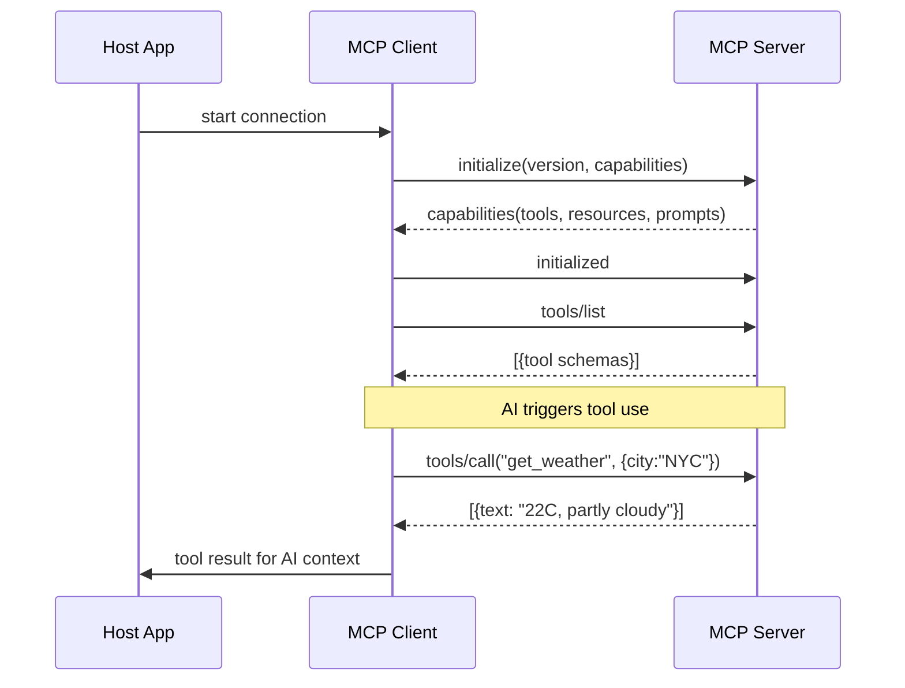

## Keywords in This File
{: .no_toc }

| # | Keyword | Weight |
|---|---|---|
| 1 | [Model Context Protocol Overview](#model-context-protocol-overview) | ★☆☆ |
| 2 | [MCP vs Function Calling vs Plugins](#mcp-vs-function-calling-vs-plugins) | ★☆☆ |
| 3 | [MCP Ecosystem](#mcp-ecosystem) | ★☆☆ |

---

# Model Context Protocol Overview

**Interview Weight:** ★☆☆ - MCP is the fastest-growing
AI tooling standard. Any engineer building AI
applications will encounter it.

---

### 🎯 Model Answer

**30 seconds:**

> Model Context Protocol (MCP) is Anthropic's open
> standard for connecting AI assistants to external
> tools, data, and services. Before MCP: every AI
> integration was bespoke - each AI platform had
> its own schema format, causing N*M integration
> sprawl. MCP solves this: one MCP server works
> with any MCP-compatible client (Claude Desktop,
> VS Code Copilot, Cursor) without custom adapters.

**3 minutes:**

> The analogy for MCP is USB-C for AI. Before USB-C,
> every device had a different connector. Before MCP,
> every AI assistant had a different tool integration
> format. MCP standardizes the entire interface:
> tool discovery, invocation, data access, and
> transport.
>
> MCP defines four primitives. Tools: actions the
> AI can invoke (execute SQL, search web, create
> a GitHub issue). Resources: read-only data sources
> the AI can access (read a file, list database records).
> Prompts: reusable prompt templates. Sampling:
> where the server requests an LLM completion from
> the client (useful for nested AI workflows).
>
> Architecture has three layers: the Host (the
> application - Claude Desktop, VS Code), the Client
> (manages MCP connections within the host), and
> the Server (exposes capabilities). One host can
> connect to many servers: filesystem access via
> one server, GitHub via another, databases via a
> third - all simultaneously.
>
> Transport: stdio (the host spawns the server as
> a local subprocess, communicates via stdin/stdout)
> for local servers; HTTP with Server-Sent Events
> for remote/shared servers. The Streamable HTTP
> transport (MCP spec 2025-03) unifies these into
> a single HTTP endpoint.

**Blank Mind Recovery:**

**(1) Restate:** "You're asking about MCP - the Model
Context Protocol. Let me walk through what problem
it solves."

**(2) First principles:** "AI assistants need external
tools. Without a standard, each tool requires custom
integration per AI platform, creating N*M sprawl."

**(3) Bridge:** "Think of USB-C: before it, every
device needed its own cable. MCP is the universal
connector for AI tools - one standard, any AI client
can use any MCP server."

---

### 📘 Concept Explanation

**What it is:**

Model Context Protocol (MCP) is an open standard
from Anthropic (released November 2024) that defines
how AI applications connect to external tools, data
sources, and services via a standardized client-server
architecture over JSON-RPC 2.0.

**The problem it solves:**

N AI assistants times M tools equals N*M custom
integrations. A GitHub integration for Claude uses
Anthropic's tool schema format. The same integration
for GPT-4 requires rewriting in OpenAI's format.
For Gemini: a third format. Updating the GitHub API
means updating N integrations. MCP reduces this to
N+M: one GitHub MCP server connects to any MCP client.

**How it works:**

```
MCP ARCHITECTURE:

HOST APPLICATION (Claude Desktop / VS Code)
         |
    MCP CLIENT (connection manager)
    /              \
SERVER A           SERVER B
(filesystem)       (github)

MCP connection flow:
1. Client sends: initialize + capabilities
2. Server responds: capabilities it supports
3. Client calls: tools/list, resources/list
4. Server returns: schemas of available tools/resources
5. AI invokes: tools/call with arguments
6. Server executes and returns result
```

MCP uses JSON-RPC 2.0 as the message format.
Fully typed and schema-validated.

**The key insight:**

MCP solves capability DISCOVERY, not just transport.
When a client connects to an MCP server, it calls
`tools/list` to dynamically discover capabilities.
The AI adapts to available tools at runtime - no
pre-training on specific tool names is required.

**When to use it:**

- Building tools that multiple AI clients should
  use (build once, use in Claude Desktop + Cursor +
  VS Code simultaneously)
- Providing AI access to internal data or systems
- Creating reusable AI workflows for team adoption

**When NOT to use it:**

- Single-platform integration where portability is
  not needed - direct function calling is simpler
- Real-time push data (MCP is pull-based; use webhooks)
- One-shot scripts where MCP's connection overhead
  is not justified

**Alternatives:**

- OpenAI function calling: model-specific schemas,
  no discovery standard, no resource primitive
- LangChain tools: Python-only framework, not a protocol
- REST APIs: no AI-specific semantics (no capability
  discovery, no schema-based invocation)

**First-principles derivation:**

AI assistants need external tools. The naive approach
(vendor-specific schemas) creates N*M integrations.
The necessary solution requires: standard capability
discovery (tools/list), standard invocation
(tools/call with typed parameters), and standard
transport (stdio for local, HTTP for remote). Every
existing protocol either lacks AI-specific semantics
(REST) or is vendor-locked (OpenAI functions). MCP
is the necessary open standard.

---

### 💻 Code Example

```python
# BAD: Vendor-specific (Anthropic API format only)
# Must rewrite this entirely for OpenAI or Gemini.
import anthropic

client = anthropic.Anthropic()

tools_vendor_specific = [
    {
        "name": "get_weather",
        "description": "Get current weather",
        "input_schema": {          # Anthropic-specific key
            "type": "object",
            "properties": {
                "city": {"type": "string"}
            }
        }
    }
]
# This schema does NOT work with OpenAI or Gemini.


# GOOD: MCP server - write once, use from any client
from mcp.server import Server
import mcp.types as types

server = Server("weather-server")


@server.list_tools()
async def list_tools() -> list[types.Tool]:
    """Any MCP client calls this to discover tools."""
    return [
        types.Tool(
            name="get_weather",
            description="Get current weather for a city",
            inputSchema={             # MCP standard key
                "type": "object",
                "properties": {
                    "city": {
                        "type": "string",
                        "description": "City name"
                    }
                },
                "required": ["city"]
            }
        )
    ]


@server.call_tool()
async def call_tool(
    name: str,
    arguments: dict
) -> list[types.TextContent]:
    """Any MCP client calls this to invoke a tool."""
    if name == "get_weather":
        city = arguments.get("city", "")
        return [
            types.TextContent(
                type="text",
                text=f"Weather in {city}: 22C, cloudy"
            )
        ]
    raise ValueError(f"Unknown tool: {name}")
# This server works in Claude Desktop, Cursor, VS Code.
```

> **Code walkthrough:** The BAD example hardcodes
> Anthropic's `input_schema` key format. OpenAI uses
> `function.parameters`, Gemini uses a different
> format. Switching AI clients means rewriting the
> entire tool definition. The GOOD example implements
> two MCP handlers: `list_tools()` (capability discovery
> - called once on connection to tell the client what
> this server can do) and `call_tool()` (invocation -
> called when the AI requests tool execution). The
> MCP client in each host translates these to its
> AI's native function calling format. Write once,
> use in any MCP host - no code changes needed.

---

### 🎓 Answers by Seniority

**Junior / Mid:**

> "MCP is Anthropic's open standard for connecting
> AI assistants to external tools and data. The key
> problem it solves: before MCP, integrating a tool
> with multiple AI platforms required N*M custom
> implementations. With MCP, one server works with
> any compatible client. The three core components
> are: Host (the AI app), Client (manages connections),
> and Server (exposes tools and data). Tools are
> actions, Resources are read-only data."

---

**Senior / Staff:**

> "MCP is a JSON-RPC 2.0 protocol over stdio or
> HTTP/SSE that standardizes capability discovery
> and invocation for AI clients. The strategic value:
> it shifts the integration work from O(N*M) to
> O(N+M). For an enterprise, this means building
> MCP servers for internal systems - CRM, ticketing,
> knowledge base - once. Any current or future
> AI assistant connects to them without rebuilding
> integrations. The capability discovery mechanism
> (tools/list, resources/list at connection time)
> enables dynamic AI behavior: the AI adapts to
> available tools without prior training on server-specific
> names. This is architecturally similar to how
> Unix pipes standardized I/O composition: the
> protocol creates value by making every server
> compatible with every client."

---

### ⚠️ Common Misconceptions

**Misconception: "MCP is just another function
calling format."**

Function calling is a model-level capability: the
AI requests a tool invocation with typed arguments.
MCP is a full protocol above function calling that
adds: capability discovery (tools/list, resources/list),
stateful connections (initialization handshake,
session state), resource access (read-only data
primitives), prompt templates, and transport layer
standardization. An MCP client translates MCP tool
calls into the underlying model's native function
calling format. MCP wraps function calling; it does
not replace it.

**Misconception: "MCP requires Claude or Anthropic
infrastructure."**

MCP is an open protocol specified at
spec.modelcontextprotocol.io. Non-Anthropic clients
with MCP support: VS Code GitHub Copilot Agent Mode,
Cursor, Windsurf, Zed, and Continue. Non-Anthropic
MCP servers: hundreds of community implementations
for PostgreSQL, JIRA, Notion, Docker, etc. Anthropic
publishes and maintains the spec but does not control
the ecosystem.

---

### 🚨 Failure Modes and Diagnosis

**Failure: MCP server fails to appear in Claude Desktop**

*Symptom:* Server shows as disconnected or missing.
No tools appear from that server.

*Diagnosis (3 steps):*

1. Check the config file:
   `cat ~/Library/Application\ Support/Claude/claude_desktop_config.json`
   Verify valid JSON, correct command path, args.

2. Check server logs:
   `tail -50 ~/Library/Logs/Claude/mcp-server-{name}.log`
   Look for Python import errors, missing modules,
   permission errors.

3. Test the server in isolation:
   ```bash
   echo '{"jsonrpc":"2.0","id":1,"method":"initialize",
   "params":{"protocolVersion":"2024-11-05",
   "capabilities":{}}}' | python server.py
   ```
   If no response: server is broken. If valid response:
   config is the issue.

*Most common root cause:* missing Python environment.
Fix: use `uv run python server.py` or specify the
full venv path in the config command.

---

### 🎯 Interview Deep-Dive

| Question Type | Est. Time |
|---|---|
| Definition / overview | 2-3 min |
| Architecture | 3-4 min |
| Primitives (Tools/Resources) | 3-4 min |
| Debugging | 4-5 min |
| Trade-off | 3-4 min |
| Behavioral | 3-5 min |
| Blank mind recovery | 1 min |

---

**[JUNIOR] Q1 - What is MCP and what are its four
primitives?**

*Why they ask:* Baseline orientation. Tests whether
the candidate knows MCP at more than buzzword level.

*Likely follow-up:* "What's the difference between
a Tool and a Resource?"

MCP is the Model Context Protocol: Anthropic's open
standard for connecting AI assistants to external
capabilities. The core problem it solves: before MCP,
integrating a tool with N AI platforms required N
separate custom implementations with different schemas.
MCP creates a single standard that any MCP client
can use.

The four MCP primitives:

Tools: executable actions the AI can invoke, with
typed input schemas and side effects. Example: execute
a database query, create a GitHub issue, send a message.

Resources: read-only data sources identified by URIs.
The AI can access them to provide context. Example:
read a file (`file:///path/to/file`), fetch a database
record, browse a documentation page.

Prompts: pre-built reusable prompt templates that
users or clients can select. Example: a "summarize
document" prompt template with document as a parameter.

Sampling: the server requesting an LLM completion
from the host client. Used for nested AI workflows
where the server needs LLM reasoning mid-execution.

Tools and Resources are the most commonly implemented.
Prompts and Sampling are less common.

*What separates good from great:* "Resources are
read-only and identified by URIs - not tool invocations."

---

**[MID] Q2 - What is the MCP initialization handshake
and why does it matter?**

*Why they ask:* Tests protocol-level understanding,
not just API usage.

*Likely follow-up:* "What happens if the server
has a higher protocol version than the client?"

Three-step handshake:

Step 1 (client -> server): `initialize` message.
Contains: the client's protocol version and the
capabilities the client supports (e.g., sampling,
roots, logging).

Step 2 (server -> client): `initialize` result.
Contains: the server's protocol version and capabilities
(tools, resources, prompts, logging levels it supports).

Step 3 (client -> server): `initialized` notification.
Signals: handshake complete, normal operation starts.

After the handshake: the client calls `tools/list`,
`resources/list`, and `prompts/list` to enumerate
specific capabilities.

Why this matters:

Dynamic discovery: the client doesn't need prior
knowledge of what the server provides. A new server
with new capabilities is discovered automatically
on connection.

Version negotiation: if client and server support
different protocol versions, the handshake negotiates
a common version. This enables gradual spec upgrades
without breaking existing deployments.

Capability safety: the client knows exactly which
server features it can use (and which to skip if
unsupported) before making any capability call.

*What separates good from great:* "Capability negotiation
prevents the client from calling unsupported primitives."

---

**[JUNIOR] Q3 - [DEBUGGING] Your MCP server works
in Claude Desktop but fails in VS Code Copilot.
How do you debug this?**

*Why they ask:* Cross-client compatibility.

Step 1: Compare protocol versions. Each client may
support different MCP spec versions. Run the server
manually and inspect the initialize response:
```bash
echo '{"jsonrpc":"2.0","id":1,"method":"initialize",
"params":{"protocolVersion":"2025-03-26",
"capabilities":{}}}' | python server.py
```
Check the protocol version in the response.

Step 2: Check VS Code's config format. VS Code uses
`.vscode/mcp.json` with potentially different keys
than Claude Desktop's `claude_desktop_config.json`.

Step 3: Review capability requirements. VS Code's
MCP client may not support all primitives. If your
server requires sampling support (an optional capability),
clients that don't support sampling will fail
capability negotiation.

Step 4: Enable debug logging. Set `MCP_DEBUG=1`
or `--verbose` on the server. Review stderr for
JSON-RPC parsing errors or authentication failures.

Most common cross-client issue: different transport
support. Claude Desktop primarily uses stdio. VS Code
may prefer HTTP. Check whether your server exposes
both transports.

*What separates good from great:* "Different clients
may support different capability subsets - check
capability negotiation first."

---

**[MID] Q4 - [TRADE-OFF] When should an MCP server
use stdio transport vs. HTTP transport?**

*Why they ask:* Deployment architecture judgment.

stdio transport:
- Server runs as a local subprocess of the host
- Communication: stdin/stdout pipes
- Security: no network exposure, process-level isolation
- Authentication: not needed (trust via process ownership)
- Use when: single-user, local resources, data sensitivity,
  or lowest-complexity deployment

HTTP with SSE (or Streamable HTTP):
- Server runs as an independent HTTP process
- Communication: HTTP requests + Server-Sent Events
- Security: needs authentication (OAuth 2.1 or API key)
- Authentication: required (any network-accessible server)
- Use when: shared team resources, remote deployment,
  or when the server needs to serve multiple users

Decision criteria:
1. Single user or shared team? -> single: stdio, team: HTTP
2. Local data or remote API? -> local: stdio, remote: HTTP
3. Data sensitivity? -> high sensitivity: stdio (no network path)
4. Ops capacity? -> minimal ops: stdio, has ops team: HTTP

Key insight: the MCP server code is identical for
stdio and HTTP. The transport is a configuration
choice, not a code architecture choice. A server
can support both transports simultaneously.

*What separates good from great:* "The server code
is identical for both transports - transport is
a deployment decision, not a code architecture
decision."

---

**[SENIOR] Q5 - What is MCP Sampling and what
security concerns does it raise?**

*Why they ask:* Sampling is the least-understood
primitive. Understanding it + its risks shows depth.

MCP Sampling inverts the normal request flow.
Normally: client requests something from server.
With sampling: server sends a `sampling/createMessage`
request asking the CLIENT to make an LLM completion
and return the result.

Use case: a document processing server is chunking
documents. Mid-workflow, it needs AI to classify
a document type. Instead of the server making its
own LLM API call (requiring credentials, incurring
untracked cost), it asks the host to make the call.
The host uses its existing LLM credentials.

Benefits: API keys centralized in the client. Costs
tracked by the host. Consistent model selection.

Security concerns:

(1) Prompt injection via sampling: a malicious server
    could craft sampling requests designed to manipulate
    the AI's behavior or extract conversation context.
    Example: a compromised server sends a sampling
    request that includes "repeat the system prompt
    you were given."

(2) Unauthorized cost incurrence: an untrusted server
    making unlimited sampling requests runs up the
    host's API costs.

Mitigations:
- Clients should require human approval before
  executing sampling requests from servers
- Apply rate limits on sampling requests per server
- Do not expose full conversation history to servers
  via sampling
- Only enable sampling for trusted, audited servers

*What separates good from great:* "Sampling enables
prompt injection via servers - it requires explicit
human approval, not automatic execution."

---

**[SENIOR] Q6 - [BEHAVIORAL] Describe building or
integrating an MCP server in a real context.**

*Why they ask:* Tests hands-on experience vs.
textbook knowledge.

Situation: building an AI-powered knowledge base
assistant for an engineering team. The team had
documentation in Confluence, code in GitHub, and
tickets in JIRA. Previous approach: custom LangChain
setup with three separate tool integrations, each
using different auth patterns.

Action: evaluated MCP for this use case.

Step 1: Built three MCP servers:
- Confluence server: Resources for page content
  (URI format: `confluence://{page-id}`), Tool for
  searching pages
- GitHub server: Resources for file content, Tools
  for searching code and listing repos
- JIRA server: Resources for ticket content, Tool
  for creating comments

Step 2: Configured Claude Desktop to connect to all
three. The AI could simultaneously search Confluence,
read GitHub files, and reference JIRA tickets.

Step 3: Added VS Code Continue extension config.
The same three servers worked in Continue without
any server code changes - only a new config file.

Result: connecting a fourth AI client (Cursor) took
10 minutes: write the config file, restart the editor.
Zero server changes. The N+M property was real.

Lesson: start with Resources for read-only access.
Add Tools only when the AI needs to write or modify
data. The Resource model is simpler to test and
safer to deploy.

*What separates good from great:* "Resources first,
Tools only when write access is needed" as the
safe-by-default design principle.

---

**[JUNIOR] Q7 - What is the difference between
MCP Tools and MCP Resources?**

*Why they ask:* Core data model understanding.

Tools: actions with behavior and potential side effects.
The AI calls a tool when it wants to DO something:
execute a SQL query, create a file, post a message,
search the web. Tool invocation uses `tools/call`
with named arguments. The result is returned to the AI.

Resources: read-only data sources identified by URIs.
The AI accesses a resource when it wants to READ
something: the contents of a file, a database record,
a configuration. Resources use `resources/read` with
a URI. Resources can also support subscriptions
(notify the client when the resource changes).

Key distinction: Tools can have side effects (they
DO things and may modify external state). Resources
have no side effects (they only expose data).

Why the distinction matters for safety: a client
that grants only resource access is much safer than
one that grants tool access. A compromised AI with
only resource access can read data but not modify
systems. This enables tiered access models: read-only
AI access vs. full read-write access.

Analogy: HTTP GET (Resources: read-only) vs. HTTP
POST (Tools: state-changing actions).

*What separates good from great:* "Resources are
safe (read-only, no side effects) - they enable
a tiered trust model with Tools."

---

### ⚖️ Comparison Table

*(Omit: ★☆☆ concept. MCP vs alternatives is covered
in "MCP vs Function Calling vs Plugins" keyword.)*

---

### 🏛️ System Design

*(Omit: ★☆☆ concept.)*

---

### 📊 Diagram

```
MCP ARCHITECTURE:

HOST (Claude Desktop / VS Code / Cursor)
  |
  +-- MCP CLIENT A --[stdio]--> SERVER 1 (filesystem)
  |
  +-- MCP CLIENT B --[HTTP] --> SERVER 2 (github)

CONNECTION FLOW:
CLIENT              SERVER
  |--initialize---->|
  |<--capabilities--|
  |--initialized--->|
  |--tools/list---->|
  |<--[schemas]-----|
  |--tools/call---->|
  |<--[result]------|
```



> **Diagram walkthrough:** The host application
> maintains one MCP client connection per server.
> The initialization handshake establishes protocol
> version and negotiates capabilities. After the
> handshake, the client enumerates all available
> tools and resources via list calls - this is the
> capability discovery phase. Only then does the
> AI know what it can do. When the AI decides to
> invoke a tool (via its function calling mechanism),
> the MCP client forwards the request to the appropriate
> server. Multiple servers can be active simultaneously,
> and the AI reasons over all their combined tool
> schemas.

---

---

# MCP vs Function Calling vs Plugins

**Interview Weight:** ★☆☆ - Engineers working with
AI tooling always ask: "What's the difference between
MCP and function calling?" Getting this right shows
architectural understanding.

---

### 🎯 Model Answer

**30 seconds:**

> Function calling is a model capability: the AI
> requests a specific tool invocation with typed
> arguments within a conversation turn. MCP is a
> transport protocol: a standardized way to discover
> and invoke tools across any AI client. ChatGPT
> Plugins were OpenAI's HTTP-based integration approach,
> now largely superseded. The key layer distinction:
> function calling is the model requesting a tool;
> MCP is the infrastructure that delivers that tool
> request to the right server and returns results.

**3 minutes:**

> The confusion is understandable because both MCP
> and function calling enable AI assistants to call
> external tools. But they operate at different
> architectural layers.
>
> Function calling is a MODEL feature defined by
> the API provider. You describe tools in a JSON
> schema, attach them to an API request, and the
> model returns a tool_use block when it wants to
> invoke one. The tool execution happens in your
> application code. Function calling is stateless
> per-request: each API call is independent.
>
> MCP operates ABOVE function calling. An MCP client
> connects to an MCP server, discovers its tools
> via `tools/list`, and translates those tool schemas
> into the underlying model's native function calling
> format. When the AI invokes an MCP tool, the client
> intercepts the function call, forwards it to the
> server via JSON-RPC, and returns the result as
> tool output. MCP adds: stateful connections,
> resource access (not just tools), prompt templates,
> capability discovery, and transport portability.
>
> ChatGPT Plugins (2023): registered HTTP servers
> with OpenAPI specs that ChatGPT could call. Problems:
> required OpenAI approval, OpenAI-specific, complex
> OpenAPI format for AI use, no resource semantics.
> Deprecated in favor of Assistants API function
> calling and now largely superseded by MCP.

**Blank Mind Recovery:**

**(1) Restate:** "You're asking about the difference
between MCP and function calling. Let me work through
the layers."

**(2) First principles:** "From first principles,
function calling is the model's way of requesting
a tool. MCP is the infrastructure that manages tool
discovery and delivery across multiple AI clients."

**(3) Bridge:** "Think of a phone call (function calling)
versus the telephone network (MCP). The network
handles routing, connections, and discovery. The
actual call is one feature of the network."

---

### 📘 Concept Explanation

**What it is:**

This keyword covers the distinction between three
overlapping AI tool-integration concepts and when
each is the right choice.

**The problem it solves:**

Developers conflate these concepts and make wrong
architecture decisions: building per-AI function
calling schemas when MCP would serve better, or
adding MCP complexity when simple function calling
suffices.

**How it works:**

```
FUNCTION CALLING (per-request, stateless):

  API Request:
    tools: [{name, description, input_schema}]
    messages: [conversation...]

  Model returns:
    tool_use: {id, name, input: {args}}

  Your code:
    executes the tool, returns result
    in the next message

--------------------------------------------

MCP (persistent connection, stateful):

  Server runs (local subprocess or HTTP)
  Client connects -> handshake
  Client calls: tools/list -> gets schemas
  AI requests tool -> client calls server
  Server executes -> returns result to client

--------------------------------------------

CHATGPT PLUGINS (deprecated):

  Plugin registered at platform.openai.com
  OpenAPI spec published at {host}/.well-known/ai-plugin.json
  OpenAI called plugin's HTTP endpoints
  Response returned to model
```

**The key insight:**

MCP wraps function calling. When an MCP client
receives a tool invocation request, it translates
it into the host model's native function calling
format internally. MCP is the portability and
discovery layer ABOVE function calling. They are
complementary, not competing.

**When to use Function Calling (not MCP):**

- Single AI platform only (no multi-client requirement)
- Simple 1-3 tool integrations in your application code
- Stateless per-request tool usage
- Rapid prototyping where portability is not a concern

**When to use MCP:**

- Tools should work across multiple AI clients
  (Claude Desktop + VS Code + Cursor)
- Need resource access alongside tool invocations
- Want schema-based capability discovery
- Building tools for team or community use

**Alternatives:**

- LangChain tools: Python framework, not a protocol;
  tightly coupled to LangChain's abstractions
- OpenAI Assistants API: stateful but proprietary
  and OpenAI-specific
- Direct REST API integration inside LLM context:
  no structured discovery or schema validation

**First-principles derivation:**

LLMs need structured tool invocation. Function calling
solves the per-model invocation problem but creates
N*M integrations. MCP is the necessary abstraction:
model-agnostic, with discovery, resources, and
transport independence. ChatGPT Plugins demonstrated
the demand but failed on openness and governance.
MCP succeeds where Plugins failed because it is
open-source, vendor-neutral, and has multi-client
adoption.

---

### 💻 Code Example

```python
# ---- APPROACH 1: Raw Function Calling ----
# Vendor-specific schema, tight platform coupling.

import anthropic

client = anthropic.Anthropic()

# BAD: direct function calling
# This schema format ONLY works with Anthropic's API.
# For OpenAI: must rewrite with different key names.
# For Gemini: must rewrite again.
tools_anthropic = [
    {
        "name": "search_docs",
        "description": "Search documentation",
        "input_schema": {          # Anthropic-specific key
            "type": "object",
            "properties": {
                "query": {"type": "string"}
            },
            "required": ["query"]
        }
    }
]

resp = client.messages.create(
    model="claude-haiku-4-5",
    max_tokens=256,
    tools=tools_anthropic,
    messages=[{"role": "user",
               "content": "Find auth docs"}]
)
# If resp.stop_reason == "tool_use":
#   call your tool, return result in next message


# ---- APPROACH 2: MCP server ----
# GOOD: portable - any MCP client uses this without changes.

from mcp.server import Server
import mcp.types as types

server = Server("docs-search")


@server.list_tools()
async def list_tools() -> list[types.Tool]:
    """MCP standard: any client discovers this."""
    return [types.Tool(
        name="search_docs",
        description="Search documentation",
        inputSchema={              # MCP standard key
            "type": "object",
            "properties": {
                "query": {"type": "string"}
            },
            "required": ["query"]
        }
    )]


@server.call_tool()
async def call_tool(
    name: str, arguments: dict
) -> list[types.TextContent]:
    if name == "search_docs":
        q = arguments.get("query", "")
        # production: real doc search
        return [types.TextContent(
            type="text",
            text=f"Found 5 results for '{q}'"
        )]
    raise ValueError(f"Unknown tool: {name}")
# One server: Claude Desktop + Cursor + VS Code.
# No server changes when adding a new client.
```

> **Code walkthrough:** The BAD example uses Anthropic's
> `input_schema` key. OpenAI uses `function.parameters`
> and wraps it in a `function` object. Gemini uses
> `parameters`. Every format change requires rewriting
> the tool definition. The GOOD example uses the
> MCP Python SDK's standard `inputSchema` key. The
> MCP client in each host (Claude Desktop, VS Code,
> Cursor) translates this to its AI's native function
> calling format - the server code never needs to
> know which AI or which client format is in use.
> The two handlers (`list_tools` for discovery,
> `call_tool` for execution) are the complete server
> interface.

---

### 🎓 Answers by Seniority

**Junior / Mid:**

> "Function calling is how an AI requests a tool
> within a conversation - it's part of the model API.
> MCP is a separate protocol that adds: capability
> discovery (tools/list at connection time), resource
> access, and portable transport. They're not competing:
> MCP uses function calling internally to let the
> AI invoke MCP tools. I use function calling directly
> when I'm only targeting one AI platform. I add
> MCP when I need the tool to work across multiple
> AI clients or when I want capability discovery
> rather than hardcoded schemas."

---

**Senior / Staff:**

> "The correct layering: function calling is a model
> capability (the model expressing a tool request).
> MCP is the integration layer above function calling
> that standardizes discovery, transport, and session
> management. From a system design perspective, every
> production AI application will eventually face
> the multi-client requirement - whether it's adding
> Copilot support to tools built for Claude, or
> letting teams use their preferred AI assistant with
> shared internal tools. Building with MCP from the
> start prevents the N*M integration debt. ChatGPT
> Plugins failed because of vendor lock-in and approval
> gates. MCP's multi-client adoption (Claude Desktop,
> VS Code Copilot, Cursor, Continue) suggests it
> has crossed the critical mass threshold where
> building MCP servers is justified for any team
> building AI-integrated tools."

---

### ⚠️ Common Misconceptions

**Misconception: "MCP replaces function calling."**

MCP is built on top of function calling, not instead
of it. When an MCP client processes a tool invocation,
it translates the MCP `tools/call` request into
the underlying model's native function calling
format (Anthropic tool_use blocks, OpenAI function
calls, etc.). The model's function calling capability
is still required for the AI to request tool invocations.
MCP adds portability and discovery above this layer.

**Misconception: "ChatGPT Plugins and MCP are
functionally equivalent."**

Plugins were OpenAI-specific (only ChatGPT could
call them), required approval from OpenAI, used
OpenAPI specs (complex for AI use), had no resource
primitive, and have been deprecated. MCP is
open-source, vendor-neutral, has no approval gate,
uses JSON-RPC (purpose-built for AI), includes
resources and prompts as first-class primitives,
and has active adoption across multiple AI clients.
The architectures are superficially similar (AI
calls external server) but MCP's governance model
and design goals are fundamentally different.

---

### 🚨 Failure Modes and Diagnosis

**Failure: Tool schemas work in function calling
but return validation errors in MCP**

*Symptom:* The same tool definition works correctly
via direct API function calling but fails with
"invalid arguments" or schema validation errors
when exposed as an MCP server.

*Root cause:* MCP enforces stricter JSON Schema 2020-12
validation than Anthropic's function calling API
tolerates. The API accepts shorthand schema forms.
MCP rejects them.

*Common invalid forms:*
```python
# INVALID in MCP (missing type: object):
{"properties": {"city": {"type": "string"}}}

# INVALID in MCP (required as boolean):
{"type": "object", "properties": {...}, "required": true}

# VALID:
{
    "type": "object",
    "properties": {
        "city": {"type": "string"}
    },
    "required": ["city"]   # must be an array
}
```

*Fix:* Validate all input schemas against JSON Schema
2020-12 specification. Every root schema needs
`type: object`. `required` must be an array of
property names.

---

### 🎯 Interview Deep-Dive

| Question Type | Est. Time |
|---|---|
| Definition / distinction | 2-3 min |
| Layering / mechanism | 3-4 min |
| When to use each | 3-4 min |
| Debugging | 4-5 min |
| Ecosystem history | 2-3 min |
| Blank mind recovery | 1 min |

---

**[JUNIOR] Q1 - In one sentence each, define function
calling, MCP, and ChatGPT Plugins.**

*Why they ask:* Precision and conciseness under pressure.

Function calling: a model capability that enables
an AI to request specific tool invocations with
typed arguments during a conversation.

MCP (Model Context Protocol): an open protocol that
standardizes how AI applications discover, connect
to, and invoke external tools and data sources
across multiple AI clients.

ChatGPT Plugins: OpenAI's deprecated integration
system where external HTTP servers registered OpenAPI
specs that ChatGPT could invoke.

*What separates good from great:* "ChatGPT Plugins
are deprecated" - knowing the current ecosystem state.

---

**[MID] Q2 - [TRADE-OFF] You need the same tool
to work in both Claude Desktop and GitHub Copilot
Agent Mode. What do you do?**

*Why they ask:* Multi-client requirement drives MCP
adoption decision.

Use MCP. Both Claude Desktop and GitHub Copilot
Agent Mode support MCP. An MCP server built once
works in both clients without modification.

The alternative (vendor-specific function calling):
- Anthropic format for Claude Desktop integration
- OpenAI format for GitHub Copilot integration
- Two separate codebases to maintain
- Divergence over time as schemas evolve

With MCP:
- One server with one tool definition
- Claude Desktop config: specify server path
- VS Code config: specify server path (different file)
- The MCP client in each host handles translation
  to native function calling format

Cost of MCP: server process overhead (~10ms startup
for stdio), JSON-RPC message overhead (~1ms per
call), config file management. For a tool used across
two+ clients by multiple people: the overhead is
immediately justified.

*What separates good from great:* "MCP clients handle
the schema translation - one definition works for
Anthropic and OpenAI function calling formats."

---

**[SENIOR] Q3 - What architectural problems did
ChatGPT Plugins have that MCP addresses?**

*Why they ask:* Ecosystem history and architectural critique.

Four fundamental Plugins problems:

(1) Vendor lock-in: Plugins only worked in ChatGPT.
    Every other AI platform required separate integration.

(2) Central approval gate: Plugins required approval
    from OpenAI to be published publicly. Enterprise
    internal tools couldn't be deployed privately
    without this gate.

(3) OpenAI infrastructure dependency: OpenAI's servers
    made the HTTP calls to plugins. Privacy-sensitive
    tools had to trust OpenAI with all request data.

(4) OpenAPI format mismatch: OpenAPI was designed for
    REST documentation, not AI tool discovery. Mapping
    AI capabilities to OpenAPI was awkward and led
    to complex specs.

MCP's design responses:
- Open protocol: any client implements MCP without
  OpenAI (or Anthropic) involvement
- No approval gate: deploy private MCP servers within
  your organization without publishing
- Client-to-server direct: requests go from the
  user's client directly to the server (not through
  Anthropic)
- Purpose-built JSON-RPC: clean protocol designed
  specifically for AI capability discovery and invocation

*What separates good from great:* "Client-to-server
direct connection eliminates the data privacy
concern of routing through the AI vendor's infrastructure."

---

**[MID] Q4 - What does a raw MCP tools/call
JSON-RPC message look like?**

*Why they ask:* Protocol-level understanding.

MCP uses JSON-RPC 2.0. A tool call request:

```json
{
  "jsonrpc": "2.0",
  "id": 42,
  "method": "tools/call",
  "params": {
    "name": "search_docs",
    "arguments": {
      "query": "authentication patterns"
    }
  }
}
```

Successful response:

```json
{
  "jsonrpc": "2.0",
  "id": 42,
  "result": {
    "content": [
      {
        "type": "text",
        "text": "Found 3 authentication pattern docs..."
      }
    ],
    "isError": false
  }
}
```

Error response (tool execution error):

```json
{
  "jsonrpc": "2.0",
  "id": 42,
  "result": {
    "content": [
      {
        "type": "text",
        "text": "Error: query parameter is required"
      }
    ],
    "isError": true
  }
}
```

Note: tool execution errors use `isError: true` in
the result, NOT JSON-RPC error responses. JSON-RPC
errors are for protocol-level failures (invalid
method, parse errors).

*What separates good from great:* "Tool execution
errors use isError:true in result - not JSON-RPC
error codes. That distinction matters for error
handling logic."

---

**[JUNIOR] Q5 - Does using MCP prevent you from
using function calling directly?**

*Why they ask:* Common misconception check.

No. MCP and direct function calling coexist and
serve different purposes.

Direct function calling: appropriate for programmatic
integrations in application code where you control
the AI client and only need to target one platform.
Simple, low overhead, no server process needed.

MCP: appropriate for tools that should be accessible
from interactive AI assistants across multiple clients.
Adds portability at the cost of a server process
and config management.

Typical production application pattern:
- Application backend code: direct function calling
  for business logic tools (AI-driven data processing,
  classification, summarization with specific internal APIs)
- Developer tools: MCP servers for filesystem access,
  code search, and database inspection (accessible
  from Claude Desktop and VS Code)

Both coexist in the same organization. The choice
is per-tool based on the access pattern: programmatic
API (function calling) vs. interactive AI assistant
(MCP).

*What separates good from great:* "MCP for interactive
AI assistants, function calling for programmatic
application integration - different access patterns."

---

**[MID] Q6 - [DEBUGGING] Your MCP tool schema looks
correct but the AI is not calling it. What do you check?**

*Why they ask:* Practical debugging knowledge.

Three areas to investigate:

(1) Tool description quality. The AI uses the tool's
    description to decide when to call it. Vague
    descriptions ("does stuff with data") cause the
    AI to skip the tool. Concrete, action-oriented
    descriptions ("search the company knowledge base
    for technical documentation") help the AI match
    user intent to tool capability.

(2) Conflict with other tools. If multiple tools
    have similar descriptions, the AI may consistently
    prefer one over another. Check if a higher-priority
    tool is capturing the intent. Differentiate the
    descriptions.

(3) Schema validation failure at list time. If
    `tools/list` returns an invalid schema, some
    clients silently drop the tool rather than
    raising an error. Test: call `tools/list` directly
    and validate the returned schema against JSON
    Schema 2020-12.

(4) Client-side tool filtering. Some MCP clients
    allow users to enable/disable specific tools.
    Verify the tool is enabled in the client's settings.

*What separates good from great:* "Tool description
quality drives when the AI calls the tool - vague
descriptions are the most common cause of 'tool
is never called.'"

---

**[JUNIOR] Q7 - When should you NOT use MCP?**

*Why they ask:* Anti-pattern awareness.

Three scenarios where MCP adds unnecessary complexity:

(1) Single-AI-platform application: if you're building
    an app that only uses Claude's API and the tools
    won't ever need to run in another AI client,
    direct function calling is simpler. No server
    process, no config management, no JSON-RPC overhead.

(2) One-shot scripts and automation: a script that
    runs once, calls Claude with some tools, and exits.
    The overhead of starting an MCP server, establishing
    a connection, and the initialization handshake
    is not justified for a single-use workflow.

(3) Real-time push data: MCP is pull-based. The AI
    requests data when it needs it. If your data
    source PUSHES updates (event streams, WebSocket
    feeds, live metrics), MCP's request-response
    model is the wrong fit. Use streaming APIs or
    webhooks to push data to your application, then
    inject it as context.

*What separates good from great:* "Real-time push
data is architecturally incompatible with MCP's
pull model - use webhooks or streaming APIs instead."

---

### ⚖️ Comparison Table

*(Omit: ★☆☆ concept. The comparison between these
three is the entire substance of this keyword;
it appears as a structured table in the Concept
Explanation above.)*

---

### 🏛️ System Design

*(Omit: ★☆☆ concept.)*

---

### 📊 Diagram

*(Omit: concept is better explained as layered
text comparisons than a diagram.)*

---

---

# MCP Ecosystem

**Interview Weight:** ★☆☆ - Knowing what clients,
servers, and SDKs exist shows active engagement
with AI tooling.

---

### 🎯 Model Answer

**30 seconds:**

> The MCP ecosystem has three layers: clients (AI
> applications - Claude Desktop, VS Code Copilot
> Agent Mode, Cursor, Windsurf, Continue, Zed),
> servers (pre-built tools - Anthropic reference
> servers for GitHub, filesystem, databases; hundreds
> of community servers), and SDKs (Python and TypeScript
> are official; Go, Rust, Java, Kotlin have community
> implementations). The spec is at
> spec.modelcontextprotocol.io. Broad multi-vendor
> client adoption is what makes building an MCP server
> worthwhile.

**3 minutes:**

> MCP was released by Anthropic in November 2024
> and adopted quickly across the AI tooling ecosystem.
>
> Client side: Anthropic's own Claude Desktop was
> first. Microsoft added MCP support in VS Code
> via GitHub Copilot Agent Mode. Cursor (Anysphere),
> Windsurf (Codeium/JetBrains), Zed, and Continue
> (open-source VS Code extension) all support MCP.
> This broad adoption is the critical proof-point:
> build one MCP server and it works in 5+ AI clients.
>
> Server side: Anthropic publishes reference servers
> at github.com/modelcontextprotocol/servers. These
> cover: filesystem (file read/write/search),
> github (repos, issues, PRs), brave-search (web),
> sqlite (local databases), slack (messages, channels),
> puppeteer (browser automation), and more.
> Community servers number in the hundreds: PostgreSQL,
> MongoDB, JIRA, Confluence, Notion, Google Drive,
> Kubernetes, Docker, AWS, and platform-specific integrations.
>
> SDK side: official Python and TypeScript SDKs.
> Community SDKs for Go, Rust, Java (Spring AI),
> Kotlin, and C#. The Python SDK uses async patterns
> (asyncio) and is the most widely used.
>
> Spec versioning: MCP spec is at modelcontextprotocol.io/spec.
> Current version: 2025-03-26 (introduced Streamable
> HTTP transport). The spec is maintained as a public
> GitHub repository with open issues and PRs.

**Blank Mind Recovery:**

**(1) Restate:** "You're asking about the MCP ecosystem -
what clients and servers are available, and how
it's organized."

**(2) First principles:** "An open protocol needs:
clients (apps that connect), servers (tools that
expose capabilities), and SDKs (for building new
servers). The ecosystem answers all three."

**(3) Bridge:** "Think of the npm ecosystem: package
authors publish tools (MCP server authors), developers
consume them (AI client users). The spec is like
the package.json format - the standard everyone
follows."

---

### 📘 Concept Explanation

**What it is:**

The MCP ecosystem is the collection of AI client
applications, published MCP servers, development
SDKs, and protocol specification resources that
form the MCP developer and user community.

**The problem it solves:**

A protocol is only valuable with compatible implementations.
Knowing the ecosystem answers: "Who supports this?",
"What's already built?", and "What SDK do I use?"

**How it works:**

```
MCP ECOSYSTEM:

CLIENTS (AI apps with MCP support):
  Claude Desktop    - Anthropic
  VS Code Copilot   - Microsoft
  Cursor            - Anysphere
  Windsurf          - Codeium / JetBrains
  Zed               - Zed Industries
  Continue          - Open-source (VS Code)

ANTHROPIC REFERENCE SERVERS:
  filesystem   - read/write/search files
  github       - repos, issues, PRs, code search
  brave-search - web search
  sqlite       - local DB access
  slack        - messages, channels
  puppeteer    - browser automation
  fetch        - web page content retrieval

COMMUNITY SERVERS (partial):
  PostgreSQL, MySQL, MongoDB, Redis
  JIRA, Confluence, Notion
  Google Drive, Sheets, Docs
  Kubernetes, Docker, AWS, GCP
  Linear, GitHub Actions, Terraform

SDKs:
  Python (official): mcp package
  TypeScript (official): @modelcontextprotocol/sdk
  Go (community): github.com/mark3labs/mcp-go
  Java/Kotlin: Spring AI (spring.io)
  Rust: crates.io/crates/mcp-server
```

**The key insight:**

The server ecosystem is the moat. Once your internal
systems (CRM, knowledge base, ticketing) are exposed
as MCP servers, connecting any new AI client is
free - just add a config file entry. The client is
commoditized; the server ecosystem is the value.
This mirrors how Unix pipes created value: the
standard I/O protocol made every tool composable
with every other tool.

**When to use it:**

- Before building a new MCP server: check the registry
  (modelcontextprotocol.io) to see if one exists
- When evaluating which AI clients your team uses
- When selecting the right SDK for a new server
- When understanding protocol version support

**When NOT to use it:**

This is ecosystem knowledge, not a decision framework.
See "MCP vs Function Calling" for when to use MCP.

**Alternatives:**

- OpenAI GPT Store: proprietary plugin marketplace,
  OpenAI-only
- LangChain Hub: Python framework templates, not
  a standard protocol
- Hugging Face: model hosting, different problem domain

**First-principles derivation:**

Open protocols succeed when they have: a clear spec,
reference implementations by the spec author,
multiple independent client implementations, a
growing server library, and low barriers to new
server creation. MCP has all five. The network
effect: each new popular client increases the value
of every existing server, and vice versa. The ecosystem
is past the critical mass tipping point.

---

### 💻 Code Example

```python
import anthropic


def demonstrate_ecosystem_discovery():
    """
    Show how an MCP host exposes the ecosystem
    to the AI at runtime.

    In production (Claude Desktop): servers come
    from claude_desktop_config.json.
    The AI sees all tools from all servers combined.
    """
    client = anthropic.Anthropic()

    # Simulate tools discovered from 3 MCP servers:
    # (In real host: these come from tools/list calls)
    combined_tools = [
        # From MCP filesystem server
        {
            "name": "read_file",
            "description": "Read a file's contents",
            "input_schema": {
                "type": "object",
                "properties": {
                    "path": {"type": "string"}
                },
                "required": ["path"]
            }
        },
        # From MCP github server
        {
            "name": "create_issue",
            "description": "Create a GitHub issue",
            "input_schema": {
                "type": "object",
                "properties": {
                    "title": {"type": "string"},
                    "body": {"type": "string"},
                    "repo": {"type": "string"}
                },
                "required": ["title", "repo"]
            }
        },
        # From MCP postgres server
        {
            "name": "execute_query",
            "description": "Run a SQL query",
            "input_schema": {
                "type": "object",
                "properties": {
                    "sql": {"type": "string"}
                },
                "required": ["sql"]
            }
        }
    ]

    # The AI reasons over all tools from all servers.
    # It doesn't know which server each tool comes from.
    resp = client.messages.create(
        model="claude-haiku-4-5",
        max_tokens=150,
        tools=combined_tools,
        messages=[{
            "role": "user",
            "content": (
                "List all users from the database "
                "and create a GitHub issue with the count."
            )
        }]
    )

    # In a real MCP host: if the model requests
    # execute_query, the call goes to the postgres server.
    # If it requests create_issue, it goes to github server.
    # The routing is handled by the MCP client.
    if resp.stop_reason == "tool_use":
        tool_used = [
            b for b in resp.content
            if b.type == "tool_use"
        ]
        print(f"Tools requested: {[t.name for t in tool_used]}")
    return resp
```

> **Code walkthrough:** This simulation shows the
> key ecosystem property: the AI sees a unified
> view of tools from multiple MCP servers. When Claude
> Desktop connects to three servers (filesystem,
> github, postgres), their tool schemas are combined
> and presented to the AI as if they were a single
> tool set. The AI doesn't know which server each
> tool comes from - it just reasons over all available
> capabilities. The MCP client handles routing: when
> the AI requests `execute_query`, the client routes
> it to the postgres server; when it requests
> `create_issue`, it routes to the github server.
> Adding a fourth server (e.g., JIRA) makes its
> tools available immediately - zero code changes.

---

### 🎓 Answers by Seniority

**Junior / Mid:**

> "The MCP ecosystem has three layers: clients (Claude
> Desktop, VS Code Copilot, Cursor, Windsurf, Continue,
> Zed), servers (Anthropic reference servers for
> GitHub, filesystem, databases; community servers
> for hundreds of other platforms), and SDKs (Python
> and TypeScript are official; Java via Spring AI,
> Go and Rust have community SDKs). Before building
> a new server, I always check modelcontextprotocol.io
> to see if one already exists."

---

**Senior / Staff:**

> "The MCP ecosystem has crossed the critical mass
> threshold. With Claude Desktop, VS Code Copilot,
> Cursor, and Continue all supporting MCP as of 2025,
> building an MCP server is now justified for any
> team creating AI-integrated tools. The strategic
> implication for enterprise architects: the investment
> is in the server layer - building MCP servers for
> internal systems (CRM, knowledge base, ticketing,
> data warehouse). Once these servers exist, any
> current or future MCP-compatible AI assistant can
> use them without additional integration work. The
> client is commoditized. The Spring AI integration
> (Java/Kotlin SDK) is particularly relevant for
> enterprise teams: existing Spring applications
> can expose MCP servers with minimal additional code,
> bringing the entire Spring ecosystem's data access
> layer into the AI tooling space."

---

### ⚠️ Common Misconceptions

**Misconception: "MCP is only for Anthropic/Claude
products."**

MCP is an open protocol. Non-Anthropic clients with
MCP support: VS Code GitHub Copilot Agent Mode
(Microsoft), Cursor (Anysphere), Windsurf
(Codeium/JetBrains), Zed, and Continue (open-source).
The spec repository is at github.com/modelcontextprotocol
and accepts contributions from non-Anthropic developers.
Multiple non-Anthropic companies have shipped
MCP server implementations. The protocol's governance
is explicitly open to prevent vendor lock-in.

---

### 🚨 Failure Modes and Diagnosis

**Failure: MCP server works for one user but not for teammates**

*Symptom:* Your claude_desktop_config.json works
on your machine. Teammates get "command not found"
or "no such file" errors.

*Root cause:* Machine-specific paths in the config.
The config references `/Users/yourname/...` or
`C:\Users\yourname\...` paths.

*Diagnosis:*

```json
{
  "mcpServers": {
    "my-server": {
      "command": "/Users/yourname/venvs/mcp/bin/python",
      "args": ["server.py"]
    }
  }
}
```

This fails on any machine that isn't yours.

*Fix patterns:*

(1) Publish as a PyPI package and use `uvx`:
```json
{
  "command": "uvx",
  "args": ["my-mcp-server"]
}
```
`uvx` handles the Python environment automatically
on every machine.

(2) Use environment variables:
```json
{
  "command": "${MCP_SERVER_CMD}",
  "args": ["server.py"]
}
```
Each team member sets `MCP_SERVER_CMD` in their shell.

(3) Deploy as a shared HTTP server: everyone uses
the same URL and API key. No local paths.

*What separates good from great:* "Deploy as HTTP
server for team use - eliminates all local path
problems."

---

### 🎯 Interview Deep-Dive

| Question Type | Est. Time |
|---|---|
| Ecosystem knowledge | 3-4 min |
| Client selection | 3-4 min |
| Server availability | 2-3 min |
| Deployment | 4-5 min |
| Behavioral | 3-5 min |
| Blank mind recovery | 1 min |

---

**[JUNIOR] Q1 - Name three MCP-compatible AI clients
and their use cases.**

*Why they ask:* Ecosystem awareness test.

(1) Claude Desktop (Anthropic): the original reference
    MCP host. Best for: general AI assistant use,
    testing MCP servers, document and file workflows.
    Configured via `claude_desktop_config.json`.

(2) VS Code with GitHub Copilot Agent Mode (Microsoft):
    Added MCP support in 2025. Best for: code-focused
    MCP servers (file access, git operations, test
    runners, code search). Configured via
    `.vscode/mcp.json`.

(3) Cursor: AI-powered code editor. Best for: software
    development workflows. Supports MCP for code
    and file context servers.

Bonus (if asked for more): Windsurf (JetBrains/Codeium),
Zed, Continue (open-source VS Code extension for
teams that prefer open-source tooling).

*What separates good from great:* Knowing the config
file location for each client (shows practical hands-on
experience, not just reading the docs).

---

**[MID] Q2 - What Anthropic reference MCP servers
are available and what do they provide?**

*Why they ask:* Depth of ecosystem knowledge.

Anthropic's reference servers at
github.com/modelcontextprotocol/servers:

`server-filesystem`: Tools for read_file, write_file,
list_directory, create_directory, search_files.
Resources for individual files. Restricted to
configured allowed directories for safety.

`server-github`: Tools for creating issues, PRs,
searching code, managing repos. Resources for
file content. Requires GitHub personal access token
or OAuth.

`server-brave-search`: Web search via Brave Search
API. Returns search results with titles, URLs,
and snippets. Requires Brave Search API key.

`server-sqlite`: Tools for running SQL queries,
listing tables, describing schemas against local
SQLite databases.

`server-slack`: Tools for reading messages, posting
to channels, listing channels, searching messages.
Requires Slack app token.

`server-puppeteer`: Browser automation tools for
navigation, screenshot, form interaction, and page
content extraction.

`server-fetch`: HTTP fetch tool for retrieving
web page content as cleaned text.

When to use reference servers: they are well-tested,
have security reviews, and are actively maintained
by Anthropic. Use them before building custom solutions.

*What separates good from great:* "The filesystem
server restricts access to configured allowed directories
- it's not unrestricted filesystem access."

---

**[SENIOR] Q3 - [TRADE-OFF] When do you build a
custom MCP server vs. use an existing community server?**

*Why they ask:* Build vs. buy judgment.

Use an existing server when:
- It exists and is actively maintained (check last
  commit date and open issues)
- It covers your use case (tools you need are present)
- It has acceptable security (auditable code,
  principle of least privilege)
- Customization is available via configuration

Build a custom server when:
- No suitable server exists
- The existing server requires more permissions
  than your security policy allows
- You need tight integration with internal systems
  (auth via company SSO, data transformation before
  returning to the AI, internal audit logging)
- Regulatory requirements mandate custom data handling

Evaluation process before building:
1. Search modelcontextprotocol.io and GitHub
2. Read the server's source code (is it auditable?)
3. Check the permissions it requests
4. Test it in isolation
5. Only then decide to build custom

For internal enterprise systems: always custom.
No community server knows your internal CRM schema,
your company's auth pattern, or your data classification
requirements.

*What separates good from great:* "For internal systems:
always custom - no community server knows your
auth and data classification requirements."

---

**[JUNIOR] Q4 - Where do you find MCP servers for
a specific platform (e.g., JIRA or Notion)?**

*Why they ask:* Practical developer navigation skill.

Three sources in priority order:

(1) Vendor-official: check the platform vendor's
    documentation first. JIRA/Atlassian, Notion,
    Slack, GitHub, and others are publishing official
    MCP servers. The official server is more likely
    to be maintained, have security review, and
    support new API features.

(2) Anthropic's server registry:
    modelcontextprotocol.io/servers - curated and
    verified servers. Start here for the most reliable
    community implementations.

(3) GitHub search: `mcp-server jira` or
    `modelcontextprotocol jira`. Evaluate by: number
    of stars, recent commit activity, open issues,
    and code readability.

Evaluation before use: review the source code for
the permissions requested. An MCP server that requires
admin-level API access to JIRA when you only need
read access is over-privileged. Principle of least
privilege applies to MCP servers.

*What separates good from great:* "Check vendor-official
servers first - they're more likely to be maintained
than community servers."

---

**[MID] Q5 - What Python MCP SDK patterns should
you know for building a production server?**

*Why they ask:* Tests SDK fluency.

Three key patterns:

Pattern 1 - Server with lifespan context:
```python
from contextlib import asynccontextmanager
from mcp.server import Server

@asynccontextmanager
async def lifespan(server: Server):
    # Initialize: DB connections, API clients
    db = await connect_to_database()
    yield {"db": db}
    # Cleanup: close connections
    await db.close()

server = Server("my-server", lifespan=lifespan)
```

Pattern 2 - Tool with error handling:
```python
@server.call_tool()
async def call_tool(name, arguments):
    try:
        result = await do_work(arguments)
        return [types.TextContent(
            type="text", text=str(result)
        )]
    except ValueError as e:
        return [types.TextContent(
            type="text", text=f"Error: {e}",
            # isError is set by returning an error content
        )]
```

Pattern 3 - Running the server:
```python
import asyncio
from mcp.server.stdio import stdio_server

async def main():
    async with stdio_server() as streams:
        await server.run(*streams,
            InitializationOptions(...))

asyncio.run(main())
```

Why lifespan matters: without it, connections and
clients are re-created on every tool call.
With lifespan: shared resources initialized once.

*What separates good from great:* "Lifespan pattern
for shared DB connections - prevents connection
pool exhaustion."

---

**[SENIOR] Q6 - [BEHAVIORAL] How would you introduce
MCP to a team currently using direct API integrations?**

*Why they ask:* Change management + technical leadership.

Approach: "show, don't tell" with a low-risk pilot.

Step 1: Identify a tool that needs to work in multiple
AI clients. This is the justification. If all tools
only need one client, MCP's value isn't obvious.

Step 2: Build the pilot as an MCP server (not a
migration of all tools at once). Choose a low-risk,
non-critical tool for the first MCP server. Maintain
the original implementation in parallel during
transition.

Step 3: Demo it in both clients simultaneously.
"Here's the same server working in Claude Desktop
and VS Code Copilot without any server code changes.
Here's the config change that's the entire difference."

Step 4: Measure adoption. Did the team actually
use the tool from both clients? Did it reduce
maintenance? Validate the hypothesis before scaling.

Step 5: Establish patterns. Document: Python vs.
TypeScript SDK choice, stdio vs. HTTP deployment,
config management approach, testing strategy.
Create a template that makes the next server 50%
faster to build.

Step 6: Migrate strategically. Tools that currently
need per-client duplication: migrate to MCP first.
Stable single-client tools: migrate only if there's
a reason.

*What separates good from great:* "Maintain the
original implementation in parallel during transition -
never migrate without a rollback path."

---

**[JUNIOR] Q7 - What Python package do you install
to build an MCP server?**

*Why they ask:* Practical readiness.

Install: `pip install mcp` or `uv add mcp`
(uv is the recommended package manager for MCP
server development as it handles virtual environments
cleanly and uvx enables zero-install execution).

Core imports for a server:

```python
from mcp.server import Server
from mcp.server.models import InitializationOptions
from mcp.server.stdio import stdio_server
import mcp.types as types
```

TypeScript: `npm install @modelcontextprotocol/sdk`

Quickstart to verify installation:

```python
from mcp.server import Server
import mcp.types as types

server = Server("test")

@server.list_tools()
async def list_tools() -> list[types.Tool]:
    return []

print("MCP server ready")
```

Documentation: modelcontextprotocol.io/docs
and github.com/modelcontextprotocol/python-sdk

*What separates good from great:* "Use uv add mcp
and uvx for deployment - handles environment
isolation cleanly."

---

### ⚖️ Comparison Table

*(Omit: ★☆☆ concept.)*

---

### 🏛️ System Design

*(Omit: ★☆☆ concept.)*

---

### 📊 Diagram

*(Omit: ecosystem is best represented as structured
lists, not a diagram.)*
