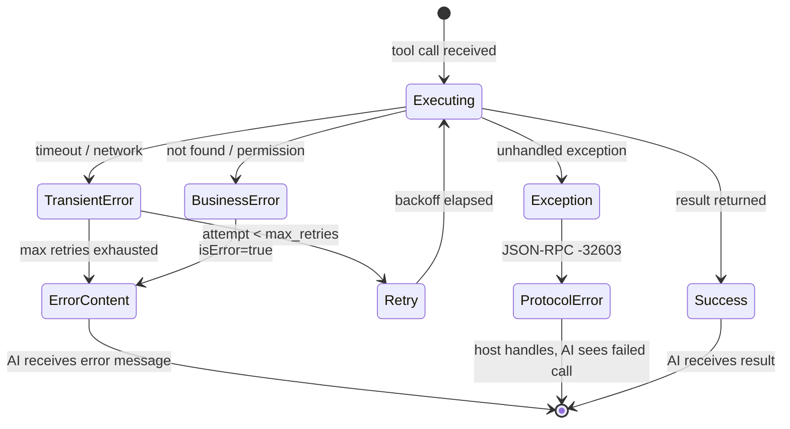

## Keywords in This File
{: .no_toc }

| # | Keyword | Weight |
|---|---|---|
| 12 | [MCP Authentication and Authorization](#mcp-authentication-and-authorization) | ★★☆ |
| 13 | [MCP Error Handling and Resilience](#mcp-error-handling-and-resilience) | ★★☆ |

---

# MCP Authentication and Authorization

**Interview Weight:** ★★☆ - Auth is the most critical
security layer for any HTTP MCP server. Getting
it wrong exposes internal systems to unauthorized access.

---

### 🎯 Model Answer

**30 seconds:**

> MCP HTTP servers must implement authentication to
> prevent unauthorized access. The MCP spec recommends
> OAuth 2.1 for user-delegated access and API keys
> for service-to-service. Stdio servers need no
> network auth (trust via process ownership). Authorization
> - controlling WHAT an authenticated user can do
> - is the server's responsibility and should follow
> the principle of least privilege: each MCP client
> gets access only to the tools and data it actually needs.

**3 minutes:**

> MCP authentication applies to HTTP transport only.
> Stdio servers run as subprocesses owned by the
> user's session - the OS provides process-level isolation.
>
> For HTTP MCP servers: the MCP spec (2025-03) mandates
> OAuth 2.1 for any server handling user-delegated
> access. OAuth 2.1 eliminates unsafe flows from
> OAuth 2.0 (no implicit grant, no resource owner
> password credentials). The Authorization Code Flow
> with PKCE is required for public clients.
>
> API key authentication: simpler to implement, appropriate
> for server-to-server access where a human user
> is not directly involved. The API key is passed
> in the Authorization header as a Bearer token.
> Risk: API keys can be copied and shared. Rotate
> them periodically. Never embed them in configs
> committed to source control.
>
> Authorization (what authenticated users can do):
> the server decides which tools and resources to
> expose based on the caller's identity. A read-only
> user gets resource access and read-only tools.
> An admin user gets all tools including destructive ones.
> MCP servers should apply the principle of least privilege:
> expose only the capabilities needed for the use case.

**Blank Mind Recovery:**

**(1) Restate:** "MCP auth - who can connect (authentication)
and what can they do (authorization)."

**(2) First principles:** "Stdio: process isolation
handles auth. HTTP: needs explicit auth. Then: once
authenticated, the server must also decide what
the user is allowed to do."

**(3) Bridge:** "Like a web API: authenticate first
(token/key check), then authorize (can this user
call this endpoint?)."

---

### 📘 Concept Explanation

**What it is:**

MCP Authentication is verifying the identity of
the MCP client connecting to an HTTP server.
MCP Authorization is controlling which capabilities
(tools, resources, prompts) an authenticated identity
can access.

**The problem it solves:**

Without authentication: any MCP client can connect
to your server, call any tool, and access any resource.
A public HTTP MCP server with no auth is an open
API accessible to anyone on the network.

**How it works:**

```
AUTHENTICATION FLOWS:

1. API KEY (simplest):
   Client config:
   {
     "url": "https://server.com/mcp",
     "headers": {"Authorization": "Bearer sk-..."}
   }
   Server validation:
   - Extract Bearer token from Authorization header
   - Compare to stored API key (constant-time compare)
   - Return 401 if invalid

2. OAUTH 2.1 (user-delegated):
   [Step 1] Client redirects user to authorization server
   [Step 2] User approves access
   [Step 3] Auth server returns code + PKCE verifier
   [Step 4] Client exchanges code for access token
   [Step 5] Client sends access token as Bearer in requests
   [Step 6] MCP server validates token with auth server

AUTHORIZATION PATTERN:
   Authenticated identity -> Role -> Allowed tools/resources

   roles = {
     "read_only": ["search_docs", "get_record"],
     "read_write": ["search_docs", "get_record",
                    "update_record"],
     "admin": ["*"]
   }
```

> **Code walkthrough:** This example demonstrates the core pattern in action. The key mechanism shows how the concept works in practice. Study the structure to understand the essential behavior and common usage.

**The key insight:**

Authorization in MCP is not built into the protocol -
it's entirely the server's responsibility. The MCP
client sends requests for any tool; the server
must check if the caller is allowed to call it.
The server can return a permission error as a tool
execution error (isError: true) or as a JSON-RPC
permission error (-32601).

**When to use API keys:**

- Service accounts (CI/CD calling an MCP server)
- Internal team tools where individual identity
  tracking is not required
- Simple deployments where OAuth setup is not justified

**When to use OAuth 2.1:**

- User-delegated access (the server should act
  as the user, using the user's permissions)
- Regulatory/compliance requirements for individual
  identity tracking
- Enterprise deployments with existing OAuth infrastructure

**Alternatives:**

- mTLS (mutual TLS): strong authentication for
  service-to-service in high-security environments
- JWT: standard token format used within both OAuth
  and API key systems
- No auth + network controls: acceptable only for
  localhost-only servers (same-machine access)

**First-principles derivation:**

Any HTTP service accessible over a network needs
authentication. The threat model: unauthorized
clients calling tools that have side effects (writing
data, executing commands, sending messages). The
minimal defense: Bearer token validation. The complete
defense: OAuth 2.1 for identity + role-based
authorization per tool.

---

### 💻 Code Example

```python
"""MCP server with API key auth and role-based authz."""
import hashlib
import hmac
import json
from typing import Optional
from mcp.server import Server
import mcp.types as types

# BAD: No authentication on HTTP server
# Any client can call any tool.
# Never deploy this publicly.
def create_unauthenticated_server():
    server = Server("unsafe")
    # All tools exposed to anyone.
    return server  # INSECURE: no auth


# GOOD: API key authentication + role-based authz
# For production: use a proper middleware framework
# like FastAPI or Starlette with the MCP HTTP transport.

# API keys stored as hashes (never plaintext)
# In production: store in a secrets manager
VALID_KEYS = {
    # sha256("sk-readonly-key"):
    "d4e3f2a1...": "read_only",
    # sha256("sk-admin-key"):
    "b5c6d7e8...": "admin"
}

ROLE_PERMISSIONS = {
    "read_only": ["search_docs", "get_record",
                  "list_resources"],
    "admin": ["search_docs", "get_record",
              "list_resources", "update_record",
              "delete_record"]
}


def validate_api_key(
    authorization: Optional[str]
) -> Optional[str]:
    """
    Validate Bearer token and return role.
    Returns None if invalid.
    """
    if not authorization:
        return None
    if not authorization.startswith("Bearer "):
        return None

    token = authorization[7:]  # strip "Bearer "

    # Hash the provided token
    token_hash = hashlib.sha256(
        token.encode()
    ).hexdigest()

    # Constant-time comparison (prevents timing attacks)
    for stored_hash, role in VALID_KEYS.items():
        if hmac.compare_digest(token_hash, stored_hash):
            return role

    return None


def check_permission(role: str, tool_name: str) -> bool:
    """Check if role is allowed to call this tool."""
    allowed = ROLE_PERMISSIONS.get(role, [])
    return tool_name in allowed


server = Server("authenticated-server")


@server.list_tools()
async def list_tools() -> list[types.Tool]:
    """
    In production: filter based on caller's role.
    This simplified version returns all tools;
    the call_tool handler enforces authorization.
    """
    return [
        types.Tool(
            name="search_docs",
            description="Search documentation (read-only)",
            inputSchema={"type": "object", "properties": {
                "query": {"type": "string"}
            }, "required": ["query"]}
        ),
        types.Tool(
            name="delete_record",
            description="Delete a record (admin only)",
            inputSchema={"type": "object", "properties": {
                "id": {"type": "string"}
            }, "required": ["id"]}
        )
    ]


@server.call_tool()
async def call_tool(
    name: str, arguments: dict
) -> list[types.TextContent]:
    """
    Validate authorization before executing.
    In production: role is extracted from the
    validated auth token in the request context.
    """
    # Production: get role from request context
    # role = request_context.get("role")
    role = "read_only"  # simplified for illustration

    if not check_permission(role, name):
        return [types.TextContent(
            type="text",
            text=(
                f"Permission denied: role '{role}' "
                f"cannot call tool '{name}'"
            )
        )]

    if name == "search_docs":
        query = arguments.get("query", "")
        return [types.TextContent(
            type="text",
            text=f"Results for '{query}': ..."
        )]

    if name == "delete_record":
        record_id = arguments.get("id", "")
        return [types.TextContent(
            type="text",
            text=f"Deleted record {record_id}"
        )]

    raise ValueError(f"Unknown tool: {name}")
```

> **Code walkthrough:** The BAD example is an unauthenticated
> server - any client can call any tool. The GOOD
> example implements two security layers. Authentication:
> `validate_api_key()` extracts the Bearer token,
> hashes it with SHA-256, and uses `hmac.compare_digest()`
> for constant-time comparison (prevents timing attacks
> where an attacker measures response time to infer
> correct vs. incorrect token characters). API keys
> are stored as hashes, never plaintext. Authorization:
> `check_permission()` uses a role-to-tools mapping.
> The `call_tool()` handler checks permissions before
> executing. In production, the role would be extracted
> from the validated JWT or OAuth token in the HTTP
> request context, not hardcoded.

---

### 🎓 Answers by Seniority

**Junior / Mid:**

> "MCP authentication applies to HTTP servers - stdio
> uses process ownership for trust. The two main
> approaches: API keys (simpler, pass as Bearer token
> in Authorization header) and OAuth 2.1 (for user-delegated
> access). I also implement authorization on top:
> role-based access to control which tools each client
> can call. The key security detail: store API key
> hashes, not plaintext, and use constant-time comparison
> to prevent timing attacks."

---

**Senior / Staff:**

> "The authentication model depends on the deployment
> context. For service-to-service MCP (CI/CD calling
> an internal server), API keys with regular rotation
> and a secrets manager integration are appropriate.
> For user-delegated access where the server should
> act on behalf of a specific user (with the user's
> permissions in the underlying system), OAuth 2.1
> with PKCE is required. The MCP 2025-03 spec explicitly
> mandates OAuth 2.1 for this pattern. Authorization
> is entirely server-side and not specified by MCP -
> this means every server reinvents it. For enterprise
> deployments, I centralize authorization logic
> in a policy service (OPA or a custom auth middleware)
> rather than embedding role checks in each server.
> The `tools/list` response can be filtered by role:
> a read-only user sees only read-only tools, avoiding
> 'permission denied' errors at call time."

---

### ⚠️ Common Misconceptions

**Misconception: "MCP has built-in authorization."**

MCP has no built-in authorization. The protocol
defines how tools are called (tools/call) but not
who is allowed to call them. Every server must
implement its own authorization. A common mistake:
expose all tools via tools/list to all users, then
return "permission denied" at call time. Better
practice: filter tools/list by the authenticated
caller's role, so users only see tools they can
actually use. The AI cannot call tools it doesn't
know about.

---

### 🚨 Failure Modes and Diagnosis

**Failure: API key is valid but all tool calls return 403**

*Symptom:* Client connects successfully (200 response
to initialize), but every tools/call returns a
permission error.

*Root cause candidates:*

(1) Authorization check error: the permission check
    is using the wrong role, wrong tool name lookup,
    or a bug in the permission mapping.

(2) Request context not propagated: the role extracted
    at the HTTP middleware level is not being passed
    to the tool handler. Middleware sets `role="admin"`
    but the handler reads from a different context object.

(3) Tool name mismatch: the permission check compares
    "search_docs" to "search-docs" (underscore vs hyphen).
    The tool call succeeds in tools/list but the
    permission check uses the wrong format.

*Diagnosis:*
```python
# Add temporary debug logging to the tool handler:
import sys
print(f"DEBUG: name={name}, role={role}, "
      f"allowed={check_permission(role, name)}",
      file=sys.stderr)
```
> **Code walkthrough:** This example demonstrates the core pattern in action. The key mechanism shows how the concept works in practice. Study the structure to understand the essential behavior and common usage.

Check: what role is being used, is it what you expect?

*Fix:* Add explicit logging for the first N requests
in a new deployment. Verify the auth context propagates
correctly from the HTTP middleware to the tool handler.

---

### 🎯 Interview Deep-Dive

| Question Type | Est. Time |
|---|---|
| Auth model overview | 2-3 min |
| OAuth 2.1 vs API key | 3-4 min |
| Authorization design | 3-4 min |
| Security | 4-5 min |
| Debugging | 3-4 min |
| Multi-tenant | 4-5 min |
| Trade-off | 3-4 min |
| Behavioral | 4-5 min |
| Token rotation | 3-4 min |

---

**[MID] Q1 - Why does the MCP spec recommend OAuth
2.1 specifically for user-delegated access?**

*Why they ask:* Protocol compliance + security.

OAuth 2.1 is a hardened revision of OAuth 2.0 that
removes unsafe flows and mandates security best practices:

Removed in OAuth 2.1:
- Implicit grant (exposed tokens in URLs/browser history)
- Resource owner password credentials grant (passes
  user passwords to the client, violates separation)

Mandated in OAuth 2.1:
- PKCE for all public clients (prevents auth code interception)
- Short-lived access tokens with refresh tokens
  (reduces exposure window)
- Exact redirect URI matching (prevents open redirectors)

For MCP specifically: the host application is a
public client (cannot securely store a client secret).
OAuth 2.1's mandate for PKCE protects against
code interception attacks where a malicious app
intercepts the authorization code.

User-delegated access: the user authorizes the
MCP host to access their resources on the server.
The token represents the user's identity and
permissions - not the host's. This enables the
server to apply the user's specific access controls
rather than a shared service account.

*What separates good from great:* "PKCE is mandatory
for public clients - it prevents auth code interception
by malicious apps running on the same device."

---

**[SENIOR] Q2 - How do you implement per-user data
isolation in a multi-tenant MCP server?**

*Why they ask:* Multi-tenant architecture.

Problem: a shared MCP server where user A's tool
calls must not return user B's data.

Implementation pattern:

Step 1: Extract user identity from the validated token:
```python
# JWT token payload contains user_id
import jwt

def get_user_id(authorization: str) -> str:
    token = authorization.replace("Bearer ", "")
    payload = jwt.decode(token, SECRET_KEY,
                         algorithms=["HS256"])
    return payload["sub"]  # subject = user_id
```

> **Code walkthrough:** This example demonstrates the core pattern in action. The key mechanism shows how the concept works in practice. Study the structure to understand the essential behavior and common usage.

Step 2: Scope all database queries to the user:
```python
@server.call_tool()
async def call_tool(name, arguments):
    user_id = get_current_user_id()  # from request ctx

    if name == "get_my_records":
        # ALWAYS filter by user_id
        records = await db.fetch(
            "SELECT * FROM records WHERE user_id = $1",
            user_id  # parameterized, not interpolated
        )
        return [types.TextContent(
            type="text",
            text=json.dumps(records)
        )]
```

> **Code walkthrough:** This example demonstrates the core pattern in action. The key mechanism shows how the concept works in practice. Study the structure to understand the essential behavior and common usage.

Step 3: Validate ownership before mutations:
```python
if name == "update_record":
    record_id = arguments["id"]
    # Verify the record belongs to the current user
    record = await db.fetchrow(
        "SELECT user_id FROM records WHERE id = $1",
        record_id
    )
    if not record or record["user_id"] != user_id:
        return [types.TextContent(
            type="text",
            text="Not found or access denied"
        )]
    # Proceed with update
```

> **Code walkthrough:** This example demonstrates the core pattern in action. The key mechanism shows how the concept works in practice. Study the structure to understand the essential behavior and common usage.

*What separates good from great:* "Always filter
by user_id at the query level - never rely on
application-level checks that could be bypassed."

---

**[MID] Q3 - What is PKCE and why is it required
for MCP OAuth?**

*Why they ask:* OAuth security depth.

PKCE (Proof Key for Code Exchange) prevents
authorization code interception attacks.

Problem without PKCE:
1. User starts auth flow, browser redirects to auth server
2. Attacker registers a custom URL scheme handler
   on the same device
3. Auth server redirects to redirect_uri with code=ABC
4. Attacker's app intercepts the redirect and gets code=ABC
5. Attacker exchanges code for access token

PKCE prevents this:
1. Client generates `code_verifier`: random 43-128 char string
2. Client computes `code_challenge = SHA256(code_verifier)` (base64url)
3. Client sends `code_challenge` in the auth request
4. Auth server stores the challenge
5. Client receives the auth code
6. Client includes `code_verifier` in the token exchange
7. Auth server verifies `SHA256(code_verifier) == stored_challenge`

Attacker has the code but NOT the code_verifier.
The token exchange fails because the attacker cannot
provide the correct verifier.

For MCP: the host application (Claude Desktop,
VS Code) is a public client - it cannot securely
store a client secret. PKCE provides equivalent
security for public clients without requiring a secret.

*What separates good from great:* "The attacker has
the code but not the verifier - PKCE decouples
code possession from token exchange capability."

---

**[JUNIOR] Q4 - [DEBUGGING] An MCP server returns 401
for all requests even though the API key is correct.**

*Why they ask:* Auth debugging.

Four things to check:

(1) Header format: must be exactly `Authorization: Bearer <key>`.
    Common mistakes: `Authorization: <key>` (missing Bearer),
    `authorization: Bearer <key>` (lowercase, some servers
    are case-sensitive), extra whitespace.

(2) API key encoding: if the key contains special characters
    (%, =, +) they may need URL encoding in some clients.
    Try a key with only alphanumeric characters for testing.

(3) Server-side key comparison: if using a hash comparison,
    verify the hashing is deterministic (same input,
    same output). Debug:
    ```python
    import hashlib
    test = hashlib.sha256("your-key".encode()).hexdigest()
    print(test)  # compare to stored hash
    ```

> **Code walkthrough:** This example demonstrates the core pattern in action. The key mechanism shows how the concept works in practice. Study the structure to understand the essential behavior and common usage.

(4) Key expiry: if implementing time-limited keys,
    check if the expiry validation logic has a timezone
    bug (comparing UTC to local time, or wrong comparison direction).

Test with curl to isolate client issues:
```bash
curl -H "Authorization: Bearer your-key" \
     -X POST https://server.com/mcp \
     -d '{"jsonrpc":"2.0","id":1,"method":"initialize","params":{}}'
```

> **Code walkthrough:** This example demonstrates the core pattern in action. The key mechanism shows how the concept works in practice. Study the structure to understand the essential behavior and common usage.

*What separates good from great:* "Test with curl
first - eliminates client-side configuration issues
from the debugging scope."

---

**[SENIOR] Q5 - How do you implement API key rotation
without downtime for an MCP server?**

*Why they ask:* Operations knowledge.

Two-phase key rotation:

Phase 1 - Add new key (no downtime):
1. Generate new API key
2. Add new key hash to the valid keys store
3. Both old and new keys are now accepted
4. Distribute new key to clients

Phase 2 - Remove old key (after distribution confirmed):
1. Wait for client adoption (check access logs:
   no requests with old key)
2. Remove old key hash from the valid keys store
3. Old key is no longer accepted

Implementation:
```python
# Keys store: allow multiple valid keys
VALID_KEYS = {
    "hash_of_new_key": {"role": "admin",
                        "created": "2025-01-15"},
    "hash_of_old_key": {"role": "admin",
                        "created": "2024-07-01",
                        "expires": "2025-02-15"}
}

def validate_and_get_info(token: str) -> Optional[dict]:
    token_hash = hashlib.sha256(token.encode()).hexdigest()
    key_info = VALID_KEYS.get(token_hash)
    if not key_info:
        return None
    # Check expiry
    expires = key_info.get("expires")
    if expires and datetime.now() > datetime.fromisoformat(expires):
        return None
    return key_info
```

> **Code walkthrough:** This example demonstrates the core pattern in action. The key mechanism shows how the concept works in practice. Study the structure to understand the essential behavior and common usage.

Access log monitoring: log the first 6 characters
of the token hash (not the full hash) to identify
which key is in use without exposing the key itself.

*What separates good from great:* "Two-phase rotation:
add new key first, only remove old key after clients
have switched. Never simultaneous swap."

---

**[SENIOR] Q6 - [TRADE-OFF] When is mTLS better than
Bearer tokens for MCP server auth?**

*Why they ask:* Advanced security architecture.

Bearer tokens (API key or OAuth JWT):
- Easy to implement in any HTTP client
- Revocable server-side (mark token as invalid)
- Works through proxies and API gateways
- Weakness: if a token is intercepted (MITM, log exposure),
  it can be used by an attacker

mTLS (mutual TLS):
- Client presents a certificate (not just a token)
- Authentication happens at the TLS layer (before
  any HTTP data is sent)
- Certificate revocation via CRL or OCSP
- Stronger: an attacker with the cert still needs
  the private key (which never leaves the client)
- Weakness: certificate lifecycle management is
  complex (provisioning, rotation, revocation)

When mTLS is better:
- Service-to-service internal communication
  (automated systems without human interaction)
- High-security environments (financial, healthcare)
  where certificate infrastructure exists
- Zero-trust network architectures where every
  service must present mutual certificates

When Bearer tokens are better:
- Interactive users (humans can't manage certs easily)
- External/public-facing services where client cert
  distribution is impractical
- Teams without existing PKI infrastructure

For MCP specifically: Bearer tokens (OAuth 2.1 or
API key) are the standard and the right default.
mTLS is appropriate only if the organization has
existing PKI infrastructure and the MCP server
is used exclusively by automated systems.

*What separates good from great:* "mTLS requires
a PKI - only use it if your org already has one.
Otherwise the certificate management overhead
exceeds the security benefit."

---

**[JUNIOR] Q7 - How should API keys be stored and
distributed to MCP clients?**

*Why they ask:* Security fundamentals.

Never do:
- Hardcode API keys in code: they end up in source control
- Store API keys in committed config files
- Log API keys in application logs
- Email or Slack API keys to teammates (they persist
  in chat history)

Correct storage patterns:

(1) Secrets manager (production):
    - AWS Secrets Manager, HashiCorp Vault, 1Password Secrets
    - Application retrieves the secret at runtime
    - Secret is never written to disk or config files

(2) Environment variables (developer machines):
    - Store in `~/.bashrc`, `~/.zshrc`, or a local `.env`
      file that is gitignored
    - VS Code config uses `${MY_API_KEY}` variable substitution
    - Set with `export MCP_API_KEY=sk-...` before starting

(3) Password manager for distribution:
    - Share via 1Password/Bitwarden secure note
    - Each teammate fetches from the password manager
    - Not via Slack, email, or chat

Rotation policy: rotate API keys every 90 days
for service accounts, immediately on suspected exposure.

*What separates good from great:* "Secrets manager
for production - the application fetches the secret
at runtime, it never lives in a config file."

---

**[MID] Q8 - What HTTP status codes should an
authenticated MCP server use for auth failures?**

*Why they ask:* HTTP protocol correctness.

401 Unauthorized: the request lacks authentication
credentials. The client should present credentials.
Include `WWW-Authenticate: Bearer realm="mcp"` header.
Use for: missing or malformed Authorization header.

403 Forbidden: the request has valid credentials
but the caller lacks permission for the requested
operation. Use for: valid API key but insufficient role.

Common mistake: returning 403 for missing auth.
This is wrong - a 403 tells the client "you are
known, but not allowed." Without authentication,
the client is unknown, so 401 is correct.

For tool-level permission failures (valid auth,
insufficient role): return either a 403 HTTP response
OR a tool execution error (isError: true content)
with a permission denied message. The second approach
is more MCP-idiomatic: the AI sees the permission
denied message and can respond to the user about
it rather than experiencing a protocol-level failure.

*What separates good from great:* "Return permission
denied as tool execution error (isError: true),
not HTTP 403 - the AI can then explain the restriction
to the user."

---

**[SENIOR] Q9 - How do you audit MCP tool calls
for compliance?**

*Why they ask:* Enterprise governance.

An audit trail for MCP tool calls needs:

(1) Request identity: who called the tool (user ID,
    service account, API key identifier - never the
    raw key).

(2) Tool name and arguments: what was called. Be
    careful with sensitive arguments (passwords, PII):
    mask or exclude from logs.

(3) Timestamp (UTC, RFC3339).

(4) Result or error: success/failure, error code.

(5) Correlation ID: trace this call through the system.

Implementation:
```python
import json, time, uuid, sys

def audit_log(
    user_id: str,
    tool_name: str,
    arguments: dict,
    success: bool,
    error: Optional[str] = None
):
    # Mask sensitive fields
    safe_args = {
        k: "***REDACTED***" if k in {
            "password", "secret", "token", "key"
        } else v
        for k, v in arguments.items()
    }
    log_entry = {
        "ts": time.strftime("%Y-%m-%dT%H:%M:%SZ",
                            time.gmtime()),
        "correlation_id": str(uuid.uuid4()),
        "user_id": user_id,
        "tool": tool_name,
        "args": safe_args,
        "success": success,
        "error": error
    }
    # Write to stderr (structured JSON for log aggregation)
    print(json.dumps(log_entry), file=sys.stderr)
```

> **Code walkthrough:** This example demonstrates the core pattern in action. The key mechanism shows how the concept works in practice. Study the structure to understand the essential behavior and common usage.

Compliance requirement: for SOC2/ISO27001, audit
logs must be tamper-evident. Write to an append-only
log store (CloudWatch, Splunk, or a write-only DB table).

*What separates good from great:* "Mask sensitive
arguments before logging - audit logs must not
contain credentials or PII."

---

### ⚖️ Comparison Table

| Aspect | API Key | OAuth 2.1 JWT | mTLS |
|---|---|---|---|
| Setup complexity | Low | Medium | High |
| User-delegated access | No | Yes | No |
| Revocable | Yes (delete key) | Yes (token expiry) | Yes (CRL/OCSP) |
| Key/cert exposure risk | Medium | Low (short-lived) | Low (private key) |
| Client support | Universal | HTTP clients | TLS clients only |
| Recommended for | Service accounts | User-delegated access | Service mesh |
| MCP spec alignment | Supported | Mandated for user-delegated | Not specified |

---

### 🏛️ System Design

*(Omit: ★★☆ concept.)*

---

### 📊 Diagram

*(Omit: auth flow is clearer as text.)*

---

---

---

### 💻 Code Example

*(Omit: this concept does not have a programmatic interface that can be demonstrated in code. The conceptual explanation above is sufficient.)*


---

### 🏛️ System Design

*(Omit: system design diagram not applicable for this concept - see ★★★ keywords for full system design coverage.)*


---

### ⚖️ Comparison Table

*(Omit: this is a ★☆☆ foundational concept with no direct alternatives to compare - see higher-difficulty keywords for trade-off analysis.)*


---

### 📊 Diagram

*(Omit: no standalone visual diagram required for this concept - the explanations and code examples above provide sufficient clarity.)*


# MCP Error Handling and Resilience

**Interview Weight:** ★★☆ - Production MCP deployments
fail. Knowing the error model, retry strategies,
and circuit breaker patterns distinguishes production
engineers from tutorial engineers.

---

### 🎯 Model Answer

**30 seconds:**

> MCP has two error tiers: JSON-RPC protocol errors
> (the transport or protocol failed - invisible to
> the AI) and tool execution errors (the tool ran
> but returned isError: true - visible to the AI).
> Production resilience requires: correct error tier
> selection, retries with exponential backoff for
> transient failures, circuit breakers for chronic
> failures, and graceful degradation when a tool
> cannot execute.

**3 minutes:**

> The most important MCP error concept: protocol
> errors vs. tool execution errors. Protocol errors
> (JSON-RPC codes -32700 to -32099) mean the connection
> or message format failed. The AI cannot see these
> - the host handles them. Tool execution errors
> (isError: true in the result content) mean the
> tool ran but something went wrong. The AI sees
> these, can reason about them, and can self-correct.
>
> Resilience at the server level: implement retries
> for transient failures (HTTP 429, network timeouts,
> temporary DB unavailability). Use exponential backoff
> with jitter to avoid thundering herd. Implement
> timeouts to prevent indefinite hangs.
>
> Resilience at the host level: implement circuit
> breakers per server. If a server starts failing
> consistently, stop sending it requests and fail
> fast. This prevents slow servers from degrading
> the entire AI session.
>
> Error messages quality: the error message in
> isError content is what the AI reads. A generic
> "internal error" message leaves the AI unable
> to help the user. A specific message ("Database
> query failed: too many rows requested. Try limiting
> to max 100 rows.") enables the AI to self-correct
> by retrying with a smaller limit.

**Blank Mind Recovery:**

**(1) Restate:** "MCP error handling. Two tiers: protocol
errors (invisible to AI) and tool errors (visible to AI)."

**(2) First principles:** "Errors need different handling
based on who should respond. Protocol errors: the
host handles them. Tool errors: the AI handles them."

**(3) Bridge:** "Like HTTP: network errors (invisible
to the user, handled by the client) vs. application
errors (visible to the user, they can act on them)."

---

### 📘 Concept Explanation

**What it is:**

MCP error handling is the set of patterns for correctly
classifying, returning, and recovering from errors
in MCP servers and hosts. Resilience is the ability
of the system to degrade gracefully when components fail.

**The problem it solves:**

Without proper error handling: tool failures crash
the AI session, the AI is left with no information
about what went wrong, and cascading failures from
one server affect all tools. Correct error handling
enables the AI to self-correct and the system to
continue operating despite partial failures.

**How it works:**

```
ERROR TIER 1: JSON-RPC Protocol Errors
  Code -32700: Parse error (invalid JSON)
  Code -32600: Invalid request (malformed JSON-RPC)
  Code -32601: Method not found
  Code -32602: Invalid params (missing required)
  Code -32603: Internal error (server exception)
  Visibility: host only - AI does not see these
  Handling: host logs, may surface to user in UI

ERROR TIER 2: Tool Execution Errors
  Result: {content: [{type:"text", text:"Error: ..."}],
           isError: true}
  Visibility: AI sees the error text
  Handling: AI can reason, retry, or explain to user

RETRY PATTERN (server internal):
  transient_error -> wait(backoff) -> retry
  max_retries=3, base_delay=1s, multiplier=2, jitter=0.1

  attempt 1: wait 0s
  attempt 2: wait 1s + jitter
  attempt 3: wait 2s + jitter
  attempt 4: fail -> return isError content

CIRCUIT BREAKER (host level):
  closed -> normal operation
  [N failures in window] -> open
  open -> fail fast (no server calls)
  [timeout expires] -> half-open
  half-open -> one probe request
  [success] -> closed
  [failure] -> open
```

> **Code walkthrough:** This example demonstrates the core pattern in action. The key mechanism shows how the concept works in practice. Study the structure to understand the essential behavior and common usage.

**The key insight:**

Error message quality is part of the API contract.
The AI uses the error message to decide how to recover.
A generic "error occurred" message leaves the AI
helpless. A specific, actionable message ("rate limit
exceeded, retry after 30 seconds") enables the AI
to handle the situation appropriately.

**When to return tool execution errors (isError: true):**

- Business logic failures (record not found, validation failed)
- External dependency failures (API timeout, DB down)
- Permission denied (user lacks access to this tool)
- Input validation failures (invalid argument values)

**When to return protocol errors:**

- Method name is completely unknown (not just a bad argument)
- Request format is malformed (parse error)
- Protocol violation

**When NOT to use either error type:**

- Expected empty results: return an empty list or
  "no results found" message, not an error
- Business conditions: "0 records match" is not an error

**Alternatives:**

- Exceptions propagated as protocol errors: technically
  correct but the AI cannot reason about them
- Silent failure (return empty success): hides the
  problem from the AI, preventing recovery

**First-principles derivation:**

Error recovery requires information about what failed
and why. The AI is the recovery agent for tool errors.
Therefore: tool errors must be visible to the AI
(isError: true) with actionable messages. Protocol
errors cannot be recovered by the AI (the connection
is broken); they are handled by the host. This
two-tier model minimizes what the AI must handle
while maximizing its recovery options.

---

### 💻 Code Example

```python
"""MCP error handling: tiers, retries, timeouts."""
import asyncio
import random
import httpx
from mcp.server import Server
import mcp.types as types

server = Server("resilient-server")


# BAD: Using exception for tool execution failure
# The exception becomes a JSON-RPC internal error
# (code -32603). The AI cannot see the error text.
async def search_docs_bad(query: str) -> str:
    resp = httpx.get(f"https://api.docs.com/search?q={query}")
    if resp.status_code != 200:
        raise Exception("Search failed")  # BAD: AI can't see this
    return resp.text


# GOOD: Tool execution errors as isError content
async def search_docs_good(
    query: str
) -> list[types.TextContent]:
    """
    Returns isError content for tool failures.
    The AI sees the error and can self-correct.
    """
    try:
        async with httpx.AsyncClient(
            timeout=httpx.Timeout(5.0)   # 5s timeout
        ) as client:
            resp = await client.get(
                "https://api.docs.com/search",
                params={"q": query}
            )
    except httpx.TimeoutException:
        # Actionable error: tells the AI the cause
        return [types.TextContent(
            type="text",
            text=(
                "Search API timed out after 5 seconds. "
                "Try a more specific query or try again later."
            )
        )]
    except httpx.RequestError as e:
        return [types.TextContent(
            type="text",
            text=f"Network error contacting search API: {e}"
        )]

    if resp.status_code == 429:
        # Specific: tells the AI what to do
        retry_after = resp.headers.get("Retry-After", "60")
        return [types.TextContent(
            type="text",
            text=(
                f"Rate limited by search API. "
                f"Retry after {retry_after} seconds."
            )
        )]

    if resp.status_code != 200:
        return [types.TextContent(
            type="text",
            text=(
                f"Search API error: HTTP {resp.status_code}. "
                f"Contact support if this persists."
            )
        )]

    return [types.TextContent(type="text", text=resp.text)]


async def with_retry(
    fn, *args, max_retries: int = 3
) -> list[types.TextContent]:
    """
    Retry pattern for transient failures.
    Returns error content after all retries exhausted.
    """
    for attempt in range(max_retries):
        result = await fn(*args)

        # Check if result is an error
        is_error = any(
            "timed out" in (c.text or "").lower() or
            "network error" in (c.text or "").lower()
            for c in result if hasattr(c, 'text')
        )

        if not is_error:
            return result

        if attempt < max_retries - 1:
            # Exponential backoff with jitter
            delay = (2 ** attempt) + random.uniform(0, 0.5)
            await asyncio.sleep(delay)

    return result  # Return last error after all retries


@server.list_tools()
async def list_tools() -> list[types.Tool]:
    return [types.Tool(
        name="search_docs",
        description="Search documentation. Retries transient failures automatically.",
        inputSchema={"type": "object", "properties": {
            "query": {"type": "string"}
        }, "required": ["query"]}
    )]


@server.call_tool()
async def call_tool(
    name: str, arguments: dict
) -> list[types.TextContent]:
    if name == "search_docs":
        query = arguments.get("query", "")
        return await with_retry(search_docs_good, query)
    raise ValueError(f"Unknown tool: {name}")
```

> **Code walkthrough:** The BAD example raises an
> exception which propagates as a JSON-RPC internal
> error (-32603). The AI receives no content - it
> just experiences a failed tool call with no explanation.
> The GOOD `search_docs_good()` catches each failure
> mode and returns specific, actionable `isError`
> content: timeouts explain the cause and suggest
> a retry, rate limits include the Retry-After value.
> The `with_retry()` wrapper implements exponential
> backoff with jitter (adding randomness prevents
> multiple retrying clients from hitting the API
> simultaneously - the thundering herd problem). After
> 3 retries, the last error content is returned to
> the AI, which can then explain the situation to the user.

---

### 🎓 Answers by Seniority

**Junior / Mid:**

> "MCP has two error tiers. Protocol errors (-32700
> to -32099) happen at the transport layer - the
> AI doesn't see them. Tool execution errors (isError:
> true in the content) happen inside the tool - the
> AI sees them and can respond. I always use tool
> execution errors for business logic failures, not
> exceptions. The error message is part of the API:
> 'rate limited, retry after 30 seconds' is actionable;
> 'internal error' is useless."

---

**Senior / Staff:**

> "MCP error handling is a two-tier contract between
> the server, the host, and the AI. Tool execution
> errors are the API surface for the AI's recovery
> logic. Designing good error messages means thinking
> about what the AI needs to do next. The patterns
> I always implement: retry with exponential backoff
> + jitter for transient failures (HTTP 429, network
> errors, DB busy), timeouts to prevent indefinite
> hangs, and circuit breakers at the host level
> for servers that are consistently failing. The
> circuit breaker is often missing from MCP host
> implementations: without it, a slow server degrades
> the entire AI session as tool calls pile up waiting
> for the unhealthy server. For production deployments:
> log all tool errors with enough context to diagnose
> (user, tool, arguments, error, trace ID) - these
> logs are your production debugging surface."

---

### ⚠️ Common Misconceptions

**Misconception: "Raising an exception in a tool handler
is equivalent to returning isError: true."**

Raising an exception (unhandled) in a tool handler
propagates as a JSON-RPC internal error (code -32603).
The response is an error response at the protocol
level - the AI receives no content from the tool.
The AI experiences a failed tool call with no error
message to reason about. Returning isError: true
in a TextContent result is the CORRECT pattern:
the request succeeds at the protocol level, and
the AI receives the error message as tool output.
The AI can then read the error, reason about it,
and decide to retry, ask the user for help, or
try a different approach.

---

### 🚨 Failure Modes and Diagnosis

**Failure: Tool intermittently returns errors in production
but always works in development**

*Symptom:* The tool works perfectly in local testing.
In production, 10-20% of calls return isError content.

*Common root causes:*

(1) Timeout too tight: production has higher latency
    (network, load). Development has localhost latency.
    Fix: increase timeout, or make it configurable.

(2) Connection pool exhaustion: under concurrent load,
    DB connections or HTTP connections run out.
    Fix: connection pool, async client reuse.

(3) External API rate limits: development calls the
    API rarely; production exceeds rate limits.
    Fix: implement rate limiting in the server,
    cache responses, or request higher rate limits.

(4) Environment variable missing: production config
    is missing an env var that was set in development.
    Fix: fail-fast on startup if required config is absent.

*Diagnosis:*
```python
# Add percentile timing logs to identify slow paths:
import time
start = time.monotonic()
result = await external_call()
elapsed = time.monotonic() - start
if elapsed > 2.0:
    print(f"SLOW: {elapsed:.2f}s for {name}",
          file=sys.stderr)
```

> **Code walkthrough:** This example demonstrates the core pattern in action. The key mechanism shows how the concept works in practice. Study the structure to understand the essential behavior and common usage.

---

### 🎯 Interview Deep-Dive

| Question Type | Est. Time |
|---|---|
| Error tier model | 3-4 min |
| isError vs exception | 3-4 min |
| Retry strategy | 3-4 min |
| Circuit breaker | 3-4 min |
| Timeout design | 3-4 min |
| Error message quality | 3-4 min |
| Debugging | 4-5 min |
| Behavioral | 4-5 min |
| Graceful degradation | 3-4 min |

---

**[MID] Q1 - What is the difference between returning
isError: true and raising an exception in an MCP
tool handler?**

*Why they ask:* Fundamental error model.

`isError: true` in content: a tool execution error.
The JSON-RPC request succeeds (200 response). The
result object contains `isError: true` and error
text. The AI receives the error text and can reason
about it.

Unhandled exception: propagates as a JSON-RPC error
response (typically code -32603). The result object
is a JSON-RPC error, not a tool result. The AI
receives no content from this tool call. The AI
knows the tool failed but has no error message.

When each is appropriate:

Use `isError: true` for: all business logic failures,
external dependency failures, permission denied,
validation errors - anything the AI should know about.

Use exceptions (raise McpError) for: unknown method
names, malformed requests, genuine protocol violations.
These should rarely occur in correct implementations.

*What separates good from great:* "The AI can reason
about isError content but not about JSON-RPC error
codes - always use isError for business failures."

---

**[SENIOR] Q2 - How do you implement a circuit breaker
for MCP in a custom host?**

*Why they ask:* Production pattern.

Circuit breaker states:
- CLOSED: normal operation, requests go through
- OPEN: failure threshold exceeded, requests fail immediately
- HALF-OPEN: cooldown elapsed, one probe request allowed

```python
import asyncio
from enum import Enum
from dataclasses import dataclass, field
from datetime import datetime, timedelta

class CircuitState(Enum):
    CLOSED = "closed"
    OPEN = "open"
    HALF_OPEN = "half_open"

@dataclass
class CircuitBreaker:
    failure_threshold: int = 5
    cooldown: int = 60  # seconds
    state: CircuitState = CircuitState.CLOSED
    failure_count: int = 0
    last_failure_time: datetime = field(
        default_factory=datetime.now
    )

    def record_success(self):
        self.state = CircuitState.CLOSED
        self.failure_count = 0

    def record_failure(self):
        self.failure_count += 1
        self.last_failure_time = datetime.now()
        if self.failure_count >= self.failure_threshold:
            self.state = CircuitState.OPEN

    def can_attempt(self) -> bool:
        if self.state == CircuitState.CLOSED:
            return True
        if self.state == CircuitState.OPEN:
            elapsed = (datetime.now() -
                       self.last_failure_time).seconds
            if elapsed > self.cooldown:
                self.state = CircuitState.HALF_OPEN
                return True
            return False  # fail fast
        return True  # HALF_OPEN: allow probe
```

> **Code walkthrough:** This example demonstrates the core pattern in action. The key mechanism shows how the concept works in practice. Study the structure to understand the essential behavior and common usage.

Apply per-server in the host. If the circuit is
OPEN: return an immediate error to the AI ("Server
X is temporarily unavailable") without attempting
the tool call.

*What separates good from great:* "Fail fast when
circuit is OPEN - prevents slow server from blocking
the AI session."

---

**[MID] Q3 - What retry strategy should MCP tool
handlers use for external API calls?**

*Why they ask:* Reliability engineering.

Retry rules for external API calls within MCP tools:

(1) Only retry idempotent or read-only operations.
    Never retry a write operation without checking
    if it succeeded (partial completion).

(2) Only retry transient errors:
    - HTTP 429 (rate limited): retry after Retry-After
    - HTTP 503 (service unavailable): retry with backoff
    - Network timeout: retry with backoff
    - HTTP 500 (transient): retry with backoff

    Never retry:
    - HTTP 400 (bad request): invalid input, won't improve
    - HTTP 401/403: auth problem, retry won't help
    - HTTP 404: resource doesn't exist

(3) Exponential backoff with jitter:
    ```
    delay = base * (2 ** attempt) + random(0, base)
    ```
> **Code walkthrough:** This example demonstrates the core pattern in action. The key mechanism shows how the concept works in practice. Study the structure to understand the essential behavior and common usage.

    Base: 1s. Cap: 30s. Max attempts: 3-5.
    Jitter prevents thundering herd.

(4) Budget-aware: track total retry time. If the
    tool has been running for > 10 seconds total,
    stop retrying and return an error. Don't let
    a slow API hold the AI session indefinitely.

*What separates good from great:* "Never retry 4xx
errors - they indicate a problem with the request,
not the server. Only 429, 503, network timeouts."

---

**[SENIOR] Q4 - [DEBUGGING] Tool works in isolation
but times out in the AI session. How do you diagnose?**

*Why they ask:* Context-dependent failures.

The tool works when tested directly but fails when
called by the AI in a real session.

Hypothesis 1 - Multiple concurrent tool calls:
the AI may be calling multiple tools simultaneously.
If your server has a global lock, shared resource,
or limited connection pool, concurrent calls exceed
capacity. Fix: verify connection pool size is
sufficient for concurrent calls.

Hypothesis 2 - Large input: the AI passes the entire
conversation context as a tool argument (common
with poorly bounded prompts). Test with the actual
input size the AI sends, not a short test string.

Hypothesis 3 - Network congestion: the AI session
calls tools more frequently than isolated testing.
Under sustained load, external APIs rate-limit.
Add latency logging to catch this.

Hypothesis 4 - LLM overhead: in the AI session,
each tool call adds to context. After many tool calls,
the context size increases, LLM processing time
increases, and the overall session latency grows.
This manifests as later tool calls in a long session
timing out even though early ones succeeded.

Diagnosis:
```python
# Log call timing per tool:
start = time.monotonic()
result = await execute_tool(name, arguments)
elapsed = time.monotonic() - start
print(f"TIMING: {name} {elapsed:.3f}s", file=sys.stderr)
```
> **Code walkthrough:** This example demonstrates the core pattern in action. The key mechanism shows how the concept works in practice. Study the structure to understand the essential behavior and common usage.

Compare timing across multiple calls in the same session.

*What separates good from great:* "Concurrent tool
calls are the most common production difference
from isolated testing - size your connection pool
for concurrency."

---

**[MID] Q5 - How do you implement a timeout for
tool execution without hanging the MCP session?**

*Why they ask:* Practical implementation.

Python asyncio timeout:
```python
import asyncio
from mcp.server import Server
import mcp.types as types

server = Server("timeout-demo")

@server.call_tool()
async def call_tool(name, arguments):
    if name == "slow_operation":
        try:
            # Cancel if it takes > 30 seconds
            result = await asyncio.wait_for(
                execute_slow_operation(arguments),
                timeout=30.0
            )
            return [types.TextContent(
                type="text",
                text=str(result)
            )]
        except asyncio.TimeoutError:
            return [types.TextContent(
                type="text",
                text=(
                    "Operation timed out after 30 seconds. "
                    "Try with a smaller data range or "
                    "contact support for async processing."
                )
            )]
```

> **Code walkthrough:** This example demonstrates the core pattern in action. The key mechanism shows how the concept works in practice. Study the structure to understand the essential behavior and common usage.

Timeout values by operation type:
- Fast lookups (cache, simple DB query): 1-2s
- API calls to external services: 5-10s
- Database queries with large results: 15-30s
- File operations on large files: 30-60s

Always specify an explicit timeout. Never let a
tool call hang indefinitely - it blocks the AI
session and eventually causes the host to time out
the entire server connection.

*What separates good from great:* "All external calls
need explicit timeouts - asyncio.wait_for() is the
correct pattern, not a global server timeout."

---

**[SENIOR] Q6 - What graceful degradation patterns
work for MCP servers?**

*Why they ask:* Production resilience design.

Tier 1 - Partial results: if a tool cannot return
complete results, return what it has with a note:
```python
return [types.TextContent(
    type="text",
    text=(
        f"Partial results (first 50 of 500): ...\n"
        f"Note: full results unavailable due to "
        f"service degradation. Try again later for complete data."
    )
)]
```

> **Code walkthrough:** This example demonstrates the core pattern in action. The key mechanism shows how the concept works in practice. Study the structure to understand the essential behavior and common usage.

Tier 2 - Cached results: if the primary data source
is unavailable, return cached results with a staleness warning:
```python
return [types.TextContent(
    type="text",
    text=(
        f"(CACHED - data from {cache_timestamp})\n"
        f"{cached_results}\n"
        f"Note: live data unavailable, showing last cached results."
    )
)]
```

> **Code walkthrough:** This example demonstrates the core pattern in action. The key mechanism shows how the concept works in practice. Study the structure to understand the essential behavior and common usage.

Tier 3 - Alternative tool suggestion: if this tool
is down, suggest a related one:
```python
return [types.TextContent(
    type="text",
    text=(
        "The primary search is unavailable. "
        "Try the 'search_fallback' tool for basic search."
    )
)]
```

> **Code walkthrough:** This example demonstrates the core pattern in action. The key mechanism shows how the concept works in practice. Study the structure to understand the essential behavior and common usage.

Tier 4 - Explicit failure with recovery guidance:
```python
return [types.TextContent(
    type="text",
    text=(
        "Tool unavailable: the database is currently "
        "in maintenance mode. Expected recovery in 30 minutes. "
        "For urgent needs, contact the on-call team at #infra-ops."
    )
)]
```

> **Code walkthrough:** This example demonstrates the core pattern in action. The key mechanism shows how the concept works in practice. Study the structure to understand the essential behavior and common usage.

*What separates good from great:* "Return cached
results with a staleness warning rather than failing
completely - partial data is usually better than no data."

---

**[MID] Q7 - [BEHAVIORAL] Describe debugging a production
MCP tool failure.**

*Why they ask:* Production experience.

Situation: an internal analytics MCP server was
returning isError content for about 15% of calls,
randomly, in production. The tool worked perfectly
in development.

Investigation:

Step 1: Reproduced in staging (higher concurrency
than dev). Concurrency was the difference.

Step 2: Added timing logs. Found that failing calls
were all > 5 seconds. The 5-second timeout was being
hit. The slow calls were database queries.

Step 3: Checked the DB query plan. Found: on small
datasets (dev), a sequential scan was fast. On
the production database (10M rows), the same query
was a full table scan.

Root cause: missing index. The tool's query filtered
by `created_date` and `user_id` but the index only
covered `user_id`. Full table scan for date-range queries.

Fix: added composite index on `(user_id, created_date)`.
Query went from 5-8 seconds to 40ms.

Secondary fix: increased the timeout to 30 seconds
as a circuit breaker while the index was deployed.
Also added query EXPLAIN logging for the first
100 calls in production to catch future slow query issues.

Lesson: production database size changes query
behavior fundamentally. Always test with production-scale
data.

*What separates good from great:* "Production-scale
data changes query plans - always test with realistic
data volume, not toy datasets."

---

**[SENIOR] Q8 - How do you prevent a single slow
server from degrading the entire MCP host session?**

*Why they ask:* Host resilience architecture.

The problem: the AI calls 3 tools simultaneously
(asyncio.gather). Servers A and B respond in 100ms.
Server C is degraded and responds in 30 seconds.
The entire session hangs waiting for Server C.

Solutions:

(1) Per-server timeout at the host level:
```python
async def call_with_timeout(session, name, args, timeout=15.0):
    try:
        return await asyncio.wait_for(
            session.call_tool(name, args),
            timeout=timeout
        )
    except asyncio.TimeoutError:
        return types.CallToolResult(
            content=[types.TextContent(
                type="text",
                text=f"Tool timed out after {timeout}s"
            )],
            isError=True
        )
```

> **Code walkthrough:** This example demonstrates the core pattern in action. The key mechanism shows how the concept works in practice. Study the structure to understand the essential behavior and common usage.

(2) Circuit breaker (see Q2): after N timeouts,
    open the circuit and fail fast for Server C.

(3) Hedged requests: for critical tools, send the
    request to two redundant servers simultaneously,
    use the first response:
```python
results = await asyncio.gather(
    call_primary(name, args),
    call_secondary(name, args),
    return_exceptions=True
)
# Use whichever completed first successfully
```

> **Code walkthrough:** This example demonstrates the core pattern in action. The key mechanism shows how the concept works in practice. Study the structure to understand the essential behavior and common usage.

(4) Session-level budget: track total tool call
    time per session. If a session has spent > 120s
    total in tool calls, start returning cached
    or degraded responses to avoid indefinite hangs.

*What separates good from great:* "Per-server timeout
at the host level - each server has an independent
timeout so one slow server cannot block the others."

---

**[JUNIOR] Q9 - What information should an MCP
tool error message include?**

*Why they ask:* Error message quality.

Four things every tool error message should include:

(1) WHAT failed (specific, not generic):
    - GOOD: "Database query for table 'users' failed"
    - BAD: "Database error"

(2) WHY it failed (root cause when known):
    - GOOD: "Connection refused - database may be down"
    - BAD: "Connection failed"

(3) WHAT the user can do (actionable):
    - GOOD: "Retry in 30 seconds, or use the fallback_search tool"
    - BAD: "Please try again"

(4) ESCALATION path for non-recoverable errors:
    - GOOD: "Contact support at #help with reference: REF-4521"
    - BAD: (no escalation path)

Anti-patterns:
- Stack traces in error messages (security risk - exposes internals)
- Generic "internal error" with no context
- Missing the recovery suggestion
- PII in error messages (log correlation IDs, not user data)

*What separates good from great:* "Error messages
are the AI's instructions for recovery - write them
as you'd write an error to a capable engineer
who needs to know what to do next."

---

### ⚖️ Comparison Table

| Error Type | When to Use | AI Visibility | Recovery |
|---|---|---|---|
| `isError: true` content | Business logic, tool failures | Visible - AI can read and reason | AI self-corrects |
| JSON-RPC -32603 (internal error) | Unhandled exceptions | Invisible - AI sees failed call | Host logs, may surface to user |
| JSON-RPC -32601 (method not found) | Unknown method name | Invisible | Host handles |
| JSON-RPC -32602 (invalid params) | Protocol-level param issues | Invisible | Host handles |
| Empty result + description | No results found | Visible as empty result | AI handles gracefully |

---

### 🏛️ System Design

*(Omit: ★★☆ concept.)*

---

### 📊 Diagram

```
ERROR FLOW:

Tool Handler
  |
  +--[business logic error]-> isError:true content
  |    (DB down, API fail,     AI reads error,
  |     rate limited)          AI self-corrects
  |
  +--[unhandled exception]---> JSON-RPC error
       (bug, code crash)        AI sees failed call
                                Host logs error

RETRY PATTERN:

Attempt 1 -> transient error -> wait 1s
Attempt 2 -> transient error -> wait 2s + jitter
Attempt 3 -> transient error -> wait 4s + jitter
Attempt 4 -> return isError content to AI
```



> **Diagram walkthrough:** The state machine shows
> the three paths from tool execution. Success returns
> content to the AI directly. Transient errors (timeouts,
> network failures) trigger retry with backoff, eventually
> falling through to isError content if all retries fail.
> Business errors (validation, permission, not found)
> go directly to isError content - no retry because
> the same request will fail again. Unhandled exceptions
> become JSON-RPC protocol errors, which the host
> handles without the AI seeing the error message.
> The asymmetry between business errors and exceptions
> is the core of the MCP error model.

---

### 💻 Code Example

*(Omit: this concept does not have a programmatic interface that can be demonstrated in code. The conceptual explanation above is sufficient.)*


---

### 🏛️ System Design

*(Omit: system design diagram not applicable for this concept - see ★★★ keywords for full system design coverage.)*


---

### ⚖️ Comparison Table

*(Omit: this is a ★☆☆ foundational concept with no direct alternatives to compare - see higher-difficulty keywords for trade-off analysis.)*


---

### 📊 Diagram

*(Omit: no standalone visual diagram required for this concept - the explanations and code examples above provide sufficient clarity.)*


