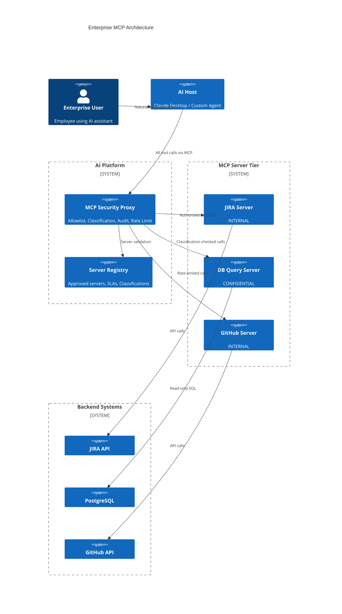

## Keywords in This File
{: .no_toc }

| # | Keyword | Weight |
|---|---|---|
| 17 | [MCP in Enterprise AI Architecture](#mcp-in-enterprise-ai-architecture) | ★★★ |

---

# MCP in Enterprise AI Architecture

**Interview Weight:** ★★★ - Enterprise AI architecture
is the principal engineer question. Knowing where
MCP fits, how it composes with other AI infrastructure,
and how to make strategic deployment decisions
signals architectural maturity.

---

### 🎯 Model Answer

**30 seconds:**

> In enterprise AI architecture, MCP provides the
> standardized tool integration layer between AI
> orchestrators (agents, assistant frameworks) and
> business systems (databases, APIs, file systems).
> It replaces custom function-calling integrations
> with a protocol-based model: any MCP client can
> use any MCP server without custom glue code. At
> enterprise scale, MCP fits into an AI platform
> layer: centralized server registry, shared auth,
> audit logging, and governance - with MCP as the
> integration protocol rather than a deployment target.

**3 minutes:**

> Enterprise AI architecture evolves through three
> maturity levels. Level 1 (prototype): each AI feature
> has custom function-calling integrations - a one-off
> code bridge between the AI and each backend system.
> Not reusable. Level 2 (standardized): introduce
> MCP. Each backend system gets an MCP server.
> Any AI host can use any server without custom code.
> This is where most teams are going in 2025.
> Level 3 (platform): an AI platform team builds
> infrastructure around MCP - a server registry,
> centralized auth, a security proxy, shared audit
> logging, and governance. Individual teams create
> MCP servers following platform standards; the platform
> handles the operational concerns.
>
> Where MCP fits in the broader AI architecture:
> - Orchestration layer: LangChain, AutoGen, crew.ai,
>   or custom agent frameworks handle multi-step reasoning
> - Tool integration layer: MCP (the protocol that connects
>   orchestrators to backend systems)
> - Backend systems: databases, APIs, file systems, SaaS tools
>
> The strategic question: when to use MCP vs. direct
> SDK integration. MCP is correct when: multiple
> AI hosts need access to the same tools, you want
> standardized logging and security, or you're building
> tools for external users. Direct SDK integration
> is correct when: a single AI application uses a
> tool exclusively, you need maximum performance
> (no serialization overhead), or the tool is deeply
> integrated into the AI's processing pipeline.

**Blank Mind Recovery:**

**(1) Restate:** "MCP in enterprise AI architecture.
It's the tool integration protocol - where orchestrators
meet backend systems."

**(2) First principles:** "Enterprise AI needs:
standardization (not one-off integrations), security
(centralized auth and logging), and governance (who
can use what). MCP provides the standard; enterprise
infrastructure wraps it."

**(3) Bridge:** "Think of MCP like REST. REST standardized
HTTP APIs. MCP standardizes AI tool APIs. Enterprise
REST deployments use API gateways, registries, and
governance. Enterprise MCP deployments will too."

---

### 📘 Concept Explanation

**What it is:**

MCP in Enterprise AI Architecture is the strategic
use of MCP as the standardized integration protocol
in an enterprise AI platform, encompassing: server
deployment patterns, governance, security proxy,
orchestration integration, and organizational adoption strategy.

**The problem it solves:**

Without MCP: each AI feature requires custom integration
code. With 20 AI features and 15 backend systems,
that's potentially 300 custom integrations. Each
has different auth, logging, error handling, and
upgrade cycles. MCP replaces this with one protocol,
one auth model, one logging format.

**How it works:**

```
ENTERPRISE AI PLATFORM ARCHITECTURE:

USER LAYER
  Web apps, Claude Desktop, VS Code, Mobile
         |
ORCHESTRATION LAYER
  LangChain | AutoGen | Custom Agents | LLM APIs
         |
         +---- Uses MCP client to discover + call tools
         |
TOOL INTEGRATION LAYER (MCP)
  [MCP Security Proxy / Registry]
         |
         +---- [JIRA Server] (issues/tasks)
         +---- [DB Query Server] (analytics)
         +---- [GitHub Server] (code search)
         +---- [Docs Server] (knowledge base)
         +---- [Monitoring Server] (alerts/metrics)
         |
BACKEND SYSTEMS LAYER
  JIRA | PostgreSQL | GitHub | Confluence | Datadog
```

> **Code walkthrough:** This MCP in Enterprise AI Architecture example demonstrates a key concept in practice. **KEY MECHANISM:** the runtime executes these instructions in sequence with specific memory and execution semantics. **WHY IT MATTERS:** misapplying this pattern causes subtle bugs that only manifest under production load. **TAKEAWAY: understand the execution model before using this pattern in production code.**

**The key insight:**

MCP is infrastructure, not a product. Just as REST
APIs are wrapped by API gateways in mature organizations,
MCP servers will be wrapped by MCP gateways. The
organizational question is not just "should we use MCP?"
but "who owns MCP infrastructure?" The answer in
mature organizations: a platform team, with individual
teams as server providers and consumers.

**Enterprise deployment patterns:**

Pattern A - Federated (team-owned):
Each team deploys and operates their own MCP servers.
The platform team provides standards and tooling.
Pro: team autonomy. Con: inconsistent security and quality.

Pattern B - Centralized (platform-owned):
The AI platform team deploys and operates all MCP servers.
Teams request new servers via a standard process.
Pro: consistent security, centralized audit.
Con: bottleneck, slower iteration.

Pattern C - Hybrid (recommended):
Common infrastructure servers (DB query, monitoring)
are platform-owned. Domain-specific servers (JIRA,
Salesforce, custom apps) are team-owned with platform-enforced standards.

**Governance model:**

MCP server registry: a catalog of approved MCP servers,
their capabilities, owners, SLAs, and data classification.
AI host applications connect only to registry-approved servers.

Data classification: each MCP server tagged with
the highest sensitivity level of data it can access.
"MCP Server X - CONFIDENTIAL - read access to customer records."
AI agents' permission to use a server depends on
the agent's authorization level.

**Alternatives:**

- Direct function calling per LLM provider: no standardization,
  each LLM has different function-calling APIs
- REST API calls from agent code: requires custom code
  per integration, no standardization
- LangChain tools: Python-only, not interoperable
  across different AI frameworks

**First-principles derivation:**

Enterprise systems have three requirements for integrations:
(1) Standard interface (no custom code per integration),
(2) Security and governance (centralized auth, audit),
(3) Operational reliability (monitoring, SLAs).
MCP provides (1). The enterprise platform wraps
it to provide (2) and (3).

---

### 💻 Code Example

```python
"""
Enterprise MCP architecture: server registry pattern,
multi-client integration, and governance enforcement.
"""
import json
import httpx
from dataclasses import dataclass
from typing import Optional
from enum import Enum


class DataClassification(Enum):
    PUBLIC = "PUBLIC"
    INTERNAL = "INTERNAL"
    CONFIDENTIAL = "CONFIDENTIAL"
    RESTRICTED = "RESTRICTED"


@dataclass
class ServerRegistryEntry:
    """
    Enterprise MCP server registry entry.
    Every server must be registered before use.
    """
    server_id: str
    name: str
    url: str
    transport: str  # "stdio" or "http"
    owner_team: str
    data_classification: DataClassification
    auth_method: str  # "oauth2" or "api_key"
    tools: list[str]
    sla_tier: str  # "tier1" (99.9%), "tier2" (99%)
    approved: bool  # security review completed


# Enterprise server registry (centralized store)
SERVER_REGISTRY: dict[str, ServerRegistryEntry] = {
    "jira-tools": ServerRegistryEntry(
        server_id="jira-tools",
        name="JIRA Integration",
        url="https://mcp.internal.company.com/jira",
        transport="http",
        owner_team="platform-engineering",
        data_classification=DataClassification.INTERNAL,
        auth_method="oauth2",
        tools=["find_issues", "get_issue", "add_comment"],
        sla_tier="tier2",
        approved=True
    ),
    "db-analytics": ServerRegistryEntry(
        server_id="db-analytics",
        name="Analytics DB Query",
        url="https://mcp.internal.company.com/analytics",
        transport="http",
        owner_team="data-platform",
        data_classification=DataClassification.CONFIDENTIAL,
        auth_method="oauth2",
        tools=["query_sales", "query_users", "run_report"],
        sla_tier="tier1",
        approved=True
    ),
    "experimental-new": ServerRegistryEntry(
        server_id="experimental-new",
        name="New Team Server",
        url="https://mcp.internal.company.com/new",
        transport="http",
        owner_team="team-x",
        data_classification=DataClassification.INTERNAL,
        auth_method="api_key",
        tools=["search"],
        sla_tier="tier2",
        approved=False  # NOT approved - security review pending
    )
}


def get_allowed_servers_for_agent(
    agent_classification: DataClassification
) -> list[ServerRegistryEntry]:
    """
    Return servers the agent is allowed to connect to.
    Enforces: approved only + data classification match.
    """
    CLASSIFICATION_ORDER = [
        DataClassification.PUBLIC,
        DataClassification.INTERNAL,
        DataClassification.CONFIDENTIAL,
        DataClassification.RESTRICTED
    ]

    agent_level = CLASSIFICATION_ORDER.index(
        agent_classification
    )

    return [
        s for s in SERVER_REGISTRY.values()
        if s.approved and
        CLASSIFICATION_ORDER.index(s.data_classification)
        <= agent_level
    ]


class EnterpriseAIAgent:
    """
    AI agent that enforces registry-based server access.
    Only connects to approved, classification-appropriate servers.
    """

    def __init__(
        self,
        agent_id: str,
        classification: DataClassification,
        oauth_token: str
    ):
        self.agent_id = agent_id
        self.classification = classification
        self.oauth_token = oauth_token

    def get_available_servers(
        self
    ) -> list[ServerRegistryEntry]:
        """
        Return servers this agent is authorized to use.
        Logs for audit.
        """
        allowed = get_allowed_servers_for_agent(
            self.classification
        )
        print(
            f"AUDIT: agent={self.agent_id} "
            f"classification={self.classification.value} "
            f"servers=[{', '.join(s.server_id for s in allowed)}]",
            file=__import__("sys").stderr
        )
        return allowed

    async def call_tool_with_governance(
        self,
        server_id: str,
        tool_name: str,
        arguments: dict
    ) -> dict:
        """
        Call a tool with full governance enforcement:
        - Server must be in registry + approved
        - Agent must have access to server's classification
        - All calls are audit-logged
        """
        # Check server is in registry
        if server_id not in SERVER_REGISTRY:
            raise PermissionError(
                f"Server not registered: {server_id}"
            )

        server = SERVER_REGISTRY[server_id]

        # Check server is approved
        if not server.approved:
            raise PermissionError(
                f"Server not approved for production: "
                f"{server_id}. Security review pending."
            )

        # Check agent classification allows this server
        allowed = self.get_available_servers()
        if server not in allowed:
            raise PermissionError(
                f"Agent {self.agent_id!r} "
                f"({self.classification.value}) cannot "
                f"access server {server_id!r} "
                f"({server.data_classification.value})"
            )

        # Log the tool call (audit trail)
        import sys, time
        audit_entry = {
            "ts": time.strftime("%Y-%m-%dT%H:%M:%SZ",
                                time.gmtime()),
            "agent_id": self.agent_id,
            "server_id": server_id,
            "tool": tool_name,
            "args_keys": list(arguments.keys()),
            # Don't log arg values (may contain PII)
        }
        print(f"AUDIT: {json.dumps(audit_entry)}",
              file=sys.stderr)

        # Execute via HTTP MCP (simplified - real impl
        # uses the MCP Python SDK HTTP transport)
        async with httpx.AsyncClient(
            timeout=httpx.Timeout(30.0)
        ) as client:
            resp = await client.post(
                server.url + "/mcp",
                json={
                    "jsonrpc": "2.0",
                    "id": 1,
                    "method": "tools/call",
                    "params": {
                        "name": tool_name,
                        "arguments": arguments
                    }
                },
                headers={
                    "Authorization": f"Bearer {self.oauth_token}"
                }
            )
            resp.raise_for_status()
            return resp.json()


# Example usage:
async def enterprise_agent_example():
    agent = EnterpriseAIAgent(
        agent_id="helpdesk-bot",
        classification=DataClassification.INTERNAL,
        oauth_token="..."
    )

    # Can access JIRA (INTERNAL classification)
    result = await agent.call_tool_with_governance(
        server_id="jira-tools",
        tool_name="find_issues",
        arguments={"text": "authentication bug"}
    )

    # CANNOT access analytics DB (CONFIDENTIAL)
    # -> PermissionError: agent cannot access server

    # CANNOT access experimental-new (not approved)
    # -> PermissionError: security review pending
```

> **Code walkthrough:** The `ServerRegistryEntry` dataclassice. **KEY MECHANISM:** the runtime executes these instructions in sequence with specific memory and execution semantics. **WHY IT MATTERS:** misapplying this pattern causes subtle bugs that only manifest under production load. **TAKEAWAY: understand the execution model before using this pattern in production code.**
> is the enterprise MCP governance model: each server
> has an owner, data classification, approval status,
> and SLA tier. The `get_allowed_servers_for_agent()`
> function enforces two-factor access control: only
> approved servers AND only servers at or below the
> agent's data classification level. `EnterpriseAIAgent.call_tool_with_governance()`
> enforces these checks on every tool call and writes
> a structured audit log entry to stderr (formatted
> for SIEM ingestion). The audit log records agent
> identity, server, tool name, and argument keys
> (but not values, to avoid logging PII). The unapproved
> `experimental-new` server and the CONFIDENTIAL
> `db-analytics` server are both blocked for a standard
> INTERNAL agent. This is the governance enforcement
> layer that enterprise AI deployments need.

---

### 🎓 Answers by Seniority

**Junior / Mid:**

> "In enterprise architecture, MCP is the standard
> tool integration layer. Instead of each AI application
> writing custom integrations to JIRA, the database,
> and GitHub, you write one MCP server per system
> and any AI host can use it. The organizational
> benefit: reusability. The JIRA MCP server, once
> built, works for Claude Desktop, a custom agent,
> and a VS Code extension without any changes."

---

**Senior / Staff:**

> "MCP's role in enterprise AI architecture is analogous
> to REST's role in service-oriented architecture:
> it's the standard integration protocol. The strategic
> questions: (1) who owns MCP infrastructure? My
> recommendation: a platform team owns common servers
> and shared infrastructure (registry, security proxy,
> audit logging); domain teams own domain-specific
> servers following platform standards. (2) How do
> you govern which AI agents can access which servers?
> The answer: data classification tags on servers,
> agent authorization levels, and a central policy
> service that evaluates access. (3) MCP vs. direct
> SDK integration: MCP when multiple AI hosts need
> the same tools, when you need standardized audit
> logging, or when building tools for external teams.
> Direct integration when a single application owns
> a tool exclusively and needs minimal latency.
>
> The operational concern at scale: each MCP server
> is a service with its own SLA. An enterprise with
> 30 MCP servers needs: health monitoring for each
> server, circuit breakers in AI hosts, graceful
> degradation when servers are down, and on-call
> runbooks for when a critical server fails during
> an AI session."

---

### ⚠️ Common Misconceptions

**Misconception 1: "MCP replaces API gateways."**

MCP and API gateways serve different layers. An
API gateway handles network-level concerns: TLS termination,
rate limiting, authentication, routing for HTTP traffic.
An MCP server is an application that exposes AI-optimized
tools. In a mature enterprise, MCP servers sit behind
API gateways. The API gateway handles transport
security; the MCP server handles tool semantics.
They are complementary, not alternatives.

---

**Misconception 2: "One MCP server per AI application."**

MCP is designed for reuse. The correct model is
one MCP server per backend system or domain, shared
by multiple AI applications. A JIRA MCP server
should serve Claude Desktop, custom agents, and
VS Code extensions alike. Building one-per-application
defeats the purpose of standardization and creates
the same maintenance burden as custom integrations.

---

### 🚨 Failure Modes and Diagnosis

**Failure: MCP server becoming a bottleneck in high-traffic AI features**

*Symptom:* AI agent response times increase over
weeks. Tool calls that used to complete in 200ms
now take 2-3 seconds. Occasional timeouts.

*Root cause candidates:*

(1) The MCP server is a single-threaded process
    handling concurrent requests. Asyncio is correct
    but the underlying API calls are slow (no connection
    pooling, no caching).

(2) The backend system the MCP server wraps (database,
    API) is being overloaded by the increased AI-driven
    traffic. AI agents often access backend systems
    at rates that exceed normal human usage patterns.

(3) Context window growth: as users have longer AI
    sessions, the AI passes more context to tool calls,
    making tool arguments larger and processing slower.

*Diagnosis:*
```python
# Add latency percentile tracking to server:
import time
from collections import deque

latencies: dict[str, deque] = {}

@server.call_tool()
async def call_tool(name, arguments):
    start = time.monotonic()
    result = await execute_tool(name, arguments)
    elapsed = time.monotonic() - start

    if name not in latencies:
        latencies[name] = deque(maxlen=1000)
    latencies[name].append(elapsed)

    if elapsed > 1.0:
        # Log slow calls for investigation
        import sys
        print(f"SLOW: {name} {elapsed:.2f}s", file=sys.stderr)

    return result
```

> **Code walkthrough:** This Log slow calls for investigation example demonstrates asyncio coroutine definition using async/await. **KEY MECHANISM:** the event loop schedules coroutines; await suspends execution until the awaited future resolves. **WHY IT MATTERS:** blocking call inside async def starves the event loop - all coroutines freeze. **TAKEAWAY: never use blocking I/O (requests, time.sleep) inside async def; use aiohttp, asyncio.sleep.**

*Mitigation strategies:*
- Horizontal scaling: deploy multiple server instances
  behind a load balancer
- Caching: implement Cache-Aside for frequent identical calls
- Connection pooling: reuse HTTP/DB connections
- Async batching: batch multiple tool calls where possible

---

### 🎯 Interview Deep-Dive

| Question Type | Est. Time |
|---|---|
| MCP in AI stack overview | 4-5 min |
| Enterprise platform model | 5-6 min |
| Governance and registry | 4-5 min |
| MCP vs. alternatives | 4-5 min |
| Organizational strategy | 5-6 min |
| Security at scale | 4-5 min |
| Observability | 4-5 min |
| Behavioral | 5-6 min |
| Migration strategy | 5-6 min |
| Make-or-buy | 4-5 min |
| Build vs. standards | 4-5 min |
| Future of MCP | 4-5 min |

---

**[SENIOR] Q1 - How does MCP fit into the modern
enterprise AI architecture stack?**

*Why they ask:* Architecture positioning.

The enterprise AI stack has four layers:

Layer 1 - Foundation models:
Claude, GPT-4, Gemini (via API), or self-hosted LLMs.
These are the AI brains. No code here.

Layer 2 - Orchestration:
LangChain, AutoGen, LlamaIndex, crew.ai, or custom
agent code. Handles: multi-step reasoning, agent
loops, memory management, prompt engineering.

Layer 3 - Tool integration (MCP):
MCP servers expose enterprise systems as AI-accessible
tools. This is the integration layer between the
AI reasoning layer and real systems.

Layer 4 - Backend systems:
Databases, SaaS platforms (JIRA, Salesforce), internal
APIs, file systems. MCP servers wrap these.

MCP's role: Layer 3. It's the standard protocol
that allows Layer 2 (orchestration) to be written
once and work with any Layer 4 backend, via
Layer 3 MCP servers.

Before MCP: orchestration frameworks had to implement
custom integrations for each backend (LangChain Tools,
AutoGen FunctionCall implementations). These were
framework-specific and not interoperable.

With MCP: any orchestration framework with an MCP
client library can use any MCP server. The integration
is protocol-based, not framework-specific.

*What separates good from great:* "MCP is the REST
of AI tool integration - a protocol that separates
orchestration from backend implementation."

---

**[SENIOR] Q2 - How do you design an enterprise
MCP governance model?**

*Why they ask:* Governance maturity.

Five pillars of enterprise MCP governance:

Pillar 1 - Server registry:
A centralized catalog of every approved MCP server.
Registry entry includes: owner team, data classification,
capabilities (tool list), SLA tier, approval status,
security review date, last updated.

Pillar 2 - Classification-based access control:
Each server is tagged with its data sensitivity.
AI agents and users are granted access levels.
The governance layer enforces: INTERNAL agents
cannot access CONFIDENTIAL servers.

Pillar 3 - Tool call audit logging:
Every tool call logged with: timestamp, user/agent ID,
server ID, tool name, argument keys (not values),
result status. Stored in append-only audit log
with 90-day retention (or per-regulation requirement).

Pillar 4 - Change management:
New MCP servers require: (a) security review,
(b) data classification assessment, (c) tool description
review (no embedded instructions), (d) SLA commitment.
Changes to existing servers require re-review if
capabilities expand.

Pillar 5 - Incident response:
Defined runbook for: server outage, security event
(suspicious tool calls), data classification violation.
On-call rotation for Tier 1 servers.

*What separates good from great:* "Classification-based
access is the most important pillar - it prevents
AI agents designed for low-sensitivity use cases
from accessing high-sensitivity systems."

---

**[SENIOR] Q3 - When should an enterprise use MCP
vs. direct LLM function calling?**

*Why they ask:* Strategic decision-making.

Use MCP when:

(1) Multiple AI consumers: if more than one AI application
    needs to call the same tools (Claude Desktop +
    a custom agent + VS Code extension), MCP enables
    one server to serve all. Without MCP: each consumer
    reimplements the integration.

(2) Cross-team tool sharing: Platform Engineering
    builds the JIRA server. Product teams use it.
    Without MCP: Product teams would need to call
    JIRA directly, handling auth, error handling,
    rate limiting themselves.

(3) Standardized audit and security: when the organization
    needs a uniform logging format, auth model, and
    security posture across all AI tool access.

(4) Multiple LLM providers: the AI system uses
    multiple models (Claude for reasoning, different
    model for embeddings). MCP servers work with
    any MCP client regardless of underlying model.

Use direct LLM function calling when:

(1) Single application, single model: a bespoke
    application uses GPT-4 exclusively with 2-3
    internal tools. The tools are not shared. Direct
    OpenAI function calling is simpler.

(2) Maximum performance: MCP adds serialization
    overhead (JSON-RPC, transport). For latency-critical
    tool calls (sub-100ms target), direct function
    invocation is faster.

(3) Deep integration: tools are tightly coupled to
    the LLM application's internal state (in-process
    data, model context). External MCP protocol
    adds unnecessary complexity.

Decision heuristic: if the tool would be used by
more than one AI consumer, or if you need standardized
audit logging, use MCP. Otherwise, direct integration
is simpler.

*What separates good from great:* "MCP's value is
in reuse and standardization - for single-consumer
tools, direct integration is simpler and faster."

---

**[SENIOR] Q4 - How do you handle MCP server failures
in a production enterprise AI platform?**

*Why they ask:* Reliability engineering at scale.

At enterprise scale, MCP server failures are routine.
The architecture must tolerate them gracefully:

(1) Circuit breakers per server (in the host/orchestration layer):
    After 5 consecutive failures, open the circuit.
    Don't retry for 60 seconds. Then probe with
    one request. This prevents slow-server cascade
    failures from degrading the entire AI session.

(2) Graceful degradation in AI system prompts:
    "Note: if a tool returns an unavailable message,
    inform the user of the limitation and continue
    with available tools."

(3) Fallback servers: for Tier 1 critical servers,
    deploy a read-only fallback with cached data.
    The fallback serves stale data with a warning
    rather than returning an error.

(4) Health check registry: the enterprise MCP registry
    includes health status for each server. AI
    hosts query the registry before starting sessions
    to know which servers are available. Don't
    include unavailable servers in the tools list.

(5) Incident notification: when a Tier 1 server's
    circuit breaker opens, alert the on-call team.
    Include: which server, failure rate, session
    impact estimate.

Operational SLA example:
- Tier 1 (critical path, e.g., DB query): 99.9% uptime,
  < 5 min alert response
- Tier 2 (important, e.g., JIRA): 99% uptime,
  < 30 min alert response
- Tier 3 (nice-to-have, e.g., optional search): 95% uptime,
  best effort

*What separates good from great:* "Health check registry -
don't include unavailable servers in tools/list,
so the AI never attempts calls that will fail."

---

**[SENIOR] Q5 - What observability setup does an
enterprise MCP platform need?**

*Why they ask:* Production operations maturity.

Four observability pillars for enterprise MCP:

Metrics (per server):
- Request rate (tool calls/minute)
- Error rate (% isError: true results + JSON-RPC errors)
- Latency percentiles (p50, p95, p99)
- Circuit breaker state (open/closed/half-open)

Logs (structured, per tool call):
- Timestamp, session ID, agent ID, server ID, tool name
- Duration, success/failure
- Error type if failed (not error content - may contain PII)
- Written to centralized log aggregation (Splunk, CloudWatch)

Traces (distributed tracing):
- Trace the full request: user query -> AI reasoning ->
  tool call -> backend -> response
- Correlate latency: is slowness in the AI, the MCP server,
  or the backend?
- Use OpenTelemetry with trace propagation through MCP servers

Security events (separate stream):
- Authentication failures (per server)
- Tool calls with suspicious argument patterns
- Rate limit violations
- New server connections (registry check failures)

Dashboard:
- Per-server: request rate, error rate, latency p95
- Platform-wide: total tool calls/hour, top 10 most-used tools,
  servers with elevated error rates
- Alerts: error rate > 5% for > 5 minutes, p95 > 10 seconds,
  circuit breaker open

*What separates good from great:* "Distributed tracing
through the full stack - 'MCP server is slow' is
often actually 'backend database is slow' - tracing
reveals where the time is actually spent."

---

**[SENIOR] Q6 - [BEHAVIORAL] Describe leading the
enterprise adoption of MCP at your organization.**

*Why they ask:* Leadership and change management.

Context: 150-person engineering org. 8 teams.
3 AI features already in production with custom integrations.
Task: standardize on MCP.

Step 1 - Technical case (month 1):
Documented the existing integration landscape: 8 custom
integrations, each with different auth, logging,
error handling. Calculated maintenance cost: ~20%
of eng time for integration maintenance. Made the
case: MCP would reduce this to ~5%.

Step 2 - Platform foundation (months 2-3):
Built the enterprise platform infrastructure:
- MCP server template (Python, with logging, auth, error handling)
- CI/CD pipeline for MCP server deployments
- Simple registry (a YAML file initially)
- Shared auth middleware (OAuth 2.1)
- Centralized audit log setup

Step 3 - Pilot migration (months 3-4):
Migrated one existing integration (JIRA) to MCP.
Used this to: validate the platform, build expertise,
document the migration pattern, measure the time savings.
Result: JIRA MCP server works in Claude Desktop
AND the existing custom agent without changes.

Step 4 - Team enablement (months 4-5):
Ran migration workshops. Provided the template.
Offered office hours for teams migrating their integrations.
Made it easier to use MCP than to maintain custom code.

Step 5 - Policy and governance (month 6):
New AI features require MCP (policy decision).
All new integrations go through the registry.
Security review checklist enforced in CI.

Result: 6 months later, 80% of integrations on MCP.
Custom integration maintenance dropped. New AI features
take days to connect to existing servers instead of weeks.

*What separates good from great:* "Make MCP easier
than the alternative before making it mandatory -
adoption through enablement, not mandate."

---

**[SENIOR] Q7 - How do you approach migrating from
custom LLM tool integrations to MCP?**

*Why they ask:* Migration strategy.

Migration strategy: strangler fig pattern.

Phase 1 - Inventory:
List all existing AI tool integrations. For each:
- What backend does it call?
- Which AI applications use it?
- What is the current auth model?
- What is the error handling pattern?

Phase 2 - Prioritize:
Migrate integrations that are: (a) used by multiple
AI applications (highest MCP benefit), (b) actively
maintained (pain is most visible), (c) relatively simple
(lower migration risk for first attempts).

Phase 3 - Create MCP server alongside existing integration:
Build the MCP server. Test it. Do NOT remove the
existing integration yet. Deploy both in parallel.

Phase 4 - Gradual client migration:
Migrate AI clients one by one to the MCP server.
Monitor: same behavior? Same error rates? Any latency
difference?

Phase 5 - Decommission existing integration:
After all clients use the MCP server and monitoring
shows stable operation for 2+ weeks, remove the
old integration.

Key technical migration consideration: the MCP
tool descriptions are a new API contract. They should
reflect the AI use cases, not mirror the old function
signatures. Use the migration as an opportunity
to redesign for better AI intent matching.

*What separates good from great:* "Parallel deployment
before cutover - never migrate directly. Validate
the MCP server in production with shadow traffic first."

---

**[SENIOR] Q8 - What is the build vs. buy decision
for enterprise MCP infrastructure?**

*Why they ask:* Strategic decision-making.

Components of enterprise MCP infrastructure:

Build:
- Domain-specific MCP servers (JIRA, internal CRM,
  proprietary databases): these know your data model,
  your auth setup, your business rules. Build these.
- Governance policies: these encode your organization's
  data classification, access control rules, compliance
  requirements. Build these.

Buy/Open source:
- Generic servers for standard tools (GitHub, Slack,
  Confluence, Postgres, common SaaS): the MCP community
  has high-quality open-source servers for these.
  Evaluate existing servers before building.
  Contribution: submit your generic improvements
  back to open source.
- MCP proxy/gateway: commercial AI infrastructure
  vendors (LangSmith, Weights & Biases, Braintrust)
  are adding MCP gateway features. Evaluate before
  building custom.
- AI development platforms: if the organization
  uses a commercial AI platform (Azure AI Foundry,
  Amazon Bedrock Agents), check if they provide
  MCP infrastructure as part of the platform.

Hybrid approach: buy/use open-source for commodity
integrations. Build for proprietary systems and
governance. This maximizes time spent on differentiating
work.

*What separates good from great:* "Evaluate community
servers before building - a well-maintained GitHub
MCP server from the community is better than one
you maintain yourself."

---

**[SENIOR] Q9 - How will MCP evolve and what should
enterprises do to stay current?**

*Why they ask:* Forward-looking thinking.

Current MCP (2025 spec):

Known gaps in the current spec that will evolve:

(1) Authorization delegation: MCP currently has no
    built-in mechanism for delegating user permissions
    to tools. OAuth 2.1 covers authentication;
    fine-grained authorization is still per-server.
    Expect: a standard authorization delegation mechanism
    in a future spec version.

(2) Multi-agent coordination: when an AI agent uses
    another AI agent as a tool via MCP, coordination
    patterns (trust levels, permission scoping) are
    not standardized. Expect: agent-to-agent MCP
    interaction patterns.

(3) Streaming tool results: large tool results (reports,
    file contents) require the client to wait for
    the full response. Streaming support would enable
    progressive rendering. Likely in 2026 spec.

(4) Server discovery: how clients find servers is
    not standardized beyond manual configuration.
    An MCP service discovery mechanism would enable
    dynamic server enrollment.

Enterprise guidance to stay current:

(1) Follow anthropic/modelcontextprotocol GitHub repository.
    Watch for spec updates and migration guides.

(2) Design servers to the abstraction, not the implementation:
    tool names and descriptions are stable; transport
    details and protocol versions change.

(3) Pin MCP SDK versions in CI. Test against new
    spec versions in staging before production.

(4) Contribute to spec development: if you find
    gaps, engage with the MCP working group.

*What separates good from great:* "Design to the
tool abstraction, not the transport implementation -
transport and protocol versions will change, tool
semantics should be stable."

---

**[SENIOR] Q10 - What are the SLA considerations
for enterprise MCP servers?**

*Why they ask:* Operational maturity.

Enterprise SLA considerations for MCP servers:

Availability targets by tier:
- Tier 1 (AI assistant critical path, used in real-time
  by end users): 99.9% (< 44 min downtime/month).
  Requires: multi-instance deployment, auto-restart,
  on-call support.
- Tier 2 (internal tools, background agents): 99%
  (< 7.2 hours downtime/month). Requires: health
  checks, auto-restart, office-hours support.
- Tier 3 (experimental, nice-to-have): 95%.
  Best effort.

Latency targets:
- p50: < 500ms (MCP overhead + backend call)
- p95: < 2s
- p99: < 10s
- Timeout: 30s (server-side); hosts should circuit-break at 15s

RPO/RTO for stateful components:
Most MCP servers are stateless (no persistent state).
For servers with caches: RPO = cache TTL (data regenerates).
For servers with persistent state (session stores): treat as a database.

Degraded mode:
Define what happens when the server is degraded (not down, but slow):
- Return cached data with staleness warning (acceptable for reads)
- Rate limit requests (return 429 with Retry-After)
- Circuit break after N consecutive slow responses

SLA measurement:
- Tool call success rate (excludes legitimate isError results)
- Tool call latency percentiles
- Availability (health check endpoint success rate)
- Measured per server, reported per SLA tier

*What separates good from great:* "Define what 'degraded
mode' means before production - a server that
returns cached data with warnings is better than
one that goes from healthy to down with no intermediate state."

---

**[SENIOR] Q11 - How do you handle the multi-tenant
MCP scenario where the same server serves users
with different permission levels?**

*Why they ask:* Multi-tenancy architecture.

Multi-tenant MCP server: one server, multiple organizations
or user groups, each with different data access rights.

Design pattern: token-scoped data access.

(1) Authentication provides identity + tenant ID:
```python
def extract_claims(token: str) -> dict:
    """Extract user ID and tenant from JWT."""
    payload = jwt.decode(token, PUBLIC_KEY,
                         algorithms=["RS256"])
    return {
        "user_id": payload["sub"],
        "tenant_id": payload["tenant_id"],
        "role": payload["role"]
    }
```

> **Code walkthrough:** This Unknown example demonstrates function definition using authentication. **KEY MECHANISM:** Python compiles the function body to bytecode; default args are evaluated once at definition time. **WHY IT MATTERS:** mutable default arguments (def f(x=[])) share state across calls - a classic bug. **TAKEAWAY: use None as default for mutable args and initialize inside the function body.**

(2) Every query is scoped to the tenant:
```python
@server.call_tool()
async def call_tool(name, arguments):
    claims = get_current_claims()  # from request context
    tenant_id = claims["tenant_id"]

    if name == "search_records":
        # ALWAYS include tenant_id in query
        rows = await db.fetch(
            "SELECT * FROM records WHERE "
            "tenant_id = $1 AND query @@ $2",
            tenant_id,          # tenant isolation
            arguments["query"]  # parameterized
        )
```

> **Code walkthrough:** This ALWAYS include tenant_id in query example demonstrates asyncio coroutine definition using async/await. **KEY MECHANISM:** the event loop schedules coroutines; await suspends execution until the awaited future resolves. **WHY IT MATTERS:** blocking call inside async def starves the event loop - all coroutines freeze. **TAKEAWAY: never use blocking I/O (requests, time.sleep) inside async def; use aiohttp, asyncio.sleep.**

(3) File isolation: separate directories per tenant:
```python
TENANT_BASE = Path("/data/tenants")

def get_tenant_dir(tenant_id: str) -> Path:
    # Validate tenant_id format (prevent path injection)
    if not re.match(r"^[a-zA-Z0-9\-]+$", tenant_id):
        raise ValueError("Invalid tenant ID")
    return TENANT_BASE / tenant_id
```

> **Code walkthrough:** This Validate tenant_id format (prevent path injection) example demonstrates function definition. **KEY MECHANISM:** Python compiles the function body to bytecode; default args are evaluated once at definition time. **WHY IT MATTERS:** mutable default arguments (def f(x=[])) share state across calls - a classic bug. **TAKEAWAY: use None as default for mutable args and initialize inside the function body.**

(4) Tool list filtering per role:
```python
@server.list_tools()
async def list_tools() -> list[types.Tool]:
    role = get_current_role()
    all_tools = [search_tool, read_tool, write_tool,
                 admin_tool]
    return [t for t in all_tools if allowed(role, t.name)]
```

> **Code walkthrough:** This Validate tenant_id format (prevent path injection) example demonstrates asyncio coroutine definition using async/await. **KEY MECHANISM:** the event loop schedules coroutines; await suspends execution until the awaited future resolves. **WHY IT MATTERS:** blocking call inside async def starves the event loop - all coroutines freeze. **TAKEAWAY: never use blocking I/O (requests, time.sleep) inside async def; use aiohttp, asyncio.sleep.**

*What separates good from great:* "Tenant isolation
at the query level - not just access control to
the server, but row-level isolation within every
query."

---

**[SENIOR] Q12 - [TRADE-OFF] When is a single-server
MCP monolith better than multiple specialized servers?**

*Why they ask:* Architecture pragmatism.

Single-server MCP monolith (all tools in one server):

Pros:
- One deployment, one connection, one set of credentials
- Shared caching across tools (one server, shared memory)
- Simplified client configuration (one server URL)
- Simpler observability (one service to monitor)

Cons:
- Failure blast radius: server down = all tools down
- Scaling difficulty: can't scale individual tools independently
- Team coupling: multiple teams sharing one codebase
- Security blast radius: if compromised, all tools are exposed
- Context confusion: 30+ tools from one server overwhelms AI

Multiple specialized servers:

Pros:
- Independent failures (GitHub server down, JIRA still works)
- Independent scaling (high-traffic search server can scale independently)
- Team ownership (each team owns their server)
- Minimal blast radius for security incidents
- Smaller, more focused tool sets (better AI reasoning)

Cons:
- More connections in client config
- Separate auth setup per server
- More services to monitor
- No shared caching (duplicate caches per server)

The right choice by org size:

- Small team (1-5 engineers), early stage: monolith.
  Simplicity wins. Extract specialized servers
  when operational pain justifies it.
- Mid-size (5-50 engineers), multiple teams: specialize.
  Team ownership boundaries map to server boundaries.
- Enterprise (50+ engineers): platform model with
  specialized servers + centralized infrastructure.

*What separates good from great:* "The monolith is
the right starting point - extract to specialized
servers when a specific operational pain (scaling,
ownership, security blast radius) justifies the complexity."

---

### ⚖️ Comparison Table

| Approach | Reuse | Security Governance | Complexity | Best For |
|---|---|---|---|---|
| Custom LLM function calling | None (per-app) | Per-app | Low | Single-app tools |
| MCP (per-team) | Within team | Per-server | Medium | Team-level standardization |
| MCP (enterprise platform) | Org-wide | Centralized | High | Multi-team, compliance needs |
| Commercial AI platform | Platform-handled | Vendor-managed | Low (ops) | Budget for managed infra |

---

### 🏛️ System Design

Enterprise AI Platform with MCP at scale:

**Scenario:** Financial services company, 500 engineers,
50+ AI-powered features, multiple regulated data types.

**Architecture:**

```
AI PLATFORM ARCHITECTURE:

CONSUMER LAYER:
  Claude Desktop | Custom Agents | VS Code | Mobile
         |
AI ORCHESTRATION LAYER:
  LangChain | Custom Agent Framework
  (Multi-step reasoning, memory, context management)
         |
MCP PLATFORM LAYER:
  [MCP Security Proxy]
    - Trusted server allowlist
    - Data classification enforcement
    - Tool description validation
    - Sampling policy (includeContext: "none")
    - Rate limiting (per user, per server)
    - Audit log -> SIEM (Splunk)
         |
MCP SERVER LAYER (categorized by data class):

  PUBLIC:
    [Web Search] [Public Docs] [Market Data]

  INTERNAL:
    [JIRA] [Confluence] [GitHub]
    [Employee Directory] [Meeting Scheduler]

  CONFIDENTIAL:
    [Customer DB Query] [Trading Data] [Risk Reports]

  RESTRICTED:
    [Compliance Records] [Audit Logs]
    [PII Database]
         |
BACKEND SYSTEMS:
  JIRA | PostgreSQL | GitHub | Bloomberg | 
  Compliance DB | Customer CRM
```

> **Code walkthrough:** This Validate tenant_id format (prevent path injection) example demonstrates a key concept in practice using Kafka messaging. **KEY MECHANISM:** the runtime executes these instructions in sequence with specific memory and execution semantics. **WHY IT MATTERS:** misapplying this pattern causes subtle bugs that only manifest under production load. **TAKEAWAY: understand the execution model before using this pattern in production code.**

**Key design decisions:**

(1) Security proxy as mandatory trust boundary:
All AI traffic goes through the security proxy.
No direct connection from AI hosts to MCP servers.
The proxy enforces the trusted server allowlist
and classification-based access.

(2) Data classification enforcement:
A trading assistant agent is authorized for CONFIDENTIAL.
A customer-facing assistant is authorized for INTERNAL.
The proxy enforces this: the customer assistant
cannot call the CONFIDENTIAL trading data server
even if the server is reachable.

(3) Regulated data handling:
For RESTRICTED data (PII, compliance records),
every tool call requires: user consent confirmation,
purpose of access logging, data residency compliance.
These are enforced at the server level AND the proxy level.

(4) Audit trail for compliance:
All tool calls logged to an immutable audit store
(append-only S3 with Object Lock). Retained 7 years
for financial compliance. Searchable via SIEM.
Regulators can see exactly what data the AI accessed,
when, and for what query.

(5) Operational reliability:
RESTRICTED servers are Tier 1 (99.9% SLA). They're
deployed as multi-instance services behind load
balancers. Failover tested quarterly. Circuit
breakers in the security proxy fail open with
cached data for read operations.

---

### 📊 Diagram

```
ENTERPRISE MCP PLATFORM LAYERS:

Consumer Layer
  Claude Desktop / Custom Agents / VS Code
           |
AI Orchestration Layer
  LangChain / Custom Agent / AutoGen
           |
MCP Security Proxy
  Allowlist + Classification + Audit
           |
  +--------+--------+--------+
  |        |        |        |
JIRA    GitHub   DB Query  Docs
Server  Server   Server   Server
  |        |        |        |
JIRA   GitHub  PostgreSQL Confluence
(INTERNAL)(INTERNAL)(CONFIDENTIAL)(INTERNAL)
```



> **Diagram walkthrough:** The C4 context diagram shows
> the enterprise MCP architecture as four layers.
> Users interact only with the AI Host, which sends
> all tool calls through the MCP Security Proxy -
> this is the mandatory trust boundary that no tool
> call bypasses. The Proxy validates against the
> Server Registry (approved server check) and enforces
> data classification (a query from a INTERNAL-authorized
> agent is blocked from reaching a CONFIDENTIAL server).
> MCP Servers are standard protocol implementations
> that wrap Backend Systems - each using minimum
> required credentials (read-only for the DB Query
> Server). The critical architectural principle:
> the security posture of the entire AI platform
> is determined by the Proxy, not by individual servers.
> Even if a server has a vulnerability, the Proxy's
> classification enforcement limits the blast radius.

---

### 💻 Code Example

*(Omit: this concept does not have a programmatic interface that can be demonstrated in code. The conceptual explanation above is sufficient.)*


---

### 🏛️ System Design

*(Omit: system design diagram not applicable for this concept - see ★★★ keywords for full system design coverage.)*


---

### ⚖️ Comparison Table

*(Omit: this is a ★☆☆ foundational concept with no direct alternatives to compare - see higher-difficulty keywords for trade-off analysis.)*


---

### 📊 Diagram

*(Omit: no standalone visual diagram required for this concept - the explanations and code examples above provide sufficient clarity.)*


