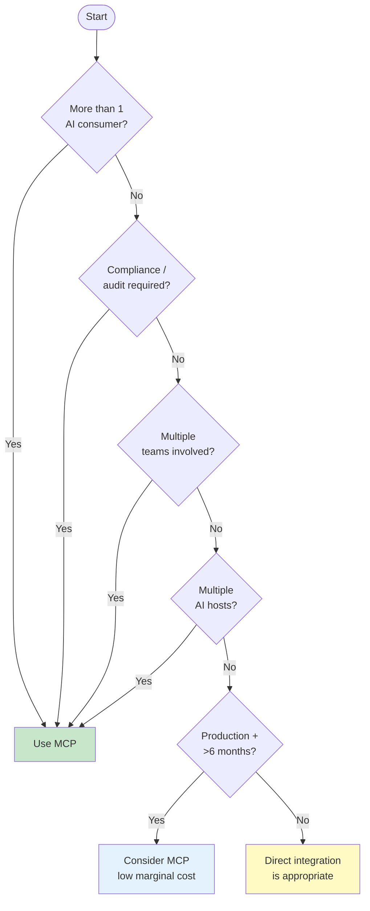

## Keywords in This File
{: .no_toc }

| # | Keyword | Weight |
|---|---|---|
| 18 | [Protocol-First AI Integration](#protocol-first-ai-integration) | ★☆☆ |
| 19 | [Standardization vs Flexibility in AI Tooling](#standardization-vs-flexibility-in-ai-tooling) | ★☆☆ |
| 20 | [MCP Adoption Decision Framework](#mcp-adoption-decision-framework) | ★☆☆ |

---

# Protocol-First AI Integration

**Interview Weight:** ★☆☆ - A conceptual pattern that
distinguishes engineers who think architecturally
about AI integration from those who think tactically.

---

### 🎯 Model Answer

**30 seconds:**

> Protocol-First AI Integration is the principle
> of defining the AI-tool interface as a formal protocol
> before writing any implementation. Instead of asking
> "how do I connect this API to this AI?" you ask
> "what protocol should govern all AI-to-tool communication?"
> MCP is an example of protocol-first thinking applied
> to AI tooling: it defines a standard interface
> (tools, resources, prompts, sampling) that any
> AI host and any backend can implement, making
> integrations interoperable by design.

**3 minutes:**

> In software engineering, protocol-first design
> has a long history: HTTP defined the web protocol
> before most web servers existed; REST defined
> the architectural style before most REST APIs existed;
> OpenAPI defined the description format that enabled
> tooling ecosystems. Each time, defining the protocol
> first enabled: interoperability (any client, any server),
> ecosystem development (tooling, libraries, validators),
> and governance (clear standards for security, versioning).
>
> Applied to AI integration: the early-stage approach
> is code-first - write a function, wire it to the
> AI, ship it. This works for one AI application.
> When you have 10 AI applications and 20 backend
> systems, the code-first approach produces 200 custom
> integrations, each with different error handling,
> auth, and logging.
>
> Protocol-first asks: what's the standard interface?
> MCP answers: a JSON-RPC protocol with defined
> capabilities (tools, resources, prompts), a standard
> lifecycle (initialize, use, shutdown), standard
> error codes, and standard transport layers (stdio, HTTP).
> Any AI host implementing the MCP client protocol
> can use any MCP server. Any backend implementing
> the MCP server protocol is accessible to all AI hosts.
>
> The meta-lesson: when designing AI integrations
> at scale, define the interface contract first.
> The implementation follows the contract.

**Blank Mind Recovery:**

**(1) Restate:** "Protocol-first AI integration. It's
about defining the interface standard before writing integrations."

**(2) First principles:** "HTTP before web servers.
REST before REST APIs. MCP before AI integrations.
The protocol enables the ecosystem."

**(3) Bridge:** "Same as OpenAPI for REST APIs: define
the contract, generate the implementation, validate
conformance."

---

### 📘 Concept Explanation

**What it is:**

Protocol-First AI Integration is the design philosophy
of establishing a standard communication protocol
between AI systems and external tools before building
individual integrations.

**The problem it solves:**

Without a protocol: each AI integration is a bespoke
point-to-point connection. Integrations are not
reusable, security postures vary, and there is no
basis for shared tooling (validators, testing frameworks,
logging).

**How it works:**

```
CODE-FIRST (no protocol):
  AI App A -> [custom fn A] -> System 1
  AI App A -> [custom fn B] -> System 2
  AI App B -> [custom fn C] -> System 1  (reimplemented)
  
  N apps * M systems = N*M integrations

PROTOCOL-FIRST (with MCP):
  AI App A -> MCP client -> [MCP Server 1] -> System 1
  AI App B -> MCP client -> [MCP Server 1] -> System 1 (reused)
  AI App A -> MCP client -> [MCP Server 2] -> System 2
  
  M servers + N clients = M + N implementations
```

**The key insight:**

Protocol-first reduces integration complexity from
O(N*M) to O(N+M). Every additional AI host can
immediately use all existing MCP servers without
new integrations. Every additional MCP server is
immediately accessible to all existing AI hosts.

**When this principle applies:**

Whenever more than one AI system needs to access
the same backend, or when more than one backend
needs to be accessed by the same AI system in a
consistent way.

**When to NOT apply protocol-first:**

For truly one-off integrations with no reuse potential,
the overhead of protocol design isn't justified.
Use direct integration. Reserve protocol-first for
the integration layer that will grow.

**Alternatives:**

- Platform-specific function calling: each LLM vendor's
  proprietary function calling format (OpenAI, Anthropic,
  Google). Not interoperable across vendors.
- GraphQL for AI: a query protocol, but not designed
  for AI tool interaction patterns.

**First-principles derivation:**

Integration complexity grows O(N*M) without a protocol
and O(N+M) with one. At scale, this difference
is enormous. Protocol-first is the engineering pattern
that enables scale.

---

### 💻 Code Example

```python
"""
Protocol-first vs. code-first: the N*M vs. N+M illustration.
"""

# CODE-FIRST: Each integration is unique.
# Scaling problem: adding a new AI app requires
# reimplementing integrations for every backend.

class CustomSlackIntegration:
    """Custom Slack integration for AI App A."""
    def __init__(self, slack_token):
        self.token = slack_token

    async def send_to_slack(self, channel, msg):
        import httpx
        resp = await httpx.AsyncClient().post(
            "https://slack.com/api/chat.postMessage",
            headers={"Authorization": f"Bearer {self.token}"},
            json={"channel": channel, "text": msg}
        )
        return resp.json()


class AnotherCustomSlackIntegration:
    """Same logic, different app. Maintenance burden x2."""
    def __init__(self, slack_token):
        self.token = slack_token
    # ... same code, duplicated for AI App B


# PROTOCOL-FIRST: Write one MCP server.
# Any MCP-compatible AI host can use it.
# BAD: duplicated integration per AI app (above)
# GOOD: single MCP server, any client can use it

from mcp.server import Server
import mcp.types as types

slack_server = Server("slack-mcp")

@slack_server.list_tools()
async def list_tools():
    return [types.Tool(
        name="send_message",
        description=(
            "Send a message to a Slack channel. "
            "Use when the user wants to notify or "
            "post an update to a Slack channel."
        ),
        inputSchema={
            "type": "object",
            "properties": {
                "channel": {
                    "type": "string",
                    "description": "Channel name (e.g., #general)"
                },
                "message": {
                    "type": "string",
                    "description": "Message text to send"
                }
            },
            "required": ["channel", "message"]
        }
    )]

@slack_server.call_tool()
async def call_tool(name, arguments):
    import httpx, os
    if name == "send_message":
        resp = await httpx.AsyncClient().post(
            "https://slack.com/api/chat.postMessage",
            headers={
                "Authorization":
                    f"Bearer {os.environ['SLACK_TOKEN']}"
            },
            json={
                "channel": arguments["channel"],
                "text": arguments["message"]
            }
        )
        result = resp.json()
        if result.get("ok"):
            return [types.TextContent(
                type="text",
                text=f"Message sent to {arguments['channel']}"
            )]
        return [types.TextContent(
            type="text",
            text=f"Failed: {result.get('error', 'unknown')}"
        )]
    raise ValueError(f"Unknown tool: {name}")

# This one server works with:
# Claude Desktop, VS Code Copilot,
# custom AutoGen agents, LangChain agents,
# any other MCP host.
# Write once, use everywhere.
```

> **Code walkthrough:** The code-first pattern shows
> two identical Slack integrations - one per AI application.
> When a third app needs Slack access, a third copy
> is written. Each has independent maintenance, security
> fixes, and bug cycles. The protocol-first pattern
> (`slack_server`) is written once. The MCP protocol
> contract is the interface: `tools/list` returns
> capabilities, `tools/call` executes them. Any MCP
> client - Claude Desktop, AutoGen, LangChain, custom
> agents - can call this server without modification.
> The `SLACK_TOKEN` credential lives server-side,
> never exposed to clients. One security review covers
> all consumers.

---

### 🎓 Answers by Seniority

**Junior / Mid:**

> "Protocol-first AI integration means defining a
> standard interface for AI-to-tool communication
> before writing implementations. MCP is the protocol.
> Instead of writing custom Slack integration code
> for each AI application, I write one MCP server
> for Slack. Every AI application that implements
> the MCP client protocol can use it. The benefit
> is reuse: write once, available everywhere."

---

**Senior / Staff:**

> "Protocol-first thinking applied to AI integration
> is the difference between O(N*M) custom integrations
> and O(N+M) with a protocol. This is the same pattern
> that made REST transformative: before REST, enterprise
> integrations were point-to-point. After REST + OpenAPI,
> any client could be generated from a spec. MCP
> does this for AI tools. The organizational implication:
> backend teams can build and own MCP servers
> independently of the AI teams that consume them.
> This separation of concerns is only possible because
> the protocol defines the contract. Both sides can
> evolve independently within the contract."

---

### ⚠️ Common Misconceptions

**Misconception: "Protocol-first means you need
to design the protocol from scratch."**

Protocol-first means adopting an existing protocol
where one exists, and designing minimally where one
doesn't. For AI tool integration: MCP is the emerging
standard. Adopt it rather than designing a custom
protocol. Protocol design should only happen when
no suitable standard exists and the use case is
genuinely novel.

---

### 🚨 Failure Modes and Diagnosis

**Failure: Premature protocol design for a use case
that didn't need it**

*Symptom:* Team spent 2 weeks designing a custom
AI tool protocol. The protocol has 3 features, all
of which MCP already supports.

*Root cause:* Protocol-first was applied without
first checking existing standards. MCP, OpenAPI,
or GraphQL already solve most AI integration needs.

*Fix:* Protocol adoption checklist before protocol design:
1. Does MCP solve this? (tools, resources, prompts)
2. Does OpenAPI solve this? (standard REST API description)
3. Does an existing vendor SDK solve this?
Only design a custom protocol if all three are "no."

---

### 🎯 Interview Deep-Dive

| Question Type | Est. Time |
|---|---|
| Pattern definition | 2-3 min |
| O(N+M) vs O(N*M) | 3-4 min |
| Historical examples | 2-3 min |
| MCP as protocol | 2-3 min |
| Trade-off | 3-4 min |
| When not to use | 2-3 min |
| Application to MCP | 3-4 min |

---

**[MID] Q1 - What is the N*M to N+M complexity
reduction from protocol-first design?**

*Why they ask:* Conceptual depth.

Without a protocol: each AI application (N apps)
needs a custom integration for each backend system
(M systems). Total integrations: N * M. If you have
10 AI apps and 15 backend systems: 150 integrations.
Each integration must be built and maintained separately.

With a protocol (MCP): each backend needs one MCP
server (M servers). Each AI app needs one MCP client
(N clients). Total implementations: M + N = 15 + 10 = 25.
The same 10 apps and 15 systems require 25 implementations
vs. 150.

Adding a new AI app: WITHOUT protocol = implement
15 new integrations. WITH protocol = implement 1 MCP
client. Adding a new backend: WITHOUT = 10 new
integrations. WITH = 1 MCP server.

The reduction compounds: at 50 AI apps and 100 backends:
5,000 vs. 150.

*What separates good from great:* "The reduction
compounds as scale increases - at 50 apps and 100
backends, the difference is 5,000 vs. 150 implementations."

---

**[MID] Q2 - How does HTTP REST illustrate the
value of protocol-first design?**

*Why they ask:* Historical analogy.

Before HTTP/REST: enterprise integrations were point-to-point.
System A called System B using System B's proprietary
protocol. Each integration was custom. An organization
with 20 systems could have 400 custom integration points.

HTTP/REST changed this:
- HTTP is the protocol: standard methods (GET, POST,
  PUT, DELETE), standard status codes, standard headers
- REST is the architectural style: resources, URLs, statelessness
- OpenAPI is the description format: machine-readable
  API specification

With HTTP + REST + OpenAPI: any HTTP client can
call any REST API. Client libraries can be generated
from OpenAPI specs. API gateways can enforce security
on any conforming API. Load balancers can route any HTTP traffic.

The ecosystem that built around the protocol: API
gateways, API management platforms, client SDKs,
mock servers, testing frameworks, documentation generators.

MCP is doing for AI tool integration what REST did
for service integration. Tooling ecosystem is developing:
MCP server libraries (Python, TypeScript), client libraries,
testing frameworks, registries. The protocol enables
the ecosystem.

*What separates good from great:* "The ecosystem
grows around the protocol - OpenAPI led to Swagger UI,
Postman, code generators. MCP will have its ecosystem."

---

**[JUNIOR] Q3 - Why is MCP considered a protocol-first
design rather than just another integration library?**

*Why they ask:* Protocol vs. library distinction.

A library is an implementation in a specific language.
A protocol is a language-agnostic specification.

MCP as a protocol:
- Defined in a specification (modelcontextprotocol.io)
- Implemented in multiple languages (Python SDK, TypeScript SDK, Java SDK, etc.)
- Any implementation that follows the spec is interoperable
- Not owned by a specific language ecosystem

If MCP were a library:
- It would be Python-only (or TypeScript-only)
- A Python MCP server could only be called by a Python MCP client
- Changing the implementation language would break all integrations

Protocol-first: the spec defines the contract.
The Python SDK and TypeScript SDK both implement
the same spec. A Python MCP server can be called
by a TypeScript MCP client because both implement
the same protocol.

*What separates good from great:* "The protocol spec
is the contract - implementations can be in any
language and remain interoperable."

---

**[MID] Q4 - [TRADE-OFF] When is code-first integration
better than protocol-first?**

*Why they ask:* Knowing when NOT to use a pattern.

Code-first is better when:

(1) One-off integration: a single AI application
    with one tool that will never be shared. The
    protocol overhead (formal spec, separate process,
    JSON-RPC serialization) is not justified.

(2) Maximum performance: direct function calls avoid
    JSON serialization, IPC, and protocol parsing.
    For latency-critical tools (< 10ms target),
    in-process calls are 10-100x faster.

(3) Deep framework integration: a tool that accesses
    the AI's internal state (context window, model
    config, memory) needs to be in the same process.
    MCP is for external tools.

(4) Early prototype: when validating if a tool is
    useful at all, direct integration is faster
    to write. Refactor to MCP once the value is proven.

The pattern: code-first for prototype and one-offs.
Protocol-first when multiple consumers need the same tool.

*What separates good from great:* "Code-first for
prototypes, then migrate to MCP when the second
consumer needs the tool."

---

**[JUNIOR] Q5 - What is the relationship between
the MCP specification and the MCP Python SDK?**

*Why they ask:* Protocol vs. implementation distinction.

The MCP specification (`modelcontextprotocol.io/spec`):
- Defines the protocol: JSON-RPC message format,
  method names (`tools/list`, `tools/call`, etc.),
  parameter schemas, error codes, capability negotiation
- Language-agnostic: a text document, not code
- Versioned: 2024-11-05, 2025-03-26, etc.

The MCP Python SDK (`pip install mcp`):
- A Python implementation of the MCP specification
- Provides: `Server`, `Client`, transport implementations,
  type definitions
- Implements the protocol spec in Python

The relationship: the spec is the contract; the SDK
is one implementation. The TypeScript SDK is another
implementation of the same spec. A Python server
(using the Python SDK) and a TypeScript client (using
the TypeScript SDK) are interoperable because both
implement the same spec.

The implication: when the spec changes, all SDK
implementations must update to the new version.
SDK version pinning should track spec version.

*What separates good from great:* "The spec is the
contract - SDK updates follow spec changes. A pinned
SDK version implements a specific spec version."

---

**[MID] Q6 - How does protocol-first AI integration
enable better governance?**

*Why they ask:* Governance value.

Without a protocol: governance must be implemented
custom for each integration. Authentication: each
integration has its own auth. Logging: each has
its own log format. Security: each has its own
validation. Auditing across 200 custom integrations
is impossible.

With a protocol (MCP): governance is implemented
once at the protocol layer:

Authentication: all MCP HTTP servers use OAuth 2.1
or Bearer tokens. One auth middleware works for all.

Logging: all tool calls follow the same JSON-RPC
structure. One log format. One SIEM integration.

Security: one security proxy validates all MCP traffic.
One tool description scanner. One rate limiter.

Audit trail: every tool call is in the same format.
Compliance reporting over all AI tool access is
possible because all data is in one schema.

The governance principle: apply policy once at
the protocol layer rather than per-integration.
Protocol-first makes governance tractable at scale.

*What separates good from great:* "Governance at
the protocol layer - apply once, covers all integrations."

---

**[JUNIOR] Q7 - Name three real-world examples of
protocol-first design that enabled ecosystems.**

*Why they ask:* Historical and analogical thinking.

(1) HTTP (1991): defined the web application protocol.
    Enabled: web browsers (any browser, any server),
    API gateways, CDNs, load balancers. Without HTTP:
    every web service would have needed its own protocol.

(2) SMTP (1982): defined the email transfer protocol.
    Enabled: interoperable email between any two mail
    servers worldwide, regardless of implementation.
    You can send email from Gmail to Outlook because
    both implement SMTP.

(3) SQL (1974): defined the database query language.
    Enabled: a standard query language that works
    across PostgreSQL, MySQL, SQLite, Oracle.
    Query knowledge is transferable across databases.

(4) OpenAPI / Swagger (2011): defined the REST API
    description format. Enabled: Swagger UI, Postman,
    code generators, API management platforms. Any
    API described in OpenAPI format benefits from
    this entire ecosystem.

(5) MCP (2024-): defining the AI tool protocol.
    Enabling: multi-host tool sharing, security proxies,
    server registries, testing frameworks, governance tools.

*What separates good from great:* "The ecosystem
is the value - SMTP's value isn't the protocol itself,
it's the universal email interoperability it enabled."

---

### ⚖️ Comparison Table

*(Omit: ★☆☆ foundational concept.)*

---

### 🏛️ System Design

*(Omit: system design captured in L5 Architecture keyword.)*

---

### 📊 Diagram

*(Omit: the N+M vs N*M reduction is clearer as text.)*

---

---

# Standardization vs Flexibility in AI Tooling

**Interview Weight:** ★☆☆ - The engineering tension
between standardization (MCP) and flexibility (custom
integrations) is a recurring architectural decision.
Understanding the tradeoffs is a META skill.

---

### 🎯 Model Answer

**30 seconds:**

> Standardization (using MCP or any protocol) gains:
> reusability, interoperability, shared tooling, and
> centralized governance. It costs: protocol overhead,
> reduced flexibility in the integration interface,
> and the need to conform to the protocol's design
> decisions. Flexibility (custom integrations) gains:
> exact fit for the use case, minimal overhead, full
> control. It costs: no reuse, no interoperability,
> per-integration maintenance. The crossover point:
> when a second consumer needs the same tool, standardize.

**3 minutes:**

> The standardization-flexibility tension is one
> of the oldest problems in software engineering.
> It appears in: database schemas vs. document stores,
> REST vs. GraphQL, microservices vs. monoliths, MCP vs. custom functions.
>
> For AI tooling specifically: custom function calling
> (the flexible option) is perfectly appropriate
> for a single AI application with a handful of tools
> that won't be shared. You control the exact interface,
> add any metadata you want, and change it freely.
>
> MCP (the standardized option) is valuable when
> multiple consumers need the same tools. The standard
> interface means all consumers get the same tool
> API, the same security model, and the same logging.
> But MCP requires conforming to the protocol's design:
> tools/list, tools/call, JSON-RPC, capability negotiation.
> You can't add arbitrary metadata to a tool call
> without going through the protocol.
>
> The META pattern: standardization creates interoperability
> at the cost of interface flexibility. The right
> moment to standardize: when the cost of maintaining
> multiple inconsistent custom integrations exceeds
> the cost of protocol conformance. This is typically
> when the third consumer of the same tool is being built.

**Blank Mind Recovery:**

**(1) Restate:** "Standardization vs. flexibility.
Custom integration is flexible; MCP is standardized."

**(2) First principles:** "Standardization enables
reuse at the cost of flexibility. Flexibility enables
exact-fit at the cost of reuse. The right choice
depends on how many consumers need the same tool."

**(3) Bridge:** "Same as REST vs. GraphQL: REST is
standardized and reusable; GraphQL is flexible and
query-specific. Choose based on how many different
access patterns you need to support."

---

### 📘 Concept Explanation

**What it is:**

The Standardization vs. Flexibility tension in AI
tooling is the engineering tradeoff between using
a standard protocol (MCP) for interoperability
and governance vs. using custom integrations for
exact-fit flexibility and performance.

**The problem it solves:**

Understanding this tradeoff guides the "should we
use MCP here?" decision, which comes up in every
AI integration project.

**How it works:**

```
STANDARDIZATION (MCP):

  Gains:
  + Any MCP client can use your server
  + Centralized auth, logging, security
  + Shared tooling (validators, testing frameworks)
  + AI hosts can aggregate tools from multiple servers

  Costs:
  - Protocol overhead (JSON-RPC serialization, IPC)
  - Must conform to MCP interface design
  - Cannot add arbitrary metadata to tool calls
  - Additional deployment complexity (separate process)

FLEXIBILITY (custom function calling):

  Gains:
  + Exact interface for your use case
  + In-process, minimal latency
  + Full control (add any metadata, any format)
  + Simpler deployment (no separate server process)

  Costs:
  - No reuse across AI frameworks
  - Per-app maintenance
  - No standardized security or audit
  - Reimplemented for each new AI consumer
```

**The key insight:**

Standardization value scales with the number of
consumers. With 1 consumer: standardization overhead
exceeds benefit. With 10 consumers: standardization
benefit is 10x the overhead. The decision rule:
standardize when you have (or expect to have) more
than 2 consumers of the same tool.

**When to prefer standardization:**

- Multiple AI consumers (Claude Desktop + custom agent + VS Code)
- Centralized security governance required
- Tools should be reusable by future projects
- Compliance requires consistent audit logging

**When to prefer flexibility:**

- Single-consumer, never-to-be-shared tool
- Latency-critical (< 10ms tool calls)
- Prototype phase (standardize later if valuable)
- Tool accesses AI's internal state (must be in-process)

---

### 💻 Code Example

```python
"""
Comparing standardized (MCP) vs. flexible (direct)
AI tool integration for the same Postgres query tool.
"""

# OPTION A: FLEXIBLE (direct function calling)
# Pro: simple, in-process, minimal overhead
# Con: OpenAI-specific, not reusable in Claude, VS Code, etc.

import psycopg2
from openai import OpenAI

# OpenAI function schema (proprietary format)
QUERY_FUNCTION = {
    "name": "query_database",
    "description": "Run a SQL query against the analytics DB",
    "parameters": {
        "type": "object",
        "properties": {
            "sql": {"type": "string",
                    "description": "SQL query to execute"},
            "limit": {"type": "integer",
                      "description": "Max rows (default 10)"}
        },
        "required": ["sql"]
    }
}

def execute_query(sql: str, limit: int = 10) -> list:
    """Direct implementation, in-process."""
    conn = psycopg2.connect(
        "postgres://analytics_ro@db:5432/analytics"
    )
    with conn.cursor() as cur:
        cur.execute(sql + f" LIMIT {limit}")
        return cur.fetchall()


# To reuse this with Claude:
# - Rewrite for Anthropic tool use format
# - Redeploy or add another function schema

# ---

# OPTION B: STANDARDIZED (MCP server)
# Pro: any MCP client uses it unchanged
# Con: separate process, protocol overhead, more setup

from mcp.server import Server
import mcp.types as types
import json

mcp_db_server = Server("analytics-db")

@mcp_db_server.list_tools()
async def list_tools():
    return [types.Tool(
        name="query_database",
        description=(
            "Run a read-only SQL query against the analytics "
            "database. Returns up to 100 rows. "
            "Use for: reports, metrics, business intelligence."
        ),
        inputSchema={
            "type": "object",
            "properties": {
                "sql": {
                    "type": "string",
                    "description": "SQL SELECT query"
                },
                "limit": {
                    "type": "integer",
                    "description": "Max rows (1-100, default 10)"
                }
            },
            "required": ["sql"]
        }
    )]

@mcp_db_server.call_tool()
async def call_tool(name, arguments):
    if name == "query_database":
        import re
        sql = arguments["sql"]
        limit = min(arguments.get("limit", 10), 100)

        # Security: only SELECT
        if not re.match(r"^\s*SELECT\b", sql, re.IGNORECASE):
            return [types.TextContent(
                type="text",
                text="Only SELECT queries are permitted."
            )]

        import aiopg, os
        async with aiopg.connect(
            os.environ["ANALYTICS_DB_URL"]
        ) as conn:
            async with conn.cursor() as cur:
                await cur.execute(
                    sql + f" LIMIT {limit}"
                )
                rows = await cur.fetchall()
                return [types.TextContent(
                    type="text",
                    text=json.dumps(rows)
                )]
    raise ValueError(f"Unknown tool: {name}")

# This MCP server works with:
# Claude Desktop (no code change needed)
# VS Code Copilot agent (no code change needed)
# Custom LangChain agent (no code change needed)
# Future AI systems that support MCP (no code change needed)
```

> **Code walkthrough:** Option A (flexible) is an
> OpenAI-specific function definition with a direct
> psycopg2 implementation. It's simple and fast, but
> locked to OpenAI's function-calling format. To use
> it with Claude, you'd rewrite the schema in Anthropic's
> tool format. To use it with VS Code Copilot, you'd
> rewrite it again. Option B (standardized MCP) is
> more complex: a separate server process, JSON-RPC
> protocol, async implementation. But the tool description
> format is universal (MCP tools/list) - Claude Desktop,
> VS Code, LangChain agents, and any future MCP host
> all use the same server without modification. The
> SELECT-only validation is also applied once in
> the server, not separately in each consumer.

---

### 🎓 Answers by Seniority

**Junior / Mid:**

> "The tradeoff: custom function calling is simpler
> and more flexible; MCP is standardized and reusable.
> I use custom function calling for prototypes and
> single-app tools. I use MCP when the same tool
> needs to work in Claude Desktop AND a custom agent -
> writing it once as an MCP server is less work than
> maintaining two custom implementations."

---

**Senior / Staff:**

> "The standardization-flexibility tension maps to
> a decision: how many consumers? One consumer: custom
> integration is simpler. Three consumers: MCP is
> already less total work. Ten consumers: MCP is
> the only scalable option. The hidden cost of flexibility
> is compounding maintenance: each custom integration
> must be updated separately when the underlying API
> changes, the auth model changes, or a security
> vulnerability is found. Standardization amortizes
> these costs across all consumers. The organizational
> implication: standardization enables teams to work
> independently - the backend team maintains the
> MCP server, AI teams consume it. This separation
> of concerns is not possible with custom integrations."

---

### ⚠️ Common Misconceptions

**Misconception: "MCP is always the right choice
because it's a standard."**

Standards are valuable when they solve actual problems
at your scale. For a solo developer building a personal
Claude Desktop extension with one custom tool, MCP's
overhead (JSON-RPC, separate process, capability
negotiation) adds complexity without proportional
benefit. Direct function calling is simpler and
appropriate. Use standards where standardization
creates measurable value - multiple consumers,
shared governance, or compliance requirements.

---

### 🚨 Failure Modes and Diagnosis

**Failure: Over-standardized prototype slows development**

*Symptom:* Team spent 3 weeks building MCP infrastructure
for a tool that is used only in one application and
has changed its interface 5 times during development.

*Root cause:* Protocol-first applied to prototyping
phase. The tool's interface was still evolving;
the protocol added friction.

*Fix:* Use the two-phase model: (1) prototype with
direct integration. (2) When the interface stabilizes
and a second consumer appears, migrate to MCP.
The migration is straightforward once the interface
is defined.

---

### 🎯 Interview Deep-Dive

| Question Type | Est. Time |
|---|---|
| Tradeoff definition | 3-4 min |
| When to standardize | 3-4 min |
| Cost of flexibility | 3-4 min |
| Organizational impact | 3-4 min |
| Real example | 4-5 min |
| Trade-off | 3-4 min |
| Ecosystem effects | 3-4 min |

---

**[MID] Q1 - What is the compounding maintenance
cost of non-standardized AI tool integrations?**

*Why they ask:* Business case for standardization.

Non-standardized integrations compound over time:

When the underlying API changes: every custom integration
must be individually updated. With 10 custom Slack
integrations: 10 separate code changes, 10 separate
tests, 10 separate deployments.

When a security vulnerability is found in the auth
pattern: all custom integrations must be patched.
With 20 integrations: 20 security patches, 20 code reviews.

When a new developer joins: they must understand
20 different integration patterns instead of one MCP pattern.

When compliance requires audit logging: add audit
logging to 20 custom integrations, each with different
structure.

With MCP: change the API client once in the MCP server.
Patch the auth once in the shared middleware.
New developers learn MCP once.
Add audit logging once in the MCP proxy.

The compounding: each additional custom integration
increases maintenance linearly. Protocol-based integrations
add near-zero marginal maintenance.

*What separates good from great:* "Security patches
are where the compounding hurts most - one auth
vulnerability requires 20 separate fixes in custom integrations."

---

**[SENIOR] Q2 - How does the standardization-flexibility
tradeoff appear in the REST vs. GraphQL decision?**

*Why they ask:* Pattern recognition across technologies.

REST is the standardized approach: standard HTTP
methods, standard status codes, standard URL patterns.
Works with: API gateways, CDNs, caching, load balancers.
Flexible on data: client gets what the server returns.

GraphQL is the flexible approach: client specifies
exactly what data it needs. Reduces over-fetching.
Enables exact-fit data shapes per consumer.
Costs: requires GraphQL-specific infrastructure,
no built-in HTTP caching, schema management overhead.

The parallel to MCP:

REST ~ MCP: standardized protocol, works with existing
infrastructure, enables centralized security + caching.

GraphQL ~ custom function calling: flexible, exact-fit,
but requires per-consumer implementation and loses
standard tooling benefits.

When GraphQL is better: multiple clients (mobile,
web, API consumers) with very different data needs,
where REST over-fetching is a real problem.

When REST is better: standard CRUD operations, public
APIs (ecosystem tooling), or when caching is critical.

The pattern: use standardization for the infrastructure
layer (what's shared). Use flexibility for the application
layer (what's unique to your use case).

*What separates good from great:* "The protocol-application
split: standardize the infrastructure (MCP/REST),
keep flexibility in the application layer (tool
implementations)."

---

**[MID] Q3 - What signals indicate it's time to
migrate from custom integration to MCP?**

*Why they ask:* Decision triggers.

Five signals to migrate:

(1) A second team asks to use your tool: custom integrations
    require the second team to reimplement. MCP
    enables sharing. Trigger: first request from
    a second consumer.

(2) Inconsistent security posture: different custom
    integrations have different auth (some API key,
    some OAuth, some none). Compliance review flags
    this. Trigger: first compliance or security audit.

(3) Maintenance burden spike: a single API change
    requires updating 5+ custom integrations.
    Trigger: when update time exceeds 1 sprint.

(4) New AI host adoption: the organization adds
    a second AI tool (e.g., Claude Desktop alongside
    an existing OpenAI integration). Custom integrations
    are OpenAI-specific; they don't work in Claude.
    Trigger: multi-host AI adoption.

(5) Audit trail requirement: the business needs
    a log of all AI tool calls for compliance.
    Building this across custom integrations is
    harder than building it once for MCP.

Migration approach: migrate high-value tools first
(most used, most consumers). Run MCP and custom
in parallel during migration. Decommission custom
after all consumers have switched.

*What separates good from great:* "Migration trigger
1 is the most important: when the second consumer
appears, the total migration cost is less than
maintaining two independent implementations."

---

**[JUNIOR] Q4 - Why do large AI platforms (LangChain,
AutoGen) support MCP instead of only their own tool format?**

*Why they ask:* Ecosystem thinking.

LangChain Tools, AutoGen FunctionCall, LlamaIndex
Tools: each framework had its own tool integration
format. A LangChain Tool doesn't work in AutoGen.
An AutoGen FunctionCall doesn't work in LlamaIndex.

The problem this creates: organizations using multiple
AI frameworks must implement the same backend tool
N times (once per framework). Backend teams must
maintain multiple versions of the same integration.

MCP solves this: a single MCP server works in:
- LangChain (via langchain-mcp)
- AutoGen (via autogen-mcp integration)
- Claude Desktop (native MCP client)
- VS Code Copilot (native MCP client)
- Any framework that implements MCP client support

By supporting MCP, these frameworks can tell their
users: "Any MCP server is immediately usable in
our framework." This makes the framework more valuable
(access to the growing MCP server ecosystem) and
reduces the barrier to switching frameworks.

The standardization benefit: the MCP server ecosystem
(1000+ servers as of 2025) is available to every
framework that implements MCP. No single framework
could build that ecosystem alone.

*What separates good from great:* "Supporting MCP
gives frameworks access to the entire MCP ecosystem - no
single framework could match that breadth by building custom tools."

---

**[JUNIOR] Q5 - Summarize when to use MCP and when
to use direct function calling in one decision rule.**

*Why they ask:* Synthesis and clarity.

Decision rule:

```
IF tool will be used by:
  ONE AI app only AND
  never shared AND
  latency is critical (<10ms) AND
  in early prototype phase
  -> DIRECT function calling

OTHERWISE
  -> MCP
```

Expansion:

"Otherwise" covers the majority of production cases:
- Two or more AI apps need the same tool: use MCP
- Compliance requires audit logging: use MCP
- Multiple teams involved: use MCP
- Tool will exist for > 3 months: use MCP

The default should be MCP for any tool that isn't
clearly a one-off prototype. The overhead of setting
up an MCP server is 2-4 hours. The overhead of
reimplementing a custom integration for the second
consumer is days.

Rule of thumb: if you're not sure, write it as
MCP. You can always add a direct integration later;
it's harder to extract a direct integration into
an MCP server after it's deeply embedded in an AI app.

*What separates good from great:* "Default to MCP
unless there's a specific reason not to - the setup
cost is small compared to the reuse benefit."

---

**[MID] Q6 - How does team structure influence
the standardization-flexibility decision?**

*Why they ask:* Conway's Law application.

Conway's Law: organizations design systems that
mirror their communication structures.

Team implications for AI tooling:

Single-team (one team owns all AI + integrations):
Custom integration is viable because the same team
maintains everything. Changes are coordinated internally.
Standardization benefit is lower because the team
already shares context.

Multi-team (separate AI team + backend teams):
Custom integration creates coordination dependencies.
Every AI-side change requires backend-side updates.
MCP creates a stable interface contract: the AI team
and backend team can evolve independently within the contract.

Platform team model (AI platform team + feature teams):
MCP is strongly preferred. The platform team provides
the standard (MCP) and shared infrastructure.
Feature teams build MCP servers following platform
standards. No coordination required for each new
tool connection.

Practical implication: if you're building a tool
that another team will use, MCP is the right choice
because it creates a clear ownership boundary.
The team that owns the backend owns the MCP server.
The team that uses it implements the MCP client.

*What separates good from great:* "MCP creates Conway's
Law-compatible ownership boundaries - the interface
contract enables team independence."

---

**[JUNIOR] Q7 - What flexibility do you lose when
standardizing on MCP?**

*Why they ask:* Understanding the real cost of standardization.

What you can't do (easily) with MCP:

(1) Custom tool call metadata: you can't add arbitrary
    metadata to tool calls beyond what the MCP spec defines.
    Need to pass a `trace_id`? You'd need to add it
    to the tool arguments or use a custom transport.

(2) Streaming partial tool results: MCP tools return
    a complete result at the end of execution. You
    can't return partial results mid-execution (this
    is planned for a future spec version).

(3) Binary data: tool results are text-based (TextContent,
    ImageContent). Returning large binary data (e.g.,
    video files) requires encoding (base64) which
    increases size.

(4) Transport selection: you must use stdio or HTTP.
    If your tool requires a different transport
    (WebSocket, gRPC, custom binary protocol), MCP
    doesn't directly support it.

(5) Tight coupling to AI's internal state: if a
    tool needs to directly access the AI model's
    internal state (embeddings, attention patterns),
    an external MCP server cannot reach in-process data.

These limitations are real but rarely blocking. For
the 95% use case (query data, write data, perform actions
on external systems), MCP's interface is sufficient.

*What separates good from great:* "Streaming partial
results is the most commonly missing feature - it's
needed for long-running operations like data processing pipelines."

---

### ⚖️ Comparison Table

*(Omit: ★☆☆ conceptual keyword.)*

---

### 🏛️ System Design

*(Omit: conceptual META keyword.)*

---

### 📊 Diagram

*(Omit: clearer as text for this concept.)*

---

---

# MCP Adoption Decision Framework

**Interview Weight:** ★☆☆ - A structured decision
framework for the most common MCP question: "should
we use MCP for this?" Demonstrates systematic thinking.

---

### 🎯 Model Answer

**30 seconds:**

> The MCP adoption decision comes down to five questions:
> (1) Will more than one AI consumer need this tool?
> (2) Does this require centralized governance or audit?
> (3) Will this tool be maintained for > 6 months?
> (4) Are multiple teams involved?
> (5) Do you need to support multiple AI hosts (Claude, GPT, custom)?
> Any "yes" strongly indicates MCP. All "no" indicates
> a direct integration is simpler. Use MCP as the default
> for production work; use direct integration for
> prototypes and one-offs.

**3 minutes:**

> The MCP adoption decision is not a binary yes/no.
> It's a cost-benefit analysis across five dimensions:
> reuse, governance, longevity, team ownership, and
> multi-host support.
>
> Reuse: if only one AI application will ever need
> this tool, MCP's overhead (separate server process,
> JSON-RPC serialization, capability negotiation) doesn't
> pay off. If two or more will need it, MCP starts
> paying dividends immediately.
>
> Governance: organizations with compliance requirements
> (SOC2, HIPAA, GDPR) need audit trails for AI tool
> access. Building audit trails into custom integrations
> is expensive. MCP servers with centralized logging
> provide this cheaply.
>
> Longevity: short-lived prototypes don't benefit
> from MCP's standardization. Long-lived production
> tools accumulate the compound benefit of having
> a stable interface.
>
> Team ownership: when a backend team owns the tool
> and a separate AI team consumes it, MCP creates
> the interface contract that allows both teams to
> work independently.
>
> Multi-host: if the organization uses multiple AI
> systems (Claude Desktop for productivity, custom
> GPT agent for automation, VS Code Copilot for development),
> MCP enables all three to share the same tools.
> Custom integrations are host-specific.

**Blank Mind Recovery:**

**(1) Restate:** "MCP adoption decision. Five questions:
reuse, governance, longevity, team ownership, multi-host."

**(2) First principles:** "MCP's value is in standardization.
Standardization value scales with the number of
consumers and the duration of use. If you have
one consumer for one month: not worth it. Ten consumers
for two years: absolutely worth it."

**(3) Bridge:** "Same decision as 'should we build
a REST API or a direct function call': public API
needed? Yes -> REST. Internal one-off? Yes -> direct call."

---

### 📘 Concept Explanation

**What it is:**

The MCP Adoption Decision Framework is a structured
set of criteria for deciding when to use MCP (the
protocol-based approach) vs. direct function calling
(the custom approach) for AI tool integration.

**The problem it solves:**

Teams repeatedly face "should we use MCP for this?"
without a structured way to evaluate. The framework
prevents both over-engineering (using MCP for simple
one-offs) and under-engineering (using custom integration
where MCP would save significant work).

**How it works:**

```
DECISION TREE:

Will >1 AI app need this tool?
  YES -> STRONG signal for MCP
  NO  -> Continue

Does compliance require audit logging for this?
  YES -> STRONG signal for MCP
  NO  -> Continue

Will this tool exist in production >6 months?
  YES -> MODERATE signal for MCP
  NO  -> Direct integration is likely fine

Are backend + AI owned by different teams?
  YES -> STRONG signal for MCP
  NO  -> Continue

Must this work with multiple LLM providers?
  YES -> STRONG signal for MCP
  NO  -> Direct integration is probably fine

SCORING:
  2+ STRONG signals -> Use MCP
  1 STRONG + 1 MODERATE -> Use MCP
  0 STRONG signals -> Direct integration is simpler
```

**The key insight:**

The decision is fundamentally about the value of
standardization for YOUR specific case. The framework
forces explicit consideration of each value driver
rather than an intuitive "MCP is the standard so
use it" or "it's simpler to write directly."

**When to use MCP:**

- Multi-consumer (strongest signal)
- Multi-host (Claude + GPT + VS Code must all work)
- Compliance/governance requirements
- Long-lived production tools
- Cross-team ownership

**When to use direct integration:**

- Single consumer, no expansion plans
- Prototype/exploration phase
- Latency-critical (in-process calls much faster)
- Single AI host that will never change
- Tool accesses AI internal state (must be in-process)

---

### 💻 Code Example

```python
"""
MCP adoption decision framework: code illustration.
Shows when each approach is appropriate.
"""

# SCENARIO 1: Use direct integration
# - Single AI app (OpenAI-based chatbot)
# - One tool (weather lookup)
# - Prototype phase, may be discarded
# - No compliance requirements
# - No plans for other consumers

from openai import OpenAI
import json

def get_weather_direct(city: str) -> str:
    """Direct function: simple, no overhead."""
    import httpx
    resp = httpx.get(
        "https://api.weather.com/v1/current",
        params={"city": city, "key": "api-key"}
    )
    return json.dumps(resp.json()["current"])

# OpenAI-specific function schema
WEATHER_FUNCTION = {
    "name": "get_weather",
    "description": "Get current weather for a city.",
    "parameters": {
        "type": "object",
        "properties": {
            "city": {"type": "string"}
        },
        "required": ["city"]
    }
}

# Appropriate: simple prototype, one consumer.
# NOT using MCP is the correct choice here.


# SCENARIO 2: Use MCP
# - Multiple consumers:
#   Claude Desktop (user assistant)
#   Custom agent (background monitoring)
#   VS Code Copilot (developer assistant)
# - Compliance: weather data used in reports,
#   audit required
# - Long-lived: production tool, 2+ years planned
# - Shared: platform team owns the server

from mcp.server import Server
import mcp.types as types

weather_mcp = Server("weather-service")

@weather_mcp.list_tools()
async def list_tools():
    return [types.Tool(
        name="get_weather",
        description=(
            "Get current weather conditions for a city. "
            "Returns temperature, humidity, and conditions. "
            "Use when the user asks about weather or "
            "climate conditions for a location."
        ),
        inputSchema={
            "type": "object",
            "properties": {
                "city": {
                    "type": "string",
                    "description": "City name or city, country code"
                },
                "units": {
                    "type": "string",
                    "enum": ["celsius", "fahrenheit"],
                    "description": "Temperature units (default: celsius)"
                }
            },
            "required": ["city"]
        }
    )]

@weather_mcp.call_tool()
async def call_tool(name, arguments):
    if name == "get_weather":
        import httpx, os, sys
        city = arguments["city"]
        units = arguments.get("units", "celsius")

        # Audit log (centralized)
        import time
        print(
            json.dumps({
                "ts": time.strftime("%Y-%m-%dT%H:%M:%SZ",
                                    time.gmtime()),
                "tool": "get_weather",
                "city": city
            }),
            file=sys.stderr
        )

        resp = await httpx.AsyncClient().get(
            "https://api.weather.com/v1/current",
            params={
                "city": city,
                "units": units,
                "key": os.environ["WEATHER_API_KEY"]
            }
        )
        if resp.status_code != 200:
            return [types.TextContent(
                type="text",
                text=f"Weather API unavailable for {city!r}."
            )]
        data = resp.json()["current"]
        return [types.TextContent(
            type="text",
            text=(
                f"Weather in {city}: "
                f"{data['temp']} {units[0].upper()}, "
                f"{data['conditions']}, "
                f"humidity {data['humidity']}%"
            )
        )]
    raise ValueError(f"Unknown: {name}")

# Scenario 2 decision rationale:
# 3 consumers -> MCP
# Compliance -> MCP (audit logging included)
# 2+ year lifespan -> MCP
# Platform team -> MCP (clear ownership)
# Multiple AI hosts -> MCP (any host can use it)
```

> **Code walkthrough:** Two scenarios side by side.
> Scenario 1 uses direct function calling: an OpenAI-specific
> schema, a plain Python function. This is appropriate
> for a single-consumer prototype. No MCP overhead.
> If it turns out to be valuable, migrate to MCP
> later. Scenario 2 uses MCP because five decision
> criteria all point to MCP: three consumers, compliance
> requirement, long lifespan, platform team ownership,
> and multi-host support. The MCP server includes
> audit logging, a richer tool description (with
> units parameter), and a structured error response.
> The same server code serves Claude Desktop, the
> custom agent, and VS Code Copilot without modification.

---

### 🎓 Answers by Seniority

**Junior / Mid:**

> "I decide between MCP and direct integration with
> a few questions. Will more than one AI app need
> this tool? If yes: MCP, so I write it once and
> every consumer gets it. Is this for a prototype
> that might be thrown away? Direct integration:
> faster to write, easier to change. Will multiple
> AI hosts need it (Claude + a custom agent)? MCP:
> custom integrations are host-specific. Default:
> I lean toward MCP for anything going to production."

---

**Senior / Staff:**

> "The MCP adoption decision is a cost-benefit analysis.
> MCP costs: setup time (a few hours), protocol overhead
> (a few hundred microseconds), and learning curve.
> MCP benefits: reuse (amortized over N consumers),
> standardized governance (one auth, one log format,
> one security review), and independence (backend team
> evolves the server without AI team coordination).
> The crossover point: 2+ consumers, and the setup
> cost is amortized immediately. I use a simple scoring
> system: 2+ STRONG signals (multi-consumer, compliance,
> cross-team) -> MCP. Otherwise: evaluate whether
> the added complexity is justified. The practical
> default: use MCP for anything that will be maintained
> for more than 6 months. The setup cost is trivial
> compared to the long-term maintenance savings."

---

### ⚠️ Common Misconceptions

**Misconception: "MCP is the right choice for all
AI tools because it's the standard."**

Standards are tools, not mandates. Using MCP for
a personal single-app tool adds deployment complexity
(separate server process, JSON-RPC overhead, capability
negotiation) without any benefit (no second consumer,
no governance need). The decision framework exists
precisely to prevent cargo-culting: using MCP because
"it's the standard" without evaluating whether
its benefits apply to the specific use case.

---

### 🚨 Failure Modes and Diagnosis

**Failure: Team uses direct integration, then discovers
they need MCP six months later**

*Symptom:* An AI feature built with direct OpenAI
function calling needs to work in Claude Desktop.
Full rewrite required.

*Root cause:* The team didn't ask "will this need
to work in multiple AI hosts?" during design.

*Prevention:* Apply the decision framework at design
time. Multi-host was a foreseeable requirement (the
organization was evaluating multiple AI tools).

*Recovery:* The migration is straightforward:
(1) Extract the implementation logic from the custom function.
(2) Wrap it in an MCP server.
(3) Remove the direct integration and replace with MCP client calls.
(4) Test with all consumers.

Migration time: 1-3 days for a typical tool.
The delay cost: 3 days of migration vs. 1 day of
setup at design time. Worth doing the framework
upfront.

---

### 🎯 Interview Deep-Dive

| Question Type | Est. Time |
|---|---|
| Framework overview | 3-4 min |
| Apply to scenario | 3-4 min |
| Multi-consumer signal | 3-4 min |
| Governance signal | 3-4 min |
| Make the case for MCP | 3-4 min |
| Make the case against | 3-4 min |
| Migration scenario | 4-5 min |

---

**[MID] Q1 - Walk me through the MCP adoption decision
for a production customer support AI assistant.**

*Why they ask:* Framework application.

Scenario: building a customer support AI assistant.
It will use tools: query customer records, create
support tickets, check order status, escalate to human agents.

Decision analysis:

Will >1 AI app need this? YES - the support assistant
is deployed for phone (voice AI), web chat (Claude-based),
and mobile app (custom agent). Three consumers.
-> STRONG signal for MCP.

Compliance/audit? YES - customer data access must
be logged for GDPR compliance. Audit trail of what
data the AI accessed and when.
-> STRONG signal for MCP.

Longevity? YES - this is a core production system,
not a prototype.
-> MODERATE signal for MCP.

Cross-team? YES - CRM team owns customer records,
AI team builds the assistant.
-> STRONG signal for MCP.

Multi-host? YES - phone uses one AI service, web
uses another, mobile uses a third.
-> STRONG signal for MCP.

Score: 4 STRONG signals. Clear decision: use MCP.

MCP architecture: one MCP server per domain:
- `customer-records-server` (CRM team owns)
- `ticketing-server` (support engineering owns)
- `order-server` (commerce team owns)

*What separates good from great:* "One server per
domain with separate team ownership - each team
evolves their server independently."

---

**[MID] Q2 - When should you definitively NOT use MCP?**

*Why they ask:* Counter-argument ability.

Definitively avoid MCP when:

(1) Prototyping unknown viability: you're not sure
    the tool will be useful. Write it directly.
    If it proves valuable, migrate to MCP later.
    MCP setup is 2-4 hours; that time is wasted
    on a prototype that gets discarded.

(2) Latency requirement < 10ms: JSON-RPC serialization,
    IPC, and protocol negotiation add 1-5ms overhead.
    For tools that need < 10ms total latency
    (real-time audio processing, high-frequency trading signals),
    in-process direct calls are required.

(3) Access to AI internal state: a tool that needs
    to read the AI model's embedding space, attention
    weights, or in-context memory must run in the
    same process. External MCP servers cannot access
    in-process state.

(4) Toy or personal project: a personal Claude Desktop
    extension with one tool is not worth the overhead.
    The user is the only consumer.

(5) Tool is a thin wrapper around a single API call
    that no other system needs: adding the MCP protocol
    layer for a 3-line function that only one internal
    microservice calls is over-engineering.

*What separates good from great:* "In-process state
access is the absolute blocker - no amount of optimization
makes external MCP suitable for accessing the AI's
internal state."

---

**[JUNIOR] Q3 - What is the minimum viable MCP adoption?**

*Why they ask:* Pragmatism.

Minimum viable MCP adoption: a single MCP server
using stdio transport, no authentication, with the
Python SDK's standard implementation.

```python
"""Minimum viable MCP server."""
import asyncio
from mcp.server import Server
from mcp.server.stdio import stdio_server
import mcp.types as types

server = Server("minimal")

@server.list_tools()
async def list_tools():
    return [types.Tool(
        name="hello",
        description="Returns a greeting.",
        inputSchema={
            "type": "object",
            "properties": {
                "name": {"type": "string"}
            }
        }
    )]

@server.call_tool()
async def call_tool(name, arguments):
    if name == "hello":
        n = arguments.get("name", "world")
        return [types.TextContent(
            type="text", text=f"Hello, {n}!"
        )]
    raise ValueError(f"Unknown: {name}")

async def main():
    async with stdio_server() as (r, w):
        await server.run(r, w, server.create_initialization_options())

asyncio.run(main())
```

This is the starting point. Add complexity only when:
- Authentication: when the server is networked
- Error handling: when the tool calls external APIs
- Logging: when deployed to production
- Caching: when backend calls are expensive

Start minimal. Evolve as requirements emerge.

*What separates good from great:* "Start minimal
and evolve - a working minimal server in production
is better than a perfect server still in development."

---

**[SENIOR] Q4 - How do you make the business case
for investing in MCP infrastructure?**

*Why they ask:* Business communication.

Business case structure:

Problem: AI teams spend 30-40% of development time
on integration maintenance. Each new AI feature
requires rebuilding connections to the same 10-15
backend systems, each with custom auth, logging,
and error handling.

Investment: 6 weeks to build MCP platform infrastructure:
- MCP server template (2 weeks)
- CI/CD pipeline for servers (1 week)
- Shared auth middleware (1 week)
- Basic registry and audit logging (2 weeks)

Payback:

Current cost: team of 8 engineers, 35% time on integration
maintenance = 2.8 FTE months/quarter. Annual cost: 11.2 FTE months.

With MCP: estimate 10% time on integration maintenance.
Savings: 2 FTE months/quarter = 8 FTE months/year.

Investment: 6 weeks of 2 engineers = 3 FTE months.
Payback period: 5-6 months.

Compounding: each new AI feature in year 2+ costs
near-zero integration time. The benefit grows with
each additional integration.

Non-financial benefit: compliance audit trail included,
enabling SOC2 readiness without separate investment.

*What separates good from great:* "Quantify the
current maintenance burden in engineer-months before
the meeting - a number lands better than 'we spend too much time on integration.'"

---

**[MID] Q5 - What should be your team's default
posture on new AI integrations: MCP-first or direct-first?**

*Why they ask:* Policy-level thinking.

For a team building AI features in a medium-to-large
organization (20+ engineers), the recommended default is:

MCP-first for production: any integration going
to production should be MCP unless there's a specific
reason not to. Rationale: production integrations
persist, get reused by other teams, and need governance.
The setup cost (2-4 hours) is amortized immediately.

Direct-first for exploration: prototypes, experiments,
and single-use research scripts. Rationale: maximize
iteration speed when the value of the tool is unproven.
If it proves valuable, migrate to MCP before production.

The two-phase default:
- Phase 1 (exploration, < 4 weeks): direct integration
- Phase 2 (productionization): migrate to MCP

Organizational policy: codify this as a team standard.
"All AI tool integrations in production use MCP unless
approved exception." The exception process: justify
why MCP is not appropriate (usually: in-process state
requirement, latency requirement, or explicitly one-off).

*What separates good from great:* "MCP-first as a
team policy with an explicit exception process -
this prevents ad-hoc decisions from accumulating
into a maintenance burden."

---

**[JUNIOR] Q6 - How long does it take to build
a minimal MCP server vs. a direct function integration?**

*Why they ask:* Practical cost assessment.

Direct function integration (OpenAI function calling):

Minimal: 15-30 minutes
- Function schema definition (JSON)
- Function implementation (Python)
- Add to tools list in API call

Production-ready (with error handling): 2-4 hours
- Add timeout, retry logic
- Add error handling and logging
- Add validation of arguments

MCP server minimal: 45-90 minutes
- `pip install mcp`
- Server class + `list_tools` + `call_tool`
- stdio transport (5 lines of boilerplate)

MCP server production-ready: 4-8 hours
- Add authentication (OAuth or API key)
- Add error handling and logging
- Add input validation
- Add Docker/process management for deployment
- Basic CI/CD setup

The differential: MCP takes ~2-4 hours more than
direct integration. This overhead is recovered after
the second consumer (saving 2-4 hours of reimplementation).

For a tool with 3+ consumers: MCP saves net 4-12 hours.
For a tool with 1 consumer: MCP costs net 2-4 hours.

*What separates good from great:* "The overhead is
recovered at 2 consumers - beyond that, MCP strictly
wins on total team hours."

---

**[MID] Q7 - [BEHAVIORAL] Describe a situation where
you made the wrong MCP-vs-direct decision and what
you'd do differently.**

*Why they ask:* Self-awareness and learning.

Situation: built a direct OpenAI function for
fetching internal metrics from our observability
platform. The function was embedded in a custom
Python AI agent.

Three months later:

The product team wanted to use the same metrics
in their Claude Desktop workflow.

The data science team wanted it in their Jupyter-based
AI notebook.

The SRE team wanted it in their incident response AI.

Total: the same metrics function was now needed
by 3 additional consumers, each using different
AI frameworks.

What happened: we built the same function 3 more
times, each with slightly different error handling.
When the observability API changed its authentication
method, we had to update all 4 versions separately.
One was missed and was broken for 2 weeks before
someone noticed.

What I'd do differently:

(1) Ask the "how many consumers?" question at design time.
    Even "maybe 2-3 in the future" would have been
    enough to justify MCP.

(2) Apply the MCP adoption framework explicitly.
    I skipped it because "it's just one function."
    The framework would have flagged: long-lived
    (yes), compliance (yes - metrics data), cross-team
    (yes - multiple teams wanted it).

(3) Start with MCP from day one. The setup time
    was 2-4 hours. The rewrite + coordination cost
    was 3 weeks across 4 teams.

*What separates good from great:* "The 'it's just
one function' intuition is the exact scenario the
adoption framework is designed to catch."

---

### ⚖️ Comparison Table

*(Omit: ★☆☆ framework keyword - comparison not the primary value.)*

---

### 🏛️ System Design

*(Omit: conceptual META keyword.)*

---

### 📊 Diagram

```
MCP ADOPTION DECISION TREE:

Start
  |
  +--[>1 AI consumer?]--YES--> Use MCP
  |         |
  |         NO
  |         |
  +--[Compliance audit needed?]--YES--> Use MCP
  |              |
  |              NO
  |              |
  +--[>2 teams involved?]--YES--> Use MCP
  |           |
  |           NO
  |           |
  +--[Multiple AI hosts?]--YES--> Use MCP
  |         |
  |         NO
  |         |
  +--[Production + >6 months?]--YES--> Consider MCP
                |
                NO
                |
            Direct integration OK
```



> **Diagram walkthrough:** The decision tree evaluates
> five criteria in order of signal strength. The
> first check (multiple AI consumers) is the strongest
> signal: if yes, stop - MCP is the clear choice.
> Each subsequent question catches additional scenarios
> where MCP's standardization value outweighs its
> overhead. The tree terminates at "Direct integration
> is appropriate" only when all five criteria are
> negative - typically a prototype, single-consumer,
> single-team tool. Most production tools that reach
> this analysis hit "yes" at one of the first three
> criteria. The "Consider MCP" outcome at the bottom
> is for tools that don't hit any strong signal but
> will be long-lived: MCP setup cost is low enough
> to justify for production tools even without a strong forcing function.
