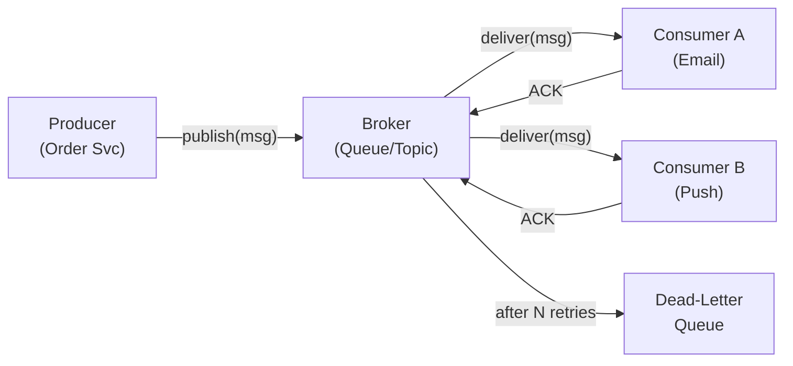
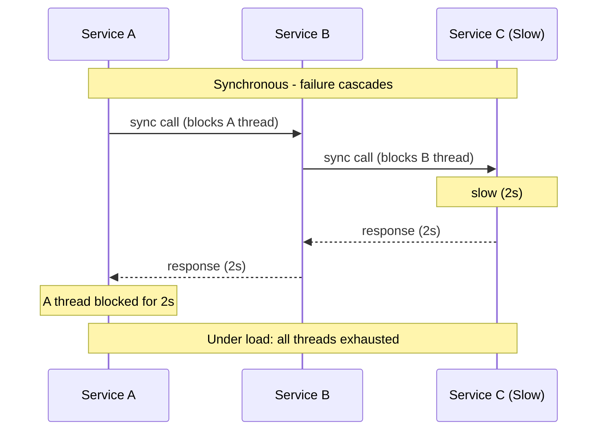
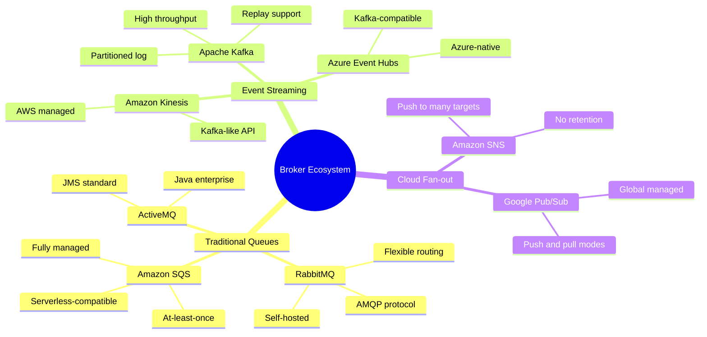

## Keywords in This File

{: .no_toc }

| #   | Keyword | Weight |
| --- | ------- | ------ |
| 1   | [What Is Message-Driven Architecture](#what-is-message-driven-architecture) | medium |
| 2   | [Synchronous vs Asynchronous Communication](#synchronous-vs-asynchronous-communication) | high |
| 3   | [Message Broker Ecosystem Overview](#message-broker-ecosystem-overview) | medium |

---

# What Is Message-Driven Architecture

**TL;DR:** Message-driven architecture replaces direct service calls with
messages sent through a broker. Senders don't wait; brokers hold messages
until receivers are ready. This creates temporal decoupling (sender and
receiver don't need to run simultaneously), location decoupling (sender
doesn't know where the receiver is), and load buffering (broker absorbs
traffic spikes).

---

### 🎯 Model Answer

**30 seconds:**
> Message-driven architecture is a style where services communicate by
> sending messages through a broker rather than calling each other
> directly. The sender fires the message and moves on - it doesn't wait.
> The broker stores the message until a consumer picks it up. This
> decouples the sender from the receiver in time, location, and logic.

**3 minutes:**
> Before message-driven architecture, services called each other via
> HTTP or RPC. The problems: if the downstream is down, the call fails
> immediately. If it is slow, the caller blocks. If it is overloaded,
> the caller's requests pile up. A single slow service can cascade
> failures across a chain of services.
>
> Message-driven architecture inserts a broker between sender and
> receiver. The producer sends a message to the broker. The broker
> stores it. The consumer fetches messages from the broker when ready.
> Producer and consumer never interact directly. Three decoupling
> properties result: (1) temporal - the producer runs even if the
> consumer is down; messages queue up; (2) location - the producer
> sends to a named queue or topic, not a specific host:port; (3) logic -
> the producer does not care which service processes the message.
>
> This enables: load buffering (broker absorbs traffic spikes), fan-out
> (one message consumed by many services), retry and dead-letter (failed
> messages are retried automatically). The trade-off: operational
> complexity. You gain resilience but add broker infrastructure, consumer
> lag monitoring, and message serialization concerns.

**Blank Mind Recovery:**

**(1) Restate:** "You are asking about message-driven architecture -
services communicate through a broker, not directly."

**(2) First principles:** "Direct calls fail if the receiver is down.
A broker is a buffer - store the message, deliver when ready.
That is temporal decoupling."

**(3) Bridge:** "Like leaving a voicemail instead of calling. You do not
wait on hold. The other person picks up when available.
The broker is the voicemail system."

---

### 📘 Concept Explanation

**What it is:**
A software architecture style where components communicate by sending
messages to an intermediary (broker), which routes them to receivers.
Producers and consumers interact through the broker, never directly.

**The problem it solves:**
Direct synchronous calls create tight coupling. If the downstream service
is slow, overloaded, or unreachable, the caller fails immediately. In
microservice architectures with long call chains (A calls B, B calls C),
a single slow service cascades degradation up the chain. Message-driven
architecture buffers demand between producer and consumer, removing the
direct dependency.

**How it works:**

```
Producer          Broker             Consumer
   |                |                   |
   |-- publish() -->|                   |
   |<-- ACK --------|                   |
   |                |-- deliver() ----->|
   |                |<-- ACK -----------|
   |                |-- delete() ------>|
```

> **Code walkthrough:** This What Is Message-Driven Architecture example demonstrates a key concept in practice using SQL. **KEY MECHANISM:** the runtime executes these instructions in sequence with specific memory and execution semantics. **WHY IT MATTERS:** misapplying this pattern causes subtle bugs that only manifest under production load. **TAKEAWAY: understand the execution model before using this pattern in production code.**

1. Producer creates a message (payload + metadata headers) and sends to broker.
2. Broker stores the message (durable disk or in-memory).
3. Broker routes the message to one or more consumers by queue/topic rules.
4. Consumer receives, processes, and sends ACK back to broker.
5. On ACK: broker removes the message. On failure: requeue or dead-letter.

> **Diagram walkthrough:** The producer and consumer never communicate
> directly - the broker is always the intermediary. The ACK flow on both
> sides enables reliability: the producer knows the broker received the
> message; the broker knows the consumer processed it. Without ACKs,
> messages can be lost silently at either boundary.

**The key insight:**
The broker is a buffer between demand and capacity. The producer generates
work at its own rate. The consumer processes at its own rate. The broker
absorbs the rate mismatch. This is why message queues are essential in
systems with variable load or mismatched producer/consumer throughput.

**When to use it:**
- Fire-and-forget work: email notifications, push notifications.
- Task queues: image processing, invoice generation, report rendering.
- Decoupling services with different scaling characteristics.
- Event broadcasting: multiple services react to the same event.
- Cross-system integration between legacy and modern systems.

**When NOT to use it:**
- When you need a real-time synchronous response (user login must return
  a session token immediately - you cannot queue that).
- When you need sub-millisecond latency (brokers add 1-10ms overhead).
- When the system is simple with one consumer and no scaling need -
  a broker adds complexity with no benefit.

**Alternatives:**
- REST/HTTP calls: synchronous, simple, tightly coupled
- gRPC: synchronous, performant, binary protocol, tightly coupled
- Database polling: consumer polls a DB table for new work; simple but
  inefficient and latency is high
- Event streaming (Kafka): persistent ordered log vs. transient queue

**First-principles derivation:**
Given service A (produces 1000 req/s) and service B (handles 200 req/s),
direct calls fail 80% of the time. Options: scale B 5x (expensive),
throttle A (breaks SLAs), or buffer between them. The message queue is
the buffer. The broker manages the queue. Message-driven architecture is
the engineering solution to unavoidable rate mismatches in distributed
systems.

---

### 💻 Code Example

```java
// BAD: Direct synchronous call - tight coupling.
// OrderService calls NotificationService directly.
// If NotificationService is down or slow, order creation fails.
class OrderService {
    private final NotificationService notifications;

    public Order createOrder(OrderRequest req) {
        Order order = orderRepo.save(req.toOrder());
        // BLOCKS if NotificationService is slow.
        // THROWS if NotificationService is down.
        notifications.sendConfirmation(order);
        return order;
    }
}
```

> **Code walkthrough:** The BAD pattern couples order creation toice. **KEY MECHANISM:** the runtime executes these instructions in sequence with specific memory and execution semantics. **WHY IT MATTERS:** misapplying this pattern causes subtle bugs that only manifest under production load. **TAKEAWAY: understand the execution model before using this pattern in production code.**
> notification delivery. A slow notification service blocks the order
> service thread. A crashed notification service fails order creation.
> The order service now has two failure modes: its own and notification
> failures. Business logic (create order) is entangled with infrastructure
> (send email).

```java
// GOOD: Message-driven - temporal decoupling via broker.
// OrderService publishes an event; consumer handles async.
class OrderService {
    private final MessageProducer producer;

    public Order createOrder(OrderRequest req) {
        Order order = orderRepo.save(req.toOrder());
        // Returns immediately after publishing.
        // Notification handled by a separate consumer.
        producer.publish(
            "orders.created",
            new OrderCreatedEvent(
                order.getId(),
                order.getCustomerEmail(),
                order.getTotalCents()
            )
        );
        return order;
    }
}

// Separate consumer - deployed and scaled independently.
@MessageListener(topic = "orders.created")
class NotificationConsumer {
    public void handle(OrderCreatedEvent event) {
        emailService.sendConfirmation(
            event.getCustomerEmail(),
            event.getOrderId()
        );
        // ACK sent automatically after successful return.
        // Exception causes requeue.
    }
}
```

> **Code walkthrough:** The GOOD pattern publishes an event and returnsice. **KEY MECHANISM:** the runtime executes these instructions in sequence with specific memory and execution semantics. **WHY IT MATTERS:** misapplying this pattern causes subtle bugs that only manifest under production load. **TAKEAWAY: understand the execution model before using this pattern in production code.**
> immediately - order creation succeeds even if notifications are
> temporarily down. The `NotificationConsumer` is a separate deployable
> unit that can be scaled independently. If it crashes, the broker holds
> the event and redelivers when the consumer restarts. The broker, not
> the order service, is responsible for delivery reliability.

---

### 🎓 Answers by Seniority

**Junior / Mid (0-5 years):**
> Message-driven architecture means services send messages through a
> broker instead of calling each other directly. A producer sends to the
> broker. The broker holds the message. A consumer picks it up when ready.
> If the consumer is down, messages queue up rather than failing
> immediately. Common examples: order confirmations via RabbitMQ,
> event processing via Kafka.

*Push deeper:* Mention the three decoupling properties - temporal,
location, and logic. Temporal decoupling is the primary benefit: the
producer and consumer do not need to be running at the same time.

---

**Senior / Staff (5+ years):**
> Message-driven architecture is the right pattern when you need to
> decouple producers and consumers in time, scale them independently,
> or broadcast events to multiple consumers. The trade-offs are real:
> you gain resilience but add broker operational complexity, consumer
> lag monitoring, message serialization versioning, and idempotency
> requirements on the consumer side. At scale, the broker becomes
> critical infrastructure requiring clustering, replication, and
> capacity planning.

*Push deeper:* Discuss exactly-once delivery semantics (at-least-once
is the practical default; consumers must be idempotent). Discuss
back-pressure: what happens when broker disk fills or consumer lag
grows unbounded. Discuss operational cost: broker uptime, schema
registry, lag alerting.

---

### ⚠️ Common Misconceptions

**"Message-driven means asynchronous"**

Message-driven and asynchronous are often paired but are distinct. The
request-reply pattern is message-driven but logically synchronous - the
sender sends a message and waits for a reply on a response queue. Most
message-driven systems are asynchronous, but the terms are not synonymous.
You can have synchronous request-reply semantics over a message broker.

**"The broker is a single point of failure"**

Modern brokers are designed for high availability. Kafka replicates
partitions across brokers with configurable replication factor. RabbitMQ
supports quorum queues for HA. Amazon SQS is a managed multi-AZ service
with no single point of failure. The broker is only a SPOF if you run
a single un-replicated node, which is a configuration choice, not an
architectural inevitability.

**"Message queues are always faster than direct calls"**

Message brokers add latency - a round trip to the broker (network + disk)
typically adds 1-10ms compared to a direct HTTP call. The benefit is
resilience, decoupling, and load buffering, not raw speed. If you need
a direct HTTP response in 50ms, adding a broker makes it slower.

---

### 🚨 Failure Modes and Diagnosis

**Failure: Consumer lag grows unbounded**

Symptom: Messages pile up faster than consumers process them. Broker
disk fills. Messages expire or are dropped.

Diagnosis:
```
# Kafka - check consumer group lag
kafka-consumer-groups.sh \
  --bootstrap-server localhost:9092 \
  --describe --group my-consumer-group

# RabbitMQ - check queue depth via management API
curl -u guest:guest \
  http://localhost:15672/api/queues/%2F/my-queue \
  | jq '.messages'
```

> **Code walkthrough:** This check queue depth via management API example demonstrates a key concept in practice using Kafka messaging. **KEY MECHANISM:** the runtime executes these instructions in sequence with specific memory and execution semantics. **WHY IT MATTERS:** misapplying this pattern causes subtle bugs that only manifest under production load. **TAKEAWAY: understand the execution model before using this pattern in production code.**

Fix: Add consumer instances (horizontal scale). Identify slow processing
path. Consider partitioning to increase parallelism.

**Failure: Message loss due to producer not waiting for ACK**

Symptom: Events sent by producer do not appear in consumer.

Root cause: Producer used fire-and-forget mode. Broker crashed after
accepting the connection but before writing to disk.

Fix: Enable producer ACKs. In Kafka: `acks=all`. In RabbitMQ:
`deliveryMode=2` (persistent) + publisher confirms.

**Failure: Duplicate processing after consumer crash**

Symptom: Same order confirmed twice, same payment charged twice.

Root cause: Consumer processed but crashed before sending ACK. Broker
redelivered to another consumer instance.

Fix: Make consumers idempotent. Store processed message ID in DB with
unique constraint. Check before processing: if ID exists, skip and ACK.

---

### 🎯 Interview Deep-Dive

| Format | Time | Goal |
|---|---|---|
| 30-second definition | 0-30s | Producer, broker, consumer |
| 3-minute explanation | 30s-3m | Three decoupling properties |
| Follow-up questions | 3m+ | Failure modes, delivery semantics |
| System design | 5m+ | Placing messaging in an architecture |
| Staff-level | 10m+ | At-scale operations, decisions |

**[JUNIOR] Q1 - [TRADE-OFF] What is the difference between a message queue and a topic?**

🗣️ "A message queue uses point-to-point routing: one producer sends a
message and one consumer receives it. The message is consumed once and
removed. A topic uses publish-subscribe: one producer sends a message
and multiple consumers each receive a copy. In Kafka, topics support
both patterns through consumer groups. Within a single consumer group,
it is point-to-point - only one member gets each message. Different
consumer groups each see all messages independently. RabbitMQ uses
exchanges for routing - a direct exchange is point-to-point, a fanout
exchange is publish-subscribe to all bound queues."

*What separates good from great:* Explaining Kafka consumer groups
implement both patterns simultaneously, not just the surface difference.

**[JUNIOR] Q2 - [MECHANISM] Why use a message broker instead of direct HTTP calls?**

🗣️ "Three main reasons. First, resilience: if the downstream service is
down, messages queue up instead of failing immediately. The downstream
recovers and processes the backlog. Second, load buffering: a traffic
spike sends 100x normal volume - the queue grows but consumers process
at a steady pace without overloading. Third, decoupling: the producer
only needs to know the broker address, not the consumer's host and port.
Services can be updated, moved, or replaced without the producer
changing. The trade-off: you add a broker that must be operated and
monitored, and communication is now asynchronous, which complicates
error handling and debugging."

*What separates good from great:* Naming the trade-off explicitly -
most candidates list benefits but skip the operational cost.

**[MID] Q3 - [DEBUGGING] What is consumer lag and why does it matter?**

🗣️ "Consumer lag is the difference between the latest message published
to a topic and the latest message the consumer has processed. A lag of
100 means the consumer is 100 messages behind. If lag grows faster than
it shrinks, the consumer never catches up. The backlog grows until the
broker's retention expires and messages are lost, or disk fills and the
broker rejects new messages. Lag spikes signal a slow processing path,
a crashed consumer, or a traffic spike. You alert on continuously
growing lag - a temporary spike is normal, but a steadily increasing
trend means under-capacity."

*What separates good from great:* Framing lag as a rate comparison
(publish rate vs. consume rate), and connecting unbounded lag to
eventual message loss.

**[MID] Q4 - [TRADE-OFF] What is the difference between at-most-once, at-least-once, and exactly-once delivery?**

🗣️ "At-most-once: broker delivers without waiting for ACK. If the
consumer crashes, the message is lost. Use for non-critical events like
metrics or logs. At-least-once: broker waits for ACK. If no ACK arrives,
the message is redelivered. The consumer may receive the same message
multiple times and must be idempotent. This is the default for most
production systems. Exactly-once: the message is delivered and processed
precisely once. Kafka supports this with transactions, but it adds
complexity and latency. In practice, at-least-once with idempotent
consumers is the correct choice for most systems."

*What separates good from great:* Recommending at-least-once plus
idempotent consumers as the practical engineering choice.

**[SENIOR] Q5 - [MECHANISM] How do you make a consumer idempotent?**

🗣️ "Three techniques. Natural idempotency: setting a status to SHIPPED
is safe to repeat - the result is the same. Deduplication table: store
the processed message ID in your database with a unique constraint.
Before processing: query by message_id. If found, skip and ACK. The
unique constraint prevents the race condition where two consumer
instances both pass the check simultaneously - the second insert fails.
Idempotency key propagation: pass the message ID as an idempotency key
to downstream services like payment providers, which return the same
result for duplicate requests with the same key."

*What separates good from great:* Identifying the race condition in
naive deduplication and how the unique constraint solves it atomically.

**[SENIOR] Q6 - [MECHANISM] What is a dead-letter queue and when should a message go there?**

🗣️ "A dead-letter queue (DLQ) is a separate queue where messages are
moved after they cannot be processed after N retries or after exceeding
their TTL. A message is dead-lettered when: it has been redelivered the
maximum configured times and still fails, signaling a poison message or
consumer bug; when it exceeds its time-to-live; or when the target queue
is full. Without a DLQ, a poison message triggers infinite retry loops,
blocking all subsequent messages. With a DLQ, the message is isolated.
You alert on DLQ depth, investigate the root cause, fix the consumer or
data, and replay the messages."

*What separates good from great:* Explaining that DLQs prevent poison
messages from blocking the queue and that DLQ depth should trigger
operational alerts.

**[SENIOR] Q7 - [TRADE-OFF] When would you NOT use a message broker?**

🗣️ "Three scenarios. Real-time user-facing APIs: when a user logs in
and expects a session token in 200ms, you cannot queue that - the
response must be synchronous. Financial trading or real-time gaming
where single-digit millisecond latency matters - broker overhead is
too high. Simple applications processing low volume: adding a broker
to a system that handles 100 orders per day adds infrastructure and
operational complexity with zero benefit. Message brokers solve rate
mismatch and temporal coupling. If those problems do not exist in your
system, you are adding accidental complexity."

*What separates good from great:* Starting with a concrete example
(user login expecting immediate response) rather than generic
"when you need low latency."

---

### ⚖️ Comparison Table

*(Omit: ★☆☆ foundational L0 keyword. Full broker comparison matrix
is in Messaging - L2 Broker Selection.md.)*

---

### 🏛️ System Design

*(Omit: ★☆☆ L0 orientation keyword. System design integration is
covered in L4 and L5 files.)*

---

### 📊 Diagram

```
MESSAGE-DRIVEN ARCHITECTURE - CORE FLOW

  Producer       Broker            Consumer(s)
  --------       ------            ----------
  |Order  |      |Queue|           |Email   |
  |Service|--+-->|or   |---+------>|Consumer|
  +--------+ |   |Topic|   |       +--------+
             |   +-----+   |       |Push    |
             |             +------>|Consumer|
             |                     +--------+
             |   On N fails
             |   +-----+
             +-->| DLQ |
                 +-----+
```



> **Diagram walkthrough:** The producer publishes once; the broker routes
> to all subscribed consumers. Each consumer ACKs independently -
> Consumer A and Consumer B can fail without affecting each other.
> The DLQ path isolates poison messages rather than blocking the queue.
> The broker, not the producer, owns routing and retry responsibility.

---

---

---

### 💻 Code Example

*(Omit: this concept does not have a programmatic interface that can be demonstrated in code. The conceptual explanation above is sufficient.)*


---

### 🏛️ System Design

*(Omit: system design diagram not applicable for this concept - see ★★★ keywords for full system design coverage.)*


---

### ⚖️ Comparison Table

*(Omit: this is a ★☆☆ foundational concept with no direct alternatives to compare - see higher-difficulty keywords for trade-off analysis.)*


---

### 📊 Diagram

*(Omit: no standalone visual diagram required for this concept - the explanations and code examples above provide sufficient clarity.)*


# Synchronous vs Asynchronous Communication

**TL;DR:** Synchronous: the caller sends a request and blocks until the
response arrives. Asynchronous: the caller sends and continues
immediately; the result (if any) arrives later. The choice determines
how failures cascade, what latency users experience, how services scale
independently, and how complex your error handling becomes. Use sync
when the result is immediately needed. Use async for background work,
notifications, and events.

---

### 🎯 Model Answer

**30 seconds:**
> Synchronous means the caller blocks until the response arrives. HTTP
> REST calls are synchronous. Asynchronous means the caller sends and
> continues immediately. Message queues are asynchronous. The key
> trade-off: sync is simpler to reason about but couples the caller to
> the receiver's availability and speed. Async is more resilient but
> harder to debug and requires explicit result handling.

**3 minutes:**
> In a synchronous call, the caller's thread is occupied until the
> response returns. If the downstream takes 2 seconds, the caller blocks
> for 2 seconds. Under high load, all threads can be blocked waiting
> for slow downstream responses - this is thread starvation, a failure
> that looks like the calling service is down even though the root cause
> is downstream slowness. Synchronous call chains cascade failures.
>
> Asynchronous communication removes this coupling. The caller sends a
> message or fires an event and returns immediately. The response (if
> needed) arrives later. Three async patterns: (1) fire-and-forget - no
> response expected (send a notification email); (2) callback - register
> a handler the framework calls when the result arrives; (3) polling -
> the caller checks a status endpoint periodically. Each has different
> complexity and latency characteristics.
>
> The decision rule: use sync when the caller needs the response to
> continue (user login, API query). Use async when the result is not
> needed immediately or the work is long-running (report generation,
> video processing). Mixed architectures are normal: sync for user-
> facing request-response, async for background work.

**Blank Mind Recovery:**

**(1) Restate:** "Sync vs async - how the caller relates to the
response: does it wait or continue immediately."

**(2) First principles:** "Work takes time. Sync: the caller waits
for that time. Async: the caller does other work during that time.
The choice is about blocking."

**(3) Bridge:** "A phone call is sync - both parties are blocked until
done. Email is async - you send and continue; the reply arrives later.
Most systems need both patterns."

---

### 📘 Concept Explanation

**What it is:**
Two fundamental communication styles. Synchronous: caller sends a
request and blocks until it receives a response. Asynchronous: caller
sends and continues; the response arrives later via a separate mechanism.

**The problem it solves:**
Synchronous calls create temporal coupling - the caller cannot proceed
until the receiver responds. In chains of service calls, the slowest
link determines the latency of the entire chain. Asynchronous
communication breaks this coupling: the caller proceeds at its own pace;
the receiver processes at its own pace.

**How it works - Synchronous:**

```
Caller               Receiver
  |                      |
  |--- request() ------->|
  |   (BLOCKS)           |-- process --
  |                      |
  |<-- response() -------|
  |   (UNBLOCKS)         |
  |   (continues)        |
```

> **Code walkthrough:** This Synchronous vs Asynchronous Communication example demonstrates a key concept in practice. **KEY MECHANISM:** the runtime executes these instructions in sequence with specific memory and execution semantics. **WHY IT MATTERS:** misapplying this pattern causes subtle bugs that only manifest under production load. **TAKEAWAY: understand the execution model before using this pattern in production code.**

**How it works - Asynchronous:**

```
Caller      Broker       Receiver
  |           |              |
  |--publish->|              |
  | (returns  |--deliver---> |
  |  immediately)            |-- process --
  |           |<-- ACK ------|
```

> **Diagram walkthrough:** In sync, the caller thread is idle during
> the receiver's processing time - wasted capacity. In async, the caller
> continues useful work immediately; the broker holds the work until the
> receiver is ready. The async pattern uses both sides more efficiently
> but introduces a new component (the broker) that must be operated.

**The key insight:**
Synchronous calls are a form of distributed locking - the caller holds
a thread while waiting for the receiver. Under high load, threads are
exhausted waiting for slow downstream responses, not doing useful work.
Async breaks this lock. This is why async is essential at scale.

**When to use synchronous:**
- Response is needed immediately to continue (user authentication,
  data retrieval for display)
- Operation is fast and failure should propagate immediately to caller
- Simpler systems where async complexity is not justified
- Request-response contracts where the client expects a direct reply

**When to use asynchronous:**
- Work is long-running (video encoding, report generation)
- Caller does not need the result immediately
- Work should be resilient to receiver unavailability
- Multiple receivers need to react to the same event
- Rate mismatch between sender and receiver

**Alternatives:**
- Reactive/Reactive Streams: async with back-pressure propagation
- Coroutines/Virtual Threads: syntactically synchronous, physically async
- Futures/Promises: async with composable result handling

**First-principles derivation:**
A network call takes T milliseconds. Synchronous: the calling thread
is occupied for T ms doing nothing. With 1000 req/s and T=100ms, you
need 100 concurrent threads just to wait. Async: the thread sends and
returns; a completion callback handles the response. One thread can
manage thousands of in-flight async operations. This is why async is
essential at scale.

---

### 💻 Code Example

```java
// BAD: Synchronous chain - slow downstream blocks everything.
// If PaymentService takes 500ms and NotificationService 200ms,
// each request occupies a thread for 700ms total.
public OrderResult createOrder(OrderRequest req) {
    Order order = orderRepo.save(req.toOrder());
    // BLOCKS thread for payment service duration.
    PaymentResult payment = paymentService.charge(
        order.getId(), order.getTotalCents()
    );
    // BLOCKS thread for notification duration.
    notificationService.sendConfirmation(order);
    return new OrderResult(order, payment);
}
```

> **Code walkthrough:** The BAD pattern blocks the calling thread twiceice. **KEY MECHANISM:** the runtime executes these instructions in sequence with specific memory and execution semantics. **WHY IT MATTERS:** misapplying this pattern causes subtle bugs that only manifest under production load. **TAKEAWAY: understand the execution model before using this pattern in production code.**
> in sequence. At 100 rps, you need 70 concurrent threads just to handle
> the blocking. Under load spikes, the thread pool exhausts and requests
> queue or fail with timeouts. The notification failure also fails the
> entire order - two unrelated concerns are coupled.

```java
// GOOD: Async for notification; sync only where needed.
// Payment must be sync - we need the result to confirm the order.
// Notification is async - user does not wait for email delivery.
public OrderResult createOrder(OrderRequest req) {
    Order order = orderRepo.save(req.toOrder());

    // Sync: result needed to continue.
    PaymentResult payment = paymentService.charge(
        order.getId(), order.getTotalCents()
    );

    // Async: fire-and-forget event.
    // NotificationConsumer handles independently.
    eventPublisher.publish(
        "orders.confirmed",
        new OrderConfirmedEvent(
            order.getId(), order.getCustomerEmail()
        )
    );

    return new OrderResult(order, payment);
}
```

> **Code walkthrough:** The GOOD pattern keeps payment synchronous (weice. **KEY MECHANISM:** the runtime executes these instructions in sequence with specific memory and execution semantics. **WHY IT MATTERS:** misapplying this pattern causes subtle bugs that only manifest under production load. **TAKEAWAY: understand the execution model before using this pattern in production code.**
> need the result) but publishes the notification as an async event. The
> thread is only blocked for the payment duration. Notification failures
> do not fail the order. The broker holds the event and retries if the
> notification service is temporarily down.

```java
// CompletableFuture: async with explicit result handling.
public CompletableFuture<OrderResult> createOrderAsync(
    OrderRequest req
) {
    Order order = orderRepo.save(req.toOrder());

    return paymentService
        .chargeAsync(order.getId(), order.getTotalCents())
        .thenApply(payment -> new OrderResult(order, payment))
        .exceptionally(ex -> {
            log.error("Payment failed for order {}",
                order.getId(), ex);
            throw new PaymentException(ex);
        });
}
```

> **Code walkthrough:** The CompletableFuture pattern starts paymentice. **KEY MECHANISM:** the runtime executes these instructions in sequence with specific memory and execution semantics. **WHY IT MATTERS:** misapplying this pattern causes subtle bugs that only manifest under production load. **TAKEAWAY: understand the execution model before using this pattern in production code.**
> asynchronously and chains the result handling. The caller thread is
> freed immediately; the framework calls completion handlers when results
> arrive. The `exceptionally()` handler is critical - without it,
> exceptions are swallowed silently. This is the most common mistake
> with CompletableFuture in production.

---

### 🎓 Answers by Seniority

**Junior / Mid (0-5 years):**
> Synchronous means the caller waits for the response. HTTP REST calls
> are synchronous - you send a request and your code blocks until the
> response arrives. Asynchronous means you send and continue immediately.
> Message queues like RabbitMQ or Kafka are asynchronous - you publish
> and the code keeps running; the consumer processes it later. Use sync
> when you need the result right now. Use async when you do not need the
> result immediately or the work takes a long time.

*Push deeper:* Async is not just about performance - it is about
resilience. If the downstream is down in a sync call, the caller fails
immediately. In async, the message queues and processes when the service
recovers.

---

**Senior / Staff (5+ years):**
> The choice between sync and async is about temporal coupling. Sync
> calls couple the caller's availability to the receiver's availability.
> In microservice architectures, sync call chains are a cascading failure
> risk - a slow database in service C causes thread exhaustion in service
> B, which causes failures in service A, which the user sees as an
> unrelated error. Async breaks this coupling at the cost of explicit
> result management. The correct pattern: sync where the result is
> immediately needed, async for background work, notifications, and
> events. Most production architectures mix both.

*Push deeper:* Discuss back-pressure in async systems: if the broker
fills up, the producer must slow down or messages are lost. Back-pressure
propagation is the async equivalent of the sync blocking that async
tries to avoid.

---

### ⚠️ Common Misconceptions

**"Asynchronous is always faster"**

Async is not faster than sync for a single request. A direct HTTP call
completes in 10-50ms. A message broker round-trip adds 1-10ms overhead.
Async is more scalable (fewer blocked threads) but not faster per
individual request. The benefit is throughput under load and resilience,
not raw latency.

**"You cannot do async when the caller needs a result"**

The request-reply pattern over messaging simulates synchronous
request-response over an async channel. The producer sends a message
with a reply-to address and correlation ID. The consumer processes and
sends the response to the reply-to address. The producer matches
responses by correlation ID. Logically synchronous, implemented
asynchronously. More complex than direct HTTP but enables temporal
decoupling for request-response interactions.

**"Non-blocking frameworks make everything async"**

Non-blocking I/O means the OS thread is not blocked during I/O. But
the application-level semantics can still be logically synchronous -
you still wait for the response. Non-blocking is an I/O optimization;
async messaging is a communication style. They are independent concepts.

---

### 🚨 Failure Modes and Diagnosis

**Failure: Thread starvation from synchronous downstream chains**

Symptom: Application appears healthy but all requests timeout. Thread
pool exhausted. Logs show requests queuing.

Diagnosis:
```
# Thread dump - look for WAITING or TIMED_WAITING threads
jstack <pid> | grep -A 3 "WAITING\|TIMED_WAITING"

# Spring Boot Actuator - thread pool metrics
GET /actuator/metrics/executor.pool.size
GET /actuator/metrics/executor.queued
```

> **Code walkthrough:** This thread pool metrics example demonstrates a key concept in practice. **KEY MECHANISM:** the runtime executes these instructions in sequence with specific memory and execution semantics. **WHY IT MATTERS:** misapplying this pattern causes subtle bugs that only manifest under production load. **TAKEAWAY: understand the execution model before using this pattern in production code.**

Fix: Add circuit breaker with timeout. Move non-critical downstream
calls to async. Increase thread pool size as short-term mitigation.

**Failure: Async exception silently swallowed**

Symptom: Feature works at low load, fails silently in production.

Root cause: CompletableFuture without `exceptionally()` handler. Unhandled
exceptions disappear if the future is never explicitly observed.


```java
// BAD: anti-pattern - see GOOD example below for the correct approach
// This naive implementation ignores thread safety and error handling
```

```java
// BAD: silently swallows exception
asyncOperation().thenAccept(this::process);

// GOOD: explicit error handling
asyncOperation()
    .thenAccept(this::process)
    .exceptionally(ex -> {
        log.error("Async operation failed", ex);
        return null;
    });
```

> **Code walkthrough:** BAD pattern: This thread pool metrics example demonstrates Java API usage. **KEY MECHANISM:** the JVM compiles to bytecode that runs on the JVM; JIT compiles hot paths to native. **WHY IT MATTERS:** unchecked assumptions about thread safety cause data races under concurrent load. **WHAT BREAKS: document thread-safety guarantees on every shared mutable class.**

**Failure: Async ordering assumed but not guaranteed**

Symptom: Consumer processes events out of order, causing corrupt state.

Root cause: Kafka ordering only guaranteed within a single partition.
Multiple consumers within a group can process messages concurrently.

Fix: Use single partition for operations requiring strict ordering,
or design consumers to handle out-of-order delivery gracefully.

---

### 🎯 Interview Deep-Dive

| Format | Time | Goal |
|---|---|---|
| 30-second definition | 0-30s | Blocking vs non-blocking |
| 3-minute explanation | 30s-3m | Trade-offs, thread model |
| Follow-up questions | 3m+ | Cascading failure, back-pressure |
| System design | 5m+ | Where to use each pattern |
| Staff-level | 10m+ | Architectural implications |

**[JUNIOR] Q1 - [MECHANISM] Give a real example of sync and async in a web application.**

🗣️ "Synchronous example: user submits a login form. The browser sends
an HTTP request, the server validates credentials, and the browser waits
for the 200 OK with the session token before doing anything else. This
must be synchronous - the user cannot proceed without the result.
Asynchronous example: same user places an order. The server saves the
order, returns 202 Accepted immediately, and fires an event to a message
queue. A separate service picks up the event and sends a confirmation
email. The user gets the order confirmation page without waiting for
email delivery. Email is async because the user does not need to wait."

*What separates good from great:* Using concrete examples from a real
application rather than generic descriptions.

**[JUNIOR] Q2 - [MECHANISM] What happens when a synchronous downstream service is slow?**

🗣️ "The calling thread blocks and waits. If 100 users hit the service
simultaneously and the downstream takes 2 seconds per request, 100
threads are blocked for 2 seconds each. A typical Java application has
200 thread pool threads. All 200 can be occupied waiting for the slow
downstream, causing new requests to queue and eventually timeout. This
is thread starvation - the application looks like it is down even though
the root cause is the downstream service. Async would prevent this -
the caller's thread is freed immediately and can handle other requests."

*What separates good from great:* Connecting thread pool exhaustion
to the user-visible symptom (timeouts, apparent outage).

**[MID] Q3 - [MECHANISM] What is the request-reply pattern in messaging?**

🗣️ "Request-reply simulates synchronous request-response over async
messaging. The producer sends to a request queue with two metadata
fields: a reply-to address (queue where it expects the response) and
a correlation ID (unique ID to match responses to requests). The consumer
processes the request and sends the response to the reply-to queue with
the same correlation ID. The producer listens on its reply-to queue and
matches responses by correlation ID. This enables request-response
semantics over messaging infrastructure - useful when you want the
resilience of async with the semantics of sync."

*What separates good from great:* Explaining the correlation ID
mechanism, which is the technical detail that makes this pattern work.

**[MID] Q4 - [MECHANISM] When is non-blocking I/O different from asynchronous messaging?**

🗣️ "Non-blocking I/O is an OS-level optimization: the thread is not
blocked during I/O waits. Frameworks like Netty and WebFlux use this -
a single thread manages thousands of concurrent connections. But the
application logic can still be logically synchronous - you send an HTTP
request and wait for the response, just without blocking a kernel thread.
Asynchronous messaging is a higher-level pattern: sender and receiver
are decoupled through a broker. They can run at different times, on
different machines, at different rates. Non-blocking is about thread
efficiency; async messaging is about temporal decoupling. They are
different concerns and can be used independently."

*What separates good from great:* Clarifying that non-blocking and
async operate at different abstraction levels, not conflating them.

**[SENIOR] Q5 - [MECHANISM] How do you handle errors in async message processing?**

🗣️ "Three-layer strategy. First, retry with exponential backoff: when
a consumer fails, retry with increasing delays - 1s, 2s, 4s, 8s. This
handles transient failures like brief database outages. Configure a max
retry count. Second, dead-letter queue: after max retries, move the
message to a DLQ. Alert on DLQ depth. Investigate, fix the consumer or
data, replay from DLQ. Third, idempotent processing: ensure retries
produce the same outcome as the first attempt. Store processed message
IDs with a unique constraint. Check before processing. This prevents
duplicate side effects from retried messages."

*What separates good from great:* Providing a concrete three-layer
strategy with the idempotency requirement, not just mentioning retries.

**[SENIOR] Q6 - [MECHANISM] What is back-pressure in async systems?**

🗣️ "Back-pressure is a mechanism for a consumer to signal to the
producer that it cannot keep up. In synchronous systems, back-pressure
is implicit - when downstream is slow, the upstream blocks naturally.
In async systems, the broker decouples them, so the signal must be
explicit. In Kafka, back-pressure manifests as consumer lag - the
consumer group falls behind. No automatic signal is sent to producers.
In Reactive Streams (Project Reactor, RxJava), back-pressure is built
into the protocol: the subscriber requests N items; the publisher sends
at most N. Without back-pressure, a fast producer overwhelms a slow
consumer, causing the broker's disk to fill and messages to be dropped."

*What separates good from great:* Explaining that Kafka has no automatic
back-pressure signal to producers - lag monitoring is the manual proxy.

**[SENIOR] Q7 - [MECHANISM] How do you choose between sync and async for a new feature?**

🗣️ "Three-question decision framework. First: does the caller need the
result to continue? If yes: sync. User login, API data retrieval - these
must be sync. If no: async is possible. Second: is the operation fast
(under 100ms) or slow (seconds to minutes)? Slow operations should be
async - you do not want to block threads for seconds. Third: what is the
failure model? If receiver being down should fail the caller immediately:
sync. If the caller should continue and the receiver processes when it
recovers: async. Report generation: async (slow, no immediate result
needed). Password validation: sync (fast, result needed, failure must
propagate immediately)."

*What separates good from great:* Providing a structured decision
framework with concrete examples for each answer, not "it depends."

---

### ⚖️ Comparison Table

*(Omit: ★☆☆ foundational L0 keyword. Detailed comparison covered in
L2 files.)*

---

### 🏛️ System Design

*(Omit: ★☆☆ L0 orientation keyword. System design covered in L4+
files.)*

---

### 📊 Diagram

```
SYNCHRONOUS CHAIN - FAILURE CASCADE

  Service A   Service B   Service C
  ---------   ---------   ---------
  |BLOCKED |<-|BLOCKED |<-|SLOW    |
  |waiting |  |waiting |  |process |
  +---------+  +---------+  +---------+
  Thread exhausted -> A appears down
  Root cause: C is slow

ASYNC PATTERN - ISOLATION

  Service A   Broker   Service B   Svc C
  ---------   ------   ---------   -----
  |publish |->|queue|->|consume |->|call|
  |returns |  +------+  |process |  +----+
  +---------+           +---------+
  A not blocked -> B processes independently
```



> **Diagram walkthrough:** In the synchronous chain, Service A's thread
> is occupied for the full duration of C's processing. Under high load,
> all of A's threads are blocked waiting, even though A itself is doing
> no useful work. The async pattern breaks this: A publishes and returns,
> B processes independently, and C's slowness is isolated to B. The
> broker absorbs the rate mismatch between a fast producer and slower
> consumers.

---

---

---

### 💻 Code Example

*(Omit: this concept does not have a programmatic interface that can be demonstrated in code. The conceptual explanation above is sufficient.)*


---

### 🏛️ System Design

*(Omit: system design diagram not applicable for this concept - see ★★★ keywords for full system design coverage.)*


---

### ⚖️ Comparison Table

*(Omit: this is a ★☆☆ foundational concept with no direct alternatives to compare - see higher-difficulty keywords for trade-off analysis.)*


---

### 📊 Diagram

*(Omit: no standalone visual diagram required for this concept - the explanations and code examples above provide sufficient clarity.)*


# Message Broker Ecosystem Overview

**TL;DR:** The broker ecosystem splits into traditional message queues
(RabbitMQ, ActiveMQ, Amazon SQS) and event streaming platforms (Apache
Kafka, AWS Kinesis, Azure Event Hubs). Queues are designed for task
distribution - messages consumed once and deleted. Streaming platforms
are designed for event logs - messages retained and replayable. Choosing
between them depends on whether you need replayability, ordering
guarantees, and the scale of your event volume.

---

### 🎯 Model Answer

**30 seconds:**
> The broker ecosystem has two categories: message queues and event
> streaming platforms. Queues (RabbitMQ, SQS) route messages to consumers
> and delete them after acknowledgment. Streaming platforms (Kafka,
> Kinesis) retain messages as an ordered, replayable log. Use queues for
> task distribution. Use streaming for event sourcing, audit trails, and
> high-throughput analytics pipelines.

**3 minutes:**
> Traditional message queue model: a producer sends a message to a queue,
> a consumer picks it up and ACKs it, the broker deletes it. RabbitMQ
> follows this model with sophisticated routing via exchanges. Amazon SQS
> is a managed queue with at-least-once delivery. ActiveMQ is the Java EE
> JMS-compliant broker. This model is for work distribution - one task,
> one worker.
>
> Event streaming model, pioneered by Apache Kafka: messages are written
> to a partitioned, ordered, replicated log. Messages are NOT deleted
> after consumption. Consumer groups track their position (offset).
> Multiple consumer groups independently read the same log from any
> position. This enables event replay, event sourcing, and high-
> throughput analytics pipelines. Kafka handles millions of events per
> second where RabbitMQ typically handles tens of thousands.
>
> Cloud-managed options bridge both worlds: Amazon SQS (queue), Amazon
> SNS (fan-out), Amazon MSK (managed Kafka). Azure Service Bus (queue
> and topics), Azure Event Hubs (Kafka-compatible streaming). Google
> Cloud Pub/Sub (queue with streaming semantics). Managed options reduce
> operational burden at the cost of vendor lock-in.

**Blank Mind Recovery:**

**(1) Restate:** "Broker ecosystem - the major systems and when to use
each one."

**(2) First principles:** "Two problems: task distribution (one consumer
processes each task) and event broadcasting (many consumers, log is
retained). Different problems, different tools."

**(3) Bridge:** "A queue is a to-do list - items assigned to workers,
checked off when done. Kafka is a newspaper archive - published once,
readable by anyone, forever."

---

### 📘 Concept Explanation

**What it is:**
Message broker middleware that receives messages from producers and
routes them to consumers. The ecosystem spans traditional queues,
topic-based pub/sub, and persistent event streaming platforms, each
optimized for different messaging patterns.

**The problem it solves:**
Applications need to send work or events between components without
direct coupling. Different patterns require different tools: task
distribution (one consumer per task) vs. event broadcasting (all
consumers see every event, log is retained) vs. high-throughput
streaming (millions of events per second).

**How it works - The major brokers:**

```
TRADITIONAL QUEUES (consume-once model)
  RabbitMQ   -> AMQP, flexible exchange routing
  ActiveMQ   -> JMS standard, Java enterprise
  Amazon SQS -> Managed, at-least-once, serverless

EVENT STREAMING (log-based, replayable)
  Apache Kafka -> Partitioned log, high-throughput
  AWS Kinesis  -> Managed, AWS-native
  Azure EventH -> Kafka-compatible, Azure-native

CLOUD FAN-OUT (broadcast to many targets)
  Amazon SNS      -> Push to SQS, Lambda, HTTP
  Google Pub/Sub  -> Global managed, push + pull
  Azure ServiceBus-> Queues + topics, enterprise
```

> **Code walkthrough:** This Message Broker Ecosystem Overview example demonstrates a key concept in practice using Kafka messaging. **KEY MECHANISM:** the runtime executes these instructions in sequence with specific memory and execution semantics. **WHY IT MATTERS:** misapplying this pattern causes subtle bugs that only manifest under production load. **TAKEAWAY: understand the execution model before using this pattern in production code.**

**The key insight:**
The critical distinction is message lifecycle. In a queue, a message is
fulfilled when consumed and deleted. In a streaming platform, the event
log is the source of truth - events are retained and reprocessable.
This determines which tools belong in which architecture.

**When to use which:**

Use RabbitMQ when: flexible routing (direct, fanout, topic exchanges),
priority queues, scheduled messages, AMQP compliance needed.

Use Kafka when: event replay and reprocessing needed, high throughput
(millions of events/second), multiple consumer groups needing independent
processing, event sourcing or CQRS architectures.

Use Amazon SQS when: zero operational overhead wanted, AWS ecosystem,
simple task queuing with minimal configuration.

Use SNS + SQS when: fan-out needed - one event delivered to multiple
independent queues with separate retry and DLQ settings.

**When NOT to use which:**

Avoid Kafka for: simple task queues with no replay requirement (SQS
is simpler), small teams without Kafka expertise, low-volume workloads.

Avoid RabbitMQ for: very high throughput (millions/second) - Kafka
scales better; event sourcing - RabbitMQ does not retain consumed
messages.

**Alternatives per use case:**

Simple task queues: Amazon SQS, Azure Service Bus Queue
Pub/Sub: Amazon SNS, Google Cloud Pub/Sub
High-throughput streaming: Apache Kafka, Amazon Kinesis
JMS compliance: ActiveMQ, IBM MQ

**First-principles derivation:**

What does a system need from a broker? Reliable delivery. Routing.
Scale. Operational simplicity. Traditional queues optimize reliability
and routing at manageable operational cost. Streaming platforms
optimize reliability, routing, and scale at higher operational cost.
Cloud-managed services optimize operational simplicity at higher
monetary cost. Your choice is determined by which constraints matter
most for your team and workload.

---

### 💻 Code Example

*(Omit: This keyword covers ecosystem overview and selection, not a
specific broker API. Code examples for individual brokers are in L1
and L2 files where specific APIs are covered.)*

---

### 🎓 Answers by Seniority

**Junior / Mid (0-5 years):**
> The main message brokers split into two categories. Traditional queues
> like RabbitMQ and Amazon SQS route messages to consumers and delete
> them after processing. Streaming platforms like Apache Kafka store
> messages in a permanent log that consumers can replay. For most web
> applications needing task queues (send emails, process payments),
> RabbitMQ or SQS is correct. For high-volume event pipelines or event
> sourcing, Kafka is the standard.

*Push deeper:* Explain why Kafka retains messages - it enables multiple
consumer groups to independently read the same events. This is the key
difference from a traditional queue where only one consumer gets each
message.

---

**Senior / Staff (5+ years):**
> The broker selection decision is primarily about message lifecycle and
> throughput requirements. If messages are consumed once and discarded,
> SQS or RabbitMQ are simpler. If events must be replayed, retained for
> audit, or consumed by multiple independent systems at different speeds,
> Kafka's log model is the right fit. Operationally, self-hosted Kafka
> carries significant overhead: ZooKeeper or KRaft, partition rebalancing,
> offset management, schema registry. For teams without Kafka expertise,
> Amazon MSK or Confluent Cloud shifts that operational burden to the
> provider. The wrong broker choice is recoverable but expensive -
> migrating from SQS to Kafka mid-product requires re-architecting
> consumer groups and retention policies.

*Push deeper:* Discuss multi-region broker strategies: Kafka MirrorMaker
for cross-region replication, Amazon SQS built-in multi-AZ architecture,
and latency implications of cross-region messaging.

---

### ⚠️ Common Misconceptions

**"Kafka is always the right choice for messaging"**

Kafka is optimized for high-throughput event streaming with replay
requirements. For a simple task queue processing 1000 jobs per day,
Kafka's operational overhead (broker management, ZooKeeper or KRaft,
partition tuning, schema registry) far exceeds the benefits. Amazon SQS
requires zero operational effort for the same use case. Use Kafka when
you need its specific capabilities: log retention, replay, or millions
of events per second.

**"RabbitMQ cannot scale to high throughput"**

RabbitMQ can handle hundreds of thousands of messages per second with
proper configuration: persistent vs. transient messages based on
durability requirements, prefetch count tuning for consumers, lazy
queues for large backlogs. The practical ceiling is lower than Kafka,
but for most production workloads (thousands to tens of thousands of
messages per second), RabbitMQ is sufficient and simpler to operate.

**"Cloud-managed brokers are less reliable than self-hosted"**

Managed services like Amazon SQS, MSK, and Azure Service Bus have
extremely high availability SLAs (99.9% to 99.99%). Self-hosted
RabbitMQ or Kafka require your team to configure replication, handle
broker failures, manage disk capacity, and perform upgrades. For most
teams, managed services provide higher reliability with lower
operational cost than self-hosted alternatives.

---

### 🚨 Failure Modes and Diagnosis

**Failure: Choosing the wrong broker, discovered at scale**

Symptom: SQS chosen for event sourcing - events deleted after
consumption; no ability to replay for new consumers or audit trails.
Or Kafka chosen for a simple task queue - team spends weeks on Kafka
operational issues instead of product work.

Diagnosis: Architectural mismatch identified during production scaling
or when adding a new consumer that needs historical events.

Fix: Dual-write migration. Write to both brokers simultaneously during
transition. Migrate consumers one by one to the new broker. Cut over.
Prevention: evaluate replay requirement before choosing broker.

**Failure: RabbitMQ memory alarm triggers, blocks all publishers**

Symptom: RabbitMQ queue grows unbounded. Broker memory alarm fires.
All publishers are blocked. Application stops sending messages.

Diagnosis:
```
# RabbitMQ - queue depth and memory usage
curl -u guest:guest \
  http://localhost:15672/api/queues/%2F/my-queue \
  | jq '{messages:.messages,bytes:.message_bytes}'
```

> **Code walkthrough:** This queue depth and memory usage example demonstrates a key concept in practice using HTTP client. **KEY MECHANISM:** the runtime executes these instructions in sequence with specific memory and execution semantics. **WHY IT MATTERS:** misapplying this pattern causes subtle bugs that only manifest under production load. **TAKEAWAY: understand the execution model before using this pattern in production code.**

Root cause: consumers down or processing too slowly.
Fix: Scale consumers. Configure queue length limits with overflow
action (drop-head or reject-publish). Configure message TTL.

**Failure: Kafka consumer rebalance storms**

Symptom: Partitions frequently reassigned. Consumer lag spikes during
every rebalance. Applications see periodic processing pauses.

Diagnosis:
```
kafka-consumer-groups.sh \
  --bootstrap-server localhost:9092 \
  --describe --group my-group
# Look for frequent rebalance events in consumer logs
```

> **Code walkthrough:** This Look for frequent rebalance events in consumer logs example demonstrates a key concept in practice using Kafka messaging. **KEY MECHANISM:** the runtime executes these instructions in sequence with specific memory and execution semantics. **WHY IT MATTERS:** misapplying this pattern causes subtle bugs that only manifest under production load. **TAKEAWAY: understand the execution model before using this pattern in production code.**

Root cause: consumers crashing due to processing time exceeding
`max.poll.interval.ms` (default 5 minutes). Kafka considers the
consumer dead and triggers a rebalance.

Fix: Reduce per-message processing time. Increase `max.poll.interval.ms`
if processing is legitimately slow. Process messages asynchronously
and commit offsets after async completion.

---

### 🎯 Interview Deep-Dive

| Format | Time | Goal |
|---|---|---|
| 30-second overview | 0-30s | Two categories, key names |
| 3-minute comparison | 30s-3m | When to use each |
| Follow-up questions | 3m+ | Trade-offs, operational concerns |
| System design | 5m+ | Broker selection for a design |
| Staff-level | 10m+ | Migration, multi-region, cost |

**[JUNIOR] Q1 - [TRADE-OFF] What is the main difference between RabbitMQ and Kafka?**

🗣️ "The fundamental difference is the message lifecycle. RabbitMQ is a
traditional message queue: a producer sends a message, a consumer picks
it up and ACKs it, and RabbitMQ deletes it. A message is consumed once.
Kafka is an event streaming platform: messages are written to a
persistent, ordered log. Messages are NOT deleted after consumption.
Consumer groups track their position with an offset. Multiple consumer
groups independently read the same topic from any offset. This enables
event replay - you can add a new consumer group and process all
historical events from the beginning. RabbitMQ cannot do this."

*What separates good from great:* Focusing on the message lifecycle
difference (delete vs. retain) rather than just performance numbers.

**[JUNIOR] Q2 - [TRADE-OFF] When would you use Amazon SQS instead of RabbitMQ?**

🗣️ "When you want zero infrastructure to manage. RabbitMQ requires
you to run and operate broker nodes: configure replication, monitor
disk usage, tune performance, handle broker failures, perform upgrades.
Amazon SQS is fully managed by AWS - you create a queue name and start
using it. No broker to operate. SQS scales automatically. The tradeoff:
SQS has fewer features than RabbitMQ - no complex routing, no priority
queues, no message ordering in standard queues. Use SQS when your use
case is simple task distribution and your team is in the AWS ecosystem."

*What separates good from great:* Framing the decision as operational
simplicity vs. feature richness, not just recommending one.

**[MID] Q3 - [MECHANISM] What is a Kafka consumer group and why does it matter?**

🗣️ "A Kafka consumer group is a set of consumers that cooperate to
consume a topic. Each partition is assigned to exactly one consumer in
the group - this ensures each message is processed once within the
group. If a consumer crashes, Kafka reassigns its partitions to the
remaining consumers in a rebalance. Why it matters: consumer groups
enable both patterns simultaneously. Within a consumer group, it is
point-to-point - each message processed once. Across different consumer
groups, it is publish-subscribe - all groups see all messages. This
flexibility makes Kafka suitable for complex fan-out architectures where
multiple systems need independent processing of the same event stream."

*What separates good from great:* Explaining that consumer groups enable
both patterns simultaneously, the key feature for fan-out architectures.

**[MID] Q4 - [TRADE-OFF] What is the trade-off between Amazon SNS and a Kafka topic for fan-out?**

🗣️ "SNS fan-out: one SNS topic delivers to multiple SQS queues. Simple
to configure, no operational overhead, each SQS queue has independent
retry and DLQ settings. Limitation: no message retention in SNS itself.
If a subscription is added after an event, it cannot receive historical
events. Kafka fan-out: multiple consumer groups on one topic, each with
independent offset and replay capability. Adding a new consumer group
can process all historical events from the beginning. Trade-off: Kafka
requires operational expertise; SNS plus SQS is managed and simpler.
Use SNS plus SQS for simple fan-out in AWS environments. Use Kafka when
you need message retention, replay, or very high throughput."

*What separates good from great:* Identifying SNS's key limitation -
no historical replay - which is the decision-making differentiator.

**[SENIOR] Q5 - [DESIGN] How would you migrate from RabbitMQ to Kafka?**

🗣️ "A dual-write migration. Phase 1: add Kafka publishing alongside
existing RabbitMQ publishing. Every event written to both brokers.
This adds latency but no risk to existing consumers. Phase 2: migrate
consumers one by one to read from Kafka. Start with non-critical
consumers. Verify correctness. Phase 3: once all consumers read from
Kafka, stop publishing to RabbitMQ. Phase 4: decommission RabbitMQ.
Risks: dual-write adds overhead and potential inconsistency if one
write fails. Solve this by treating Kafka as the source of truth - if
the Kafka write succeeds, the message is committed; the RabbitMQ write
is best-effort during transition. Key constraint: Kafka partition count
determines maximum consumer parallelism - must be sized before going
live because it cannot be easily changed."

*What separates good from great:* Describing the dual-write pattern
rather than a hard cutover, and identifying the partition count
constraint.

**[SENIOR] Q6 - [BEHAVIORAL] What is the operational cost of self-hosted Kafka?**

🗣️ "Significant. ZooKeeper or KRaft for cluster metadata. Multiple
broker nodes for replication (minimum 3 for production). Schema registry
for Avro or Protobuf serialization. Kafka Connect for source and sink
integrations. Consumer group offset monitoring and alerting. Partition
rebalance events cause brief consumer lag spikes. Disk capacity planning:
at 1 GB per second throughput with 7-day retention, you need 600 TB of
disk across the cluster. Upgrade procedures require rolling restarts
with careful version compatibility checks. The alternative: Confluent
Cloud or Amazon MSK shifts most of this overhead to the provider at
roughly 3-5x the raw infrastructure cost. For most teams, managed
Kafka is cheaper when engineer time is included."

*What separates good from great:* Providing specific operational
concerns with the disk math, not vague "complex to operate."

**[STAFF] Q7 - [DESIGN] How do you evaluate a broker for a new system at scale?**

🗣️ "Five evaluation dimensions. First, message lifecycle: does the
system need replayability, or is consume-once sufficient? If replay is
required: Kafka or Kinesis. Second, throughput: what is peak events per
second? Under 100K per second: RabbitMQ or SQS. Over 1M per second:
Kafka or Kinesis. Third, ordering requirements: strong ordering (Kafka
with single partition), best-effort ordering (SQS FIFO), no guarantee
(SQS standard). Fourth, operational model: managed (SQS, MSK, Confluent)
vs. self-hosted (Kafka, RabbitMQ). Teams with fewer than 3 dedicated
infrastructure engineers should use managed. Fifth, ecosystem fit: AWS
shop uses SQS plus SNS plus MSK; Azure shop uses Service Bus plus Event
Hubs. Avoid mixing clouds for messaging unless you have a specific multi-
cloud strategy with clear rationale."

*What separates good from great:* Providing a structured five-dimension
evaluation framework rather than immediately recommending one broker.

---

### ⚖️ Comparison Table

*(Omit: ★☆☆ L0 keyword. Full broker comparison matrix with decision
framework is in Messaging - L2 Broker Selection.md.)*

---

### 🏛️ System Design

*(Omit: ★☆☆ L0 orientation keyword. System design integration covered
in L4 and L5 files.)*

---

### 📊 Diagram

```
MESSAGE BROKER ECOSYSTEM MAP

TRADITIONAL QUEUES (consume-once)
  +----------+  +----------+  +----------+
  |RabbitMQ  |  |Amazon SQS|  | ActiveMQ |
  |AMQP,flex |  |Managed,  |  |JMS,Java  |
  |routing   |  |serverless|  |enterprise|
  +----------+  +----------+  +----------+

EVENT STREAMING (log-based, replayable)
  +----------+  +----------+  +----------+
  |  Kafka   |  |  Kinesis |  |EventHubs |
  |Partitioned|  |AWS native|  |Azure,    |
  |log,replay|  |managed   |  |Kafka API |
  +----------+  +----------+  +----------+

CLOUD FAN-OUT
  +----------+  +----------+
  |Amazon SNS|  |GCP Pub/S |
  |Push to   |  |Global    |
  |SQS,Lambda|  |managed   |
  +----------+  +----------+
```



> **Diagram walkthrough:** The ecosystem divides into three clusters by
> message lifecycle and purpose. Traditional queues (top cluster) delete
> messages after consumption - optimized for task distribution. Streaming
> platforms (middle cluster) retain messages in a replayable log -
> optimized for event sourcing and analytics. Cloud fan-out services
> (bottom cluster) handle the broadcast pattern at managed scale without
> full streaming capabilities. Your architectural choice depends on which
> cluster's properties match your system's requirements.

---

### 💻 Code Example

*(Omit: this concept does not have a programmatic interface that can be demonstrated in code. The conceptual explanation above is sufficient.)*


---

### 🏛️ System Design

*(Omit: system design diagram not applicable for this concept - see ★★★ keywords for full system design coverage.)*


---

### ⚖️ Comparison Table

*(Omit: this is a ★☆☆ foundational concept with no direct alternatives to compare - see higher-difficulty keywords for trade-off analysis.)*


---

### 📊 Diagram

*(Omit: no standalone visual diagram required for this concept - the explanations and code examples above provide sufficient clarity.)*


