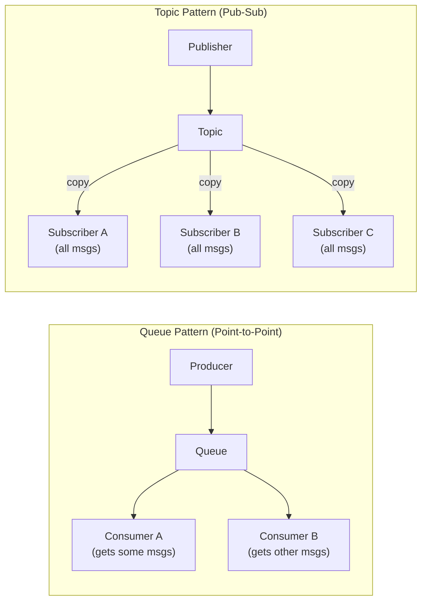
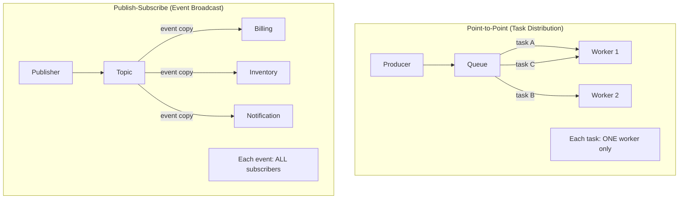
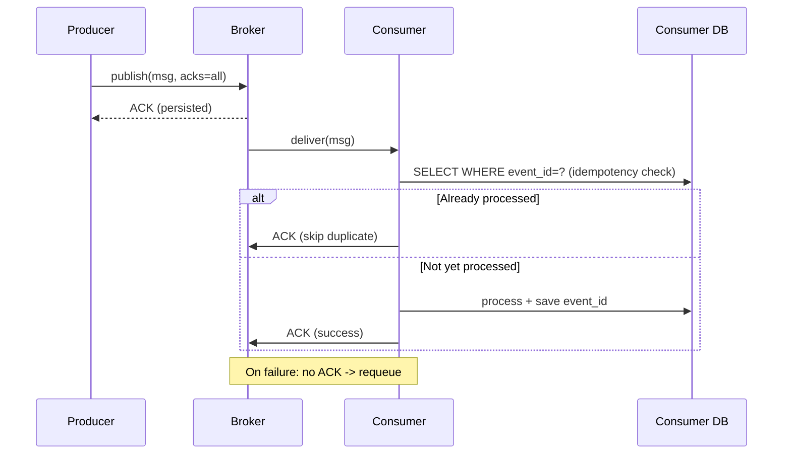

## Keywords in This File

{: .no_toc }

| #   | Keyword | Weight |
| --- | ------- | ------ |
| 1   | [Message Queues and Topics](#message-queues-and-topics) | high |
| 2   | [Point-to-Point vs Publish-Subscribe](#point-to-point-vs-publish-subscribe) | high |
| 3   | [Message Producers and Consumers](#message-producers-and-consumers) | medium |

---

# Message Queues and Topics

**TL;DR:** A message queue is a buffer for point-to-point work distribution
- one producer sends, one consumer receives, message is deleted after ACK.
A topic is a named channel for publish-subscribe - one producer sends, all
subscribed consumers receive a copy. These are the two fundamental routing
patterns that every messaging system builds on.

---

### 🎯 Model Answer

**30 seconds:**
> A queue is a buffer between one sender and one receiver. A message sits
> in the queue until a consumer picks it up and acknowledges it - then it
> is deleted. A topic is a channel where one sender's message is delivered
> to all subscribers. These two patterns handle two different problems:
> queues distribute work across workers; topics broadcast events to all
> interested parties.

**3 minutes:**
> The queue model: work arrives faster than any one worker can handle it.
> A queue buffers the work and distributes each item to exactly one worker.
> Competing consumers: multiple workers all read from the same queue; each
> message goes to exactly one worker. This scales processing by adding
> more workers. When the worker ACKs, the message is deleted. This is
> task distribution.
>
> The topic model: an event happens and multiple systems need to react.
> An order is placed - billing, inventory, notification, and analytics
> all need to know. A topic delivers the same event to all subscribers.
> Each subscriber receives an independent copy and processes independently.
> This is event broadcasting.
>
> In RabbitMQ: queues are explicit; topics are implemented via fanout
> exchanges routing to multiple queues. In Kafka: everything is a topic,
> but consumer groups implement the queue model (one consumer per group
> gets each message) while multiple groups implement the topic model
> (all groups see all messages). Understanding both patterns is fundamental
> to designing any messaging architecture.

**Blank Mind Recovery:**

**(1) Restate:** "Message queue vs topic - you are asking about the two
fundamental routing patterns: one receiver vs. many receivers."

**(2) First principles:** "Work needs one processor. Events need all
processors. Queue: one receiver. Topic: all receivers."

**(3) Bridge:** "A queue is like a help desk ticket system - one agent
handles each ticket. A topic is like a company announcement - everyone
receives it."

---

### 📘 Concept Explanation

**What it is:**
The two fundamental message routing patterns. A queue delivers each
message to exactly one consumer. A topic delivers each message to all
subscribed consumers.

**The problem it solves:**
Distributed systems need two distinct communication patterns: work
distribution (divide a task among workers, each task done once) and
event notification (inform all interested parties of something that
happened). Queues and topics address these distinct needs.

**How queues work:**

```
Producer    Queue              Consumers
   |          |                    |
   |--msg1--->|                    |
   |--msg2--->|                    |
   |--msg3--->|                    |
              |---msg1------------>| Worker A (processes msg1)
              |---msg2--+          | Worker A
              |         +--------->| Worker B (processes msg2)
              |---msg3------------>| Worker A
```

> **Code walkthrough:** This Message Queues and Topics example demonstrates a key concept in practice using Kafka messaging. **KEY MECHANISM:** the runtime executes these instructions in sequence with specific memory and execution semantics. **WHY IT MATTERS:** misapplying this pattern causes subtle bugs that only manifest under production load. **TAKEAWAY: understand the execution model before using this pattern in production code.**

- Multiple producers can write to the same queue.
- Multiple consumers (competing consumers) read from the same queue.
- Each message is delivered to exactly one consumer.
- On ACK: message is removed. On failure: requeued.

**How topics work:**

```
Publisher    Topic             Subscribers
    |           |                  |
    |--event--->|--event copy----->| Billing Service
    |           |--event copy----->| Inventory Service
    |           |--event copy----->| Notification Service
```

> **Code walkthrough:** This Message Queues and Topics example demonstrates a key concept in practice using Kafka messaging. **KEY MECHANISM:** the runtime executes these instructions in sequence with specific memory and execution semantics. **WHY IT MATTERS:** misapplying this pattern causes subtle bugs that only manifest under production load. **TAKEAWAY: understand the execution model before using this pattern in production code.**

- One publisher sends to a topic.
- All subscribed consumers receive an independent copy.
- Each consumer processes independently (different rates, different logic).
- Message retention: depends on broker. Kafka retains; RabbitMQ deletes
  from each queue after ACK.

**The key insight:**
Kafka blurs this distinction: a Kafka topic supports both patterns
simultaneously. Within a consumer group, partitions are assigned to
consumers (queue semantics - each message processed once). Across
multiple consumer groups, each group sees all messages (topic semantics).
The partition is the key concept - it is the unit of both ordering and
parallelism.

**When to use queues:**
- Task queues: image processing, email sending, PDF generation.
- Work distribution across multiple worker instances.
- Ordered processing of tasks with one-at-a-time guarantee.

**When to use topics:**
- Event broadcasting: order placed, user registered, payment completed.
- Multiple systems react to the same business event.
- Event sourcing and CQRS (multiple projections from one event stream).

**Alternatives:**
- Database polling: workers poll a DB table; simpler but inefficient
- Scheduled jobs (cron): time-based rather than event-based
- gRPC streaming: point-to-point streaming, tight coupling

**First-principles derivation:**
Two communication needs: "do this work" (one worker) and "this happened"
(all interested parties). Queue = do-this-work. Topic = this-happened.
Any messaging architecture decomposes into these two patterns.

---

### 💻 Code Example

```java
// Queue pattern: competing consumers on same queue.
// Only one consumer receives each message.
// Spring AMQP / RabbitMQ example.

@Configuration
class QueueConfig {
    @Bean
    Queue taskQueue() {
        // durable=true: survives broker restart
        return new Queue("task.queue", true);
    }
}

@Component
class TaskProducer {
    private final RabbitTemplate rabbitTemplate;

    public void sendTask(TaskPayload task) {
        rabbitTemplate.convertAndSend(
            "task.queue", task
        );
    }
}

// Multiple instances of this consumer compete for messages.
// Each message goes to exactly ONE instance.
@RabbitListener(queues = "task.queue")
class TaskConsumer {
    public void handle(TaskPayload task) {
        processTask(task); // only one consumer gets each task
        // auto-ACK after successful return
    }
}
```

> **Code walkthrough:** Multiple instances of `TaskConsumer` can beice. **KEY MECHANISM:** the runtime executes these instructions in sequence with specific memory and execution semantics. **WHY IT MATTERS:** misapplying this pattern causes subtle bugs that only manifest under production load. **TAKEAWAY: understand the execution model before using this pattern in production code.**
> deployed. RabbitMQ distributes messages round-robin across instances.
> Each `TaskPayload` goes to exactly one instance - this is competing
> consumers. The `durable=true` queue survives broker restarts. The
> `@RabbitListener` auto-ACKs after the method returns successfully;
> an exception causes the message to be requeued.

```java
// Topic pattern: all subscribers receive every message.
// Spring Kafka example.

@Configuration
class TopicConfig {
    @Bean
    NewTopic ordersTopic() {
        // 10 partitions, replication factor 3
        return TopicBuilder.name("orders.placed")
            .partitions(10)
            .replicas(3)
            .build();
    }
}

// Publisher
@Component
class OrderEventPublisher {
    private final KafkaTemplate<String, OrderEvent> kafka;

    public void publish(OrderEvent event) {
        // Key = orderId: ensures same order's events go
        // to same partition (ordering per order).
        kafka.send("orders.placed", event.getOrderId(),
            event);
    }
}

// Consumer Group 1: Billing (independent group)
@KafkaListener(
    topics = "orders.placed",
    groupId = "billing-service"
)
class BillingConsumer {
    public void handle(OrderEvent event) {
        billingService.chargeForOrder(event);
    }
}

// Consumer Group 2: Inventory (independent group)
// Receives SAME events independently from Billing
@KafkaListener(
    topics = "orders.placed",
    groupId = "inventory-service"
)
class InventoryConsumer {
    public void handle(OrderEvent event) {
        inventoryService.reserveItems(event);
    }
}
```

> **Code walkthrough:** Both `BillingConsumer` and `InventoryConsumer`ice. **KEY MECHANISM:** the runtime executes these instructions in sequence with specific memory and execution semantics. **WHY IT MATTERS:** misapplying this pattern causes subtle bugs that only manifest under production load. **TAKEAWAY: understand the execution model before using this pattern in production code.**
> receive every `OrderEvent` independently because they have different
> `groupId` values. Adding a new consumer group (say, `analytics-service`)
> receives all historical events from the beginning if using
> `auto.offset.reset=earliest`. The `orderId` as partition key ensures
> all events for the same order go to the same partition - enabling
> per-order ordering guarantees without global ordering overhead.

---

### 🎓 Answers by Seniority

**Junior / Mid (0-5 years):**
> A queue delivers each message to exactly one consumer - used for task
> distribution. Multiple workers read from the same queue; each task
> goes to one worker. A topic delivers each message to all subscribers -
> used for event broadcasting. When an order is placed, billing,
> inventory, and notifications all need to know, so you use a topic.
> RabbitMQ has explicit queues and uses exchanges for topics. Kafka uses
> topics for both patterns via consumer groups.

*Push deeper:* Explain the Kafka consumer group model - within a group,
it is queue semantics; across groups, it is topic semantics. This is
Kafka's key design insight.

---

**Senior / Staff (5+ years):**
> The queue vs. topic distinction maps to two distinct system design
> concerns: work distribution (queues) and event notification (topics).
> In practice, most systems use both: a Kafka topic receives all business
> events (topic semantics), and individual consumer groups implement
> parallel processing with competing consumers (queue semantics).
> The design decision that matters most is partition key selection in
> Kafka - the key determines which partition a message goes to, which
> determines ordering guarantees and maximum parallelism.

*Push deeper:* Discuss partition key design: using orderId routes all
events for an order to the same partition, enabling per-order ordering.
But if all traffic is for a few hot customers, the partition becomes a
hotspot. Key distribution must be uniform for balanced parallelism.

---

### ⚠️ Common Misconceptions

**"Kafka topics are different from RabbitMQ topics"**

RabbitMQ topics are routing patterns for exchanges (using dot-delimited
routing keys like `order.placed.europe`). Kafka topics are named
partitioned logs. They share the name but are fundamentally different
concepts. A Kafka topic is closer to a RabbitMQ fanout exchange connected
to multiple queues - one topic, all consumer groups receive the events.

**"A queue can only have one consumer"**

A queue supports multiple concurrent consumers (competing consumers
pattern). All consumers read from the same queue; each message goes to
exactly one consumer. This is the primary scaling mechanism for queues:
add more consumer instances to increase throughput. A queue with one
consumer is the simplest case, not the typical production configuration.

**"Topics require more infrastructure than queues"**

In managed services (Amazon SQS + SNS, Azure Service Bus), topics and
queues are both managed resources with similar operational overhead.
In self-hosted Kafka, a topic with high partition count and replication
factor requires more disk and broker resources than a simple queue.
But this is not inherent to the pattern - it is a function of retention
and throughput requirements.

---

### 🚨 Failure Modes and Diagnosis

**Failure: Queue depth grows because no competing consumers**

Symptom: One queue, one consumer, queue depth grows during traffic spikes.

Diagnosis:
```
# RabbitMQ
curl -u guest:guest http://localhost:15672/api/queues/%2F/task.queue \
  | jq '.messages'

# Expected: > 0 and growing
```

> **Code walkthrough:** This Expected: > 0 and growing example demonstrates a key concept in practice using HTTP client. **KEY MECHANISM:** the runtime executes these instructions in sequence with specific memory and execution semantics. **WHY IT MATTERS:** misapplying this pattern causes subtle bugs that only manifest under production load. **TAKEAWAY: understand the execution model before using this pattern in production code.**

Fix: Add more consumer instances. Ensure consumer instances are
stateless so multiple can run simultaneously.

**Failure: Kafka partition hotspot - one partition overloaded**

Symptom: Consumers on most partitions are idle. One partition has
unbounded lag. The partition key is causing all traffic to concentrate.

Diagnosis:
```
kafka-consumer-groups.sh \
  --bootstrap-server localhost:9092 \
  --describe --group my-group
# Look for one partition with large LAG, others at 0
```

> **Code walkthrough:** This Look for one partition with large LAG, others at 0 example demonstrates a key concept in practice using Kafka messaging. **KEY MECHANISM:** the runtime executes these instructions in sequence with specific memory and execution semantics. **WHY IT MATTERS:** misapplying this pattern causes subtle bugs that only manifest under production load. **TAKEAWAY: understand the execution model before using this pattern in production code.**

Root cause: Partition key has low cardinality (e.g., all messages have
the same key, or a few hot keys dominate).

Fix: Choose a key with higher cardinality. Or use null keys for
round-robin partition assignment (but lose ordering guarantees).

**Failure: Message consumed but processing incomplete**

Symptom: Queue depth drops but work is not done. Messages disappear.

Root cause: Auto-ACK enabled. Message is acknowledged immediately on
delivery, before the consumer processes it. If the consumer crashes
during processing, the message is lost.

Fix: Use manual ACK mode. ACK only after successful processing.

---

### 🎯 Interview Deep-Dive

| Format | Time | Goal |
|---|---|---|
| 30-second definition | 0-30s | Queue: one consumer; Topic: all |
| 3-minute explanation | 30s-3m | Competing consumers, fan-out |
| Follow-up questions | 3m+ | Kafka partitions, ordering |
| System design | 5m+ | Designing with queues vs. topics |
| Staff-level | 10m+ | Partition design, scaling |

**[JUNIOR] Q1 - [MECHANISM] What is a competing consumers pattern?**

🗣️ "Competing consumers is when multiple consumer instances all read
from the same queue. Each message goes to exactly one consumer - they
compete to receive it. This scales processing: if one consumer handles
100 messages per minute and you have 1000 messages per minute arriving,
you add 10 consumer instances. Each takes a fair share of the load.
This is the primary scaling mechanism for queue-based systems. The
consumers must be stateless so any instance can handle any message.
If consumers have local state, some messages might go to the wrong
instance. RabbitMQ distributes to competing consumers with round-robin.
Kafka distributes by partition assignment."

*What separates good from great:* Mentioning that consumers must be
stateless for the pattern to work correctly.

**[JUNIOR] Q2 - [DESIGN] How does Kafka implement both queue and topic patterns?**

🗣️ "Kafka uses consumer groups to implement both. Within a single
consumer group, Kafka assigns each partition to exactly one consumer in
the group. So if a topic has 10 partitions and your consumer group has
5 consumers, each consumer handles 2 partitions. A message goes to one
consumer - queue semantics. Now add a second consumer group with a
different group ID. This second group also receives all messages
independently. Multiple groups implement topic semantics - every group
sees every message. So Kafka topics serve both patterns simultaneously:
queue semantics within a group, topic semantics across groups. This is
why Kafka is so versatile."

*What separates good from great:* Explaining both patterns in one
coherent explanation rather than treating them as separate.

**[MID] Q3 - [MECHANISM] What determines message ordering in Kafka?**

🗣️ "Message ordering in Kafka is guaranteed within a partition, not
across partitions. All messages with the same key go to the same
partition (based on a hash of the key). All messages in a partition
are delivered to one consumer in a group in the order they were written.
So: if you want all events for a given order to be processed in order,
use the orderId as the partition key. All order events with the same ID
go to the same partition. One consumer processes them in sequence.
Trade-off: strong ordering requires one partition per key range, which
limits parallelism. For global ordering across all messages, you need
a single partition - which means one consumer and no parallelism."

*What separates good from great:* Explaining the trade-off between
ordering and parallelism, not just where ordering is guaranteed.

**[MID] Q4 - [MECHANISM] What happens to a Kafka consumer group when a consumer crashes?**

🗣️ "Kafka detects the crash when the consumer stops sending heartbeats
within `session.timeout.ms` (default 10 seconds). Kafka triggers a
rebalance: it reassigns the crashed consumer's partitions to the
remaining consumers in the group. During the rebalance, no consumer
in the group processes messages - brief pause. After reassignment,
processing resumes from the last committed offset of the crashed
consumer. Messages processed but not committed by the crashed consumer
are reprocessed - this is why at-least-once delivery requires idempotent
consumers. The rebalance duration depends on the number of consumers
and partitions."

*What separates good from great:* Mentioning the brief processing pause
during rebalance and the at-least-once reprocessing implication.

**[SENIOR] Q5 - [DESIGN] How do you design partition keys for a Kafka topic?**

🗣️ "The partition key serves two purposes: routing related messages to
the same partition (for ordering) and distributing load evenly across
partitions (for parallelism). These goals conflict. Three strategies.
First, entity key: use the entity ID (orderId, userId). Related events
are ordered. Trade-off: hot entities (high-volume users) create partition
hotspots. Second, composite key: hash(entityId, bucketNumber). Distributes
hot entities across multiple partitions. Trade-off: partial ordering only
within a bucket. Third, null key: Kafka distributes round-robin.
Maximum parallelism, no ordering. Use null key for metrics and logs where
ordering does not matter. Use entity key when ordering per entity
matters more than load balancing."

*What separates good from great:* Presenting the conflict between
ordering and load balancing, not just recommending one key strategy.

**[SENIOR] Q6 - [TRADE-OFF] When would you add partitions to an existing Kafka topic?**

🗣️ "You add partitions when consumer lag is growing and the bottleneck
is partition count - not enough partitions to feed all available consumers.
The partition count is the maximum parallelism ceiling: if you have 10
partitions, no more than 10 consumers in a group can process
simultaneously. The risk of adding partitions: existing messages in
current partitions retain their original partition assignments. New
messages may route to different partitions based on key hashing. For
topics using key-based partitioning, this breaks ordering guarantees
for in-flight data during the transition. Addition is safe for null-key
topics. For key-based topics: plan partition count at topic creation.
128 or 256 is a common starting point for topics that will scale."

*What separates good from great:* Identifying the key-based ordering
disruption risk when adding partitions, not just the mechanical process.

**[STAFF] Q7 - [DESIGN] How do you design a fan-out architecture for a high-traffic event stream?**

🗣️ "The fan-out design question is about how many consumers should
share one topic versus having their own. Three patterns. Single topic,
multiple consumer groups: all downstream systems subscribe to the same
topic. Simple, but all consumers must handle all events even if they
only care about a subset. Works well when event volume is manageable for
all consumers. Topic per consumer type: separate topics for billing
events, inventory events, notification events. Producers publish to the
right topic. More flexible, avoids broadcasting irrelevant events.
Event filter per consumer: a single raw event topic with a filter layer
(like Kafka Streams) that routes events to per-consumer topics.
Best for high-volume systems where most consumers only care about a
small fraction of events. The correct choice depends on whether consumers
need all events or a filtered subset, and whether you want to centralize
or distribute the filtering logic."

*What separates good from great:* Presenting three fan-out patterns
with trade-offs rather than one recommendation.

---

### ⚖️ Comparison Table

*(Omit: ★☆☆ foundational L1 keyword. Queue vs. topic comparison is
covered in the L2 Consumer Patterns file.)*

---

### 🏛️ System Design

*(Omit: ★☆☆ L1 foundational keyword. System design integration is
covered in L4+ files.)*

---

### 📊 Diagram

```
QUEUE vs TOPIC - SIDE BY SIDE

QUEUE (point-to-point, one consumer):
  P1 --\                     /--> Consumer A
  P2 --> [Queue] --work-->  |
  P3 --/                     \--> Consumer B
  Each message: ONE consumer only

TOPIC (publish-subscribe, all consumers):
  P1 --> [Topic] --copy--> Consumer A
                  --copy--> Consumer B
                  --copy--> Consumer C
  Each message: ALL consumers
```



> **Diagram walkthrough:** In the Queue pattern (left), multiple consumers
> compete - each message goes to exactly one. Adding consumers increases
> throughput. In the Topic pattern (right), all subscribers receive every
> message independently. Adding subscribers does not increase processing
> throughput but does increase the number of systems that react to each
> event. Kafka combines both: consumer groups enable queue semantics
> (within a group), and multiple groups enable topic semantics (across
> groups).

---

---

---

### 💻 Code Example

*(Omit: this concept does not have a programmatic interface that can be demonstrated in code. The conceptual explanation above is sufficient.)*


---

### 🏛️ System Design

*(Omit: system design diagram not applicable for this concept - see ★★★ keywords for full system design coverage.)*


---

### ⚖️ Comparison Table

*(Omit: this is a ★☆☆ foundational concept with no direct alternatives to compare - see higher-difficulty keywords for trade-off analysis.)*


---

### 📊 Diagram

*(Omit: no standalone visual diagram required for this concept - the explanations and code examples above provide sufficient clarity.)*


# Point-to-Point vs Publish-Subscribe

**TL;DR:** Point-to-point (P2P) means a message is sent to one receiver -
one producer, one consumer, one message delivery. Publish-subscribe
(pub/sub) means one publisher sends and all subscribers receive a copy.
P2P is for work distribution (task queues). Pub/sub is for event
notification (event-driven architecture). These are the two fundamental
messaging patterns and every broker implements them in slightly different
ways.

---

### 🎯 Model Answer

**30 seconds:**
> Point-to-point: one producer sends a message to a queue; one consumer
> receives it. The message is removed after processing. Publish-subscribe:
> one publisher sends a message to a topic; all subscribers receive a
> copy. Each subscriber processes independently. P2P is for task
> distribution - send work to one worker. Pub/sub is for event broadcasting
> - notify all interested systems of what happened.

**3 minutes:**
> P2P is the work queue pattern: you have tasks that need processing.
> You do not care which worker handles a task, only that exactly one
> worker handles each task. Multiple workers compete for tasks; the
> fastest available worker wins. When processing is done, the message is
> deleted. This scales processing by adding more workers.
>
> Pub/sub is the notification pattern: an event happens in the system
> and multiple subsystems need to react. An order is placed: billing
> must charge the customer, inventory must reserve stock, email must
> send confirmation, analytics must record the event. Each needs the
> same information, processes it independently, and has different
> failure modes. Pub/sub delivers the same event to all subscribers
> without the publisher knowing who they are.
>
> The difference is in coupling and guarantees. P2P: the sender knows
> one consumer will handle it - the broker guarantees one-and-only-one
> delivery per message. Pub/sub: the publisher does not know or care
> who subscribes - new subscribers can be added without changing the
> publisher. This is why pub/sub is the pattern for extensible event-
> driven architectures.

**Blank Mind Recovery:**

**(1) Restate:** "P2P vs pub/sub - one consumer gets the message vs.
all consumers get the message."

**(2) First principles:** "Work needs to be done once. Events need to be
observed by all. P2P = once. Pub/sub = all."

**(3) Bridge:** "P2P is like assigning a task in a team - one person
does it. Pub/sub is like sending a company-wide announcement - everyone
reads it."

---

### 📘 Concept Explanation

**What it is:**
Two fundamental messaging patterns. Point-to-point (P2P): a message is
delivered to exactly one consumer. Publish-subscribe (pub/sub): a message
is delivered to all subscribers. These patterns determine how messages
are routed and who processes them.

**The problem it solves:**
Distributed systems have two communication needs: dispatch work to one
processor (task queues, job workers) and notify all interested parties
of events (event-driven architecture). P2P and pub/sub are the patterns
that address these needs directly.

**How point-to-point works:**

```
Producer                  Consumer
    |    Message Queue         |
    |---[MSG]--->[Queue]       |
    |                          |
    |           [Queue]---[MSG]-->[Consumer A] (processes)
    |                          |
    |           [Queue]---[MSG]-->[Consumer B] (processes next)
    (load balanced, one consumer per message)
```

> **Code walkthrough:** This Point-to-Point vs Publish-Subscribe example demonstrates a key concept in practice using Kafka messaging. **KEY MECHANISM:** the runtime executes these instructions in sequence with specific memory and execution semantics. **WHY IT MATTERS:** misapplying this pattern causes subtle bugs that only manifest under production load. **TAKEAWAY: understand the execution model before using this pattern in production code.**

- Message sits in queue until a consumer is available.
- First available consumer (competing consumers) claims the message.
- After processing and ACK, message is deleted from queue.
- If consumer fails before ACK, message is requeued for another consumer.

**How publish-subscribe works:**

```
Publisher    Topic           Subscribers
    |           |                  |
    |---[EVT]-->| copy1 ---------->| Subscriber A
    |           | copy2 ---------->| Subscriber B
    |           | copy3 ---------->| Subscriber C
    (each subscriber receives an independent copy)
```

> **Code walkthrough:** This Point-to-Point vs Publish-Subscribe example demonstrates a key concept in practice using Kafka messaging. **KEY MECHANISM:** the runtime executes these instructions in sequence with specific memory and execution semantics. **WHY IT MATTERS:** misapplying this pattern causes subtle bugs that only manifest under production load. **TAKEAWAY: understand the execution model before using this pattern in production code.**

- Publisher sends to a topic (or exchange in RabbitMQ).
- Broker delivers a copy to each registered subscriber.
- Subscribers process independently at their own rate.
- Adding a new subscriber requires no publisher change.

**The key insight:**
Pub/sub decouples the publisher from knowledge of who reacts to events.
This enables open/closed principle at the system level: new subscribers
can be added without modifying the publisher. This is the pattern that
enables extensible microservice architectures.

**When to use P2P:**
- Task processing: image rendering, invoice generation, email sending.
- Load distribution: multiple workers handle incoming work.
- Sequential processing: each task processed exactly once.
- Retry semantics: a failed task must be retried by another worker.

**When to use pub/sub:**
- Business events: order placed, user registered, payment completed.
- Multiple downstream systems react to the same event.
- Event sourcing: multiple projections built from one event stream.
- Audit trails: compliance systems must observe all events.

**Alternatives:**
- Direct HTTP call: sync, one receiver, tight coupling
- gRPC broadcast: not natively supported; requires application-level
  fan-out
- Database triggers: pub/sub within a single DB; does not span services

**First-principles derivation:**
Communication patterns reduce to: "do this once" or "let everyone know."
P2P optimizes "do this once" - reliable work distribution. Pub/sub
optimizes "let everyone know" - reliable event notification. These are
complementary, not competing patterns.

---

### 💻 Code Example

```java
// POINT-TO-POINT: Task queue with competing consumers.
// RabbitMQ with Spring AMQP.

@Component
class PdfGenerationProducer {
    private final RabbitTemplate rabbitTemplate;

    public void requestPdfGeneration(PdfRequest request) {
        // Send to named queue; one worker will claim this.
        rabbitTemplate.convertAndSend(
            "pdf.generation.queue", request
        );
    }
}

// Multiple instances compete for messages.
// Only ONE handles each PDF generation request.
@RabbitListener(queues = "pdf.generation.queue",
                concurrency = "3-5") // 3-5 concurrent threads
class PdfGenerationConsumer {
    public void generate(PdfRequest request) {
        pdfService.generate(request);
        storageService.upload(request.getOutputPath());
        // auto-ACK on successful return
    }
}
```

> **Code walkthrough:** `concurrency = "3-5"` creates 3-5 listenerice. **KEY MECHANISM:** the runtime executes these instructions in sequence with specific memory and execution semantics. **WHY IT MATTERS:** misapplying this pattern causes subtle bugs that only manifest under production load. **TAKEAWAY: understand the execution model before using this pattern in production code.**
> threads per consumer instance. Deploy multiple instances of this
> service for more parallelism. Each `PdfRequest` is processed by
> exactly one thread, in one instance. Failed generation retries via
> requeue (up to configured max-retries). This is classic P2P task
> distribution - scale workers by adding concurrency or instances.

```java
// PUBLISH-SUBSCRIBE: Order event broadcast via Kafka.
// Multiple consumer groups each receive every event.

@Component
class OrderEventPublisher {
    private final KafkaTemplate<String, OrderPlacedEvent> kafka;

    public void publishOrderPlaced(Order order) {
        OrderPlacedEvent event = OrderPlacedEvent.from(order);
        // Key = customerId: per-customer event ordering
        kafka.send("orders.placed",
            order.getCustomerId(), event);
    }
}

// Group "billing": receives ALL order events, independently
@KafkaListener(topics = "orders.placed",
               groupId = "billing-consumer-group")
class BillingEventConsumer {
    public void onOrderPlaced(OrderPlacedEvent event) {
        billingService.initiatePayment(
            event.getOrderId(), event.getTotalCents()
        );
    }
}

// Group "inventory": ALSO receives ALL order events
// Same event stream, different processing logic
@KafkaListener(topics = "orders.placed",
               groupId = "inventory-consumer-group")
class InventoryEventConsumer {
    public void onOrderPlaced(OrderPlacedEvent event) {
        inventoryService.reserveStock(event.getItems());
    }
}
```

> **Code walkthrough:** Two consumer groups subscribe to the same topic.
> Both receive every `OrderPlacedEvent` independently - this is pub/sub.
> Within each group, if you run multiple instances, each instance handles
> a subset of partitions - this is P2P within the group. Adding a new
> consumer group (e.g., `analytics-consumer-group`) requires no change
> to `OrderEventPublisher`. The publisher is closed for modification but
> open for extension - Open/Closed Principle at the system level.

---

### 🎓 Answers by Seniority

**Junior / Mid (0-5 years):**
> Point-to-point: send to a queue, one consumer processes it, message
> is deleted. Used for task distribution like sending emails or
> generating PDFs. Publish-subscribe: send to a topic, all subscribers
> get a copy. Used for event notification like "order placed" where
> billing, inventory, and notifications all need to react. You choose
> P2P when work needs to be done exactly once by one processor. You
> choose pub/sub when an event needs to be observed by multiple systems.

*Push deeper:* Explain that the two patterns are often combined: Kafka
implements pub/sub across consumer groups and P2P within a consumer
group simultaneously.

---

**Senior / Staff (5+ years):**
> P2P and pub/sub are not mutually exclusive choices - they represent
> different axes of a messaging architecture. Most real systems use
> pub/sub for event broadcasting and P2P (competing consumers within
> a consumer group) for processing parallelism. The more important
> design question is whether to use a fat event (containing all relevant
> data) or a thin event with a reference ID (where consumers fetch
> additional data). Fat events reduce coupling between publisher and
> consumer schema but increase message size. Thin events are smaller
> but require consumers to call back to the publisher's data store,
> creating implicit coupling.

*Push deeper:* Discuss event schema evolution in pub/sub: adding fields
to an event is backward-compatible; removing fields is not. Schema
registries (Confluent Schema Registry, Apicurio) enforce compatibility
rules before publishing.

---

### ⚠️ Common Misconceptions

**"P2P is less scalable than pub/sub"**

P2P with competing consumers scales horizontally by adding consumer
instances - each instance processes a share of the messages. This is
highly scalable. P2P and pub/sub have different scaling axes: P2P
scales processing throughput; pub/sub scales the number of observers.
Neither is inherently more or less scalable.

**"Pub/sub means the publisher must know about subscribers"**

This is the opposite of pub/sub's purpose. The publisher sends to a
topic without knowing who is subscribed. Subscribers register with the
broker, not the publisher. The publisher is completely decoupled from
subscriber existence. This is the core value: adding a new subscriber
never requires a publisher change.

**"Messages in pub/sub are duplicated, wasting bandwidth"**

In a well-architected system, pub/sub does not duplicate network traffic.
The broker sends one copy to each subscriber using separate delivery
connections. The publisher sends once to the broker. The broker fan-outs
from there. The overhead is at the broker, not the publisher. In Kafka,
consumer groups read directly from the broker log - the log is not
physically duplicated per consumer group.

---

### 🚨 Failure Modes and Diagnosis

**Failure: P2P message processed multiple times (no idempotency)**

Symptom: Duplicate emails, duplicate charges, duplicate records.

Root cause: Consumer processes but crashes before ACK. Broker redelivers
to another consumer. Second consumer also processes.

Diagnosis: Check for duplicate processing in application logs. Look for
same messageId appearing in processing logs multiple times.

Fix: Implement idempotency. Store messageId in DB with unique constraint.
Check before processing. Or use natural idempotency in the operation.

**Failure: Pub/sub subscriber added but misses historical events**

Symptom: New service deployed and subscribed to topic but its initial
data is wrong - it missed months of events.

Root cause: In traditional pub/sub (SNS, RabbitMQ fanout), new subscribers
only receive messages published after they subscribe. Historical events
are gone.

Fix for new subscriber: In Kafka, use `auto.offset.reset=earliest` when
creating the consumer group - it processes from the beginning of the log
retention window. In traditional pub/sub, you need a separate data
migration or re-publish of historical events.

**Failure: Fan-out causing unequal processing across subscribers**

Symptom: One subscriber (billing) processes fast; another (analytics)
processes slowly. Analytics consumer lag grows. Does this affect billing?

Answer: No - in proper pub/sub, subscribers are independent. Slow analytics
does not affect billing. But: if the broker's disk fills due to analytics
lag (in Kafka, oldest unconsumed messages can't be deleted if a consumer
group is behind), it indirectly affects all consumers. Monitor consumer
lag across all groups, not just your own.

---

### 🎯 Interview Deep-Dive

| Format | Time | Goal |
|---|---|---|
| 30-second definition | 0-30s | P2P: one consumer, pub/sub: all |
| 3-minute explanation | 30s-3m | Trade-offs, use cases |
| Follow-up questions | 3m+ | Idempotency, event design |
| System design | 5m+ | Choosing pattern for a design |
| Staff-level | 10m+ | Event schema, fat vs thin events |

**[JUNIOR] Q1 - [TRADE-OFF] What is the difference between P2P and pub/sub?**

🗣️ "Point-to-point: one producer, one queue, one consumer receives the
message. The message is processed by exactly one consumer and deleted.
Used for tasks: send email, generate invoice. Multiple consumers can
read from the same queue but each message goes to only one of them.
Publish-subscribe: one publisher, one topic, all subscribers receive
a copy. Each subscriber processes independently. Used for events: order
placed, user registered. Adding a new subscriber requires no change to
the publisher. The key difference: P2P guarantees one consumer per
message; pub/sub guarantees all consumers get every message."

*What separates good from great:* The last sentence - explicitly stating
the guarantee each pattern provides.

**[JUNIOR] Q2 - [MECHANISM] When should you use pub/sub instead of direct HTTP calls to notify multiple services?**

🗣️ "Pub/sub over HTTP fan-out when: you want the publisher to not know
about subscribers (loose coupling), the subscriber list changes (adding
new services should not require publisher changes), or you need different
processing rates for different subscribers. With direct HTTP calls, the
publisher must call each subscriber sequentially or in parallel. If a
new subscriber is added, the publisher code must be updated. If one
subscriber is slow, it slows the publisher or requires complex parallel
HTTP management. With pub/sub, the publisher sends once to the broker.
The broker handles delivery to all subscribers. Failures in one subscriber
do not affect others."

*What separates good from great:* Explaining that pub/sub enables the
publisher to be closed for modification but open for extension.

**[MID] Q3 - [MECHANISM] What is a fat event vs. a thin event in pub/sub?**

🗣️ "A fat event contains all the data subscribers might need: order ID,
customer details, product list, price, shipping address. Subscribers do
not need to call back for additional data. Advantage: subscribers are
fully decoupled from the publisher's data store. Disadvantage: events
are large; all subscribers receive all data even if they only need a
subset; changing the event schema requires coordinating all subscribers.
A thin event contains only a reference: order ID, event type. Subscribers
call back to the order service API to fetch what they need. Advantage:
small messages, subscribers control what data they fetch. Disadvantage:
subscribers are coupled to the publisher's API; network calls back to
the publisher create load and a dependency. In practice: include the
data that all subscribers always need; omit data that only some need."

*What separates good from great:* Presenting the trade-off rather than
declaring one approach correct.

**[MID] Q4 - [MECHANISM] How do you handle a slow subscriber in pub/sub without affecting fast subscribers?**

🗣️ "In properly designed pub/sub, a slow subscriber does not affect
fast subscribers - they are independent. In Kafka, each consumer group
has its own offset. A slow analytics consumer group can fall behind
without affecting the billing consumer group. The risk emerges when
the slow consumer's lag prevents log compaction or deletion. In Kafka,
the broker cannot delete records older than the earliest committed
offset across all consumer groups. A slow consumer can cause disk
fill-up. Fix: set a TTL on consumer group lag (alert if lag exceeds X
hours). Consider dropping old events for non-critical consumers rather
than growing the lag indefinitely. In RabbitMQ fanout, each queue is
independent - a slow consumer's queue fills up but does not affect
other queues."

*What separates good from great:* Identifying the indirect disk-fill
risk in Kafka even though subscribers are logically independent.

**[SENIOR] Q5 - [MECHANISM] How do you evolve an event schema in pub/sub without breaking subscribers?**

🗣️ "Schema evolution in pub/sub must be backward-compatible because you
cannot update all subscribers simultaneously. Three rules. First,
additive changes are safe: add new optional fields with defaults.
Existing consumers that do not know the field simply ignore it.
Second, field removal is breaking: existing consumers that read the
field will fail with deserialization errors or null pointer exceptions.
Mark fields deprecated first; wait for all consumers to stop reading
them; then remove. Third, rename is breaking: it is a delete + add.
Use a schema registry (Confluent Schema Registry or Apicurio) to
enforce compatibility rules before any event is published. Configure
BACKWARD compatibility mode: new schemas must be readable by old
consumers. Use Avro or Protobuf for structured schema with evolution
support."

*What separates good from great:* Explaining why field removal is
breaking (not just additive changes) and naming schema registry as
the tooling.

**[SENIOR] Q6 - [DESIGN] How would you implement event-driven choreography using pub/sub?**

🗣️ "Choreography means each service reacts to events without a central
coordinator. Example: order processing. Order service publishes
OrderPlaced event to a topic. Billing service subscribes, processes
payment, publishes PaymentCompleted event. Inventory service subscribes
to both OrderPlaced and PaymentCompleted, reserves stock after payment.
Shipping service subscribes to PaymentCompleted and inventory events,
creates shipment. Each service owns its logic; no orchestrator directs
the flow. Advantages: loose coupling, each service can evolve
independently. Disadvantages: the overall flow is harder to observe -
you need distributed tracing with correlation IDs to see the chain of
events. Failure handling is complex: if Shipping fails after Inventory
reserved stock, you need a compensating event to release the reservation.
This is the saga pattern."

*What separates good from great:* Identifying the observability and
compensation challenges of choreography, not just the benefits.

**[STAFF] Q7 - [TRADE-OFF] When would you choose orchestration over choreography?**

🗣️ "Choreography is the default for simple event-driven flows where
each service is independent and the flow is short. Use orchestration
when: the flow involves complex conditional logic (if payment fails,
take different paths based on failure type), you need centralized
visibility of the process state, you need to manage long-running
compensation flows (reverting partial completions), or you have more
than 5-6 services in a single flow (choreography becomes hard to trace
at that point). An orchestrator (Saga orchestration, AWS Step Functions,
Temporal) maintains state and knows what step should happen next.
The orchestrator can be made durable by persisting state in a database.
Trade-off: orchestration adds a coordinator that can become a bottleneck
and creates a deployment dependency. Many real systems use choreography
for simple flows and orchestration for complex transactional flows."

*What separates good from great:* Providing specific complexity
thresholds (5-6 services) and naming concrete orchestration tools.

---

### ⚖️ Comparison Table

*(Omit: ★☆☆ foundational L1 keyword. Detailed pattern comparison is
covered in L2 Consumer Patterns file.)*

---

### 🏛️ System Design

*(Omit: ★☆☆ L1 foundational keyword. System design integration is
covered in L4+ files.)*

---

### 📊 Diagram

```
P2P vs PUB/SUB SIDE BY SIDE

P2P (task distribution):
  [P]-->[Queue]--task A--> [C1] processes A
                --task B--> [C2] processes B
                --task C--> [C1] processes C
  One consumer per task. Load balanced.

PUB/SUB (event broadcast):
  [P]-->[Topic]--event--copy A--> [Billing]
                        copy B--> [Inventory]
                        copy C--> [Notification]
  All consumers receive same event.
```



> **Diagram walkthrough:** P2P (top): the queue distributes tasks across
> workers. Worker 1 and Worker 2 each process some tasks, but each task
> goes to exactly one. Adding workers increases throughput. Pub/sub
> (bottom): all three subscribers receive the same event independently.
> The publisher sends once; the broker handles the copies. New subscribers
> can be added without any publisher change - this is the key extensibility
> property of pub/sub architectures.

---

---

---

### 💻 Code Example

*(Omit: this concept does not have a programmatic interface that can be demonstrated in code. The conceptual explanation above is sufficient.)*


---

### 🏛️ System Design

*(Omit: system design diagram not applicable for this concept - see ★★★ keywords for full system design coverage.)*


---

### ⚖️ Comparison Table

*(Omit: this is a ★☆☆ foundational concept with no direct alternatives to compare - see higher-difficulty keywords for trade-off analysis.)*


---

### 📊 Diagram

*(Omit: no standalone visual diagram required for this concept - the explanations and code examples above provide sufficient clarity.)*


# Message Producers and Consumers

**TL;DR:** Producers create messages and send them to a broker. Consumers
read messages from the broker and process them. These roles are decoupled
by the broker: producers do not know which consumers exist; consumers do
not know which producers sent the message. The producer-consumer contract
is the message schema - a stable interface that both sides depend on
independently.

---

### 🎯 Model Answer

**30 seconds:**
> A producer creates messages and publishes them to a broker queue or
> topic. A consumer reads messages from the broker and processes them.
> The broker decouples them: the producer does not know who the consumers
> are; the consumer does not know which producer sent the message.
> The message schema is the contract that both sides depend on.

**3 minutes:**
> The producer's responsibilities: create a message with the correct
> schema, choose the correct destination (queue name or topic), handle
> publish failures (retry, circuit break), and decide on delivery
> semantics (fire-and-forget vs. publisher acknowledgment). A producer
> that publishes without waiting for broker ACK can lose messages if the
> broker crashes between receive and persist.
>
> The consumer's responsibilities: correctly deserialize the message,
> process idempotently (because at-least-once delivery means duplicates
> are possible), handle processing failures gracefully (throw to trigger
> requeue, or send to DLQ), and ACK correctly (manual vs. auto-ACK).
> A consumer that auto-ACKs before processing can lose messages on
> consumer crash.
>
> The critical insight: producers and consumers are independently
> deployable and scalable. You can add consumers to increase throughput
> without any producer change. You can add producers to increase publish
> rate without any consumer change. The broker absorbs the rate mismatch.
> This independence is the core scalability property of messaging systems.

**Blank Mind Recovery:**

**(1) Restate:** "Producers and consumers - the two sides of a messaging
system. Producer publishes. Consumer processes."

**(2) First principles:** "Work arrives (producer) and work is done
(consumer). The broker separates them so they can scale independently."

**(3) Bridge:** "Like a restaurant kitchen: waiters (producers) bring
orders to the pass. Cooks (consumers) pick up and cook. The pass
(broker) decouples them. More cooks = more capacity, without changing
waiters."

---

### 📘 Concept Explanation

**What it is:**
Producers and consumers are the two roles in a messaging system.
Producers create and publish messages. Consumers subscribe to queues
or topics and process messages. The broker mediates all communication
between them.

**The problem it solves:**
Tightly coupled direct calls require both sides to be available
simultaneously. Producers and consumers in messaging can operate
independently: producers publish when they have work; consumers
process when they are available. The broker handles the mismatch.

**How producers work:**

```
Producer:
1. Create message (serialize payload to JSON/Avro/Protobuf)
2. Add metadata (correlationId, timestamp, eventType, version)
3. Publish to broker (queue name or topic)
4. Handle broker ACK (retry on failure if using publisher confirms)
5. Handle publish failure (circuit breaker, DLQ for publish failures)
```

> **Code walkthrough:** This Message Producers and Consumers example demonstrates a key concept in practice using Kafka messaging. **KEY MECHANISM:** the runtime executes these instructions in sequence with specific memory and execution semantics. **WHY IT MATTERS:** misapplying this pattern causes subtle bugs that only manifest under production load. **TAKEAWAY: understand the execution model before using this pattern in production code.**

**How consumers work:**

```
Consumer:
1. Subscribe to queue or topic (pull or push model)
2. Receive message from broker
3. Deserialize payload
4. Process message (idempotently)
5. ACK broker on success / NACK on failure
6. On NACK: broker requeues or sends to DLQ
```

> **Code walkthrough:** This Message Producers and Consumers example demonstrates a key concept in practice using Kafka messaging. **KEY MECHANISM:** the runtime executes these instructions in sequence with specific memory and execution semantics. **WHY IT MATTERS:** misapplying this pattern causes subtle bugs that only manifest under production load. **TAKEAWAY: understand the execution model before using this pattern in production code.**

**The key insight:**
The decoupling between producer and consumer is maintained by the message
schema. The schema is the API contract between them. The producer must
not change the schema in a breaking way without coordinating with
consumers. This is why schema versioning and backward compatibility are
important in production messaging systems.

**When producers need publisher confirms:**
- When message loss is unacceptable (financial transactions, inventory).
- When the publish-to-broker step must be reliable.
- At the cost of higher latency (waiting for broker to persist).

**When consumers need manual ACK:**
- When processing is non-trivial and failure is possible.
- When at-least-once delivery requires explicit completion signaling.
- When partial processing should not be acknowledged.

**When auto-ACK is appropriate:**
- For idempotent operations where reprocessing is cheap.
- For non-critical events (metrics, analytics) where some loss is acceptable.

**Alternatives:**
- Reactive pull: consumer polls at its own rate; back-pressure is natural
- Push with back-pressure (Reactive Streams): broker respects consumer capacity
- Batching: consumer pulls N messages at once; higher throughput, more complex

**First-principles derivation:**
Given any async system: something produces work, something consumes work.
The names "producer" and "consumer" are implementation-neutral labels
for these roles. The broker is the buffer that enables their independent
scaling. The schema is the only hard dependency between them.

---

### 💻 Code Example

```java
// BAD: Producer with fire-and-forget (no ACK).
// Messages can be silently lost if broker crashes.
@Component
class BadOrderProducer {
    private final KafkaTemplate<String, OrderEvent> kafka;

    public void publish(OrderEvent event) {
        // Fire and forget - no error handling.
        // ListenableFuture result discarded.
        kafka.send("orders.placed", event);
    }
}
```

> **Code walkthrough:** The BAD pattern discards the Future returned byice. **KEY MECHANISM:** the runtime executes these instructions in sequence with specific memory and execution semantics. **WHY IT MATTERS:** misapplying this pattern causes subtle bugs that only manifest under production load. **TAKEAWAY: understand the execution model before using this pattern in production code.**
> `kafka.send()`. If the broker is unavailable, the send fails silently.
> If the broker crashes between receiving and persisting the message,
> the message is lost. No retry, no logging, no circuit breaking.
> This pattern loses messages in production.

```java
// GOOD: Producer with acknowledgment and error handling.
@Component
class ReliableOrderProducer {
    private final KafkaTemplate<String, OrderEvent> kafka;

    public void publish(OrderEvent event) {
        kafka.send("orders.placed",
                   event.getOrderId(), event)
            .addCallback(
                // Success: broker confirmed persistence
                result -> log.debug(
                    "Event published for order {}",
                    event.getOrderId()
                ),
                // Failure: log and alert; consider retry
                ex -> {
                    log.error(
                        "Failed to publish event for order {}",
                        event.getOrderId(), ex
                    );
                    // In critical systems: throw to trigger
                    // the caller's transaction rollback
                    throw new EventPublishException(ex);
                }
            );
    }
}
```

> **Code walkthrough:** The GOOD pattern attaches a callback to theice. **KEY MECHANISM:** the runtime executes these instructions in sequence with specific memory and execution semantics. **WHY IT MATTERS:** misapplying this pattern causes subtle bugs that only manifest under production load. **TAKEAWAY: understand the execution model before using this pattern in production code.**
> send Future. On success: the broker confirmed the message is persisted.
> On failure: log the error and optionally rethrow to trigger the caller's
> transaction rollback. For critical events, the failure callback should
> throw so the calling transaction rolls back rather than committing a
> DB write without a corresponding event. This is the outbox pattern
> boundary.

```java
// Consumer with manual ACK and idempotency check.
@KafkaListener(
    topics = "orders.placed",
    groupId = "billing-service"
)
public class IdempotentBillingConsumer {
    private final ProcessedEventRepo processedEvents;
    private final BillingService billingService;

    @KafkaHandler
    public void handle(
        OrderEvent event,
        Acknowledgment ack  // manual ACK
    ) {
        // Idempotency: skip if already processed.
        if (processedEvents.exists(event.getEventId())) {
            log.debug("Duplicate event {}, skipping",
                event.getEventId());
            ack.acknowledge(); // ACK the duplicate too
            return;
        }

        try {
            billingService.charge(event);
            // Record as processed BEFORE ACK.
            processedEvents.save(event.getEventId());
            ack.acknowledge(); // ACK after successful processing
        } catch (Exception ex) {
            log.error("Failed to process event {}",
                event.getEventId(), ex);
            // Do NOT ACK - message will be redelivered.
            // After max retries: goes to DLQ.
        }
    }
}
```

> **Code walkthrough:** The consumer uses manual ACK (not auto-ACK).
> It checks idempotency first - if the event was already processed,
> skip and ACK. If processing succeeds, save the event ID and then ACK.
> If processing fails, do not ACK - the broker redelivers to another
> consumer or retry. The order matters: save the processed event ID
> before ACK so a crash between save and ACK causes a retry that is
> caught by the idempotency check. This is the correct pattern for
> at-least-once delivery with idempotent consumers.

---

### 🎓 Answers by Seniority

**Junior / Mid (0-5 years):**
> A producer creates messages and sends them to a broker. A consumer
> reads messages from the broker and processes them. They never interact
> directly - the broker decouples them. The key responsibility of a
> producer is to publish reliably (handle publish failures). The key
> responsibility of a consumer is to process idempotently (because the
> broker can deliver the same message more than once) and ACK correctly
> (only after successful processing).

*Push deeper:* Explain why ACK timing matters: auto-ACK means the broker
removes the message on delivery, before processing. If the consumer
crashes during processing, the message is lost. Manual ACK means the
consumer ACKs only after completing work - the broker redelivers on
consumer failure.

---

**Senior / Staff (5+ years):**
> The producer-consumer split is a scaling contract. Producers and
> consumers can be deployed and scaled independently - this is the core
> operational value. The schema is the only coupling between them.
> In production, the critical failure modes are: producers that silently
> lose messages (no publisher confirms), consumers that acknowledge before
> processing (message loss on crash), consumers that fail without
> idempotency (duplicate processing on retry), and schema changes that
> break consumers. A robust messaging system defends against all four.

*Push deeper:* Discuss the transactional outbox pattern: when a database
write and event publish must be atomic, use the outbox - write both to
the DB in one transaction; a separate relay process polls the outbox
table and publishes to the broker. This eliminates lost events from
crash between DB commit and broker publish.

---

### ⚠️ Common Misconceptions

**"More consumers always means more throughput"**

More consumers increase throughput only up to the number of partitions
(in Kafka) or the broker's dispatch rate (in RabbitMQ). In Kafka, if
you have 10 partitions, a consumer group can have at most 10 active
consumers. The 11th consumer is idle - no partition to assign to it.
Adding the 11th consumer wastes resources. Throughput is bounded by
partition count, not consumer count.

**"Consumer failures are handled automatically"**

The broker handles message redelivery on consumer failure, but the
application must handle idempotency and state consistency. If a consumer
processes a payment and crashes before ACK, the broker redelivers to
another consumer. Without idempotency, the payment is charged twice.
The broker provides at-most-once or at-least-once semantics - the
application provides exactly-once behavior by implementing idempotency.

**"Producers and consumers must use the same serialization library"**

Producers and consumers must agree on the message format (schema) but
do not need the same serialization library or programming language.
A Java producer can write Avro messages that a Python consumer reads,
as long as both use compatible Avro schema definitions. The schema
registry acts as the shared contract. This is the language-neutral
benefit of schema-based serialization.

---

### 🚨 Failure Modes and Diagnosis

**Failure: Producer loses messages silently (no publisher confirms)**

Symptom: Events appear to be published but consumers never receive them.
Application logs show no errors. Events are simply missing.

Diagnosis:
```
# Check if publisher confirms are enabled in Kafka
# config: acks=all (wait for all replicas)
# config: acks=1 (wait for leader only, faster)
# config: acks=0 (fire-and-forget, no guarantee)

# Check KafkaProducer config:
producer.getMetrics()  # look for record-error-rate
```

> **Code walkthrough:** This Check KafkaProducer config: example demonstrates a key concept in practice using Kafka messaging. **KEY MECHANISM:** the runtime executes these instructions in sequence with specific memory and execution semantics. **WHY IT MATTERS:** misapplying this pattern causes subtle bugs that only manifest under production load. **TAKEAWAY: understand the execution model before using this pattern in production code.**

Fix: Set `acks=all` for critical topics. Add callback error handling
to the producer. Log publish failures prominently.

**Failure: Consumer crashes after processing but before ACK**

Symptom: Consumer processes event (database record created, email sent)
but then crashes. Broker redelivers. Consumer processes again.

Diagnosis: Check for duplicate records in DB. Look for identical event
IDs in processing logs appearing multiple times.

Fix: Implement idempotency. Store processed event IDs in DB with unique
constraint. Check before processing. Or use natural idempotency where
the operation produces the same result if repeated.

**Failure: Consumer prefetch count too high, messages starved**

Symptom: One consumer instance has thousands of messages prefetched
locally. Other consumer instances are idle waiting for messages.

Root cause: RabbitMQ `prefetch` (or Kafka `max.poll.records`) set too
high. One consumer instance hogs all messages.

Diagnosis:
```
# RabbitMQ - check per-consumer delivery count
curl -u guest:guest \
  http://localhost:15672/api/consumers/%2F \
  | jq '.[].prefetch_count'
```

> **Code walkthrough:** This check per-consumer delivery count example demonstrates a key concept in practice using Kafka messaging. **KEY MECHANISM:** the runtime executes these instructions in sequence with specific memory and execution semantics. **WHY IT MATTERS:** misapplying this pattern causes subtle bugs that only manifest under production load. **TAKEAWAY: understand the execution model before using this pattern in production code.**

Fix: Set `prefetch=1` for fair dispatch (each consumer gets one
message at a time). Or set a small prefetch like 10-20. This ensures
messages are distributed to all available consumers.

---

### 🎯 Interview Deep-Dive

| Format | Time | Goal |
|---|---|---|
| 30-second definition | 0-30s | Producer publishes, consumer processes |
| 3-minute explanation | 30s-3m | ACK, idempotency, schema contract |
| Follow-up questions | 3m+ | Reliability, failure handling |
| System design | 5m+ | Producer reliability patterns |
| Staff-level | 10m+ | Outbox pattern, schema evolution |

**[JUNIOR] Q1 - [TRADE-OFF] What is the difference between manual and auto ACK in a consumer?**

🗣️ "Auto-ACK means the broker marks the message as delivered (and
removes it from the queue) as soon as it sends it to the consumer,
before the consumer processes it. If the consumer crashes during
processing, the message is lost - the broker already removed it.
Manual ACK means the consumer explicitly signals the broker after
it finishes processing. The broker keeps the message until ACK is
received. If the consumer crashes before ACKing, the broker redelivers
to another consumer. Manual ACK is safer for any operation that can
fail during processing. Auto-ACK is only appropriate for operations
where losing a message is acceptable, like metrics collection."

*What separates good from great:* Connecting ACK timing to the
message loss vs. redelivery trade-off.

**[JUNIOR] Q2 - [MECHANISM] What is a message schema and why does it matter?**

🗣️ "A message schema defines the structure of a message: field names,
types, and required vs. optional fields. It is the contract between
the producer and consumer. The producer must publish messages
conforming to the schema. The consumer deserializes based on the
schema. Why it matters: if the producer changes the schema - renames
a field, removes a field, changes a type - consumers that rely on the
old schema break with deserialization errors. Schema evolution must
be managed carefully in production: only additive changes (new
optional fields with defaults) are backward-compatible. A schema
registry enforces compatibility rules before any producer can publish."

*What separates good from great:* Explaining backward compatibility
rules, not just what a schema is.

**[MID] Q3 - [MECHANISM] What is the transactional outbox pattern and why is it needed?**

🗣️ "The problem: you write a database record and need to publish an
event atomically. If you write the DB record then publish to the broker,
a crash between the two steps results in a DB record without an event
- inconsistency. If you publish first then write the DB, a crash results
in an event without a DB record - also inconsistent. The outbox pattern:
write both the business record AND an outbox event record to the database
in one transaction. A separate poller reads uncommitted outbox records
and publishes them to the broker. Once published, mark the outbox record
as sent. This guarantees: if the DB transaction commits, the event will
eventually be published. If the transaction rolls back, no event is
published. The poller may republish on failure, so consumers must still
be idempotent."

*What separates good from great:* Explaining why both naive orderings
fail (DB-first and broker-first) and why the outbox pattern solves it.

**[MID] Q4 - [MECHANISM] How do you handle schema versioning between producers and consumers?**

🗣️ "Use a schema registry (Confluent Schema Registry or Apicurio) with
compatibility mode set to BACKWARD. BACKWARD compatibility means new
schemas can be read by consumers using the previous schema version -
new optional fields with default values. The registry enforces this
before any schema change is accepted. Embed the schema ID in the message
header (Avro wire format includes this). Consumers look up the schema
from the registry to deserialize. This allows producer and consumer
deployments to be independent: the consumer can be updated before the
producer starts using a new schema. Never use string-based JSON without
a schema registry in production - it provides no enforcement."

*What separates good from great:* Explaining BACKWARD compatibility
mode and why it enables independent deployments.

**[SENIOR] Q5 - [DEBUGGING] How do you debug a consumer that is processing messages but producing wrong results?**

🗣️ "Five-step debug approach. First, confirm the consumer is receiving
the right messages - add detailed logging of the raw payload before
deserialization. Second, verify deserialization is correct - schema
mismatch is a common cause of wrong results. Check that the consumer
is reading the schema from the registry and not a cached old version.
Third, replay the problematic messages from DLQ or Kafka log offset
in a non-production environment with extra instrumentation. Fourth,
check idempotency - the consumer may be processing the same message
twice due to redelivery, which can create wrong cumulative results.
Fifth, check consumer group offset - if the consumer is starting from
an unexpected offset (e.g., the beginning of the log), it may be
reprocessing historical events."

*What separates good from great:* Providing a five-step ordered
approach rather than a list of possible causes.

**[SENIOR] Q6 - [MECHANISM] What happens when a producer and consumer disagree on message encoding?**

🗣️ "The consumer fails to deserialize the message. Depending on error
handling, the message is either retried (requeued), dead-lettered after
max retries, or silently dropped if error handling is missing. The root
cause is usually: producer was updated to use a new schema without
registering backward-compatible changes, or the consumer has a cached
stale schema. Symptoms: consumer logs show deserialization exceptions,
consumer group lag grows (messages poison the consumer), DLQ fills up
with all messages. Fix: roll back the producer to the previous schema
version immediately. Investigate the schema registry for compatibility
violations. Replay dead-lettered messages after fixing the schema.
Never deploy a producer with schema changes without verifying backward
compatibility in a staging environment first."

*What separates good from great:* Diagnosing the symptoms (consumer
lag grows, DLQ fills) and recommending rollback as the immediate fix.

**[STAFF] Q7 - [DESIGN] How do you design a high-throughput producer that does not lose messages?**

🗣️ "Three layers of reliability. First layer: broker acknowledgment.
Use `acks=all` in Kafka (all in-sync replicas confirm write). This
is slightly slower but ensures the message survives a broker leader
failure. Second layer: producer retry with idempotent mode. Enable
`enable.idempotence=true` in Kafka. This adds sequence numbers to
prevent duplicate messages from retries. Set `retries=Integer.MAX_VALUE`
and `delivery.timeout.ms` appropriately. Third layer: write-ahead
guarantee via outbox pattern. Write the event to the database in the
same transaction as the business record. A poller publishes from the
outbox. This guarantees that a crash between the DB commit and the
broker publish does not lose the event. For extremely critical events
(payments, financial transfers): use the outbox pattern. For high-
volume, lower-criticality events (analytics, metrics): acks=all plus
idempotent producer is sufficient."

*What separates good from great:* Recommending different reliability
levels for different event criticality rather than one-size-fits-all.

---

### ⚖️ Comparison Table

*(Omit: ★☆☆ foundational L1 keyword. Producer-consumer reliability
comparison is in L2 and L3 files.)*

---

### 🏛️ System Design

*(Omit: ★☆☆ L1 foundational keyword. System design covered in L4+
files.)*

---

### 📊 Diagram

```
PRODUCER-CONSUMER LIFECYCLE

Producer side:
  1. Serialize payload (JSON/Avro/Protobuf)
  2. Add headers (correlationId, timestamp, version)
  3. Publish to broker
  4. Wait for ACK (with publisher confirms)
  5. Retry on failure (with backoff)

Broker:
  +-----[Queue/Topic]-----+
  | msg1 | msg2 | msg3   |
  +-----------------------+

Consumer side:
  1. Poll/receive from broker
  2. Deserialize payload
  3. Check idempotency (processed before?)
  4. Process message
  5. ACK broker (manual ACK)
  6. On failure: NACK -> requeue or DLQ
```



> **Diagram walkthrough:** The producer waits for broker ACK before
> returning - this guarantees persistence. The broker delivers to the
> consumer, which checks idempotency before processing. If already
> processed (duplicate delivery), it ACKs and skips. If new, it processes,
> saves the event ID (for future idempotency checks), and ACKs. Only
> after all steps succeed does the consumer ACK. A crash at any point
> before ACK causes the broker to redeliver - the idempotency check
> prevents double processing.

---

### 💻 Code Example

*(Omit: this concept does not have a programmatic interface that can be demonstrated in code. The conceptual explanation above is sufficient.)*


---

### 🏛️ System Design

*(Omit: system design diagram not applicable for this concept - see ★★★ keywords for full system design coverage.)*


---

### ⚖️ Comparison Table

*(Omit: this is a ★☆☆ foundational concept with no direct alternatives to compare - see higher-difficulty keywords for trade-off analysis.)*


---

### 📊 Diagram

*(Omit: no standalone visual diagram required for this concept - the explanations and code examples above provide sufficient clarity.)*


