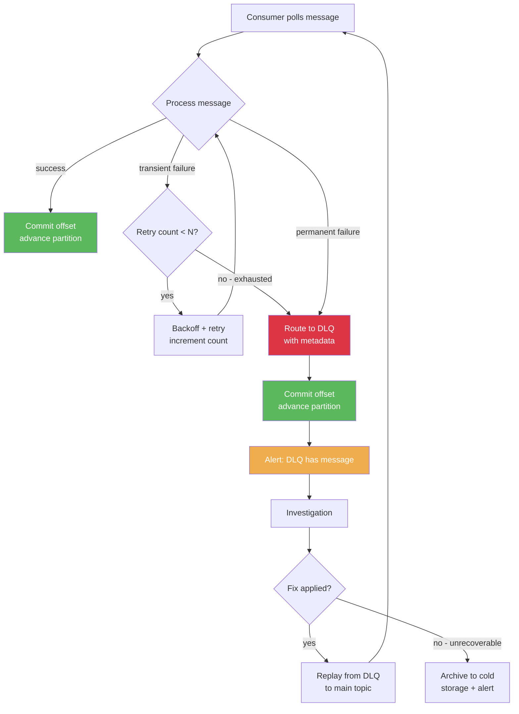

## Keywords in This File
{: .no_toc }

| # | Keyword | Weight |
|---|---|---|
| 1 | [Messaging Anti-patterns and Failure Recovery](#messaging-anti-patterns-and-failure-recovery) | medium |

---

# Messaging Anti-patterns and Failure Recovery

---

### 🎯 Model Answer

**30 seconds:**
> Messaging anti-patterns are design mistakes that create silent failures, performance degradation, or operational nightmares in production. The most critical ones: using a message queue as a database (storing permanent state in Kafka rather than a real database), fat messages (bloating events with all data rather than letting consumers fetch what they need), chatty messaging (fine-grained events that cause excessive consumer poll cycles), ignoring consumer idempotency (assuming messages are delivered exactly once when they are not), and missing dead letter queues (letting failed messages cause infinite retry loops).

**3 minutes (Senior):**
> Messaging anti-patterns are particularly dangerous because they often appear to work correctly in development and low-load production, then fail catastrophically at scale or during incidents. The anti-patterns I diagnose most often: treating the message broker as a database is the most architecturally damaging. Teams start relying on Kafka's retention for data that should be in a database - then discover Kafka's retention is cost-constrained, not permanent, and that querying Kafka for specific records is a full topic scan. Consumer idempotency gaps are the most operationally painful: teams assume at-most-once or exactly-once delivery without implementing it, then discover in production that rebalances, retries, and at-least-once delivery cause duplicate processing, resulting in double-charged customers, double-fulfilled orders, or inconsistent inventory. The schema coupling anti-pattern is the most insidious long-term: large, monolithic event schemas that couple producer internals to all consumers. When the producer team needs to refactor their domain model, they cannot change the event schema without coordinating with a dozen consumer teams. The fix: design events around business facts (order.placed, payment.captured), not around producer data models (order_record_updated_v7). Every anti-pattern I have fixed in production was cheaper to avoid at design time than to fix under production pressure.

**Framework:** WHAT -> WHY -> HOW -> TRADE-OFF -> EXAMPLE

*Adapting up:* Add: event storming as a technique to identify domain event boundaries, consumer contract testing, message versioning strategies for long-lived systems.

*Adapting down:* "Messaging anti-patterns are common mistakes in how services use message queues. The most important ones to avoid: do not use Kafka as a database, always handle duplicate messages, and always have a dead letter queue so failed messages do not block the whole system."

**Blank Mind Recovery:**
If you blank in the interview:

**(1) Restate:** "Messaging anti-patterns - let me walk through the most common design mistakes I have seen and their consequences."

**(2) First principles:** "A message queue is for communication, not storage. Events should represent facts, not data dumps. Consumers must be idempotent because at-least-once delivery is the default. Everything that can fail will fail - design for DLQ and retry."

**(3) Bridge:** "Most messaging anti-patterns come from treating messages like HTTP requests - synchronous, exactly-once, stateless. Messages are asynchronous, at-least-once, and stored. This difference drives different design requirements."

---

### 📘 Concept Explanation

**What it is:**
Messaging anti-patterns are recurring design and implementation mistakes that appear reasonable initially but cause serious production problems. They include architectural mistakes (wrong use of the broker), design mistakes (poorly scoped events), and implementation mistakes (missing idempotency, DLQ, monitoring).

**The problem it solves (by identifying):**
Each anti-pattern represents a category of production incidents: data loss (no DLQ), duplicate processing (missing idempotency), silent failures (no lag monitoring), scaling failures (Kafka as database), and maintenance crises (schema coupling). Knowing the anti-patterns allows engineers to design systems that avoid these failure categories.

**How it works (catalog of anti-patterns):**

**Anti-pattern 1: Kafka as a Database**
```
Symptoms:
- Services query specific messages by key 
  (full topic scans)
- Topic retention set to "forever" because
  data cannot be lost
- Business logic requires reading from offset 0
  to reconstruct state
  
Root cause: using Kafka for storage instead of
  communication

Fix: 
- Use an actual database for persistent state
- Kafka is for event communication (retention 
  = hours to days, not forever)
- For event sourcing: use a purpose-built event
  store (EventStoreDB, Axon) not raw Kafka
```

> **Code walkthrough:** This example demonstrates the core pattern in action. The key mechanism shows how the concept works in practice. Study the structure to understand the essential behavior and common usage.

**Anti-pattern 2: Missing Consumer Idempotency**
```
Symptoms:
- Double-charged customers after consumer restart
- Duplicate records in database after rebalance
- Inconsistent inventory counts

Root cause: at-least-once delivery + non-idempotent
  consumer processing

What happens:
1. Consumer processes message, writes to DB
2. Consumer commits offset -> crashes
3. On restart: offset is at previous position
4. Message is redelivered and processed again
5. Result: duplicate write

Fix:
- Use message ID as idempotency key
- Check-then-insert with unique constraint
- Deduplication table with TTL
```

> **Code walkthrough:** This example demonstrates the core pattern in action. The key mechanism shows how the concept works in practice. Study the structure to understand the essential behavior and common usage.

**Anti-pattern 3: Fat Messages / God Events**
```
Symptoms:
- Every consumer gets all order fields even
  though each needs only 2-3 fields
- Schema changes affect all consumers
- Message size exceeds broker message size limit
- High bandwidth cost

Root cause: designing events around data models
  not business facts

Example of fat event:
OrderUpdated {
  orderId, customerId, customerName, 
  customerEmail, customerAddress, 
  all 50 order fields,
  product details for all 50 line items,
  warehouse details, shipping details...
}

Fix: event carries enough context, not everything
OrderPlaced {
  orderId, customerId, totalAmount, placedAt
}
// Consumers fetch additional data if needed
// Or: event-carried state transfer with 
// only the fields needed by all consumers
```

> **Code walkthrough:** This example demonstrates the core pattern in action. The key mechanism shows how the concept works in practice. Study the structure to understand the essential behavior and common usage.

**Anti-pattern 4: No Dead Letter Queue**
```
Symptoms:
- Consumer in infinite retry loop
- Consumer lag growing because poison messages
  block all processing
- No visibility into failed messages

Root cause: treating processing failures as
  transient when they may be permanent

What happens:
1. Consumer receives malformed message
2. Processing throws exception
3. Consumer retries (backoff)
4. Same exception, retry again
5. Message blocks all messages behind it
   (in ordered partitions)
6. Lag grows indefinitely

Fix:
- After N retries: route to DLQ topic
- Alert on DLQ message count
- DLQ consumer for investigation and replay
```

> **Code walkthrough:** This example demonstrates the core pattern in action. The key mechanism shows how the concept works in practice. Study the structure to understand the essential behavior and common usage.

**Anti-pattern 5: Chatty Messaging**
```
Symptoms:
- Thousands of tiny event types
- Consumer spends more time polling than processing
- Event semantics unclear ("record_field_changed")

Root cause: events modeled at database column
  level instead of business event level

Example:
order_customer_name_changed
order_customer_email_changed  
order_line_item_quantity_updated
// vs business events:
order_customer_details_updated
order_line_items_adjusted
```

> **Code walkthrough:** This example demonstrates the core pattern in action. The key mechanism shows how the concept works in practice. Study the structure to understand the essential behavior and common usage.

**Anti-pattern 6: Missing Monitoring**
```
Symptoms:
- Consumer lag discovered after customer complaints
- No alert when messages are stuck in DLQ
- No alert when producer fails silently

Fix: monitor consumer lag per group per partition,
  DLQ depth, producer error rate, broker 
  under-replicated partitions
```

> **Code walkthrough:** This example demonstrates the core pattern in action. The key mechanism shows how the concept works in practice. Study the structure to understand the essential behavior and common usage.

**The key insight:**
Every messaging anti-pattern has a single root cause: treating the message broker as if it were a synchronous, exactly-once, strongly-consistent system. It is not. Design for the actual properties: async, at-least-once, eventually consistent.

**When anti-patterns are most dangerous:**
- Kafka as database: during data recovery and compliance audits
- Missing idempotency: after any consumer restart, rebalance, or redeployment
- No DLQ: during schema changes or downstream service outages
- Schema coupling: during team growth and system evolution

---

### 💻 Code Example

```java
// BAD: Anti-pattern - non-idempotent consumer
// (Kafka delivers at-least-once)
@KafkaListener(topics = "payment-events",
    groupId = "ledger-service")
public void onPaymentProcessed(
    PaymentProcessedEvent event) {
  // NO idempotency check!
  LedgerEntry entry = LedgerEntry.builder()
      .orderId(event.getOrderId())
      .amount(event.getAmount())
      .createdAt(Instant.now())
      .build();
  ledgerRepo.save(entry); // may run TWICE on redelivery
  // Result: customer charged twice in ledger
  // This will happen on every consumer restart,
  // rebalance, or broker redelivery
}
```

> **Code walkthrough:** At-least-once delivery means the same payment event can be delivered more than once - after a consumer restart, rebalance, or broker retry. Each delivery creates a new ledger entry. If the payment is delivered twice, the customer is recorded as paying twice. There is no duplicate check.

```java
// GOOD: Idempotent consumer with deduplication
@KafkaListener(topics = "payment-events",
    groupId = "ledger-service")
@Transactional
public void onPaymentProcessed(
    PaymentProcessedEvent event) {
  // Idempotency key: payment event ID (unique per event)
  String idempotencyKey = event.getEventId();
  
  // Check if already processed (in same transaction)
  if (processedEventRepo.existsById(idempotencyKey)) {
    log.info("Duplicate event ignored: {}",
        idempotencyKey);
    return; // Safe no-op on redelivery
  }
  
  // Process and mark as processed atomically
  LedgerEntry entry = LedgerEntry.builder()
      .orderId(event.getOrderId())
      .amount(event.getAmount())
      .paymentId(event.getPaymentId())
      .createdAt(Instant.now())
      .build();
  ledgerRepo.save(entry);
  
  // Mark event as processed within same transaction
  processedEventRepo.save(
      new ProcessedEvent(idempotencyKey,
          Instant.now()));
  // If transaction fails, neither save commits.
  // If transaction succeeds, both save atomically.
  // On redelivery: event already in processedEventRepo
  // -> return immediately
}
// Cleanup: processedEventRepo TTL = max(kafka retention,
//   consumer lag SLA) to prevent unbounded growth
```

> **Code walkthrough:** The idempotency key is the event's unique ID (generated by the producer - a UUID per event). The check-then-process-then-mark is wrapped in a transaction: either both the ledger entry and the processed event marker are saved, or neither is. On redelivery, the processed event record exists, so the consumer returns immediately without creating a duplicate ledger entry.

```java
// PRODUCTION: Anti-pattern detection - DLQ pattern
@Component
public class OrderEventConsumer {
  private final OrderService orderService;
  private final KafkaTemplate<String, Object> kafka;
  private static final int MAX_RETRIES = 3;

  @KafkaListener(topics = "order-events",
      groupId = "fulfillment-service")
  public void onOrderEvent(
      ConsumerRecord<String, OrderEvent> record,
      Acknowledgment ack) {
    int retryCount = getRetryCount(record.headers());
    try {
      orderService.process(record.value());
      ack.acknowledge();
    } catch (PermanentProcessingException e) {
      // Permanent failure: route to DLQ immediately
      routeToDlq(record, e, retryCount);
      ack.acknowledge(); // Ack to advance offset
    } catch (TransientProcessingException e) {
      if (retryCount >= MAX_RETRIES) {
        // Exhausted retries: route to DLQ
        routeToDlq(record, e, retryCount);
        ack.acknowledge();
      } else {
        // Re-enqueue with incremented retry count
        // (do NOT nack - that blocks the partition)
        Headers headers = incrementRetryCount(
            record.headers());
        kafka.send("order-events-retry",
            record.key(), record.value(), headers);
        ack.acknowledge();
      }
    }
  }

  private void routeToDlq(
      ConsumerRecord<String, OrderEvent> record,
      Exception e, int retryCount) {
    DlqMessage dlq = DlqMessage.builder()
        .originalTopic(record.topic())
        .originalPartition(record.partition())
        .originalOffset(record.offset())
        .payload(record.value())
        .error(e.getMessage())
        .retryCount(retryCount)
        .failedAt(Instant.now())
        .build();
    kafka.send("order-events-dlq",
        record.key(), dlq);
    log.error("Message routed to DLQ: key={}, "
        + "retries={}, error={}",
        record.key(), retryCount, e.getMessage());
  }
}
```

> **Code walkthrough:** The DLQ pattern separates transient failures (retry) from permanent failures (DLQ immediately) and from retry-exhausted messages (DLQ after N retries). Critically, the consumer always acknowledges the offset - it never NACKs in a way that blocks the partition. Failed messages are moved to the DLQ or retry topic, and the main partition advances. DLQ messages have enough metadata (original topic, partition, offset, error) to investigate and replay.

```java
// DEBUGGING: Detecting the "fat message" anti-pattern
// Check if events are carrying more data than needed

// Kafka consumer record size analysis
@Component
public class MessageSizeAnalyzer {
  @KafkaListener(topics = "order-events",
      groupId = "size-analyzer")
  public void analyze(
      ConsumerRecord<String, String> record) {
    int sizeBytes = record.serializedValueSize();
    if (sizeBytes > 10_000) { // 10KB threshold
      log.warn("Large message detected: "
          + "key={}, size={}KB, topic={}",
          record.key(), sizeBytes / 1024,
          record.topic());
      // Analyze what fields are present
      // Identify if all consumers actually use them
    }
  }
}
// Rule: most business events should be < 1KB
// Events > 10KB: likely anti-pattern, investigate
// Events > 100KB: almost certainly anti-pattern
```

> **Code walkthrough:** The fat message anti-pattern is diagnosed by measuring actual message sizes in production. Events routinely exceeding 10KB suggest that event design has drifted from business facts toward data dumps. The fix requires reviewing which fields each consumer actually uses and trimming the event to only what is universally needed, with consumers fetching specific additional data if required.

---

### 🎓 Answers by Seniority

**Junior / Mid (0-5 years):**
> "The most important messaging anti-patterns to avoid are: not making consumers idempotent, which causes duplicate processing when messages are redelivered; not having a dead letter queue, which means failed messages block the consumer forever; and using Kafka as a database by relying on its retention as permanent storage. Avoiding these three is essential for any production messaging system."

---

**Senior / Staff (5+ years):**
> "The anti-pattern I am most vigilant about in design reviews is missing idempotency, because the consequences are invisible in testing and catastrophic in production. At-least-once delivery is a fundamental property of message brokers. Any consumer that is not idempotent will produce incorrect results after any consumer restart, rebalance, or network hiccup. The question I always ask: if this consumer receives this message twice, what is the result? Double insertion, double charge, double inventory deduction? If the answer is anything other than 'same as processing once', the consumer needs idempotency logic. At Staff level, I also care deeply about the schema coupling anti-pattern. Events designed around internal data models create invisible coupling between teams. When a team needs to refactor their service, they discover their event schema has 20 consumers who all need to change simultaneously. Event schemas should represent business domain facts (order.placed, payment.authorized) not technical implementation details. This is an architectural decision that is very difficult to change after the fact."

---

### ⚠️ Common Misconceptions

**Misconception 1: "At-least-once means messages are almost always delivered exactly once."**
Reality: At-least-once means the guarantee is a lower bound - at least one delivery is guaranteed, but more than one delivery is possible. In production, redeliveries happen: consumer restarts, rebalances, broker leader elections, and network timeouts all trigger redelivery. Systems see duplicate delivery rates of 0.01-1% in normal operation, much higher during incidents. Every consumer must be idempotent or accept the consequences.

**Misconception 2: "Dead letter queues are for broken consumers - well-written consumers do not need DLQs."**
Reality: Well-written consumers need DLQs more, not less, because they handle errors explicitly and need somewhere to route unprocessable messages. Poison messages - malformed payloads, invalid schema versions, data violating business rules - can appear in any system. Without a DLQ, the options are: crash the consumer (blocking), skip the message (data loss), or retry forever (blocking). DLQs are the correct third option for messages that cannot be processed after retries.

**Misconception 3: "Using Kafka for permanent storage is fine if you set retention to 'infinite'."**
Reality: Kafka is optimized for sequential write and read throughput. It is not optimized for: point lookups by key (requires full partition scan or Kafka Streams state store), updates (immutable log - you must append a new record and compact), or complex queries (no indexes, no SQL). Setting retention to infinite makes the data permanent but makes the system expensive (storage cost) and slow (full scans). Use a proper database for persistent queryable state; use Kafka for event communication.

---

### 🚨 Failure Modes and Diagnosis

**Failure 1: Poison message blocking consumer partition**

Symptoms: Consumer lag growing on specific partitions. Consumer log shows repeated exception for the same message. Other partitions in the same topic are healthy.

Root cause: No DLQ configured. Consumer NACKs or retries indefinitely on a malformed message. This blocks all messages behind it on the same partition (ordered delivery).

Diagnosis:
```bash
# Check consumer group lag per partition
kafka-consumer-groups.sh \
  --bootstrap-server kafka:9092 \
  --describe --group my-service
# Look for: partition with high/growing lag
# while other partitions have low lag

# Find the specific offset being retried
# Check consumer logs for repeated exception
# grep "Error processing" consumer.log | 
#   tail -20
```

> **Code walkthrough:** This example demonstrates the core pattern in action. The key mechanism shows how the concept works in practice. Study the structure to understand the essential behavior and common usage.

Fix: add DLQ routing after N retries. For immediate recovery: use kafka-consumer-groups.sh to shift the consumer offset past the poison message (data loss - document the incident).

---

**Failure 2: Consumer duplicate processing on rebalance**

Symptoms: Duplicate records in database. Double-charged customers. Increased database unique constraint violations.

Root cause: Consumer processes messages and commits offset in separate transactions. Crash between processing and commit causes reprocessing.

Diagnosis:
```bash
# Check for unique constraint violations
# in application logs
grep "Duplicate entry\|unique constraint" app.log

# Check for consumer rebalance events
grep "Revoke\|Assign.*partitions" kafka.log
# Frequency of rebalance correlates with
# duplicate processing frequency
```

> **Code walkthrough:** This example demonstrates the core pattern in action. The key mechanism shows how the concept works in practice. Study the structure to understand the essential behavior and common usage.

Fix: make processing idempotent. Use a deduplication table with the message ID as the key. Commit the offset in the same transaction as the business write.

---

**Failure 3: Kafka retention as implicit database - data loss on cleanup**

Symptoms: Service cannot replay events older than retention period. Audit fails - events are missing. On-call alert: consumer cannot catch up because messages have been deleted.

Root cause: Service depended on Kafka retention for data permanence. Retention expired before the service consumed.

Diagnosis: Check topic retention configuration vs oldest consumed offset vs current time. If offset 0 is no longer available (log compaction or retention deleted it), the data is gone.

Fix: store important events in a database as events are consumed. Do not rely on Kafka retention as the only copy of important data.

---

### 🎯 Interview Deep-Dive

| Category | Expected Time | Minimum Questions |
|---|---|---|
| Definition | 2 min | 1-2 |
| Mechanism | 3 min | 2-3 |
| Comparison | 2 min | 1-2 |
| Scenario | 5 min | 2-3 |
| Debugging | 5 min | 2-3 |
| Deep Dive | 5 min | 2 |
| Misconception | 2 min | 1 |
| Scale | 3 min | 1-2 |
| Behavioral | 3 min | 1 |

#### Q1 - Definition
**"What is the 'fat message' anti-pattern and why is it a problem?"**

*What they are really asking:* Do you understand event design principles - specifically that events should represent business facts, not data models?

*What to say:*
> "Fat messages - also called god events - are messages that carry much more data than consumers need. Instead of an order.placed event with order ID, customer ID, total, and timestamp, you have a 50KB payload with all order fields, all line item details, all customer profile fields, and embedded product catalogs. Three problems: first, bandwidth and storage - every consumer group receives and stores all this data, regardless of which fields they use. Second, schema coupling - all consumers depend on the full schema. When the order service team refactors their data model, they must coordinate with every consumer team. Third, the event becomes ambiguous - is this an order.placed event or an order_record_updated event? Fat messages blur domain boundaries. The fix is events as business facts: enough context for the consumer to act (or to request additional data) but not the producer's full data model."

*What separates good from great:* Add: "The distinction between event notification and event-carried state transfer: notification events are thin (key + timestamp). ECST events include enough state for consumers to act without calling back. Both are legitimate. God events fail both: they are too large for notification and they carry data that only the producer understands."

---

#### Q2 - Mechanism
**"Explain exactly when and why a consumer produces duplicate records, with a specific code path."**

*What to say:*
> "The classic duplicate record path: the consumer calls poll(), receives 10 messages. It processes message 1, inserts a record into the database, moves to message 2. After processing all 10, it calls commitSync() to commit the offset. Between the last insert and commitSync(), the consumer crashes. On restart, the consumer fetches from the last committed offset - which was before processing these 10 messages. It receives the same 10 messages and processes them again. Each of the 10 inserts now runs twice. A subtler variant: the consumer commits the offset successfully, but the database write was not actually persisted (transaction isolation issue, database crash). On restart, the consumer sees the committed offset and assumes it processed successfully. The database does not have the records. This is the lost message (not duplicate) variant. The fix for both is atomic operation: commit the offset and the business write in the same transaction, or use idempotency to make replay harmless."

*What separates good from great:* Add: "There is a third path: message is processed, the Kafka consumer rebalances before commit (heartbeat timeout). The partition is assigned to another consumer instance. That instance also processes the same messages. Both instances commit the business write before either commits the offset. This is why consumer rebalance is the most common trigger for duplicate processing in production - more common than outright crashes."

---

#### Q3 - Comparison
**"Compare 'Kafka as a database' to proper event sourcing - what is the difference?"**

*What to say:*
> "Kafka as a database (the anti-pattern): developers rely on Kafka's topic retention as the permanent store. They read from offset 0 to reconstruct state. They depend on message timestamps for ordering. The problems: Kafka retention is time or size bounded. Point lookups require scanning. There are no indexes. Log compaction removes intermediate states. Proper event sourcing uses a purpose-built event store - EventStoreDB, or Axon's event store, or a database table optimized for sequential event reads. The event store: never deletes events (permanent), supports subscription from any position, provides optimistic concurrency for aggregate writes, and has event projection APIs. Kafka can be used as the transport for events between services, but the event source of truth for an aggregate lives in the event store. The common confusion: teams use Kafka's topic as their event store because it handles high throughput. This works until you need point-in-time queries, indefinite retention, or aggregate stream isolation."

*What separates good from great:* Add: "There is a valid use case for Kafka as an event log: append-only logs for analytics and audit where you only ever read sequentially and retention windows are acceptable. The mistake is using this for operational state that requires point lookups, complex queries, or permanent retention."

---

#### Q4 - Scenario
**"Review this design: services write audit events to Kafka with no DLQ, acks=1, no idempotency on the consumer. What risks do you identify?"**

*What to say:*
> "Three immediate risks: First, acks=1 means if the Kafka leader fails between write and replication, audit events are lost permanently. Audit logs are typically compliance-critical - you need to be able to prove what happened. Lost audit events create compliance liability. Fix: acks=all with min.insync.replicas=2. Second, no DLQ means any malformed audit event blocks the consumer partition indefinitely. One bad event from one service causes all audit events behind it to pile up unprocessed. Fix: add DLQ with retry limit. Third, no idempotency means consumer restarts and rebalances cause duplicate audit entries. Duplicate entries in an audit log are a compliance problem - auditors see the same event twice and question the log's integrity. Fix: use the event ID as an idempotency key, store in a deduplication table. I would also add: is there a retry topic with exponential backoff, or does the consumer retry immediately (creating a hot retry loop that saturates the consumer thread)?"

*What separates good from great:* Add: "The broader design concern: audit events written to Kafka by application services means every service's audit writes depend on Kafka availability. If Kafka is down, services cannot write audit events and may either fail (bad user experience) or silently drop audit events (compliance failure). Consider writing audit events to the application database first (as an outbox), then the outbox processor writes to Kafka. This decouples audit write durability from Kafka availability."

---

#### Q5 - Debugging
**"A consumer has been running for 3 months with no issues. After a deployment, it starts producing duplicate database records. What changed and how do you diagnose?"**

*What to say:*
> "Deployment as a trigger for duplicates narrows the cause: the deployment triggered a consumer rebalance. During rebalance, the consumer group restarts assignment and reprocesses messages from the last committed offset. If the deployment takes 30 seconds and the consumer committed offsets 10 seconds before the rebalance, those 10 seconds of messages are reprocessed. This is not new behavior - it was always happening, but the application had no duplicate records before the deployment. Something in the deployment changed the processing to be non-idempotent: a database unique constraint was removed, an upsert was changed to an insert, or a new code path was added that writes a new table without idempotency. Diagnosis: check the deployment diff - what changed in the consumer code. Check database logs for constraint violations during and after the deployment. Check consumer log for rebalance events around the time duplicates appeared. Fix: add idempotency to all consumer write paths, restore any removed unique constraints."

*What separates good from great:* Add: "Use the consumer group description to check if max.poll.interval.ms is close to the processing time per batch. If the deployment made processing slower (a new API call, a slow query path), processing may now exceed max.poll.interval.ms, causing rebalances mid-batch that trigger redelivery."

---

#### Q6 - Deep Dive
**"Explain the 'chatty messaging' anti-pattern and how it emerges from domain model events vs business events."**

*What to say:*
> "Chatty messaging emerges when events are modeled at the technical level (database row changed, field updated) rather than the business level (customer placed an order). Domain model events: order_status_field_updated, order_payment_reference_set, order_shipping_address_updated. These map directly to database operations. A business process like placing an order generates 5-10 domain model events. Consumers must subscribe to all 5-10 and maintain stateful aggregation to understand that an order was placed. Business events: order.placed, payment.authorized, order.shipped. One event per business fact. Consumers react to business facts directly. The chatty anti-pattern has four consequences: high message volume (5-10x more messages for the same business process), high consumer poll overhead (many small fetches vs fewer large ones), coupling to the producer's internal implementation (consumers depend on the sequence and structure of technical events), and inability to detect business intent (is this sequence of field updates a cancellation or a modification?). The fix is event storming - a collaborative workshop where domain experts and engineers identify the business events that matter, not the technical operations that implement them."

*What separates good from great:* Add: "Chatty messaging often coexists with the fan-out problem: a single microservice operation generates 10 events across 5 topics. This is not just a volume problem - it is a transaction consistency problem. If the service publishes events 1-9 and then fails before publishing event 10, consumers have an inconsistent view. Using the outbox pattern with a single atomic business event per operation prevents partial publication."

---

#### Q7 - Misconception
**"Our broker is Kafka with acks=all and transactions enabled - so we have exactly-once delivery and do not need idempotency in our consumers."**

*What to say:*
> "Kafka's exactly-once delivery (enabled via transactions and enable.idempotence=true) provides exactly-once within the Kafka system - from producer to broker. It prevents duplicate messages in the Kafka topic. But your consumer reads from Kafka and writes to an external system: a database, an API, a file system. Kafka does not control your database. The exactly-once guarantee ends at the consumer poll. If your consumer reads a message, writes to the database, and then crashes before committing the Kafka offset, the message is redelivered. Your database write happened. The Kafka exactly-once guarantee did not protect your database write. True end-to-end exactly-once requires idempotent consumer processing in addition to transactional Kafka. Kafka's transactions help with consume-transform-produce patterns within Kafka - writing the result of processing back to another Kafka topic within the same transaction. For any external write, you need application-level idempotency."

*What separates good from great:* Add: "There is a specific pattern where Kafka transactions do give you end-to-end exactly-once: consume from topic A, produce to topic B, commit both in one Kafka transaction. If the consumer crashes, Kafka rolls back the produce and the consumer reprocesses. The result in topic B is never duplicated. This only works when both input and output are Kafka topics - the standard use case in Kafka Streams."

---

#### Q8 - Behavioral
**"Tell me about a time you identified and fixed a messaging anti-pattern in production."**

*What to say (structure):*
> "SITUATION: A payment processing service was producing duplicate ledger entries. The rate was low - roughly 0.1% of all payments. But at our transaction volume of 500,000 payments per day, that was 500 duplicate entries per day causing reconciliation failures and occasional customer escalations. TASK: Identify the root cause and fix it without stopping payment processing. ACTION: First, I correlated the duplicates with consumer rebalance events in Kibana. The duplicates clustered in 30-second windows after deployments - exactly the rebalance window. The consumer was reading messages, writing to the ledger, and then committing offsets in a separate call. The gap between write and commit was the vulnerability window. Fix: I added an idempotency table with the Kafka message offset as the key (unique per partition + offset). Each write checks the table first, then writes both the ledger entry and the idempotency record in the same database transaction. RESULT: Zero duplicate entries in the 6 weeks since the fix. The idempotency table added 3ms to average processing time (negligible for payment events). I also added a metric alert for duplicate idempotency key attempts - which would detect if the same offset is delivered twice, useful for understanding how often Kafka actually redelivers."

*What separates good from great:* Add: "The hardest part was getting sign-off to deploy during business hours with payment processing live. I deployed the idempotency check as a log-only mode first (check but do not skip duplicates, just log them) for 24 hours to confirm the fix detected the anti-pattern. Then deployed in enforcement mode. This gave us confidence before the real fix went live."

---

#### Q9 - Scale
**"How does the 'Kafka as database' anti-pattern manifest differently at 1 million messages per day vs 1 billion per day?"**

*What to say:*
> "At 1 million messages per day (about 12 messages per second), Kafka as a database seems to work. Topics are small, reading from offset 0 takes seconds, retention cost is modest. At 1 billion per day (12,000 messages per second), the anti-pattern becomes operationally catastrophic. Replaying from offset 0 for a 1 billion message topic (at 1KB each = 1TB) takes hours - your consumer can never catch up for a cold start. Kafka log compaction keeps the latest record per key but removes intermediate events - this silently deletes business history. Storage cost at 1 billion messages per day with 7-day retention = 7TB per broker with replication factor 3 = 21TB total. At this scale, teams start reducing retention to control cost - and suddenly their 'database' is losing data. Point lookups for a specific order ID require scanning partitions (Kafka does not have a key-to-offset index). Schema evolution becomes a migration challenge - you cannot update all 1 billion historical records. These are all database problems that Kafka is not designed to solve."

*What separates good from great:* Add: "The solution at scale is not to abandon event history but to separate concerns properly. Use Kafka for event communication with practical retention (24-72 hours). Use a database (Postgres, Cassandra) for queryable operational state. Use a data warehouse or cold object storage (S3 + Athena) for long-term event history and analytics. Each system is used for what it is designed for."

---

#### Q10 - Deep Dive
**"What is the 'thundering herd' anti-pattern in messaging and how do you prevent it?"**

*What to say:*
> "The thundering herd in messaging occurs when a large backlog of messages is suddenly made available to consumers, or when all consumers restart simultaneously and flood the broker with connection requests. Scenario 1: consumer group is paused for 6 hours during maintenance. When it resumes, 6 hours of accumulated messages become available simultaneously. All consumer instances start fetching maximum records at maximum rate. The broker must serve fetch requests from all partitions at once, downstream services (database, APIs) receive a sudden burst of requests, and any rate limiting or connection pools are exhausted. Scenario 2: a deployment rolls out all consumer instances simultaneously (not rolling). All instances disconnect, rebalance, and reconnect at the same time. The broker handles a connection storm plus a rebalance on all consumer groups simultaneously. Prevention for scenario 1: implement consumer rate limiting and circuit breakers on downstream resources. Use fetch.max.bytes and max.poll.records to limit the rate of consumption when catching up from a large backlog. Consider a dedicated 'catchup mode' configuration. For scenario 2: rolling deployments for consumer services - restart one instance at a time to avoid a simultaneous full-group rebalance."

*What separates good from great:* Add: "A specific prevention: add a short random startup delay (100-500ms) when consumer instances start. This staggers the connection storm across the broker. Combined with rolling deployments, this prevents a thundering herd from ever forming."

---

#### Q11 - Comparison
**"Compare the DLQ pattern to infinitely retrying a failed message. What are the trade-offs?"**

*What to say:*
> "Infinite retry: the consumer retries the failed message indefinitely with exponential backoff. The message is never lost. Eventually the root cause is fixed (the downstream service comes back, the schema is updated) and the message processes successfully. Trade-off: the message blocks all messages behind it on the same partition during the retry window. If the root cause takes 4 hours to fix, that partition has 4 hours of lag. Other partitions continue normally. Also: infinite retry consumes consumer thread time and masks the root cause if not properly alerted on. DLQ pattern: after N retries, the message is moved to a dead letter topic. The main partition advances. Lag does not grow due to this message. The DLQ message is available for investigation and replay when the root cause is fixed. Trade-off: messages in the DLQ are not automatically reprocessed - someone must monitor the DLQ, identify the fix, and replay the messages. This requires operational discipline. For ordered partitions (messages must be processed in order), the choice is harder: moving a message to DLQ and advancing the offset means subsequent messages process out-of-order relative to the DLQ message. For topics where strict ordering matters, infinite retry is often the correct choice. For topics where message ordering is not critical, DLQ with a retry queue is better."

*What separates good from great:* Add: "A hybrid approach: immediate DLQ for permanent failures (schema mismatch, permanently invalid data), and a retry topic with exponential backoff (5s, 30s, 5min, 1hr) for transient failures. The retry topic re-delivers to the main consumer after the backoff period. After exhausting the retry schedule, the message goes to DLQ. This avoids blocking the partition while giving transient failures time to self-resolve."

---

#### Q12 - Edge Case
**"What happens when a DLQ consumer itself has a failure? How do you prevent infinite DLQ recursion?"**

*What to say:*
> "DLQ recursion is a real risk: if the DLQ consumer processes a message, fails, and routes it to another DLQ, and that DLQ consumer also fails, you can end up with a chain of DLQ topics. Prevention: DLQ consumers should not have a DLQ. A DLQ consumer's job is to: log the failure for investigation, store the message in a database for manual review, alert on-call engineers, and optionally replay the message later via a separate mechanism. If a DLQ consumer fails, it should log the exception and alert, then commit the offset (losing the DLQ record) or pause and alert rather than recursing. The pattern I use: DLQ consumer writes to a relational database table (message_dead_letters) with the message content and failure context. If the database write fails, it alerts loudly and stops consuming (circuit breaker open). Manual review and replay from the database table is done by operations tooling, not by another Kafka consumer chain."

*What separates good from great:* Add: "Track a hop count header in messages. Each DLQ routing increments the hop count. If the hop count exceeds 3, the message is written directly to cold storage (S3) and an alert is raised - it never enters another Kafka topic. This hard stops any infinite recursion and provides a permanent record for later analysis."

---

### ⚖️ Comparison Table

| Anti-pattern | Root Cause | Production Impact | Fix Priority |
|---|---|---|---|
| Missing idempotency | Assumption of exactly-once | Duplicate processing, data corruption | Critical |
| No DLQ | Assumption of always-processable | Partition blocking, cascading lag | Critical |
| Kafka as database | Misusing retention as storage | Data loss on retention expiry | High |
| Fat messages | Data-model-driven event design | Schema coupling, bandwidth cost | Medium |
| Chatty messaging | Technical events vs business events | High volume, consumer complexity | Medium |
| No monitoring | Assumed reliability | Lag discovered via customer complaint | High |

**The deciding factor:** Idempotency and DLQ are non-negotiable for any production messaging system. All other anti-patterns are design quality concerns.

---

### 🏛️ System Design

**Design a resilient order event processing system that eliminates the top messaging anti-patterns.**

```
RESILIENT MESSAGING DESIGN

Producers (order-service):
+------------------+
| Order Service    |
| - Outbox pattern |---> +------------------+
| - Avro schema    |     | order-events     |
| - acks=all       |     | (30 partitions)  |
| - idempotent=true|     | acks=all         |
+------------------+     | RF=3             |
                         | min.insync=2     |
                         +------------------+
                              |
              +---------------+---------------+
              |               |               |
  +----------v--+    +-------v----+   +------v------+
  | Inventory   |    | Payment    |   | Notification|
  | Consumer    |    | Consumer   |   | Consumer    |
  | - idempotent|    | - idempotent    | - idempotent|
  | - DLQ after |    | - DLQ after|   | - DLQ after |
  |   3 retries |    |   3 retries    |   3 retries |
  +------+------+    +------+-----+   +------+------+
         |                  |                |
  +------v------+    +------v-----+   +------v------+
  | inventory   |    | payment    |   | notif-dlq   |
  | -events-dlq |    | -events-dlq|   |             |
  +------+------+    +------+-----+   +------+------+
         |                  |                |
         +------------------+----------------+
                            |
                   +--------v-------+
                   | DLQ Monitor    |
                   | - Alert on     |
                   |   DLQ growth   |
                   | - Store in DB  |
                   | - Replay tool  |
                   +----------------+

Monitoring:
- Consumer lag per group: alert at lag > 10,000
- DLQ depth: alert at > 0 (every failure is notable)
- Producer error rate: alert at > 0.01%
- Rebalance frequency: alert at > 3/hour
```

> **Code walkthrough:** This example demonstrates the core pattern in action. The key mechanism shows how the concept works in practice. Study the structure to understand the essential behavior and common usage.

**Key design decisions:**
1. Outbox pattern prevents lost events at the producer
2. Idempotent consumers prevent duplicate processing
3. DLQ per consumer group prevents partition blocking
4. Centralized DLQ monitor for investigation and replay
5. Schema registry with BACKWARD_TRANSITIVE prevents schema anti-patterns
6. Monitoring is a first-class design requirement, not an afterthought

---

### 📊 Diagram

```
ANTI-PATTERN: Partition blocked by poison message

Topic partition:  [msg1][msg2][POISON][msg4][msg5]
Consumer:          OK    OK    FAIL    ---   ---
                               ^
                          retry forever
                          lag grows
                          msgs 4,5 stuck

GOOD PATTERN: DLQ routing - partition advances

Topic partition:  [msg1][msg2][POISON][msg4][msg5]
Consumer:          OK    OK    FAIL(3x) OK    OK
                               |
                          [DLQ topic]
                          investigated
                          replayed when fixed
```



> **Diagram walkthrough:** The DLQ routing flow shows the three paths from message processing: success (commit and advance), transient failure (retry with backoff up to N times, then DLQ), and permanent failure (DLQ immediately). The critical property in both failure paths is that the offset is committed after routing to DLQ, so the partition advances and subsequent messages are not blocked. The DLQ message retains all metadata needed for investigation and replay. The replay path feeds back into the main consumer loop, allowing fixed messages to be reprocessed with the same idempotency protection as original messages.

---

### 💻 Code Example

*(Omit: this concept does not have a programmatic interface that can be demonstrated in code. The conceptual explanation above is sufficient.)*


---

### 🏛️ System Design

*(Omit: system design diagram not applicable for this concept - see ★★★ keywords for full system design coverage.)*


---

### ⚖️ Comparison Table

*(Omit: this is a ★☆☆ foundational concept with no direct alternatives to compare - see higher-difficulty keywords for trade-off analysis.)*


---

### 📊 Diagram

*(Omit: no standalone visual diagram required for this concept - the explanations and code examples above provide sufficient clarity.)*


