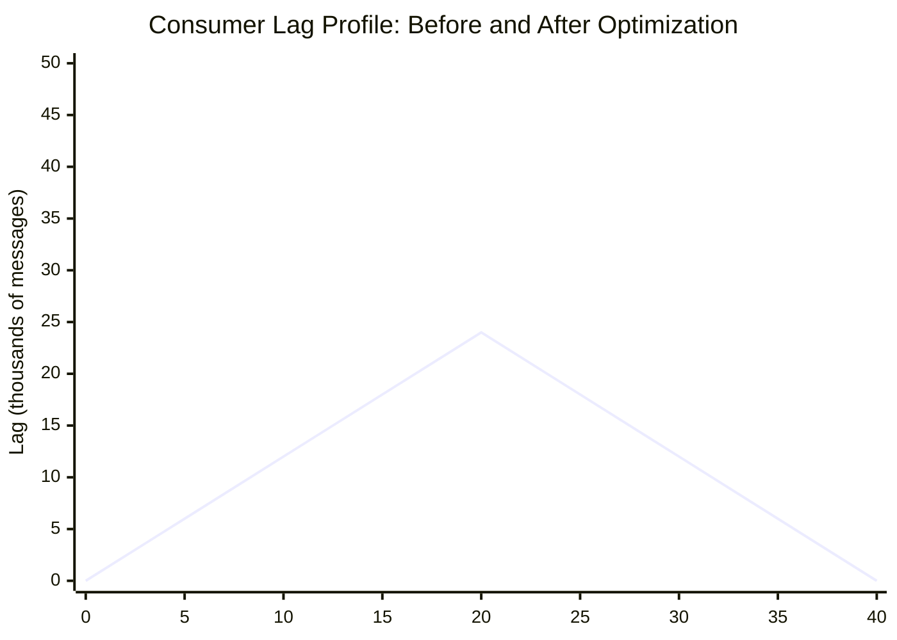

# Consumer Lag Management and Diagnosis

---

### 🎯 Model Answer

**30 seconds:**
> Consumer lag is the difference between the latest offset produced to a partition and the current committed offset of a consumer group. Lag measures how far behind consumers are from the latest messages. Lag is healthy when it is stable (consumers keeping up with producers). Lag is a problem when it is growing (consumers falling behind). Diagnosing growing lag requires determining whether the bottleneck is consumer processing speed, consumer scaling limits (partition count ceiling), or upstream spikes beyond steady-state throughput. The fix is almost always faster or more parallel consumer processing, not Kafka-side tuning.

**3 minutes (Senior):**
> Consumer lag management is one of the most operationally important skills for teams running Kafka in production, because lag is the leading indicator of consumer health before downstream systems fail. A consumer group with growing lag will eventually be so far behind that it loses relevance - it processes events that are hours old, making business reactions useless. The diagnostics I always perform when lag is growing: first, compare the production rate (messages/second into the topic) with the consumption rate (messages/second processed by the consumer group). If production rate exceeds consumption rate, lag grows. Second, determine why consumption is slow: is it CPU-bound processing? IO-bound (database writes)? Network-bound (downstream API calls)? Each has a different fix. Third, check partition count vs consumer instance count. If you have 4 partitions and 8 consumer instances, 4 consumers are idle - you cannot increase parallelism without increasing partitions. The fix for CPU/IO-bound processing is almost always one of: add more consumer instances (up to partition count), optimize the processing logic (cache lookups, batch database writes), or increase partition count and add more consumers. What I want to communicate in an interview is that I treat lag as a system health metric, not just a Kafka metric - growing lag in an inventory consumer means your inventory view is increasingly stale, which is a business problem, not just an infrastructure metric.

**Framework:** WHAT -> WHY -> HOW -> TRADE-OFF -> EXAMPLE

*Adapting up:* Add: KEDA for lag-driven autoscaling, lag-aware circuit breakers, priority consumer lanes for critical consumer groups.

*Adapting down:* "Consumer lag is how far behind your service is from the latest messages. Like being 100 emails behind in your inbox - you are not keeping up. To catch up, you either read faster (process messages faster) or you get more people reading (more consumer instances)."

**Blank Mind Recovery:**
If you blank in the interview:

**(1) Restate:** "Consumer lag - let me think through what it measures and what causes it to grow."

**(2) First principles:** "Lag = latest offset - consumer offset. Lag grows when production rate > consumption rate. To fix: increase consumption rate or decrease production rate. Consumption rate = processing speed per consumer * number of consumers. If processing is slow, optimize it. If parallelism is limited by partition count, add partitions."

**(3) Bridge:** "Think of it like a queue at a supermarket checkout. Lag is the queue length. It grows when customers arrive faster than checkout completes. Solutions: faster checkout per lane (optimized processing), more lanes (more consumers), or more checkout terminals (more partitions)."

---

### 📘 Concept Explanation

**What it is:**
Consumer lag is the metric that quantifies how far a consumer group is behind the latest messages in a topic. Formally: `lag = max_offset_produced - consumer_committed_offset` per partition. Total group lag is the sum across all partitions. Lag represents both the count of unprocessed messages and (if production rate is known) the time delay in message processing.

**The problem it solves:**
Consumer lag provides the earliest warning that a consumer group cannot keep up with production. Before lag, the only indicator of consumer health was application-level errors or downstream system staleness - by which time the consumer may be hours behind. Lag monitoring enables proactive response before business impact.

**How it works:**

Lag calculation:
```
Topic: order-events
Partition 0:
  Log end offset (latest produced): 1,050,000
  Consumer group offset (committed): 1,045,000
  Partition lag: 5,000 messages

Partition 1:
  Log end offset: 1,048,000
  Consumer group offset: 1,047,500
  Partition lag: 500 messages

Total consumer group lag: 5,500 messages

Lag rate of change:
  T=0:   lag = 5,500
  T=60s: lag = 6,200
  Lag growth rate: +700/minute
  
  Production rate - consumption rate
  = 700 messages/minute excess production
  At this rate: lag doubles in ~8 minutes
```

Consumer throughput calculation:
```
Consumer throughput (messages/sec):
  = processing_time_per_message (ms) / 1000
    * parallelism_factor

Example: 
  10ms to process each message
  1 consumer thread
  Throughput = 100 messages/second = 6,000/minute

  If production rate = 7,000/minute:
  Lag grows at 1,000/minute (cannot keep up)

  Fix option 1: reduce processing time to 8ms
    Throughput = 7,500/minute (now keeping up)
  
  Fix option 2: add 2nd consumer (2nd partition needed)
    Throughput = 12,000/minute (easily keeping up)
```

Lag categories:
```
Stable lag (healthy):
  Lag is constant or oscillating within a range.
  Consumers keep up on average.
  Small lag is normal (brief production bursts).

Growing lag (warning):
  Lag increases monotonically.
  Production rate > consumption rate.
  Action required before lag grows too large.

Spike + recovery (transient):
  Lag spikes during a traffic burst,
  then consumers catch up when burst subsides.
  Normal if recovery is fast enough.

Stuck lag (critical):
  Lag grows rapidly or consumer stops committing.
  Often: poison message, consumer crash loop,
  or external dependency outage.
```

**The key insight:**
Lag is a symptom. The cause is always one of: (1) production rate exceeds consumption capacity, (2) consumer processing is slow, (3) consumer is blocked (poison message, dependency down). Treating the symptom (restarting consumers) without fixing the cause will recur.

**When to use it:**
- Monitor consumer lag for every consumer group in production
- Alert on lag growth rate, not just absolute lag
- Use lag as the primary SLA metric for event-driven consumer services

**When NOT to use it:**
- Do not alert on lag alone - a high but stable lag from a batch consumer is healthy
- Do not assume lag=0 is always the target - some consumers intentionally trail (replay scenarios, scheduled batch processing)

**Alternatives:**
- Consumer lag can be measured via Kafka JMX metrics, Prometheus Kafka exporter, or the Kafka Admin API
- Lag-based autoscaling: KEDA scales consumer pod count based on consumer group lag

**First-principles derivation:**
Consumer lag = integral of (production rate - consumption rate) over time. If production rate >= consumption rate continuously, lag grows unboundedly. The only sustainable state is production rate <= consumption rate on average (allowing for transient bursts). Consumer capacity = processing_speed * consumer_count. If consumer_count is at the partition count ceiling and processing speed is maximized, you need more partitions.

---

### 💻 Code Example

```java
// BAD: Consumer with blocking synchronous call per message
@KafkaListener(topics = "order-events",
    groupId = "inventory-service")
public void onOrderCreated(OrderCreatedEvent event) {
  // Each message makes a synchronous HTTP call
  // HTTP call: 100-500ms each
  // Throughput: 2-10 messages/second per consumer
  // 
  CustomerDetails customer =
      customerApiClient.getCustomer(
          event.getCustomerId()); // 200ms HTTP call
  
  InventoryReservation reservation =
      inventoryService.reserve(
          event.getOrderId(),
          event.getItems()); // 50ms DB call

  notificationService.notify(
      customer.getEmail(),
      reservation); // 150ms HTTP call
  
  // Total: 400ms per message = 2.5 messages/second
  // If production rate = 100 messages/second:
  // Need 40 consumer instances for same throughput!
  // (100 messages/s / 2.5 messages/s per consumer)
}
```

> **Code walkthrough:** Each message triggers 3 blocking calls totaling 400ms. This consumer can process 2.5 messages/second. If the topic receives 100 messages/second, you need 40 consumers - but if the topic has only 30 partitions, you can never have more than 30 active consumers. Lag will grow indefinitely. The bottleneck is not Kafka; it is the per-message synchronous call chain.

```java
// GOOD: Optimized consumer with caching and batching

@Component
public class InventoryEventConsumer {
  // Cache customer data: customers change infrequently
  @Autowired
  private LoadingCache<String, CustomerDetails>
      customerCache; // Caffeine, TTL=5min

  @KafkaListener(topics = "order-events",
      groupId = "inventory-service",
      containerFactory = "batchKafkaListenerFactory")
  @Transactional
  public void onOrderBatch(
      List<ConsumerRecord<String, OrderCreatedEvent>>
          records) {
    // Batch: receive up to 50 records per poll
    
    // Step 1: Collect unique customer IDs
    Set<String> customerIds = records.stream()
        .map(r -> r.value().getCustomerId())
        .collect(Collectors.toSet());
    
    // Step 2: Cache lookup (no HTTP for cached items)
    Map<String, CustomerDetails> customers =
        customerCache.getAll(customerIds);
    // Only uncached IDs trigger HTTP calls
    // Cache hit rate: typically 80-95%
    
    // Step 3: Batch inventory reservation
    List<ReservationRequest> requests = records
        .stream()
        .map(r -> new ReservationRequest(
            r.value().getOrderId(),
            r.value().getItems()))
        .collect(Collectors.toList());
    
    inventoryService.reserveBatch(requests);
    // 1 DB call for 50 messages vs 50 DB calls
    // 10ms batch vs 50*50ms = 2500ms sequential
    
    // Step 4: Batch notifications (fire and forget)
    notificationQueue.addAll(/* ... */);
    
    // Throughput improvement:
    // Sequential: 2.5 messages/second
    // Batched: ~200-500 messages/second
  }
}
```

> **Code walkthrough:** Batch processing changes the throughput from 2.5 to 200+ messages/second. The customer cache eliminates most HTTP calls. The batch DB insert processes 50 records in one call versus 50 sequential calls. Notifications are queued asynchronously, removing 150ms from the critical processing path. Same 30 partitions, same 30 consumers, but 80-200x more throughput.

```bash
# PRODUCTION: Diagnosing and monitoring consumer lag

# 1. Check current lag (CLI)
kafka-consumer-groups.sh \
  --bootstrap-server kafka:9092 \
  --describe --group inventory-service

# Output:
# GROUP              TOPIC         PARTITION  
#   CURRENT-OFFSET  LOG-END-OFFSET  LAG
# inventory-service  order-events  0
#   1045000         1050000         5000
# inventory-service  order-events  1
#   1047500         1048000         500
# inventory-service  order-events  2
#   1049800         1049900         100

# 2. Monitor lag over time (programmatic)
# Use Kafka AdminClient to get consumer group offsets:
```

```java
// Programmatic lag monitoring
@Component
@Slf4j
public class ConsumerLagMonitor {
  private final AdminClient adminClient;
  private final MeterRegistry meterRegistry;

  @Scheduled(fixedDelay = 10000)
  public void monitorLag() {
    Map<String, ConsumerGroupDescription> groups =
        adminClient.describeConsumerGroups(
            List.of("inventory-service"))
            .all().get();

    Map<TopicPartition, OffsetAndMetadata> offsets =
        adminClient.listConsumerGroupOffsets(
            "inventory-service")
            .partitionsToOffsetAndMetadata().get();

    Map<TopicPartition, ListOffsetsResult.
        ListOffsetsResultInfo> endOffsets =
        adminClient.listOffsets(
            offsets.keySet().stream().collect(
                Collectors.toMap(tp -> tp,
                    tp -> OffsetSpec.latest())))
            .all().get();

    offsets.forEach((tp, offset) -> {
      long lag = endOffsets.get(tp).offset()
          - offset.offset();
      meterRegistry.gauge(
          "kafka.consumer.group.lag",
          Tags.of("topic", tp.topic(),
              "partition",
              String.valueOf(tp.partition()),
              "group", "inventory-service"),
          lag);
      if (lag > 100_000) {
        log.warn("High lag: topic={}, "
            + "partition={}, lag={}",
            tp.topic(), tp.partition(), lag);
      }
    });
  }
}
```

> **Code walkthrough:** Programmatic lag monitoring publishes per-partition lag as a Prometheus gauge. Alerting on `kafka.consumer.group.lag > 100000` and also on the rate-of-change (lag growing for 5+ minutes) provides both threshold and trend alerting. This runs every 10 seconds to detect lag spikes quickly.

---

### 🎓 Answers by Seniority

**Junior / Mid (0-5 years):**
> "Consumer lag is how many messages behind a consumer group is from the latest messages in a topic. It is calculated as the log end offset minus the consumer's committed offset for each partition. Lag that is stable (staying constant) is healthy - the consumer is keeping up. Lag that is growing is a problem. The most common causes: the consumer is processing messages too slowly, or there are not enough consumer instances. The fix is either to make the consumer process messages faster or to add more consumer instances (up to the number of partitions in the topic)."

---

**Senior / Staff (5+ years):**
> "Consumer lag is the primary health metric I track for any event-driven service, because lag growth is the leading indicator of cascading failures. When lag grows in an inventory consumer, the inventory view becomes stale - the service is making decisions based on data that is hours old. The diagnostic process I always follow: first, compare production rate versus consumption rate to confirm lag is growing, not just high. Second, profile the consumer processing to identify the bottleneck - is it CPU (computation), IO (database writes), or network (downstream API calls)? Third, check partition count versus active consumer count. Fourth, look at whether the bottleneck is in Kafka (fetch rate) or in the consumer (processing rate) by comparing consumer fetch-rate metrics versus records-consumed-rate. In my experience, the bottleneck is almost never in Kafka - it is almost always in the consumer's processing logic. The highest-impact fix is usually caching expensive lookups and batching database writes, which can increase consumer throughput by 10-100x without adding any infrastructure."

---

### ⚠️ Common Misconceptions

**Misconception 1: "Consumer lag should always be 0 - any lag means something is wrong."**
Reality: Lag of 0 means consumers are processing messages as fast as they arrive. Some lag is normal during production bursts. Batch consumers intentionally trail (they run hourly and catch up). The relevant metric is lag rate of change: growing lag is unhealthy; stable or decreasing lag is healthy. Alert on trend, not absolute value.

**Misconception 2: "Adding more consumers will fix growing lag."**
Reality: Consumer parallelism is bounded by partition count. If you have 10 partitions and 10 consumers, adding an 11th consumer does nothing - it will be idle. The only way to increase consumer parallelism beyond partition count is to increase partitions (an operational change that requires careful planning). Adding consumers helps when consumer count < partition count. When consumer count = partition count, the fix must be faster per-consumer processing.

**Misconception 3: "Consumer lag only matters for real-time consumers."**
Reality: Lag matters for any consumer whose output is time-sensitive. Inventory consumers, fraud detection consumers, recommendation engine consumers - all suffer when they are significantly behind. Even batch consumers have lag SLAs: if a batch consumer must process all events within 1 hour, growing lag that exceeds 1 hour of production volume is a breach of the SLA.

---

### 🚨 Failure Modes and Diagnosis

**Failure 1: Lag grows to millions of messages - consumers cannot catch up**

Symptoms: Consumer lag growing at a rate that would take days to drain. Normal consumer count cannot catch up.

Root cause: Production volume permanently exceeded consumer capacity. Or: a consumer outage allowed massive lag to accumulate; now the catch-up requires processing faster than the normal production rate simultaneously.

Diagnosis:
```bash
# Check production rate
kafka-consumer-groups.sh --bootstrap-server \
  kafka:9092 --describe --group TEMP_GROUP
# or check producer metrics:
# kafka_producer_record_send_rate

# Calculate required consumers:
# needed = production_rate / throughput_per_consumer
# If needed > partition_count: must optimize processing
```

Fix: optimize consumer processing (caching, batching), increase partition count to allow more parallelism, and add consumers up to partition count. For the catch-up window: deploy a dedicated catch-up consumer with higher max.poll.records and optimized processing, then switch back to normal consumer configuration once lag is drained.

---

**Failure 2: Consumer lag stops growing but never drains (stuck near 0 growth)**

Symptoms: Lag is constant at a high value (e.g., 500,000 messages). Consumer appears healthy (no errors). But lag never decreases.

Root cause: Consumers are processing at exactly the same rate as production. They are not falling behind but they also never catch up. Common cause: after a previous lag spike, consumers came back at normal pace but the backlog remains.

Diagnosis: Check if production rate == consumption rate by monitoring both metrics for 10 minutes. If equal, consumers need temporary burst capacity.

Fix: temporarily add more consumer instances (beyond normal capacity) to drain the backlog. Consumer count exceeds partition count? Consumers will be uneven but parallelism is still limited to partition count. Use autoscaling or manual scaling with a planned drain window.

---

**Failure 3: Consumer lag is 0 but consumer group shows members as empty**

Symptoms: Consumer group lag is 0, but no active members in the group. Consumers appear to have stopped.

Root cause: Consumer group has been deleted or the consumer instances are not running. Lag=0 because there are no committed offsets being tracked (not because consumers processed everything).

Diagnosis:
```bash
kafka-consumer-groups.sh \
  --bootstrap-server kafka:9092 \
  --describe --group my-service
# Output: "Consumer group 'my-service' has no active members."
# or: no output at all if group was deleted

# Check if consumer processes are running
kubectl get pods -l app=my-service
```

Fix: restart consumer instances. On startup, the consumer group will resume from the last committed offset (if the offset still exists in the __consumer_offsets topic) or start from auto.offset.reset policy.

---

### 🎯 Interview Deep-Dive

| Category | Expected Time | Minimum Questions |
|---|---|---|
| Definition | 2 min | 1-2 |
| Mechanism | 3 min | 2-3 |
| Comparison | 2 min | 1-2 |
| Scenario | 5 min | 2-3 |
| Debugging | 5 min | 2-3 |
| Deep Dive | 5 min | 2 |
| Misconception | 2 min | 1 |
| Scale | 3 min | 1-2 |
| Behavioral | 3 min | 1 |

#### Q1 - Definition
**"What is consumer lag and what does it indicate about system health?"**

*What to say:*
> "Consumer lag is the count of messages that have been produced to a topic but not yet processed by a consumer group. It is calculated per partition: log end offset (latest produced offset) minus the consumer group's committed offset. Total lag is the sum across all partitions. Lag indicates: how fresh the consumer's view of the data is (high lag = stale data), whether consumers are keeping up with producers (stable lag = healthy, growing lag = bottleneck), and how much backlog exists to process (critical after an outage when consumers restart). A consumer with zero lag processes messages within milliseconds of production. A consumer with 1 million messages lag on a 100 messages/second topic is 10,000 seconds (2.7 hours) behind. The business implication: if that consumer is the inventory service, your inventory view is 2.7 hours stale."

*What separates good from great:* Add: "I monitor lag per consumer group per partition, not just total lag. Uneven lag across partitions reveals hot partitions (one partition receiving disproportionate message volume) or dead consumers (one consumer instance failed, its partitions are assigned to others with less capacity)."

---

#### Q2 - Mechanism
**"How does Kafka calculate consumer lag internally?"**

*What to say:*
> "Kafka does not calculate lag directly - it exposes the two values needed to calculate it. The log end offset per partition is tracked by the partition leader. It is the offset of the last message appended to the log. The consumer committed offset is stored in the internal __consumer_offsets topic. Kafka brokers provide this via the Consumer Group API. To calculate lag: fetch the latest offsets (OffsetSpec.LATEST) for each partition via ListOffsets API, fetch the committed offsets via ListConsumerGroupOffsets API, subtract committed from latest per partition. Tools like kafka-consumer-groups.sh, Kafka Exporter for Prometheus, and Confluent Control Center do this automatically. The critical implementation detail: the __consumer_offsets topic stores committed offsets. Offsets are committed by the consumer, not automatically. If a consumer crashes without committing, the lag calculation does not reflect the uncommitted progress - the next consumer will start from the last committed position and re-process."

*What separates good from great:* Add: "There is a nuance with consumer group rebalancing. During a rebalance, no offsets are committed and partitions are reassigning. The lag calculation may temporarily show incorrect values. Monitoring systems should account for this by smoothing lag values during known rebalance windows."

---

#### Q3 - Comparison
**"Compare consumer lag monitoring via JMX vs Prometheus vs the Kafka Admin API."**

*What to say:*
> "JMX: Kafka exposes consumer group metrics via JMX at kafka.consumer:type=consumer-fetch-manager-metrics. These are per-instance metrics (each consumer instance reports its own lag) rather than per-group metrics. You need to aggregate across all instances to get total group lag. JMX access requires JMX port exposure and a JMX exporter to bridge to Prometheus. Prometheus (via kafka-exporter): the Kafka Exporter project polls the Kafka Admin API and exposes lag as Prometheus metrics (kafka_consumergroup_lag, kafka_consumergroup_lag_sum). This is the most common production setup. The exporter queries the Admin API directly without needing JMX. Kafka Admin API (programmatic): the most flexible and accurate. You can query lag with the exact consumer groups and topics you care about, at the frequency you need. This is what all monitoring tools use underneath. Use this when you need lag in your application code (e.g., autoscaling decisions, health checks)."

*What separates good from great:* Add: "KEDA (Kubernetes Event-Driven Autoscaling) uses the Kafka Admin API to scale consumer pod count based on lag. When lag grows beyond a threshold, KEDA increases replicas. When lag drains, KEDA scales down. This is the production-grade approach to lag management - automated rather than manual."

---

#### Q4 - Scenario
**"Your inventory service consumer lag is growing at 10,000 messages per minute. You have 8 consumer instances and 8 partitions. Production rate is 15,000 messages per minute. How do you recover?"**

*What to say:*
> "Lag grows at 10,000 messages per minute: production 15,000 - consumption 5,000 = 10,000 deficit per minute. Currently: 8 consumers for 8 partitions = maximum parallelism already reached. Adding more consumer instances does nothing (partition count ceiling). The problem is per-consumer throughput: 5,000 messages/minute / 8 consumers = 625 messages/minute per consumer. That is only 10 messages per second per consumer - very slow. Diagnosis: profile one consumer instance. What is the processing time per message? Likely a slow database write or API call. Investigation steps: (1) check consumer processing time metrics - average time in onMessage handler, (2) check if there is a slow downstream dependency - database latency metrics, external API call metrics. Likely fix: the consumer is making one database write per message. Change to batch insert: accumulate 50-100 messages per poll and insert in one batch call. This typically increases throughput 5-20x. With 10x improvement: each consumer processes 100 messages/second = 800 messages/second total = 48,000 per minute - well above production rate. Recovery time: lag will drain at 48,000 - 15,000 = 33,000 messages per minute, draining existing backlog within minutes. Long-term: add partitions to 16 and increase to 16 consumers for 2x headroom."

*What separates good from great:* Add: "Before optimizing, confirm the processing speed improvement does not break any downstream dependency. Batch inserting 50 records simultaneously instead of 1 increases load on the database proportionally per batch. Check that the database can handle the increased batch throughput before deploying. Run the optimization in staging under production-equivalent load."

---

#### Q5 - Debugging
**"Consumer lag spiked to 2 million messages overnight during off-hours. No consumer errors in the logs. What happened?"**

*What to say:*
> "No errors but 2 million message lag overnight suggests the consumers stopped processing silently, not that they crashed. Scenarios: (1) max.poll.interval.ms exceeded - consumers are polling but processing takes too long, causing Kafka to consider them dead. The consumer is kicked out of the group, rebalances, gets reassigned, polls again, but the slow processing causes another kick-out. In this loop, no messages are effectively processed but no errors appear. Check consumer log for 'Seeking to latest/earliest offset' or 'Attempt to heartbeat failed.' (2) Consumer group paused - in Kafka, a consumer group can be explicitly paused. Check if consumer group was paused by a deployment script or operations tool. (3) Consumer processing dependency was down - if the consumer calls a downstream database and the database was slow or down, the consumer processes at near-zero rate without crashing. Check database availability and latency during the overnight window. (4) Consumer throttling - Kafka broker quota throttling the consumer's fetch rate. Check broker logs for quota violations."

*What separates good from great:* Add: "The overnight timing is a clue. Off-hours often coincide with batch jobs, database maintenance windows, or infrastructure changes. Check for any scheduled jobs that ran during the overnight window. A database backup or VACUUM operation can dramatically increase write latency, causing the inventory consumer's DB writes to slow from 5ms to 500ms, reducing throughput 100x."

---

#### Q6 - Deep Dive
**"Explain how KEDA uses consumer lag to autoscale Kafka consumers in Kubernetes."**

*What to say:*
> "KEDA (Kubernetes Event-Driven Autoscaling) is a Kubernetes operator that scales deployment replicas based on external metrics - including Kafka consumer lag. Configuration: you define a ScaledObject that references the Kafka consumer group and topic, specifies the lag threshold that triggers scaling, and maps to a Kubernetes Deployment (the consumer service). KEDA polls the Kafka broker using the Admin API for the consumer group's lag every 30 seconds (default). When total lag exceeds the threshold (e.g., 10,000 messages), KEDA increases the deployment replica count. When lag decreases below the threshold, KEDA scales down to the minimum replica count. Key settings: minReplicaCount (floor - always have at least N consumers running for baseline processing), maxReplicaCount (ceiling - never exceed partition count for active consumers), lagThreshold (scale up when lag per replica exceeds this). The autoscaling formula: desired replicas = max(ceil(total_lag / lagThreshold), minReplicaCount). Practical example: 30 partitions, lagThreshold=5000, current lag=150,000 -> desired replicas = ceil(150,000 / 5,000) = 30. KEDA scales to 30 replicas, maximizing parallelism. When lag drains to 10,000: desired replicas = ceil(10,000/5,000) = 2. KEDA scales down to minReplicaCount (e.g., 5) or 2, whichever is larger."

*What separates good from great:* Add: "KEDA scale-down cooldown is critical. By default, KEDA has a scale-down cooldown period to prevent flapping. Without it, KEDA scales down too aggressively after a burst and must scale up again immediately. Set cooldownPeriod to at least 60 seconds to prevent oscillation. Also: KEDA scaling to more replicas than partition count wastes resources - set maxReplicaCount equal to your topic's partition count."

---

#### Q7 - Misconception
**"Consumer lag alerts are a Kafka team responsibility - application teams should not need to worry about it."**

*What to say:*
> "Consumer lag is an application team responsibility, not a Kafka platform team responsibility. Here is why: the Kafka platform team manages broker health, cluster availability, and topic configuration. Consumer lag is a measure of how well a specific application's consumer group is processing messages from its topics. The application team owns the consumer code, knows the processing SLAs, and is responsible for the business behavior of the consumer. A growing lag in the inventory service is an inventory service problem - it manifests as stale inventory data and potential overselling. The Kafka platform team cannot fix this; only the inventory service team can optimize their consumer processing. The correct responsibility split: Kafka platform team alerts on broker health (under-replicated partitions, broker failures, disk utilization). Application team alerts on consumer group lag for their own groups and is on-call for lag-related incidents in their services."

*What separates good from great:* Add: "A mature organization creates a shared Kafka observability platform (shared Prometheus + Grafana dashboards) where each team can see their consumer group lag without owning the infrastructure. The Kafka platform team provides the monitoring tooling; each application team configures their own alerts for their own consumer groups."

---

#### Q8 - Behavioral
**"Tell me about a time consumer lag caused a production incident."**

*What to say (structure):*
> "SITUATION: Our recommendation engine consumed user-activity events from Kafka to update real-time recommendation models. One afternoon, the consumer lag spiked to 4 million messages. No alerts fired - we had lag monitoring but only alerted on absolute thresholds, not on rate of change. TASK: We discovered the problem 2 hours later when users complained that recommendations had not updated. By then, lag was 4 million messages on a 50 messages/second topic - 80,000 seconds (22 hours) of delay. ACTION: Root cause: the recommendation model update called an ML inference API that was rate-limited by the provider. A new feature had increased the number of inference calls per message 5x. At 50 messages/second with 5 inference calls each = 250 API calls/second. The provider's limit was 100 calls/second. The consumer throttled, retry loops started, and throughput dropped to 20 messages/second. Lag grew at 30 messages/second. Fix: add local caching for repeated inference inputs (many users see the same content), reduce to 1 inference call per message by batching related events, and add circuit breaker to the ML API client so throttling did not cause retry storms. RESULT: Consumer lag drained within 4 hours. Recommendations became current. Post-incident: added rate-of-change alerts for consumer lag (alert when lag grows for 10 consecutive minutes). Added API rate limit monitoring."

*What separates good from great:* Add: "The most important lesson was the alert design. Absolute lag threshold alerts fire when lag is already large. Rate-of-change alerts fire early - within 10 minutes of lag starting to grow. We now alert on both: absolute threshold for critical severity, rate-of-change for warning. This gives time to investigate before the lag becomes a business problem."

---

#### Q9 - Scale
**"How do you manage consumer lag for 50 consumer groups across 200 topics at enterprise scale?"**

*What to say:*
> "At 50 groups and 200 topics, manual lag management is not viable. The required capabilities: automated lag collection at scale (Kafka Exporter or custom collector polling all groups/topics every 60 seconds), centralized dashboards with per-group and per-topic breakdown (Grafana with Kafka-specific dashboards), automated alerting rules (alert when any consumer group's lag rate of change is positive for 15 minutes), and ownership routing (alert goes to the team that owns the consumer group, not to a central Kafka team). The tooling stack: Kafka Exporter -> Prometheus -> Grafana (dashboards) + AlertManager (routing by consumer group label to team webhook/PagerDuty). The consumer group naming convention matters: if groups are named service-name-consumer-group, you can parse the team ownership from the group name and route alerts automatically. For the most critical consumer groups, implement KEDA-based autoscaling to automatically respond to lag without human intervention. Reserve human alerting for groups that cannot autoscale (dependency outages, poison messages) where automation cannot fix the root cause."

*What separates good from great:* Add: "At enterprise scale, consumer group sprawl is a real problem. Teams create consumer groups for testing, never delete them, and the monitoring system alerts on 200 zombie groups with 'growing lag' that nobody owns. Implement consumer group lifecycle management: require groups to register with an owner tag, automatically delete groups that have been inactive for 30 days, and audit the consumer group registry quarterly."

---

#### Q10 - Deep Dive
**"What is the difference between consumer lag and consumer group offset commit frequency, and how do they interact?"**

*What to say:*
> "Consumer lag is the distance between what has been produced and what the consumer has committed as processed. Offset commit frequency determines how often the committed offset advances. With auto.commit.enable=true and auto.commit.interval.ms=5000, offsets are committed every 5 seconds regardless of processing state. Between commits, the committed offset does not change - monitored lag stays high even while the consumer is actively processing. This can make lag monitoring appear alarming when the consumer is healthy. With manual commit (enable.auto.commit=false), offsets are committed after successful processing, which keeps lag monitoring accurate but requires the application to explicitly commit. The interaction: if a consumer processes 1,000 messages in 5 seconds and commits every 5 seconds, lag monitoring shows the full 1,000 messages as 'lag' for 5 seconds, then snaps to 0. This creates a sawtooth pattern in lag graphs. At high throughput, commit every batch (not every N seconds) to make lag monitoring accurate and to reduce the re-processing window if the consumer crashes."

*What separates good from great:* Add: "There is a performance vs accuracy trade-off in commit frequency. High-frequency commits (every message) minimize re-processing on crash but add overhead (commits are writes to the __consumer_offsets topic). Batch commits (every 50-100 messages) reduce commit overhead but increase the re-processing window. For high-throughput consumers, commit after every poll batch (which contains max.poll.records messages) is the right balance - one commit per batch."

---

#### Q11 - Comparison
**"Compare consumer lag management in Kafka vs RabbitMQ."**

*What to say:*
> "Kafka: consumer lag is the primary health metric. Lag is visible per consumer group per partition. You can inspect any group's lag without affecting the consumer. Lag is persistent - it reflects how far behind the consumer's committed offset is from the log end. You can have multiple consumer groups consuming the same topic simultaneously, each with independent lag. RabbitMQ: the equivalent metric is queue depth (number of messages in the queue ready for delivery). Unlike Kafka's per-group offset model, RabbitMQ queues are consumed destructively - the message is removed from the queue when delivered to a consumer. There are no multiple concurrent consumers of the same queue reading independently. You can use multiple queues with bindings to achieve fan-out, but each queue is consumed by its own consumer group independently. RabbitMQ queue depth is simpler to understand: depth=0 means consumers are caught up. But you cannot have consumer group B fall behind while consumer group A is caught up - they would need separate queues. Kafka's per-group lag model is more powerful for multi-consumer scenarios."

*What separates good from great:* Add: "Kafka's log-based model also means historical messages are replayable. If a new service wants to process all historical orders, it creates a new consumer group starting from offset 0 and processes the full history. In RabbitMQ, once a message is consumed, it is gone - historical replay requires manual replay tooling or separate event store."

---

#### Q12 - Edge Case
**"A consumer group has 0 lag but 0 active members. Is this a problem?"**

*What to say:*
> "Yes - but the severity depends on context. A consumer group with 0 lag and 0 members means: the consumer group is not running, and the last time it ran, it processed all messages up to the current log end offset. If the topic continues to receive new messages after the consumer stops, new lag will accumulate - but since there are no active members, there is nobody committing offsets, so the lag metric will grow even without the consumer running. Wait - 0 members and 0 lag means the consumer's committed offsets are at the current log end. If production is happening and no consumer is running, new messages are being produced past the committed offset. The lag will show as growing (committed offset stays fixed while log end offset advances). If lag stays at 0 with 0 members, production has also stopped. If the consumer is supposed to be running continuously: 0 members is a problem - the consumer pods are not running. Diagnose: check Kubernetes pod status for the consumer deployment. Check for OOM kills, crash loops, or deployment failures. If the consumer is batch-mode and runs on a schedule: 0 members between runs is normal, expected, and healthy. Tag consumer groups with their expected availability model to distinguish expected idle groups from unexpectedly stopped groups."

*What separates good from great:* Add: "Zombie consumer groups are a related problem: consumer groups that exist in Kafka but have no running members and are not expected to run again. These accumulate offsets indefinitely (or until Kafka's group retention expires at 7 days by default). They show as 0 lag but growing lag as messages pile up. Implement consumer group lifecycle management to detect and remove zombie groups."

---

### ⚖️ Comparison Table

| Lag State | Meaning | Action |
|---|---|---|
| Low, stable | Consumers keeping up | Monitor; healthy |
| High, stable | Intentional (batch consumer) or old backlog | Verify expected; no action if intentional |
| Low, growing slowly | Consumer slightly underprovisioned | Investigate; optimize processing |
| High, growing fast | Serious consumer bottleneck | Immediate action: scale or optimize |
| 0, no members | Consumer stopped; new lag will accumulate | Restart consumer |
| Growing + DLQ filling | Processing failures causing lag | Fix consumer error, replay DLQ |

**The deciding factor:** Monitor rate of change, not absolute value. Alert on trend, confirm with context.

---

### 🏛️ System Design

**Design a lag-aware consumer scaling system for a microservices platform with 20 consumer groups.**

```
LAG-AWARE AUTOSCALING ARCHITECTURE

+------------------+    +-------------------+
| Kafka Cluster    |    | Prometheus         |
| 20 consumer grps |    | kafka_consumer_lag|
|                  |--->| per group/partition|
+------------------+    +-------------------+
                               |
                         +-----v------+
                         | AlertManager|
                         | Route by   |
                         | group owner|
                         +-----+------+
                               |
          +--------------------+--------------------+
          |                    |                    |
    +-----v------+      +------v-----+      +------v-----+
    | KEDA       |      | PagerDuty  |      | Grafana    |
    | ScaledObject|     | Team Alert |      | Dashboard  |
    | per service |      +------------+      +------------+
    +-----+------+
          |
    +-----v------+
    | K8s HPA    |
    | Scale pods |
    | 2 -> 30    |
    | (max part) |
    +------------+

KEDA ScaledObject example:
  triggers:
  - type: kafka
    metadata:
      bootstrapServers: kafka:9092
      consumerGroup: inventory-service
      topic: order-events
      lagThreshold: "5000"      # per partition
      activationLagThreshold: "1" # min 1 msg to activate
  minReplicaCount: 2
  maxReplicaCount: 30  # = partition count
  cooldownPeriod: 60   # seconds before scale-down

ALERT THRESHOLDS:
  Warning: lag growing for > 10 minutes
  Critical: total lag > 1,000,000 messages
  Page: lag growing AND DLQ depth > 0
```

---

### 📊 Diagram

```
CONSUMER LAG GROWTH AND DIAGNOSIS FLOW

Production rate: 100 msg/sec (topic)
Consumer A: processes 80 msg/sec (8 instances x 10/s)
Lag growth: 100-80 = 20 msg/sec

T=0:   lag = 0
T=60:  lag = 1200
T=120: lag = 2400  <- growing (alert fires)
T=180: lag = 3600

Investigation reveals: each consumer makes
1 database call at 100ms per message = 10 msg/sec each.

Fix: batch DB calls (50 per batch, 500ms per batch)
  = 100 messages/sec per consumer
  = 800 messages/sec total (80x improvement)

T=200: lag stops growing
T=250: lag = 0 (backlog drained)
```



> **Diagram walkthrough:** The lag profile shows the classic bathtub curve of a consumer lag incident. Lag grows linearly from T=0 to T=20 minutes as the consumer falls behind production. At T=20, the optimization is deployed (batch DB writes). From T=20 to T=40, the consumer processes both new messages AND the backlog simultaneously (consumption rate > production rate). Lag drains to zero at T=40. The symmetric curve indicates a consistent optimization that allowed the consumer to process at exactly 2x production rate during the drain phase.
