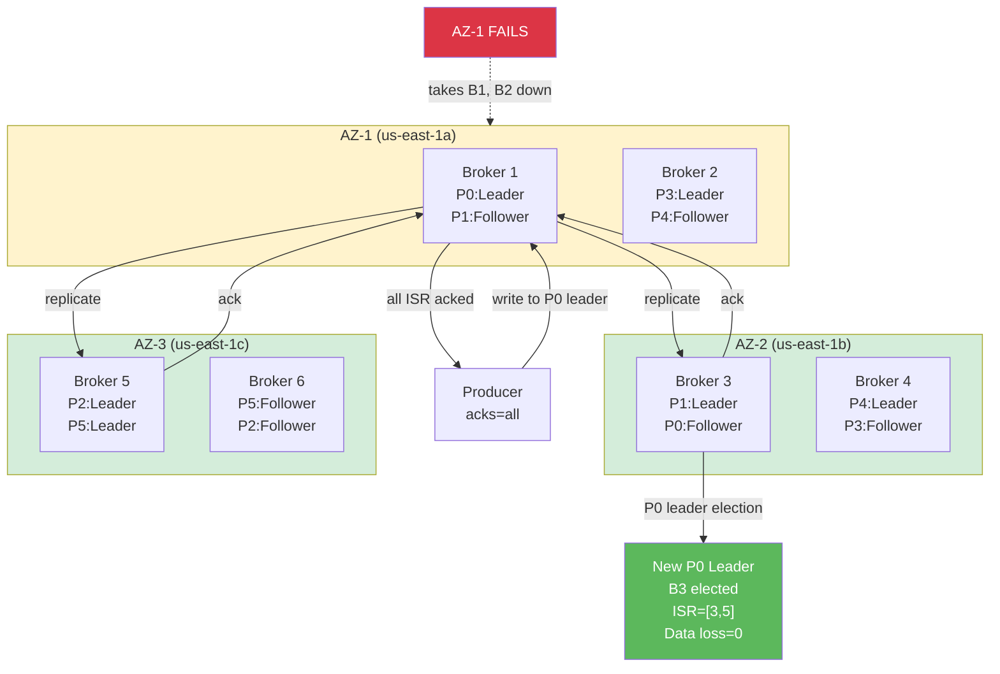

## Keywords in This File
{: .no_toc }

| # | Keyword | Weight |
|---|---|---|
| 1 | [Messaging High Availability and Disaster Recovery](#messaging-high-availability-and-disaster-recovery) | medium |

---

# Messaging High Availability and Disaster Recovery

---

### 🎯 Model Answer

**30 seconds:**
> High availability in messaging systems means ensuring the broker cluster continues to operate and deliver messages despite failures. In Kafka, HA is achieved through replication (each partition has multiple copies across different brokers), leader election (automatic promotion of a replica to leader when the current leader fails), and multi-AZ deployment (brokers in different availability zones so a zone failure does not take down the cluster). Disaster recovery adds cross-region replication (MirrorMaker 2) for data backup and regional failover.

**3 minutes (Senior):**
> Kafka HA design is fundamentally about understanding the failure domains and ensuring that no single domain failure can take down the cluster. At the broker level, replication factor 3 with min.insync.replicas=2 ensures that any single broker failure does not cause data loss and allows continued writes as long as 2 brokers remain. At the zone level, deploying brokers across 3 availability zones ensures that a single zone failure (which takes out the brokers in that zone) still leaves 2/3 of brokers operational. The partition leader distribution across zones matters here - if all leaders are on brokers in one zone, a zone failure causes a leader election for all partitions simultaneously, creating a thundering herd of reconnections. For disaster recovery, Kafka MirrorMaker 2 replicates topics and consumer group offsets to a secondary region. Failover to the secondary region requires consumers to switch their bootstrap server address and resume from the replicated offsets - consumer lag accumulation during the failover window is the critical metric. The failure mode I see teams underestimate: split-brain. If the primary and DR regions both think they are active (network partition between regions), both clusters accept writes. When the network heals, you have diverged logs that cannot be automatically reconciled. DR procedures must include explicit primary designation and a clear protocol for switching primary.

**Framework:** WHAT -> WHY -> HOW -> TRADE-OFF -> EXAMPLE

*Adapting up:* Add: Confluent Cluster Linking (active-active replication), stretch clusters with rack awareness, KIP-500 (KRaft) impact on broker HA.

*Adapting down:* "Messaging high availability means if a server breaks, the messaging system keeps working. Kafka does this by keeping copies of every message on multiple servers. If one server dies, another takes over automatically."

**Blank Mind Recovery:**
If you blank in the interview:

**(1) Restate:** "Messaging high availability - let me think through what can fail and how the system recovers."

**(2) First principles:** "What can fail? A broker, a network card, an AZ, a region. For each failure: is there a copy of the data elsewhere? Can the system automatically recover? How long does recovery take? Is there data loss? These four questions drive the HA design."

**(3) Bridge:** "Kafka's HA model is: replication factor controls how many copies exist, leader election controls automatic recovery, ISR controls who can become a new leader. Together these answer: copies exist, recovery is automatic, and only up-to-date replicas are eligible."

---

### 📘 Concept Explanation

**What it is:**
Messaging high availability is the set of architectural decisions and operational practices that ensure a message broker continues to function and preserve data during hardware failures, network partitions, and planned maintenance. Disaster recovery extends HA to regional failure scenarios.

**The problem it solves:**
Message brokers are critical infrastructure - a broker outage stops all services that depend on asynchronous messaging. Without HA, any broker failure causes message loss and system-wide unavailability. With HA, individual broker failures are invisible to producers and consumers.

**How it works:**

Kafka HA architecture:
```
3-AZ Kafka Cluster (6 brokers, 2 per AZ):

AZ-1:               AZ-2:               AZ-3:
Broker 1 (leader)   Broker 3 (leader)   Broker 5 (leader)
Broker 2 (follower) Broker 4 (follower) Broker 6 (follower)

Partition 0: leader=Broker1, ISR=[1,3,5]
Partition 1: leader=Broker3, ISR=[3,5,1]
Partition 2: leader=Broker5, ISR=[5,1,3]

AZ-1 failure:
  Broker1 and Broker2 down
  Partition 0: leader election from ISR=[3,5]
  -> New leader: Broker3 or Broker5
  Partition 1,2: leaders still Broker3/5 (in AZ-2/3)
  Recovery time: 10-30 seconds per partition
  Data loss: 0 (ISR replicas are up to date)
```

> **Code walkthrough:** This Messaging High Availability and Disaster Recovery example demonstrates a key concept in practice using Kafka messaging. **KEY MECHANISM:** the runtime executes these instructions in sequence with specific memory and execution semantics. **WHY IT MATTERS:** misapplying this pattern causes subtle bugs that only manifest under production load. **TAKEAWAY: understand the execution model before using this pattern in production code.**

Rack awareness configuration:
```
server.properties on Broker1:
  broker.rack=us-east-1a

server.properties on Broker3:
  broker.rack=us-east-1b

Topic creation with rack-aware replica assignment:
  kafka-topics.sh --create --topic order-events
    --replication-factor 3 --partitions 30
  # Kafka automatically places replicas in
  # different racks (AZs) when rack config is set
```

> **Code walkthrough:** This different racks (AZs) when rack config is set example demonstrates a key concept in practice using Kafka messaging. **KEY MECHANISM:** the runtime executes these instructions in sequence with specific memory and execution semantics. **WHY IT MATTERS:** misapplying this pattern causes subtle bugs that only manifest under production load. **TAKEAWAY: understand the execution model before using this pattern in production code.**

MirrorMaker 2 for DR:
```
Primary Region (us-east-1)    DR Region (us-west-2)
+------------------+          +------------------+
| Kafka Cluster    |          | Kafka Cluster    |
| order-events     |----MM2-->| us-east-1.order  |
| consumer offsets |----MM2-->| checkpoints      |
+------------------+          +------------------+

Failover steps:
1. Detect primary region unavailable
2. Switch bootstrap.servers to DR cluster
3. Translate consumer offsets using
   MM2 checkpoint consumer group
4. Resume consumption from DR cluster
5. Switch producers to DR cluster
6. Total RTO: 5-30 minutes
   RPO: seconds (replication lag at time of failure)
```

> **Code walkthrough:** This different racks (AZs) when rack config is set example demonstrates a key concept in practice using Kafka messaging. **KEY MECHANISM:** the runtime executes these instructions in sequence with specific memory and execution semantics. **WHY IT MATTERS:** misapplying this pattern causes subtle bugs that only manifest under production load. **TAKEAWAY: understand the execution model before using this pattern in production code.**

**The key insight:**
HA and DR are different failure scenarios requiring different solutions. HA handles broker-level and AZ-level failures within a cluster (automatic recovery, seconds). DR handles region-level failures (manual or semi-automated failover, minutes). Design both independently.

**When to use it:**
- Multi-AZ Kafka deployment: always for production
- Replication factor 3 + min.insync.replicas=2: always for production
- MirrorMaker 2 / Cluster Linking: when RTO/RPO requirements mandate regional DR
- Rack awareness: whenever deploying across multiple AZs

**When NOT to use it:**
- Do not over-engineer HA for development/staging (replication factor 1 is fine)
- Do not set replication factor > cluster broker count (Kafka will refuse topic creation)
- Do not use MirrorMaker 1 for new deployments (deprecated, use MM2)

**Alternatives:**
- Confluent Cluster Linking: active-active replication, lower latency than MM2
- Stretch cluster (single cluster across AZs): simpler management but cross-AZ replication adds latency
- Kafka on Kubernetes: StatefulSets with PVCs on multi-AZ node groups

**First-principles derivation:**
Availability = 1 - P(failure). With N=1 broker, P(failure) = P(broker fails). With N=3 brokers and replication factor 3, the cluster fails only if 2+ brokers fail simultaneously: P(failure) = P(broker1 fails) * P(broker2 fails) - orders of magnitude lower. Deploying across AZs makes broker failures in the same zone statistically correlated (AZ failure takes both) but inter-AZ failures remain independent.

---

### 💻 Code Example

```java
// BAD: Single-broker, no replication (dev config in prod)
// server.properties:
// num.partitions=1           <- no parallelism
// default.replication.factor=1 <- no HA
// min.insync.replicas=1      <- no durability guarantee
// 
// Producer:
props.put("acks", "1");
// Single broker fails -> ALL data lost
// No automatic recovery
// RTO: however long it takes to restart the broker
// RPO: all messages since last manual backup
```

> **Code walkthrough:** The default single-broker Kafka setup is fine for local development. In production, it means one hardware failure loses all data and takes down all messaging. Every minute the broker is unavailable, producers buffer messages in memory (up to `buffer.memory` limit) and then fail.

```java
// GOOD: Production HA configuration

// Kafka cluster server.properties (per broker):
// broker.rack=us-east-1a  (AZ-specific per broker)
// default.replication.factor=3
// min.insync.replicas=2
// unclean.leader.election.enable=false
// auto.leader.rebalance.enable=true
// leader.imbalance.check.interval.seconds=300

// Topic creation:
// kafka-topics.sh --create --topic order-events
//   --replication-factor 3
//   --partitions 30
//   --config min.insync.replicas=2

// Producer configuration:
Properties producerProps = new Properties();
producerProps.put("acks", "all"); // wait for all ISR
producerProps.put("enable.idempotence", "true");
producerProps.put("retries", "10");
producerProps.put("retry.backoff.ms", "1000");
// On leader election (10-30s): producer retries
// automatically. No code change needed.
// Data loss: 0 (ISR had all data)
// Availability: automatic, 10-30s recovery

// Consumer configuration:
Properties consumerProps = new Properties();
consumerProps.put("bootstrap.servers",
    "broker1:9092,broker2:9092,broker3:9092");
// Multiple bootstrap servers for client resilience
// Client caches full broker list after first connect
// bootstrap.servers just needs to include any
// reachable broker
consumerProps.put("session.timeout.ms", "30000");
// 30s is default: consumer rebalance trigger
// On broker failure: metadata refresh, rebalance
// Consumer continues reading from new leader
```

> **Code walkthrough:** The production configuration ensures that writes require 2 ISR acknowledgments (min.insync.replicas=2), preventing data loss on single-broker failure. `unclean.leader.election.enable=false` prevents a lagging replica from becoming leader (which would mean data loss). `auto.leader.rebalance.enable=true` redistributes partition leadership after a failed broker is replaced, preventing permanent leader concentration on fewer brokers.

```java
// PRODUCTION: MirrorMaker 2 DR configuration
// mm2.properties:
// clusters = primary, secondary
// primary.bootstrap.servers = primary-kafka:9092
// secondary.bootstrap.servers = secondary-kafka:9092
//
// # Mirror all topics from primary to secondary
// primary->secondary.enabled = true
// primary->secondary.topics = .*  # all topics
//
// # Replicate consumer group offsets
// primary->secondary.emit.checkpoints.enabled = true
// primary->secondary.emit.checkpoints.interval.seconds=10
//
// # Add source cluster prefix to prevent confusion
// replication.policy.class = \
//   org.apache.kafka.connect.mirror\
//   .IdentityReplicationPolicy
// # With Identity: topic "orders" in primary becomes
// # "orders" in secondary (no prefix)

// Consumer failover procedure (code-level):
@Value("${kafka.bootstrap.servers}")
private String bootstrapServers;
// In normal operation: bootstrapServers = primary
// During DR: update config to DR cluster
// Spring Cloud Config / K8s ConfigMap reload
// allows zero-code-change failover

// Offset translation for DR failover:
// kafka-mirror-maker2-offsets.sh tool or
// MirrorCheckpointConnector API translates
// consumer group offsets from primary positions
// to equivalent positions in the DR cluster
```

> **Code walkthrough:** MirrorMaker 2 runs as a Kafka Connect cluster. It mirrors topic data and consumer group offsets from primary to secondary with configurable lag (typically seconds). During a DR failover, consumers reconnect to the secondary cluster and use the translated offsets to resume from where they stopped. The RPO (recovery point objective) equals the replication lag at the time of failure.

```bash
# DEBUGGING: Diagnosing Kafka broker health

# Check under-replicated partitions (sign of HA degradation)
kafka-topics.sh --bootstrap-server kafka:9092 \
  --describe --under-replicated-partitions
# Output lists partitions where ISR < replication factor
# These are partitions that are NOT fully protected

# Check broker leadership distribution
kafka-topics.sh --bootstrap-server kafka:9092 \
  --describe --topic order-events | \
  grep "Leader:"
# Should be distributed across all brokers
# All on one broker = unbalanced leadership

# Trigger preferred leader election (rebalance leaders)
kafka-leader-election.sh \
  --bootstrap-server kafka:9092 \
  --election-type preferred \
  --all-topic-partitions

# Check ISR for specific topic
kafka-topics.sh --bootstrap-server kafka:9092 \
  --describe --topic order-events
# Isr: 1,3,5  <- healthy (all replicas in sync)
# Isr: 1      <- degraded (only leader in sync, not HA)
```

> **Code walkthrough:** Under-replicated partitions are the key HA metric. Any partition with ISR smaller than replication factor has degraded durability - the next broker failure in that partition's ISR would cause data loss. Monitor `kafka_server_ReplicaManager_UnderReplicatedPartitions` metric and alert at > 0.

---

### 🎓 Answers by Seniority

**Junior / Mid (0-5 years):**
> "Kafka high availability works through replication. Each partition has multiple copies across different brokers - typically 3 copies with a replication factor of 3. If the broker hosting the leader partition fails, Kafka automatically elects one of the other replicas as the new leader, and producers and consumers connect to the new leader. To protect against a full data center failure, you deploy brokers in different availability zones. This way, even if one zone goes down completely, the other zones still have copies of all data."

---

**Senior / Staff (5+ years):**
> "High availability in Kafka requires thinking about three failure domains: broker failure (handled by replication and leader election within the cluster), AZ failure (handled by multi-AZ broker placement with rack awareness so replicas span zones), and region failure (handled by MirrorMaker 2 or Cluster Linking for cross-region replication). The critical design decision is min.insync.replicas. Setting it to 2 with replication factor 3 gives you the right balance: you can tolerate one broker failure while still requiring two acknowledgments for writes. With min.insync.replicas=1, you can tolerate two broker failures but your write durability is only single-broker (the leader). I always set unclean.leader.election.enable=false in production to prevent a lagging replica from being elected leader - it may be missing messages that were committed by the previous leader. The RPO (recovery point objective) at the cluster level is zero with this configuration. At the regional level, RPO equals the MirrorMaker 2 replication lag - typically seconds."

---

### ⚠️ Common Misconceptions

**Misconception 1: "replication.factor=3 means I can lose 3 brokers and keep working."**
Reality: Replication factor 3 means you can lose 1 broker with min.insync.replicas=2, or 2 brokers with min.insync.replicas=1. With min.insync.replicas=2 (the safe production setting), losing 2 brokers means only 1 replica remains which is below the min.insync threshold - writes block. Replication factor 3 means 3 copies exist; it does not mean you can lose 3.

**Misconception 2: "MirrorMaker 2 provides active-active replication - both clusters can accept writes simultaneously."**
Reality: MM2 is active-passive by default. It replicates from primary to secondary. If both accept writes simultaneously, messages written to the secondary are not replicated back to the primary, and you have diverged logs. Confluent Cluster Linking supports true active-active with conflict resolution, but this requires explicit setup and acceptance of eventual consistency semantics.

**Misconception 3: "Setting unclean.leader.election.enable=true speeds up recovery."**
Reality: It does reduce leader election time by allowing lagging replicas to become leaders immediately. But these replicas may be missing messages that were acknowledged by the previous leader. The result is data loss for those messages - they are silently dropped, not recoverable. In production systems where data loss is unacceptable, set this to false and accept the longer election time.

---

### 🚨 Failure Modes and Diagnosis

**Failure 1: Broker failure causes producer timeout**

Symptoms: Producers log "TimeoutException: Expiry of producer batch." Consumer lag growing. Metrics show under-replicated partitions.

Root cause: Leader broker failed. Zookeeper/KRaft is electing new leaders (10-30s). Producers timeout before election completes.

Diagnosis:
```bash
# Check broker availability
kafka-broker-api-versions.sh \
  --bootstrap-server kafka:9092

# Check under-replicated partitions
kafka-topics.sh --bootstrap-server kafka:9092 \
  --describe --under-replicated-partitions

# Check Kafka logs on failed broker
# /var/log/kafka/server.log
# Look for: OutOfDisk, NetworkException, GC pause
```

> **Code walkthrough:** This Look for: OutOfDisk, NetworkException, GC pause example demonstrates shell script pattern using Kafka messaging. **KEY MECHANISM:** the shell executes commands sequentially; pipes pass stdout of one command to stdin of the next. **WHY IT MATTERS:** unquoted variables with spaces cause word splitting - IFS splits the value into multiple arguments. **TAKEAWAY: always double-quote variables: "$VAR"; use [[ ]] instead of [ ] for safer conditionals.**

Fix: increase producer `delivery.timeout.ms` to 120000 to survive the election window. Recover or replace the failed broker. Monitor ISR recovery.

---

**Failure 2: DR cluster out of sync - high replication lag**

Symptoms: MirrorMaker 2 consumer lag growing. DR cluster is N minutes behind primary. RPO SLA breached.

Root cause: MirrorMaker 2 connector underprovisioned, or DR cluster write performance degraded, or primary producing faster than MM2 can replicate.

Diagnosis:
```bash
# Check MM2 connector status
curl -s http://mm2-connect:8083/connectors/\
MirrorSourceConnector/status

# Check consumer lag for MM2 consumer group
kafka-consumer-groups.sh \
  --bootstrap-server primary-kafka:9092 \
  --describe --group mm2-primary-secondary

# Check throughput: MM2 should match primary throughput
# Primary: 100 MB/s -> MM2 must process 100 MB/s
```

> **Code walkthrough:** This Primary: 100 MB/s -> MM2 must process 100 MB/s example demonstrates HTTP request from shell using Kafka messaging. **KEY MECHANISM:** curl by default follows redirects and suppresses errors; -f flag makes it return non-zero on HTTP errors. **WHY IT MATTERS:** piping curl output to shell without verification runs untrusted code - a supply-chain attack vector. **TAKEAWAY: always use curl -f --retry and verify checksums before piping to bash.**

Fix: scale MM2 Connect workers, increase task count in connector config, or address DR cluster performance issues.

---

**Failure 3: Split-brain after network partition**

Symptoms: After a network partition between data centers heals, messages exist in primary that do not exist in DR, and vice versa. Consumer group offsets are diverged.

Root cause: Both clusters were writable during the partition (active-active without conflict resolution, or DR was manually promoted and primary came back up).

Diagnosis: Compare high watermarks on both clusters for the same topics. Message counts diverge after the partition start time.

Fix: This requires manual reconciliation. Identify which cluster was the designated primary. Replay messages from the non-primary cluster that are missing from the primary. Consumer offsets must be manually aligned. Prevention: implement clear DR procedures with only one cluster accepting writes at a time, and automate the primary designation check.

---

### 🎯 Interview Deep-Dive

| Category | Expected Time | Minimum Questions |
|---|---|---|
| Definition | 2 min | 1-2 |
| Mechanism | 3 min | 2-3 |
| Comparison | 2 min | 1-2 |
| Scenario | 5 min | 2-3 |
| Debugging | 5 min | 2-3 |
| Deep Dive | 5 min | 2 |
| Misconception | 2 min | 1 |
| Scale | 3 min | 1-2 |
| Behavioral | 3 min | 1 |

**[JUNIOR] Q1 - [CONCEPTUAL] Definition**
**"What is the difference between high availability and disaster recovery for Kafka?"**

*What to say:*
> "High availability handles failures within the Kafka cluster - broker failures, disk failures, JVM crashes. Kafka's replication and leader election provide automatic recovery, typically in 10-30 seconds, with zero data loss when properly configured. The cluster stays available throughout. Disaster recovery handles failures of the entire cluster or data center - a region going offline, a catastrophic storage failure affecting all brokers. DR requires a separate Kafka cluster, typically in a different region, with replication flowing from primary to secondary. Failover to the DR cluster requires changing consumer and producer configurations and is semi-manual. RTO is minutes; RPO is the replication lag at time of failure (seconds with MirrorMaker 2). HA prevents downtime; DR limits downtime when HA cannot help."

*What separates good from great:* Add: "The distinction matters for SLA design. HA gives you nines of availability - 99.9% or 99.99% with proper multi-AZ deployment. DR limits your worst-case RTO. A well-designed system has both: HA for the frequent small failures, DR for the rare catastrophic ones."

---

**[JUNIOR] Q2 - [CONCEPTUAL] Mechanism**
**"Walk me through what happens step by step when a Kafka broker fails."**

*What to say:*
> "Broker failure sequence: (1) The broker process terminates (crash or kill). (2) Zookeeper (or KRaft controller in newer Kafka) detects the broker's session has expired - this takes session.timeout.ms, typically 6 seconds. (3) The controller (the designated Kafka broker that manages cluster state) identifies all partitions that had the failed broker as their leader. (4) For each affected partition, the controller selects the new leader from the ISR - typically the first replica in the ISR list that is not the failed broker. (5) The controller writes the new partition state (new leader, updated ISR) to ZooKeeper/metadata log. (6) The controller sends LeaderAndIsr requests to all affected broker replicas and the new leaders, updating their metadata. (7) All clients (producers and consumers) periodically refresh metadata. When they see the new leader, they reconnect to it. (8) Producers experience a temporary timeout window (between broker failure and metadata refresh) - they retry with backoff. With `retry=10` and `retry.backoff.ms=1000`, producers retry for up to 10 seconds before giving up. Total recovery: 10-30 seconds from broker failure to all producers/consumers reconnected."

*What separates good from great:* Add: "KRaft (KIP-500) significantly speeds this up by removing ZooKeeper from the critical path. The internal metadata log gives the controller more direct state management. Kafka 3.x with KRaft reduces leader election time to single-digit seconds versus 10-30s with ZooKeeper."

---

**[JUNIOR] Q3 - [CONCEPTUAL] Comparison**
**"Compare Kafka's MirrorMaker 2 to Confluent Cluster Linking for disaster recovery."**

*What to say:*
> "MirrorMaker 2 is the open-source Kafka DR solution. It runs as a Kafka Connect cluster that consumes from the primary and produces to the secondary. Replication lag is typically 5-30 seconds depending on topic throughput and MM2 capacity. It replicates both message data and consumer group offsets (via checkpoints). Topic names can be prefixed to distinguish primary from secondary. Setup requires operating a Connect cluster. Confluent Cluster Linking is a commercial feature that links two clusters at the broker level rather than using a consumer-producer pair. It replicates data at much lower lag (milliseconds vs seconds), supports bidirectional replication for active-active setups, and does not require a separate Connect cluster. It also supports consumer group offset replication natively without the manual checkpoint translation step. For organizations on Confluent Platform or Confluent Cloud, Cluster Linking is the better DR solution. For open-source Kafka, MM2 is the standard. The key operational difference: MM2 is an independent process you manage; Cluster Linking is a broker-level feature managed by the brokers."

*What separates good from great:* Add: "For new deployments, also evaluate MirrorMaker 2 vs Kafka Streams-based replication. For complex filtering, transformation, or selective replication, a custom Kafka Streams application can be more flexible than MM2. MM2 mirrors everything; custom replication can filter to replicate only the specific topics your DR scenario requires."

---

**[MID] Q4 - [CONCEPTUAL] Scenario**
**"Design a Kafka deployment for an e-commerce platform that requires 99.99% availability and RPO under 30 seconds."**

*What to say:*
> "99.99% availability = 52.6 minutes downtime per year. 99.99% with RPO 30 seconds requires both strong HA and DR. Architecture: Multi-AZ Kafka cluster in us-east-1: 9 brokers across 3 AZs (3 per AZ). Replication factor 3 per topic, min.insync.replicas=2, unclean.leader.election.enable=false. Rack awareness configured. This handles any single-AZ failure automatically (6 remaining brokers, 2 per zone, all ISR replicas available). For DR: Kafka cluster in us-west-2 with identical configuration. MirrorMaker 2 (or Cluster Linking) replicating all production topics with sub-30 second lag. RPO = replication lag at time of failure (< 30 seconds). RTO target: 10-15 minutes for region failover (automated as much as possible - DNS updates, consumer bootstrap server config via ConfigMap/Consul, producer switch). Monitoring: under-replicated partitions alert (HA degradation), MM2 consumer lag alert (RPO degradation), broker count alert (fewer than 7 healthy brokers = reduce capacity). Runbook: documented region failover procedure tested quarterly."

*What separates good from great:* Add: "For the 99.99% availability target, the biggest risk is not a single broker or AZ failure - those recover automatically. The biggest risk is a cluster-wide incident (bad rolling update, corrupted metadata, Zookeeper quorum loss). These require a DR failover. Practice the DR failover procedure quarterly in a non-production environment to ensure RTO target is achievable."

---

**[MID] Q5 - [DEBUGGING] Debugging**
**"Your Kafka cluster is healthy but producers are experiencing 5-second latency spikes every 30 minutes. What is causing this?"**

*What to say:*
> "Periodic 5-second spikes every 30 minutes is a pattern that points to a scheduled operation. The candidates: JVM GC pause on a broker (30-minute interval suggests a scheduled GC or heap watermark). If a broker leader's JVM GCs for 5 seconds, producers with acks=all wait for the leader to complete its GC and acknowledge. Diagnosis: check JVM GC logs on all broker instances for GC pauses correlating to the latency spikes. Another candidate: auto.leader.rebalance - the default interval is 300 seconds (5 minutes), not 30 minutes. But leader rebalance causes brief connection storms. Third candidate: ZooKeeper session timeouts or GC on the ZooKeeper ensemble. If ZooKeeper hiccups, the Kafka controller loses its ZooKeeper session, then re-establishes it, triggering metadata refreshes across the cluster - visible as a brief producer latency spike. Check ZooKeeper GC logs and the Kafka controller log for session timeouts."

*What separates good from great:* Add: "Log scrubbing: Kafka periodically runs log cleanup (log.retention.check.interval.ms, default 5 minutes) and log compaction. Heavy compaction on a topic can saturate the broker's I/O and cause latency on other topics sharing the same broker. Check Kafka metrics for LogCleaner lag and disk I/O utilization during the spike windows."

---

**[MID] Q6 - [CONCEPTUAL] Deep Dive**
**"Explain how KRaft (KIP-500) changes Kafka's metadata management and HA properties."**

*What to say:*
> "Before KRaft (pre-Kafka 3.x), Kafka depended on ZooKeeper for cluster metadata - partition leadership, broker lists, ISR state. ZooKeeper is a separate distributed consensus system that Kafka operators had to manage, scale, and secure separately. ZooKeeper was the Kafka controller's state store. The controller was a Kafka broker that held the ZooKeeper session and managed all cluster state changes. This created two failure domains: Kafka brokers and the ZooKeeper ensemble. A ZooKeeper leader election (triggered by ZooKeeper failures) could pause all Kafka controller operations for seconds. KRaft replaces ZooKeeper with a Kafka-native Raft consensus protocol for metadata management. The metadata log is stored in Kafka itself - a special internal topic. The controller is now a set of Kraft controller-mode nodes (or combined broker+controller nodes). This has two HA improvements: first, the controller can replicate metadata to standby controllers, so controller failover is faster (seconds rather than minutes). Second, the metadata log can hold millions of partition changes (ZooKeeper had a per-node data size limit that capped the number of partitions). KRaft supports 10x more partitions per cluster. The practical HA improvement: leader election and metadata recovery after broker failures is faster and more reliable without ZooKeeper as a dependency."

*What separates good from great:* Add: "KRaft also enables incremental metadata propagation. With ZooKeeper, a broker restarting had to download the full cluster metadata from ZooKeeper and the controller. With KRaft, it catches up incrementally from the metadata log, which is much faster for large clusters with many partitions."

---

**[SENIOR] Q7 - [CONCEPTUAL] Scenario**
**"You need to perform a zero-downtime upgrade of a Kafka cluster from version 2.8 to 3.4. Walk me through the process."**

*What to say:*
> "Rolling upgrade procedure for Kafka: First, verify the upgrade path is supported (2.8 -> 3.4 may require stepping through intermediate versions - check Kafka documentation). Upgrade sequence: one broker at a time. Before starting: disable auto.leader.rebalance to prevent disruption during the upgrade. Step 1: Take broker N out of the cluster - shut it down gracefully (kafka-server-stop.sh, which flushes to disk). Kafka leader-elects away from that broker. Step 2: Upgrade the broker binary and configuration. Step 3: Restart the broker. It rejoins the cluster, fetches from leaders, and catches up in ISR. Monitor ISR recovery before proceeding. Step 4: Repeat for all brokers. Step 5: After all brokers are upgraded, update inter.broker.protocol.version and log.message.format.version to the new version (these remain at the old version during rolling upgrade for compatibility). Restart each broker again (or use kafka-configs.sh to update dynamically if supported). Enable auto.leader.rebalance. Total downtime: zero. Risk points: if a broker fails to restart after upgrade, you have a degraded cluster. Keep rollback binaries available and test the upgrade on staging first."

*What separates good from great:* Add: "Before any broker restart, verify the cluster has zero under-replicated partitions. Restarting a broker when ISR is already reduced means you take the last copy of some partitions offline - potential data availability issue. The pre-upgrade checklist: zero under-replicated partitions, all brokers healthy, sufficient disk space on each broker for the log flush during shutdown."

---

**[SENIOR] Q8 - [CONCEPTUAL] Behavioral**
**"Tell me about a Kafka availability incident you were involved in or investigated."**

*What to say (structure):*
> "SITUATION: Our Kafka cluster experienced a ZooKeeper leader election during peak traffic. Three ZooKeeper nodes had a network partition isolating one of them. The remaining two nodes formed a quorum but the Kafka controller lost its ZooKeeper session briefly, triggering a controller re-election. TASK: Identify the blast radius and restore normal operations. ACTION: The controller re-election took 45 seconds. During this period, no partition leader elections could happen and producers with acks=all were stalling (not blocked, but experiencing timeouts on any partition that needed metadata refresh). Consumer lag grew. I confirmed the root cause by checking ZooKeeper ensemble status and Kafka controller logs. The network issue was a misconfigured security group rule that dropped traffic between ZooKeeper nodes after an infrastructure change 10 minutes earlier. Rolled back the security group change. ZooKeeper re-formed its quorum, Kafka controller re-established its session, and normal operations resumed within 2 minutes after the rollback. RESULT: 45-second elevated latency window, no data loss. Total incident duration: 8 minutes. Post-incident: added ZooKeeper leader count and Kafka controller epoch to monitoring alerts. Migrated to KRaft in the next quarter to eliminate ZooKeeper as a dependency."

*What separates good from great:* Add: "The KRaft migration post-incident was the right architectural response. The ZooKeeper dependency was always the weakest point in our Kafka HA model. Monitoring helped us detect the incident quickly, but prevention required removing the failure domain entirely."

---

**[SENIOR] Q9 - [ARCHITECTURE] Scale**
**"How does Kafka HA change when you scale from 3 to 30 brokers across multiple regions?"**

*What to say:*
> "At 3 brokers, HA is simple: replication factor 3 means every broker has a copy. At 30 brokers across 3 regions, the HA design becomes more complex. First, partition distribution: 30 brokers can host significantly more partitions - partition leadership should be evenly distributed. The preferred replica assignment must be tracked and rebalanced after any broker replacements. Second, cross-region replication: with brokers in multiple regions, you have two options - a stretch cluster (single logical cluster spanning regions) or separate clusters with MirrorMaker 2. Stretch clusters have cross-region replication latency in the critical write path (acks=all must wait for cross-region followers) - adds 50-200ms latency. Separate clusters with MM2 have async replication (DR only, not active-active). Third, controller scalability: at 30 brokers, the KRaft controller ensemble manages much more state. Monitor controller metadata log lag. Fourth, coordinated upgrades: rolling upgrades across 30 brokers is a longer operation - with 2 minutes per broker, 30 brokers = 60 minutes. Plan upgrade windows accordingly."

*What separates good from great:* Add: "At 30 brokers in multiple regions, operational complexity increases dramatically. Invest in infrastructure-as-code for broker configuration, automated partition rebalancing tooling (Cruise Control), and runbooks for every failure scenario. The manual processes that work at 3 brokers will not work at 30."

---

**[STAFF] Q10 - [CONCEPTUAL] Misconception**
**"Our Kafka cluster has 3 brokers and replication factor 3, so we have no single point of failure, right?"**

*What to say:*
> "Not necessarily. Replication factor 3 means the data is on all 3 brokers. But with 3 brokers and replication factor 3, every partition's ISR includes all 3 brokers. If you set min.insync.replicas=2 and lose 1 broker, you have 2 replicas remaining - that is fine. But the controller (the broker that manages cluster metadata) is a single point of leadership. Controller failover is automatic but takes 10-30 seconds. The ZooKeeper ensemble (in pre-KRaft Kafka) requires a quorum of its own nodes. With a 3-node ZooKeeper ensemble, losing 1 ZooKeeper node still maintains quorum. Losing 2 brings down the ensemble - and Kafka cannot function without ZooKeeper. So a 3-broker Kafka cluster with a 3-node ZooKeeper ensemble still has a 2-node ZooKeeper failure as a failure scenario. Deploying all 3 Kafka brokers and all 3 ZooKeeper nodes in the same AZ is another SPOF - a zone failure takes down everything. Multi-AZ deployment across all 3 availability zones is required to eliminate single-AZ as a SPOF."

*What separates good from great:* Add: "There is also a practical SPOF in network equipment. If all brokers connect through the same top-of-rack switch, that switch is a SPOF for the entire cluster. For true HA, ensure brokers are on different physical switches (different racks). Cloud environments handle this automatically with different physical hosts in different AZs."

---

**[STAFF] Q11 - [CONCEPTUAL] Deep Dive**
**"What is the unclean leader election and when would you enable it despite the data loss risk?"**

*What to say:*
> "Unclean leader election allows a replica that is not in the ISR (an out-of-sync replica) to become the partition leader. ISR replicas are guaranteed to have all committed messages. A non-ISR replica is missing some committed messages. Electing it as leader means those messages are permanently lost. The default is unclean.leader.election.enable=false in Kafka 0.11+. This is the right production default. When would you enable it? When availability is more important than data durability for a specific topic. Use case: real-time telemetry data where a 5-second data gap is acceptable but 30 minutes of unavailability (waiting for ISR to recover) is not. Process metrics, log aggregation, analytics events - these can tolerate some data loss but require continuous availability. Enable unclean leader election at the topic level, not globally: kafka-configs.sh --alter --entity-type topics --entity-name telemetry-events --add-config unclean.leader.election.enable=true. Never enable it globally. Never enable it for financial, order, or user action topics where data loss is unacceptable."

*What separates good from great:* Add: "The failure scenario I have seen: unclean leader election was enabled globally 'temporarily' during an incident to restore availability quickly. After the incident, nobody disabled it. Months later, a disk failure on the leader caused a non-ISR replica to be elected, losing 20 minutes of order events. Treat unclean leader election enable/disable as a configuration change with the same review process as a code change."

---

**[STAFF] Q12 - [CONCEPTUAL] Edge Case**
**"What happens to Kafka consumers during a leader election - do they lose messages?"**

*What to say:*
> "Consumers do not lose messages during a leader election. Here is why: messages are consumed by position (offset), not by pointer to the leader. When a consumer fetches from partition offset N, it gets messages N, N+1, N+2. When the leader fails, the partition elects a new leader. The new leader has the same log (up to the last committed offset in the ISR). The consumer's current offset is still valid in the new leader's log. The consumer experiences a brief pause: it tries to fetch from the old leader, gets a NotLeaderForPartition error, refreshes its metadata (discovers the new leader), then reconnects to the new leader and continues from offset N+k where it left off. No messages are skipped. No messages are duplicated (unless the consumer was mid-processing and had not committed its offset before the error). Recovery time: 1-5 seconds for the consumer to refresh metadata and reconnect. The consumer lag may grow slightly during this window but catches up immediately. The risk of message loss at the consumer is not from leader election but from auto.offset.reset=latest - if a consumer group has never consumed from a partition and a leader election happens, the consumer starts at 'latest' offset, missing all historical messages. Set auto.offset.reset=earliest for new consumer groups."

*What separates good from great:* Add: "There is one consumer scenario where messages can appear to be lost after leader election: if the old leader accepted writes that had not yet been replicated to ISR followers when it failed, and min.insync.replicas=2 was not met (unclean election), those writes are lost. Consumers that had read those messages from the old leader's cache now see them missing from the new leader's log. This is not a consumer problem - it is a producer durability configuration problem. acks=all + unclean.leader.election=false prevents this."

---

### ⚖️ Comparison Table

| Failure Scenario | Solution | RTO | RPO | Complexity |
|---|---|---|---|---|
| Single broker failure | Replication + leader election | 10-30s | 0 | Low |
| Single AZ failure | Multi-AZ rack-aware cluster | 10-30s | 0 | Medium |
| Full region failure | MirrorMaker 2 + DR failover | 5-30 min | Seconds | High |
| Full region (Confluent) | Cluster Linking active-active | Minutes | < 1s | Medium-High |
| Controller failure | Auto controller election | 10-30s | 0 | Low |

**The deciding factor:** Match the solution complexity to the RTO/RPO requirement. Most teams need multi-AZ HA (automatic, zero data loss). Few need cross-region DR. Even fewer need active-active.

---

### 🏛️ System Design

**Design a multi-region Kafka deployment for a financial services platform with RPO=0 and RTO < 5 minutes.**

```
RPO=0 is the constraint that changes everything.
RPO=0 means NO data loss under any failure.

For RPO=0 across regions: synchronous cross-region
replication required.

OPTION A: Stretch Cluster (single cluster, 3 AZs, 2 regions)
AZ-East-1:  AZ-East-2:  AZ-West-1:
Broker 1    Broker 3    Broker 5
Broker 2    Broker 4    Broker 6

min.insync.replicas=3 (requires replicas in 2 regions)
Producer waits for 3 acks across 2 regions
Write latency: +50-100ms (cross-region RTT)
Failover: automatic (same cluster)
RTO: 10-30s. RPO: 0.

OPTION B: Confluent Cluster Linking (active-active)
Primary (us-east-1):   Secondary (us-west-2):
Kafka Cluster A  <---> Kafka Cluster B
                sync replication

Producers choose which cluster to write to.
Both clusters replicate to each other.
Conflict resolution: timestamp-based last-write-wins
RPO: near-zero (milliseconds). RTO: < 5 minutes.
Write latency: normal for local writes.
Complexity: requires Confluent Platform + conflict
resolution strategy.

RECOMMENDATION for financial services:
If cross-region write latency is acceptable:
  Use stretch cluster. True RPO=0.
If cross-region write latency is not acceptable:
  Use Cluster Linking with acknowledged eventual
  consistency and conflict handling.
  Accept RPO=milliseconds (not truly 0).
```

> **Code walkthrough:** This Unknown example demonstrates a key concept in practice using Kafka messaging. **KEY MECHANISM:** the runtime executes these instructions in sequence with specific memory and execution semantics. **WHY IT MATTERS:** misapplying this pattern causes subtle bugs that only manifest under production load. **TAKEAWAY: understand the execution model before using this pattern in production code.**

**Key design decisions:**
1. RPO=0 strictly requires synchronous replication - no async solution guarantees zero data loss
2. Synchronous cross-region replication adds 50-200ms to write latency (cross-region RTT)
3. Stretch cluster has operational simplicity advantage but all-region writes require ISR in both regions
4. Active-active adds conflict resolution complexity but has normal write latency

---

### 📊 Diagram

```
KAFKA HA: 3-BROKER, 3-AZ DEPLOYMENT

AZ-1            AZ-2            AZ-3
+----------+    +----------+    +----------+
| Broker 1 |    | Broker 3 |    | Broker 5 |
| P0:LEAD  |    | P1:LEAD  |    | P2:LEAD  |
| P1:FLWR  |    | P2:FLWR  |    | P0:FLWR  |
| P2:FLWR  |    | P0:FLWR  |    | P1:FLWR  |
+----------+    +----------+    +----------+

AZ-1 FAILS:
            +----------+    +----------+
            | Broker 3 |    | Broker 5 |
            | P0:LEAD* | <- | P0:LEAD* |
            | P1:LEAD  |    | P2:LEAD  |
            | P2:FLWR  |    | P1:FLWR  |
            +----------+    +----------+
* Election: P0 new leader = Broker3 or Broker5
  All P0 data: ISR had [1,3,5] - Broker3/5 are current
  Data loss: 0. RTO: 10-30 seconds
```



> **Diagram walkthrough:** The deployment places 2 brokers in each of 3 AZs, with partition leadership distributed across all AZs. With replication factor 3, each partition has replicas in all 3 AZs. When AZ-1 fails, Brokers 1 and 2 go down. Partitions that had Broker 1 as leader (P0, P3) trigger leader elections. The ISR for P0 was [1,3,5] - Brokers 3 and 5 are current and available. Broker 3 is elected as the new P0 leader. Producers and consumers reconnect to Broker 3 for P0. Zero data loss because the new leader has all committed messages. RTO is the election time: 10-30 seconds.

---

### 💻 Code Example

*(Omit: this concept does not have a programmatic interface that can be demonstrated in code. The conceptual explanation above is sufficient.)*


---

### 🏛️ System Design

*(Omit: system design diagram not applicable for this concept - see ★★★ keywords for full system design coverage.)*


---

### ⚖️ Comparison Table

*(Omit: this is a ★☆☆ foundational concept with no direct alternatives to compare - see higher-difficulty keywords for trade-off analysis.)*


---

### 📊 Diagram

*(Omit: no standalone visual diagram required for this concept - the explanations and code examples above provide sufficient clarity.)*


