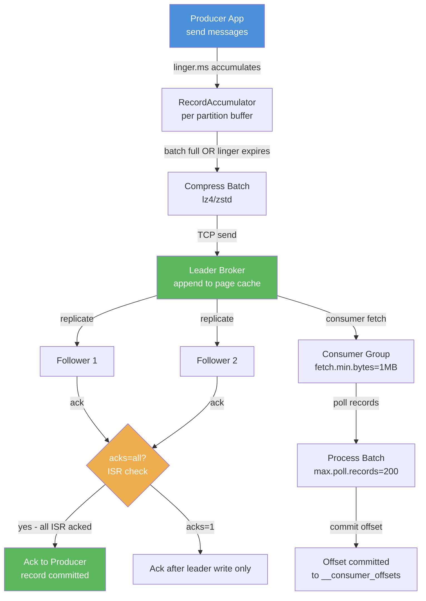

## Keywords in This File
{: .no_toc }

| # | Keyword | Weight |
|---|---|---|
| 1 | [Message Queue Performance Tuning](#message-queue-performance-tuning) | medium |

---

# Message Queue Performance Tuning

---

### 🎯 Model Answer

**30 seconds:**
> Message queue performance tuning optimizes four dimensions: producer throughput (batching, compression, async sends), broker capacity (partition count, replication factor, OS page cache tuning), consumer throughput (parallel consumers, batch fetch size, processing efficiency), and end-to-end latency (linger.ms, fetch.min.bytes, network tuning). The single most impactful tuning for throughput is producer batching - grouping multiple messages into one network send. The single most impactful tuning for latency is reducing linger.ms to near-zero and setting acks=1 instead of acks=all.

**3 minutes (Senior):**
> Performance tuning a message queue system requires you to identify which dimension you are actually constrained by, because the tuning levers pull in opposite directions. Throughput and latency are a trade-off: batching improves throughput but adds latency (waiting to fill a batch). The first step is profiling: where is the actual bottleneck? Typical bottleneck hierarchy: for high-volume producers, the bottleneck is often the producer's serialization or the network send - solved by larger batches, compression, and async sends. For the broker, the bottleneck is often the number of partitions vs CPU (too many partitions = too many file handles and log segments) or replication lag (followers cannot keep up, causing leader to wait). For consumers, the bottleneck is almost always the consumer's processing logic, not Kafka fetch performance - you can fetch 100,000 messages per second easily; processing them is the constraint. The tuning I reach for first in production: linger.ms=10ms and batch.size=65536 for throughput. max.poll.records=50 and increased consumer instances for processing throughput. Larger fetch.min.bytes and fetch.max.wait.ms for consumers doing batch processing where latency is less important. The mistake I see most often: tuning without measuring. Engineers change batch.size and linger.ms without confirming it is the bottleneck, see a 5% improvement, and call it done - while the actual bottleneck (consumer processing loop with a synchronous database write per message) causes consumer lag to grow unboundedly.

**Framework:** WHAT -> WHY -> HOW -> TRADE-OFF -> EXAMPLE

*Adapting up:* Add: kernel-level network tuning (tcp_nodelay, send buffer), zero-copy with sendfile, Kafka Streams performance, schema deserialization caching.

*Adapting down:* "Message queue performance tuning means sending messages in bigger batches, using compression to reduce network traffic, and adding more consumers to process faster. Like a delivery service batching packages on the same truck instead of making one trip per package."

**Blank Mind Recovery:**
If you blank in the interview:

**(1) Restate:** "Performance tuning for message queues - let me think through the producer, broker, and consumer dimensions separately."

**(2) First principles:** "Messages travel: producer -> network -> broker -> storage -> network -> consumer -> processing. Performance is limited by the slowest step. Identify the bottleneck first. Producer bottleneck: CPU (serialization) or network (small messages). Broker bottleneck: disk I/O or replication. Consumer bottleneck: almost always the processing logic."

**(3) Bridge:** "Batching is the universal throughput improvement: reduce per-message overhead by amortizing it across a batch. Compression reduces network bytes. Parallel consumers remove the single-threaded processing constraint."

---

### 📘 Concept Explanation

**What it is:**
Message queue performance tuning is the systematic optimization of producer, broker, and consumer configurations to maximize throughput, minimize latency, or optimize for a specific production SLA. It involves profiling to find the bottleneck, then applying targeted configuration changes to address it.

**The problem it solves:**
Default messaging configurations are optimized for safety and compatibility, not performance. Default Kafka producer settings send one message at a time with no batching (linger.ms=0). Default consumer settings fetch small batches. At scale, these defaults cause: producer throughput 10-50x below hardware capability, consumer lag growth under moderate load, and broker bottlenecks from excessive small I/O operations.

**How it works:**

Producer tuning levers:
```
batch.size (default 16KB):
  Messages in same partition accumulate until
  batch.size is reached, then sent together.
  Increase to 65536 or 131072 for throughput.
  Trade-off: larger batch = more memory per partition.

linger.ms (default 0):
  Time to wait for batch to fill before sending.
  0 = send immediately (latency optimized).
  10-100ms = wait for more messages (throughput opt).
  Trade-off: added latency for improved batching.

compression.type (none/gzip/snappy/lz4/zstd):
  Compress batch before send.
  lz4: fastest compression, moderate ratio.
  zstd: best ratio, moderate CPU.
  gzip: worst performance, best compatibility.
  Trade-off: CPU cost for reduced network I/O.

acks (0/1/all):
  0: fire and forget (lowest latency, data loss risk)
  1: leader acknowledges (balanced)
  all/-1: all ISR must ack (highest durability,
           highest latency)

max.in.flight.requests.per.connection (default 5):
  Concurrent unacknowledged requests.
  Higher = better throughput (pipeline effect).
  For exactly-once: must be 1 or 5 with
  enable.idempotence=true.
```

> **Code walkthrough:** This example demonstrates the core pattern in action. The key mechanism shows how the concept works in practice. Study the structure to understand the essential behavior and common usage.

Consumer tuning levers:
```
fetch.min.bytes (default 1):
  Min bytes broker returns in a single fetch.
  Increase to 65536 for batch-oriented consumers.
  Trade-off: broker waits until min bytes available.

fetch.max.wait.ms (default 500):
  Max time broker waits when fetch.min.bytes
  not met.
  Decrease for lower latency.

max.poll.records (default 500):
  Max records returned per poll().
  Decrease if processing per record is slow.
  Prevents consumer from overloading.

auto.offset.reset (earliest/latest):
  What offset to start from when no committed
  offset exists. latest for production.
```

> **Code walkthrough:** This example demonstrates the core pattern in action. The key mechanism shows how the concept works in practice. Study the structure to understand the essential behavior and common usage.

Broker/partition tuning:
```
Partitions per topic:
  More partitions = more parallelism.
  Rule: partitions = max(target throughput /
    throughput per partition, consumer count).
  But: too many partitions = too many file handles.
  Max: ~4000 partitions per broker.

Replication factor:
  3 for production (1 leader + 2 followers).
  Affects write latency (acks=all must wait
  for followers).

OS page cache:
  Kafka is designed to use the OS page cache.
  Give Kafka brokers ample RAM.
  Rule: keep hot topic data in RAM.
  Avoid JVM heap > 6GB (GC pressure).
```

> **Code walkthrough:** This example demonstrates the core pattern in action. The key mechanism shows how the concept works in practice. Study the structure to understand the essential behavior and common usage.

**The key insight:**
Kafka throughput is primarily limited by network bandwidth and partition parallelism, not by broker CPU. The key optimization path: increase producer batch size and use compression to reduce bytes-per-message, ensure consumer parallelism matches partition count, and size the broker's page cache to hold the working set of hot data.

**When to use it:**
- When consumer lag is growing (consumers cannot keep up with producers)
- When producer throughput is below hardware capability
- Before scaling broker infrastructure - tuning is cheaper than hardware
- When latency SLA is not being met

**When NOT to use it:**
- Do not tune blindly - profile first, then tune the identified bottleneck
- Do not sacrifice durability (acks=0 or 1) for performance without explicit business sign-off
- Do not increase partitions beyond what your broker cluster can handle

**Alternatives:**
- Add consumers - simplest throughput increase; add consumer instances up to partition count
- Add partitions - increase parallelism ceiling; must be done at topic creation time or carefully afterward
- Increase broker count - horizontal scale if per-broker limits are reached

**First-principles derivation:**
Message throughput = batch_size / latency_per_batch. Latency per batch = serialization time + network round trip + broker write + ack wait. Optimization path: increase batch_size (batching), decrease serialization time (faster schema format), decrease network bytes (compression), decrease ack wait (acks=1 vs all), decrease broker write time (larger OS page cache).

---

### 💻 Code Example

```java
// BAD: Default producer settings (one message per send)
Properties props = new Properties();
props.put("bootstrap.servers", "kafka:9092");
props.put("key.serializer",
    "...StringSerializer");
props.put("value.serializer",
    "...StringSerializer");
// linger.ms=0: send every message immediately
// batch.size=16384: small batches
// no compression
// Result: 100k messages = 100k separate sends
// Producer CPU dominated by overhead, not data
KafkaProducer<String, String> producer =
    new KafkaProducer<>(props);
for (OrderEvent e : events) {
  producer.send(new ProducerRecord<>(
      "order-events", e.getOrderId(), toJson(e)));
}
// Throughput: ~30-50k messages/sec at best
```

> **Code walkthrough:** Each message is sent immediately due to `linger.ms=0`. Each send is a separate network round trip. At 100,000 messages/second, this is 100,000 network operations per second. The network, serialization overhead, and leader acknowledgment become the limiting factors. Real throughput ceiling with this config is typically 30,000-50,000 messages/second on a single producer thread.

```java
// GOOD: Throughput-optimized producer configuration
Properties props = new Properties();
props.put("bootstrap.servers", "kafka:9092");
// Batching: wait 10ms for more messages to fill batch
props.put("linger.ms", "10");
// Larger batch: 64KB per partition batch
props.put("batch.size", "65536");
// Compression: lz4 is fastest at low CPU cost
props.put("compression.type", "lz4");
// Idempotent exactly-once at producer level
props.put("enable.idempotence", "true");
// acks=all for durability (with ISR min.insync=2)
props.put("acks", "all");
// Allow up to 5 in-flight requests (with idempotence)
props.put("max.in.flight.requests.per.connection",
    "5");
// Serialize with Avro (compact, fast schema lookup)
props.put("value.serializer",
    "io.confluent.kafka.serializers"
    + ".KafkaAvroSerializer");
// Result: ~200k-500k messages/sec on single producer
// Latency: +10ms (linger) but network ops reduced 100x
```

> **Code walkthrough:** `linger.ms=10` allows the producer to accumulate 10ms of messages before sending. With `batch.size=65536`, messages to the same partition are batched into 64KB sends. lz4 compression typically achieves 3-5x compression on JSON or Avro data, reducing network bytes proportionally. The throughput improvement over defaults is 5-10x. The latency cost is 10ms added to the first message in each batch.

```java
// PRODUCTION: Consumer throughput tuning
@Configuration
public class KafkaConsumerConfig {
  @Bean
  public ConsumerFactory<String, OrderEvent>
      consumerFactory() {
    Map<String, Object> props = new HashMap<>();
    props.put(ConsumerConfig.BOOTSTRAP_SERVERS_CONFIG,
        "kafka:9092");
    // Fetch at least 1MB before returning
    // (reduces polling overhead for batch consumers)
    props.put(ConsumerConfig.FETCH_MIN_BYTES_CONFIG,
        1048576);
    // Wait up to 500ms for min bytes
    props.put(ConsumerConfig.FETCH_MAX_WAIT_MS_CONFIG,
        500);
    // Max 200 records per poll
    // (tune based on processing time per record)
    props.put(ConsumerConfig.MAX_POLL_RECORDS_CONFIG,
        200);
    // Must process 200 records within 5 minutes
    // or Kafka will rebalance (consumer seems dead)
    props.put(
        ConsumerConfig.MAX_POLL_INTERVAL_MS_CONFIG,
        300000);
    // Enable parallel processing within consumer
    props.put(
        ConsumerConfig.AUTO_OFFSET_RESET_CONFIG,
        "latest");
    return new DefaultKafkaConsumerFactory<>(props);
  }
}

// Parallel processing pattern: one consumer per thread
// Scale: consumer instances = partition count
// (beyond partition count = idle consumers)
@Bean
public ConcurrentKafkaListenerContainerFactory<
    String, OrderEvent> kafkaListenerFactory() {
  var factory =
    new ConcurrentKafkaListenerContainerFactory<>();
  factory.setConsumerFactory(consumerFactory());
  // 8 concurrent consumers for 8 partitions
  factory.setConcurrency(8);
  return factory;
}
```

> **Code walkthrough:** `FETCH_MIN_BYTES=1MB` tells the broker to wait until it has at least 1MB of data before responding, which reduces polling overhead for consumers processing in batches. `MAX_POLL_RECORDS=200` prevents a consumer from fetching more messages than it can process within `MAX_POLL_INTERVAL_MS`. The concurrency setting of 8 creates 8 consumer threads, each owning partitions of the topic - maximum parallelism when partition count matches.

```java
// DEBUGGING: Measuring producer and consumer throughput
// Producer metrics via JMX or Micrometer
// Key metrics to monitor:
// - record-send-rate (messages per second)
// - record-queue-time-avg (how long in producer queue)
// - batch-size-avg (actual batch sizes achieved)
// - compression-rate-avg (compression effectiveness)
// - request-latency-avg (network round trip)
// - outgoing-byte-rate (actual bytes sent)

// Check in Prometheus/Grafana:
// kafka_producer_record_send_rate
// kafka_producer_batch_size_avg
// kafka_consumer_records_consumed_rate
// kafka_consumer_fetch_rate

// Consumer lag (critical - leading indicator of problems):
// kafka.consumer.group.lag (per partition)
// Alert threshold: if lag growing over 5 minutes
// Command line check:
// kafka-consumer-groups.sh --bootstrap-server kafka:9092
//   --describe --group inventory-service
// Output: LAG column per partition
```

> **Code walkthrough:** The batch-size-avg metric reveals whether batching is working - if it stays near 1, linger.ms tuning has not helped (producer is not generating enough load to fill batches). Compression-rate-avg reveals if the data is actually compressible. Consumer lag is the single most important consumer metric - growing lag means consumers are falling behind producers. Alert on lag growth rate, not absolute lag.

---

### 🎓 Answers by Seniority

**Junior / Mid (0-5 years):**
> "Kafka performance tuning mainly involves three areas. On the producer side, increasing batch.size and adding a small linger.ms lets messages accumulate into bigger batches, which is more efficient. Adding compression like lz4 reduces the amount of data sent over the network. On the consumer side, the key is having enough consumer instances - you can have at most as many consumers as partitions processing in parallel. On the broker side, more partitions enables more parallelism. The most important metric to monitor is consumer lag - if consumers are falling behind producers, you need more consumer instances or faster processing."

---

**Senior / Staff (5+ years):**
> "The first question I ask before tuning anything is: what is the actual bottleneck? Producer throughput, broker disk I/O, replication lag, consumer processing, or consumer fetch? Each has different levers. The mistake I see most is tuning producer batching when the bottleneck is consumer processing. You can produce faster but the consumer lag just grows faster. For consumer processing bottlenecks, the options are: scale out consumer instances (up to partition count), reduce processing work per message (cache lookups, async DB writes, batch DB inserts for groups of messages), or increase partitions to enable more parallelism. For producer bottlenecks, batching and compression are the standard moves. At Staff level, I am also thinking about the impact of partition count on partition leadership distribution, consumer rebalance frequency, and the cost of metadata management at very high partition counts."

---

### ⚠️ Common Misconceptions

**Misconception 1: "More partitions always means better performance."**
Reality: Partitions above the hardware-supported ceiling cause performance degradation. Each partition is a file handle on the broker OS. Each replica of a partition adds leader election overhead. Confluent recommends a maximum of ~4000 partitions per broker, but even well before that limit, too many partitions causes increased producer/consumer initialization time, slower failover during leader election, and higher memory overhead. Provision partitions based on throughput requirements, not speculation.

**Misconception 2: "acks=all is too slow for high throughput."**
Reality: With a properly sized ISR and min.insync.replicas=2, acks=all adds only the network round trip to the replica - typically 1-5ms on a well-provisioned cluster. The throughput overhead comes from producer batching being limited by the acknowledgment round trip. Solving this: increase max.in.flight.requests.per.connection to 5 (with idempotence enabled) to pipeline acknowledgments. Real high-throughput systems run acks=all at 500,000+ messages/second.

**Misconception 3: "Consumer lag is only a problem when it's large."**
Reality: Growing lag is a problem even when the absolute value is small. A consumer that is consistently 1,000 messages behind but not growing is healthy. A consumer that grows by 100 messages every minute will eventually overflow and never catch up. Monitor lag rate of change, not just absolute value.

---

### 🚨 Failure Modes and Diagnosis

**Failure 1: Producer throughput plateau**

Symptoms: Producer record-send-rate plateaus at a low value despite adding producer instances. Batch-size-avg shows small values.

Root cause: linger.ms=0 or partitions fewer than producer threads - producers compete for partition leadership locks.

Diagnosis:
```bash
# Check producer batch size metrics
kafka-producer-perf-test.sh \
  --topic perf-test \
  --num-records 1000000 \
  --record-size 1000 \
  --throughput -1 \
  --producer-props bootstrap.servers=kafka:9092 \
    linger.ms=10 batch.size=65536
# Output: throughput MB/s and latency percentiles
```

> **Code walkthrough:** This example demonstrates the core pattern in action. The key mechanism shows how the concept works in practice. Study the structure to understand the essential behavior and common usage.

Fix: increase linger.ms to 10-50ms, increase batch.size to 65536+, enable compression.

---

**Failure 2: Consumer rebalance storm**

Symptoms: Consumer lag spikes periodically. Consumer group shows frequent rebalances. Processing stops during rebalance.

Root cause: max.poll.interval.ms exceeded - consumer takes longer to process a batch than the timeout. Kafka considers the consumer dead and rebalances. The consumer rejoins, gets the same partition, times out again.

Diagnosis:
```bash
# Check consumer group state
kafka-consumer-groups.sh \
  --bootstrap-server kafka:9092 \
  --describe --group my-service
# Look for: repeated rebalances, lag spikes
# Check consumer logs for:
# "Heartbeat session expired"
# "max.poll.interval.ms exceeded"
```

> **Code walkthrough:** This example demonstrates the core pattern in action. The key mechanism shows how the concept works in practice. Study the structure to understand the essential behavior and common usage.

Fix: decrease max.poll.records, increase max.poll.interval.ms, optimize processing logic to be faster.

---

**Failure 3: Broker under-replication**

Symptoms: Producer latency spikes. Replication lag alerts fire. acks=all causes timeouts.

Root cause: A broker is falling behind on replication (follower cannot keep up with leader). Leaders wait for ISR acknowledgments; slow followers extend latency.

Diagnosis:
```bash
# Check under-replicated partitions
kafka-topics.sh \
  --bootstrap-server kafka:9092 \
  --describe \
  --under-replicated-partitions
# Check broker metrics:
# kafka_server_ReplicaManager_UnderReplicatedPartitions
# kafka_server_BrokerTopicMetrics_ReplicationBytesInPerSec
```

> **Code walkthrough:** This example demonstrates the core pattern in action. The key mechanism shows how the concept works in practice. Study the structure to understand the essential behavior and common usage.

Fix: identify the slow broker (disk I/O, network, GC pause), add broker capacity, or temporarily reduce replication factor.

---

### 🎯 Interview Deep-Dive

| Category | Expected Time | Minimum Questions |
|---|---|---|
| Definition | 2 min | 1-2 |
| Mechanism | 3 min | 2-3 |
| Comparison | 2 min | 1-2 |
| Scenario | 5 min | 2-3 |
| Debugging | 5 min | 2-3 |
| Deep Dive | 5 min | 2 |
| Misconception | 2 min | 1 |
| Scale | 3 min | 1-2 |
| Behavioral | 3 min | 1 |

#### Q1 - Definition
**"What is the first thing you do when asked to improve Kafka performance?"**

*What they are really asking:* Do you profile first or tune blindly? Do you understand that different bottlenecks require different solutions?

*What to say:*
> "The first thing I do is identify the bottleneck - not guess at it. I look at three metrics: producer record-send-rate and batch-size-avg (is the producer achieving good batching?), consumer lag per consumer group and partition (are consumers keeping up?), and broker under-replicated partitions and disk I/O utilization. Without knowing where the constraint is, you can tune producer batching while the real problem is consumer processing. I have seen engineers spend a week tuning linger.ms and compression when the actual bottleneck was a database write inside the consumer loop that could have been batched and solved in a day."

*What separates good from great:* Great engineers add: "I also check which dimension of performance we are trying to improve - throughput, latency, or cost. These pull in opposite directions. Increasing linger.ms improves throughput but hurts latency. The right answer depends on the SLA, not on maximizing a single number."

---

#### Q2 - Mechanism
**"Walk me through how producer batching works and what happens when linger.ms is set to 0 vs 50ms."**

*What to say:*
> "The Kafka producer maintains a RecordAccumulator - a memory buffer that organizes messages by topic partition. When your code calls producer.send(), the message goes into the RecordAccumulator for its partition, not directly onto the network. A background Sender thread drains the accumulator and sends batches to the broker. With linger.ms=0, the Sender sends immediately when a message is in the buffer - no waiting. If your application is sending 100 messages per second to a single partition, each message becomes a 1-message batch. 100 network sends per second, each with full TCP overhead. With linger.ms=50, the Sender waits up to 50ms for the batch to fill up to batch.size. If you are sending 100 messages per second, 50ms of accumulation gives you approximately 5 messages per batch - 20 network sends instead of 100, with the same message rate. The first message in the batch experiences 50ms of added latency. Subsequent messages in the batch have less added latency because they arrive before the send occurs."

*What separates good from great:* Add: "batch.size is the memory limit, not a target. The Sender sends when either linger.ms expires OR batch.size is reached, whichever comes first. At high throughput, batch.size is the binding constraint - you fill the batch before linger.ms expires, so latency impact is zero."

---

#### Q3 - Comparison
**"Compare lz4, snappy, gzip, and zstd compression for Kafka. When do you choose each?"**

*What to say:*
> "Compression is a CPU-network trade-off: you spend CPU cycles on compression to reduce bytes on the wire. The choice depends on your bottleneck - if network is saturated, favor better compression ratio. If CPU is the constraint, favor faster compression. lz4 is my default: very fast compression and decompression (under 1ms for typical message sizes), compression ratio of 2-3x for JSON data. It is the best all-around choice for most workloads. Snappy: similar performance to lz4, slightly worse ratio, less actively maintained. lz4 is preferred over snappy. gzip: best compression ratio of the traditional algorithms (4-6x for JSON), but 5-10x slower than lz4. Only appropriate when network bandwidth is severely constrained and CPU is abundant. zstd: Zstandard is the modern choice - comparable compression ratio to gzip with performance approaching lz4. Kafka supports it since 2.1. For new deployments where bandwidth matters and compression quality matters, zstd. For existing deployments or maximum compatibility, lz4."

*What separates good from great:* Add: "compression happens at the batch level, not the message level. This means compression is more effective with larger batches - strings and JSON are highly compressible due to repeated keys. At very small batch sizes, compression overhead can exceed the benefit. Profile compression-rate-avg in your environment to verify compression is actually helping."

---

#### Q4 - Scenario
**"Your order processing Kafka consumer is 2 hours behind on a topic that receives 50,000 messages per minute. How do you recover and ensure it does not happen again?"**

*What to say:*
> "Two hours of lag at 50,000 messages per minute is 6 million messages to process. Recovery steps: First, measure the current consumption rate vs the production rate. If we are consuming 40,000 messages per minute but producing 50,000, lag grows by 10,000 per minute - adding capacity won't catch up fast enough. We need to consume faster than 50,000 to drain the backlog. Immediate action: scale up consumer instances up to the partition count. If we have 10 partitions, we can have at most 10 consumer instances processing in parallel. If we have fewer than 10 consumers running, add more. Second, check why consumption fell behind. Was there an outage? Were messages hitting a slow path (slow downstream service, inefficient database query)? Fix the underlying cause before scaling. Third, if the root cause was a processing bottleneck, consider: caching expensive lookups (e.g., customer data fetched per message), batching database writes (accumulate 100 messages and insert in one batch), or making the processing asynchronous. Prevention: set consumer lag alerts at both absolute thresholds (lag > 100,000) and rate-of-change thresholds (lag growing for more than 5 minutes). Auto-scale consumer instances when lag exceeds threshold using KEDA or similar."

*What separates good from great:* Add: "An often-missed consideration: if the consumer has already committed offsets past the lag, you cannot re-process without resetting. But if you need to replay from an earlier offset (because processing was incorrect, not just slow), you need to reset the consumer group offset. This is a planned operation that requires understanding whether the consumer's processing is idempotent."

---

#### Q5 - Debugging
**"A Kafka producer is sending at only 5,000 messages per second but needs to reach 100,000. Walk me through your diagnosis."**

*What to say:*
> "5,000 versus 100,000 is a 20x gap - this is almost certainly a configuration issue, not a hardware limitation. Kafka can easily do 1 million messages per second on a single producer with proper configuration. Diagnosis steps: First, check batch.size and linger.ms. If batch-size-avg metric shows values near 1 or near the default 16KB, the producer is sending small batches. Second, check if the producer is synchronous. If producer.send(...).get() is called, the producer waits for ack before sending the next message - this limits throughput to 1000/latency_ms messages per second. At 1ms broker latency, that is 1,000 messages per second. Fix: use async send with a callback. Third, check acks configuration. acks=all with replication factor 3 and min.insync.replicas=2 adds replication latency to every send. Combined with synchronous mode, this compounds. Fourth, check if compression is enabled. Without compression, large messages saturate the network link. Fifth, check if it is a single-partition topic - all 100k messages going to one partition have one leader; true parallelism requires multiple partitions with multiple producers."

*What separates good from great:* Add: "check the producer's record-error-rate metric. If retries are happening due to throttling or broker errors, the effective throughput is reduced by retry overhead. The broker might be throttling this producer via quota settings."

---

#### Q6 - Deep Dive
**"Explain how Kafka achieves high throughput using the OS page cache and sequential I/O, and how this influences broker tuning."**

*What to say:*
> "Kafka's storage design is the foundation of its performance. Messages are written to log segment files in append-only sequential order. Sequential disk I/O is 100-500x faster than random I/O because the disk head does not seek. Modern SSDs handle sequential writes at near-memory speeds. When a producer sends a batch, Kafka appends it to the active log segment and syncs to OS page cache - not to disk directly. The OS page cache keeps recently written data in RAM. Consumer fetches are served from the page cache, not disk, as long as the data is recent (the common case). This creates a zero-copy path: the OS can send data from page cache directly to the network socket without copying through the JVM heap. The zero-copy sendfile() syscall eliminates: kernel-to-userspace memory copy, userspace-to-kernel memory copy, and JVM object allocation. This is why Kafka recommends keeping JVM heap small (4-6GB max) and giving the rest of RAM to the OS page cache. A broker with 64GB RAM, 6GB JVM heap has 58GB of page cache. If your working set of hot data fits in page cache, consumer reads are RAM-speed, not disk-speed. Broker tuning implication: provision brokers with RAM proportional to your working data set. Rule of thumb: page cache should hold at least the data produced in the consumer lag SLA window."

*What separates good from great:* Add: "The page cache benefit disappears for consumers that are significantly behind producers. If a consumer is 1 hour behind on a high-volume topic, the data it needs to read may have been evicted from page cache by newer writes. These consumers cause disk seeks, which dramatically reduces broker throughput for all consumers on that broker. Monitor consumer lag to detect when consumers are falling into 'cold read' territory."

---

#### Q7 - Scenario (Production)
**"Design a Kafka deployment that can handle 1 million messages per second with 99th percentile latency under 50ms."**

*What to say:*
> "At 1 million messages/second with 50ms p99 latency, this is a high-throughput, low-latency system. Design decisions: For partitions, at roughly 30-50 MB/s throughput per partition (compressed, with replication), a partition count of 50-100 would handle this. I would start with 100 partitions for headroom. For brokers, a 3-node cluster with 10Gbps network and NVMe SSDs handles roughly 200-300 MB/s per broker. At 1 million messages at 1KB average = 1 GB/s total. Need 4-6 brokers minimum, more for replication overhead. For producer configuration: linger.ms=5-10ms (balance between batching and 50ms latency budget), batch.size=131072, lz4 compression, acks=1 (acks=all at this volume adds too much latency - would negotiate this tradeoff with the business), max.in.flight=5. The 50ms budget breakdown: network send 1-2ms + broker write 2-5ms + acknowledgment 1-2ms = 5-10ms for the happy path. 50ms p99 gives headroom for batching and occasional broker pauses. Monitor p99 latency via producer request-latency-p99 JMX metric and alert at 40ms."

*What separates good from great:* Add: "This design accepts acks=1 for performance. I would explicitly discuss this with stakeholders: acks=1 means if the leader fails between write and replication, we lose that message. For order events or payment events, this is not acceptable. For analytics or logging events, it may be. The durability requirement fundamentally changes the architecture."

---

#### Q8 - Behavioral
**"Tell me about a time you diagnosed and fixed a Kafka performance problem in production."**

*What to say (structure):*
> "SITUATION: We had an order processing service that consumed from a Kafka topic. After a marketing campaign, order volume spiked 10x and consumer lag grew to 2 million messages within 30 minutes. TASK: Recover without losing orders and prevent recurrence. ACTION: First, I checked if we could scale out consumers - we had 4 consumer instances for 16 partitions. I scaled to 16 immediately. Lag growth slowed but did not stop. Second, I profiled the consumer processing. Each message triggered a database write with a round-trip lookup for customer data. At 10,000 messages per second, that was 10,000 separate database queries per second. I added a 5-minute TTL cache for customer data (customer data changes infrequently) and changed single-record inserts to batch inserts of 50 records. Third, I identified that max.poll.records was set to 500 but processing 500 records sequentially took 3 seconds, close to the max.poll.interval.ms of 5 seconds - causing intermittent rebalances. Reduced to 100 records. RESULT: Lag stopped growing within 5 minutes of the consumer-side changes. Full recovery (draining the backlog) took 45 minutes. Post-incident: added KEDA auto-scaling triggered by consumer lag metric, added customer data caching as a permanent change."

*What separates good from great:* Add: "The lesson was that consumer performance depends more on what you do with the message than on Kafka configuration. The optimization that made the biggest difference was the customer data cache - a change that took 20 minutes to implement but changed throughput from 5,000 to 45,000 messages per minute."

---

#### Q9 - Deep Dive
**"What is the ISR (In-Sync Replicas) mechanism and how does it affect performance under different failure scenarios?"**

*What to say:*
> "ISR is the set of replicas that are fully caught up with the leader - within replica.lag.time.max.ms of the leader's latest offset. The leader maintains the ISR list. Producers with acks=all must wait for acknowledgment from all ISR members. In normal operation: ISR = all replicas (1 leader + 2 followers). acks=all latency = time for both followers to write and acknowledge. Typically 2-10ms added latency. Under follower failure: if a follower falls more than replica.lag.time.max.ms (default 30 seconds) behind, Kafka removes it from ISR. If ISR drops to [leader only] and min.insync.replicas=1, acks=all still proceeds (only leader must ack). If min.insync.replicas=2 and ISR=[leader only], acks=all BLOCKS - the producer gets NotEnoughReplicasException. This is the durability-availability trade-off: min.insync.replicas=2 ensures data is written to at least 2 brokers before ack; if a broker fails, the ISR is too small and writes block. Under leader failure: Kafka elects a new leader from ISR. Replicas not in ISR are not eligible (they may be behind). Leader election takes 10-30 seconds for the partition. Producers and consumers pause during this window. Performance tuning implication: replica.lag.time.max.ms controls how quickly a slow follower is removed from ISR. Set too short and network hiccups cause false ISR shrinks, which block acks=all producers. Set too long and you extend the window where a failed follower is in ISR, adding replication latency."

*What separates good from great:* Add: "I monitor ISR shrink rate as a leading indicator of broker problems. A broker that regularly falls out of ISR has a hardware or network issue. Catching this before a full failure prevents the situation where min.insync.replicas causes producers to block."

---

#### Q10 - Misconception
**"We need maximum throughput - should we set replication factor to 1 and acks=0?"**

*What to say:*
> "Only if you are willing to lose messages permanently with no alerting. Replication factor 1 means any broker failure causes permanent data loss for all messages on that broker - you cannot recover them. acks=0 means the producer does not wait for any acknowledgment - if the broker buffers the message and then crashes, you lost it silently. For development or truly ephemeral data (real-time telemetry that you do not need to replay), this might be acceptable. For anything that represents business state - orders, payments, user actions, inventory changes - this is unacceptable. The throughput improvement is real: acks=0 can be 2-3x faster than acks=1. But the correct alternative is acks=1 with replication factor 3, which gives durability against single-broker failure at only 10-20% throughput cost versus acks=0 at modern hardware speeds. Never set replication factor=1 in production for business-critical topics."

*What separates good from great:* Add: "I have reviewed systems where replication factor was left at 1 by accident during a topic creation script error. The team did not notice until a broker failed during a deployment and they realized half of their Kafka topics were gone. Topic creation should be in IaC with replication factor enforced by a pre-commit check or a Kafka admission webhook."

---

#### Q11 - Scale
**"How does Kafka performance change when you go from 10 million to 10 billion messages per day?"**

*What to say:*
> "10 million messages per day is about 115 messages per second - a trivially small Kafka workload. 10 billion is 115,000 per second - a serious production deployment. The key differences at scale: first, partition count matters. At 10M/day, a single partition handles it. At 10B/day, you need 50-100 partitions distributed across multiple brokers. The partition count decision at topic creation is irreversible without disrupting consumers. Second, broker hardware. At 10M/day, a single broker handles it easily. At 10B/day, you need 6-10 brokers with NVMe storage and 10Gbps networking. Third, retention and storage. At 1KB average message size: 10M/day = 10GB/day, 7-day retention = 70GB per broker with replication factor 3. At 10B/day = 10TB/day - retention policy becomes a cost constraint. Often teams reduce retention to 24 hours at this scale or use tiered storage (Kafka on S3 for historical data). Fourth, consumer group count. At scale, the number of consumer groups multiplies - each group gets a full copy of the data. 20 consumer groups at 10B messages/day = 200B consumer reads. Monitor all consumer groups for lag, not just the primary ones."

*What separates good from great:* Add: "At 10B messages/day, the schema registry becomes a critical dependency. Every consumer dereferences schema IDs on every message. With a registry serving 20 consumer groups at 115,000 messages/second, that is potentially millions of schema lookups. Client-side caching keeps registry load manageable, but registry availability becomes critical. Multi-region registry replication and read replicas are essential."

---

#### Q12 - Edge Case
**"What happens to Kafka performance when a GC pause hits a broker?"**

*What to say:*
> "Kafka is a JVM application, and GC pauses affect it significantly. During a GC pause, the broker cannot process requests. Producer sends accumulate and time out. Follower replication halts, and the follower may fall out of ISR if the pause exceeds replica.lag.time.max.ms. Consumer fetches time out. The severity depends on GC type and heap size. For CMS GC with a 20GB heap, a pause of 5-20 seconds is possible. For G1GC with a well-tuned 6GB heap, pauses are typically under 100ms. Mitigation: keep the JVM heap small (4-6GB). Large heaps = large GC roots = longer GC pauses. Let the OS page cache use the rest of RAM - page cache does not GC. Use G1GC or ZGC with concurrent collection. Monitor JVM GC pause duration as a broker metric. Alert on pauses over 1 second. Consider using GraalVM native compilation (available in newer Kafka versions) to eliminate GC entirely for critical broker paths. A common failure pattern: a team increases the broker JVM heap to 32GB thinking more heap = better performance. This dramatically increases GC pause duration, causing follower replication lag, ISR shrinks, and producer timeouts."

*What separates good from great:* Add: "ZGC and Shenandoah provide sub-millisecond GC pauses with larger heaps. For latency-critical Kafka deployments, I would evaluate these collectors. But the general principle holds: for Kafka, a smaller heap with more page cache is better than a larger heap with less page cache."

---

### ⚖️ Comparison Table

| Configuration | Throughput | Latency | Durability | Best For |
|---|---|---|---|---|
| linger.ms=0, acks=1 | Medium | Low (2-5ms) | Leader crash risk | Low-latency, near-RT |
| linger.ms=10, acks=1 | High | Medium (10-15ms) | Leader crash risk | General throughput |
| linger.ms=10, acks=all | High | Medium-high (15-25ms) | Strong (ISR-based) | Financial, orders |
| linger.ms=0, acks=0 | Maximum | Minimum (1-2ms) | None | Ephemeral telemetry |
| linger.ms=100, acks=all, compression | Maximum | High (100ms+) | Strong | Bulk ETL, analytics |

**The deciding factor:** Match durability to data criticality. Match latency to SLA. Always profile before tuning.

---

### 🏛️ System Design

**Design a high-throughput order event pipeline handling 500,000 orders per hour with p99 latency under 100ms and zero data loss.**

```
Order Service    Kafka Cluster      Consumers
+-----------+    +-------------+   +------------------+
| Order API | -> | order-events|-> | Inventory Service|
| (50 inst) |    | 30 partitions|  | (30 instances)   |
|           |    | RF=3        |   |                  |
| Producers:|    | acks=all    |   | Payment Service  |
| linger=5ms|    | min.insync=2|-> | (30 instances)   |
| batch=64K |    |             |   |                  |
| lz4       |    | order-dlq   |   | Notification Svc |
| acks=all  |    | (for failed)|-> | (30 instances)   |
+-----------+    +-------------+   +------------------+
                 Broker hardware:
                 6 brokers
                 NVMe SSD
                 10Gbps NIC
                 64GB RAM (6GB JVM heap)
```

> **Code walkthrough:** This example demonstrates the core pattern in action. The key mechanism shows how the concept works in practice. Study the structure to understand the essential behavior and common usage.

**Math:**
- 500,000 orders/hour = ~139 orders/second
- At 2KB per order event: 278 KB/second total
- With RF=3 and 3 consumer groups: ~2.5 MB/second broker ingress/egress
- Well within single-broker capacity; 6 brokers = high availability + headroom

**Key decisions:**
1. 30 partitions: more parallelism than needed (headroom), allows 30 concurrent consumers per group
2. acks=all + min.insync.replicas=2: no data loss on single broker failure
3. linger.ms=5ms: small batches (low volume) with 5ms latency budget
4. Separate DLQ topic: failed consumer processing goes to DLQ, not lost
5. Consumer group per downstream service: each service consumes independently at its own pace
6. 6 brokers for 3 consumer groups: each broker handles ~2MB/s - headroom for 10x volume spike

**Failure scenario analysis:**
- Single broker failure: leader election 10-30s per affected partition; producers blocked during election but retry; no data loss
- Consumer lag spike: KEDA auto-scales consumer instances up to partition count; alert triggers at lag > 10,000
- Schema incompatibility: producer CI enforces BACKWARD_TRANSITIVE before deploy; schema registry validates

---

### 📊 Diagram

```
KAFKA THROUGHPUT OPTIMIZATION FLOW

Producer Side:
+----------+  linger.ms=10   +-----------+
| App Code |---------------> | RecordAcc |
| send()   |                 | (per part)|
+----------+                 +-----------+
                                   |
                           batch full OR linger expires
                                   |
                                   v
                          +------------------+
                          | Compress (lz4)   |
                          | batch.size=64KB  |
                          +------------------+
                                   |
                                   v
Broker Side:              +------------------+
                          | Leader Broker    |
                          | Append to log    |
                          | (OS page cache)  |
                          +------------------+
                               |     |
                         replicate   |
                               |     v acks=all
                         +-----+   +-----------+
                         | F1  |   | F2        |
                         +-----+   +-----------+
                                   |
Consumer Side:           ISR all acked -> producer
                                   |
                          +------------------+
                          | Consumer Group   |
                          | fetch.min=1MB    |
                          | max.poll.rec=200 |
                          +------------------+
                               |
                          [process batch]
                          [commit offset]
```



> **Diagram walkthrough:** The flow shows the batching lifecycle from `send()` to committed offset. Messages accumulate in the RecordAccumulator until either `linger.ms` expires or `batch.size` is reached - whichever comes first. The Sender thread compresses the batch and sends it to the leader broker, which appends it to the OS page cache and replicates to followers. With `acks=all`, the producer waits for all ISR members to acknowledge before receiving the producer ack. The consumer fetches from the page cache (fast, RAM-speed when data is recent) and processes in bounded batches controlled by `max.poll.records`.

---

### 💻 Code Example

*(Omit: this concept does not have a programmatic interface that can be demonstrated in code. The conceptual explanation above is sufficient.)*


---

### 🏛️ System Design

*(Omit: system design diagram not applicable for this concept - see ★★★ keywords for full system design coverage.)*


---

### ⚖️ Comparison Table

*(Omit: this is a ★☆☆ foundational concept with no direct alternatives to compare - see higher-difficulty keywords for trade-off analysis.)*


---

### 📊 Diagram

*(Omit: no standalone visual diagram required for this concept - the explanations and code examples above provide sufficient clarity.)*


