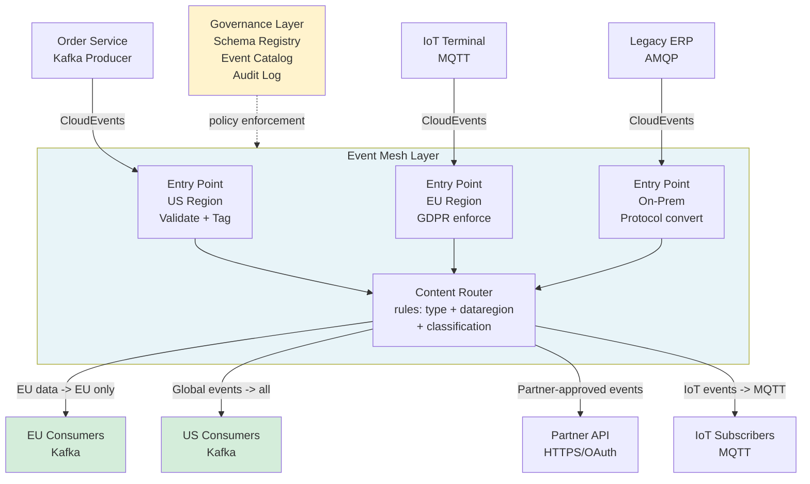

## Keywords in This File
{: .no_toc }

| # | Keyword | Weight |
|---|---|---|
| 1 | [Event Mesh and Enterprise Messaging Architecture](#event-mesh-and-enterprise-messaging-architecture) | medium |

---

# Event Mesh and Enterprise Messaging Architecture

---

### 🎯 Model Answer

**30 seconds:**
> An event mesh is a distributed messaging layer that spans multiple environments - on-premises data centers, multiple cloud providers, edge locations - and allows events to flow between them with consistent routing, governance, and security. Unlike a single Kafka cluster that is centralized, an event mesh connects multiple brokers, protocols, and environments. It enables enterprises to route events across organizational boundaries (between business units, partners, external systems) while maintaining control over data flows, schema governance, and access policies.

**3 minutes (Senior):**
> Enterprise messaging architecture at scale is fundamentally a governance and federation problem disguised as a technology problem. You can solve the technical problem (move events from point A to point B) with a single Kafka cluster. But enterprise reality is: multiple teams, multiple data centers, multiple cloud providers, regulatory requirements that mandate data residency, and external partner integrations that require different protocols (AMQP, MQTT, HTTP webhooks). An event mesh is the architectural pattern that addresses this reality. It consists of event brokers deployed at each site or cloud region, connected to each other to form a dynamic routing fabric. Events flow through the mesh to wherever consumers are, regardless of which broker they are physically connected to. The key capabilities an event mesh must provide: dynamic routing (events reach consumers without producers knowing consumer locations), protocol mediation (convert between Kafka, AMQP, MQTT, HTTP), governance (centralized schema registry, topic management, access control across all brokers), and observability (end-to-end event tracing across the mesh). The failure mode I see most often in enterprise messaging: teams build point-to-point integrations between systems (Kafka -> MQ -> another system -> another Kafka), creating a spaghetti of integrations. Each integration is a custom bridge with its own error handling, monitoring, and schema contracts. The event mesh replaces this with a managed layer that provides all these capabilities as infrastructure, not application code.

**Framework:** WHAT -> WHY -> HOW -> TRADE-OFF -> EXAMPLE

*Adapting up:* Add: CNCF CloudEvents standard, Solace PubSub+ architecture, AsyncAPI specification for event documentation, event catalog governance.

*Adapting down:* "An event mesh is like an air traffic control system for events. Just as planes fly from any airport to any other airport through a controlled routing system, events flow from any producer to any consumer through the event mesh, regardless of which systems they are in."

**Blank Mind Recovery:**
If you blank in the interview:

**(1) Restate:** "Event mesh and enterprise messaging architecture - let me think through what problems arise when messaging spans multiple teams, systems, and locations."

**(2) First principles:** "A single messaging cluster works for a single team or domain. Enterprises have: multiple teams with different systems, multiple data centers or cloud regions, external partners needing event access, regulatory requirements for data residency. The event mesh addresses the federation and governance challenges that arise at this scale."

**(3) Bridge:** "Think of it like internal networking vs internet routing. A single LAN is a simple Kafka cluster. The internet is an event mesh - a connected network of networks with routing, governance, and standards that allow communication across organizational and geographic boundaries."

---

### 📘 Concept Explanation

**What it is:**
An event mesh is a distributed, federated messaging infrastructure that spans multiple environments and connects producers and consumers regardless of their location, protocol, or organization. It provides event routing, protocol mediation, schema governance, and observability as centralized infrastructure rather than application-level concerns.

**The problem it solves:**
Enterprise messaging at scale faces challenges that a single Kafka cluster cannot address: data sovereignty (EU data cannot leave EU servers), multiple protocols (IoT devices use MQTT, legacy systems use JMS/AMQP, modern services use Kafka), partner integrations (external companies need event access), and organizational silos (different business units have separate Kafka clusters).

**How it works:**

Event mesh components:
```
Event Mesh Topology:

On-Premises DC1        AWS us-east-1       GCP europe-west1
+----------------+    +-----------------+   +---------------+
| Event Broker 1 |<-->| Event Broker 2  |<->| Event Broker 3|
| Kafka + AMQP   |    | Kafka + HTTP    |   | Kafka + MQTT  |
| EU data only   |    | Global events   |   | EU compliance |
+----------------+    +-----------------+   +---------------+
       ^                      ^                    ^
       |                      |                    |
  Legacy ERP           Microservices         IoT Devices
  (AMQP)               (Kafka)               (MQTT)
  
Mesh routing:
  IoT temp event (MQTT) -> Broker 3
  -> Mesh routes to -> Broker 2 (AWS)
  -> Analytics consumer subscribes (Kafka)
  
  Protocol converted automatically
  Schema validated at entry point
  Access control enforced per event type
```

> **Code walkthrough:** This Event Mesh and Enterprise Messaging Architecture example demonstrates a key concept in practice using Kafka messaging. **KEY MECHANISM:** the runtime executes these instructions in sequence with specific memory and execution semantics. **WHY IT MATTERS:** misapplying this pattern causes subtle bugs that only manifest under production load. **TAKEAWAY: understand the execution model before using this pattern in production code.**

Enterprise messaging governance model:
```
TOPIC GOVERNANCE:
  Topic Owner: team-name
  Topic classification: [public, internal, restricted]
  Schema: registered in central schema registry
  Data residency: [EU-only, global, US-only]
  Consumers must be approved by owner
  
SCHEMA GOVERNANCE:
  All event schemas registered in central catalog
  BACKWARD_TRANSITIVE compatibility enforced
  Breaking changes require owner approval + migration plan
  Schema catalog browsable by all teams
  
ACCESS GOVERNANCE:
  Producer ACLs: set by topic owner
  Consumer ACLs: requested, approved by topic owner
  Cross-organization access: federated identity + OAuth
  Audit log: all access events recorded
```

> **Code walkthrough:** This Event Mesh and Enterprise Messaging Architecture example demonstrates a key concept in practice using Kafka messaging. **KEY MECHANISM:** the runtime executes these instructions in sequence with specific memory and execution semantics. **WHY IT MATTERS:** misapplying this pattern causes subtle bugs that only manifest under production load. **TAKEAWAY: understand the execution model before using this pattern in production code.**

**The key insight:**
Enterprise messaging is not a technical problem - it is an organizational and governance problem. The event mesh provides the infrastructure layer; governance policies determine what flows where, who can access what, and how schemas evolve. Without governance, an event mesh becomes a faster way to create more spaghetti.

**When to use it:**
- When messaging spans multiple data centers, cloud regions, or organizational boundaries
- When multiple protocols need to coexist (MQTT for IoT, AMQP for legacy, Kafka for modern services)
- When regulatory requirements mandate data residency controls on events
- When partner integrations need event access with formal governance

**When NOT to use it:**
- For a single-team microservices architecture within one cloud region - a Kafka cluster is sufficient
- When the additional complexity of a mesh does not justify the governance benefits
- When the team lacks the operational maturity to manage federated infrastructure

**Alternatives:**
- Kafka MirrorMaker 2: cross-cluster replication but within Kafka ecosystem only
- iPaaS (Integration Platform as a Service): cloud-based event routing (AWS EventBridge, Azure Event Grid)
- API Gateway-based event federation: HTTP-based event fanout with gateway routing

**First-principles derivation:**
Single cluster: O(N) topics, O(N) producers, O(N) consumers, O(1) governance point. Enterprise mesh: O(K) clusters where K = number of locations/domains, but with centralized governance. Without the governance layer, O(K) clusters become O(K^2) integration pairs. The event mesh provides the routing layer that reduces this back to O(K) with a single governance plane.

---

### 💻 Code Example

```java
// BAD: Point-to-point integration spaghetti
// Service A -> KafkaCluster1 -> Custom Bridge ->
//   MQ Server -> Custom Adapter -> KafkaCluster2

// Bridge 1: Kafka to MQ (custom, fragile)
@Component
public class KafkaToMQBridge {
  @KafkaListener(topics = "order-events",
      groupId = "mq-bridge")
  public void onOrderEvent(OrderEvent event) {
    // Custom serialization for MQ
    byte[] mqPayload = mqSerializer.serialize(event);
    jmsTemplate.send("ORDER.QUEUE", 
        session -> session.createBytesMessage(
            mqPayload));
    // No schema governance, no tracing, no error handling
    // Duplicate for each integration pair
  }
}
// Result: 5 integrations = 5 custom bridges
// 20 integrations = 20 bridges, each different
// Monitoring: none. Failure: silent.
```

> **Code walkthrough:** Custom bridge code is the anti-pattern at enterprise scale. Each integration requires custom code for serialization, error handling, and monitoring. The code accumulates across teams. When a schema changes, every bridge that crosses that schema boundary must be updated manually.

```java
// GOOD: Event mesh with Solace PubSub+ / CloudEvents
// Using CloudEvents standard for cross-mesh portability

// Producer: emit with CloudEvents headers
@Component
public class OrderEventPublisher {
  private final KafkaTemplate<String, byte[]> kafka;

  public void publishOrderCreated(Order order) {
    CloudEvent event = CloudEventBuilder.v1()
        .withId(UUID.randomUUID().toString())
        .withSource(URI.create(
            "//order-service/orders"))
        .withType("com.example.order.created.v1")
        .withTime(OffsetDateTime.now())
        .withDataContentType("application/avro")
        .withExtension("dataregion", "us-east-1")
        .withData(avroSerializer.serialize(order))
        .build();

    // CloudEvents headers in Kafka message
    ProducerRecord<String, byte[]> record =
        new ProducerRecord<>("order-events",
            order.getId(), event.getData());
    CloudEventKafkaUtils.populateHeaders(
        record, event);
    kafka.send(record);
    // Mesh routes based on CloudEvents metadata:
    // - type -> determines topic routing rules
    // - dataregion -> enforces data residency
    // - source -> for governance audit
  }
}
```

> **Code walkthrough:** CloudEvents is the CNCF standard for event format, providing a common envelope (id, source, type, time) that works across protocols and brokers. The event mesh uses the CloudEvents metadata (especially `type` and custom extensions like `dataregion`) to route events according to governance policies. The producer code is protocol-neutral - the same event flows over Kafka within the region and is converted by the mesh to AMQP or HTTP for external consumers.

```java
// PRODUCTION: Enterprise event catalog and governance
// Using AsyncAPI spec for event documentation

// Event schema registered in central catalog:
// asyncapi: 2.0.0
// info:
//   title: Order Service Events
//   version: 1.0.0
// channels:
//   order.created.v1:
//     description: Published when an order is placed
//     publish:
//       message:
//         $ref: '#/components/messages/OrderCreated'
//     x-owner: order-team@company.com
//     x-classification: internal
//     x-data-residency: global
// 
// Consumer approval workflow:
// - Consumer registers intent to subscribe in catalog
// - Topic owner approves/rejects via PR workflow
// - ACL is provisioned automatically on approval
// - Consumer receives notification to proceed
// 
// This provides:
// - Discoverability: find events in catalog
// - Governance: owner approval for access
// - Compliance: track who has access to what data
// - Documentation: spec-first event contracts
```

> **Code walkthrough:** The AsyncAPI specification serves as the enterprise event catalog. It documents all published event types with their schemas, owners, classification, and data residency requirements. The workflow replaces ad-hoc "hey, can I consume your Kafka topic?" with a governed approval process that creates a traceable record of who has access to which event streams.

```bash
# DEBUGGING: Cross-mesh event tracing
# With CloudEvents + distributed tracing

# Producer injects trace context into event headers:
# cloudEventsKafkaHeaders:
#   traceparent: 00-{traceId}-{spanId}-01
#   tracestate: vendor=info

# Consumer extracts and continues trace:
# W3C Trace Context propagation via CloudEvents

# Trace a specific event through the mesh:
# jaeger-ui: search by event.id (CloudEvents correlation)
# or by X-Correlation-ID header
# 
# Query: eventId="abc-123"
# Shows: producer->broker1->mesh->broker2->consumer
# With timing at each hop
# 
# Identify cross-mesh latency:
# mesh-ingress-timestamp - producer-publish-timestamp
# = mesh routing latency (should be < 50ms)
```

> **Code walkthrough:** End-to-end tracing across the mesh requires propagating trace context in event headers. CloudEvents combined with W3C Trace Context headers creates a complete distributed trace that spans producers, mesh routing hops, and consumers - even when events cross organizational or protocol boundaries. This is the operational foundation for diagnosing cross-mesh latency and routing failures.

---

### 🎓 Answers by Seniority

**Junior / Mid (0-5 years):**
> "An event mesh is a distributed messaging infrastructure that connects multiple systems and locations. Instead of one central Kafka cluster that everyone connects to, an event mesh has multiple brokers that are connected to each other. Events flow between them automatically. This is useful for large companies with systems in multiple data centers or cloud providers, or when different systems use different messaging protocols like Kafka, AMQP, or MQTT. The mesh handles routing events between them without requiring custom integration code."

---

**Senior / Staff (5+ years):**
> "Enterprise messaging architecture is a governance and organizational problem more than a technical one. The technical part - moving events from A to B - is solvable with Kafka and MirrorMaker. The hard part is: who owns each event type, who is allowed to consume it, how do schemas evolve without breaking consumers in other business units, and how do you maintain data residency compliance when EU data cannot leave EU servers? These are governance problems. An event mesh provides the infrastructure layer (multi-protocol routing, cross-site federation), but the value comes from building the governance layer on top: an event catalog with ownership and access control, schema governance with compatibility enforcement and approval workflows, and compliance controls that enforce data residency at the routing layer. Without governance, an event mesh just makes it easier to create more point-to-point integrations faster."

---

### ⚠️ Common Misconceptions

**Misconception 1: "An event mesh is just Kafka MirrorMaker 2 connecting multiple clusters."**
Reality: MirrorMaker 2 is one tool for replicating Kafka topics across clusters. An event mesh is an architectural pattern that includes: multi-protocol support (AMQP, MQTT, HTTP, Kafka), dynamic event routing based on content and policies, centralized governance (schema registry, access control, data residency), and cross-organizational federation. MM2 is the replication layer; an event mesh provides all the layers above it.

**Misconception 2: "Event governance can be added after the mesh is built."**
Reality: Retrofitting governance onto an already-deployed event mesh is extremely difficult. Topic naming conventions, ownership records, schema registrations, and access policies are much easier to establish before teams build on top of the platform. The order of operations: design governance model -> implement event catalog and policy tools -> deploy mesh infrastructure -> onboard teams with governance requirements from day one.

**Misconception 3: "All events should flow through the central event mesh."**
Reality: High-throughput internal events (100K+ messages/second between services in the same cluster) should stay on the direct Kafka cluster. The event mesh is appropriate for cross-boundary flows: between teams with different clusters, between data centers, to external partners, to edge locations. Adding mesh overhead (protocol conversion, routing rules, governance checks) to internal high-throughput events increases cost and latency unnecessarily.

---

### 🚨 Failure Modes and Diagnosis

**Failure 1: Event routing loops in the mesh**

Symptoms: Same events appearing multiple times across the mesh. Consumer lag growing unexpectedly. Mesh observability showing events circling between two brokers.

Root cause: Routing rules on two mesh nodes point to each other (A routes to B, B routes back to A). Often caused by wildcard routing rules without origin filtering.

Diagnosis: Enable mesh routing trace. Check routing table for bidirectional rules on the same event type. Inspect event headers for hop count - if it exceeds 3, a loop is likely.

Fix: Add origin filtering to routing rules - do not route an event back to the cluster it originated from. Implement a max-hop-count policy that drops events exceeding N hops.

---

**Failure 2: Data residency violation - EU data flowing to US broker**

Symptoms: Compliance audit finds EU customer events in the US Kafka cluster. Data governance alert fires.

Root cause: A routing rule was misconfigured to mirror all events globally instead of EU-only events staying in EU brokers.

Diagnosis: Inspect mesh routing rules for the affected event type. Check CloudEvents `dataregion` extension header values on the leaked events to identify the producer. Check the mesh audit log for when the routing rule was changed.

Fix: Immediately stop the replication of EU-classified events to US brokers. Implement event classification at the producer (data-residency header), and routing rules that enforce classification. Add compliance validation in CI to catch routing rule changes that violate residency policies.

---

**Failure 3: Cross-mesh schema incompatibility**

Symptoms: Consumer in a different cluster gets deserialization errors after producer deploys a schema update.

Root cause: The two clusters use separate schema registries that are not synchronized. The producer's registry has schema v2; the consumer's registry only has v1.

Diagnosis: Compare schema versions in both registries for the affected subject. Check if cross-registry schema replication is configured and functioning.

Fix: Implement schema registry federation - replicate schema registrations from the primary registry to secondary registries. Require schema updates to be deployed to the federation registry first, then to all regional registries, before the producer deployment.

---

### 🎯 Interview Deep-Dive

| Category | Expected Time | Minimum Questions |
|---|---|---|
| Definition | 2 min | 1-2 |
| Mechanism | 3 min | 2-3 |
| Comparison | 2 min | 1-2 |
| Scenario | 5 min | 2-3 |
| Debugging | 5 min | 2-3 |
| Deep Dive | 5 min | 2 |
| Misconception | 2 min | 1 |
| Scale | 3 min | 1-2 |
| Behavioral | 3 min | 1 |

**[JUNIOR] Q1 - [CONCEPTUAL] Definition**
**"What is an event mesh and when does an enterprise need one?"**

*What to say:*
> "An event mesh is a distributed messaging infrastructure that connects multiple brokers, protocols, and environments into a unified event routing fabric. Enterprises need it when messaging crosses environmental boundaries: multiple data centers, multiple cloud regions, IoT edge locations, or external partner systems. A single Kafka cluster serves a single environment well. When you have EU data that legally cannot leave EU servers, or IoT devices that speak MQTT, or a legacy ERP system using AMQP, or a partner company that needs access to your order events - you need cross-boundary routing, protocol mediation, and governance. The event mesh provides: dynamic routing (events reach subscribers regardless of location), protocol conversion (MQTT to Kafka, Kafka to AMQP), data residency enforcement (EU events stay in EU brokers), and centralized governance (schema registry, access control) across all environments."

*What separates good from great:* Add: "The decision to invest in an event mesh is driven by the number of cross-boundary integration points. If you have 5 or more integrations between different systems, protocols, or locations, the operational overhead of managing each integration independently exceeds the overhead of an event mesh. Below that threshold, simpler point-to-point solutions are more practical."

---

**[JUNIOR] Q2 - [CONCEPTUAL] Mechanism**
**"How does protocol mediation work in an event mesh - specifically Kafka to MQTT?"**

*What to say:*
> "Protocol mediation converts events between messaging protocols at the mesh routing layer, not in application code. A Kafka producer publishes an order.created event to the Kafka broker at the mesh entry point. The mesh router is configured with a rule: events of type order.created should also be published to connected MQTT brokers for IoT consumers. The mediator extracts the event payload, converts the Kafka message headers to MQTT user properties, and publishes to the MQTT broker using the configured topic mapping. The consumer (an IoT gateway or edge device) subscribes to the MQTT topic and receives the event in MQTT format. The application developer writing the Kafka producer does not know or care that MQTT consumers exist. The application developer writing the MQTT consumer does not know it came from Kafka. Protocol mediation at the mesh layer is transparent to both sides. Schema validation happens at the mesh entry point: the event payload is validated against the schema registry before protocol conversion, ensuring that malformed events are rejected before they propagate through the mesh."

*What separates good from great:* Add: "The challenge in protocol mediation is semantic gaps. Kafka has partition keys for ordering, MQTT has QoS levels (0, 1, 2) for delivery guarantees, AMQP has routing keys for topic-based routing. Not all semantics translate cleanly. For example, Kafka's at-least-once delivery maps to MQTT QoS 1, but Kafka's partitioned ordering has no equivalent in MQTT. The mesh must document which semantics are preserved and which are not in each protocol conversion path."

---

**[JUNIOR] Q3 - [CONCEPTUAL] Comparison**
**"Compare an event mesh to an event bus (like AWS EventBridge) and to traditional ESB (Enterprise Service Bus)."**

*What to say:*
> "ESB (Enterprise Service Bus): the 2000s-era integration pattern. A central hub that transforms, routes, and mediates between systems. All integrations are point-to-ESB, eliminating point-to-point spaghetti. Problems: central bottleneck, monolithic configuration, difficult to scale, tight coupling through the bus. Eventually the bus itself became the bottleneck and the new source of complexity. Event mesh: federated architecture - multiple brokers connected in a network. No single bottleneck. Governance is centralized but processing is distributed. Works at scale because the mesh can route events without centralizing all traffic. AWS EventBridge: a managed event bus service where events flow from producers to rules-matched consumers. Simpler than an event mesh - no multi-protocol, no cross-region mesh, no federation. Good for cloud-native architectures within AWS. Limited for multi-cloud, multi-protocol, or on-premises integration scenarios. The key difference: ESB centralizes processing; event mesh centralizes governance but distributes processing; event buses like EventBridge are managed services with limited customization."

*What separates good from great:* Add: "Modern event meshes avoid the ESB's central-bottleneck problem through intelligent routing: the mesh topology is a network of brokers, and events flow through the nearest path to their consumers. High-volume internal events stay on local brokers; only cross-boundary events traverse the mesh. This prevents the mesh from becoming the ESB's successor."

---

**[MID] Q4 - [CONCEPTUAL] Scenario**
**"Design an event mesh for a global e-commerce company with data centers in the US, EU, and Asia-Pacific, with EU GDPR requiring EU customer data to never leave EU servers."**

*What to say:*
> "GDPR data residency is the primary constraint that drives the architecture. Design: Three regional event mesh nodes - US (us-east-1), EU (eu-west-1), APAC (ap-southeast-1). Each node is a Kafka cluster with a mesh routing layer. EU node: handles all EU customer data events. Strict isolation - events with EU customer PII are only processed by the EU node. Routing rules: EU events are tagged with data-residency=EU. The mesh enforces that EU-tagged events never route to US or APAC nodes. Non-EU global events (product catalog updates, pricing changes) route to all nodes. Cross-region routing: the mesh connects all three nodes for global events only. Anonymized event data (e.g., product view counts with no customer PII) flows globally. Customer-linked events (order.created with customer ID and address) stay in the originating region. Technical implementation: CloudEvents with data-residency extension header. Mesh routing rules enforce header-based isolation. Governance: compliance team approves any new global event type. EU events must have a DPA (Data Processing Agreement) on file for any new consumer. Testing: chaos engineering test quarterly - verify that EU-tagged events do not appear in US or APAC clusters after a routing rule change."

*What separates good from great:* Add: "The GDPR compliance architecture must address not just the live event flow but also the event store. If Kafka retention is 7 days, EU customer events in the EU Kafka cluster must be encrypted at rest and the encryption keys must be managed within EU KMS. The event mesh routes correctly, but storage-level compliance requires separate key management controls."

---

**[MID] Q5 - [DEBUGGING] Debugging**
**"Events from the US cluster are arriving at the EU cluster with a 5-minute lag. Normal latency is under 1 second. What do you investigate?"**

*What to say:*
> "5-minute lag on cross-mesh routing (from <1 second) indicates a bottleneck in the mesh routing path. Investigation steps: first, check the mesh routing component health - is the connector process between US and EU healthy? Check for error spikes in the connector logs around the time the lag appeared. Second, check the network latency between US and EU brokers - run a ping/traceroute to verify no network degradation. Third, check the consumer group lag for the mesh connector's consumer group on the US cluster - if the connector is behind on the US side, events queue up before even starting the cross-region hop. Fourth, check the EU broker capacity - if the EU cluster is receiving more events than it can handle (consumer lag, disk pressure), the mesh connector backs off. Fifth, check for authentication/TLS certificate issues - an expired certificate causes reconnection retries that add seconds per attempt."

*What separates good from great:* Add: "Add mesh routing latency as a monitored SLA metric: p95 mesh routing latency should be under 5 seconds; alert at > 30 seconds. This provides early warning before the 5-minute lag becomes a business impact. The mesh routing latency is different from end-to-end consumer lag - it isolates the cross-mesh hop specifically."

---

**[MID] Q6 - [CONCEPTUAL] Deep Dive**
**"How does event mesh governance prevent schema proliferation and 'schema debt' at enterprise scale?"**

*What to say:*
> "Schema proliferation happens when teams create new event types without coordinating with consumers. Within a year, an enterprise can have hundreds of event types with overlapping semantics, inconsistent naming, and no discoverability. Prevention: require every event type to be registered in an event catalog (AsyncAPI spec or custom registry) before it can be published. The catalog entry includes: schema definition, owner, consumers, data classification, and lifecycle status (active, deprecated, retired). Governance workflow: proposing a new event type requires a catalog PR that goes through a review process with the platform team and affected consumer teams. This is the equivalent of an RFC process for event schemas. This catches: duplicates (does this event type already exist?), naming inconsistencies (order.created vs OrderPlaced - standardize on one convention), overlapping semantics (two teams creating nearly identical event types). Schema debt remediation: mark deprecated event types in the catalog. Require all consumers to migrate off deprecated schemas within a defined window. Automate deprecation enforcement by rejecting new consumer registrations for deprecated schemas. Schema hygiene is cheaper enforced continuously than paid as a large one-time migration."

*What separates good from great:* Add: "Tooling matters for adoption. If registering an event type is a 20-step manual process, teams will skip it. If it is a PR to a GitHub repo with an automated CI check that validates the schema and generates documentation, teams will comply. The governance friction must be low enough that compliance is the path of least resistance."

---

**[SENIOR] Q7 - [CONCEPTUAL] Scenario**
**"Your company is acquiring another company with its own Kafka cluster. Design the event mesh integration strategy."**

*What to say:*
> "M&A integration for messaging is a classic event mesh use case. The challenge: two separate Kafka clusters, different schemas, different naming conventions, possibly different Kafka versions, and a need to share specific event streams for business integration without full consolidation (which could take years). Event mesh integration strategy: first, define the integration events - which business events need to flow between the two companies? Not everything, just the business-critical handoffs (e.g., acquired company's order events need to flow to parent company's fulfillment service). Second, establish a shared schema for integration events. Neither company changes their internal schemas. A canonical integration schema is defined for the shared events. Each company's events are transformed to the canonical schema at the mesh gateway. Third, deploy a mesh bridge: a Kafka Connect-based or dedicated mesh node that consumes from the acquired company's cluster, transforms to canonical schema, and publishes to the parent company's integration cluster (not directly to internal clusters). The integration cluster acts as a DMZ - sanitized, transformed, governed events. Fourth, access control: the parent company's teams subscribe to the integration cluster. The acquired company cannot access the parent's internal cluster directly. Fifth, sunset plan: as systems are consolidated, the mesh bridge is migrated to a more direct topology and eventually removed."

*What separates good from great:* Add: "Data classification during M&A is critical. The acquired company may have events containing employee data, customer data under different consent models, or proprietary business data that has contractual restrictions. Every integration event must be reviewed for data classification before flowing across the M&A boundary. The event mesh provides the technical control; legal review provides the governance foundation."

---

**[SENIOR] Q8 - [CONCEPTUAL] Behavioral**
**"Tell me about a time you designed or worked on an enterprise messaging architecture."**

*What to say (structure):*
> "SITUATION: Our e-commerce platform had grown from 5 microservices to 50 over 3 years. Each team owned their own Kafka cluster. To integrate, teams built custom Kafka Connect pipelines between clusters. We had 40+ custom connectors, each with different error handling, monitoring, and schema management. TASK: Design a messaging architecture that could scale to 100+ services without the integration count growing quadratically. ACTION: I led the design of a shared event bus with governance. First: we surveyed all integration patterns and categorized events as internal (stay within team cluster), domain-public (available to any internal team), and external (partner access). Second: we built a central event catalog with ownership and a request workflow for consuming other teams' events. Third: we deployed a shared Kafka cluster for domain-public events with schema registry and ACL governance. Custom connectors from team clusters to the shared cluster were standardized using a connector template with consistent error handling and monitoring. Fourth: we established schema governance rules - all new event types reviewed by a schema council before registration. RESULT: 50% reduction in custom integration code over 12 months. Schema incompatibility incidents dropped from 8/month to 0 in the first quarter after governance implementation. The event catalog became the go-to reference for discovering what events are available."

*What separates good from great:* Add: "The hardest part was organizational, not technical. Teams saw the governance process as a bottleneck. We had to make the catalog PR process fast - 24-hour review SLA - and provide tooling that auto-generated the schema spec from Avro definitions. When the friction was low and the value (discoverability, no more ad-hoc 'hey can I have access to your topic?' messages) was visible, adoption accelerated."

---

**[SENIOR] Q9 - [ARCHITECTURE] Scale**
**"How does enterprise messaging governance change when you go from 10 to 1000 event types?"**

*What to say:*
> "At 10 event types, governance is informal - a wiki page with schema documentation is sufficient. At 1000 event types, informal governance fails: nobody knows what events exist, there are many near-duplicates, and schema changes break consumers silently. The requirements at 1000: searchable event catalog with schema browsing, automated schema compatibility checking (not manual review), lifecycle management (active/deprecated/retired status), consumer dependency graph (which services depend on which event types - to understand blast radius of changes), and automated governance enforcement in CI (schema changes fail builds if they violate compatibility). Tooling that scales: Confluent Schema Registry handles schema storage and compatibility. Custom event catalog built on top (or commercial solutions like Confluent Control Center, Solace PubSub+) handles ownership, lifecycle, and discovery. Consumer dependency graph requires integration with service mesh or application metadata. The most important change at 1000: schema retirement. At 10 event types, you never retire schemas. At 1000, schema sprawl is a real problem. Implement lifecycle status and automated deprecation notifications to owners. Dead schemas (no active consumers) should be retired regularly."

*What separates good from great:* Add: "At 1000 event types, the event catalog is itself a product. It has users (developers discovering events), contributors (teams registering events), and administrators (governance enforcing policies). Treat it as a product with a product owner, user feedback loops, and feature roadmap. Without product thinking, the catalog becomes stale and developers stop using it."

---

**[STAFF] Q10 - [CONCEPTUAL] Misconception**
**"We use Kafka everywhere, so we have a single event platform and do not need an event mesh."**

*What to say:*
> "A single Kafka platform is excellent for uniform architectures. But enterprise reality creates gaps: what about the IoT devices that only speak MQTT? The legacy ERP system that only supports JMS/AMQP? The external partner that needs event access but cannot connect directly to your internal Kafka cluster? The EU customer data that legally cannot leave EU servers? A single Kafka cluster cannot address these scenarios without custom integration code for each gap. The event mesh is not a replacement for Kafka - Kafka is the primary broker technology within the mesh. The mesh adds: multi-protocol support at the perimeter, cross-region routing with data residency enforcement, and external partner federation. If none of these scenarios apply (all services are modern, internal, single-region, Kafka-speaking), then a single Kafka cluster is the right answer. The event mesh is the answer when heterogeneity, geography, or external access creates integration requirements beyond what a single cluster can address."

*What separates good from great:* Add: "The cost of an event mesh is real: additional infrastructure, operational complexity, and governance overhead. Always right-size the architecture to the problem. Many companies would be better served by a well-governed single Kafka cluster with strong ACLs and a schema registry than by a complex event mesh that their team cannot operate effectively."

---

**[STAFF] Q11 - [CONCEPTUAL] Deep Dive**
**"What is the CloudEvents specification and why is it relevant to enterprise messaging?"**

*What to say:*
> "CloudEvents is a CNCF specification that defines a common envelope format for events, independent of the messaging protocol or transport. A CloudEvent has a required set of attributes: specversion (1.0), id (unique per event), source (who produced it), type (what happened), and optionally time (when it occurred), datacontenttype (payload format), and custom extensions. The payload is the event data. Why it matters for enterprise messaging: protocol portability. An event conforming to CloudEvents can be sent via Kafka (using Kafka headers for the CE attributes), HTTP (using HTTP headers), AMQP (using AMQP properties), or MQTT (using user properties). The consumer knows the envelope format regardless of transport. This is the foundation for protocol mediation in an event mesh - convert the transport (Kafka to HTTP) while keeping the event envelope (CloudEvents attributes) intact. Consumer code that parses CloudEvents attributes works regardless of whether it is receiving from Kafka or HTTP. Ecosystem benefits: many tools (Knative, Dapr, Azure Event Grid, AWS EventBridge) natively support CloudEvents, enabling integration without custom adapters."

*What separates good from great:* Add: "CloudEvents also standardizes event versioning via the type attribute. By convention: com.example.order.created.v1 and com.example.order.created.v2 are different event types. Consumers subscribe to specific versions. This is a clean versioning mechanism that does not require schema registry versioning - the type string itself carries the version. Combine with a schema registry for payload schema evolution within a version."

---

**[STAFF] Q12 - [CONCEPTUAL] Edge Case**
**"What happens during a mesh partition - when two regional brokers cannot communicate? How do consumers in each region behave?"**

*What to say:*
> "A mesh partition isolates two regions from each other for event routing. The behavior depends on how the mesh is configured: active-passive vs active-active. Active-passive (one region is primary, the other is DR): if the primary region is still accessible, consumers in the partitioned region that subscribe to cross-regional events stop receiving them. Local events (produced and consumed within the same region) continue unaffected. The partitioned region's consumers are degraded but not failed - they process local events normally. Active-active (both regions accept producers and consumers for the same event types): during partition, each region continues independently. Events produced in region A do not reach region B, and vice versa. After the partition heals, the mesh must reconcile the diverged event streams. For topics with ordered semantics, divergence creates conflicting message sequences. For append-only events (immutable facts), reconciliation is simpler: events from both regions are merged by timestamp. Design implication: for critical cross-regional event flows, design producers and consumers to gracefully degrade during partition - fall back to local state, reduce functionality, or switch to synchronous API calls as a degraded mode rather than failing entirely."

*What separates good from great:* Add: "The partition recovery protocol is the hardest part. When the connection between regions restores, how does the mesh determine which events need to be forwarded? Message IDs and timestamps help, but the order of replayed events may differ from the original order. Consumers must be designed to handle out-of-order event delivery during the recovery window, not just during steady state."

---

### ⚖️ Comparison Table

| Architecture | Protocols | Scale | Governance | Complexity | Best For |
|---|---|---|---|---|---|
| Single Kafka Cluster | Kafka only | 1 region/org | Centralized easy | Low | Single-team, single-region |
| Kafka + MM2 | Kafka only | Multi-region | Per-cluster | Medium | DR, multi-AZ |
| Event Bus (EventBridge) | HTTP/JSON | Cloud-native | Managed | Low | Cloud-native AWS |
| Event Mesh (Solace) | Multi-protocol | Global/edge | Centralized+federated | High | Enterprise, multi-cloud, IoT |
| ESB | Protocol-specific | Limited | Central bottleneck | High | Legacy integration (avoid) |

**The deciding factor:** Match architecture to the number of cross-boundary integration points and protocol diversity.

---

### 🏛️ System Design

**Design the event mesh architecture for a global financial services firm with on-premises data centers, AWS, Azure, and IoT trading terminals.**

```
FINANCIAL SERVICES EVENT MESH

On-Premises DC         AWS (primary)     Azure (secondary)
+----------------+    +---------------+ +---------------+
| Kafka          |    | Kafka         | | Kafka         |
| AMQP (legacy)  |    | Primary Cloud | | DR Cloud      |
| Trading data   |    | Most services | | Failover      |
| Compliance log |    |               | |               |
+------+---------+    +------+--------+ +------+--------+
       |                     |                  |
       +----------+----------+                  |
                  |                             |
          +-------v------+            +---------v--------+
          | Event Mesh   |            | Event Mesh        |
          | Node (hub)   |<---------->| Node (DR hub)     |
          +-------+------+            +------------------+
                  |
       +----------+----------+
       |                     |
+------v-------+      +------v------+
| Partner API  |      | IoT Trading |
| Gateway      |      | Terminals   |
| HTTPS/OAuth  |      | MQTT        |
+--------------+      +-------------+

GOVERNANCE LAYER (spans all nodes):
- Central schema registry (federated to all nodes)
- Event catalog with ownership and classification
- Data residency enforcement (financial data rules)
- Audit log of all event flows (compliance requirement)
- RBAC for producer/consumer access

DATA CLASSIFICATIONS:
  RESTRICTED: PII, trading positions -> on-prem only
  CONFIDENTIAL: aggregated data -> internal cloud only
  INTERNAL: operational events -> all internal nodes
  PARTNER: approved subset -> partner gateway only
```

> **Code walkthrough:** This Unknown example demonstrates a key concept in practice using Kafka messaging. **KEY MECHANISM:** the runtime executes these instructions in sequence with specific memory and execution semantics. **WHY IT MATTERS:** misapplying this pattern causes subtle bugs that only manifest under production load. **TAKEAWAY: understand the execution model before using this pattern in production code.**

---

### 📊 Diagram

```
EVENT MESH ROUTING TOPOLOGY

Producer         Mesh Entry       Mesh Routing     Consumer
+--------+      +----------+    +------------+   +--------+
| Order  |----->| Schema   |--->| Content    |-->| Inv    |
| Service|      | Validate |    | Router     |   | Service|
| Kafka  |      +----------+    | (by type,  |   | Kafka  |
+--------+                      | dataregion)|   +--------+
                                 |            |
                                 |            |-->+--------+
                                 |            |   | IoT GW |
                                 |Protocol    |   | MQTT   |
                                 |Convert     |   +--------+
                                 +------------+
                                      |
                                +-----v------+
                                | Governance |
                                | Audit Log  |
                                | Policy Eng |
                                +------------+
```



> **Diagram walkthrough:** The event mesh provides a single entry point per region for all producers, regardless of protocol. Each entry point validates the event schema, applies data classification tags, and converts to the canonical CloudEvents format. The content router applies governance rules: EU-tagged events stay in EU; partner-approved event types flow to the partner API gateway; IoT consumers receive events via MQTT. The governance layer enforces policies across all mesh nodes simultaneously. Producers and consumers are decoupled - a US producer publishing an order event does not know or care that there is an EU consumer receiving it via protocol conversion.

---

### 💻 Code Example

*(Omit: this concept does not have a programmatic interface that can be demonstrated in code. The conceptual explanation above is sufficient.)*


---

### 🏛️ System Design

*(Omit: system design diagram not applicable for this concept - see ★★★ keywords for full system design coverage.)*


---

### ⚖️ Comparison Table

*(Omit: this is a ★☆☆ foundational concept with no direct alternatives to compare - see higher-difficulty keywords for trade-off analysis.)*


---

### 📊 Diagram

*(Omit: no standalone visual diagram required for this concept - the explanations and code examples above provide sufficient clarity.)*


