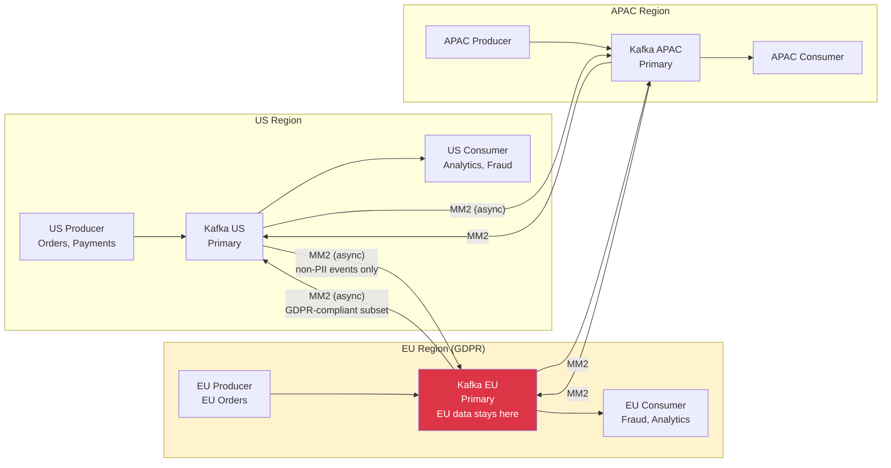

## Keywords in This File
{: .no_toc }

| # | Keyword | Weight |
|---|---|---|
| 1 | [Messaging at Scale - Multi-Region and Global Patterns](#messaging-at-scale---multi-region-and-global-patterns) | medium |

---

# Messaging at Scale - Multi-Region and Global Patterns

---

### 🎯 Model Answer

**30 seconds:**
> Global messaging at scale requires decisions on three dimensions: data locality (which events should flow globally vs stay regional for latency or compliance), consistency model (is eventual consistency across regions acceptable, or do some operations require cross-region coordination), and failure model (what happens when a region is partitioned from others). The dominant pattern is: produce to the nearest region, replicate asynchronously to other regions, and design consumers to tolerate eventual consistency across regions. Strong consistency across regions is architecturally possible but comes with latency penalties equal to the cross-region round trip.

**3 minutes (Senior):**
> Scaling messaging globally forces you to confront the CAP theorem in concrete engineering decisions. You cannot have consistency, availability, and partition tolerance simultaneously across multiple geographic regions. The partition (network failure between regions) will happen. The choice is: do you sacrifice consistency (allow regional clusters to diverge during a partition and reconcile after) or availability (halt writes in a region that loses connectivity to the primary). For most messaging use cases - analytics, notifications, operational events - eventual consistency is the right trade-off. A regional Kafka cluster can accept writes independently. MirrorMaker 2 replicates events to other regions asynchronously. Consumers in each region receive events seconds to minutes after production. The failure mode is clear: during a region partition, consumers in the disconnected region process stale events. After recovery, they process the backlog. For ordering, payment, and inventory events - where consistency matters - the architecture is different. A single logical partition (primary region) accepts all writes. Consumers in other regions read via mesh routing from the primary. Cross-region write requests from users near non-primary regions incur latency. This is the trade-off: consistency requires centralization; availability requires distribution. The architectural decision point is per-event-type, not per-system: analytics events can be eventually consistent; order events may need stronger guarantees. Design your global topology at the event type level.

**Framework:** WHAT -> WHY -> HOW -> TRADE-OFF -> EXAMPLE

*Adapting up:* Add: global ordering with distributed sequence numbers, conflict-free replicated data types (CRDTs) for eventually consistent state, multi-leader replication with vector clocks.

*Adapting down:* "Global messaging means having Kafka in multiple countries so users get low latency. Events are produced to the nearest Kafka cluster and copied to others. The challenge is that events may arrive in a different order in different regions."

**Blank Mind Recovery:**
If you blank in the interview:

**(1) Restate:** "Global messaging patterns - let me think through what changes when you need messaging to work across continents."

**(2) First principles:** "Speed of light is 200ms from US to EU and back. Any operation requiring cross-region consensus costs at least 200ms. Design to avoid cross-region consensus on the critical path. Accept that events are eventually consistent across regions."

**(3) Bridge:** "Think of DNS - writes to DNS propagate globally with eventual consistency. Nobody expects a DNS update to be instantly visible worldwide. Apply the same mental model to event propagation: events produced in one region eventually reach all regions."

---

### 📘 Concept Explanation

**What it is:**
Global messaging patterns are architectural strategies for running message broker systems across multiple geographic regions, handling the trade-offs between latency (serve local users locally), consistency (ensure events are seen in the same order everywhere), availability (continue operating during cross-region network failures), and data sovereignty (keep regulated data in specific regions).

**The problem it solves:**
A single-region messaging cluster forces all producers and consumers to route to one location, causing: high latency for geographically distributed services, single region as a reliability risk, and compliance violations for data that cannot cross borders. Global messaging patterns allow services to interact with a local broker while events propagate globally.

**How it works:**

Global pattern options:
```
PATTERN 1: Async Replication (eventual consistency)
  Each region: independent Kafka cluster
  Replication: MirrorMaker 2 or Cluster Linking
    (async, seconds to minutes lag)
  
  Producer in US -> US Kafka
  US Kafka -> [async] -> EU Kafka
  EU Consumer <- EU Kafka (seconds delayed)
  
  Pros: low write latency, regional independence
  Cons: eventual consistency, possible ordering skew
  Use for: notifications, analytics, catalog events

PATTERN 2: Single Primary, Multi-Region Read
  Primary: us-east-1 (all writes)
  Replicas: eu-west-1, ap-southeast-1 (read-only)
  Routing: mesh routes cross-region reads from replicas
  
  EU Producer -> mesh -> us-east-1 Kafka (primary)
  EU Consumer <- eu-west-1 Kafka (replica, seconds behind)
  
  Pros: consistent write ordering globally
  Cons: write latency for non-primary regions
  Use for: order events, financial transactions

PATTERN 3: Active-Active Multi-Master
  Each region: accepts writes to its own partition namespace
  Replication: bidirectional (Cluster Linking active-active)
  Consumer: reads from local + remote events merged
  
  US order: order-us-123 (produced in US)
  EU order: order-eu-456 (produced in EU)
  Both visible in all regions after replication
  
  Pros: lowest write latency globally
  Cons: ordering across regions is undefined;
    consumers see global event stream eventually
  Use for: globally distributed IoT, gaming events
```

> **Code walkthrough:** This Multi-Region and Global Patterns example demonstrates a key concept in practice using Kafka messaging. **KEY MECHANISM:** the runtime executes these instructions in sequence with specific memory and execution semantics. **WHY IT MATTERS:** misapplying this pattern causes subtle bugs that only manifest under production load. **TAKEAWAY: understand the execution model before using this pattern in production code.**

Event ordering in global systems:
```
Problem: total ordering across regions is impossible
  without centralization.

US produces: order-1 at T=10ms
EU produces: order-2 at T=12ms
  (US and EU clocks may drift by 1-5ms)
  
In US cluster: order-1, order-2
In EU cluster: order-2, order-1 (arrived first locally)

Solution options:
1. Accept: ordering is per-region, globally eventual
2. Centralize: all writes to primary, total order
3. Use logical timestamps: 
   Lamport clocks or Hybrid Logical Clocks (HLC)
   provide causally consistent ordering
```

> **Code walkthrough:** This Multi-Region and Global Patterns example demonstrates a key concept in practice. **KEY MECHANISM:** the runtime executes these instructions in sequence with specific memory and execution semantics. **WHY IT MATTERS:** misapplying this pattern causes subtle bugs that only manifest under production load. **TAKEAWAY: understand the execution model before using this pattern in production code.**

**The key insight:**
Global messaging is a set of trade-offs, not a single solution. The trade-offs are per-event-type: decide for each event class whether availability or consistency is the priority, and apply the matching pattern. Do not use the same global topology for all events.

**When to use it:**
- Async replication: analytics, notifications, catalog updates, telemetry
- Single primary: financial events, orders, inventory updates
- Active-active: IoT event ingestion, gaming, globally distributed writes

**When NOT to use it:**
- Do not use active-active for events that require total ordering (financial ledger entries)
- Do not use single primary if the primary region is unavailable frequently (defeats the purpose)
- Do not build global messaging from scratch - use managed services or proven tools (MM2, Cluster Linking)

**Alternatives:**
- AWS EventBridge cross-region: managed event routing between AWS regions
- Apache Pulsar: built-in geo-replication at the broker level
- Kafka Cluster Linking (Confluent): commercial active-active with conflict resolution

**First-principles derivation:**
Global consistency requires that all nodes agree on the order of events. Agreement requires communication. Communication across regions takes 50-200ms. Therefore, strict global consistency costs 50-200ms per operation minimum. At 1 million events/second globally, this 200ms adds up to 200,000 events in flight awaiting consistency acknowledgment at any moment. Design for eventual consistency unless the business requirement demands strict ordering, and accept the latency cost explicitly.

---

### 💻 Code Example

```java
// BAD: Single-cluster globally routed producer
// All producers connect to us-east-1 regardless
// of their geographic location

Properties props = new Properties();
props.put("bootstrap.servers",
    "us-east-1-kafka.example.com:9092");
// EU service connects to US Kafka
// Adds 100-200ms RTT to every send
// US Kafka becomes single point of failure for all
// EU write operations blocked during US outage
```

> **Code walkthrough:** A global service in London connecting to a Kafka cluster in Virginia adds 100-200ms to every message send. At 10,000 messages/second, this is a significant latency and the US Kafka is a single point of failure for all global producers.

```java
// GOOD: Region-aware producer with local cluster

@Configuration
public class GlobalKafkaConfig {
  @Value("${service.region}")  // injected at deploy time
  private String region;

  @Bean
  public ProducerFactory<String, Object>
      producerFactory() {
    Map<String, Object> config = new HashMap<>();
    // Each region has its own Kafka cluster
    config.put(ProducerConfig.BOOTSTRAP_SERVERS_CONFIG,
        getRegionalBootstrapServers(region));
    config.put(ProducerConfig.ACKS_CONFIG, "all");
    config.put(ProducerConfig.ENABLE_IDEMPOTENCE_CONFIG,
        true);
    return new DefaultKafkaProducerFactory<>(config);
  }

  private String getRegionalBootstrapServers(
      String region) {
    return switch (region) {
      case "us-east-1" -> "kafka-us.example.com:9092";
      case "eu-west-1" -> "kafka-eu.example.com:9092";
      case "ap-southeast-1"
          -> "kafka-ap.example.com:9092";
      default -> throw new IllegalArgumentException(
          "Unknown region: " + region);
    };
  }
}

// Events written to local cluster (< 5ms latency)
// MM2 or Cluster Linking replicates to other regions
// Consumers in each region read from local cluster
// (seconds behind the producing region)
```

> **Code walkthrough:** The region-aware producer writes to the geographically nearest Kafka cluster, reducing write latency from 100-200ms (cross-Atlantic) to under 5ms (same data center). Replication to other regions is asynchronous. This pattern assumes consumers can tolerate eventual consistency - seconds of lag between when an EU consumer produces and when a US consumer sees the event.

```java
// PRODUCTION: Globally-ordered events via single primary
// For events requiring total ordering (financial)

@Service
public class FinancialEventPublisher {
  // PRIMARY_REGION = us-east-1 for all financial events
  // Other regions route through mesh to this cluster
  private final KafkaTemplate<String, Object>
      primaryClusterTemplate;

  public void publishPaymentEvent(
      PaymentEvent event) {
    // Always write to primary - no local cluster shortcut
    primaryClusterTemplate.send(
        "payment-events",
        event.getPaymentId(),
        event);
    // EU caller: ~120ms added latency per write
    // Trade-off: accepted for financial consistency
  }
}

// Consumer in EU reads from EU replica cluster
// which mirrors from primary with ~500ms lag
// Financial events in EU are consistent but delayed
@KafkaListener(
    topics = "us-east-1.payment-events", // mirrored topic
    groupId = "fraud-detection-eu")
public void onPayment(PaymentEvent event) {
  // Process EU-visible financial events
  // Lag is acceptable: fraud detection runs post-payment
  fraudDetectionService.analyze(event);
}
```

> **Code walkthrough:** Financial events always write to the primary cluster (us-east-1) for total ordering. EU services that produce financial events accept the 120ms cross-region latency on writes. EU consumers read from a mirrored topic on the EU cluster, which is ~500ms behind the primary. This is acceptable for fraud detection (post-payment analysis) but not for real-time payment authorization.

```bash
# DEBUGGING: Cross-region replication health check

# Check MirrorMaker 2 replication lag
# On source cluster:
kafka-consumer-groups.sh \
  --bootstrap-server primary-kafka:9092 \
  --describe --group mm2-us-east-1-eu-west-1
# LAG column: how many messages behind the replication is

# Check message arrival time skew across regions
# Producer publishes with timestamp header
# Consumer checks: receipt_time - event_timestamp
# Normal: < 2000ms
# Alert: > 10000ms (replication lag exceeding SLA)

# Cross-region offset mapping
# MM2 stores offset mappings in checkpoint topics
# To verify consumer can resume after failover:
kafka-console-consumer.sh \
  --bootstrap-server eu-kafka:9092 \
  --topic mm2.us-east-1.checkpoints.internal \
  --from-beginning | head -20
# Verifies MM2 is tracking consumer group offsets
# for DR failover scenarios
```

> **Code walkthrough:** The MM2 consumer group lag is the primary replication health metric. If the MM2 consumer group is 100,000 messages behind on the source cluster, that is 100,000 messages not yet in the destination cluster. The replication RPO equals the lag at any moment. Alert when MM2 consumer group lag exceeds your replication SLA (e.g., 5 minutes of production at the topic's throughput rate).

---

### 🎓 Answers by Seniority

**Junior / Mid (0-5 years):**
> "Global Kafka patterns involve having separate Kafka clusters in different regions so services can produce and consume locally without cross-region latency. MirrorMaker 2 copies events between clusters so all regions eventually have the same data. The main challenge is that events are not immediately visible in other regions - there is a replication lag of seconds. This eventual consistency is acceptable for many use cases like analytics and notifications, but for financial transactions you may need all writes to go to a primary region for consistent ordering."

---

**Senior / Staff (5+ years):**
> "Global messaging architecture is fundamentally about choosing where you accept the trade-offs between latency, consistency, and availability - and the answer is different for different event types within the same system. For analytics and telemetry, produce locally, replicate eventually, consumers tolerate seconds of lag. For orders and payments, I want total ordering which requires a single primary - accept the cross-region write latency or keep the write path in the same region as the primary. The mistake I see teams make: designing a global topology and applying it uniformly to all events. Then the financial team complains about ordering guarantees, and you discover you need a different topology for financial events. Design the global topology per-event-class up front: define which events are eventually consistent and which require strong ordering, then deploy different infrastructure for each class."

---

### ⚠️ Common Misconceptions

**Misconception 1: "Active-active multi-region means all regions always have the same events in the same order."**
Reality: Active-active means all regions accept writes. Events produced in different regions are replicated asynchronously. Order of globally merged events is not guaranteed. Region A's consumer may see events in order [A1, A2, B1, B2], and region B's consumer sees [B1, B2, A1, A2] - both valid locally, but different globally. True global ordering requires centralizing all writes to a single primary.

**Misconception 2: "MirrorMaker 2 replicates with zero lag."**
Reality: MM2 is asynchronous replication. Lag ranges from milliseconds (low-volume topics, well-provisioned MM2) to minutes (high-volume topics or MM2 under-provisioned). Zero-lag is not achievable with asynchronous replication. Plan your global topology assuming seconds to minutes of replication lag, and test under production-equivalent load to measure actual lag.

**Misconception 3: "We need the same Kafka topic configuration in all regions for consistency."**
Reality: Different regions may need different configurations. EU clusters may have encryption-at-rest with regional KMS keys that the US cluster does not use (GDPR requirement). APAC clusters may have different retention periods due to storage costs. What must be consistent is the schema (producers and consumers must use compatible schemas regardless of region). Infrastructure configuration can differ per region.

---

### 🚨 Failure Modes and Diagnosis

**Failure 1: Cross-region replication gap causes consumer read of non-existent data**

Symptoms: Consumer in EU reads an event with a reference to a US-produced entity (e.g., product ID) that has not yet arrived in EU's data store. 404 on lookup. Event appears to reference a non-existent resource.

Root cause: Event arrives before the data it references. The product catalog update was produced in US and replicated to EU with 30-second lag. The order event referencing the new product arrived in EU 10 seconds after production - before the product catalog reached EU.

Diagnosis: Check the replication lag of the product catalog topic vs the order events topic. If order events lag < catalog lag, the consumer will see references to not-yet-replicated data.

Fix: Design for referential eventual consistency - consumers retry lookups for missing entities with exponential backoff, or use ECST (event-carried state transfer) to embed the product details in the order event rather than requiring a cross-service lookup.

---

**Failure 2: Region A partition causes active-active divergence**

Symptoms: After a network partition between US and EU heals, US and EU clusters have different message sequences for the same event type. Consumer group offsets cannot be reconciled.

Root cause: Active-active topology allowed both regions to write to the same logical topic during the partition. Messages were produced in both regions with overlapping offsets (since they did not know about each other).

Diagnosis: Compare high watermarks and specific offset ranges for the affected topic in both clusters. Identify the divergence start point (when the partition began) and the range of conflicting messages.

Fix: Implement active-passive for events where ordering matters. Active-active is appropriate only for event types where global ordering is not required. For ordered events, designate a primary and route all writes through it.

---

**Failure 3: Schema drift between regions**

Symptoms: Events arrive in EU cluster with schema version that EU consumers do not recognize. Deserialization failures in EU consumer.

Root cause: Schema registry in US was updated with a new schema version. EU schema registry was not federated or updated. EU consumer reads a message with the new schema but local registry only knows the old version.

Diagnosis: Compare schema versions between US and EU schema registries for the affected subject. Check if schema registry federation (MM2 for schema replication or manual sync) is configured and running.

Fix: Implement schema registry federation. All schema changes must replicate to all regional registries before the producer is deployed. Run schema validation in CI against all regional registries.

---

### 🎯 Interview Deep-Dive

| Category | Expected Time | Minimum Questions |
|---|---|---|
| Definition | 2 min | 1-2 |
| Mechanism | 3 min | 2-3 |
| Comparison | 2 min | 1-2 |
| Scenario | 5 min | 2-3 |
| Debugging | 5 min | 2-3 |
| Deep Dive | 5 min | 2 |
| Misconception | 2 min | 1 |
| Scale | 3 min | 1-2 |
| Behavioral | 3 min | 1 |

**[JUNIOR] Q1 - [CONCEPTUAL] Definition**
**"What are the main patterns for global Kafka deployment and what trade-offs does each involve?"**

*What to say:*
> "Three main patterns: Async replication: independent regional clusters connected by MirrorMaker 2 or Cluster Linking. Producers write to local cluster (low latency). Events replicate to other regions with seconds to minutes lag (eventual consistency). Best for analytics, notifications, catalog events where staleness is acceptable. Single primary: one region accepts all writes, others are read replicas. Global write ordering is guaranteed. Non-primary regions incur cross-region write latency. Best for financial events and orders requiring total ordering. Active-active: all regions accept writes to their own partition namespace. Bidirectional replication merges event streams. Global ordering is undefined. Best for IoT ingestion and gaming events where events are logically independent. The trade-off axis: consistency vs latency. Stricter consistency (single primary) costs latency. Lower latency (async replication) costs consistency."

*What separates good from great:* Add: "The decision is per-event-type, not per-system. A single e-commerce platform can use async replication for product catalog updates (eventually consistent is fine), single primary for order events (need total ordering), and active-active for clickstream analytics (latency-critical, no ordering needed). Design at the event type level."

---

**[JUNIOR] Q2 - [CONCEPTUAL] Mechanism**
**"How does MirrorMaker 2 replicate consumer group offsets across clusters, and why does this matter for DR failover?"**

*What to say:*
> "MirrorMaker 2 runs the MirrorCheckpointConnector alongside the MirrorSourceConnector. The checkpoint connector periodically reads the committed offsets of specified consumer groups from the source cluster and translates them to equivalent offsets in the destination cluster. It stores these translations in a checkpoint topic on the destination cluster. When a DR failover occurs: the consumer switches its bootstrap server to the DR cluster. Instead of starting from auto.offset.reset (earliest or latest), it reads the translated offset from the checkpoint topic and resumes from that position. This is critical because Kafka offsets are cluster-specific - offset 1050000 in the source cluster does not correspond to offset 1050000 in the destination cluster (the destination topic starts at offset 0 when created by MM2, and message numbering diverges). The checkpoint connector provides the mapping. Without checkpoint replication, a failover consumer starts at latest (missing all messages since the last produced) or earliest (reprocessing everything from the beginning). The RPO after failover equals the time between the last checkpoint write and the moment of failure - typically seconds with checkpoint interval of 10-30 seconds."

*What separates good from great:* Add: "Test the checkpoint mechanism regularly. It is common for teams to configure MM2 correctly but never verify that the offset translation works until a real DR event. Run quarterly DR drills that actually fail over consumer groups to the DR cluster and verify they resume from the correct offset."

---

**[JUNIOR] Q3 - [CONCEPTUAL] Comparison**
**"Compare Kafka MirrorMaker 2, Confluent Cluster Linking, and Apache Pulsar geo-replication for global messaging."**

*What to say:*
> "MirrorMaker 2: open-source, runs as Kafka Connect. Async replication with typical lag of seconds to minutes. Requires operating a Connect cluster. Handles offset translation for DR. Works with any Kafka deployment. Best for organizations committed to open-source Kafka. Confluent Cluster Linking: commercial feature built into the Kafka broker. Replication lag in milliseconds vs MM2's seconds. Simpler operation - no separate Connect cluster. Supports active-active with conflict detection. Offset sync is built-in, more reliable than MM2 offset translation. Best for Confluent Platform customers who can accept vendor lock-in. Apache Pulsar: built-in geo-replication at the broker level, not a separate tool. Pulsar topics can have replication configured per-message. Near-zero added latency for cross-region replication. Multi-tenancy built in. Trade-off: different architecture from Kafka (requires Pulsar expertise), smaller ecosystem, operational complexity of BookKeeper + ZooKeeper + Pulsar broker trio. Best for new deployments where geo-replication is a first-class requirement and team is willing to invest in Pulsar expertise."

*What separates good from great:* Add: "For most organizations with existing Kafka investments, MM2 is the practical choice despite its limitations. Pulsar's geo-replication advantages are real, but the operational cost of running Pulsar alongside existing Kafka infrastructure often exceeds the replication benefit. Evaluate Pulsar for greenfield deployments, not as a drop-in replacement."

---

**[MID] Q4 - [CONCEPTUAL] Scenario**
**"Design a global order processing system serving US, EU, and APAC users with sub-100ms write latency and EU GDPR compliance."**

*What to say:*
> "Constraints: sub-100ms write latency globally + GDPR (EU data in EU only). These constraints conflict with a single-primary approach (US primary adds 100-150ms for EU writes). Solution: regional write primary per geographic boundary. Three Kafka clusters: us-east-1, eu-west-1, ap-southeast-1. EU users write to eu-west-1 cluster (< 20ms latency). US users write to us-east-1. APAC users write to ap-southeast-1. Order events contain a region marker (eu, us, ap). GDPR compliance: EU order events stay in eu-west-1 for primary storage. Anonymous order metrics (no PII) replicate globally for analytics. EU cluster replicates to US and APAC only events that are GDPR-compliant (no customer PII) - product sold counts, revenue aggregates. EU customer data events never leave the EU cluster. Global ordering challenge: orders are independent - order-eu-456 and order-us-789 do not need to be globally ordered. Each region's order stream is independently ordered. Cross-region inventory updates (which must be globally consistent) go through a separate single-primary inventory topic (us-east-1 primary, others replicate). Write latency for inventory: accept the 100ms penalty for cross-region consistency on inventory updates."

*What separates good from great:* Add: "The hybrid design - regional primaries for order events, single primary for inventory - reflects the reality that different event types have different consistency requirements. Document this explicitly in the architecture decision record so future engineers understand why there are two different topologies."

---

**[MID] Q5 - [DEBUGGING] Debugging**
**"EU consumers are 5 minutes behind US producers on a globally replicated topic. It was under 30 seconds before a new data center was added. What changed?"**

*What to say:*
> "A new data center addition that increased replication lag points to: either the replication path changed (traffic now routes through the new DC, adding hops), or the new DC added network congestion to the replication path, or MM2 was deployed in the new DC and is misconfigured. Investigation: first, check the MM2 consumer group lag on the US cluster for the EU replication consumer group - has lag grown from its baseline? Second, check network latency from US to EU: ping from US broker to EU broker, traceroute to identify if the path changed with the new DC addition. Third, check if any new MM2 connector was deployed that mirrors the same topic (duplicate replication creating extra load). Fourth, check if the EU Kafka cluster's disk I/O or CPU is saturated from additional load from the new DC. Diagnosis tool: kafka-consumer-groups.sh on the source cluster shows MM2's consumer group lag. If lag is growing, MM2 cannot keep up with the source topic's production rate."

*What separates good from great:* Add: "5 minutes vs 30 seconds is a 10x degradation - this is not a gradual drift, it is a step change. Step changes correlate with specific deployments or configuration changes. Check the deployment log and configuration change log around the time the lag increased. The cause is almost always a specific change that happened at a specific time."

---

**[MID] Q6 - [CONCEPTUAL] Deep Dive**
**"Explain hybrid logical clocks (HLC) and how they enable causally consistent event ordering in global Kafka systems."**

*What to say:*
> "Lamport clocks assign a monotonically increasing counter to events. Event A happens before B means A's counter < B's counter. Problem: clocks on distributed machines drift, and Lamport clocks only capture logical order, not wall-clock time. Hybrid Logical Clocks (HLC) combine physical time (wall clock) with a logical counter. The HLC timestamp for an event is max(local_clock, max_of_received_HLC_timestamps) plus a counter to handle ties. This ensures: HLC timestamps are monotonically increasing even when clocks drift, HLC timestamps are close to wall-clock time (bounded by NTP precision), and causality is preserved - if A causally precedes B, HLC(A) < HLC(B). In global Kafka: producers include an HLC timestamp in every message. Consumers in all regions process messages in HLC timestamp order (not Kafka offset order). Since HLC timestamps are globally comparable, a US consumer and an EU consumer processing the same topic will see events in the same causal order, even though they have different Kafka offsets on their local clusters. Trade-off: HLC-ordered processing requires holding messages in a buffer until all messages with lower HLC values have been received (you cannot process message T without knowing that no message with HLC < T is still in-flight). This adds latency proportional to the maximum expected replication lag."

*What separates good from great:* Add: "HLC is most valuable for event sourcing scenarios where you rebuild aggregate state from events. Without causal ordering, rebuilding state from a globally replicated event log can produce incorrect state if events arrive out of causal order. HLC guarantees that the rebuild produces the same state regardless of which regional replica you process from."

---

**[SENIOR] Q7 - [CONCEPTUAL] Scenario**
**"Your globally replicated system has an EU consumer that must never see a US-produced order before the corresponding EU inventory update. How do you guarantee this?"**

*What to say:*
> "This is a causal consistency requirement: EU consumer must see inventory updates before the orders that depend on them. Naive async replication violates this - inventory update replication lag may put the order event before the inventory update in the EU cluster. Solutions: (1) Write dependency in the producer: the US order service checks that the inventory update has replicated to EU (by polling the EU cluster's schema or a sentinel record) before publishing the order event. This creates cross-region coupling in the producer code path. (2) Causal barrier: the order event includes the HLC timestamp of the inventory update it depends on. The EU consumer delays processing the order event until it has received all inventory events with lower HLC timestamps. This requires a buffering layer. (3) Redesign the dependency: use event-carried state transfer - embed the inventory details in the order event. The EU consumer does not need a separate inventory update; it reads the inventory snapshot from the order event itself. Option 3 is the cleanest: it eliminates the cross-region causal dependency by making the order event self-contained. Options 1 and 2 are valid but add complexity."

*What separates good from great:* Add: "The embedded inventory snapshot (option 3) has its own trade-off: the order event becomes larger (fat message concern) and the inventory view in the event may diverge from the actual inventory state if the inventory was updated between the order creation and event publication. The exact-timestamp snapshot embedded in the event is the authoritative view of inventory at the time of the order."

---

**[SENIOR] Q8 - [CONCEPTUAL] Behavioral**
**"Tell me about a time you had to make a trade-off decision in global messaging architecture."**

*What to say (structure):*
> "SITUATION: We were expanding a US-only order processing system to Europe. The existing system had a single Kafka cluster in us-east-1 with strict order-of-events requirements (inventory events must precede shipment events). TASK: Design a global topology that supports EU users with low latency while maintaining ordering guarantees. ACTION: The team initially proposed an active-active topology where both US and EU clusters accept all writes. I pushed back: active-active cannot guarantee total ordering across regions, and our inventory system depended on it. I proposed a compromise: EU cluster for EU-produced analytics and notification events (eventually consistent, low latency for EU users), but all inventory and order events flow through a single primary (us-east-1). EU producers of order events accept the ~120ms write latency to us-east-1. EU consumers of order events read from the EU replica cluster with ~500ms lag. RESULT: The hybrid topology satisfied both requirements. EU users saw sub-150ms order creation response times (the HTTP round trip, not the Kafka write). EU consumers received consistent, ordered events within 500ms. The team had a clear mental model: eventually-consistent events use regional clusters; strictly-ordered events use the primary. LESSON: Resist the temptation to design one global topology for all events. The trade-offs differ by event type."

*What separates good from great:* Add: "The hardest part was explaining to the EU team why their order event writes had to go to a US server. I used the analogy of currency trading: currency prices are set globally by a centralized exchange even though traders are everywhere. The exchange is the authority because it maintains the order book. Our us-east-1 cluster is the order book for inventory events."

---

**[SENIOR] Q9 - [ARCHITECTURE] Scale**
**"How does global event throughput change when you scale from 1 million to 1 billion events per day per region?"**

*What to say:*
> "At 1 million events per day per region, global replication is a small fraction of total infrastructure. At 1 billion per day per region with 3 regions, global replication must move 3 billion events per day - 34,000 events per second average. The scaling challenges: MM2 throughput becomes a constraint - MM2 must consume and reproduce at 34,000 events/second. This requires multiple MM2 Connect workers and significant parallelism. Network bandwidth: at 1KB per event average, 34,000 events/second = 34 MB/second of cross-region network traffic. With 3 bidirectional replication pairs, this is 204 MB/second of dedicated replication bandwidth. Cloud providers charge for inter-region egress. At $0.02/GB for us-east-1 to eu-west-1: 34 MB/s * 86,400 seconds/day * $0.02/1024 MB = ~$57/day per replication pair. At scale, replication egress cost is a significant budget line. Cost optimization: replicate only necessary events globally (filter by event type at MM2), compress events before replication (lz4 or zstd), use reserved network capacity (Confluent Dedicated Cluster private networking)."

*What separates good from great:* Add: "At 1 billion events per day per region, consider whether all events need to be replicated globally. Filtering at the MM2 level - replicate only events matching specific topic patterns or event type headers - can reduce cross-region volume by 50-80% for systems where most events are regional in nature."

---

**[STAFF] Q10 - [CONCEPTUAL] Misconception**
**"Global Kafka means one topic that all producers and consumers worldwide use."**

*What to say:*
> "A single global Kafka topic with all producers and consumers is one of the anti-patterns of global messaging. The problems: all producers must connect to a single cluster, adding cross-region latency for non-collocated producers. All consumers must fetch from a single cluster, same latency issue. The single cluster is a global failure domain - an outage affects all regions simultaneously. Data sovereignty is impossible - all events in one cluster in one country. The correct model: regional Kafka topics that are logically the same event stream but physically hosted on regional clusters. A topic called order-events exists independently in each regional cluster. MirrorMaker 2 replicates between them. Producers write to their local cluster. Consumers read from their local cluster. The logical event stream is the same; the physical storage is distributed. If global total ordering is required (rare), use a single-primary approach where all writes go to the primary cluster but consumers can still read from regional replicas with acceptable lag."

*What separates good from great:* Add: "The single global topic anti-pattern often emerges from developers who think of Kafka like a relational database table - one table, many readers and writers. Kafka topics are logs, not tables. You can have multiple physical copies of the same logical log, distributed globally, while maintaining the semantic equivalence of the event stream."

---

**[STAFF] Q11 - [CONCEPTUAL] Deep Dive**
**"How do you handle the global event ordering problem for events that cross domain boundaries?"**

*What to say:*
> "Global cross-domain event ordering is one of the hardest problems in distributed systems. The challenge: Order service in US publishes order.created. Inventory service in EU reacts and publishes inventory.reserved. Payment service in US reads both events and needs to know they are causally related. But the events are in different regional clusters. Solution approaches: (1) Correlation ID chain: each event carries a root correlation ID (the order ID) and a parent event ID (the event that caused it). Payment service can reconstruct the causal chain without global ordering. (2) Saga orchestrator as causal coordinator: the saga orchestrator tracks the causal chain explicitly. It knows that inventory.reserved was caused by order.created because it sent the command. No reliance on event ordering. (3) Functional dependency documentation: explicitly document which events are causally dependent and where the ordering contract is. Use single-primary replication for causally linked event streams. The practical approach: most cross-domain event sequences can be handled with correlation IDs and idempotency (process events in any order, achieve correct final state). Total ordering across domains is rarely necessary when each domain maintains consistent local state."

*What separates good from great:* Add: "The framing shift: instead of trying to establish global event ordering (which requires centralization), ask 'what is the correct final state after all events are processed?' If the answer does not depend on global ordering (idempotent, commutative processing), you do not need global ordering. Design your event processing to be order-independent within a causal context, and use correlation IDs to reconstruct the context."

---

**[STAFF] Q12 - [CONCEPTUAL] Edge Case**
**"What happens to global event processing during a planned cross-region Kafka upgrade?"**

*What to say:*
> "A planned upgrade in one region creates a temporary asymmetry in the global mesh. During the upgrade: the upgrading region's cluster goes through a rolling restart. Each broker is taken down, upgraded, restarted. Rolling restart takes 30-120 minutes for a large cluster. During this window: MM2 replication from the upgrading region to others is intermittent - it may pause during broker restarts and resume after. Lag on the destination side grows during the upgrade. MM2 from other regions to the upgrading region may experience connection errors during individual broker restarts (expected and should not cause permanent failures). Consumer groups in the upgrading region experience micro-disruptions (leader elections during rolling restart). Protocol version compatibility: during a rolling upgrade, old and new brokers coexist. The inter-broker protocol version and message format version must be kept at the old version during the upgrade until all brokers are updated, then bumped. MM2 uses the same protocol version as the cluster, so this is handled automatically. Post-upgrade: all MM2 connections reconnect, lag drains, and normal operation resumes. Best practice: upgrade one region at a time, monitor MM2 replication lag throughout, and run the upgrade during a low-traffic window."

*What separates good from great:* Add: "Before any global upgrade, verify that the upgrade path is supported between the current and target versions - some upgrades require intermediate version steps. Test the full upgrade procedure in a staging environment that mirrors the production global topology to avoid surprises in production."

---

### ⚖️ Comparison Table

| Pattern | Write Latency | Read Latency | Ordering | Data Residency | Complexity |
|---|---|---|---|---|---|
| Async replication | Local (< 10ms) | Local (< 10ms) | Per-region | Configurable | Medium |
| Single primary | Primary only (< 10ms), non-primary adds RTT | Local (< 10ms from replica) | Global total order | Fixed in primary | Medium-High |
| Active-active | Local (< 10ms) | Local (< 10ms) | None globally | Configurable | High |
| Stretch cluster | Adds cross-AZ RTT | Local | Total order | Spans AZs | High |

**The deciding factor:** Default to async replication. Use single primary only for events requiring total global ordering. Use active-active only when ordering is explicitly not required and latency is the dominant concern.

---

### 🏛️ System Design

**Design a global payment event system for a fintech platform serving 150 countries with total ordering requirements and data residency compliance.**

```
GLOBAL PAYMENT EVENT SYSTEM

Requirements:
  - Total ordering of payment events (ledger integrity)
  - Data residency: EU payments in EU, US in US
  - 99.999% availability
  - < 200ms end-to-end latency

Solution: Regional Primary per Compliance Zone

COMPLIANCE ZONE 1: Americas (US+LATAM)
  Primary Kafka: us-east-1
  All Americas payment events -> us-east-1
  Write latency LATAM: 50-100ms (acceptable)
  
COMPLIANCE ZONE 2: EU/EEA
  Primary Kafka: eu-west-1
  All EU payment events -> eu-west-1
  GDPR: EU events NEVER leave eu-west-1
  
COMPLIANCE ZONE 3: APAC  
  Primary Kafka: ap-southeast-1
  APAC payment events -> ap-southeast-1

CROSS-ZONE REPLICATION:
  Americas -> EU: anonymized aggregate data only
    (revenue by product, not by customer)
  EU -> Americas: same (GDPR-compliant subset)
  
GLOBAL FRAUD DETECTION:
  Fraud model needs global transaction patterns
  Solution: tokenize customer ID before replication
    (token is consistent globally, PII stays regional)
  Global fraud cluster receives tokenized events
  Only the regional cluster knows the real customer ID

TOPOLOGY:
  Payment API (EU) -> eu-west-1 Kafka
                         |
                         +-> EU Fraud Consumer
                         |
                         +-> Tokenize -> Global Fraud Cluster
```

> **Code walkthrough:** This Unknown example demonstrates a key concept in practice using Kafka messaging. **KEY MECHANISM:** the runtime executes these instructions in sequence with specific memory and execution semantics. **WHY IT MATTERS:** misapplying this pattern causes subtle bugs that only manifest under production load. **TAKEAWAY: understand the execution model before using this pattern in production code.**

---

### 📊 Diagram

```
GLOBAL MESSAGING: REGIONAL WRITE + ASYNC REPLICATE

      US Users         EU Users          APAC Users
         |                |                   |
    (<5ms write)    (<5ms write)          (<5ms write)
         v                v                   v
   +----------+    +----------+       +----------+
   | US Kafka |    | EU Kafka |       | APAC     |
   | Primary  |    | Primary  |       | Kafka    |
   | orders   |    | orders   |       | Primary  |
   +-----+----+    +----+-----+       +----+-----+
         |              |                  |
         | MM2 (async)  | MM2 (async)      | MM2
         v              v                  v
   +-----+----+    +----+-----+       +----+-----+
   | US Kafka |    | EU Kafka |       | APAC     |
   | Replica  |    | Replica  |       | Replica  |
   | of EU/AP |    | of US/AP |       | of US/EU |
   +----------+    +----------+       +----------+
   
   US consumers read US primary + EU/APAC replicas
   (all events eventually, with seconds of lag
    for cross-region events)
```



> **Diagram walkthrough:** Each region is a self-sufficient Kafka cluster that accepts local writes with sub-10ms latency. MirrorMaker 2 replicates events between regions asynchronously. The critical GDPR constraint (EU data stays in EU) is enforced at the MM2 filtering layer - only non-PII events replicate from EU to US and APAC. US and APAC services that need EU analytics receive the GDPR-compliant subset. EU customer data (orders with names and addresses) remains in the EU cluster only. This design achieves low write latency (local writes), eventual global consistency (seconds to minutes lag), and GDPR compliance (EU data never leaves the EU cluster).

---

### 💻 Code Example

*(Omit: this concept does not have a programmatic interface that can be demonstrated in code. The conceptual explanation above is sufficient.)*


---

### 🏛️ System Design

*(Omit: system design diagram not applicable for this concept - see ★★★ keywords for full system design coverage.)*


---

### ⚖️ Comparison Table

*(Omit: this is a ★☆☆ foundational concept with no direct alternatives to compare - see higher-difficulty keywords for trade-off analysis.)*


---

### 📊 Diagram

*(Omit: no standalone visual diagram required for this concept - the explanations and code examples above provide sufficient clarity.)*


