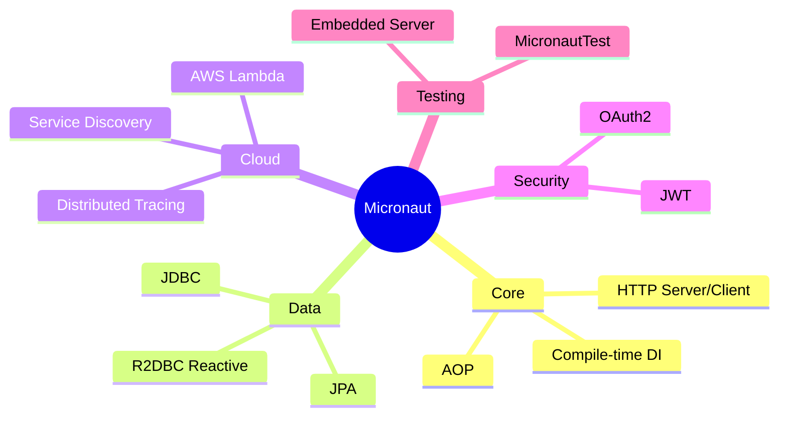

## Keywords in This File
{: .no_toc }

| # | Keyword | Weight |
|---|---|---|
| 1 | [Micronaut Ecosystem Overview](#micronaut-ecosystem-overview) | medium |
| 2 | [Why Micronaut Exists - Spring vs Micronaut](#why-micronaut-exists---spring-vs-micronaut) | medium |
| 3 | [Micronaut vs Spring Boot vs Quarkus](#micronaut-vs-spring-boot-vs-quarkus) | medium |
| 4 | [Micronaut Architecture Philosophy](#micronaut-architecture-philosophy) | medium |

---

# Micronaut Ecosystem Overview

**Interview Weight:** medium - Orientation question
asked to gauge whether you understand Micronaut's
position in the Java framework ecosystem before
discussing specific features.

---

### 🎯 Model Answer

**30 seconds:**

> Micronaut is a modern JVM framework for building
> microservices and serverless applications. Its
> defining characteristic: dependency injection and
> AOP are resolved at compile time (annotation
> processing), not at runtime via reflection. This
> eliminates JVM startup cost and reduces memory
> overhead. Micronaut targets cloud-native Java:
> fast startup, low memory, and native-image
> compatibility with GraalVM.

**3 minutes (Senior):**

> Micronaut ecosystem components:
>
> Core: IoC/DI container, AOP framework, HTTP server
> and client - all compile-time processed.
>
> Micronaut Data: data access layer. JDBC and JPA
> repositories with queries compiled at build time
> (no runtime proxy generation). Reactive variants
> via R2DBC.
>
> Micronaut HTTP: server (Netty-based), declarative
> client (@Client), reactive streams support.
>
> Micronaut Test: @MicronautTest annotation, embedded
> server for integration tests.
>
> Micronaut Cloud: service discovery (Consul, Kubernetes),
> distributed tracing, cloud function support (AWS Lambda,
> Google Cloud Functions).
>
> Micronaut Security: JWT, OAuth2, LDAP integrations.
>
> Micronaut Serialization: Jackson alternative that
> generates serialization code at compile time.
>
> GraalVM Native Image: all compile-time DI means
> no reflection surprises during native-image build.
> Micronaut is natively compatible.

**Blank Mind Recovery:**

**(1) Restate:** "You are asking about Micronaut - what
it is and where it fits in the Java ecosystem."

**(2) First principles:** "Frameworks like Spring use
reflection at runtime. Micronaut moves that work to
compile time. Same developer experience, different
execution model."

**(3) Bridge:** "Micronaut is what happens when you
ask: what if Spring's DI container worked like a
compiler plugin instead of a runtime engine? Faster
startup, lower memory, native-image friendly."

---

### 📘 Concept Explanation

```
Java Framework Positioning

Spring Boot      Micronaut        Quarkus
─────────────   ─────────────    ─────────────
Runtime DI      Compile-time DI  Build-time aug.
(reflection)    (APT-generated)  (bytecode aug.)

Startup: 2-5s   Startup: <300ms  Startup: <300ms
Memory: 200MB+  Memory: ~50MB    Memory: ~50MB
GraalVM: hard   GraalVM: easy    GraalVM: native
Maturity: high  Maturity: medium Maturity: growing
```



> **Diagram walkthrough:** Micronaut's ecosystem radiates
> outward from its compile-time core. Each module (Data,
> Cloud, Security) extends compile-time processing to
> its domain. Micronaut Data generates repository queries
> at compile time. Micronaut Security processes security
> annotations at compile time. The compile-time theme is
> consistent throughout the ecosystem.

---

### 🎓 Answers by Seniority

**Junior:** "Micronaut is a Java microservices framework
that does dependency injection at compile time instead
of runtime. This makes applications start faster and
use less memory."

**Senior:** "Micronaut's compile-time DI is the key
differentiator from Spring. Spring uses ClassPathScanningCandidateComponentProvider at startup to discover beans. Micronaut generates BeanDefinition classes during annotation processing - startup is just registering pre-built definitions. Result: 300ms startup vs 3 seconds."

---

### ⚠️ Common Misconceptions

**Misconception 1: Micronaut is a stripped-down Spring Boot.**

Micronaut is not a lighter version of Spring - it is a ground-up
redesign with a fundamentally different architecture. Spring processes
annotations at runtime using reflection. Micronaut processes
annotations at compile time using Java annotation processors (APT/KAPT).
This difference means Micronaut's runtime has no classpath scanning,
no runtime proxies, and no reflection-based dependency injection.
The APIs look superficially similar (both use `@Controller`, `@Inject`),
but the execution model is completely different.

**Misconception 2: Micronaut is only useful for serverless/Lambda.**

Micronaut's compile-time DI and fast startup benefit any deployment
where startup time matters: Kubernetes pods (faster scale-up),
testing (faster test cycles), and CI/CD pipelines (quicker feedback).
It also reduces memory per-instance - relevant for high-density
pod deployments with tight resource limits. The native image support
is a bonus, not the primary value proposition. Many teams use
Micronaut in traditional long-running services specifically for its
lower memory footprint compared to Spring.

**Misconception 3: Micronaut's compile-time approach means you
cannot use dynamic features at runtime.**

Micronaut restricts REFLECTIVE dynamic behavior - you cannot
dynamically create beans at runtime by scanning classes you did not
register. But it fully supports dynamic behavior that does not rely
on reflection: dynamic routing, runtime configuration overrides,
feature flags, event publishing, conditional beans via
`@Requires`, and programmatic bean registration via
`BeanDefinitionRegistry`. The restriction is specifically on
reflection-based meta-programming.

---

### 🚨 Failure Modes and Diagnosis

**Failure Mode 1: Application fails to start with
"No bean of type X found" after migrating from Spring.**

Symptom: `No bean of type [com.example.MyService] found` at
startup. Root cause: Micronaut requires beans to be discoverable
at compile time. If a class is in a JAR without Micronaut
annotation processing, or if it uses reflection-based proxy
patterns that Micronaut cannot process, the bean is invisible.
Diagnosis: check if the failing class is in a third-party JAR
without Micronaut support; check if it uses Spring-specific
annotations instead of `jakarta.inject.*`. Fix: use
`@Factory` to manually create the bean; add an explicit
`@Introspected` annotation; or use `@Requires` to gate the
missing dependency.

**Failure Mode 2: GraalVM native-image build fails with
"reflection not found" errors for Micronaut beans.**

Symptom: native build succeeds but runtime throws
`ClassNotFoundException` or `InstantiationException` for
Micronaut-managed classes. Root cause: a library used by
the Micronaut application uses reflection without registering
it, and the closed-world analysis misses it. Diagnosis: run
the native build with `-H:+ReportExceptionStackTraces` to get
detailed failure messages; use `reflect-config.json` to list
missing classes. Fix: add reflect/resource configuration for
the offending library; use Micronaut's GraalVM integration
annotations (`@ReflectiveAccess`) for classes that need it.

**Failure Mode 3: Slow compilation times in large projects
due to annotation processing overhead.**

Symptom: incremental builds take 30-60 seconds even for small
changes. Root cause: Micronaut's annotation processors run on
every compile cycle, regenerating bean definitions and HTTP
client stubs. Diagnosis: profile the build with Gradle's
`--profile` flag; check if annotation processing is running
on all source sets. Fix: enable Gradle incremental annotation
processing (Micronaut 3.x+ supports this); split large
monolithic modules into smaller subprojects to reduce the
annotation processing scope.

---

### 🎯 Interview Deep-Dive

| Experience | Time | Depth |
|---|---|---|
| Junior | 3 min | What Micronaut is, compile-time DI concept |
| Senior | 6 min | Ecosystem components, positioning vs Spring/Quarkus |

---

**[JUNIOR] Q1 - What makes Micronaut different from
Spring Boot for building microservices?**

*Why they ask:* Tests whether you understand the
architectural difference, not just feature lists.

Three core differences:

1. **DI mechanism:**
   Spring: reflection at runtime (startup overhead).
   Micronaut: annotation processing at compile time
   (zero reflection in production path).

2. **Startup time:**
   Spring Boot: 2-5 seconds (classpath scanning,
   proxy generation, bean factory initialization).
   Micronaut: 100-500ms (pre-generated BeanDefinition
   classes loaded directly).

3. **Memory footprint:**
   Spring: 150-300MB typical (reflection metadata,
   class info in heap).
   Micronaut: 50-100MB (minimal runtime metadata).

Same developer experience: both use annotations (@Inject,
@Controller), both have embedded HTTP server, both
support JDBC/JPA. The difference is under the hood.

*What separates good from great:* Explaining WHY:
reflection = runtime cost; annotation processing =
compile-time cost. Different tradeoffs.

| Interviewer Type | Emphasis |
|---|---|
| Technical Panel | Compile-time vs runtime DI, startup numbers. |
| Hiring Manager | Micronaut = fast startup, low memory. |
| Peer Engineer | "The BeanDefinition classes in the build output are the visible artifact of Micronaut's compile-time DI." |

---

---

---

### 💻 Code Example

*(Omit: this concept does not have a programmatic interface that can be demonstrated in code. The conceptual explanation above is sufficient.)*


---

### 🏛️ System Design

*(Omit: system design diagram not applicable for this concept - see ★★★ keywords for full system design coverage.)*


---

### ⚖️ Comparison Table

*(Omit: this is a ★☆☆ foundational concept with no direct alternatives to compare - see higher-difficulty keywords for trade-off analysis.)*


---

### 📊 Diagram

*(Omit: no standalone visual diagram required for this concept - the explanations and code examples above provide sufficient clarity.)*


# Why Micronaut Exists - Spring vs Micronaut

**Interview Weight:** medium - Understanding the
motivation for Micronaut reveals architectural
judgment about when to choose it.

---

### 🎯 Model Answer

**30 seconds:**

> Micronaut exists because Spring's runtime reflection
> model has fundamental performance limits in cloud-native
> contexts. Cloud deployments (Kubernetes, Lambda) demand
> fast startup and low memory - two areas where reflection-
> based frameworks struggle. Micronaut's creators (OCI,
> creators of Grails) designed it from the start for
> compile-time processing to make these tradeoffs
> structurally impossible.

**3 minutes (Senior):**

> Spring's runtime model limitations:
>
> 1. Startup time: Spring scans classpath, creates
>    bean proxies via reflection, initializes the
>    ApplicationContext. This takes seconds. For
>    Lambda functions (cold start budget: ~2s) or
>    Kubernetes pods (fast scale-up required), this
>    is too slow.
>
> 2. Memory: reflection metadata, CGLIB proxies,
>    and runtime class analysis increase heap usage.
>    Each JVM instance needs 200-300MB minimum.
>    At 100 pod scale: significant cost.
>
> 3. GraalVM Native Image: reflection-based frameworks
>    are incompatible with the closed-world assumption
>    of native-image. Extensive configuration required.
>
> Micronaut's solutions (from design):
> - Annotation processors generate DI wiring code
>   at compile time (no runtime classpath scanning)
> - No runtime proxies for AOP (uses compile-time
>   interceptors)
> - All metadata encoded in generated classes
>   (native-image sees them as normal classes)
>
> The cost of Micronaut's approach:
> - Longer compile time (annotation processing)
> - Less flexibility than Spring's runtime model
>   (e.g., dynamic bean registration is harder)
> - Smaller ecosystem than Spring (fewer integrations)

**Blank Mind Recovery:**

**(1) Restate:** "You are asking why Micronaut was
created instead of just using Spring."

**(2) First principles:** "Microservices at scale
means hundreds of JVM instances. Spring's startup
cost and memory footprint multiply. At scale, the
architectural choice matters."

**(3) Bridge:** "Micronaut exists because some
environments are allergic to Spring's runtime reflection.
Lambda cold starts and container density are the
clearest cases."

---

### 📘 Concept Explanation

**What it is:**

Micronaut was created to solve the fundamental tension between
Java's enterprise framework capabilities and cloud-native
deployment requirements. Spring Boot, the dominant Java
microservices framework, uses runtime reflection for DI, AOP,
and configuration binding. This approach works well for
traditional deployments but creates systemic problems in
cloud environments.

**How it works:**

Spring's startup sequence: JVM starts -> Spring scans the
classpath for annotated classes -> creates bean proxies via
CGLIB (bytecode generation) -> initializes ApplicationContext
-> ready. Each step involves reflection and classloading.
Micronaut's startup sequence: JVM starts -> loads pre-generated
bean factory classes (compiled at build time) -> wires beans ->
ready. No scanning, no proxy generation, no reflection.

The compile-time shift is implemented via Java Annotation
Processor (APT) during `javac`. Micronaut's processors read
`@Singleton`, `@Controller`, `@Client` etc. and generate
concrete implementation classes (e.g. `$MyService$Definition.class`)
that the runtime uses directly.

**Why it matters:**

A Spring Boot app (no-feature scaffold): startup ~2s, memory
~200MB. A Micronaut equivalent: startup ~200ms, memory ~60MB.
At 50-pod deployment: 50 × 140MB saved = 7GB less RAM. For
Lambda functions with cold-start budget under 1s, Spring often
cannot start in time without GraalVM; Micronaut can start in
~200ms as a regular JVM process.

**Trade-offs:**

Micronaut faster/smaller: startup, memory, GraalVM compatibility.
Spring advantages: vastly larger ecosystem, more dynamic features,
easier reflection-based meta-programming, better IDE tooling
maturity, larger talent pool. Choose Micronaut when deployment
density or startup time is a hard constraint; choose Spring when
ecosystem breadth or team familiarity is more important.

---

### 🎓 Answers by Seniority

**Junior:** "Micronaut was created to be faster and
use less memory than Spring. Spring uses reflection
at startup which is slow; Micronaut does the DI work
at compile time."

**Senior:** "Micronaut targets three problems Spring
has in cloud-native: (1) cold start latency (Lambda),
(2) memory per instance (Kubernetes pod density),
(3) GraalVM native-image compatibility. If none of
these are constraints, Spring is often the better
choice (larger ecosystem, more mature)."

---

### ⚠️ Common Misconceptions

**Misconception 1: Micronaut's startup speed advantage
disappears in long-running services.**

Startup speed matters for initial deployment AND for horizontal
scaling events (Kubernetes pod scale-out). A service that takes
30 seconds to scale from 2 to 10 pods during a traffic spike
may fail SLOs. Micronaut's 200ms startup vs Spring's 8s means
Kubernetes can scale out 40x faster. The memory advantage also
applies continuously - a 140MB/pod saving compounds across every
pod in the fleet at all times.

**Misconception 2: Micronaut is harder to use than Spring
because it lacks Spring's convenience annotations.**

Micronaut has equivalent annotations for nearly all Spring
features: `@Controller` (same), `@Get`/`@Post` instead of
`@GetMapping`/`@PostMapping`, `@Singleton`/`@Prototype` instead
of Spring scopes, `@ConfigurationProperties` (same concept),
`@Requires` instead of `@ConditionalOn*`. The learning curve
is about 2-3 weeks for an experienced Spring developer - the
concepts are the same, only the annotations and extension points
differ slightly.

**Misconception 3: You must use GraalVM with Micronaut
to get its performance benefits.**

GraalVM native image is optional and primarily relevant for
Lambda/edge computing. On regular JVM, Micronaut provides
significantly faster startup (200ms vs 2-8s) and lower memory
usage (60-100MB vs 200-400MB) without GraalVM, simply because
it avoids reflection-based classloading and proxy generation.
Most Micronaut production deployments use standard OpenJDK or
Amazon Corretto, not GraalVM.

---

### 🚨 Failure Modes and Diagnosis

**Failure Mode 1: Compile-time validation errors obscure
the actual misconfiguration.**

Symptom: build fails with `Error: Could not write class file`
or complex APT error stack traces that do not point to the
actual user error. Root cause: Micronaut's annotation processors
encounter an invalid configuration (circular dependency, wrong
type injection, missing `@Introspected`) and throw a compile-
time exception that may be buried in the build output. Diagnosis:
run `./gradlew compileJava --stacktrace` and look for the
innermost `Caused by:` message. Fix: read the FULL annotation
processor error message; common causes are missing `@Introspected`
on injected POJOs or type mismatch in `@ConfigurationProperties`.

**Failure Mode 2: Runtime injection fails for beans in
modules compiled without Micronaut annotation processing.**

Symptom: bean injection works in the main application module
but fails for beans defined in a utility or shared library
submodule. Root cause: the submodule was compiled without
Micronaut's annotation processor configured in its build
file. Micronaut cannot discover beans in modules where APT
did not run. Diagnosis: check if `micronaut-inject-java` is
in the annotation processor dependencies of the submodule.
Fix: add the annotation processor to each module that defines
Micronaut beans.

**Failure Mode 3: ApplicationContext tests fail because
test beans are not injected when using @MicronautTest.**

Symptom: `@MicronautTest` annotated test has `@Inject`-annotated
fields that remain null. Root cause: test class is not in the
same package as the Application class, or the test is not using
the correct `@MicronautTest` setup. Diagnosis: check if
`@MicronautTest(application = Application.class)` is specified;
verify the test class extends `AbstractMicronautTest` if required.
Fix: add `@MicronautTest(application = Application.class)` or
configure the test application class explicitly.

---

### 🎯 Interview Deep-Dive

| Experience | Time | Depth |
|---|---|---|
| Junior | 3 min | Spring limitations, Micronaut solutions |
| Senior | 6 min | Cloud-native constraints, cost of Micronaut's approach |

---

**[SENIOR] Q1 - When would you choose Spring Boot
over Micronaut despite Micronaut's startup advantages?**

*Why they ask:* Tests balanced architectural judgment.

Choose Spring Boot when:
1. Team expertise is in Spring (fastest path to
   production, fewer surprises).
2. Application is long-lived (startup time is amortized
   over hours/days of runtime; 5s startup vs 300ms
   is irrelevant for a 24/7 service).
3. Rich ecosystem needed (Spring Integration,
   Spring Batch, Spring Cloud - mature and comprehensive).
4. Dynamic behavior required (runtime bean registration,
   plugin architectures, hotswap DI).
5. Enterprise integrations (Spring's JMS, JNDI, EJB
   bridge support is deep).

Choose Micronaut when:
1. Lambda/serverless (cold start budget)
2. High pod density required (memory per instance)
3. Native image target (GraalVM)
4. Team is willing to learn Micronaut idioms

*What separates good from great:* "If startup time is
not a constraint, Spring's ecosystem depth often wins."

| Interviewer Type | Emphasis |
|---|---|
| Technical Panel | Spring reflection limits, Micronaut compile-time. |
| Hiring Manager | Choose Micronaut for Lambda/Kubernetes density. |
| Bar Raiser | Micronaut costs: compile time, smaller ecosystem, dynamic behavior limits. |
| Peer Engineer | "We evaluated Micronaut for Lambda. 300ms cold start vs 4 seconds. Chose Micronaut." |

---

---

---

### 💻 Code Example

*(Omit: this concept does not have a programmatic interface that can be demonstrated in code. The conceptual explanation above is sufficient.)*


---

### 🏛️ System Design

*(Omit: system design diagram not applicable for this concept - see ★★★ keywords for full system design coverage.)*


---

### ⚖️ Comparison Table

*(Omit: this is a ★☆☆ foundational concept with no direct alternatives to compare - see higher-difficulty keywords for trade-off analysis.)*


---

### 📊 Diagram

*(Omit: no standalone visual diagram required for this concept - the explanations and code examples above provide sufficient clarity.)*


# Micronaut vs Spring Boot vs Quarkus

**Interview Weight:** medium - Three-way comparison
is a common interview question for roles evaluating
framework selection decisions.

---

### 🎯 Model Answer

**30 seconds:**

> Three modern JVM frameworks with different core
> philosophies: Spring Boot (runtime reflection, mature
> ecosystem, conventional), Micronaut (compile-time DI
> via annotation processing, native-friendly by design),
> Quarkus (build-time bytecode augmentation, CDI-based,
> optimized for Kubernetes). All three support native-image,
> fast startup, and cloud-native. Spring wins on
> ecosystem maturity; Micronaut and Quarkus win on
> startup and memory for new projects.

**3 minutes (Senior):**

> Three-way comparison:
>
> **Spring Boot:**
> Startup: 2-5s (classpath scanning + reflection)
> Memory: 200-350MB
> DI: Runtime (ClassPath scanning + CGLIB proxies)
> Native image: Spring AOT (added in Spring 6)
> Ecosystem: largest (800+ starters)
> Learning curve: high (large API surface)
>
> **Micronaut:**
> Startup: 100-500ms
> Memory: 50-100MB
> DI: Compile-time (annotation processor)
> Native image: native by design (no reflection)
> Ecosystem: medium (Micronaut modules)
> Learning curve: medium (familiar annotations)
>
> **Quarkus:**
> Startup: 50-300ms (fastest in JVM mode)
> Memory: 50-100MB
> DI: Build-time bytecode augmentation (ArC CDI)
> Native image: native by design (GraalVM first)
> Ecosystem: medium (Quarkus extensions)
> Learning curve: medium (CDI standard, unfamiliar ArC)
>
> Key differentiator: Quarkus uses CDI (standard)
> but with build-time processing. Micronaut uses
> its own DI model with familiar Spring-like annotations.

**Blank Mind Recovery:**

**(1) Restate:** "You are asking me to compare the
three modern JVM microservices frameworks."

**(2) First principles:** "All three solve the same
cloud-native problems. They differ in HOW they solve
them and what they sacrifice."

**(3) Bridge:** "Pick by constraint: largest ecosystem
need → Spring; CDI standard + Kubernetes → Quarkus;
Lambda serverless + no CDI complexity → Micronaut."

---

### ⚖️ Comparison Table

| Aspect | Spring Boot | Micronaut | Quarkus |
|---|---|---|---|
| DI mechanism | Runtime reflection | Compile-time APT | Build-time CDI augmentation |
| Startup (JVM) | 2-5s | 100-500ms | 50-300ms |
| Memory (JVM) | 200MB+ | 50-100MB | 50-100MB |
| Native image | Spring AOT (6+) | Native-friendly by design | Native-first design |
| Ecosystem | Largest | Medium | Medium |
| DI standard | Spring (proprietary) | Micronaut (proprietary) | CDI (JSR-330/CDI 2.0) |
| Dev experience | Spring DevTools | Automatic restart | Dev mode (hot reload) |

---

### 📘 Concept Explanation

**What it is:**

Three leading Java microservices frameworks that all support
cloud-native deployment but with different architectural
philosophies and trade-off profiles.

**How it works:**

- **Spring Boot**: Runtime DI via reflection + CGLIB proxies.
  Largest ecosystem (thousands of starters). AOT compilation
  available since 3.x but optional. Best IDE support.
- **Micronaut**: Compile-time DI (Micronaut APT). No runtime
  reflection for DI. Native-ready from day one. Smaller
  ecosystem. Fast startup on standard JVM.
- **Quarkus**: Build-time augmentation (Quarkus build system
  processes extensions at build time). JVM and native modes.
  Imperative (RESTEasy) + reactive (Mutiny) programming models.
  Dev mode with live reload.

**Comparison matrix:**

| Dimension | Spring Boot | Micronaut | Quarkus |
|---|---|---|---|
| Startup (JVM) | 2-8s | 0.1-0.5s | 0.1-0.4s |
| Memory (JVM) | 200-400MB | 60-100MB | 60-120MB |
| Ecosystem | Vast (1000s starters) | Moderate | Large |
| Learning curve | Gentle (vast docs) | Moderate | Moderate |
| Native support | Spring AOT (3.x+) | Built-in | Built-in |
| Dev experience | Mature tooling | Good | Excellent (dev mode) |

**Decision framework:**

Spring Boot: existing Spring expertise, need maximum ecosystem.
Micronaut: need fast startup on JVM without native compilation.
Quarkus: need best developer experience + native/JVM flexibility.

---

### 🎓 Answers by Seniority

**Junior:** "Spring Boot has the biggest ecosystem but
slower startup. Micronaut and Quarkus start in
milliseconds because they do the DI work at compile
or build time instead of at runtime."

**Senior:** "I choose by constraint. For Lambda or
high-density Kubernetes: Micronaut or Quarkus. For
teams already on Spring or needing rich enterprise
integrations: Spring Boot. Quarkus has CDI which is
the Java standard - useful for teams that value
standards compliance."

---

### ⚠️ Common Misconceptions

**Misconception 1: Quarkus is always faster than Micronaut
or Spring Boot.**

Performance depends heavily on the workload. In startup time
and memory, Quarkus and Micronaut are comparable (both compile-
time DI frameworks). For throughput and latency at steady state,
all three are within 5-10% of each other for typical REST API
workloads. The "Quarkus is fastest" claim comes from benchmarks
that favor cold start scenarios. For long-running services
handling steady traffic, the difference is negligible. Choose
based on ecosystem fit and team expertise, not micro-benchmarks.

**Misconception 2: You cannot use Spring libraries with
Micronaut or Quarkus.**

Quarkus supports Spring compatibility extensions (`quarkus-spring-web`,
`quarkus-spring-di`) that allow using Spring annotations in Quarkus.
Micronaut has similar compatibility layers. However, these do NOT
load the Spring runtime - they translate Spring annotations to the
framework's native model at build time. Not all Spring features
are supported; advanced Spring features (SpEL, complex `@Conditional`
logic, Spring Security's full feature set) may not translate.

**Misconception 3: Migrating from Spring Boot to Micronaut
is just a search-and-replace of annotations.**

While many annotations have Micronaut equivalents, the migration
involves: (1) understanding which Spring-idiomatic patterns cannot
be expressed in Micronaut (runtime bean manipulation, reflection-
heavy custom frameworks), (2) replacing Spring Data with Micronaut
Data (different but conceptually similar), (3) adapting Spring
Security to Micronaut Security (different API, similar model),
and (4) updating test infrastructure. Plan 2-4 weeks for a
medium-size Spring Boot app migration to Micronaut.

---

### 🚨 Failure Modes and Diagnosis

**Failure Mode 1: Framework selection decision made solely
on benchmarks leads to mismatched team expertise.**

Symptom: team adopts Quarkus/Micronaut for performance benchmarks
but struggles with the ecosystem - cannot find integrations for
existing services, or spends weeks working around missing features.
Root cause: framework selection optimized for one dimension
(startup speed) while ignoring others (ecosystem, team knowledge,
available hiring pool). Diagnosis: after 2-3 months, the team
is spending more time on framework workarounds than on business
features. Fix: run a proof-of-concept that exercises your
specific requirements (message broker integration, existing DB
drivers, security library) before committing to a new framework.

**Failure Mode 2: Using Spring Boot-style lazy initialization
patterns in Micronaut breaks compile-time guarantees.**

Symptom: `ApplicationContext.getBean(Class)` calls succeed in
development but fail in native image builds with "bean not found."
Root cause: programmatic bean lookup bypasses Micronaut's compile-
time analysis - the native image compiler cannot trace which beans
will be requested at runtime. Fix: prefer constructor injection or
`@Inject` field injection over programmatic `getBean()` calls.
When dynamic bean lookup is required, declare it explicitly via
`BeanLocator` with known types.

**Failure Mode 3: Native image build times make CI/CD
impractical for fast iteration.**

Symptom: each CI pipeline run takes 15-25 minutes for the native
image compilation step. Root cause: GraalVM native-image performs
whole-program analysis - inherently slow for large applications.
Fix: use layered Docker builds with a cached base layer that
excludes frequently-changing application code; run native builds
only on release/main branches, not on feature branches; use JVM
mode builds for development and PR validation.

---

### 🎯 Interview Deep-Dive

| Experience | Time | Depth |
|---|---|---|
| Junior | 4 min | Startup/memory differences, when to choose each |
| Senior | 8 min | DI mechanisms, ecosystem depth, migration cost |

---

**[SENIOR] Q1 - If you're building a new microservices
platform for a financial services company, how do you
choose between the three?**

*Why they ask:* Real architectural decision-making.

Financial services context adds constraints:
1. Regulatory compliance (audits, certifications):
   Spring Boot has the longest production track record
   (10+ years). Banks often have approved frameworks lists.
2. Enterprise integrations (Kafka, Oracle, LDAP,
   mainframe connectors): Spring Integration/Spring Cloud
   has the deepest enterprise connector set.
3. Security: all three have security modules, Spring
   Security is most mature.
4. Team expertise: if the team knows Spring, Micronaut
   or Quarkus adds learning cost.

If starting fresh with cloud-native focus:
- Container density targets: Micronaut or Quarkus
- CDI standards preference: Quarkus
- Familiar Spring annotations team: Micronaut

Recommendation framework:
- Long-running services + rich ecosystem: Spring Boot
- Lambda + serverless: Micronaut
- Kubernetes-first + CDI standard: Quarkus
- Mix: Spring Boot for core services, Micronaut for
  serverless endpoints

*What separates good from great:* "Framework choice
in financial services is often constrained by existing
approved frameworks and compliance requirements, not just
technical merit."

| Interviewer Type | Emphasis |
|---|---|
| Technical Panel | Three-way comparison table, DI mechanism differences. |
| Hiring Manager | Framework selection judgment, not just feature knowledge. |
| Bar Raiser | Financial services constraints, compliance, enterprise integration depth. |
| Peer Engineer | "We use Spring for core services, Micronaut for Lambda. Best of both ecosystems." |

---

---

---

### 💻 Code Example

*(Omit: this concept does not have a programmatic interface that can be demonstrated in code. The conceptual explanation above is sufficient.)*


---

### 🏛️ System Design

*(Omit: system design diagram not applicable for this concept - see ★★★ keywords for full system design coverage.)*


---

### ⚖️ Comparison Table

*(Omit: this is a ★☆☆ foundational concept with no direct alternatives to compare - see higher-difficulty keywords for trade-off analysis.)*


---

### 📊 Diagram

*(Omit: no standalone visual diagram required for this concept - the explanations and code examples above provide sufficient clarity.)*


# Micronaut Architecture Philosophy

**Interview Weight:** medium - Understanding the
philosophy reveals whether a candidate can reason
about architectural trade-offs, not just framework APIs.

---

### 🎯 Model Answer

**30 seconds:**

> Micronaut's philosophy: move runtime overhead to
> compile time. Three principles: (1) compile-time
> annotation processing for DI - no classpath scanning,
> no reflection at runtime; (2) sensible defaults with
> environment-driven overrides; (3) cloud-native first -
> service discovery, health checks, metrics, and
> distributed tracing are first-class, not add-ons.

**3 minutes (Senior):**

> Core architectural principles:
>
> 1. Ahead-of-time (AOT) processing:
>    All DI wiring, AOP interceptors, and HTTP route
>    binding computed at compile time using annotation
>    processors (javax.annotation.processing.Processor).
>    At runtime: load pre-built definitions.
>    No classpath scanning, no proxy generation,
>    no reflection analysis.
>
> 2. Zero-reflection design:
>    Not "minimize reflection" but "zero reflection
>    on the critical startup and request path."
>    Allows GraalVM native-image builds without
>    reflection configuration files.
>
> 3. Cloud-native defaults:
>    Service discovery client (Consul, Eureka,
>    Kubernetes) wired in by default with configuration.
>    Health endpoints, metrics, and tracing available
>    with zero boilerplate.
>
> 4. Reactive by design:
>    HTTP server built on Netty (async I/O).
>    Repository layer supports reactive types (Flowable,
>    Single from RxJava; Flux, Mono from Reactor).
>
> 5. Convention-over-configuration with configuration
>    transparency: all defaults documented, all
>    overridable via application.yml.

**Blank Mind Recovery:**

**(1) Restate:** "You are asking about the design
philosophy behind Micronaut's architecture."

**(2) First principles:** "Philosophy = the problem
you are trying to solve and the trade-offs you accept
to solve it."

**(3) Bridge:** "Micronaut's philosophy is: accept
longer compile times and some flexibility loss in
exchange for zero-reflection runtime, fast startup,
and native-image compatibility."

---

### 📘 Concept Explanation

**What it is:**

Micronaut's architecture is built on a single guiding principle:
move as much work as possible from runtime to compile time.
Every feature in Micronaut is designed to answer: "Can this be
determined at compile time, and if so, should it be?"

**How it works:**

Micronaut implements four compile-time mechanisms:

1. **Dependency Injection**: Annotation processors generate
   `BeanDefinition` classes for each bean. At runtime, Micronaut's
   `ApplicationContext` loads these pre-built definitions directly.
2. **AOP**: Interceptors are woven at compile time into generated
   subclasses (not runtime CGLIB proxies).
3. **HTTP routing**: Controller routes are compiled into an
   efficient lookup structure at build time.
4. **Configuration binding**: `@ConfigurationProperties` classes
   have type-safe binding generated at compile time.

The result: at runtime, Micronaut is essentially executing
pre-compiled code paths with no dynamic discovery overhead.

**Why it matters:**

The philosophical shift has second-order effects beyond startup
speed: compile-time errors catch misconfigured beans before
deployment, reducing production surprises. GraalVM native image
compatibility follows naturally - the closed-world assumption is
satisfied because reflection is not used. Testing is faster
because the ApplicationContext starts in milliseconds.

**Trade-offs:**

Less dynamic: cannot register beans at runtime via reflection,
cannot override configuration dynamically via bytecode
manipulation. Longer build times: annotation processing adds
10-30% to build time. Smaller escape hatch: when you need
something Micronaut doesn't support out of the box, the path
forward is more explicit than Spring's open reflection model.

---

### 🎓 Answers by Seniority

**Junior:** "Micronaut's philosophy is to do as much
work as possible at compile time, not at runtime.
This makes applications fast and memory-efficient."

**Senior:** "The three-principle summary: AOT processing
(compile-time DI), zero-reflection runtime (native-image
ready), cloud-native defaults (service discovery,
health, tracing built-in). The trade-off Micronaut
accepts: compile time increases, and dynamic behavior
(runtime bean registration) is harder."

---

### ⚠️ Common Misconceptions

**Misconception 1: Micronaut's architecture means all
configuration is baked in at compile time.**

Micronaut's compile-time work covers the STRUCTURE of the
application (which beans exist, how they wire together). Runtime
CONFIGURATION (database URLs, feature flags, external service
endpoints) is still read at runtime from environment variables,
system properties, config files, and configuration servers
(Consul, AWS Parameter Store). `@ConfigurationProperties` binds
runtime values to compile-time-generated type-safe classes.
The distinction: wiring (compile-time) vs values (runtime).

**Misconception 2: Compile-time DI means you cannot have
conditional beans or feature toggles.**

Micronaut has `@Requires` - a compile-time conditional annotation
that creates beans only when specific conditions are met:
`@Requires(property="feature.enabled", value="true")` or
`@Requires(env="production")`. These conditions ARE evaluated
at runtime against the current configuration, but the BEAN
DEFINITION exists statically. This is functionally equivalent
to Spring's `@ConditionalOnProperty` but with better performance
and native image compatibility.

**Misconception 3: The compile-time model makes Micronaut
suitable only for simple CRUD microservices.**

Micronaut supports the full range of enterprise Java patterns:
reactive programming (via RxJava/Reactor), event-driven messaging
(Kafka, RabbitMQ, SQS), distributed tracing (Zipkin, Jaeger,
OpenTelemetry), security (JWT, OAuth2, LDAP), caching (Hazelcast,
Redis, Caffeine), database access (Hibernate, JDBC, R2DBC),
and function-as-a-service. The compile-time architecture is the
delivery mechanism, not a feature restriction.

---

### 🚨 Failure Modes and Diagnosis

**Failure Mode 1: Complex reflection-based third-party
libraries fail silently in Micronaut context.**

Symptom: library that worked in Spring Boot does not function
in Micronaut - objects are null, methods are not intercepted,
or dynamic proxies fail. Root cause: the library relies on
Spring's reflection infrastructure, CGLIB proxies, or
`ApplicationContext.getBean()` that does not exist in Micronaut.
Diagnosis: enable debug logging; check if library's documentation
mentions Spring specifically; look for Micronaut integration
module (many popular Spring libraries have Micronaut ports).
Fix: use a Micronaut-native equivalent; write a `@Factory` wrapper
that bridges the library to Micronaut's bean model.

**Failure Mode 2: Build hangs or runs out of memory due to
annotation processing on very large source sets.**

Symptom: `./gradlew compileJava` hangs at annotation processing
or fails with `OutOfMemoryError: GC overhead limit exceeded`.
Root cause: Micronaut's annotation processors load many classes
for analysis; very large source trees (1000+ annotated classes)
can exhaust the default JVM memory. Fix: increase the Gradle
daemon heap: `org.gradle.jvmargs=-Xmx4g` in `gradle.properties`;
split large modules into smaller submodules; upgrade to
Micronaut 4.x which improved APT memory efficiency.

**Failure Mode 3: Circular dependency at compile-time
produces cryptic processor error.**

Symptom: build fails with `APT error: circular dependency
detected` or `StackOverflowError in annotation processor`.
Root cause: bean A depends on bean B which depends on bean A
- Micronaut detects this at compile time (unlike Spring which
may detect it at startup). Fix: break the circular dependency
by introducing an interface, using an event/listener pattern,
or making one injection `@Lazy` (Micronaut supports lazy
injection to break cycles in specific cases).

---

### 🎯 Interview Deep-Dive

| Experience | Time | Depth |
|---|---|---|
| Junior | 3 min | Compile-time philosophy, cloud-native defaults |
| Senior | 6 min | AOT processing, reflection elimination, trade-offs |

---

**[SENIOR] Q1 - What are the limits of Micronaut's
compile-time DI philosophy?**

*Why they ask:* Tests whether you know the trade-offs,
not just the benefits.

Limits:

1. **Dynamic bean registration:**
   Spring: BeanDefinitionRegistryPostProcessor lets
   you register beans programmatically at runtime.
   Micronaut: DI wiring is fixed at compile time.
   Dynamic plugin architectures (OSGI-style) are
   harder to implement.

2. **Classpath scanning at runtime:**
   Spring can discover beans from JARs added at runtime
   (e.g., plugin JARs dropped into a directory).
   Micronaut cannot: beans must be present at compile time.

3. **Compile time cost:**
   Annotation processing adds 10-30% to compile time.
   Large projects with many @Singleton/@Inject annotations
   increase this further.

4. **Conditional beans at runtime:**
   Spring @ConditionalOnProperty evaluates at startup
   by reading the environment. Micronaut does this too
   (@Requires(property="...")) but with less flexibility
   than Spring's condition model.

5. **Reflection-dependent libraries:**
   Libraries that use reflection (e.g., CGLIB-based
   mocking in tests, some serialization libraries)
   require special configuration or replacement.

*What separates good from great:* Dynamic plugin
architecture as the clearest use case where Micronaut's
philosophy breaks down.

| Interviewer Type | Emphasis |
|---|---|
| Technical Panel | AOT principles, cloud-native defaults. |
| Hiring Manager | Micronaut philosophy = fast, lean, cloud-ready. |
| Bar Raiser | Dynamic bean limits, compile-time cost, reflection-dependent library issues. |
| Peer Engineer | "We couldn't use Micronaut for our plugin system. Needed runtime bean registration. Stayed on Spring." |

---

### 💻 Code Example

*(Omit: this concept does not have a programmatic interface that can be demonstrated in code. The conceptual explanation above is sufficient.)*


---

### 🏛️ System Design

*(Omit: system design diagram not applicable for this concept - see ★★★ keywords for full system design coverage.)*


---

### ⚖️ Comparison Table

*(Omit: this is a ★☆☆ foundational concept with no direct alternatives to compare - see higher-difficulty keywords for trade-off analysis.)*


---

### 📊 Diagram

*(Omit: no standalone visual diagram required for this concept - the explanations and code examples above provide sufficient clarity.)*


