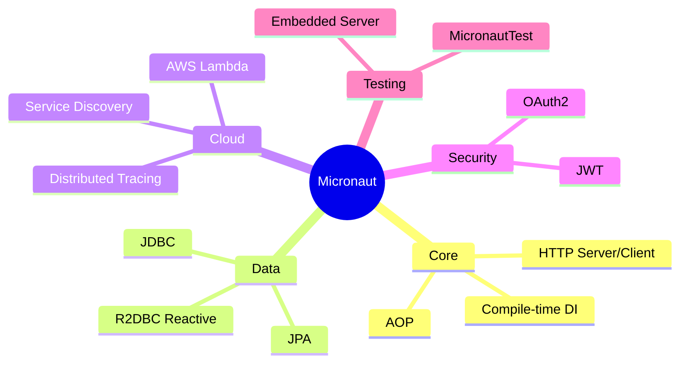

## Keywords in This File
{: .no_toc }

| # | Keyword | Weight |
|---|---|---|
| 1 | [Micronaut Ecosystem Overview](#micronaut-ecosystem-overview) | medium |
| 2 | [Why Micronaut Exists - Spring vs Micronaut](#why-micronaut-exists---spring-vs-micronaut) | medium |
| 3 | [Micronaut vs Spring Boot vs Quarkus](#micronaut-vs-spring-boot-vs-quarkus) | medium |
| 4 | [Micronaut Architecture Philosophy](#micronaut-architecture-philosophy) | medium |

---

# Micronaut Ecosystem Overview

**Interview Weight:** medium - Orientation question
asked to gauge whether you understand Micronaut's
position in the Java framework ecosystem before
discussing specific features.

---

### 🎯 Model Answer

**30 seconds:**

> Micronaut is a modern JVM framework for building
> microservices and serverless applications. Its
> defining characteristic: dependency injection and
> AOP are resolved at compile time (annotation
> processing), not at runtime via reflection. This
> eliminates JVM startup cost and reduces memory
> overhead. Micronaut targets cloud-native Java:
> fast startup, low memory, and native-image
> compatibility with GraalVM.

**3 minutes (Senior):**

> Micronaut ecosystem components:
>
> Core: IoC/DI container, AOP framework, HTTP server
> and client - all compile-time processed.
>
> Micronaut Data: data access layer. JDBC and JPA
> repositories with queries compiled at build time
> (no runtime proxy generation). Reactive variants
> via R2DBC.
>
> Micronaut HTTP: server (Netty-based), declarative
> client (@Client), reactive streams support.
>
> Micronaut Test: @MicronautTest annotation, embedded
> server for integration tests.
>
> Micronaut Cloud: service discovery (Consul, Kubernetes),
> distributed tracing, cloud function support (AWS Lambda,
> Google Cloud Functions).
>
> Micronaut Security: JWT, OAuth2, LDAP integrations.
>
> Micronaut Serialization: Jackson alternative that
> generates serialization code at compile time.
>
> GraalVM Native Image: all compile-time DI means
> no reflection surprises during native-image build.
> Micronaut is natively compatible.

**Blank Mind Recovery:**

**(1) Restate:** "You are asking about Micronaut - what
it is and where it fits in the Java ecosystem."

**(2) First principles:** "Frameworks like Spring use
reflection at runtime. Micronaut moves that work to
compile time. Same developer experience, different
execution model."

**(3) Bridge:** "Micronaut is what happens when you
ask: what if Spring's DI container worked like a
compiler plugin instead of a runtime engine? Faster
startup, lower memory, native-image friendly."

---

### 📘 Concept Explanation

```
Java Framework Positioning

Spring Boot      Micronaut        Quarkus
─────────────   ─────────────    ─────────────
Runtime DI      Compile-time DI  Build-time aug.
(reflection)    (APT-generated)  (bytecode aug.)

Startup: 2-5s   Startup: <300ms  Startup: <300ms
Memory: 200MB+  Memory: ~50MB    Memory: ~50MB
GraalVM: hard   GraalVM: easy    GraalVM: native
Maturity: high  Maturity: medium Maturity: growing
```



> **Diagram walkthrough:** Micronaut's ecosystem radiates
> outward from its compile-time core. Each module (Data,
> Cloud, Security) extends compile-time processing to
> its domain. Micronaut Data generates repository queries
> at compile time. Micronaut Security processes security
> annotations at compile time. The compile-time theme is
> consistent throughout the ecosystem.

---

### 🎓 Answers by Seniority

**Junior:** "Micronaut is a Java microservices framework
that does dependency injection at compile time instead
of runtime. This makes applications start faster and
use less memory."

**Senior:** "Micronaut's compile-time DI is the key
differentiator from Spring. Spring uses ClassPathScanningCandidateComponentProvider at startup to discover beans. Micronaut generates BeanDefinition classes during annotation processing - startup is just registering pre-built definitions. Result: 300ms startup vs 3 seconds."

---

### 🎯 Interview Deep-Dive

| Experience | Time | Depth |
|---|---|---|
| Junior | 3 min | What Micronaut is, compile-time DI concept |
| Senior | 6 min | Ecosystem components, positioning vs Spring/Quarkus |

---

**[JUNIOR] Q1 - What makes Micronaut different from
Spring Boot for building microservices?**

*Why they ask:* Tests whether you understand the
architectural difference, not just feature lists.

Three core differences:

1. **DI mechanism:**
   Spring: reflection at runtime (startup overhead).
   Micronaut: annotation processing at compile time
   (zero reflection in production path).

2. **Startup time:**
   Spring Boot: 2-5 seconds (classpath scanning,
   proxy generation, bean factory initialization).
   Micronaut: 100-500ms (pre-generated BeanDefinition
   classes loaded directly).

3. **Memory footprint:**
   Spring: 150-300MB typical (reflection metadata,
   class info in heap).
   Micronaut: 50-100MB (minimal runtime metadata).

Same developer experience: both use annotations (@Inject,
@Controller), both have embedded HTTP server, both
support JDBC/JPA. The difference is under the hood.

*What separates good from great:* Explaining WHY:
reflection = runtime cost; annotation processing =
compile-time cost. Different tradeoffs.

| Interviewer Type | Emphasis |
|---|---|
| Technical Panel | Compile-time vs runtime DI, startup numbers. |
| Hiring Manager | Micronaut = fast startup, low memory. |
| Peer Engineer | "The BeanDefinition classes in the build output are the visible artifact of Micronaut's compile-time DI." |

---

---

# Why Micronaut Exists - Spring vs Micronaut

**Interview Weight:** medium - Understanding the
motivation for Micronaut reveals architectural
judgment about when to choose it.

---

### 🎯 Model Answer

**30 seconds:**

> Micronaut exists because Spring's runtime reflection
> model has fundamental performance limits in cloud-native
> contexts. Cloud deployments (Kubernetes, Lambda) demand
> fast startup and low memory - two areas where reflection-
> based frameworks struggle. Micronaut's creators (OCI,
> creators of Grails) designed it from the start for
> compile-time processing to make these tradeoffs
> structurally impossible.

**3 minutes (Senior):**

> Spring's runtime model limitations:
>
> 1. Startup time: Spring scans classpath, creates
>    bean proxies via reflection, initializes the
>    ApplicationContext. This takes seconds. For
>    Lambda functions (cold start budget: ~2s) or
>    Kubernetes pods (fast scale-up required), this
>    is too slow.
>
> 2. Memory: reflection metadata, CGLIB proxies,
>    and runtime class analysis increase heap usage.
>    Each JVM instance needs 200-300MB minimum.
>    At 100 pod scale: significant cost.
>
> 3. GraalVM Native Image: reflection-based frameworks
>    are incompatible with the closed-world assumption
>    of native-image. Extensive configuration required.
>
> Micronaut's solutions (from design):
> - Annotation processors generate DI wiring code
>   at compile time (no runtime classpath scanning)
> - No runtime proxies for AOP (uses compile-time
>   interceptors)
> - All metadata encoded in generated classes
>   (native-image sees them as normal classes)
>
> The cost of Micronaut's approach:
> - Longer compile time (annotation processing)
> - Less flexibility than Spring's runtime model
>   (e.g., dynamic bean registration is harder)
> - Smaller ecosystem than Spring (fewer integrations)

**Blank Mind Recovery:**

**(1) Restate:** "You are asking why Micronaut was
created instead of just using Spring."

**(2) First principles:** "Microservices at scale
means hundreds of JVM instances. Spring's startup
cost and memory footprint multiply. At scale, the
architectural choice matters."

**(3) Bridge:** "Micronaut exists because some
environments are allergic to Spring's runtime reflection.
Lambda cold starts and container density are the
clearest cases."

---

### 🎓 Answers by Seniority

**Junior:** "Micronaut was created to be faster and
use less memory than Spring. Spring uses reflection
at startup which is slow; Micronaut does the DI work
at compile time."

**Senior:** "Micronaut targets three problems Spring
has in cloud-native: (1) cold start latency (Lambda),
(2) memory per instance (Kubernetes pod density),
(3) GraalVM native-image compatibility. If none of
these are constraints, Spring is often the better
choice (larger ecosystem, more mature)."

---

### 🎯 Interview Deep-Dive

| Experience | Time | Depth |
|---|---|---|
| Junior | 3 min | Spring limitations, Micronaut solutions |
| Senior | 6 min | Cloud-native constraints, cost of Micronaut's approach |

---

**[SENIOR] Q1 - When would you choose Spring Boot
over Micronaut despite Micronaut's startup advantages?**

*Why they ask:* Tests balanced architectural judgment.

Choose Spring Boot when:
1. Team expertise is in Spring (fastest path to
   production, fewer surprises).
2. Application is long-lived (startup time is amortized
   over hours/days of runtime; 5s startup vs 300ms
   is irrelevant for a 24/7 service).
3. Rich ecosystem needed (Spring Integration,
   Spring Batch, Spring Cloud - mature and comprehensive).
4. Dynamic behavior required (runtime bean registration,
   plugin architectures, hotswap DI).
5. Enterprise integrations (Spring's JMS, JNDI, EJB
   bridge support is deep).

Choose Micronaut when:
1. Lambda/serverless (cold start budget)
2. High pod density required (memory per instance)
3. Native image target (GraalVM)
4. Team is willing to learn Micronaut idioms

*What separates good from great:* "If startup time is
not a constraint, Spring's ecosystem depth often wins."

| Interviewer Type | Emphasis |
|---|---|
| Technical Panel | Spring reflection limits, Micronaut compile-time. |
| Hiring Manager | Choose Micronaut for Lambda/Kubernetes density. |
| Bar Raiser | Micronaut costs: compile time, smaller ecosystem, dynamic behavior limits. |
| Peer Engineer | "We evaluated Micronaut for Lambda. 300ms cold start vs 4 seconds. Chose Micronaut." |

---

---

# Micronaut vs Spring Boot vs Quarkus

**Interview Weight:** medium - Three-way comparison
is a common interview question for roles evaluating
framework selection decisions.

---

### 🎯 Model Answer

**30 seconds:**

> Three modern JVM frameworks with different core
> philosophies: Spring Boot (runtime reflection, mature
> ecosystem, conventional), Micronaut (compile-time DI
> via annotation processing, native-friendly by design),
> Quarkus (build-time bytecode augmentation, CDI-based,
> optimized for Kubernetes). All three support native-image,
> fast startup, and cloud-native. Spring wins on
> ecosystem maturity; Micronaut and Quarkus win on
> startup and memory for new projects.

**3 minutes (Senior):**

> Three-way comparison:
>
> **Spring Boot:**
> Startup: 2-5s (classpath scanning + reflection)
> Memory: 200-350MB
> DI: Runtime (ClassPath scanning + CGLIB proxies)
> Native image: Spring AOT (added in Spring 6)
> Ecosystem: largest (800+ starters)
> Learning curve: high (large API surface)
>
> **Micronaut:**
> Startup: 100-500ms
> Memory: 50-100MB
> DI: Compile-time (annotation processor)
> Native image: native by design (no reflection)
> Ecosystem: medium (Micronaut modules)
> Learning curve: medium (familiar annotations)
>
> **Quarkus:**
> Startup: 50-300ms (fastest in JVM mode)
> Memory: 50-100MB
> DI: Build-time bytecode augmentation (ArC CDI)
> Native image: native by design (GraalVM first)
> Ecosystem: medium (Quarkus extensions)
> Learning curve: medium (CDI standard, unfamiliar ArC)
>
> Key differentiator: Quarkus uses CDI (standard)
> but with build-time processing. Micronaut uses
> its own DI model with familiar Spring-like annotations.

**Blank Mind Recovery:**

**(1) Restate:** "You are asking me to compare the
three modern JVM microservices frameworks."

**(2) First principles:** "All three solve the same
cloud-native problems. They differ in HOW they solve
them and what they sacrifice."

**(3) Bridge:** "Pick by constraint: largest ecosystem
need → Spring; CDI standard + Kubernetes → Quarkus;
Lambda serverless + no CDI complexity → Micronaut."

---

### ⚖️ Comparison Table

| Aspect | Spring Boot | Micronaut | Quarkus |
|---|---|---|---|
| DI mechanism | Runtime reflection | Compile-time APT | Build-time CDI augmentation |
| Startup (JVM) | 2-5s | 100-500ms | 50-300ms |
| Memory (JVM) | 200MB+ | 50-100MB | 50-100MB |
| Native image | Spring AOT (6+) | Native-friendly by design | Native-first design |
| Ecosystem | Largest | Medium | Medium |
| DI standard | Spring (proprietary) | Micronaut (proprietary) | CDI (JSR-330/CDI 2.0) |
| Dev experience | Spring DevTools | Automatic restart | Dev mode (hot reload) |

---

### 🎓 Answers by Seniority

**Junior:** "Spring Boot has the biggest ecosystem but
slower startup. Micronaut and Quarkus start in
milliseconds because they do the DI work at compile
or build time instead of at runtime."

**Senior:** "I choose by constraint. For Lambda or
high-density Kubernetes: Micronaut or Quarkus. For
teams already on Spring or needing rich enterprise
integrations: Spring Boot. Quarkus has CDI which is
the Java standard - useful for teams that value
standards compliance."

---

### 🎯 Interview Deep-Dive

| Experience | Time | Depth |
|---|---|---|
| Junior | 4 min | Startup/memory differences, when to choose each |
| Senior | 8 min | DI mechanisms, ecosystem depth, migration cost |

---

**[SENIOR] Q1 - If you're building a new microservices
platform for a financial services company, how do you
choose between the three?**

*Why they ask:* Real architectural decision-making.

Financial services context adds constraints:
1. Regulatory compliance (audits, certifications):
   Spring Boot has the longest production track record
   (10+ years). Banks often have approved frameworks lists.
2. Enterprise integrations (Kafka, Oracle, LDAP,
   mainframe connectors): Spring Integration/Spring Cloud
   has the deepest enterprise connector set.
3. Security: all three have security modules, Spring
   Security is most mature.
4. Team expertise: if the team knows Spring, Micronaut
   or Quarkus adds learning cost.

If starting fresh with cloud-native focus:
- Container density targets: Micronaut or Quarkus
- CDI standards preference: Quarkus
- Familiar Spring annotations team: Micronaut

Recommendation framework:
- Long-running services + rich ecosystem: Spring Boot
- Lambda + serverless: Micronaut
- Kubernetes-first + CDI standard: Quarkus
- Mix: Spring Boot for core services, Micronaut for
  serverless endpoints

*What separates good from great:* "Framework choice
in financial services is often constrained by existing
approved frameworks and compliance requirements, not just
technical merit."

| Interviewer Type | Emphasis |
|---|---|
| Technical Panel | Three-way comparison table, DI mechanism differences. |
| Hiring Manager | Framework selection judgment, not just feature knowledge. |
| Bar Raiser | Financial services constraints, compliance, enterprise integration depth. |
| Peer Engineer | "We use Spring for core services, Micronaut for Lambda. Best of both ecosystems." |

---

---

# Micronaut Architecture Philosophy

**Interview Weight:** medium - Understanding the
philosophy reveals whether a candidate can reason
about architectural trade-offs, not just framework APIs.

---

### 🎯 Model Answer

**30 seconds:**

> Micronaut's philosophy: move runtime overhead to
> compile time. Three principles: (1) compile-time
> annotation processing for DI - no classpath scanning,
> no reflection at runtime; (2) sensible defaults with
> environment-driven overrides; (3) cloud-native first -
> service discovery, health checks, metrics, and
> distributed tracing are first-class, not add-ons.

**3 minutes (Senior):**

> Core architectural principles:
>
> 1. Ahead-of-time (AOT) processing:
>    All DI wiring, AOP interceptors, and HTTP route
>    binding computed at compile time using annotation
>    processors (javax.annotation.processing.Processor).
>    At runtime: load pre-built definitions.
>    No classpath scanning, no proxy generation,
>    no reflection analysis.
>
> 2. Zero-reflection design:
>    Not "minimize reflection" but "zero reflection
>    on the critical startup and request path."
>    Allows GraalVM native-image builds without
>    reflection configuration files.
>
> 3. Cloud-native defaults:
>    Service discovery client (Consul, Eureka,
>    Kubernetes) wired in by default with configuration.
>    Health endpoints, metrics, and tracing available
>    with zero boilerplate.
>
> 4. Reactive by design:
>    HTTP server built on Netty (async I/O).
>    Repository layer supports reactive types (Flowable,
>    Single from RxJava; Flux, Mono from Reactor).
>
> 5. Convention-over-configuration with configuration
>    transparency: all defaults documented, all
>    overridable via application.yml.

**Blank Mind Recovery:**

**(1) Restate:** "You are asking about the design
philosophy behind Micronaut's architecture."

**(2) First principles:** "Philosophy = the problem
you are trying to solve and the trade-offs you accept
to solve it."

**(3) Bridge:** "Micronaut's philosophy is: accept
longer compile times and some flexibility loss in
exchange for zero-reflection runtime, fast startup,
and native-image compatibility."

---

### 🎓 Answers by Seniority

**Junior:** "Micronaut's philosophy is to do as much
work as possible at compile time, not at runtime.
This makes applications fast and memory-efficient."

**Senior:** "The three-principle summary: AOT processing
(compile-time DI), zero-reflection runtime (native-image
ready), cloud-native defaults (service discovery,
health, tracing built-in). The trade-off Micronaut
accepts: compile time increases, and dynamic behavior
(runtime bean registration) is harder."

---

### 🎯 Interview Deep-Dive

| Experience | Time | Depth |
|---|---|---|
| Junior | 3 min | Compile-time philosophy, cloud-native defaults |
| Senior | 6 min | AOT processing, reflection elimination, trade-offs |

---

**[SENIOR] Q1 - What are the limits of Micronaut's
compile-time DI philosophy?**

*Why they ask:* Tests whether you know the trade-offs,
not just the benefits.

Limits:

1. **Dynamic bean registration:**
   Spring: BeanDefinitionRegistryPostProcessor lets
   you register beans programmatically at runtime.
   Micronaut: DI wiring is fixed at compile time.
   Dynamic plugin architectures (OSGI-style) are
   harder to implement.

2. **Classpath scanning at runtime:**
   Spring can discover beans from JARs added at runtime
   (e.g., plugin JARs dropped into a directory).
   Micronaut cannot: beans must be present at compile time.

3. **Compile time cost:**
   Annotation processing adds 10-30% to compile time.
   Large projects with many @Singleton/@Inject annotations
   increase this further.

4. **Conditional beans at runtime:**
   Spring @ConditionalOnProperty evaluates at startup
   by reading the environment. Micronaut does this too
   (@Requires(property="...")) but with less flexibility
   than Spring's condition model.

5. **Reflection-dependent libraries:**
   Libraries that use reflection (e.g., CGLIB-based
   mocking in tests, some serialization libraries)
   require special configuration or replacement.

*What separates good from great:* Dynamic plugin
architecture as the clearest use case where Micronaut's
philosophy breaks down.

| Interviewer Type | Emphasis |
|---|---|
| Technical Panel | AOT principles, cloud-native defaults. |
| Hiring Manager | Micronaut philosophy = fast, lean, cloud-ready. |
| Bar Raiser | Dynamic bean limits, compile-time cost, reflection-dependent library issues. |
| Peer Engineer | "We couldn't use Micronaut for our plugin system. Needed runtime bean registration. Stayed on Spring." |
