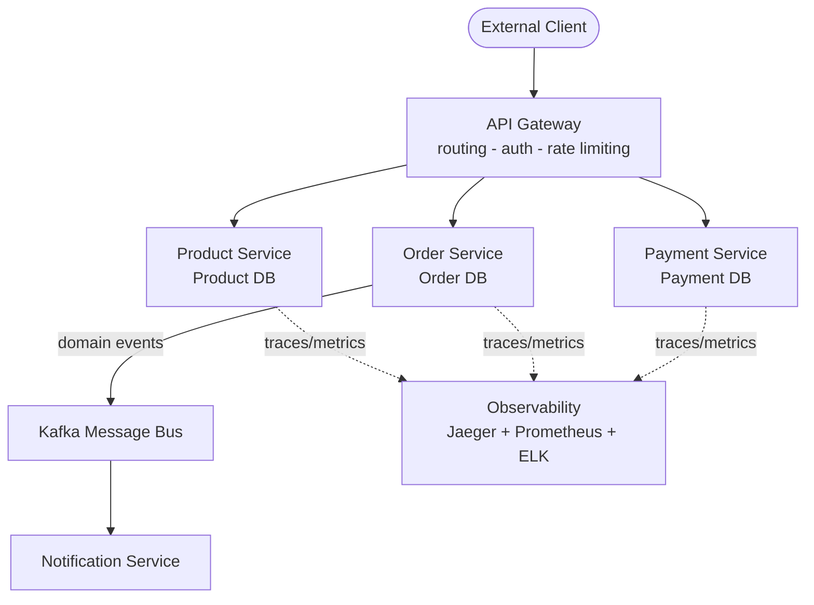
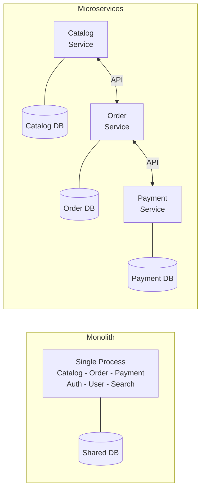
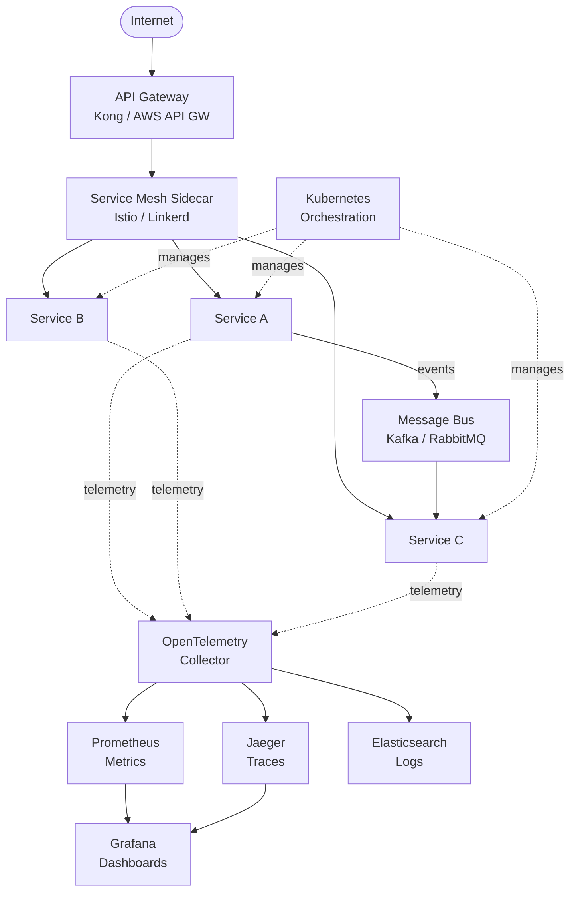

## Keywords in This File

{: .no_toc }

| #   | Keyword                              | Weight   |
| --- | ------------------------------------ | -------- |
| 1   | [Microservices Architecture Overview](#microservices-architecture-overview) | high |
| 2   | [Monolith vs Microservices](#monolith-vs-microservices) | critical |
| 3   | [When to Use Microservices](#when-to-use-microservices) | high |
| 4   | [Microservices Ecosystem and Tools](#microservices-ecosystem-and-tools) | medium |

---

# Microservices Architecture Overview

🎯 Interview Weight: high - asked in virtually every microservices
or system design interview as the baseline orientation question;
sets the stage for every follow-up discussion.

---

### 🎯 Model Answer

**30 seconds:**
> Microservices is an architectural style where a system is built
> as many small, independently deployable services, each owning
> its own data and communicating over network APIs. Instead of
> one big application, you have a collection of focused services
> that collaborate. The core trade-off: you gain deployment
> independence at the cost of distributed system complexity.

**3 minutes (Senior):**
> I think about microservices as a way to organize both code and
> teams around business capabilities rather than technical layers.
> Each service is a small program that does one thing well - it
> owns its own data, exposes an API, and can be deployed
> independently of every other service.
>
> The problem microservices solve is what happens to a growing
> monolith: as the codebase grows, changes in one area cause
> unexpected failures elsewhere, deployments become slow and
> risky, and different teams constantly step on each other's
> toes. Microservices let teams work in parallel, deploy
> independently, and scale individual parts of the system.
>
> A microservices system has several key components: an API
> gateway routes external requests; services implement business
> logic; a message bus enables async communication; service
> discovery lets services find each other dynamically; and
> observability tools - distributed tracing, centralized logging,
> metrics - make it possible to operate dozens of services.
>
> The non-obvious insight is that microservices are fundamentally
> an organizational solution. Conway's Law says your software
> architecture mirrors your team structure - microservices make
> that explicit. When I have seen microservices fail, it is
> usually because the team structure did not change, so services
> ended up tightly coupled in a distributed way - worse than the
> monolith it replaced.

**Framework:** WHAT -> WHY -> HOW -> TRADE-OFF -> EXAMPLE

*Adapting up:* Add DDD bounded contexts for boundary design,
Conway's Law implications, operational prerequisites, and the
"microservices premium" cost model.

*Adapting down:* WHAT (small independent services) + WHY (team
independence, independent scaling) + EXAMPLE (checkout, inventory,
and user services each deploy separately).

**Blank Mind Recovery:**

**(1) Restate:** "You are asking about microservices architecture -
let me walk through what problem it solves and how it works."

**(2) First principles:** "From first principles, as software
systems grow, they become hard to change safely. The solution
is to break the system into smaller, independent pieces with
hard boundaries."

**(3) Bridge:** "Think of it like a well-run restaurant kitchen.
One big kitchen doing everything gets chaotic - separate
stations for grill, prep, and pastry each operate and scale
independently."

---

### 📘 Concept Explanation

**What it is:**
Microservices is an architectural pattern where a single
application is decomposed into a collection of small, autonomous
services, each running in its own process and communicating via
lightweight mechanisms - typically HTTP APIs or message queues.

**The problem it solves:**
As monolithic applications grow, the codebase becomes hard to
change safely. Deployments require coordinating all teams
simultaneously and carry high blast radius. Scaling means
scaling the entire application even if only one component is
under load. Microservices solve these by separating concerns
at the service boundary, enabling independent deployment,
independent scaling, and independent team ownership.

**How it works:**

```
Client
  |
  v
[API Gateway] --> [Auth Service]
  |
  +---> [Product Service] <--> [Product DB]
  |
  +---> [Order Service] <---> [Order DB]
  |          |
  |          v
  |    [Kafka Bus] --> [Notification Svc]
  |
  +---> [Payment Service] <-> [Payment DB]
```

Each service runs in its own process (usually a container),
owns its own database (data isolation), exposes a well-defined
API, and is developed, tested, and deployed independently.
Services communicate synchronously via REST or gRPC for
real-time needs, and asynchronously via a message bus for
decoupled event-driven processing.

**The key insight:**
Microservices are primarily an organizational pattern, not a
performance optimization. The real goal is to let teams deploy
independently - the technical architecture enables that by
drawing hard boundaries between business domains.

**When to use it:**
- Multiple teams need to work on the same system without
  constant coordination on deployments
- Different parts of the system have genuinely different
  scaling requirements
- You need different technology stacks for different components
- The monolith's deployment complexity is causing real friction
- You have mature DevOps: CI/CD, containers, and observability

**When NOT to use it:**
- Small teams (fewer than 8-10 engineers) where operational
  overhead outweighs independence benefits
- Early-stage products where the domain model is still evolving
  and service boundaries would be wrong within months
- Systems without CI/CD and monitoring infrastructure in place
- When the current monolith is not actually causing pain

**Alternatives:**
- Monolith -> single deployable unit; low operational overhead;
  appropriate for small teams and early-stage products
- Modular monolith -> logical module separation without
  deployment separation; best of both for medium-sized teams
- Serverless -> fine-grained functions with no server
  management; works well for event-driven workloads

**First-principles derivation:**
Given a system with 50 engineers, every deploy requires
merging all 50 engineers' changes simultaneously - coordination
cost is O(N^2) in team size. The only way to reduce this is
to reduce the blast radius of each change. A hard process
boundary (a service) is the smallest unit that enables true
independence: separate deployment, separate database, separate
team. Microservices emerge at scale because they are the
solution to the coordination cost of large teams.

---

### 💻 Code Example

*(Omit: L0 orientation keyword. Practical code examples for
service-to-service calls, circuit breakers, and API gateway
configuration appear in the L1 Foundations and L2 Communication
files where specific patterns are demonstrated with context.)*

---

### 🎓 Answers by Seniority

**Junior / Mid (0-5 years):**
> Microservices breaks a large application into small, focused
> services that each handle one business capability. Each service
> has its own database and communicates with others via APIs.
> The big benefit is that teams can deploy their service
> independently without waiting for everyone else to be ready.

Adding mid-level depth: services communicate synchronously via
REST or gRPC for real-time calls, or asynchronously via Kafka
for decoupled event processing. Each service is containerized
and orchestrated by Kubernetes in modern setups.

*Push deeper:* Talk about the service boundary challenge - how
do you decide what belongs in one service versus another? The
business capability rule: if a team of two to four engineers
can own it end-to-end, that is probably the right size.

---

**Senior / Staff (5+ years):**
> Microservices decomposes a system into independently deployable
> units aligned with business capabilities, each owning its data
> and API contract. The architectural goal is team autonomy -
> fast, independent deployments without cross-team coordination.

The architectural tension: microservices solve the deployment
coupling problem but introduce distributed systems complexity -
network latency, partial failures, eventual consistency, and
distributed tracing. I have seen teams succeed and fail, and
the difference is almost always whether they built the
operational foundation first: solid CI/CD, centralized logging,
distributed tracing, and automated testing before splitting
the monolith.

*Push deeper:* Conway's Law in practice - service boundaries
should mirror team topology. Services that cross team
boundaries become a source of constant coordination, defeating
the purpose. The inverse Conway maneuver: organize teams first,
then let the service architecture follow.

---

### ⚠️ Common Misconceptions

**Misconception 1: "Microservices always performs better"**
Microservices add network overhead compared to in-process
calls. A local method call takes nanoseconds; a REST call takes
milliseconds. Services outperform a monolith only when specific
components need independent horizontal scaling - not by default.

**Misconception 2: "Start with microservices from day one"**
Most successful microservices architectures started as
monoliths. Starting with microservices before the domain model
is stable leads to wrong service boundaries - expensive to
correct later. Martin Fowler calls this the "microservices
premium": you pay the complexity cost without the scale benefit.

**Misconception 3: "Each microservice must be tiny"**
"Micro" refers to the scope of responsibility (one business
capability), not the lines of code. A payments service
responsible for a full payment domain may have 50,000 lines
of code - that is appropriate if it owns a single clear domain.

**Misconception 4: "Microservices automatically solve scaling"**
Microservices enable horizontal scaling of individual services,
but bottlenecks are often at the database layer, not the
application tier. Running 100 instances of an order service
all hammering a single order database does not scale.

---

### 🚨 Failure Modes and Diagnosis

**Failure 1: Distributed monolith**
Services deploy separately but cannot release independently -
changing service A requires changing B, C, and D simultaneously.
This happens when boundaries were drawn along technical layers
(web/domain/data) instead of business capabilities.

Diagnosis: Track co-deployment frequency. If services A and B
always deploy in the same release, they are logically one
service deployed in two processes.

Fix: Redraw boundaries around business capabilities. Replace
direct synchronous chains with domain events.

**Failure 2: Cascading failure from missing circuit breakers**
Service A calls B, B is slow, A's thread pool fills waiting,
A becomes slow, C calling A also slows. The entire system
degrades from one slow upstream service.

Diagnosis: APM (Datadog, New Relic) shows high thread pool
utilization across all services simultaneously, originating
from one upstream service.

Fix: Implement circuit breaker pattern using Resilience4j.
When B fails, A's circuit opens and fails fast instead of
queuing threads.

**Failure 3: No observability - undebugable system**
A user reports an error. You have 30 services. You cannot
identify which service caused it without hours of log digging.

Diagnosis: Absence of correlation IDs, distributed tracing,
or centralized log search.

Fix: Set up OpenTelemetry + Jaeger, correlation IDs on every
request, and ELK centralized logging before splitting the
monolith. Observability must precede decomposition.

---

### 🎯 Interview Deep-Dive

| Format      | Time   | Notes                               |
| ----------- | ------ | ----------------------------------- |
| Quick fire  | 30s    | Definition + one key trade-off      |
| Standard    | 3 min  | WHAT / WHY / HOW / TRADE-OFF        |
| Deep dive   | 10 min | Architecture + failures + org model |
| System Q    | 20 min | Full design + scale discussion      |
| Behavioral  | 5 min  | Story: migrated or built on MS      |

---

**Q1 [JUNIOR]: "What is microservices architecture and what
problem does it solve?"**

*Why they ask:* Baseline check. They want you to articulate
the WHY, not just the WHAT.

*Likely follow-up:* "And what are the downsides?"

Microservices architecture decomposes an application into a
collection of small, independently deployable services, each
responsible for a single business capability and owning its
own data. The problem it solves is the scaling challenge of
large teams working on a single codebase: in a monolith, teams
step on each other's changes, deployments carry high blast
radius because everything ships together, and you cannot scale
individual components independently.

The distinction I always emphasize: microservices solve three
problems simultaneously - team autonomy (teams deploy without
coordinating), deployment independence (one service ships
without touching others), and scaling granularity (run 10
instances of payments and 2 of user service based on load).

The downside: you have traded a deployment problem for a
distributed systems problem. Now you have network calls that
can fail, eventual consistency between services, and a much
harder debugging experience when something goes wrong.

*What separates good from great:* Great candidates articulate
the organizational motivation - team autonomy - not just the
technical description. They know microservices are primarily
about team structure, not technology.

---

**Q2 [JUNIOR]: "Can you describe the main components in a
microservices system?"**

*Why they ask:* Checks whether you understand the full
ecosystem, not just individual services in isolation.

*Likely follow-up:* "What does the API gateway do specifically?"

A microservices system has several layers. At the entry point
is an API gateway - it routes external requests to the right
service, handles authentication, rate limiting, and sometimes
request aggregation across multiple services.

Behind the gateway are the business services themselves, each
owning its domain logic and database. For communication,
services use either synchronous calls (REST or gRPC) for
queries where the caller needs an immediate response, or
asynchronous messaging (Kafka, RabbitMQ) for commands and
events where eventual processing is acceptable.

Service discovery - Consul or Kubernetes DNS - lets services
find each other without hardcoded addresses, which matters
when instances come and go dynamically.

The operational layer is equally critical: distributed tracing
(Jaeger, Zipkin) correlates requests across services;
centralized logging (ELK stack) aggregates logs; metrics
(Prometheus + Grafana) surface anomalies. Without these three,
operating a microservices system at scale is nearly impossible.

*What separates good from great:* Great candidates mention
observability infrastructure proactively, not as an afterthought.
They understand services are worthless without the ability to
operate and debug them in production.

---

**Q3 [MID]: "How do microservices communicate with each other?
What are the trade-offs between sync and async?"**

*Why they ask:* Communication patterns are a core microservices
competency. They want to know if you understand both approaches
and when to choose each.

*Likely follow-up:* "What happens if the downstream service is
down when using synchronous communication?"

Microservices communicate in two fundamental ways. Synchronous
uses REST (HTTP/JSON - universal, easy to debug) or gRPC
(binary Protocol Buffers over HTTP/2 - faster and strongly
typed). I use gRPC for internal high-throughput service-to-
service paths and REST for external-facing APIs.

The synchronous trade-off: the caller must wait for the
response. If the downstream service is slow or unavailable,
the caller is blocked. Under load, this causes thread pool
exhaustion and cascading failures - that is why circuit
breakers are essential.

Asynchronous uses a message bus (Kafka for durable, high-
throughput streaming; RabbitMQ for simpler task queues). The
caller publishes an event and continues without waiting. This
decouples services temporally - the notification service
processes the order event whenever it is ready.

The async trade-off: harder to reason about, eventual
consistency, and more complex failure handling requiring
dead letter queues and idempotency logic.

My rule: use synchronous for queries where the caller needs
the result immediately; use async for commands and events
where eventual processing is acceptable.

*What separates good from great:* Great candidates name the
specific failure mode of synchronous calls (cascading thread
pool exhaustion) and explain how circuit breakers break the
cascade. They do not treat async as universally better.

---

**Q4 [MID]: "What does Conway's Law mean for microservices?"**

*Why they ask:* Tests organizational thinking. This separates
candidates who understand microservices deeply from those who
only know the technology stack.

*Likely follow-up:* "How did you apply this in a real project?"

Conway's Law states: "Organizations which design systems are
constrained to produce designs which are copies of the
communication structures of those organizations." For
microservices, this means your service boundaries should
mirror your team boundaries.

In practice: if you have a team that owns checkout, a team
that owns inventory, and a team that owns payments, your
services should have hard boundaries at exactly those points.
If a single team owns multiple services, those services become
coupled through shortcuts - shared databases, direct internal
calls - because it is easier than maintaining formal APIs.

The anti-pattern I have seen: companies draw service
boundaries along technical layers - a "data service," a
"business logic service," an "API service" - all owned by
one team. That team builds a distributed monolith: technically
separate services that must always deploy together.

The inverse Conway maneuver: deliberately organize your teams
around your desired service boundaries before splitting the
monolith. The team structure creates the architecture.

*What separates good from great:* Great candidates connect
this to their own experience - a situation where team structure
influenced service design for better or worse.

---

**Q5 [SENIOR]: "What is the hardest operational challenge in
a microservices system and how do you address it?"**

*Why they ask:* Tests production experience. There is no
single right answer; they want to hear you reason about real
operational complexity.

*Likely follow-up:* "How do you debug a latency issue that
spans five services?"

The hardest operational challenge in my experience is
observability - making a multi-service system debuggable when
something goes wrong in production.

In a monolith, a stack trace tells you exactly what happened
and where. In a microservices system, a user action may touch
ten services, and the failure could be in service seven of
that chain. Without distributed tracing, you spend hours
reading logs across multiple systems trying to reconstruct
the request path.

The solution is to build observability in from day one: every
request gets a correlation ID passed through every service
call; distributed tracing (OpenTelemetry + Jaeger) records
spans for each service hop; centralized logging (ELK) lets
you search across all services by correlation ID; and health
dashboards surface anomalies before users report them.

The second hardest challenge is distributed transactions -
when you need an operation to succeed or fail atomically
across multiple services. The saga pattern breaks a
transaction into local transactions with compensating actions
for rollback. But this requires very careful design and
end-to-end testing.

*What separates good from great:* Great candidates give
concrete tooling and a real scenario. They name specific tools
they have used and specific failures they have debugged.
"We used Jaeger and found a missing index in the product
service was adding 800ms to every checkout request."

---

**Q6 [SENIOR]: "Why might microservices make a system MORE
complex and harder to maintain?"**

*Why they ask:* They want to see if you can challenge
conventional wisdom and show genuine production experience.
Many candidates are microservices evangelists; experienced
engineers know the downsides.

*Likely follow-up:* "Given those downsides, when would you
choose a monolith instead?"

Microservices add complexity in several critical dimensions.
First, network calls replace method calls. Every synchronous
service-to-service call can fail with timeout, connection
error, or service unavailability. You need retry logic,
circuit breakers, and fallback behavior everywhere. A
monolith's in-process method calls simply do not fail this way.

Second, data consistency becomes eventual. In a monolith,
you wrap multiple operations in a database transaction. In
microservices, cross-service operations use sagas or two-phase
commit - both add significant complexity and subtle failure
modes that are hard to test.

Third, testing becomes much harder. Unit tests are fine, but
integration tests across multiple services require running
the full environment. Contract tests (Pact) help but add
tooling overhead. A monolith integration test is trivially
simple by comparison.

Fourth, operational overhead multiplies. Instead of deploying
one application, you deploy and manage 30. Each needs its own
CI/CD pipeline, health checks, logging, alerting, and
Kubernetes configuration.

I would choose a well-structured modular monolith over
microservices for teams under about 15 engineers, or for
domains where the model is still evolving. The complexity
tax is only worth paying when team autonomy and independent
scaling become real bottlenecks.

*What separates good from great:* Great candidates articulate
specific failure modes they have personally encountered and
make a confident recommendation for when NOT to use
microservices. They do not hedge endlessly.

---

**Q7 [SENIOR]: "How do you identify and fix service boundaries
that are wrong?"**

*Why they ask:* Service boundary design is one of the hardest
parts of microservices. They want to know if you can recognize
problems and fix them.

*Likely follow-up:* "What is the cost of getting the
boundaries wrong?"

The symptoms of wrong service boundaries are clear: services
that always deploy together (temporal coupling), services that
call each other in long synchronous chains (runtime coupling),
and services that query each other's databases directly (data
coupling).

When services must deploy together, I treat them as a candidate
for merger. If services A and B always ship in the same release
because a change to one requires a change to the other, they
are one logical service split across two deployments. Merging
reduces complexity without losing anything meaningful.

When I see deep synchronous call chains - A calls B calls C
calls D to serve one request - I look at whether calls can be
replaced with events. If service A can publish a domain event
and continue, and B processes it asynchronously, the chain
breaks and services become genuinely independent.

The cost of wrong boundaries is significant: a distributed
monolith - all the complexity of distributed systems with none
of the independence benefits. I have seen teams spend 18 months
migrating a monolith to microservices, end up with a system
that still deploys as a unit, and is harder to debug than the
original.

*What separates good from great:* Great candidates name
specific coupling types (temporal, runtime, data) and describe
specific remediation strategies for each. They mention the
organizational cost: redrawing service boundaries may require
reorganizing teams.

---

| Interviewer Type | Focus                                          |
| ---------------- | ---------------------------------------------- |
| Technical Panel  | Mechanism + failure modes + specific tooling   |
| Hiring Manager   | Team autonomy + business impact + release cadence |
| Bar Raiser       | Trade-offs + when NOT to use + org implications |
| Peer Engineer    | "What has been your hardest microservices bug?" |

---

### ⚖️ Comparison Table

*(Omit: ★☆☆ foundational keyword. The Monolith vs Microservices
comparison is the dedicated next keyword on this page.)*

---

### 🏛️ System Design

*(Omit: ★☆☆ orientation keyword. System design integration
covered in L3 Distributed Patterns and L4 Production Depth.)*

---

### 📊 Diagram

```
+---------------+   HTTP/gRPC   +------------------+
| API Gateway   |-------------->| Product Service  |
| - routing     |               | - own DB         |
| - auth        |               +------------------+
| - rate limit  |
+---------------+   HTTP/gRPC   +------------------+
        |          ------------>| Order Service    |
        |          |            | - own DB         |
        |          |            +--------+---------+
        |          |                     | event
        |          |            Kafka    v
        |          |            +------------------+
        |          |            | Message Bus      |
        |          |            +--------+---------+
        |          |                     | event
        |          |                     v
        |          |            +------------------+
        |          +----------->| Payment Service  |
        |                       | - own DB         |
        |                       +------------------+
        |
  +-----+----------+
  | Observability  |
  | Jaeger/OTel    |
  | Prometheus     |
  | ELK Stack      |
  +----------------+
```



> **Diagram walkthrough:** The API gateway is the single entry
> point for all external traffic, handling cross-cutting concerns
> before routing to business services. Each service owns its own
> database - no shared tables. The Order Service publishes domain
> events to Kafka, decoupling the Notification Service which
> processes events asynchronously. Dashed lines to Observability
> represent traces and metrics flowing to centralized monitoring -
> this infrastructure is mandatory, not optional. Without it,
> operating the system in production is not feasible.

---

---

# Monolith vs Microservices

🎯 Interview Weight: critical - the first question in almost every
microservices interview; reveals whether candidates understand
genuine trade-offs or are simply following trends.

---

### 🎯 Model Answer

**30 seconds:**
> A monolith is a single deployable unit where all components run
> in one process. Microservices splits that into many independent
> services. The monolith is simpler to develop, test, and deploy
> for small teams. Microservices pays an operational complexity
> tax in exchange for team autonomy and independent scaling. The
> decision comes down to team size and deployment friction.

**3 minutes (Senior):**
> I have worked with both, and the honest answer is that neither
> is universally better. They solve different problems.
>
> A monolith bundles all components into one deployable artifact.
> It is easy to develop locally, easy to test (one process, no
> network calls), easy to deploy (one artifact), and has no
> distributed system complexity. A database transaction spans the
> whole operation. A stack trace tells you exactly what failed.
>
> The monolith's problem emerges at scale - specifically, team
> scale. When 30 engineers are modifying the same codebase, every
> deployment becomes a coordination exercise. One team's bug
> takes down everyone. Deployments slow down and become risky.
>
> Microservices solves exactly this - independent deployability.
> Each team owns their service end-to-end and can deploy without
> coordinating with anyone else. Components can scale
> independently. Different services can use different technology
> stacks.
>
> The price is significant: network calls that can fail, eventual
> consistency across services, a much more complex observability
> requirement, and far higher operational overhead. I have seen
> teams of five people migrate to microservices and spend 70% of
> their time on infrastructure instead of product.
>
> My decision framework: start with a well-structured modular
> monolith. Introduce service boundaries when a specific part of
> the system is causing real friction - slow deployments, team
> collisions, or scaling bottlenecks that cannot be solved within
> the monolith.

**Framework:** WHAT -> WHY -> HOW -> TRADE-OFF -> EXAMPLE

*Adapting up:* Add the modular monolith as a middle path, the
"strangler fig" migration pattern, and the organizational cost
of service boundary redesign.

*Adapting down:* WHAT (one process vs many) + KEY TRADE-OFF
(deployment simplicity vs team autonomy) + WHEN TO CHOOSE EACH.

**Blank Mind Recovery:**

**(1) Restate:** "You are asking me to compare monolith and
microservices - let me walk through what each solves and when
each is the right choice."

**(2) First principles:** "From first principles, every
architecture makes a trade-off between simplicity and
independence. A monolith maximizes simplicity. Microservices
maximizes independence. The right choice depends on team size
and deployment frequency."

**(3) Bridge:** "Think of it like a Swiss army knife versus a
toolbox. The knife is compact and always with you - great for
everyday use. The toolbox has specialized tools that each work
better for specific jobs - but you need a bigger bag to carry it."

---

### 📘 Concept Explanation

**What it is:**
A monolith is an application packaged and deployed as a single
unit - one process, one deployment, one database. Microservices
is the same application decomposed into many small, independently
deployable services, each with its own process and database.
Both are valid architectural choices for different contexts.

**The problem it solves:**
The monolith solves simplicity: one codebase, one deployment,
one operational model. Microservices solves team scaling: when
one codebase becomes a bottleneck for multiple teams, breaking
it into independent services restores autonomy. Neither is
inherently superior - each solves a different problem.

**How it works:**

```
MONOLITH:
+----------------------------------+
| Single Process                   |
|  +----------+  +----------+      |
|  | Module A |  | Module B |      |
|  +----------+  +----------+      |
|  +----------+  +----------+      |
|  | Module C |  | Module D |      |
|  +----------+  +----------+      |
+----------------------------------+
         |
+----------------------------------+
| Single Shared Database           |
+----------------------------------+

MICROSERVICES:
+----------+  +----------+  +----------+
| Service A|  | Service B|  | Service C|
|  (own DB)|  |  (own DB)|  |  (own DB)|
+----------+  +----------+  +----------+
     |              |              |
     +--------------+--------------+
                    |
             [API Gateway / Bus]
```

In a monolith, all code compiles and runs together. Module
calls are in-process method calls - fast and transactional.
In microservices, each service is a separate deployable unit.
Service-to-service calls are network calls - slower and
fallible. Each service owns its own data storage.

**The key insight:**
The real difference is not technical - it is organizational.
A monolith couples deployment. Microservices decouples
deployment. You choose based on whether deployment coupling
is your actual bottleneck, not based on which is "more modern."

**When to use monolith:**
- Team size under 8-10 engineers
- Early-stage product where domain model is still evolving
- Simple domain with few clear natural boundaries
- No mature DevOps infrastructure yet
- Speed of development is the priority

**When NOT to use monolith:**
- Multiple teams need to deploy independently
- Parts of the system have drastically different scaling needs
- The codebase is causing deployment collisions and slow releases

**Alternatives:**
- Modular monolith -> logical modules in one deployable; best
  middle path for medium teams (10-30 engineers)
- Service-oriented architecture (SOA) -> coarser-grained than
  microservices, often with a central ESB; predecessor to MS

**First-principles derivation:**
Given N engineers on one codebase, merge conflicts and
deployment coordination grow as O(N^2). At small N, the
overhead is acceptable and the simplicity of one process wins.
At large N, the overhead dominates. The breakeven point is
roughly where teams can no longer coordinate a weekly release
without significant effort - typically around 15-20 engineers
in the same domain.

---

### 💻 Code Example

*(Omit: this is an architectural trade-off keyword. Code
examples for communication patterns, circuit breakers, and
service decomposition appear in L1 Foundations and L2
Communication files.)*

---

### 🎓 Answers by Seniority

**Junior / Mid (0-5 years):**
> A monolith is one big application deployed as a single unit.
> Microservices breaks it into many small services that each
> handle one thing and deploy independently. Monolith is simpler
> and faster to build initially. Microservices is better when
> different teams need to deploy independently or when different
> parts of the system need to scale separately.

Adding mid-level depth: the modular monolith is often the
right middle path - you get the simplicity of a single
deployable while structuring the code with clear module
boundaries that could become services later if needed.

*Push deeper:* What does "independently deployable" really
mean? It means you can deploy the payment service at 2pm on
a Tuesday without asking the catalog team or the auth team
if they are ready. That is the actual business value.

---

**Senior / Staff (5+ years):**
> Monolith is a single deployable unit with in-process calls;
> microservices is many independent services with network calls.
> The monolith wins on simplicity, testability, and operational
> overhead. Microservices wins on team autonomy and scaling
> granularity. I would choose based on which problem is actually
> costing you: deployment coupling or distributed complexity.

The pattern I have seen: teams adopt microservices because it
is fashionable, not because they have a deployment coupling
problem. Then they spend six months setting up Kubernetes,
service discovery, distributed tracing, and contract testing -
and end up with a system that takes longer to build features
in than the monolith it replaced. The "microservices tax" is
real and should be justified by a real bottleneck.

I now advocate for the modular monolith as the default starting
point. Extract services only when a specific boundary is
causing measurable friction - slow deploys, team collisions,
or scaling limits.

*Push deeper:* The "strangler fig" migration pattern lets you
extract services from a monolith incrementally. You build the
new service beside the monolith, route traffic to it via an
API gateway, and gradually strangle the monolith one capability
at a time. This reduces risk compared to big-bang migration.

---

### ⚠️ Common Misconceptions

**Misconception 1: "Microservices is always the modern choice"**
Microservices is the right choice when you have specific
problems it solves: large team coordination overhead,
independent scaling needs, or tech heterogeneity requirements.
Without those problems, microservices adds complexity with no
benefit. Stack Overflow ran one of the world's highest-traffic
sites as a well-optimized monolith for years.

**Misconception 2: "Monoliths cannot scale"**
A well-written monolith can scale horizontally by running
multiple instances behind a load balancer. The limitation is
that you cannot scale components independently - but for many
systems, that is not a real requirement.

**Misconception 3: "You must choose one or the other"**
The modular monolith is a valid and often optimal middle path.
Modules with clear APIs within a single deployment give most
of the organizational benefits of microservices without the
operational overhead.

**Misconception 4: "Migrating to microservices is straightforward"**
Migration is one of the hardest engineering exercises. Shared
database schemas need to be split. Transactions that span
modules must be replaced with sagas. Service boundaries that
seemed correct initially often turn out wrong once the domain
is better understood. A failed migration leaves you with a
distributed monolith - worse than either starting point.

---

### 🚨 Failure Modes and Diagnosis

**Failure 1: Premature decomposition**
Team splits the monolith before the domain model is stable.
Service boundaries become wrong within 6 months as the product
evolves. Cross-service changes are needed constantly.

Diagnosis: Every new feature requires changes to three or
more services simultaneously. Feature delivery slows despite
adding engineers.

Fix: Merge the tightly coupled services back into a modular
monolith. Stabilize the domain model first, then re-extract.

**Failure 2: Monolith with undifferentiated coupling**
A growing monolith where teams can no longer release without
cross-team coordination. Every deployment becomes a multi-team
event with a long change freeze window.

Diagnosis: Release frequency drops below once per week despite
demand for more frequent deploys. Rollback complexity makes
teams afraid to deploy.

Fix: Start extracting the most independent components as
services using the strangler fig pattern. Begin with services
that have stable APIs and minimal database dependencies.

**Failure 3: Microservices without operational maturity**
Services deployed without centralized logging, distributed
tracing, or automated health monitoring. Production incidents
are undiagnosable.

Diagnosis: When an incident occurs, no one knows which service
is failing or why. Resolution requires SSHing into individual
servers and grepping logs.

Fix: Before splitting the monolith further, invest in
OpenTelemetry, Jaeger, ELK or similar - these are not optional
extras, they are prerequisites.

---

### 🎯 Interview Deep-Dive

| Format      | Time   | Notes                               |
| ----------- | ------ | ----------------------------------- |
| Quick fire  | 30s    | Define both + key trade-off         |
| Standard    | 3 min  | Trade-off table + decision criteria |
| Deep dive   | 10 min | Migration strategy + failure modes  |
| Design Q    | 15 min | "Design an e-commerce platform"     |
| Behavioral  | 5 min  | "Tell me about an architecture you  |
|             |        | built or migrated"                  |

---

**Q1 [JUNIOR]: "What are the main differences between a monolith
and microservices?"**

*Why they ask:* Foundational check. They want precise
distinctions, not just "microservices is better."

*Likely follow-up:* "Which would you recommend for a new project?"

The fundamental difference is deployment granularity. A
monolith is one deployable artifact - one build, one ship, one
process. Microservices is many deployable artifacts, each a
separate service. This single difference cascades through
everything else.

In a monolith, module-to-module calls are in-process: fast
(nanoseconds), reliable (no network), and transactional (one
database transaction spans multiple modules). In microservices,
service-to-service calls are network calls: slower (milliseconds),
fallible (network errors, timeouts), and distributed (no
shared transaction).

A monolith has one database with a shared schema, enabling
joins across all data. Microservices has a database per
service, enabling independent scaling but requiring eventual
consistency across services.

The operational model differs completely: one monolith running
in production vs. potentially 50+ microservices, each needing
its own deployment pipeline, health monitoring, and runbook.

*What separates good from great:* Great candidates frame the
comparison around specific trade-offs and their consequences
in real systems - not just a list of features.

---

**Q2 [JUNIOR]: "What are the advantages of starting with a
monolith?"**

*Why they ask:* Tests whether you can argue for the "unfashionable"
option. Many candidates parrot microservices benefits.

*Likely follow-up:* "When would you switch to microservices?"

Starting with a monolith has significant advantages. First,
development velocity: all code is in one place, in-process
calls are trivial, database queries can span the whole domain,
and a single test suite validates everything. No service
discovery, no API contracts, no distributed tracing needed.

Second, you can refactor aggressively. Moving logic between
modules in a monolith is a code change. Moving logic between
microservices requires changing APIs, data schemas, and
deployment configurations. When the domain model is still
evolving - which it always is in early-stage products - a
monolith lets you reshape the architecture cheaply.

Third, onboarding is simpler. A new engineer clones one repo,
runs one command, and has the full system locally. In a
microservices environment, running the full system locally
may require orchestrating 15 services.

The signal that you should consider splitting: when teams are
regularly blocked on each other's deployments, or when one
part of the system needs 10x more capacity than the rest and
scaling the whole monolith is wasteful.

*What separates good from great:* Great candidates can
articulate specific conditions that trigger the migration
decision - not a vague "when the monolith gets too big" but
specific measurable friction points.

---

**Q3 [MID]: "What is a modular monolith and when is it the
right choice?"**

*Why they ask:* Tests whether you know the middle path.
Many candidates think the choice is binary.

*Likely follow-up:* "How do you enforce module boundaries in
a monolith?"

A modular monolith is a single deployable application with
strong logical module boundaries enforced at the code level.
Modules communicate through well-defined interfaces (not direct
class access), each module owns its own data tables (no cross-
module joins), and the module API is the only way to access
its domain logic.

The practical difference from a microservices architecture is
that modules still run in one process and share one deployment.
The practical difference from an unstructured monolith is that
you get the organizational clarity and boundary discipline of
microservices without the operational complexity.

In Java, you might enforce this with JPMS (Java Platform Module
System) or architectural tests using ArchUnit - assertions that
verify no class in the payment module directly accesses a class
in the catalog module.

The right choice is teams of roughly 5-25 engineers working on
a reasonably bounded domain. You get fast local development,
simple testing, and easy refactoring, while maintaining the
discipline that would allow you to extract services later if
needed. Netflix famously started as a modular monolith before
extracting microservices as specific scaling bottlenecks appeared.

*What separates good from great:* Great candidates name specific
enforcement mechanisms (ArchUnit, JPMS, package-private access)
and explain how to validate module boundary compliance in CI.

---

**Q4 [SENIOR]: "You are starting a new product with a team of
eight engineers. What architecture would you recommend?"**

*Why they ask:* Tests your judgment in context. There is no
textbook answer; they want to see you reason with constraints.

*Likely follow-up:* "What would change your recommendation?"

For a team of eight on a new product, I would recommend a
modular monolith as the starting architecture, not microservices.

The reasons: Eight engineers do not have a deployment
coordination problem. Microservices' primary benefit - team
deployment independence - is not yet a bottleneck. But the
cost is immediate: CI/CD for multiple services, Kubernetes
configuration, distributed tracing, service discovery, API
contracts, and contract tests. That is three to four engineers
worth of infrastructure work before you write any product code.

With a modular monolith, you get fast development velocity,
easy local testing, simple deployment, and the discipline to
keep modules clean. If the product succeeds and the team grows
to 30 engineers, you will have clear module boundaries to
extract as services.

What would change my recommendation: if the product requires
dramatically different technology stacks in different components
(Python ML model + Java API + Go stream processor), service
boundaries make sense from day one. Or if the product is in
a domain with extremely well-understood boundaries (e-commerce
checkout + catalog + search are clear separations), and the
team has strong DevOps experience.

*What separates good from great:* Great candidates give a
specific recommendation with a clear rationale rather than
hedging. They also name the conditions that would flip their
recommendation.

---

**Q5 [SENIOR]: "What is the 'microservices premium' and when
is it worth paying?"**

*Why they ask:* Tests whether you have thought about the cost
model. Many candidates sell microservices benefits without
acknowledging costs.

*Likely follow-up:* "Have you seen a team pay the premium
without getting the benefit?"

The microservices premium is the operational overhead cost you
pay for deployment independence. It includes: maintaining CI/CD
pipelines for N services (each with its own test, build, deploy
configuration); infrastructure tooling (Kubernetes, service
mesh, service discovery, API gateway); observability stack
(distributed tracing, centralized logging, cross-service
alerting); and developer experience overhead (running the full
environment locally requires orchestrating many services).

Martin Fowler estimated this adds 20-40% to the development
and operational cost compared to a well-structured monolith.
In my experience it is higher in the early years before tooling
matures, and the productivity dip during migration can last
12-18 months.

The premium is worth paying when the benefits outweigh it:
when you have teams of 10+ engineers who are genuinely blocked
on deployment coordination, when specific components have 10x
different scaling requirements, or when you need technology
heterogeneity that a single runtime cannot support.

I have seen the premium paid without benefit: a startup of
six engineers adopted microservices because the founders read
about Netflix. They spent four months setting up infrastructure,
delayed their launch by two months, and had three engineers
doing DevOps full-time instead of product. The deployment
independence benefit never materialized because there were
not enough people for it to matter.

*What separates good from great:* Great candidates have a cost
model in their head - they can articulate the specific overhead
and the specific return, not just "microservices has trade-offs."

---

**Q6 [STAFF]: "How do you migrate a monolith to microservices
without breaking production?"**

*Why they ask:* Tests architectural leadership and production
risk management. This is a multi-quarter initiative with
significant failure modes.

*Likely follow-up:* "What is the biggest risk in the migration
and how do you mitigate it?"

The safest migration strategy is the strangler fig pattern:
you build new services alongside the monolith, route specific
traffic to them via an API gateway, and gradually strangle
the monolith one capability at a time. The monolith continues
running until each capability is extracted and validated.

I would sequence extraction by dependency order: start with
the services that have the fewest dependencies on shared state
and the most stable interfaces. User authentication and static
catalog data are usually good starting points. Avoid extracting
anything with complex shared transactions first.

The database migration is the hardest part. Shared database
schemas must be split: the new service gets its own schema and
tables. During transition, a synchronization layer keeps the
monolith's schema and the new service's schema in sync using
database triggers or a dual-write pattern. Once traffic fully
routes to the new service, the synchronization layer is removed.

The biggest risk is creating a distributed monolith - where
services are deployed separately but remain tightly coupled
through synchronous chains and shared data. To prevent this,
define and enforce API contracts from day one, prohibit direct
database access between services, and measure the ratio of
deployments that require multi-service coordination.

*What separates good from great:* Great candidates describe
a migration they have personally led, including specific
decisions they made on sequencing and the failures they
encountered. They also describe how they measured success.

---

**Q7 [STAFF]: "A team reports their microservices system is
slower and harder to change than the monolith it replaced.
What went wrong and what do you do?"**

*Why they ask:* Tests diagnostic thinking and organizational
leadership. This is a real failure mode they may have
experienced.

*Likely follow-up:* "How do you prevent this on a future project?"

The symptoms describe a distributed monolith - a system with
microservices packaging but monolith-level coupling. The most
common causes: services were split along technical layers
(web layer, service layer, data layer) instead of business
capabilities; services share a database; or services are
connected by synchronous call chains that create runtime
coupling.

My first step is to measure coupling explicitly: count how
often services must deploy together (temporal coupling);
trace request paths and count synchronous hops (runtime
coupling); audit cross-service database queries (data
coupling). This data tells me where the coupling lives.

The remediation depends on the root cause. For wrong
boundaries: merge tightly coupled services back into one
service and redraw the boundaries around business capabilities
using DDD bounded contexts. For database sharing: each service
needs its own schema, with cross-service data access going
through service APIs. For synchronous chains: replace with
domain events where the callee does not need to respond
synchronously.

The organizational intervention is equally important: assign
clear ownership of each service to a single team. If two
services are both owned by one team or jointly owned by two
teams, the coupling pressure will recreate the problem.

*What separates good from great:* Great candidates diagnose
the root cause (wrong boundaries vs technical coupling vs
organizational) and propose a concrete, staged remediation
rather than "rewrite everything."

---

| Interviewer Type | Focus                                          |
| ---------------- | ---------------------------------------------- |
| Technical Panel  | Specific coupling types + migration techniques |
| Hiring Manager   | Business impact + release cadence improvement  |
| Bar Raiser       | Cost model + conditions where monolith wins    |
| Peer Engineer    | "What pattern worked best when you migrated?"  |

---

### ⚖️ Comparison Table

| Architecture       | Deployment  | Scalability      | Team Size  | Complexity | Choose When |
| ------------------ | ----------- | ---------------- | ---------- | ---------- | ----------- |
| **Microservices**  | Independent | Per-service      | Large (20+)| High       | Teams blocked on deployments |
| Monolith           | Coupled     | Whole app only   | Small (<10)| Low        | Early stage, fast iteration |
| Modular Monolith   | Coupled     | Whole app only   | Medium     | Medium     | Growing team, evolving domain |
| SOA + ESB          | Coupled     | Per-service      | Enterprise | Very High  | Legacy enterprise integration |

**The deciding factor:**
When team size and deployment independence become a real
bottleneck (not a hypothetical one), microservices is correct;
otherwise, a modular monolith delivers 80% of the benefit at
20% of the cost.

---

### 🏛️ System Design

*(Omit: ★☆☆ comparison keyword. System design implications of
this choice appear in L5 Architecture and L3 Distributed
Patterns files.)*

---

### 📊 Diagram

```
MONOLITH DEPLOYMENT:
+-------------------------------+
|         Monolith.jar          |
|  [Catalog] [Order] [Payment]  |
|  [Auth]    [User]  [Search]   |
+--------------+----------------+
               |
+-------------------------------+
|      Shared Database          |
+-------------------------------+

MICROSERVICES DEPLOYMENT:
+----------+ +----------+ +----------+
|Catalog   | |Order     | |Payment   |
|Service   | |Service   | |Service   |
| :8081    | | :8082    | | :8083    |
+----+-----+ +----+-----+ +----+-----+
     |             |            |
  [DB-1]        [DB-2]       [DB-3]
```



> **Diagram walkthrough:** The monolith deploys as one unit with
> a shared database - all modules can access all tables, enabling
> joins across domains. The microservices diagram shows independent
> deployable services each with their own database, eliminating
> shared state but requiring explicit API contracts for cross-service
> data access. The database-per-service pattern is the hardest
> part of a migration because it forces you to eliminate cross-domain
> queries and replace them with service calls or event-driven sync.

---

---

# When to Use Microservices

🎯 Interview Weight: high - reveals engineering judgment; candidates
who understand this deeply can reason about architectural trade-offs
rather than following trends.

---

### 🎯 Model Answer

**30 seconds:**
> Use microservices when you have specific problems they solve:
> multiple teams that need deployment independence, components
> with dramatically different scaling requirements, or technology
> heterogeneity needs. Do NOT start with microservices by default.
> Start with a modular monolith and extract services when a
> specific boundary becomes a measurable bottleneck.

**3 minutes (Senior):**
> The most common mistake I see is teams adopting microservices
> because it is the fashionable pattern, not because they have
> a problem it solves. That leads to paying the operational
> complexity tax without receiving the independence benefit.
>
> I use a simple decision framework. First question: do you have
> multiple teams that are genuinely blocked on each other's
> deployments? If not, you do not have the core problem
> microservices solves. Second question: do you have components
> with legitimately different scaling requirements - say, a search
> component handling 50,000 QPS while the checkout path handles
> 500 QPS? If not, per-service scaling is not valuable. Third
> question: do you need genuinely different technology stacks -
> a Python ML component alongside a Java transaction engine? If
> not, polyglot is not a benefit.
>
> Beyond the business case, you need operational prerequisites:
> mature CI/CD automation, containerization, distributed tracing,
> and centralized logging. Microservices without these is not
> a distributed system - it is a distributed debugging nightmare.
>
> The signal I look for: if a team spends more than 20% of their
> effort coordinating releases with other teams, microservices
> will return positive value. Below that threshold, the overhead
> outweighs the benefit.

**Framework:** WHAT -> WHY -> HOW -> TRADE-OFF -> EXAMPLE

*Adapting up:* Add the cost model, prerequisites checklist, and
the "inverse Conway maneuver" - restructuring teams before
services to ensure organizational alignment.

*Adapting down:* Key signals (team collisions, scaling needs,
tech heterogeneity) + key prerequisite (CI/CD maturity).

**Blank Mind Recovery:**

**(1) Restate:** "You are asking when microservices is the right
choice - let me walk through the decision criteria."

**(2) First principles:** "From first principles, microservices
add operational overhead in exchange for team autonomy. The
question is whether the autonomy benefit exceeds the overhead
cost for your specific situation."

**(3) Bridge:** "Think of hiring a specialist contractor versus
an employee. The specialist has higher day-rate cost but
delivers specific expertise faster. You hire one when the
specialization value exceeds the overhead cost."

---

### 📘 Concept Explanation

**What it is:**
Microservices is not the default architecture - it is an answer
to specific organizational and technical scaling problems. The
"when to use" decision requires evaluating whether you have the
problems microservices solves and whether you have the
prerequisites to make it work.

**The problem it solves:**
Three specific problems justify microservices: (1) Team
deployment coupling - teams cannot release independently
without coordinating with others; (2) Scaling heterogeneity -
components need dramatically different scale factors; (3)
Technology heterogeneity - components need different technology
stacks for legitimate technical reasons.

**How it works:**
The decision framework is a set of threshold checks:

```
DECISION TREE:

Is deployment coupling a real bottleneck?
  Yes: Do teams wait >20% of time for other teams? -> MS
  No: Is per-service scaling required?
    Yes: Are scale factors > 5x different per component? -> MS
    No: Is tech heterogeneity required?
      Yes: Is the heterogeneity technically justified? -> MS
      No: Start with modular monolith
```

Additionally, the prerequisites must exist:

```
PREREQUISITES CHECKLIST:
[ ] Automated CI/CD pipeline per service
[ ] Container orchestration (Kubernetes)
[ ] Distributed tracing (OpenTelemetry + Jaeger)
[ ] Centralized logging (ELK or similar)
[ ] Service discovery mechanism
[ ] API contract testing (Pact or similar)
[ ] Team ownership model defined
```

If fewer than five of seven prerequisites are in place, the
system will be harder to operate than the monolith it replaces.

**The key insight:**
Microservices is a solution to the coordination overhead of
large teams - not a solution to performance, not a solution to
code quality, not a solution to security. If you do not have
a large-team coordination problem, you do not have the problem
microservices solves.

**When to use it:**
- Fifteen or more engineers working on the same system, blocked
  on deployment coordination
- Components with 5x+ different scaling requirements (search
  at 50k QPS vs checkout at 500 QPS)
- Genuinely different runtime requirements (Python ML model +
  Java transaction engine + Go stream processor)
- Team wants independent release cadences (catalog team ships
  daily; payment team ships monthly)
- Mature DevOps practices already established

**When NOT to use it:**
- Fewer than 10 engineers - overhead outweighs benefit
- Domain model still evolving rapidly - boundaries will be wrong
- No CI/CD automation or container infrastructure
- Team wants microservices because it "sounds better" in interviews
- CRUD application with no real scaling or team bottleneck
Start with a modular monolith. Extract services only when a
specific boundary becomes a measured bottleneck.

**Alternatives:**
- Modular monolith -> separation without deployment overhead;
  best starting point for most products
- SOA with coarser services -> fewer services than MS, shared
  middleware; legacy enterprise pattern
- Serverless -> functions instead of services; eliminates
  infrastructure but limits long-running workloads

**First-principles derivation:**
Every architectural decision is a trade-off between two
resources: developer productivity (speed of building features)
and operational independence (ability to deploy, scale,
and evolve components separately). Microservices maximizes
operational independence at the cost of developer productivity.
The trade-off is positive only when operational independence
is severely constrained - i.e., when teams are genuinely
blocked. If they are not blocked, the trade-off is negative.

---

### 💻 Code Example

*(Omit: this is an architectural decision keyword. The decision
framework applies at the whiteboard and architecture review
level, not at the code level. Code examples for specific
microservices patterns appear in L2 Communication and L3
Distributed Patterns files.)*

---

### 🎓 Answers by Seniority

**Junior / Mid (0-5 years):**
> Use microservices when different teams need to deploy
> independently without coordinating with each other, or when
> parts of the system need very different amounts of scaling.
> For a small team or a new product, start with a monolith
> because the operational overhead of microservices is not
> worth it yet.

Adding mid-level depth: the key prerequisites are mature CI/CD
and observability. A microservices system without distributed
tracing and centralized logging is nearly impossible to debug
in production - those must exist before splitting the monolith.

*Push deeper:* What specific signal would trigger you to move
from monolith to microservices? "When deployment coordination
is taking more than 20% of the team's time" is a concrete,
measurable answer.

---

**Senior / Staff (5+ years):**
> Use microservices when three specific problems are present:
> team deployment coupling causing measurable friction, components
> needing 5x+ different scaling, or legitimate technology
> heterogeneity. Not as a default, not because it is fashionable.
> Prerequisite: mature CI/CD, observability, and team ownership
> model must be in place before splitting the monolith.

I have a cost model I use. Microservices adds roughly 30-40%
to operational overhead (CI/CD per service, K8s configuration,
distributed tracing, service discovery). That overhead is
justified when deployment coupling is saving that same 30-40%
in developer productivity - which happens roughly when teams
have ten or more engineers working in the same deployment unit.

The organizational prerequisite is as important as the technical
one: each service must have a single team owner. Shared ownership
creates the same coordination overhead the architecture was
meant to eliminate.

*Push deeper:* The strangler fig migration pattern - extract
services incrementally from the monolith, routing traffic
through an API gateway, with the monolith continuing to run
until each capability is fully extracted and validated.

---

### ⚠️ Common Misconceptions

**Misconception 1: "Always start with microservices for new products"**
New products have poorly understood domain models. Microservices
drawn on an unstable domain will be wrong in six months.
The cost of refactoring service boundaries is vastly higher
than refactoring module boundaries in a monolith.

**Misconception 2: "Microservices is inherently more scalable"**
Both monoliths and microservices can be scaled horizontally.
The monolith scales less granularly (all-or-nothing), but for
most systems that is not a real constraint. Microservices adds
per-service scaling at the cost of operational complexity.

**Misconception 3: "A new project is 'too simple' for microservices"**
No project is too simple for a monolith. A simple project is
exactly the wrong place to adopt microservices: the operational
overhead is fixed regardless of project size, but the benefits
scale with team size and deployment frequency.

**Misconception 4: "More services means more independent teams"**
Team independence comes from organizational design, not service
count. If one team owns five services, deploying those services
is still coordinated within that team. More services does not
automatically mean more independence - it means more moving
parts.

---

### 🚨 Failure Modes and Diagnosis

**Failure 1: Adopting microservices without team reorganization**
Services are extracted but teams still work across multiple
services, negating the independence benefit while adding
operational overhead.

Diagnosis: Services frequently co-deploy. Feature delivery
has slowed despite the architectural change.

Fix: Apply Conway's Law deliberately. Assign one team to own
one service. If a team owns multiple services, consider merging
those services.

**Failure 2: Building microservices without CI/CD automation**
Deploying 15 services manually takes all day. Engineers avoid
deploying, leading to large, risky batched releases - the
exact problem microservices was supposed to solve.

Diagnosis: Deployment frequency has decreased after adopting
microservices. Release events are stressful multi-hour affairs.

Fix: Treat CI/CD automation as a prerequisite, not an afterthought.
Each service needs an automated pipeline before it goes live.

**Failure 3: No distributed tracing - undebugable in production**
A production incident requires grepping logs across 20 services
individually. Mean time to resolution doubles compared to the
monolith.

Diagnosis: Engineers spend the majority of incident response
time identifying which service caused the failure.

Fix: Implement OpenTelemetry with Jaeger before splitting any
further services. Add correlation IDs to every log line and
every service call.

---

### 🎯 Interview Deep-Dive

| Format      | Time   | Notes                               |
| ----------- | ------ | ----------------------------------- |
| Quick fire  | 30s    | Key signal + key prerequisite       |
| Standard    | 3 min  | Decision criteria + prerequisite    |
| Deep dive   | 10 min | Full decision framework + cost model|
| Design Q    | 15 min | "Should this design use MS?"        |
| Behavioral  | 5 min  | "Describe a migration you led"      |

---

**Q1 [JUNIOR]: "What signals tell you a system should move from
a monolith to microservices?"**

*Why they ask:* Tests whether you know the actual trigger
conditions, not just the benefits.

*Likely follow-up:* "What would NOT be a good reason to migrate?"

The primary signal is deployment coupling pain: teams that
need to coordinate deployments more than 20% of their time
are experiencing the exact problem microservices solves. You
see this as slow release frequency, large risky deployments,
and teams waiting on each other for production windows.

The secondary signal is scaling heterogeneity: when one
component needs to handle 100x more traffic than the rest,
scaling the entire monolith wastes significant resources and
money. At 5x difference in scaling requirements, per-service
scaling starts paying off.

A third signal is technology heterogeneity: when a Python
machine learning model needs to run alongside a Java
transaction engine alongside a Go stream processor. Forcing
all three into one runtime is awkward and limiting.

What would NOT be a good reason: "Our codebase is getting
big." A big codebase is not the same as a tightly coupled
codebase. A well-structured modular monolith can be very
large. Also not: "Microservices is more modern." That is
trend-following, not engineering judgment.

*What separates good from great:* Great candidates give
measurable conditions ("20% of time on coordination") rather
than vague ones ("when the monolith gets too big").

---

**Q2 [MID]: "What technical prerequisites must be in place
before splitting a monolith into microservices?"**

*Why they ask:* Tests whether you understand the operational
foundation required. Many candidates focus only on service
design, not operational readiness.

*Likely follow-up:* "What happens if you skip the observability
prerequisite?"

The prerequisites are non-negotiable. Without them, you trade
one set of problems for a harder set.

First: automated CI/CD per service. Every service needs its
own pipeline to build, test, and deploy independently. Manual
deployment of 15 services is slower than deploying one monolith.

Second: distributed tracing. When a request spans five services,
you need Jaeger or Zipkin to correlate spans across them.
Without this, debugging a production incident requires reading
logs from each service separately, which can take hours.

Third: centralized logging with correlation IDs. Every log
line across every service should carry a request-scoped
correlation ID so you can filter all logs for a specific
request across the entire system.

Fourth: health monitoring and alerting per service. You need
to know immediately when any service is degraded, not when
a user reports it.

Fifth: service discovery. Services need to find each other
dynamically, especially as instances come and go under load.
Kubernetes DNS or Consul handles this.

If fewer than four of these five are in place, I would
recommend building the infrastructure before splitting any
further services.

*What separates good from great:* Great candidates can explain
what breaks specifically if each prerequisite is missing,
not just list the prerequisites.

---

**Q3 [MID]: "How do you decide where to draw service
boundaries in a new microservices design?"**

*Why they ask:* Service boundary design is one of the hardest
architectural decisions. They want to see a principled approach.

*Likely follow-up:* "What do you do when you get the boundaries
wrong?"

The most reliable approach is Domain-Driven Design bounded
contexts. A bounded context is a part of the domain where a
particular model applies and all terms have specific,
unambiguous meanings. Payment and catalog are classic
bounded contexts: the word "product" means different things
in each - a catalog product has description, images, SEO;
a payment product has price, tax, SKU.

In practice, I start by mapping the domain with the team -
event storming works well for this. We identify domain events
(OrderPlaced, PaymentProcessed, ItemShipped), commands
(PlaceOrder, ProcessPayment), and aggregates. Natural service
boundaries emerge where teams own different aggregates and
where domain events cross team boundaries.

I apply the "pizza team" heuristic: a service should be
manageable by a team of two to four engineers. Not because
that is a magic number, but because it maps to the cognitive
load one team can carry for full ownership.

When boundaries turn out wrong - and they often do - the
signal is constant co-deployment and cross-service changes
for every feature. The fix is to merge the services and
redraw the boundary around the correct business capability.

*What separates good from great:* Great candidates mention
event storming or other collaborative domain modeling
techniques, not just theoretical frameworks.

---

**Q4 [SENIOR]: "What is the 'two-pizza team rule' and how
does it apply to service sizing?"**

*Why they ask:* Tests whether you connect organizational
design to service design, not just technical sizing.

*Likely follow-up:* "What happens when a service grows beyond
that team size?"

The two-pizza team rule from Amazon states: any team that
cannot be fed by two pizzas is too large to coordinate
effectively. In practice, that is four to eight engineers.
Jeff Bezos used this to drive decentralized ownership at
Amazon - each team owns a service, and the service is sized
so the team can understand it completely.

Applied to microservices, it means a service should be
manageable by one team. If the service is so complex that
it requires fifteen engineers, it is likely two or three
services forced into one boundary. If a service requires
only half an engineer, it should probably be merged into
a neighboring service.

The organizational implication: service boundaries should
align with team ownership boundaries. If two teams share
ownership of one service, coordination overhead returns.
If one team owns fifteen services, they will create shortcuts
across service boundaries because the formality is a burden.

When a service grows beyond the team's capacity to own it,
the signal is slow feature delivery and a cognitive overhead
that requires constantly re-learning the service before
making changes. The architectural response is to split the
service along a new bounded context boundary, and potentially
split the team to match.

*What separates good from great:* Great candidates explain
that team structure drives service size, not lines of code
or deployment frequency. The service size question is
fundamentally an organizational design question.

---

**Q5 [SENIOR]: "How do you evaluate whether an existing
microservices system was architected correctly?"**

*Why they ask:* Tests diagnostic skills and architectural
judgment together. This is a real task they may need you
to perform.

*Likely follow-up:* "What would you do if you found significant
problems?"

I would run a coupling analysis across four dimensions. First,
deployment coupling: how often do services deploy together?
If service A and B always appear in the same release, they are
logically one service. Measure this over three months of
release history.

Second, runtime coupling: how many synchronous service calls
does a typical user request traverse? I would pull distributed
traces and look at the call depth. If a checkout request
touches seven services synchronously, there is coupling and
latency embedded in the design.

Third, data coupling: do services query each other's databases
directly? This is a hard architectural violation. Look at
database access logs and cross-schema query patterns.

Fourth, ownership clarity: does each service have one team
that can deploy it without coordinating with others? Check
the CODEOWNERS file and the last six months of deployment
records.

A healthy microservices system has: services that deploy
independently most of the time (less than 20% co-deployment
rate), request paths with three or fewer synchronous hops,
no cross-service database access, and clear single-team
ownership for every service.

*What separates good from great:* Great candidates describe
specific measurable metrics (co-deployment rate, call depth,
MTTR for incidents) rather than qualitative assessments.

---

**Q6 [STAFF]: "You have been hired as the first staff engineer
at a company that has 45 microservices with five engineers.
What do you do?"**

*Why they ask:* This is a real anti-pattern. They want to
see if you can diagnose and remediate over-decomposition.

*Likely follow-up:* "What would you tell the CEO about the
state of the architecture?"

This is a common failure mode: a small team adopted microservices
prematurely and now has 45 services with five engineers - nine
services per engineer - which is operationally unmanageable.
Each engineer is spending significant time on infrastructure
instead of product.

My first step is to measure the cost: how much engineer-time
goes to service maintenance (deployments, incidents, updates)
versus product development? My hypothesis is it is 40%+ on
infrastructure.

My second step is to map the coupling: which services always
deploy together, which are in constant synchronous chains,
which share databases? That clustering reveals what the
architecture actually is, versus what it looks like on a
service diagram.

My recommendation would almost certainly be consolidation:
merge the tightly coupled services back into three to five
services aligned with the natural domain boundaries, sized
for the current team. This is not "giving up on microservices"
- it is right-sizing the architecture to the organizational
reality.

To the CEO: "Your current architecture requires 20+ engineers
to operate effectively. With five engineers, you are paying
the microservices premium without the benefit. We should
consolidate, ship product for twelve months, and re-evaluate
decomposition as the team grows."

*What separates good from great:* Great candidates give a
concrete consolidation recommendation with a prioritization
rationale - which services to merge first and why. They also
address the organizational conversation, not just the technical one.

---

**Q7 [STAFF]: "A system design interviewer asks you to design
a ride-sharing platform. Should you use microservices?"**

*Why they ask:* Tests whether you apply the decision framework
in a concrete design context rather than reflexively saying yes.

*Likely follow-up:* "What would the initial architecture look
like and how would it evolve?"

In a system design interview context, I would use microservices
because the interviewer is evaluating my knowledge of
distributed system design. But I would frame it explicitly:
"I am assuming this is a mature platform with large teams,
not a day-one startup."

The ride-sharing platform has natural bounded contexts that
map well to microservices: the matching engine (driver-rider
pairing, geospatial computation) has dramatically different
performance characteristics than the billing service or the
trip history service. The matching engine needs millisecond
latency and horizontal scaling; billing needs ACID transactions;
trip history needs time-series storage.

The services I would design: Matching Service (geospatial,
real-time, stateful), Trip Service (trip lifecycle management),
Driver/Rider Service (profiles, authentication), Pricing
Service (surge, base fare), Payment Service (billing, refunds),
Notification Service (push, SMS).

In a real-world startup context, I would start with a modular
monolith with those same logical modules. Extract the Matching
Service first because it has the most distinct performance
requirements. Extract Payment next because it benefits from
independent PCI compliance scoping.

*What separates good from great:* Great candidates apply the
decision framework to the specific domain, not just list
services. They explain WHY specific components warrant
service extraction based on technical and organizational
characteristics.

---

| Interviewer Type | Focus                                          |
| ---------------- | ---------------------------------------------- |
| Technical Panel  | Decision framework + prerequisite checklist    |
| Hiring Manager   | ROI + team productivity + timeline to value    |
| Bar Raiser       | Anti-patterns + cost model + when not to use   |
| Peer Engineer    | "What signals do you watch for in practice?"   |

---

### ⚖️ Comparison Table

| Scenario                        | Monolith    | Modular Monolith | Microservices |
| ------------------------------- | ----------- | ---------------- | ------------- |
| Team < 10 engineers             | Best fit    | Good fit         | Overkill      |
| Team 10-25 engineers            | May limit   | Best fit         | Premature     |
| Team > 25 engineers             | Bottleneck  | May limit        | Best fit      |
| Domain model evolving           | Best fit    | Good fit         | Risk          |
| Domain model stable             | Fine        | Fine             | Good fit      |
| No CI/CD automation             | Fine        | Fine             | Dangerous     |
| Independent scaling needed      | Poor fit    | Poor fit         | Best fit      |
| Tech heterogeneity needed       | Poor fit    | Poor fit         | Best fit      |

**The deciding factor:**
Team size plus deployment coordination pain is the primary
signal; all other factors are secondary justifications.

---

### 🏛️ System Design

*(Omit: ★☆☆ decision framework keyword. System design integration
covered in L3 Distributed Patterns and L5 Architecture files.)*

---

### 📊 Diagram

*(Omit: this keyword is a decision framework, not a mechanism
with a visual flow. The architectural patterns are visualized
in the Microservices Architecture Overview keyword above.)*

---

---

# Microservices Ecosystem and Tools

🎯 Interview Weight: medium - asked at mid+ level when interviewers
want to understand your hands-on experience with the tooling
landscape; reveals depth beyond theory.

---

### 🎯 Model Answer

**30 seconds:**
> The microservices ecosystem covers five categories: API gateways
> for traffic entry and routing, service discovery for dynamic
> routing between services, service mesh for cross-cutting
> concerns like mTLS and retries, message brokers for async
> communication, and observability tools for distributed tracing
> and monitoring. The modern stack is typically Kubernetes-native
> and built around OpenTelemetry.

**3 minutes (Senior):**
> I think about the microservices tooling landscape in layers.
>
> At the edge, an API gateway handles all inbound traffic - AWS
> API Gateway, Kong, or Nginx handle authentication, rate
> limiting, SSL termination, and routing to downstream services.
> For internal traffic, service discovery (Consul, Kubernetes DNS)
> lets services find each other dynamically as instances scale
> up and down.
>
> For service-to-service reliability, I use Resilience4j in Java
> for circuit breakers, retries, and bulkheads. For cross-cutting
> concerns that should not live in application code - mTLS,
> mutual authentication, observability, retries at the network
> level - a service mesh like Istio or Linkerd handles this at
> the sidecar proxy layer.
>
> For async communication, Kafka is my default for high-throughput
> durable event streaming. RabbitMQ works better for task queues
> and when you need more flexible routing patterns.
>
> For observability, the modern standard is OpenTelemetry for
> instrumentation (traces, metrics, logs), Jaeger or Zipkin for
> distributed traces, Prometheus for metrics collection, and
> Grafana for dashboards. ELK (Elasticsearch + Logstash + Kibana)
> or similar for centralized log aggregation.
>
> The container orchestration layer ties everything together -
> Kubernetes is the universal choice, handling deployment,
> scaling, health checks, and service discovery for containerized
> services.

**Framework:** WHAT -> WHY -> HOW -> TRADE-OFF -> EXAMPLE

*Adapting up:* Add the build-vs-buy decision framework, how
you have evaluated and selected tools in production, and the
trade-offs between managed cloud services versus self-hosted.

*Adapting down:* Three core tool categories (API gateway,
observability, message broker) + one specific tool per
category you have used.

**Blank Mind Recovery:**

**(1) Restate:** "You are asking about the tools that make
up a microservices ecosystem - let me walk through the
categories and key tools in each."

**(2) First principles:** "From first principles, microservices
need tools for three things: routing traffic to the right
service, communicating between services reliably, and
observing what is happening across all services."

**(3) Bridge:** "Think of it like a city's infrastructure.
API gateway is the highway entry point, service mesh is the
road network, Kafka is the postal service, and observability
is the traffic monitoring system."

---

### 📘 Concept Explanation

**What it is:**
The microservices tooling ecosystem is the collection of
infrastructure, frameworks, and platforms required to build,
deploy, operate, and observe a microservices system. It
addresses five categories: traffic management, service
communication, async messaging, observability, and container
orchestration.

**The problem it solves:**
A microservices architecture without the right tooling is
harder to operate than the monolith it replaced. The tooling
layer solves the distributed systems problems introduced by
decomposition: service location, network reliability, data
flow, and system visibility.

**How it works:**

```
TOOL LAYER OVERVIEW:

[External Traffic]
       |
  [API Gateway]         Kong, AWS API GW, Nginx
  - auth, routing
  - rate limiting
       |
  [Service Mesh]        Istio, Linkerd
  - mTLS, retries
  - circuit breakers
  - load balancing
       |
[Service Instances]     Spring Boot, Quarkus
  - business logic      Micronaut, Vert.x
       |
  [Message Bus]         Kafka, RabbitMQ
  - async events
       |
 [Observability]        Jaeger, Prometheus
  - traces              Grafana, ELK Stack
  - metrics
  - logs
       |
 [Orchestration]        Kubernetes
  - deploy/scale
  - health checks
  - service discovery
```

Each layer handles a specific concern. A service mesh makes
network concerns (mTLS, retries, circuit breaking) transparent
to application code; services just make calls. The observability
layer is not optional - it is operational infrastructure.

**The key insight:**
The right tool choice depends on operational maturity and team
size. A startup with five engineers should use managed cloud
services (AWS API Gateway, SQS) to minimize operational
overhead. An enterprise with 100 engineers may run Istio and
Kafka on-premises for control and cost at scale.

**When to use it:**
Each tool category is needed at different stages:
- Kubernetes: from day one when running containerized services
- API Gateway: from the first service exposed externally
- Distributed tracing: before splitting beyond three services
- Service mesh: when cross-cutting network concerns (mTLS,
  retries) start polluting application code across many services
- Kafka: when event volumes exceed what simple HTTP callbacks
  can handle reliably

**When NOT to use it:**
- Istio / full service mesh: not worth it for fewer than ten
  services; the operational overhead of the mesh exceeds the
  benefit
- Kafka for simple task queues: RabbitMQ or even a database
  queue (like Outbox + polling) is simpler; Kafka's power
  comes at the cost of operational complexity
- Custom API gateway: managed services (AWS API Gateway, Kong)
  are almost always the right choice over building your own

**Alternatives:**
- Istio vs Linkerd -> Istio is more feature-rich but complex;
  Linkerd is simpler and focused on core mesh features
- Kafka vs RabbitMQ -> Kafka for high-throughput durable
  streaming; RabbitMQ for flexible routing and simpler setup
- Jaeger vs Zipkin -> both solve distributed tracing; Jaeger
  has better UI and Kubernetes-native support

**First-principles derivation:**
Every tool in the ecosystem exists to solve a specific
distributed systems problem. API gateway: you need one entry
point to avoid exposing every service externally. Service
mesh: when every service implements retry/mTLS separately,
bugs multiply and policies diverge; centralizing to a proxy
ensures consistency. Kafka: HTTP callbacks are stateless and
unreliable at scale; durable message queues give guaranteed
delivery and replay. These tools did not appear by accident -
each solves a real pain point that emerged in large-scale
microservices deployments.

---

### 💻 Code Example

*(Omit: ecosystem and tooling keyword. This covers tool
selection and configuration decisions, not application code.
Specific code examples for using Resilience4j circuit breakers,
Kafka producers/consumers, and Micrometer tracing appear in
L2 Communication and L3 Distributed Patterns files.)*

---

### 🎓 Answers by Seniority

**Junior / Mid (0-5 years):**
> The microservices ecosystem has five main categories: API
> gateway for routing external traffic, service discovery for
> finding services dynamically, message broker for async
> communication, observability tools for distributed tracing
> and metrics, and Kubernetes for container orchestration.
> Common tools include Kong or AWS API Gateway, Kafka or
> RabbitMQ, Jaeger for tracing, Prometheus and Grafana for
> metrics, and Spring Boot or Quarkus for service frameworks.

Adding mid-level depth: the modern approach is OpenTelemetry
for standardized instrumentation that works with any tracing
backend, avoiding vendor lock-in on the observability layer.

*Push deeper:* What is the difference between service mesh
and service discovery? Service discovery is about finding
where services are (IP, port). Service mesh is about how
traffic flows between services (retries, mTLS, circuit
breaking at the network layer).

---

**Senior / Staff (5+ years):**
> The ecosystem has five layers: API gateway at the edge,
> service mesh for network-level cross-cutting concerns,
> service framework for application-level resilience, message
> broker for async decoupling, and observability stack for
> visibility. My default production stack: Kong or cloud-native
> API gateway, Istio for mTLS and traffic management,
> Resilience4j in application code, Kafka for events,
> OpenTelemetry + Jaeger + Prometheus + Grafana for observability.

The build-vs-buy decision I apply: use managed cloud services
(AWS API Gateway, SQS, CloudWatch) when operational cost
matters most. Use self-hosted tools (Kafka, Istio, Jaeger) when
control, customization, or cost at scale matters. Most companies
start with cloud-managed services and migrate to self-hosted
as they hit cost or feature limits.

*Push deeper:* The service mesh decision. Istio adds significant
operational complexity - a separate control plane, sidecar
injection, certificate management. For teams without dedicated
platform engineering, Linkerd is simpler and focuses on the
core use cases: mTLS, retries, and observability. Evaluate
whether the full power of Istio is actually needed before
adopting it.

---

### ⚠️ Common Misconceptions

**Misconception 1: "You need a service mesh from day one"**
Service mesh (Istio, Linkerd) adds significant operational
complexity. It makes sense when cross-cutting network concerns
(mTLS, retries, traffic shaping) need to be applied
consistently across many services. For fewer than ten
services, implementing these in the application layer with
Resilience4j is simpler and sufficient.

**Misconception 2: "Kafka is always better than RabbitMQ"**
Kafka excels at high-throughput durable event streaming and
replay. RabbitMQ excels at flexible routing patterns, lower
latency for small messages, and simpler operational model.
For task queues, job processing, or complex routing, RabbitMQ
is often the better choice.

**Misconception 3: "API gateway = load balancer"**
A load balancer distributes traffic across instances of the
same service. An API gateway routes traffic to different
services based on the request, handles authentication, rate
limiting, SSL termination, and sometimes request aggregation.
They solve different problems and are often used together.

**Misconception 4: "Service discovery is only needed for
microservices"**
Any system where service instances scale dynamically needs
service discovery. Even a three-service application running
in Kubernetes benefits from DNS-based discovery rather than
hardcoded addresses.

---

### 🚨 Failure Modes and Diagnosis

**Failure 1: Istio configuration errors causing outages**
Misconfigured VirtualService or DestinationRule in Istio can
silently block all traffic to a service, causing 503 errors
with no obvious application-level cause.

Diagnosis: Check Istio proxy logs with `kubectl logs <pod>
-c istio-proxy`. Use `istioctl analyze` to find configuration
issues. Check circuit breaker status via Kiali dashboard.

Fix: Apply Istio changes incrementally. Test in a staging
environment with traffic mirroring. Use `istioctl proxy-status`
to verify configuration is pushed to all sidecars.

**Failure 2: Kafka consumer lag buildup**
A Kafka consumer group falls behind - lag grows without
consumers catching up. Downstream services receive stale
or delayed events, causing visible lag in the user experience.

Diagnosis: Monitor `kafka.consumer_lag` metric per consumer
group. Check `kafka-consumer-groups.sh --describe` for
partition-level lag. Look for consumer restarts indicating
processing errors causing rebalancing.

Fix: Scale consumer instances if lag is from throughput.
If from errors, check dead letter queue and fix processing
failures. Consider increasing partition count if the topic
is a bottleneck.

**Failure 3: API gateway misconfiguration causing 502 errors**
Gateway returns 502 Bad Gateway because it cannot reach the
upstream service. Service is healthy but gateway configuration
points to wrong port or stale IP.

Diagnosis: Check gateway access logs for upstream target
address. Verify service discovery registration is current.
Test direct service health endpoint bypassing the gateway.

Fix: In Kubernetes, ensure the Service object targets the
correct port and that pods match the selector labels. Verify
health check configuration in the gateway.

---

### 🎯 Interview Deep-Dive

| Format      | Time   | Notes                               |
| ----------- | ------ | ----------------------------------- |
| Quick fire  | 30s    | Name five tool categories + example |
| Standard    | 3 min  | Tool categories + key trade-offs    |
| Deep dive   | 10 min | Tool selection rationale + failures |
| System Q    | 15 min | "Design the infra for 50 services"  |
| Behavioral  | 5 min  | "Describe tools you've used in prod"|

---

**Q1 [JUNIOR]: "What is an API gateway and what does it do
in a microservices system?"**

*Why they ask:* Checks baseline knowledge of the traffic
entry layer. Very commonly asked in microservices interviews.

*Likely follow-up:* "What is the difference between an API
gateway and a load balancer?"

An API gateway is the single entry point for all external
traffic into a microservices system. Instead of clients
knowing about individual services and their addresses, they
communicate with one gateway that routes requests to the
appropriate service.

The gateway typically handles several cross-cutting concerns:
authentication and authorization (verifying tokens before
requests reach services), rate limiting (preventing a single
client from overwhelming the system), SSL termination
(handling TLS so services can communicate in plaintext
internally), and routing (directing /api/orders to the order
service and /api/products to the product service).

More advanced gateways also handle request transformation
(adapting external API formats to internal ones), circuit
breaking (not routing to unhealthy services), and request
aggregation (combining multiple service responses into one
for the client).

Common tools: Kong (open source, plugin-based), AWS API
Gateway (managed, serverless), Nginx (simple but manual),
Envoy (powerful but complex). In Kubernetes, NGINX Ingress
Controller or Traefik are common choices.

The difference from a load balancer: a load balancer
distributes traffic across multiple instances of the same
service. An API gateway routes traffic to different services
based on the request content.

*What separates good from great:* Great candidates can
describe a specific routing rule they have configured and
a cross-cutting concern the gateway handled in production.

---

**Q2 [MID]: "What is the difference between a service mesh
and service discovery? When do you need each?"**

*Why they ask:* These concepts are often confused. Getting
them right demonstrates real tooling experience.

*Likely follow-up:* "How does Kubernetes handle service
discovery by default?"

Service discovery is about location: given a service name,
find the IP addresses and ports of its healthy instances.
This is needed because in dynamic environments, instances
come and go - you cannot hardcode addresses. Kubernetes DNS
(via CoreDNS) handles basic service discovery automatically:
every Service object gets a DNS name that resolves to the
cluster IP, which routes to healthy pods.

A service mesh is about behavior: how traffic flows between
services once they are located. A service mesh injects a
sidecar proxy (Envoy) into every pod. Traffic between pods
flows through these proxies. The mesh can then apply policies
uniformly: mTLS for encryption and authentication between
services, retries and timeouts, circuit breaking, traffic
weighting for canary deployments, and fine-grained
observability (request metrics, traces per service-pair).

You need service discovery from the very beginning of
microservices. Kubernetes handles this by default.

You need a service mesh when: you need mTLS between all
services without burdening each service with certificate
management; you want consistent retry and circuit-breaking
policies without application code; or you want traffic
management features (canary routing, fault injection) at
the network level.

You do NOT need a service mesh if your services already
handle their own resilience (Resilience4j), your team is
small, or the operational overhead of Istio is not justified.

*What separates good from great:* Great candidates can
describe a specific scenario where the mesh solved a problem
that would have been hard without it - typically mTLS at
scale or zero-trust networking requirements.

---

**Q3 [MID]: "When would you choose Kafka over RabbitMQ
for service-to-service messaging?"**

*Why they ask:* Tests practical tooling judgment. Both are
valid; the choice depends on the use case.

*Likely follow-up:* "What are the operational implications
of each?"

I choose Kafka when: I need high-throughput durable event
streaming (100k+ messages per second), when consumers need
to replay past events (audit logs, event sourcing, reprocessing),
or when multiple independent consumer groups need to consume
the same events (fan-out to analytics, notifications, and
search indexing all from one event stream).

Kafka's design - append-only log, consumer-controlled offset,
configurable retention - enables all of these. But Kafka
requires brokers, Zookeeper (or KRaft), careful partition
sizing, and consumer group management. Operational complexity
is significant.

I choose RabbitMQ when: I need flexible routing patterns
(topic exchanges, direct exchanges, header-based routing),
when messages should be consumed once and discarded, when
I need lower latency for small message volumes, or when
the team needs a simpler operational model.

RabbitMQ's queue model is familiar (put task on queue, worker
takes it). It supports complex routing via exchanges. Message
acknowledgment is per-message and granular.

Neither is better universally. My decision rule: if you need
event replay, fan-out to multiple consumer groups, or high
throughput with persistence, use Kafka. If you need flexible
routing or a simple task queue with guaranteed-once delivery
to a worker pool, use RabbitMQ.

*What separates good from great:* Great candidates describe
a real scenario where they used one and the specific
characteristic that drove the choice.

---

**Q4 [SENIOR]: "How do you choose between a managed cloud
service (AWS MSK, SQS) and self-hosted (Kafka, RabbitMQ)?"**

*Why they ask:* Tests cost and operational judgment - a
senior engineer skill.

*Likely follow-up:* "What would make you migrate from managed
to self-hosted?"

The decision comes down to two variables: operational overhead
you can absorb versus cost at scale.

Managed cloud services (AWS MSK for Kafka, SQS for queuing,
AWS API Gateway) shift operational burden to the cloud
provider: no cluster to provision, patch, or monitor. You
pay per-message or per-GB at higher unit cost. For teams
without dedicated platform engineering, this is almost always
the right starting point. You can ship product faster and
defer the operational investment.

Self-hosted is worth it when: the per-unit cost of managed
services exceeds the cost of the engineers needed to operate
self-hosted (usually at 100k+ messages/day for Kafka); when
you need configuration control that managed services do not
provide (specific Kafka broker settings for low-latency);
or when data sovereignty requirements prevent using cloud
services.

My rule: start managed, migrate to self-hosted when you have
a specific cost or control driver, not as a default preference
for "owning your infrastructure." I have seen teams self-host
Kafka with three engineers and spend 30% of their time on
cluster operations - for message volumes where AWS MSK would
have cost $500/month.

The migration path: managed services are designed to be
replaced. AWS MSK uses the same Kafka API as self-hosted.
SQS can be replaced with RabbitMQ. Starting managed does
not lock you in architecturally.

*What separates good from great:* Great candidates give a
concrete cost comparison - not just "managed costs more"
but "at this message volume, managed service cost is X and
self-hosted with two engineers maintaining it is Y."

---

**Q5 [SENIOR]: "What is OpenTelemetry and why has it become
the standard for microservices observability?"**

*Why they ask:* Modern observability knowledge is expected
at senior level. OpenTelemetry is the current standard.

*Likely follow-up:* "What did engineers use before OpenTelemetry
and what problem did it solve?"

OpenTelemetry (OTel) is a CNCF open standard for collecting
telemetry data - traces, metrics, and logs - from applications.
It provides a vendor-neutral instrumentation API and SDK that
generates telemetry data in a standard format, which can be
exported to any compatible backend (Jaeger, Zipkin, Datadog,
Honeycomb, Prometheus).

Before OTel, the observability landscape was fragmented: if
you used Jaeger, you instrumented with the Jaeger client. If
you switched to Datadog, you re-instrumented with the Datadog
client. Changing observability backends required changing
application code.

OTel solves this with a layered model: the OTel SDK handles
instrumentation in application code; an OTel Collector
receives telemetry and routes it to any backend. Switching
from Jaeger to Honeycomb requires changing Collector
configuration, not application code.

In Java, adding OTel auto-instrumentation to a Spring Boot
service requires adding the OTel Java agent JAR to the JVM
startup arguments. The agent automatically instruments
Spring HTTP clients, Kafka producers/consumers, database
calls, and other common libraries - generating spans for
each operation without code changes.

The W3C TraceContext propagation standard (used by OTel)
ensures correlation IDs flow correctly across services even
when services use different OTel SDK versions or languages.

*What separates good from great:* Great candidates have
configured OTel in production and can describe specific
auto-instrumentation libraries they have used and how they
configured the Collector pipeline.

---

**Q6 [STAFF]: "How would you design the observability
infrastructure for a system with 50 microservices?"**

*Why they ask:* Tests infrastructure-level thinking at scale.
50 services is where ad-hoc observability breaks completely.

*Likely follow-up:* "What is your alerting strategy across
50 services?"

For 50 services, observability infrastructure needs to be
both standardized and scalable. I would design three layers.

First, standardized instrumentation. All services use
OpenTelemetry with auto-instrumentation for their framework
(Spring Boot, Quarkus). The OTel Java agent handles HTTP
client tracing, database tracing, and Kafka tracing
automatically. Teams add custom spans only for business-level
operations. Every log line includes a correlation ID and
service name via structured JSON logging (not free-form text).

Second, centralized collection and storage. OTel Collectors
run as a DaemonSet in Kubernetes, receiving telemetry from
all pods. Collectors batch and forward traces to Jaeger,
metrics to Prometheus (via OTLP), and logs to Elasticsearch.
The Collector layer handles sampling (tail-based sampling to
keep traces for errors and slow requests, sample the rest),
reducing storage cost while preserving high-value traces.

Third, cross-service alerting and dashboards. A Grafana
dashboard per service (generated from a template - not
hand-crafted per service) shows RED metrics (Request rate,
Error rate, Duration). Service-to-service error rate is
monitored; an alert fires if any service pair has error
rate above 1% for five minutes. Runbooks link from alerts
to Jaeger searches for that service pair.

Alerting strategy: each service has a single SLO (e.g., 99.9%
of requests complete in under 500ms). SLO burn rate alerts
fire when the error budget is burning too fast, before the
SLO window closes.

*What separates good from great:* Great candidates describe
the sampling strategy and explain why it matters - sampling
100% of traces at 50 services generating 10k RPS would fill
storage in hours and cost a fortune.

---

**Q7 [STAFF]: "What is your strategy for evaluating and
selecting tools when building a new microservices platform?"**

*Why they ask:* Tests vendor evaluation judgment and
architectural decision-making process.

*Likely follow-up:* "How do you avoid tools that seemed
good but turned out to be wrong?"

My evaluation framework has four steps: define requirements,
evaluate against requirements, pilot before committing,
and plan for replacement.

Defining requirements means specifying constraints first:
team operational capability (can we run Kafka on-prem?),
scale requirements (what is the message volume?), compliance
requirements (does data sovereignty prevent cloud services?),
and integration requirements (does this need to work with
our existing stack?). Without requirements, tool evaluation
is cargo culting.

For evaluation, I compare three to five tools against the
requirements matrix. I prefer tools with: large active
communities (survival probability), managed cloud options
(migration path), clear operational runbooks, and known
failure modes (which means the community has used it enough
to find the edges).

For any tool that will be in the critical path, I run a
time-boxed pilot (two weeks) on a non-production workload.
Observing how the tool behaves under failure conditions -
network partitions, disk full, rolling restarts - is more
valuable than the "happy path" evaluation.

For replacement planning: every tool choice should have an
exit strategy. If we chose AWS API Gateway, what is the
migration path to Kong? If we chose MSK, what is the path
to self-hosted Kafka? This forces honest evaluation of
vendor lock-in and keeps options open.

*What separates good from great:* Great candidates describe
a specific tool evaluation they led, including the criteria
they used, the tools they considered, and the decision they
made with the rationale.

---

| Interviewer Type | Focus                                          |
| ---------------- | ---------------------------------------------- |
| Technical Panel  | Specific tools + operational trade-offs        |
| Hiring Manager   | Build-vs-buy + cost + team capability          |
| Bar Raiser       | Tool selection rationale + exit strategy       |
| Peer Engineer    | "What stack are you running and why?"          |

---

### ⚖️ Comparison Table

| Tool Category    | Tool A         | Tool B          | Choose A When           |
| ---------------- | -------------- | --------------- | ----------------------- |
| **API Gateway**  | Kong (OSS)     | AWS API Gateway | Self-hosted, full control |
| **API Gateway**  | AWS API Gateway| Kong           | Managed, serverless, AWS-native |
| **Message Bus**  | Kafka          | RabbitMQ       | High throughput, event replay |
| **Message Bus**  | RabbitMQ       | Kafka          | Flexible routing, task queues |
| **Tracing**      | Jaeger         | Zipkin         | Better UI, Kubernetes-native |
| **Service Mesh** | Istio          | Linkerd        | Full feature set, traffic mgmt |
| **Service Mesh** | Linkerd        | Istio          | Simpler, lower overhead |
| **Framework**    | Spring Boot    | Quarkus        | Ecosystem maturity, familiarity |
| **Framework**    | Quarkus        | Spring Boot    | Native compilation, lower memory |

**The deciding factor:**
Operational complexity budget - managed cloud services for
teams without platform engineering; self-hosted for cost
or control at scale.

---

### 🏛️ System Design

*(Omit: ★☆☆ tooling overview keyword. System design placement
of these tools appears in L3 Distributed Patterns and L4
Production Depth files.)*

---

### 📊 Diagram

```
MICROSERVICES TOOL ECOSYSTEM:

Internet
  |
[API Gateway]         Kong / AWS API GW / Nginx
  |   - routing, auth, rate limit
  |
[Service Mesh]        Istio / Linkerd
  |   - mTLS, retries, circuit break (sidecar proxy)
  |
+---------+---------+---------+
|         |         |         |
[Svc A]  [Svc B]  [Svc C]  [Svc D]
  |         |         |
[DB-A]   [DB-B]   [DB-C]
  |
[Message Bus]         Kafka / RabbitMQ
  |   - async events
  |
[Consumer Services]

[Observability Layer]:
  OpenTelemetry -> Jaeger (traces)
               -> Prometheus (metrics)
               -> Elasticsearch (logs)
               -> Grafana (dashboards)

[Orchestration]:  Kubernetes
  - deploy, scale, service discovery
  - health checks, rolling updates
```



> **Diagram walkthrough:** Traffic enters at the API Gateway,
> which handles authentication and routing before handing off
> to the Service Mesh sidecar layer. The mesh proxy intercepts
> all inter-service traffic, applying mTLS and retry policies
> transparently. Each service emits telemetry to the OTel
> Collector, which routes traces to Jaeger, metrics to Prometheus,
> and logs to Elasticsearch - all unified in Grafana dashboards.
> Kubernetes manages the lifecycle of every service instance.
> This is the full modern microservices infrastructure stack.
