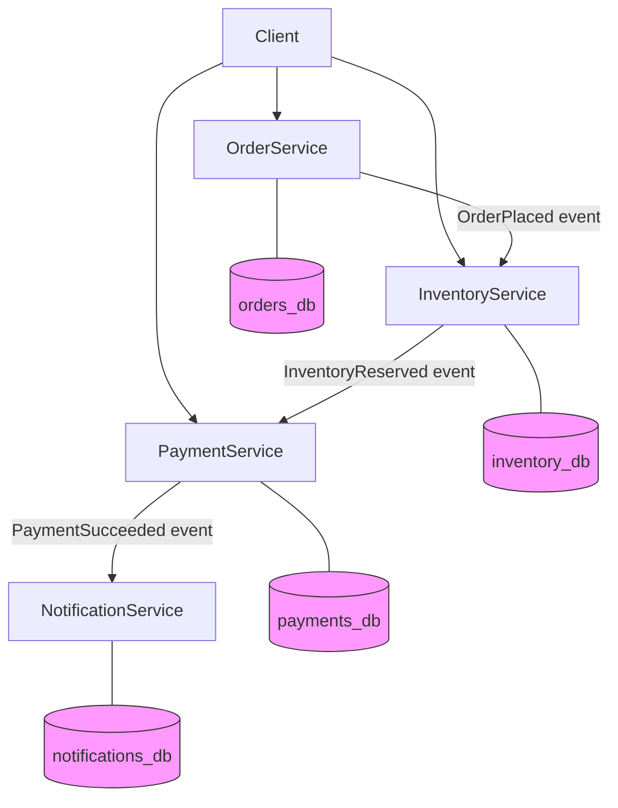
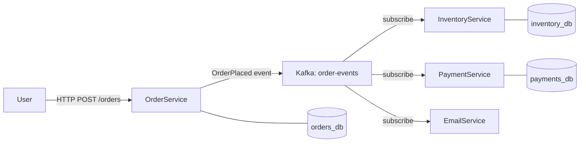
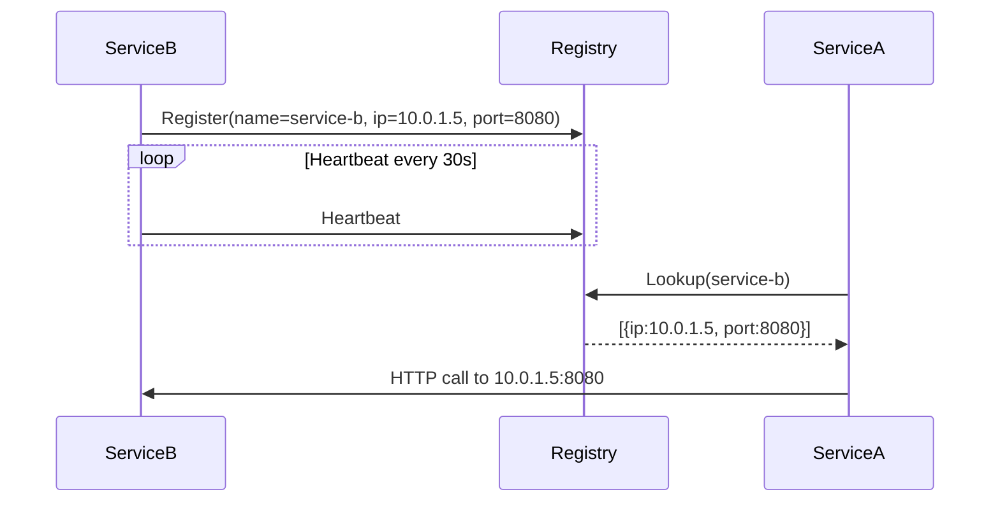
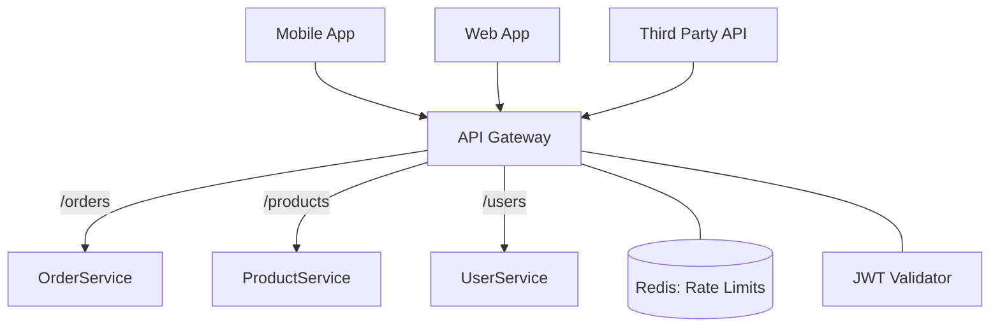
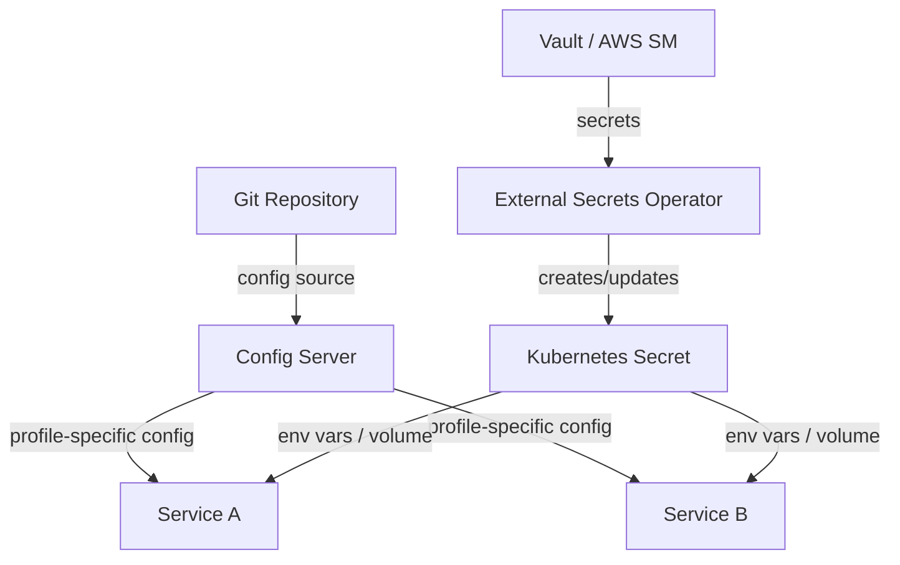

## Keywords in This File

{: .no_toc }

| #   | Keyword                                   | Weight   |
| --- | ----------------------------------------- | -------- |
| 1   | [Service Boundaries and Decomposition](#service-boundaries-and-decomposition) | critical |
| 2   | [Inter-Service Communication Patterns](#inter-service-communication-patterns) | critical |
| 3   | [Service Discovery Mechanisms](#service-discovery-mechanisms) | high |
| 4   | [API Gateway Fundamentals](#api-gateway-fundamentals) | high |
| 5   | [Configuration Management for Services](#configuration-management-for-services) | medium |

---

# Service Boundaries and Decomposition

🎯 Interview Weight: critical - the first and hardest decision in
any microservices design; every senior+ system design interview
on microservices starts here.

---

### 🎯 Model Answer

**30 seconds:**
> Service boundaries define where one service ends and another
> begins. The best decomposition uses Domain-Driven Design bounded
> contexts: each service owns one business capability, its data,
> and its logic. The core insight is that getting boundaries wrong
> is the most expensive mistake in microservices - too fine-grained
> creates distributed monolith; too coarse-grained defeats the purpose.

**3 minutes (Senior):**
> When I approach service decomposition, I start with the business
> domain, not the technical layers. I map out the business
> capabilities - things like "order management," "inventory,"
> "payments" - and look for natural seams where teams work
> independently and data ownership is clear.
>
> The DDD bounded context is the most reliable heuristic I have
> used. A bounded context is a boundary within which a particular
> model is consistent and valid. If two services need to share the
> same aggregate - the same Customer object, for example - that is
> a signal they might belong in the same service, or that you need
> to think harder about which service owns that concept.
>
> The practical signals I look for: if a change to service A always
> requires a change to service B, they are too tightly coupled.
> If a single developer can own and reason about a service end-to-
> end without expertise in other areas, the boundary is about right.
>
> I have seen teams make two common mistakes: decomposing along
> technical layers (a "user-interface service," a "database service")
> which creates a distributed monolith, or decomposing too finely
> so that a single business transaction requires 10 synchronous
> calls. Both create more problems than a monolith would.

**Framework:** WHAT - WHY - HOW - TRADE-OFF - EXAMPLE

*Adapting up:* At staff level, connect to Conway's Law - your service
boundaries will mirror your team structure. Talk about how you
validated boundaries by observing change frequency and deployment
coupling.

*Adapting down:* Junior/Mid: define what a service boundary is, why
it matters, and give one concrete example of a poorly-drawn boundary.

**Blank Mind Recovery:**

**(1) Restate:** "So you are asking about how to decide where one
microservice ends and another begins - let me think through what
drives that decision."

**(2) First principles:** "From first principles, a service exists
to handle one business capability independently. The boundary is
where business ownership changes."

**(3) Bridge:** "This reminds me of single responsibility principle.
A service that does two things that change at different rates for
different reasons should be two services."

---

### 📘 Concept Explanation

**What it is:**
Service decomposition is the process of deciding which functionality
belongs in which service. A service boundary defines the interface
and ownership contract between that service and everything else.

**The problem it solves:**
In a monolith, any team can modify any code, leading to coupling,
merge conflicts, and deployment fear. Microservices decomposition
creates explicit ownership so teams can move independently. Without
good boundaries, you get a distributed monolith: all the complexity
of distribution with none of the independence.

**How it works:**
```
Decomposition heuristics (in priority order):

1. Business capability: one service = one business function
   Orders  | Inventory | Payments | Notifications

2. DDD Bounded Context: find where domain language diverges
   "Customer" in Sales = prospect + contact info
   "Customer" in Billing = account + payment history
   Different models = different services

3. Change frequency: things that change together, deploy together
   Catalog rarely changes; Cart changes daily
   -> separate services, different deployment cadences

4. Team ownership: one team, one service (Conway's Law)
   Cross-team service = coordination bottleneck

5. Data ownership: service owns its tables, no shared DB
   If two services write to same table: wrong boundary
```

**The key insight:**
Boundaries should be drawn where business ownership changes, not
where technology layers change. A service that owns "user management"
is valid; a service that owns "all database writes" is a technical
layer, not a business service.

**When to use it:**
- When business capabilities have different change rates
- When different teams need independent deployment ownership
- When scaling requirements differ by business function
- When you have clearly separated data ownership

**When NOT to use it:**
- When the "capabilities" are actually the same business concept
  with a slight variation - merge them
- When two functions are always deployed together and change together
  - they belong in one service
- Do not decompose to reduce file size or "because microservices" -
  start coarser and split when pain is real

**Alternatives:**
- Modular monolith - same codebase, explicit module boundaries with
  enforced encapsulation; deploy as one unit
- Macro-services - larger services covering multiple related
  capabilities, fewer network hops
- Mini-services - finer than microservices, often per-function; high
  operational overhead

**First-principles derivation:**
Given: teams need to ship independently without stepping on each
other. Options: (A) one codebase with discipline - fails at scale
because humans don't maintain discipline under pressure. (B) separate
codebases with shared databases - partial isolation, still coupling.
(C) separate codebases AND separate data - full independence. The
boundary must therefore encompass BOTH code AND data ownership.

---

### 💻 Code Example

**BAD - Technical layer decomposition (distributed monolith):**
```java
// Service: DatabaseService - owns all persistence
// This is NOT microservices - it's a distributed monolith
@RestController
public class DatabaseController {
    // All other services call this for ANY data operation
    // Becomes a bottleneck, single point of failure
    @PostMapping("/save")
    public void save(@RequestBody Object entity) {
        // Every service depends on this one service
        // Any schema change breaks every service
        genericRepository.save(entity);
    }
}
```

> **Code walkthrough:** This shows the "technical layer" anti-pattern.
> A "DatabaseService" that all other services call is not a service
> boundary - it is a shared infrastructure layer dressed up as a
> microservice. Every service is now coupled to every schema change.
> This is the most common decomposition mistake.

**GOOD - Business capability decomposition:**
```java
// OrderService owns: order lifecycle, order data, order rules
@RestController
@RequestMapping("/orders")
public class OrderController {

    // OrderService makes its OWN calls to its OWN database
    // No other service touches the orders table
    @PostMapping
    public ResponseEntity<Order> createOrder(
            @RequestBody CreateOrderRequest req) {
        // Business logic contained within this service
        Order order = orderService.create(req);
        // Emits event - other services react async
        eventBus.publish(new OrderCreatedEvent(order.getId()));
        return ResponseEntity.ok(order);
    }
}

// InventoryService owns: stock levels, reservation logic
@RestController
@RequestMapping("/inventory")
public class InventoryController {
    // Subscribes to OrderCreatedEvent, updates its own stock
    // No direct dependency on OrderService database
    @EventListener
    public void onOrderCreated(OrderCreatedEvent event) {
        inventoryService.reserveStock(event.getOrderId());
    }
}
```

> **Code walkthrough:** OrderService owns its data and business logic
> entirely. It emits an event when an order is created; InventoryService
> reacts asynchronously. Neither service calls the other's database.
> This is the correct boundary: change to order lifecycle does not
> require touching inventory code.

**Boundary validation test:**
```java
// Test: can this service be deployed alone?
// If this test passes, the boundary is valid.
@SpringBootTest
class OrderServiceBoundaryTest {

    // This service should start without any other service running
    // If it requires InventoryService to start: wrong boundary
    @Test
    void serviceStartsInIsolation() {
        // Should connect only to its own DB
        // Should use in-memory stub for external events
        assertThat(applicationContext.isRunning()).isTrue();
    }

    @Test
    void noDirectCrossServiceDatabaseAccess() {
        // Orders table owned only by this service
        // inventory, payments tables: NOT accessible here
        assertThat(dataSource.getUrl())
            .contains("orders_db")
            .doesNotContain("inventory_db");
    }
}
```

> **Code walkthrough:** The deployment isolation test validates the
> boundary at the infrastructure level. If the service cannot start
> without another service running, the boundary is wrong - there is
> a startup dependency that will cause cascading failures. This test
> is cheap to write and catches boundary violations early.

---

### 🎓 Answers by Seniority

**Junior / Mid (0-5 years):**
> A service boundary is the line that separates what one
> microservice owns from what another owns. The best rule of
> thumb is one service per business capability - Orders handles
> everything about orders, Payments handles everything about
> payments. The key is that each service owns its own database
> so changes in one don't require changes in another.

*Push deeper:* Explain how Conway's Law means your service
boundaries will drift toward your team structure over time, so
align the two intentionally.

---

**Senior / Staff (5+ years):**
> Getting service boundaries right is the hardest part of
> microservices, and I approach it with DDD bounded contexts.
> I map business capabilities, identify where data ownership
> changes, and look for natural seams where teams work without
> coordinating. The tell for a wrong boundary is deployment
> coupling - if you always deploy two services together, they
> should be one. I also look at change frequency: services that
> change for different reasons should be separate.

*Push deeper:* At staff level, talk about how to validate
boundaries empirically: track change-coupling in git history,
count cross-service calls, measure deployment frequency per
service. A service with two spikes of ownership is a split
waiting to happen.

---

### ⚠️ Common Misconceptions

**Misconception 1: "Smaller services are always better."**
Not true. Nano-services (one function per service) create extreme
operational overhead: 100 services to monitor, deploy, and debug
for a feature that needs 80 of them. The right size is the size
where one team owns it end-to-end.

**Misconception 2: "Decompose by technical layer."**
The "UI service, business service, data service" decomposition is
a distributed monolith. A change to the business layer forces
coordinated deployments. Business capability decomposition is the
right axis.

**Misconception 3: "Start microservices from day one."**
Greenfield projects rarely have the domain understanding needed
to draw correct boundaries. Start with a modular monolith, let
the domain stabilize, then extract services where pain is real.

**Misconception 4: "Shared libraries solve coupling."**
Sharing a domain model library between services means a change
to the shared library requires redeploying all consumers.
Independent versioning is the only real solution.

---

### 🚨 Failure Modes and Diagnosis

**Failure: Distributed monolith**
Symptom: Deploying Service A always requires deploying Service B.
Cross-service integration tests are required before any release.
Diagnosis: Check git history - do Services A and B always appear
in the same commits? Count cross-service synchronous calls in
a single user transaction.
Fix: Merge services with high change-coupling, or introduce
async events to decouple the deployment path.

**Failure: Chatty service interactions**
Symptom: A single user action triggers 15+ synchronous service
calls; p99 latency is 2 seconds even though each service is fast.
Diagnosis: Add distributed tracing (Jaeger/Zipkin), look at the
trace tree for the slow request - count the service hops.
Fix: Redesign the boundary so fewer service calls are needed
per user action; introduce aggregator services or denormalize data.

**Failure: Data ownership violation**
Symptom: Service B writes directly to Service A's database table.
One team's migration breaks another team's service.
Diagnosis: Query the database for cross-service write patterns.
Fix: Enforce ownership with separate database credentials;
Service B must go through Service A's API to modify its data.

---

### 🎯 Interview Deep-Dive

**Timing:** Easy 6 min | Medium 10 min | Hard 15 min

| Category | Questions |
|---|---|
| Definition | 2 |
| Mechanism | 2 |
| Comparison | 2 |
| Scenario | 2 |
| Debugging | 1 |
| Deep Dive | 2 |
| Misconception | 1 |
| Behavioral | 1 |

**Definition:**

Q: "What is a service boundary in microservices?"

A: A service boundary defines the responsibility and ownership
contract of a single service. It encompasses the business logic,
data, and API that belong exclusively to that service. Everything
outside the boundary is accessed through APIs, never through shared
databases. The practical definition: a boundary is correct when
one team can build, deploy, and operate it without coordinating
with another team.

*What separates good from great:* Great candidates mention that
the boundary also defines the data ownership contract, not just
the code boundary. They know that "separate codebases" without
"separate databases" is not true decomposition.

---

Q: "What is Domain-Driven Design and how does it relate to
service decomposition?"

A: DDD is a design approach that centers the model on business
domain concepts. Bounded contexts are its primary decomposition
tool: each context defines a boundary within which a specific
domain model is valid and consistent. In microservices, a bounded
context maps closely to a service. The key signal: if the word
"Customer" means different things in two parts of your system
(a sales prospect vs. a billing account), you have two contexts
that should be two services with their own Customer models.

*What separates good from great:* Mention anti-corruption layers
at context boundaries - the translation layer that prevents one
context's model from leaking into another.

---

**Mechanism:**

Q: "How do you decide whether two functions belong in the same
service or different services?"

A: I use three tests. (1) Change coupling: if a change to function
A always requires a change to function B, they belong together.
Look at git commit history for co-change patterns. (2) Data
ownership: if both functions need to write the same data, they
are likely one service - or one owns the data and the other calls
it via API. (3) Deployment coupling: can I deploy A without
deploying B? If not, they are not truly independent services.
The Conway's Law corollary: the right answer often is "they
belong together if the same team owns both."

*What separates good from great:* Candidates who have done this
empirically will mention using git log analysis or service
dependency graphs to find hidden coupling before it causes pain.

---

Q: "What is a distributed monolith and how does it form?"

A: A distributed monolith looks like microservices on the surface
- multiple deployable units - but operates like a monolith because
services are tightly coupled through synchronous chains or shared
databases. It forms when teams decompose along technical layers
instead of business capabilities, or when services share a database
for "simplicity." The result is all the operational complexity of
microservices (network calls, distributed tracing, multiple
deployments) with none of the independence (you still deploy
everything together). It is the worst possible outcome.

*What separates good from great:* Name concrete examples of
distributed monolith patterns: the shared database, the
synchronous call chain where A calls B calls C calls D, and
the "helper service" that every other service imports.

---

**Comparison:**

Q: "Modular monolith vs. microservices - when would you choose each?"

A: A modular monolith has explicit module boundaries enforced
by the build system - modules cannot import private classes from
each other - but deploys as one binary. Choose it when the team
is small (under 10 engineers), the domain is not yet stable
(boundaries will change), or operational complexity is a
bottleneck. Microservices are the right choice when teams need
truly independent deployment velocity, scaling requirements
differ significantly by function, or you need technology
heterogeneity. The migration path is natural: build a well-
modularized monolith, extract services where the module boundary
is proven stable.

*What separates good from great:* Name the decisive factor: the
question is whether you need independent deployment or just
independent code ownership. If deployment independence is not
required, a modular monolith is always cheaper.

---

Q: "How do fine-grained and coarse-grained decomposition differ?"

A: Fine-grained decomposition (nano-services) means each service
does one specific function - one service per entity, or even
one per operation. Coarse-grained means one service per business
domain - an "order management" service handling the full lifecycle.
Fine-grained maximizes deployment flexibility but maximizes
operational overhead and network call volume. Coarse-grained
minimizes operations but can become a mini-monolith. The right
level is typically at the business capability level - coarser
than nano, finer than domain-per-service.

*What separates good from great:* Recognize that fine-grained
is often a premature optimization. Most systems should start
coarser and split when specific pain is felt.

---

**Scenario:**

Q: "An e-commerce system has an OrderService and a
ProductService. A customer places an order; the system must
reserve inventory and deduct payment. How do you design the
service boundaries?"

A: The three natural bounded contexts here are Orders, Inventory,
and Payments. Order placement should not be a synchronous call
chain through all three - that creates a distributed transaction.
Instead: OrderService creates the order in a PENDING state and
publishes an OrderPlaced event. InventoryService subscribes and
attempts reservation, publishing InventoryReserved or
InventoryFailed. PaymentService subscribes to InventoryReserved
and attempts payment, publishing PaymentSucceeded or PaymentFailed.
OrderService receives the final outcome and transitions state.
This is the Saga pattern - no distributed transaction, each
service owns its own data, failures are compensated asynchronously.

*What separates good from great:* Proactively address what
happens on failure. If payment fails, InventoryService must
receive a compensation event to release the reservation. The
saga must be designed with compensation handlers.

---

Q: "How would you extract a User service from an existing monolith?"

A: The Strangler Fig pattern. First, identify all the places the
monolith touches user data. Add a thin facade - an interface
in the monolith that routes user-related calls. Route new
traffic through this facade to the new UserService, while the
monolith still handles existing calls internally. Gradually
migrate call sites in the monolith to use the UserService API
instead of direct DB access. Once the monolith has no direct
database access to the users table, delete those code paths
and remove the facade. Key constraint: never have both the
monolith and UserService write to the same table simultaneously.
Use a migration window with read-only access from one side.

*What separates good from great:* Describe the database cut-over
explicitly - this is where teams get stuck. Dual-write patterns
during migration, with a consistency checker running in parallel.

---

**Debugging:**

Q: "A newly decomposed service is causing 40% increase in p99
latency. How do you diagnose it?"

A: Step 1: Add distributed tracing to the affected flow if not
present (Jaeger, Zipkin) and capture a slow trace. Step 2:
In the trace, identify which service hop contributes most
latency - is it the new service itself, or the network call
to it? Step 3: Check if the new service is making a
synchronous call that used to be a local function call in
the monolith - this is the most common cause. Step 4: Check
connection pool exhaustion on the new service - the first
call pattern after extraction often lacks proper connection
pooling. Step 5: Check if N+1 queries emerged when data
that was one JOIN is now two service calls. Each of these
has a distinct fix: caching, bulk APIs, or async communication.

*What separates good from great:* Distinguish between latency
from the network call itself (usually 1-5ms, acceptable) and
latency from design changes (N+1, missing index, no caching)
that the extraction exposed.

---

**Deep Dive:**

Q: "How does Conway's Law affect service boundaries?"

A: Conway's Law states that organizations produce architectures
that mirror their communication structures. In microservices,
this means your service boundaries will drift over time toward
your team boundaries - whether you intend it or not. The
practical implication: if you want Service A and Service B
to have a clean boundary, the teams that own them must not
need to coordinate daily. If they do, the boundary will
erode. The Inverse Conway Maneuver is the deliberate
application: design your team structure to match your
desired service architecture, then let the code follow.
Staff engineers use this to advocate for org changes when
architecture problems are really people problems.

*What separates good from great:* Mention that detecting
Conway's Law violations is part of architecture governance:
track how many cross-team pull request reviews are needed
for a feature. High cross-team review volume is a boundary
smell.

---

Q: "What is event storming and how does it help with decomposition?"

A: Event storming is a domain modeling workshop where you map
all the domain events (things that happen in the business),
commands (things users or systems do), and aggregates (the
objects that handle commands and produce events). You do this
on a large wall with sticky notes, involving domain experts
and engineers. Service boundaries emerge from the clusters:
events and commands that are tightly clustered around the
same aggregates belong in the same service. Event storming
is most valuable early, before writing code, because it
forces domain experts to make the implicit explicit and
surfaces the natural seams in the domain before engineers
make assumptions.

*What separates good from great:* Distinguish event storming
from simple brainstorming - the output is a concrete domain
model, not just a list of functions. The aggregates that
emerge are candidate service owners.

---

**Misconception / Trap:**

Q: "Every microservice should be as small as possible - the
smaller, the better. Is that right?"

A: Not correct. That's the nano-service anti-pattern. The right
size is the minimum size that allows one team to build, deploy,
and operate it independently. Smaller than that, and you have:
too many services to observe and deploy, cross-service calls
for trivial operations, and distributed transactions for basic
business flows. Amazon famously uses the "two-pizza team" rule:
if more than two pizzas are needed to feed the team that owns
a service, the service might be too large. But the key word
is team - the team size drives the service size, not the
function count.

*What separates good from great:* Name what "too small" looks
like in production: a deploy pipeline with 200 services that
all need to be coordinated for a single feature release. The
overhead becomes the bottleneck.

---

**Behavioral:**

Q: "Describe a time you had to refactor service boundaries after
getting them wrong initially."

A: On a payment platform, we initially decomposed by technical
role: a "validator service," a "processor service," and a
"notifier service." Six months in, every payment feature
required changes to all three services and three synchronized
deployments. We analyzed git history and found 90% of commits
touched all three services for the same payment feature. We
redesigned around business capability: one PaymentService
owning the full payment lifecycle. The migration took two
sprints - we used the Strangler Fig pattern to route traffic
gradually. After migration, payment features shipped in one
service deployment instead of three. Deployment frequency
for payment features tripled.

*What separates good from great:* Quantify the improvement
and describe the migration strategy, not just the outcome.
Interviewers want to know if you have done this, not just
if you know it theoretically.

---

### ⚖️ Comparison Table

| Option | Boundary Criterion | Team Size | Operational Cost | When to Choose |
|---|---|---|---|---|
| **Bounded Context / Capability** | Business function | 3-8 per service | Medium | Default for microservices |
| Technical Layer | DB, Logic, UI | Any | High (coupled deploys) | Never - distributed monolith |
| Modular Monolith | Module/package | 1-15 total | Low | Team small, domain unstable |
| Nano-service | One function | 1-2 | Very high | Only for serverless functions |
| Macro-service | Domain cluster | 5-20 | Low-medium | Starting migration, or stability |

**The deciding factor:** Team ownership. The right boundary is
the smallest unit that one team can own end-to-end without
coordinating deployments with another team.

---

### 🏛️ System Design

*(Conditional: included because service decomposition is the
foundational design decision in every microservices system design
interview.)*

**Where Service Decomposition appears in system design:**
- "Design an e-commerce system" - first question after requirements
- "Decompose a monolith to microservices" - explicit extraction problem
- "Design the payment system" - defining what it includes/excludes

**Example question:** "Design the backend for a food delivery
platform. How would you decompose it into services?"

**6-step framework answer:**
Step 1 CLARIFY (~5 min) - What delivery regions? What scale
(orders/day)? What team size? Sync or async delivery confirmation?

Step 2 ESTIMATE (~5 min) - 100K orders/day = ~1.2 orders/sec;
peak 10x = 12 orders/sec; read-heavy (menu browsing >> ordering)

Step 3 DESIGN (~10 min) - Business capabilities: User/Auth,
Restaurant (menu, availability), Order (lifecycle), Delivery
(assignment, tracking), Payments, Notifications. Each gets its
own service and database.

Step 4 DEEP DIVE (~10 min) - Service boundaries drawn by team
ownership and data. OrderService owns order state machine.
DeliveryService owns driver assignment algorithm. Neither
writes to the other's database. Communication via events:
OrderPlaced -> DeliveryService assigns driver.

Step 5 ALTS (~5 min) - Could have one big OrderDelivery service.
Rejected: order management team and delivery logistics team
are different - they need independent deployment for frequency
of change differences.

Step 6 EVOLVE (~5 min) - At 10x scale, separate the Restaurant
read model into a dedicated read service backed by Elasticsearch
for menu search. Order and Delivery remain separate.

**Scale inflection point:**
At ~10K services or 100+ engineering teams, the cost of service
discovery, observability infrastructure, and cross-team API
contracts becomes the bottleneck. At this scale, platform
engineering teams emerge to own the common infrastructure.

**Common system design traps:**
- Drawing services by technical layer (UI/Logic/Data) instead
  of business capability - creates synchronized deployments
- Designing synchronous call chains across all services for
  a single user action - creates latency chains and partial
  failure amplification
- Ignoring data ownership - allowing multiple services to write
  the same database table - the shared database anti-pattern

**Staff angle:** The org design is the architecture. Before
drawing service boxes, map the team topology. Each stream-
aligned team should own 1-3 services. If a team owns 20
services, they cannot operate them effectively - merge or
restructure.

---

### 📊 Diagram

*(Conditional: included because the correct vs. incorrect
decomposition pattern is a canonical interview diagram.)*

**BAD decomposition - Technical layers:**
```
Client
  |
  v
[UI Service] --> [Business Service] --> [DB Service]
                      |
                      v
                 [Shared DB]
All services must deploy together. Not microservices.
```

**GOOD decomposition - Business capabilities:**
```
Client
  |
  +---> [OrderService]      owns: orders_db
  |         | (event)
  |         v
  +---> [InventoryService]  owns: inventory_db
  |         | (event)
  |         v
  +---> [PaymentService]    owns: payments_db
  |         | (event)
  |         v
  +---> [NotificationSvc]   owns: notifications_db
```



> **Diagram walkthrough:** Each service owns exactly one
> database - no cross-service table access. Services
> communicate via events (async), not synchronous calls.
> A change to the payment logic requires no deployment of
> OrderService. This is the correct decomposition: data
> ownership + async communication + independent deployment.

---

---

# Inter-Service Communication Patterns

🎯 Interview Weight: critical - every microservices interview
asks how services talk to each other; the sync vs. async
trade-off is a core seniority signal.

---

### 🎯 Model Answer

**30 seconds:**
> Services communicate either synchronously (HTTP/REST, gRPC -
> the caller waits for a response) or asynchronously (message
> queues, events - the caller fires and forgets). Synchronous
> is simpler but creates coupling and cascading failures.
> Async decouples services and improves resilience but adds
> complexity. The right choice depends on whether the caller
> needs the result immediately to continue processing.

**3 minutes (Senior):**
> The communication pattern choice is one of the most
> consequential decisions in microservices design. Synchronous
> communication - REST or gRPC - is straightforward: Service A
> calls Service B and waits. The problem is temporal coupling:
> if B is slow, A is slow; if B is down, A fails. In production
> I have seen cascading failures where one slow service brought
> down everything upstream because synchronous chains don't
> isolate failures.
>
> Asynchronous communication via message queues or event buses
> (Kafka, RabbitMQ) decouples the producer from the consumer.
> Service A publishes an event and moves on. Service B processes
> it when ready. The trade-off: you gain resilience but lose
> immediate consistency - you cannot return a result to the
> caller synchronously in the same request.
>
> My rule of thumb: use synchronous communication for queries
> (reading data where you need the answer now) and for write
> operations where the user needs immediate confirmation - like
> "is payment authorized?" Use async for operations that can
> be processed later: "send confirmation email," "update
> inventory," "generate invoice." This usually means a mix
> of both patterns in any real system.

**Framework:** WHAT - WHY - HOW - TRADE-OFF - EXAMPLE

*Adapting up:* At staff level, discuss the spectrum: request-reply
async (via correlation IDs), event-driven, and reactive streams.
Also discuss backpressure and flow control at scale.

*Adapting down:* Junior/Mid: distinguish sync vs. async with
one concrete example of each.

**Blank Mind Recovery:**

**(1) Restate:** "So you're asking about how one microservice
calls another - let me think through the options."

**(2) First principles:** "Services are separate processes.
Communication is a network call. The question is whether you
wait for the response or not."

**(3) Bridge:** "This is like function calls vs. message
queues. REST is like a blocking function call; Kafka is
like a queue where you process later."

---

### 📘 Concept Explanation

**What it is:**
Inter-service communication is the mechanism by which one
microservice sends data to or requests data from another.
The two axes are: synchronous vs. asynchronous, and direct
vs. through a broker.

**The problem it solves:**
Services run in separate processes. Unlike in-process function
calls, every cross-service call is a network call: it can fail,
be slow, or be unavailable. Communication patterns determine
how resilient and coupled services are to each other's failures.

**How it works:**
```
SYNCHRONOUS (request-response):
Caller ---HTTP/gRPC---> Callee
       <---response----
- Caller blocks until response
- Fail fast: caller knows immediately if callee is down
- Risk: caller inherits callee latency
- Pattern: REST, gRPC, GraphQL

ASYNCHRONOUS (message-based):
Publisher ---> [Message Broker] ---> Consumer
(Kafka, RabbitMQ, SQS)
- Publisher does not wait; moves on immediately
- Consumer processes at its own rate
- Risk: no immediate result; eventual consistency
- Pattern: events, commands via queue

HYBRID (async request-reply):
Caller --event--> [Broker] --event--> Callee
      <--event--  [Broker] <--event--
Uses correlation ID to match reply to request.
Async decoupling with logical request-response.
```

**The key insight:**
Synchronous communication makes the caller dependent on the
callee's availability and latency. Every synchronous call in
a chain multiplies the failure surface. If you have 5 services
in a sync chain and each has 99.9% availability, the chain is
only 99.5% available.

**When to use synchronous:**
- Query operations where the result is needed immediately
- Simple CRUD where the caller must confirm the write succeeded
- Real-time user-facing operations (authorize payment now)
- Low call volume with well-known SLAs

**When to use asynchronous:**
- Operations where the result can be processed later
- Fan-out: one event needs to reach multiple consumers
- Decoupling: when you don't know who the consumers are
- Resilience: when you can tolerate eventual consistency

**Alternatives:**
- GraphQL subscriptions - async push over WebSocket
- Server-Sent Events - push notifications from server
- gRPC streaming - bidirectional streaming over HTTP/2

**First-principles derivation:**
Two distributed processes communicating must choose:
wait for acknowledgment (sync) or fire-and-forget (async).
Sync maximizes consistency but propagates failure. Async
maximizes resilience but defers consistency. Neither is
universally superior; the choice must match the business
requirement.

---

### 💻 Code Example

**BAD - Synchronous chain without resilience:**
```java
// OrderService - WRONG: directly calls downstream with no protection
@Service
public class OrderService {
    private final InventoryClient inventoryClient;
    private final PaymentClient paymentClient;

    public Order placeOrder(OrderRequest request) {
        // If inventory is down for 5 seconds, this blocks 5 seconds
        // If payment is down, order fails even if inventory is fine
        // No timeout, no retry, no fallback
        inventoryClient.reserve(request.getItems());
        paymentClient.charge(request.getPayment());
        return orderRepository.save(new Order(request));
    }
}
```

> **Code walkthrough:** This synchronous chain has no circuit
> breaker, no timeout, and no fallback. If PaymentService is
> slow, every order placement blocks. If PaymentService is
> down, every order fails immediately. This is temporal coupling
> at its worst - one service's health determines another's.

**GOOD - Sync with resilience (Resilience4j):**
```java
@Service
public class OrderService {
    private final InventoryClient inventoryClient;

    // Circuit breaker opens after 5 failures in 10 calls
    @CircuitBreaker(name = "inventory",
                    fallbackMethod = "inventoryFallback")
    @TimeLimiter(name = "inventory") // 2 second timeout
    @Retry(name = "inventory")       // 3 retries with backoff
    public CompletableFuture<ReservationResult> reserveInventory(
            OrderRequest request) {
        return CompletableFuture.supplyAsync(
            () -> inventoryClient.reserve(request.getItems()));
    }

    // Fallback: queue the reservation for later
    public CompletableFuture<ReservationResult> inventoryFallback(
            OrderRequest request, Exception ex) {
        pendingReservationQueue.enqueue(request);
        return CompletableFuture.completedFuture(
            ReservationResult.queued());
    }
}
```

> **Code walkthrough:** Resilience4j adds a circuit breaker
> that stops calling a failing downstream service, a timeout
> that prevents blocking forever, and retries with exponential
> backoff. The fallback queues the reservation for later so
> the order can still succeed. This transforms a fragile
> synchronous call into a resilient one.

**GOOD - Async event-driven communication:**
```java
// OrderService: publish event, do NOT call downstream directly
@Service
public class OrderService {
    private final KafkaTemplate<String, OrderEvent> kafka;

    public Order placeOrder(OrderRequest request) {
        Order order = orderRepository.save(
            new Order(request, OrderStatus.PENDING));

        // Publish event - inventory and payment react async
        kafka.send("order-events",
            new OrderPlacedEvent(
                order.getId(),
                request.getItems(),
                request.getPayment()));

        // Return immediately - do NOT wait for inventory/payment
        return order;
    }
}

// InventoryService: consume event, process independently
@KafkaListener(topics = "order-events",
               groupId = "inventory-service")
public class InventoryEventHandler {
    public void handleOrderPlaced(OrderPlacedEvent event) {
        // Processes at its own pace, retries on failure
        // OrderService is already done; no blocking
        inventoryService.reserve(
            event.getOrderId(), event.getItems());
    }
}
```

> **Code walkthrough:** OrderService publishes a single Kafka
> event and returns immediately. InventoryService and
> PaymentService consume events independently. If InventoryService
> is temporarily down, Kafka holds the message; no data is lost
> and OrderService is unaffected. This is the async decoupling
> pattern that allows services to scale and fail independently.

---

### 🎓 Answers by Seniority

**Junior / Mid (0-5 years):**
> Services communicate either synchronously using HTTP or gRPC -
> where the calling service waits for the response - or
> asynchronously using message queues like Kafka or RabbitMQ -
> where the calling service publishes a message and moves on.
> Synchronous is simpler but means the calling service is as
> slow and as available as the called service. Async is more
> resilient but means you cannot return an immediate result.

*Push deeper:* Explain that the choice should be driven by
whether the user needs an immediate answer - if not, prefer
async.

---

**Senior / Staff (5+ years):**
> I think about communication in terms of temporal coupling.
> Every synchronous call makes the caller dependent on the
> callee's latency and availability. In a chain of 5 services,
> 99.9% availability per service gives you 99.5% end-to-end -
> one nine worse. I prefer async communication where the
> business allows it: the caller publishes an event and the
> consumer processes it independently. The trade-off is eventual
> consistency and the need to handle duplicate messages
> (idempotency). For queries that need immediate answers, I use
> synchronous with circuit breakers and timeouts.

*Push deeper:* Discuss the async request-reply pattern using
correlation IDs for when you need async decoupling but still
need a logical response, and how to handle timeout and
result tracking.

---

### ⚠️ Common Misconceptions

**Misconception 1: "REST is simpler, so always use REST."**
REST is familiar but creates temporal coupling. For internal
service-to-service communication, gRPC is often better:
strongly typed contracts, binary serialization, streaming
support. "Simpler" often means "familiar," not "better."

**Misconception 2: "Async means you don't need error handling."**
Async communication shifts the error handling, not eliminates
it. You need dead letter queues for messages that fail
processing, consumer group monitoring, and idempotency for
retry scenarios. The errors are just deferred.

**Misconception 3: "gRPC is only for performance."**
gRPC's primary benefit for microservices is its strongly typed
schema (protobuf). The contract is machine-readable, versioned,
and shared. Type safety across service boundaries prevents
entire classes of integration bugs.

**Misconception 4: "Publish-subscribe means one message per
consumer."**
In pub-sub, every subscriber receives every message. In
competing consumers (consumer groups in Kafka), multiple
instances share the work. These are different patterns for
different use cases: broadcast vs. load-balanced processing.

---

### 🚨 Failure Modes and Diagnosis

**Failure: Cascading synchronous failure**
Symptom: All services returning 503 simultaneously; one
downstream service is slow and the failure propagates upstream.
Diagnosis: Check service dashboards for which service hit
its SLA first. Add distributed tracing to see the call chain.
Fix: Add circuit breakers and timeouts to every synchronous
call. Open the circuit when error rate exceeds threshold.

**Failure: Message queue backup (consumer lag)**
Symptom: Orders processed but Kafka consumer lag growing;
downstream effects (emails not sent, inventory not updated)
delayed by hours.
Diagnosis: `kafka-consumer-groups.sh --describe` - check lag
per partition. Check consumer CPU and GC to see if the consumer
is stuck.
Fix: Scale consumer instances horizontally (add partitions
if needed for parallelism), fix the slow processing path,
or shed load via priority queues.

**Failure: Duplicate message processing**
Symptom: Inventory reserved twice for one order; payment
charged twice.
Diagnosis: Check consumer offset commits - was the offset
committed before or after processing? If after processing
crashed, the message was re-delivered.
Fix: Make all consumers idempotent: check if the operation
has already been done (by order ID) before processing.

---

### 🎯 Interview Deep-Dive

**Timing:** Easy 6 min | Medium 10 min | Hard 15 min

| Category | Questions |
|---|---|
| Definition | 2 |
| Mechanism | 2 |
| Comparison | 2 |
| Scenario | 2 |
| Debugging | 1 |
| Deep Dive | 2 |
| Misconception | 1 |
| Behavioral | 1 |

**Definition:**

Q: "What is the difference between synchronous and asynchronous
communication in microservices?"

A: Synchronous communication means the caller sends a request
and blocks until it receives a response. HTTP REST and gRPC
are the canonical examples. The caller knows the outcome
immediately. Asynchronous communication means the caller
publishes a message or event to a broker and moves on without
waiting. The consumer processes the message independently.
Kafka, RabbitMQ, and AWS SQS are common brokers. The key
difference: synchronous creates temporal coupling (if the
callee is down, the caller fails), async does not.

*What separates good from great:* Mention that the choice
affects consistency guarantees. Synchronous gives you
immediate confirmation of success or failure. Async means
you have fired the message but do not know yet if processing
succeeded - you need a separate mechanism to track outcomes.

---

Q: "What is a message broker and why do microservices use one?"

A: A message broker is an intermediary that receives messages
from producers and delivers them to consumers. Examples:
Kafka (log-based), RabbitMQ (queue-based), AWS SQS. Brokers
decouple the producer from the consumer: the producer does not
need to know which services consume its messages, or when.
If the consumer is temporarily unavailable, the broker holds
the message. This is why microservices use brokers: temporal
decoupling (producer and consumer do not need to be running
at the same time), spatial decoupling (producer does not
know the consumer's address), and fan-out (one message can
reach multiple consumers).

*What separates good from great:* Distinguish log-based
(Kafka: ordered, replayable, long retention) from
queue-based (RabbitMQ: acknowledges on consume, message
deleted after processing) and when each is appropriate.

---

**Mechanism:**

Q: "Walk me through what happens when Service A makes a
synchronous REST call to Service B and B is unavailable."

A: Without protection: Service A's HTTP client throws a
connection refused exception (if B is down) or hangs until
a timeout (if B is accepting connections but not responding).
If no timeout is configured, A's thread pool fills with
blocked threads. When A's thread pool is exhausted, A stops
accepting new requests - A is now also down. This is the
cascading failure path. With protection: a circuit breaker
counts failures. After 5 failures in 10 calls, the circuit
opens - A stops calling B and returns the fallback response
immediately. After a wait window (e.g., 30 seconds), the
circuit enters half-open state and allows one test call.
If it succeeds, the circuit closes. This protects A from B's
failure propagating upstream.

*What separates good from great:* Know the three circuit
breaker states (closed, open, half-open) and the exact
transition conditions.

---

Q: "How does Kafka ensure a message is processed exactly once?"

A: True exactly-once semantics in Kafka require transactional
producers (enabled with `enable.idempotence=true` and
`transactional.id`). The producer assigns each message a
sequence number; the broker deduplicates retries within
a producer session. For consumer side, you need to commit
the offset ONLY after successfully processing the message,
and make your consumer idempotent. The challenge: if the
consumer processes the message but crashes before committing
the offset, the message is redelivered and processed again.
The practical answer for most systems: guarantee at-least-once
delivery and make consumers idempotent. True exactly-once
end-to-end requires Kafka transactions and is only available
in specific configurations.

*What separates good from great:* Know that "exactly-once"
in distributed systems requires two-phase logic. For Kafka
specifically, know that transactional exactly-once is
limited to within the Kafka ecosystem - if you write to a
database AND commit the offset, you need the database
transaction to commit atomically with the Kafka offset commit,
which requires two-phase commit or idempotency.

---

**Comparison:**

Q: "REST vs. gRPC - when would you choose gRPC for
inter-service communication?"

A: Choose gRPC when: (1) You need strong contracts - protobuf
schemas are versioned and machine-readable, far better than
informal JSON contracts. (2) Performance matters - binary
serialization is 3-10x smaller and faster to parse than JSON.
(3) You need streaming - gRPC supports server-side, client-side,
and bidirectional streaming natively. (4) Polyglot services -
protobuf generates clients in any language from the same schema.
Choose REST when: exposing public APIs (REST is more universally
consumable), teams are unfamiliar with protobuf, or you need
human-readable wire format for debugging. For internal service
communication in a Java ecosystem, gRPC is usually the better
choice once the team is past the learning curve.

*What separates good from great:* Mention the biggest practical
difference: gRPC forces you to version your API via protobuf,
while REST APIs tend to have implicit, unmanaged contracts
that drift.

---

Q: "Kafka vs. RabbitMQ - how do they differ and when would
you choose each?"

A: Kafka is a distributed log: messages are written to partitioned
logs and retained for a configurable period. Consumers maintain
their own offset - they can replay from any point. Kafka is
optimized for high throughput (millions of messages/second),
ordered processing per partition, and event sourcing. RabbitMQ
is a message queue: messages are pushed to consumers and deleted
after acknowledgment. RabbitMQ is optimized for task distribution,
routing flexibility (fanout, topic, direct exchanges), and
lower operational complexity. Choose Kafka when: event replay
is needed, audit trail matters, multiple independent consumers
need the same event stream. Choose RabbitMQ when: task queuing
is the use case, simpler setup is needed, routing flexibility
is important.

*What separates good from great:* Kafka's retention model means
adding a new consumer to an existing topic gives it access to
historical events - invaluable for building read models. This
is a major architectural advantage that RabbitMQ cannot offer.

---

**Scenario:**

Q: "Design the communication pattern for an order notification
system where placing an order should send an email, update
loyalty points, and trigger fraud detection."

A: This is a fan-out pattern - one event (OrderPlaced) needs
to reach multiple consumers. Use an event bus (Kafka or SNS).
OrderService publishes a single OrderPlaced event.
EmailService, LoyaltyService, and FraudService each subscribe
independently. None of them are called synchronously from
the order placement flow. This design has three properties:
(1) OrderService does not know about EmailService, LoyaltyService,
or FraudService - they are added by subscribing, no change to
OrderService. (2) Each consumer can fail independently without
affecting order placement. (3) New consumers (e.g., analytics)
are added by subscribing, not by changing OrderService.
The only synchronous call in the order flow is the payment
authorization, because the user needs immediate confirmation
that payment succeeded.

*What separates good from great:* Justify which part of the
flow stays synchronous (payment authorization) and which
goes async (everything else). The criterion: can the user
continue if this fails asynchronously? For payment: no.
For email: yes.

---

Q: "A user calls your API to place an order. Using async
communication, how do you return the order status to the user?"

A: The user experience requires a response, but the processing
is async. Three patterns: (1) Immediate acceptance - return
202 Accepted with an order ID and a "pending" status. The
client polls GET /orders/{id} for the final status. (2)
WebSocket or Server-Sent Events - return 202 with an order ID,
then push the status update to the client when processing
completes. (3) Webhook - the client provides a callback URL;
the system POSTs the final status to it. For a web user, the
SSE pattern gives the best UX: the user sees "processing"
with a spinner, then "confirmed" without polling. For API
integrations, the webhook pattern is standard.

*What separates good from great:* Recognize that the "async
backend" does not mean "async UI experience." The front-end
and back-end communication can be decoupled in design while
the UI shows responsive progress to the user.

---

**Debugging:**

Q: "Orders are being placed twice in your system. You are
using Kafka for async communication. How do you diagnose it?"

A: Step 1: Check if the duplicate is at the producer or consumer.
Pull the Kafka message log for the order event - are there two
messages for the same order ID, or one message consumed twice?
Step 2: If two messages - look at the producer for retry logic
without idempotency (`enable.idempotence=true` not set).
The producer may be retrying on timeout and creating a second
message. Step 3: If one message consumed twice - the consumer
is not committing its offset correctly. Check if auto-commit
is enabled (dangerous) and the consumer crashed between
processing and offset commit. Step 4: Fix: enable producer
idempotency, make the consumer idempotent (check order ID
before inserting), and commit offset only after confirmed
persistence.

*What separates good from great:* Distinguish the two sources
of duplication (producer-side vs. consumer-side) and name
the specific fix for each.

---

**Deep Dive:**

Q: "How do you handle service-to-service authentication in
an async messaging system?"

A: In synchronous systems, each service call carries a JWT
or mutual TLS certificate. In async systems, the message is
decoupled from the caller - by the time the consumer processes
it, there is no live HTTP connection to verify. The patterns:
(1) Message-level signing - the producer signs the message
payload with its private key; the consumer verifies with the
producer's public key. (2) Trusted network - if services
communicate within a private network controlled by a service
mesh (Istio), the mesh handles mTLS at the transport level,
not the application level. (3) Producer identity in message
header - include a service identity claim signed by an
identity provider; consumers validate the signature. In
practice, most internal Kafka topics rely on network-level
controls (ACLs, VPC isolation) rather than message-level
signing, with audit logging for compliance.

*What separates good from great:* Know the distinction
between network-level and application-level security, and
that in regulated industries (finance, health), message-
level signatures are often required for non-repudiation.

---

Q: "What is backpressure and how do you implement it in an
async service communication system?"

A: Backpressure is the mechanism by which a consumer signals
to a producer to slow down when it cannot keep up. Without
backpressure, a fast producer overwhelms a slow consumer,
eventually causing out-of-memory errors or message loss. In
Kafka, backpressure is implicit: the broker stores messages,
and the consumer processes at its own rate. The consumer's lag
(offset gap) is the signal - when lag grows above a threshold,
alert and scale the consumer. In reactive streams (Project
Reactor, RxJava), backpressure is explicit: the consumer
requests N items at a time; the producer emits at most N.
This is the `Flux.request(n)` pattern. In HTTP/2, flow control
windows serve the same purpose. The practical question is:
what happens when the consumer cannot catch up? Options:
scale consumers, shed load (drop low-priority messages),
or apply circuit breakers at the producer.

*What separates good from great:* Distinguish between
implicit backpressure (Kafka lag metric) and explicit
backpressure (reactive streams), and name what breaks
when neither is implemented.

---

**Misconception / Trap:**

Q: "Async communication removes the dependency between
services, so you don't need to worry about what happens
if the consumer is down, right?"

A: Not correct. Async removes temporal coupling - the
producer doesn't need the consumer to be running right now.
But it doesn't remove dependency on eventual processing.
If the consumer is down for two days, your message queue
fills up; if it overflows, messages are lost. You still
need to monitor consumer lag, set retention policies that
match your recovery SLA, implement dead letter queues for
poison messages, and alert when lag grows beyond acceptable
bounds. Async shifts the failure from immediate (the producer
fails if consumer is down) to eventual (consumer falls behind
and you may lose messages or delay processing), but it doesn't
eliminate the operational concern.

*What separates good from great:* Name the three async
failure modes: (1) consumer down = lag grows, (2) consumer
crashes on a message = poison message loop, (3) broker full =
message loss. Each has a different solution.

---

**Behavioral:**

Q: "Describe a time when your choice of sync vs. async
communication had a significant production impact."

A: On a retail system, we had a synchronous call from
OrderService to EmailService to send confirmation emails.
During a peak sale, EmailService's SMTP provider became
slow - averaging 3 seconds per send. Because it was synchronous,
every order placement blocked for 3 seconds waiting for the
email to send. Order throughput dropped from 200/sec to 40/sec.
We identified the root cause through distributed tracing - the
trace showed the email call as 75% of total order time. We
converted the email call to async: OrderService published
an OrderPlaced event, EmailService subscribed and processed
independently. During the next sale, SMTP slowness caused
a 2-minute email delay, not a 75% throughput reduction. The
fix took one sprint; the impact was permanent.

*What separates good from great:* Quantify the impact and
name the diagnostic tool (distributed tracing) that found
it. Interviewers want to know you have diagnosed this
in production, not just read about it.

---

### ⚖️ Comparison Table

| Pattern | Coupling | Consistency | Throughput | When to Choose |
|---|---|---|---|---|
| **Sync REST** | Temporal (tight) | Immediate | Medium | Queries, user-facing writes needing confirmation |
| **Sync gRPC** | Temporal (tight) | Immediate | High | High-throughput internal calls with strong contracts |
| **Async Queue (RabbitMQ)** | Decoupled | Eventual | High | Task distribution, simple routing |
| **Async Log (Kafka)** | Decoupled | Eventual | Very High | Events, audit trail, fan-out, replay |
| **Async SSE/WebSocket** | Push-decoupled | Near-real-time | Low-Medium | Client push updates |

**The deciding factor:** Does the caller need the result
immediately to continue? If yes, synchronous. If no, prefer
async for resilience.

---

### 🏛️ System Design

*(Conditional: included because communication pattern selection
is core to every microservices system design.)*

**Where Communication Patterns appear in system design:**
- Deciding how services coordinate (sync chain vs. event-driven)
- Handling failures gracefully (circuit breakers, retries)
- Notification/fan-out flows (one event, many consumers)
- Real-time user-facing updates (WebSocket, SSE)

**Example question:** "Design an order processing system
that can handle 10,000 orders per second at peak."

**6-step framework answer:**
Step 1 CLARIFY - Is confirmation immediate? (yes for payment)
What is acceptable processing lag for downstream? (seconds for
email, minutes for reporting)

Step 2 ESTIMATE - 10K orders/sec peak; Kafka at 1M msg/sec
can absorb 100x our load without scaling.

Step 3 DESIGN - OrderService: accepts HTTP request, persists
order to DB, publishes OrderPlaced to Kafka. All downstream
(Inventory, Payment, Email) subscribe asynchronously.

Step 4 DEEP DIVE - Payment must be synchronous (user needs
confirmation). Inventory can be async if we optimistically
accept orders and compensate on failure. This reduces latency
by 200ms per order.

Step 5 ALTS - Considered full async including payment (store-
and-forward). Rejected: users do not accept non-immediate
payment confirmation.

Step 6 EVOLVE - At 100K orders/sec, Kafka partition count
grows; consumer parallelism scaled to match. Idempotency
becomes mandatory at that scale.

**Scale inflection point:**
At ~1000 synchronous calls/second on a single service, the
thread pool (typically 200-400 threads) saturates. Switch
to async processing or reactive (non-blocking) I/O above
this threshold.

**Common system design traps:**
- Making every call synchronous then adding circuit breakers
  instead of designing async-first
- Not handling the dead letter queue - failed messages
  silently disappear
- Forgetting that async means you need a way to track
  job completion (correlation ID, status polling endpoint)

**Staff angle:** At 10+ services, the communication pattern
governance is as important as individual service design.
Define standards: which topics are first-class (owned,
monitored, SLA'd) vs. ad-hoc. Schema registry prevents
incompatible producer/consumer evolution.

---

### 📊 Diagram

*(Conditional: included because the sync-chain vs. async
event topology is the canonical diagram for this concept.)*

```
SYNC CHAIN (fragile):
User -> OrderSvc -> InventorySvc -> PaymentSvc -> EmailSvc
         depends on all four services being up/fast

ASYNC EVENT (resilient):
User -> OrderSvc -> [Kafka: order-events]
                          |
              +-----------+-----------+
              v           v           v
        InventorySvc  PaymentSvc  EmailSvc
        (independent) (independent) (independent)
```



> **Diagram walkthrough:** The synchronous chain means every
> service's availability directly impacts the order placement
> flow. The async topology means OrderService publishes one
> event and returns; InventoryService, PaymentService, and
> EmailService each consume independently. If EmailService
> is down, orders still succeed. Adding a new consumer
> (AnalyticsService) requires zero changes to OrderService.

---

---

# Service Discovery Mechanisms

🎯 Interview Weight: high - every microservices interview
on operations asks how services find each other; expected
at mid-level and above.

---

### 🎯 Model Answer

**30 seconds:**
> Service discovery is the mechanism by which services find
> each other's network addresses at runtime instead of having
> them hard-coded. Services register their address in a service
> registry when they start; callers query the registry to find
> a healthy instance. The two patterns are client-side discovery
> (the caller resolves the address itself) and server-side
> discovery (a load balancer resolves it on the caller's behalf).

**3 minutes (Senior):**
> In a microservices environment, service instances come and go
> constantly - containers start, restart, and scale dynamically.
> Hard-coded IPs or hostnames break immediately. Service
> discovery solves this by maintaining a live registry of
> healthy service instances.
>
> When a service starts, it registers its IP and port with a
> registry - Consul, Eureka, or the Kubernetes control plane.
> It also starts sending health checks so the registry knows
> it is alive. When Service A wants to call Service B, it
> either asks the registry directly (client-side: Netflix
> Eureka + Ribbon) or asks a load balancer which has already
> queried the registry (server-side: Kubernetes Service +
> kube-proxy).
>
> In practice, most teams on Kubernetes use server-side
> discovery via Kubernetes Services and do not need to think
> about Eureka at all. Kubernetes Service DNS gives you
> `http://payment-service:8080` and kube-proxy handles the
> routing to a healthy pod. The complexity only matters when
> you are not on Kubernetes - bare metal, multi-cloud, or
> on-prem environments where a dedicated registry like Consul
> is needed.

**Framework:** WHAT - WHY - HOW - TRADE-OFF - EXAMPLE

*Adapting up:* At staff level, discuss service mesh
integration - Istio's service discovery via Envoy sidecars
and xDS protocol. Also the operational cost of running a
registry vs. relying on Kubernetes DNS.

*Adapting down:* Junior/Mid: explain what problem hard-coded
IPs create in dynamic environments.

**Blank Mind Recovery:**

**(1) Restate:** "You're asking how services find each other's
addresses when they are all running as containers - let me
think through what the challenge is."

**(2) First principles:** "In a dynamic environment, IPs change
when containers restart. You need a phone book that stays
current."

**(3) Bridge:** "It's like DNS for services - instead of
domain name to IP, it's service name to live instance address."

---

### 📘 Concept Explanation

**What it is:**
Service discovery is the automatic detection and registration
of service instances in a distributed system, allowing services
to find and communicate with each other without hard-coded
network locations.

**The problem it solves:**
In containerized environments, service instances are ephemeral.
A container restarts and gets a new IP. Auto-scaling adds new
instances with unknown IPs. Hard-coded configuration breaks
instantly. Service discovery provides a live directory that
tracks current instances and their health.

**How it works:**
```
CLIENT-SIDE DISCOVERY (Netflix OSS style):
Service B registers in Eureka on startup:
  POST /eureka/apps/payment-service {ip: 10.0.1.5, port: 8080}

Service A queries Eureka, gets list of instances:
  GET /eureka/apps/payment-service
  -> [{ip: 10.0.1.5, port: 8080}, {ip: 10.0.1.6, port: 8080}]

Service A load-balances locally (Ribbon) and calls directly.

SERVER-SIDE DISCOVERY (Kubernetes style):
Service B pod starts, Kubernetes registers it in etcd.
Service A calls http://payment-service:8080
DNS resolves to ClusterIP (virtual IP).
kube-proxy routes to a healthy pod via iptables/IPVS.
Service A has zero knowledge of instance addresses.
```

**The key insight:**
Server-side discovery (Kubernetes) offloads the entire
discovery mechanism from application code. Client-side
discovery (Eureka) gives more control (custom load balancing
logic) at the cost of client complexity and a registry
to operate.

**When to use client-side discovery:**
- Non-Kubernetes environments where you need application-layer
  load balancing
- When you need custom routing logic (canary, A/B testing)
  at the client level
- Spring Cloud / Netflix OSS stack

**When to use server-side discovery:**
- Kubernetes environments (default choice)
- When you want discovery to be infrastructure-transparent
- Polyglot environments where not all services use the same
  discovery library

**Alternatives:**
- DNS-based discovery - simple, built into Kubernetes
- Service mesh (Istio/Linkerd) - sidecar-based, adds traffic
  management on top of discovery
- Hard-coded load balancer DNS - simple but inflexible

**First-principles derivation:**
Dynamic IPs + need to communicate = need a live directory.
The directory can be queried by the client (client-side) or
by a proxy in front of the target (server-side). Server-side
is simpler for application code but requires infrastructure
support.

---

### 💻 Code Example

**Client-side discovery with Spring Cloud Eureka:**
```java
// BAD: Hard-coded address
@Service
public class PaymentClient {
    // Breaks when payment service restarts with new IP
    private static final String URL =
        "http://10.0.1.5:8080/payments";

    public PaymentResult charge(PaymentRequest req) {
        return restTemplate.postForObject(
            URL, req, PaymentResult.class);
    }
}
```

> **Code walkthrough:** Hard-coded IPs are the anti-pattern.
> When the PaymentService container restarts or scales, this
> address is stale and calls fail immediately.

```java
// GOOD: Service discovery via Eureka + LoadBalanced client
@Configuration
public class DiscoveryConfig {
    // @LoadBalanced tells Spring to use discovery-aware routing
    @Bean
    @LoadBalanced
    public RestTemplate restTemplate() {
        return new RestTemplate();
    }
}

@Service
public class PaymentClient {
    private final RestTemplate restTemplate;

    public PaymentResult charge(PaymentRequest req) {
        // "payment-service" is the registered service name
        // Ribbon resolves to a live instance automatically
        return restTemplate.postForObject(
            "http://payment-service/payments",
            req,
            PaymentResult.class);
    }
}

// On startup, register this service with Eureka
// application.yml:
// eureka:
//   client:
//     service-url:
//       defaultZone: http://eureka-server:8761/eureka/
// spring:
//   application:
//     name: order-service
```

> **Code walkthrough:** `@LoadBalanced` injects a Ribbon
> interceptor into the RestTemplate. When `http://payment-service`
> is resolved, Ribbon queries Eureka for live instances and
> routes to one using round-robin. The application code uses
> a logical service name, not an IP.

**Kubernetes server-side discovery:**
```yaml
# payment-service/k8s/service.yaml
# The Kubernetes Service is the discovery mechanism
apiVersion: v1
kind: Service
metadata:
  name: payment-service
spec:
  selector:
    app: payment
  ports:
    - port: 8080
      targetPort: 8080
  type: ClusterIP
```

```java
// No discovery library needed in application code
// Kubernetes DNS resolves the service name automatically
@Service
public class PaymentClient {
    // This URL works in any pod in the same namespace
    // kube-proxy routes to a healthy pod automatically
    @Value("${payment.service.url:http://payment-service:8080}")
    private String paymentServiceUrl;

    public PaymentResult charge(PaymentRequest req) {
        return restTemplate.postForObject(
            paymentServiceUrl + "/payments",
            req,
            PaymentResult.class);
    }
}
```

> **Code walkthrough:** On Kubernetes, the application only
> needs the service name. DNS resolves `payment-service` to
> the ClusterIP, and kube-proxy routes to a healthy pod.
> No discovery library, no registry client, no instance list.
> This is the recommended pattern for Kubernetes deployments.

---

### 🎓 Answers by Seniority

**Junior / Mid (0-5 years):**
> Service discovery is how microservices find each other's
> addresses without hard-coding them. Services register in
> a registry when they start, and other services look up
> the registry to find a live instance. In Kubernetes, this
> is built-in through DNS - you call `http://payment-service`
> and Kubernetes routes to the right pod automatically.

*Push deeper:* Explain the difference between client-side
(the caller does the lookup) and server-side (a proxy does
it) discovery.

---

**Senior / Staff (5+ years):**
> I distinguish between client-side and server-side discovery.
> Client-side (Eureka + Ribbon) gives the application control
> over instance selection - useful for custom routing logic -
> but adds library complexity and requires running a registry.
> Server-side (Kubernetes Services + kube-proxy) is transparent
> to the application: you use a DNS name, the infrastructure
> handles routing. On Kubernetes, I always use server-side
> discovery. The interesting operational question is health
> checks: readiness probes in Kubernetes control when a pod
> appears in the service registry - getting this wrong means
> traffic reaches unhealthy instances.

*Push deeper:* Discuss service mesh-based discovery (Istio
xDS) and how it adds traffic management (canary, fault
injection) on top of basic discovery.

---

### ⚠️ Common Misconceptions

**Misconception 1: "Service discovery requires Eureka."**
Kubernetes has built-in service discovery through its DNS
and Service abstraction. Eureka is needed only in non-
Kubernetes environments or for specific Netflix OSS stack
patterns.

**Misconception 2: "Discovery handles load balancing."**
Discovery finds instances; load balancing chooses among them.
In Kubernetes, Service does both. In Eureka, discovery
(Eureka) is separate from load balancing (Ribbon).

**Misconception 3: "Health checks are optional."**
Without health checks, the registry may list unhealthy
instances. Traffic is routed to dead services, causing
errors. Health checks are as critical as registration.

---

### 🚨 Failure Modes and Diagnosis

**Failure: Stale instance in registry**
Symptom: Some requests to a service fail with connection
refused while most succeed. Registry shows an instance
that is no longer running.
Diagnosis: Check registry for instances where last heartbeat
is old. Compare with running container list.
Fix: Tune TTL on registry entries; ensure deregistration
on service shutdown (graceful shutdown hook).

**Failure: All instances marked unhealthy**
Symptom: Service calls fail with "no instances available"
even though the service is running.
Diagnosis: Check health check endpoint directly on service
instances. Is the health check timing out? Is it checking
dependencies (DB) that are down?
Fix: Make health check return 200 for the service itself,
not for its dependencies. Readiness vs. liveness probe
distinction matters here.

---

### 🎯 Interview Deep-Dive

**Timing:** Easy 5 min | Medium 8 min | Hard 12 min

| Category | Questions |
|---|---|
| Definition | 2 |
| Mechanism | 2 |
| Comparison | 2 |
| Scenario | 1 |
| Debugging | 1 |
| Deep Dive | 1 |

**Definition:**

Q: "What is service discovery and why is it needed?"

A: Service discovery is the mechanism by which services
find each other's current network addresses at runtime.
It is needed because in containerized microservices
environments, service instances are ephemeral - they
restart, scale, and get new IPs constantly. Hard-coded
addresses break immediately. Service discovery maintains
a live registry of healthy instances that callers can
query by logical service name.

*What separates good from great:* Mention that discovery
must be coupled with health checks - a registry of unhealthy
instances is worse than no registry.

---

Q: "What is the difference between client-side and server-side
service discovery?"

A: Client-side discovery: the calling service queries the
registry, receives a list of instances, and selects one
(typically round-robin). Netflix Eureka + Ribbon is the
canonical example. The client has full control over instance
selection but carries the complexity of the discovery library.
Server-side discovery: the calling service sends traffic to
a load balancer or proxy, which queries the registry and
forwards to a healthy instance. Kubernetes Services are the
canonical example. The application code is simple (just a
DNS name) but relies on infrastructure.

*What separates good from great:* Know that on Kubernetes,
server-side is always preferred because it is language-agnostic
and infrastructure-managed.

---

**Mechanism:**

Q: "Walk me through how a Spring Boot service registers itself
with Eureka and how another service discovers it."

A: The registering service adds spring-cloud-starter-netflix-
eureka-client dependency and sets `spring.application.name`
and the Eureka server URL in properties. On startup, it sends
a registration POST to Eureka with its IP, port, and health
check URL. Every 30 seconds (default), it sends a heartbeat.
Eureka marks it available after initial registration. The
discovering service queries Eureka's REST API for the service
name and gets a list of live instances. With @LoadBalanced
RestTemplate, Ribbon intercepts calls to `http://service-name`
and replaces it with a live instance address. Eureka removes
instances that miss three consecutive heartbeats.

*What separates good from great:* Know the default Eureka
intervals (heartbeat: 30s, eviction: 90s) and that this
means a dead service stays in the registry for up to 90
seconds - a known gap in Eureka's consistency model.

---

Q: "How does Kubernetes service discovery work without a
service registry like Eureka?"

A: Kubernetes uses etcd as the underlying store. When a
Service object is created, the Kubernetes control plane
assigns it a stable ClusterIP (virtual IP). kube-proxy on
each node watches etcd for Service and Endpoint changes
and updates iptables or IPVS rules to route traffic from
the ClusterIP to healthy pods. CoreDNS resolves service
names to ClusterIPs. When a pod starts, it is added to
the Endpoints list if its readiness probe passes. When
a pod fails the readiness probe, it is removed from
Endpoints and stops receiving traffic.

*What separates good from great:* The readiness probe is
the health check mechanism. Without it, pods receive
traffic while starting up and before they are ready.
This causes 502 errors during rolling deployments.

---

**Comparison:**

Q: "Eureka vs. Consul vs. Kubernetes DNS - how do you
choose?"

A: Kubernetes DNS (with Services) is the default for any
Kubernetes environment - zero operational overhead, built in.
Consul is for non-Kubernetes environments or multi-datacenter
setups where you need DNS-based discovery across environments,
health checking beyond HTTP (TCP, custom scripts), and
key-value config storage alongside service discovery.
Eureka is legacy Netflix OSS - used in Spring Cloud Netflix
setups but not recommended for new projects; superseded
by Kubernetes-native discovery.

*What separates good from great:* Consul's multi-datacenter
support is its differentiator. Kubernetes DNS is namespace-
scoped; Consul can federate discovery across datacenters.

---

**Scenario:**

Q: "A service's pod restarts during a rolling deployment.
How do you ensure no traffic is sent to the old pod while
the new one is starting?"

A: Readiness probes are the answer. Configure a readiness
probe on the pod that checks whether the service is ready
to accept traffic (HTTP GET /actuator/health/readiness
returning 200, for example). Kubernetes only adds the pod
to the Service Endpoints list when the readiness probe
passes. The old pod is removed from Endpoints before
termination. Combined with a preStop hook (a brief sleep)
to allow in-flight requests to complete, this achieves
zero-downtime rolling deployment. The preStop hook gives
kube-proxy time to propagate the endpoint removal before
the pod actually stops accepting connections.

*What separates good from great:* Know that the preStop hook
sleep is needed because kube-proxy propagation is not
instantaneous - there is a window between pod termination
and iptables update where traffic still routes to the
terminating pod.

---

**Debugging:**

Q: "Users are getting intermittent 503 errors when calling
a service. The service appears healthy. How do you diagnose?"

A: Intermittent 503 from a "healthy" service with discovery
usually means stale instances. Steps: (1) Check the service
registry for instances with old heartbeats or failed health
checks that have not yet been removed (Eureka's 90s window).
(2) Check readiness probe configuration on Kubernetes - are
pods being included before they are truly ready? (3) Check
kube-proxy or load balancer logs for which instance is
receiving the failing requests. (4) Check if the pod is
starting to fail its readiness probe but has not yet been
removed from the endpoint list.

*What separates good from great:* Know that the 503 window
during discovery propagation delay is expected and mention
that preStop hooks and readiness probes together close
this gap.

---

**Deep Dive:**

Q: "How does service mesh (Istio) change service discovery?"

A: Istio uses a sidecar proxy (Envoy) injected alongside
every service pod. Istio's control plane (istiod) uses the
xDS protocol to push service discovery data to all Envoy
sidecars - they know about every other service without
querying a registry. Traffic between services goes through
the Envoy sidecar, giving Istio visibility into every
request: metrics, tracing, and mutual TLS at the transport
layer. The benefit: rich traffic management (canary,
circuit breaker, retry) without application code changes.
The cost: the sidecar adds ~10ms latency per hop and
doubles the container count.

*What separates good from great:* Know that xDS (discovery
service protocol) is how Envoy sidecars get their routing
tables dynamically, and that this model eliminates the
polling-registry approach entirely.

---

### ⚖️ Comparison Table

| Mechanism | Complexity | Language-Agnostic | Features | When to Choose |
|---|---|---|---|---|
| **Kubernetes DNS + Service** | Low | Yes | Basic routing | Default on Kubernetes |
| Eureka + Ribbon | Medium | Java-only | Client-side LB | Non-K8s Spring Boot |
| Consul | Medium-High | Yes | Multi-DC, health, KV | Multi-cloud, non-K8s |
| Istio/Envoy (Service Mesh) | High | Yes | mTLS, canary, tracing | Complex traffic management |

**The deciding factor:** Are you on Kubernetes? If yes,
use Kubernetes Services. If no, use Consul for multi-
language or Eureka for Spring Boot ecosystems.

---

### 🏛️ System Design

*(Conditional: sd: true - service discovery is foundational
to distributed system designs.)*

**Where Service Discovery appears in system design:**
- How services communicate in a microservices architecture
- Zero-downtime deployment design
- Multi-region failover design

**Scale inflection point:**
At thousands of service instances, registry query latency
becomes critical. Kubernetes uses watch-based updates
(push) rather than polling, which scales better than
Eureka's polling model.

**Common system design traps:**
- Not configuring readiness probes, causing traffic to
  reach starting pods
- Relying on liveness probe for discovery instead of
  readiness probe
- Not handling the deregistration race condition on
  graceful shutdown

**Staff angle:** In multi-cluster environments, service
discovery across clusters requires federation (Consul
WAN federation, Istio multi-cluster mesh). Design for
this early if geographic distribution is a requirement.

---

### 📊 Diagram

*(Conditional: included because the registry flow is a
common interview diagram.)*

```
SERVICE REGISTRATION:
Service B starts -> POST /register -> [Registry]
                                      (Eureka/Consul/etcd)
                 <- heartbeat every 30s

SERVICE DISCOVERY:
Service A -> GET /instances/service-b -> [Registry]
          <- [{ip:10.0.1.5, port:8080},...]
          -> calls http://10.0.1.5:8080 directly
```



> **Diagram walkthrough:** Service B registers on startup
> and maintains liveness via heartbeats. Service A queries
> the registry for live instances by name and calls one
> directly (client-side). If B stops sending heartbeats,
> the registry removes it; A will not receive its address
> on the next lookup.

---

---

# API Gateway Fundamentals

🎯 Interview Weight: high - a standard component in every
microservices architecture question; expected knowledge at
mid-level and above.

---

### 🎯 Model Answer

**30 seconds:**
> An API Gateway is the single entry point for all client
> requests to a microservices system. It handles cross-cutting
> concerns like authentication, rate limiting, routing, and
> SSL termination in one place, so individual services do not
> need to implement them. The trade-off: it is a centralized
> bottleneck if not managed carefully.

**3 minutes (Senior):**
> An API Gateway sits at the edge of your system between
> external clients and internal microservices. Without it,
> every client would need to know about every service's
> address, port, and protocol - and implement things like
> authentication and rate limiting themselves or duplicate
> that logic in every service.
>
> The Gateway handles request routing: POST /orders goes to
> OrderService, GET /products goes to ProductService. It
> also handles authentication - verifying JWTs before
> requests reach services - so each service trusts that
> any request arriving has already been authenticated. Rate
> limiting, SSL termination, request/response transformation,
> and caching all belong here too.
>
> The patterns matter: a single monolithic gateway becomes
> a bottleneck and a deployment risk. Teams I have been on
> have moved to the Backends for Frontends (BFF) pattern -
> a separate gateway per client type (mobile, web, third-
> party API). Each BFF is owned by the team that builds the
> client and is optimized for that client's data access pattern.
> This avoids the shared-gateway coordination problem.

**Framework:** WHAT - WHY - HOW - TRADE-OFF - EXAMPLE

*Adapting up:* At staff level, discuss the BFF pattern,
gateway mesh in Kubernetes (Kong, AWS API Gateway), and
the cost-vs-complexity of different gateway solutions.

*Adapting down:* Junior: the gateway is the "front door" -
it knows where to route requests and handles shared concerns.

**Blank Mind Recovery:**

**(1) Restate:** "You're asking about the component that
sits between clients and microservices - let me think
through what it does."

**(2) First principles:** "If clients talk directly to
services, every client needs every service's address.
That doesn't scale. A single entry point solves this."

**(3) Bridge:** "Think of it like a receptionist: you
tell the receptionist what you need, they route you to
the right department without you knowing the org chart."

---

### 📘 Concept Explanation

**What it is:**
An API Gateway is a reverse proxy that serves as the single
entry point for external clients into a microservices system.
It aggregates the system's external API surface and delegates
requests to internal services.

**The problem it solves:**
Without a gateway, clients must know every service's address
and protocol. Cross-cutting concerns like auth, rate limiting,
and SSL termination would need to be duplicated in every
service. A gateway centralizes these, reduces client coupling
to the internal topology, and enforces consistent policy.

**How it works:**
```
Client: POST /orders (with JWT token)
  |
  v
[API Gateway]
  1. Verify JWT (auth)
  2. Check rate limit (this client: 100 req/min)
  3. Transform request if needed
  4. Route: /orders -> OrderService:8081
  5. Return response (or aggregate multiple service responses)
  |
  v
[OrderService] (trusts that gateway verified the token)
```

**The key insight:**
The gateway should handle ONLY cross-cutting concerns -
things that apply to all services. Business logic must
not go in the gateway. A gateway with business logic
becomes a bottleneck for both performance and deployment.

**When to use it:**
- Any public-facing microservices system
- When you need centralized auth, rate limiting, or logging
- When clients should not know internal service topology
- When you need request aggregation across multiple services

**When NOT to use it:**
- Internal service-to-service communication - use direct
  calls or a service mesh
- When the gateway becomes a "shared monolith" where all
  teams must coordinate to deploy their routes
- Simple systems where adding a gateway adds more complexity
  than it removes

**Alternatives:**
- Service mesh (Istio) - handles internal traffic; combine
  with gateway for external traffic
- Direct client-to-service - only for internal tools or
  small systems
- BFF (Backend for Frontend) - gateway per client type

**First-principles derivation:**
External clients need to reach internal services. The options:
direct routing (client knows all service addresses - not
maintainable), or a proxy (clients know one address; proxy
knows the rest). The proxy must be fast (not compute-heavy),
horizontally scalable, and stateless.

---

### 💻 Code Example

**BAD - Business logic in gateway:**
```java
// WRONG: API Gateway implementing business logic
@Component
public class GatewayFilter implements GlobalFilter {

    public Mono<Void> filter(ServerWebExchange exchange,
                             GatewayFilterChain chain) {
        // BAD: calculating order totals in the gateway
        // BAD: calling multiple services and aggregating
        // Now the gateway must be deployed for any
        // order logic change - it IS a monolith
        String path = exchange.getRequest().getPath().value();
        if (path.startsWith("/orders")) {
            OrderTotal total = orderService.calculateTotal();
            exchange.getAttributes().put("total", total);
        }
        return chain.filter(exchange);
    }
}
```

> **Code walkthrough:** Putting business logic in the gateway
> violates the single responsibility principle. Every order
> logic change requires a gateway deployment, and all teams
> wait on the gateway team. The gateway now needs access to
> business data, making it a distributed monolith hub.

**GOOD - Cross-cutting concerns only:**
```java
// Spring Cloud Gateway: routing + auth only
@Configuration
public class GatewayConfig {

    @Bean
    public RouteLocator routes(RouteLocatorBuilder b) {
        return b.routes()
            // Route: /orders/** -> OrderService
            .route("order-service", r -> r
                .path("/orders/**")
                .filters(f -> f
                    // Strip the /orders prefix if needed
                    .stripPrefix(0)
                    // Apply rate limiting
                    .requestRateLimiter(c -> c
                        .setRateLimiter(redisRateLimiter())
                        .setKeyResolver(userKeyResolver())))
                .uri("lb://order-service"))
            // Route: /products/** -> ProductService
            .route("product-service", r -> r
                .path("/products/**")
                .uri("lb://product-service"))
            .build();
    }
}

// Auth filter: verify JWT before routing
@Component
public class AuthFilter implements GlobalFilter, Ordered {

    public Mono<Void> filter(ServerWebExchange exchange,
                             GatewayFilterChain chain) {
        String token = extractToken(exchange.getRequest());
        if (!jwtValidator.isValid(token)) {
            exchange.getResponse()
                .setStatusCode(HttpStatus.UNAUTHORIZED);
            return exchange.getResponse().setComplete();
        }
        // Downstream services trust the gateway verified this
        return chain.filter(exchange);
    }
}
```

> **Code walkthrough:** The gateway does exactly two things:
> route requests and verify authentication. Rate limiting and
> token validation are infrastructure concerns, not business
> logic. Each route uses `lb://service-name` for load-balanced
> discovery. Individual services never re-validate the token -
> they trust the gateway.

---

### 🎓 Answers by Seniority

**Junior / Mid (0-5 years):**
> An API Gateway is the single entry point for all external
> requests to a microservices system. Instead of clients
> knowing the address of every service, they only know the
> gateway's address. The gateway handles shared concerns like
> authentication and rate limiting and routes requests to the
> right service. Think of it as the front desk of a hotel.

*Push deeper:* Explain what would happen without a gateway -
clients coupled to every service's address, auth duplicated
in every service.

---

**Senior / Staff (5+ years):**
> An API Gateway centralizes cross-cutting concerns but
> must not become a shared monolith. The failure mode I have
> seen most: teams adding route logic and transformations to
> a shared gateway until it requires coordinated deployments
> and has a backlog of changes from 10 teams. The BFF pattern
> avoids this: each client type gets its own gateway service
> owned by the team that knows that client's needs. The
> gateway stays thin - auth, rate limiting, routing - and
> service-specific aggregation moves into BFFs.

*Push deeper:* Discuss the cost and placement of gateway
in Kubernetes: running as a pod, using an Ingress controller,
and how a service mesh (Istio) can replace some gateway
functions for internal traffic.

---

### ⚠️ Common Misconceptions

**Misconception 1: "The API Gateway is where business logic goes."**
The gateway must be stateless and logic-free to remain
fast and scalable. Business logic in the gateway creates
deployment coupling - all teams depend on the gateway
team. Business logic belongs in individual services.

**Misconception 2: "One gateway is always enough."**
A single gateway is a single point of failure and a
coordination bottleneck for all teams. BFF (Backend for
Frontend) - separate gateways per client type - is the
pattern for larger organizations.

**Misconception 3: "The gateway handles all security."**
The gateway handles authentication (who are you?) but
individual services must handle authorization (what are
you allowed to do?). Never trust that gateway authentication
replaces service-level authorization for sensitive operations.

---

### 🚨 Failure Modes and Diagnosis

**Failure: Gateway becomes bottleneck**
Symptom: All services are healthy but all requests are
slow; gateway CPU at 100%.
Diagnosis: Check gateway CPU and memory; profile which
filters are consuming most time.
Fix: Scale gateway horizontally; move expensive operations
(response body transformation) out of the gateway.

**Failure: Auth bypass due to misconfigured routes**
Symptom: Unauthenticated requests reaching internal services.
Diagnosis: Test routes directly without auth headers; check
which routes have the auth filter applied.
Fix: Apply auth filter globally, then whitelist public
routes explicitly (not the reverse - whitelist by default
is insecure).

---

### 🎯 Interview Deep-Dive

**Timing:** Easy 5 min | Medium 8 min | Hard 12 min

| Category | Questions |
|---|---|
| Definition | 2 |
| Mechanism | 2 |
| Comparison | 2 |
| Scenario | 2 |
| Debugging | 1 |
| Deep Dive | 1 |
| Misconception | 1 |

**Definition:**

Q: "What is an API Gateway and what problems does it solve?"

A: An API Gateway is a reverse proxy and the single entry
point for external clients into a microservices system. It
solves three problems: (1) client coupling - clients only
know the gateway's address, not individual service addresses;
(2) cross-cutting concerns duplication - auth, rate limiting,
and SSL are handled once at the gateway, not replicated in
every service; (3) protocol translation - the gateway can
accept REST from clients and call gRPC internally. The
trade-off is that the gateway is a centralized component
that can become a bottleneck or a coordination problem if
business logic leaks into it.

*What separates good from great:* Immediately volunteer
the failure mode - the gateway becoming a deployment
bottleneck - and the solution (BFF pattern or keeping
it thin).

---

Q: "What is the BFF (Backend for Frontend) pattern?"

A: BFF is the pattern of creating a dedicated gateway
service for each type of client - mobile app, web app,
and third-party API partners each get their own gateway.
Each BFF is owned by the team that builds its client
and is optimized for that client's specific data access
patterns. The mobile BFF might return compact responses;
the web BFF might aggregate data from multiple services
for a single page; the partner API might apply different
rate limits. BFF prevents the coordination problem of a
shared gateway: no team needs to negotiate with other
teams to change their gateway.

*What separates good from great:* Know that BFF ownership
is the key insight - the team that knows the client's
needs owns the BFF.

---

**Mechanism:**

Q: "Walk me through how a request is processed by an
API Gateway from the client to a microservice."

A: (1) Client sends HTTPS request to gateway (SSL terminated
here). (2) Gateway extracts and validates the JWT token - if
invalid, returns 401. (3) Rate limiter checks the client's
request count against a Redis counter - if over limit,
returns 429. (4) Request is matched against route rules by
path and method. (5) Gateway may transform the request
(add headers, strip prefix). (6) Request is forwarded to
the target service, discovered via service registry or DNS.
(7) Service response may be cached, transformed, or
aggregated. (8) Response returned to client. Each step
adds latency; the gateway must be on the critical path
latency budget.

*What separates good from great:* Know that the gateway
adds latency and that each filter adds to that. The typical
target is under 5ms for the gateway overhead.

---

Q: "How does rate limiting work in an API Gateway?"

A: Rate limiting counts requests from a client (identified
by API key, user ID, or IP) over a time window. The two
algorithms: (1) fixed window - count requests per minute;
simple but has a burst problem at window edges. (2) sliding
window / token bucket - smooths out bursts. In a distributed
gateway (multiple instances), the rate limit counter must
be shared - typically via Redis. The gateway increments a
counter in Redis with a TTL; if the counter exceeds the
limit, it returns 429. The decision: per-user vs. per-IP
vs. per-API-key rate limiting. API key is most precise;
IP is easiest to bypass.

*What separates good from great:* Know that a local (per-
instance) rate limit does not work in a distributed gateway
- if you have 10 gateway instances and a 100 req/min limit,
each instance allows 100 req/min = 1000 total. Redis is the
standard solution.

---

**Comparison:**

Q: "API Gateway vs. Service Mesh - what do they handle
and when do you use both?"

A: The API Gateway sits at the north-south boundary: external
client to internal services. It handles external auth,
rate limiting, and routing. The service mesh (Istio/Linkerd)
sits at the east-west boundary: service to service. It
handles mTLS, retries, circuit breaking, and observability
between services. They complement each other. A common
pattern: API Gateway for the external perimeter, service
mesh for internal traffic. Neither replaces the other.
The decision: if internal service traffic needs observability
and security without application code changes, add a service
mesh on top of the existing gateway.

*What separates good from great:* Know that some teams use
only an API Gateway and push auth/retry into the application
layer for simplicity, only adding a service mesh when the
operational needs justify it.

---

**Scenario:**

Q: "You have a mobile app and a web app both calling your
microservices. The mobile app needs compact responses; the
web app needs aggregated data. How do you design the gateway?"

A: This is the canonical BFF use case. Create two gateways:
one owned by the mobile team, one owned by the web team.
The mobile BFF returns compact responses (only the fields
the mobile app needs, smaller payloads). The web BFF
aggregates calls from multiple services into one response
for the page load (Product + Reviews + Recommendations
in a single call). Each BFF is deployed independently.
A shared authentication library or a shared auth service
handles identity validation for both. The shared services
(OrderService, ProductService) remain unchanged - they
are not aware of the BFF layer.

*What separates good from great:* Know that the BFF is
not an aggregation layer you add to every system - it is
justified when different clients have meaningfully different
data access patterns.

---

**Debugging:**

Q: "Your API gateway is returning 502 errors to clients.
The downstream services are healthy. How do you diagnose?"

A: 502 Bad Gateway means the gateway received an invalid
response from the upstream service (not that the upstream
is down). Step 1: Check gateway logs for which upstream
service is returning the bad response. Step 2: Directly
call that service's health endpoint - is it healthy?
Step 3: Check if the upstream returned a response the
gateway cannot process: wrong content-type, truncated
body, invalid headers. Step 4: Check timeout configuration -
if the upstream is slow and the gateway times out before
receiving the full response, it generates a 502. Step 5:
Check TLS certificate issues between gateway and upstream.

*What separates good from great:* Distinguish 502 (gateway
received bad response) from 503 (gateway could not connect
to upstream) from 504 (gateway timed out waiting for
upstream). Each has a different diagnostic path.

---

**Deep Dive:**

Q: "How do you handle API versioning at the gateway level?"

A: Route-based versioning is the simplest: `/v1/orders`
routes to OrderService v1, `/v2/orders` routes to
OrderService v2. Both versions run simultaneously during
migration. The gateway strips the version prefix before
forwarding. Header-based versioning: the gateway reads
`Accept: application/vnd.myapp.v2+json` and routes to
the appropriate version without changing the URL. The
gateway can also handle versioning through traffic
splitting: 10% of requests to v2 for canary testing.
The key principle: versioning is a deployment concern,
not a business concern - it belongs in the gateway
layer, not in service code.

*What separates good from great:* Know that route-based
versioning is simplest to implement and debug, but
header-based is cleaner from a RESTful design perspective.
For most teams, route-based is the pragmatic choice.

---

**Misconception / Trap:**

Q: "The API Gateway handles authentication, so individual
services don't need to worry about authorization. Is that
right?"

A: Authentication (who you are) is correctly handled at
the gateway. But authorization (what you are allowed to do)
must be handled by each service individually. The gateway
confirms your identity and passes user claims downstream
(via JWT or a header). Each service must check whether
THAT user is allowed to perform THAT operation on THAT
resource. A payment service must check that the user owns
the account they are paying from - the gateway cannot know
this, and should not. Centralizing authorization in the
gateway would require it to know every service's data model.

*What separates good from great:* Name the separation
clearly: authn at the gateway (cross-cutting), authz in
each service (service-specific business rule).

---

### ⚖️ Comparison Table

| Option | Responsibility | Owns | When to Choose |
|---|---|---|---|
| **Single API Gateway** | All clients | Auth, routing, rate limit | Simple systems, few clients |
| BFF per Client | Client-type-specific | Aggregation, transformation | Multiple client types |
| Service Mesh | Internal traffic | mTLS, retries, observability | Complex internal traffic management |
| Direct (no gateway) | None | Nothing centralized | Internal tools only |

**The deciding factor:** Do you have multiple client types
with different data access needs? Use BFF. Otherwise, a
single thin gateway is sufficient.

---

### 🏛️ System Design

*(Conditional: included because API Gateway is in every
microservices system design answer.)*

**Where API Gateway appears in system design:**
- Entry point in every microservices architecture diagram
- "Design a food delivery app" - the gateway handles auth
  and routes to OrderService, RestaurantService, etc.
- "How do you handle rate limiting at scale?"

**6-step framework answer:**
Step 1 CLARIFY - Public API or internal? Multiple client
types? Rate limiting requirements?

Step 2 ESTIMATE - At 10K RPS, gateway must handle 10K
connections; latency budget for gateway: < 5ms.

Step 3 DESIGN - Stateless gateway cluster behind a load
balancer. Redis for shared rate limit counters. JWT
validation per request.

Step 4 DEEP DIVE - Auth filter global, applied to all
routes. Whitelist `/health` and public endpoints
explicitly. Rate limiter uses token bucket with Redis.

Step 5 ALTS - Single gateway vs. BFF. Chose single gateway
because only one client type initially.

Step 6 EVOLVE - At 10x clients, extract BFFs per client
type. Add service mesh for internal traffic observability.

**Scale inflection point:**
At ~100K RPS on a single gateway, CPU from JWT validation
becomes significant. Solutions: cache validated tokens with
a short TTL, offload auth to a dedicated auth service with
caching, or use asymmetric key validation locally.

**Common system design traps:**
- Not making the gateway stateless (session state in gateway
  prevents horizontal scaling)
- Putting auth logic in every service instead of centralizing
  at the gateway
- Making the gateway a monolith by putting business logic in it

**Staff angle:** Gateway governance at scale means versioning
policy, rate limit tiers by customer plan, and SLA
enforcement. These are product decisions embedded in
infrastructure; own them explicitly.

---

### 📊 Diagram

*(Conditional: included because gateway placement is the
first diagram in any microservices system design interview.)*

```
[Mobile App] [Web App] [Third Party]
     \            |           /
      \           v          /
       +--->[API Gateway]<--+
            (auth, rate limit, routing)
            /       |       \
     [OrderSvc] [ProdSvc] [UserSvc]
```



> **Diagram walkthrough:** All external clients enter through
> a single gateway. The gateway handles auth and rate limiting
> using shared Redis state (so all gateway instances see the
> same counters). Internal services receive only authenticated,
> rate-limited requests. Services are not directly accessible
> externally.

---

---

# Configuration Management for Services

🎯 Interview Weight: medium - asked at mid+ levels when
discussing microservices operations; expected knowledge for
DevOps-aware engineers.

---

### 🎯 Model Answer

**30 seconds:**
> Configuration management in microservices is how each service
> receives its runtime settings without hard-coding them in
> the artifact. The key pattern is externalized configuration:
> environment variables, config servers, or Kubernetes ConfigMaps
> hold the values; the service reads them at startup or at
> runtime. The goal is that the same artifact (Docker image)
> runs in dev, staging, and production with different configs.

**3 minutes (Senior):**
> The twelve-factor app methodology states that configuration
> must be separated from code - anything that varies between
> deployments belongs in environment, not in the artifact. In
> microservices, this is even more critical because you have
> dozens of services each needing their own database URL, API
> keys, feature flags, and timeouts.
>
> The spectrum: at one end, simple environment variables work
> well for a small number of services. As services multiply,
> a centralized config server (Spring Cloud Config Server,
> Consul KV, AWS Parameter Store) provides a single place to
> manage and audit all configuration. Kubernetes ConfigMaps
> and Secrets are the cloud-native option in Kubernetes
> environments.
>
> The critical operational requirement: secrets must NEVER
> be in source control. Use a secrets manager (HashiCorp
> Vault, AWS Secrets Manager) with dynamic secret injection.
> The second requirement: config changes should not require
> redeployment. Spring Cloud Config with refresh scope or
> Kubernetes configmap volume mounts with live-reload allow
> config changes to take effect without restart.

**Framework:** WHAT - WHY - HOW - TRADE-OFF - EXAMPLE

*Adapting up:* At staff level, discuss secret rotation,
centralized config governance, and the operational risk of
config drift between environments.

*Adapting down:* Junior: explain why hard-coded config
breaks between environments.

**Blank Mind Recovery:**

**(1) Restate:** "So you are asking how microservices manage
their settings across different environments - let me think
through the problem."

**(2) First principles:** "The same Docker image must run
in dev and prod. Anything that differs between environments
must come from outside the image."

**(3) Bridge:** "It is like how you set environment variables
for a program. Externalize what changes; bake in what is
constant."

---

### 📘 Concept Explanation

**What it is:**
Configuration management is the practice of providing service
runtime settings through external sources rather than embedded
in the deployable artifact. It encompasses: property
externalization, secret management, environment-specific
overrides, and runtime config refresh.

**The problem it solves:**
A single Docker image must behave correctly in dev, staging,
and production. Database URLs, feature flags, timeouts, and
credentials differ by environment. Without externalization,
you need a different image per environment - defeating the
purpose of containerization.

**How it works:**
```
12-FACTOR EXTERNALIZATION:
- ENV VARS: simplest, always available
  DATABASE_URL=postgres://...
  PAYMENT_API_KEY=sk_live_...

- CONFIG SERVER (Spring Cloud):
  Service requests config on startup:
  GET http://config-server/{service}/{profile}
  Returns: YAML/properties merged from git repo
  Profile: dev / staging / prod

- KUBERNETES:
  ConfigMap: non-secret config mounted as volume or env
  Secret: base64-encoded, stored in etcd (encrypted at rest)
  Both injected into pod at startup or as live-mount
```

**The key insight:**
Secrets are not config. Plain text config (timeouts, URLs,
feature flags) can be in ConfigMaps or a config server.
Credentials and API keys must go through a secrets manager
with encryption and access audit.

**When to use env vars:**
Simple, few services, few environments. Twelve-factor
compliant. No dynamic refresh needed.

**When to use a config server:**
Many services, many environments, need for centralized
audit and history. Dynamic refresh without restart. Spring
Cloud Config + Git backend is the standard Java stack.

**When to use Kubernetes ConfigMaps/Secrets:**
Running on Kubernetes. ConfigMaps for non-secret config,
Secrets for credentials (with external secrets operator
for Vault/AWS SSM integration).

**Alternatives:**
- HashiCorp Vault - dynamic secrets with automatic rotation
- AWS Parameter Store / Secrets Manager - cloud-native
- etcd / Consul KV - integrated with service discovery

**First-principles derivation:**
One artifact + many environments = config must be external.
Config changes faster than code (feature flags, A/B tests) =
config refresh without redeployment. Credentials are high-
risk = secrets need separate storage, encryption, audit.

---

### 💻 Code Example

**BAD - Hard-coded configuration:**
```java
// WRONG: config baked into code
@Service
public class PaymentGateway {
    // Cannot change without recompiling and redeploying
    // Exposes production key in source code
    private static final String API_KEY =
        "sk_live_production_key_123";
    private static final String URL =
        "https://api.payment.com/v1/charge";
}
```

> **Code walkthrough:** Hard-coded credentials in source code
> are a critical security vulnerability. They end up in git
> history, CI logs, and Docker image layers. Even if removed
> later, they persist in history. This is OWASP A07 (Security
> Misconfiguration) and must never reach production.

**GOOD - Externalized with Spring Boot:**
```java
// Spring Boot: reads from environment, config server,
// or application.yml at startup
@Configuration
@ConfigurationProperties(prefix = "payment")
public class PaymentConfig {
    private String apiKey;   // from env: PAYMENT_API_KEY
    private String apiUrl;   // from env: PAYMENT_API_URL
    private int timeoutMs;   // from env: PAYMENT_TIMEOUT_MS

    // getters + setters (or @ConstructorBinding)
}

@Service
public class PaymentGateway {
    private final PaymentConfig config;

    public PaymentResult charge(PaymentRequest req) {
        // URL and key come from environment at runtime
        return httpClient.post(config.getApiUrl())
            .header("Authorization", "Bearer " + config.getApiKey())
            .body(req)
            .retrieve()
            .bodyToMono(PaymentResult.class)
            .timeout(Duration.ofMillis(config.getTimeoutMs()))
            .block();
    }
}
```

> **Code walkthrough:** `@ConfigurationProperties` binds
> external properties to a typed bean. The values come from
> environment variables, the config server, or application.yml
> (in that priority order). The image is identical across
> environments; only the env vars change.

**Kubernetes ConfigMap and Secret injection:**
```yaml
# Non-secret config: ConfigMap
apiVersion: v1
kind: ConfigMap
metadata:
  name: payment-config
data:
  PAYMENT_API_URL: "https://api.payment.com/v1"
  PAYMENT_TIMEOUT_MS: "3000"
---
# Secret: stored encrypted in etcd
apiVersion: v1
kind: Secret
metadata:
  name: payment-secrets
type: Opaque
data:
  # Base64-encoded - in practice use External Secrets Operator
  # to pull from AWS Secrets Manager or Vault
  PAYMENT_API_KEY: c2tfbGl2ZV9rZXk=
---
# Pod spec: inject both
apiVersion: apps/v1
kind: Deployment
spec:
  template:
    spec:
      containers:
        - name: payment-service
          envFrom:
            - configMapRef:
                name: payment-config
            - secretRef:
                name: payment-secrets
```

> **Code walkthrough:** ConfigMap holds non-sensitive config
> as plain YAML. Secret holds credentials base64-encoded
> (not encrypted by default - requires envelope encryption
> or external secrets operator for production). Both are
> injected as environment variables at pod startup. The
> External Secrets Operator pattern (using AWS Secrets
> Manager as the source of truth) is the production-grade
> approach for credential management.

---

### 🎓 Answers by Seniority

**Junior / Mid (0-5 years):**
> Configuration should be external to the artifact - not
> hard-coded and not in source control for secrets. In Spring
> Boot, we use environment variables and application.yml with
> profiles (dev, staging, prod). Sensitive values like
> database passwords and API keys go in Kubernetes Secrets
> or a secrets manager, not in ConfigMaps.

*Push deeper:* Explain the twelve-factor principle: config
is anything that varies between deployments.

---

**Senior / Staff (5+ years):**
> The core principle is same artifact, different config.
> For non-secret config, I use Kubernetes ConfigMaps or
> a Spring Cloud Config Server backed by git - this gives
> audit history of every config change and the ability to
> roll back. For secrets, I always use an external secrets
> manager (HashiCorp Vault, AWS Secrets Manager) with the
> External Secrets Operator in Kubernetes. This provides
> encryption, access audit, and secret rotation without
> redeploys. The operational failure I have seen most:
> config drift between environments - dev works but staging
> fails because a config key is missing. I enforce config
> validation on startup: if required config is missing,
> the service refuses to start.

*Push deeper:* Discuss dynamic config refresh - Spring
Cloud Config's @RefreshScope and how feature flags can
be toggled without redeployment.

---

### ⚠️ Common Misconceptions

**Misconception 1: "Kubernetes Secrets are encrypted."**
By default, Kubernetes Secrets are base64-encoded in etcd,
not encrypted. Encryption at rest must be explicitly
configured (EncryptionConfiguration resource) or you must
use an external secrets manager. Never store production
credentials in unencrypted Kubernetes Secrets.

**Misconception 2: "Environment variables are always safe."**
Environment variables are visible in process listings,
container inspect output, and debug logs if accidentally
logged. Use a secrets manager for credentials, not plain
env vars.

**Misconception 3: "Config server is a single point of failure."**
A config server without high availability (multiple
instances, cached on clients) can prevent all services
from starting if it is down. Spring Cloud Config client
has a failFast option and local fallback cache for this reason.

---

### 🚨 Failure Modes and Diagnosis

**Failure: Service starts with wrong environment config**
Symptom: Prod service connecting to dev database;
wrong API keys in production.
Diagnosis: Inspect running pod env vars:
`kubectl exec <pod> -- env | grep DB_URL`
Check which ConfigMap/Secret is mounted on the pod.
Fix: Enforce env-specific labels on ConfigMaps; use
namespace isolation to prevent cross-env config leakage.

**Failure: Config server unavailable at startup**
Symptom: All services fail to start during config server
outage or deployment.
Diagnosis: Check config server health; check if clients
have failFast enabled.
Fix: Enable Spring Cloud Config client failFast=false with
fallback to bundled application.yml. Run config server
as HA with multiple replicas.

**Failure: Secret rotation breaks running services**
Symptom: Services start returning auth errors after a
planned secret rotation.
Diagnosis: Check if services are reading secrets at startup
only (cached in env var) vs. reading from Vault dynamically
per request.
Fix: Use Vault dynamic secrets with short TTL and agent
sidecar for automatic renewal; avoid reading secrets
once at startup.

---

### 🎯 Interview Deep-Dive

**Timing:** Easy 5 min | Medium 8 min | Hard 12 min

| Category | Questions |
|---|---|
| Definition | 2 |
| Mechanism | 2 |
| Comparison | 2 |
| Scenario | 1 |
| Debugging | 1 |
| Deep Dive | 1 |

**Definition:**

Q: "What is externalized configuration and why is it
important in microservices?"

A: Externalized configuration means keeping all runtime
settings that vary between environments outside the deployable
artifact. For microservices, this enables the same Docker
image to run in dev, staging, and production with different
databases, credentials, and feature flags. It is important
because microservices have many more configuration surface
areas than monoliths - each service has its own timeout
settings, API endpoints, feature toggles, and credentials.
Managing this without externalization leads to build-time
environment-specific images, which is unmaintainable at scale.

*What separates good from great:* Reference the twelve-factor
app (factor III: config) by name. Know that the boundary is
anything that varies between deployments.

---

Q: "What is the difference between configuration and secrets?"

A: Configuration is non-sensitive settings: database URL
patterns, timeout values, feature flags, service endpoints.
These can be stored in plain text in ConfigMaps, git-backed
config servers, or environment variables. Secrets are
sensitive credentials: database passwords, API keys, TLS
certificates, OAuth tokens. These require encryption at rest,
access control, audit logging, and rotation capability.
Secrets must NEVER be in source control, container images,
or plain ConfigMaps. They belong in a dedicated secrets
manager: HashiCorp Vault, AWS Secrets Manager, or Azure
Key Vault.

*What separates good from great:* Know that the operational
discipline matters: secrets in the wrong place (plain env
vars, source control) is one of the most common production
security incidents.

---

**Mechanism:**

Q: "How does Spring Cloud Config Server work?"

A: Spring Cloud Config Server is a centralized service
that serves configuration from a backend store (typically
a git repository) to client services. On startup, a client
service calls the config server at
`http://config-server/{app-name}/{profile}`. The server
reads the matching YAML files from the git repository and
returns the merged properties. The client applies these
properties on top of its bundled defaults. For dynamic
refresh: when a property changes in git, a webhook triggers
a `/actuator/refresh` POST to the config server; clients
with @RefreshScope beans re-read their config without
restart. The git backend provides change history,
pull request reviews, and rollback for all config changes.

*What separates good from great:* Know that the git backend
makes config changes reviewable and auditable - this is
the primary operational benefit over plain env vars.

---

Q: "How does the External Secrets Operator work with Kubernetes?"

A: The External Secrets Operator (ESO) is a Kubernetes
controller that reads secrets from external providers
(AWS Secrets Manager, HashiCorp Vault, GCP Secret Manager)
and creates Kubernetes Secret objects. You define an
ExternalSecret resource that specifies the source provider,
the secret path, and the target Kubernetes Secret. ESO polls
the external provider (or uses push notifications) and
reconciles the Kubernetes Secret. Pods consume the Secret
as usual (env vars or volume mount). When the external
secret is rotated, ESO detects the change and updates the
Kubernetes Secret; pods receive the new value via volume
mount live reload, or require rolling restart for env
var secrets.

*What separates good from great:* Know that env var secrets
require pod restart on rotation (env vars are set at startup),
but volume-mounted secrets can be updated live in the pod's
filesystem.

---

**Comparison:**

Q: "Environment variables vs. config server vs. Kubernetes
ConfigMaps - when would you use each?"

A: Environment variables are the simplest and always available.
Use them for a small number of services with infrequent config
changes. They have no central management, no history, and no
dynamic refresh. Kubernetes ConfigMaps are the right choice
for any Kubernetes deployment - they are managed as Kubernetes
resources, can be updated independently of the pod, and are
namespace-scoped. Use for non-secret config on Kubernetes.
A config server (Spring Cloud Config) is valuable when you
have many services, want git-backed change history for all
config, and need dynamic refresh across many services
simultaneously without rolling restarts. The overhead of
running a config server is only justified at that scale.

*What separates good from great:* Know that these are not
mutually exclusive. On Kubernetes, you might use ConfigMaps
for service-specific config and a config server for shared
feature flags.

---

**Scenario:**

Q: "You need to roll out a feature flag to 10% of users
across 50 microservices simultaneously. How do you design
the configuration for this?"

A: A feature flag system - not a static config server. For
this use case, you need: (1) A feature flag service (LaunchDarkly,
Unleash, or custom) that each service queries at runtime.
(2) Targeting rules that evaluate the flag per user/request,
not per service. (3) No service restart required for flag
changes. Each service calls the flag service client library
to evaluate the flag with the current user context. The
flag service evaluates the 10% targeting rule and returns
true/false. The 10% is consistent per user (same user always
gets same result) using user ID hashing. A static config
server cannot do per-user evaluation - that requires a
feature flag system.

*What separates good from great:* Distinguish static config
(same value for all users of that service) from feature
flags (different value per user, dynamic targeting rules).

---

**Debugging:**

Q: "A service is behaving differently in production than
in staging with the same code version. How do you diagnose
a config-related issue?"

A: Step 1: Compare the service configuration between
environments. In Kubernetes: `kubectl exec <pod> -- env`
in both environments. Step 2: Check the config server
for differences between the staging and production profiles.
Step 3: Check which ConfigMap and Secret are mounted on
the pod: `kubectl describe pod <pod>`. Step 4: Check if
all required config keys are present - a missing key that
defaults to null can cause subtle behavior differences.
Step 5: Look at application startup logs for "No config
found for..." or "Using default value for..." warnings.
The most common cause: a required config key was added
in code but not added to the production config source.

*What separates good from great:* Know that startup
validation - explicitly checking required config keys
at startup and failing fast with a clear error message -
prevents the "works in staging, broken in prod" class
of config bugs.

---

**Deep Dive:**

Q: "How do you implement dynamic feature flags that can
be toggled without redeploying any service?"

A: The components: (1) A feature flag service (Unleash,
LaunchDarkly) with a REST API and SDK clients. (2) Each
service embeds the SDK client, initialized with the
flag service URL and service API key. (3) At runtime,
the service calls `featureFlags.isEnabled("new-checkout",
userContext)` per request. (4) The SDK polls the flag
service for updates (typically every 30 seconds) or
uses Server-Sent Events for push. Flag changes propagate
to all service instances without restart. The critical
design: the SDK must cache flags locally so a flag
service outage does not degrade the main service. The
fallback is the last known value, or the default (usually
false = feature off).

*What separates good from great:* Know that a feature
flag system without local caching creates a hard
dependency on the flag service - every request requires
it to be available. Local caching with a fallback is
non-negotiable for production.

---

### ⚖️ Comparison Table

| Mechanism | Complexity | Dynamic Refresh | Secret Support | When to Choose |
|---|---|---|---|---|
| **Environment Variables** | Low | No (restart needed) | Partial | Small systems, simple needs |
| Kubernetes ConfigMap | Low | Yes (volume mount) | No | Default on Kubernetes |
| Kubernetes Secret + ESO | Medium | Yes (with ESO) | Yes | Credentials on Kubernetes |
| Spring Cloud Config | Medium | Yes (@RefreshScope) | No | Many services, git audit trail |
| HashiCorp Vault | High | Yes (agent sidecar) | Yes (dynamic) | Enterprise secret management |
| Feature Flag Service | Medium | Yes (real-time) | No | Per-user flag targeting |

**The deciding factor:** Do you need per-user dynamic
config (feature flags need a flag service), secrets
management (need Vault or Secrets Manager), or simple
env-level config (ConfigMaps or env vars)?

---

### 🏛️ System Design

*(Conditional: sd: true - config management is part of
every microservices operational design discussion.)*

**Where Config Management appears in system design:**
- "How do you handle database credentials across 50 services?"
- "How do you implement feature flags at scale?"
- "How do you ensure the same artifact runs in all envs?"

**Scale inflection point:**
At 50+ services, per-service env var management becomes
unmanageable. A centralized config server or platform-level
secret management is required at this scale.

**Common system design traps:**
- Secrets in ConfigMaps (no encryption)
- No dynamic refresh - requiring rolling restarts for
  every config change in production
- No startup validation - silent wrong-config bugs

**Staff angle:** Config governance at scale includes:
config schema validation (required fields, type checking),
config drift detection between environments, and mandatory
code review for production config changes.

---

### 📊 Diagram

*(Conditional: included because the config flow from
source to service is a common operational architecture
diagram.)*

```
CONFIG FLOW:
Git Repo (config source)
  |
  v
Config Server (Spring Cloud / Consul KV)
  |
  +---> Service A (reads on startup, refreshes on trigger)
  +---> Service B
  +---> Service C

SECRETS FLOW:
Vault / AWS Secrets Manager
  |
  v
External Secrets Operator (Kubernetes controller)
  |
  v
Kubernetes Secret (updated automatically on rotation)
  |
  v
Pod (consumes as env var or volume mount)
```



> **Diagram walkthrough:** Non-secret config flows from a
> git repository through a config server to each service,
> enabling git-backed audit and dynamic refresh. Secrets
> flow from a secrets manager through the External Secrets
> Operator into Kubernetes Secrets, which are injected into
> pods. The two flows are deliberately separate - combining
> them would expose secrets in git history.

---
