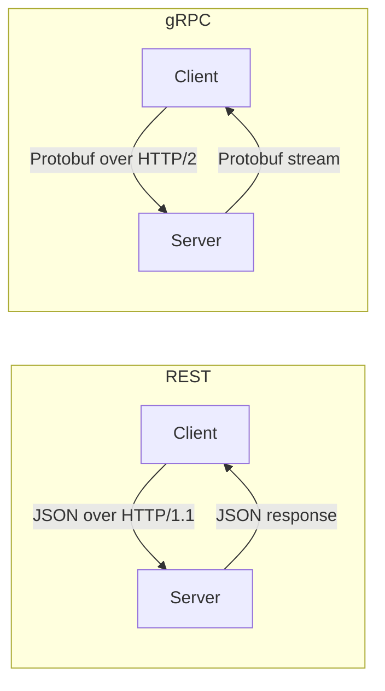
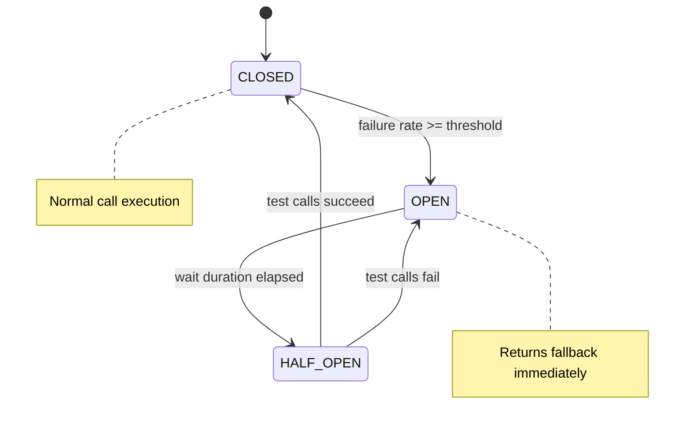
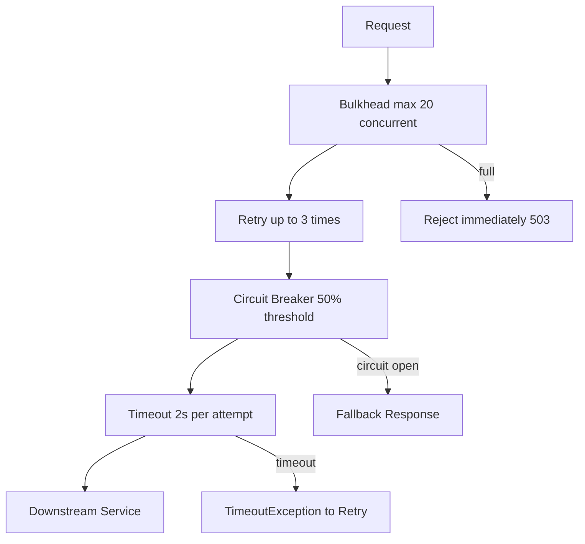
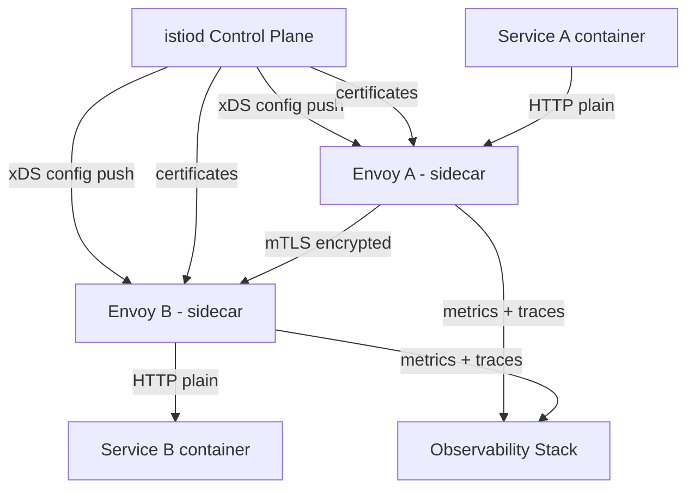
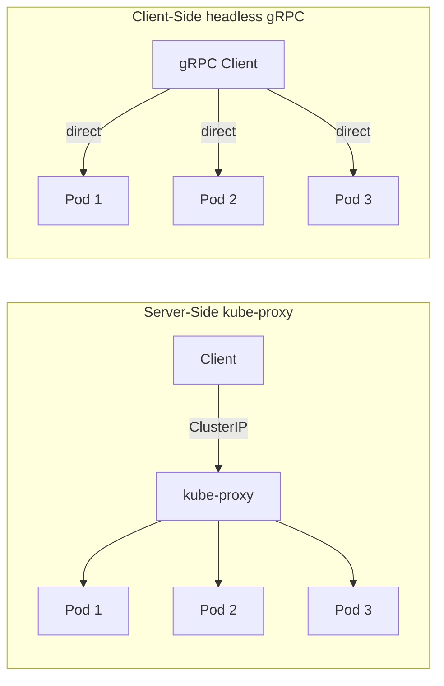

## Keywords in This File

{: .no_toc }

| #   | Keyword                                          | Weight   |
| --- | ------------------------------------------------ | -------- |
| 1   | [Synchronous Communication REST and gRPC](#synchronous-communication-rest-and-grpc) | critical |
| 2   | [Circuit Breaker Pattern](#circuit-breaker-pattern) | critical |
| 3   | [Retry Timeout and Bulkhead Patterns](#retry-timeout-and-bulkhead-patterns) | high |
| 4   | [Service Mesh for Communication](#service-mesh-for-communication) | high |
| 5   | [Client-Side and Server-Side Load Balancing](#client-side-and-server-side-load-balancing) | medium |

---

# Synchronous Communication REST and gRPC

🎯 Interview Weight: critical - the most fundamental
communication choice in microservices; every system design
interview requires comparing REST and gRPC for internal
service communication.

---

### 🎯 Model Answer

**30 seconds:**
> REST uses HTTP/1.1 with JSON - text-based, universally
> understood, easy to debug. gRPC uses HTTP/2 with Protocol
> Buffers - binary, strongly typed, 3-10x more efficient.
> For public APIs, REST wins because of universality. For
> high-volume internal service communication, gRPC wins
> because of performance and schema enforcement. The deciding
> factor is whether you need a human-readable format and
> broad tooling support, or maximum efficiency and type safety.

**3 minutes (Senior):**
> I have used both REST and gRPC in production and the choice
> hinges on a few concrete factors. REST with JSON is the
> default for good reasons: every HTTP client in every
> language understands it, it is debuggable with curl, and
> teams do not need to learn protobuf. For external-facing
> APIs, this universality is non-negotiable.
>
> Where gRPC shines is internal service-to-service
> communication at volume. The protobuf schema is a contract
> - generated clients in any language from the same .proto
> file. When the OrderService changes its API, the protobuf
> compiler catches breaking changes before they reach
> production. JSON contracts are informal - they drift silently
> until a production failure.
>
> The performance difference is real: binary serialization
> is smaller and faster, HTTP/2 multiplexing means one
> connection for many concurrent requests, and bidirectional
> streaming is available for real-time patterns. I've seen
> teams reduce service-to-service latency by 40% by switching
> from REST to gRPC on their hot paths.
>
> The practical trade-off: gRPC requires protobuf knowledge
> on the team, a schema registry, and tooling for debugging
> (binary is not human-readable without tools). Start with
> REST unless performance data justifies the switch.

**Framework:** WHAT - WHY - HOW - TRADE-OFF - EXAMPLE

*Adapting up:* At staff level, discuss schema evolution
in protobuf (backward compatibility rules, field numbering)
vs. REST API versioning, and the organizational implications
of maintaining a shared .proto schema repository.

*Adapting down:* Junior: REST is HTTP + JSON (familiar),
gRPC is HTTP/2 + binary (faster, typed).

**Blank Mind Recovery:**

**(1) Restate:** "You are asking how two services communicate
synchronously and what the trade-offs are between REST and
gRPC."

**(2) First principles:** "Both are request-response
protocols. The difference is the format (text vs. binary)
and the schema approach (informal vs. formal)."

**(3) Bridge:** "Think of REST like writing a letter in
plain English, gRPC like transmitting a structured form
with a fixed schema."

---

### 📘 Concept Explanation

**What it is:**
REST (Representational State Transfer) and gRPC (Google
Remote Procedure Call) are two synchronous communication
protocols for microservices. REST uses HTTP/1.1 (or HTTP/2)
with JSON. gRPC uses HTTP/2 with Protocol Buffers (protobuf).

**The problem it solves:**
Services need to request data from each other and receive
a response in real time. Synchronous protocols provide
immediate feedback - the caller knows the result before
continuing.

**How it works:**
```
REST:
Client:  POST http://order-svc/orders
         Content-Type: application/json
         {"items": ["SKU-123"], "userId": 42}
Server:  HTTP 201 Created
         {"orderId": "ORD-456", "status": "PENDING"}
- Human-readable JSON
- HTTP verbs (GET/POST/PUT/DELETE) map to operations
- Stateless, cacheable (GET)

gRPC:
Client: OrderService.PlaceOrder(PlaceOrderRequest{
          items: ["SKU-123"], userId: 42})
Server: PlaceOrderResponse{order_id: "ORD-456",
          status: PENDING}
- Defined in .proto schema:
  service OrderService {
    rpc PlaceOrder(PlaceOrderRequest)
        returns (PlaceOrderResponse);
  }
- Binary protobuf on HTTP/2
- Strongly typed, generated clients in any language
- Streaming: server-side, client-side, bidirectional
```

**The key insight:**
gRPC enforces a contract at compile time. REST enforces
nothing - the contract is a documentation convention.
In large systems with many teams, compile-time contract
enforcement prevents entire categories of integration bugs.

**When to use REST:**
- Public-facing APIs consumed by external clients
- When debugging with plain HTTP tools is important
- When teams are not familiar with protobuf
- Browser clients (gRPC-Web exists but adds complexity)

**When to use gRPC:**
- Internal service-to-service on high-volume paths
- Polyglot environments needing type-safe contracts
- Streaming data (real-time, bidirectional)
- Performance-critical paths where JSON overhead matters

**Alternatives:**
- GraphQL - REST variant with client-defined queries;
  useful when different clients need different fields
- Apache Thrift - older alternative to protobuf, similar
  binary + schema approach
- WebSocket - full-duplex real-time, not RPC

**First-principles derivation:**
Two services communicating synchronously need: a transport
(TCP/HTTP), a serialization format (text vs. binary), and
a schema (informal vs. formal). REST chose human-readable
text and informal schema for universality. gRPC chose binary
and formal schema for performance and safety. Each trades
off against the other.

---

### 💻 Code Example

**REST - Spring Boot:**
```java
// REST: OrderService exposes HTTP endpoint
@RestController
@RequestMapping("/orders")
public class OrderController {

    @PostMapping
    public ResponseEntity<OrderResponse> createOrder(
            @Valid @RequestBody CreateOrderRequest req) {
        Order order = orderService.create(req);
        return ResponseEntity
            .status(HttpStatus.CREATED)
            .body(new OrderResponse(order));
    }
}

// REST client with error handling
@Service
public class OrderClient {
    private final RestTemplate restTemplate;

    public OrderResponse createOrder(CreateOrderRequest req) {
        try {
            return restTemplate.postForObject(
                "http://order-service/orders",
                req,
                OrderResponse.class);
        } catch (HttpClientErrorException e) {
            // 4xx - client error (invalid request)
            throw new OrderValidationException(e.getMessage());
        } catch (HttpServerErrorException e) {
            // 5xx - server error (retry-able)
            throw new ServiceUnavailableException(e.getMessage());
        }
    }
}
```

> **Code walkthrough:** REST is the standard Spring Boot
> pattern. Explicit exception handling distinguishes client
> errors (4xx, don't retry) from server errors (5xx, safe
> to retry with backoff). The clean separation of error
> categories is critical for resilience patterns.

**gRPC - protobuf definition + Java implementation:**
```protobuf
// order_service.proto
syntax = "proto3";
package com.example.orders;

service OrderService {
  rpc PlaceOrder(PlaceOrderRequest)
      returns (PlaceOrderResponse);
  rpc GetOrder(GetOrderRequest)
      returns (Order);
  // Server-side streaming: get order updates in real-time
  rpc WatchOrder(WatchOrderRequest)
      returns (stream OrderUpdate);
}

message PlaceOrderRequest {
  repeated string item_skus = 1;
  int64 user_id = 2;
  string payment_token = 3;
}

message PlaceOrderResponse {
  string order_id = 1;
  OrderStatus status = 2;
}

enum OrderStatus {
  PENDING = 0;
  CONFIRMED = 1;
  FAILED = 2;
}
```

```java
// gRPC service implementation (Java)
@GrpcService
public class OrderGrpcService extends OrderServiceGrpc.OrderServiceImplBase {

    @Override
    public void placeOrder(PlaceOrderRequest request,
            StreamObserver<PlaceOrderResponse> responseObserver) {
        try {
            Order order = orderService.create(
                request.getItemSkusList(),
                request.getUserId());

            PlaceOrderResponse response = PlaceOrderResponse.newBuilder()
                .setOrderId(order.getId())
                .setStatus(OrderStatus.CONFIRMED)
                .build();

            responseObserver.onNext(response);
            responseObserver.onCompleted();
        } catch (Exception e) {
            responseObserver.onError(
                Status.INTERNAL
                    .withDescription(e.getMessage())
                    .asRuntimeException());
        }
    }
}
```

> **Code walkthrough:** The .proto file is the contract -
> field numbers (1, 2, 3) must be stable across versions,
> never reused. The Java implementation extends the generated
> base class - the protobuf compiler caught any API mismatch
> at compile time. The `StreamObserver` pattern handles both
> success and error through a consistent interface.

---

### 🎓 Answers by Seniority

**Junior / Mid (0-5 years):**
> REST uses HTTP and JSON - it is the standard for web APIs.
> gRPC uses HTTP/2 and binary Protocol Buffers - it is faster
> and has a formal schema. REST is easier to get started with
> and works everywhere. gRPC is better for internal service
> communication where performance and type safety matter more
> than ease of exploration.

*Push deeper:* Explain that gRPC schemas prevent API breaking
changes from reaching production - the compiler catches them.

---

**Senior / Staff (5+ years):**
> The decision between REST and gRPC is fundamentally about
> contract strength and performance budget. REST is the right
> default for public APIs - universally consumable, debuggable.
> gRPC is the right choice for internal high-volume paths: binary
> serialization is 3-10x smaller, HTTP/2 multiplexing reduces
> connection overhead, and protobuf schemas enforce backward
> compatibility with field number rules. The org implication:
> gRPC requires a .proto schema repository that all teams
> use as the source of truth for service contracts. Without
> this discipline, the schema benefits disappear.

*Push deeper:* Discuss protobuf backward compatibility rules
(adding fields is safe, removing numbered fields is not)
and how this compares to REST API versioning approaches.

---

### ⚠️ Common Misconceptions

**Misconception 1: "gRPC is always faster than REST."**
gRPC is faster for binary serialization and connection
efficiency. But if the network is not the bottleneck (most
database-backed services), the difference is negligible.
Profile before switching.

**Misconception 2: "REST doesn't have schema enforcement."**
OpenAPI/Swagger provides REST schema definitions and can
generate clients. The difference: protobuf schemas enforce
contracts at compile time; OpenAPI schemas are validated
at runtime or in tests.

**Misconception 3: "gRPC is just for microservices."**
gRPC supports browser clients (gRPC-Web), mobile clients
(efficient for battery-constrained devices), and streaming
patterns not available in standard REST.

---

### 🚨 Failure Modes and Diagnosis

**Failure: REST API contract drift**
Symptom: Consumer service fails when provider removes a
JSON field; no compile-time warning.
Diagnosis: Check provider git history for field removal.
Fix: Use consumer-driven contract tests (Pact) to detect
breaking changes in CI before deployment.

**Failure: gRPC field number reuse**
Symptom: Corrupted or incorrect data when a field's
type changes.
Diagnosis: Check .proto changelog for field number reuse.
Fix: Never reuse field numbers. When removing a field, mark
it `reserved` to prevent future reuse.

---

### 🎯 Interview Deep-Dive

**Timing:** Easy 6 min | Medium 10 min | Hard 15 min

| Category | Questions |
|---|---|
| Definition | 2 |
| Mechanism | 2 |
| Comparison | 3 |
| Scenario | 2 |
| Debugging | 1 |
| Deep Dive | 2 |
| Misconception | 1 |
| Performance | 1 |

**Definition:**

Q: "What is the difference between REST and gRPC?"

A: REST is an architectural style using HTTP (typically
HTTP/1.1) with JSON text bodies. It is stateless, uses
HTTP verbs for semantics (GET for reads, POST for creates),
and is universally consumable. gRPC is a Remote Procedure
Call framework using HTTP/2 with Protocol Buffer binary
encoding. It uses a .proto schema to define the service
contract, generates type-safe clients in any language, and
supports streaming. REST is text-based and human-readable;
gRPC is binary and requires tooling to inspect. REST has
informal schemas; gRPC has formal, compiler-enforced schemas.

*What separates good from great:* Know that gRPC uses HTTP/2
features (multiplexing, header compression, streaming) that
are also available to REST but typically not used.

---

Q: "What is Protocol Buffers (protobuf) and why does gRPC use it?"

A: Protocol Buffers is a binary serialization format with
a schema definition language. You define your data structure
in a .proto file with typed fields identified by unique
field numbers. The protobuf compiler generates serialization/
deserialization code in any target language. gRPC uses it
because: (1) binary encoding is 3-5x smaller than JSON for
the same data; (2) the schema enforces type safety - adding
a required field that consumers do not support is a compile-
time error; (3) backward compatibility is guaranteed by
field number stability rules.

*What separates good from great:* Know that field numbers,
not field names, determine binary encoding. This is why
you must never reuse a field number even after removing a
field - the binary format would be misinterpreted by old
clients.

---

**Mechanism:**

Q: "How does HTTP/2 multiplexing benefit gRPC?"

A: HTTP/1.1 has head-of-line blocking: only one request
per TCP connection at a time (without connection pooling
workarounds). HTTP/2 multiplexes multiple streams over a
single TCP connection. For gRPC, this means one TCP
connection can carry many concurrent RPC calls between
services, reducing connection overhead and TCP handshake
latency. Under high concurrency (hundreds of simultaneous
requests between two services), the difference is
significant: HTTP/1.1 needs hundreds of connections,
HTTP/2 needs one.

*What separates good from great:* Know that HTTP/2
multiplexing also eliminates head-of-line blocking at
the HTTP layer (though TCP-level head-of-line blocking
still exists in HTTP/2; HTTP/3/QUIC addresses this).

---

Q: "How does gRPC handle streaming and what patterns does
it enable?"

A: gRPC supports four streaming patterns: (1) Unary - one
request, one response (standard RPC). (2) Server-side
streaming - one request, multiple responses streamed over
time; use case: real-time order status updates. (3) Client-
side streaming - multiple requests, one response; use case:
uploading a large dataset in chunks. (4) Bidirectional
streaming - both sides stream simultaneously; use case:
chat, real-time data synchronization. All streaming is
over HTTP/2, so the same TCP connection handles all
concurrent streams without blocking.

*What separates good from great:* Name a concrete use case
for bidirectional streaming - like a live dashboard that
both pushes queries and receives updates - and compare it
to the WebSocket alternative (WebSocket is a separate
protocol, not HTTP; gRPC streaming stays on HTTP/2).

---

**Comparison:**

Q: "REST vs. gRPC - when would you NOT use gRPC?"

A: Do not use gRPC: (1) For public APIs that browser
JavaScript will consume directly - gRPC-Web requires
a proxy, adding complexity. (2) When the team is
not familiar with protobuf and schema management - the
learning curve is real and the schema repo discipline is
required. (3) For simple CRUD services where JSON debugging
is more valuable than binary performance. (4) When you
need easy API exploration (Postman, curl) - binary requires
specialized tooling. gRPC's benefits only pay off when
performance and contract enforcement are genuine needs,
not theoretical ones.

*What separates good from great:* Know that "we might
need performance" is not sufficient justification. Start
with REST, instrument the latency, and switch to gRPC
only when the data justifies it.

---

Q: "Compare REST, gRPC, and GraphQL for a mobile app
backend."

A: REST is the traditional choice - simple, stateless,
HTTP caching for GET requests. The problem: over-fetching
(mobile gets fields it does not need) and under-fetching
(needs multiple round trips to assemble a screen's data).
GraphQL solves both: the mobile client specifies exactly
the fields it needs; one query assembles data from multiple
resolvers. Good for diverse clients with different data
needs. gRPC with protobuf streaming is the best for
real-time data (live score updates, chat) and very high
frequency calls where binary efficiency matters. My
recommendation for mobile: GraphQL BFF for the app's
data queries, gRPC for any real-time streaming needs,
REST for simple CRUD endpoints.

*What separates good from great:* Know that GraphQL
is not a transport - it runs over HTTP and can use
either REST-style or gRPC transport underneath.

---

Q: "What happens when a gRPC API needs to make a
breaking change?"

A: Protocol Buffer rules define what is backward compatible:
adding new fields (safe - old clients ignore unknown fields),
changing field types (unsafe - encoding changes), removing
fields (safe for wire format if field number is reserved,
but generated clients break). The correct approach: add
new fields, deprecate old ones, never remove or change
field numbers. For large breaking changes, create a new
service version (v2 in the package namespace). The .proto
file becomes the API contract documentation - changes
require review just like code changes.

*What separates good from great:* Know the full backward
compatibility table: what is safe (add optional fields,
add new messages) vs. unsafe (change field numbers,
change field types, remove required fields).

---

**Scenario:**

Q: "A payment service needs to stream real-time payment
status updates to a client dashboard. REST or gRPC?"

A: gRPC server-side streaming is the right choice here.
Define a stream RPC: `rpc WatchPaymentStatus(WatchRequest)
returns (stream PaymentStatusUpdate)`. The client makes
one RPC call; the server streams updates as they happen.
This is more efficient than polling (HTTP GET every second)
because it avoids repeated HTTP request/response overhead
and maintains a persistent connection. The HTTP/2 connection
stays open, and the server pushes updates when available.
Compare with Server-Sent Events (SSE) over REST: SSE is
server-push only over HTTP, simpler for browser clients.
gRPC streaming is better for service-to-service where binary
efficiency and the streaming API contract matter.

*What separates good from great:* Know that gRPC streaming
and SSE both use persistent connections, but gRPC gives
you bidirectional streaming and type-safe contracts while
SSE is text-based and one-directional.

---

Q: "How would you migrate an existing REST API to gRPC
without disrupting existing consumers?"

A: The dual-protocol approach. Step 1: Add gRPC alongside
the existing REST API - both run simultaneously on the
same service (different ports, or the same port with
content-type routing via the grpc-gateway library). Step
2: New services and migrated clients use gRPC. Existing
REST consumers are not touched. Step 3: Deprecate REST
endpoints with a sunset date in documentation. Step 4:
Monitor REST traffic; when it drops to zero, remove REST.
The grpc-gateway tool auto-generates a REST transcoding
layer from the .proto file, so gRPC services serve both
protocols with minimal code. This is how Google exposes
their APIs - gRPC native with JSON HTTP transcoding for
REST clients.

*What separates good from great:* Know that grpc-gateway
and gRPC transcoding allow one proto definition to serve
both REST and gRPC simultaneously.

---

**Debugging:**

Q: "Your gRPC service is returning UNAVAILABLE errors
intermittently. How do you diagnose it?"

A: UNAVAILABLE is a gRPC status code that means the service
is not reachable. Step 1: Check if the error is transient
(load spike) or consistent (connection pool, TCP backlog).
Step 2: Check server logs for the specific cause - the
gRPC status detail string usually contains the underlying
Java/system error. Step 3: Check TCP connection count on
the server - HTTP/2 connection management may be incorrect
(too few connections for the concurrency). Step 4: Check
if the load balancer is L4 (TCP) - L4 load balancers do
not understand HTTP/2 multiplexing and may not distribute
gRPC connections correctly. Use an L7 (HTTP/2-aware) load
balancer like Envoy for gRPC traffic. Step 5: Check
keepalive settings - long-lived gRPC connections may be
dropped by firewalls/load balancers; configure gRPC
keepalive pings.

*What separates good from great:* The L4 vs L7 load
balancer issue is the most common gRPC production problem.
L4 balancers route connections, not requests - all requests
on one connection go to the same backend, defeating
load balancing for gRPC.

---

**Deep Dive:**

Q: "Explain gRPC's error handling model versus REST HTTP
status codes."

A: gRPC uses a 16-code status model: OK (0), CANCELLED (1),
UNKNOWN (2), INVALID_ARGUMENT (3), DEADLINE_EXCEEDED (4),
NOT_FOUND (5), ALREADY_EXISTS (6), PERMISSION_DENIED (7),
RESOURCE_EXHAUSTED (8), FAILED_PRECONDITION (9),
ABORTED (10), OUT_OF_RANGE (11), UNIMPLEMENTED (12),
INTERNAL (13), UNAVAILABLE (14), DATA_LOSS (15),
UNAUTHENTICATED (16). Each maps roughly to an HTTP status:
NOT_FOUND ~ 404, PERMISSION_DENIED ~ 403, UNAVAILABLE ~ 503.
The key difference: gRPC status codes are semantic, not
transport-level. UNAVAILABLE means the service is not ready;
DEADLINE_EXCEEDED means the call timed out. Each has specific
retry semantics - UNAVAILABLE is retryable; INVALID_ARGUMENT
is not. gRPC also supports error details (google.rpc.Status
proto) for structured error information beyond the code.

*What separates good from great:* Know which gRPC status
codes are safe to retry (UNAVAILABLE, DEADLINE_EXCEEDED)
and which are not (INVALID_ARGUMENT, NOT_FOUND), and
configure retry policies accordingly.

---

Q: "How does protobuf schema evolution work in practice
for a team with multiple service consumers?"

A: In a multi-team environment, the .proto files live in
a shared repository - the schema registry. Each service
owns its .proto definitions. Changes follow these rules:
adding optional fields is always safe (new producers send
them, old consumers ignore them). Field removal requires
a two-phase process: (1) mark the field as deprecated in
the schema, update producers to stop sending it, wait for
all consumers to deploy; (2) remove the field from the
schema and mark the number as reserved. Changing a field's
type is never safe without a new field number. In practice,
teams use a CI check that compares the proposed .proto
change against the deployed consumer versions and blocks
incompatible changes before merge.

*What separates good from great:* Know that the `reserved`
keyword prevents future reuse of a field number,
permanently protecting binary format compatibility.

---

**Misconception / Trap:**

Q: "gRPC uses HTTP/2, so it automatically load balances
across multiple backend instances. Is that right?"

A: Not correct. HTTP/2 multiplexing is about multiple
streams over one connection - not multiple connections to
multiple backends. If a gRPC client opens one HTTP/2
connection to a load balancer, all requests go through
that single connection to one backend (at the TCP level).
For gRPC, you need either: (1) a gRPC-aware L7 proxy like
Envoy that understands HTTP/2 frames and distributes
individual RPCs across backends, or (2) client-side load
balancing where the client opens connections to multiple
backends and round-robins at the RPC level (gRPC supports
this with a built-in load balancing API). A standard TCP
load balancer (L4) does NOT distribute gRPC traffic correctly.

*What separates good from great:* Know that this is the
most common gRPC production mistake - and that Envoy/Istio
solves it by acting as an L7 proxy that understands HTTP/2
frame boundaries.

---

**Performance & Scalability:**

Q: "At what scale does gRPC's performance advantage over
REST become significant?"

A: The binary serialization advantage is measurable from
the first request (3-10x smaller payload, faster parsing).
The impact on throughput becomes significant at: (1) high
message count per second (1000+ req/sec per service, where
CPU for JSON serialization adds up), (2) large payload sizes
where binary compactness saves significant bandwidth,
(3) very high concurrency where HTTP/2 connection multiplexing
eliminates thousands of TCP handshakes. For most CRUD services
doing 10-100 req/sec with small payloads, the difference
is negligible - under 5ms total. Profile before migrating.
The org cost of maintaining protobuf schemas is not free.

*What separates good from great:* Give concrete numbers
and acknowledge the break-even point. Do not oversell gRPC
for low-volume services.

---

### ⚖️ Comparison Table

| Protocol | Format | Schema | Streaming | Browser Support | When to Choose |
|---|---|---|---|---|---|
| **REST/JSON** | Text (JSON) | Informal (OpenAPI) | No (SSE for push) | Native | Public APIs, simple CRUD |
| **gRPC** | Binary (protobuf) | Formal (.proto) | Yes (4 modes) | gRPC-Web only | Internal, high-volume, typed |
| GraphQL | Text (JSON) | Formal (SDL) | Yes (subscriptions) | Native | Client-driven queries |
| WebSocket | Text or Binary | None | Bidirectional | Native | Real-time, full-duplex |

**The deciding factor:** Is it a public API (use REST) or
an internal high-volume contract-sensitive API (use gRPC)?

---

### 🏛️ System Design

*(Conditional: included because REST vs. gRPC is asked in
every microservices system design discussion.)*

**Where REST/gRPC appears in system design:**
- Any microservices architecture: "how do services communicate?"
- "Design a real-time notification system" - streaming
- API gateway design - REST externally, gRPC internally

**Scale inflection point:**
At 10,000+ internal RPCs/second, JSON serialization CPU
becomes measurable. gRPC's binary format reduces CPU by
up to 3x at this scale.

**Common system design traps:**
- Using REST for everything including streaming use cases
  where gRPC streaming is more efficient
- Not accounting for L4 load balancer incompatibility with
  gRPC's HTTP/2 connection model
- Forgetting to version APIs - both REST and gRPC need a
  versioning strategy

**Staff angle:** At org scale, the .proto schema repository
is an API governance tool. Requiring peer review of .proto
changes catches breaking changes before deployment, not
after.

---

### 📊 Diagram

*(Conditional: included because the REST vs. gRPC protocol
stack comparison is a standard interview diagram.)*

```
REST STACK:          gRPC STACK:
HTTP/1.1             HTTP/2
  |                    |
JSON (text)          Protocol Buffers (binary)
  |                    |
Schema: none         Schema: .proto (enforced)
  |                    |
Debugging: easy      Debugging: needs tooling
Performance: OK      Performance: 3-10x better
```



> **Diagram walkthrough:** REST uses familiar HTTP/1.1 with
> text JSON - one request per connection, easy to debug.
> gRPC uses HTTP/2 multiplexing (many streams per connection)
> with binary protobuf - lower overhead, streaming support,
> but requires tooling to inspect. Both serve synchronous
> communication; the choice is about performance and schema
> enforcement needs.

---

---

# Circuit Breaker Pattern

🎯 Interview Weight: critical - the most commonly asked
resilience pattern; expected at mid-level and above; appears
in every senior microservices interview.

---

### 🎯 Model Answer

**30 seconds:**
> A circuit breaker is a resilience pattern that stops calling
> a failing service after a threshold of failures, instead
> immediately returning a fallback response. Like an electrical
> circuit breaker, it prevents a downstream failure from
> cascading upstream. When the downstream recovers, the circuit
> closes and normal calls resume. The three states are: closed
> (normal), open (failing, stop calling), half-open (testing
> recovery).

**3 minutes (Senior):**
> I think about circuit breakers as the most important resilience
> pattern for synchronous microservice communication. The problem
> they solve: if Service A calls Service B synchronously and B
> is slow or down, A's threads pile up waiting for responses.
> When all threads are exhausted, A stops serving its own
> clients. The failure cascades from B to A to A's callers.
>
> The circuit breaker interrupts this cascade. After 5 failures
> in 10 calls (configurable), the circuit opens: calls to B
> return the fallback immediately without attempting the network
> call. This protects A's thread pool. After a wait window
> (say 30 seconds), one test call goes through - if it succeeds,
> the circuit closes; if it fails, it resets the wait window.
>
> In production, I have used Resilience4j (the modern Java
> circuit breaker library). The important operational details:
> configure the fallback carefully - it should be a degraded
> but functional response, not just an error. And monitor
> circuit state - a circuit that stays open in production is
> a signal that B needs attention. The circuit breaker is not
> a substitute for fixing the downstream service; it is the
> protection while you fix it.

**Framework:** WHAT - WHY - HOW - TRADE-OFF - EXAMPLE

*Adapting up:* Staff level - discuss circuit breaker
placement (client-side vs. service mesh), aggregating
circuit state across instances, and the relationship
between circuit breaker and bulkhead patterns.

*Adapting down:* Junior: it stops calling a broken service
so the caller stays healthy. Like a fuse box protecting
your house from a faulty appliance.

**Blank Mind Recovery:**

**(1) Restate:** "So you are asking about how services
protect themselves from downstream failures - let me
think through the circuit breaker."

**(2) First principles:** "If I keep calling a broken
service, I waste threads and eventually I fail too. I
need to detect the failure and stop calling."

**(3) Bridge:** "It is like an electrical circuit breaker:
detects overcurrent (too many failures), trips open (stops
calling), resets when the problem is fixed."

---

### 📘 Concept Explanation

**What it is:**
The circuit breaker pattern wraps calls to an external
service in a state machine that monitors failure rate and
stops forwarding calls when the failure threshold is reached.
It provides a fallback mechanism while the downstream service
recovers.

**The problem it solves:**
In synchronous microservice chains, a slow or unavailable
downstream service blocks caller threads. Thread pool
exhaustion causes the caller to fail too. The circuit
breaker breaks this cascade by detecting failure patterns
and short-circuiting calls before they hit the failing service.

**How it works:**
```
CLOSED STATE (normal):
  Calls go through to downstream service.
  Failure counter increments on each failure.
  Success resets the failure counter.
  If failures >= threshold: transition to OPEN.

OPEN STATE (downstream failing):
  All calls immediately return fallback (no network call).
  Wait timer starts (30 seconds default).
  After wait: transition to HALF-OPEN.

HALF-OPEN STATE (testing recovery):
  One test call goes through.
  If SUCCESS: transition to CLOSED.
  If FAILURE: transition back to OPEN.
        reset wait timer.

Threshold example: 50% failure rate over 10 calls
  = 5 failures in a 10-call sliding window -> OPEN
```

**The key insight:**
The circuit breaker is a time-based recovery pattern, not
a retry pattern. It stops hammering a failing service,
giving it time to recover. Combined with a fallback,
it enables graceful degradation instead of cascading failure.

**When to use it:**
- Every synchronous call to an external service
- When downstream failure should not prevent caller from serving
- When a degraded response is acceptable (partial feature off)
- When the downstream service can recover on its own

**When NOT to use it:**
- For database calls within the same service (use connection
  pool limits instead)
- When there is no meaningful fallback - a circuit breaker
  with an error-throwing fallback is not more useful than
  the error itself
- For very fast, transient failures that are better handled
  by retry

**Alternatives:**
- Retry with backoff - for transient failures (different use
  case from circuit breaker)
- Timeout - prerequisite to circuit breaker; always configure
- Bulkhead - limits concurrency; complementary to circuit breaker

**First-principles derivation:**
A failing downstream is not available - calls will fail.
Option A: keep calling and waste threads. Option B: detect
failure and stop calling. Option B wastes no resources and
returns the fallback immediately. The circuit must reclose
eventually to restore normal operation - hence the half-open
state that tests recovery.

---

### 💻 Code Example

**BAD - No circuit breaker:**
```java
@Service
public class InventoryService {
    private final HttpClient httpClient;

    public InventoryStatus checkStock(String sku) {
        // If inventory-service is down, this blocks the timeout
        // With 200 concurrent requests all blocking for 10s:
        // = 2000 threads exhausted
        // = OrderService also fails
        return httpClient.get(
            "http://inventory-service/stock/" + sku,
            InventoryStatus.class);
    }
}
```

> **Code walkthrough:** Without a circuit breaker, every
> slow or failed downstream call consumes a thread for the
> full timeout duration. With 100 concurrent callers and a
> 10-second timeout, that is 1000 thread-seconds of waste.
> This is how cascading failures happen.

**GOOD - Resilience4j circuit breaker:**
```java
@Configuration
public class CircuitBreakerConfig {

    @Bean
    public CircuitBreaker inventoryCircuitBreaker(
            CircuitBreakerRegistry registry) {
        return registry.circuitBreaker("inventory",
            io.github.resilience4j.circuitbreaker
                .CircuitBreakerConfig.custom()
                // Open if 50% of last 10 calls fail
                .failureRateThreshold(50)
                .minimumNumberOfCalls(10)
                // How long to stay open before testing
                .waitDurationInOpenState(
                    Duration.ofSeconds(30))
                // How many calls to allow in half-open
                .permittedNumberOfCallsInHalfOpenState(3)
                // Which exceptions count as failures
                .recordExceptions(
                    IOException.class,
                    TimeoutException.class)
                .build());
    }
}

@Service
public class InventoryService {
    private final CircuitBreaker cb;
    private final InventoryClient client;

    public InventoryStatus checkStock(String sku) {
        return cb.executeSupplier(
            () -> client.getStock(sku),
            // Fallback: return cached/default status
            throwable -> InventoryStatus.assumeInStock()
        );
    }
}

// Monitor state changes
@EventListener
public void onCircuitBreakerEvent(
        CircuitBreakerOnStateTransitionEvent event) {
    // Alert when circuit opens - downstream needs attention
    log.warn("Circuit breaker {} transitioned to {}",
        event.getCircuitBreakerName(),
        event.getStateTransition());
    metricsService.recordCircuitOpen(
        event.getCircuitBreakerName());
}
```

> **Code walkthrough:** The circuit breaker is configured with
> a 50% failure threshold over 10 calls and a 30-second open
> window. The fallback returns a "assume in stock" status -
> a degraded but functional response. The event listener alerts
> on circuit state transitions so the operations team knows
> when the inventory service is failing. This is production-grade
> circuit breaker implementation.

**Half-open state testing:**
```java
// Resilience4j automatically handles half-open state.
// The following shows what happens at the state transitions:

// CLOSED: normal operation
// InventoryService calls go through, responses returned

// After 5 failures in 10 calls -> circuit OPENS:
// All calls immediately execute fallback (no HTTP call)
// "inventory-service unavailable, assuming in stock"

// After 30 seconds -> circuit enters HALF-OPEN:
// Next 3 calls (permittedNumberOfCallsInHalfOpenState) go through
// If >= 2 of 3 succeed -> circuit CLOSES (back to normal)
// If < 2 succeed -> circuit OPENS again, timer resets

// Log output during cycle:
// [WARN] Circuit breaker inventory: CLOSED -> OPEN
// [INFO] Circuit breaker inventory: OPEN -> HALF_OPEN
// [INFO] Circuit breaker inventory: HALF_OPEN -> CLOSED
```

> **Code walkthrough:** The half-open state is automatic in
> Resilience4j. You configure how many test calls are allowed
> and the success threshold to reclose. This graduated recovery
> prevents the circuit from oscillating rapidly if the downstream
> is intermittently recovered.

---

### 🎓 Answers by Seniority

**Junior / Mid (0-5 years):**
> A circuit breaker monitors calls to a downstream service.
> If too many fail, it "opens" and stops making calls, returning
> a fallback instead. After a wait period, it allows a test call
> through - if it succeeds, normal calls resume. This prevents
> a failing downstream from causing the upstream service to fail
> too. Resilience4j is the main Java library for this.

*Push deeper:* Explain the three states (closed, open, half-
open) and why each exists.

---

**Senior / Staff (5+ years):**
> Circuit breakers are the first line of defense against cascading
> failures. The pattern is well-understood: Closed -> threshold
> exceeded -> Open (fast fail to fallback) -> wait period -> Half-
> Open (test calls) -> recover or reopen. The operational details
> that matter most: the fallback must be meaningful - a fallback
> that throws an exception is useless. Monitoring circuit state
> in production is mandatory - an open circuit is a downstream
> incident indicator. At service mesh level (Istio), circuit
> breaking can be implemented without application code changes,
> which is cleaner for polyglot environments.

*Push deeper:* Discuss the interaction between circuit breaker
and retry - you should NOT retry on an open circuit (immediate
fallback, no retry) but should retry on transient failures
before the circuit opens.

---

### ⚠️ Common Misconceptions

**Misconception 1: "Circuit breaker replaces retry."**
Circuit breaker and retry solve different problems. Retry
handles transient failures (network blip, brief overload).
Circuit breaker handles sustained failures (service is down
for minutes). Combine them: retry first (2-3 times with
backoff), then circuit break if the service is consistently
failing.

**Misconception 2: "The circuit breaker makes the fallback safe."**
The circuit breaker calls the fallback when the circuit is
open. The fallback can also fail. Always make the fallback
as simple as possible - avoid calls to other services in
the fallback.

**Misconception 3: "Circuit breaker is only for HTTP calls."**
Circuit breakers apply to any remote call: database, cache,
message broker, external API. Any call that can fail
unpredictably should have a circuit breaker.

---

### 🚨 Failure Modes and Diagnosis

**Failure: Circuit stays open after downstream recovers**
Symptom: The downstream service is healthy but the circuit
does not close; all calls still return fallback.
Diagnosis: Check circuit breaker metrics - is the half-open
test succeeding? Check if the half-open calls are hitting
a cold-start issue (slow first requests).
Fix: Increase `waitDurationInOpenState` or reduce success
threshold in half-open state.

**Failure: Fallback masks a critical failure**
Symptom: Business metrics drop (orders not fulfilling)
but no alerts fire because the circuit breaker is silently
returning fallbacks.
Diagnosis: Check circuit breaker open rate metrics.
Fix: Alert aggressively on circuit open events. Distinguish
critical paths (payment - no fallback acceptable) from
nice-to-have paths (recommendation - fallback OK).

**Failure: Circuit opens on load spike, not real failure**
Symptom: Circuit opens during traffic spike even though
downstream is healthy; just slow.
Diagnosis: Check if the timeout is too tight for peak load.
Fix: Tune the timeout based on measured p99 latency under
load, not average latency.

---

### 🎯 Interview Deep-Dive

**Timing:** Easy 6 min | Medium 10 min | Hard 15 min

| Category | Questions |
|---|---|
| Definition | 2 |
| Mechanism | 2 |
| Comparison | 2 |
| Scenario | 2 |
| Debugging | 1 |
| Deep Dive | 2 |
| Misconception | 1 |
| Performance | 1 |

**Definition:**

Q: "What is the circuit breaker pattern and why is it used?"

A: The circuit breaker pattern is a resilience pattern that
wraps calls to a downstream service in a state machine.
It monitors the failure rate of calls. When failures exceed
a threshold, the circuit "opens" - all subsequent calls
immediately return a fallback without making the network
call. After a configured wait period, the circuit enters
half-open state and allows a small number of test calls
through. If they succeed, the circuit closes and normal
operation resumes. It is used to prevent cascading failures:
a slow or down downstream service would otherwise exhaust
the caller's thread pool, causing the caller to fail too.

*What separates good from great:* Know the three states
by name (closed, open, half-open) and the transition
conditions for each.

---

Q: "What is cascading failure and how does circuit breaker
prevent it?"

A: Cascading failure is when the failure of one service
propagates upstream through the call chain. If Service A
calls B, and B is slow, A's threads wait for B responses.
If 100 requests arrive concurrently, 100 threads are
blocked waiting for B. When B becomes the bottleneck,
A's thread pool fills and A starts rejecting requests -
A has now failed, not just B. If Service C calls A,
the same pattern repeats: C fails because A failed
because B failed. The circuit breaker prevents this
by stopping A from waiting for B after B has failed
enough times - A immediately returns the fallback,
freeing its threads to serve its own callers.

*What separates good from great:* Quantify the cascade
math. If each service has a 99.9% availability and there
are 5 services in a sync chain: 99.9%^5 = 99.5%. Without
circuit breakers, one slow service degrades the entire chain.

---

**Mechanism:**

Q: "Walk me through how Resilience4j's circuit breaker
decides to open."

A: Resilience4j uses a sliding window (count-based or
time-based). For count-based: it tracks the last N calls
(default 10). When the failure rate in that window exceeds
the threshold (default 50%), the circuit transitions from
CLOSED to OPEN. "Failure" is configurable: any exception,
or just specific exception types (IOException, TimeoutException).
Slow calls can also count as failures (slowCallRateThreshold).
The minimum number of calls prevents a single failure from
opening the circuit on startup. Once open, the waitDuration
(default 60 seconds) must elapse before transitioning to
HALF_OPEN. In half-open, it allows a configured number of
calls; if the success rate meets the threshold, it CLOSES.

*What separates good from great:* Know that Resilience4j
supports both count-based windows (last N calls) and time-
based windows (last N seconds), and that time-based is
better for high-throughput services where the window fills
quickly.

---

Q: "How do you implement a fallback for a circuit breaker
and what makes a good fallback?"

A: A fallback is the logic that executes when the circuit
is open or when a call fails. It should: (1) Return a
cached/default value where possible (last known good data,
"default recommendations"). (2) Return a degraded response
(empty list instead of personalized list). (3) Return a
clear signal to the client that this is degraded (a flag
in the response or a specific HTTP header). A bad fallback
is one that calls another service (creating a nested failure)
or throws an exception (same behavior as no fallback). In
Resilience4j: the fallback method receives the Throwable
that caused the failure, enabling different fallback logic
for different failure types (slow call vs. exception vs.
circuit open).

*What separates good from great:* Know that the fallback
must be simpler than the original call - it is the last
resort. A fallback that is as complex as the original
call just moves the failure.

---

**Comparison:**

Q: "Circuit breaker vs. retry - how do they interact and
when do you use each?"

A: Retry handles transient failures: a network blip, a
brief server hiccup. You retry 1-3 times with exponential
backoff. Circuit breaker handles sustained failures: a
service that is down or degraded for more than a few
seconds. Use retry first (up to 3 attempts with 100ms,
200ms, 400ms backoff). If retries fail, the circuit breaker
counts those failures toward its threshold. When the
threshold is reached, the circuit opens and retries stop -
the fallback is returned immediately. Important: do NOT
retry when the circuit is open. Retrying against an open
circuit wastes resources. Resilience4j's Retry and
CircuitBreaker can be chained: retry wraps the circuit
breaker call.

*What separates good from great:* Know that chaining order
matters: Retry(CircuitBreaker(call)). Retry executes first;
if all retries fail, the circuit breaker records the
failures. This is correct behavior. The reverse -
CircuitBreaker(Retry(call)) - means retries happen inside
the circuit breaker, multiplying the failure count.

---

Q: "Circuit breaker vs. bulkhead - what do they protect against?"

A: Circuit breaker protects against failure propagation:
a failing downstream causes upstream threads to block,
exhausting the upstream's thread pool. The circuit breaker
stops calls to the failing downstream. Bulkhead protects
against resource exhaustion by scope: it limits the number
of concurrent calls to a specific downstream, preventing
calls to one downstream from exhausting all resources for
all downstreams. Example: PaymentService and InventoryService
each get their own thread pool (bulkhead). If payment is
slow, it exhausts only the payment pool; inventory calls
still have threads. They complement each other: circuit
breaker stops calls when failure rate is high, bulkhead
limits blast radius when calls are slow.

*What separates good from great:* Describe the concrete
scenario where bulkhead alone is insufficient (failure
rate not high enough to trip the circuit breaker, but the
slow calls fill the shared pool) and circuit breaker alone
is insufficient (failure rate below threshold, but slow
calls fill the pool before the circuit opens).

---

**Scenario:**

Q: "An e-commerce checkout flow calls PaymentService
synchronously. PaymentService starts experiencing 20-second
delays. What happens without and with circuit breakers?"

A: Without circuit breakers: the first slow payment call
occupies a thread for 20 seconds. The next request is the
same. With 100 concurrent checkouts, 100 threads are
occupied waiting for payment. The checkout service's
thread pool (typically 200-400 threads) fills. New checkout
requests are rejected with 503 or timeout. The checkout
service is now down because one downstream is slow.
With circuit breakers: after 5 of the first 10 calls take
20 seconds (timeout fires, counted as failure), the circuit
opens. Subsequent calls immediately return the fallback:
"Payment service temporarily unavailable, please retry
in 30 seconds." The checkout service continues serving
(with reduced functionality). Operations team is alerted
by the circuit open event. They fix payment service. After
30 seconds, the circuit tests recovery and closes.

*What separates good from great:* Quantify the thread
pool math to show why the cascade happens so quickly, and
describe the user experience difference: 503 errors vs.
"retry in 30 seconds" message.

---

Q: "How would you design circuit breakers for a system
where 50 services each call 5 downstream services?"

A: At 50 services x 5 downstreams = 250 potential circuit
breakers. Key design decisions: (1) Named circuit breakers
per downstream per service - each gets independent state.
(2) Centralized configuration via Spring Cloud Config so
thresholds can be tuned without redeployment. (3) Metrics
aggregation: export circuit state to Prometheus/Grafana.
Alert when any circuit is open for more than 60 seconds.
(4) Fallback strategy map: document which fallbacks are
acceptable per integration (payment = no fallback, fail
hard; recommendation = empty list is OK). At this scale,
a service mesh (Istio) can implement circuit breaking at
the sidecar level rather than in every service's application
code, reducing maintenance overhead.

*What separates good from great:* Know that 250 circuit
breakers need centralized configuration and monitoring - you
cannot tune them individually in production. Configuration
drift between environments is a real operational risk.

---

**Debugging:**

Q: "Your service has a circuit breaker on the inventory
service. Users report getting incorrect "in-stock" responses
for out-of-stock items. How do you investigate?"

A: This is the fallback masking the actual state. Step 1:
Check circuit breaker metrics - is the circuit open or
was it recently open? Step 2: Check inventory service
health - is it returning errors that trigger the circuit
breaker? Step 3: Check the fallback implementation - is
it returning `assumeInStock()` which assumes in-stock
by default? Step 4: For this specific case, "assume in
stock" may be the wrong fallback - a better fallback might
be to return "stock unknown" and block the add-to-cart,
or show a "stock uncertain, please check before checkout"
message. Step 5: Consider whether this path should have
a circuit breaker at all - if accurate inventory data is
required for checkout, a hard failure may be preferable
to a fallback.

*What separates good from great:* Know that fallback design
is a business decision, not just a technical one. The correct
fallback depends on what is safe for the user and the business.

---

**Deep Dive:**

Q: "How does Istio implement circuit breaking without
application code changes?"

A: Istio injects an Envoy proxy sidecar into every pod.
All outbound traffic from a service goes through its sidecar
before reaching the destination. Istio's DestinationRule
resource configures outlier detection: eject (disconnect
from load balancing pool) any backend that returns 5xx
errors on a certain percentage of requests. This is circuit
breaking at the infrastructure level. The application code
makes normal HTTP calls; the sidecar intercepts them and
handles circuit state. Configuration example:
`outlierDetection: consecutiveGatewayErrors: 5;
interval: 30s; baseEjectionTime: 30s`. Advantage: circuit
breaking for every service, every call, without any
application library dependency. Disadvantage: less flexibility
than Resilience4j (no custom fallback logic, limited
configuration).

*What separates good from great:* Know that Istio's circuit
breaking (outlier detection) and Resilience4j's circuit
breaking are complementary: Istio at the network level,
Resilience4j for custom fallback logic. You can use both.

---

Q: "What metrics should you monitor for circuit breakers
in production?"

A: (1) Circuit state per breaker: CLOSED/OPEN/HALF_OPEN.
Alert when any breaker opens and has not closed within SLA.
(2) Failure rate per window: trending toward threshold?
(3) Call volume through the breaker vs. via fallback: high
fallback rate indicates ongoing downstream problems.
(4) Half-open success rate: low success rate means downstream
is recovering slowly. (5) Fallback error rate: is the
fallback itself failing? This is a hidden failure mode.
Export all of these to Prometheus with labels for service
name and breaker name. Create Grafana dashboards with
red/amber/green indicators per breaker. The operational
SLO: no breaker should stay open for more than 10 minutes
without an incident ticket.

*What separates good from great:* Know that an open circuit
that no one notices is as bad as no circuit breaker. The
monitoring and alerting around circuit state is as important
as the breaker itself.

---

**Misconception / Trap:**

Q: "If I add a circuit breaker around every downstream call,
my system will be resilient to any downstream failure. Is
that right?"

A: Not fully correct. Circuit breakers protect the caller
from downstream failure, but several gaps remain. (1) The
fallback must be appropriate - if the fallback is "return
error," you have protected the thread pool but not the
user experience. (2) Circuit breakers do not help with
slow calls that do not hit the timeout - if calls take
1.9 seconds and your timeout is 2 seconds, they are slow
enough to exhaust threads without triggering the timeout.
Add slow call rate thresholds. (3) Circuit breakers in
multiple layers of a call chain can amplify - if A->B
has a circuit breaker and B->C has one, B's circuit opening
causes A's circuit to open (B starts returning fallback
errors, which A counts as failures). (4) Critical paths
(payment) may not have an acceptable fallback - for those,
fail fast but do not hide the failure with a misleading
fallback.

*What separates good from great:* Know the difference
between circuit breakers on critical paths (fail explicitly
with a clear error) vs. non-critical paths (degrade
gracefully with a fallback).

---

**Performance & Scalability:**

Q: "At what throughput does circuit breaker overhead
become significant?"

A: Resilience4j's circuit breaker adds minimal overhead:
the state check is an atomic read of an enum (nanoseconds).
The sliding window maintains a circular buffer of recent
call results (microseconds for updates). In benchmarks,
the overhead is under 1 microsecond per call. This is
negligible for any realistic service (even 100K req/sec
= 100ms window for the CB overhead). The scaling concern
for circuit breakers is in distributed environments: if
multiple service instances each have their own circuit
breaker, each makes independent decisions. Instance 1 may
open while Instance 2 is still closed. This is usually
acceptable. For coordinated circuit breaking (all instances
open/close together), you need a shared state store (Redis)
which adds latency. Distributed circuit breaking is complex
and rarely worth the cost.

*What separates good from great:* Know that per-instance
circuit breakers are the right default. Distributed circuit
breakers are a premature optimization for most systems.

---

### ⚖️ Comparison Table

| Pattern | Protects Against | Mechanism | When to Use |
|---|---|---|---|
| **Circuit Breaker** | Sustained failure cascade | State machine, stop calling | Downstream is consistently failing |
| Retry | Transient failure | Re-attempt with backoff | Brief, recoverable errors |
| Timeout | Slow calls | Cancel call after N ms | Prevent thread blocking |
| Bulkhead | Resource exhaustion blast | Separate thread pools | Isolate downstreams from each other |
| Rate Limiter | Overload | Limit calls per time window | Protect downstream capacity |

**The deciding factor:** Is the downstream failing consistently
(circuit breaker) or intermittently (retry)?

---

### 🏛️ System Design

*(Conditional: included because circuit breaker is in every
microservices resilience design discussion.)*

**Where Circuit Breaker appears in system design:**
- "Design a resilient payment system"
- "How do you prevent cascading failures?"
- "Design for high availability of an order system"

**6-step framework answer:**
Step 1 CLARIFY - What is the acceptable failure mode?
(degraded response OK? or hard fail required?)

Step 2 ESTIMATE - Thread pool size 200; timeout 2s; at 100
concurrent calls to a failing downstream: pool exhausted in 2s.

Step 3 DESIGN - Circuit breaker on every synchronous call.
PaymentService: no fallback (critical path). InventoryService:
fallback to "optimistic in-stock." RecommendationService:
fallback to "no recommendations" (safe).

Step 4 DEEP DIVE - Circuit breaker config: 50% failure rate
in 10 calls, 30s open window. Metrics exported to Grafana.
Alert on circuit open for 5+ minutes.

Step 5 ALTS - Considered service mesh (Istio outlier detection)
for network-level CB. Added Resilience4j for custom fallback
logic. Both running.

Step 6 EVOLVE - At 10x services, Istio handles circuit breaking
for all services at infrastructure level; Resilience4j retained
only for services with complex fallback logic.

**Scale inflection point:**
At 10+ services with complex call graphs, managing circuit
breaker configuration individually becomes untenable. Use
centralized config (Spring Cloud Config) to tune thresholds
across all services from one place.

**Common system design traps:**
- No fallback (circuit breaker opens but user gets 503 anyway)
- Circuit breaker timeout longer than the caller's own timeout
  (the caller times out before the circuit opens)
- No monitoring of circuit state (open circuit discovered
  only when users complain)

**Staff angle:** Circuit breaker strategy is a reliability
engineering decision. Document which paths have fallbacks
and which do not (critical paths). Budget the acceptable
degradation per circuit. This is the difference between
"circuit breaker added" and "resilience designed."

---

### 📊 Diagram

*(Conditional: included because the three-state circuit
breaker state machine is the canonical interview diagram.)*

```
CLOSED ---[5 failures/10 calls]---> OPEN
OPEN ----[after 30s]-------------> HALF-OPEN
HALF-OPEN [test call succeeds]---> CLOSED
HALF-OPEN [test call fails]------> OPEN (reset timer)

CLOSED: calls go through normally
OPEN:   all calls -> fallback immediately
HALF-OPEN: limited calls through for testing
```



> **Diagram walkthrough:** The circuit starts CLOSED (all calls
> go through). When the failure rate exceeds the threshold, it
> moves to OPEN (all calls immediately return fallback - no
> network overhead). After the wait duration, it moves to
> HALF-OPEN and allows test calls. Success closes the circuit;
> failure reopens it. The half-open state prevents premature
> recovery that would cause oscillation.

---

---

# Retry Timeout and Bulkhead Patterns

🎯 Interview Weight: high - the three fundamental resilience
patterns; always asked alongside circuit breaker for senior
and above; interviewers expect you to know all four patterns.

---

### 🎯 Model Answer

**30 seconds:**
> Retry handles transient failures by re-attempting a call,
> timeout caps how long a call can block, and bulkhead
> prevents one slow downstream from monopolizing all resources.
> Timeout is the prerequisite for both retry and circuit breaker.
> Retry is for brief recoverable failures. Bulkhead is for
> resource isolation. All three are used together with circuit
> breaker as the resilience pattern stack.

**3 minutes (Senior):**
> In production, I think about resilience as layers. The first
> layer is timeout: every remote call must have a deadline. Without
> a timeout, a slow downstream blocks a thread indefinitely. I
> always set timeouts below what my caller expects.
>
> The second layer is retry with exponential backoff: for transient
> failures - network blips, brief overload spikes - retry 2-3
> times with doubling backoff (100ms, 200ms, 400ms). Critical
> rule: only retry idempotent operations. Retrying a payment
> charge without idempotency leads to double charges.
>
> The third layer is bulkhead: allocate separate thread pools
> or semaphore limits per downstream. If calls to the inventory
> service are slow, they fill only the inventory thread pool,
> not the shared pool that serves payment and user service calls.
> Without bulkhead, one slow downstream can starve all others.
>
> These three patterns, combined with circuit breaker, form the
> complete resilience stack. They each solve a different problem:
> timeout (how long), retry (transient failure), bulkhead
> (blast radius), circuit breaker (sustained failure).

**Framework:** WHAT - WHY - HOW - TRADE-OFF - EXAMPLE

*Adapting up:* At staff level, discuss how these patterns
interact under load: retry amplifies traffic (3x at 3 retries),
bulkhead sizing requires capacity analysis, and timeout
interaction with circuit breaker thresholds requires tuning.

*Adapting down:* Junior: timeout = deadline, retry = try again,
bulkhead = separate queues so one slow thing doesn't block others.

**Blank Mind Recovery:**

**(1) Restate:** "So you are asking about the resilience
patterns that protect services from each other - retry,
timeout, and bulkhead."

**(2) First principles:** "Remote calls can be slow or fail.
I need to cap how long I wait (timeout), try again on blips
(retry), and isolate blast radius (bulkhead)."

**(3) Bridge:** "Think of an airport: timeout is the boarding
cutoff, retry is trying to get on the next flight, bulkhead
is separate boarding gates per airline."

---

### 📘 Concept Explanation

**What it is:**
Three distinct resilience patterns that complement circuit breaker:
- **Timeout**: maximum duration for a remote call
- **Retry**: re-attempt failed calls, usually with backoff
- **Bulkhead**: isolate resources per downstream to limit blast radius

**The problem each solves:**
- Timeout: prevents indefinite thread blocking on slow calls
- Retry: recovers from transient failures without user action
- Bulkhead: prevents one slow downstream from exhausting
  resources for all downstreams

**How each works:**
```
TIMEOUT:
Call starts at T=0
If no response by T=2s -> cancel call, throw TimeoutException
Thread is released immediately at T=2s
(Without timeout: thread blocks until TCP keepalive dies - minutes)

RETRY (with exponential backoff + jitter):
Attempt 1: fails  -> wait 100ms
Attempt 2: fails  -> wait 200ms
Attempt 3: fails  -> wait 400ms
Attempt 4: fail   -> propagate exception
Total attempts: 4 (1 original + 3 retries)
Jitter: randomize wait time to avoid thundering herd
(all retrying services hitting the recovered downstream simultaneously)

BULKHEAD (thread pool isolation):
[Shared Pool: 200 threads]  <- BAD: inventory fills pool
vs.
[Inventory Pool: 20 threads] [Payment Pool: 20 threads]
[User Pool: 20 threads]     <- GOOD: isolated blast radius
Semaphore variant: limit concurrent calls, not threads
```

**The key insight - timeout interaction:**
Timeout must be shorter than the caller's own timeout.
If A calls B with a 5s timeout, and A's caller has a 3s
timeout, A's timeout never fires (caller gives up first).
Always set timeouts with the full call chain in mind.

**When to use retry:**
- Idempotent operations only (GET, idempotent POST with key)
- Known transient failure conditions (network blip, rate limit)
- When the downstream can recover within the retry window

**When NOT to retry:**
- Non-idempotent operations without idempotency keys
- When the downstream is consistently failing (use circuit breaker)
- 4xx errors (client errors) - retrying a bad request always fails
- When retry amplification would overload the recovering service

**Bulkhead variants:**
- Thread pool isolation: dedicated threads per downstream
- Semaphore isolation: limit concurrent calls (lighter weight)
- Process isolation: separate processes per downstream (heaviest)

**Alternatives:**
- Rate limiter - limits throughput per time window (different axis)
- Queue-based leveling - absorbs spikes with a buffer
- Circuit breaker - stops calls when failure rate is high

---

### 💻 Code Example

**BAD - No timeout or retry protection:**
```java
@Service
public class ProductService {
    // No timeout: blocks thread indefinitely if service is down
    // No retry: transient failures fail immediately
    // No bulkhead: all calls share the same thread pool
    public Product getProduct(String id) {
        return restTemplate.getForObject(
            "http://product-service/products/" + id,
            Product.class);
    }
}
```

> **Code walkthrough:** Without timeout, a single slow call
> occupies a thread forever. Without retry, a 50ms network
> blip fails the entire operation. Without bulkhead, a slow
> product-service call fills the thread pool and prevents
> calls to all other services.

**GOOD - Full resilience stack with Resilience4j:**
```java
@Configuration
public class ResilienceConfig {

    @Bean
    public TimeLimiter productTimeLimiter(
            TimeLimiterRegistry registry) {
        return registry.timeLimiter("product",
            TimeLimiterConfig.custom()
                // Cancel call after 2 seconds
                .timeoutDuration(Duration.ofMillis(2000))
                .cancelRunningFuture(true)
                .build());
    }

    @Bean
    public Retry productRetry(RetryRegistry registry) {
        return registry.retry("product",
            RetryConfig.custom()
                // 3 retries = 4 total attempts
                .maxAttempts(3)
                // Exponential: 100ms, 200ms, 400ms
                .intervalFunction(
                    IntervalFunction.ofExponentialRandomBackoff(
                        100, 2.0, 0.5, 1000))
                // Only retry on transient errors
                .retryOnException(e ->
                    e instanceof ConnectException ||
                    e instanceof SocketTimeoutException)
                // Never retry 4xx (client errors)
                .ignoreExceptions(
                    HttpClientErrorException.class)
                .build());
    }

    @Bean
    public Bulkhead productBulkhead(
            BulkheadRegistry registry) {
        return registry.bulkhead("product",
            BulkheadConfig.custom()
                // Max 25 concurrent calls to product-service
                .maxConcurrentCalls(25)
                // If full, wait 50ms before rejecting
                .maxWaitDuration(Duration.ofMillis(50))
                .build());
    }
}

@Service
public class ProductService {
    private final TimeLimiter tl;
    private final Retry retry;
    private final Bulkhead bulkhead;
    private final ExecutorService executor;

    public Product getProduct(String id) {
        Supplier<CompletableFuture<Product>> sup =
            Bulkhead.decorateSupplier(bulkhead,
                () -> CompletableFuture.supplyAsync(
                    () -> fetchProduct(id), executor));

        Supplier<CompletableFuture<Product>> withRetry =
            Retry.decorateSupplier(retry, sup);

        try {
            return tl.executeFutureSupplier(withRetry).get();
        } catch (BulkheadFullException e) {
            // Bulkhead full: immediately reject
            throw new ServiceUnavailableException(
                "Product service capacity exceeded");
        } catch (TimeoutException e) {
            // Call took too long
            throw new ServiceTimeoutException("product-service");
        } catch (Exception e) {
            // All retries exhausted
            throw new ProductServiceException(e);
        }
    }
}
```

> **Code walkthrough:** The three patterns are stacked:
> Bulkhead limits concurrency (25 simultaneous calls max).
> Retry re-attempts on network errors, not on 4xx client
> errors (those are not transient). TimeLimiter cancels
> calls that exceed 2 seconds. The retry uses exponential
> backoff with jitter (50% randomization) to prevent
> thundering herd recovery. Each pattern fires independently.

**Thundering herd prevention with jitter:**
```java
// WITHOUT jitter: all retrying instances hit the service
// at the same time after the backoff period
// 1000 instances * 100ms backoff = 1000 simultaneous requests
// The recovering service is immediately overwhelmed again

// WITH jitter: randomize the backoff
// 1000 instances * (50-150ms random) = spread over 100ms window
// Service recovers without re-overloading

IntervalFunction jitteredBackoff =
    IntervalFunction.ofExponentialRandomBackoff(
        100,    // base interval
        2.0,    // multiplier
        0.5,    // randomization factor (50% spread)
        1000    // max interval cap
    );
// Retry 1: 50-150ms (100ms ± 50%)
// Retry 2: 100-300ms
// Retry 3: 200-600ms (capped at 1000ms)
```

> **Code walkthrough:** Without jitter, all instances
> using the same retry delay will retry simultaneously,
> re-overwhelming the just-recovered service. The 50%
> random factor spreads retries across a time window,
> allowing the recovering service to absorb load gradually.

---

### 🎓 Answers by Seniority

**Junior / Mid (0-5 years):**
> Timeout limits how long a call waits (prevents blocking
> forever). Retry tries the call again after a failure (good
> for brief network issues). Bulkhead limits how many concurrent
> calls can go to a specific downstream, so one slow service
> doesn't block calls to all other services. These are used
> together - timeout is fundamental; retry handles transient
> errors; bulkhead isolates blast radius.

*Push deeper:* Explain why you must not retry non-idempotent
operations and why jitter is needed in retry backoff.

---

**Senior / Staff (5+ years):**
> The resilience stack is: timeout first (always), then retry
> for transient failures, bulkhead for resource isolation,
> circuit breaker for sustained failures. The interactions
> matter: retry amplifies traffic (3 retries = 3x load on
> recovery). The timeout must be inside the retry, so each
> attempt has its own deadline. Bulkhead sizing requires
> capacity analysis: too small and you reject valid traffic;
> too large and you lose the isolation benefit. I've used
> Resilience4j in production and the tuning takes iteration:
> start conservative and tune based on production metrics.

*Push deeper:* Discuss the retry storm problem: if 1000
service instances all retry with the same backoff, they
hit the recovering downstream simultaneously. Jitter is
the solution.

---

### ⚠️ Common Misconceptions

**Misconception 1: "Retry is always safe to add."**
Retrying non-idempotent operations (payment charge, order
creation without idempotency key) causes duplicates.
Retry is only safe for GET operations and POST operations
with idempotency keys.

**Misconception 2: "Longer timeout = more resilient."**
A longer timeout means threads block for longer before
being released. This actually reduces resilience: a 10s
timeout with 100 concurrent calls = 1000 thread-seconds
of waste before circuit opens. Shorter timeouts (2-3s)
release threads faster.

**Misconception 3: "Bulkhead solves the thread exhaustion
problem completely."**
Bulkhead limits threads per downstream but the application
still needs those bulkhead threads in its total pool.
If total thread capacity is 200 and you allocate 100 to
one downstream, that downstream can still take 50% of
your capacity.

---

### 🚨 Failure Modes and Diagnosis

**Failure: Retry storm**
Symptom: A service that recovered from a brief outage
immediately re-fails because of a surge of retried requests.
Diagnosis: Check request rate to the service immediately
after recovery - spike pattern indicates retry storm.
Fix: Add exponential backoff with jitter to all retry
configurations.

**Failure: Bulkhead rejection causing user errors**
Symptom: Sporadic 503 errors even though the downstream
service is healthy; errors correlate with traffic spikes.
Diagnosis: Check bulkhead rejection metrics (Resilience4j
exposes these). Compare concurrent call count vs. bulkhead
limit.
Fix: Increase bulkhead limit or reduce call rate (cache,
batch calls, or add a queue buffer).

---

### 🎯 Interview Deep-Dive

**Timing:** Easy 5 min | Medium 8 min | Hard 12 min

| Category | Questions |
|---|---|
| Definition | 2 |
| Mechanism | 2 |
| Comparison | 2 |
| Scenario | 2 |
| Debugging | 1 |
| Deep Dive | 1 |
| Misconception | 1 |

**Definition:**

Q: "What are the retry, timeout, and bulkhead patterns?"

A: Retry - re-attempts a failed operation up to a configured
number of times with backoff between attempts. Used for
transient failures. Timeout - sets a maximum duration for
an operation; if exceeded, the call is cancelled and an
exception thrown. Prevents threads from blocking indefinitely.
Bulkhead - limits concurrent access to a resource per
downstream, isolating blast radius. Named after the
watertight compartments in a ship that prevent flooding
from spreading. All three combine with circuit breaker
to form the complete resilience pattern stack.

*What separates good from great:* Know the origin of
the "bulkhead" name (ship compartments) - it signals
that you understand the design intent, not just the
implementation.

---

Q: "Why do you need both timeout and circuit breaker?
Doesn't one imply the other?"

A: They solve different problems at different time scales.
Timeout handles individual call duration: a single call
that takes too long gets cancelled at 2 seconds. Circuit
breaker handles patterns over time: 5 failures in the
last 10 calls opens the circuit. Without timeout, calls
never fail by time - they just block. Without circuit
breaker, every call still attempts the network even if
it will obviously fail (the service is known to be down).
Timeout is the prerequisite: you need calls to fail fast
for circuit breaker to count failures. Timeout alone
means every call wastes 2 seconds before failing. Circuit
breaker stops calls immediately once the pattern is detected.

*What separates good from great:* Know that the typical
stack is: Retry(CircuitBreaker(TimeLimiter(call))) -
retry is outermost, circuit breaker in the middle,
timeout innermost.

---

**Mechanism:**

Q: "What is exponential backoff with jitter and why is
each component needed?"

A: Exponential backoff increases the wait between retries
exponentially: 100ms, 200ms, 400ms. This reduces load on
the recovering downstream - each retry gives it more time
to recover. Without exponential (linear backoff), the
downstream receives a steady stream of retries that may
overwhelm it before it fully recovers. Jitter adds
randomness to the wait: instead of exactly 100ms, the
wait is 50-150ms. This prevents the thundering herd
problem: when 1000 service instances all retry at the
same interval, they hit the downstream simultaneously,
potentially re-overloading it. Jitter spreads the retries
across a time window, allowing the downstream to absorb
load gradually.

*What separates good from great:* Know the "thundering herd"
problem by name and explain why it matters specifically
on recovery (not just during failure).

---

Q: "How does semaphore-based bulkhead differ from
thread-pool-based bulkhead?"

A: Thread-pool bulkhead allocates a dedicated thread pool
per downstream. Each call executes in its own thread from
that pool. Benefit: complete isolation - a slow downstream
cannot block any thread outside its pool. Overhead: each
downstream needs dedicated threads. Semaphore bulkhead
uses a counting semaphore - limits the number of concurrent
calls but executes them in the calling thread. Benefit:
lower overhead (no extra threads needed). Limitation: the
calling thread is still occupied during the call; it does
not truly isolate slow calls from the caller's thread pool.
For non-blocking (reactive) services, semaphore is
appropriate. For blocking services, thread-pool isolation
provides better guarantees.

*What separates good from great:* Know that Resilience4j
uses semaphore by default (Bulkhead) and offers thread
pool isolation through ThreadPoolBulkhead.

---

**Comparison:**

Q: "When would you use retry, and when would it make
things worse?"

A: Use retry for: transient network errors (ConnectException,
SocketTimeoutException), rate limiting responses (429 with
Retry-After header), brief overload spikes (503 from a
healthy service under burst load). Retry makes things worse
when: the downstream is consistently failing (retry amplifies
load on a dying service - use circuit breaker instead),
the operation is not idempotent (retry causes duplicates),
the failure is a 4xx client error (the request is invalid;
retrying never helps), and the caller's deadline is tight
(3 retries x 2s timeout = 6s per request; if the caller
has a 2s SLA, all retries will fail anyway).

*What separates good from great:* Know that retry and circuit
breaker should be combined: retry handles transient failures,
circuit breaker handles sustained failures. Do not rely
on circuit breaker for transient failures (it opens too
slowly) or retry for sustained failures (it amplifies load).

---

Q: "Thread pool vs. semaphore bulkhead - which would you
choose for a reactive (non-blocking) service?"

A: Semaphore bulkhead for reactive services. In a reactive
service (Project Reactor, WebFlux), all I/O is non-blocking
- threads are not occupied during network calls. Dedicating
separate thread pools per downstream defeats the purpose
of non-blocking I/O: you would pay thread context switching
overhead for no benefit. Semaphore bulkhead limits the
number of concurrent reactive pipelines per downstream,
which is the right isolation boundary in a reactive system.
Thread pool bulkhead is for blocking (thread-per-request)
services where threads are the scarce resource.

*What separates good from great:* Know that the bulkhead
pattern concept is the same in both cases (limit concurrent
access), but the implementation differs because the
resource being protected differs (threads vs. event loop
capacity).

---

**Scenario:**

Q: "A checkout service calls three services: product
catalog (read, idempotent), inventory check (read,
idempotent), and payment charge (write, non-idempotent).
Design the resilience stack for each."

A: Product catalog: retry (3 attempts, exponential backoff,
safe because read-only), timeout (500ms, data is needed
fast), bulkhead (separate pool, degraded response = show
last cached price). Inventory check: retry (3 attempts,
safe because read-only), timeout (1s), bulkhead, fallback
to assume-in-stock with warning to user. Payment charge:
NO retry without idempotency key (double charge risk).
Add an idempotency key header to the payment request (UUID
generated per checkout attempt). Only retry if the network
fails before any response - if a response was received
(even a timeout at the HTTP application layer), do NOT
retry. Timeout: 5s (payment needs more time). Bulkhead:
separate pool. Circuit breaker: hard fail fallback (do not
hide payment failure from user).

*What separates good from great:* Know that the correct
retry policy for non-idempotent operations is to add
idempotency keys rather than disable retries entirely.
Disable retries only if idempotency is not feasible.

---

Q: "A batch processing service makes 10,000 calls to an
external API over 5 minutes. Design timeout and retry
for this at-scale scenario."

A: At 10,000 calls over 5 minutes = 33 calls/second.
Timeout: set based on the API's p99 latency under this
load (measure first). If p99 is 500ms, set timeout at
1500ms (3x p99 for safety). Retry: maximum 2 retries
with 1s backoff (not exponential for batch - you want
predictable throughput). Add jitter to prevent synchronized
retry spikes. Rate limiting: the batch itself should rate
limit to stay under the API's limit. If the API has a
100 req/sec limit and you are at 33/sec, you have headroom.
If retries fire at 100% rate: 33 * 3 = 99 req/sec -
dangerously close to limit. Circuit breaker with a
short-open window to stop the batch if the API is
consistently failing, not just slowly.

*What separates good from great:* Know that retry
amplification (original + retries) must be factored
into rate limit calculations.

---

**Debugging:**

Q: "After deploying a fix to a downstream service, the
upstream service continues to fail for 2 minutes. Why
and how do you prevent it?"

A: This is the thundering herd + circuit breaker reopen
interaction. Scenario: (1) Downstream was failing, circuit
opened. (2) Downstream is fixed. (3) Circuit opens after
30s wait. (4) Test call succeeds. (5) Circuit closes. (6)
All backed-up requests retry simultaneously (thundering herd).
(7) The recovered downstream is overwhelmed - failing again.
Prevention: (a) Exponential backoff with jitter on all
retries - spreads the load on recovery. (b) Half-open state
with gradual ramp: allow 5%, then 25%, then 100% of traffic
through instead of full traffic at once. (c) Rate limiting
on the upstream side during circuit half-open state. Most
circuit breaker libraries do not support gradual ramp natively;
this requires custom implementation or a service mesh.

*What separates good from great:* Diagnosing the thundering
herd pattern after recovery, not just during failure, is a
sign of production experience.

---

**Deep Dive:**

Q: "How do you size bulkhead thread pools correctly in
production?"

A: Thread pool sizing for bulkhead: start with Little's
Law: thread pool size = throughput x latency. If inventory
service handles 50 req/sec at 200ms average latency: pool
size = 50 * 0.2 = 10 threads. Add 20-30% headroom for
spikes: 13-14 threads. Monitor actual concurrency in
production - if the pool utilization is consistently above
80%, increase. If below 20%, the downstream is fast and
the pool is oversized. For reactive services: instead of
thread pool, limit concurrent requests via semaphore count
using the same calculation. The danger of oversizing: you
lose the bulkhead protection (a slow downstream can still
occupy many resources). The danger of undersizing: you
reject valid traffic unnecessarily.

*What separates good from great:* Know Little's Law by
name and apply it to bulkhead sizing.

---

**Misconception / Trap:**

Q: "I should set my retry timeout as long as possible
to give the downstream more time to respond. Is that right?"

A: Not correct - this is one of the most common timeout
mistakes. A longer timeout means: (1) Threads block for
longer on slow or failing calls, exhausting the thread
pool faster. (2) The circuit breaker takes longer to detect
the failure pattern (it counts failures, not slow calls,
unless slow call threshold is also configured). (3) The
end-user waits longer before getting an error. The correct
approach: set the timeout at 2-3x the p99 latency of the
downstream under normal load. This allows normal tail
latency variance while quickly failing genuinely slow calls.
If p99 is 200ms, a 600ms timeout is appropriate. A 10s
timeout for a 200ms service is a misconfiguration that
will cause cascading failures during any downstream degradation.

*What separates good from great:* Know the p99-based timeout
sizing rule and the specific failure mode it prevents.

---

### ⚖️ Comparison Table

| Pattern | Addresses | Time Scale | Risk if Wrong | When to Use |
|---|---|---|---|---|
| **Timeout** | Indefinite blocking | Per-call (ms to s) | Too long = thread exhaustion | Every remote call |
| **Retry** | Transient failure | Per-call (100ms-2s) | Non-idempotent duplicates | GET, idempotent writes |
| **Bulkhead** | Blast radius | Per-concurrent | Too small = false rejection | Multi-downstream services |
| **Circuit Breaker** | Sustained failure | Over many calls (s to min) | Masking failures | All synchronous calls |
| **Rate Limiter** | Outbound overload | Per time window | Too low = client throttle | API with rate limits |

**The deciding factor:** What is the failure mode? Transient
(retry), slow (timeout + bulkhead), sustained (circuit breaker),
overload (rate limiter).

---

### 🏛️ System Design

*(Conditional: sd: true - resilience pattern stack is
core to production system design.)*

**Where these patterns appear in system design:**
- "How do you design for high availability?" - all four patterns
- "What happens when payment service is slow?" - bulkhead + CB
- "How do you prevent retry storms?" - jitter + CB

**Scale inflection point:**
At high concurrency (1000+ req/sec), misconfigured retries
multiply to 3000 req/sec, potentially overloading the
recovering service. Jitter and circuit breaker interaction
must be designed for this scale.

**Common system design traps:**
- Retry without idempotency on write operations
- Bulkhead sized without capacity analysis
- Timeout longer than the calling service's own SLA

**Staff angle:** The full resilience stack (timeout + retry
+ bulkhead + circuit breaker) is the minimum viable
production setup. Any missing layer is a reliability gap.
Document the resilience configuration for each service-to-
service call in the architecture ADR.

---

### 📊 Diagram

*(Conditional: included because the resilience stack layering
is a key interview diagram.)*

```
REQUEST
  |
  v
[Bulkhead: 20 concurrent max]
  |
  v
[Retry: 3 attempts, exponential jitter backoff]
  |
  v
[Circuit Breaker: open if 50% failures in 10 calls]
  |
  v
[Timeout: 2s deadline per attempt]
  |
  v
[Downstream Service]
```



> **Diagram walkthrough:** Requests enter the bulkhead which
> limits concurrent calls. The retry layer re-attempts failures
> up to 3 times. The circuit breaker short-circuits all calls
> when failure rate is high. The timeout cancels calls that
> exceed 2 seconds. Each layer provides a different type of
> protection; removing any one creates a gap.

---

---

# Service Mesh for Communication

🎯 Interview Weight: high - required knowledge for senior
engineers working on Kubernetes microservices; a differentiating
topic that shows infrastructure depth.

---

### 🎯 Model Answer

**30 seconds:**
> A service mesh is an infrastructure layer that manages
> service-to-service communication by injecting a sidecar
> proxy alongside every service. It handles mTLS, retries,
> circuit breaking, load balancing, and observability at
> the infrastructure level without application code changes.
> Istio and Linkerd are the two dominant implementations.
> The trade-off: powerful zero-code resilience and security,
> at the cost of significant operational complexity and
> latency overhead.

**3 minutes (Senior):**
> A service mesh solves a real problem I have faced: when
> you have 50 services, each needing mTLS, circuit breakers,
> retries, and distributed tracing, you do not want to add
> a Resilience4j configuration and a Micrometer exporter to
> 50 services. The mesh handles all of this at the sidecar
> level - an Envoy proxy runs alongside every service pod,
> intercepts all traffic, and applies the configured policies.
>
> The control plane (istiod in Istio) pushes configuration
> to all sidecars via the xDS protocol. You define a
> DestinationRule to configure circuit breaking for a service,
> and all clients immediately apply it without redeployment.
>
> The operational cost is real: Istio adds ~2-10ms latency
> per hop (two sidecar traversals), doubles the container
> count, and adds significant control plane complexity. I
> would not introduce a service mesh without a clear need:
> mTLS across all services for compliance, or standardized
> observability across 20+ services.

**Framework:** WHAT - WHY - HOW - TRADE-OFF - EXAMPLE

*Adapting up:* At staff level, discuss service mesh
adoption strategy (gradual rollout via namespace), mesh
federation for multi-cluster, and the mesh vs. library
debate (Resilience4j vs. Istio DestinationRule).

*Adapting down:* Junior: a sidecar manages traffic so
your service code doesn't have to.

**Blank Mind Recovery:**

**(1) Restate:** "So you're asking about how service
mesh manages traffic between microservices - let me
think through what it does."

**(2) First principles:** "If every service needs mTLS
and circuit breakers, adding that to 50 services is
50x maintenance. A proxy in front of each service
centralizes it."

**(3) Bridge:** "Think of it like a team of assistants,
one per service, handling communication on their behalf."

---

### 📘 Concept Explanation

**What it is:**
A service mesh is a dedicated infrastructure layer for
managing service-to-service communication. It consists of
a data plane (sidecar proxies, typically Envoy, one per pod)
and a control plane (Istio's istiod, Linkerd's controller)
that configures the proxies.

**The problem it solves:**
In a polyglot microservices environment, implementing
consistent mTLS, retries, circuit breaking, and observability
in every service in every language is impractical. Service
mesh externalizes these to infrastructure, applying them
uniformly regardless of service language or framework.

**How it works:**
```
WITHOUT MESH:
[Service A] --HTTP--> [Service B]
Resilience, TLS, metrics: each service's responsibility

WITH MESH (Istio + Envoy sidecars):
[Service A] --> [Envoy A] --mTLS--> [Envoy B] --> [Service B]
                    |                     |
              [Metrics/Tracing]   [Metrics/Tracing]
                    |                     |
              [istiod (control plane): pushes policy via xDS]

Control plane components:
- istiod: config management, certificate authority
- xDS API: discovery service protocol for Envoy config
- Pilot: pushes service discovery and routing rules
- Citadel: issues and rotates mTLS certificates
```

**The key insight:**
Service mesh trades application simplicity for operational
complexity. The application code becomes simpler (no
Resilience4j, no TLS code), but the infrastructure layer
becomes significantly more complex. This trade-off is
correct at scale (20+ services) and incorrect at small
scale (5 services).

**When to use it:**
- Compliance requirement for service-to-service mTLS
- 20+ services where per-service resilience library
  maintenance is impractical
- Need for consistent observability without code changes
- Complex traffic management (canary, A/B testing, fault
  injection) across many services

**When NOT to use it:**
- Small systems (< 10 services) - overhead is not worth it
- Teams without Kubernetes operational expertise
- When latency is extremely tight (< 1ms budgets)
- Simple systems where Resilience4j in the app is sufficient

**Alternatives:**
- Resilience4j in each service - more code, more control
- Consul Connect - service mesh for non-Kubernetes environments
- Linkerd - simpler alternative to Istio, lower overhead

**First-principles derivation:**
Duplicate cross-cutting concerns in every service. Options:
(A) Library in each service - N services, N configurations,
N upgrades. (B) Proxy per service - one infrastructure
layer, centrally configured. (B) wins at N > ~15 services
where the library maintenance cost exceeds the proxy
complexity cost.

---

### 💻 Code Example

**Without service mesh - Application handles everything:**
```java
// Every service must add these dependencies and config:
// - Resilience4j for circuit breaker
// - Spring Boot Actuator for metrics
// - Micrometer Tracing for distributed tracing
// - Spring Security + TLS for mTLS
// At 50 services: 50x configuration, 50x upgrades

@Service
public class InventoryClient {
    @CircuitBreaker(name = "inventory")
    @TimeLimiter(name = "inventory")
    @Retry(name = "inventory")
    public Mono<InventoryStatus> getStock(String sku) {
        return webClient.get()
            .uri("https://inventory-service/stock/" + sku)
            .retrieve()
            .bodyToMono(InventoryStatus.class);
    }
}
```

> **Code walkthrough:** Without a service mesh, every service
> adds Resilience4j annotations, configures them per downstream,
> and manages upgrades. In a 50-service system, a change to
> the circuit breaker threshold for inventory means touching
> every service that calls inventory.

**With Istio service mesh - Infrastructure handles it:**
```yaml
# DestinationRule: circuit breaking for inventory-service
# Applied ONCE; affects ALL callers automatically
apiVersion: networking.istio.io/v1alpha3
kind: DestinationRule
metadata:
  name: inventory-service-cb
spec:
  host: inventory-service
  trafficPolicy:
    connectionPool:
      tcp:
        maxConnections: 100     # bulkhead: max connections
      http:
        http2MaxRequests: 100   # max concurrent requests
        pendingRequests: 10     # queue before rejecting
    outlierDetection:           # circuit breaking
      consecutiveGatewayErrors: 5
      interval: 30s
      baseEjectionTime: 30s    # minimum ejection (open) time
      maxEjectionPercent: 50   # max % of hosts to eject
---
# VirtualService: retries and timeouts
apiVersion: networking.istio.io/v1alpha3
kind: VirtualService
metadata:
  name: inventory-service-routing
spec:
  hosts:
    - inventory-service
  http:
    - route:
        - destination:
            host: inventory-service
      timeout: 2s               # timeout per request
      retries:
        attempts: 3
        perTryTimeout: 1s
        retryOn: connect-failure,gateway-error,503
```

```java
// Application code: ZERO resilience library code needed
@Service
public class InventoryClient {
    private final WebClient webClient;

    // Simple HTTP call - Envoy sidecar handles:
    // mTLS encryption, retry, timeout, circuit breaking
    public Mono<InventoryStatus> getStock(String sku) {
        return webClient.get()
            .uri("/stock/" + sku)  // no https: needed
            .retrieve()
            .bodyToMono(InventoryStatus.class);
    }
}
```

> **Code walkthrough:** The Istio DestinationRule configures
> circuit breaking for all callers of inventory-service. The
> VirtualService sets retries and timeout. The application
> code is a simple HTTP call - Envoy handles all resilience.
> To change the circuit breaker threshold across all 50
> services that call inventory, you update one DestinationRule
> and push it with `kubectl apply`.

---

### 🎓 Answers by Seniority

**Junior / Mid (0-5 years):**
> A service mesh injects a sidecar proxy (like Envoy) next
> to every service. The proxy handles security (mTLS between
> services), resilience (circuit breaking, retries), and
> observability (metrics, tracing). The benefit is that
> the service code does not need to implement these - they
> are handled by infrastructure. Istio is the most popular
> service mesh.

*Push deeper:* Explain the data plane (sidecar proxies)
vs. control plane (Istio's istiod) separation.

---

**Senior / Staff (5+ years):**
> Service mesh is the right tool when you have enough services
> that per-service resilience library maintenance becomes
> impractical. The Istio model: Envoy sidecar intercepts all
> traffic, istiod pushes policy via xDS. Zero application
> code changes for mTLS, circuit breaking, and distributed
> tracing. The cost: ~5-10ms latency per service hop (two
> sidecar traversals), doubled container count, and significant
> control plane expertise needed. I introduce service mesh
> when three conditions hold: 20+ services, compliance
> requirement for mTLS, and a team with Kubernetes operational
> depth. Below this threshold, Resilience4j in the app is
> simpler and more manageable.

*Push deeper:* Discuss Istio traffic management (VirtualService,
DestinationRule) for canary deployments and the operational
challenge of managing sidecar versions across hundreds of
pods.

---

### ⚠️ Common Misconceptions

**Misconception 1: "Service mesh replaces all application
resilience code."**
Service mesh handles infrastructure-level resilience (network
retries, circuit breaking by error rate). Business-level
fallback logic (return default recommendations, queue the
request) still requires application code. The mesh cannot
implement a meaningful fallback for your domain.

**Misconception 2: "Istio is the only service mesh."**
Linkerd is a lighter-weight alternative with lower operational
overhead and better performance (Go-based Linkerd proxy vs.
C++ Envoy). Consul Connect works outside Kubernetes. For
simpler requirements, Linkerd is often the better choice.

**Misconception 3: "Service mesh is free performance-wise."**
Each hop through a sidecar adds 2-5ms of latency (two
traversals: source sidecar + destination sidecar). In a
chain of 10 microservices, that is 20-50ms added latency.
For latency-sensitive applications, this is significant.

---

### 🚨 Failure Modes and Diagnosis

**Failure: Sidecar injection missing on a pod**
Symptom: Service communicates without mTLS; security policy
is bypassed.
Diagnosis: `kubectl describe pod <pod>` - check if the
Envoy container is in the pod spec.
Fix: Add `istio-injection: enabled` label to the namespace;
restart pods to get sidecar injected.

**Failure: DestinationRule misconfiguration breaks connectivity**
Symptom: Service calls fail with 503 after applying a
DestinationRule.
Diagnosis: Check the VirtualService and DestinationRule
with `istioctl analyze`. Use `istioctl proxy-config` to
inspect the Envoy configuration on the sidecar.
Fix: Apply changes incrementally; test with a small
traffic percentage first.

---

### 🎯 Interview Deep-Dive

**Timing:** Easy 5 min | Medium 8 min | Hard 12 min

| Category | Questions |
|---|---|
| Definition | 2 |
| Mechanism | 2 |
| Comparison | 2 |
| Scenario | 1 |
| Debugging | 1 |
| Deep Dive | 1 |

**Definition:**

Q: "What is a service mesh and what problem does it solve?"

A: A service mesh is an infrastructure layer for managing
service-to-service communication in microservices, typically
implemented as a sidecar proxy running alongside each service
instance. It solves the problem of cross-cutting communication
concerns: in a polyglot system with 20+ services, implementing
mTLS, retries, circuit breaking, and distributed tracing
in every service in every language is impractical. The mesh
handles these at the infrastructure level, uniformly, without
application code changes.

*What separates good from great:* Immediately mention the
cost (latency overhead, operational complexity) alongside
the benefit.

---

Q: "What is the difference between the data plane and
control plane in a service mesh?"

A: The data plane consists of the sidecar proxies (Envoy
in Istio) that intercept all network traffic for each service.
They enforce the communication policies. The control plane
(istiod in Istio) manages configuration: it maintains the
list of services (via Kubernetes service discovery), generates
and distributes TLS certificates (Citadel), and pushes
routing and policy configuration to all sidecar proxies
via the xDS API. The separation means: the data plane is
on the critical path of every request (must be fast);
the control plane is not (policy changes are asynchronous).

*What separates good from great:* Know that istiod uses
the xDS protocol (Envoy's discovery service protocol) to
push configuration updates to all sidecars - this is how
a DestinationRule change takes effect without restarts.

---

**Mechanism:**

Q: "How does Istio implement mTLS between services?"

A: Istio's Citadel component acts as a certificate authority.
When a pod starts with a sidecar, the sidecar requests a
certificate from Citadel. Citadel issues short-lived
certificates (24h by default) backed by the pod's
Kubernetes service account identity. When Service A calls
Service B, A's Envoy presents its certificate; B's Envoy
verifies it against Citadel's CA. The TLS handshake and
verification happen at the sidecar level - the application
code makes a plain HTTP call. If a service does not have
a sidecar (or has an invalid certificate), B's Envoy rejects
the connection. PeerAuthentication policy enforces mTLS
mode: STRICT (only mTLS accepted), PERMISSIVE (both HTTP
and mTLS accepted, for migration), or DISABLE.

*What separates good from great:* Know PERMISSIVE mode -
it is used during gradual mesh adoption to allow services
without sidecars to still communicate while other services
are being migrated.

---

Q: "How does Istio traffic management work for canary
deployments?"

A: Define a VirtualService with traffic weights. Example:
send 90% of traffic to the stable version and 10% to the
canary: `weight: 90` to `stable` subset, `weight: 10` to
`canary` subset. Subsets are defined in the DestinationRule
with pod label selectors (e.g., `version: stable` vs.
`version: canary`). The Envoy sidecar of each caller
implements this routing - it receives the weight
configuration from istiod and routes accordingly. No
changes to the services themselves. The canary rollout
progresses by updating the weights: 90/10, 75/25, 50/50,
0/100. If metrics degrade at any stage, roll back by
setting weight back to 100/0.

*What separates good from great:* Know that Istio can
route based on headers too (`match.headers: x-canary: true`),
enabling targeted canary testing (only for specific users
or test traffic) rather than percentage-based.

---

**Comparison:**

Q: "Resilience4j in the application vs. Istio DestinationRule
for circuit breaking - which would you choose?"

A: Istio DestinationRule for circuit breaking uses outlier
detection: it ejects hosts from the load balancing pool
when they return too many 5xx errors. This is coarser-
grained than Resilience4j: it works per-host (pod), not
per-endpoint. Resilience4j tracks failure rate per logical
service across all hosts, has configurable fallback logic,
and integrates with the application's error handling.
Choose Istio for: consistent circuit breaking across
polyglot services, no application code changes, infrastructure-
level enforcement. Choose Resilience4j for: domain-aware
fallback logic, fine-grained configuration per call type,
teams already using the Java stack. Most production systems
use both: Istio for network-level protection, Resilience4j
for business-level fallbacks.

*What separates good from great:* Know the specific
limitation of Istio's outlier detection (host-based, not
endpoint-based) and when Resilience4j is necessary in addition.

---

**Scenario:**

Q: "You need to gradually migrate 50 services to mTLS.
How do you use a service mesh to do this safely?"

A: Istio's PERMISSIVE mode enables gradual migration.
Step 1: Install Istio in PERMISSIVE mode across the cluster
(accept both plain HTTP and mTLS). Step 2: Enable sidecar
injection for one namespace at a time (add the label
`istio-injection: enabled` to the namespace). Services
in injected namespaces communicate with mTLS to each
other; services without sidecars communicate via HTTP.
PERMISSIVE mode allows mixed traffic. Step 3: Monitor
mTLS status with Kiali or `istioctl experimental authz check`.
Step 4: Once all services have sidecars and mTLS is
verified, switch to STRICT mode: only mTLS connections
accepted. Any service without a sidecar is now rejected.
This gradual migration minimizes disruption to running
services.

*What separates good from great:* Know that STRICT mode
is the target; PERMISSIVE is the migration path. PERMISSIVE
alone is not secure.

---

**Debugging:**

Q: "Service calls are failing after adding a DestinationRule.
How do you diagnose?"

A: Step 1: `istioctl analyze -n <namespace>` - checks for
policy conflicts and misconfigurations. Step 2: `istioctl
proxy-config cluster <pod>.<namespace> | grep <service>`
- shows how the sidecar has interpreted the DestinationRule.
Step 3: Check if the subset labels in the DestinationRule
match the pod labels: `kubectl get pods --show-labels`.
Mismatched labels mean the subset has no endpoints.
Step 4: Check Envoy access logs on the affected pod:
`kubectl logs <pod> -c istio-proxy` - look for the
upstream cluster name and connection reset reason.
Step 5: `istioctl x describe service <service>` - gives
a human-readable summary of all policies applied.

*What separates good from great:* Know the specific
`istioctl` commands. The ability to diagnose Istio issues
without reading Envoy's raw configuration is a strong
signal of operational Istio experience.

---

**Deep Dive:**

Q: "What is the xDS protocol and why does Istio use it?"

A: xDS (the "x Discovery Service" protocol) is the API
that Envoy uses to receive dynamic configuration from
a management plane. It includes: CDS (Cluster Discovery
Service) for upstream service definitions, EDS (Endpoint
Discovery Service) for specific endpoint addresses, LDS
(Listener Discovery Service) for inbound port configuration,
RDS (Route Discovery Service) for routing rules, VHDS
for virtual host routing. Istio's istiod implements the
xDS server. When you apply a VirtualService or
DestinationRule, istiod translates it into xDS configuration
and pushes it to all relevant Envoy sidecars. The benefit:
sidecars are dynamically configured without restart;
configuration changes propagate in seconds.

*What separates good from great:* Know that xDS is a
gRPC-based streaming API - istiod maintains long-lived
connections to all sidecars and pushes updates as soon
as configuration changes.

---

### ⚖️ Comparison Table

| Option | Complexity | Latency | Language-Agnostic | Fallback Logic | When to Choose |
|---|---|---|---|---|---|
| **Resilience4j (app)** | Low | Near-zero | No (Java) | Full control | Java services, custom fallbacks |
| **Istio + Envoy** | High | +2-10ms/hop | Yes | None | Polyglot, 20+ services, mTLS compliance |
| **Linkerd** | Medium | +2-5ms/hop | Yes (Go proxy) | None | Simpler mesh, lower overhead |
| **Consul Connect** | Medium | +2-8ms/hop | Yes | None | Non-Kubernetes environments |

**The deciding factor:** Do you need mTLS compliance and
have 20+ polyglot services? Use a service mesh. Otherwise,
use Resilience4j.

---

### 🏛️ System Design

*(Conditional: included because service mesh is a key
architectural choice in system design for microservices.)*

**Where Service Mesh appears in system design:**
- "How do you secure service-to-service communication?"
- "Design an observability system for 50 microservices"
- "How do you implement canary deployments?"

**Scale inflection point:**
At 20+ services in a polyglot environment, per-service
resilience library management cost exceeds mesh operational
cost. This is the inflection point for mesh adoption.

**Common system design traps:**
- Introducing a mesh without a clear use case (mTLS,
  uniform observability, canary) - adds complexity with
  no benefit
- Not planning sidecar version management - sidecar
  upgrades require pod restarts across all services
- Using PERMISSIVE mode permanently instead of migrating
  to STRICT

**Staff angle:** Service mesh adoption is an org-level
decision, not a team decision. The operational complexity
affects every team. A dedicated platform team must own
the mesh: sidecar upgrades, configuration standards,
and incident response. Do not let individual teams
deploy and own their own Istio configuration independently.

---

### 📊 Diagram

*(Conditional: included because the data plane / control
plane architecture is a core interview diagram.)*

```
CONTROL PLANE:
[istiod]
  |-- Certificate Authority (mTLS certs)
  |-- xDS server (config push)
  |-- Service Discovery
  |
  +-- pushes config via xDS gRPC stream

DATA PLANE (per pod):
[Service Pod]
  |-- [App container: plain HTTP calls]
  |-- [Envoy sidecar: intercepts all traffic,
       applies mTLS, retries, CB, metrics]
```



> **Diagram walkthrough:** Applications make plain HTTP calls
> to their Envoy sidecar. Envoy encrypts with mTLS for the
> network hop. The destination Envoy decrypts and forwards
> plain HTTP to the destination application. All telemetry
> is collected at the sidecar level without application code.
> istiod manages certificates and pushes configuration
> updates to all sidecars in real time.

---

---

# Client-Side and Server-Side Load Balancing

🎯 Interview Weight: medium - expected knowledge at mid+ level
for microservices; often asked in system design as part of
service discovery and traffic management discussions.

---

### 🎯 Model Answer

**30 seconds:**
> Load balancing distributes requests across multiple service
> instances. Client-side load balancing means the calling
> service itself chooses which instance to call, using a
> local list from the service registry. Server-side load
> balancing means a proxy (load balancer) in front of the
> service instances makes that decision. Client-side gives
> more control; server-side is simpler for the application.
> Kubernetes Services are server-side; Netflix Ribbon is
> client-side.

**3 minutes (Senior):**
> The fundamental question in load balancing is: who decides
> which instance to send this request to? In server-side load
> balancing, a dedicated component (a hardware load balancer,
> an AWS ALB, or kube-proxy in Kubernetes) sits between the
> client and the service instances. The client sends traffic
> to one address; the balancer picks the backend instance.
> Simple for the client, centralized control.
>
> In client-side load balancing, the client holds a list of
> available instances (fetched from a service registry like
> Eureka) and applies a load balancing algorithm locally -
> round-robin, weighted, or least-connections. More flexible
> but more complex.
>
> In Kubernetes, kube-proxy implements server-side load
> balancing via iptables/IPVS - callers target the Service
> ClusterIP, kube-proxy distributes to pods. For gRPC
> specifically, kube-proxy's connection-level routing fails
> because HTTP/2 multiplexes requests over a single connection -
> you need an L7-aware proxy (Envoy, Istio) or client-side
> load balancing for gRPC to work correctly.

**Framework:** WHAT - WHY - HOW - TRADE-OFF - EXAMPLE

*Adapting up:* At staff level, discuss L4 vs. L7 load
balancing differences, consistent hashing for stateful
services, and gRPC load balancing challenges.

*Adapting down:* Junior: load balancing distributes traffic
so one instance doesn't get overwhelmed; two ways to do it.

**Blank Mind Recovery:**

**(1) Restate:** "You are asking about how traffic gets
distributed across multiple instances of a service."

**(2) First principles:** "Multiple instances, one incoming
request. Someone must decide which instance gets it -
the client or a proxy between them."

**(3) Bridge:** "Like a hotel concierge who directs guests
to available room attendants (server-side) vs. guests
checking a board of available attendants themselves
(client-side)."

---

### 📘 Concept Explanation

**What it is:**
Load balancing distributes incoming requests across multiple
service instances to maximize throughput, minimize response
time, and avoid overloading any single instance. The two
primary patterns differ in who makes the routing decision.

**The problem it solves:**
A single service instance has finite capacity. Multiple
instances handle more total load, but clients must be
directed to healthy instances with spare capacity. Without
load balancing, one instance is overwhelmed while others
are idle.

**How it works:**
```
SERVER-SIDE LOAD BALANCING:
Client -> [Load Balancer] -> Instance 1
                          -> Instance 2
                          -> Instance 3
LB is the decision maker.
Client knows: one address.
Algorithms: round-robin, least-connections, IP hash.

CLIENT-SIDE LOAD BALANCING:
Client fetches: [Instance 1: 10.0.1.1:8080,
                 Instance 2: 10.0.1.2:8080,
                 Instance 3: 10.0.1.3:8080]
Client decides: pick Instance 2 (round-robin state = 2)
Client calls: 10.0.1.2:8080 directly.
LB: none in the middle.
Libraries: Ribbon (Spring), Envoy client-side.
```

**The key insight:**
For HTTP/1.1 services, both approaches work well. For
HTTP/2 (gRPC), server-side L4 load balancing fails because
one TCP connection carries all requests - all go to one
backend. L7-aware load balancing (Envoy, ALB with HTTP/2
support) or client-side load balancing is required.

**When to use server-side (default):**
- HTTP/1.1 REST services on Kubernetes (kube-proxy is free)
- When clients should not know about backend instances
- Multi-language environments where a central proxy is cleaner

**When to use client-side:**
- gRPC where L7 load balancing in the client is needed
- When custom routing logic is needed (canary at client)
- Netflix OSS stack with Eureka + Ribbon

**Algorithms:**
- Round-robin: equal distribution, simplest
- Weighted round-robin: more traffic to higher-capacity instances
- Least connections: prefer instances with fewest active requests
- Consistent hashing: route same key to same instance (stateful)
- Random: simple, statistically good at scale

**First-principles derivation:**
N instances, 1 request. The routing decision is made
either before the request reaches the backend (server-side)
or by the requester (client-side). Neither is universally
better - the right choice depends on who has the information
needed to route correctly.

---

### 💻 Code Example

**Spring Cloud Gateway server-side load balancing:**
```java
// Server-side: gateway routes to named service
// kube-proxy distributes to pods behind the Service
@Configuration
public class GatewayRoutes {
    @Bean
    public RouteLocator routes(RouteLocatorBuilder b) {
        return b.routes()
            // lb:// means load-balanced via service discovery
            .route(r -> r.path("/orders/**")
                .uri("lb://order-service"))
            .build();
    }
}
// "lb://order-service" resolves via Eureka or Kubernetes DNS
// Then kube-proxy distributes requests to pods
```

> **Code walkthrough:** The `lb://` prefix triggers the
> Spring Cloud LoadBalancer to resolve the service name
> to a live instance. In Kubernetes, Kubernetes DNS resolves
> to the Service ClusterIP, and kube-proxy distributes.
> The gateway code does not know or care how many pods
> are running.

**Client-side load balancing with Spring Cloud LoadBalancer:**
```java
@Configuration
public class LoadBalancerConfig {

    // Custom load balancing: prefer instances in same zone
    @Bean
    @LoadBalanced
    public WebClient.Builder webClientBuilder() {
        return WebClient.builder();
    }
}

// ReactorLoadBalancerExchangeFilterFunction intercepts calls
// and applies load balancing before the request leaves
@Service
public class OrderClient {
    private final WebClient webClient;

    public Mono<Order> getOrder(String id) {
        // "order-service" is resolved by LoadBalancer
        // LoadBalancer queries ServiceInstanceListSupplier
        // (Eureka, Kubernetes, or static list)
        // and selects an instance using the algorithm
        return webClient.get()
            .uri("http://order-service/orders/{id}", id)
            .retrieve()
            .bodyToMono(Order.class);
    }
}
```

> **Code walkthrough:** The `@LoadBalanced` WebClient
> injects a load balancing filter. On each request, the
> filter resolves "order-service" to a live instance
> (using Eureka or Kubernetes API) and substitutes the
> actual URL. The client makes the routing decision,
> not a proxy.

**gRPC client-side load balancing (required for correct behavior):**
```java
// gRPC: MUST use client-side or L7 LB for correct distribution
// L4 (kube-proxy) sends all requests on one connection to one pod

@Configuration
public class GrpcConfig {

    @Bean
    public ManagedChannel inventoryChannel() {
        // round_robin: built-in gRPC load balancing policy
        // Discovers endpoints via Kubernetes DNS A records
        // (headless service: no ClusterIP, multiple A records)
        return ManagedChannelBuilder
            .forTarget("dns:///inventory-service.default.svc.cluster.local:9090")
            .defaultServiceConfig("""
                {"loadBalancingConfig": [{"round_robin":{}}]}
                """)
            .usePlaintext()  // mTLS handled by Istio sidecar
            .build();
    }
}
// Kubernetes headless service for gRPC (no ClusterIP):
// spec.clusterIP: None -> DNS returns all pod IPs
// gRPC client connects to all pods and round-robins RPCs
```

> **Code walkthrough:** For gRPC, using a regular Kubernetes
> Service (with ClusterIP) means all connections go to one pod.
> A headless Service (clusterIP: None) returns all pod IPs
> in DNS. The gRPC client with round_robin policy connects to
> all pods and distributes RPCs. This is the correct load
> balancing for gRPC in Kubernetes without a service mesh.

---

### 🎓 Answers by Seniority

**Junior / Mid (0-5 years):**
> Load balancing sends requests to different instances of
> a service to spread the load. Server-side load balancing
> uses a proxy that decides which instance to use - Kubernetes
> does this automatically. Client-side load balancing means
> the calling service has a list of instances and decides
> itself. Kubernetes handles this for HTTP services
> automatically through kube-proxy.

*Push deeper:* Explain why gRPC needs special handling
(HTTP/2 connection model) and how a headless service
solves it.

---

**Senior / Staff (5+ years):**
> The gRPC load balancing problem is the most important
> nuance here. Standard kube-proxy is L4 - it operates at
> the TCP connection level. gRPC uses HTTP/2 with persistent
> connections and multiplexes all RPCs over one connection.
> From kube-proxy's perspective, there is one connection,
> going to one pod - all RPCs go to the same pod. The
> solution is either a headless Service (so gRPC can connect
> to all pod IPs) with client-side round-robin, or Istio/
> Envoy as an L7-aware proxy that distributes individual
> HTTP/2 streams. This is a real production trap that teams
> hit when they migrate from REST to gRPC.

*Push deeper:* Discuss consistent hashing for stateful
services (session affinity, cache warming) and when least-
connections outperforms round-robin.

---

### ⚠️ Common Misconceptions

**Misconception 1: "Kubernetes Services load balance gRPC correctly."**
Standard Kubernetes Services use kube-proxy at L4. gRPC
uses one HTTP/2 connection, so all RPCs go to one pod.
Use a headless Service or Istio for correct gRPC distribution.

**Misconception 2: "Round-robin is always fair."**
Round-robin distributes requests equally, not work equally.
If some requests are 10x more expensive than others, round-
robin can overload one instance. Least-connections or
weighted algorithms handle heterogeneous workloads better.

**Misconception 3: "Load balancing is only for horizontal
scale."**
Load balancing also provides failover (remove failed instances
from rotation), health checking (only route to healthy
instances), and version management (route traffic weights
to canary vs. stable).

---

### 🚨 Failure Modes and Diagnosis

**Failure: gRPC load imbalance (one pod at 100% CPU)**
Symptom: One service pod at 100% CPU and high latency;
other pods idle.
Diagnosis: `kubectl top pod` across all instances of the
service. If one is highly loaded while others are idle,
it is receiving all traffic.
Check: is the client using a regular Kubernetes Service
with kube-proxy (L4)? That is the cause.
Fix: Switch to a headless Service + gRPC client-side
round_robin, or add Istio for L7 distribution.

**Failure: Health check not removing failed instance**
Symptom: ~X% of requests failing, where X% matches
fraction of instances that are unhealthy.
Diagnosis: Check load balancer health checks - is the
failing instance being removed from rotation?
Fix: Configure readiness probes correctly; ensure load
balancer health check URL is the readiness endpoint,
not liveness.

---

### 🎯 Interview Deep-Dive

**Timing:** Easy 4 min | Medium 7 min | Hard 10 min

| Category | Questions |
|---|---|
| Definition | 2 |
| Mechanism | 2 |
| Comparison | 2 |
| Scenario | 1 |
| Debugging | 1 |
| Deep Dive | 1 |

**Definition:**

Q: "What is the difference between client-side and
server-side load balancing?"

A: Server-side load balancing uses a dedicated component
(hardware LB, AWS ALB, kube-proxy) that sits between the
client and backend instances. The client sends to one
address; the load balancer routes to a backend. Simple
for the client, centralized decision-making. Client-side
load balancing means the calling service holds the list
of available instances (from a service registry) and
makes the routing decision itself before making the call.
More flexible (custom routing logic, zone preference) but
more complex client code. In Kubernetes, kube-proxy
provides server-side; Eureka + Ribbon provides client-side.

*What separates good from great:* Know that for gRPC,
server-side L4 load balancing fails and L7 or client-side
is required.

---

Q: "What is a headless service in Kubernetes and when is
it needed?"

A: A headless service has `clusterIP: None`. Instead of
a single ClusterIP that kube-proxy routes to pods, DNS
for a headless service returns A records for each
individual pod IP. Clients that resolve the DNS get all
pod IPs and can connect directly to each pod. This is
needed for gRPC: the gRPC client connects to multiple
pod IPs directly and applies round-robin load balancing
at the RPC level. It is also needed for stateful sets
(Kafka, ZooKeeper, databases) where clients need to
connect to specific named pods.

*What separates good from great:* Know the DNS difference:
regular Service DNS returns one A record (the ClusterIP);
headless Service DNS returns N A records (one per pod).

---

**Mechanism:**

Q: "How does kube-proxy implement load balancing?"

A: kube-proxy runs on every Kubernetes node and maintains
network rules for routing traffic to pods. When a Service
is created, kube-proxy creates iptables rules (default)
or IPVS entries that intercept traffic to the Service
ClusterIP and distribute it to pod IPs using probabilistic
matching (iptables) or hashing (IPVS). IPVS mode is more
efficient at scale (O(1) lookup vs. O(n) iptables chains).
The algorithm is random-weighted in iptables mode (roughly
round-robin) and configurable in IPVS mode (round-robin,
least-connections, source IP hash). kube-proxy watches
Kubernetes API for Endpoint changes and updates rules
when pods start or stop.

*What separates good from great:* Know that kube-proxy
operates at L4 (TCP) and does not inspect HTTP headers -
it cannot do header-based routing (canary by user ID).
For that, you need an L7 proxy (Istio, Nginx).

---

Q: "What load balancing algorithms exist and when would
you use each?"

A: Round-robin: each instance gets an equal share.
Use for stateless services with uniform request cost.
Weighted round-robin: instances with more capacity
get proportionally more traffic. Use during rolling
upgrades when new instances need a warmup period.
Least connections: prefer instances with fewer active
connections. Better for long-running requests where
round-robin overloads slow instances.
IP hash / consistent hash: same client IP always
routes to same backend. Use for session affinity
(stateful backends) or cache warming (same shard
always hits same cache).
Random: good statistical distribution at scale without
state tracking overhead.

*What separates good from great:* Know that least
connections outperforms round-robin when request
duration is highly variable (some requests take
100ms, others take 10s).

---

**Comparison:**

Q: "ALB (AWS Application Load Balancer) vs. kube-proxy
vs. Istio - how do they compare?"

A: kube-proxy: L4, built-in, zero additional cost,
good for HTTP/1.1 REST. Cannot do L7 routing (no header
inspection). ALB: L7, AWS-managed, can route by path/
header, terminates TLS, integrates with AWS WAF. Best
for external (ingress) traffic. Istio/Envoy: L7, full
features (canary, circuit breaking, mTLS), but significant
operational overhead. kube-proxy is the right default
for internal traffic. ALB is the right choice for external
ingress on AWS. Istio is justified when you need advanced
traffic management or mTLS across all services.

*What separates good from great:* Know that ALB is for
the edge (external traffic into the cluster) and kube-
proxy is for internal (service-to-service). Istio replaces
kube-proxy for internal traffic when mesh features are needed.

---

**Scenario:**

Q: "Your gRPC service is at 100% CPU on one pod while
two other pods are idle. How do you fix the load distribution?"

A: This is the gRPC + kube-proxy L4 problem. The gRPC
client establishes one HTTP/2 connection to the Service
ClusterIP, kube-proxy routes that connection to one pod,
and all RPCs travel over that connection. Fix options:
(1) Switch the Kubernetes Service to headless (clusterIP:
None). Update the gRPC client to use round_robin policy
and DNS resolution. The client connects to all pod IPs
and distributes RPCs. (2) Add Istio/Envoy as the L7
proxy - Envoy understands HTTP/2 frames and distributes
individual RPCs across pods. (3) Use a gRPC-aware load
balancer like Envoy standalone or Google Cloud Traffic
Director. For a Kubernetes environment without a service
mesh, option 1 (headless service + client-side round-robin)
is the simplest solution.

*What separates good from great:* Describe the root cause
precisely (HTTP/2 connection multiplexing defeats L4 LB)
and know at least two solutions.

---

**Debugging:**

Q: "After a rolling deployment, some requests are failing
with connection refused. How do you debug the load balancing?"

A: Connection refused during rolling deployment indicates
traffic is reaching pods that are not yet ready (or are
terminating). Steps: (1) Check readiness probe configuration
- is it configured and passing? (2) Check pod status:
`kubectl get pods -w` - are pods in Running but not Ready
state? (3) Check if kube-proxy has updated the Endpoints
before the old pod terminated: `kubectl get endpoints
<service>`. (4) Check if the old pod has a preStop hook
to allow in-flight requests to complete before shutdown.
(5) Check minReadySeconds on the Deployment - this delays
marking new pods ready and prevents the old ones from
being removed too quickly.

*What separates good from great:* Know that the readiness
probe is the mechanism by which kube-proxy knows to add
or remove a pod from the Endpoints list.

---

**Deep Dive:**

Q: "What is consistent hashing and when would you use it
for load balancing in microservices?"

A: Consistent hashing is a load balancing algorithm where
requests are hashed to a ring of backend instances. The
same hash key (user ID, session ID, shard key) always maps
to the same instance unless that instance is added or
removed. When an instance is added or removed, only a
fraction of requests remap (not all requests, as in modulo
hashing). Use cases in microservices: (1) Cache affinity
- route all requests for a user to the same instance,
so that instance can cache user data in memory. (2) Stateful
partition assignment - each service instance owns a shard
of data. (3) Session affinity - user session stored in
memory on a specific instance. The risk: hotspots if certain
hash keys receive much more traffic than others (use virtual
nodes to spread).

*What separates good from great:* Know that consistent
hashing is specifically valuable when you want cache
warming without external distributed cache overhead -
the same instance handling the same user's requests
maximizes local cache hit rates.

---

### ⚖️ Comparison Table

| Type | Decision Maker | Layer | gRPC Support | Canary Support | When to Choose |
|---|---|---|---|---|---|
| **kube-proxy** | Infrastructure | L4 (TCP) | Partial (one conn/pod) | No | Default HTTP/1.1 on Kubernetes |
| Kubernetes Headless + Client LB | Client | L7 (app) | Yes | Partial | gRPC on Kubernetes |
| Istio/Envoy | Sidecar | L7 | Yes | Yes | Service mesh, complex routing |
| AWS ALB | AWS-managed | L7 | Yes (HTTP/2) | Yes (weighted TG) | External ingress on AWS |
| Ribbon (Spring Cloud) | Client | L7 (app) | No | Partial | Non-Kubernetes Spring Boot |

**The deciding factor:** Is gRPC used? Does traffic need
L7 routing (canary, header-based)? If no to both, kube-proxy
is sufficient. If yes to either, use Istio or headless service.

---

### 🏛️ System Design

*(Conditional: sd: true - load balancing is discussed in
every distributed system design.)*

**Where Load Balancing appears in system design:**
- "How do you scale a service to handle 10x traffic?"
- "Design a zero-downtime deployment strategy"
- "How does service-to-service communication work?"

**Scale inflection point:**
At 100+ pods per service, kube-proxy iptables chain length
becomes a performance concern. Switch to kube-proxy IPVS
mode (O(1) lookup vs. O(n) iptables).

**Common system design traps:**
- Using regular Kubernetes Service for gRPC (L4 LB issue)
- Not removing unhealthy instances quickly enough
  (readiness probe interval too long)
- Using IP hash on services behind NAT (all traffic from
  one source = all traffic to one backend)

**Staff angle:** Load balancing strategy affects horizontal
scaling cost. Round-robin with effective health checking
maximizes utilization. Stateful routing (consistent hash)
reduces the need for distributed caches but limits
horizontal flexibility.

---

### 📊 Diagram

*(Conditional: included because server-side vs. client-side
is a standard interview comparison diagram.)*

```
SERVER-SIDE (kube-proxy):
[Client] -> ClusterIP:80 -> [kube-proxy iptables]
                            -> Pod 1: 10.0.1.1:8080
                            -> Pod 2: 10.0.1.2:8080
                            -> Pod 3: 10.0.1.3:8080

CLIENT-SIDE (headless + gRPC):
DNS: inventory-service -> [10.0.1.1, 10.0.1.2, 10.0.1.3]
[gRPC Client] connects to all three pods directly
[round_robin] RPC 1 -> Pod 1, RPC 2 -> Pod 2, RPC 3 -> Pod 3
```



> **Diagram walkthrough:** Server-side routing: the client
> sends to one address; kube-proxy distributes. Simple for
> the client but operates at L4 - one TCP connection to one
> pod for gRPC. Client-side routing: the client resolves
> all pod IPs (headless service) and distributes RPCs directly.
> More complex client logic but correct gRPC distribution.

---
