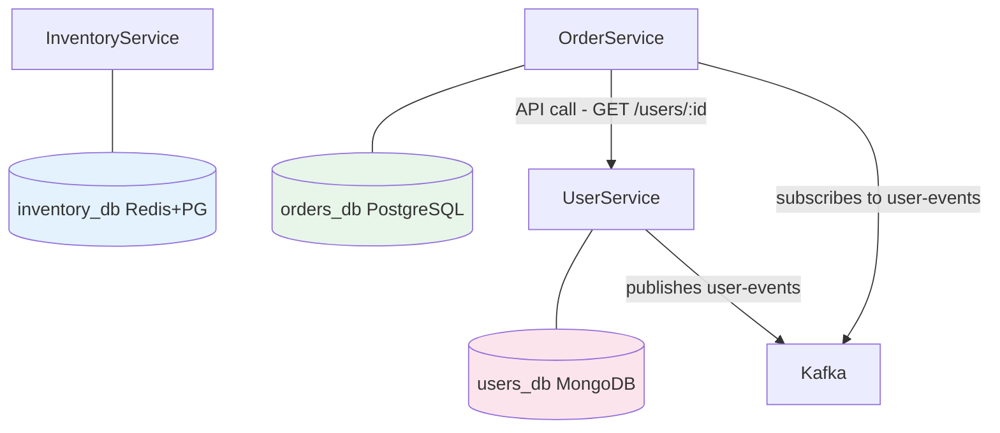
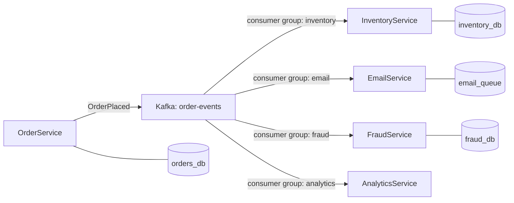
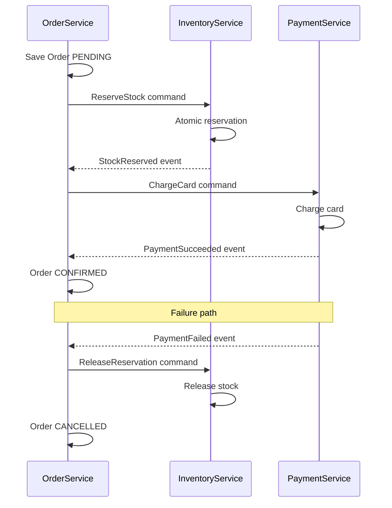
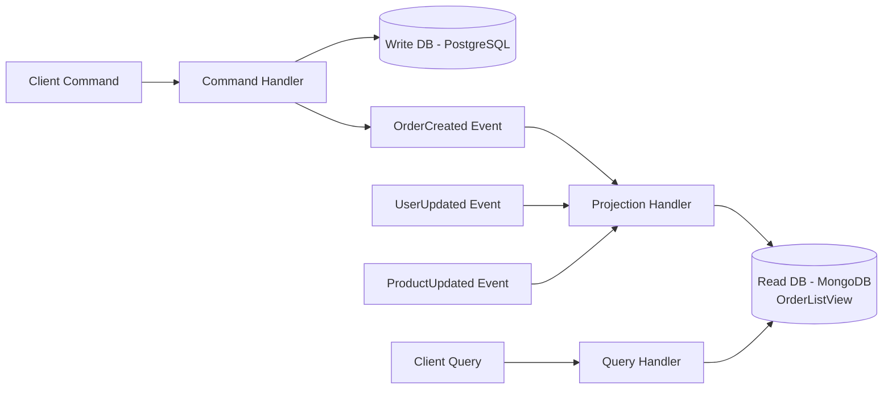

## Keywords in This File

{: .no_toc }

| #   | Keyword                                              | Weight   |
| --- | ---------------------------------------------------- | -------- |
| 1   | [Database per Service Pattern](#database-per-service-pattern) | critical |
| 2   | [Shared Database Anti-Pattern](#shared-database-anti-pattern) | high |
| 3   | [Event-Driven Communication Between Services](#event-driven-communication-between-services) | critical |
| 4   | [Data Consistency Patterns](#data-consistency-patterns) | high |
| 5   | [CQRS in Microservices](#cqrs-in-microservices) | high |

---

# Database per Service Pattern

🎯 Interview Weight: critical - the foundational data pattern
for microservices; every system design interview on microservices
asks about it; violating it is one of the most common mistakes.

---

### 🎯 Model Answer

**30 seconds:**
> Database per service means each microservice owns and exclusively
> manages its own data store. No other service can access it
> directly - they must call the owning service's API. This gives
> true data isolation: schema changes, database technology choices,
> and performance tuning are fully independent per service. The
> trade-off is that cross-service queries require API composition
> or event-driven aggregation instead of SQL JOINs.

**3 minutes (Senior):**
> Database per service is the data corollary to service independence.
> If two services share a database, they share a deployment
> dependency and a team coordination requirement. A schema migration
> needed by the Orders team can break the Inventory team's queries.
> An index added for one service's query pattern can degrade another's.
> Data ownership becomes unclear.
>
> The pattern says each service owns its tables exclusively. Other
> services access that data only through the owning service's API.
> This decouples the teams: the Orders team can add a column, change
> a table structure, or switch from PostgreSQL to DynamoDB without
> coordinating with any other team.
>
> The challenge is cross-service reads. In a monolith, you write
> `SELECT o.*, u.name FROM orders o JOIN users u ON o.userId = u.id`.
> In microservices, OrderService does not have access to the users
> table. Solutions: API composition (call both services, join in
> the caller), or event-driven denormalization (OrderService subscribes
> to user events and maintains a local copy of the user data it needs).

**Framework:** WHAT - WHY - HOW - TRADE-OFF - EXAMPLE

*Adapting up:* At staff level, discuss polyglot persistence
(each service choosing the best database for its access pattern),
and how to handle the cross-service reporting use case.

*Adapting down:* Junior: each service has its own database and
no other service can write directly to it.

**Blank Mind Recovery:**

**(1) Restate:** "You are asking about the database pattern for
microservices data ownership."

**(2) First principles:** "If services are independent, their data
must be independent too. A service that shares a database with
another service is not truly independent."

**(3) Bridge:** "Like each team having their own team drive -
you request access through their process, not by accessing it
directly."

---

### 📘 Concept Explanation

**What it is:**
Database per service is a microservices pattern where each
service is the sole owner of its persistent data. The data
store (whether relational, document, or key-value) is private
to the service. Other services access it only through the
owning service's published API.

**The problem it solves:**
In a shared database model, multiple services couple to the
same schema. A schema change by one team breaks other teams.
Services cannot independently choose their database technology.
Data ownership is ambiguous. Database per service eliminates
all of these coupling points.

**How it works:**
```
OWNERSHIP MODEL:
Service: OrderService
Owns: orders_db (PostgreSQL)
Tables: orders, order_items, order_status_history
Access: only OrderService can read/write these tables
External access: GET /orders/{id} API only

Service: InventoryService
Owns: inventory_db (Redis + PostgreSQL)
Data: stock_levels (Redis), inventory_history (PG)
Access: only InventoryService

Service: UserService
Owns: users_db (MongoDB)
Data: user profiles, preferences
Access: only UserService

CROSS-SERVICE READ (the challenge):
"Show order with customer name"
Option A - API Composition:
  Caller: fetch Order from OrderService
  Caller: fetch User from UserService
  Caller: merge results in application code
  Cost: 2 network round trips

Option B - Denormalized local copy:
  OrderService subscribes to UserCreated/UserUpdated events
  OrderService stores {userId, userName} in its own DB
  Single query, no cross-service call at read time
  Cost: eventual consistency (name update takes seconds to propagate)
```

**The key insight:**
The database per service pattern shifts consistency challenges
from "prevent shared DB coupling" to "handle eventual consistency."
This is not a free trade-off - it requires designing for
eventual consistency explicitly.

**When to use it:**
- When services need independent deployment and team ownership
- When different services have different scaling and storage
  requirements (polyglot persistence)
- When you want teams to independently evolve their data model

**When NOT to use it:**
- When the data is fundamentally shared and requires transactional
  consistency across services (consider merging those services)
- When cross-service reporting is the primary use case (consider
  a dedicated reporting service with its own database fed by events)

**Alternatives:**
- Shared database (anti-pattern for production - see next keyword)
- Shared schema, separate databases (partial isolation)
- Polyglot persistence (each service picks its optimal database)

**First-principles derivation:**
If code ownership is per service, data ownership must also be per
service. Shared data with independent code creates a split-brain
problem: who owns the schema? Who decides when to migrate?
The only clean answer: one owner per data store.

---

### 💻 Code Example

**BAD - Cross-service direct database access:**
```java
// OrderService directly queries the users table
// Users table owned by UserService - this is WRONG
@Repository
public class OrderRepository {
    @Autowired
    private JdbcTemplate jdbc;

    // BAD: OrderService should NOT query users table
    // Any UserService schema change can break this
    public OrderWithUser findOrderWithUser(Long orderId) {
        return jdbc.queryForObject(
            "SELECT o.*, u.name, u.email " +
            "FROM orders o " +
            "JOIN users u ON o.user_id = u.id " +
            "WHERE o.id = ?",
            new OrderWithUserMapper(),
            orderId);
    }
}
```

> **Code walkthrough:** This cross-service JOIN violates
> database per service. If UserService migrates from PostgreSQL
> to MongoDB, or renames the `name` column to `full_name`,
> this query breaks. OrderService is now coupled to UserService's
> schema - exactly what database per service prevents.

**GOOD - API composition:**
```java
// OrderService only touches its own tables
@Service
public class OrderService {
    private final OrderRepository orderRepo;    // orders_db
    private final UserServiceClient userClient; // API call

    public OrderDetails getOrderDetails(Long orderId) {
        // Fetch from own database - always fast
        Order order = orderRepo.findById(orderId)
            .orElseThrow(() -> new OrderNotFoundException(orderId));

        // Fetch from UserService API - network call
        // Use circuit breaker here in production
        UserSummary user = userClient.getUserSummary(
            order.getUserId());

        // Compose result in application code
        return new OrderDetails(order, user);
    }
}
```

> **Code walkthrough:** OrderService owns its orders table.
> User data is fetched via the UserService API. The schema
> of the users table is irrelevant to OrderService - it only
> sees the UserSummary DTO that UserService chose to expose.
> UserService can restructure its schema freely.

**GOOD - Event-driven denormalization (no cross-service call at read time):**
```java
// OrderService maintains a local projection of user data
// Updated asynchronously via events

// Event consumer in OrderService:
@KafkaListener(topics = "user-events")
public class UserEventConsumer {

    private final UserSnapshotRepository userSnapshotRepo;

    public void handleUserCreated(UserCreatedEvent event) {
        // Store only the data OrderService needs
        userSnapshotRepo.save(new UserSnapshot(
            event.getUserId(),
            event.getDisplayName(),
            event.getEmail()));
    }

    public void handleUserUpdated(UserUpdatedEvent event) {
        // Update the local copy
        userSnapshotRepo.updateDisplayName(
            event.getUserId(), event.getDisplayName());
    }
}

// Now orders with user data require ONE query, zero API calls:
@Service
public class OrderService {
    public OrderDetails getOrderDetails(Long orderId) {
        Order order = orderRepo.findById(orderId)
            .orElseThrow(() -> ...);
        // Local table, no cross-service call
        UserSnapshot user = userSnapshotRepo
            .findByUserId(order.getUserId())
            .orElse(UserSnapshot.UNKNOWN);
        return new OrderDetails(order, user);
    }
}
```

> **Code walkthrough:** OrderService subscribes to user events
> and maintains a local user_snapshots table with only the
> fields it needs (display name, email). Order reads are now
> single-service, zero cross-service API calls. The trade-off:
> the user name in order details may be up to a few seconds
> stale. For display purposes, this is usually acceptable.

---

### 🎓 Answers by Seniority

**Junior / Mid (0-5 years):**
> Database per service means each microservice has its own
> database that only it can access. Other services must call
> the owning service's API to get the data. This prevents the
> coupling that happens when multiple services share tables -
> one team's schema change breaks another team's code.

*Push deeper:* Explain the cross-service read challenge and
how API composition solves it.

---

**Senior / Staff (5+ years):**
> Database per service is the pattern I enforce most firmly
> in microservices design. The coupling from a shared database
> is the most subtle and most damaging - it looks fine initially
> and becomes painful when teams try to work independently.
> The hard question is cross-service data access. My approach:
> for low-volume reads, API composition is fine with circuit
> breaker. For high-volume reads that cannot afford cross-service
> calls, use event-driven denormalization - subscribe to events,
> maintain a local read model. For reporting (joining data from
> multiple services), use a dedicated data warehouse or OLAP
> store fed by events from all services.

*Push deeper:* Discuss polyglot persistence - when each service
owns its data, it can independently choose the best data store:
OrderService uses PostgreSQL, ProductService uses Elasticsearch,
RecommendationService uses a graph database.

---

### ⚠️ Common Misconceptions

**Misconception 1: "Database per service means one database
server per service."**
The pattern requires logical isolation (separate schema,
separate tables), not necessarily a separate database server.
For small systems, multiple services can share a single
database server with separate schemas. Separate servers come
with scale.

**Misconception 2: "Event-driven denormalization duplicates data."**
Yes, it does - intentionally. In distributed systems, the
choice is between duplicating data (with eventual consistency)
and accepting coupling (shared database). Data duplication
with clear ownership is better than coupling without ownership.

**Misconception 3: "API composition always requires two
sequential calls."**
Parallel API calls reduce the latency overhead significantly.
Fetch Order and User concurrently with `CompletableFuture.allOf()`
and the total time is `max(t_order, t_user)`, not `t_order + t_user`.

---

### 🚨 Failure Modes and Diagnosis

**Failure: Cross-service schema coupling discovered late**
Symptom: A schema migration in ServiceA causes ServiceB
test failures; teams did not know they shared data.
Diagnosis: Search codebase for cross-database table references;
check if any service's datasource points to another service's
schema.
Fix: Strangler Fig - add API layer in ServiceA, migrate
ServiceB to use the API, then enforce schema ownership with
database credentials that limit access to owned tables only.

**Failure: Read latency increases from API composition**
Symptom: A page load that was 50ms (single SQL JOIN) is now
200ms (two service API calls).
Diagnosis: Trace the request - measure each API call duration.
Fix: Parallelize the calls; add caching to the composed read;
consider event-driven local projection for hot paths.

---

### 🎯 Interview Deep-Dive

**Timing:** Easy 6 min | Medium 10 min | Hard 15 min

| Category | Questions |
|---|---|
| Definition | 2 |
| Mechanism | 2 |
| Comparison | 2 |
| Scenario | 2 |
| Debugging | 1 |
| Deep Dive | 1 |
| Misconception | 1 |

**Definition:**

Q: "What is the database per service pattern?"

A: Database per service is a microservices data management
pattern where each service is the exclusive owner of its
persistent data. No other service can access the database
directly - all access goes through the owning service's
API. The data store can be any technology appropriate for
the service's access patterns. The pattern enforces data
ownership and enables independent deployment, technology
choice, and schema evolution per service.

*What separates good from great:* Know that "database
per service" is about logical ownership, not necessarily
a separate database server. The enforcement mechanism
is database credentials - other services should not even
have a connection string to another service's database.

---

Q: "What problem does database per service solve compared
to a shared database?"

A: Shared database creates several coupling problems: schema
coupling (a column rename by one team breaks another team's
queries), deployment coupling (schema migrations require
coordinating all services), technology coupling (all services
must use the same database), and performance coupling (one
service's heavy query plan can degrade another's). Database
per service eliminates all of these: each service evolves
its schema independently, can choose any data store, and
performance tuning is per service.

*What separates good from great:* Concrete the coupling:
"We had a shared database on a previous project, and a
routine schema migration in the billing service broke three
other services that were doing direct queries - we did not
even know they were accessing those tables."

---

**Mechanism:**

Q: "How do you handle cross-service queries in database
per service?"

A: Two main approaches. API composition: the caller fetches
data from each service's API and joins in application code.
Good for low-frequency reads and when immediate consistency
is required. For parallel fetching, use `CompletableFuture.allOf()`.
Add circuit breakers. Event-driven denormalization: the consuming
service subscribes to events from the owning service and
maintains a local copy of the data it needs. Reads are
then single-service with no cross-service call. Good for
high-frequency reads, performance-critical paths. Trade-off:
eventual consistency - the local copy may be seconds behind.

*What separates good from great:* Know when to use each:
low-frequency reads with consistency requirement = API
composition. High-frequency reads where eventual consistency
is acceptable = event-driven local copy.

---

Q: "How do you enforce database per service - what prevents
a service from directly querying another service's database?"

A: Enforcement mechanisms: (1) Database credentials per
service - each service has its own database user with
GRANT permissions only to its own tables. Other services
have no credentials to connect. (2) Network segmentation -
database server only accepts connections from the owning
service's subnet or Kubernetes namespace. (3) Team
convention enforced by code review - check for cross-service
datasource references in PRs. (4) Automated testing -
architecture fitness functions that fail the build if
any service queries a table it should not own.

*What separates good from great:* Know that credential
enforcement is the strongest mechanism - it makes the
violation structurally impossible, not just discouraged
by convention.

---

**Comparison:**

Q: "Database per service vs. shared database - what are
the trade-offs?"

A: Shared database: no cross-service calls for reads,
transactional consistency across services, simple for
small teams. Fails at scale: coupling accumulates, schema
migrations require cross-team coordination, technology
lock-in, performance interference. Database per service:
true team independence, polyglot persistence, independent
scaling. Cost: no cross-service transactions, cross-service
reads require API composition or event-driven patterns,
eventual consistency for denormalized data.

*What separates good from great:* Know that "shared database
for simplicity" is a short-term win that becomes a long-term
liability. The maintenance cost of cross-team schema
coordination grows superlinearly with team size.

---

Q: "How would you approach cross-service reporting - for
example, a dashboard that needs data from 10 services?"

A: A dedicated reporting service with its own OLAP data
store (BigQuery, Redshift, Snowflake, or a PostgreSQL OLAP
schema). Each service publishes change events to an event
stream (Kafka). A reporting service (or ETL pipeline) consumes
these events and writes to the OLAP store. The reporting
service's schema is denormalized for reporting queries -
not the same as the operational schemas. Reports run against
the OLAP store without impacting operational services.
The OLAP data can be eventually consistent (minutes to hours
behind) which is acceptable for dashboards.

*What separates good from great:* Know that reporting is
a distinct access pattern from operational reads. OLAP and
OLTP have different optimization needs; the right answer
is a separate data store optimized for analytics.

---

**Scenario:**

Q: "Design the data architecture for an order system with
Order, Inventory, and User services. How do you handle
showing order history with user names?"

A: Each service owns its data. OrderService: orders +
order_items in PostgreSQL. InventoryService: stock_levels
in Redis + PostgreSQL. UserService: user_profiles in MongoDB.
For order history with user names, two options:
(1) Order history API makes a parallel call: fetch orders
from OrderService, fetch user from UserService by userId,
merge in the API layer. Simple, consistent. Works for
low-frequency requests (order history page).
(2) OrderService subscribes to user.name.changed events
and stores {user_id, display_name} in its own user_snapshots
table. Order history query is a single database join. Better
for high-frequency reads. The trade-off: display name may
be up to a few seconds stale.

*What separates good from great:* Justify the choice based
on the access pattern frequency and consistency requirement.

---

Q: "A service migration is needed: extract a Catalog service
from a monolith that shares a database with 5 other teams.
How do you do it without breaking anything?"

A: The Strangler Fig with anti-corruption layer. Step 1:
Add a repository abstraction in the monolith that wraps
all catalog table access. Step 2: Create the CatalogService
with its own database, seeded from the monolith. Step 3:
Route new writes through the CatalogService API; monolith
writes to both databases simultaneously (dual-write with
consistency check). Step 4: Migrate read access in each
service one at a time: replace direct table queries with
CatalogService API calls. Step 5: Once all reads are via
API, stop the dual-write, make the monolith read-only for
catalog data, then remove catalog tables from the shared
database. Key constraint: always have a rollback plan for
each step.

*What separates good from great:* Describe the dual-write
phase explicitly and the consistency check that verifies
both databases stay in sync during migration.

---

**Debugging:**

Q: "An integration test fails with a foreign key constraint
violation. Investigation reveals Service A is writing to a
foreign key that references a table owned by Service B. How
do you fix the data model?"

A: This is a cross-service foreign key - a structural coupling
that must be eliminated. Step 1: Identify what data Service A
needs from Service B's table. Step 2: Replace the foreign key
with a logical reference (just store the ID without a DB-level
FK constraint). Step 3: Service A handles the "missing reference"
case in application code: if Service B's entity is not found,
treat it as a soft-delete or use a default. Step 4: Add a
periodic consistency check that identifies orphaned references
and handles them (archive, notify, or clean up). The database
constraint must not enforce cross-service referential integrity -
that belongs in application logic.

*What separates good from great:* Know that cross-service
foreign keys are architecturally wrong, not just a performance
concern. The correct enforcement mechanism is application-level
validation, not database constraints.

---

**Deep Dive:**

Q: "What is polyglot persistence and how does it benefit
microservices?"

A: Polyglot persistence is the practice of each service
choosing the data store that best fits its specific access
patterns. Example: UserService uses PostgreSQL (structured
data, ACID transactions); SearchService uses Elasticsearch
(full-text search, inverted index); SessionService uses
Redis (key-value, TTL-based expiry); RecommendationService
uses a graph database (relationship traversal); TimeSeriesService
uses InfluxDB (time-based aggregation). Without database per
service, all services must use the same database technology -
a one-size compromise. With database per service, the best
tool is used for each job. The operational cost: more database
technologies to operate. The benefit: significant performance
and cost improvements per service.

*What separates good from great:* Know specific use cases:
Redis for session (O(1) key lookup, TTL), Elasticsearch for
search (inverted index), Neo4j for relationships. Not every
service needs a different database; the point is the freedom
to choose, not the obligation to diversify.

---

**Misconception / Trap:**

Q: "In database per service, each service must have a separate
database server. Right?"

A: Not necessarily. Logical isolation (separate schema, separate
credentials, no cross-schema queries) is sufficient for the
pattern's goals. For development or small-scale production,
multiple services can share a physical database server with
separate schemas and separate database users. The key
enforcement is credential isolation: ServiceA's database user
has GRANT SELECT/INSERT/UPDATE/DELETE only on ServiceA's schema.
Separate servers become appropriate when services have different
scaling, backup, or operational requirements - not from the
pattern's isolation requirement alone.

*What separates good from great:* Distinguish between logical
isolation (what the pattern requires) and physical isolation
(operational decision based on scale and requirements).

---

### ⚖️ Comparison Table

| Pattern | Team Independence | Consistency | Cross-Service Queries | When to Choose |
|---|---|---|---|---|
| **DB per Service** | Full | Eventual (for cross-service) | API composition or events | Microservices default |
| Shared Database | None | Strong (transactional) | Direct SQL JOIN | Monolith or tightly coupled |
| Schema per Service | Logical isolation | Eventual | Schema-scoped JOIN | Transitional state |
| Event Sourcing | Full | Eventual | Subscribe to event streams | Audit trail + replay needed |

**The deciding factor:** Do teams need to deploy and evolve
their data independently? If yes, database per service is
required. If transactional consistency across services is
non-negotiable, the services may need to be one service.

---

### 🏛️ System Design

*(Conditional: included because data ownership is the first
question in every microservices system design.)*

**Where Database per Service appears in system design:**
- "Design an e-commerce system with microservices"
- "How do services manage their data?"
- "How do you handle cross-service reporting?"

**6-step framework answer:**
Step 1 CLARIFY - What are the consistency requirements for
cross-service reads? Real-time or eventual consistency OK?

Step 2 ESTIMATE - How frequently does cross-service data
need to be read? High frequency = event-driven local copy.

Step 3 DESIGN - Each service owns its database. Cross-service
reads via API composition (low volume) or event-driven
denormalization (high volume).

Step 4 DEEP DIVE - Enforcement: separate DB credentials per
service. OrderService cannot have a connection string to
UsersDB. API composition for order history + user name.

Step 5 ALTS - Considered shared reporting database. Chose
event-driven OLAP store for reporting instead.

Step 6 EVOLVE - At 10x services, event-driven data pipeline
to OLAP (BigQuery/Snowflake) for cross-service reporting.

**Scale inflection point:**
At ~20 services with complex cross-service read patterns,
the latency of API composition becomes significant. This is
when event-driven data denormalization becomes necessary.

**Common system design traps:**
- Allowing cross-service SQL JOINs in "just for simplicity"
  (the coupling grows and becomes impossible to undo)
- Not planning for the reporting use case (cross-service
  analytics requires a separate data store)
- Foreign key references across service databases (works
  in dev, breaks when services have separate databases)

**Staff angle:** The data architecture is the hardest part
to change. Wrong boundaries and shared databases create
technical debt that compounds. Make data ownership explicit
from the start and enforce with credentials.

---

### 📊 Diagram

*(Conditional: included because data ownership topology
is the canonical microservices data diagram.)*

```
WRONG (shared database):
OrderService  InventorySvc  UserService
     |              |            |
     +------+--------+-----------+
            |
       [shared_db]
       orders, inventory, users
       All teams own nothing, all teams couple to everything

CORRECT (database per service):
OrderService    InventorySvc    UserService
     |               |               |
[orders_db]    [inventory_db]   [users_db]
(PG)           (Redis+PG)        (MongoDB)
```



> **Diagram walkthrough:** Each service has its own data store
> optimized for its access pattern (polyglot persistence). Services
> do not touch each other's databases. OrderService accesses user
> data either via UserService API (real-time, consistent) or by
> subscribing to user events via Kafka (eventual, no cross-service
> call at read time). The color coding shows three independent
> data ownership domains.

---

---

# Shared Database Anti-Pattern

🎯 Interview Weight: high - interviewers explicitly probe for
this to test understanding of microservices data coupling;
recognizing and explaining this anti-pattern is expected at mid+.

---

### 🎯 Model Answer

**30 seconds:**
> The shared database anti-pattern is when multiple microservices
> directly read from and write to the same database tables. It
> looks simple initially but creates tight coupling between
> services: schema changes by one team break others, deployments
> must be coordinated, and technology choices are locked. It is
> microservices in name only - you get all the network complexity
> without the independence.

**3 minutes (Senior):**
> The shared database is the most common microservices anti-pattern
> because it is the path of least resistance. Teams extract services
> but keep sharing the database "temporarily for simplicity." The
> temporary becomes permanent, and the coupling compounds.
>
> The concrete coupling: an index added by one service slows another's
> queries. A NOT NULL column added by one team requires all other
> teams to deploy simultaneously. A team that wants to migrate from
> PostgreSQL to DynamoDB cannot because five other services depend
> on their tables. The shared database creates a deployment monolith
> even when the code is distributed.
>
> The subtler problem: data ownership becomes unclear. If OrderService,
> InventoryService, and BillingService all write to the `orders` table,
> who owns it? When two services update the same row concurrently,
> whose logic wins? These ambiguities generate production bugs that
> are hard to trace because the root cause is architectural, not logical.

**Framework:** WHAT - WHY - HOW - TRADE-OFF - EXAMPLE

*Adapting up:* Staff level - discuss the migration strategy
(Strangler Fig) and how to detect hidden shared database usage
in legacy systems.

*Adapting down:* Junior: if two services write to the same table,
they are not really independent.

**Blank Mind Recovery:**

**(1) Restate:** "You are asking about what goes wrong when
microservices share a database."

**(2) First principles:** "Independent services need independent
data. Shared data = shared coupling = not independent."

**(3) Bridge:** "Like two teams sharing a document with no version
control - whoever saves last wins, changes conflict, and neither
can work independently."

---

### 📘 Concept Explanation

**What it is:**
The shared database anti-pattern occurs when multiple
microservices share a single database, with each service
having direct read/write access to each other's tables.
This creates implicit coupling through the shared schema.

**The problem it solves - why teams reach for it:**
Cross-service data access requires no network calls. Consistent
reads across services are easy (SQL JOIN). It feels "simpler"
during the initial extraction from a monolith.

**Why it fails:**
```
COUPLING TYPES INTRODUCED:
1. Schema coupling:
   OrderService: ALTER TABLE orders ADD COLUMN gift_wrap BOOLEAN;
   InventoryService: INSERT INTO orders (id, user_id) VALUES (...)
   -> InventoryService fails if it doesn't know about gift_wrap

2. Technology coupling:
   All services must use the same database technology.
   OrderService cannot migrate to DynamoDB without
   rewriting every other service that accesses orders.

3. Deployment coupling:
   Adding a NOT NULL column requires all writing services
   to deploy simultaneously with the schema migration.

4. Performance coupling:
   Heavy queries from ReportingService slow down
   OrderService write path on the same database.

5. Data ownership ambiguity:
   Three services write to the orders table.
   When an order has inconsistent state, which service
   is responsible for the bug?
```

**The key insight:**
A shared database is a distributed monolith: you have the
network complexity of microservices with the coupling of a
monolith. The worst of both worlds.

**Detection patterns:**
- Multiple service datasources point to the same connection string
- Integration tests between services use database-level assertions
- A schema migration requires coordinating multiple teams
- Services have cross-service foreign key references

**Migration approach:**
1. Add an anti-corruption layer (service API) in front of
   the shared data
2. Migrate consumers to use the API one at a time
3. Once all consumers use the API, physically separate the database

---

### 💻 Code Example

**BAD - Shared database anti-pattern:**
```java
// OrderService and InventoryService BOTH connected to shared_db
// OrderService datasource config:
spring.datasource.url=jdbc:postgresql://shared-db:5432/app_db

// InventoryService datasource config (SAME DATABASE):
spring.datasource.url=jdbc:postgresql://shared-db:5432/app_db

// InventoryService directly writes to the orders table:
@Repository
public class InventoryRepository {
    @Autowired JdbcTemplate jdbc;

    // WRONG: InventoryService writing to orders table
    // orders table is conceptually owned by OrderService
    public void updateOrderInventoryStatus(
            Long orderId, String status) {
        jdbc.update(
            "UPDATE orders SET inventory_status = ? WHERE id = ?",
            status, orderId);
    }
}
```

> **Code walkthrough:** Both services use the same database URL.
> InventoryService directly updates a column in the orders table.
> Now any schema change to the orders table requires touching both
> services. If OrderService renames `inventory_status` to
> `stock_status`, InventoryService breaks at runtime - no compile-
> time warning, no clear ownership.

**GOOD - Migrating to API:**
```java
// Step 1: OrderService adds an API for what InventoryService needs
@RestController
@RequestMapping("/orders")
public class OrderController {
    // OrderService exposes an API to update inventory status
    // This is the ONLY way InventoryService touches order data
    @PatchMapping("/{orderId}/inventory-status")
    public ResponseEntity<Void> updateInventoryStatus(
            @PathVariable Long orderId,
            @RequestBody UpdateInventoryStatusRequest req) {
        orderService.updateInventoryStatus(orderId, req.getStatus());
        return ResponseEntity.noContent().build();
    }
}

// Step 2: InventoryService uses the API instead of direct DB:
@Service
public class InventoryService {
    private final OrderServiceClient orderClient;

    public void processInventoryReservation(
            Long orderId, InventoryResult result) {
        // Calls the OrderService API - no direct DB access
        orderClient.updateInventoryStatus(orderId,
            result.toOrderStatus());
    }
}
```

> **Code walkthrough:** OrderService exposes a PATCH endpoint
> for inventory status updates. InventoryService calls this API.
> The orders table schema is now completely internal to OrderService.
> InventoryService does not import, reference, or know about any
> column in the orders table.

---

### 🎓 Answers by Seniority

**Junior / Mid (0-5 years):**
> The shared database anti-pattern is when multiple microservices
> read and write the same database tables directly. The problem
> is that they become coupled through the schema - a change to a
> table structure by one team can break another team's service.
> Services should only access their own data and call other
> services' APIs for data they need.

*Push deeper:* Describe a specific coupling failure - schema
migration requiring coordinated deployment.

---

**Senior / Staff (5+ years):**
> The shared database creates a distributed monolith. You get
> the operational complexity of microservices (network calls,
> distributed observability) with the coupling of a monolith
> (shared schema, coordinated deployments, ambiguous ownership).
> The most insidious form is when it happens gradually: services
> are extracted but the database migration is deferred "for
> simplicity." Over 6 months, dozens of cross-table dependencies
> accumulate and the migration cost becomes prohibitive. Detection:
> check if any service's datasource URL appears in multiple
> service configurations. Migration: anti-corruption layer first,
> then Strangler Fig.

*Push deeper:* Discuss how to detect this in an existing system
and estimate the migration cost.

---

### ⚠️ Common Misconceptions

**Misconception 1: "A shared read-only database is OK."**
Read-only access still creates schema coupling: a column removal
or rename breaks the reader. If reading is allowed, writing
usually follows. Design for full isolation from the start.

**Misconception 2: "We can fix it later - it's just temporary."**
The shared database is a gravity well. The longer it persists,
the more cross-table queries accumulate, and the harder migration
becomes. Teams that say "temporary" discover it is permanent 12
months later.

---

### 🚨 Failure Modes and Diagnosis

**Failure: Schema migration requires multi-team coordination**
Symptom: Adding a column requires changes and deployments across
three teams' services simultaneously.
Diagnosis: Check which services write to the table being migrated.
Fix: This is the anti-pattern symptom. The only real fix is to
migrate to database per service. Short-term: add optional columns
(nullable, no default) to avoid breaking current readers.

**Failure: Production incident traced to wrong-service write**
Symptom: OrderService records are in unexpected states; no OrderService
code change can explain it.
Diagnosis: Query the database audit log for writes to the orders table;
identify which service is the source.
Fix: Block cross-service writes immediately with credential restrictions;
add the API layer as the correct path.

---

### 🎯 Interview Deep-Dive

**Timing:** Easy 4 min | Medium 7 min | Hard 10 min

| Category | Questions |
|---|---|
| Definition | 2 |
| Mechanism | 1 |
| Comparison | 1 |
| Scenario | 2 |
| Debugging | 1 |
| Misconception | 1 |

**Definition:**

Q: "What is the shared database anti-pattern in microservices?"

A: The shared database anti-pattern is when multiple microservices
share direct access to the same database, reading and writing each
other's tables. It violates the fundamental principle of microservices:
independent deployability. Because the schema is shared, changes by
one team require coordination with all teams that access those tables.
Services cannot evolve their data model independently, cannot choose
different database technologies, and cannot isolate performance
characteristics. It creates the worst of both worlds: distributed
system complexity with monolith-level coupling.

*What separates good from great:* Name it precisely as a "distributed
monolith" - the term that signals you understand the full implications.

---

Q: "How do you detect the shared database anti-pattern in an existing
system?"

A: Several detection methods: (1) Check if multiple services share
the same database connection URL in their configuration. (2) Search
for cross-service table names in ORM entities or SQL queries. (3)
Check if integration tests between services use database-level
assertions across service boundaries. (4) Ask the team: "If you
needed to rename a column, how many other teams would you need to
notify?" More than zero = shared database coupling.

*What separates good from great:* Know that architecture fitness
functions (automated tests that verify no cross-service DB access)
can be added to CI to prevent regression.

---

**Mechanism:**

Q: "Why does a shared database prevent independent deployment?"

A: A schema migration (ADD COLUMN NOT NULL, DROP COLUMN, RENAME)
requires all services that access that table to be updated
simultaneously. If ServiceA adds `gift_wrap BOOLEAN NOT NULL DEFAULT false`
and ServiceB is inserting rows without this column, ServiceB's inserts
fail until it is updated. This means ServiceA and ServiceB must
deploy together - they are not independently deployable. The dependency
is implicit (in the database) and not visible in either service's
code, making it harder to manage than explicit API dependencies.

*What separates good from great:* Know the specific schema changes
that require coordination (NOT NULL without default, removing columns,
renaming columns) vs. those that are backward compatible (adding
nullable columns, adding indexes).

---

**Comparison:**

Q: "Shared database vs. API-based access - what are the practical
trade-offs?"

A: Shared database: zero network overhead for reads (local SQL),
transactional consistency trivial (one transaction spans multiple
entities), simple for small teams. Fails: schema coupling, technology
lock-in, ownership ambiguity, performance interference. API-based:
network overhead per call (1-5ms), no transactional consistency
across services without distributed transaction patterns, more
code. Wins: clean ownership, independent deployment, technology
freedom. The practical inflection point: when the schema coupling
pain of a shared database exceeds the network call complexity of APIs,
switch. This typically happens when teams are independent enough that
coordination overhead exceeds the API call overhead.

*What separates good from great:* Know that the performance difference
(SQL vs. API call) is often overstated. A well-indexed SQL query and
a cached API call are both under 10ms. The coordination overhead of
a shared database is not measurable in milliseconds - it is measured
in engineering hours.

---

**Scenario:**

Q: "Your team is starting a microservices migration from a monolith.
The architect proposes sharing the existing monolith database across
all new microservices. How do you respond?"

A: This is the shared database anti-pattern by design. I would push
back with a clear argument: shared database creates deployment coupling
that defeats the purpose of the migration. Every schema migration
becomes a coordination event; we are not gaining independence, we are
only gaining distribution complexity. The right approach: run a
strangler fig extraction - keep the monolith and database intact,
extract one service at a time with its own database. The first service
to extract can seed its database from the monolith and use the anti-
corruption layer pattern. It takes longer upfront but avoids baking
in the anti-pattern that will take 10x longer to remove later.

*What separates good from great:* Acknowledge the business pressure
(faster time to first microservice) and explain why the short-term
gain is not worth the long-term cost.

---

Q: "A team is using a shared database with 5 services. You are asked
to migrate to database per service. How do you approach it?"

A: Strangler Fig extraction, one service at a time. Step 1: Map all
tables and identify which service should logically own each. Step 2:
Add an anti-corruption layer (API endpoint) in the owning service
for any cross-service data access. Step 3: Migrate the first consumer
service (the one with the fewest cross-table dependencies) to use the
API. Step 4: Verify with credentials: the migrated service's DB user
should have zero access to tables it now accesses via API. Step 5:
Repeat for each consumer. Step 6: Once all consumers use APIs, separate
the database physically. Key metric: at each step, run all existing
tests. Regression = go back a step. Never attempt a big-bang migration.

*What separates good from great:* The credential enforcement step
(Step 4) is what interviewers remember. It is the mechanism that makes
the migration irreversible - which is what you want.

---

**Debugging:**

Q: "An order is showing inconsistent state - it is marked as paid
but the inventory has not been reserved. How does this relate to
the shared database anti-pattern?"

A: This is likely a lost-update bug from the shared database. Two
services (OrderService and InventoryService) are updating the same
row with different fields. If they do not coordinate (no locking,
no transaction that spans both updates), one service's update can
overwrite the other's. Investigation: check the audit log for the
order row - which service made the last update and what did it
change? In a shared database model, you might find InventoryService
set `inventory_reserved=false` at the same time OrderService set
`payment_status=PAID`. The fix in the database per service model:
OrderService owns the payment status; InventoryService cannot touch
it. Inventory state transitions are communicated via events, not
direct row updates.

*What separates good from great:* Connect the lost-update bug
directly to the anti-pattern: undefined ownership means no clear
locking discipline, which means race conditions in concurrent updates.

---

**Misconception / Trap:**

Q: "We have a read-only replica of the orders database that
InventoryService reads from. That is not the shared database
anti-pattern, right?"

A: It is still the anti-pattern. Read access still creates schema
coupling: if OrderService removes or renames a column that
InventoryService reads, InventoryService breaks. The team
coordination requirement is the same. Additionally, "read-only
today" has a strong tendency to become "write via a special
stored procedure for performance" tomorrow, and the coupling deepens.
The correct pattern is still API-based access: OrderService exposes
a query endpoint; InventoryService calls it. If latency is a concern,
the solution is caching at the API layer, not direct database access.

*What separates good from great:* Know that the schema coupling of
read access is just as damaging as write coupling - the coupling
is architectural, not just transactional.

---

### ⚖️ Comparison Table

| Approach | Deployment Coupling | Schema Coupling | Technology Lock-in | When Acceptable |
|---|---|---|---|---|
| **Shared Database** | High | High | High | Never (anti-pattern) |
| Shared Read-Only Replica | Medium | High | High | Never (still anti-pattern) |
| Separate Schema, Same Server | Low | Low | Medium | Dev/test, transitional migration |
| **Database per Service (owned)** | None | None | None | Always (target) |

**The deciding factor:** If any other service has a connection string
to your database, you have schema coupling. The pattern requires zero
cross-service database access.

---

### 🏛️ System Design

*(Conditional: included because interviewers probe for this anti-pattern
in system design to test microservices understanding.)*

**Common system design traps:**
- Proposing a shared database for "simplicity" in a microservices design
- Cross-service foreign key constraints
- A "reporting service" that reads production tables from all services directly

**Staff angle:** When inheriting a system with a shared database,
quantify the migration effort before committing to it. Measure
the cross-table dependency graph. Systems with hundreds of cross-
service table references may be better served by modular monolith
architecture than a costly migration that recreates the same coupling
in a different form.

---

---

# Event-Driven Communication Between Services

🎯 Interview Weight: critical - the foundation of async microservices;
every system design interview on distributed systems touches event-driven
communication; required knowledge for senior+.

---

### 🎯 Model Answer

**30 seconds:**
> Event-driven communication means services communicate by producing
> and consuming events - notifications that something happened - via
> a message broker like Kafka or RabbitMQ. The producer publishes an
> event and moves on without waiting. Consumers react independently
> and asynchronously. This decouples services in time (they do not
> need to be running simultaneously) and space (producers do not
> know who the consumers are). The trade-off: eventual consistency
> and the need for idempotent consumers.

**3 minutes (Senior):**
> I think of event-driven communication as the mechanism that gives
> microservices their independence. With synchronous REST calls,
> you have temporal coupling: if the consumer is down, the call fails.
> With event-driven communication, the producer publishes the event
> and continues - the consumer processes it whenever it is available.
>
> The pattern works like this: OrderService publishes an OrderPlaced
> event to Kafka. It does not know and does not care whether
> InventoryService, EmailService, or any other service consumes it.
> Each consumer subscribes independently, in its own consumer group,
> and processes events at its own pace. Adding a new consumer
> (like an analytics service) requires zero changes to OrderService.
>
> The production challenges are real: events must be idempotent
> because Kafka guarantees at-least-once delivery - the same event
> may arrive twice on consumer restart. You need dead letter queues
> for events that fail processing repeatedly. You need to design
> the event schema carefully because it is a public contract:
> changing the schema breaks consumers. The benefits justify these
> challenges at scale.

**Framework:** WHAT - WHY - HOW - TRADE-OFF - EXAMPLE

*Adapting up:* Staff level - event schema governance (schema registry,
Avro/Protobuf serialization, backward compatibility), event sourcing
as an extension, and the organizational implications of event-first design.

*Adapting down:* Junior: instead of calling each other directly,
services publish notifications that others can react to.

**Blank Mind Recovery:**

**(1) Restate:** "You are asking about how services communicate
without calling each other directly - event-driven communication."

**(2) First principles:** "Services need to notify each other when
things happen. Direct calls create coupling. Events through a broker
create independence."

**(3) Bridge:** "It is like a newspaper: the publisher does not know
who reads it or when. Readers subscribe and read at their own pace."

---

### 📘 Concept Explanation

**What it is:**
Event-driven communication is an architectural pattern where services
communicate by emitting events to a message broker. Events represent
things that have happened. Other services subscribe to events they
care about and react. The communication is asynchronous and decoupled.

**The problem it solves:**
Synchronous service-to-service calls create temporal and spatial coupling.
Event-driven communication removes both: services do not need to run
at the same time (temporal decoupling) and do not need to know about
each other (spatial decoupling). It enables fan-out (one event,
many consumers) and extensibility (new consumers without modifying
producers).

**How it works:**
```
EVENT PRODUCTION:
OrderService:
  order = orderRepository.save(order)
  kafka.send("orders", OrderPlacedEvent{
    orderId: "ORD-456",
    userId: 42,
    items: [...],
    timestamp: now()
  })
  // Done. Does not wait for consumers.

EVENT CONSUMPTION:
InventoryService:
  @KafkaListener(topics="orders", group="inventory-service")
  void onOrderPlaced(OrderPlacedEvent event) {
    inventoryService.reserveStock(event.getItems())
    // Process independently, at own pace
  }

EmailService:
  @KafkaListener(topics="orders", group="email-service")
  void onOrderPlaced(OrderPlacedEvent event) {
    emailService.sendConfirmation(event.getUserId())
    // Different consumer group = independent processing
  }

KEY PROPERTIES:
- Consumer groups: each group gets ALL events (fan-out)
- Partitions: events with same key go to same partition (ordering)
- Retention: events stored for configurable period (replay)
- Offset: each consumer group tracks its own position
```

**The key insight:**
The event log (Kafka) is the source of truth for what happened.
New services can be added that process historical events from the
beginning - they are not limited to events that occur after they
start. This enables replay and late-joiner semantics.

**When to use it:**
- Fan-out: one action triggers multiple reactions
- Decoupling: producers should not know their consumers
- Reliability: consumer may be temporarily unavailable
- Audit trail: need a record of all state changes
- Eventual consistency is acceptable

**When NOT to use it:**
- When immediate consistency is required (payment authorization)
- When the producer needs the consumer's response to continue
- Simple request-response queries (use synchronous API)
- Low-volume use cases where the broker overhead is not worth it

**Alternatives:**
- Synchronous REST/gRPC - request-response, immediate
- Webhooks - outbound push from producer to known consumers
- Server-Sent Events / WebSocket - push to browser clients

---

### 💻 Code Example

**BAD - Synchronous fan-out (fragile, coupled):**
```java
@Service
public class OrderService {
    private final InventoryClient inventoryClient;
    private final EmailClient emailClient;
    private final LoyaltyClient loyaltyClient;
    private final FraudClient fraudClient;

    public Order placeOrder(OrderRequest req) {
        Order order = orderRepository.save(new Order(req));
        // WRONG: calling all downstream services synchronously
        // Adding a new consumer requires changing this class
        // If any of these is slow, order placement is slow
        // If any fails, the whole transaction fails
        inventoryClient.reserve(order.getId(), req.getItems());
        emailClient.sendConfirmation(order.getId());
        loyaltyClient.awardPoints(order.getUserId());
        fraudClient.analyze(order);
        return order;
    }
}
```

> **Code walkthrough:** Every new consumer requires a code change
> to OrderService. If FraudService is slow, order placement is slow.
> If EmailService is down, orders fail - even though email failure
> should not prevent ordering. This is the coupling that event-driven
> communication eliminates.

**GOOD - Event-driven fan-out:**
```java
// OrderService: publish event, no knowledge of consumers
@Service
public class OrderService {
    private final KafkaTemplate<String, Object> kafka;
    private static final String TOPIC = "order-events";

    public Order placeOrder(OrderRequest req) {
        Order order = orderRepository.save(
            new Order(req, OrderStatus.CREATED));

        // Publish event with order ID as partition key
        // (ensures ordering for the same order)
        kafka.send(TOPIC, order.getId().toString(),
            OrderPlacedEvent.builder()
                .orderId(order.getId())
                .userId(req.getUserId())
                .items(req.getItems())
                .totalAmount(req.getTotalAmount())
                .timestamp(Instant.now())
                .build());

        return order;
        // OrderService is DONE. Does not know about
        // InventoryService, EmailService, LoyaltyService.
    }
}

// InventoryService: reacts independently
@KafkaListener(
    topics = "order-events",
    groupId = "inventory-service",
    containerFactory = "orderEventsListenerFactory")
public class OrderEventConsumer {

    // Idempotency: check if already processed this orderId
    public void handleOrderPlaced(OrderPlacedEvent event) {
        if (reservationRepository.existsByOrderId(
                event.getOrderId())) {
            log.info("Already processed order {}, skipping",
                event.getOrderId());
            return;  // Idempotent: safe to receive twice
        }
        inventoryService.reserve(
            event.getOrderId(), event.getItems());
    }
}

// EmailService: completely independent consumer group
// Changes here require zero changes to OrderService
@KafkaListener(
    topics = "order-events",
    groupId = "email-service")
public class EmailEventConsumer {
    public void handleOrderPlaced(OrderPlacedEvent event) {
        emailService.sendOrderConfirmation(
            event.getUserId(), event.getOrderId());
    }
}
```

> **Code walkthrough:** OrderService publishes one event and returns.
> InventoryService and EmailService each have their own consumer group,
> meaning each receives and processes every event independently.
> The idempotency check in the InventoryService consumer prevents
> duplicate reservations if the event is re-delivered after a crash.
> Adding a new service (LoyaltyService) requires only a new consumer
> group - zero changes to OrderService.

**Dead letter queue handling:**
```java
@KafkaListener(
    topics = "order-events",
    groupId = "inventory-service",
    errorHandler = "inventoryErrorHandler")
public class OrderEventConsumer {
    public void handleOrderPlaced(OrderPlacedEvent event) {
        inventoryService.reserve(
            event.getOrderId(), event.getItems());
    }
}

@Bean
public KafkaListenerErrorHandler inventoryErrorHandler() {
    return (message, exception) -> {
        OrderPlacedEvent event = (OrderPlacedEvent)
            message.getPayload();
        // After 3 retries, send to dead letter topic
        kafkaTemplate.send("order-events.DLT", event);
        log.error("Failed to process order {}: {}",
            event.getOrderId(), exception.getMessage());
        // Alert operations team
        alerting.fireAlert("order-inventory-dlq", event);
        return null;
    };
}
```

> **Code walkthrough:** The dead letter topic (DLT) holds events
> that failed processing after retries. Operations can inspect these,
> fix the underlying issue, and replay from the DLT. Without DLT,
> poison messages loop indefinitely - the consumer keeps crashing,
> no other events are processed, and Kafka consumer lag grows.

---

### 🎓 Answers by Seniority

**Junior / Mid (0-5 years):**
> Event-driven communication is when services communicate by
> publishing events to a message broker (like Kafka) instead of
> calling each other directly. The publisher sends the event and
> moves on. Other services subscribe to events they care about
> and process them asynchronously. This means services are
> independent - the email service being slow does not affect
> order creation.

*Push deeper:* Explain consumer groups - multiple services can
each receive the same event independently.

---

**Senior / Staff (5+ years):**
> Event-driven communication is the mechanism I reach for when
> I need fan-out (one action, many reactions) or when I want to
> decouple the producer from its consumers. The key operational
> requirements: idempotent consumers (Kafka delivers at-least-once;
> your consumer must handle duplicates), dead letter queues for
> poison messages, and schema governance (the event schema is a
> public contract - changes must be backward compatible). At scale,
> the schema registry (Confluent Schema Registry with Avro/Protobuf)
> becomes essential to prevent consumer breakage from uncoordinated
> schema changes.

*Push deeper:* Discuss event schema evolution and the backward
compatibility rules that allow producers and consumers to deploy
independently.

---

### ⚠️ Common Misconceptions

**Misconception 1: "Event-driven means no ordering guarantees."**
Kafka provides ordering within a partition. Events with the same
partition key (e.g., orderId) are always processed in order by
the same consumer. Use the partition key deliberately to maintain
ordering where required.

**Misconception 2: "Publishing an event means it was processed."**
Publishing confirms the event was written to Kafka. Processing
confirmation comes from the consumer - via a status event or
database check. Do not confuse publication with completion.

**Misconception 3: "Event-driven eliminates the need for idempotency."**
Kafka guarantees at-least-once delivery by default. Consumers must
be idempotent: processing the same event twice must be safe.
This requires explicit design, not just using Kafka.

---

### 🚨 Failure Modes and Diagnosis

**Failure: Consumer lag growing**
Symptom: Events are being published but effects (emails, inventory)
are delayed by hours.
Diagnosis: `kafka-consumer-groups.sh --bootstrap-server <host>
--describe --group inventory-service` - check lag per partition.
Fix: Scale consumer instances; add partitions if current partition
count is less than desired consumer instance count.

**Failure: Poison message blocking consumer**
Symptom: Consumer stopped processing; DLT filling up; one partition
at 100% lag.
Diagnosis: Check DLT topic for the failing message. Enable detailed
exception logging in the consumer.
Fix: Fix the consumer bug and redeploy; replay from DLT.

---

### 🎯 Interview Deep-Dive

**Timing:** Easy 6 min | Medium 10 min | Hard 15 min

| Category | Questions |
|---|---|
| Definition | 2 |
| Mechanism | 2 |
| Comparison | 2 |
| Scenario | 2 |
| Debugging | 1 |
| Deep Dive | 1 |
| Misconception | 1 |
| Performance | 1 |

**Definition:**

Q: "What is event-driven communication and how does it differ
from synchronous REST calls?"

A: Event-driven communication uses a message broker to decouple
producers from consumers. The producer publishes an event (something
that happened: OrderPlaced, UserUpdated) and moves on. Consumers
subscribe and process events independently and asynchronously.
REST calls are synchronous: the caller waits for the response,
creating temporal coupling (if the callee is down, the call fails)
and spatial coupling (the caller must know the callee's address).
Event-driven removes both: the broker holds the event if the consumer
is down; the producer does not know who the consumers are.

*What separates good from great:* Know that events represent things
that happened (past tense: OrderPlaced) while commands represent
requests to do something (present tense: PlaceOrder). This distinction
matters for event schema design.

---

Q: "What is a consumer group in Kafka and why does it matter?"

A: A consumer group is a set of consumers that jointly process
the messages in a topic. Each partition is consumed by exactly one
consumer in a group at a time. The offset (position) is tracked
per group. Multiple consumer groups on the same topic each
independently consume all messages - this enables fan-out: the
same event is processed by InventoryService's consumer group AND
EmailService's consumer group. Within a group, consumers share
the work: if a topic has 6 partitions and a consumer group has
3 instances, each instance processes 2 partitions in parallel.

*What separates good from great:* Know the parallelism rule:
maximum parallelism within a consumer group = number of partitions.
Adding more consumers than partitions does not increase throughput.

---

**Mechanism:**

Q: "How does Kafka ensure event ordering in a multi-partition topic?"

A: Kafka guarantees ordering within a partition, not across partitions.
Events written to the same partition are read in the order written.
To ensure ordering for a logical entity (e.g., all events for the
same order), use the entity's ID as the partition key. Kafka hashes
the key to a partition: `partition = hash(key) % numPartitions`.
All events for orderId=456 will always go to the same partition
(assuming no partition count change), consumed in order. If global
ordering across all events is required: use a single partition
(eliminates parallelism). In practice, entity-level ordering
(order's events are ordered relative to each other) is sufficient
for most business requirements.

*What separates good from great:* Know the trade-off explicitly:
more partitions = more parallelism = less ordering guarantee. The
correct design uses partition key = the entity ID for which ordering
matters.

---

Q: "What is the outbox pattern and why is it important for event-driven services?"

A: The outbox pattern solves the dual-write problem: a service needs
to update its database AND publish an event, but these are two separate
operations. If the service updates the DB and then crashes before
publishing the event, the event is lost. The outbox pattern: write
the event to an outbox table in the SAME database transaction as
the domain change. A separate process (outbox publisher) reads the
outbox table and publishes events to Kafka, then marks them as published.
The domain change and event publication are now atomic (both happen
or neither does). The outbox publisher uses Kafka's idempotent producer
or transactional API to prevent duplicates.

*What separates good from great:* Know that the outbox pattern is
the only reliable way to ensure that a database state change and
an event publication are consistent. The alternative (two-phase
commit across DB and Kafka) is impractical in most systems.

---

**Comparison:**

Q: "Event-driven vs. REST for a checkout flow - which parts
should be which?"

A: The checkout flow requires: payment authorization (synchronous -
user needs immediate confirmation), inventory reservation (can be
async if we use optimistic reservation), fraud detection (can be
async for most orders; synchronous for high-value), order confirmation
email (always async), loyalty points award (always async). Design:
the synchronous path (payment authorization) stays as REST. After
the order is saved, an OrderCreated event is published. Everything
else (inventory, email, loyalty, fraud) consumes asynchronously.
The user gets an immediate confirmation ("order created, payment
confirmed") with a status of PROCESSING. The order transitions to
CONFIRMED once inventory is reserved.

*What separates good from great:* Know that the correct hybrid is
not "all sync" or "all async" but "sync for the user-facing critical
path, async for everything else." The boundary is: does the user
need this result to see the confirmation page?

---

Q: "Events vs. commands in messaging - what is the difference?"

A: An event describes something that has already happened:
OrderPlaced, PaymentSucceeded, UserCreated. The publisher does not
prescribe what consumers should do. Each consumer decides its
own reaction. Multiple consumers can react differently to the same
event. A command is a request to do something: PlaceOrder, ReserveInventory.
It is addressed to a specific consumer and expects a specific action.
Commands are used in command-driven architectures (CQRS write side).
In practice: use events for fan-out (multiple consumers, each reacting
independently), use commands for point-to-point work distribution
(one consumer processes one task). Events are more loosely coupled;
commands are more explicit.

*What separates good from great:* Know the design principle: events
are owned by the producer and named for what happened in the producer's
domain. Commands are owned by the consumer and named for the action
to be performed.

---

**Scenario:**

Q: "Design the event flow for an order system where placing an order
should: reserve inventory, process payment, and send a confirmation
email."

A: Two patterns: (1) Choreography (event-driven): OrderService
publishes OrderCreated. InventoryService subscribes, publishes
InventoryReserved or InventoryFailed. PaymentService subscribes to
InventoryReserved, publishes PaymentSucceeded or PaymentFailed.
OrderService subscribes to these outcome events and transitions order
state. Email on OrderConfirmed event. (2) Orchestration: OrderService
directs the flow via commands: SendCommand(ReserveInventory),
wait for ReservationResult, SendCommand(ChargePayment), wait for
PaymentResult, then publish OrderConfirmed. Choreography has no
central coordinator (higher resilience); orchestration is easier to
debug (one place to see the flow). For this flow, I recommend
orchestration via Saga because the compensation logic (if payment
fails, release the reservation) is clearer with a coordinator.

*What separates good from great:* Know the choreography vs.
orchestration trade-off and why compensation logic favors orchestration.

---

Q: "A new analytics service needs all historical order events from
the last 3 years. How does Kafka's retention model help?"

A: Kafka retains messages for a configurable period (log.retention.ms
or log.retention.bytes). If the topic's retention is set to 3 years
(or unlimited), the analytics service can create a new consumer group
and start consuming from the beginning of the topic (offset=earliest).
It will receive all 3 years of order events without any data migration
or coordination with OrderService. This is Kafka's late-joiner semantics:
any service can be added and replay the full event history. This is
why Kafka is preferred over RabbitMQ for event-driven architecture:
RabbitMQ deletes messages after consumption; Kafka retains them.

*What separates good from great:* Know that event retention period
is a product decision. How far back must new consumers be able to
replay? For financial systems, this might be 7 years (regulatory
requirement). Setting retention policy is part of event stream design.

---

**Debugging:**

Q: "Your InventoryService has a 6-hour consumer lag on the order-events
topic. Orders are being placed but inventory is not being reserved. How
do you diagnose?"

A: Step 1: `kafka-consumer-groups.sh --describe --group inventory-service`
- confirm the lag is in the InventoryService consumer group. Step 2:
Check if the consumer is running: `kubectl get pods -l app=inventory-service`.
Is it up? If not, the consumer is down - this is why lag grows. Step 3:
If running, check consumer logs for exceptions - is it stuck on a poison
message? Step 4: Check the consumer lag per partition - is lag growing
on all partitions or just one? One partition = likely a poison message
on that partition. Step 5: For poison message: check the DLT, find the
failing event, fix the consumer, and replay from DLT. Step 6: For a
downed consumer: restart; it will resume from the last committed offset.

*What separates good from great:* Know the specific Kafka CLI
commands for diagnosing consumer groups and that per-partition
lag analysis distinguishes poison messages from capacity problems.

---

**Deep Dive:**

Q: "What is event schema evolution and how do you manage it safely?"

A: Event schemas evolve as business requirements change. A naive change
(adding a required field, removing a field) breaks consumers that
have already deployed. Safe evolution requires: (1) Schema registry
(Confluent Schema Registry) to enforce compatibility rules. (2)
Backward compatible changes: adding optional (nullable) fields is
safe - old consumers ignore unknown fields, new consumers use them
if present. (3) Forward compatible changes: consumers accept unknown
fields (must configure deserialization to ignore unknowns). (4) The
breaking changes: removing fields, changing field types, adding required
fields. For breaking changes: create a new topic version, run both
consumers in parallel, migrate consumers, deprecate the old topic.
Avro or Protobuf serialization with a schema registry enforces these
rules at publish time - you cannot publish a schema-incompatible event
without an explicit schema version bump.

*What separates good from great:* Know the specific Confluent Schema
Registry compatibility modes: BACKWARD (new schema can read data
written by old schema), FORWARD (old schema can read data written
by new schema), FULL (both directions). BACKWARD compatibility is
the most common default.

---

**Misconception / Trap:**

Q: "With event-driven communication, services are completely decoupled
and can change independently. Is that right?"

A: Partially correct. Services are decoupled in time and space (they
do not need to be running at the same time, producers do not know
consumers). But they are coupled through the event schema. If OrderService
changes the OrderPlaced event schema in a breaking way (removes the
items field, renames orderId to order_id), all consumers break. This
is schema coupling. It is less visible than direct API coupling because
it is not enforced by the type system - it fails at runtime, not
compile time. The solution: treat the event schema as a public API
contract, use a schema registry, and require backward compatibility
by default.

*What separates good from great:* Know that event-driven decoupling
is temporal and spatial, not schema-level. The event schema remains
a contract that requires governance.

---

**Performance & Scalability:**

Q: "Your order-events topic has 6 partitions and you need to handle
10x current throughput. How do you scale?"

A: Scaling Kafka consumer throughput: (1) Increase partition count
(requires topic recreation or partition reassignment; each consumer
instance handles at most one partition per consumer group). New
partitions: 60 (10x current). (2) Scale consumer instances to match
partition count. 60 partitions = 60 consumer instances in a group for
maximum parallelism. (3) Check producer throughput: producer side
can also be the bottleneck at 10x. Enable batching and compression
(lz4) on producers. (4) Check broker disk throughput: Kafka's
bottleneck is usually disk I/O. Add brokers proportionally.
(5) Check consumer processing time: if consumers are slow (CPU-bound
processing), add consumer instances and ensure the consumer code
is stateless and horizontally scalable.

*What separates good from great:* Know the partition count = max
parallelism rule, and that you should pre-provision partitions before
you need them (changing partition count requires rebalancing and can
cause ordering disruption).

---

### ⚖️ Comparison Table

| Pattern | Coupling | Consistency | Fan-out | When to Choose |
|---|---|---|---|---|
| **Event-Driven (Kafka)** | Temporal + Spatial decoupled | Eventual | Native (consumer groups) | Fan-out, audit trail, replay needed |
| Synchronous REST | Temporal + Spatial coupled | Immediate | No (must call each) | Real-time user-facing |
| Message Queue (RabbitMQ) | Temporal decoupled | Eventual | Exchange routing | Task distribution, simple routing |
| Webhook | Spatial coupled (URL known) | Eventual (HTTP) | No | External partner notification |
| gRPC Streaming | Temporal coupled | Near-real-time | No | Bidirectional streaming |

**The deciding factor:** Does one action need to trigger reactions
in multiple services? Use events. Does the caller need an immediate
result? Use synchronous.

---

### 🏛️ System Design

*(Conditional: included because event-driven architecture is
the backbone of every large-scale microservices system design.)*

**Where Event-Driven Communication appears in system design:**
- "Design an order notification system"
- "How do you handle cross-service data consistency?"
- "How do you scale a system to 1M events/day?"

**6-step framework answer:**
Step 1 CLARIFY - Which operations need immediate results? Which can
be async? Acceptable lag for async operations?

Step 2 ESTIMATE - 1M orders/day = 12 orders/sec. Kafka handles
1M messages/sec per broker. This is trivially small.

Step 3 DESIGN - OrderService publishes to order-events topic.
InventoryService, EmailService, FraudService subscribe.

Step 4 DEEP DIVE - Outbox pattern for reliable event publishing.
Idempotent consumers with idempotency key per event. DLT for
failed messages. Schema registry for Avro schemas.

Step 5 ALTS - Considered synchronous fan-out. Rejected: adding
new consumers requires changing OrderService.

Step 6 EVOLVE - At 10x, add partitions and consumer instances.
Consider event sourcing for full audit trail.

**Scale inflection point:**
At ~100K events/second, Kafka broker disk I/O becomes the
bottleneck. Scale by adding brokers and increasing partition
replication factor for throughput.

**Common system design traps:**
- Not planning for schema evolution (events are a public contract)
- No dead letter queue (poison messages block all processing)
- Not designing for idempotency (at-least-once delivery = duplicates)
- Using a message queue (RabbitMQ) where you need event replay

**Staff angle:** Event-driven architecture requires organizational
maturity. Event schemas are shared contracts requiring governance:
schema registry, review process, versioning policy. Without this,
the event stream becomes an unmanaged dependency just like a shared database.

---

### 📊 Diagram

*(Conditional: included because the event fan-out topology is
the canonical diagram for event-driven architecture.)*

```
OrderService
  |
  +--publishes--> [Kafka: order-events]
                       |
         +-------------+-------------+
         |             |             |
   [inventory-    [email-       [fraud-
    service grp]   service grp]  service grp]
         |             |             |
  inventory_db    email queue   fraud_db
```



> **Diagram walkthrough:** OrderService publishes one event
> to Kafka and returns. Four services each independently consume
> from the same topic via separate consumer groups. Each consumer
> group gets all events and processes independently. Adding
> AnalyticsService required zero changes to OrderService. If
> EmailService is down, Kafka holds its events; inventory still
> processes. This is the fan-out, temporal-decoupling, and
> extensibility that event-driven architecture provides.

---

---

# Data Consistency Patterns

🎯 Interview Weight: high - a top 5 microservices interview
topic for senior+; any distributed system design must address
how consistency is maintained across services that own separate
data stores.

---

### 🎯 Model Answer

**30 seconds:**
> In microservices, each service owns its database, so there is
> no single transaction that can keep data consistent across
> services. Data consistency patterns solve this: Saga breaks
> a distributed operation into local transactions with compensating
> rollbacks. Outbox pattern ensures events are published reliably
> alongside database writes. Two-phase commit is theoretically
> possible but practically avoided due to tight coupling.
> The practical choice is eventual consistency with well-designed
> compensation.

**3 minutes (Senior):**
> The distributed consistency problem is: a user places an order,
> which needs to debit the account (UserService), reserve inventory
> (InventoryService), and create the order record (OrderService).
> In a monolith, all three happen in one ACID transaction. In
> microservices, each has its own database - no distributed
> transaction is available.
>
> The Saga pattern is the standard solution. A saga is a sequence
> of local transactions, each executed by a different service.
> If any step fails, the saga executes compensating transactions
> to undo the previous steps. Two coordination styles:
> choreography (each service publishes events and the next service
> reacts) or orchestration (a saga coordinator sends commands and
> tracks state).
>
> The outbox pattern solves a related problem: how does a service
> atomically write to its database AND publish an event? Without
> it, a crash between the DB write and Kafka publish leaves the
> system in an inconsistent state. The outbox pattern writes the
> event to an outbox table in the same DB transaction as the domain
> change, then a publisher process sends it to Kafka.
>
> The acceptance is key: in microservices, strong consistency across
> services is not achievable without introducing coupling. The trade-
> off is designing for eventual consistency and handling the
> inconsistency window deliberately.

**Framework:** WHAT - WHY - HOW - TRADE-OFF - EXAMPLE

*Adapting up:* Staff level - consistency model choice as an
architectural decision: when is eventual consistency acceptable
and when is it not (financial transactions require specific
guarantees).

*Adapting down:* Junior: when services have separate databases,
we cannot do one big transaction. We use smaller transactions
with undo steps if something fails.

**Blank Mind Recovery:**

**(1) Restate:** "You are asking how services keep their data
consistent when each owns its own database."

**(2) First principles:** "No shared database = no ACID transaction
spanning services. Consistency must be achieved through coordination
patterns instead."

**(3) Bridge:** "Like booking a trip: hotel, flight, car are
separate bookings. If the car fails, cancel the hotel and flight.
Each step is independent; rollback is manual."

---

### 📘 Concept Explanation

**What it is:**
Data consistency patterns are techniques for maintaining data
correctness across multiple microservices that each own separate
databases. They replace distributed ACID transactions with
coordinated local transactions plus compensating actions.

**The core patterns:**

```
1. SAGA PATTERN:
   Local Tx 1 (OrderService: create order)
   -> Event/Command
   Local Tx 2 (InventoryService: reserve stock)
   -> Event/Command
   Local Tx 3 (PaymentService: charge card)
   -> All succeed: OrderConfirmed event
   -> Any fail:
      Compensating Tx 3: refund card
      Compensating Tx 2: release reservation
      Compensating Tx 1: cancel order

2. OUTBOX PATTERN:
   BEGIN TRANSACTION
     INSERT INTO orders (id, status) VALUES (...)
     INSERT INTO outbox (event_type, payload, sent=false)
       VALUES ('OrderCreated', {...})
   COMMIT
   -- Separate process reads outbox, publishes to Kafka,
   -- marks sent=true
   -- Atomicity: both happen or neither does

3. TWO-PHASE COMMIT (AVOIDED):
   Coordinator: "Prepare to commit OrderService, InventoryService"
   Services: "Ready"
   Coordinator: "Commit"
   Problem: Coordinator SPOF; blocking during commit phase;
   tight coupling; rarely used in microservices

4. EVENT SOURCING (advanced):
   No mutable state: only append events to event log
   Current state = replay of all events
   Built-in audit trail; natural event publishing
   High implementation complexity
```

**The key insight:**
Eventual consistency is not a failure mode - it is a deliberate
design choice. The consistency window (time between a write and
when all services reflect it) must be designed around: how long
can it be? What are the consequences of a consumer seeing stale
data? These are product questions, not just technical ones.

**When to use each pattern:**
- Saga: multi-service state changes with compensation (orders, bookings)
- Outbox: reliable event publishing alongside database writes
- Event sourcing: audit trail required, state reconstruction needed
- Idempotent consumer: handling duplicate event delivery (always)

**Design principles for eventual consistency:**
1. Design compensation to be idempotent (can run multiple times safely)
2. Accept inconsistency windows in the UI: show PENDING status
3. Use event timestamps to detect out-of-order delivery
4. Design for the "happy path" first, then add compensation

---

### 💻 Code Example

**Outbox pattern implementation:**
```java
// Combined domain write + outbox write in ONE transaction
@Service
@Transactional
public class OrderService {
    private final OrderRepository orderRepo;
    private final OutboxRepository outboxRepo;

    public Order createOrder(OrderRequest req) {
        // Step 1: Save domain object
        Order order = orderRepo.save(Order.builder()
            .userId(req.getUserId())
            .items(req.getItems())
            .status(OrderStatus.PENDING)
            .build());

        // Step 2: Write event to outbox table
        // SAME TRANSACTION as the order save
        // Either both commit or both rollback
        outboxRepo.save(Outbox.builder()
            .eventType("OrderCreated")
            .aggregateId(order.getId().toString())
            .payload(toJson(OrderCreatedEvent.from(order)))
            .createdAt(Instant.now())
            .sent(false)
            .build());

        return order;
        // When this @Transactional method returns,
        // BOTH the order row and outbox row are committed
    }
}

// Separate process: reads outbox, publishes to Kafka
// Runs on a schedule (every 100ms) or CDC (Debezium)
@Scheduled(fixedDelay = 100)
public void publishOutboxEvents() {
    List<Outbox> pending = outboxRepo.findBySentFalse();
    for (Outbox event : pending) {
        kafkaTemplate.send(
            "order-events",
            event.getAggregateId(),
            event.getPayload());
        // Mark sent AFTER successful Kafka publish
        event.setSent(true);
        outboxRepo.save(event);
    }
}
```

> **Code walkthrough:** The `@Transactional` boundary covers both
> the order insert and the outbox insert. If the service crashes
> after the transaction commits but before Kafka publish, the outbox
> publisher will find the unsent event on restart and publish it.
> If the service crashes before the transaction commits, neither
> the order nor the outbox row exists - clean state. This is
> the atomicity that prevents lost events.

**Idempotent consumer (essential paired with outbox):**
```java
// Consumers must be idempotent: same event processed twice = same result
@KafkaListener(topics = "order-events", groupId = "inventory-service")
public class InventoryEventConsumer {

    @Transactional
    public void handleOrderCreated(OrderCreatedEvent event) {
        // Check if already processed (idempotency key = eventId)
        if (processedEventRepo.existsByEventId(event.getEventId())) {
            log.debug("Duplicate event {}, skipping",
                event.getEventId());
            return;
        }

        // Business logic: reserve stock
        inventoryService.reserveStock(
            event.getOrderId(), event.getItems());

        // Record as processed - same transaction
        processedEventRepo.save(
            new ProcessedEvent(event.getEventId()));
    }
}
```

> **Code walkthrough:** The processed_events table acts as a
> deduplication log. The check and the business operation are
> in the same transaction. If the transaction rolls back, the
> event is not marked as processed and will be retried. This is
> the correct idempotency pattern: check-then-process-then-record
> as one atomic unit.

---

### 🎓 Answers by Seniority

**Junior / Mid (0-5 years):**
> In microservices, services have separate databases, so we
> cannot use a database transaction that spans all of them.
> To keep data consistent, we use patterns like Saga: each step
> is a local transaction, and if something fails, we run
> compensating actions to undo previous steps. Another important
> pattern is the outbox pattern, which ensures that when we save
> data to the database, we also reliably publish an event.

*Push deeper:* Ask about choreography vs. orchestration sagas.

---

**Senior / Staff (5+ years):**
> The data consistency challenge is where microservices architecture
> is hardest. I distinguish between required strong consistency
> (payment deduction - must never double-charge) and acceptable
> eventual consistency (search index, recommendation model).
> For strong consistency across two services, I look at whether
> those two services actually belong together. Often, the need
> for distributed strong consistency indicates a service boundary
> problem. When Saga is the right tool, I choose orchestration
> because compensation logic is explicit in the orchestrator -
> much easier to debug than implicit choreography chains.

*Push deeper:* Ask about the saga isolation problem - concurrent
sagas can read intermediate uncommitted state.

---

### ⚠️ Common Misconceptions

**Misconception 1: "Two-phase commit (2PC) solves distributed
consistency in microservices."**
2PC has a blocking commit phase: if the coordinator fails during
commit, all participants are locked until recovery. It creates
tight coupling. The standard consensus in the microservices
community is: use Saga patterns instead. 2PC is for databases
that natively support it (XA transactions); not for microservices.

**Misconception 2: "Eventual consistency means data might be
permanently wrong."**
Eventual consistency means data will be consistent after a
bounded delay, given no further updates. It does not mean
permanent inconsistency. The delay is typically milliseconds
to seconds for event-driven systems.

**Misconception 3: "Compensation (rollback) is the same as
a database rollback."**
Compensation is a new forward transaction that undoes the business
effect of a previous transaction. It runs after the previous
transaction committed. It is not an undo in the database sense
and cannot be triggered automatically.

---

### 🚨 Failure Modes and Diagnosis

**Failure: Lost event (DB committed but event not published)**
Symptom: Order created but inventory never reserved. DB shows
order in PENDING state indefinitely.
Diagnosis: Check if outbox pattern is implemented. If not, the
service published the event in-code without the outbox guarantee.
Fix: Implement outbox pattern; replay the missing events from
the order audit log.

**Failure: Compensation fails leaving partial saga**
Symptom: Inventory reserved but order is CANCELLED; inventory
never released.
Diagnosis: Check compensation status in the saga orchestrator.
Find the failed compensation step.
Fix: Retry the compensation; ensure compensating actions are
themselves idempotent.

---

### 🎯 Interview Deep-Dive

**Timing:** Easy 6 min | Medium 10 min | Hard 15 min

| Category | Questions |
|---|---|
| Definition | 2 |
| Mechanism | 2 |
| Comparison | 2 |
| Scenario | 2 |
| Debugging | 1 |
| Deep Dive | 1 |
| Misconception | 1 |

**Definition:**

Q: "What are the main patterns for data consistency in microservices?"

A: Three main patterns. Saga: decomposes a multi-service operation
into local transactions with compensating rollbacks. If step N fails,
compensations N-1 through 1 run to undo. Two coordination variants:
choreography (services react to events, no central coordinator) and
orchestration (a saga coordinator tracks state and sends commands).
Outbox pattern: solves the dual-write problem - writes an event to an
outbox table in the same database transaction as the domain change,
then a publisher process sends the event to Kafka. Guarantees no lost
events. Event sourcing: instead of mutable state, stores all state
changes as events. Current state = replay of events. Built-in audit
trail and natural event publishing, but high implementation complexity.

*What separates good from great:* Know the problem each pattern solves
specifically: Saga = multi-service business transactions; Outbox = reliable
event publishing; Event sourcing = audit trail + immutable history.

---

Q: "What is the dual-write problem and why is it important?"

A: The dual-write problem: a service needs to write to its database
AND publish an event as two separate operations. If the service crashes
between the DB write and the Kafka publish, the DB has the new state
but no event was published - consumers never get notified. If the
event is published first and then the DB write fails, an event was
published for a state change that did not persist. Either scenario
creates inconsistency. The outbox pattern solves it: write both the
domain change and the event to the database in one transaction; a
publisher process reliably forwards the event to Kafka. The atomicity
of the database transaction ensures both happen or neither does.

*What separates good from great:* Know that the dual-write problem
exists whenever you must update two systems atomically and one of
them does not participate in a distributed transaction. The outbox
pattern specifically targets database + message broker.

---

**Mechanism:**

Q: "How does a Saga orchestrator coordinate a multi-service transaction?"

A: The saga orchestrator is a component (often inside the initiating
service or a dedicated service) that tracks the saga state and sends
commands. For an order saga: Step 1, orchestrator sends ReserveInventory
command to InventoryService. Step 2, orchestrator waits for
InventoryReserved event. Step 3, orchestrator sends ChargePayment
command to PaymentService. Step 4, orchestrator waits for
PaymentSucceeded event. On success: orchestrator transitions order
to CONFIRMED. On failure at any step: orchestrator executes
compensating commands in reverse: CancelPayment, ReleaseInventory,
CancelOrder. The orchestrator persists its state so it survives
crashes and can resume the saga on restart.

*What separates good from great:* Know that the saga state machine
must be persisted: if the orchestrator crashes mid-saga, it must
be able to determine which step it was on and either continue or
begin compensation from the correct point.

---

Q: "What is the saga isolation problem?"

A: Standard ACID transactions provide isolation: concurrent
transactions cannot see each other's intermediate state. Sagas
do not: each local transaction commits immediately, meaning other
sagas and reads can see intermediate saga state. Example: two
users place orders simultaneously that compete for the last 1 unit
of inventory. Saga 1 checks inventory (1 available), Saga 2 checks
inventory (1 available), both attempt to reserve. One must fail -
but by the time one detects the failure, both have committed their
local order transactions. Mitigation strategies: pessimistic locking
at business level (reserve inventory atomically, check-and-decrement
in one operation), semantic locks (mark resources as LOCKED during
saga), and countermeasures (order sagas use reservations with timeouts
rather than absolute decrements).

*What separates good from great:* Know that sagas sacrifice isolation
(the I in ACID) and that this requires explicit design for concurrent
execution. Most production implementations use business-level
locking rather than database-level locking.

---

**Comparison:**

Q: "Saga choreography vs. saga orchestration - when would you
choose each?"

A: Choreography: each service publishes events; the next service
in the flow reacts to those events. No central coordinator. Benefits:
true decoupling, no single point of failure. Costs: the saga flow
is implicit - you must trace multiple event streams to understand
the full flow; compensation logic is distributed across services,
hard to debug; cycle detection is difficult. Orchestration: a
coordinator tracks state and sends commands. Benefits: flow is
explicit in one place; compensation is centralized and easier to
debug; easy to visualize current saga state. Costs: coordinator
can become a bottleneck or single point of failure (mitigated by
making it an event-sourced state machine); introduces coupling to
the orchestrator. My practical choice: orchestration for complex
multi-step sagas (more than 3 services), choreography for simple
two-service interactions.

*What separates good from great:* Know that "hard to debug
choreography" is not just an opinion - it reflects the real
operational experience of tracking a saga failure across 5
event streams.

---

Q: "When is eventual consistency not acceptable?"

A: When the consistency violation has irreversible or legally
significant consequences: deducting money twice from a bank account,
overselling tickets when only 1 remains, authorizing a fraudulent
transaction. For these cases, the design must ensure idempotency
and use atomic reservation patterns rather than accepting a
consistency window. The question is: "What is the worst case if
a service sees stale data for 1 second?" If the answer is "nothing
material," eventual consistency is fine. If the answer is "double
charge" or "safety violation," strong consistency patterns
(pessimistic locking, serializable isolation in the owning service)
are required even at the cost of higher latency.

*What separates good from great:* Reframe from "technical preference"
to "business impact of the inconsistency window." The technical
decision is driven by the product requirement.

---

**Scenario:**

Q: "Design the data consistency strategy for an e-commerce checkout
that reserves inventory, charges a card, and creates an order."

A: This is a classic 3-step saga. Orchestrated saga by OrderService.
Step 1: OrderService creates order in PENDING state, publishes
ReserveInventory command. Step 2: InventoryService reserves items
atomically (check-and-decrement in one SQL statement to avoid race),
publishes InventoryReserved or InventoryFailed. Step 3: If reserved,
orchestrator sends ChargePayment to PaymentService. PaymentService
returns PaymentSucceeded or PaymentFailed. Success: order transitions
to CONFIRMED, ReservationConfirmed event published.
Failure path: PaymentFailed - orchestrator sends ReleaseInventory
compensation; InventoryFailed - orchestrator cancels order, no
payment needed. Outbox pattern for every service publishing events.
Idempotency checks in every consumer.

*What separates good from great:* Specify that inventory reservation
is an atomic check-and-decrement to handle concurrent orders competing
for the same stock. This is the saga isolation mitigation.

---

Q: "The checkout flow leaves some orders in PENDING state permanently.
How do you diagnose and fix?"

A: Orders stuck in PENDING indicate an incomplete saga. Step 1:
Query saga state: `SELECT * FROM saga_state WHERE status='PENDING'
AND created_at < NOW() - INTERVAL '5 minutes'`. Step 2: For each
stuck saga, check which step it is stuck on: ReserveInventory command
sent but no response? Or PaymentCharge sent but no response? Step 3:
Check the corresponding service's consumer lag (Kafka consumer group
status) - is it processing events? Step 4: Check for poison messages
in the command topic: is the consumer crashing on the stuck order's
event? Step 5: If the consumer is healthy but no response event was
published, the downstream service may have crashed mid-processing
with no outbox. Fix: replay the command from the saga orchestrator.
Add a saga timeout: after 10 minutes in PENDING, auto-cancel and
compensate.

*What separates good from great:* Know that saga timeouts are
essential for cleanup. A saga that never receives a response
must eventually be cancelled and compensated.

---

**Debugging:**

Q: "An inventory reservation was made but the order was later
cancelled. Inventory was never released. How do you investigate?"

A: This is a failed compensation. Step 1: Find the saga state for
the order: what was the last recorded saga step? Step 2: Check if
the compensation command (ReleaseInventory) was ever sent. Step 3:
If sent but not processed: check InventoryService consumer log for
the compensation event. Was there an exception? Step 4: If the
compensation was never sent: the saga orchestrator failed to
execute the compensation branch. Check if the orchestrator crash-
recovered correctly and resumed from the right state. Step 5:
Fix: re-execute the compensation manually (release the inventory
via InventoryService API); ensure the saga orchestrator state
machine is event-sourced so it can recover correctly after a crash.
Add reconciliation: a daily job that checks for orders in CANCELLED
state with reserved inventory.

*What separates good from great:* Know that reconciliation jobs are
the safety net for failed compensations - the saga ensures consistency
in the happy path; reconciliation catches the edge cases.

---

**Deep Dive:**

Q: "What is the difference between ACID transactions and BASE
semantics, and when do you accept each in microservices?"

A: ACID (Atomicity, Consistency, Isolation, Durability): all
operations succeed or all are rolled back; constraints are enforced;
concurrent operations do not interfere; committed changes persist.
Achievable within a single database. BASE (Basically Available,
Soft state, Eventually consistent): the system favors availability;
state may be soft (intermediate) for a period; the system becomes
consistent over time. The CAP theorem connection: ACID favors
Consistency and Partition tolerance; BASE favors Availability and
Partition tolerance. In microservices with separate databases:
each service's local transactions are ACID; cross-service consistency
is BASE by default. Accept ACID within a service boundary (ORDER
table is always consistent within OrderService). Accept BASE across
service boundaries (inventory_reserved status may lag the order
payment for seconds). Design around the BASE window: show PROCESSING
status to the user until the full saga completes.

*What separates good from great:* Know that BASE is not a failure
mode - it is the correct model for distributed systems that prioritize
availability. The design question is not "how do we avoid BASE" but
"how do we design the UX and business logic to work correctly given
BASE semantics."

---

**Misconception / Trap:**

Q: "For data consistency, just use XA distributed transactions.
They work across databases."

A: XA transactions (two-phase commit) work across databases but
at significant cost. The blocking nature of 2PC: during the
prepare phase, all participants are locked waiting for the
coordinator's commit decision. If the coordinator crashes during
this window, participants are blocked until the coordinator recovers.
This can be seconds to minutes. For a checkout flow, this means
the order creation is blocked waiting for the payment service's
XA prepare to complete. Additionally, most modern cloud services
(DynamoDB, MongoDB Atlas, Kafka) do not support XA. The microservices
community's consensus: XA is not the answer for distributed
microservices. Saga patterns with explicit compensation are the
operationally proven alternative.

*What separates good from great:* Know the XA blocking problem
specifically: the commit phase can leave participants locked,
which is worse than a saga's eventual consistency window.

---

### ⚖️ Comparison Table

| Pattern | Consistency | Complexity | Use Case |
|---|---|---|---|
| **Saga (Orchestrated)** | Eventual + compensation | Medium | Multi-service business flows |
| Saga (Choreographed) | Eventual + compensation | Medium (debug hard) | Simple 2-service flows |
| Outbox + Events | Eventual | Low-Medium | Reliable event publishing |
| 2PC / XA | Strong | High (blocking) | Avoid in microservices |
| Event Sourcing | Eventual | High | Audit trail, complex domain |
| Idempotent Consumer | Eventual (safe retry) | Low | Every event consumer |

**The deciding factor:** How many services need to coordinate?
For 2+ services with business logic spanning all of them, use
Saga. For reliable publishing from one service, use Outbox.

---

### 🏛️ System Design

*(Conditional: included because data consistency appears in
every multi-service system design question.)*

**6-step framework:**
Step 1 CLARIFY - Which operations require coordination across
services? What is the maximum tolerable consistency window?

Step 2 ESTIMATE - How many orders/second? This determines
saga throughput and compensation deadlines.

Step 3 DESIGN - Orchestrated Saga for checkout flow.
Outbox pattern in every service that publishes events.
Idempotent consumers throughout.

Step 4 DEEP DIVE - Saga state machine persisted in DB.
Timeout policy: 10 minutes in PENDING auto-cancel.
Reconciliation job: daily check for stuck sagas.

Step 5 ALTS - Considered 2PC. Rejected: blocking during
commit; incompatible with cloud-native services.

Step 6 EVOLVE - At 10x, saga state machine may become a
bottleneck. Consider event-sourced saga state for horizontal
scaling.

**Staff angle:** Consistency is a product requirement, not
just a technical requirement. The product team must decide:
is showing PENDING status acceptable during saga execution?
For 2 seconds? For 2 minutes? These decisions drive the
timeout and compensation design.

---

### 📊 Diagram

*(Conditional: included because the Saga flow diagram is the
canonical visual for this pattern.)*

```
ORCHESTRATED SAGA:
OrderService (Orchestrator)
  |
  +--1. Save order (PENDING)
  +--2. CMD -> InventoryService: ReserveStock
             |
             +--3. Reserve atomically
             +--4. EVT: StockReserved
  |
  +--5. CMD -> PaymentService: ChargeCard
             |
             +--6. Charge card
             +--7. EVT: PaymentSuccess
  |
  +--8. Order -> CONFIRMED

FAILURE PATH (step 6 fails):
  OrderService receives PaymentFailed
  +--9. CMD -> InventoryService: ReleaseReservation
             |
             +--10. Release stock
  +--11. Order -> CANCELLED
```



> **Diagram walkthrough:** The orchestrator (OrderService) drives
> the entire saga. It sends commands and reacts to result events.
> The compensation path is explicit: PaymentFailed triggers
> ReleaseReservation before the order is cancelled. The orchestrator's
> state machine (PENDING, AWAITING_RESERVATION, AWAITING_PAYMENT,
> CONFIRMED, CANCELLED) is persisted, enabling crash recovery.

---

---

# CQRS in Microservices

🎯 Interview Weight: high - expected understanding for senior+;
often asked in system design alongside Event Sourcing; common
in CQRS-native frameworks (Axon, Eventuate, Spring Modulith).

---

### 🎯 Model Answer

**30 seconds:**
> CQRS - Command Query Responsibility Segregation - separates
> write operations (commands) from read operations (queries) using
> different models, and often different data stores. Commands mutate
> state; queries read optimized projections. The benefit: reads and
> writes can be optimized and scaled independently. The trade-off:
> the read model is updated asynchronously, so there is an
> eventual consistency window between a write and when the read
> model reflects it.

**3 minutes (Senior):**
> In a standard service, the same data model is used for both
> reads and writes. This creates tension: write models need
> normalization (avoid anomalies, enforce constraints); read models
> need denormalization (one query returns everything needed for a view).
> CQRS resolves this tension by explicitly separating them.
>
> The command side: a command is an intent to change state
> (CreateOrder, UpdateInventory). The command handler validates the
> command, updates the write store (normalized, transactional), and
> publishes an event.
>
> The query side: a projection handler subscribes to the events
> and updates read models optimized for specific query patterns.
> An OrderListView projection might denormalize orders with user
> names and product names into a single document - no JOINs needed
> for the list page.
>
> In microservices specifically, CQRS addresses the cross-service
> query problem: instead of calling three services to compose data
> for a view, a projection handler aggregates the data from events
> across all services into a single read-optimized store. The read
> model is eventually consistent with the write models, but reads
> are fast, simple, and require no cross-service calls.

**Framework:** WHAT - WHY - HOW - TRADE-OFF - EXAMPLE

*Adapting up:* Staff level - CQRS + Event Sourcing combination;
projection rebuild strategy; and when NOT to apply CQRS (simple
CRUD services).

*Adapting down:* Junior: separate the code that updates data from
the code that reads data; the read side can use a different, faster
format.

**Blank Mind Recovery:**

**(1) Restate:** "You are asking about CQRS - separating write
operations from read operations."

**(2) First principles:** "Writes and reads have different shapes.
Writes need normalized data. Reads need denormalized data. Forcing
both through the same model is a compromise for both."

**(3) Bridge:** "Like a library with two desks: one for returning
and cataloging books (writes), one for looking up and browsing
books (reads). Each optimized for its purpose."

---

### 📘 Concept Explanation

**What it is:**
CQRS (Command Query Responsibility Segregation) is a pattern that
uses separate models for write operations (commands) and read
operations (queries). Commands mutate state and are processed by
the write stack. Queries read from optimized projections maintained
by event handlers.

**The problem it solves:**
A single model used for both writes and reads leads to design
compromises: the normalized write model is inefficient for reads
(requires many JOINs); the denormalized read model is problematic
for writes (update anomalies). In microservices, a shared data model
creates cross-service dependencies for complex views.

**How it works:**
```
WRITE SIDE (Command Stack):
Client -> CreateOrderCommand
  -> Command Handler: validate, mutate write store
  -> Domain Event: OrderCreated (published)
Write store: normalized relational DB
             (orders, order_items tables)

READ SIDE (Query Stack):
OrderCreated event arrives
  -> Projection Handler: build read model
  -> OrderSummaryView: {
       orderId, userId, userDisplayName (from UserService),
       items: [{name, price, imageUrl}],
       totalAmount, createdAt
     }
Read store: document store (MongoDB) or denormalized PG table
Client -> GET /orders -> Query Handler -> OrderSummaryView
No JOINs, no cross-service calls, sub-millisecond reads
```

**In microservices context:**
CQRS projections can aggregate data from multiple services.
The OrderSummaryView projection subscribes to events from
OrderService, UserService, and ProductService, maintaining
a single denormalized view that answers "show me order history
with customer names and product images" without any cross-
service calls at query time.

**The key insight:**
The read model is a cache. It is not the source of truth -
the write-side events are. If the read model is corrupted
or needs to change, you can rebuild it by replaying all events.
This is the power of coupling CQRS with an event log.

**When to use CQRS:**
- Complex read models that require data from multiple sources
- High read/write ratio with different scaling requirements
- When the write model must be highly normalized for consistency
  but the read model must be highly denormalized for performance
- Event sourcing (CQRS and event sourcing are often paired)

**When NOT to use CQRS:**
- Simple CRUD services: over-engineering
- When immediate consistency is required for reads after writes
  (e.g., a user submits a form and immediately sees the result)
- Small teams where the complexity overhead outweighs the benefit

---

### 💻 Code Example

**BAD - Single model for reads and writes:**
```java
// One service, one model, all mixed together
@Service
public class OrderService {

    // Write: saves normalized data
    public Order createOrder(OrderRequest req) {
        return orderRepo.save(new Order(req));
    }

    // Read: requires JOINs across 3 tables, cross-service calls
    // Every read call hits UserService and ProductService
    public OrderDetails getOrderDetails(Long orderId) {
        Order order = orderRepo.findById(orderId)
            .orElseThrow(...);
        User user = userClient.getUser(order.getUserId()); // network call
        List<ProductDetail> products = order.getItems().stream()
            .map(i -> productClient.getProduct(i.getProductId()))
            .collect(toList()); // N network calls
        return new OrderDetails(order, user, products);
    }
}
// Problem: every order detail page makes N+2 cross-service calls
// Slow for large orders; UserService outage = order detail unavailable
```

> **Code walkthrough:** The read path is coupled to UserService
> and ProductService. For an order with 20 items, this makes 22
> cross-service calls. If ProductService is slow, order detail is
> slow. This is the read/write coupling that CQRS eliminates.

**GOOD - CQRS with separate write and query handlers:**
```java
// WRITE SIDE: command handler, normalized write store
@Service
public class OrderCommandHandler {

    @Transactional
    public Order handleCreateOrder(CreateOrderCommand cmd) {
        Order order = Order.create(cmd); // domain logic
        Order saved = orderRepo.save(order);

        // Publish event for projection handlers
        eventPublisher.publish(OrderCreatedEvent.from(saved));
        return saved;
    }
}

// READ SIDE: projection handler builds denormalized view
@EventHandler
@Service
public class OrderSummaryProjection {

    @KafkaListener(topics = {"order-events", "user-events",
                              "product-events"})
    public void updateProjection(Object event) {
        if (event instanceof OrderCreatedEvent e) {
            // Fetch user name eagerly from UserService
            // (this is async; not in the user's request path)
            UserSummary user = userClient.getUser(e.getUserId());

            // Build denormalized read model
            orderSummaryViewRepo.save(OrderSummaryView.builder()
                .orderId(e.getOrderId())
                .userId(e.getUserId())
                .userDisplayName(user.getDisplayName())
                .items(enrichWithProductData(e.getItems()))
                .totalAmount(e.getTotalAmount())
                .createdAt(e.getTimestamp())
                .build());
        }
    }

    // Pre-fetches product details when OrderCreated event arrives
    // NOT in the user's request path
    private List<OrderItemView> enrichWithProductData(
            List<OrderItem> items) {
        return items.stream()
            .map(item -> {
                ProductSummary p = productClient.getProduct(
                    item.getProductId());
                return new OrderItemView(item, p);
            })
            .collect(toList());
    }
}

// READ SIDE: query handler, zero cross-service calls
@Service
public class OrderQueryHandler {

    // Single database query, no JOINs, no cross-service calls
    // Pre-computed denormalized view
    public OrderSummaryView getOrderSummary(Long orderId) {
        return orderSummaryViewRepo.findById(orderId)
            .orElseThrow(() ->
                new OrderNotFoundException(orderId));
    }

    public List<OrderSummaryView> getOrdersForUser(Long userId) {
        // One indexed query, returns fully populated objects
        return orderSummaryViewRepo.findByUserId(userId);
    }
}
```

> **Code walkthrough:** The projection is built asynchronously
> when OrderCreated events arrive - NOT during the user's request.
> The query handler reads from the pre-built view with a single
> index lookup. 22 network calls at read time become 0. The cost:
> if a user places an order and immediately refreshes the order
> history page within the eventual consistency window (milliseconds
> to seconds), they may not yet see their new order.

---

### 🎓 Answers by Seniority

**Junior / Mid (0-5 years):**
> CQRS separates how you write data from how you read data. The write
> side stores data in a normalized way. The read side stores data in
> a format optimized for the specific queries needed - often denormalized.
> Events from the write side are used to keep the read side updated
> asynchronously. This makes reads fast because no JOINs or cross-service
> calls are needed.

*Push deeper:* Explain the eventual consistency trade-off.

---

**Senior / Staff (5+ years):**
> CQRS is one of the patterns I apply most deliberately in microservices.
> The write side is normalized for correctness; the read side is
> denormalized for performance. The projection is built from events,
> which means it can be rebuilt from scratch by replaying the event
> log - you never lose data by projecting into a different shape.
> I pair CQRS with Event Sourcing for audit-critical domains: the
> event log is the source of truth; the current state is just a
> projection. When teams ask about CQRS, I first ask: "What query
> patterns are you trying to optimize?" CQRS adds significant
> complexity; it is not the right choice for simple CRUD services.

*Push deeper:* Ask about projection rebuild strategy and how to
handle the consistency window in the UI.

---

### ⚠️ Common Misconceptions

**Misconception 1: "CQRS requires event sourcing."**
CQRS and event sourcing are separate patterns that pair well but
do not require each other. CQRS just separates command and query
models. The command side can use a standard mutable relational
database. Event sourcing (immutable event log) is an optional
pairing that makes projection rebuild trivial.

**Misconception 2: "CQRS should be applied everywhere."**
CQRS adds significant complexity: two data models, event pipelines,
projection handlers, eventual consistency in reads. Apply only where
the benefit (read performance, separate scaling) justifies the cost.
Simple CRUD services do not benefit.

**Misconception 3: "CQRS makes data immediately consistent."**
CQRS projections are updated asynchronously. A command success
means the write store was updated; the read projection is updated
after the event propagates. There is a consistency window.

---

### 🚨 Failure Modes and Diagnosis

**Failure: Stale projection causing incorrect reads**
Symptom: User places order, immediately sees "no orders" in
their order history.
Diagnosis: The projection has not yet processed the OrderCreated
event. Check projection consumer lag.
Fix: Either accept the consistency window (show UI spinner for
2 seconds), or query the write side directly for the immediately-
after-write case (hybrid: usually-read-projection, but for just-
created records query the source).

**Failure: Projection corruption after bug fix**
Symptom: Read model has incorrect data after a projection
handler bug was deployed.
Fix: Rebuild the projection by replaying events from the beginning.
The write-side event log is the source of truth; the read model
is derived and can always be rebuilt.

---

### 🎯 Interview Deep-Dive

**Timing:** Easy 5 min | Medium 9 min | Hard 13 min

| Category | Questions |
|---|---|
| Definition | 2 |
| Mechanism | 2 |
| Comparison | 2 |
| Scenario | 2 |
| Debugging | 1 |
| Deep Dive | 1 |
| Misconception | 1 |

**Definition:**

Q: "What is CQRS and what problem does it solve?"

A: CQRS - Command Query Responsibility Segregation - separates
the write model (commands that change state) from the read model
(queries that return data). The write model is typically normalized
for data integrity. The read model is denormalized, optimized for
specific query patterns. Events from the write side are used to
update the read model asynchronously. The problem it solves: in
a single-model architecture, the data structure is a compromise
between write efficiency (normalization) and read efficiency
(denormalization). CQRS eliminates the compromise by having
separate models optimized for each purpose. In microservices, it
also solves the cross-service query problem: read projections can
aggregate data from multiple services into a single query-optimized
view.

*What separates good from great:* Know that CQRS is not about
having two separate databases per se - it is about separating
the models. The simplest implementation has one database but
separate tables for the write model and read projections.

---

Q: "What is a projection in CQRS?"

A: A projection is a read-optimized view of domain data, built
and maintained by reacting to domain events. It is the read side
of CQRS. A projection handler subscribes to events from the write
side, transforms and denormalizes the data, and writes it to the
projection store. The projection is not the source of truth -
the event log (or write store) is. The projection can be rebuilt
at any time by replaying all events. Projections are defined by
the queries they serve: an OrderHistoryProjection is optimized
for "show a user's order history"; an OrderSearchProjection is
optimized for full-text search across orders. Multiple projections
can serve the same event stream, each optimized for a different
access pattern.

*What separates good from great:* Know the rebuild semantics:
"if I find a bug in the projection handler, I fix the code and
replay all events. The projection is rebuilt correctly from the
immutable event history."

---

**Mechanism:**

Q: "How does a CQRS projection stay synchronized with the write side?"

A: Events are the synchronization mechanism. When the command side
processes a command and updates the write store, it publishes a
domain event. The projection handler (running asynchronously, in the
same service or a separate one) subscribes to these events and updates
the read model. The projection handler tracks its event offset so
it can resume after a crash. For within-service CQRS, this can be
an in-process event handler. For cross-service projections (aggregating
data from multiple services), use a message broker (Kafka) with
the outbox pattern for reliable event delivery.

*What separates good from great:* Know that the projection's
offset tracking is equivalent to Kafka's consumer group offset
management. The projection must not skip events or process them
out of order.

---

Q: "How do you rebuild a CQRS projection?"

A: Rebuilding a projection: (1) Stop the projection handler (or
let it continue but write to a new projection table). (2) Create
a new empty projection table or collection. (3) Replay events from
the beginning of the event log (Kafka offset=earliest, or event
store query ordered by timestamp). (4) Let the projection handler
process all events in order, building the new projection. (5) Once
caught up to the current event position, switch reads to the new
projection table. (6) Delete the old table. Blue-green projection
rebuild: build the new projection in parallel while reads continue
from the old one; switch atomically. This requires the event log
to have sufficient retention to replay from the beginning (Kafka
with long retention or a dedicated event store).

*What separates good from great:* Know the blue-green projection
rebuild: building the new projection in the background while serving
reads from the old one, then switching atomically at catch-up time.

---

**Comparison:**

Q: "CQRS vs. standard read replica - what is the difference?"

A: A database read replica is a copy of the write database,
replicated at the database level. Schema is identical; queries
against the replica are the same queries as against the write DB.
Useful for read scaling but does not help with query optimization
(same normalization, same JOINs). CQRS projections are not
replicas - they have a different schema optimized for specific
query patterns. An OrderSummaryView has user names and product
names denormalized in - one query returns everything a list page
needs. Read replica is simpler and appropriate for read scaling
with standard query patterns. CQRS projections are appropriate
when query patterns require different data shapes than the write
model provides.

*What separates good from great:* Know that read replicas and
CQRS projections solve different problems and are not mutually
exclusive - you might use read replicas for the write model and
CQRS projections for complex view queries.

---

Q: "CQRS + Event Sourcing vs. CQRS without Event Sourcing - when
would you use each?"

A: CQRS without Event Sourcing: command side uses a standard mutable
database. Events are published when state changes. Projections are
built from events. Simpler to implement but cannot replay from the
beginning (events may not have been retained). CQRS + Event Sourcing:
the command side does not use mutable state - all changes are stored
as events in an append-only event store. Current state is derived
by replaying events. Full audit trail, projection rebuild from scratch
always possible, temporal queries (what was the state at time T?).
Higher implementation complexity. Choose CQRS alone when you need
better read performance and separate scaling. Add Event Sourcing when
you need full audit trail, temporal queries, or the ability to replay
from any point in history (financial, compliance, debugging domains).

*What separates good from great:* Know that Event Sourcing is a
commitment: the event log must be retained forever (or for the
regulatory period). This is an operational commitment, not just
a code change.

---

**Scenario:**

Q: "Design CQRS for an order system where the order list page must
show order ID, status, customer name, total amount, and last item
image."

A: This view requires data from OrderService (order ID, status,
amount), UserService (customer name), and ProductService (item image).
CQRS design: write side - OrderService event published with OrderCreated
(has userId, items with productIds). Projection handler subscribes
to OrderCreated events. On each event: fetches customer name from
UserService, fetches product images from ProductService for the last
item. Writes to OrderListView collection in MongoDB: {orderId, status,
customerName, totalAmount, lastItemImageUrl}. Query handler: `db
.orderListView.find({userId: X}).sort({createdAt: -1})` - one MongoDB
query, zero cross-service calls, sub-5ms. The consistency window:
the order list page may not show a just-placed order for up to 2
seconds. UI: show an optimistic row immediately using the order data
from the create response.

*What separates good from great:* Describe the optimistic UI strategy:
show the new order immediately in the list using the data returned
by the create API, while the projection catches up asynchronously.

---

Q: "Product names and images change frequently. How do you keep the
CQRS order list projection up to date?"

A: Two approaches. (1) Subscribe to product change events: when
ProductService publishes a ProductUpdated event, the projection
handler queries all OrderListView documents that reference the
changed productId and updates the image URL and name. Works for
small catalogs; expensive for large catalogs where a product change
affects millions of orders. (2) Reference the product by ID and
resolve at read time with an in-process cache: store productId
in the projection, have a ProductCache (backed by Redis) that is
populated by ProductUpdated events, resolve the current image URL
on projection read. The cache TTL is the consistency window. This
is a hybrid: the projection is mostly denormalized but resolves
volatile fields through a cache.

*What separates good from great:* Know that different fields have
different update frequencies. Static fields (order ID, amount,
user name) should be denormalized into the projection. Volatile
fields (product images, current prices) are better resolved from
a cache at read time.

---

**Debugging:**

Q: "The CQRS order projection is showing stale data for some orders.
How do you investigate?"

A: Step 1: Check projection consumer lag for the projection handler.
If lag is high, the projection is behind. Step 2: For specific stale
orders, find the event in the event log and verify it was published.
Step 3: Check if the projection handler has processed up to the
affected event's offset. Step 4: Check for projection handler errors:
is it silently swallowing exceptions? The event may have been
consumed but not projected due to an exception. Step 5: Check if
the event schema changed: a schema evolution that the projection
handler cannot deserialize will silently skip events. Fix: add
dead letter queue for projection handler failures; log all
deserialization errors.

*What separates good from great:* Know that silent exception
swallowing in the projection handler is the most common cause of
unexplained stale data.

---

**Deep Dive:**

Q: "What is the read-your-writes consistency problem in CQRS and
how do you mitigate it?"

A: Read-your-writes: after a user submits a command (places an order),
they expect to see the result immediately in the next read. In CQRS
with asynchronous projections, the read model may not yet include
the new order. The user places the order, clicks "view my orders,"
and does not see it. Mitigation options: (1) Optimistic UI: return
the created order in the command response; the UI adds it to the
local list immediately without waiting for the projection. (2) Hybrid
read: for the "my recent orders" query, check the write side directly
if the projection might be stale (e.g., query orders created in the
last 10 seconds from the write DB, all older orders from the projection).
(3) Version tokens: the command returns a version token; the query
endpoint accepts the token and waits until the projection has caught
up to that version before returning. Adds latency but provides
read-your-writes guarantee. The optimistic UI approach is the most
practical for most use cases.

*What separates good from great:* Know all three mitigations and
describe the version token approach - it provides a true consistency
guarantee but requires projection catching logic.

---

**Misconception / Trap:**

Q: "By using CQRS, we remove eventual consistency - the read side
always has current data."

A: Incorrect. CQRS projections are updated asynchronously via
events. There is always a consistency window between a write and
when the projection reflects it. CQRS does not remove eventual
consistency - it embraces it. The trade-off is: reads are fast,
simple, and require no cross-service calls. The cost is: reads
may be milliseconds to seconds behind the write side. What CQRS
does eliminate is the need to write inefficient cross-service queries:
you pay the consistency window once (when building the projection)
rather than paying the JOIN/API call cost on every read. If
immediate consistency is required after writes, CQRS is not the
right pattern for that specific query. Use the write store directly
for those queries.

*What separates good from great:* Know the precise consistency
model CQRS offers: reads are fast and denormalized, with a bounded
eventual consistency window. The window is not a bug - it is the
mechanism that makes reads fast.

---

### ⚖️ Comparison Table

| Approach | Read Perf | Write Complexity | Consistency | When to Use |
|---|---|---|---|---|
| **Single Model** | OK (JOINs) | Low | Strong | Simple CRUD services |
| Read Replica | Better | Low | Near-immediate | Read scaling, same schema |
| **CQRS (Projections)** | Fast (no JOIN) | Medium | Eventual | Complex views, cross-service data |
| CQRS + Event Sourcing | Fast | High | Eventual | Audit trail, temporal queries |
| Materialized Views (DB) | Fast | Low | Near-immediate | Single-DB, PostgreSQL MATERIALIZED VIEW |

**The deciding factor:** Are the query patterns fundamentally
different from the write model's shape? Do queries need data from
multiple services? If yes to either, CQRS projections are justified.

---

### 🏛️ System Design

*(Conditional: included because CQRS is a standard pattern in
complex microservices system design questions.)*

**Where CQRS appears in system design:**
- "Design an order history page that shows orders with customer
  info and product details."
- "How do you handle cross-service query patterns in microservices?"
- "Design a search feature across all orders."

**6-step framework:**
Step 1 CLARIFY - What data does the query need? From how many
services? What is the read frequency vs. write frequency?

Step 2 ESTIMATE - 10K orders/day, 100K reads/day (10:1 read/write).
High read volume justifies CQRS investment.

Step 3 DESIGN - Command handler in OrderService. Projection handler
subscribes to order-events + user-events + product-events.
OrderListView in MongoDB.

Step 4 DEEP DIVE - Outbox in each service for reliable event
publishing. Idempotent projection handler. Projection rebuild
by replaying Kafka events.

Step 5 ALTS - Considered real-time API composition. Rejected:
N+2 calls per read, UserService outage = order list broken.

Step 6 EVOLVE - At 100x reads, MongoDB read replicas for
the projection store. Elasticsearch for full-text order search.

**Staff angle:** CQRS requires a fundamental shift in how the
team thinks about data: "the write model is for correctness; the
read model is for performance." This is a mental model shift,
not just a code change. Teams that do not internalize this
tend to add direct queries back to the write model "just for
this one case" - eroding the pattern.

---

### 📊 Diagram

*(Conditional: included because CQRS command/query separation
is a standard interview diagram.)*

```
WRITE SIDE             EVENTS            READ SIDE
CreateOrderCmd
  -> Handler
  -> orders table  -> OrderCreated  -> Projection Handler
  (normalized PG)                      -> order_list_view
                                           (MongoDB)
                                           {orderId, userNm,
                                            items, status}

                    user-events
UserUpdatedEvent  -> Projection Handler -> update userNm
                                          in order_list_view

QUERY:
GET /orders?userId=42
  -> Query Handler -> order_list_view.find({userId:42})
  -> One indexed query, zero cross-service calls
```



> **Diagram walkthrough:** Commands flow through the command
> handler to the normalized write database. Events are published
> on writes. The projection handler aggregates events from
> multiple services (orders, users, products) and builds a
> denormalized read view. Queries go directly to the read view -
> single index lookup, no JOINs, no cross-service calls. Changes
> to UserService (user renames themselves) trigger a projection
> update via the user-events stream.

---
