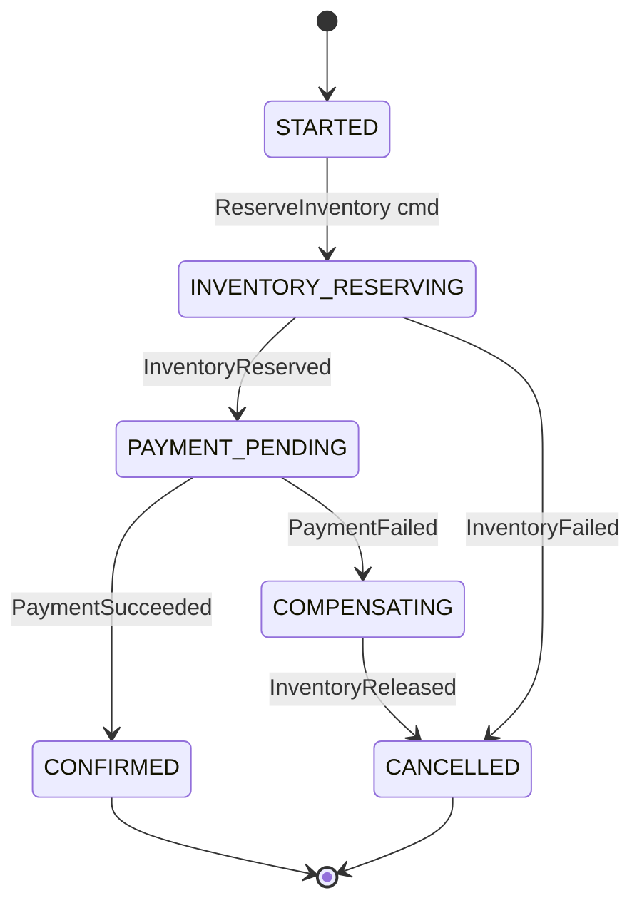
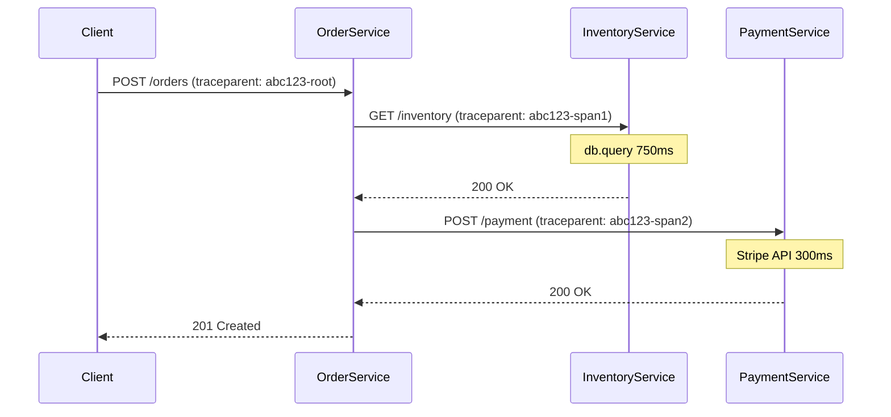
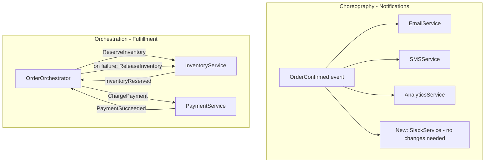
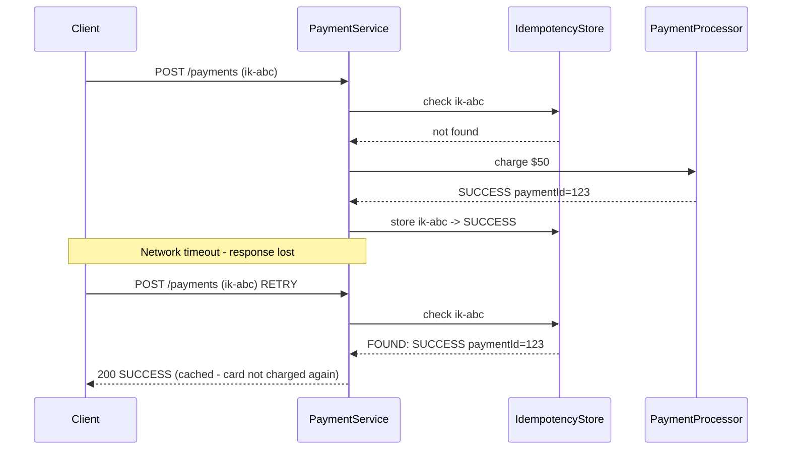
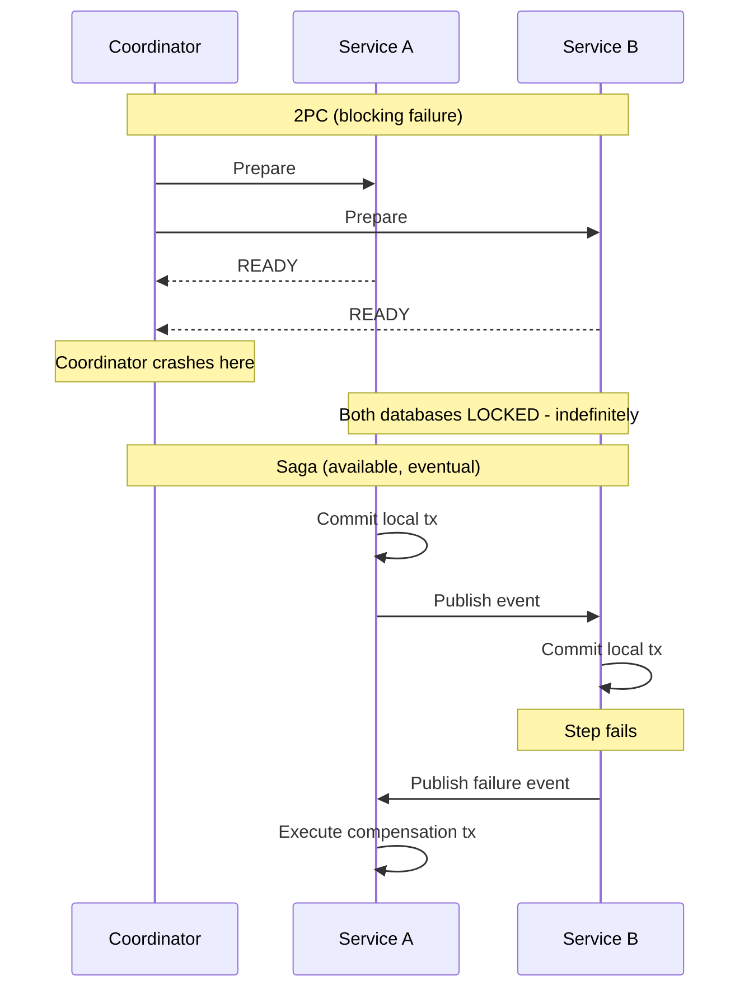

## Keywords in This File

{: .no_toc }

| #   | Keyword                                                            | Weight   |
| --- | ------------------------------------------------------------------ | -------- |
| 1   | [Saga Pattern Implementation](#saga-pattern-implementation)        | critical |
| 2   | [Distributed Tracing with OpenTelemetry](#distributed-tracing-with-opentelemetry) | critical |
| 3   | [Service Choreography vs Orchestration](#service-choreography-vs-orchestration) | high |
| 4   | [Idempotency in Distributed Systems](#idempotency-in-distributed-systems) | critical |
| 5   | [Distributed Transactions and Compensation](#distributed-transactions-and-compensation) | high |

---

# Saga Pattern Implementation

🎯 Interview Weight: critical - the standard answer to
"how do you handle distributed transactions in microservices";
★★★ topic requiring production-level detail on both
choreography and orchestration implementations.

---

### 🎯 Model Answer

**30 seconds:**
> A Saga is a sequence of local database transactions where each
> step publishes an event or sends a command to trigger the next.
> If any step fails, compensating transactions undo the previous
> steps. Two coordination styles: choreography (services react to
> events - no central coordinator) and orchestration (a saga
> coordinator directs each step). Sagas provide eventual consistency
> across services without distributed locking or two-phase commit.

**3 minutes (Senior):**
> The Saga pattern solves the distributed transaction problem in
> microservices. You cannot have an ACID transaction that spans
> multiple services with separate databases. Saga replaces the
> distributed transaction with a sequence of local transactions,
> each atomic within its own service, coordinated by events or
> commands between services.
>
> In choreography, each service publishes an event when it completes
> its step; the next service in the flow subscribes to that event.
> There is no central coordinator. Simple to implement for short
> flows; becomes hard to debug and trace for flows with 4+ steps
> because the flow is implicit in the event subscriptions.
>
> In orchestration, a saga orchestrator (often living in the
> initiating service) tracks the saga state and sends commands
> to each service in sequence. On failure, the orchestrator sends
> compensating commands to undo previous steps. The flow is
> explicit and traceable in one place. My production recommendation:
> orchestration for sagas with more than 3 services or complex
> compensation logic.
>
> The hardest part is compensation: compensating transactions must
> be idempotent (they can be called multiple times safely) and must
> handle the case where the original transaction was only partially
> applied. A compensation for "reserve inventory" must handle: item
> was reserved, item was not reserved (compensate is a no-op), item
> was reserved and partially shipped (partial compensation logic).

**Framework:** WHAT - WHY - HOW - TRADE-OFF - EXAMPLE

*Adapting up:* Staff level - saga isolation problem and countermeasures,
saga state machine persistence for crash recovery, and choosing
saga boundaries correctly based on business transaction semantics.

*Adapting down:* Junior: when an operation across multiple services
fails partway through, we run undo steps to restore consistency.

**Blank Mind Recovery:**

**(1) Restate:** "You are asking how to implement the Saga pattern -
multi-service transactions with compensation."

**(2) First principles:** "No distributed transaction available.
So we chain local transactions. If one fails, we chain
compensating transactions backward."

**(3) Bridge:** "Like a relay race: each runner completes their
leg and hands the baton. If runner 3 drops the baton, runners
2 and 1 run backward to undo their progress."

---

### 📘 Concept Explanation

**What it is:**
A Saga is a sequence of local transactions where each transaction
updates data within a single service and publishes a message or
event to trigger the next local transaction in the saga. On failure,
compensating transactions are executed in reverse order.

**The problem it solves:**
Distributed ACID transactions (two-phase commit) are impractical
in microservices: they require all services to be available
simultaneously, create blocking during the commit phase, and do
not work with most cloud-native databases and messaging systems.
Sagas provide eventual consistency without distributed locking.

**Saga state machine:**
```
ORCHESTRATED SAGA STATE MACHINE:

States: STARTED -> INVENTORY_RESERVING -> PAYMENT_PENDING
     -> CONFIRMED | COMPENSATING -> CANCELLED

HAPPY PATH:
STARTED
  -> send ReserveInventory command
  -> INVENTORY_RESERVING
  -> receive InventoryReserved event
  -> send ChargePayment command
  -> PAYMENT_PENDING
  -> receive PaymentSucceeded event
  -> CONFIRMED

FAILURE PATH (payment failed):
  -> receive PaymentFailed event
  -> COMPENSATING
  -> send ReleaseInventory command
  -> receive InventoryReleased event
  -> CANCELLED

CRASH RECOVERY:
  Orchestrator crashes while in PAYMENT_PENDING
  On restart: query saga state DB
  Find saga in PAYMENT_PENDING for > timeout
  Re-send ChargePayment command (idempotent!)
  OR: begin compensation
```

**Compensation requirements:**
Each forward transaction must have a defined compensating transaction:

| Forward | Compensating |
|---|---|
| Create order (PENDING) | Cancel order |
| Reserve inventory | Release reservation |
| Charge payment | Refund payment |
| Send confirmation email | (pivot - no compensation) |

Pivot transactions: once passed, the saga is committed to completion
(payment charged is often the pivot - you handle failure differently
after this point).

**Saga isolation problem:**
Sagas do NOT provide ACID isolation. Other transactions can read
intermediate saga state (a PENDING order). Countermeasures:
- Semantic lock: mark the resource as LOCKED during saga execution
- Optimistic lock: check expected state before compensating
- Version field: increment version on each state change; detect conflicts

**When to use Saga:**
- Multi-service business transactions requiring consistency
- When the steps can be compensated (not all operations can be undone)
- When eventual consistency is acceptable

**When NOT to use Saga:**
- Single-service operations (use database transactions)
- Operations that cannot be compensated (sending a notification
  cannot be unsent - use best-effort or idempotent design instead)

---

### 💻 Code Example

**BAD - Distributed transaction without saga (fragile):**
```java
@Service
@Transactional
public class OrderService {
    public Order placeOrder(OrderRequest req) {
        // WRONG: This is NOT a distributed transaction
        // @Transactional only covers the ORDER DB
        // If inventoryClient.reserve() succeeds but
        // paymentClient.charge() fails, inventory is
        // reserved but never released - inconsistent state
        Order order = orderRepo.save(new Order(req));
        inventoryClient.reserve(order.getId(),
            req.getItems());          // network call
        paymentClient.charge(order.getId(),
            req.getAmount());         // network call - can fail
        return order;
        // @Transactional rolls back the order DB
        // but cannot roll back the inventory reservation
    }
}
```

> **Code walkthrough:** `@Transactional` only governs the local
> database. Network calls to other services are outside the
> transaction boundary. If paymentClient.charge fails, the order
> DB rolls back but the inventory reservation is already committed
> in InventoryService - no automatic rollback mechanism exists.

**GOOD - Orchestrated saga:**
```java
// Saga State: persisted for crash recovery
@Entity
@Table(name = "order_sagas")
public class OrderSaga {
    @Id Long sagaId;
    @Enumerated(STRING)
    SagaState state;  // STARTED, RESERVING, CHARGING, etc.
    Long orderId;
    @Version Long version;  // Optimistic locking
}

// Saga Orchestrator
@Service
public class OrderSagaOrchestrator {

    @Transactional
    public void startSaga(Long orderId) {
        OrderSaga saga = new OrderSaga(orderId,
            SagaState.STARTED);
        sagaRepo.save(saga);
        // Send command via Kafka (outbox pattern)
        eventPublisher.publishCommand(
            new ReserveInventoryCommand(
                saga.getSagaId(), orderId, getItems(orderId)));
        updateSagaState(saga, SagaState.INVENTORY_RESERVING);
    }

    @KafkaListener(topics = "inventory-reply")
    @Transactional
    public void handleInventoryReply(Object reply) {
        if (reply instanceof InventoryReservedEvent e) {
            OrderSaga saga = sagaRepo
                .findBySagaId(e.getSagaId());
            // Send next command
            eventPublisher.publishCommand(
                new ChargePaymentCommand(
                    saga.getSagaId(), saga.getOrderId(),
                    getAmount(saga.getOrderId())));
            updateSagaState(saga, SagaState.PAYMENT_PENDING);

        } else if (reply instanceof InventoryFailedEvent e) {
            // Begin compensation immediately
            OrderSaga saga = sagaRepo
                .findBySagaId(e.getSagaId());
            cancelOrder(saga.getOrderId());
            updateSagaState(saga, SagaState.CANCELLED);
        }
    }

    @KafkaListener(topics = "payment-reply")
    @Transactional
    public void handlePaymentReply(Object reply) {
        if (reply instanceof PaymentSucceededEvent e) {
            OrderSaga saga = sagaRepo
                .findBySagaId(e.getSagaId());
            confirmOrder(saga.getOrderId());
            updateSagaState(saga, SagaState.CONFIRMED);

        } else if (reply instanceof PaymentFailedEvent e) {
            // Compensate: release inventory
            OrderSaga saga = sagaRepo
                .findBySagaId(e.getSagaId());
            eventPublisher.publishCommand(
                new ReleaseInventoryCommand(saga.getSagaId(),
                    saga.getOrderId()));
            updateSagaState(saga, SagaState.COMPENSATING);
        }
    }

    @KafkaListener(topics = "inventory-compensate-reply")
    @Transactional
    public void handleCompensationReply(Object reply) {
        if (reply instanceof InventoryReleasedEvent e) {
            OrderSaga saga = sagaRepo
                .findBySagaId(e.getSagaId());
            cancelOrder(saga.getOrderId());
            updateSagaState(saga, SagaState.CANCELLED);
        }
    }

    // Scheduled: find stuck sagas and time them out
    @Scheduled(fixedDelay = 60_000)
    public void timeoutStuckSagas() {
        List<OrderSaga> stuck = sagaRepo
            .findByStateNotInAndCreatedAtBefore(
                List.of(SagaState.CONFIRMED, SagaState.CANCELLED),
                Instant.now().minus(Duration.ofMinutes(10)));
        stuck.forEach(saga -> {
            log.warn("Saga {} stuck in {}, beginning compensation",
                saga.getSagaId(), saga.getState());
            beginCompensation(saga);
        });
    }
}
```

> **Code walkthrough:** The orchestrator persists saga state after
> every step - crash recovery works by reading the saga state table
> on restart. Each reply handler is `@Transactional`: it updates
> the saga state and publishes the next command atomically. The
> timeout scheduler ensures sagas that get no response are eventually
> compensated. This is the minimal production-safe saga implementation.

---

### 🎓 Answers by Seniority

**Junior / Mid (0-5 years):**
> A saga is a way to keep data consistent across multiple services
> when each service has its own database. You break the operation into
> steps, each handled by one service. If a step fails, you run
> compensation steps to undo the previous ones. Choreography uses
> events; orchestration uses a coordinator. I understand orchestration
> is easier to debug.

*Push deeper:* Ask about what makes a good compensation transaction.

---

**Senior / Staff (5+ years):**
> The Saga pattern is the right answer for multi-service data
> consistency, but it is often underestimated in complexity. Two
> production realities: (1) the saga orchestrator must persist its
> state and handle crash recovery - an in-memory state machine fails
> on restart and leaves sagas in limbo. (2) Compensating transactions
> must be idempotent - the saga may send the same compensation command
> multiple times if it does not receive an acknowledgment. The hardest
> part is the pivot transaction: once the payment is charged, you
> cannot compensate by simply undoing the charge in all cases -
> some payments have a 24-hour settlement delay. Design the pivot
> carefully. My default: orchestration with persisted state machine,
> per-step idempotency keys, and a 10-minute timeout with automated
> compensation.

*Push deeper:* Discuss the saga isolation problem and semantic locks.

---

### ⚠️ Common Misconceptions

**Misconception 1: "Sagas provide ACID transactions across services."**
Sagas provide eventual consistency with explicit compensation.
They explicitly do NOT provide isolation: intermediate saga states
are visible to other transactions. A PENDING order can be read by
other services during the saga. Countermeasures (semantic locks)
must be explicitly designed.

**Misconception 2: "Choreography is always better because it's
more decoupled."**
Choreography distributes the saga logic across many services and
event subscriptions. Debugging a failed saga requires tracing
events across all participating services. For complex flows (4+
services), the operational complexity of choreography exceeds
the benefit of decoupling. Orchestration is more practical for
complex sagas.

**Misconception 3: "Compensation always fully undoes the original."**
Some operations are not reversible (a sent email, a webhook delivered).
For irreversible steps, the compensation is a best-effort notification
(email: "your order was cancelled") not a technical undo. Design
sagas with the reversibility of each step in mind.

---

### 🚨 Failure Modes and Diagnosis

**Failure: Saga stuck in COMPENSATING state**
Symptom: Orders stuck as CANCELLING for hours; inventory
neither reserved nor released cleanly.
Diagnosis: Check saga state table; check if compensation commands
are being consumed by InventoryService; check DLT for failed
compensation events.
Fix: Replay the compensation command from the saga orchestrator;
ensure compensation handlers are idempotent.

**Failure: Duplicate saga started for the same order**
Symptom: Inventory reserved twice; two saga records for same orderId.
Diagnosis: Missing idempotency key on saga creation; the saga
start event was delivered twice.
Fix: Add unique constraint on (orderId, sagaType) in saga state table.

---

### 🎯 Interview Deep-Dive

**Timing:** Hard - 15 min target

| Category | Questions |
|---|---|
| Definition | 2 |
| Mechanism | 2 |
| Comparison | 2 |
| Scenario | 2 |
| Debugging | 2 |
| Deep Dive | 1 |
| Misconception | 1 |

**Definition:**

Q: "What is a saga and why is it needed in microservices?"

A: A saga is a pattern for managing data consistency across
multiple microservices when each service owns its database and
no distributed transaction is available. It decomposes a multi-
service operation into a sequence of local transactions. Each
local transaction commits atomically within its service and
publishes an event or command to trigger the next step. If any
step fails, the saga executes compensating transactions in reverse
order to undo the completed steps. Sagas replace distributed
two-phase commit (which is blocking, fragile, and incompatible
with most cloud services) with eventual consistency through
explicit compensation.

*What separates good from great:* Know precisely why 2PC is
not the answer: the blocking commit phase creates availability
problems, and most cloud-native services (DynamoDB, Kafka) do
not support XA transactions.

---

Q: "What is a compensating transaction?"

A: A compensating transaction is a new forward transaction that
undoes the business effect of a previously committed local
transaction. It is not a database rollback (the original
transaction already committed). It must be explicitly designed
and implemented. Compensation is idempotent: if it runs twice,
the result is the same as running it once. Example: if step 2
was "reserve 5 units of SKU-123 for order-456," the compensation
is "release the 5-unit reservation for order-456." Compensation
handles edge cases: if the reservation does not exist (perhaps
the original step failed before persisting), the compensation
is a no-op. If the inventory has already been partially shipped,
a partial compensation is needed.

*What separates good from great:* Know that not every operation
can be compensated. A sent email cannot be unsent. Sagas should
be designed with compensability in mind: put irreversible steps
(send email) at the end of the saga (after the pivot transaction),
not in the middle.

---

**Mechanism:**

Q: "How does an orchestrated saga survive a crash?"

A: The saga orchestrator persists its state after every step
in its own database (saga state table). The state records: which
saga, current step, saga input data, and all step outcomes. On
crash, the orchestrator restarts and reads the saga state table.
Sagas in non-terminal states (not CONFIRMED or CANCELLED) are
resumed: the orchestrator re-sends the last command (idempotent)
and continues processing. Without persisted state, a crash leaves
sagas in an unknown state with no recovery path. The implementation:
each step handler is `@Transactional` - it reads the current state,
publishes the next command (via outbox), and writes the new state
in one atomic database operation. Crash between state write and
command publish: the outbox publisher retries the command. Crash
after the command publish but before the reply is processed: the
timeout scheduler detects the stuck saga and retries.

*What separates good from great:* Know the outbox pattern's role
in the saga: it makes the state transition + command publish atomic,
which is the foundation of crash-safe saga execution.

---

Q: "What is the saga isolation problem and how do you address it?"

A: ACID isolation means a transaction's intermediate state is
invisible to other transactions until it commits. Sagas do not
provide this. Each local transaction commits immediately; other
transactions can read the intermediate saga state. Example: an
order saga is in PAYMENT_PENDING state. Another service queries
orders and sees this PENDING order. If it acts on this order
(e.g., ships it), and the payment then fails and the saga
cancels the order, the system has shipped an order that was
cancelled. Countermeasures: (1) Semantic lock: the saga marks
resources as LOCKED when the saga starts; other operations
check for the lock before proceeding. (2) Re-read on compensation:
before compensating, re-read the resource state to check if it
was acted on (detect anomalies). (3) Version field: on compensation,
use optimistic locking to detect concurrent modifications.

*What separates good from great:* Know that semantic locks
are the most common mitigation: mark an order as PROCESSING
(not available for fulfilment) during the saga, only transition
to CONFIRMED when the saga completes.

---

**Comparison:**

Q: "Choreography vs. orchestration for a 5-service saga. Which
do you choose and why?"

A: For a 5-service saga, I choose orchestration. Reasons: (1)
Debuggability: when a saga fails, the orchestrator's state table
shows exactly which step failed and the full compensation history.
In choreography, you trace across 5 services' event logs. (2)
Compensation clarity: compensation logic lives in the orchestrator's
failure handlers. In choreography, each service must know when
to compensate, leading to complex event patterns ("if I receive
OrderFailed and I previously received InventoryReserved, I need
to release"). (3) Observability: the orchestrator's state machine
can expose a dashboard showing all in-flight sagas, their current
step, and history. The cost of orchestration: the orchestrator
is a potential bottleneck (mitigated by horizontal scaling of the
orchestrator) and a single point of failure (mitigated by persisted
state - any instance can process any saga).

*What separates good from great:* Know the practical threshold:
2-service flows can use choreography cleanly; 3+ services benefit
from orchestration's explicit flow and compensation.

---

Q: "How do you design sagas to be idempotent at every step?"

A: Each command sent by the saga must carry a unique idempotency
key (e.g., sagaId + stepId). Each receiving service checks if
it has already processed that key before executing the step.
Example: ReserveInventoryCommand carries `idempotencyKey =
"saga-456-step-1"`. InventoryService checks the processed_commands
table for this key. If found, return the previous result (success
or failure) without re-executing. If not found, execute and record
the key atomically (in the same transaction). This handles the
most common saga failure mode: the orchestrator does not receive
the reply (network partition) and re-sends the command. The second
send is idempotent.

*What separates good from great:* Know that idempotency is required
at every step - both forward steps and compensation steps. A
compensation command may be re-sent if the orchestrator crashes
between sending and receiving the compensation acknowledgment.

---

**Scenario:**

Q: "Design a saga for booking a flight + hotel + car rental that
must all succeed or all be released."

A: Orchestrated saga. Step 1: Create booking in PENDING state.
Step 2: Command FlightService to reserve seat (ReserveFlight).
Wait for FlightReserved or FlightFailed. Step 3: If flight reserved,
command HotelService to reserve room (ReserveHotel). Wait for
result. Step 4: If hotel reserved, command CarService to reserve
car (ReserveCar). Wait for result. Step 5: If all succeed, confirm
all reservations (send ConfirmFlight, ConfirmHotel, ConfirmCar
commands atomically). Compensation path: if any step fails,
release all previously reserved services in reverse order.
The hardest design decision: the pivot transaction is
"all confirmed" - before that point, all reservations are holds,
not final bookings. After the pivot, we are committed.

*What separates good from great:* Identify the pivot transaction
explicitly: reservations are holds (compensatable); final booking
confirmations are the pivot (compensation after this = cancellation
with possible fee).

---

Q: "Your order sagas are completing in 200ms normally but some
take 10+ minutes and timeout. How do you investigate?"

A: Step 1: Query the saga state table for the slow sagas.
What state are they stuck in? INVENTORY_RESERVING or PAYMENT_PENDING?
Step 2: Find the stuck saga's sagaId and trace in Kafka:
was the command published? Has the receiving service consumed it?
Check consumer group lag. Step 3: If the command was published
but not consumed: InventoryService may be down or consuming a DLT.
Check InventoryService health and Kafka lag. Step 4: If the
command was consumed but no reply: check InventoryService logs for
that specific orderId. Was there an exception? Did it crash before
publishing the reply? Step 5: Add distributed tracing to the saga
commands and replies (propagate traceId in command headers) so
you can trace a specific saga end-to-end.

*What separates good from great:* Know that saga timeout investigation
requires tracing the specific sagaId from command publication through
consumer processing through reply publication - a trace ID propagated
through all saga messages makes this feasible.

---

**Debugging:**

Q: "Two inventory reservations for the same orderId appeared.
How did this happen and how do you fix the data?"

A: Duplicate reservation is caused by a duplicate saga execution.
Root cause candidates: (1) The saga start event was delivered
twice (Kafka at-least-once delivery). If the saga creation
handler was not idempotent, a second saga was created for the
same order. (2) The orchestrator crashed after sending
ReserveInventory but before recording the saga state update.
On restart, it re-sent the command. If InventoryService was not
idempotent, it processed the command twice.
Fix the data: query the reservations table for the orderId; the
second reservation is the duplicate. Release it via the
InventoryService compensation API.
Fix the root cause: (1) Add unique constraint on (orderId, sagaType)
in the saga state table. (2) Add idempotency key to ReserveInventory
command; InventoryService deduplicates by key.

*What separates good from great:* Know both root causes and fix both:
saga creation idempotency AND per-step command idempotency.

---

Q: "The saga compensation failed to release an inventory reservation.
The order is cancelled but inventory is stuck as reserved. How do
you investigate and fix?"

A: Step 1: Find the saga record for the affected orderId.
Check the saga state: is it COMPENSATING or CANCELLED?
Step 2: Check if the ReleaseInventory compensation command was
published (check outbox table). Step 3: If published, check
InventoryService's compensation consumer logs for that sagaId.
Was there an exception? Check DLT. Step 4: If the compensation
was never published: the orchestrator crashed between setting
state to COMPENSATING and publishing the command. Recovery:
query sagas in COMPENSATING state with no recent activity and
re-send the compensation command. Step 5: Fix the stuck reservation
manually: call InventoryService release API with the sagaId.
Long-term fix: add a reconciliation job that finds orders in
CANCELLED state with unreleased reservations and auto-compensates.

*What separates good from great:* Know the reconciliation job as
the safety net. Sagas handle the normal flow; reconciliation
handles the edge cases that slip through.

---

**Deep Dive:**

Q: "How do you handle the case where a compensating transaction
also fails?"

A: This is the partial compensation problem - the hardest saga
edge case. Step 1: The compensation must be idempotent and retried.
If the compensation for "release inventory" fails because
InventoryService is temporarily down, retry with exponential
backoff until it succeeds. Step 2: If the compensation fails
permanently (e.g., InventoryService data was corrupted), escalate
to manual intervention: write to a saga_alerts table and alert
operations. Step 3: Never mark the saga as CANCELLED until all
compensations complete successfully. A saga stuck in COMPENSATING
is preferable to silently leaving the system inconsistent. Step 4:
In extreme cases (compensation timeout), apply an idempotent
fallback: for inventory, a scheduled job reconciles pending
reservations against confirmed orders and releases orphans.
The principle: prefer stuck (visible, actionable) over silently
inconsistent (invisible, dangerous).

*What separates good from great:* Know the escalation path and
the preference for "stuck and visible" over "silently inconsistent."

---

**Misconception / Trap:**

Q: "Choreography-based sagas are more resilient because there is
no single point of failure (no coordinator)."

A: True for availability - no coordinator SPOF. But "more resilient"
is misleading. Choreography creates hidden dependencies: the saga
flow depends on every service publishing the correct events in the
correct format. A schema change in one service's event silently
breaks the saga flow. A service that fails to publish an event
(due to a bug) leaves the saga incomplete indefinitely, with no
orchestrator to detect or compensate. In choreography, there is
no single component that knows the saga is stuck. In orchestration,
the orchestrator's timeout scheduler detects stuck sagas and
compensates. Choreography trades the coordinator SPOF for
distributed observability complexity. For production systems,
orchestration's explicit flow and built-in timeout/compensation
is operationally superior despite the coordinator being a component
to maintain.

*What separates good from great:* Know the operational trade-off
precisely: choreography has better theoretical availability but
worse observability and debuggability. Most production teams choose
orchestration.

---

### ⚖️ Comparison Table

| Approach | Coordinator | Failure Visibility | Debugging | When to Choose |
|---|---|---|---|---|
| **Orchestration** | Central (saga state DB) | Explicit (state machine) | Excellent (one place) | 3+ services, complex compensation |
| Choreography | None | Implicit (event tracing) | Hard (distributed trace) | 2-service, simple flows |
| 2PC/XA | Transaction manager | Explicit | Medium | Avoid in microservices |
| Manual (hope) | None | None | Impossible | Never |

**The deciding factor:** How many services in the saga? How complex
is the compensation? Orchestration scales; choreography does not.

---

### 🏛️ System Design

*(Conditional: ★★★ - include full design.)*

**6-step framework:**
Step 1 CLARIFY - Which business operations span multiple services?
What is the compensation requirement for each step?

Step 2 ESTIMATE - How many sagas per second? Is the orchestrator
a throughput bottleneck?

Step 3 DESIGN - Orchestrated saga with persisted state machine.
Outbox pattern for all command publications.

Step 4 DEEP DIVE - Idempotency keys per step. Timeout scheduler
for stuck sagas. Reconciliation job as safety net.

Step 5 ALTS - Considered 2PC. Rejected: blocking, incompatible.
Considered choreography. Rejected for 5-service flow: debugging complexity.

Step 6 EVOLVE - At scale: the saga state table becomes large.
Archive completed sagas after 90 days to cold storage.

---

### 📊 Diagram

*(Conditional: ★★★ - required.)*

```
ORCHESTRATED SAGA - HAPPY PATH:
[OrderOrchestrator]
  |--1. save Order(PENDING)
  |--2. --> ReserveInventory (Kafka)
  |                 |
  |         [InventoryService]
  |                 |--reserve()
  |                 |--publish InventoryReserved
  |<--3. InventoryReserved
  |--4. --> ChargePayment (Kafka)
  |                 |
  |         [PaymentService]
  |                 |--charge()
  |                 |--publish PaymentSucceeded
  |<--5. PaymentSucceeded
  |--6. Order(CONFIRMED)
```



> **Diagram walkthrough:** The state machine persists after every
> transition. Crash recovery reads the current state and re-sends
> the last command. The COMPENSATING state makes the compensation
> path explicit - the orchestrator knows exactly what compensation
> is in progress. The terminal states (CONFIRMED, CANCELLED) end
> the saga lifecycle.

---

---

# Distributed Tracing with OpenTelemetry

🎯 Interview Weight: critical - production microservices
debugging knowledge; expected at senior+; direct correlation
to real on-call incident investigation.

---

### 🎯 Model Answer

**30 seconds:**
> Distributed tracing tracks a single request as it flows through
> multiple services. Each service adds a span to the trace,
> recording its portion of the work. OpenTelemetry is the
> vendor-neutral standard for instrumentation - you instrument
> once, send to any backend (Jaeger, Zipkin, Tempo, Datadog).
> The key mechanism: a trace ID propagated through all service
> calls in headers. Without tracing, debugging latency across
> 10 services is nearly impossible.

**3 minutes (Senior):**
> In a monolith, a slow request shows up in one profiler. In
> a microservices system, a 2-second order placement might spend
> 200ms in OrderService, 800ms in InventoryService, and 1 second
> in PaymentService. Without distributed tracing, you would need
> to search logs across three services, correlate by timestamp,
> and guess which service is the bottleneck.
>
> Distributed tracing solves this. A trace represents one end-to-
> end request. Each service creates a span (a named, timed unit
> of work within the service), which is a child of the calling
> service's span. Together they form a trace tree. The trace ID
> is propagated in HTTP headers (W3C Trace Context standard:
> `traceparent` header) or Kafka message headers.
>
> OpenTelemetry is the CNCF standard: a unified API, SDK, and
> protocol (OTLP) for traces, metrics, and logs. You instrument
> your Java application once with the OpenTelemetry SDK; the
> OTel Collector receives the data and forwards to any backend
> (Jaeger for traces, Prometheus for metrics). No vendor lock-in.
>
> Spring Boot auto-configures OpenTelemetry tracing with the
> Micrometer Tracing + OTel bridge: just add the dependency and
> Spring propagates trace context automatically for HTTP calls,
> Kafka messages, and database queries.

**Framework:** WHAT - WHY - HOW - TRADE-OFF - EXAMPLE

*Adapting up:* Staff level - sampling strategy (rate-based vs.
tail sampling), trace context in async/event-driven flows, and
the cost of high-volume tracing on backend storage.

*Adapting down:* Junior: distributed tracing is a way to see
the whole journey of a request across all services on one
timeline.

**Blank Mind Recovery:**

**(1) Restate:** "You are asking about distributed tracing -
how to track a request across multiple services."

**(2) First principles:** "A request touches many services.
To understand its path and timing, you need a way to link
the service-specific logs and measurements together."

**(3) Bridge:** "Like a FedEx tracking number: one ID that
shows every stop in the delivery chain, the time at each stop,
and where delays occurred."

---

### 📘 Concept Explanation

**What it is:**
Distributed tracing is an observability technique that tracks
a request as it propagates through multiple services, building
a tree of spans that together represent the full request lifetime.
OpenTelemetry (OTel) is the CNCF standard for distributed tracing,
metrics, and logs instrumentation.

**Core concepts:**
```
TRACE ANATOMY:

Trace ID: abc123 (unique per end-to-end request)
Root Span: "POST /orders" (OrderService)
  |-- Span: "inventory.check" (InventoryService)
  |       |-- Span: "db.query" (inventory_db)
  |-- Span: "payment.charge" (PaymentService)
  |       |-- Span: "stripe.api.call" (external)
  |-- Span: "order.save" (orders_db)

Timeline:
|--OrderService (total 1200ms)--|
    |--Inventory (800ms)--|
        |--DB query (750ms)--|   <- SLOW - identified!
    |--Payment (350ms)--|
    |--Order save (20ms)--|
```

**OpenTelemetry components:**
- API: language-specific interface (trace, span, attributes)
- SDK: implementation of the API (sampler, exporter, processor)
- Instrumentation libraries: auto-instrument frameworks (Spring,
  JDBC, Kafka) with zero code changes
- OTel Collector: receives, processes, and exports telemetry
- OTLP: OpenTelemetry Protocol (gRPC or HTTP/JSON)

**Context propagation:**
```
HTTP (W3C Trace Context):
GET /inventory/check
traceparent: 00-abc123-def456-01
             ^  ^       ^       ^
             version traceId spanId flags

Kafka (header propagation):
Headers: {"traceparent": "00-abc123-789abc-01"}
         {"tracestate": "..."}

If a service fails to propagate the trace context:
  -> Trace breaks at that service
  -> Cannot correlate spans before and after the break
  -> This is the #1 tracing implementation mistake
```

**Sampling strategies:**
- Head-based: sample decision made at trace start (1% of traces)
  - Simple; misses interesting long-tail requests
- Tail-based: sample decision made at trace end (keep slow traces)
  - Captures performance outliers; requires buffering all spans
- Adaptive: dynamically adjust sample rate based on load

**When to use it:**
- Always in microservices production environments
- Essential for latency diagnosis across service boundaries
- Performance optimization: identify which service and which
  operation is the bottleneck

---

### 💻 Code Example

**Spring Boot + OpenTelemetry setup:**
```xml
<!-- pom.xml dependencies -->
<dependency>
  <groupId>io.micrometer</groupId>
  <artifactId>micrometer-tracing-bridge-otel</artifactId>
</dependency>
<dependency>
  <groupId>io.opentelemetry</groupId>
  <artifactId>opentelemetry-exporter-otlp</artifactId>
</dependency>
<!-- Auto-instruments Spring MVC, WebClient,
     JDBC, Kafka with zero code changes -->
<dependency>
  <groupId>io.opentelemetry.instrumentation</groupId>
  <artifactId>opentelemetry-spring-boot-starter</artifactId>
</dependency>
```

```yaml
# application.yml
management:
  tracing:
    sampling:
      probability: 0.1  # Sample 10% of traces
otel:
  service:
    name: order-service
  exporter:
    otlp:
      endpoint: http://otel-collector:4317
```

```java
// Auto-instrumentation handles HTTP + DB + Kafka tracing
// Manual spans for business-critical operations:
@Service
public class OrderService {
    private final Tracer tracer;

    public Order placeOrder(OrderRequest req) {
        // Create child span for business operation
        Span span = tracer.spanBuilder("order.validate")
            .setSpanKind(SpanKind.INTERNAL)
            .startSpan();

        try (Scope scope = span.makeCurrent()) {
            // Add business context as span attributes
            span.setAttribute("order.userId",
                req.getUserId());
            span.setAttribute("order.itemCount",
                req.getItems().size());
            span.setAttribute("order.totalAmount",
                req.getTotalAmount().doubleValue());

            validateOrder(req);  // throws if invalid

            return orderRepository.save(new Order(req));

        } catch (Exception e) {
            // Record exception in the span
            span.recordException(e);
            span.setStatus(StatusCode.ERROR, e.getMessage());
            throw e;
        } finally {
            span.end();
        }
    }
}

// Kafka trace context propagation (explicit when needed):
@Service
public class EventPublisher {
    public void publishWithTrace(String topic, Object event) {
        ProducerRecord<String, Object> record =
            new ProducerRecord<>(topic, event);

        // Inject trace context into Kafka headers
        // (OpenTelemetry Kafka auto-instrumentation does
        // this automatically - manual only if not using it)
        W3CTraceContextPropagator.getInstance().inject(
            Context.current(),
            record.headers(),
            (headers, key, value) ->
                headers.add(key, value.getBytes(UTF_8)));

        kafkaTemplate.send(record);
    }
}
```

> **Code walkthrough:** The Spring Boot starter auto-instruments
> HTTP requests, database calls, and Kafka produces/consumes.
> The application.yml sets a 10% sample rate (sufficient for
> most production loads). Manual spans add business context
> (order amounts, user IDs) that is not captured by
> auto-instrumentation. Exceptions are recorded in the span
> with status ERROR so they are visible in the trace UI.

**Querying traces in Jaeger:**
```bash
# Find slow traces for the order creation API:
# In Jaeger UI: Service=order-service,
#   Operation=POST /orders, Min Duration=1s

# Find traces containing errors:
# Tag filter: error=true

# Correlate trace ID from log:
# Log line: "traceId=abc123 orderId=456 ERROR validation failed"
# In Jaeger: search by traceId=abc123
# Entire request tree visible instantly

# Command line (Jaeger API):
curl "http://jaeger:16686/api/traces?service=order-service\
&tags=error%3Dtrue&limit=20"
```

> **Code walkthrough:** The Jaeger UI query demonstrates the
> primary debugging workflow: find the traceId in logs, look up
> the full trace in Jaeger to see which span is slow or erroring.
> The trace view shows all services involved, timing of each span,
> and any recorded exceptions - replacing the need to correlate
> logs across services manually.

---

### 🎓 Answers by Seniority

**Junior / Mid (0-5 years):**
> Distributed tracing links all the service calls for one request
> together using a trace ID. OpenTelemetry is the standard library
> for adding tracing to services. A trace shows a timeline of
> every service that handled the request and how long each took.
> When debugging latency, I look up the trace ID (from logs)
> in Jaeger or Zipkin and see which service or database query
> is slow.

*Push deeper:* Explain context propagation - how the trace ID
gets from OrderService to InventoryService.

---

**Senior / Staff (5+ years):**
> Distributed tracing is the most essential observability tool
> for microservices. The key discipline: trace context must be
> propagated everywhere - HTTP calls, Kafka messages, async tasks.
> A break in propagation creates orphaned traces that cannot be
> correlated. With Spring Boot and the OTel starter, most
> propagation is automatic; the gaps are: custom thread pool
> tasks, direct Kafka producer calls without the OTel Kafka
> instrumentation, and gRPC calls without the OTel gRPC
> instrumentation. For sampling: head-based 10% for normal traffic;
> tail-based sampling to always capture error and slow traces
> (Grafana Tempo supports tail-based). At scale, trace storage
> cost is significant - tail-based sampling + index-only retention
> for old traces.

*Push deeper:* Discuss trace context baggage and the difference
between trace context propagation and baggage propagation.

---

### ⚠️ Common Misconceptions

**Misconception 1: "Distributed tracing replaces logging."**
Tracing and logging complement each other. Logs contain
detailed per-service context; traces show the cross-service
request flow and timing. Best practice: include the traceId
in every log line so logs and traces are correlated.

**Misconception 2: "100% sampling in production is fine."**
At high volume, 100% sampling generates enormous data volumes.
A 10K req/sec service with 10ms average trace duration generates
hundreds of GB of trace data per day. Head-based sampling at
1-10% is sufficient for latency analysis; tail-based sampling
captures the important outliers.

**Misconception 3: "OpenTelemetry is just for Java."**
OpenTelemetry has SDKs for 11+ languages (Java, Go, Python,
JavaScript, .NET, Ruby, etc.) and is the CNCF standard. All
language SDKs produce the same OTLP format and work with the
same backends.

---

### 🚨 Failure Modes and Diagnosis

**Failure: Orphaned spans (broken trace context)**
Symptom: Jaeger shows single-span traces; no cross-service spans.
Or: spans from ServiceA but no spans from ServiceB in the same request.
Diagnosis: Check if `traceparent` header is present in outgoing
HTTP requests from ServiceA. Check if Kafka consumer in ServiceB
extracts the header and restores the trace context.
Fix: Enable OTel auto-instrumentation for the specific framework
(WebClient, Feign, Kafka) that is not propagating.

**Failure: High trace storage cost**
Symptom: Jaeger backend storage growing 100GB/day.
Diagnosis: Check the sampling rate configuration.
Fix: Reduce to head-based sampling at 1%; add tail-based
sampling to retain slow (>500ms) and error traces.

---

### 🎯 Interview Deep-Dive

**Timing:** Hard - 15 min target

| Category | Questions |
|---|---|
| Definition | 2 |
| Mechanism | 2 |
| Comparison | 1 |
| Scenario | 3 |
| Debugging | 2 |
| Deep Dive | 1 |
| Misconception | 1 |

**Definition:**

Q: "What is distributed tracing and what problem does it solve?"

A: Distributed tracing tracks a single end-to-end request as it
flows through multiple services, building a tree of spans that
each represent a unit of work within a service. The problem it
solves: in a microservices system, a single user action may touch
10 services. When that action is slow or fails, you need to know
which service, which operation, and how long each step took.
Without tracing, you search logs in each service individually,
correlated only by timestamp - imprecise and slow. With tracing,
one trace ID links all the spans together into a visual timeline.
You open Jaeger, search by trace ID, and see the full picture
in seconds.

*What separates good from great:* Quantify the value: "A trace
that took 2s to debug used to take 30 minutes of log correlation
across 5 services."

---

Q: "What is OpenTelemetry and how does it differ from Zipkin or Jaeger?"

A: OpenTelemetry (OTel) is a CNCF standard that provides APIs,
SDKs, and data formats for collecting distributed telemetry -
traces, metrics, and logs. It is the instrumentation layer: you
add OTel to your application, and it collects the data. Zipkin
and Jaeger are backends - storage and visualization systems for
trace data. OTel exports to either (and to Datadog, Grafana Tempo,
AWS X-Ray, etc.) via OTLP (OpenTelemetry Protocol). Before OTel,
you had to choose your backend first and instrument with that
backend's library. If you later switched backends, you
re-instrumented. With OTel: instrument once with the standard API,
switch backends by changing the exporter configuration. OTel
replaces Zipkin's Brave library and Jaeger's client libraries.

*What separates good from great:* Know the OTel Collector:
it sits between your services and the backend, receiving OTLP
and routing to multiple backends simultaneously. You can send
to Jaeger and Datadog at the same time.

---

**Mechanism:**

Q: "How does trace context propagate across HTTP service calls?"

A: The W3C Trace Context standard defines two HTTP headers:
`traceparent` and `tracestate`. `traceparent` carries the core
context: version byte, trace ID (16 bytes, 32 hex chars), parent
span ID (8 bytes), and flags (sampling decision). Format:
`00-4bf92f3577b34da6a3ce929d0e0e4736-00f067aa0ba902b7-01`.
The receiving service parses this header, creates a new child span
with the extracted trace and parent span IDs, and sets the
`traceparent` header on its own outgoing calls with the new span ID.
OpenTelemetry auto-instrumentation handles this automatically for
Spring WebClient, RestTemplate, Feign, Kafka, and gRPC. Manual
HTTP clients require explicit header injection.

*What separates good from great:* Know the `traceparent` format
by components (trace ID + parent span ID) and know that the
sampling flag in traceparent (`-01`) tells downstream services
whether to sample this trace, preventing inconsistent sampling
decisions across services.

---

Q: "How do you propagate trace context through Kafka messages?"

A: Kafka does not have built-in trace context support. Context
is propagated via Kafka message headers. The producer injects
the W3C `traceparent` header into the Kafka record headers.
The consumer extracts the header and restores the trace context
before processing. OpenTelemetry's Kafka instrumentation
(spring-kafka with OTel auto-instrumentation) handles this
automatically for Spring Kafka listeners. Without OTel's
Kafka instrumentation, context is lost at every Kafka boundary
and traces are fragmented. Manual implementation: the producer
calls `W3CTraceContextPropagator.inject()` on the record headers;
the consumer calls `W3CTraceContextPropagator.extract()` before
processing.

*What separates good from great:* Know that Kafka is an async
boundary - the trace context is technically a new trace on the
consumer side. OTel models this as a linked span rather than a
child span, to reflect that consumer processing may happen long
after production.

---

**Comparison:**

Q: "OpenTelemetry vs. Spring Cloud Sleuth - what is the difference?"

A: Spring Cloud Sleuth was Spring's tracing instrumentation library,
built on Brave (Zipkin's library). It auto-instrumented Spring
components for Zipkin-format traces. It has been superseded by
Micrometer Tracing + OpenTelemetry bridge in Spring Boot 3+.
The difference: Sleuth was Spring-specific and Zipkin-centric.
OTel is language-agnostic (works across Java, Go, Python) and
backend-agnostic (Jaeger, Datadog, Tempo, etc.). For new
Spring Boot 3 applications: use the spring-boot-starter-actuator
with micrometer-tracing-bridge-otel. For Spring Boot 2: use
Spring Cloud Sleuth with the OTel bridge. Spring Cloud Sleuth is
no longer maintained.

*What separates good from great:* Know the migration path: Sleuth
users on Spring Boot 3 should migrate to Micrometer Tracing.
The API is similar; the exporter destination can be OTel Collector.

---

**Scenario:**

Q: "An order placement takes 3 seconds. How do you use distributed
tracing to find the bottleneck?"

A: Step 1: Find a trace for a slow order. In Jaeger: filter by
service=order-service, operation=POST /orders, min duration=2s.
Step 2: Open the trace. The waterfall view shows all spans as a
Gantt chart. The longest span is the bottleneck. Step 3: Example
finding: inventory.reserve span is 2.4 seconds. Most of that is
in a db.query span within InventoryService: a query for available
stock. Step 4: Look at the span attributes: the db.statement
attribute shows the SQL query. It is a full table scan without
an index. Step 5: Add the missing index; verify by comparing the
P95 trace duration before and after the change.

*What separates good from great:* Know the specific OTel semantic
conventions for database spans: `db.statement` contains the SQL
query (when safe to log), `db.operation` is the SQL verb,
`db.system` is the database type.

---

Q: "A request fails intermittently with a 500 error. How do you
use tracing to identify the root cause?"

A: Step 1: Find traces with the error tag in Jaeger: filter by
`error=true` and the service. Step 2: Open an errored trace.
The span with the error has a red indicator in the waterfall.
Step 3: Expand the errored span to see the recorded exception:
OTel records `exception.type`, `exception.message`, and
`exception.stacktrace` as span events. Step 4: If the error is
in a downstream service, the trace shows that the span for the
downstream call has the error - pinpointing which service failed.
Step 5: Use the traceId from the trace to find the detailed logs
in the logging system (Loki, CloudWatch): `traceId=abc123 level=ERROR`.
The logs contain the full stack trace.

*What separates good from great:* Know the OTel span event model
for exceptions: `span.recordException(e)` + `span.setStatus(ERROR)`
makes the exception visible in the trace UI without requiring log
correlation.

---

Q: "Describe how you would set up distributed tracing for a new
microservices system from scratch."

A: Architecture: OTel SDK in each service -> OTel Collector
(deployed as a DaemonSet in Kubernetes) -> Jaeger (for development/
staging) + Grafana Tempo (for production at scale). Implementation:
(1) Add opentelemetry-spring-boot-starter to each service. (2)
Set service.name attribute in application.yml. (3) Set exporter
to OTel Collector endpoint. (4) Set sampling rate: 10% head-based
for production, 100% for staging. (5) Add traceId to log format:
`%X{traceId}` in Logback pattern. (6) Verify: check Jaeger for
cross-service traces after the first end-to-end test. Key
validation: every service boundary (HTTP, Kafka, async) must show
a connected parent-child span relationship.

*What separates good from great:* Know the Kubernetes OTel
Collector DaemonSet pattern: each node runs a Collector that
receives from all pods on the node via localhost, then forwards
to the central backend. Avoids the latency of sending directly
to the backend from each pod.

---

**Debugging:**

Q: "Traces are showing up in Jaeger but spans are disconnected -
each service appears as a separate trace. What is wrong?"

A: Disconnected spans indicate a context propagation break.
The trace ID is not being passed between services, so each service
starts a new root trace instead of continuing the existing one.
Diagnosis: Step 1: Check the outgoing HTTP request from ServiceA:
does it include the `traceparent` header? Use `curl -v` or a
proxy to inspect. Step 2: Check if ServiceA is using a traceable
HTTP client (RestTemplate with OTel instrumentation, WebClient
with Micrometer Tracing). A raw `HttpURLConnection` or new
RestTemplate() without the OTel instrumentation will not propagate.
Step 3: Check if ServiceB's incoming filter extracts the header.
With OTel auto-instrumentation and Spring MVC, this is automatic.
Fix: ensure all HTTP clients are Spring-managed beans with OTel
instrumentation. For Feign: add the OTel Feign instrumentation.

*What separates good from great:* Know the most common root causes:
`new RestTemplate()` (not Spring-managed), custom HTTP clients,
`CompletableFuture` tasks that do not propagate context.

---

Q: "After a deployment, trace latency data shows a 40% increase
in database span duration for the inventory service. How do you
investigate?"

A: Step 1: Find slow traces in Jaeger for InventoryService after
the deployment. Open one: find the db.query span. Step 2: Check
the `db.statement` attribute: what SQL query is running? Step 3:
Run EXPLAIN ANALYZE on the slow query against the production
database. Step 4: Compare with the same query before the
deployment. Did the deployment add a new ORM mapping that changed
the query? Did it remove an index? Did a schema migration occur?
Step 5: If the query changed: check the ORM entity change in
the deployment diff. If an index was dropped: add it back.
Step 6: Verify with traces after the fix: P95 database span
duration should return to baseline.

*What separates good from great:* Know that `db.statement` in OTel
spans contains the SQL query (sanitized - parameter values replaced
with ?). This makes it possible to identify the slow query directly
from the trace without needing to enable slow query logging.

---

**Deep Dive:**

Q: "What is tail-based sampling and when would you use it over
head-based sampling?"

A: Head-based sampling makes the sampling decision at the start
of the trace (when the first request arrives). If the decision
is "don't sample," none of the spans for this request are recorded.
Problem: you cannot know at the start whether a request will be
slow or fail. A 1% sample rate means 99% of slow and error traces
are discarded. Tail-based sampling makes the sampling decision at
the end: once all spans are received, decide whether to keep the
trace. Policy: always keep traces with errors; always keep traces
longer than 2 seconds; sample 1% of the rest. This captures the
important traces (errors, slow) while keeping storage costs low.
Implementation: requires buffering all spans until the trace is
complete (the OTel Collector's tail sampler processor). When to
use: production systems with clear performance SLOs where you
need to capture all SLO violations. The operational cost: the
OTel Collector must buffer pending spans in memory.

*What separates good from great:* Know the Grafana Tempo integration:
Tempo supports query-by-tag (find all traces with error=true or
duration > 2s) without storing all traces - it uses a trace index
with configurable retention, keeping only the interesting traces
at full detail.

---

**Misconception / Trap:**

Q: "We added OpenTelemetry tracing to OrderService and now
I can see the inventory service calls in the traces. So
all services are covered."

A: You can see the calls TO InventoryService from OrderService,
but those spans are created by OrderService's instrumentation,
not InventoryService's. You see the duration as observed by the
caller. You do not see: what InventoryService did with the request
internally (which method ran, which DB query fired, what latency
was in the database vs. application code). To see InventoryService's
internals, InventoryService must also be instrumented with OTel
and must propagate the trace context (accepting the `traceparent`
header and creating child spans). The trace is only complete when
every service in the call chain is instrumented.

*What separates good from great:* Know the practical implication:
in a polyglot microservices system, every service in every language
must be instrumented. The OTel project provides SDKs for 11+
languages specifically to enable this.

---

### ⚖️ Comparison Table

| Tool | Standard | Instrumentation | Backend | When to Choose |
|---|---|---|---|---|
| **OpenTelemetry** | CNCF (vendor-neutral) | Auto + manual | Any (Jaeger, Tempo, DD) | New systems, multi-language |
| Jaeger | CNCF (Uber) | Via OTel or Jaeger SDK | Self-hosted | Dev/staging, cost-sensitive |
| Zipkin | OSS | Brave / OTel | Self-hosted | Legacy Spring Sleuth systems |
| Datadog APM | Vendor | Datadog agent | Datadog SaaS | Existing Datadog usage |
| AWS X-Ray | AWS | OTel or X-Ray SDK | AWS | AWS-native workloads |

**The deciding factor:** Use OpenTelemetry for instrumentation
regardless of backend. The backend choice is a cost/feature decision.

---

### 🏛️ System Design

*(Conditional: ★★★ - required.)*

**Architecture for observability at scale:**
Services -> OTel SDK -> OTel Collector (DaemonSet) ->
  Grafana Tempo (traces) + Prometheus (metrics) + Loki (logs)
  -> Grafana (unified dashboards)

**Sampling at scale:**
- Head-based: 1% of all traces
- Tail-based: 100% of traces with error=true or duration > SLO

**Staff angle:** Observability is a platform investment. A
centralized OTel Collector lets you change backends without
re-deploying all services. The platform team owns the Collector
configuration; application teams own their instrumentation.

---

### 📊 Diagram

*(Conditional: ★★★ - required.)*

```
Trace abc123:
|-- POST /orders (OrderService) [1200ms]
    |-- DB: INSERT INTO orders [20ms]
    |-- HTTP: GET /inventory (InventoryService) [800ms]
    |   |-- DB: SELECT stock_level [750ms] <- SLOW
    |-- HTTP: POST /payments (PaymentService) [350ms]
        |-- Stripe API call [300ms]
```



> **Diagram walkthrough:** The trace ID abc123 links all spans
> across all three services. The traceparent header carries the
> context from service to service. The db.query span within
> InventoryService (750ms of the total 800ms InventoryService
> time) is immediately identified as the bottleneck. Without
> distributed tracing, isolating this would require separate
> log analysis in three systems.

---

---

# Service Choreography vs Orchestration

🎯 Interview Weight: high - the core architectural decision
for multi-service workflow design; expected knowledge for senior+;
interviewers probe for trade-offs not just definitions.

---

### 🎯 Model Answer

**30 seconds:**
> In choreography, each service reacts to events independently -
> no central coordinator. In orchestration, a coordinator sends
> commands and tracks the workflow state. Choreography is more
> decoupled but harder to debug; orchestration is more explicit
> and observable but introduces a coordinator component. My
> default: orchestration for complex multi-step flows, choreography
> for simple two-service interactions.

**3 minutes (Senior):**
> The choreography vs. orchestration decision is really about
> where the workflow logic lives. In choreography, the logic is
> distributed: OrderService publishes OrderCreated; InventoryService
> subscribes and publishes InventoryReserved; PaymentService
> subscribes to that and publishes PaymentSucceeded. The workflow
> emerges from the interactions. No single component knows the
> full flow.
>
> In orchestration, the OrderService (or a dedicated saga manager)
> knows the full flow: step 1 is inventory reservation, step 2 is
> payment. It sends commands and awaits replies. If payment fails,
> the orchestrator explicitly sends a ReleaseInventory command.
>
> Choreography excels when services are genuinely independent and
> the interaction is simple (one event triggers one reaction).
> It breaks down when: (a) compensation is needed (which service
> knows to compensate, and when?), (b) the flow has conditions
> (if inventory fails, skip payment but still send cancellation email),
> (c) you need to track the state of an in-flight workflow (how do
> you query "all pending orders"?).
>
> In practice, most production teams find choreography simple to
> start and painful to maintain. Orchestration adds initial
> complexity but pays back with observability and explicit compensation.

**Framework:** WHAT - WHY - HOW - TRADE-OFF - EXAMPLE

**Blank Mind Recovery:**

**(1) Restate:** "You are asking about the two patterns for
coordinating work across multiple microservices."

**(2) First principles:** "Workflow coordination has to live
somewhere. Either it lives in a central coordinator (orchestration)
or it is distributed across all participants (choreography)."

**(3) Bridge:** "Orchestration: a conductor directs each musician
when to play. Choreography: each dancer knows the steps and reacts
to the others - no director on stage."

---

### 📘 Concept Explanation

**What they are:**

Choreography: services publish events when work is done; other
services subscribe and react. No service knows the full workflow.

Orchestration: a coordinator component (orchestrator) drives
the workflow, sending commands and processing results. The
orchestrator knows every step.

```
CHOREOGRAPHY:
OrderService --> [OrderCreated] --> InventoryService
                                         |
                              [InventoryReserved]
                                         |
                                  PaymentService
                                         |
                              [PaymentSucceeded]
                                         |
                               (Who confirms the order?
                                Who handles failure?
                                Where is the flow tracked?)

ORCHESTRATION:
[OrderOrchestrator]
  |--send--> InventoryService: ReserveInventory
  |<--recv-- InventoryService: InventoryReserved
  |--send--> PaymentService: ChargePayment
  |<--recv-- PaymentService: PaymentSucceeded
  |--update-> Order: CONFIRMED
  (Full flow visible in one component)
```

**Trade-off matrix:**

| Property | Choreography | Orchestration |
|---|---|---|
| Coupling | Loose | Medium (coordinator knows participants) |
| Observability | Hard (distributed) | Easy (central state) |
| Compensation | Hard (distributed logic) | Easy (central logic) |
| Testing | Hard (multi-service event chain) | Medium (test orchestrator) |
| SPOF | None | Coordinator (mitigated by HA) |
| New consumer | No code change | Orchestrator update needed |

**Decision framework:**
1. Does the flow require compensation? Use orchestration.
2. Does the flow have conditional branching? Use orchestration.
3. Is the flow 2 services, no compensation? Choreography is fine.
4. Do you need to query in-flight workflow state? Use orchestration.
5. Are services owned by completely independent teams? Choreography
   reduces coupling.

---

### 💻 Code Example

**BAD - Choreography with implicit compensation (fragile):**
```java
// InventoryService: subscribes to OrderCreated
// But who tells it to compensate when payment fails?
@KafkaListener(topics = "order-created")
public void onOrderCreated(OrderCreatedEvent event) {
    inventoryService.reserve(event.getOrderId(),
        event.getItems());
    kafkaPublisher.publish("inventory-reserved",
        new InventoryReservedEvent(event.getOrderId()));
    // No compensation logic: InventoryService has no way to know
    // if the downstream payment will fail
}

// PaymentService: what happens on failure?
@KafkaListener(topics = "inventory-reserved")
public void onInventoryReserved(InventoryReservedEvent event) {
    try {
        paymentService.charge(event.getOrderId());
    } catch (PaymentException e) {
        // PROBLEM: who releases the inventory?
        // PaymentService must know about InventoryService
        // to compensate - breaking choreography decoupling
        inventoryClient.release(event.getOrderId()); // coupling!
    }
}
```

> **Code walkthrough:** The compensation problem breaks
> choreography's promise of decoupling. PaymentService must
> know about InventoryService to compensate on failure. The
> flow is no longer implicit and emergent - it has direct
> coupling. This is the compensation anti-pattern in choreography.

**GOOD - Orchestrated workflow:**
```java
// Orchestrator knows the flow and owns compensation
@Service
public class OrderFulfillmentOrchestrator {

    @Transactional
    public void startFulfillment(Long orderId) {
        saveSagaState(orderId, STARTED);
        publish(new ReserveInventoryCmd(orderId));
        updateSagaState(orderId, INVENTORY_PENDING);
    }

    @KafkaListener(topics = "inventory-result")
    @Transactional
    public void onInventoryResult(Object result) {
        if (result instanceof InventoryReservedEvent e) {
            publish(new ChargePaymentCmd(e.getOrderId()));
            updateSagaState(e.getOrderId(), PAYMENT_PENDING);
        } else if (result instanceof InventoryFailedEvent e) {
            // No compensation needed (nothing to undo yet)
            cancelOrder(e.getOrderId());
            updateSagaState(e.getOrderId(), CANCELLED);
        }
    }

    @KafkaListener(topics = "payment-result")
    @Transactional
    public void onPaymentResult(Object result) {
        if (result instanceof PaymentSucceededEvent e) {
            confirmOrder(e.getOrderId());
            updateSagaState(e.getOrderId(), CONFIRMED);
        } else if (result instanceof PaymentFailedEvent e) {
            // Compensation: orchestrator knows what to undo
            publish(new ReleaseInventoryCmd(e.getOrderId()));
            updateSagaState(e.getOrderId(), COMPENSATING);
        }
    }
}
```

> **Code walkthrough:** The orchestrator centralizes the flow
> and all compensation logic. InventoryService and PaymentService
> do not know about each other. The orchestrator handles failure
> at each step explicitly. The saga state machine (updateSagaState)
> persists progress for crash recovery. Adding a new step (e.g.,
> fraud check) means updating only the orchestrator.

---

### 🎓 Answers by Seniority

**Junior / Mid (0-5 years):**
> Choreography: each service reacts to events from other services,
> no coordinator needed. Orchestration: a central component directs
> each service step by step. Orchestration is easier to understand
> and debug because the flow is in one place. Choreography is more
> loosely coupled but harder to trace when something goes wrong.

---

**Senior / Staff (5+ years):**
> I default to orchestration for any flow requiring compensation
> or conditional branching. The "choreography is more decoupled"
> argument breaks down at failure scenarios: compensation in
> choreography requires services to know about each other, defeating
> the decoupling benefit. The practical test: can you answer "what
> is the current state of order 456's fulfillment workflow?" In
> choreography, you need to trace multiple event topics across
> services. In orchestration, you query the saga state table:
> `SELECT state FROM order_sagas WHERE order_id = 456`.

---

### ⚠️ Common Misconceptions

**Misconception 1: "Choreography is always more scalable."**
Both patterns can scale horizontally. The scalability bottleneck
in orchestration is the saga state table (solved with proper
indexing and partitioning). The event volume in choreography
can actually be higher (each service publishes more events).

**Misconception 2: "You must choose one globally."**
Hybrid approaches are valid. Use choreography for simple
notification-style interactions (UserCreated triggers email,
audit log, analytics). Use orchestration for multi-step
transactional flows (order fulfillment). The same system
can use both patterns for different workflows.

---

### 🚨 Failure Modes and Diagnosis

**Failure: Choreography deadlock (circular events)**
Symptom: Services publishing events that trigger each other
in a loop; Kafka consumer lag growing rapidly.
Diagnosis: Map the event subscriptions across all services;
look for cycles (A subscribes to B's events; B subscribes to A's).
Fix: Break the cycle with orchestration or add idempotency
to prevent circular processing.

**Failure: Orchestrator becomes a bottleneck**
Symptom: Saga processing latency increases under load;
orchestrator database CPU at 100%.
Diagnosis: Profile the orchestrator; check saga state table write throughput.
Fix: Shard the orchestrator by saga type or orderId range.

---

### 🎯 Interview Deep-Dive

**Timing:** Hard - 15 min target

| Category | Questions |
|---|---|
| Definition | 2 |
| Mechanism | 2 |
| Comparison | 2 |
| Scenario | 2 |
| Debugging | 1 |
| Deep Dive | 1 |
| Misconception | 1 |
| Behavioral | 1 |

**Definition:**

Q: "What is the difference between choreography and orchestration
in microservices?"

A: Choreography is a coordination pattern where each service
reacts to events published by other services. No central
coordinator exists. The workflow emerges from the event
subscriptions and reactions of all participating services.
Orchestration is a coordination pattern where a central
orchestrator component knows the full workflow, sends commands
to services, and processes their replies. The orchestrator
explicitly drives each step and handles failures. Key distinction:
in choreography, workflow knowledge is distributed (each service
knows its own reactions); in orchestration, workflow knowledge
is centralized (the orchestrator knows the entire flow).

*What separates good from great:* Know the practical consequence
of distributed vs. centralized knowledge: in choreography, answering
"what is the current state of this workflow?" requires querying
multiple services' logs and events. In orchestration, it requires
one query to the saga state table.

---

Q: "Name three properties where choreography and orchestration
differ significantly."

A: (1) Observability: Orchestration has a central state machine
showing current step, history, and failure points. Choreography
requires correlating events across multiple services using trace
IDs. (2) Compensation: In orchestration, the orchestrator
explicitly sends compensating commands in the correct order.
In choreography, each service must know which events mean
"something upstream failed - compensate." This creates coupling
between services that choreography was supposed to avoid.
(3) Extensibility: Adding a new step to an orchestrated workflow
means updating the orchestrator. Adding a new consumer to a
choreographed workflow means deploying a new service that subscribes
to existing events - no existing service changes. Choreography
wins on extensibility; orchestration wins on observability and
compensation.

*What separates good from great:* Know that choreography's
extensibility benefit applies specifically to new consumers that
react to existing events (adding analytics, notifications). It
does not apply to changing the core flow.

---

**Mechanism:**

Q: "How does event-based choreography handle the 'who compensates'
problem when a step fails?"

A: This is choreography's fundamental weakness. Two approaches
that teams use: (1) The failed service publishes a failure event
(PaymentFailed), and all services that acted before it subscribe
to failure events and self-compensate. InventoryService subscribes
to PaymentFailed and releases the reservation. This works but
requires InventoryService to know about PaymentFailed - introducing
domain coupling. (2) An explicit compensation event: the orchestration-
lite approach. A coordinator-like service listens for failure events
and publishes explicit compensation events (CancelInventoryReservation).
This is essentially choreography drifting toward orchestration.
The conclusion: when compensation is needed, choreography evolves
toward orchestration. Starting with orchestration is cleaner.

*What separates good from great:* Know that "choreography with
compensation" in practice means distributed orchestration logic
that is harder to understand than explicit orchestration.

---

Q: "How do you test an orchestrated workflow end-to-end?"

A: Three levels of testing. (1) Unit test the orchestrator state
machine: create a saga, simulate each step's success/failure event,
verify the correct next command is sent and the state transitions
correctly. Use an in-memory message bus. (2) Integration test
each participant service: test InventoryService's command handler
in isolation: send a ReserveInventory command, verify the
InventoryReserved event is published and inventory is decremented.
(3) End-to-end test the full flow: use TestContainers to start
all services + Kafka + databases. Send an order creation request.
Assert the final state: order CONFIRMED, inventory decremented,
payment recorded. Assert timing: saga completes within 2 seconds.

*What separates good from great:* Know that the orchestrator's
state machine can be tested without running any downstream services
by mocking the command publishing. This is the most valuable unit
test: verifying the compensation logic fires correctly on each
failure scenario.

---

**Comparison:**

Q: "Netflix uses event-driven choreography for many flows. Is
choreography wrong for complex flows?"

A: Netflix operates at a scale where the teams are genuinely
independent and the event architecture is mature. At that scale,
the operational discipline for choreography (schema registry,
contract testing, distributed trace correlation) is well-
established. For most organizations, this discipline takes years
to build. The key factor is team maturity with distributed systems
observability. Netflix's teams have specialized on-call tooling
that makes "trace this saga across 8 services" manageable.
For most teams, the operational complexity of choreography at
that scale exceeds the benefit. The right choice depends on
team size, operational maturity, and flow complexity. Neither
is universally right.

*What separates good from great:* Know that "Netflix does X"
does not mean X is right for your context. The scale and
operational maturity context must be evaluated.

---

Q: "Could you combine choreography and orchestration in the
same system? When would you?"

A: Yes, hybrid is the right choice for most production systems.
Use orchestration for: multi-step transactional flows requiring
compensation (order fulfillment, multi-step booking),
conditional branching (if inventory is low, trigger restocking),
and flows where state visibility is needed (customer support
asks "where is my order in the workflow?"). Use choreography
for: notification fan-out (OrderConfirmed triggers email,
analytics, push notification - no compensation needed), simple
single-step reactions (UserCreated triggers audit log), and
truly independent new consumers that can be added without
changing existing services. The practical rule: if you need
to undo anything, use orchestration. If the interactions are
fire-and-forget reactions, use choreography.

*What separates good from great:* Know the "compensation test"
as the primary decision heuristic.

---

**Scenario:**

Q: "Your team is implementing an order fulfillment workflow:
reserve inventory, charge payment, ship order. Currently using
choreography but the team is struggling to debug failures.
What do you recommend?"

A: Migrate to orchestration for this flow. The symptoms (hard to
debug failures) are the primary indicator that choreography is
the wrong fit here. Action plan: (1) Create an OrderFulfillmentOrchestrator
class that encapsulates the workflow. (2) Define a saga state table
(order_id, current_step, history). (3) Convert event subscriptions
to command+reply pattern: InventoryService receives commands,
publishes result events. (4) Move compensation logic from
InventoryService and PaymentService into the orchestrator. (5)
Add a Kafka topic per service for commands (inventory-commands,
payment-commands) and one for replies (fulfillment-replies). (6)
Expose a query endpoint: `GET /fulfillments/{orderId}` returns
the saga state. This gives the team the observability they need.

*What separates good from great:* Know the migration is incremental:
keep event publishing from services (existing consumers don't break);
add the command+reply layer on top; gradually remove the choreography
event subscriptions as they are replaced by orchestration.

---

Q: "You are designing a system where new notification consumers
(SMS, Slack, email) are frequently added as business requirements
change. Which coordination pattern do you choose?"

A: Choreography is the right choice here. The pattern: when an
order is confirmed, publish an OrderConfirmed event. Each
notification channel (email, SMS, Slack, push notification) is
a separate consumer service that subscribes independently. Adding
a new channel (Twitter DM, in-app notification) requires deploying
a new consumer service - zero changes to OrderService or any
existing consumer. This is the extensibility benefit of choreography
in practice. The flow is simple (one event, no compensation
needed), and the fan-out pattern matches choreography perfectly.

*What separates good from great:* Connect to the Open/Closed
principle: the notification system is open for extension (new
consumers) and closed for modification (existing services unchanged).
Choreography is the technical mechanism that enables this.

---

**Debugging:**

Q: "A choreography-based flow is partially completing. Orders
are being confirmed but inventory is not being reserved for some
orders. How do you debug?"

A: Step 1: Find a confirmed order with unreserved inventory.
Get the orderId. Step 2: Check Kafka for the OrderCreated event
for this orderId in the order-created topic. Was it published?
(Use Kafdrop or `kafka-console-consumer` to search by partition
and offset). Step 3: Check InventoryService consumer group lag.
Is it behind? Is it processing at all? Step 4: Check InventoryService
logs for this orderId. Was there an exception? Was the event
deserialized correctly? Step 5: Check if the schema of OrderCreated
changed in a recent deployment - did InventoryService fail to
deserialize it? Step 6: Check the DLT for the inventory consumer
group - is the event there?

*What separates good from great:* Know that a schema change is
the most common silent failure in choreography: the producer
changes the event schema, the consumer cannot deserialize, the
event goes to DLT with no visible alert.

---

**Deep Dive:**

Q: "What are process manager and workflow engine, and how do
they relate to orchestration?"

A: A process manager is a more formal name for the saga orchestrator -
a stateful component that reacts to events and sends commands based
on the current process state. It is the traditional enterprise
integration pattern. A workflow engine (Temporal, Camunda, Apache
Airflow) is a more opinionated implementation: the workflow is
defined in code (Temporal) or BPMN (Camunda), the engine handles
state persistence, retries, timeouts, and distributed execution
automatically. Temporal is the modern choice for orchestration-
heavy microservices: you write the workflow as normal sequential
code with `workflow.execute()` calls; Temporal handles the saga
state persistence, crash recovery, and retry logic automatically.
This is significantly simpler than implementing the saga state
machine manually. Trade-off: Temporal adds an operational dependency
(Temporal cluster to maintain).

*What separates good from great:* Know Temporal's value proposition:
the workflow code looks sequential but executes durably across
crashes and restarts. `workflow.execute()` is actually a persisted
async step that Temporal resumes if the process crashes.

---

**Behavioral:**

Q: "Tell me about a time you had to choose between choreography
and orchestration. What did you decide and why?"

A: The question is designed to test whether you have applied
these patterns in practice. Structure your answer:
SITUATION: Describe a multi-service workflow (e.g., order fulfillment).
PROBLEM: What complexity existed? Was there compensation? Debugging difficulty?
DECISION: What pattern did you choose and what were your criteria?
OUTCOME: What did you learn?
Example answer: "We started with choreography for our subscription
renewal flow - three services, each reacting to events. It worked
for the happy path. When subscriptions failed partway through,
we had no way to know which step failed, compensation logic ended
up duplicated across services, and debugging required correlating
events manually. We migrated to an orchestrated saga: a single
SubscriptionRenewalOrchestrator class with an explicit state machine.
The first time we had a partial failure in production, we fixed it
in 5 minutes because the state was visible in one table."

*What separates good from great:* Ground the answer in a real
or realistic scenario with a specific outcome metric (5 minutes
to debug vs. 45 minutes before).

---

**Misconception / Trap:**

Q: "Choreography is pure event-driven architecture. Orchestration
is just returning to SOA with a central coordinator."

A: Both are valid patterns; neither represents regression. SOA's
ESB (Enterprise Service Bus) was problematic because it centralized
not just coordination but also transformation, routing logic, and
business rules into a single shared component. The SOA anti-pattern
was "smart pipe, dumb endpoints" - putting logic in the bus.
Orchestration in microservices uses "dumb pipe, smart endpoints":
the Kafka broker is just transport; the orchestrator is the
smart endpoint. The difference: the orchestrator is owned by
the initiating service team (not a shared platform), can be
deployed independently, and has no business logic for other services -
it only coordinates.

*What separates good from great:* Know the ESB anti-pattern
(shared logic in the bus) and why it is different from
orchestration (domain-specific, team-owned coordinator).

---

### ⚖️ Comparison Table

| Dimension | Choreography | Orchestration |
|---|---|---|
| Workflow visibility | Distributed (hard) | Centralized (easy) |
| Compensation | Distributed, complex | Central, explicit |
| Team coupling | None | Knows participants |
| Adding new consumer | No existing service changes | Orchestrator update |
| Testing | Hard (multi-service) | Medium (test orchestrator) |
| Failure diagnosis | Hard | Easy (query state table) |
| Best for | Notification fan-out | Transactional workflows |

---

### 🏛️ System Design

*(Conditional: ★★★ - required.)*

**Guidance:** In system design interviews, when presenting
a multi-service workflow, explicitly state your coordination
choice and justify it: "For this 4-service fulfillment flow
with compensation requirements, I use orchestration for
observability and explicit compensation. For the notification
fan-out (email, SMS, push) triggered by order confirmation,
I use choreography because no compensation is needed and
new channels must be addable without changing existing services."

---

### 📊 Diagram

*(Conditional: ★★★ - required.)*

```
CHOREOGRAPHY (simple, no compensation):
OrderService -> [OrderConfirmed] -> EmailService
                                 -> SMSService
                                 -> AnalyticsService
(Adding SlackService: zero changes to existing services)

ORCHESTRATION (complex, with compensation):
[OrderOrchestrator]
  |-- Cmd -> InventoryService
  |<- Evt -- InventoryReserved/Failed
  |-- Cmd -> PaymentService
  |<- Evt -- PaymentSuccess/Failed
  |-- Comp -> ReleaseInventory (on PaymentFailed)
```



> **Diagram walkthrough:** The top half shows choreography used
> correctly: notification fan-out where services react independently
> and new consumers can be added without changes. The bottom half
> shows orchestration for the transactional workflow: the orchestrator
> drives each step and owns compensation. Both patterns coexist
> in the same system, each applied where it fits best.

---

---

# Idempotency in Distributed Systems

🎯 Interview Weight: critical - every distributed systems
interview probes idempotency; at-least-once delivery is
the default in all messaging systems; incorrect idempotency
design causes real production data corruption.

---

### 🎯 Model Answer

**30 seconds:**
> Idempotency means an operation can be executed multiple times
> and produce the same result as executing it once. In distributed
> systems, network failures and retries mean the same request may
> arrive multiple times. An idempotent handler processes duplicates
> safely - deducting a payment twice is catastrophic; attempting
> to insert a duplicate record with an idempotency key is safe.
> Every API endpoint, message consumer, and saga step must be
> idempotent.

**3 minutes (Senior):**
> Idempotency is non-negotiable in distributed systems because
> at-least-once delivery is the practical guarantee of every
> message broker and HTTP retry library. "Exactly-once" is a
> theoretical property that requires careful design on both
> producer and consumer sides - it does not come free.
>
> Three levels of idempotency: (1) HTTP API: clients include
> an `Idempotency-Key` header; the server stores request outcomes
> keyed by this value; retries with the same key return the
> stored outcome. (2) Message consumers: before processing, check
> if the message's unique ID was already processed; if yes, skip.
> (3) Database operations: use UPSERT or INSERT-IF-NOT-EXISTS
> with a natural unique key (orderId, userId, etc.); duplicate
> inserts are idempotent no-ops.
>
> The implementation discipline: the idempotency check and
> the business operation must be in the same transaction.
> If they are separate, a crash between the check and the
> operation leaves a gap where a retry re-executes the
> business logic. The processed_events table (or Redis key)
> and the business state change must commit together.

**Framework:** WHAT - WHY - HOW - TRADE-OFF - EXAMPLE

**Blank Mind Recovery:**

**(1) Restate:** "You are asking about idempotency - handling
repeated operations safely."

**(2) First principles:** "In distributed systems, anything
that can happen will happen twice. Design operations to be safe
when run multiple times."

**(3) Bridge:** "Like pressing an elevator button twice - the
elevator still comes only once. The button is idempotent."

---

### 📘 Concept Explanation

**What it is:**
An idempotent operation produces the same result whether
executed once or N times. In distributed systems, idempotency
is required because at-least-once delivery means the same
message, request, or command may arrive multiple times.

**Why at-least-once is the default:**
```
NETWORK FAILURE SCENARIO:
Producer -> [Kafka] -> Consumer

1. Consumer processes the message
2. Consumer attempts to commit the offset
3. Network partition - commit fails
4. Consumer crashes
5. Consumer restarts
6. Kafka re-delivers the message (last committed offset)
7. Consumer processes the message AGAIN

This is guaranteed to happen in production.
Idempotency is the only safe response.
```

**Idempotency patterns:**
```
1. IDEMPOTENCY KEY (HTTP APIs):
POST /payments
  Idempotency-Key: uuid-abc123-def456

Server:
  SELECT result FROM idempotency_keys
    WHERE key = 'uuid-abc123-def456'
  IF found: return stored result
  IF not found:
    process payment
    INSERT INTO idempotency_keys
      (key, result, created_at)
    return result

2. PROCESSED MESSAGE TABLE (consumers):
  BEGIN TRANSACTION
    SELECT id FROM processed_events
      WHERE event_id = ?
    IF found: ROLLBACK (already processed)
    INSERT INTO processed_events (event_id)
    -- business operation
    COMMIT

3. NATURAL IDEMPOTENCY (UPSERT):
  INSERT INTO reservations
    (order_id, item_id, quantity)
  VALUES (?, ?, ?)
  ON CONFLICT (order_id, item_id) DO NOTHING
  -- Duplicate is a no-op; same result as first insert

4. CONDITIONAL UPDATE:
  UPDATE inventory
  SET reserved = reserved + ?
  WHERE item_id = ? AND reservation_id IS NULL
  -- Only updates if not already reserved
  -- Subsequent attempts: no rows updated (idempotent)
```

**The transaction requirement:**
The idempotency check AND the business operation must be
in the same transaction. Otherwise: Thread A checks (not found),
Thread B checks (not found), Thread A processes, Thread B
processes - duplicate execution despite both checking.

**When to apply:**
- Every POST/PUT/DELETE API endpoint
- Every Kafka/RabbitMQ message consumer
- Every saga step (commands and compensations)
- Every payment and financial transaction
- Any operation with real-world side effects

---

### 💻 Code Example

**BAD - Non-idempotent payment processing:**
```java
@PostMapping("/payments")
public PaymentResult processPayment(@RequestBody PaymentRequest req) {
    // WRONG: no idempotency check
    // If the client retries after a network timeout,
    // the payment is charged TWICE
    Payment payment = paymentService.charge(
        req.getUserId(),
        req.getAmount(),
        req.getCardToken());
    return new PaymentResult(payment.getId(), "SUCCESS");
}
```

> **Code walkthrough:** A client times out at 30 seconds and
> retries. The original request was processed (payment charged)
> but the response never arrived. The retry charges the card
> again. This is the classic double-charge bug. No distributed
> system is safe without idempotency at every mutation endpoint.

**GOOD - Idempotent payment API:**
```java
@PostMapping("/payments")
public ResponseEntity<PaymentResult> processPayment(
        @RequestHeader("Idempotency-Key") String idempotencyKey,
        @RequestBody PaymentRequest req) {

    // Check if we've already processed this request
    Optional<PaymentResult> cached =
        idempotencyStore.find(idempotencyKey);
    if (cached.isPresent()) {
        log.info("Duplicate payment request {}, returning cached",
            idempotencyKey);
        return ResponseEntity.ok(cached.get());
    }

    try {
        // Process the payment
        Payment payment = paymentService.charge(
            req.getUserId(),
            req.getAmount(),
            req.getCardToken());

        PaymentResult result = new PaymentResult(
            payment.getId(), "SUCCESS");

        // Store the result BEFORE returning
        // (in same transaction as the payment in production)
        idempotencyStore.save(idempotencyKey, result,
            Duration.ofDays(7));  // TTL

        return ResponseEntity.ok(result);

    } catch (CardDeclinedException e) {
        // Cache the failure too - retry should not retry
        // on a decline (user intent has not changed)
        PaymentResult failure = new PaymentResult(
            null, "DECLINED", e.getMessage());
        idempotencyStore.save(idempotencyKey, failure,
            Duration.ofHours(24));
        return ResponseEntity.unprocessableEntity()
            .body(failure);
    }
}
```

> **Code walkthrough:** The Idempotency-Key header (UUID
> generated by the client per unique payment intent) is the
> deduplication key. The server checks before processing and
> caches the result after processing. A network-timeout retry
> with the same key returns the cached result - the card is
> charged exactly once. Note: in production, the idempotency
> store write and the payment charge should be in the same
> database transaction to prevent a gap on crash.

**GOOD - Idempotent Kafka consumer:**
```java
@Service
public class InventoryReservationConsumer {

    private final ReservationRepository reservationRepo;
    private final ProcessedEventRepository processedRepo;

    @KafkaListener(topics = "reservation-commands")
    @Transactional
    public void handleReserveInventory(
            ReserveInventoryCommand cmd) {

        String eventId = cmd.getCommandId();

        // Idempotency check IN the transaction
        if (processedRepo.existsByEventId(eventId)) {
            log.debug("Already processed command {}", eventId);
            return;  // Duplicate: safe no-op
        }

        // Business logic
        Reservation reservation = new Reservation(
            cmd.getOrderId(),
            cmd.getItemId(),
            cmd.getQuantity());
        reservationRepo.save(reservation);

        // Mark as processed IN THE SAME TRANSACTION
        // If this transaction rolls back, the event is
        // not marked processed and will be retried
        processedRepo.save(
            new ProcessedEvent(eventId, Instant.now()));

        // Publish result
        eventPublisher.publish(
            new InventoryReservedEvent(cmd.getOrderId(),
                cmd.getSagaId()));
    }
}
```

> **Code walkthrough:** The `processedRepo.save()` and the
> `reservationRepo.save()` are in the same `@Transactional`
> context. If the consumer crashes after the reservation but
> before the commit, both roll back - the event is re-delivered
> and processed correctly. If the consumer crashes after the
> commit, the retry finds the eventId in processedRepo and
> returns without re-executing. This is the correct idempotency
> pattern: check-process-record as one atomic unit.

---

### 🎓 Answers by Seniority

**Junior / Mid (0-5 years):**
> Idempotency means running the same operation multiple times
> gives the same result as running it once. In microservices,
> messages can be delivered twice (at-least-once delivery), so
> consumers must handle duplicates. We check if we have already
> processed a message using its unique ID. If yes, skip it.
> This prevents double charges, duplicate orders, etc.

---

**Senior / Staff (5+ years):**
> Idempotency is the foundation of reliable distributed systems.
> The two production requirements: (1) the idempotency check and
> the operation must be atomic - separate transactions create a
> race condition window. (2) Both success AND failure responses
> must be cached. If a payment fails (card declined) and the
> client retries, the retry should return the cached decline
> immediately - not retry the charge. The subtlety teams often
> miss: idempotency TTL. Stripe uses 24-hour windows.
> After 24 hours, the same idempotency key can be reused for
> a genuinely new payment. This aligns with business intent
> (same user paying again the next day) while preventing
> accidental double-charges within a payment flow.

---

### ⚠️ Common Misconceptions

**Misconception 1: "GET requests don't need idempotency."**
GET requests are already idempotent by HTTP semantics (same
response, no side effects). The idempotency challenge is in
POST/PUT/DELETE. However, GET-triggered actions (like a GET
that triggers a side effect) need idempotency consideration.

**Misconception 2: "Using a UUID as request ID is sufficient."**
The UUID must be unique per logical operation (per payment intent),
not per HTTP request. If the client sends the same UUID on retry,
it must receive the same response. If the client sends different
UUIDs for what appears to be the same payment, each is treated
as a distinct payment and each charges the card.

**Misconception 3: "Database transactions make consumers
idempotent automatically."**
Database transactions provide atomicity for the business logic,
but they do not prevent re-processing if a message is re-delivered.
Idempotency requires an explicit deduplication check.

---

### 🚨 Failure Modes and Diagnosis

**Failure: Double charge in production**
Symptom: Customer billing shows two charges for one order.
Diagnosis: Check payment service logs for the orderId. Look for
two PaymentSuccess events with the same orderId. Check if the
idempotency key was different in each request (client generated
different UUIDs for the same payment intent on retry).
Fix: Require client to use a stable idempotency key (order ID
as idempotency key - not a random UUID per request).

**Failure: Idempotency key collision (false positive)**
Symptom: Customer cannot complete a payment; server returns
cached success for a previous unrelated payment.
Diagnosis: Key collision - two different payment intents mapped
to the same idempotency key.
Fix: Idempotency keys must include user scoping (userId + operationId),
not just a global UUID. Or use a namespace: `{userId}:{orderId}`.

---

### 🎯 Interview Deep-Dive

**Timing:** Hard - 15 min target

| Category | Questions |
|---|---|
| Definition | 2 |
| Mechanism | 2 |
| Comparison | 1 |
| Scenario | 3 |
| Debugging | 2 |
| Deep Dive | 1 |
| Misconception | 1 |

**Definition:**

Q: "What is idempotency and why is it critical in distributed systems?"

A: An idempotent operation produces the same result whether
applied once or N times. It is critical in distributed systems
because of at-least-once delivery: every message broker (Kafka,
RabbitMQ), every HTTP retry library, and every saga orchestrator
will re-deliver messages in the face of network failures or
consumer crashes. A consumer that is not idempotent will execute
the same business logic multiple times on re-delivery: charge
a card twice, create duplicate orders, send duplicate emails.
The practical guarantee: any operation with real-world side effects
(money movement, email sending, state mutation) MUST be idempotent.

*What separates good from great:* Know that "exactly-once
semantics" in Kafka's producer means exactly-once write to Kafka,
not exactly-once processing by the consumer. Consumer idempotency
is always the application's responsibility.

---

Q: "What are the three most common idempotency patterns?"

A: (1) Idempotency key store (HTTP APIs): client sends a unique
key (UUID) per logical operation; server caches the result keyed
by this value; retries with the same key return the cached result.
(2) Processed event table (Kafka consumers): before processing,
check if the message's ID exists in a processed_events table; if
found, skip; if not found, process and insert the ID atomically.
(3) UPSERT / ON CONFLICT DO NOTHING (database operations): instead
of INSERT (fails on duplicate), use INSERT ... ON CONFLICT DO NOTHING
or MERGE. The database enforces uniqueness and subsequent inserts
are no-ops. The key requirement for all three: the idempotency
check and the business operation must be atomic.

*What separates good from great:* Know the atomicity requirement.
Non-atomic check-then-process has a race condition: two concurrent
requests both pass the check, both execute, resulting in duplicates.

---

**Mechanism:**

Q: "Why must the idempotency check and the business operation be
in the same database transaction?"

A: If they are separate, there is a gap. Scenario: a consumer
reads: "has event X been processed?" - no. Then it processes the
event. Then it writes "event X is now processed." If the consumer
crashes between the processing and the write, on restart it will
find event X not in the processed table and process it again.
With both operations in the same transaction: if the transaction
commits, both the business result and the idempotency record are
written. If the transaction rolls back (crash), neither is written,
and the re-delivery correctly re-executes the business logic.
The transaction makes it impossible to have a processed business
effect without a corresponding idempotency record.

*What separates good from great:* Know the term: this is the
"atomic check-and-record" requirement. The check and the record
must be in the same commit boundary as the business operation.

---

Q: "What is Kafka's exactly-once semantics and how is it different
from consumer idempotency?"

A: Kafka's exactly-once semantics (EOS) provides exactly-once
delivery from a producer to a Kafka topic and exactly-once delivery
from a Kafka topic to another Kafka topic (using Kafka Streams
transactions). It prevents duplicate records in Kafka. However,
it does NOT prevent duplicate processing by a consumer that writes
to an external system (database, external API). If the consumer
reads a message, writes to the database, commits the DB write,
but then fails before committing the Kafka offset, Kafka re-delivers
the message and the consumer processes it again. EOS guarantees
the message exists exactly once in Kafka, not that the consumer's
side effect is applied exactly once. Application-level idempotency
is always required for external side effects.

*What separates good from great:* Know the precise scope of
Kafka EOS: it governs in-Kafka guarantees, not external-system
guarantees. The phrase "Kafka supports exactly-once" is often
misunderstood as absolving the application from idempotency design.

---

**Comparison:**

Q: "Idempotency key in Redis vs. database table - trade-offs?"

A: Redis: fast lookup (O(1), sub-millisecond), TTL natively
supported (auto-expiry after 24 hours), horizontally scalable.
Risk: Redis is not ACID - if Redis fails between writing the
business result and writing the idempotency key, you have a gap.
Redis is appropriate when the business operation is also not
ACID-critical (e.g., sending an email - if the email is sent
and Redis fails before recording the key, the worst case is a
duplicate email, not a double charge). Database table: ACID -
the idempotency record and the business data commit together.
Slower (database write latency). Required when the business
operation involves database writes that must be atomic with
the idempotency record. Rule: if the business operation is a
database write, use the same database for the idempotency table
(ACID atomicity). If the side effect is external (HTTP call,
email), Redis is acceptable.

*What separates good from great:* Know the rule precisely:
same-database idempotency table for DB operations; Redis for
external side effects. Mix-and-match based on the atomicity
requirement.

---

**Scenario:**

Q: "A payment service receives a retry 3 seconds after the
original request. The original request succeeded but the
client did not receive the response. How does your idempotency
design handle this?"

A: The client sends both requests with the same Idempotency-Key
(e.g., `ik_{orderId}_{userId}`). On the first request: the server
checks the idempotency store (not found), processes the payment
(charge card), and writes the result to the idempotency store.
On the retry (3 seconds later): the server checks the idempotency
store (found: PaymentResult{paymentId=123, status=SUCCESS}).
The server returns the stored result without processing a new payment.
The client receives the success response. The card is charged
exactly once. Key: the idempotency key must be deterministic
(derived from business identity, not a random UUID per request)
so the retry generates the same key as the original.

*What separates good from great:* Emphasize the deterministic
key requirement: `randomUUID()` as idempotency key means a retry
will generate a different key and process the payment again.
The correct key is derived from the operation's business identity.

---

Q: "Design the idempotency mechanism for a Kafka consumer that
processes inventory reservation commands and writes to PostgreSQL."

A: Idempotency implementation: (1) Each ReserveInventory command
carries a unique commandId (UUID, generated by the saga orchestrator
per command per saga step). (2) The PostgreSQL database has a
processed_commands table: `(command_id UUID PRIMARY KEY, processed_at
TIMESTAMP)`. (3) In the Kafka listener, wrapped in @Transactional:
a. SELECT FROM processed_commands WHERE command_id = ?
b. If found: return (duplicate)
c. INSERT INTO reservations (...) the reservation
d. INSERT INTO processed_commands (command_id, processed_at)
All in one transaction. (4) The SELECT in step (a) uses SELECT
FOR UPDATE SKIP LOCKED to handle concurrent processing of the
same command by multiple consumer instances.

*What separates good from great:* Know the SELECT FOR UPDATE
SKIP LOCKED pattern to prevent two consumer instances from
racing to process the same command.

---

Q: "Your order service is receiving duplicate orders - each user
is seeing their order created twice. How do you find the root cause?"

A: Investigation: Step 1: Find an affected userId. Query orders
for this user and find two orders with the same items and timestamps
within seconds. Step 2: Check if the two order records have the
same request idempotency key or different keys. Same key: the
server-side idempotency check failed (race condition or missing
check). Different keys: the client is generating different
idempotency keys on retry. Step 3: If the client is at fault:
check the mobile/web client code - is `idempotencyKey = UUID.randomUUID()`
called per request or per order creation intent? It must be per intent.
Step 4: If the server is at fault: check if the idempotency check
is atomic with the order creation. If the check and insert are
separate, there is a TOCTOU race under concurrent requests.
Fix the client to use deterministic key; fix the server to use
atomic check-and-insert (INSERT ON CONFLICT DO NOTHING with
the idempotency key as the unique constraint).

*What separates good from great:* Distinguish the client-fault
case (non-deterministic key) from the server-fault case (non-atomic
check). Both produce the same symptom; the fix is different.

---

**Debugging:**

Q: "Your inventory consumer is sometimes processing reservations
twice despite having an idempotency check. How do you investigate?"

A: Step 1: Check if the idempotency check is inside the @Transactional
boundary. If not, two concurrent consumer threads can both pass the
check before either commits. Step 2: Check the consumer group
configuration: is it possible that two consumers are assigned to
the same partition? (Should not happen, but check for misconfiguration.)
Step 3: Check for async processing within the consumer: if the
consumer reads, starts an async task for the business logic, and
then commits the Kafka offset, the async task may process while
a new message is already being read. Step 4: Check the database
transaction isolation level: if it is READ COMMITTED, the check
sees the state before the other transaction commits, allowing a
race.
Fix: ensure the idempotency table check is in the same transaction
as the business operation; use SERIALIZABLE isolation or SELECT
FOR UPDATE on the idempotency key.

*What separates good from great:* Know the transaction isolation
angle: READ COMMITTED allows the TOCTOU race. SELECT FOR UPDATE
on the idempotency key prevents it.

---

Q: "The idempotency store table is growing indefinitely and
causing database performance issues. How do you fix it?"

A: The idempotency table must have a TTL strategy. Options:
(1) Add a `created_at` column to the processed_commands table.
A scheduled job deletes records older than 7 days:
`DELETE FROM processed_commands WHERE created_at < NOW() - INTERVAL '7 days'`.
(2) Use PostgreSQL table partitioning by date: each day's records
are in a separate partition. Dropping a partition is O(1), not O(rows).
(3) For high-volume tables, use an in-memory TTL store (Redis)
for recent idempotency checks (last 24 hours), with the database
table as the overflow for older records. Key question: what is
the realistic retry window? For payment retries: 24 hours. For
saga commands: 7 days. Set the TTL to match the realistic retry
window. Records older than the TTL will never be needed.

*What separates good from great:* Know the partition-drop approach
for PostgreSQL: a table with 1 billion rows and a DELETE query is
slow; a table with daily partitions and DROP PARTITION is instant.

---

**Deep Dive:**

Q: "What is the token bucket idempotency pattern and how does
it handle concurrent requests?"

A: The token bucket pattern extends standard idempotency for the
concurrent request case. Problem: a client sends the same request
concurrently (two browser tabs, two app instances). Standard
idempotency with check-then-process has a race condition: both
requests pass the check before either commits. Token bucket solution:
the idempotency key holds a lock token. When the first request
arrives: INSERT INTO idempotency_keys (key, status=PROCESSING,
lock_token=UUID) ON CONFLICT (key) DO NOTHING. If the INSERT
succeeds: this request holds the lock, processes, and updates
status to DONE. If the INSERT fails (conflict): the concurrent
request waits or returns 409 Conflict. The client retries after
the first request completes and finds status=DONE. This handles
concurrent requests without processing either twice. Stripe uses
this pattern for its idempotency key implementation.

*What separates good from great:* Know the PROCESSING intermediate
state: it acts as a distributed lock for the idempotency key.
The first request to insert wins; all concurrent requests find
the key already exists and either wait or fail fast.

---

**Misconception / Trap:**

Q: "Using Kafka's exactly-once semantics means I don't need to
implement idempotency in my consumer."

A: Incorrect. Kafka exactly-once semantics (EOS) has two components:
idempotent producer (prevents duplicate records in Kafka) and
transactional producer (atomic produce + offset commit across
partitions). EOS guarantees that a Kafka record exists exactly
once in the Kafka topic and that offset commits are atomic with
Kafka Streams state store writes. It does NOT guarantee that
a consumer reading from Kafka and writing to PostgreSQL, Redis,
or an external API processes each message exactly once. The
consumer-to-external-system path is outside EOS scope. Any
consumer that writes to a non-Kafka external system must implement
application-level idempotency. The phrase "Kafka supports exactly-
once" specifically applies to Kafka-to-Kafka flows (Kafka Streams).

*What separates good from great:* Know the precise scope of EOS
and the Kafka Streams caveat. Be able to explain why a simple
Kafka consumer writing to PostgreSQL cannot rely on EOS alone.

---

### ⚖️ Comparison Table

| Pattern | Scope | Atomicity | TTL | Best For |
|---|---|---|---|---|
| **Processed Event Table** | DB consumers | ACID (same DB) | Manual cleanup | Kafka consumers + DB writes |
| Idempotency Key Store (Redis) | HTTP/external | Eventual (Redis) | Native TTL | HTTP APIs, email side effects |
| UPSERT / ON CONFLICT | DB operations | ACID | None needed | Simple insert deduplication |
| Token Bucket | Concurrent HTTP | ACID (DB row) | Manual | High-concurrency payment APIs |

**The deciding factor:** Is the business operation a database write?
Use same-database processed event table (ACID atomicity). Is it an
external side effect? Use Redis idempotency store (acceptable eventual).

---

### 🏛️ System Design

*(Conditional: ★★★ - required.)*

**Idempotency in system design answers:**

When asked to design a payment system: explicitly mention that
every payment endpoint has idempotency key support and that
the payment record creation is atomic with the idempotency key
storage.

When asked about Kafka consumers: explicitly mention the processed
event table with SELECT FOR UPDATE and same-transaction semantics.

**Staff angle:** Idempotency is an organization-wide contract.
Define a company-wide convention: every POST/PUT/DELETE API must
accept and respect `X-Idempotency-Key`. Every Kafka consumer
must have idempotency documentation. Audit for non-idempotent
endpoints as a security and reliability review item.

---

### 📊 Diagram

```
REQUEST WITH RETRY:
t=0: Client -> POST /payments (key=ik-abc)
t=0: Server: check idempotency store (not found)
t=0: Server: charge card ($50)
t=0: Server: save result to store (key=ik-abc)
[network timeout - client never receives response]
t=30: Client -> POST /payments (key=ik-abc) [RETRY]
t=30: Server: check idempotency store (FOUND: SUCCESS)
t=30: Server -> Client: 200 OK (same response)
[Card charged exactly once]
```



> **Diagram walkthrough:** The client generates one idempotency
> key per payment intent. The retry uses the same key. The server
> finds the cached result and returns it without charging the card.
> The card is charged exactly once despite two HTTP requests.
> The idempotency store is checked before any business logic -
> this is the pattern that prevents double-charges in production.

---

---

# Distributed Transactions and Compensation

🎯 Interview Weight: high - the theoretical foundation for
understanding why 2PC fails in microservices and why compensation
is the practical answer; senior+ expected to explain both
models and their trade-offs.

---

### 🎯 Model Answer

**30 seconds:**
> Distributed transactions attempt to apply ACID semantics across
> multiple databases or services. Two-phase commit (2PC) is the
> classic implementation but is blocking and impractical in
> microservices. The production alternative is compensation:
> each service commits its local transaction and publishes events;
> on failure, compensating transactions explicitly undo the effect.
> Compensation is not a rollback - it is a new forward transaction
> that undoes the business effect of a prior committed transaction.

**3 minutes (Senior):**
> Two-phase commit works as follows: a coordinator asks all
> participants to "prepare" - they lock resources and respond
> ready or abort. If all respond ready, the coordinator sends
> commit; all participants commit. If any responds abort, the
> coordinator sends rollback. The problem: during the commit phase,
> all participants are locked waiting for the coordinator's commit
> message. If the coordinator crashes during this phase, all
> participants remain locked indefinitely until the coordinator
> recovers. This is the blocking problem: it sacrifices availability
> for consistency.
>
> In microservices, you additionally have the problem that most
> cloud-native services (DynamoDB, Kafka, MongoDB Atlas) do not
> support XA transactions at all.
>
> Compensation is the practical alternative. Each service commits
> atomically and publishes an event or result. If a downstream
> step fails, explicit compensating transactions undo the previous
> steps. Compensation is not a database rollback - the previous
> transactions already committed. Compensation is a new forward
> transaction with inverse business semantics: "reserve inventory"
> is compensated by "release inventory."
>
> The key design constraints for compensation: (1) compensating
> transactions must be idempotent, (2) the system must track which
> steps completed to know which compensations to run, and (3)
> some steps are not compensatable (a sent SMS) - these are pivot
> points; place them at the end of the flow.

**Framework:** WHAT - WHY - HOW - TRADE-OFF - EXAMPLE

**Blank Mind Recovery:**

**(1) Restate:** "You are asking about the difference between
distributed transactions and compensation."

**(2) First principles:** "Maintaining ACID across services is
either blocking (2PC) or impossible. Compensation accepts that
commits happen and designs explicit undo paths for failures."

**(3) Bridge:** "2PC is like asking all team members to hold a
shared resource until the manager says 'go.' If the manager
is unreachable, everyone waits forever. Compensation is like
each person completing their task independently, with a plan
to undo it if the next person fails."

---

### 📘 Concept Explanation

**Two-phase commit (2PC) mechanics:**
```
COORDINATOR                PARTICIPANT A    PARTICIPANT B
1. "Prepare to commit"
                        -> Lock resources   Lock resources
                        <- READY             READY
2. "Commit"
                        -> COMMIT            COMMIT
                        <- ACK               ACK
3. Release locks

FAILURE DURING COMMIT PHASE:
Coordinator crashes after sending COMMIT to A
but before sending to B.
A has committed, B is locked waiting.
System is blocked until coordinator recovers.
This can be seconds to minutes.
```

**Why 2PC fails in microservices:**
1. Blocking: coordinator SPOF causes availability loss
2. Vendor support: DynamoDB, Kafka, MongoDB do not support XA
3. Tight coupling: coordinator must maintain connections to all
   participants during the commit phase
4. Performance: locks held across network round trips

**Compensation mechanics:**
```
STEP 1 (OrderService): create order
  -> commits locally
  -> publishes OrderCreated event

STEP 2 (InventoryService): reserve inventory
  -> commits locally
  -> publishes InventoryReserved event

STEP 3 (PaymentService): charge card
  -> FAILS (card declined)
  -> publishes PaymentFailed event

COMPENSATION SEQUENCE:
OrderService orchestrator receives PaymentFailed
  -> sends ReleaseInventory command (compensation for step 2)
  -> InventoryService: releases reservation (NEW forward transaction)
  -> sends CancelOrder command (compensation for step 1)
  -> OrderService: sets order to CANCELLED

KEY: each compensation is a NEW local transaction.
Not a rollback. The original transactions already committed.
```

**Compensatable vs. pivot transactions:**
```
FLOW:
1. Create order (PENDING) - COMPENSATABLE (cancel order)
2. Reserve inventory      - COMPENSATABLE (release reservation)
[PIVOT POINT]
3. Charge payment         - PARTIALLY COMPENSATABLE (refund,
                            but processing fees may apply)
4. Send confirmation email - NOT COMPENSATABLE (email sent)
5. Trigger shipping        - NOT COMPENSATABLE (may be picked)

Design: place non-compensatable steps AFTER the pivot.
After the payment succeeds, failures result in cancellation
with customer notification, not technical undo.
```

**Distributed transaction alternatives:**
1. Saga pattern: sequence of compensatable local transactions
2. Try-Confirm-Cancel (TCC): reserve resources first, confirm
   or cancel in a second phase (application-level 2PC without
   coordinator SPOF)
3. Best-effort finality: accept eventual consistency, build
   for idempotent re-execution

---

### 💻 Code Example

**Two-phase commit (illustration of why it is avoided):**
```java
// XA transaction spanning two databases
// This is the WRONG approach for microservices
// Shown for understanding, not recommendation

// @Transactional with XA requires:
// - XA-capable DataSources for BOTH databases
// - JTA transaction manager (Atomikos, Narayana)
// - Both DBs must support XA (MySQL, PostgreSQL: yes,
//   DynamoDB: no, MongoDB: partial)

@Service
public class OrderService {
    // BAD: XA transaction across two services' databases
    // Even if it works technically:
    // - Locks held across network round trips (slow)
    // - Atomikos transaction coordinator SPOF
    // - Any service in the transaction can block all others
    @Transactional(transactionManager = "jtaTransactionManager")
    public Order placeOrderXA(OrderRequest req) {
        Order order = orderRepository.save(new Order(req));
        inventoryRepository.reserve(
            req.getItems()); // inventory DB via XA
        return order;
        // If coordinator fails here: both DBs locked
    }
}
```

> **Code walkthrough:** This illustrates why 2PC/XA is avoided.
> The JTA coordinator is a single point of failure. Locks on
> both databases are held until the coordinator sends commit -
> any coordinator failure extends the lock duration. In a
> microservices architecture where InventoryService runs in a
> different process with its own database, XA is not feasible.

**GOOD - Compensation-based approach (TCC pattern):**
```java
// TCC: Try-Confirm-Cancel
// Application-level 2PC without coordinator SPOF

// STEP 1: TRY (reserve resources, mark as RESERVED)
@Service
public class InventoryService {

    @Transactional
    public ReservationToken tryReserve(
            String orderId, List<OrderItem> items) {
        // Reserve with a timeout - resources are held temporarily
        // If confirm is not called within 10 minutes,
        // a scheduler cancels the reservation automatically
        for (OrderItem item : items) {
            int updated = inventoryRepo.reserveWithTimeout(
                item.getSku(), item.getQuantity(), orderId,
                Instant.now().plus(Duration.ofMinutes(10)));
            if (updated == 0) {
                throw new InsufficientStockException(item.getSku());
            }
        }
        return new ReservationToken(orderId, Instant.now());
    }

    // STEP 2A: CONFIRM (finalize the reservation)
    @Transactional
    public void confirmReservation(String orderId) {
        inventoryRepo.confirmReservation(orderId);
        // Changes reservation from HELD to CONFIRMED
        // Remove the timeout
    }

    // STEP 2B: CANCEL (release reserved resources)
    @Transactional
    public void cancelReservation(String orderId) {
        inventoryRepo.releaseReservation(orderId);
        // Returns held stock to available
        // Idempotent: if no reservation exists, no-op
    }
}

// Coordinator (in OrderService):
@Service
public class TCCOrderCoordinator {

    public Order placeOrder(OrderRequest req) {
        // TRY phase: reserve all resources
        ReservationToken invToken =
            inventoryService.tryReserve(
                req.getOrderId(), req.getItems());
        PaymentToken payToken = null;

        try {
            payToken = paymentService.tryCharge(
                req.getOrderId(), req.getAmount());

            // CONFIRM phase: finalize all reservations
            inventoryService.confirmReservation(req.getOrderId());
            paymentService.confirmCharge(req.getOrderId());

            return orderRepository.save(
                Order.confirmed(req));

        } catch (Exception e) {
            // CANCEL phase: release all reservations
            inventoryService.cancelReservation(req.getOrderId());
            if (payToken != null) {
                paymentService.cancelCharge(req.getOrderId());
            }
            throw new OrderFailedException(e);
        }
    }
}
```

> **Code walkthrough:** TCC is a three-phase pattern: Try (reserve
> resources with timeout), Confirm (finalize), Cancel (release).
> The timeout in the Try phase handles the case where the coordinator
> crashes after Try but before Confirm/Cancel: the timeout scheduler
> automatically cancels stale reservations. Unlike 2PC, no locks
> are held across network calls - the Try phase creates HELD state
> (not locked rows); the Confirm/Cancel phase transitions to
> CONFIRMED or AVAILABLE.

---

### 🎓 Answers by Seniority

**Junior / Mid (0-5 years):**
> Distributed transactions try to keep multiple databases consistent
> using two-phase commit: a coordinator asks all services to prepare
> and then tells them to commit together. The problem is that if the
> coordinator fails during commit, everyone is stuck waiting. In
> microservices, we use compensation instead: each service commits
> its own transaction, and if something fails, we run undo steps
> (compensating transactions) to restore consistency.

---

**Senior / Staff (5+ years):**
> 2PC is theoretically sound but practically broken for distributed
> microservices. The blocking problem is the fundamental issue:
> any network partition during the commit phase blocks all participants.
> The practical alternative is either Saga (sequence of compensatable
> local transactions with event-driven coordination) or TCC
> (Try-Confirm-Cancel, which is application-level 2PC without the
> blocking problem - the Try phase holds resources with a timeout,
> not database locks). TCC is useful when you need near-synchronous
> coordination but cannot use 2PC. For most microservices flows,
> async Saga with Kafka is simpler and more resilient.

---

### ⚠️ Common Misconceptions

**Misconception 1: "Compensation is the same as rollback."**
Rollback undoes uncommitted changes within a transaction.
Compensation is a new forward transaction that inverts the
business effect of a committed transaction. They are fundamentally
different mechanisms.

**Misconception 2: "We can always compensate."**
Some operations are not compensatable: a sent email, a delivered
SMS, a webhook sent to a partner system. Design for this by
placing non-compensatable steps at the end of the flow, after
the pivot transaction.

**Misconception 3: "2PC guarantees stronger consistency than Saga."**
2PC guarantees atomic commit across participants if the coordinator
does not fail. In the coordinator-failure scenario, 2PC provides
less availability (system is blocked) than Saga (which can be
compensated independently). The consistency vs. availability
trade-off is exactly the CAP theorem in practice.

---

### 🚨 Failure Modes and Diagnosis

**Failure: XA transaction blocking in production**
Symptom: Database connections exhausted; queries timing out;
JTA coordinator log shows "waiting for participant" indefinitely.
Diagnosis: Check for in-doubt transactions in the database:
PostgreSQL: `SELECT * FROM pg_prepared_xacts`.
Fix: Manually commit or rollback the in-doubt transaction.
Long-term: remove 2PC; migrate to Saga or TCC.

**Failure: Compensation runs but business state is inconsistent**
Symptom: Order cancelled but inventory reservation not released;
customer's account debited but order CANCELLED.
Diagnosis: Check compensation history in saga state table.
Which compensation steps completed? Which failed?
Fix: Manually execute the missing compensations via admin API.
Add reconciliation job for automated detection.

---

### 🎯 Interview Deep-Dive

**Timing:** Hard - 15 min target

| Category | Questions |
|---|---|
| Definition | 2 |
| Mechanism | 2 |
| Comparison | 2 |
| Scenario | 2 |
| Debugging | 1 |
| Deep Dive | 2 |
| Misconception | 1 |

**Definition:**

Q: "Explain two-phase commit and its problems."

A: Two-phase commit is a distributed atomic commit protocol.
Phase 1 (Prepare): the coordinator sends Prepare to all participants.
Each participant locks its resources and responds READY or ABORT.
Phase 2 (Commit): if all respond READY, the coordinator sends
COMMIT; all participants commit and release locks. If any responds
ABORT, the coordinator sends ROLLBACK. Problems: (1) Blocking:
if the coordinator crashes after receiving all READY responses but
before sending COMMIT, all participants are locked waiting. This
block lasts until the coordinator recovers or a timeout triggers.
(2) Coordinator SPOF: the coordinator is a single point of failure.
(3) Limited cloud support: DynamoDB, Kafka, and many cloud-native
databases do not support XA/2PC. (4) Performance: database locks
are held across network round trips, dramatically increasing
lock contention.

*What separates good from great:* Know the specific blocking
scenario: coordinator crashes between PREPARE and COMMIT. This
is not a theoretical edge case - it is a well-documented 2PC
failure mode.

---

Q: "What is compensation in the context of distributed transactions
and how is it different from a database rollback?"

A: A database rollback undoes uncommitted changes within an active
transaction - the changes were never visible to other transactions.
Compensation undoes the business effect of an already-committed
transaction by executing a new forward transaction with inverse
semantics. Example: a committed "reserve 5 units of SKU-100" is
compensated by a new committed "release the 5-unit reservation
for SKU-100." Both are separate committed transactions in the
database history. Compensation is designed by the application
developer and must explicitly handle edge cases: what if the
reservation was only partially applied? What if the item was
already shipped when the compensation runs? Compensation is an
application-level concern; rollback is a database mechanism.

*What separates good from great:* Know the edge case requirement:
compensation must handle partial application of the original step,
not just the clean case where the step fully completed.

---

**Mechanism:**

Q: "How does TCC (Try-Confirm-Cancel) differ from saga?"

A: TCC is a synchronous, application-level 2PC alternative.
It has three phases: Try (attempt to reserve resources, mark as
HELD with a timeout), Confirm (finalize the reservation), or
Cancel (release the held resources). The coordinator drives the
flow synchronously, waiting for each response before proceeding.
TCC avoids 2PC's blocking problem because the Try phase uses
application-level HELD state (not database locks) with automatic
timeouts. The coordinator does not crash-block participants.
Saga is asynchronous: each step is a committed local transaction
that publishes an event; the orchestrator processes replies
asynchronously. TCC provides near-synchronous coordination (fast
feedback to the user if a step fails); Saga is inherently async.
TCC is more complex to implement (each service needs Try/Confirm/Cancel
endpoints for every operation); Saga is simpler at each step.

*What separates good from great:* Know the synchronous vs.
asynchronous distinction and when to prefer each: TCC for flows
where the user needs immediate feedback on failure (the step failed,
show the user immediately). Saga for high-volume async flows.

---

Q: "What is the CAP theorem and how does it apply to distributed
transaction design?"

A: CAP theorem states that a distributed system can guarantee at
most two of three properties: Consistency (all nodes see the same
data), Availability (all requests receive a response), and Partition
tolerance (the system operates despite network partitions). In
distributed transaction design: 2PC chooses Consistency + Partition
tolerance. When the coordinator fails (partition), availability
is sacrificed (the system blocks). Saga chooses Availability +
Partition tolerance. Each service remains available; consistency
is eventual (there is a window where some services have the new
state and others have not yet compensated). In practice, partition
tolerance is non-negotiable (network partitions are a reality
in distributed systems). The design choice is between C and A:
strong consistency at the cost of availability (2PC) or availability
with eventual consistency (Saga). For user-facing microservices,
availability is usually the priority.

*What separates good from great:* Know that CAP is a design
constraint, not a failure mode. Choosing availability over
consistency is a deliberate design decision with specific
operational requirements (handle eventual consistency in the
application layer).

---

**Comparison:**

Q: "2PC vs. Saga vs. TCC - when would you choose each?"

A: 2PC: only within a single service using multiple XA-capable
databases or when using a JTA-capable application server with
legacy databases. Avoid for cross-service distributed transactions.
TCC: when you need synchronous coordination (user needs immediate
feedback if a step fails) and can implement Try/Confirm/Cancel
APIs for each resource. More complex but provides synchronous
failure detection. Saga: for async multi-service workflows where
eventual consistency is acceptable, especially when driven by
events. Lower per-step complexity (each service just processes
a command and publishes a result). My default for microservices:
Saga. Use TCC when the checkout flow needs to tell the user
immediately "sorry, this item is out of stock" before any payment
is attempted.

*What separates good from great:* Know the user experience
implication: TCC gives synchronous failure feedback; Saga gives
asynchronous feedback. The right choice depends on whether the
user should wait for the result synchronously.

---

Q: "What is the XA protocol and which databases support it?"

A: XA is the Open Group's specification for distributed transactions.
It defines the interface between a transaction manager (coordinator)
and a resource manager (database, message broker). XA operations:
xa_start, xa_end, xa_prepare, xa_commit, xa_rollback. Databases
supporting XA: PostgreSQL (since 8.1), MySQL/MariaDB, Oracle,
DB2, SQL Server. Databases NOT supporting XA: Amazon DynamoDB,
MongoDB (XA not supported, multi-document transactions are local only),
Cassandra, Apache Kafka. This is the primary practical barrier to
using XA/2PC in modern microservices: cloud-native databases and
messaging systems frequently do not support XA.

*What separates good from great:* Know the specific list: DynamoDB
and Kafka not supporting XA is the concrete reason why 2PC is not
viable for cloud-native microservices.

---

**Scenario:**

Q: "A financial system requires that deducting from account A and
crediting account B must either both happen or neither. How do you
implement this in microservices?"

A: Option 1 (preferred): if both accounts are in the same domain,
they should be in the same service. Intra-service ACID transaction
handles this correctly. Option 2: if accounts are in separate services
(AccountService and LedgerService), use a compensatable Saga. Step 1:
AccountService deducts (COMMITTED, published DebitedEvent). Step 2:
LedgerService credits (COMMITTED, published CreditedEvent). On failure
at step 2: AccountService refunds (compensation: credit the deducted
amount, COMMITTED, published RefundedEvent). The window between
debit and credit commit is the consistency window - it is milliseconds
to seconds. For regulatory compliance, both the original and
compensating transactions appear in the audit log. Option 3 (if strong
consistency is absolutely required): keep both accounts in one service.
Service boundary design is the real answer - if two things must be
always consistent, they belong in the same service.

*What separates good from great:* Know the "rethink the boundary"
option: if two operations must always be consistent, they might not
belong in separate services.

---

Q: "Design a compensation strategy for a 5-step order fulfillment
process."

A: Map each step to its compensation:
Step 1: Create order (PENDING) - compensation: cancel order
Step 2: Reserve inventory - compensation: release reservation
Step 3: Charge payment (PIVOT) - compensation: issue refund
  (but processing fees are non-refundable, so document this)
Step 4: Notify warehouse - compensation: cancel warehouse notification
  (if within SLA) or accept as best-effort
Step 5: Send confirmation email - NOT COMPENSATABLE (email sent)
Design principle: place non-compensatable steps after the pivot.
Once payment succeeds, any failure results in a customer service
flow (manual refund, apology email), not a technical compensation.
The saga design reflects this: compensation is only designed for
steps 1-3; steps 4-5 failure results in a best-effort retry.

*What separates good from great:* Identify the pivot transaction
(payment) and know that steps after the pivot cannot be technically
compensated - they require business process handling.

---

**Debugging:**

Q: "A customer reports their payment was deducted but the order
is showing CANCELLED. How do you investigate?"

A: This is a failed compensation: the payment was charged (committed)
but the order was later cancelled, and the payment refund (compensation)
either did not run or failed. Investigation: Step 1: Find the saga
record for this orderId. Check the saga state: what was the last
step and its result? Step 2: Was a CancelPayment/Refund compensation
command sent? Check the outbox table. Step 3: If a refund command
was sent, check PaymentService's consumer log for this sagaId. Was
the refund processed? Step 4: If the refund failed (DLT), check
why: invalid card token, gateway down, refund limit exceeded.
Resolution: execute the refund manually via PaymentService admin API.
Notify the customer proactively. Root cause fix: ensure the refund
compensation has appropriate retries with exponential backoff.

*What separates good from great:* Know the proactive customer
notification as a required step. When compensation fails, the
customer must be informed rather than discovering the inconsistency
themselves.

---

**Deep Dive:**

Q: "What is the 'lost update' problem in distributed transactions
and how do sagas address it?"

A: The lost update problem occurs when two concurrent transactions
read the same value, both modify it, and one overwrites the other's
change. Example: two saga orchestrators both read inventory
level = 5, both decrement by 3, both write 2 - inventory shows
2 but should show -1 (over-sold). In a monolith with ACID isolation,
this is prevented by locking (SELECT FOR UPDATE). In distributed
sagas with separate databases, there is no cross-service locking.
Mitigation strategies: (1) Optimistic locking with version fields:
the inventory update uses `UPDATE ... WHERE version = expected_version`;
if the row changed concurrently, the update fails and the saga retries.
(2) Atomic business operations: inventory reservation uses
`UPDATE inventory SET reserved = reserved + 5
WHERE available >= 5` - the check and decrement are atomic in one SQL
statement. (3) Semantic lock: the saga marks the resource as
PROCESSING before the check-and-modify; concurrent sagas fail fast
on the PROCESSING resource. The atomic SQL approach is the most
common practical mitigation.

*What separates good from great:* Know the atomic SQL approach
specifically: the WHERE clause check and the UPDATE decrement are
one atomic database operation. This is the pattern that prevents
inventory overselling in concurrent saga execution.

---

Q: "What is the three-phase commit protocol and why is it not used
in practice?"

A: Three-phase commit (3PC) adds a pre-commit phase to 2PC to
eliminate the blocking problem. Phases: (1) Prepare (same as 2PC):
participants lock resources and respond READY. (2) Pre-commit:
coordinator confirms all are READY and sends PREPARE-COMMIT. All
participants acknowledge. Now all know a commit is coming. (3) Commit:
coordinator sends COMMIT. If the coordinator fails after pre-commit,
a participant that received PRE-COMMIT can commit without the
coordinator because it knows all other participants are also READY.
3PC is not used in practice because: (1) it requires network
partition tolerance assumptions that do not hold in real networks
(a participant cannot distinguish "coordinator crashed" from "network
partition"); (2) it doubles the number of network round trips vs. 2PC;
(3) it is significantly more complex to implement correctly;
(4) Saga patterns with compensation achieve better practical results
without the theoretical complexity of 3PC.

*What separates good from great:* Know 3PC's existence (shows
awareness of distributed transaction theory) while knowing precisely
why it is not used (network partition assumption, complexity).
This signals theoretical depth without overstating 3PC's relevance.

---

**Misconception / Trap:**

Q: "We should avoid eventual consistency in our payment system.
Using Saga means our data is always at risk of inconsistency."

A: The concern is valid but the conclusion is wrong. The question
is not "eventual consistency vs. strong consistency" but "which
failure modes are acceptable?" With 2PC: if the coordinator fails
during the commit phase, the system is blocked - both databases
are locked until recovery. This is a different kind of inconsistency:
the system is unavailable. With Saga: the consistency window is
milliseconds to seconds; the system remains available; compensation
handles failures. For a payment system specifically: use the Saga
pattern with these guarantees: (1) the payment service is idempotent
(idempotency key prevents double charges), (2) the debit and credit
are in the same compensatable Saga with monitoring, (3) a reconciliation
job detects and alerts on saga compensation failures within 5 minutes.
This provides stronger practical guarantees than 2PC, which is
blocking and unavailable on coordinator failure.

*What separates good from great:* Reframe: eventual consistency
with monitoring and compensation is not "at risk" - it is
"operationally managed." The question for financial systems is
whether the compensation + reconciliation guarantees meet regulatory
requirements, which they typically do.

---

### ⚖️ Comparison Table

| Approach | Consistency | Availability | Blocking | Cloud-native | When to Use |
|---|---|---|---|---|---|
| **2PC/XA** | Strong | Low (blocks) | Yes | No | Legacy RDBMS, avoid in micro. |
| **TCC** | Strong (sync) | Medium | No | Yes | Sync checkout, immediate feedback |
| **Saga** | Eventual + comp. | High | No | Yes | Async multi-service flows |
| **3PC** | Strong | Medium | Partial | No | Theory only; not used |
| Local ACID | Strong | High | No | Yes | Single-service (ideal) |

**The deciding factor:** Is the operation async-tolerable (Saga)?
Does the user need synchronous feedback (TCC)? Are all participants
in the same service (Local ACID - ideal)? Choose accordingly.

---

### 🏛️ System Design

*(Conditional: ★★★ - required.)*

**Where this appears:**
- "How do you ensure consistency in a distributed payment flow?"
- "What are the trade-offs between 2PC and eventual consistency?"

**Design principle for system design interviews:**
State the boundary choice explicitly: "OrderService and PaymentService
are separate services with separate databases. We cannot use 2PC.
We use an orchestrated Saga with compensation. The consistency
window is the time between the payment commit and the order status
update - approximately 50ms under normal conditions."

**Staff angle:** The correct answer to "we need strong consistency
across services" is often "reconsider the service boundary." If
two operations must be always consistent, they may belong in the
same service with local ACID transactions.

---

### 📊 Diagram

*(Conditional: ★★★ - required.)*

```
2PC (blocking problem):
Coordinator -> Prepare -> [DB A locked] [DB B locked]
[Coordinator crashes]
-> DB A: waiting forever
-> DB B: waiting forever
-> System: unavailable

COMPENSATION (available, eventual):
Step 1: commit locally -> publish event
Step 2: commit locally -> publish event
Step 3: FAIL
  -> compensate step 2 (new forward transaction)
  -> compensate step 1 (new forward transaction)
-> System: available throughout
-> Eventual consistency: achieved via compensation
```



> **Diagram walkthrough:** The top sequence shows 2PC's blocking
> failure: a coordinator crash after receiving READY from all
> participants leaves all databases locked indefinitely. The bottom
> sequence shows Saga: each service commits locally and the failure
> triggers compensation, with the system remaining available
> throughout. Saga trades the strict atomicity guarantee of 2PC
> for availability and eventual consistency through explicit
> compensation.

---
