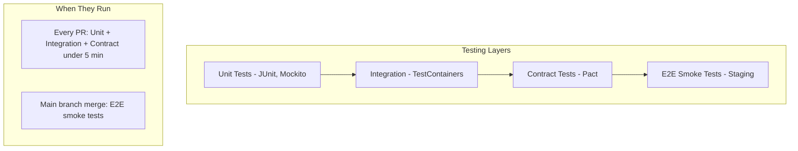
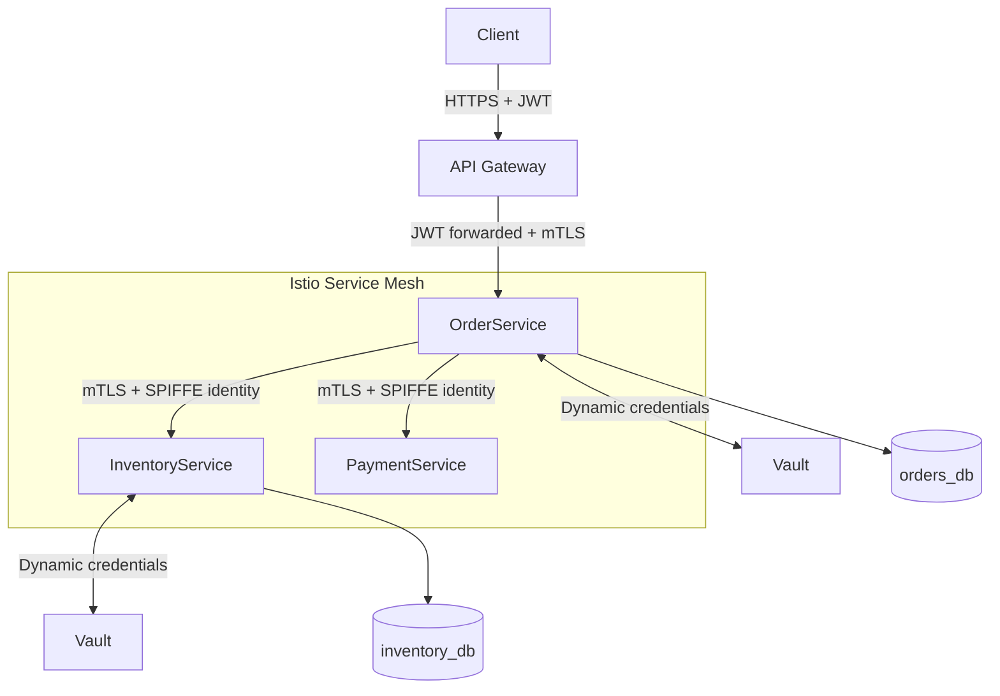
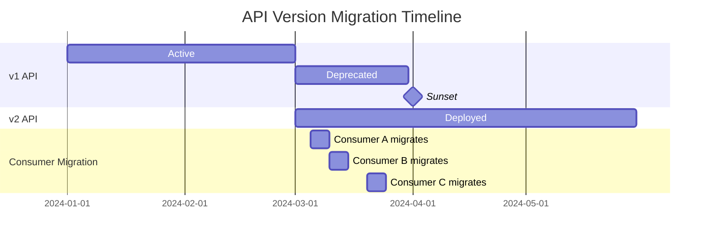
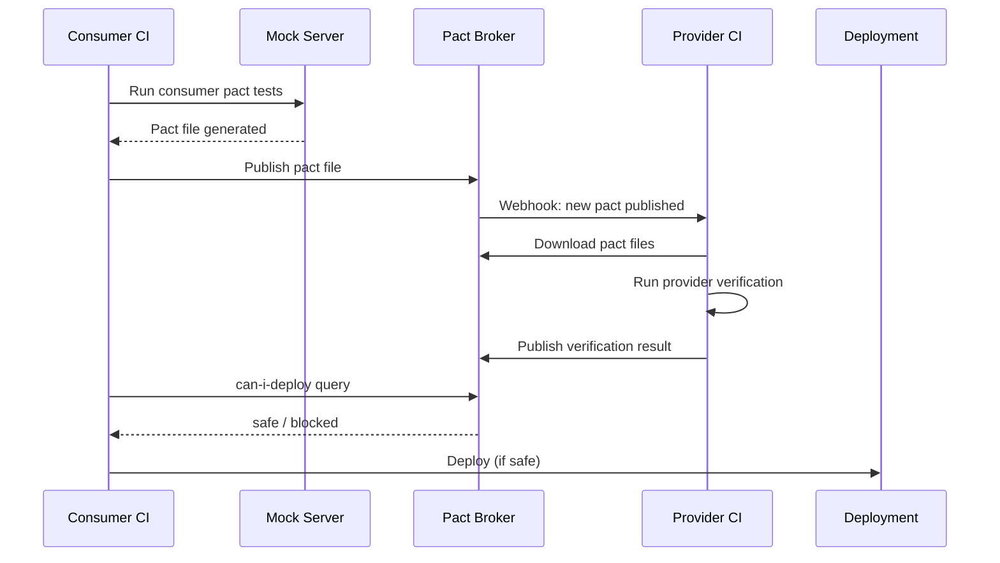
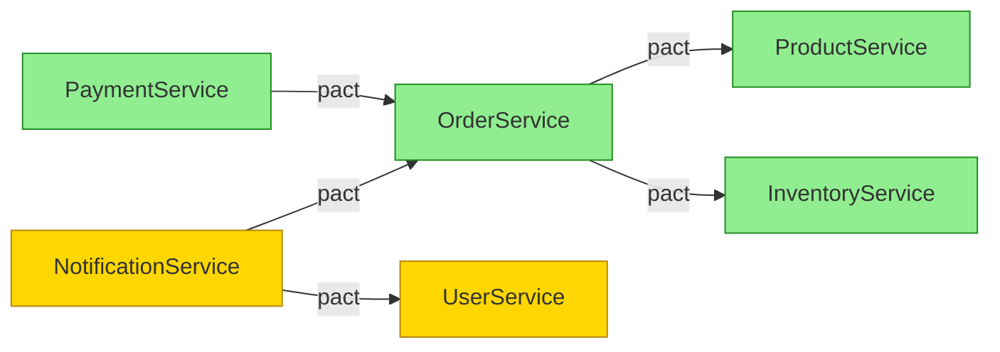

## Keywords in This File

{: .no_toc }

| #   | Keyword                                                              | Weight   |
| --- | -------------------------------------------------------------------- | -------- |
| 1   | [Testing Microservices Strategies](#testing-microservices-strategies) | critical |
| 2   | [Contract Testing with Pact](#contract-testing-with-pact)            | high     |
| 3   | [Consumer-Driven Contracts](#consumer-driven-contracts)              | high     |
| 4   | [Microservice Security and mTLS](#microservice-security-and-mtls)    | critical |
| 5   | [Service Versioning and Compatibility](#service-versioning-and-compatibility) | high |

---

# Testing Microservices Strategies

🎯 Interview Weight: critical - every senior interview on
microservices includes a question on the testing pyramid;
TestContainers and contract testing are expected knowledge
for mid+ engineers working on distributed systems.

---

### 🎯 Model Answer

**30 seconds:**
> Testing microservices requires a layered strategy: unit tests
> for domain logic, integration tests for each service's I/O,
> contract tests for inter-service API compatibility, and
> end-to-end tests sparingly (slow, fragile). TestContainers
> enables real infrastructure (Kafka, PostgreSQL) in integration
> tests. Contract testing replaces brittle end-to-end tests by
> verifying that service API contracts are honored independently.
> The test pyramid still applies but with an additional contract
> layer.

**3 minutes (Senior):**
> The testing challenge in microservices is that the distributed
> nature creates more failure modes than a monolith, yet end-to-
> end tests across multiple services are expensive to write,
> slow to run, and flaky due to network timing and state management.
>
> My testing strategy has four layers:
> Layer 1 - Unit: test domain logic in isolation (fast, many).
> Layer 2 - Integration: test each service's interaction with
> its own infrastructure (database, Kafka) using TestContainers
> to run the real infrastructure in Docker. No mocks for
> infrastructure.
> Layer 3 - Contract: test that service APIs match the contracts
> expected by their consumers. Run independently per service.
> Provider verifies it can satisfy consumer expectations; consumer
> verifies its usage matches the published contract. No live
> consumers required.
> Layer 4 - End-to-end: minimum viable set (smoke tests)
> in a staging environment. Test the critical happy path only.
>
> The key principle: push testing down the pyramid. A bug caught
> in a unit test takes seconds to fix. The same bug caught in
> an end-to-end test takes hours of debugging across service logs.

**Framework:** WHAT - WHY - HOW - TRADE-OFF - EXAMPLE

**Blank Mind Recovery:**

**(1) Restate:** "You are asking about how to test microservices
effectively given their distributed nature."

**(2) First principles:** "More moving parts = more failure modes.
But testing all combinations end-to-end is too expensive. Test
each part in isolation, with contracts to verify integration."

**(3) Bridge:** "Like testing a car: test each component on its
own bench, test the interfaces between components, and only do
a test drive for the final validation - not for every component change."

---

### 📘 Concept Explanation

**The testing pyramid for microservices:**
```
              /\
             /  \
            / E2E \   <- Few, slow, staging only
           /--------\
          / Contract  \ <- Medium, fast, run per service
         /-------------\
        / Integration   \ <- More, real infra (TestContainers)
       /-----------------\
      /    Unit Tests      \ <- Many, fast, pure domain logic
     /---------------------\
```

**Layer 1 - Unit tests:**
- Test domain logic, business rules, pure functions
- No I/O, no framework dependencies
- Fast (milliseconds), many
- Tools: JUnit 5, Mockito

**Layer 2 - Integration tests:**
- Test service interaction with its own infrastructure
- Use TestContainers for real PostgreSQL, Kafka, Redis
- No mocks for infrastructure (test real SQL, real events)
- Tools: TestContainers, Spring Boot Test
- Medium speed (seconds), moderate count

**Layer 3 - Contract tests:**
- Test that API contracts between services are honored
- Consumer generates contract expectations; provider verifies
- No live services - each service tests independently
- Tools: Pact, Spring Cloud Contract
- Fast (seconds), per service

**Layer 4 - End-to-end tests:**
- Test critical happy path in staging environment
- Minimum viable - 5-10 smoke tests max
- Accept flakiness (mitigate with retries)
- Tools: Karate, REST Assured, Selenium
- Slow (minutes), few

**TestContainers usage pattern:**
```java
@SpringBootTest
@Testcontainers
class OrderServiceIntegrationTest {

    @Container
    static PostgreSQLContainer<?> postgres =
        new PostgreSQLContainer<>("postgres:15")
            .withDatabaseName("test_db");

    @Container
    static KafkaContainer kafka =
        new KafkaContainer(
            DockerImageName.parse("confluentinc/cp-kafka:7.4.0"));

    @DynamicPropertySource
    static void configureProperties(
            DynamicPropertyRegistry registry) {
        registry.add("spring.datasource.url",
            postgres::getJdbcUrl);
        registry.add("spring.kafka.bootstrap-servers",
            kafka::getBootstrapServers);
    }

    @Test
    void placeOrder_shouldPublishOrderCreatedEvent() {
        // Uses real PostgreSQL and real Kafka in Docker
        // Tests the actual integration, not mocked behavior
    }
}
```

**Key testing anti-patterns:**
- Mocking infrastructure (mock database, mock Kafka) - hides
  real integration bugs
- End-to-end tests for every feature - slow, expensive, flaky
- No contract tests - schema changes break consumers silently
- Testing implementation details - brittle on refactoring

---

### 💻 Code Example

**BAD - Mocked infrastructure (misses integration bugs):**
```java
@Test
void placeOrder_shouldSaveOrder() {
    // WRONG: mocking the repository hides SQL bugs,
    // index issues, constraint violations, and
    // N+1 query problems
    when(orderRepository.save(any())).thenReturn(mockOrder);

    // WRONG: mocking Kafka hides serialization bugs,
    // partition key problems, and topic configuration issues
    when(kafkaTemplate.send(any(), any(), any()))
        .thenReturn(CompletableFuture.completedFuture(null));

    Order result = orderService.placeOrder(orderRequest);
    // This test can pass while production is broken
}
```

> **Code walkthrough:** Mocking the repository hides every
> database-level bug: constraint violations, wrong column names,
> N+1 queries, missing indexes. Mocking Kafka hides serialization
> problems. These bugs only surface in production or E2E tests.
> TestContainers with real infrastructure catches these in the
> integration test phase.

**GOOD - TestContainers with real infrastructure:**
```java
@SpringBootTest
@Testcontainers
@ActiveProfiles("test")
class OrderServiceIT {

    @Container
    static PostgreSQLContainer<?> postgres =
        new PostgreSQLContainer<>("postgres:15")
            .withDatabaseName("orders_test")
            .withInitScript("schema.sql"); // real schema

    @Container
    static KafkaContainer kafka =
        new KafkaContainer(
            DockerImageName.parse("confluentinc/cp-kafka:7.4.0"));

    @DynamicPropertySource
    static void configure(DynamicPropertyRegistry r) {
        r.add("spring.datasource.url", postgres::getJdbcUrl);
        r.add("spring.datasource.username", postgres::getUsername);
        r.add("spring.datasource.password", postgres::getPassword);
        r.add("spring.kafka.bootstrap-servers",
            kafka::getBootstrapServers);
    }

    @Autowired OrderService orderService;
    @Autowired OrderRepository orderRepository;
    @Autowired KafkaConsumer<String, String> kafkaConsumer;

    @Test
    void placeOrder_shouldPersistAndPublishEvent() {
        // Arrange
        OrderRequest request = new OrderRequest(
            userId: 42L,
            items: List.of(new OrderItem("SKU-100", 2)));

        // Act
        Order order = orderService.placeOrder(request);

        // Assert: real database write
        Order saved = orderRepository.findById(order.getId())
            .orElseThrow();
        assertThat(saved.getStatus())
            .isEqualTo(OrderStatus.PENDING);
        assertThat(saved.getItems()).hasSize(1);

        // Assert: real Kafka event
        kafkaConsumer.subscribe(List.of("order-events"));
        ConsumerRecords<String, String> records =
            kafkaConsumer.poll(Duration.ofSeconds(5));
        assertThat(records).hasSize(1);
        OrderCreatedEvent event = deserialize(
            records.iterator().next().value());
        assertThat(event.getOrderId())
            .isEqualTo(order.getId());
    }
}
```

> **Code walkthrough:** Real PostgreSQL container validates that
> the schema.sql creates the correct tables and that Spring Data
> JPA mappings are correct. Real Kafka container validates event
> serialization, topic configuration, and partition key routing.
> These tests catch bugs that mocks would hide: wrong column type
> in the schema, incorrect Kafka topic name, serialization format
> mismatch.

**Slice test for web layer:**
```java
// @WebMvcTest only loads the controller layer
// No full Spring context, no DB/Kafka
@WebMvcTest(OrderController.class)
class OrderControllerTest {

    @MockBean OrderService orderService; // mock the service

    @Autowired MockMvc mockMvc;

    @Test
    void createOrder_withValidRequest_returns201() throws Exception {
        Order mockOrder = new Order(1L, OrderStatus.PENDING);
        when(orderService.placeOrder(any())).thenReturn(mockOrder);

        mockMvc.perform(post("/orders")
                .contentType(APPLICATION_JSON)
                .content("""
                    {"userId": 42, "items": [
                      {"sku": "SKU-100", "quantity": 2}
                    ]}"""))
            .andExpect(status().isCreated())
            .andExpect(jsonPath("$.orderId").value(1L))
            .andExpect(jsonPath("$.status").value("PENDING"));
    }

    @Test
    void createOrder_withMissingUserId_returns400() throws Exception {
        mockMvc.perform(post("/orders")
                .contentType(APPLICATION_JSON)
                .content("""{"items": [{"sku": "SKU-100"}]}"""))
            .andExpect(status().isBadRequest())
            .andExpect(jsonPath("$.errors[0].field").value("userId"));
    }
}
```

> **Code walkthrough:** `@WebMvcTest` loads only the controller
> layer - no database, no Kafka, no full application context.
> Fast (milliseconds). Tests HTTP serialization, validation,
> response format, and HTTP status codes. The service is mocked
> because the controller's behavior is what is under test here,
> not the service logic.

---

### 🎓 Answers by Seniority

**Junior / Mid (0-5 years):**
> Testing microservices uses the same pyramid as any software:
> unit tests for individual classes, integration tests for how
> the service interacts with its database and message broker,
> and end-to-end tests for critical flows. A key tool is
> TestContainers: it runs real databases and Kafka in Docker
> during tests so I don't have to mock them.

---

**Senior / Staff (5+ years):**
> My testing philosophy: push tests down the pyramid, use real
> infrastructure. Unit tests are cheap and fast - use them for
> domain logic. Integration tests with TestContainers catch real
> infrastructure bugs (SQL constraints, Kafka serialization) that
> mocks would hide. Contract tests (Pact) decouple service teams:
> each team can verify their API compatibility without running
> all services together. End-to-end tests are the last resort -
> 5-10 smoke tests for the critical happy path, no more. The
> return on investment drops sharply as you add E2E tests.

---

### ⚠️ Common Misconceptions

**Misconception 1: "More test coverage is always better."**
E2E test coverage above a certain threshold has negative ROI:
tests become slow, flaky, and expensive to maintain. Invest
in unit and contract tests; keep E2E minimal.

**Misconception 2: "TestContainers is too slow for CI."**
TestContainers with Docker Layer Caching (DLC) in CI (CircleCI,
GitHub Actions with cache) starts containers in 2-5 seconds
after the first run. The speed penalty is acceptable for the
confidence gained from real infrastructure.

**Misconception 3: "Mock the infrastructure to make tests faster."**
Mocking infrastructure makes tests faster but less reliable.
The correct approach: mock the application service layer in unit
tests; use real infrastructure in integration tests.

---

### 🚨 Failure Modes and Diagnosis

**Failure: Flaky E2E tests in CI**
Symptom: E2E tests fail intermittently with timing or connection errors.
Diagnosis: Tests depend on timing (sleep instead of retry logic)
or state from previous test runs.
Fix: Add retry logic with exponential backoff for E2E assertions.
Clean test state in setUp/tearDown. Convert flaky E2E tests to
contract tests where possible.

**Failure: TestContainers timeout in CI**
Symptom: Integration tests fail with "container start timeout."
Diagnosis: CI runner does not have Docker available or has
resource constraints.
Fix: Enable Docker in CI (GitHub Actions: `services:` or DinD).
Increase TestContainers startup timeout.

---

### 🎯 Interview Deep-Dive

**Timing:** Hard - 15 min target

| Category | Questions |
|---|---|
| Definition | 2 |
| Mechanism | 2 |
| Comparison | 2 |
| Scenario | 2 |
| Debugging | 1 |
| Deep Dive | 1 |
| Misconception | 1 |
| Behavioral | 1 |

**Definition:**

Q: "Describe your testing strategy for microservices."

A: Four layers. Layer 1 - Unit: test domain logic in complete
isolation. No Spring context, no infrastructure. Fast and many.
Layer 2 - Integration: test the service with its own real
infrastructure (PostgreSQL, Kafka, Redis) using TestContainers.
Verifies SQL correctness, Kafka serialization, database migrations.
No mocks for I/O. Layer 3 - Contract: verify API contracts between
services using Pact or Spring Cloud Contract. Each service tests
independently. Catches breaking changes before deployment.
Layer 4 - E2E: minimum viable smoke tests in staging. Critical
happy paths only - 5 to 10 tests. Accept some flakiness; add retries.
The principle: catch bugs as low in the pyramid as possible.
Unit test time: milliseconds. E2E test time: minutes. The cost
of finding bugs scales with the pyramid level.

*What separates good from great:* Know the specific tools for each
layer and why TestContainers is preferred over mocks for infrastructure.

---

Q: "What is TestContainers and why is it preferred over mocked
infrastructure?"

A: TestContainers is a Java library that spins up real Docker
containers (PostgreSQL, Kafka, Redis, any Docker image) during
JUnit tests. The container is started before the test, the
application's infrastructure configuration is overridden
(`@DynamicPropertySource`) to point to the container, and the
container is stopped after the test. It is preferred over mocked
infrastructure because: (1) it tests the actual SQL queries against
a real database engine - constraint violations, missing indexes,
and SQL dialect differences are caught. (2) It tests real Kafka
behavior - serialization format, partition routing, and topic
auto-creation are verified. (3) Test behavior matches production
behavior: the same code path runs against the same database
engine type.

*What separates good from great:* Know that TestContainers is
compatible with parallel test execution (each test class gets
its own container instance) and that `@Container` with `static`
reuses the container across tests in the class for speed.

---

**Mechanism:**

Q: "How do you test an event-driven microservice that publishes
Kafka events?"

A: Two approaches. (1) TestContainers with real Kafka: start a
Kafka container, configure the application to use it, publish an
event, and consume it from the test using a KafkaConsumer.
This tests the full path: serialization, producer config,
topic existence, and event format. (2) @EmbeddedKafka (in-process):
starts a lightweight Kafka broker inside the JVM. Faster than
Docker-based, but uses the in-process broker rather than the
full Kafka codebase. Use for lightweight tests.
Key assertion: verify the event was published with the correct
topic, partition key, and payload. Use an await().atMost(10, SECONDS)
assertion (Awaitility library) because Kafka publication is async.

*What separates good from great:* Know the Awaitility library
for async assertions: `await().atMost(10, SECONDS).until(() ->
getPublishedEvents().size() > 0)`. Direct `sleep()` calls are
a test anti-pattern.

---

Q: "How do you test service startup correctly after a schema migration?"

A: The integration test should run Flyway or Liquibase migrations
on startup against the TestContainers database. This tests: (1)
all migrations are syntactically correct; (2) migrations are
idempotent (can be re-run); (3) migrations can be applied in sequence
on a fresh database; (4) the application starts correctly with
the migrated schema. Specifically: the TestContainers
PostgreSQL container starts empty. Spring Boot runs Flyway on
startup (as configured). Integration tests then exercise the
post-migration schema. If a migration fails, the test fails at
startup - catching schema issues before deployment.

*What separates good from great:* Know that testing schema migrations
in integration tests is the correct first line of defense. A Flyway
migration that breaks the application startup will be caught here,
not in production.

---

**Comparison:**

Q: "When would you use @WebMvcTest, @DataJpaTest, @SpringBootTest,
and TestContainers - and what are the trade-offs?"

A: @WebMvcTest: loads only the MVC layer (controllers, filters,
serializers). No database, no service beans. Fastest. Use for:
HTTP request/response format, validation, HTTP status codes, security
configuration. @DataJpaTest: loads only JPA entities, repositories,
and a H2 in-memory database. Use for: testing query methods,
JPQL queries, repository behavior. Note: H2 is not PostgreSQL -
some SQL features differ. @SpringBootTest: full application context.
Use with TestContainers for infrastructure. Use for: service-level
integration tests, Kafka integration, full application behavior.
TestContainers: add to @SpringBootTest for real infrastructure.
Use for: any test that needs a specific database feature,
real Kafka, or a specific Docker image.

*What separates good from great:* Know the H2 limitation for
@DataJpaTest: PostgreSQL-specific syntax (JSONB, arrays, ON CONFLICT)
will not work in H2. Use TestContainers with a real PostgreSQL
for these tests.

---

Q: "Test pyramid says few E2E tests. But my team insists on
comprehensive E2E coverage. How do you argue for the pyramid?"

A: Use cost-benefit framing: (1) Execution time: our 200-unit tests
run in 30 seconds. Our 20 E2E tests run in 15 minutes. Adding 10
more E2E tests adds 7+ minutes to CI. (2) Flakiness cost: each
flaky E2E test wastes engineering time on re-runs and investigations.
We spend 3 hours/week on flaky E2E test debugging. (3) Bug detection
efficiency: most bugs are logic bugs, caught 10x faster by unit
tests. E2E tests mainly catch integration issues - which contract
tests address more efficiently. (4) The alternative: for every
proposed new E2E test, first ask: "Can a contract test or integration
test catch this bug?" If yes, write the lower test instead.

*What separates good from great:* Ground the argument in concrete
numbers from the team's own CI history. An abstract argument loses
to team habit; concrete cost analysis changes minds.

---

**Scenario:**

Q: "Your CI pipeline takes 45 minutes because of E2E tests.
How do you fix it?"

A: Audit the E2E tests: (1) Identify which E2E tests are testing
integration behaviors (service A calls service B) vs. user flows.
Convert integration-testing E2E tests to contract tests or
integration tests with TestContainers. (2) Parallelize remaining
E2E tests across multiple CI agents. (3) Move E2E tests to a
separate stage that runs only on main branch merge, not on every PR.
(4) Identify the slowest E2E tests: are they slow due to setup
(start 5 services) or assertion (waiting for async results)?
Fix the setup with service virtualization or Docker Compose
caching. (5) Target: E2E tests in a separate parallel stage,
unit + integration + contract tests in the main PR pipeline under
5 minutes.

*What separates good from great:* Know the specific restructuring:
move E2E to a separate stage on merge, not every PR. This
unblocks developer velocity while maintaining E2E coverage.

---

Q: "How would you design tests for a new payment service that must
integrate with an external payment gateway and multiple internal
services?"

A: Three test categories: (1) Unit tests for payment domain logic:
fee calculation, refund eligibility, payment state machine.
No external dependencies. (2) Integration tests for infrastructure:
TestContainers PostgreSQL for payment record persistence. WireMock
to simulate the external payment gateway (not TestContainers -
the gateway is external). Test: happy path, card declined, gateway
timeout, gateway 500 error. (3) Contract tests with internal
services: Pact consumer tests for calls the payment service makes
to UserService (get user credit limit). Pact provider tests for
calls other services make to the payment service (initiate charge,
request refund). (4) No E2E test for payment - use the staging
environment manually for the final sign-off.

*What separates good from great:* Know the WireMock role: external
third-party APIs are simulated with WireMock (not real calls in
unit/integration tests). TestContainers is for local infrastructure
you control.

---

**Debugging:**

Q: "An integration test passes locally but fails consistently in CI.
How do you debug it?"

A: Common causes: (1) Timing issue: the test uses `Thread.sleep()`
instead of Awaitility assertions. CI is slower. Fix: replace
sleep with `await().atMost(30, SECONDS).until(...)`. (2) Docker
not available or different version in CI. Fix: check CI runner
configuration; ensure Docker daemon is running. (3) Port conflict:
TestContainers defaults to random ports; fixed ports conflict.
Fix: always use `getMappedPort()` not hardcoded ports. (4) Test
state leak: a previous test left data in the database. Fix: add
`@Transactional` to tests (auto-rollback) or `@AfterEach` cleanup.
(5) Different environment variable in CI. Check CI environment
config vs. local.

*What separates good from great:* Know `@Transactional` test
rollback: wrapping each test in a transaction that rolls back
at the end ensures the database is clean for the next test.

---

**Deep Dive:**

Q: "What is consumer-driven contract testing and how does Pact
implement it?"

A: Consumer-driven contract testing reverses the traditional
API testing direction. Instead of the provider publishing a spec
and consumers testing against it, the consumer writes tests that
express exactly what it needs from the provider. These tests
generate a "pact" (contract file). The provider then verifies that
it can satisfy all the expectations in the pact. Pact implementation:
(1) Consumer writes a PactTest: "when I call GET /users/42,
I expect a response with name and email fields." This test runs
against a Pact mock server (not the real provider). (2) The test
generates a pact.json file. (3) The pact file is published to
Pact Broker. (4) Provider's CI downloads the pact and runs
PactVerificationTest: starts the real provider, replays each
consumer interaction, and verifies the response matches
the contract. (5) If the provider test fails, the provider cannot
deploy without coordinating with the consumer.

*What separates good from great:* Know the Pact Broker's "can-i-deploy"
feature: before deploying, run `pact-broker can-i-deploy` to check
that all consumer contracts are verified. This makes the contract
verification part of the deployment gate.

---

**Misconception / Trap:**

Q: "We have 95% E2E test coverage, so our microservices are well-tested."

A: E2E test coverage percentage is a misleading metric. E2E tests
are expensive (time, maintenance), slow, and flaky. 95% E2E coverage
means: (1) CI runs for 1+ hour (slows feedback loops), (2) significant
engineering time spent maintaining tests that break due to environment
issues rather than code bugs, (3) bugs in domain logic are caught
late (after E2E runs) instead of in unit tests (immediately).
The correct metric is: unit test coverage for domain logic + contract
test coverage for API interactions + integration test coverage for
infrastructure interactions. E2E tests should be 5-10 critical path
smoke tests, not the primary test strategy.

*What separates good from great:* Reframe from "how much coverage"
to "how fast do bugs get caught and at what cost."

---

**Behavioral:**

Q: "Tell me about a time you improved the testing strategy on a
microservices project."

A: Structure: SITUATION (what was the state), PROBLEM (what pain
it caused), ACTION (what you changed), RESULT (measurable outcome).
Example pattern: "We had 50 E2E tests that took 40 minutes. Any
PR required 40 minutes to get feedback. We identified that 30 of
the 50 E2E tests were testing service-to-service integration that
could be covered by contract tests. We added Pact contract tests
for the 8 most critical service pairs - these ran in 2 minutes.
We removed 30 E2E tests. CI dropped from 40 minutes to 12 minutes.
Developer satisfaction with CI feedback speed improved significantly.
Interestingly, Pact caught 2 real contract breaking changes that
had previously been undetected."

*What separates good from great:* Quantify the outcome: minutes
saved, bugs caught, developer velocity improvement. Specific numbers
make the story credible.

---

### ⚖️ Comparison Table

| Layer | Tools | Speed | Confidence | When to Use |
|---|---|---|---|---|
| Unit | JUnit 5, Mockito | ms | Domain logic | Always, many |
| Integration | TestContainers | seconds | Infrastructure | Per service |
| Contract | Pact, Spring Cloud Contract | seconds | API compat | Per service pair |
| E2E | Karate, Selenium | minutes | Full system | Smoke tests only |

**The deciding factor:** As you move up the pyramid, tests get
slower, more expensive, and more flaky. Push coverage down.

---

### 🏛️ System Design

*(Conditional: ★★★ - required.)*

**Testing strategy in system design:**
When presenting a microservices design, include the testing strategy:
- Unit tests per service for domain logic
- Integration tests per service with TestContainers
- Pact contracts for all service-to-service API calls
- CI pipeline: unit + integration + contract on every PR (< 5 min)
- E2E smoke tests on main branch merge only

**Staff angle:** Testing strategy is a productivity investment.
A team spending 40 minutes on CI per commit has 5x slower
feedback than a team with 8-minute CI. The productivity
difference compounds over the lifetime of the project.

---

### 📊 Diagram

*(Conditional: ★★★ - required.)*

```
TESTING PYRAMID:
             /\
            /E2E\ (5-10 tests, staging)
           /------\
          /Contract\ (per svc pair, Pact)
         /----------\
        / Integration\ (TestContainers)
       /--------------\
      /   Unit Tests   \ (many, fast)
     /-----------------\
```



> **Diagram walkthrough:** The pyramid narrows as tests become
> more expensive. Unit and integration tests run on every PR for
> fast feedback. Contract tests verify API compatibility independently
> per service pair. E2E tests run only on merge to main -
> protecting the critical paths without blocking developer velocity.

---

---

# Microservice Security and mTLS

🎯 Interview Weight: critical - security is the most common
gap in microservices designs; interviewers probe for defense-
in-depth; mTLS is the standard for service-to-service auth
in modern environments.

---

### 🎯 Model Answer

**30 seconds:**
> Microservice security requires multiple layers: external traffic
> is authenticated at the API gateway (JWT/OAuth2). Internal
> service-to-service calls use mutual TLS (mTLS) - each service
> has a certificate, and both sides verify the other's identity.
> Secrets are managed by a vault (HashiCorp Vault, AWS Secrets
> Manager), not hardcoded. Network policies restrict which services
> can communicate. Zero-trust means every service call is
> authenticated and authorized, not just the external request.

**3 minutes (Senior):**
> The security model for microservices is zero-trust: no service
> is implicitly trusted because it runs inside the cluster.
> In a monolith, internal function calls are inherently trusted.
> In microservices, an internal HTTP call crosses a network
> boundary - it can be intercepted, replayed, or spoofed.
>
> Defense layers: (1) External perimeter: API gateway validates
> JWTs from identity providers. (2) Service-to-service authentication:
> mTLS provides cryptographic identity verification. Each service
> has a certificate issued by the cluster CA (Kubernetes:
> cert-manager or Istio's SPIFFE certificates). Both the calling
> and called service verify each other's certificate. (3)
> Authorization: even after authentication, each service checks
> whether the authenticated caller is authorized to perform the
> requested operation (RBAC, ABAC). (4) Secrets management:
> database passwords, API keys, and certificates are injected
> from a vault, not from environment variables or config files.
>
> In Kubernetes, Istio automates mTLS: the sidecar proxies handle
> certificate issuance, rotation, and the TLS handshake. Application
> code does not need to manage certificates. This is the service
> mesh approach to security.

**Framework:** WHAT - WHY - HOW - TRADE-OFF - EXAMPLE

**Blank Mind Recovery:**

**(1) Restate:** "You are asking about how to secure communication
between microservices."

**(2) First principles:** "In a distributed system, any internal
call crosses a network. Treat every call as if it could be
intercepted - authenticate and authorize every call, not just
external ones."

**(3) Bridge:** "Zero-trust is like a building where every door
requires a badge - not just the front door."

---

### 📘 Concept Explanation

**Security layers in microservices:**
```
EXTERNAL LAYER:
Client -> [API Gateway]
  - TLS termination (HTTPS)
  - JWT validation (issuer, expiry, signature)
  - Rate limiting
  - DDoS protection
  - Transforms external token to internal identity

INTERNAL LAYER (zero-trust):
ServiceA -> ServiceB
  - mTLS: both sides authenticate via certificate
  - Authorization: ServiceB checks if ServiceA
    is allowed to call this endpoint
  - Token propagation: user identity forwarded
    in JWT or service header

DATA LAYER:
Database: credentials from Vault (not env vars)
Secrets: rotated automatically by Vault
Encryption at rest: database-level encryption
```

**mTLS mechanics:**
```
STANDARD TLS (one-way):
Client: "I want to connect to ServiceB"
ServiceB: "Here is my certificate"
Client: "Certificate is valid - connection established"
ServiceB: (does not know WHO the client is)

MUTUAL TLS (two-way):
Client: "I want to connect to ServiceB"
ServiceB: "Here is my certificate"
Client: "Certificate is valid"
ServiceB: "Show me YOUR certificate"
Client: "Here is my certificate (issued by cluster CA)"
ServiceB: "Your certificate is valid and your CN=order-service"
          "You are authorized to call /inventory/**"
Connection: established, both sides verified
```

**Istio mTLS in Kubernetes:**
```
Without Istio:
OrderService pod -> HTTP -> InventoryService pod
(no encryption, no authentication between pods)

With Istio (STRICT mode):
OrderService pod -> Envoy sidecar -> mTLS -> Envoy sidecar -> InventoryService pod
Certificate: SPIFFE URI (spiffe://cluster.local/ns/default/sa/order-service)
Rotation: automatic (every 24 hours by default)
Application code: no change needed
```

**Secrets management:**
```
BAD:
application.yml:
  db.password: "productionpassword123"  # in source control
  api.key: "secret-key"                 # rotation = redeployment

GOOD (Vault / Kubernetes Secrets):
Vault agent sidecar:
  - Injects DB credentials as files/env vars at pod start
  - Rotates credentials automatically
  - Application uses short-lived credentials
  - No secrets in source control
```

---

### 💻 Code Example

**BAD - Hardcoded credentials and no service authentication:**
```java
// BAD: hardcoded credentials
@Configuration
public class DatabaseConfig {
    // WRONG: credential in source code
    // Rotation requires code change + deployment
    @Bean
    public DataSource dataSource() {
        return DataSourceBuilder.create()
            .url("jdbc:postgresql://db:5432/orders")
            .username("orders_user")
            .password("hardcoded_password")  // NEVER
            .build();
    }
}

// BAD: no service authentication on internal call
@Service
public class InventoryClient {
    public Stock checkStock(String sku) {
        // Any service (or attacker on the internal network)
        // can call this endpoint without authentication
        return restTemplate.getForObject(
            "http://inventory-service/stock/" + sku,
            Stock.class);
    }
}
```

> **Code walkthrough:** Hardcoded credentials in source code
> mean they appear in version control, build artifacts, and
> container images. No service authentication means any process
> that can reach inventory-service can call it. Both are critical
> security failures in production.

**GOOD - Vault-injected secrets + mTLS with Istio:**
```java
// Credentials injected by Vault agent sidecar
// application.yml references environment variables:
// db.password: ${DB_PASSWORD} <- injected by Vault

// Spring Boot automatically picks up env vars:
@Configuration
public class DatabaseConfig {
    // No credential in code; injected at runtime from Vault
    // Vault rotates the credential; k8s restarts pods
    @Value("${DB_PASSWORD}")
    private String dbPassword;

    @Bean
    public DataSource dataSource() {
        return DataSourceBuilder.create()
            .url("jdbc:postgresql://db:5432/orders")
            .username("orders_user")
            .password(dbPassword)  // From Vault
            .build();
    }
}

// mTLS is handled by Istio sidecar - no code change
// Istio PeerAuthentication:
// apiVersion: security.istio.io/v1beta1
// kind: PeerAuthentication
// metadata:
//   name: default
//   namespace: production
// spec:
//   mtls:
//     mode: STRICT  # All traffic must use mTLS

// Istio AuthorizationPolicy:
// apiVersion: security.istio.io/v1beta1
// kind: AuthorizationPolicy
// metadata:
//   name: inventory-policy
// spec:
//   selector:
//     matchLabels:
//       app: inventory-service
//   action: ALLOW
//   rules:
//   - from:
//     - source:
//         principals: ["cluster.local/ns/default/sa/order-service"]
//     to:
//     - operation:
//         paths: ["/stock/*"]
//         methods: ["GET"]
// Only order-service can call GET /stock/* on inventory-service
```

> **Code walkthrough:** `@Value("${DB_PASSWORD}")` reads the
> credential from the environment, injected by the Vault agent
> sidecar at pod start. The Vault agent handles rotation and
> pod restart notification. Istio STRICT mTLS mode enforces that
> all service-to-service traffic uses mTLS - enforced at the
> infrastructure level, not the application level. The
> AuthorizationPolicy is the per-endpoint access control: only
> order-service's service account can call the inventory endpoints.

**JWT validation for external requests:**
```java
// API Gateway validates JWT; services trust the gateway's
// forwarded identity header
@Component
public class ServiceSecurityConfig {

    // For internal services: trust the forwarded identity
    // from the API gateway (already validated)
    @Bean
    public SecurityFilterChain securityFilterChain(
            HttpSecurity http) throws Exception {
        http
            .requestMatcher(
                new NegatedRequestMatcher(
                    new AntPathRequestMatcher("/actuator/**")))
            .authorizeHttpRequests(auth -> auth
                .requestMatchers("/admin/**")
                    .hasAuthority("SCOPE_admin")
                .anyRequest().authenticated())
            // Validate JWT forwarded from API gateway
            .oauth2ResourceServer(oauth2 ->
                oauth2.jwt(Customizer.withDefaults()));
        return http.build();
    }
}
```

> **Code walkthrough:** The service validates JWTs (forwarded
> by the API gateway) using Spring Security's OAuth2 resource
> server. The JWT is validated against the identity provider's
> public key. The service does not issue tokens - it only validates
> them. Combined with mTLS (which verifies the caller is who they
> claim to be at the service level), this gives two layers of
> authentication for external-to-internal flows.

---

### 🎓 Answers by Seniority

**Junior / Mid (0-5 years):**
> Microservices security needs to cover both external traffic and
> internal service-to-service calls. External: use an API gateway
> with JWT validation. Internal: use mTLS so services can verify
> each other's identity. Secrets like database passwords should
> come from a vault, not be hardcoded. In Kubernetes with Istio,
> mTLS is automatic and handled by the sidecar proxy.

---

**Senior / Staff (5+ years):**
> Zero-trust is the model: every service call is authenticated
> and authorized, not just the external request. The layers:
> API gateway for external JWT validation + rate limiting + DDoS;
> Istio for automatic mTLS between pods + SPIFFE certificate
> issuance and rotation; AuthorizationPolicy for per-endpoint
> caller restrictions; Vault for secrets with automatic rotation.
> The most important insight: applying Istio STRICT mTLS mode
> prevents any plaintext internal traffic - it makes a whole
> class of man-in-the-middle attacks impossible at the
> infrastructure level. Application code does not need to
> manage certificates.

---

### ⚠️ Common Misconceptions

**Misconception 1: "The cluster network is private so mTLS
is unnecessary."**
Network policies limit which pods can connect to which,
but they do not prevent a compromised pod from making requests
to other services. mTLS provides cryptographic identity
verification that network policies cannot.

**Misconception 2: "JWT in every internal call handles
service-to-service authentication."**
JWTs carry user identity, not service identity. If ServiceA
calls ServiceB with a valid user JWT, ServiceB knows the user's
identity but not that the caller is ServiceA. mTLS provides
service identity. Both are needed: mTLS for service authentication,
JWT for user identity propagation.

**Misconception 3: "Environment variables are secure for secrets."**
Environment variables are accessible to any code in the process,
appear in crash dumps, and are often logged. Vault with dynamic
secrets (short-lived credentials) is more secure.

---

### 🚨 Failure Modes and Diagnosis

**Failure: mTLS certificate expiry causing service outage**
Symptom: All connections to a service fail with TLS certificate errors.
Diagnosis: `kubectl get certificate -n production` - check certificate
expiry. `openssl s_client -connect service:443` - verify certificate
chain.
Fix: With Istio, certificates are automatically rotated. If using
cert-manager, check the renewal configuration.

**Failure: Authorization policy too restrictive (blocks legitimate traffic)**
Symptom: Service calls return 403 Forbidden unexpectedly after
a new AuthorizationPolicy is applied.
Diagnosis: Check Istio access log for 403: `kubectl logs <pod>
-c istio-proxy | grep 403`. Check which source principal is being
rejected.
Fix: Verify the AuthorizationPolicy source.principals match
the calling service's service account SPIFFE URI exactly.

---

### 🎯 Interview Deep-Dive

**Timing:** Hard - 15 min target

| Category | Questions |
|---|---|
| Definition | 2 |
| Mechanism | 2 |
| Comparison | 2 |
| Scenario | 2 |
| Debugging | 1 |
| Deep Dive | 1 |
| Misconception | 1 |

**Definition:**

Q: "What is zero-trust security and how does it apply to microservices?"

A: Zero-trust is a security model where no actor (user, service,
or network) is implicitly trusted based on location (inside the
corporate network or cluster). Every request must be authenticated
and authorized, regardless of where it originates. In microservices:
all service-to-service calls are authenticated (mTLS certificates
verify service identity), all API calls carry authorization tokens
(JWT for user identity), all network connections are encrypted
(TLS), and network policies restrict which services can communicate
at all. The contrast: traditional perimeter security trusted
everything inside the firewall. Zero-trust assumes the internal
network is compromised and verifies every call.

*What separates good from great:* Know the concrete threat model
zero-trust defends against: a compromised service inside the
cluster. Without zero-trust, a compromised service has full
access to all other services. With zero-trust, it can only call
services explicitly authorized for its identity.

---

Q: "What is mTLS and how does it provide service identity?"

A: Mutual TLS is TLS with client certificate authentication.
Standard TLS authenticates the server to the client (the client
verifies the server's certificate). mTLS additionally authenticates
the client to the server. Each service has an X.509 certificate
issued by the cluster's Certificate Authority. The certificate's
Subject Alternative Name (SAN) contains the service's SPIFFE
identity: `spiffe://cluster.local/ns/production/sa/order-service`.
When OrderService calls InventoryService: (1) InventoryService
presents its certificate. (2) OrderService verifies it (standard TLS).
(3) InventoryService requests OrderService's certificate. (4)
OrderService presents it. (5) InventoryService verifies it and
extracts the SPIFFE identity: CN=order-service. (6) InventoryService's
authorization policy checks: is order-service allowed to call this endpoint?
This is cryptographic service identity - not relying on IP addresses
or network location.

*What separates good from great:* Know the SPIFFE standard (CNCF)
and that Istio uses SPIFFE identities for service accounts. The
identity is tied to a Kubernetes service account, not to an IP address.

---

**Mechanism:**

Q: "How does Istio automate mTLS without application code changes?"

A: Istio injects an Envoy sidecar proxy into each pod. All inbound
and outbound network traffic from the pod goes through this proxy
(via iptables rules that redirect traffic to the proxy). The Envoy
proxy handles the TLS handshake, certificate presentation and
verification, on behalf of the application. The application makes
an HTTP call to localhost; the sidecar upgrades it to mTLS before
it leaves the node. Certificate issuance and rotation are handled
by Istio's control plane (istiod). Application developers write
HTTP code; the infrastructure provides mTLS automatically.
Istio `PeerAuthentication` with STRICT mode enforces that all
inbound traffic to a namespace must use mTLS.

*What separates good from great:* Know the PERMISSIVE vs. STRICT
mode distinction: PERMISSIVE allows both plaintext and mTLS
(used during migration). STRICT enforces mTLS only. Migration
path: deploy with PERMISSIVE, verify all services are using mTLS,
switch to STRICT.

---

Q: "How do you manage service secrets in Kubernetes without
environment variables?"

A: HashiCorp Vault with the Vault Agent Injector is the standard
approach. Configuration: (1) Services annotate their pods with
Vault injection annotations. (2) The Vault Agent Injector (webhook)
injects a Vault agent init container and a sidecar. (3) The init
container authenticates to Vault using the pod's Kubernetes service
account (Kubernetes auth method). (4) The Vault agent fetches
the secrets and writes them to files in a shared volume (or injects
into environment variables). (5) The application reads secrets
from files (`/vault/secrets/db-credentials`), not environment
variables. Vault advantages: (1) dynamic secrets (short-lived
database credentials with automatic rotation), (2) audit log
of every secret access, (3) no secrets in Kubernetes etcd.

*What separates good from great:* Know Vault dynamic secrets:
instead of storing a static password, Vault creates a short-lived
database user (e.g., 1 hour TTL) specifically for this pod.
If the credential leaks, it expires quickly. When the pod dies,
Vault revokes the credential immediately.

---

**Comparison:**

Q: "Istio mTLS vs. application-level TLS vs. network policies -
how do they complement each other?"

A: Network policies (Kubernetes NetworkPolicy) restrict which
pods can communicate at the TCP level - which source IPs/pods
can connect to which destination ports. They are L3/L4 controls.
Limitation: they do not verify the identity of the connecting
pod - IP spoofing is possible in misconfigured clusters. Application-
level TLS: each service manages its own certificates and TLS
configuration. Full control but high operational overhead (certificate
issuance, rotation, per-service configuration). Istio mTLS:
certificates managed by the mesh control plane, automatic issuance
and rotation, L7 AuthorizationPolicy for per-path caller restrictions.
Best practice: all three in layers. Network policies restrict
communication topology (defense in depth). Istio mTLS provides
cryptographic identity verification. Application-level checks
validate business authorization (user has permission to access
this resource).

*What separates good from great:* Know the layered defense:
network policy is a coarse outer fence; mTLS is the identity
lock; application authorization is the fine-grained check.
No single layer is sufficient alone.

---

Q: "How do you propagate user identity through multiple service calls?"

A: The standard approach: the external JWT (containing user claims)
is validated at the API gateway and forwarded in the Authorization
header to downstream services. Downstream services validate the
JWT signature using the identity provider's public key and extract
the user claims (user ID, roles, tenant ID). Service-to-service
calls within a request propagate the original JWT unchanged -
the user identity travels with the request through the entire
call chain. Istio can forward the JWT automatically via
`RequestAuthentication` policy. For Kafka messages: include the
user identity as a message header (propagate the user ID, not the
full JWT, to avoid token expiry issues in async processing). The
principle: the user's identity context is always known, at every
layer, for every operation.

*What separates good from great:* Know the JWT expiry problem
in async flows: a JWT valid when a message is published may expire
before the consumer processes it. For async flows, extract the
user ID at publish time and propagate the ID, not the JWT.

---

**Scenario:**

Q: "Design the security architecture for an e-commerce microservices
system: 10 services, external mobile and web clients, Kubernetes."

A: Layer 1 - External: API Gateway (Kong or AWS API Gateway) with
JWT validation (issuer=auth0 or keycloak), rate limiting, OWASP
rules. Services behind the gateway are not directly accessible.
Layer 2 - Service identity: Istio in STRICT mTLS mode. All pod-
to-pod traffic encrypted and authenticated. SPIFFE identities per
service account. Layer 3 - Authorization: Istio AuthorizationPolicy
per service: order-service can call inventory-service, payment-service.
No other service can call payment-service. Layer 4 - Secrets:
Vault with Kubernetes auth. Database credentials are dynamic
(15-minute TTL). API keys stored in Vault with audit log. Layer 5 -
Network: Kubernetes NetworkPolicy restricts which namespaces can
communicate. Database pods only accept connections from service pods,
not from internet-accessible pods. Layer 6 - Audit: all Vault
accesses logged. Istio access logs for all service calls. SIEM
aggregation.

*What separates good from great:* Know the "not directly accessible"
for internal services: only the API Gateway is exposed externally
(via LoadBalancer or Ingress). Internal services use ClusterIP -
they have no external IP.

---

Q: "A security audit found that credentials are stored in environment
variables in Kubernetes pods. What is the risk and how do you fix it?"

A: Risks: (1) Environment variables are accessible to all processes
in the pod - a compromised library or RCE vulnerability exposes
all credentials. (2) Environment variables appear in process listings
(`/proc/1/environ`) in some configurations. (3) Kubernetes environment
variables backed by Secrets store secrets in etcd (base64 encoded,
not encrypted by default unless etcd encryption is enabled). (4)
Credential rotation requires redeployment. Fix: (1) Enable etcd
encryption for Secrets. (2) Migrate to Vault with the agent
injector: credentials written to files in a mounted tmpfs volume,
readable only by the application user. (3) Use dynamic credentials:
Vault database secrets engine issues short-lived database users.
(4) Rotate all existing credentials immediately (they may have been
exposed). (5) Enable Vault audit logging to detect any unauthorized
access.

*What separates good from great:* Know the etcd encryption point:
Kubernetes Secrets are base64-encoded (not encrypted) by default
in etcd. This is a common security audit finding.

---

**Debugging:**

Q: "Services fail to communicate after enabling Istio mTLS STRICT
mode. How do you debug?"

A: STRICT mode means plaintext connections are rejected. Services
failing means some pods are not in the mesh or have misconfigured
sidecars. Diagnosis: Step 1: Check if the failing pod has the
Istio sidecar injected: `kubectl get pod <pod> -o jsonpath=
'{.spec.containers[*].name}'` - look for `istio-proxy`. Step 2:
If no sidecar: the namespace does not have sidecar injection enabled
(`kubectl label namespace <ns> istio-injection=enabled`). Step 3:
If sidecar is present but connection fails: check the Istio access
log in the source pod's proxy:
`kubectl logs <source-pod> -c istio-proxy | grep RBAC`.
Step 4: Check PeerAuthentication: is STRICT mode applied to the
correct namespace? Is there an exception for health check paths?
Step 5: Verify the destination pod's certificate is valid:
`istioctl proxy-config secret <pod>`.

*What separates good from great:* Know `istioctl proxy-config secret`
to inspect the certificate state of a pod. A certificate that
failed to issue shows here.

---

**Deep Dive:**

Q: "What is SPIFFE/SPIRE and how does it relate to mTLS in
microservices?"

A: SPIFFE (Secure Production Identity Framework For Everyone) is
a CNCF standard for service identity in distributed systems.
A SPIFFE identity is a URI: `spiffe://trust-domain/path/to/service`.
SPIRE is the reference implementation. Istio uses SPIFFE identities
as the CN in the mTLS certificates it issues to pods. The identity
is bound to a Kubernetes service account (not an IP address,
which changes on pod restart). Value: a certificate with a SPIFFE
identity proves "I am the instance of service X running in namespace
Y under service account Z." This identity can be used for both
authentication (mTLS) and authorization (AuthorizationPolicy
checks SPIFFE principal). The SPIFFE standard enables cross-
cluster and cross-platform identity: a SPIFFE identity from
Kubernetes can be trusted by a SPIFFE identity from a VM or
a different cloud provider, enabling multi-cloud mTLS.

*What separates good from great:* Know that SPIFFE enables
federated trust across different environments. This is relevant
for hybrid cloud or multi-cluster architectures where services
in different environments need to call each other with
cryptographic identity verification.

---

**Misconception / Trap:**

Q: "We pass a shared API key in headers between services for
authentication. This is sufficient for internal security."

A: A shared static API key has several weaknesses: (1) No per-service
identity: the key proves "the caller knows the key" but not "the
caller is order-service specifically." A compromised service can
use the key to call any other service. (2) No automatic rotation:
rotating a shared key requires coordinating all services. (3) The
key can be logged (accidentally in request logs or debug output).
(4) No certificate validation: the key proves authorization but
not that the server's identity is correct (vulnerable to MITM).
mTLS addresses all of these: cryptographic identity per service,
automatic certificate rotation, no secrets in request headers,
and bidirectional identity verification. A shared API key is
acceptable as a stopgap; mTLS is the production-grade replacement.

*What separates good from great:* Know the "per-service identity"
point: the most critical weakness of a shared key. mTLS provides
individual cryptographic identities that allow revoking a single
service without affecting others.

---

### ⚖️ Comparison Table

| Security Control | What It Provides | What It Does NOT Provide | When Required |
|---|---|---|---|
| **Network Policy** | Connection filtering (L3/L4) | Identity verification | Always |
| **mTLS (Istio)** | Service identity + encryption | User identity | Production services |
| **JWT (API Gateway)** | User identity | Service identity | External API |
| **Vault** | Secret management + audit | Authentication | Production secrets |
| **AuthorizationPolicy** | Per-endpoint caller restriction | Business authorization | Per-service |

**The deciding factor:** Defense in depth - use all layers.
Each provides a different guarantee; none is sufficient alone.

---

### 🏛️ System Design

*(Conditional: ★★★ - required.)*

**Security in system design answers:**
Always mention: API Gateway for external auth, mTLS for internal
(Istio if Kubernetes), Vault for secrets, network policies for
topology restriction.

**Staff angle:** Security is a platform problem, not a per-service
problem. Istio's mTLS is applied at the infrastructure level -
all services get it without any code change. This is the correct
model: secure by default, opt-out only with explicit justification.

---

### 📊 Diagram

*(Conditional: ★★★ - required.)*

```
ZERO-TRUST SECURITY LAYERS:

[External Client]
   |
   | HTTPS + JWT (validated at gateway)
   v
[API Gateway: JWT validation, rate limiting]
   |
   | mTLS (Istio STRICT) + JWT forwarded
   v
[OrderService] --mTLS + AuthzPolicy--> [InventoryService]
    |                                       |
 [Vault: DB creds]                    [Vault: DB creds]
    |                                       |
[orders_db]                         [inventory_db]
```



> **Diagram walkthrough:** External traffic enters through the API
> Gateway which validates JWTs. Inside the mesh, all service-to-service
> calls use Istio-managed mTLS - each service's Envoy sidecar handles
> the TLS handshake automatically. Database credentials are
> fetched from Vault dynamically at pod start and rotated
> automatically. No credentials appear in source code or environment
> variables.

---

---

# Service Versioning and Compatibility

🎯 Interview Weight: high - every mature microservices team
deals with versioning; breaking change management is a real
production problem; expected knowledge for senior+ engineers.

---

### 🎯 Model Answer

**30 seconds:**
> Service versioning ensures that when an API changes, existing
> consumers are not broken. The key strategy: backward compatibility
> first - add fields, do not remove or rename them. For breaking
> changes, version the API (v1, v2) and run both versions in
> parallel during migration. API versioning strategies: URI versioning
> (/v1/orders), header versioning (Accept: application/vnd.api.v2+json),
> or semantic versioning for internal APIs.

**3 minutes (Senior):**
> API versioning in microservices is a distributed coordination
> problem: services are deployed independently, so a consumer and
> provider may be at different versions at any point. The safety
> constraint: the provider must be able to serve all consumer
> versions that are currently in production.
>
> The primary strategy is backward-compatible evolution: add new
> fields (consumers that do not know about them ignore them); do
> not remove or rename required fields; do not change field types.
> This is the Postel's Law (robustness principle) for APIs:
> be conservative in what you send, liberal in what you accept.
>
> When backward compatibility is not possible (a field must be
> removed, an endpoint must be completely redesigned), use explicit
> versioning. URI versioning (/v1/orders, /v2/orders) is the most
> common because it is explicit, visible in logs, and cacheable.
> The migration path: deploy v2 alongside v1, update consumers
> one by one, sunset v1 after all consumers have migrated.
>
> For event-driven communication, schema compatibility is managed
> through a schema registry (Confluent Schema Registry with Avro
> or Protobuf). The registry enforces backward compatibility
> rules before any schema change is accepted.

**Framework:** WHAT - WHY - HOW - TRADE-OFF - EXAMPLE

**Blank Mind Recovery:**

**(1) Restate:** "You are asking about how to change service APIs
without breaking consumers."

**(2) First principles:** "In microservices, consumers deploy
independently. A change to the provider cannot assume all consumers
will update simultaneously. Design changes to be compatible
with both old and new consumers."

**(3) Bridge:** "Like a USB port: newer USB-C can accept older
USB-A adapters. The new standard does not break devices that
use the old standard - backward compatible."

---

### 📘 Concept Explanation

**Backward-compatible changes (safe, no version bump):**
```
REST API:
- Add a new optional field to a response - safe
- Add a new optional field to a request - safe
- Add a new endpoint - safe
- Change a field from required to optional - safe
- Add a new enum value - safe for consumers that ignore unknowns

Breaking changes (require version bump):
- Remove a field from a response - consumers reading it break
- Rename a field - consumers reading it break
- Change a field type - consumers parsing it break
- Add a required field to a request - old clients don't send it
- Remove a valid enum value - old clients may send it

Event schemas:
- Add an optional field - backward compatible
- Remove a field - backward incompatible (consumers reading it)
- Change field type - breaking
```

**Versioning strategies:**
```
URI VERSIONING (most common):
GET /v1/orders/{id}  -> old response format
GET /v2/orders/{id}  -> new response format (breaking change)

Pros: explicit, log-visible, cache-friendly
Cons: URI is not "pure REST" (URIs should identify resources,
      not versions)

HEADER VERSIONING:
GET /orders/{id}
Accept: application/vnd.api.v2+json

Pros: clean URI
Cons: invisible in logs, harder to test in browser

QUERY PARAMETER:
GET /orders/{id}?version=2

Pros: simple, testable in browser
Cons: version in query string can be stripped by proxies
```

**Migration pattern for breaking changes:**
```
Step 1: Deploy v2 endpoint alongside v1
  /v1/orders (still active, serves old format)
  /v2/orders (new format)

Step 2: Update consumers to use /v2 (one at a time)

Step 3: Deprecate /v1:
  Add Deprecation header: Deprecation: true
  Add Sunset header: Sunset: Sat, 01 Jan 2025 00:00:00 GMT

Step 4: Monitor /v1 traffic drops to zero

Step 5: Remove /v1
```

**Event schema evolution with Avro:**
```
v1 schema (original):
{
  "type": "record",
  "name": "OrderCreatedEvent",
  "fields": [
    {"name": "orderId", "type": "string"},
    {"name": "userId", "type": "long"},
    {"name": "amount", "type": "double"}
  ]
}

v2 schema (backward compatible addition):
{
  "type": "record",
  "name": "OrderCreatedEvent",
  "fields": [
    {"name": "orderId", "type": "string"},
    {"name": "userId", "type": "long"},
    {"name": "amount", "type": "double"},
    {"name": "discountCode",
     "type": ["null", "string"],
     "default": null}  // optional with default = backward compatible
  ]
}
```

---

### 💻 Code Example

**BAD - Breaking change without versioning:**
```java
// v1 API returns:
// {"id": 1, "customer_id": 42, "total": 99.99}

// Developer renamed field without versioning
@GetMapping("/orders/{id}")
public OrderResponse getOrder(@PathVariable Long id) {
    Order order = orderService.findById(id);
    // BREAKING: renamed customer_id -> userId
    //           removed total, added amount
    // Consumers expecting customer_id and total break immediately
    return new OrderResponse(
        order.getId(),
        order.getUserId(),    // was: customer_id
        order.getAmount());   // was: total
}
```

> **Code walkthrough:** Renaming fields in an API response is a
> breaking change. Any consumer reading `customer_id` or `total`
> will receive null or fail to deserialize. This causes an
> immediate production incident for all consumers of this endpoint.
> Never rename or remove response fields without versioning.

**GOOD - Backward compatible evolution + versioning:**
```java
// APPROACH 1: Keep old fields, add new ones (backward compatible)
@GetMapping("/orders/{id}")
public OrderResponse getOrder(@PathVariable Long id) {
    Order order = orderService.findById(id);
    return OrderResponse.builder()
        // Keep deprecated fields for backward compatibility
        .id(order.getId())
        .customerId(order.getUserId())  // old name preserved
        .total(order.getAmount())       // old name preserved
        // Add new canonical names
        .userId(order.getUserId())      // new name
        .amount(order.getAmount())      // new name
        .build();
    // Old consumers: read customerId, total (still works)
    // New consumers: read userId, amount (preferred)
}

// APPROACH 2: Breaking change requires versioned endpoint
@RestController
@RequestMapping("/v1/orders")
public class OrderControllerV1 {
    @GetMapping("/{id}")
    public OrderResponseV1 getOrder(@PathVariable Long id) {
        // Old response format
        return mapToV1(orderService.findById(id));
    }
}

@RestController
@RequestMapping("/v2/orders")
public class OrderControllerV2 {
    @GetMapping("/{id}")
    public OrderResponseV2 getOrder(@PathVariable Long id) {
        // New response format
        return mapToV2(orderService.findById(id));
    }
}

// Deprecation header on v1 endpoint:
@GetMapping("/{id}")
public ResponseEntity<OrderResponseV1> getOrder(
        @PathVariable Long id) {
    OrderResponseV1 response = mapToV1(
        orderService.findById(id));
    return ResponseEntity.ok()
        .header("Deprecation", "true")
        .header("Sunset", "Sat, 01 Jan 2025 00:00:00 GMT")
        .header("Link",
            "</v2/orders/" + id + ">; rel=\"successor-version\"")
        .body(response);
}
```

> **Code walkthrough:** Approach 1 (add fields, keep old) is
> the preferred first choice: zero-impact deployment, consumers
> migrate at their own pace. Approach 2 (versioned endpoint) is
> used for true breaking changes: both v1 and v2 are live
> simultaneously during migration. The Deprecation and Sunset
> response headers are IETF RFC 8594 - they signal to consumers
> that v1 should be migrated before the sunset date.

---

### 🎓 Answers by Seniority

**Junior / Mid (0-5 years):**
> Service versioning means providing different API versions so
> consumers can migrate at their own pace. The most common approach
> is URI versioning: /v1/orders and /v2/orders run in parallel
> until all consumers migrate to v2. The key rule: adding new
> optional fields is safe (backward compatible); removing or
> renaming fields is a breaking change that requires a new version.

---

**Senior / Staff (5+ years):**
> My strategy: prefer backward-compatible evolution (add fields,
> do not remove), use explicit versioning only for true breaking
> changes. The operational discipline: when a v1 endpoint is
> deprecated, add monitoring for v1 traffic. Only remove v1 when
> v1 traffic reaches zero - not based on calendar date. Teams
> often set sunset dates but miss that some consumer is still using
> v1 in a low-traffic flow. For event schemas: schema registry
> with backward compatibility enforcement prevents breaking changes
> from being published accidentally. Avro's `default` field makes
> adding new fields backward compatible by providing a default value
> for old consumers that do not know about the field.

---

### ⚠️ Common Misconceptions

**Misconception 1: "Semantic versioning (1.2.3) applies directly
to REST APIs."**
Semantic versioning is designed for libraries (code with a
compile-time contract). REST APIs have a runtime contract.
The standard for REST API versioning is URI version (v1/v2)
for major breaking changes, with backward-compatible evolution
for minor/patch changes.

**Misconception 2: "Deprecating means the API is immediately removed."**
Deprecation is a signal that consumers should migrate; it does
not remove the API. The API remains functional until the sunset
date (or zero traffic). Removing a deprecated API before consumers
migrate causes production incidents.

**Misconception 3: "Adding a new required field is backward compatible."**
Adding a required field to a request is a breaking change: old
clients that do not send the field will receive 400 Bad Request.
Only add optional fields (with defaults or nullable) to maintain
backward compatibility.

---

### 🚨 Failure Modes and Diagnosis

**Failure: Breaking change deployed without versioning**
Symptom: Consumer service throws `NullPointerException` or
`JsonMappingException` after provider deployment.
Diagnosis: Compare the provider's response schema before and
after the deployment. Check which field was removed or renamed.
Fix: Immediate rollback of the provider. Add versioning for
the field change. Communicate to consumer teams.

**Failure: v1 API removed before consumers migrated**
Symptom: Consumer service returns 404 Not Found after provider
removes old endpoint.
Diagnosis: Check if consumer is calling the removed endpoint.
Fix: Re-deploy v1 endpoint. Establish explicit deprecation timeline
with consumer teams.

---

### 🎯 Interview Deep-Dive

**Timing:** Hard - 12 min target

| Category | Questions |
|---|---|
| Definition | 2 |
| Mechanism | 2 |
| Comparison | 2 |
| Scenario | 2 |
| Debugging | 1 |
| Deep Dive | 1 |
| Misconception | 1 |

**Definition:**

Q: "What is API versioning and why is it important in microservices?"

A: API versioning is the practice of maintaining multiple concurrent
versions of a service's API to enable independent deployment of
consumers and providers. It is critical in microservices because
services deploy independently - a breaking API change requires
all consumers to update simultaneously, which defeats independent
deployability. With versioning: the provider deploys v2 alongside
v1; consumers migrate at their own pace; once all consumers have
migrated to v2, v1 is removed. This allows the provider to evolve
its API without coordinating deployments with every consumer team.

*What separates good from great:* Connect versioning directly
to the microservices value proposition: independent deployability.
Breaking changes without versioning reintroduce deployment coupling.

---

Q: "What makes an API change backward compatible vs. breaking?"

A: Backward compatible (safe to deploy without versioning):
Adding new optional response fields, adding new optional request
fields, adding new endpoints, relaxing validation (making required
fields optional), adding new enum values (if consumers handle unknowns).
Breaking changes (require versioning): removing response fields,
renaming response fields, changing field types, adding required
request fields, removing endpoints, changing HTTP method semantics.
The principle: consumers must be able to function using the new
version without code changes. If a consumer reading the API as
before will fail or receive incorrect data, the change is breaking.

*What separates good from great:* Know the "adding enum values"
case: it is backward compatible only if consumers are designed
to handle unknown enum values (ignore/default). If a consumer
uses an exhaustive switch statement over enum values, an unknown
value causes a runtime error.

---

**Mechanism:**

Q: "How do you handle breaking changes in Kafka event schemas?"

A: The Confluent Schema Registry with Avro provides schema
evolution management. When a producer publishes a new schema
version, the Schema Registry enforces compatibility rules.
BACKWARD compatibility (default): the new schema can read data
written with the old schema. Safe changes: adding fields with
defaults. Unsafe: removing or renaming fields. Workflow: (1)
Register the new schema with the Schema Registry. If it violates
the configured compatibility mode (BACKWARD by default), the
registration is rejected. (2) Deploy the new producer. Old
consumers can still read the events (Avro reads using the old
reader schema, ignoring new fields). (3) Deploy new consumers
that read new fields. (4) When all consumers are updated, the
old schema version can be sunset.

*What separates good from great:* Know the schema ID in Avro
messages: Avro with Confluent Schema Registry embeds the schema
ID in each message (4-byte magic byte + schema ID). Consumers
look up the schema from the registry by ID to deserialize.
The schema is not embedded in every message - only the ID.

---

Q: "What is the Tolerant Reader pattern?"

A: Tolerant Reader is a design principle for consuming APIs:
parse only the fields you need; ignore unknown fields; use
reasonable defaults for missing optional fields. A Tolerant
Reader consumer is resilient to backward-compatible changes
by the provider. Example: if the provider adds a new field
to the response, a Tolerant Reader ignores it (does not throw
on unexpected fields). If the provider adds a new optional
field to the request, a Tolerant Reader does not break when
the field is absent. In Java: Jackson ObjectMapper should
configure `DeserializationFeature.FAIL_ON_UNKNOWN_PROPERTIES = false`.
Default Jackson behavior is to fail on unknown properties.
Combined with Postel's Law (be conservative in what you send,
liberal in what you accept), Tolerant Reader enables API evolution.

*What separates good from great:* Know the specific Jackson
configuration: `FAIL_ON_UNKNOWN_PROPERTIES = false` is the code
change that makes a consumer a Tolerant Reader. This is the
configuration that prevents unknown field errors on provider updates.

---

**Comparison:**

Q: "URI versioning vs. header versioning - which do you prefer
and why?"

A: URI versioning (/v1/orders, /v2/orders): explicit in URLs,
visible in logs and monitoring, easy to test in a browser or
Postman, easy to route at the API gateway level, cache-friendly
(different URI = different cache entry). Cons: URI is not
"REST pure" (resource identifiers should not include version).
Header versioning (Accept: application/vnd.company.v2+json):
clean URIs, REST-pure. Cons: invisible in logs without custom
logging middleware, harder to route at the gateway, cannot
test easily in browser. My preference: URI versioning for external
public APIs (explicit, tooling-friendly). Header versioning for
internal APIs where the team is disciplined about logging and
testing. Either is fine if the team is consistent.

*What separates good from great:* Know that the "REST purity"
argument for header versioning is largely academic. Pragmatic
teams use URI versioning for its operational benefits (visibility,
tooling, routing).

---

Q: "How do you sunset a deprecated API version without incidents?"

A: The deprecation lifecycle: (1) Deploy v2 alongside v1. (2)
Add Deprecation + Sunset response headers to v1. (3) Notify
consumer team leads via email and Slack. (4) Add monitoring:
alert if v1 traffic does not decrease 20% per week after notification.
(5) Follow up with teams that have not migrated 4 weeks before
sunset. (6) One week before sunset: send reminder with specific
consumer service names still using v1 (from API gateway logs
by user-agent or API key). (7) On sunset date: rate-limit v1
to zero (not immediate removal - allows rapid rollback if
a consumer was missed). (8) One week after sunset: remove v1
endpoint. Key: never remove an API when traffic is non-zero.
Only remove after zero-traffic is confirmed.

*What separates good from great:* Know the rate-limit-to-zero
approach on the sunset date: it provides a soft shutdown that
is immediately visible to consumers and allows rollback without
re-deploying the provider.

---

**Scenario:**

Q: "The payment service needs to change its payment request format
from {amount: 99.99} to {amount: {value: 99.99, currency: 'USD'}}.
How do you manage this versioning?"

A: This is a breaking change (nested object replaces a flat
number). Strategy: (1) Deploy payment-service v2 with the new
format at /v2/payments. v1 at /v1/payments continues to accept
the old format. Both are live. (2) The v2 endpoint also accepts
the amount as a flat number during transition: `amount: 99.99`
maps to `{value: 99.99, currency: defaultCurrency}`. This makes
v2 backward compatible with v1 consumers during migration. (3)
Communicate to consumer teams with migration guide: use /v2/payments
with the new object format; flat amount is deprecated. (4) Monitor
v1 and v2 traffic. (5) When v1 traffic = 0 and all consumers
use the new object format, remove v1 and the backward-compat
flat-number handling from v2.

*What separates good from great:* Know the "accept both formats
in v2" pattern: it gives consumers maximum flexibility - they
can migrate to /v2 before adopting the new format, making the
migration incremental.

---

Q: "A consumer service is using v1 of the orders API which was
supposed to be sunset 3 months ago. The team that owns the consumer
has not responded to migration requests. How do you handle it?"

A: Escalate the operational risk - this is a leadership decision,
not a technical one. Steps: (1) Quantify the risk: what does
the team need to do to migrate? How long would it take? (2)
Reach out to the consumer team's manager: explain the maintenance
burden of running two API versions and the timeline. (3) If no
response: remove v1 access for the specific API key or service
account used by that consumer (not all of v1 - just their access).
The service gets 403, which is a clear signal without silently
breaking. (4) They will respond. Provide migration support: pair
programming session to help them migrate. (5) After migration:
remove v1 fully. Technical measure to prevent recurrence:
API gateway blocks new consumers from registering against v1
after the sunset date.

*What separates good from great:* Know the "revoke access for
the specific consumer" approach: it is more targeted than removing
the endpoint globally and forces the specific team to act without
impacting other consumers.

---

**Debugging:**

Q: "After deploying a new version of the order service, the
inventory service is throwing NullPointerExceptions on the
order ID field. How do you investigate?"

A: Step 1: Check the recent deployments - which service was
deployed last? The order service. Step 2: Compare order service's
response schema before and after deployment:
`diff <(git show HEAD~1:src/.../OrderResponse.java)
      <(git show HEAD:src/.../OrderResponse.java)`.
Step 3: Look for renamed or removed fields. Is `orderId` renamed
or moved? Step 4: Check inventory service's deserialization code:
which field is it reading from the order response? Step 5: The
fix is the order service fix: add back the old field name
(backward compat) or roll back the order service.
Step 6: Root cause prevention: add a contract test between
inventory service (consumer) and order service (provider).
The contract test would have caught this before deployment.

*What separates good from great:* Know that the root cause
prevention (contract test) is the key answer. This is how you
prevent the same class of bug from occurring again.

---

**Deep Dive:**

Q: "How do you implement API versioning for GraphQL or gRPC
compared to REST?"

A: REST versioning is URI or header-based, as described. gRPC
versioning: gRPC uses Protocol Buffers which support backward-
compatible field addition (fields are identified by number, not
name; adding a new field with a new number is always backward
compatible; removing a field is not). For breaking changes in
gRPC: create a new service definition with a version suffix:
`OrderServiceV2`. Both services run in parallel. Clients use the
versioned service name. This is similar to URI versioning.
GraphQL versioning: GraphQL's convention is to avoid versioning
by using deprecation on fields: `orderId: ID @deprecated(reason:
"Use orderUUID")`. Old consumers continue using the deprecated
field; new consumers use the new field. Schema evolution is
additive. For true breaking changes in GraphQL, creating a new
schema endpoint (`/graphql/v2`) is the fallback.

*What separates good from great:* Know gRPC's field number
semantics: this is what makes Protobuf backward compatible by
default. Field 1 is orderId in v1 and v2 - as long as it is
not removed, consumers using the field number can always read it.

---

**Misconception / Trap:**

Q: "We use REST, so API versioning is optional - we just update
the endpoint and consumers update."

A: "Consumers update" is the deployment coupling that microservices
are designed to eliminate. If the provider must coordinate updates
with all consumers simultaneously, they are not independently
deployable. In practice, some consumers are not directly in your
team's control: partner APIs, mobile apps (users do not always
update), legacy internal services with slow release cycles. Even
for internal services fully in your control, simultaneous
coordinated deployment across multiple services multiplies
deployment risk and requires change freeze windows. API versioning
with backward compatibility removes the coordination requirement:
deploy the provider whenever it is ready; consumers update on
their own schedule.

*What separates good from great:* Know the mobile app case:
a mobile app published to an app store is used by users who
may not update for months. An API change that requires all
mobile users to update immediately is a business risk.

---

### ⚖️ Comparison Table

| Strategy | Explicit | Log Visible | REST-Pure | Cache-Friendly | When to Choose |
|---|---|---|---|---|---|
| **URI Versioning** | Yes | Yes | No | Yes | Public APIs, external clients |
| Header Versioning | No | No (custom) | Yes | No | Internal APIs, disciplined teams |
| Query Param | Yes | Yes | No | Partial | Legacy/simple use cases |
| Backward-compat (no version) | N/A | N/A | N/A | N/A | All compatible changes (preferred first) |

**The deciding factor:** Default to backward-compatible evolution
(no version needed). Only create a new version for true breaking
changes.

---

### 🏛️ System Design

*(Conditional: ★★★ - required.)*

**Versioning in system design:**
When presenting a microservices design, include versioning
policy: "All REST APIs use URI versioning for breaking changes.
Non-breaking changes (adding optional fields) are deployed
without versioning. All Kafka event schemas are registered
in Confluent Schema Registry with BACKWARD compatibility enforcement."

**Staff angle:** Versioning policy is an organizational standard.
A company-wide decision (URI versioning with /v1/ prefix) enforced
at the API gateway (reject requests to unversioned endpoints)
prevents ad-hoc inconsistency across teams.

---

### 📊 Diagram

*(Conditional: included for visual learners.)*

```
MIGRATION TIMELINE:
          v1 (deprecated)    v2 (current)
Week 1:   ################   ##########
Week 2:   ##############     ############
Week 3:   ##########         ################
Week 4:   #####              ###################
Week 5:   zero               ######################
                             ^-- v1 removed at zero traffic
```



> **Diagram walkthrough:** v2 is deployed alongside v1 on March 1.
> Consumers migrate one by one over the following weeks. v1 is
> deprecated (Deprecation header added) from the deployment date.
> The sunset date is April 1 - but actual removal only happens
> when v1 traffic reaches zero. The Gantt shows independent
> consumer migrations, which is the independence microservices
> versioning enables.

---

---

# Contract Testing with Pact

🎯 Interview Weight: high - contract testing is the standard
answer to the "how do you test microservices interfaces without
expensive E2E tests?" question; asked at mid+ for any role
involving distributed systems; Pact is the dominant framework.

---

### 🎯 Model Answer

**30 seconds:**
> Pact is a consumer-driven contract testing framework. The consumer
> writes a test that records the interactions it expects from the
> provider - this record is the "pact file." The provider then runs
> a verification test that replays those recorded interactions against
> its actual implementation. Neither service needs to be running
> during the other's test. This gives you interface safety without
> the cost and flakiness of full E2E tests.

**3 minutes (Senior):**
> Contract testing with Pact solves the hardest problem in
> microservices testing: how do you know that two independently
> deployed services still work together? End-to-end tests are the
> naive answer, but they are slow, fragile, and require every
> service to be up simultaneously. Pact gives you interface safety
> at unit test speed.
>
> Here is how it works: on the consumer side, I write a Pact test
> that starts a local mock server, makes real HTTP calls to that
> mock, and asserts on the responses. The mock records every
> interaction in a pact file - a JSON document stating "the
> OrderService consumer expects that when it sends a GET
> /products/123, the ProductService provider will return a 200
> with these specific fields." This pact file is published to the
> Pact Broker.
>
> On the provider side, the ProductService CI pipeline downloads
> the pact file from the broker and runs a provider verification
> test. Pact replays the recorded requests against a running
> instance of the real provider and checks whether the actual
> responses match the consumer's expectations. If the provider's
> response is missing a field the consumer expects, verification
> fails before any deployment happens.
>
> The critical insight is that Pact tests are asymmetric by design.
> The consumer owns the contract. It specifies exactly the minimum
> it needs - not every field the provider returns. This means the
> provider can add new fields freely (additive changes are safe)
> but cannot remove or rename fields the consumer expects. I have
> caught three breaking API changes in CI using this - changes that
> would have caused production incidents if caught only in E2E tests.

**Framework:** WHAT -> WHY -> HOW -> TRADE-OFF -> EXAMPLE

*Adapting up:* Add can-i-deploy checks, webhook-triggered
provider verification, pending pacts for new consumers,
and WIP pacts for work-in-progress contracts.

*Adapting down:* WHAT (test that consumer and provider agree on
interface) + WHY (catch breaking changes before deployment) +
EXAMPLE (consumer writes expected request/response, provider
verifies it compiles and runs).

**Blank Mind Recovery:**

**(1) Restate:** "You are asking about how Pact tests the interface
between two microservices - let me walk through how that works."

**(2) First principles:** "Two services need to agree on an API
contract. The question is: how do you verify that agreement without
running both services together? Pact records what one side expects,
then verifies the other side delivers it - in isolation."

**(3) Bridge:** "This is similar to how mock objects work in unit
testing. Instead of mocking a dependency inline in a test, Pact
records the mock interactions and replays them against the real
implementation. The pact file is the externalized mock contract."

---

### 📘 Concept Explanation

**What it is:**
Pact is a consumer-driven contract testing framework that verifies
service interfaces by recording consumer expectations as a portable
"pact file" and running those expectations against the real provider
implementation in isolation.

**The problem it solves:**
In microservices, services evolve independently. A provider team
refactors an API field name; the consumer team does not know until
their service fails in production. E2E tests catch this but require
all services running simultaneously, are slow (minutes to hours),
and are notoriously flaky. Pact catches interface mismatches in
CI at unit test speed without requiring any other service to run.

**How it works:**

```
Consumer CI:
  1. Consumer Pact test starts local mock server
  2. Consumer code makes real HTTP calls to mock
  3. Mock verifies calls match defined interactions
  4. Pact records interactions to pact file (JSON)
  5. Pact file published to Pact Broker

Provider CI:
  6. Provider downloads pact files from Broker
  7. Pact replays recorded requests against real provider
  8. Provider responses compared to expected responses
  9. Verification result published back to Broker
  10. can-i-deploy query: safe to deploy?
```

**The key insight:**
Pact tests run entirely in isolation - the consumer tests against
a mock, the provider tests against recorded expectations. No
service coordination required. This means contract tests run at
unit test speed (seconds) and can run in any CI environment.
The asymmetry is equally important: the consumer specifies the
minimum it needs, not the full provider response. Providers can
safely add fields; they cannot remove fields consumers depend on.

**When to use it:**
- Testing HTTP/message interfaces between microservices
- Catching breaking API changes before deployment
- Replacing fragile E2E tests for interface verification
- When services are owned by different teams (provider verification
  gives the provider team safety to refactor)
- In CI/CD pipelines where can-i-deploy gates deployments

**When NOT to use it:**
- Testing business logic within a service (use unit tests)
- Testing infrastructure behavior (use integration tests)
- Testing non-interface behavior like performance or security
- When both services are owned by the same team and tested
  together (integration tests may be simpler)
- As a replacement for all E2E tests (use Pact + smoke tests)

**Alternatives:**
- Spring Cloud Contract -> Provider-driven; provider defines contract
  and generates stubs for consumer use; stronger provider guarantees
- OpenAPI/JSON Schema validation -> Schema-only; no request/response
  interaction recording; no broker; simpler but less precise
- Shared integration test environment -> Run both services;
  reliable but slow, flaky, and environment-dependent

**First-principles derivation:**
Two services must agree on an interface. The options: (1) Trust
documentation (breaks silently), (2) E2E tests (slow, flaky),
(3) Schema validation (catches type mismatches, not field removal),
(4) Record what consumer actually uses, verify provider delivers it
(Pact). Option 4 is the minimal verification needed: test the exact
interactions that will occur in production, nothing more.

---

### 💻 Code Example

**Example 1: Consumer Pact test (defines expected interaction)**

```java
@ExtendWith(PactConsumerTestExt.class)
@PactTestFor(providerName = "ProductService")
class OrderServiceConsumerPactTest {

    // Define the pact: what OrderService expects from ProductService
    @Pact(consumer = "OrderService")
    public RequestResponsePact getProductPact(
            PactDslWithProvider builder) {
        return builder
            .given("product 123 exists")
            .uponReceiving("a request to get product 123")
                .path("/products/123")
                .method("GET")
            .willRespondWith()
                .status(200)
                // Only assert fields OrderService actually uses
                // Provider can add more fields - that is fine
                .body(new PactDslJsonBody()
                    .stringType("id", "123")
                    .stringType("name", "Widget")
                    .decimalType("price", 9.99)
                )
            .toPact();
    }

    // Actual test - makes real HTTP call to mock
    @Test
    @PactTestFor(pactMethod = "getProductPact")
    void testGetProduct(MockServer mockServer) {
        // OrderService's real client code, pointed at mock
        ProductClient client = new ProductClient(
            mockServer.getUrl()
        );

        Product product = client.getProduct("123");

        assertThat(product.getId()).isEqualTo("123");
        assertThat(product.getPrice())
            .isEqualByComparingTo(new BigDecimal("9.99"));
    }
}
```

> **Code walkthrough:** The `@Pact` method defines the interaction
> contract - the request Pact will send and the minimum response
> fields the consumer requires. The test then calls the real
> `ProductClient` against the Pact mock server. This verifies that
> the client can parse the response correctly. The pact file is
> generated automatically and can be published to the Pact Broker.
> Key point: `stringType("name", "Widget")` means "a string field
> named name exists" - not "the value is Widget." This makes the
> contract robust to value changes while catching field removal.

**Example 2: Provider verification test**

```java
@Provider("ProductService")
@PactBroker(
    url = "${PACT_BROKER_URL}",
    authentication = @PactBrokerAuth(
        token = "${PACT_BROKER_TOKEN}"
    )
)
@SpringBootTest(webEnvironment = SpringBootTest.WebEnvironment.RANDOM_PORT)
class ProductServiceProviderPactTest {

    @LocalServerPort
    private int port;

    @BeforeEach
    void setUp(PactVerificationContext context) {
        context.setTarget(
            new HttpTestTarget("localhost", port)
        );
    }

    // Maps provider states to setup actions
    @State("product 123 exists")
    void productExists() {
        // Seed test data for this state
        productRepository.save(
            new Product("123", "Widget", new BigDecimal("9.99"))
        );
    }

    @TestTemplate
    @ExtendWith(PactVerificationInvocationContextProvider.class)
    void pactVerificationTestTemplate(
            PactVerificationContext context) {
        context.verifyInteraction();
    }
}
```

> **Code walkthrough:** The provider test downloads pact files from
> the Pact Broker and replays each recorded interaction against the
> real running service. `@State("product 123 exists")` maps the
> consumer's given-state to setup code that seeds the required test
> data. `context.verifyInteraction()` sends the recorded request and
> compares the real response to the consumer's expectations. If the
> provider renames "price" to "unit_price", this test fails here -
> in CI - not in production.

**Example 3: can-i-deploy gate in CI pipeline**

```bash
# In the consumer CI pipeline, after publishing pact:
pact-broker can-i-deploy \
  --pacticipant OrderService \
  --version ${GIT_SHA} \
  --to-environment production \
  --broker-base-url ${PACT_BROKER_URL}

# Exit code 0 = safe to deploy (provider has verified this pact)
# Exit code 1 = blocked (provider has not verified or failed)
# Include in deployment script:
if pact-broker can-i-deploy ...; then
  kubectl apply -f k8s/order-service.yaml
else
  echo "Blocked by contract: provider verification pending"
  exit 1
fi
```

> **Code walkthrough:** The `can-i-deploy` command queries the Pact
> Broker to check whether the provider has successfully verified the
> pact published by this consumer version. It is the gate that
> prevents deploying a consumer whose provider has not yet verified
> it can serve the expected contract. This is the operational
> enforcement that makes contract testing meaningful - without it,
> the pact tests run but nothing stops a broken deployment.

---

### 🎓 Answers by Seniority

**Junior / Mid (0-5 years):**
> Pact is a contract testing framework for microservices. The
> consumer writes a test that defines what response it expects from
> the provider - the recorded interactions are the "contract." The
> provider runs a verification test to prove it can actually deliver
> that contract. Neither service needs to be running during the
> other's test, which makes it much faster and more reliable than
> end-to-end tests.

The mid-level extension: mention the Pact Broker (central store
for pact files), provider states (test data setup), and how pact
tests integrate into CI pipelines alongside unit and integration
tests.

*Push deeper:* Explain the difference between consumer-driven
and provider-driven contracts, and why consumer-driven is preferred
when the consumer team owns their destiny.

---

**Senior / Staff (5+ years):**
> The core value of Pact is that it catches breaking interface
> changes in CI, before deployment, without requiring both services
> to run simultaneously. I have used it to detect three breaking
> API changes that would have caused production incidents.
>
> The operational model: consumer tests record pact files and
> publish them to the Pact Broker. Provider CI downloads and
> verifies those pacts. The `can-i-deploy` command gates deployments
> on successful verification. This creates a decentralized contract
> registry that enforces backward compatibility automatically.
>
> The subtle challenge: provider states. The consumer says "given
> product 123 exists, when I request it..." The provider test must
> set up that state before running the verification. For complex
> domains with many states, this becomes significant maintenance
> overhead. I have seen teams skip state setup, making contracts
> brittle and verification unreliable.
>
> At scale, Pact Broker's webhook feature triggers provider
> verification automatically when a new consumer pact is published.
> Combined with can-i-deploy gates on both sides, you get
> continuous verification: any breaking change fails the next CI run
> before any human reviews it.

*Push deeper:* Discuss pending pacts (new consumers don't break
existing provider builds until the provider team explicitly signs
off), WIP pacts (in-progress contract changes), and the bi-
directional contract testing approach for teams that already have
OpenAPI specs.

---

### ⚠️ Common Misconceptions

**Misconception 1: "Contract tests replace integration tests."**
Contract tests verify the interface (API shape, field names, types).
They do not verify business logic, database behavior, authentication,
or error handling. A service can pass all contract tests and still
fail in production if its business logic is wrong. Contract tests
complement integration tests; they do not replace them.

**Misconception 2: "The provider defines the contract."**
In Pact's consumer-driven model, the consumer defines what it needs.
The provider verifies it can deliver. This is the key inversion:
providers cannot break consumers by changing something the consumer
does not use, but they cannot remove what consumers do depend on.
Spring Cloud Contract is provider-driven - a different trade-off.

**Misconception 3: "All fields in the response must match exactly."**
Pact tests use flexible matchers by default. `stringType("name")`
means "a string called name exists" - not "name equals Widget."
This makes contracts robust to value changes while catching
structural changes. Candidates who say "Pact requires exact values"
have not used it in production.

**Misconception 4: "Pact works well for GraphQL and gRPC."**
Pact was built for REST. GraphQL and gRPC support exists but is
less mature and requires additional plugins. For gRPC, protobuf
schema testing with plugin verification is the approach; for
GraphQL, persisted queries + schema linting is often more practical.

---

### 🚨 Failure Modes and Diagnosis

**Failure 1: Provider state setup is skipped or incomplete**

Symptom: Provider verification fails with "entity not found" or
"null pointer exception" even though the provider's code is correct.

Diagnosis: The `@State` method did not seed the required test data.
Check whether the state setup code actually commits the data before
the test runs.

Fix: Ensure each `@State` method creates and commits all required
data. Use `@BeforeEach` to clear the test database before each
pact interaction to prevent state bleed between interactions.

**Failure 2: Consumer pact is too strict (over-specified)**

Symptom: Provider verification fails after an additive change
(provider added a new optional field or changed a response value).

Diagnosis: Consumer used `equalTo("Widget")` instead of
`stringType("name", "Widget")`. The consumer test is asserting
on the exact value, not the type. The contract is more restrictive
than the actual consumer dependency.

Fix: Audit consumer pact tests for `equalTo` matchers on fields
where only the type and presence matter. Replace with type matchers
(`stringType`, `decimalType`, `integerType`). Reserve `equalTo`
for fields where the exact value is business-critical (status codes,
enum values).

**Failure 3: Pact Broker is unavailable, blocking CI**

Symptom: All CI pipelines fail because they cannot publish to or
download from the Pact Broker.

Diagnosis: Check Pact Broker health endpoint. Check network
connectivity from CI runners to the broker.

Fix: Use `PACT_BROKER_FALLBACK_URL` for high availability. For
critical pipelines, cache the last-known-good pact files in CI
artifacts as fallback. Implement broker health checks in the
pipeline with explicit error messages distinguishing "verification
failed" from "broker unavailable."

**Failure 4: Consumer and provider use different Pact spec versions**

Symptom: Provider verification fails to parse the pact file.
Error: "unknown pact format version."

Diagnosis: Consumer generated a v3 pact file (using message
interactions or plugged matchers); provider is using Pact JVM 3.x
which only supports v2.

Fix: Align Pact JVM versions across consumer and provider. Pin
the Pact spec version in both consumer and provider configurations
(`pactSpecVersion = PactSpecVersion.V4`).

---

### 🎯 Interview Deep-Dive

**Timing:** Hard - 15 min target

| Category | Questions |
|---|---|
| Definition | 2 |
| Mechanism | 2 |
| Comparison | 2 |
| Scenario | 2 |
| Debugging | 2 |
| Deep Dive | 1 |
| Misconception | 1 |

**Definition:**

Q: "What is consumer-driven contract testing and what problem
does Pact solve?"

A: Consumer-driven contract testing is an approach where the
consuming service defines what it needs from the provider service
as a formal contract. Pact implements this: the consumer writes a
test that records its interactions with the provider in a JSON
pact file. The provider then runs a verification test that replays
those interactions against its actual implementation. The problem
it solves: in microservices, services change independently. Without
contract tests, a team can rename an API field and break all
consumers - and only discover this in production. Pact catches
this in CI before deployment, with tests that run in seconds
without requiring both services to run simultaneously.

*What separates good from great:* Know the "consumer-driven"
asymmetry: the consumer specifies the minimum it needs, not the
full provider response. The provider can add fields freely; it
cannot remove what consumers depend on. This is the key design
principle that makes Pact practical at scale.

---

Q: "What is a pact file and what does it contain?"

A: A pact file is a JSON document that records the interactions
between one consumer and one provider. Each interaction has: a
description, a provider state (the setup condition the provider
must satisfy), the request the consumer will send (method, path,
headers, body), and the minimum response the consumer expects
(status code, body shape with matchers). The pact file is the
contract artifact: it is published to the Pact Broker where the
provider downloads it for verification. The pact file is consumer-
specific - one pact file per consumer-provider pair. If three
consumers use the same provider, the provider verifies three
separate pact files.

*What separates good from great:* Know that pact files use matchers
rather than exact values for most fields. `stringType` means "a
string field exists" - not "the value is X." This makes contracts
flexible enough to survive value changes while catching structural
changes.

---

**Mechanism:**

Q: "Walk me through exactly what happens during a consumer Pact
test and how the pact file is generated."

A: (1) The test starts a local Pact mock server (embedded HTTP
server in the test process). (2) The consumer's `@Pact` method
defines the expected interactions: for each request, what path,
method, headers, body the consumer will send, and what response
it expects back. (3) The consumer's actual production client code
(the same `ProductClient` used in production) is pointed at the
mock server's URL. (4) The test calls the client method and asserts
on the result - verifying the client can parse and use the response
correctly. (5) Pact verifies that the client made the expected
calls to the mock. (6) If the test passes, Pact serializes the
interactions to a pact file (JSON). (7) The pact file is published
to the Pact Broker. Key point: steps 1-7 run entirely within the
consumer's CI with no provider running anywhere.

*What separates good from great:* Know that the consumer test
validates two things: (1) the client can construct the correct
request (the mock validates request shape), and (2) the client can
parse and use the response (the test assertions validate parsing).
Missing either validation makes the contract test incomplete.

---

Q: "How does provider verification work and what is the role of
provider states?"

A: Provider verification replays recorded consumer interactions
against the real provider. Steps: (1) Pact downloads the consumer
pact files from the Pact Broker. (2) For each interaction, Pact
calls the provider's state setup method - the `@State` method that
sets up test data matching the consumer's given-state (e.g.,
"product 123 exists" -> insert product 123 into the test database).
(3) Pact sends the recorded request to the running provider. (4)
Pact compares the actual response against the consumer's expected
response using the recorded matchers. (5) If all interactions pass,
Pact publishes a successful verification result to the Broker. This
makes can-i-deploy queries answer "yes" for this consumer version.
Provider states are the coupling point: the consumer's state
description must match the provider's `@State` annotation string
exactly. A typo silently skips the state setup.

*What separates good from great:* Know that provider state setup
is the most maintenance-intensive part of Pact. As the domain
grows, state setup becomes complex. Some teams use a dedicated
provider state endpoint (a REST endpoint on the provider that
accepts state setup requests) instead of test-class annotations,
which is more flexible but adds attack surface.

---

**Comparison:**

Q: "Pact (consumer-driven) vs. Spring Cloud Contract (provider-
driven) - when would you choose each?"

A: Choose Pact when the consumer team needs independence - they
define what they need, and the provider cannot break them without
knowing it. This is typical when consumers are external partners
or separate product teams. Choose Spring Cloud Contract when
the provider team has strong ownership - they define the contract
and generate stubs that consumers must use. Provider-driven works
well when the provider team can predict consumer needs (internal
APIs with tight coordination). The practical trade-off: Pact shifts
contract ownership to consumers (they catch their own breaking
changes early); Spring Cloud Contract shifts it to providers (they
control the API surface). BDCT (Bi-Directional Contract Testing)
in Pact Broker is a third option: consumers publish OpenAPI specs
and Pact cross-checks them, requiring no Pact test code.

*What separates good from great:* Know that "consumer-driven"
means the consumer team can unilaterally add a new pact - they do
not need the provider team's permission. The provider team may not
even know a new consumer has published a pact until their CI runs.
This autonomy is Pact's strength and its organizational challenge.

---

Q: "Contract tests vs. API integration tests with a shared test
environment - what do you gain and lose with Pact?"

A: Gain: speed (seconds vs. minutes), isolation (no service
dependencies, no environment management), specificity (tests
exactly the interactions that matter), and CI integration
(runs in any environment). Lose: realism (pact mock is not
the real provider - it could have bugs Pact would not catch),
end-to-end behavior (authentication, middleware, database
behavior are not tested), and non-functional testing (latency,
throughput are invisible to Pact). The correct answer is not
"Pact replaces integration tests" - it is "Pact replaces the
interface-verification portion of integration tests and runs
much faster." Keep smoke tests against real environments for
non-functional and realistic end-to-end scenarios.

*What separates good from great:* Know the testing pyramid
placement: Pact tests live between unit tests and integration
tests. They test the contract (interface), not the behavior
(business logic). Combining Pact contracts + smoke tests gives
both fast interface safety and realistic behavioral verification.

---

**Scenario:**

Q: "You have 10 microservices with complex API dependencies. How
would you introduce Pact without disrupting existing development?"

A: Start with the highest-risk interfaces: the ones that have
broken recently or where teams change frequently. (1) Pick one
consumer-provider pair. Have the consumer team write Pact tests
for their most critical interactions. (2) Set up a self-hosted
Pact Broker (or PactFlow). (3) Have the provider run verification
in a non-blocking mode first (verification results are published
but do not fail the build). This is "dry run" mode - teams see
results without being blocked. (4) After the provider team confirms
the tests are accurate, enable can-i-deploy gates for that pair.
(5) Expand one pair at a time. Do not mandate Pact for all services
simultaneously - it creates too much migration overhead. The
timeline: 1 pair in week 1, 3-5 pairs by month 1, full coverage
in 3-6 months for a 10-service system.

*What separates good from great:* Know about "pending pacts" - a
Pact Broker feature where a new consumer pact does not break the
provider's CI until the provider team explicitly marks it as
non-pending. This solves the cold-start problem: a new consumer
can publish a pact without immediately blocking the provider's
deployment pipeline.

---

Q: "A provider team wants to remove a deprecated API field that
they believe no consumer uses. How do you use Pact to verify this?"

A: Query the Pact Broker for all pact files that reference
the field being removed. (1) Check the Pact Broker UI or API
for the provider's current pact relationships. (2) Use Pact
Broker's can-i-deploy with a specific change: "if I remove field
X, which pacts would fail?" You can simulate this by modifying
the provider implementation locally and running verification
against all current pacts. (3) If zero pacts reference the field,
the removal is safe. (4) If any pact references the field, the
affected consumer teams are identified - coordinate the removal
with them. This is the primary production use case for Pact: the
Pact Broker becomes the source of truth for "what does each consumer
actually depend on?" The alternative - asking teams manually -
produces stale information; the pact files reflect reality.

*What separates good from great:* Know that Pact Broker's
"dependency graph" view shows all consumer-provider relationships
and their verification status - this is the API dependency registry
that replaces spreadsheets and Confluence pages.

---

**Debugging:**

Q: "Provider verification is failing but the API manually returns
the correct response. How do you diagnose this?"

A: Step 1: Read the Pact verification failure output carefully.
It shows the recorded request, the actual request Pact sent, the
expected response (consumer's pact), and the actual response. The
difference is usually obvious. Step 2: Check whether the provider
state setup ran correctly. Log the `@State` method to confirm it
was called and actually created the required data. A missing or
misconfigured state setup causes most "correct API, failing Pact"
issues. Step 3: Check for middleware interference. API gateway
authentication, request signing, or header manipulation may cause
the real API to work but Pact verification (which calls the service
directly) to fail. Step 4: Check Pact JVM version compatibility
between consumer and provider. Different versions may produce
incompatible pact files. Step 5: Enable verbose Pact logging
(`pact.verifier.publishResults=true`, `pact.showFullDiff=true`)
to see the exact diff.

*What separates good from great:* Know that provider state
issues cause 80% of Pact verification failures in production
use. The first debugging step is always: did the state setup
actually run and create the required data?

---

Q: "A consumer's CI passes (pact published successfully) but the
provider verification shows the contract as unverified in the
Pact Broker. What went wrong?"

A: Three causes: (1) Provider CI is not downloading and verifying
this consumer's pact. Check the Pact Broker UI: is the provider's
CI configured with `@PactBroker` pointing to the correct broker
URL and token? Is the provider configuration filtering pacts (only
verifying pacts from specific consumers)? (2) Provider verification
is running but not publishing results back to the Broker. The
`pact.verifier.publishResults` property may be false, or the
broker token may not have write permission. (3) Provider CI ran
before the consumer published this pact version. The provider
needs to re-run verification to pick up the new pact. Broker
webhooks solve this: configure the Pact Broker to trigger a
provider CI build whenever a new consumer pact is published.
This eliminates the "provider didn't know a new pact was published"
problem.

*What separates good from great:* Know the webhook trigger as
the production solution. Without webhooks, the provider discovers
new consumer pacts only on their next scheduled CI run. With
webhooks, verification happens automatically within minutes of
the consumer publishing.

---

**Deep Dive:**

Q: "How does Pact handle message-based interactions (Kafka,
RabbitMQ) rather than HTTP?"

A: For async messaging, Pact uses message pacts instead of
request/response pacts. The consumer test defines what message
payload it expects to receive. The producer test defines and
publishes the message, and Pact verifies the payload matches
the consumer's expectation. Implementation: the consumer test
uses `MessageConsumerPact` with a message body matcher instead
of HTTP interactions. The producer test uses a `MessageProducer`
that generates a message from its domain logic (the same code
that runs in production). Pact captures the generated message
and compares it to the consumer's expectation.

The key difference from HTTP: there is no request, only the
message body. Provider states still apply (the domain state
that causes the message to be generated). Pact Broker stores
message pacts alongside HTTP pacts. The same can-i-deploy gates
apply: the consumer cannot deploy until the producer has verified
the message pact.

*What separates good from great:* Know that message pacts test
what the producer actually emits (from its domain logic), not
a hand-crafted mock response. This is more realistic than HTTP
pacts where the provider state setup may be artificial.

---

**Misconception / Trap:**

Q: "If all contract tests pass, we don't need any integration tests
because Pact already verified the interfaces."

A: This premise is wrong - contract tests and integration tests
verify different things. Pact verifies interface shape: "does the
provider return a field named 'price' of numeric type?" Integration
tests verify behavior: "does the order service correctly handle a
401 from the product service?" Business logic, authentication,
database constraints, middleware behavior, rate limiting, and error
propagation are all invisible to Pact. A service can pass all Pact
contracts and still fail in production if its error handling is
wrong, its retry logic is buggy, or its database constraints reject
valid inputs. The correct testing strategy: Pact for interface
contracts, integration tests for behavior and error handling, smoke
tests for deployment verification. Remove the integration tests
that specifically test interface compatibility - those are replaced
by Pact. Keep everything else.

*What separates good from great:* Know precisely which integration
tests Pact replaces (the ones that deploy both services and test
"can service A call service B's API?") and which it does not
(the ones that test "does service A handle service B's error
responses correctly?").

---

### ⚖️ Comparison Table

| Option | Ownership | Flexibility | Setup Cost | Best For |
|---|---|---|---|---|
| **Pact (consumer-driven)** | Consumer owns contract | High (consumer adds pacts independently) | Medium (Broker + provider states) | Multi-team microservices |
| Spring Cloud Contract | Provider owns contract | Medium (provider defines stubs) | Medium (contract DSL) | Internal APIs, tight coupling |
| OpenAPI Schema Validation | Shared schema | Low (schema only, no interactions) | Low | API documentation + basic validation |
| Shared Integration Tests | Neither (both must run) | Low (environment dependency) | High (test environment) | Monorepos, same-team services |
| Bi-Directional CT (BDCT) | Both sides | High (no Pact test code) | Low (uses existing OpenAPI) | Teams with existing OpenAPI specs |

**The deciding factor:** Team ownership model. When consumer and
provider teams are independent and deploy at different cadences,
consumer-driven contracts (Pact) give consumers the safety to
depend on a provider without being blocked by it. When teams are
closely coordinated, provider-driven (Spring Cloud Contract) gives
providers clear API ownership.

---

### 🏛️ System Design

*(Conditional: included because contract testing is a key component
of microservices CI/CD architecture and is asked in system design
interviews about safe deployment strategies.)*

**Where Contract Testing appears in system design:**
- "How do you ensure safe independent deployments for 10+ services?"
- "Design the CI/CD pipeline for a microservices platform"
- "How do you prevent breaking changes from reaching production?"
- "Design a system where 5 teams can deploy independently"

**Example question:** "Design the CI/CD pipeline for a 10-service
microservices platform that allows teams to deploy independently
without coordination, while preventing interface-breaking changes."

**6-step framework answer:**

Step 1 CLARIFY (~5 min) - How many teams? All services use REST?
Any async messaging? Self-hosted or SaaS CI? Can teams deploy
to production independently or is there a release train?

Step 2 ESTIMATE (~5 min) - 10 services, 5 teams, 5 deployments/
day per service = 50 deployments/day; ~100 consumer-provider
relationships; Pact Broker handles this comfortably.

Step 3 DESIGN (~10 min) - Each service CI: build -> unit tests ->
consumer pact publish (consumers) -> provider pact verify (providers)
-> can-i-deploy gate -> deploy. Pact Broker central store with
webhook triggers: new consumer pact -> trigger provider CI.

Step 4 DEEP DIVE (~10 min) - The can-i-deploy gate is the key
mechanism: before any deployment, query the Pact Broker to check
that all known consumers' pacts are currently verified by the
version being deployed. A provider cannot deploy if it would break
any consumer's verified pact. A consumer cannot deploy if its pact
has not been verified by the provider. This bidirectional gate
prevents breaking deployments automatically.

Step 5 ALTS (~5 min) - Alternative: shared integration environment
tested by deploying all services together. Rejected: slow (30+ min),
requires coordination, environment contention, not scalable to 10+
services with independent deploy cadences.

Step 6 EVOLVE (~5 min) - At 50+ services: use PactFlow (SaaS)
for enterprise features - bi-directional contract testing, API
comparison, compliance reporting. Add contract linting to prevent
over-specified contracts before they're published.

**Scale inflection point:**
At ~20+ services, managing provider states becomes the bottleneck.
Provider verification suites grow to hundreds of interactions.
At this scale, introduce provider state factories (reusable state
builders), parallelize verification by consumer, and use Pact
Broker's selective verification to run only changed pacts.

**Common system design traps:**
- Running provider verification in the consumer CI pipeline
  (wrong order: consumer verifies against provider's mock,
  then provider verifies against consumer's pact)
- Skipping the can-i-deploy gate (makes contract tests advisory
  rather than blocking - defeats the purpose)
- Over-specifying contracts with exact value matchers, causing
  provider changes that break consumers even when the consumer
  does not care about the changed value

**Staff angle:** Pact adoption is an organizational investment,
not just a technical one. The provider team must maintain state
setup for every consumer. As consumer count grows, provider
verification becomes a significant overhead. At 20+ consumers,
bi-directional contract testing (BDCT) using existing OpenAPI
specs may reduce overhead. The investment pays off at the first
production incident it prevents - typically measurable as avoided
downtime and reduced emergency coordination cost.

---

### 📊 Diagram

*(Conditional: included because the Pact workflow is a multi-step
distributed process commonly drawn in CI/CD architecture discussions.)*

```
Consumer CI Pipeline:
  [Consumer Tests] --> [Mock Server]
       |  pact recorded
       v
  [Pact File (.json)] --> [Pact Broker]
                               |
                    webhook trigger
                               |
Provider CI Pipeline:          v
  [Provider Tests] <-- [Download Pacts]
       |  verification result
       v
  [Pact Broker] <-- publish result
       |
  can-i-deploy gate
       |
  [Deploy Consumer/Provider]
```



> **Diagram walkthrough:** The consumer CI runs its pact tests
> against a local mock, generating the pact file. This file is
> published to the Pact Broker. A webhook triggers the provider CI
> to download and verify the pact immediately. The provider publishes
> its verification result back to the Broker. Before deploying, the
> consumer queries can-i-deploy - which returns "safe" only when
> the provider has successfully verified this consumer's pact version.
> The critical path is asynchronous: consumer CI does not wait for
> provider verification; the can-i-deploy query makes it synchronous
> at deploy time.

---

---

# Consumer-Driven Contracts

🎯 Interview Weight: high - consumer-driven contracts are the
pattern-level question behind Pact; interviewers at Staff/Principal
level ask about the design philosophy and trade-offs; understanding
CDC as a pattern - not just the Pact tool - signals architecture
maturity.

---

### 🎯 Model Answer

**30 seconds:**
> Consumer-driven contracts is a design pattern where the consuming
> service defines the interface contract it requires, and the
> providing service is obligated to fulfill it. The consumer owns
> its dependency specification. This inverts traditional API design
> where providers define the API and consumers must adapt. The key
> benefit: consumers cannot be silently broken by providers, and
> providers know exactly what each consumer actually uses.

**3 minutes (Senior):**
> The core problem consumer-driven contracts solve is the API
> versioning and coordination tax in microservices. In the
> traditional model, a provider publishes an API, consumers
> build against it, and when the provider changes something,
> teams must coordinate to avoid breaking consumers. At small
> scale, this is manageable. At 20+ services with independent
> deploy cadences, it becomes a constant source of production
> incidents and deployment coordination overhead.
>
> Consumer-driven contracts flip the ownership model: the consumer
> writes a formal specification of what it needs from the provider.
> The provider must verify it can satisfy every consumer's
> specification before it deploys. This creates a pull model:
> the provider's deployment is gated on consumer satisfaction,
> not on the provider's assumption of what consumers need.
>
> The practical effect: a provider team can safely refactor
> internals, rename internal implementations, or optimize database
> schemas, as long as the API surface that consumers depend on
> remains intact. They know exactly what that surface is because
> it is recorded in the contract files. They cannot accidentally
> break a consumer because the verification step in CI catches it.
>
> The flip side is the consumer autonomy: a consumer team can add
> new contract expectations unilaterally. The provider team may
> not know about the new consumer until their CI fails. This
> requires organizational maturity: teams must communicate through
> the contract broker, not through Slack messages.

**Framework:** WHAT -> WHY -> HOW -> TRADE-OFF -> EXAMPLE

*Adapting up:* Add the organizational implications (Conway's Law
alignment), the difference from API-first design, the relationship
to semantic versioning, and when CDC breaks down (provider cannot
satisfy all consumers simultaneously).

*Adapting down:* WHAT (consumer specifies what it needs, provider
must deliver it) + WHY (prevents silent breaking changes) +
EXAMPLE (consumer tests define expected API shape; provider CI
verifies it).

**Blank Mind Recovery:**

**(1) Restate:** "You are asking about consumer-driven contracts -
the pattern for defining API interfaces in microservices."

**(2) First principles:** "Services need to agree on interfaces.
Who owns that agreement? If the provider owns it, consumers must
adapt. If the consumer owns it, providers must not break it.
Consumer-driven contracts is the second approach."

**(3) Bridge:** "This is similar to dependency injection inversion
of control. Instead of the provider pushing an API at consumers,
consumers pull the contract they need. The provider is the
implementation; the consumer defines the specification."

---

### 📘 Concept Explanation

**What it is:**
Consumer-driven contracts is an architectural pattern where each
consuming service maintains a formal specification of the interface
it requires from a provider. Providers are verified against these
specifications before deployment. Pact is the most common
implementation, but the pattern applies to any interface testing
approach where consumers own their dependency specifications.

**The problem it solves:**
In traditional API development, providers publish an API and
consumers adapt. When the provider changes, consumers may break
silently (no automated detection). At microservices scale, with
dozens of services and independent deployment cadences, this
creates: (1) constant coordination overhead (providers must
notify all consumers of changes), (2) integration testing
dependency (all services must be up to test), (3) production
incidents from undetected breaking changes, (4) "API graveyard"
(old fields kept forever because nobody knows if they are used).

**How it works:**

```
Traditional (provider-driven):
  Provider defines API --> Consumer must adapt
  Change detection: integration test | none
  Risk: provider breaks consumer silently

Consumer-Driven Contracts:
  Consumer defines needs --> Contract file
  Provider verifies all consumer contracts
  Change detection: automated in CI
  Risk: provider knows before breaking
```

The workflow: consumers write contract tests that record their
expectations. These contracts are stored in a broker. Providers
run verification suites that prove they satisfy every consumer's
contract. Deployment is gated on successful verification.

**The key insight:**
Consumer-driven contracts create a formal, machine-readable
dependency graph. The broker answers: "which consumers depend
on which fields of which providers, and are all those dependencies
currently satisfied?" This replaces informal communication
(asking teams, reading docs, hoping nothing broke) with automated
verification. The pattern is particularly powerful because it
tests what consumers actually use, not what providers think
consumers use.

**When to use it:**
- Multiple teams deploying services independently
- Provider APIs consumed by 3+ distinct consumers
- History of production incidents from interface changes
- When teams need deployment independence without coordination
- Mature CI/CD pipelines where gates can be enforced
- Services with stable but evolving interfaces

**When NOT to use it:**
- Single-team service with 2-3 closely coordinated services
  (coordination overhead exceeds the benefit)
- Internal services consumed only by one other service
  (integration tests may be simpler)
- Rapidly prototyping interfaces (contracts slow down iteration)
- Services where the provider has no consumers yet
  (API-first design is more appropriate at this stage)
- External APIs (third-party APIs; you cannot run provider
  verification against Stripe's servers)

**Alternatives:**
- API-first design (OpenAPI spec) -> Provider-defined; no
  consumer-specific expectations; weaker than CDC for change detection
- Shared integration environment -> Run all services together;
  slower and more expensive but tests real behavior
- Semantic versioning + deprecation -> Coordinated; no automated
  verification; depends on team discipline
- Schema registry (for messaging) -> Enforces schema compatibility
  for message formats; does not test request/response interactions

**First-principles derivation:**
Services must agree on interfaces. Three options: (1) Documentation
(breaks silently, stale). (2) Run both services in tests (slow,
environment-dependent). (3) Record what each consumer needs and
verify providers satisfy it (fast, isolated, precise). Option 3
minimizes the dependency surface tested (only actual usage) while
maximizing CI speed. It is the minimal verification that prevents
breaking changes.

---

### 💻 Code Example

**Example 1: The contract as a living specification**

```java
// The pact file IS the consumer-driven contract.
// This JSON records exactly what OrderService needs from
// ProductService. It is generated from the consumer test,
// not written by hand.
{
  "consumer": { "name": "OrderService" },
  "provider": { "name": "ProductService" },
  "interactions": [
    {
      "description": "get product by id",
      "providerStates": [
          { "name": "product 123 exists" }
      ],
      "request": {
          "method": "GET",
          "path": "/products/123"
      },
      "response": {
          "status": 200,
          "body": {
              "id": "123",
              "name": "Widget",
              "price": 9.99
          },
          "matchingRules": {
              "body": {
                  "$.id": { "matchers": [{"match": "type"}] },
                  "$.name": { "matchers": [{"match": "type"}] },
                  "$.price": { "matchers": [{"match": "decimal"}]}
              }
          }
      }
    }
  ]
}
```

> **Code walkthrough:** The pact file is a formal contract
> specification. The `matchingRules` section is the key insight:
> `"match": "type"` means "verify the field exists and is a string"
> - not "verify the exact value." This makes the contract precise
> about structure without over-specifying values. The provider team
> can change "Widget" to "Widget Pro" without breaking this contract.
> Removing the `name` field or changing it to an integer would fail
> verification. The pact file is version-controlled by the consumer
> team and stored in the Pact Broker.

**Example 2: Postel's Law applied to contract definitions**

```java
// BAD: Over-specified consumer contract (too strict)
// This breaks when provider adds new fields or changes
// unrelated values.
@Pact(consumer = "OrderService")
public RequestResponsePact overSpecifiedPact(
        PactDslWithProvider builder) {
    return builder
        .given("product 123 exists")
        .uponReceiving("get product")
        .path("/products/123").method("GET")
        .willRespondWith()
        .status(200)
        .body(new PactDslJsonBody()
            // BAD: exact value assertion - breaks if value changes
            .stringValue("id", "123")
            .stringValue("name", "Widget")
            .decimalType("price", 9.99)
            // BAD: asserting on internal fields consumer never uses
            .stringType("internalSku")
            .stringType("warehouseLocation")
            .integerType("stockLevel")
        )
        .toPact();
}

// GOOD: Minimal consumer contract (tests only what is used)
@Pact(consumer = "OrderService")
public RequestResponsePact minimalPact(
        PactDslWithProvider builder) {
    return builder
        .given("product 123 exists")
        .uponReceiving("get product")
        .path("/products/123").method("GET")
        .willRespondWith()
        .status(200)
        .body(new PactDslJsonBody()
            // GOOD: type matchers for fields actually used
            .stringType("id", "123")
            .stringType("name", "Widget")
            .decimalType("price", 9.99)
            // GOOD: only fields OrderService actually reads
            // Provider can safely add/change other fields
        )
        .toPact();
}
```

> **Code walkthrough:** The BAD example violates the consumer-driven
> principle by specifying fields the consumer never uses (`internalSku`,
> `warehouseLocation`). This creates artificial coupling - the
> contract fails if the provider removes fields the consumer does not
> need. The GOOD example applies Postel's Law: be conservative in
> what you assert (only fields you actually use), liberal in what
> you accept (any additional fields are fine). This is the correct
> interpretation of "consumer-driven" - the consumer specifies its
> minimum viable contract.

**Example 3: Organizational enforcement via Pact Broker API**

```bash
# Check which consumers depend on a specific field before removing it
# This is the operational use of the CDC pattern

# 1. Query all pacts for ProductService
curl -H "Authorization: Bearer ${TOKEN}" \
  "${BROKER}/pacts/provider/ProductService/latest" \
  | jq '.[] | .href' | xargs -I {} \
  curl -H "Authorization: Bearer ${TOKEN}" {} \
  | jq '.interactions[].response.body' \
  | grep "internalSku"

# If no output: no consumer depends on internalSku
# Safe to remove.

# 2. Use can-i-deploy to verify safety before removal
pact-broker can-i-deploy \
  --pacticipant ProductService \
  --version "feature/remove-internalSku" \
  --to-environment production
# Exit 0 = safe (no consumer pact references internalSku)
# Exit 1 = blocked (some consumer still expects internalSku)
```

> **Code walkthrough:** This demonstrates the operational power
> of consumer-driven contracts: the Pact Broker becomes a queryable
> dependency registry. Before removing any API field, the provider
> team queries the broker to identify every consumer that references
> it. If none do, the removal is safe. If some do, the affected
> teams are known precisely and can be contacted. This replaces
> the guesswork of "does anyone use this field?" with deterministic
> verification.

---

### 🎓 Answers by Seniority

**Junior / Mid (0-5 years):**
> Consumer-driven contracts is a pattern where each service that
> consumes another service writes a formal specification of what
> it needs from the provider. The provider team must verify they
> can satisfy all consumer specifications before deploying. This
> prevents the situation where a provider changes something and
> breaks a consumer without knowing it. Pact is the most popular
> tool for implementing this pattern.

The mid extension: explain why "consumer-driven" matters - the
consumer owns its specification and can add new expectations
without coordinating with the provider team. The provider's CI
automatically picks up new consumer pacts.

*Push deeper:* Discuss how the pattern creates a decentralized
API dependency graph in the Pact Broker - replacing informal
communication with automated verification.

---

**Senior / Staff (5+ years):**
> Consumer-driven contracts solved a real problem I have experienced:
> in a 15-service system, we had three production incidents in six
> months from API field renames and removals that broke consumers
> silently. Introducing CDC via Pact caught two potential breaking
> changes in CI in the first month.
>
> The architectural value goes beyond catching bugs. The Pact Broker
> becomes the canonical dependency graph: which services depend on
> what, and what exactly do they depend on? This makes API evolution
> safe and visible. Before removing any field, you query the broker.
> Before deploying any provider change, can-i-deploy validates all
> consumers are satisfied.
>
> The organizational challenge: CDC shifts contract maintenance
> to the consumer team. Each consumer must keep their pact tests
> updated as they evolve. In practice, abandoned consumer pacts
> (written once, never updated) become false signals. I handle
> this with pact file age monitoring: if a consumer pact has not
> been updated in 60+ days, flag it for review.

*Push deeper:* Discuss bi-directional contract testing (BDCT)
as a lighter-weight alternative for teams with existing OpenAPI
specs - providers publish their OpenAPI spec, consumers publish
their pact; the broker cross-validates without requiring Pact
test code on the provider side. Discuss the organizational
preconditions for CDC success: teams must own deployment
independently, have CI pipelines that enforce gates, and trust
the pattern enough to let it block deployments.

---

### ⚠️ Common Misconceptions

**Misconception 1: "The provider defines the contract in CDC."**
The "consumer-driven" means the consumer defines the contract.
The provider verifies it can fulfill the contract. This is the
inversion that makes CDC valuable. If the provider defines the
contract, it is provider-driven contracts (Spring Cloud Contract).
Both are valid approaches with different trade-offs.

**Misconception 2: "CDC means consumers can demand any interface."**
Consumers specify what they need; they cannot demand arbitrary
interfaces. The pattern means "if you consume my service, I will
not break what you depend on" - not "I will build any interface
you want." The contract covers only what the consumer actually
uses. Providers can freely add new endpoints and fields.

**Misconception 3: "CDC eliminates the need for API versioning."**
CDC reduces the need for versioning by catching breaking changes
before deployment. But it does not replace versioning for major
incompatible changes (v1 to v2 migrations). CDC handles the common
case (additive changes and field renames); versioning handles the
exceptional case (fundamentally different API shapes).

**Misconception 4: "CDC works the same for sync and async APIs."**
For HTTP APIs, CDC tests request/response interactions. For async
messaging, CDC tests message payload shapes (message pacts). The
mechanics differ: HTTP Pact uses a mock server; message Pact
validates the message producer's output. Both are consumer-driven,
but the implementation is different.

---

### 🚨 Failure Modes and Diagnosis

**Failure 1: Stale consumer pacts accumulate in the broker**

Symptom: Provider verification runs dozens of pacts for a
consumer service that was decommissioned two years ago. Provider
changes are blocked by a dead consumer's stale contracts.

Diagnosis: Query the Pact Broker for pact activity. If a consumer
has not published a new pact in 90+ days, it may be stale.
Check whether the consumer service is still deployed.

Fix: Add a pact retention policy. In PactFlow, configure pact
expiry. In self-hosted Pact Broker, add a nightly cleanup job
that archives pacts from decommissioned services. Use Pact
Broker's "pacticipant" management to mark services as inactive.

**Failure 2: Provider cannot satisfy all consumer contracts simultaneously**

Symptom: Consumer A requires field "userId", Consumer B requires
field "user_id" (different naming convention). The provider cannot
satisfy both without returning both fields.

Diagnosis: This is a contract conflict - two consumers require
incompatible interfaces from the same endpoint.

Fix: The provider must return both fields (additive change).
Long-term: standardize field naming across consumers; use a
deprecation period where both names are returned. Alternatively,
use content negotiation or separate endpoints for consumers with
fundamentally incompatible needs.

**Failure 3: Contract tests pass but production integration fails**

Symptom: All Pact tests pass, but after deployment, the consumer
service fails with 401 Unauthorized or CORS errors.

Diagnosis: Pact tests verify the API shape but not auth, CORS, or
middleware. Authentication middleware (API keys, JWT validation)
is not active during provider verification by default.

Fix: Add smoke tests against a deployed environment that include
real authentication. Configure provider verification to use the
same auth headers the real consumer sends. Add CORS headers to
the expected interactions if the consumer is a browser client.

---

### 🎯 Interview Deep-Dive

**Timing:** Hard - 15 min target

| Category | Questions |
|---|---|
| Definition | 2 |
| Mechanism | 2 |
| Comparison | 2 |
| Scenario | 2 |
| Debugging | 1 |
| Deep Dive | 2 |
| Misconception | 1 |

**Definition:**

Q: "What is consumer-driven contract testing and how does it
differ from traditional API testing?"

A: Consumer-driven contract testing is a pattern where consuming
services formally specify the interface they require from providers.
These specifications (contracts) are verified automatically against
provider implementations in CI. Traditional API testing: the
provider defines the API in documentation, consumers build against
it, and interface changes are detected through E2E tests or
production failures. CDC inverts this: consumers own their
dependency specifications, providers are verified against them,
and breaking changes are caught in CI before deployment without
requiring both services to run simultaneously. The key operational
difference: in CDC, the Pact Broker becomes a queryable dependency
registry. Before removing any field, query "which consumers depend
on this?" instead of guessing.

*What separates good from great:* Know the organizational shift:
CDC moves the contract ownership from a shared API spec
(provider-owned document) to individual consumer specifications
(consumer-owned test files). This decentralizes API governance
while enforcing it more strictly through automation.

---

Q: "What is the Pact Broker and why is it necessary?"

A: The Pact Broker is a central storage and orchestration service
for pact files and verification results. It is necessary because:
(1) Pact files must be accessible to the provider CI without the
consumer and provider CI sharing a file system. (2) The Broker
tracks verification history: which provider version verified
which consumer pact version, and with what result. (3) The
can-i-deploy command queries the Broker to determine if a specific
version can be safely deployed to a target environment. (4) Webhook
support: the Broker triggers provider verification automatically
when a consumer publishes a new pact. Without the Broker, teams
must manually share pact files (copy to shared storage, commit to
repo), losing the automation that makes CDC practical. The Broker
transforms CDC from a local testing strategy into a distributed
deployment safety system.

*What separates good from great:* Know the Broker's environment
concept: pacts are verified against specific environments
(dev, staging, production). Can-i-deploy checks whether a
version is safe for a specific target environment - not globally.
A version may be safe for staging but not yet for production
if production consumers have additional pact requirements.

---

**Mechanism:**

Q: "How does CDC create a dependency graph, and how do you
use it for safe API evolution?"

A: Each pact file in the Broker records a consumer-provider
relationship with a specific version. The Broker aggregates
all pact files into a graph: nodes are services, edges are
pact relationships, and verification results are edge attributes.
To use this for API evolution: (1) Query the Broker's dependency
graph for the provider to see all consumers and their current
pact expectations. (2) For field removal: check which consumer
pact files reference the field (JSON path query on pact bodies).
(3) Use can-i-deploy against a proposed provider version to verify
all consumer pacts pass. (4) If any consumer depends on the field,
negotiate a migration plan: add a new field name alongside the old,
update consumers to use the new name, then remove the old field.
This is the additive-change migration pattern that CDC enforces.

*What separates good from great:* Know that the Pact Broker's
"network diagram" view visualizes the full dependency graph and
highlights any broken relationships. This is the operational
dashboard that makes CDC visible to the whole team.

---

Q: "How do consumer-driven contracts handle the case where one
consumer's requirements conflict with another's?"

A: Contract conflicts occur when two consumers expect incompatible
responses from the same endpoint. The most common case: Consumer A
expects field `userId`, Consumer B expects field `user_id`. Both
are valid in isolation but incompatible if the provider must return
one or the other. Resolution strategies: (1) Additive response:
the provider returns both `userId` and `user_id`. This is the
simplest fix but clutters the API. (2) Migration timeline: agree
with both consumer teams on a migration - both consumers update
to use one name by a deadline, then the provider removes the other.
(3) Content negotiation: use Accept or custom headers to vary
the response by consumer. (4) Separate endpoints: if requirements
are fundamentally different, two different API versions or paths.
The contract conflict is the signal: if two consumers need
incompatible things, the API is being used in fundamentally
different ways - perhaps by services that should call different
endpoints.

*What separates good from great:* Know that contract conflicts
reveal hidden semantic differences in how services understand
the domain. A "userId" vs "user_id" conflict is easy; a
"customer" (prospect) vs "customer" (billing account) conflict
signals that two services have different domain models and may
need an anti-corruption layer.

---

**Comparison:**

Q: "Consumer-driven contracts vs. API-first design. Are they
complementary or competing?"

A: Complementary, not competing. API-first design is about
development process: define the API contract (OpenAPI spec)
before writing implementation code, so consumers can work against
a mock while the provider is built. CDC is about change safety:
verify that the deployed provider still satisfies all consumer
expectations. They address different phases: API-first addresses
design-time contract definition; CDC addresses runtime change
safety. The integration: API-first teams publish OpenAPI specs;
CDC tools (Pact's BDCT mode) can cross-validate consumer pact
files against the OpenAPI spec. This gives both design-time
documentation and deployment-time verification without requiring
separate Pact consumer test code. Best of both: use API-first for
new API design, use CDC for ongoing change safety after the API
is stable.

*What separates good from great:* Know BDCT (Bi-Directional
Contract Testing) as the bridge. It reduces the overhead of CDC
for teams already using OpenAPI: the provider publishes their spec,
consumers publish their requirements, and the Broker computes
compatibility - no Pact mock server code required.

---

Q: "When would you NOT recommend CDC for a team?"

A: Three clear cases. (1) Single-team monorepo: if one team owns
all services and deploys them together, the coordination overhead
of CDC exceeds the benefit. Use integration tests instead. (2)
Rapidly evolving APIs: in early product development, the API shape
changes weekly. Maintaining consumer pacts slows this down. Use
a shared dev environment instead; introduce CDC once the API
stabilizes. (3) External third-party providers: you cannot run
provider verification against Stripe's servers. For external APIs,
use schema validation against the provider's OpenAPI spec instead.
The sweet spot for CDC: 3+ services owned by different teams,
deploying independently, with a reasonably stable API surface.
Introducing CDC too early (single team, unstable API) creates
maintenance overhead without proportionate safety benefit.

*What separates good from great:* Know the organizational
prerequisite: CDC only works when teams have the discipline to
update consumer pacts when they change their usage. If consumer
pacts are written once and abandoned, they become noise.
CDC requires ongoing maintenance commitment - it is not a
one-time setup.

---

**Scenario:**

Q: "Your organization has 20 microservices with no contract
testing. How would you introduce CDC in a way that delivers
value within 30 days?"

A: Focus on the highest-risk interface - the most-changed API
in the last 90 days (check git log or API gateway metrics for
change frequency). Week 1: identify the top 3 consumer-provider
pairs by change frequency and incident history. Pick one pair.
Have the consumer team write Pact tests in "verification-only"
mode (pacts published, provider verifies, but can-i-deploy is
not blocking). Week 2: get provider verification running in CI.
Fix any test failures (they may reveal actual mismatches -
instant value). Week 3: enable can-i-deploy gate for this pair.
One blocking gate providing real safety. Week 4: expand to the
other two high-risk pairs using the same template. The 30-day
goal is not "full coverage" - it is "demonstrated value on
high-risk pairs that everyone can point to."

*What separates good from great:* Know the adoption anti-pattern:
mandating CDC for all services simultaneously. This creates a
big-bang migration with high overhead and no quick wins. The
incremental approach - one pair at a time, with visible value -
builds organizational trust in the practice.

---

Q: "A consumer team is blocked from deploying because their
provider has not yet verified their new pact. How do you
handle this operationally?"

A: This is the standard CDC friction point. Resolution options:
(1) Pending pacts: configure the consumer pact as "pending" in
the Pact Broker. Pending pacts do not block the provider's build
(verification is advisory, not blocking). Once the provider team
explicitly marks the pact as non-pending, it becomes blocking.
This gives the provider team time to review and implement the new
contract. (2) Fast-path verification: the provider team runs
verification manually against the new pact (a single CLI command)
to unblock the consumer within hours. (3) Feature-flag deploy:
the consumer deploys with the new interaction feature-flagged off,
then enables it after the provider verifies. (4) WIP pact mode:
mark the pact as Work-In-Progress in the Broker; it runs but does
not block can-i-deploy until the WIP flag is removed. The right
choice depends on urgency. Pending pacts is the designed solution;
WIP is for experimental changes; manual verification is for
emergency unblocking.

*What separates good from great:* Know that blocking deployments
is the intended behavior of CDC - it forces the two teams to
coordinate explicitly rather than discover incompatibility in
production. The friction IS the safety mechanism.

---

**Debugging:**

Q: "Consumer pacts are out of sync - the consumer code has been
updated but the pact file in the broker reflects the old
interaction. How does this happen and how do you fix it?"

A: This happens when the consumer CI pipeline fails between
writing new pact tests and publishing the pact file, or when
the consumer pact tests are not being run in CI (only run locally).
The broker pact does not automatically update when code changes -
it only updates when the consumer publishes a new pact.
Step 1: check the Pact Broker UI for the consumer's pact version
and when it was last published. Compare to the consumer's latest
CI run. Step 2: if pact publication is failing, check the CI logs
for the `pact-broker publish` step. Step 3: if pact tests are not
in CI, add them. Consumer Pact tests must run in every CI build
to keep pacts current. Step 4: if the consumer changed their API
usage but did not update their pact tests, the pact file is stale
by design (the consumer is depending on the old interface). Update
the pact test to reflect the new usage.

*What separates good from great:* Know the stale-pact detection
pattern: compare the pact file's consumer interactions to the
consumer's actual HTTP calls (from access logs or distributed
traces). If the consumer is making calls not covered by any pact
interaction, the pact is under-specified and unsafe.

---

**Deep Dive:**

Q: "How do consumer-driven contracts fit into an organization
transitioning from monolith to microservices? What is the
correct timing for introducing CDC?"

A: CDC is not a day-one concern in a monolith-to-microservices
migration. The correct timing: introduce CDC when the first two
extracted services reach a point of independent deployment. Before
that, the teams are likely co-located and coordinating deployments
anyway - CDC overhead exceeds the benefit. The migration phases:
Phase 1 (extracting the first 1-3 services): use shared integration
tests. Teams are small, APIs are evolving rapidly, and CDC overhead
slows the extraction. Phase 2 (3-8 services, 2-3 teams): introduce
CDC for the highest-traffic or most-changed interfaces. Run in
verification-only mode first to build familiarity. Phase 3 (8+
services, 4+ teams): CDC is essential. Without it, the integration
test matrix becomes exponential and production incidents from
interface changes become weekly. The leading indicator for CDC
readiness: when the team asks "is it safe to remove this API field?"
and cannot answer without asking every other team. That is the day
CDC pays for itself.

*What separates good from great:* Know that CDC requires a Pact
Broker with some operational maturity: backup, access control,
availability SLA. Starting with PactFlow SaaS reduces this overhead
during migration. Self-hosting the broker is the right choice once
CDC is established and the operational overhead is justified by scale.

---

Q: "What are the limits of consumer-driven contracts and when
do you need complementary strategies?"

A: CDC verifies interface shape (fields, types, structure) and
very basic behavior (status codes, presence of relationships).
Limits: (1) Security: authentication, authorization, and encryption
are invisible to Pact. A consumer can have a perfectly verified
pact and still receive a 401 in production because of a new JWT
validation rule. (2) Non-functional requirements: latency,
throughput, rate limits - not tested. (3) Complex business logic:
if the response body is correct but the calculation inside is wrong,
Pact does not catch it. (4) Infrastructure: network reliability,
load balancer behavior, DNS resolution - not tested. (5) External
services: you cannot run provider verification against SaaS APIs.
Complementary strategies: smoke tests in deployed environments
for (1) and (2), unit and integration tests for (3), chaos
engineering for (4), schema validation for (5). CDC is a component
of a testing strategy, not the complete strategy.

*What separates good from great:* Map CDC's exact coverage to
the testing pyramid. CDC sits above unit tests and below
integration/E2E tests. Its unique position: tests the interface
contract in isolation at near-unit-test speed. This specific slot
is where integration tests were previously doing too much (running
both services) or too little (relying on documentation).

---

**Misconception / Trap:**

Q: "If we have comprehensive API documentation (like an OpenAPI
spec), we don't need consumer-driven contracts - the documentation
is the contract."

A: This premise conflates documentation with executable verification.
An OpenAPI spec defines what the provider intends to deliver;
it does not verify what the provider actually delivers, and it
does not capture what each consumer actually uses. Three problems:
(1) Drift: the OpenAPI spec becomes stale as the provider evolves.
Nothing enforces that the implementation matches the spec. (2)
Over-specification: the OpenAPI spec documents the full API;
consumer-driven contracts record only what each consumer uses.
A field can be in the spec but unused by all consumers - removing
it silently breaks nothing, but you cannot know this from the spec.
(3) No cross-validation: the spec does not verify that Consumer A's
code can correctly parse the response it claims to handle. Pact
verifies this. OpenAPI and CDC are complementary: API-first design
(OpenAPI) for new API design; CDC for ongoing change safety.
Bi-directional contract testing (BDCT) in Pact Broker bridges
both by cross-validating consumer pacts against the provider's
OpenAPI spec.

*What separates good from great:* Know that BDCT is the answer
to "we already have OpenAPI, why do we need Pact?" - BDCT uses
the existing OpenAPI spec as the provider "contract" and validates
it against consumer pacts, requiring no Pact test code on the
provider side. This is the lowest-overhead path to CDC for
OpenAPI-first teams.

---

### ⚖️ Comparison Table

| Approach | Ownership | Automation | Coverage | Team Maturity |
|---|---|---|---|---|
| **Consumer-Driven (Pact)** | Consumer | Full (CI gates) | Interface shape + interactions | Medium-High |
| Provider-Driven (SCC) | Provider | Full (CI gates) | Interface shape + stubs | Medium |
| API-First (OpenAPI) | Shared (or provider) | Partial (linting) | Schema only | Low-Medium |
| BDCT (Pact + OpenAPI) | Both | Full (CI gates) | Schema + interactions | Medium |
| Manual Coordination | Neither | None | Full (if done) | Requires trust |
| Shared Integration Env | Neither | Manual trigger | Full behavior | Low |

**The deciding factor:** Team deployment independence. When teams
deploy independently at different cadences and own separate services,
consumer-driven contracts give consumers autonomous safety. When
teams are tightly coordinated, provider-driven or shared specs
reduce overhead while providing sufficient safety.

---

### 🏛️ System Design

*(Conditional: included because CDC is a foundational component
of any safe independent deployment architecture and is expected
knowledge for Staff+ engineers designing microservices platforms.)*

**Where Consumer-Driven Contracts appear in system design:**
- "Design a platform where 10 teams can deploy services independently"
- "How do you prevent interface breaking changes in microservices?"
- "Design the testing strategy for a 20-service microservices system"
- "How do you handle API evolution without coordination overhead?"

**Example question:** "Design a deployment safety system for a
microservices platform where 15 teams deploy 30 services
independently up to 10 times per day."

**6-step framework answer:**

Step 1 CLARIFY (~5 min) - All REST? Any async messaging?
Shared CI platform or team-owned? Existing OpenAPI specs? How
many consumer-provider relationships currently (estimated)?

Step 2 ESTIMATE (~5 min) - 30 services, average 3 consumers each
= ~90 pact relationships; 150 deployments/day; each deployment
triggers 3-5 verification runs = 500-750 verifications/day;
Pact Broker handles this comfortably.

Step 3 DESIGN (~10 min) - Pact Broker (or PactFlow) as central
contract registry. Each service CI: unit tests -> pact tests
(consumers publish, providers verify) -> can-i-deploy gate ->
deploy -> mark deployed to environment in Broker. Webhook triggers
provider verification on new consumer pact.

Step 4 DEEP DIVE (~10 min) - The can-i-deploy gate is environment-
aware: a version can be deployed to staging when staging consumers
are verified; to production when production consumers are verified.
This handles the case where a new consumer is in staging but not
yet production - the provider version that satisfies the new
consumer's pact is held from production until the consumer reaches
production.

Step 5 ALTS (~5 min) - Alternative: coordinated release windows.
All services deploy together on a schedule. Rejected: 15 teams
cannot coordinate 150 daily deployments. Deployment independence
is a hard requirement at this scale.

Step 6 EVOLVE (~5 min) - At 50+ services: upgrade to PactFlow
for enterprise features (API analytics, compliance reporting,
BDCT). Add contract linting in CI to catch over-specified pacts
before they're published. Introduce a contract review process for
new consumer-provider relationships (first pact requires explicit
provider team acknowledgment).

**Scale inflection point:**
At ~50 consumer-provider relationships, managing provider state
setup becomes the bottleneck. Provider verification suites grow
to 100+ interactions. At this scale: parallelize verification
by consumer (run each consumer's pacts as a separate job), use
provider state factories (reusable state builders shared across
test files), and pin pact verification to changed consumers only
(skip re-verifying unchanged pacts using Pact Broker's changed-
since query).

**Common system design traps:**
- No can-i-deploy gate: contract tests run but do not block
  deployment - CDC becomes advisory rather than safety-critical
- Single Pact Broker with no HA: Pact Broker becomes a deployment
  bottleneck; add replica and failover, or use PactFlow SaaS
- Provider verification runs in consumer CI (wrong architecture):
  the consumer's CI cannot run provider verification because
  the provider is a different team's service; verification must
  run in the provider's CI

**Staff angle:** At 30+ services, the CDC infrastructure itself
requires governance: who owns the Pact Broker, what is its SLA,
how are access tokens managed, what is the retention policy?
The platform engineering team owns this as shared infrastructure.
Investment return: quantify the avoided incidents - each breaking
change caught in CI instead of production saves 2-4 hours of
incident response. At 5 broken interfaces per year, CDC pays for
its infrastructure cost in year one.

---

### 📊 Diagram

*(Conditional: included because the CDC dependency graph and the
bi-directional verification flow are commonly drawn in architecture
discussions.)*

```
CDC Dependency Graph (Pact Broker):

OrderService (consumer)
  |-- pact --> ProductService (provider)
  |-- pact --> InventoryService (provider)

PaymentService (consumer)
  |-- pact --> OrderService (provider)

NotificationService (consumer)
  |-- pact --> OrderService (provider)
  |-- pact --> UserService (provider)

Verification status:
  [green] = all consumers verified
  [red]   = at least one consumer not verified
```



> **Diagram walkthrough:** Each arrow represents a consumer-driven
> contract relationship: the consumer (arrow tail) publishes a pact
> that the provider (arrow head) must verify. Green nodes indicate
> all current pact relationships are verified and can-i-deploy returns
> safe. Yellow indicates pending verification (NotificationService
> published a new pact that UserService has not yet verified - NS
> cannot deploy to production until US verifies). OrderService is
> both a consumer (of ProductService and InventoryService) and a
> provider (for PaymentService and NotificationService) - this dual
> role is common in microservices and Pact handles it naturally with
> separate pact files for each consumer-provider pair.

---
