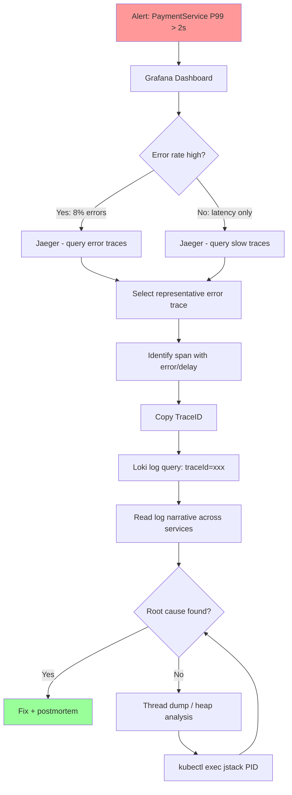

# Debugging Distributed Systems - Tracing and Root Cause Analysis

---

### 🎯 Model Answer

**30 seconds:**
> Debugging distributed systems means finding the root cause of failures that span multiple services. The core technique: distributed tracing with trace IDs that correlate all service logs for a single request. The debugging workflow: metrics alert on anomaly, traces identify which service and which span is failing, structured logs with the trace ID explain what the service did and why it failed. Without trace ID correlation, debugging a 10-service request requires searching logs independently across all 10 services, which is slow and error-prone.

**3 minutes:**
> The fundamental challenge in distributed debugging is that a single user request produces logs in 10 different services, and you need to reconstruct what happened. Without correlation: you search OrderService logs for the user's email and find the request. You note the timestamp. You search PaymentService logs for the same timestamp window. You hope the clock skew is small enough to find matching events. This takes 30+ minutes per incident. With distributed tracing and trace IDs: every log entry includes the trace ID. You search for the trace ID in Grafana and get every log entry from every service for that specific request, ordered by timestamp. The same investigation takes 2 minutes. The production debugging toolkit: (1) `kubectl logs -f pod-name --since=5m` for immediate pod logs. (2) Jaeger UI: search by service, trace duration, error status. (3) Grafana Loki: log query with trace ID filter. (4) `kubectl exec -it pod -- jstack PID` for Java thread dump (identify deadlocks or stuck threads). (5) `kubectl top pods` for CPU/memory anomalies. (6) `kubectl describe pod` for OOMKill events, restart counts. The discipline: never debug in production without these tools available. Time-to-resolution for P1 incidents should be under 15 minutes with proper observability - if it regularly takes hours, the observability infrastructure is insufficient.

**Blank Mind Recovery:**
**(1) Correlation key:** "Trace ID ties logs across all services for one request."
**(2) Workflow:** "Metrics (what's wrong) -> traces (which service) -> logs (why)."
**(3) Production tools:** "`kubectl logs`, `kubectl exec jstack`, `kubectl describe pod`, Jaeger, Loki."

---

### 📘 Concept Explanation

**What it is:**
Distributed debugging is the practice of identifying root causes of failures in systems where a single request spans multiple services, each with its own logs, metrics, and state. The core problem: correlation. Without it, debugging is reconstructing a puzzle from pieces scattered across 10 different boxes.

**Distributed debugging framework:**
```
LAYER 1 - SYMPTOM DETECTION:
  Source: Prometheus alert OR user report
  Data: metric anomaly (error rate, latency spike)
  Question: WHAT is broken?
  Tools: Grafana dashboards, PagerDuty alerts

LAYER 2 - SERVICE ISOLATION:
  Source: Distributed trace
  Data: trace with span durations and error tags
  Question: WHICH service is the source?
  Tools: Jaeger, Grafana Tempo

LAYER 3 - DETAIL ANALYSIS:
  Source: Structured logs with trace ID
  Data: log lines for the specific request
  Question: WHY did the service fail?
  Tools: Kibana, Grafana Loki

LAYER 4 - ROOT CAUSE:
  Source: Logs + code + dependencies
  Data: error message, stack trace, state
  Question: WHAT specifically caused the failure?
  May require: thread dump, heap dump, DB query analysis

LAYER 5 - IMPACT SCOPE:
  Source: All of the above across time
  Question: HOW MANY users/requests affected?
  Tools: Prometheus query, log count aggregation
```

**The trace: anatomy of a distributed request:**
```
TraceID: abc-123-def-456

Span 1: API Gateway           0ms -> 8ms
  Span 2: OrderService        2ms -> 185ms  <-- parent
    Span 3: InventoryService  5ms -> 22ms
    Span 4: PricingService    25ms -> 38ms
    Span 5: PaymentService    40ms -> 182ms <-- SLOW
      Span 6: DB Query        42ms -> 180ms <-- ROOT CAUSE
        Tag: db.statement: SELECT * FROM
             charges WHERE customer_id=?
        Tag: db.duration: 138ms
        Tag: error: true
        Tag: db.rows_examined: 2,847,293
```

**Clock skew and ordering:**
```
In distributed systems, clocks drift.
Log timestamps from different services may
be 50-200ms off from each other.

Problem: sorting logs by timestamp across
services gives wrong ordering.
Fix: use trace span offsets (relative to
trace start), not absolute timestamps.

Jaeger UI shows spans as a waterfall with
relative timing - correct even with clock skew.
Never manually reconstruct a trace from
raw timestamps across services.
```

**The key insight:**
The root cause of most production incidents in microservices is visible in the trace within 1-2 minutes if the trace data exists. Investing in trace coverage (ensuring all services are instrumented) is the highest-ROI debugging investment.

---

### 💻 Code Example

```java
// Production debugging toolkit usage

// Tool 1: Get structured logs for a trace ID
// Grafana Loki query:
// {namespace="production"} |= "traceId=abc-123-def-456"
// Returns all log lines from all services for this trace

// Tool 2: Add debugging log context (BAD)
@GetMapping("/orders/{id}")
public Order getOrder(@PathVariable String id) {
  // BAD: no trace context in log
  log.info("Getting order " + id);  // string concat
  // If this request fails: search 'Getting order'
  // in logs -> thousands of results, can't correlate
  // to the specific request that failed
  Order order = orderRepository.findById(id)
      .orElseThrow(NotFoundException::new);
  return order;
}

// Tool 2: Add debugging log context (GOOD)
@GetMapping("/orders/{id}")
public Order getOrder(@PathVariable String id) {
  // GOOD: structured log with correlation fields
  // MDC automatically includes traceId from
  // Micrometer Tracing
  log.info("Retrieving order",
      kv("orderId", id),
      kv("userId", getCurrentUserId()));
  
  try {
    Order order = orderRepository.findById(id)
        .orElseThrow(() ->
            new NotFoundException("Order not found",
                id));
    
    log.info("Order retrieved successfully",
        kv("orderId", id),
        kv("status", order.getStatus()),
        kv("itemCount", order.getItems().size()));
    
    return order;
  } catch (NotFoundException e) {
    // ERROR log includes all context needed to debug
    log.warn("Order not found",
        kv("orderId", id),
        kv("userId", getCurrentUserId()));
    throw e;
  }
}
// JSON log output:
// {
//   "level": "INFO",
//   "message": "Order retrieved successfully",
//   "traceId": "abc-123-def-456",  <- from MDC
//   "spanId": "def-789",           <- from MDC
//   "orderId": "order-999",
//   "status": "CONFIRMED",
//   "itemCount": 3,
//   "service": "order-service",
//   "timestamp": "2024-01-15T10:30:00.123Z"
// }
// Search: `traceId=abc-123-def-456` returns ALL
// logs for this specific request across ALL services
```

> **Code walkthrough:** Structured logging with key-value fields enables precise queries. The traceId in the MDC (automatically set by Micrometer Tracing) is included in every log line. A single Loki query `{traceId="abc-123-def-456"}` returns the complete log narrative for one specific request across all services, ordered by timestamp. BAD pattern: string concatenation logs with no structure - only searchable by exact string match, with no correlation across services.

```bash
# Production debugging playbook - bash commands

# 1. Identify affected pods
kubectl get pods -n production -l app=payment-service
kubectl describe pod payment-service-abc123 -n production
# Look for: Restart count, OOMKilled, last state

# 2. Tail logs from multiple pods simultaneously
kubectl logs -n production \
  -l app=payment-service --since=5m --prefix=true

# 3. Java thread dump (identify stuck threads)
# Find the Java PID inside the container
kubectl exec -n production payment-service-abc123 \
  -- ps aux | grep java
# Get thread dump
kubectl exec -n production payment-service-abc123 \
  -- jstack 1 > /tmp/payment-threaddump.txt
# Look for: BLOCKED threads, deadlocks, excessive
# threads waiting on DB connections

# 4. Check resource utilization
kubectl top pods -n production \
  -l app=payment-service --containers

# 5. Port-forward for local access to metrics endpoint
kubectl port-forward -n production \
  payment-service-abc123 9090:9090
# Then access: http://localhost:9090/actuator/metrics
#              http://localhost:9090/actuator/health

# 6. Check Kafka consumer lag (if applicable)
kubectl exec -n kafka kafka-0 -- \
  kafka-consumer-groups.sh \
    --bootstrap-server kafka:9092 \
    --describe \
    --group payment-service-group
# Look for: LAG column > 0 (consumer falling behind)
```

> **Code walkthrough:** Systematic layered debugging. Start with pod state (describe pod reveals OOMKill, restart reasons). Tail logs with `--prefix=true` to show which pod each log line came from. Thread dump identifies Java-level issues (connection pool exhaustion shows as BLOCKED threads waiting on borrow). Top pods shows if CPU/memory is the constraint. The Kafka consumer lag check identifies backlog issues before they cause visible user impact.

---

### 📊 Diagram

```
DISTRIBUTED DEBUGGING WORKFLOW

User report: "Checkout is slow"
          |
          v
[1] METRICS: Grafana alerts dashboard
    - OrderService HTTP P99 > 2s for 10 min
    - Error rate: normal (1-2%)
    - PaymentService error rate: 8%
          |
          v
[2] TRACES: Jaeger (filter: PaymentService errors)
    Trace: 4.2s total
    +-API Gateway:       8ms-+
    |  +-OrderService: 4195ms+|
    |  |  +-PaymentService: 4150ms (ERROR)-+|
    |  |  | +-Stripe API: TIMEOUT 3000ms-+ |
          |
          v
[3] LOGS: Loki (filter: traceId=abc123)
    OrderService:
      INFO "Creating order" orderId=X userId=Y
    PaymentService:
      ERROR "Stripe API timeout"
        stripeEndpoint=https://api.stripe.com
        timeoutMs=3000 attempt=1/3
    PaymentService:
      ERROR "Stripe API timeout" attempt=2/3
    PaymentService:
      ERROR "All retries exhausted"
          |
          v
[4] ROOT CAUSE:
    Stripe API experiencing degraded performance
    PaymentService retry policy: 3 attempts x 3s
    = 9 seconds added per request
    Fix: check Stripe status page + open circuit
         breaker to fail-fast during outage
```



> **Diagram walkthrough:** The debugging workflow is deterministic, not exploratory. Metrics narrow the scope to a service and time window. Traces identify the exact span (service + operation) causing the issue. Logs explain the why. Thread/heap analysis is a last resort when logs don't have enough detail. Following this workflow consistently turns P1 incidents from hours into minutes.

---

### 🏛️ System Design

**Problem:** Design a production debugging infrastructure for 200 microservices handling 50K requests/second. Requirements: (1) P1 incident root cause in under 15 minutes, (2) retain debugging data for 30 days, (3) budget-conscious (not unlimited cloud spend).

**Design:**

**Tracing: Grafana Tempo + 5% sampling**
- 50K req/s * 5% = 2,500 traces/s
- Average 15 spans per trace: 37,500 spans/s
- Each span ~500 bytes: ~18 MB/s
- 30 day retention: 18 MB/s * 86400 * 30 = ~46 TB
- Solution: Grafana Tempo with S3 backend (~$1,000/month storage)
- Priority sampling: always sample errors (100%), always sample slow traces (P99 > 2s threshold), random 1% for baseline

**Logs: Grafana Loki with structured JSON**
- All services emit JSON logs to stdout
- Kubernetes log collection via Promtail (DaemonSet)
- Loki with S3 backend
- Retention: 30 days hot + 90 days cold (compressed S3)
- Query: log query with trace ID correlation (Loki 2.x exemplar feature)
- Cost: ~$500/month for Loki at 50K req/s with INFO-level logging

**Metrics: Prometheus + 90-day retention**
- Prometheus with Thanos for long-term storage
- Alert Manager for P1/P2/P3 routing
- Grafana dashboards: per-service SLO dashboard
- Standard service mesh metrics from Istio (RED: Rate, Errors, Duration)

**Developer tooling:**
- Grafana as unified observability frontend (metrics, logs, traces in one UI)
- Exemplars: Prometheus metric anomalies link directly to representative traces
- Pre-built runbooks per alert type with debugging steps
- Oncall rotation + PagerDuty with escalation policies

**Total cost estimate:**
- Compute (Prometheus, Loki, Tempo): $2,000/month
- Storage (S3): $1,500/month  
- Grafana Cloud (alerting, dashboards): $500/month
- Total: ~$4,000/month for production-grade observability at 50K req/s

---

### 🎓 Answers by Seniority

**Junior / Mid:** "Debugging distributed systems is hard because you can't just check one log file. The key is trace IDs: a unique ID that travels with every request through all services. Every log message includes this ID. When something goes wrong, I find the trace in Jaeger to see which service was slow or erroring, then I search logs using that trace ID to find the detailed error messages in each service. I also use kubectl logs to see pod logs in real time and kubectl describe pod to check if pods are crashing."

**Senior / Staff:** "The debugging methodology determines time-to-resolution more than the tools themselves. The workflow must be deterministic: metrics alert, traces isolate, logs explain - always in that order. Two common mistakes teams make: (1) starting with logs before checking traces - you're searching in the dark without knowing which service to look at. (2) debugging only the service that reported the error rather than the trace - the service that reported the error is often not the service that caused it (PaymentService errors because InventoryService gave it bad data). At scale, the disciplines that matter most: 100% trace coverage (every service instrumented), structured logs with trace IDs (not printf-style), and pre-written runbooks per alert. When a P1 fires at 3am, the oncall engineer should not be inventing the debugging procedure - they should be executing a documented runbook."

---

### ⚠️ Common Misconceptions

**Misconception:** "If a service is logging errors, that service is the root cause of the problem."
Reality: In a distributed system, the service that logs errors is often downstream of the actual root cause. OrderService logs a 500 error because PaymentService returned a 500. PaymentService returned a 500 because its database connection pool was exhausted. The database connection pool was exhausted because a slow query was holding connections. The slow query was running because a missing index. The root cause is the missing index on the database. OrderService is merely the reporter of the downstream failure. Always trace the dependency chain to the origin. The span with the highest duration or the first ERROR in the trace is the starting point for root cause analysis, not the last service that reported an error.

---

### 🚨 Failure Modes and Diagnosis

**Failure: Trace data missing for a specific service - traces end at ServiceA, no spans from ServiceB**

Symptoms: In Jaeger, a trace shows ServiceA processing a request and making a call (the span child is present but empty or the call appears to succeed from ServiceA's perspective), but ServiceB has no corresponding span.

Root cause: ServiceB is not instrumented for tracing, or the trace context is not being propagated in the call from ServiceA to ServiceB. Common causes: ServiceB uses an HTTP client that doesn't propagate W3C TraceContext headers, ServiceB is called via a messaging system (Kafka) where trace headers are not included in the message.

Diagnosis: Check ServiceB's Micrometer Tracing configuration. Verify the traceparent header is present in the HTTP requests from ServiceA: `kubectl exec servicea-pod -- curl -v http://serviceb/api -H 'traceparent: 00-TRACE_ID-PARENT_SPAN_ID-01'` and check ServiceB's logs for trace context. Run `istioctl proxy-config log serviceb-pod --level debug` to see Envoy trace propagation.

Fix: Add Micrometer Tracing dependency to ServiceB. Configure the tracer bean. For Kafka: add a Kafka interceptor that extracts trace context from message headers. Verify with a test request that ServiceB appears in the trace.

---

### 🎯 Interview Deep-Dive

| Category | Time | Minimum |
|---|---|---|
| Definition | 2 min | 1 |
| Mechanism | 3 min | 2 |
| Tools | 3 min | 2 |
| Scenario | 5 min | 2 |
| Debugging | 5 min | 2 |
| Anti-pattern | 2 min | 1 |
| Design | 3 min | 1 |
| Behavioral | 3 min | 1 |
| Scale | 2 min | 1 |
| Trade-off | 2 min | 1 |
| Comparison | 2 min | 1 |
| Advanced | 3 min | 1 |

#### Q1 - "Walk me through debugging a production P1: checkout failure rate spiked to 15%."
> "Start with scope: is this 15% of all checkouts or 15% of a specific user segment? Check Grafana: is the error rate spike uniform across regions or localized? Is it all services or specific ones? Step 1: Grafana alert dashboard - see which service has elevated error rate. Hypothesis: API Gateway is healthy, OrderService error rate = 15%. Step 2: Jaeger - query OrderService traces from last 10 minutes, filter error=true. Select 3-5 representative failing traces. What do they have in common? Step 3: Trace analysis - all failing traces show: OrderService calls PaymentService, PaymentService returns 503. Step 4: Check PaymentService independently - is it healthy? `kubectl get pods -l app=payment-service`. All pods running. `kubectl logs -l app=payment-service --since=5m`: repeated 'Connection pool exhausted' messages. Step 5: PaymentService metrics in Grafana: DB connection pool utilization = 100% for last 20 minutes. Step 6: Find what's holding connections: `kubectl exec payment-pod -- jstack 1` -> see 50 threads BLOCKED on 'borrow connection from pool'. Step 7: Check slow queries in database monitoring - find a query with no index doing full table scan. Add index. Connection pool clears. Error rate drops to 0%."

*What separates good from great:* "Speed is the P1 metric. Time from alert to root cause should be under 15 minutes with proper observability. Every minute of debugging that doesn't use traces + structured logs is a minute wasted. The jstack command is the last resort, not the first. For this specific failure mode (connection pool exhaustion): monitoring DB connection pool utilization as a Prometheus metric with an alert at 80% would have caught this before the P1."

---

#### Q2 - "How do you debug a timing-sensitive race condition in a distributed system?"
> "Race conditions in distributed systems manifest as occasional failures that are hard to reproduce. Approach: (1) Capture the failing trace completely. The trace shows the exact timing of events across services. A race condition manifests as: Event A processed at T+50ms, Event B processed at T+51ms, but the system assumed A would always happen before B. (2) Add event sequencing logs: log the sequence of state transitions with timestamps and the preceding event. Look for cases where the sequence is reversed. (3) Add correlation IDs to events: if the race is between OrderCreated and PaymentCompleted events: log the order ID in both handlers, correlation key in Kafka messages. (4) Reproduce in staging: use Istio fault injection to add artificial delays to specific services. Increase the likelihood of the race condition triggering. (5) Fix options: add idempotency checks, use optimistic locking with version fields, redesign to use a saga pattern with explicit state machine, or make the operation commutative (order doesn't matter)."

*What separates good from great:* "Deterministic replay is the goal: if you can capture all the inputs (event order, timestamps) that caused the failure, you can replay them in a controlled environment. Event-sourced systems support this natively. In event-sourced systems, the race condition replay shows exactly which event ordering caused the inconsistency. The fix: add an ordering constraint (accept only events with version > current version) or accept both orderings as valid (design for eventual consistency)."

---

#### Q3 - "How do you debug a memory leak in a containerized Java service?"
> "Memory leak in a container: the pod eventually gets OOMKilled (Out of Memory Killed). Detection: `kubectl describe pod payment-service-abc` shows Last State: OOMKilled. `kubectl top pods -l app=payment-service` shows memory growing over time. Diagnosis: (1) Prometheus metric: jvm_memory_used_bytes{area='heap'} for the service over time. Is it growing monotonically (leak) or sawtoothing (GC is working)? (2) If growing: capture a heap dump before OOMKill. Configure JVM flags: `-XX:+HeapDumpOnOutOfMemoryError -XX:HeapDumpPath=/tmp/heap.hprof`. Or trigger manually: `kubectl exec payment-pod -- jcmd 1 GC.heap_dump /tmp/heap.hprof`. Copy heap dump: `kubectl cp payment-pod:/tmp/heap.hprof ./heap.hprof`. Analyze with Eclipse MAT or JProfiler. (3) Common causes in microservices: HTTP connection pools not being closed, static caches growing unboundedly, event listeners not deregistered, Hibernate L2 cache with unbounded size. (4) Fix: identify the dominant object type in the heap dump. Find who is holding references. Fix the root cause (close connections, add cache eviction, deregister listeners)."

*What separates good from great:* "Container memory limits are harder to tune than JVM heap sizes. The container limit includes native memory + metaspace + heap + thread stacks. A common mistake: setting JVM -Xmx to the same value as the container memory limit. This causes OOMKill on any native memory allocation. Recommended: -Xmx should be 50-70% of container memory limit, leaving room for native memory. G1GC is more container-friendly than CMS: it respects MaxHeapFreeRatio settings and returns memory to the OS."

---

#### Q4 - "How do you find the root cause when a service is slow but not erroring?"
> "Latency without errors is harder than latency with errors because there's no stack trace to follow. Approach: (1) Trace analysis: find traces in the 95th-99th percentile latency range. Sort by duration. Compare slow traces to fast traces for the same service. What is different? (2) Span comparison: which span is disproportionately larger in slow traces? If PaymentService is slow in all 95th percentile traces, and within PaymentService the DB span is large: it's a database issue. (3) Correlation with time: is latency elevated since a recent deployment? Check deployment timestamps vs latency graph. Is it elevated during specific time windows (peak load hours)? (4) Request characteristics: do slow requests share common attributes (specific customer tier, specific product category, specific geographic region)? This indicates data-dependent issues (missing index on customer_id, for example). (5) Database investigation: slow query log in the DB. `EXPLAIN ANALYZE` on the query identified in the trace span."

*What separates good from great:* "Continuous profiling (Pyroscope, Parca) complements traces for this scenario. Continuous profiling captures CPU call stacks for all requests all the time (low overhead). A slow service that has no obvious latency spike in any span might be CPU-bound: the profiler shows which code path is consuming CPU. This level of insight is impossible from traces or logs alone."

---

#### Q5 - "What debugging data should be captured automatically for every request?"
> "Minimum automatic capture per request: (1) Trace ID (auto by Micrometer Tracing). (2) Span timing with service name (auto by Micrometer Tracing). (3) HTTP status code as metric label (auto by Spring Boot actuator). (4) Error flag in trace span (auto when exception propagates). (5) Service instance ID (pod name/hostname) in logs (auto by MDC configuration). Additional valuable context (add at application level): (6) User/tenant ID from JWT in MDC (add in request filter). (7) Feature flags active for this request. (8) Request source (which client application, version). (9) Business operation type (checkout, refund, view) as trace tag. What NOT to log automatically: passwords, payment card numbers, PII fields (GDPR compliance), large request/response bodies. Add request body logging only on debug flag, never in production by default."

*What separates good from great:* "Dynamic log level adjustment: in production, services run at INFO. When a specific pod is misbehaving, you want DEBUG-level logs without restarting the pod. Spring Boot Actuator: POST to /actuator/loggers/com.example.payment with level=DEBUG enables debug logging for that package at runtime. When debugging is done: set back to INFO. This avoids the performance penalty of debug logging in steady state while providing granular visibility when needed."

---

#### Q6 - "How do you debug a cascading failure in a microservices system?"
> "Cascading failure: Service A is slow, causing Service B (which calls A) to use all its threads waiting for A, making Service B slow, causing Service C (which calls B) to exhaust its threads. The cascade spreads from one service to the entire system. Debugging: (1) The first indicator: in the trace, the earliest timestamp with elevated latency is the origin. The service with the high latency at the START of the cascade is the root cause. Services at the end of the cascade show high latency BECAUSE of the upstream service. (2) Metrics: check the time series for each service's latency. Which service's latency increased first? The timeline is visible in Prometheus metrics. (3) Thread pool metrics: jvm_threads_states_threads{state='waiting'} - the cascaded services will show thread exhaustion (most threads in waiting state). Prevention: circuit breakers prevent cascading by failing fast when an upstream service is slow. Diagnosis: 'which service's circuit breaker should have opened?' reveals the missing circuit breaker."

*What separates good from great:* "Chaos engineering (Netflix Chaos Monkey approach): deliberately inject failures and latency into services in a staging environment to verify that circuit breakers, timeouts, and fallbacks work correctly before production failures expose them. If a 5-second latency injection to ServiceA causes ServiceB to exhaust threads: you've found a missing circuit breaker BEFORE it causes a production cascading failure."

---

#### Q7 - "How do you debug a Kafka consumer that is falling behind?"
> "Consumer lag: the consumer group is processing messages slower than they arrive. Detection: Prometheus metric kafka_consumer_group_lag or the Kafka JMX metrics consumer-fetch-manager-metrics records-lag-max. Diagnosis flow: (1) Partition assignment: `kubectl exec kafka-pod -- kafka-consumer-groups.sh --bootstrap-server kafka:9092 --describe --group payment-group`. Shows per-partition lag. If one partition has all the lag: a specific partition's messages are slow or one consumer is unhealthy. (2) Consumer throughput: check the consumer's message processing rate vs message arrival rate. If processing rate < arrival rate: the consumer is too slow. (3) Slow message identification: add processing duration logging per message. `log.info(\"Message processed\", kv(\"duration_ms\", processingMs), kv(\"topic\", topic), kv(\"partition\", partition))`. Find the slow messages. (4) Common causes: downstream service slow (synchronous call within consumer), database slow query, CPU saturation, N+1 query per message. (5) Fix options: scale consumer (add instances - increases partition parallelism), optimize the processing logic, add a batch consumer (process N messages at once instead of 1)."

*What separates good from great:* "Consumer lag is a leading indicator of downstream impact. At 0 lag: real-time processing. At 10K lag: 10,000 messages buffered, processing is delayed. At 1M lag: hours of delay. A consumer lag alert at 1000 messages (before user-visible impact) is better than an alert when users report delays. The alert threshold should be set based on the message arrival rate: at 1000 msg/s arrival rate, 1000 lag = 1 second behind. At 10 msg/s, 1000 lag = 100 seconds behind. Lag absolute values need context."

---

#### Q8 - "What is the difference between mean latency, P95, and P99? When do you use each?"
> "Mean (average) latency: the total latency divided by request count. Hides outliers. 999 requests at 10ms + 1 request at 10,000ms = mean of 19.9ms. The user who experienced 10,000ms would say the service is broken. Mean latency makes services look better than they are. P50 (median): 50% of requests are faster than this. Better than mean but still hides the tail. P95: 95% of requests are faster than this. 5% are slower. Typical SLO metric for internal services (high volume, acceptable to have some slow requests). P99: 99% of requests are faster than this. 1% are slower. Typical SLO metric for user-facing services (users notice this threshold). P99.9 (one in a thousand requests is slower): used for payment processing, healthcare, safety-critical systems where even rare failures have high impact. Which to use: for dashboards: show P50, P95, P99 all together. P50 for typical experience, P99 for tail experience. For SLO: use the percentile that matches the user experience you're committing to. For capacity planning: P99 determines peak resource requirements (you must handle the slowest 1% without system degradation)."

*What separates good from great:* "Histograms vs summaries: Prometheus summaries compute quantiles client-side (cannot be aggregated across instances). Prometheus histograms compute quantiles server-side (can aggregate across instances). For microservices with multiple pods: always use histograms. Summary P99 for a service with 10 pods is the average of 10 per-pod P99 values, not the actual P99 across all requests. Histogram P99 is computed from all requests across all pods."

---

#### Q9 - "How do you build and maintain a debugging playbook for a production system?"
> "Playbook structure: one playbook per alert. Each playbook contains: (1) Alert description: what does this alert mean, what metric triggered it, what is the normal range. (2) Initial triage: commands to run in the first 2 minutes. `kubectl get pods`, `kubectl logs`, check Grafana dashboard link. (3) Investigation steps: step-by-step with expected outputs. 'Run kubectl top pods - if payment-service shows > 80% CPU: proceed to step 5'. (4) Common causes and fixes: the 5 most common root causes for this alert with their diagnosis and resolution. (5) Escalation criteria: if you cannot resolve in 30 minutes, escalate to who with what information. (6) Rollback procedure: specific commands to roll back the most recent deployment. Building the playbook: write the first version during the initial incident. Update it after every incident. Mandate that oncall engineers document what they did differently from the playbook. The playbook is a living document: it improves every time an alert fires."

*What separates good from great:* "Runbook automation: convert the most common diagnosis steps into CLI tools or operator scripts. `payment-diagnose.sh` runs all the kubectl commands, checks Prometheus metrics, and outputs a diagnosis summary. The oncall engineer runs one script instead of 10 manual commands. This reduces human error at 3am and ensures consistent investigation steps. Tools like Kubectl-based operators or Chaos Toolkit can automate both diagnosis and remediation."

---

#### Q10 - "What is continuous profiling and when should you use it?"
> "Continuous profiling: always-on CPU and memory profiling with low overhead (< 1% CPU). Traditional profiling: manually attached to a running process, high overhead, not suitable for production. Continuous profiling tools: Pyroscope, Parca (open source), Grafana Pyroscope, Datadog Continuous Profiling. How it works: profiler samples stack traces at a fixed rate (100 Hz = 100 samples/second). Each sample captures the active code path. Over time: builds a statistical picture of where CPU time is spent. Flamegraph visualization: shows call stack depth horizontally, CPU time as width. Wide boxes = hot code paths. When to use: (1) Service is slow but traces show no single slow span (CPU-bound, not I/O-bound). (2) Memory is growing and heap dumps are too expensive or disruptive. (3) Performance regression after a deployment (compare flamegraph before/after). (4) Cost optimization (identify where CPU is wasted). Continuous profiling completes the observability stack: metrics show WHAT is slow, traces show WHERE in the call graph, profiles show WHICH CODE is causing the slowdown."

*What separates good from great:* "Profiling in production requires the profiler overhead to be genuinely low. In Java: async-profiler is the production-safe choice (vs YourKit which is too high overhead for production). async-profiler does not use bytecode instrumentation - it uses OS-level sampling (perf_events on Linux). The overhead at 100 Hz sampling is typically 0.5-1% CPU. This is the acceptable production threshold. Enable continuous profiling for all services by default if your budget allows - the cost of an undiagnosed performance issue exceeds the profiler infrastructure cost."

---

#### Q11 - "How do you correlate an infrastructure event (node restart, network partition) with application behavior?"
> "Infrastructure-to-application correlation: (1) Timeline: when did the node restart? `kubectl get events -n kube-system | grep -i node | sort -k1`. Map this timestamp to the application error spike in Grafana. Do they correlate? (2) Pod scheduling: after a node restart, pods are rescheduled. The rescheduling causes brief unavailability. Kubernetes probe (readiness probe) prevents traffic until the new pod is healthy, but there is a gap. Check if the error spike duration matches the pod startup time. (3) Network partition effects: pods on the partitioned node lose connections to other services. Connection pool connections are lost silently (they appear open but are dead). When the partition resolves, the next request on those connections fails. Fix: enable TCP keepalive + connection validation before borrowing from pool. (4) DNS cache issues: pods cache DNS lookups. After a service restarts with a new IP, pods with long TTL DNS caches route to the old IP. `nscd` (Name Service Cache Daemon) misconfiguration causes this. Check: `kubectl exec pod -- cat /etc/resolv.conf` for the DNS search path. Set application DNS TTL to match Kubernetes service TTL (typically 5-30 seconds)."

*What separates good from great:* "Kubernetes events as metrics: configure a Kubernetes event exporter (kube-event-exporter) to send Kubernetes events (pod evictions, OOMKills, node NotReady) as Prometheus metrics or to the logging stack. This creates a unified timeline: infrastructure events and application metrics on the same Grafana dashboard. The correlation between 'node NotReady event' and 'error rate spike' becomes visible in a single view."

---

#### Q12 - "How do you debug a gradual performance degradation that accumulates over hours?"
> "Gradual degradation: latency or error rate slowly worsens over hours, not a sudden spike. Causes: memory leaks (connection pool exhaustion, heap growth), cache filling to maximum (eviction starts slowing performance), thread pool configuration (bounded queue filling up), database table growth (query performance degrades as rows increase), log disk filling (log writes slow the application). Diagnosis approach: (1) Plot all metrics over a 24-hour window, not just the last 5 minutes. The trend is the signal. (2) Identify the inflection point: when did degradation begin? Correlate with deployments, traffic pattern changes, data volume changes. (3) Resource exhaustion pattern: plot all resource metrics (heap, thread pools, connection pools, disk). Which one is growing monotonically? (4) Heap growth: jvm_memory_used_bytes{area='heap'} over 24 hours. If monotonically increasing and not plateauing after GC: memory leak. (5) Connection pool growth: datasource_connections_active over 24 hours. If growing and not returning to baseline: connections are not being released. Fix: the resource growing without bound is the root cause. Add monitoring with alerts at 80% of capacity to catch gradual degradation before it becomes a P1."

*What separates good from great:* "Metric retention matters: a 5-minute retention window shows P1 spikes. A 24-hour window shows gradual degradation. A 7-day window shows weekly traffic patterns. Configure Prometheus retention appropriately (default 15 days is usually sufficient). For long-term trend analysis (quarterly capacity planning), Thanos or Cortex provides multi-year metric retention."

---

### ⚖️ Comparison Table

| Debugging Tool | Use When | Best For | Limitations |
|---|---|---|---|
| kubectl logs | Service is erroring, need immediate output | Quick pod log view | No cross-service correlation |
| Distributed Traces (Jaeger) | Need to identify which service is slow/failing | Request flow visualization | Requires trace instrumentation |
| Structured Logs (Loki) | Know the trace ID, need detail | Detailed event narrative | High storage volume |
| Thread Dump (jstack) | Service is slow/stuck, no log insight | Blocked thread identification | Point-in-time only |
| Heap Dump (jmap) | Memory growing, OOMKill risk | Memory leak root cause | Large file, offline analysis |
| Continuous Profiling | Latency without obvious cause | CPU hotspot identification | Requires profiler deployment |
| Metrics (Prometheus) | Alert fired, what is wrong? | Trend + scope identification | No per-request detail |
