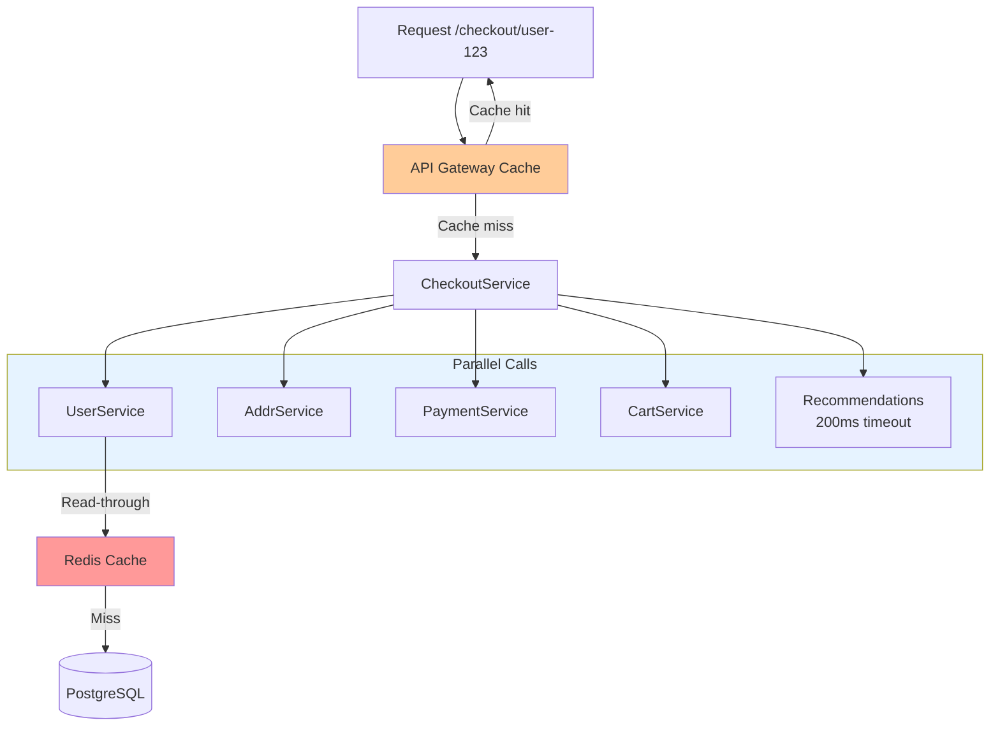

## Keywords in This File
{: .no_toc }

| # | Keyword | Weight |
|---|---|---|
| 1 | [Microservices Performance at Scale](#microservices-performance-at-scale) | medium |

---

# Microservices Performance at Scale

---

### 🎯 Model Answer

**30 seconds:**
> Microservices performance problems are fundamentally different from monolith performance problems: every service boundary introduces network latency (1-5ms each), serialization overhead, and connection management costs that don't exist in a monolith. Optimizing performance in microservices means: minimizing inter-service calls in hot paths, using asynchronous communication for non-critical work, implementing caching at the right granularity, and designing APIs that return data in the shape callers need (avoiding multiple round trips for a single user action).

**3 minutes:**
> The microservices performance equation: total response time = business logic time + (N x inter-service call time). In a monolith: business logic time only. Each service hop adds 2-10ms of overhead (network round trip + serialization/deserialization). A checkout flow with 10 sequential hops: 10 x 5ms = 50ms of pure overhead before any business logic. Parallel calls reduce this: 10 calls in parallel take max(individual durations) instead of sum. But parallelization has limits: some calls are data-dependent (need result of call A before making call B). Performance optimization hierarchy: (1) First: eliminate unnecessary calls. If ServiceA calls ServiceB for data that could be stored in ServiceA (event-driven snapshot): that's 5ms saved forever. (2) Second: parallelize independent calls. CompletableFuture.allOf() for independent service calls runs them simultaneously. (3) Third: cache aggressively at the right layer. API Gateway cache eliminates calls entirely. (4) Fourth: optimize the underlying service (database queries, connection pooling). (5) Last: scale horizontally. Horizontal scaling is the right answer for throughput, not for latency. Latency is determined by the critical path. Adding more pods does not reduce response time for a user's single request.

**Blank Mind Recovery:**
**(1) Core problem:** "Each service hop adds 5ms. 10 hops = 50ms overhead. Reduce hops or parallelize."
**(2) Optimization order:** "Eliminate calls > parallelize > cache > optimize individual services > scale."
**(3) Key distinction:** "Horizontal scaling improves throughput, not individual request latency."

---

### 📘 Concept Explanation

**What it is:**
Microservices performance optimization is the practice of designing service interactions, data access patterns, and communication protocols to minimize response time and maximize throughput at scale.

**The performance tax of microservices:**
```
Monolith call (in-process):
  methodA() -> methodB()
  Cost: ~microseconds
  Serialization: none
  Network: none
  Connection management: none

Microservice call (HTTP):
  serviceA -> HTTP -> serviceB
  Cost: 1-10ms
  Breakdown:
    DNS lookup: 0.1ms (cached)
    TCP handshake: 0.5ms (if new connection)
    TLS handshake: 1ms (if mTLS, new connection)
    Serialization (JSON): 0.2ms
    Network transit: 0.1ms (same datacenter)
    Deserialization: 0.2ms
    Total: 2-3ms per call (with connection pooling)
    Total: 5-10ms per call (new connections)

100 req/s with 10 sequential hops:
  100 x 10 x 5ms = 5,000ms of overhead per second
  At 1,000 req/s: 50,000ms of overhead per second
  = 50 cores just to absorb serialization overhead
```

> **Code walkthrough:** This Microservices Performance at Scale example demonstrates a key concept in practice. **KEY MECHANISM:** the runtime executes these instructions in sequence with specific memory and execution semantics. **WHY IT MATTERS:** misapplying this pattern causes subtle bugs that only manifest under production load. **TAKEAWAY: understand the execution model before using this pattern in production code.**

**Amdahl's Law applied to microservices:**
```
Sequential hops CANNOT be parallelized:
  Call A (5ms) -> depends on A's result
  Call B (5ms) -> depends on A's result
  Call C (5ms) -> depends on B's result
  Total: 15ms minimum (sequential)

Independent calls CAN be parallelized:
  Call A (5ms) \
  Call B (3ms)  -> all return at 5ms
  Call C (7ms) /
  Total: 7ms (max of parallel)

The critical path determines minimum latency.
No amount of parallelization reduces it further.
Design: find the critical path. Eliminate every
step on it that can be eliminated.
```

> **Code walkthrough:** This Microservices Performance at Scale example demonstrates a key concept in practice. **KEY MECHANISM:** the runtime executes these instructions in sequence with specific memory and execution semantics. **WHY IT MATTERS:** misapplying this pattern causes subtle bugs that only manifest under production load. **TAKEAWAY: understand the execution model before using this pattern in production code.**

**API design for performance:**
```
BAD: Chatty API pattern
  GET /users/{id}                -> 5ms
  GET /users/{id}/addresses      -> 5ms
  GET /users/{id}/payment-methods-> 5ms
  GET /orders?userId={id}        -> 5ms
  Total: 20ms for checkout page data

GOOD: Purpose-built API
  GET /checkout-context/{userId} -> 5ms
  Returns: { user, addresses,
    payment_methods, recent_orders }
  Total: 5ms
  
  GraphQL alternative:
  POST /graphql with query:
  { user(id: X) { 
      name email
      addresses { street city }
      paymentMethods { last4 type }
      recentOrders(limit:5) { id total }
  }}
  Total: 5ms (single request,
  resolver parallelizes sub-fields)
```

> **Code walkthrough:** This Microservices Performance at Scale example demonstrates a key concept in practice. **KEY MECHANISM:** the runtime executes these instructions in sequence with specific memory and execution semantics. **WHY IT MATTERS:** misapplying this pattern causes subtle bugs that only manifest under production load. **TAKEAWAY: understand the execution model before using this pattern in production code.**

**The key insight:**
The most impactful performance optimization in microservices is not improving individual service latency - it is reducing the number of sequential service calls in the critical path. Reducing 10 sequential calls to 5 parallel calls reduces latency by more than making each of the 10 calls twice as fast.

---

### 💻 Code Example

```java
// BAD: Sequential service calls
@GetMapping("/checkout/{userId}")
public CheckoutPage getCheckoutPage(
    @PathVariable String userId) {
  
  // Sequential: each call waits for previous
  User user = userClient.getUser(userId);    // 5ms
  List<Address> addrs = userClient           // 5ms
      .getAddresses(userId);
  List<PaymentMethod> payments = paymentClient // 5ms
      .getPaymentMethods(userId);
  Cart cart = cartClient.getCart(userId);    // 5ms
  List<String> recommendations =             // 10ms
      recommendationClient.get(userId);
  
  // Total: 30ms sequential overhead
  return CheckoutPage.builder()
      .user(user)
      .addresses(addrs)
      .paymentMethods(payments)
      .cart(cart)
      .recommendations(recommendations)
      .build();
}
```

> **Code walkthrough:** Five sequential API calls where none depends on the result of the previous. Total latency: 30ms of pure network overhead. If any one service is slow: the entire checkout page is slow. If any one service is down: the entire page fails.

```java
// GOOD: Parallel service calls
@GetMapping("/checkout/{userId}")
public CheckoutPage getCheckoutPage(
    @PathVariable String userId) {
  
  // All 5 calls launched simultaneously
  CompletableFuture<User> userFuture =
      CompletableFuture.supplyAsync(
          () -> userClient.getUser(userId),
          executor);
  CompletableFuture<List<Address>> addrFuture =
      CompletableFuture.supplyAsync(
          () -> userClient.getAddresses(userId),
          executor);
  CompletableFuture<List<PaymentMethod>> payFuture =
      CompletableFuture.supplyAsync(
          () -> paymentClient
              .getPaymentMethods(userId),
          executor);
  CompletableFuture<Cart> cartFuture =
      CompletableFuture.supplyAsync(
          () -> cartClient.getCart(userId),
          executor);
  
  // Recommendations: non-critical, timeout quickly
  CompletableFuture<List<String>> recFuture =
      CompletableFuture.supplyAsync(
          () -> recommendationClient.get(userId),
          executor)
      .orTimeout(200, TimeUnit.MILLISECONDS)
      .exceptionally(ex -> List.of()); // fallback

  // Wait for all with overall timeout
  CompletableFuture.allOf(
      userFuture, addrFuture, payFuture,
      cartFuture, recFuture)
      .get(500, TimeUnit.MILLISECONDS);

  // Total: max(5ms, 5ms, 5ms, 5ms, 10ms) = 10ms
  return CheckoutPage.builder()
      .user(userFuture.join())
      .addresses(addrFuture.join())
      .paymentMethods(payFuture.join())
      .cart(cartFuture.join())
      .recommendations(recFuture.join())
      .build();
  // Latency: 10ms instead of 30ms
  // If recommendations slow: 200ms cap, 
  // returns empty list (graceful degradation)
}
```

> **Code walkthrough:** All five calls launch simultaneously via CompletableFuture.supplyAsync(). allOf() waits for all to complete. Latency = max(individual latencies) = 10ms instead of 30ms. The recommendations call is non-critical: it has a 200ms timeout and falls back to an empty list. This is graceful degradation - a slow recommendation service doesn't slow down checkout. The overall 500ms timeout ensures the endpoint never hangs indefinitely if a service is completely unresponsive.

---

### 📊 Diagram

```
MICROSERVICES PERFORMANCE OPTIMIZATION LAYERS

USER REQUEST: GET /checkout/user-123

LAYER 1 - EDGE CACHE (API Gateway):
  Cold: pass through to services
  Warm: return cached response (0ms)
  TTL: 30-60s for product catalog
  NOT for: personalized data (cart, user prefs)

LAYER 2 - PARALLEL CALLS (Service Layer):
  BEFORE:                AFTER:
  UserService   5ms  \   All simultaneously:
  AddrService   5ms   >  UserService  5ms \
  PayService    5ms  /   AddrService  3ms  -> 10ms
  CartService  10ms      PayService   7ms /
  Total:  25ms           CartService 10ms
                         Total:      10ms

LAYER 3 - RESILIENCE (Timeouts/Fallback):
  Non-critical services: 200ms cap
  Fallback: empty list / cached result
  Critical services: 500ms cap + circuit breaker

LAYER 4 - SERVICE CACHE (Redis):
  Hot data: user profile, product catalog
  TTL: 5-60 minutes
  Reduces DB calls and service-to-service calls
  Consistency: cache invalidation on write events

LAYER 5 - DATABASE (Connection Pool + Indexing):
  Connection pool: right-sized (not too small,
    not too large - both are problematic)
  Read replicas: separate read traffic
  Indexes: every common WHERE clause covered
```



> **Diagram walkthrough:** Performance optimization is layered. The API Gateway cache eliminates the request entirely for cacheable responses. Parallel calls reduce latency from sum to max. Redis reduces the downstream load on services and databases. Each layer addresses a different bottleneck. The key is applying the right optimization at the right layer: caching catalog data at the edge makes sense, but caching user cart data at the edge is wrong (stale data for the user's own personalized state).

---

### 🏛️ System Design

**Problem:** Design a performance optimization strategy for an e-commerce microservices platform handling 50K requests/second at peak. Current issues: checkout page P99 = 4 seconds, order creation P99 = 2 seconds. SLO target: checkout P99 < 500ms, order creation P99 < 1 second.

**Analysis:**
Checkout page at 4s: likely sequential service calls for a page with many data sources (user, addresses, cart, recommendations, inventory status per item).
Order creation at 2s: likely synchronous downstream processing that should be async.

**Design for Checkout (4s -> 500ms):**
1. Profile the checkout endpoint: identify all downstream service calls
2. Parallelize all independent calls (CompletableFuture.allOf)
3. Identify critical vs non-critical data: recommendations = non-critical (200ms cap, fallback empty)
4. Add Redis cache for product catalog data (changes infrequently): TTL 5 minutes
5. Add API Gateway cache for catalog-only pages: TTL 30 seconds
6. Pre-warm user data: publish UserUpdated events, maintain a CheckoutService local cache of user preferences and addresses (event-sourced read model)
7. Target: parallel calls (500ms at 99th percentile of max service call duration)

**Design for Order Creation (2s -> 1s):**
1. Order creation synchronous path: validate, persist, return order ID = ~100ms
2. Move all downstream work to async: inventory reservation via Kafka, payment processing via Kafka saga, fulfillment notification via Kafka
3. Return 202 Accepted with order ID immediately after persistence
4. Users see "Order confirmed, processing" instantly
5. Polling endpoint or WebSocket push for order status updates
6. Target: 100ms for synchronous path (persist and confirm)

**Infrastructure for 50K req/s:**
- Auto-scaling: HPA on CPU and request rate metrics
- Connection pooling: validated and right-sized per service (not 100 connections from 50 pods to a DB with 100 max connections = deadlock)
- HTTP/2: reduce TCP connection overhead between services
- gRPC for internal service communication: binary protocol (faster than JSON)

---

### 🎓 Answers by Seniority

**Junior / Mid:** "Microservices performance is affected by the number of inter-service calls because each one adds network latency. To optimize, I would first measure where the time is actually being spent using distributed traces - the trace shows which service calls are slow. Common optimizations: make independent service calls in parallel instead of sequentially, add Redis caching for data that doesn't change often, and move non-critical processing to background jobs. The key is always measure first before optimizing."

**Senior / Staff:** "Performance in microservices has three distinct dimensions that require different solutions. Latency (individual request response time) is dominated by the critical path: the chain of sequential service calls that must complete before responding. Parallelizing independent calls and eliminating unnecessary calls are the highest-impact optimizations. Throughput (requests per second the system can handle) is dominated by the bottleneck resource: whichever service, database, or shared resource runs out of capacity first. Horizontal scaling addresses throughput, not latency. Tail latency (P99, P99.9) is often dominated by outlier behavior: GC pauses, cache misses, connection pool exhaustion, or a slow database query. Percentile-based metrics and profiling identify tail latency sources. At 50K req/s, the compounding effect of small optimizations is significant: saving 2ms per checkout call saves 100 seconds of compute per second across the fleet."

---

### ⚠️ Common Misconceptions

**Misconception:** "Adding more service instances will reduce response time for users."
Reality: Horizontal scaling increases throughput (how many requests per second the system can handle simultaneously) but does NOT reduce latency for individual requests. If a single checkout request takes 4 seconds because of 8 sequential service calls, adding 10x more pods still takes 4 seconds for each individual request. Each of those 8 sequential calls must complete before the next one starts - more pods doesn't change the sequential nature of the calls. Latency reduction requires architecture changes: parallelizing calls, eliminating unnecessary calls, adding caches, or redesigning to return pre-computed data. Horizontal scaling is the right answer to throughput problems: more users can use the 4-second checkout simultaneously, but each still waits 4 seconds.

---

### 🚨 Failure Modes and Diagnosis

**Failure: Service latency acceptable at low load, degrades severely at peak**

Symptoms: P99 latency at 100 req/s = 50ms. P99 at 1000 req/s = 2000ms. Linear throughput but superlinear latency increase. Service appears healthy (no errors), but slow.

Root cause: Database connection pool too small. At 100 req/s: 5 connections sufficient, 0 wait time. At 1000 req/s: threads waiting for a connection from the pool. Queue grows. P99 latency = business logic time + queue wait time. Each millisecond of queue wait adds to P99.

Diagnosis: Prometheus metric datasource_connections_pending (or HikariPool.PendingConnections). If this metric > 0 during peak load: connection pool is the bottleneck. Also check datasource_connections_active vs datasource_connections_max. If active == max consistently: pool exhausted.

Fix: Increase pool size (datasource.hikari.maximum-pool-size). But validate against database's max_connections. If 50 pods x 50 pool size = 2500 connections, and PostgreSQL max_connections = 200: you'll hit the database limit. Add PgBouncer (PostgreSQL connection pooler) to multiplex application connections to a smaller number of database connections. Right sizing: pool_size per pod = (db_max_connections * 0.8) / pod_count.

---

### 🎯 Interview Deep-Dive

| Category | Time | Minimum |
|---|---|---|
| Definition | 2 min | 1 |
| Mechanism | 3 min | 2 |
| Optimization | 5 min | 3 |
| Scenario | 5 min | 2 |
| Debugging | 3 min | 2 |
| Scale | 3 min | 1 |
| Trade-off | 3 min | 1 |
| Design | 5 min | 1 |
| Anti-pattern | 2 min | 1 |
| Comparison | 2 min | 1 |
| Behavioral | 3 min | 1 |
| Advanced | 3 min | 1 |

**[JUNIOR] Q1 - [CONCEPTUAL] "What is the performance cost of service-to-service communication?"**
> "Per-call overhead breakdown: (1) DNS resolution: ~0.1ms with caching (Kubernetes CoreDNS). (2) TCP connection establishment: 0.5ms for new connections (SYN-SYN/ACK-ACK). Eliminated with connection pooling (reuse existing connections). (3) TLS handshake (if mTLS): 1-2ms for new connections. Eliminated by TLS session resumption and connection reuse. (4) HTTP request serialization (JSON): 0.1-0.5ms for a typical request (1KB-10KB payload). (5) Network transit: 0.1ms for same-datacenter, 1-2ms for cross-AZ, 20-100ms for cross-region. (6) Server processing: the actual business logic. (7) Response deserialization: 0.1-0.5ms. Total with connection pooling + HTTP/2 multiplexing: 2-5ms overhead per call. Without connection pooling (new connections): 5-15ms. Eliminating one service hop saves this entire overhead permanently. Over 1M calls/day: 1M x 5ms = 1.4 CPU-hours saved per day from one eliminated hop."

*What separates good from great:* "HTTP/2 multiplexing: multiple requests share one TCP+TLS connection. The first request pays the connection setup cost (3-5ms). Subsequent requests on the same connection pay only network transit + serialization (~0.5ms). gRPC (HTTP/2 + Protobuf): binary serialization is 3-10x smaller than JSON, further reducing serialization overhead and bandwidth. For high-frequency internal service calls, gRPC provides 50-80% latency reduction over JSON REST."

---

**[JUNIOR] Q2 - [CONCEPTUAL] "How do you benchmark microservices performance without misleading results?"**
> "Common benchmarking mistakes: (1) Benchmarking in isolation: testing ServiceA's latency without its real dependencies (using mocked calls). Result: unrealistically fast numbers that don't reflect production behavior. (2) Benchmarking without warmup: the first 1000 JVM requests trigger JIT compilation. Benchmark includes JIT overhead. Solution: 30-second warmup period before recording results. (3) Single-threaded load: testing with 1 concurrent user measures best-case latency. Production has 100 concurrent users - shared resources (DB connections) create contention. (4) Ignoring tail latency: reporting only mean or P95. P99 is what users experience during spikes. Proper benchmark: use k6, Gatling, or JMeter with realistic concurrency levels. Include downstream service dependencies (or high-fidelity stubs). Measure P50, P95, P99, P99.9. Run for at least 5 minutes (connection pool warmup, JIT stabilization). Vary load levels to find the saturation point (where latency starts increasing superlinearly)."

*What separates good from great:* "Coordinated omission: a subtle benchmarking error where slow responses are not counted in the same time window as they occurred. A response that took 5 seconds is reported in the next 5 seconds' results window, making the slow period look fine. wrk2 and HDR Histogram avoid coordinated omission. Gil Tene's 'How NOT to measure latency' talk is essential reading for anyone doing performance benchmarking."

---

**[JUNIOR] Q3 - [HANDS-ON] "How do you implement distributed caching without introducing data inconsistency?"**
> "Caching consistency patterns: (1) Cache-aside (lazy loading): application checks cache first. On miss: read from DB, populate cache, return. On write: invalidate or update cache. Consistency window: between write and cache invalidation, stale data may be served. Acceptable for: product catalog, user profiles with eventual consistency tolerance. (2) Write-through: on every write, update both cache and DB. Cache is always current. Higher write latency (two writes per operation). Acceptable for: frequently-read, occasionally-written data. (3) Write-behind (write-back): write to cache, asynchronously persist to DB. Lowest write latency. Risk: cache failure before async write = data loss. Only for non-critical, easily-reconstructable data. (4) Event-driven invalidation: services publish data-changed events. Consumers invalidate or update their caches. More complex but correct: the cache is updated by the event that caused the data change, not by a TTL expiry. Example: UserService publishes UserEmailChanged event. All services with cached user email subscribe and invalidate. No stale email in any service cache after the event is processed."

*What separates good from great:* "Cache stampede prevention: when a cached item expires and 100 concurrent requests all miss and query the DB simultaneously. Each of the 100 requests independently runs the expensive DB query. Solution: (1) Mutex on cache population: first thread gets the lock, others wait for the populated result. (2) Background refresh: proactively refresh the cache before TTL expires (no miss). (3) Probabilistic early expiration: randomly expire the cache slightly before TTL for heavy-hitters, spreading the refresh load. Implemented in Redis with a probabilistic refresh strategy."

---

**[MID] Q4 - [CONCEPTUAL] "How do you handle a slow third-party API in the critical path?"**
> "Slow third-party (e.g., payment gateway timing out at P99 = 5 seconds): Strategy: (1) Timeout: set a hard timeout on the call. 5 seconds is unacceptable - try 3 seconds max. After timeout: return a specific error to the user (payment unavailable, try again). (2) Circuit breaker: after 5 consecutive timeouts, open the circuit. Return 'payment unavailable' immediately for 30 seconds. Prevents thread pool exhaustion while the third-party is degraded. (3) Async processing: for operations where the user doesn't need an immediate result: submit payment asynchronously. Return 'payment pending'. User is notified via email/push when payment completes. This completely decouples the user experience from the third-party latency. (4) Fallback provider: maintain a secondary payment provider. Circuit breaker opens for primary -> route to secondary automatically. (5) Retry budget: retry once with exponential backoff (max 1 retry). No retries for timeout errors (they amplify the load on an already struggling service)."

*What separates good from great:* "Hedged requests: send the same request to two payment gateways simultaneously. Use the first response. Cancel the second. Latency = min(provider1, provider2). Cost = slightly more API calls. For latency-sensitive payment confirmation flows where user experience is paramount, hedging against a slow provider is worth the extra cost."

---

**[MID] Q5 - [HANDS-ON] "What is backpressure and how do you implement it?"**
> "Backpressure: a mechanism where a consumer signals to a producer that it is processing too slowly, allowing the producer to slow down or stop sending. In microservices: without backpressure, a slow consumer accumulates an unbounded queue. The queue grows until it runs out of memory (OOMKill) or the consumer falls so far behind that data becomes stale. Implementation options: (1) Reactive streams (Project Reactor/RxJava): publisher emits at consumer's pace via demand signaling. The consumer requests N items; the publisher sends at most N. When the consumer is ready for more, it requests more. (2) Kafka consumer: Kafka inherently provides backpressure via consumer poll loop. The consumer controls the pull rate. If processing is slow: stop polling. Kafka buffers in the topic. (3) Thread pool bounded queue: incoming requests are queued. When the queue fills: reject new requests with 503 Service Unavailable. This is backpressure at the HTTP layer. (4) RateLimiter: token bucket algorithm limits the rate of processing. Callers above the limit are rejected or queued."

*What separates good from great:* "The correct position for backpressure: as early in the request chain as possible. Backpressure at the API Gateway (reject early when system is saturated) is better than backpressure deep in the service graph (the upstream services have already done work for a request that will be rejected). Circuit breakers + rate limiters at the API Gateway implement 'fail fast' backpressure that preserves system capacity."

---

**[MID] Q6 - [TRADE-OFF] "How does gRPC improve microservices performance compared to REST/JSON?"**
> "gRPC vs REST/JSON performance difference: Protocol buffer (Protobuf) binary serialization: 5-10x smaller payload vs JSON. Faster to serialize and deserialize (binary vs text parsing). HTTP/2 multiplexing: multiple concurrent requests on one connection. Headers compressed (HPACK). Server push. No head-of-line blocking (HTTP/1.1 suffers from this). Connection reuse: one long-lived connection per service pair vs connection pool of HTTP/1.1 connections. Benchmarks (rough, workload-dependent): gRPC: ~5ms per call. REST/JSON: ~10-15ms per call. 2-3x latency reduction for high-frequency internal calls. Code generation: protobuf IDL generates client and server stubs in all languages. No manual deserialization code. Type-safe across service boundaries. When to use gRPC: high-frequency internal service calls (> 1000 calls/sec between a pair of services), polyglot environments where consistent API contracts matter, streaming use cases (server streaming, client streaming, bidirectional). When NOT to use: public APIs (REST/JSON is more universally supported), browser-to-service calls (gRPC-Web needed), teams without tooling for protobuf."

*What separates good from great:* "gRPC bidirectional streaming: unlike REST request-response, gRPC supports a stream of requests and a stream of responses on one connection. For real-time data use cases (order status updates, live inventory counts): gRPC streaming eliminates polling. The server pushes updates as they occur. This is architecturally cleaner than WebSocket for service-to-service streaming."

---

**[SENIOR] Q7 - [CONCEPTUAL] "A checkout service has good P50 latency but terrible P99. What is causing this?"**
> "P50 = 50ms, P99 = 3000ms: 99% of requests are fast, 1% are extremely slow. This is tail latency - an outlier pattern, not a systemic issue. Common causes: (1) JVM GC pauses: a full GC (stop-the-world) pauses all threads for 500ms-2000ms. Threads waiting to process requests during GC accumulate. After GC: all queued requests complete. P99 captures these requests. Diagnosis: jvm_gc_pause_seconds_max > 500ms in Prometheus. Fix: tune GC (G1GC with short pause goals), reduce heap pressure, switch to ZGC (sub-millisecond pauses). (2) Database query cache miss: most queries hit the query cache (fast). 1% of queries hit uncached result (full table scan, 2 seconds). Fix: identify the queries hitting the slow path (slow query log). (3) Connection pool contention: occasionally all connections are in use. 1% of requests wait 2-3 seconds for a connection. Fix: increase pool size or optimize connection hold time. (4) Cold CPU: if the host has been idle and the CPU's frequency scaling has reduced the clock speed, the first requests after idle are slower."

*What separates good from great:* "Continuous profiling (Pyroscope) at P99 specifically: configure the profiler to oversample (10x normal rate) when request latency exceeds a threshold. This captures detailed stack traces only for the slow requests. The profiler data shows exactly which code path is executing during the slow requests. This is the most targeted diagnosis tool for tail latency."

---

**[SENIOR] Q8 - [CONCEPTUAL] "How do you measure and reduce time-to-first-byte (TTFB) for user-facing APIs?"**
> "TTFB: the time from when a user makes a request to when they receive the first byte of the response. For a checkout page: TTFB = gateway latency + service latency + first data written. TTFB optimization: (1) Streaming responses: rather than waiting for all data before writing the response, stream parts of the response as they become available. HTTP/1.1 chunked transfer encoding. HTTP/2 stream frames. Spring WebFlux: Flux<T> responses stream items as they arrive. (2) Critical path first: serialize and send the most important data first (product name, price). Non-critical data (recommendations) streams later. (3) Edge caching: CDN caches the response at edge nodes geographically close to the user. TTFB = CDN cache hit time (5-10ms) instead of full service latency (200ms). (4) Database read optimization: the first query result row is streamed immediately rather than loading all results into memory then responding. Spring Data: Page<T> with small page size, or JdbcTemplate with row streaming."

*What separates good from great:* "Perceived performance vs actual performance: user perception of speed is heavily influenced by TTFB, not just total load time. A page that starts rendering in 200ms but takes 2 seconds to fully load feels faster than a page that waits 1.5 seconds before rendering anything, even if the second page has lower total load time. Server-side rendering optimizations that send HTML structure first (with loading indicators for dynamic data) dramatically improve perceived performance while the actual data loads."

---

**[SENIOR] Q9 - [PRODUCTION] "How do you approach performance testing for a new service before deploying to production?"**
> "Performance testing pipeline: (1) Unit-level benchmarks: JMH (Java Microbenchmark Harness) for hot code paths (serialization, validation, business logic). Run in CI. Alert if benchmarks regress > 10%. (2) Service-level load test: Gatling or k6 against the service with real dependencies (or high-fidelity stubs). Test at 1x, 2x, 5x, 10x expected peak load. Identify: saturation point (throughput plateaus), P99 latency at peak load, resource utilization at peak (CPU, memory, connection pool). (3) Integration performance test: deploy to a performance environment with real downstream services. Test the full request path including service mesh, database, and caches. (4) Comparison to baseline: if modifying an existing service, compare P99 latency to the pre-change baseline. A 5% regression in P99 requires investigation. Performance gate in CI/CD: block deployment if latency regression > 10%."

*What separates good from great:* "Performance budgets: define the maximum acceptable latency for each API endpoint as a team constraint. Any change that violates the budget is blocked. This shifts performance from a 'nice to have' to a hard constraint. The discipline prevents gradual degradation where each change adds a small latency overhead that compounds into a slow system over time."

---

**[STAFF] Q10 - [CONCEPTUAL] "What is the impact of health check frequency on performance?"**
> "Kubernetes liveness and readiness probes: Kubernetes pings each pod regularly (default every 10 seconds). Each probe is an HTTP request to the pod. At 1000 pods, 10-second interval: 100 probe requests/second system-wide. If the probe endpoint is expensive: a health check that queries the database consumes 100 database queries/second just for health probing. Impact: wasted compute, unintended DB load. Design principles: (1) Health endpoint must be cheap: return 200 OK in < 1ms. Check only in-process state (was the last DB query successful? Was the last Kafka message processed?). Do NOT query the database on every health check. (2) Liveness vs readiness: liveness = is the JVM alive (not deadlocked). Readiness = is the service ready to accept traffic (dependencies healthy). Readiness probe can be slightly more expensive (check DB connection pool), but should cache the result (re-check every 10 seconds, not every probe). (3) Spring Boot Actuator: /actuator/health with 'liveness' and 'readiness' groups. Configure DB health indicator to use cached state."

*What separates good from great:* "Startup probes: Kubernetes 1.16+ supports startup probes, separate from liveness. Startup probe runs until the first success. Liveness probe runs after startup succeeds. This prevents Kubernetes from killing a slow-starting Java service (GraalVM or large Spring Boot contexts take 10-60 seconds to start) before it's ready. Without startup probes: the liveness probe fires during startup, kills the pod for failing, and creates a restart loop."

---

**[STAFF] Q11 - [CONCEPTUAL] "How do connection pools interact with horizontal scaling?"**
> "The math: service has N pods, each with pool_size connections to the DB. Total connections to DB = N x pool_size. PostgreSQL default max_connections = 100. At N=50 pods, pool_size=10: 50 x 10 = 500 connections. Exceeds PostgreSQL limit -> connection errors. Common mistake: increase pool_size as you scale pods. This makes the problem worse. Solutions: (1) PgBouncer (connection pooler): sits between application and PostgreSQL. Application connects to PgBouncer. PgBouncer multiplexes connections. 500 application connections -> 50 real PostgreSQL connections. Pool modes: session (connection per client session), transaction (connection per transaction, most efficient). (2) Reduce pool_size as you scale: formula: pool_size = max_db_connections / pod_count. At 50 pods, 100 max_connections: each pod gets 2 connections. This seems small but is often sufficient - most pods don't have all connections in use simultaneously. (3) Scale-aware pool configuration: use Kubernetes downward API to inject pod count into each pod's environment. Configure pool size dynamically based on replica count."

*What separates good from great:* "PgBouncer transaction mode is the most efficient but requires the application to not use PostgreSQL session features (prepared statements across requests, advisory locks, SET search_path). Spring Data JPA uses prepared statements - configure them to be stateless (DISCARD ALL between connections in PgBouncer transaction mode) or switch to per-connection prepared statements. The PgBouncer configuration requires explicit compatibility testing with the ORM's connection usage patterns."

---

**[STAFF] Q12 - [ARCHITECTURE] "At 100K requests/second, what are the performance architecture decisions that matter most?"**
> "At 100K req/s, the bottlenecks shift from code to infrastructure. Critical decisions: (1) Database fan-out prevention: at 100K req/s with 5 downstream service calls each: 500K service calls/second. Each service calls its DB: 500K DB queries/second. No single DB handles this. Solution: aggressive caching, read replicas, and CQRS read models pre-compute the query results. (2) Serialization cost: 100K req/s x 10KB JSON payload = 1GB/s of JSON serialization/deserialization across the fleet. At this scale, switching from JSON to Protobuf saves hundreds of CPU cores. (3) Network bandwidth: 100K req/s x 10KB = 1GB/s bandwidth. At multi-datacenter: cross-AZ bandwidth costs money and adds latency. Minimize cross-AZ calls for hot paths. (4) Event-driven architecture: at 100K req/s, the synchronous request-response pattern amplifies every call. Shifting non-critical operations to async (events) reduces the synchronous call fan-out. (5) Stateless services with shared session store: session affinity for stateful services creates hot pods. Shared Redis session store enables any pod to serve any request."

*What separates good from great:* "At this scale, the 'hot shard' problem emerges: if user IDs are not uniformly distributed (a celebrity's content is requested by 1% of your 100K req/s = 1000 req/s for one user ID), a cache key for that user's data is a hot key. A single Redis key receiving 1000 req/s saturates one Redis slot. Solutions: key replication (shard the key across multiple Redis nodes), local in-process LRU cache for the 100 hottest keys (request-local, no network call), or redesign to not use user ID as the cache key."

---

### ⚖️ Comparison Table

| Pattern | Latency Impact | Complexity | Use When |
|---|---|---|---|
| Sequential calls | Additive (sum of all) | Low | Dependencies between calls |
| Parallel calls | Multiplicative (max of all) | Medium | Independent service calls |
| Caching (Redis) | Near-zero on hit | Medium | Read-heavy, tolerable staleness |
| Edge caching (CDN/Gateway) | Zero on hit | Low | Non-personalized, cacheable data |
| Async processing | Request: near-zero | High | Fire-and-forget operations |
| gRPC vs JSON | 2-3x lower | Medium | High-frequency internal calls |
| GraphQL | Single request | High | Clients with variable data needs |
| Read model (CQRS) | Pre-computed = fast | High | Complex aggregation queries |

---

### 💻 Code Example

*(Omit: this concept does not have a programmatic interface that can be demonstrated in code. The conceptual explanation above is sufficient.)*


---

### 🏛️ System Design

*(Omit: system design diagram not applicable for this concept - see ★★★ keywords for full system design coverage.)*


---

### ⚖️ Comparison Table

*(Omit: this is a ★☆☆ foundational concept with no direct alternatives to compare - see higher-difficulty keywords for trade-off analysis.)*


---

### 📊 Diagram

*(Omit: no standalone visual diagram required for this concept - the explanations and code examples above provide sufficient clarity.)*


