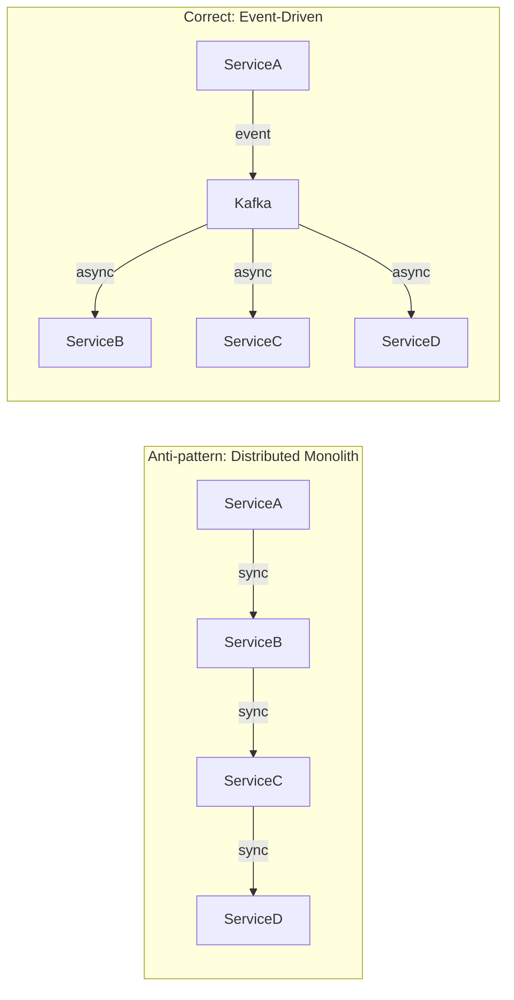
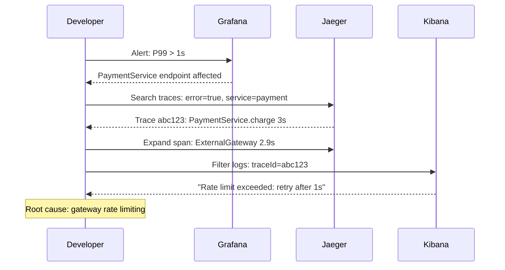
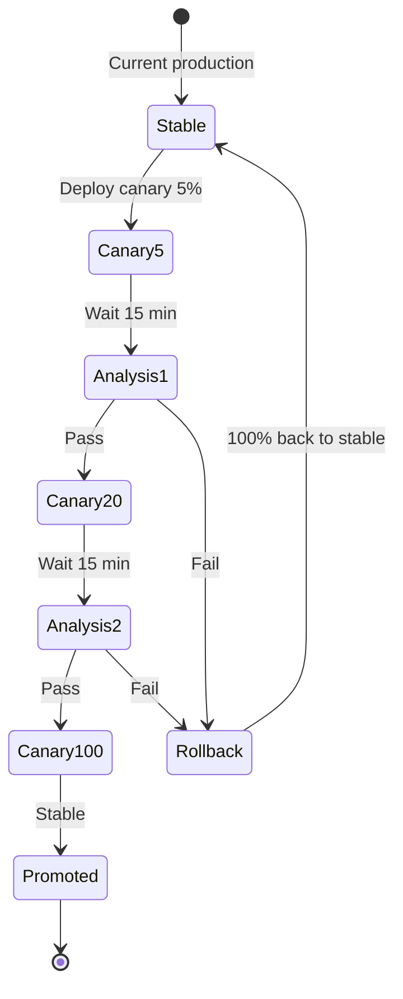
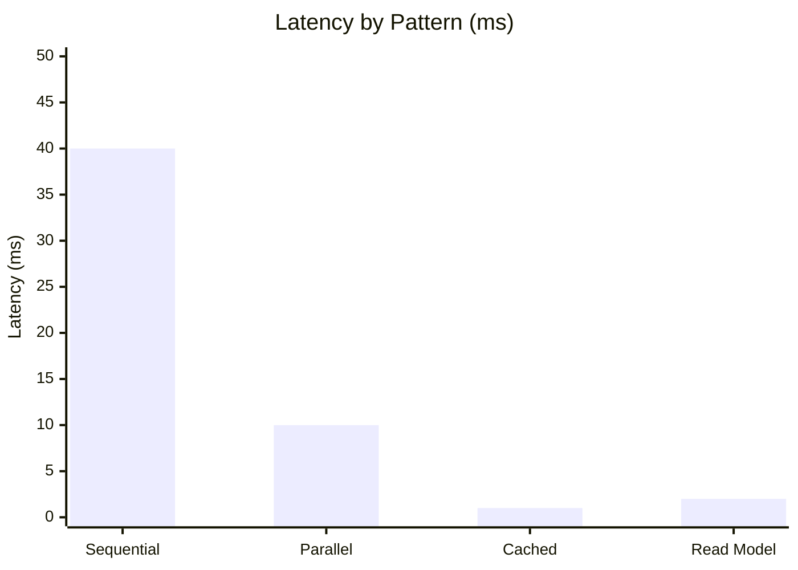
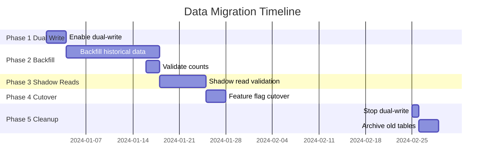

## Keywords in This File

{: .no_toc }

| #   | Keyword                                                              | Weight   |
| --- | -------------------------------------------------------------------- | -------- |
| 1   | [Microservice Anti-Patterns](#microservice-anti-patterns)            | critical |
| 2   | [Distributed Debugging Techniques](#distributed-debugging-techniques) | critical |
| 3   | [Performance in Distributed Systems](#performance-in-distributed-systems) | high |
| 4   | [Data Migration Between Services](#data-migration-between-services) | high     |
| 5   | [Microservice Deployment Patterns](#microservice-deployment-patterns) | high    |

---

# Microservice Anti-Patterns

🎯 Interview Weight: critical - recognizing anti-patterns
distinguishes senior engineers from juniors; interviews
specifically probe for nanoservices, distributed monolith,
and chatty services.

---

### 🎯 Model Answer

**30 seconds:**
> The most dangerous microservices anti-patterns are the distributed
> monolith (services look separate but are tightly coupled), the
> nanoservice (services too small to justify their operational
> overhead), chatty services (services making hundreds of calls
> per request), and the shared database (the #1 anti-pattern that
> eliminates service independence). Each creates the costs of
> distributed systems without the benefits.

**3 minutes (Senior):**
> Anti-patterns fall into two failure modes: (1) services that
> are too tightly coupled (keeping the costs of a monolith while
> adding the costs of distribution) and (2) services that are
> incorrectly sized (either too large or too small).
>
> Distributed monolith: services communicate synchronously in a
> long chain (A calls B which calls C which calls D). The request
> latency compounds across services; a failure in D fails the entire
> chain. More critically, deployment of D may require changes to
> A, B, and C - the coupling is preserved. This is the worst outcome:
> you have all the complexity of distributed systems and none of
> the independence.
>
> Chatty services: a single user request triggers 100 downstream
> service calls. Each call adds network latency. 100 calls at 5ms
> each = 500ms added latency. This is typically caused by incorrect
> service boundaries: data that belongs together is split across
> services and must be aggregated at runtime.
>
> Shared database: two services sharing a table. The shared table
> is a hidden coupling: one service can break the other by changing
> the table schema, holding locks, or applying contradictory data
> constraints. Schema changes require cross-team coordination.
> This eliminates the most important property of microservices:
> independent deployability.

**Framework:** WHAT - WHY - HOW - TRADE-OFF - EXAMPLE

**Blank Mind Recovery:**

**(1) Restate:** "You are asking about patterns that look like
microservices but cause more problems than a monolith."

**(2) First principles:** "The benefits of microservices come
from independence: deploy independently, scale independently,
change independently. Anti-patterns eliminate this independence
while keeping the distributed complexity."

**(3) Bridge:** "A distributed monolith is like having 10 people
in 10 separate offices who still need to be in the same meeting
for every decision."

---

### 📘 Concept Explanation

**Anti-Pattern 1: Distributed Monolith**
```
SYMPTOM:
ServiceA -> ServiceB -> ServiceC -> ServiceD
All synchronous. 4 services. Deploy all for any change.

DIAGNOSIS:
- Services cannot be deployed independently
- A database schema change in ServiceB requires
  coordination with ServiceA and ServiceC
- Team boundaries still require cross-team meetings
  for every feature

ROOT CAUSE:
- Service boundaries do not align with domain boundaries
- Services share database tables (implicit coupling)
- Synchronous coupling instead of event-driven

FIX:
- Identify true domain boundaries (DDD bounded contexts)
- Introduce event-driven communication to break sync chains
- Each service owns its data (no shared tables)
```

**Anti-Pattern 2: Nanoservice**
```
SYMPTOM:
OrderService calls:
  - CustomerNameService (get customer name)
  - CustomerEmailService (get customer email)
  - CustomerAddressService (get customer address)
  - CustomerPhoneService (get customer phone)

DIAGNOSIS:
- One logical resource (customer) split across 4 services
- 4x the operational overhead (4 deployments, 4 log streams,
  4 CI pipelines, 4 alert configurations)
- 4x network round trips for related data
- 4x failure surface for one conceptual entity

ROOT CAUSE:
- Over-decomposition (one service per operation or one per table)
- Misunderstanding "microservice" as "very small service"

FIX:
- Merge related services into cohesive domain services
- Customer data belongs in one CustomerService
- Correct size: one service per business capability/subdomain
```

**Anti-Pattern 3: Chatty Services**
```
SYMPTOM:
Order placement triggers:
  - 5 calls to CustomerService
  - 10 calls to InventoryService (one per item)
  - 3 calls to PricingService
  - 20 calls total per order request

DIAGNOSIS:
- Latency: 20 calls * 5ms avg = 100ms added per request
- Amplification: 100 requests/sec = 2000 downstream RPS
- Service dependency: order cannot be placed if any downstream
  is unavailable

ROOT CAUSE:
- Services return individual items; callers loop and call
  repeatedly instead of bulk API
- Related data split across services (item price, item
  availability are separate services)

FIX:
- Implement bulk APIs: GET /inventory?ids=sku1,sku2,sku3
- Use composite/aggregator pattern (API composition)
- Consider moving highly related data to same service
```

**Anti-Pattern 4: Shared Database**
```
SYMPTOM:
OrderService and ShippingService both read/write orders table

DIAGNOSIS:
- OrderService changes orders table column type
- ShippingService breaks without code change
- ShippingService can hold locks that block OrderService
- No clear data ownership

ROOT CAUSE:
- Taking the easy shortcut: shared table = no API contract
- Not establishing service boundaries first

FIX:
- Each service owns its own schema/database
- ShippingService gets order data via OrderService API
  or via OrderCreated event from Kafka
```

---

### 💻 Code Example

**BAD - Chatty service calling in a loop:**
```java
@Service
public class OrderEnrichmentService {

    // BAD: N+1 pattern - one call per item
    // For an order with 10 items: 10 network calls
    public EnrichedOrder enrichOrder(Order order) {
        List<EnrichedItem> items = new ArrayList<>();

        for (OrderItem item : order.getItems()) {
            // WRONG: called inside the loop
            Price price = pricingService.getPrice(item.getSku());
            Stock stock = inventoryService.getStock(item.getSku());

            items.add(new EnrichedItem(
                item, price, stock));
        }
        return new EnrichedOrder(order, items);
    }
}
```

> **Code walkthrough:** For a 10-item order, this code makes
> 20 downstream calls (10 to pricing, 10 to inventory). At 5ms
> each, that is 100ms of network overhead per request. At 100
> requests/second, that is 2000 requests/second to downstream
> services. This is a chatty service anti-pattern creating N+1
> behavior at the service layer.

**GOOD - Bulk API calls:**
```java
@Service
public class OrderEnrichmentService {

    // GOOD: one bulk call per service
    // For an order with 10 items: 2 network calls total
    public EnrichedOrder enrichOrder(Order order) {
        List<String> skus = order.getItems().stream()
            .map(OrderItem::getSku)
            .collect(toList());

        // Single bulk call: GET /prices?skus=sku1,sku2,...
        Map<String, Price> prices =
            pricingService.getPricesBulk(skus);

        // Single bulk call: GET /stock?skus=sku1,sku2,...
        Map<String, Stock> stocks =
            inventoryService.getStockBulk(skus);

        List<EnrichedItem> items = order.getItems().stream()
            .map(item -> new EnrichedItem(
                item,
                prices.get(item.getSku()),
                stocks.get(item.getSku())))
            .collect(toList());

        return new EnrichedOrder(order, items);
    }
}
```

> **Code walkthrough:** Two bulk calls replace 20 individual
> calls. The downstream services implement `GET /prices?skus=...`
> which returns a map of SKU to price in one query. Network round
> trips reduced from 20 to 2. At the same 100 requests/second,
> downstream services now receive 200 requests/second instead of
> 2000. This is the correct pattern for enrichment operations.

---

### 🎓 Answers by Seniority

**Junior / Mid (0-5 years):**
> The most common microservices anti-patterns are: distributed
> monolith (services that are technically separate but still
> tightly coupled), chatty services (making too many calls per
> request), nanoservices (too granular, one service per table),
> and shared database (two services reading from the same table).
> Each of these keeps the complexity of distributed systems while
> losing the benefits like independent deployment.

---

**Senior / Staff (5+ years):**
> The distributed monolith is the most dangerous anti-pattern
> because it is not obvious: services look separate in deployment
> diagrams but the coupling is hidden in shared database access,
> synchronous call chains, or shared libraries with business logic.
> The diagnostic test: can each service be deployed independently
> with no coordination with other teams? If no: you have a
> distributed monolith regardless of how the services are packaged.
> The fix is not technical - it is organizational: apply DDD
> bounded contexts, establish clear data ownership, switch to
> event-driven communication for decoupling.

---

### ⚠️ Common Misconceptions

**Misconception 1: "Microservice = small service."**
Size is a consequence of good boundaries, not the goal.
The correct criterion: can this service be owned, deployed, and
scaled independently? A service with 100 classes that is fully
independent is better than 10 "micro" services that are coupled.

**Misconception 2: "Sharing a library between services is fine."**
Sharing a library that contains business logic couples the services:
a change to the shared library requires coordinated deployment of
all services that use it. Shared libraries for infrastructure
concerns (logging, tracing) are acceptable; shared libraries for
domain logic are a coupling anti-pattern.

---

### 🚨 Failure Modes and Diagnosis

**Failure: Cascading failure through synchronous chain**
Symptom: A single service slowdown degrades the entire system.
Diagnosis: Check request trace - is the latency compounding
through a chain of synchronous calls?
Fix: Introduce circuit breakers, timeouts, and async/event-driven
patterns to break the synchronous chain.

**Failure: Deployment requires coordinating multiple teams**
Symptom: A feature requires simultaneous deployment of 3 services.
Diagnosis: Services are tightly coupled (shared schema or explicit
version dependency).
Fix: Apply strangler fig or expand-contract pattern to decouple
the deployment.

---

### 🎯 Interview Deep-Dive

**Timing:** Hard - 15 min target

| Category | Questions |
|---|---|
| Definition | 2 |
| Mechanism | 2 |
| Comparison | 2 |
| Scenario | 2 |
| Debugging | 1 |
| Deep Dive | 1 |
| Misconception | 1 |
| Behavioral | 1 |

**Definition:**

Q: "What is a distributed monolith and how do you recognize one?"

A: A distributed monolith is a system deployed as multiple services
but with coupling that prevents independent development and deployment.
Characteristics: (1) Multiple services must be deployed simultaneously
for a feature to work. (2) A database schema change in one service
requires changes in other services. (3) Services share a database
or communicate synchronously in long chains. (4) A failure in one
service causes cascading failures across others. (5) Despite having
multiple deployment units, teams still coordinate deployments and
have shared ownership of components. The recognition test: "Can
team A deploy service A on Monday without requiring team B to deploy
service B on the same day?" If no: it is a distributed monolith.

*What separates good from great:* Know the recognition test as
a concrete diagnostic: independent deployability is the defining
characteristic of microservices. The distributed monolith passes
the architectural checklist (multiple services) but fails the
actual test (independent deployment).

---

Q: "What is the nanoservice anti-pattern and how does it differ
from correct microservice granularity?"

A: A nanoservice is a service so fine-grained that its operational
overhead exceeds its value. Symptoms: one service per CRUD operation,
one service per database table, services with 1-2 REST endpoints
that are always called together. The overhead: each service needs
its own CI/CD pipeline, container image, Kubernetes deployment,
health check, alert configuration, and log stream. For 50 nanoservices,
this operational burden is multiplied 50x. Correct granularity:
one service per business capability or bounded context. A bounded
context is a cohesive domain area where a specific team has ownership.
CustomerService, OrderService, InventoryService, PaymentService -
each represents a business capability, not a single operation.

*What separates good from great:* Know the operational cost formula:
each service adds N hours/month of operational overhead (monitoring,
on-call, deployment management). A nanoservice adds this cost
without providing independent scaling or deployment value because
it is always deployed with its related services.

---

**Mechanism:**

Q: "How does the shared database anti-pattern eliminate the
benefits of microservices?"

A: Microservices' primary benefit is independent deployability:
change and deploy one service without affecting others. A shared
database eliminates this: (1) Schema changes in the shared table
require coordinating all services that read it. (2) Queries from
one service can hold locks that block other services. (3) The shared
table's data model must satisfy all services' requirements, making
it a compromise that serves none optimally. (4) One service can
corrupt data that another service depends on - no encapsulation.
(5) Testing: integration tests must coordinate multiple services'
data setup against the same database. The fix: each service owns
its schema. Shared data is accessed via the owning service's API
or event stream.

*What separates good from great:* Know the lock contention angle:
a long-running report query in one service can hold table-level
locks that block write operations from another service. This is
an operational coupling that is invisible until production.

---

Q: "What are the organizational consequences of microservice
anti-patterns?"

A: Conway's Law: the system architecture mirrors the communication
structure of the organization. Anti-patterns correlate with
organizational anti-patterns: (1) Distributed monolith correlates
with siloed teams that still have high coordination overhead.
The services are split but the teams are not. (2) Nanoservices
correlate with a team that split services without establishing
clear ownership. Everyone owns everything = no one owns anything.
(3) Chatty services correlate with teams that each own a slice
of a logical domain: customer name in team A's service, customer
email in team B's service, customer address in team C's service.
The fix requires organizational change (team ownership), not just
technical change.

*What separates good from great:* Know Conway's Law and its
inverse: the fix for architectural anti-patterns is often team
reorganization. Inverse Conway Maneuver: organize teams around
the desired architecture first, and the architecture will follow.

---

**Comparison:**

Q: "Microservice vs. modular monolith - when is a modular monolith
better?"

A: A modular monolith is a single deployable unit with well-defined
internal module boundaries. Benefits over microservices: (1) No
network latency for cross-module calls. (2) ACID transactions
across modules (single database). (3) Simple deployment (one
artifact). (4) Lower operational overhead (one service to monitor).
Microservices benefits over modular monolith: independent scaling
per service, independent deployment per team, polyglot technology,
true isolation of failures. When to choose modular monolith: team
is small (< 10 engineers), system is not at a scale requiring
independent scaling, bounded contexts are not clear yet (building
a modular monolith first and extracting services when boundaries
are proven is a valid strategy). The modular monolith is the
correct starting point for most new projects.

*What separates good from great:* Know the "modular monolith first"
recommendation: Martin Fowler and Sam Newman both advocate starting
with a monolith that has clear module boundaries, then extracting
services when the team size and scale justify the operational overhead.

---

Q: "Chatty services vs. fat service - how do you find the right
boundary?"

A: Chatty services: data that belongs together is split across
services; callers must aggregate at runtime. Fat service: one
service owns too much data and logic; it becomes a mini-monolith
that is slow to deploy and impossible to scale independently.
The right boundary: domain boundary (bounded context). A bounded
context is an area of the domain where a specific business
concept has a consistent meaning. OrderService: knows about
orders, order items, order status. InventoryService: knows about
stock levels, SKUs, warehouses. The relationship between orders
and inventory is expressed via events (OrderCreated triggers
inventory reservation) or explicit API calls (POST /reservations).
If you find callers aggregating data from 5 services for one
operation: the 5 services may belong in one service (chatty).
If you find one service being changed for every feature in the
system: it is fat and should be split.

*What separates good from great:* Know the "who changes together
stays together" principle: cohesion at the deployment level. If
ServiceA and ServiceB always change together for the same features,
they have low cohesion as separate services and may belong together.

---

**Scenario:**

Q: "You are asked to review a microservices architecture where
all 10 services call each other synchronously. What do you find
and recommend?"

A: Findings: (1) Distributed monolith: synchronous call chain
means any service slowdown degrades all others. (2) High coupling:
the call graph is a dependency graph; schema or API changes
in any service require coordination across all callers. (3)
Reliability risk: if service availability is 99.9%, 10 services
in a synchronous chain: 0.999^10 = 99.0% availability. 
Recommendations: (1) Identify which calls are truly synchronous
(the caller needs the response before continuing) and which are
notifications (caller publishes and moves on). (2) Convert
notification calls to events (Kafka). (3) Apply aggregator
pattern for data enrichment: one service calls multiple others
in parallel (not a chain). (4) Add circuit breakers to all
remaining synchronous calls to prevent cascading failures.
(5) Apply timeout + fallback for non-critical data.

*What separates good from great:* Know the availability calculation:
0.999^10 = 99.0%. This makes the cascading risk quantitative,
not theoretical. If each service has 99.9% uptime, a chain of
10 services has 99.0% uptime.

---

Q: "Your team is building a new feature that requires data from
5 services. How do you avoid the chatty service anti-pattern?"

A: Approach 1 (preferred): question the service boundaries.
Why do these 5 services each hold part of the data needed for
this feature? If the data always moves together (always needed
together for the same feature), it may belong in one service.
Approach 2: implement an aggregator service or BFF
(Backend for Frontend) that combines the data from the 5 services
into one optimized response for this use case. The BFF calls
all 5 in parallel (not sequentially). Approach 3: use CQRS with
a read model. Build a dedicated read model (Elasticsearch, Redis,
or a separate database) that denormalizes the data from all 5
services into one queryable store. The read model is populated
by events from all 5 services. The query hits the read model
once, not all 5 services.

*What separates good from great:* Know the CQRS read model
approach: for high-read scenarios, build a denormalized read model
that aggregates data from multiple services. Queries hit the
read model (one call); updates come from events (asynchronous).

---

**Debugging:**

Q: "A user reports the order page loads in 8 seconds. Your SLA
is 500ms. How do you diagnose this?"

A: Step 1: Check distributed trace for an order page request.
Identify the critical path (the longest sequential chain of calls).
Step 2: Is the 8 seconds in one service or spread across many?
If one service: it is a local performance problem (slow query,
missing index). If spread across many: it is a distributed system
problem (chatty services, synchronous chain).
Step 3: If chatty: count the number of service calls. Are they
sequential or parallel? Sequential calls multiply; parallel calls
take the max. Identify sequential calls that could be parallelized
(CompletableFuture.allOf).
Step 4: Identify the single slowest call. Why is it slow? Slow
query (check EXPLAIN ANALYZE), missing cache, or cold start?
Step 5: Check for N+1 at the service layer - calls in a loop.
Resolution: fix the chatty services (bulk APIs), parallelize
independent calls, add caching for stable data.

*What separates good from great:* Know the critical path concept
from distributed tracing: the critical path is the longest sequential
chain. Reducing parallel calls off the critical path does not
improve latency; only reducing sequential calls on the critical
path does.

---

**Deep Dive:**

Q: "What is the strangle fig pattern and how do you use it to
fix a distributed monolith?"

A: The strangler fig pattern (from Martin Fowler) is a migration
strategy: incrementally replace parts of the old system with new
implementation while keeping the old system running. The name
comes from a fig tree that grows around another tree, eventually
replacing it. Applied to a distributed monolith: (1) Identify
a bounded context that is tightly coupled to the monolith or
other services. (2) Create a new, independent service for this
bounded context with a clean API and its own database. (3) Route
new requests to the new service; existing requests go to the old
system. (4) Gradually migrate existing functionality to the new
service. (5) When all functionality is migrated, decommission the
old coupling. The key: the migration is incremental. At no point
does the system need to be completely down or completely replaced.
The strangler fig lives alongside the old system.

*What separates good from great:* Know the traffic routing
mechanism: an API gateway (or a facade service) routes requests
to either the old or new implementation based on configuration.
This enables progressive migration with the ability to roll back
at any point.

---

**Misconception / Trap:**

Q: "We should split every service as small as possible to maximize
microservices benefits."

A: Smaller is not better; independent is better. The microservices
value comes from independent deployability, independent scaling,
and independent ownership. Splitting a service below the
granularity of a bounded context creates nanoservices that are
always deployed together (no independence gained), always called
together (chatty pattern), and owned by the same team
(no organizational boundary). The cost: 5x the operational overhead
for no independence benefit. The correct question is not "how
small can this be?" but "what is the natural boundary where
this data and logic is owned by one team and can be deployed
independently?"

*What separates good from great:* Know the "deployed independently"
test as the definitive criterion for correct service granularity.

---

**Behavioral:**

Q: "Tell me about a time you identified and fixed an anti-pattern
in a microservices system."

A: Structure: SITUATION, PROBLEM, ACTION, RESULT. Example pattern:
"Our order service was making 50 calls per request to 8 services.
P95 latency was 3 seconds. I traced the request with Jaeger and
found 30 sequential calls that could be parallelized and 15 calls
that were actually fetching the same customer data repeatedly.
I implemented: (1) Parallel calls with CompletableFuture for
independent data, (2) a local cache for customer data with 60s TTL,
(3) bulk APIs on 3 services that were being called in loops.
P95 latency dropped from 3 seconds to 300ms. The downstream
service call count dropped from 50 to 5."

*What separates good from great:* Quantify both the problem and
the result. "P95 dropped from 3s to 300ms" is a concrete result.
"Improved latency" is not.

---

### ⚖️ Comparison Table

| Anti-Pattern | Symptom | Root Cause | Fix |
|---|---|---|---|
| **Distributed Monolith** | Coupled deployments, shared DB | Wrong service boundaries | DDD, event-driven decoupling |
| Nanoservice | High ops overhead, always deployed together | Over-decomposition | Merge to bounded context |
| Chatty Services | High latency, amplified downstream load | Data split across services | Bulk APIs, read models |
| Shared Database | Schema coupling, lock contention | Shortcut data sharing | Service owns its data |
| Synchronous Chain | Cascading failures, compounding latency | All calls synchronous | Event-driven, circuit breakers |

---

### 🏛️ System Design

*(Conditional: ★★★ - required.)*

**Anti-patterns in design review:**
When reviewing a proposed microservices architecture, always
check: (1) Are there shared databases? (2) Are all calls
synchronous? (3) Are any services deployed together 100% of the time?
(4) Is any service called by 80%+ of other services? (flag as
distributed monolith or fat service).

**Staff angle:** The most impactful intervention is at design
review time. An anti-pattern caught in design review costs 1 hour
to fix. The same anti-pattern caught in production costs 6 months
of refactoring.

---

### 📊 Diagram

```
DISTRIBUTED MONOLITH (anti-pattern):
A -> B -> C -> D -> E (all synchronous)
Single chain: one failure cascades to all
Deploy: must coordinate all 5 teams

CORRECT MICROSERVICES:
[A] -event-> [Kafka] -event-> [B], [C], [D] in parallel
Each service: independent deploy, independent failure
```



> **Diagram walkthrough:** The distributed monolith (top) has
> all services in a synchronous chain. A failure in ServiceD
> cascades to A, B, and C. Deployment of D requires coordination
> with all teams. The correct pattern (bottom) uses events: ServiceA
> publishes and continues; B, C, D process independently. Each
> can be deployed and scaled without affecting the others.

---

---

# Distributed Debugging Techniques

🎯 Interview Weight: critical - distributed tracing and log
correlation are daily tools for senior engineers; every
production incident in microservices requires these skills.

---

### 🎯 Model Answer

**30 seconds:**
> Debugging distributed systems requires correlating logs across
> multiple services and reconstructing the request timeline.
> The essential tools: distributed tracing (Jaeger, Zipkin, AWS
> X-Ray) assigns a trace ID to each request that propagates through
> all service calls; structured logging with correlation IDs links
> log entries across services; health checks and metrics dashboards
> identify which service is degraded.

**3 minutes (Senior):**
> Debugging a distributed system is fundamentally different from
> debugging a monolith. In a monolith, a stack trace tells you
> exactly what happened. In microservices, the "stack trace" spans
> multiple services, multiple log streams, and multiple databases.
>
> The toolchain: (1) Distributed tracing (Jaeger/Zipkin): instruments
> every service call with trace-id and span-id headers. A trace
> contains all the spans for one end-to-end request. The Jaeger
> UI shows a waterfall view of all service calls - you can see
> exactly which service is slow, which call failed, and what the
> timing was. (2) Structured logging with correlation IDs: every
> log line includes the trace-id. In Kibana/Splunk, you filter
> by trace-id to see all log entries across all services for one
> request. (3) Metrics dashboards (Prometheus + Grafana): p99
> latency, error rate, and throughput per service. Metrics tell
> you that "something is wrong with ServiceB" - tracing and
> logs tell you why.
>
> The debugging approach: start with metrics (which service is
> degraded), pivot to traces (what request pattern is failing),
> then to logs (what error message explains the failure).

**Framework:** WHAT - WHY - HOW - TRADE-OFF - EXAMPLE

**Blank Mind Recovery:**

**(1) Restate:** "You are asking about how to find bugs and
performance issues when they span multiple services."

**(2) First principles:** "A request in microservices touches
many services. You need to follow the request's journey through
all of them. Correlation IDs and distributed traces are the thread
you follow."

**(3) Bridge:** "Distributed tracing is like a GPS tracker on
a package: you can see exactly where it was, when, and how long
it spent at each stop."

---

### 📘 Concept Explanation

**The three pillars of distributed observability:**
```
1. METRICS: What is happening? (aggregate view)
   - Error rate: 5% of /orders POST returning 500
   - Latency: P99 is 3s (baseline: 200ms)
   - Throughput: requests/second
   Tools: Prometheus, Grafana, DataDog

2. LOGS: Why is it happening? (event detail)
   - Specific error message: "Connection refused to inventory-service"
   - Business context: "userId=42, orderId=99"
   - Correlation: trace-id links all service log entries
   Tools: ELK stack, Splunk, Loki

3. TRACES: Where is it happening? (request journey)
   - Request timeline across all services
   - Which service is slow? Which call failed?
   - Critical path analysis
   Tools: Jaeger, Zipkin, AWS X-Ray, OpenTelemetry
```

**Distributed trace anatomy:**
```
TRACE ID: abc-123-def
  SPAN: OrderService.placeOrder (12ms total)
    SPAN: InventoryService.reserve (3ms)
      DB: SELECT * FROM inventory (1ms)
    SPAN: PaymentService.charge (8ms) <- slowest
      SPAN: ExternalGateway.authorize (7ms) <- slow!
    SPAN: EventPublisher.publish (1ms)
```

**Correlation ID propagation:**
```java
// HTTP: trace ID in headers
W3C Trace Context standard:
traceparent: 00-{traceId}-{spanId}-01

// Kafka: trace ID in headers
ProducerRecord headers:
  "traceparent" -> "00-abc123-def456-01"

// Structured log:
{
  "timestamp": "2024-01-15T10:30:00Z",
  "level": "ERROR",
  "service": "order-service",
  "traceId": "abc123",
  "spanId": "def456",
  "message": "inventory reservation failed",
  "userId": 42,
  "orderId": 99
}
```

**Debug workflow:**
```
STEP 1: Alert fires (P99 > 1s for /orders endpoint)
STEP 2: Metrics dashboard - which service? PaymentService
STEP 3: PaymentService traces - find slow traces
STEP 4: Trace detail - which span is slow?
        ExternalGateway.authorize (7ms -> 3000ms)
STEP 5: Filter logs by traceId of slow traces
        Look for errors or warnings
STEP 6: Check external gateway status page
        Finding: gateway is rate-limiting requests
STEP 7: Implement retry with backoff or circuit breaker
```

---

### 💻 Code Example

**BAD - No correlation, unstructured logging:**
```java
@Service
public class OrderService {

    // BAD: no trace context, no correlation ID
    // Different logs for the same request have no link
    public Order placeOrder(OrderRequest req) {
        // This log line: no way to link to downstream service logs
        logger.info("Processing order for user " +
            req.getUserId()); // string concatenation, no context

        try {
            inventoryService.reserve(req.getItems());
            Payment payment = paymentService.charge(req);
            return orderRepository.save(new Order(req, payment));
        } catch (Exception e) {
            // Which request? Which user? Which trace?
            logger.error("Failed to place order: " + e.getMessage());
            throw e;
        }
    }
}
```

> **Code walkthrough:** These log lines have no correlation ID.
> If 100 requests are being processed concurrently, the logs are
> interleaved with no way to link a specific error to the specific
> request or the downstream service calls that it triggered.
> Debugging requires timestamp-based guessing.

**GOOD - OpenTelemetry with structured logging:**
```java
@Service
public class OrderService {

    private static final Logger log =
        LoggerFactory.getLogger(OrderService.class);
    private final Tracer tracer;

    public Order placeOrder(OrderRequest req) {
        // Retrieve current trace context (auto-propagated
        // by Spring Boot + OpenTelemetry auto-instrumentation)
        Span currentSpan = Span.current();
        String traceId = currentSpan.getSpanContext().getTraceId();

        // Structured log with correlation fields
        log.info("Processing order",
            kv("userId", req.getUserId()),
            kv("itemCount", req.getItems().size()),
            kv("traceId", traceId));  // MDC auto-includes this

        // Create custom span for business logic
        Span span = tracer.spanBuilder("placeOrder")
            .setAttribute("user.id", req.getUserId())
            .startSpan();

        try (Scope scope = span.makeCurrent()) {
            inventoryService.reserve(req.getItems());
            Payment payment = paymentService.charge(req);
            Order order = orderRepository.save(
                new Order(req, payment));

            span.setAttribute("order.id", order.getId());
            return order;

        } catch (Exception e) {
            span.setStatus(StatusCode.ERROR, e.getMessage());
            span.recordException(e);
            log.error("Order placement failed",
                kv("userId", req.getUserId()),
                kv("error", e.getMessage()),
                kv("traceId", traceId));
            throw e;
        } finally {
            span.end();
        }
    }
}

// logback.xml: MDC auto-populates traceId from OpenTelemetry
// <pattern>%d{...} traceId=%X{trace_id} %msg%n</pattern>
```

> **Code walkthrough:** OpenTelemetry auto-instrumentation propagates
> the trace context through all service calls automatically via
> HTTP headers (W3C Trace Context). The `traceId` appears in
> every log line via the MDC (Mapped Diagnostic Context) - all
> log entries across all services for one request share the same
> traceId. The custom span adds business context (userId, orderId)
> to the trace. Error spans are recorded as errors in Jaeger.

---

### 🎓 Answers by Seniority

**Junior / Mid (0-5 years):**
> Debugging microservices requires tools that link logs and calls
> across services. Distributed tracing (like Jaeger) gives you a
> trace ID that follows a request through all services - you can
> see the timeline of every call. Structured logging with the
> same trace ID in every log line lets you filter all logs for
> one specific request in Kibana.

---

**Senior / Staff (5+ years):**
> Observability is the prerequisite for debugging distributed
> systems. The three pillars: metrics (know something is wrong),
> traces (know where it is wrong), logs (know why it is wrong).
> In practice: start with a metrics alert, find the specific traces
> that are slow or erroring, drill into the trace's critical path
> to identify the slow span, then filter logs by the trace ID of
> the failing traces. The key engineering decision: use OpenTelemetry
> (vendor-neutral) not a vendor-specific SDK. This allows changing
> observability backends without changing application code.

---

### ⚠️ Common Misconceptions

**Misconception 1: "We can debug distributed systems the same
way as monoliths."**
In a monolith, a single stack trace identifies the problem.
In microservices, the "error" in one service is often the effect,
not the cause. The cause is in a different service further upstream
or downstream.

**Misconception 2: "Logging everything is sufficient."**
Without correlation IDs, logs from different services for the
same request are unlinked. Distributed tracing connects them
into a coherent timeline.

---

### 🚨 Failure Modes and Diagnosis

**Failure: Silent errors in async processing**
Symptom: Messages seem to disappear; no visible error.
Diagnosis: Check DLT (Dead Letter Topic) for failed messages.
Check consumer lag - is the consumer processing or stuck?
Filter consumer logs by message correlation ID.
Fix: Add error handling in consumers; publish to DLT on failure;
monitor DLT size in dashboards.

**Failure: Trace IDs not propagating through async calls**
Symptom: Traces break at Kafka publish; consumer logs have
different trace ID than producer.
Diagnosis: Check if trace headers are being included in Kafka
message headers and extracted in the consumer.
Fix: Configure OpenTelemetry to propagate trace context in
Kafka message headers (W3C Trace Context format).

---

### 🎯 Interview Deep-Dive

**Timing:** Hard - 15 min target

| Category | Questions |
|---|---|
| Definition | 2 |
| Mechanism | 2 |
| Scenario | 3 |
| Debugging | 2 |
| Deep Dive | 1 |
| Misconception | 1 |
| Behavioral | 1 |

**Definition:**

Q: "Explain distributed tracing and why it is necessary in microservices."

A: Distributed tracing is the practice of tracking a single request's
journey through multiple services in a distributed system. Each request
is assigned a trace ID at entry (API gateway or first service). The
trace ID is propagated to all downstream services via HTTP headers
(W3C Trace Context: `traceparent` header) or message headers (Kafka).
Each service creates a "span" - a unit of work with start time,
duration, and metadata. All spans for one trace are collected and
stored in a tracing backend (Jaeger, Zipkin). A trace visualization
shows a waterfall of all service calls, their durations, and their
relationships. It is necessary because: in a monolith, a stack trace
is sufficient. In microservices, an error in ServiceD may be caused
by ServiceA's slow query - a causal chain that spans services, time,
and log files. Without tracing, finding this chain requires manually
correlating logs with timestamps across multiple services.

*What separates good from great:* Know the W3C Trace Context
specification: `traceparent: 00-{traceId}-{parentSpanId}-{flags}`.
This is the vendor-neutral standard for trace propagation. All
major services (AWS, GCP, Azure) and frameworks support it.

---

Q: "What is OpenTelemetry and why is it the preferred standard?"

A: OpenTelemetry (OTel) is a CNCF project that provides vendor-
neutral APIs, SDKs, and instrumentation for metrics, logs, and
traces. The key benefit: write instrumentation once, export to
any backend (Jaeger, Zipkin, DataDog, AWS X-Ray, New Relic).
Without OTel: using Zipkin's SDK means migrating to Jaeger requires
rewriting all instrumentation. With OTel: change the exporter
configuration; application code is unchanged. OTel auto-instrumentation
for Spring Boot automatically instruments: HTTP requests (incoming
and outgoing), database calls (JDBC), Kafka producers and consumers.
No application code change needed for the common cases. Custom
spans are added for business logic using the OTel API.

*What separates good from great:* Know the agent vs. programmatic
instrumentation distinction. OTel Java agent (`-javaagent:otel-agent.jar`)
auto-instruments all standard frameworks without code changes.
Programmatic API is used for custom business logic spans.

---

**Mechanism:**

Q: "How do you propagate trace context through Kafka messages?"

A: Kafka messages are byte arrays with headers (key-value pairs).
Trace context is propagated in message headers using the W3C
Trace Context format. Producer side (OpenTelemetry auto-instruments
this): before publishing a message, inject the trace context into
the message headers: `traceparent: 00-{traceId}-{spanId}-01`.
Consumer side: extract the trace context from the message headers
and create a new child span with the extracted context as the parent.
This links the consumer's trace to the producer's trace. OTel
auto-instrumentation handles both sides automatically for Kafka
producers and KafkaListener consumers.

*What separates good from great:* Know that without header
propagation, a Kafka consumer starts a new root span - the trace
breaks at the Kafka boundary. The producer and consumer traces
are unlinked in Jaeger. Header propagation is what creates the
end-to-end trace across the async boundary.

---

Q: "What is the difference between a trace, span, and log?"

A: Trace: the complete record of a single request's journey through
all services. Identified by a unique trace ID. Contains all spans
for that request. Span: a unit of work within a trace. Represents
one operation (HTTP call, database query, message publish). Has
start time, duration, service name, operation name, attributes
(userId, orderId), and events (errors). Spans are nested (parent-child)
to represent call hierarchies. Log: a timestamped text record of
an event at a specific moment. Contains structured context fields.
Logs are linked to traces via the trace ID and span ID in the MDC.
Relationship: traces answer "what is the timeline?"; spans answer
"what is each step?"; logs answer "what exactly happened at each step?"

*What separates good from great:* Know the MDC (Mapped Diagnostic
Context) mechanism: OpenTelemetry automatically populates MDC with
`trace_id` and `span_id`, which Logback/Log4j2 includes in every
log line. This is the automatic link between logs and traces.

---

**Scenario:**

Q: "A customer reports their order failed. You have 30 minutes
to diagnose. Walk me through your investigation."

A: Minute 0-5: Get the user's orderId and userId from the customer.
Open Kibana/Splunk: filter logs by userId=42 and time range
of the failure. Find the error log line and the trace ID.
Minute 5-10: Open Jaeger: search by trace ID. View the trace
waterfall. Identify which service returned an error (red span)
and which span was slowest (wide span).
Minute 10-15: Check the failing span's logs: filter Kibana by
trace ID. Read the specific error message in the failing service.
Is it a database error? An external API error? A validation error?
Minute 15-20: Check if the issue is ongoing (check metrics for
the same service: error rate in last 30 minutes) or isolated.
Minute 20-25: If ongoing: engage the on-call engineer for the
failing service and check for related incidents. If isolated:
document the error type and root cause.
Minute 25-30: Communicate findings to the customer and trigger
a retry (if the error was transient) or escalate for manual
remediation (if the error is permanent).

*What separates good from great:* Know the systematic approach:
trace ID from logs -> trace waterfall -> failing span -> span logs.
This 4-step path gets to the root cause in minutes instead of hours.

---

Q: "How do you debug a performance regression that only appears
under load (P99 is fine at 10 RPS, bad at 1000 RPS)?"

A: Load-dependent regressions are typically connection pool exhaustion,
lock contention, or GC pressure. Diagnosis: (1) Enable high-cardinality
tracing: ensure database queries are captured as spans. At 1000 RPS,
check if DB query spans are slow or if there are many timeouts.
(2) Check connection pool metrics: HikariCP exposes `hikari.connections.active`
and `hikari.connections.pending`. At 1000 RPS, pending connection
count growing indicates pool exhaustion. (3) Check JVM metrics:
GC pause time and frequency at 1000 RPS. Long GC pauses cause
P99 spikes. (4) Enable thread dump analysis: at 1000 RPS, if
threads are blocked waiting for connections or locks, thread dumps
will show the contention point. Fix for pool exhaustion: increase
pool size or optimize queries to return connections faster.

*What separates good from great:* Know the HikariCP metrics
specifically and the connection pool size formula: pool size = (number
of CPU cores) * 2 + number of spindle disks (HikariPool guideline).
A common mistake is setting pool size to 100 when the optimal
is 8-16 for a 4-core database server.

---

Q: "You are on-call and receive an alert: order service error
rate is 10%. What do you do in the first 5 minutes?"

A: The first 5 minutes are about determining scope and severity,
not root cause. Step 1 (1 min): Check the metrics dashboard for
order service. Is error rate increasing (escalating) or stable
at 10%? Check which endpoints are affected. Step 2 (2 min): Check
if the issue started at a recent deployment. `git log --since=1h`
or check the deployment timestamp. If yes: consider rollback
while investigating. Step 3 (3 min): Sample 3-5 failing traces
in Jaeger. Do they all fail at the same span? Same error message?
This determines if it is a single root cause or multiple issues.
Step 4 (4 min): Check downstream service health. Is the service
that order-service is calling also showing errors? Check Prometheus
for that service's error rate. Step 5 (5 min): Update the incident
channel with initial findings. Engage secondary on-call if
downstream service is the root cause.

*What separates good from great:* Know the deployment rollback
decision: if a deployment happened in the last hour and errors
started around that time, the default action is rollback while
investigating - not waiting for root cause before acting.

---

**Debugging:**

Q: "Traces in Jaeger show 5% of requests with a missing last
span. How do you diagnose?"

A: A missing span means the service received the request but
either did not complete the span or the span was not exported
to Jaeger. Diagnosis: (1) Check if the missing spans correlate
with errors: filter by error=true. If yes: the service errored
before ending the span. Fix: ensure spans are always ended
in a finally block. (2) Check the OTel exporter configuration:
is there a batch export size that is causing spans to be dropped
under high volume? (3) Check the Jaeger backend: is it under
capacity? Check ingestion error metrics. (4) Check if the
spans have a timeout: is the service operation taking longer
than the span sampler's threshold and being dropped? (5) Sample
the affected traces' logs: is there a "span not ended" or
"context lost" error in the service logs?

*What separates good from great:* Know the finally block requirement
for span ending: `try { ... } finally { span.end(); }`. A span
that is never ended is never exported. This is a common instrumentation
mistake.

---

Q: "Service B shows no errors in its logs but the callers of
Service B all report timeouts. How do you investigate?"

A: This is a timeout without error in B - B is processing but
slowly. Diagnosis: (1) Check Service B's metrics: P99 latency
for its endpoints. Is it within SLA? Probably not - the callers
are timing out at (e.g.) 5 seconds; B may be taking 10 seconds.
(2) Check Service B's thread pool: are all threads busy? Is the
request queue growing? (3) Check B's database: slow query log,
connection pool saturation, table locks. (4) Check B's external
dependencies: is B calling an external service that is slow?
(5) Check B's GC: is there a GC pause causing all threads to
be stopped for several seconds? Fix: add timeout on B's processing
(do not let requests queue indefinitely); fix the root cause
(slow query, downstream slowness, GC tuning).

*What separates good from great:* Know that service B not
logging errors is the key clue: the requests are reaching B and
being accepted, but are taking longer than the caller's timeout.
This rules out network issues and points to B's processing time.

---

**Deep Dive:**

Q: "What is exemplar-based alerting and how does it connect
metrics to traces?"

A: Exemplars are sample trace IDs attached to metric data points.
When a histogram metric records a 2-second P99 latency observation,
it stores the trace ID of that specific request as an exemplar.
In Grafana: when viewing a P99 latency graph, you can click on
a data point and navigate directly to the Jaeger trace that
caused the spike - without manual searching. Prometheus supports
exemplars as of version 2.26. OpenTelemetry automatically populates
exemplars in Spring Boot metrics. The workflow: (1) Alert fires
for P99 > 1s. (2) Open Grafana dashboard. (3) Click the spike
in the latency graph. (4) Grafana shows the exemplar trace ID.
(5) One click to Jaeger trace - the root cause is visible
immediately. This eliminates the "search for slow traces" step
from the debugging workflow.

*What separates good from great:* Know the configuration
requirement: Prometheus scrape config must include
`enable_exemplars: true`; the Spring Boot actuator endpoint
must return exemplar data. This is not enabled by default and
requires explicit configuration.

---

**Misconception / Trap:**

Q: "We have 100% trace sampling, so we have complete visibility."

A: 100% trace sampling means every request generates a trace.
At high volume (10,000 RPS), this is 10,000 traces/second being
stored and exported. Jaeger/Zipkin storage costs grow linearly.
Export adds latency to every service call (the trace data must
be serialized and sent). Most observability tools recommend
head-based sampling of 1-10% for high-volume services, with
tail-based sampling to always capture error traces and slow traces.
Tail-based sampling is the best of both worlds: low volume
(1% base rate) but guaranteed capture of interesting traces
(errors, slow requests). The trade-off: you may miss rare intermittent
errors that are not slow. Use Grafana Tempo's tail-sampling
configuration for this pattern.

*What separates good from great:* Know the tail-based sampling
distinction: head-based sampling decides at the beginning of a
trace (before the outcome is known); tail-based sampling decides
at the end (after the outcome is known - slow or error). Tail-based
always captures the interesting cases.

---

**Behavioral:**

Q: "Tell me about a time you had to debug a production incident
in a microservices system."

A: Structure: what was the alert, how did you find the root cause,
what was the fix, what did you improve afterward.
Example pattern: "An alert fired for order service P99 > 2s.
I checked Jaeger: 30% of slow traces had one span in common -
InventoryService.getStock. I filtered inventory service logs
by those trace IDs: found 'connection pool timeout' errors.
HikariCP metrics showed 100% pool utilization. The inventory
service had just received a 3x traffic spike from a flash sale.
Connection pool was set to 10; we needed 30 for the load.
Immediate fix: increased pool size to 30 - P99 dropped in 2 minutes.
Follow-up: added load shedding with a queue size limit so pool
exhaustion degrades gracefully instead of timing out all requests."

*What separates good from great:* The story shows the systematic
investigation (alert -> trace -> specific service -> specific metric
-> root cause) and the proactive improvement (load shedding),
not just the immediate fix.

---

### ⚖️ Comparison Table

| Tool | What It Shows | When to Use |
|---|---|---|
| **Jaeger/Zipkin** | Request timeline across services | Latency investigation, cascading failure |
| Prometheus + Grafana | Aggregate metrics, trends | Initial triage, alerting |
| ELK / Loki | Individual log events | Error messages, business context |
| DataDog / New Relic | All three, unified | Managed, cost-justified at scale |

---

### 🏛️ System Design

*(Conditional: ★★★ - required.)*

**Observability in system design:**
Every microservices design should include an observability section:
distributed tracing (OpenTelemetry + Jaeger), structured logging
(JSON logs with trace ID, shipped to Elasticsearch), and metrics
(Prometheus + Grafana). These are not optional add-ons - they are
prerequisites for production operation.

**Staff angle:** Observability is a platform concern. Define
company-wide standards: OpenTelemetry for instrumentation,
Elasticsearch for logs, Grafana for metrics and traces.
Teams that use the standard get observability for free;
custom implementations fragment the toolchain.

---

### 📊 Diagram

```
DEBUG WORKFLOW:
Alert: P99 > 1s (Grafana) -> Jaeger: find slow traces
-> Span: PaymentService.charge slow (800ms)
-> Logs: filter by traceId -> "Connection timeout"
-> Root cause: payment gateway rate limiting
-> Fix: circuit breaker with fallback
```



> **Diagram walkthrough:** The debugging workflow follows the
> three-pillar path: metrics to narrow scope, traces to find
> the slow span, logs to read the specific error message. The
> entire investigation takes minutes with good observability tooling.
> Without trace IDs linking logs across services, this same
> investigation could take hours.

---

---

# Microservice Deployment Patterns

🎯 Interview Weight: high - blue-green and canary are standard
interview questions for any DevOps or senior engineering role;
feature flags and progressive delivery are expected knowledge.

---

### 🎯 Model Answer

**30 seconds:**
> Microservice deployment patterns reduce the risk of releasing
> new versions. Blue-green: maintain two identical production
> environments; switch traffic instantly with zero downtime.
> Canary: gradually shift traffic from old version to new version
> (1% -> 10% -> 100%); monitor metrics at each step; rollback
> by shifting traffic back. Feature flags: deploy code dark,
> enable for specific users. Each pattern gives you a different
> risk-vs-speed trade-off.

**3 minutes (Senior):**
> Every deployment is a risk event. The question is: how do
> you reduce the blast radius of a bad release?
>
> Blue-green: two identical environments (blue=live, green=staged).
> New version deployed to green. DNS or load balancer switch
> flips traffic from blue to green in one step. Rollback: switch
> back to blue. Cost: double infrastructure cost during the switch.
> Best for: services where you want instant cutover and instant
> rollback. Not great for: database schema changes (both environments
> use the same database, so the schema must be compatible with both).
>
> Canary: traffic splits incrementally. Deploy to 1% of pods.
> Monitor error rate and latency for 15 minutes. If healthy:
> expand to 10%, then 50%, then 100%. If unhealthy: route 100%
> back to stable version. Kubernetes with Argo Rollouts or Flagger
> automates this. Best for: high-traffic services where you want
> to validate behavior under real production traffic before full
> rollout.
>
> Feature flags: deploy the code change to all pods, but the
> code path is disabled by a feature flag. Enable the flag for
> specific users or percentages via a feature flag service
> (LaunchDarkly, Unleash). Rollback: disable the flag (no
> redeployment required). Best for: A/B testing, gradual user
> migration, and disabling problematic features without deploying.

**Framework:** WHAT - WHY - HOW - TRADE-OFF - EXAMPLE

**Blank Mind Recovery:**

**(1) Restate:** "You are asking about how to deploy new code
safely with the ability to roll back quickly."

**(2) First principles:** "Every deployment can break production.
Limit the blast radius: either have an instant switch (blue-green),
a gradual rollout (canary), or a deploy-without-activating
strategy (feature flags)."

**(3) Bridge:** "Canary releases are named after miners using
canary birds to detect toxic gas. The canary (1% of traffic)
detects problems before the full population is affected."

---

### 📘 Concept Explanation

**Blue-Green Deployment:**
```
BLUE (current live):
  pod-v1-1, pod-v1-2, pod-v1-3

GREEN (new version, deployed and tested):
  pod-v2-1, pod-v2-2, pod-v2-3

SWITCH: Load balancer routes 100% from BLUE to GREEN
  - Zero downtime (sub-second switch)
  - Rollback: switch back to BLUE

LIMITATION: Database schema must be compatible
  with BOTH blue and green during the switch window
```

**Canary Deployment:**
```
STABLE: pod-v1-1, pod-v1-2, pod-v1-3 (97% traffic)
CANARY: pod-v2-1 (3% traffic)

PROGRESSION:
  Phase 1: 3% canary, monitor 15min
  Phase 2: 10% canary, monitor 15min
  Phase 3: 30% canary, monitor 15min
  Phase 4: 100% canary -> promote to stable
  Rollback at any phase: 0% canary (instant)

AUTOMATED (Flagger/Argo Rollouts):
  Analyzes P99 latency and error rate
  Auto-promote if healthy, auto-rollback if not
```

**Feature Flags:**
```
CODE (deployed to all pods):
  if (featureFlags.isEnabled("new-checkout", userId)) {
    return newCheckoutService.process(req);
  } else {
    return legacyCheckoutService.process(req);
  }

FLAG STATE:
  "new-checkout":
    - enabled: 0% -> 5% -> 25% -> 100%
    - targeting: beta users, specific country codes
  Rollback: set enabled: 0% (no deployment)
```

**Database migration and deployment coupling:**
```
EXPAND-CONTRACT PATTERN:
Step 1 - Expand: add new column (optional, no default)
  Deploy service: reads old column, writes both
Step 2 - Migrate: backfill new column data
Step 3 - Switch: deploy service that reads new column
Step 4 - Contract: remove old column (all services updated)

This pattern allows blue-green deployment with schema changes:
both old and new service version can run simultaneously.
```

---

### 💻 Code Example

**Kubernetes Canary with Argo Rollouts:**
```yaml
# WRONG: Standard Kubernetes Deployment
# (no automated canary, all-or-nothing rollout)
apiVersion: apps/v1
kind: Deployment
metadata:
  name: order-service
spec:
  replicas: 10
  strategy:
    type: RollingUpdate
    rollingUpdate:
      maxSurge: 1
      maxUnavailable: 0
# Kubernetes rolling update: replaces pods 1 by 1
# No traffic splitting, no automatic rollback on error
```

> **Code walkthrough:** Standard Kubernetes RollingUpdate replaces
> pods one by one but routes traffic to all pods (old and new)
> randomly. There is no percentage-based traffic control and no
> automatic rollback based on error rate.

```yaml
# GOOD: Argo Rollouts Canary Strategy
apiVersion: argoproj.io/v1alpha1
kind: Rollout
metadata:
  name: order-service
spec:
  replicas: 10
  strategy:
    canary:
      canaryService: order-service-canary  # 1 replica
      stableService: order-service-stable  # 9 replicas
      trafficRouting:
        istio:
          virtualService:
            name: order-service-vsvc
      steps:
      - setWeight: 5      # 5% to canary
      - pause:
          duration: 15m   # wait 15 minutes
      - analysis:
          templates:
          - templateName: order-service-analysis
      - setWeight: 20     # 20% if analysis passes
      - pause:
          duration: 10m
      - setWeight: 50
      - pause:
          duration: 10m
      # Final step: promote (100% to new version)

---
# Analysis Template: automated success criteria
apiVersion: argoproj.io/v1alpha1
kind: AnalysisTemplate
metadata:
  name: order-service-analysis
spec:
  metrics:
  - name: success-rate
    successCondition: result[0] >= 0.95
    provider:
      prometheus:
        address: http://prometheus:9090
        query: |
          sum(rate(http_requests_total{
            job="order-service",
            status=~"2..",
            deployment="canary"}[5m]))
          /
          sum(rate(http_requests_total{
            job="order-service",
            deployment="canary"}[5m]))
  - name: p99-latency
    successCondition: result[0] <= 500
    provider:
      prometheus:
        address: http://prometheus:9090
        query: |
          histogram_quantile(0.99,
            sum(rate(http_request_duration_bucket{
              job="order-service",
              deployment="canary"}[5m])) by (le))
```

> **Code walkthrough:** Argo Rollouts automates the canary
> lifecycle: traffic starts at 5%, pauses for 15 minutes, then
> runs an automated analysis against Prometheus metrics. If the
> success rate (95%+ 2xx responses) and P99 latency (under 500ms)
> pass, traffic advances to 20%. If the analysis fails, Argo
> automatically routes 100% traffic back to the stable version.
> This is progressive delivery: automated promotion with automated
> rollback based on objective production metrics.

**Feature flag implementation:**
```java
// Feature flag service (wraps LaunchDarkly or Unleash)
@Service
public class FeatureFlagService {

    private final LDClient ldClient;

    public boolean isEnabled(String flagKey, String userId) {
        LDUser user = new LDUser.Builder(userId).build();
        return ldClient.boolVariation(flagKey, user, false);
    }

    // Graceful degradation: if flag service is unavailable,
    // default to false (do not enable new code)
    public boolean isEnabled(String flagKey, String userId,
            boolean defaultValue) {
        try {
            LDUser user = new LDUser.Builder(userId).build();
            return ldClient.boolVariation(flagKey, user, defaultValue);
        } catch (Exception e) {
            log.warn("Feature flag service unavailable, " +
                "using default: {}", defaultValue);
            return defaultValue;
        }
    }
}

@Service
public class CheckoutService {

    public CheckoutResult checkout(CheckoutRequest req) {
        if (featureFlags.isEnabled(
                "new-checkout-flow", req.getUserId())) {
            // New implementation - currently for 5% of users
            return newCheckoutFlow.process(req);
        } else {
            // Legacy implementation
            return legacyCheckoutFlow.process(req);
        }
    }
}
```

> **Code walkthrough:** The feature flag check adds a single
> `if` branch. The flag service is called per request (with a
> local SDK cache - LaunchDarkly SDK caches flag state locally).
> The default value `false` ensures that if the flag service is
> down, the new code is disabled - not enabled. This is the safe
> default: a flag service outage should not enable experimental
> code unexpectedly.

---

### 🎓 Answers by Seniority

**Junior / Mid (0-5 years):**
> Blue-green deployment keeps two production environments and
> switches traffic between them for zero-downtime deployments.
> Canary deployments route a small percentage of traffic to the
> new version first, then gradually increase if it looks healthy.
> Feature flags let you deploy code without activating it, then
> enable it for specific users.

---

**Senior / Staff (5+ years):**
> The choice between deployment patterns depends on the risk
> profile and the ability to roll back. Blue-green: fastest
> rollback (seconds), but requires database schema compatibility.
> Canary: real production traffic validation, automated rollback
> on metrics failure, but 15-60 minutes to full rollout. Feature
> flags: most granular control (specific users, specific countries),
> no deployment required for rollback, but adds code complexity
> (flags accumulate and must be cleaned up). My default: canary
> with automated analysis for every release, feature flags for
> user-facing experiments and risky code paths, blue-green for
> infrastructure-level changes (Kubernetes version upgrades,
> database migrations).

---

### ⚠️ Common Misconceptions

**Misconception 1: "Blue-green deployment handles database
schema changes automatically."**
Both blue and green versions write to the same database during
the switch window. A schema change that drops a column breaks
the blue version still running. The expand-contract pattern
is required to decouple the schema change from the code change.

**Misconception 2: "Feature flags are only for A/B testing."**
Feature flags are also: kill switches (disable a broken feature
without deployment), gradual rollouts, service operation controls
(disable a feature during an incident), and targeting (enable
for internal users first).

---

### 🚨 Failure Modes and Diagnosis

**Failure: Canary metrics look good but post-full-rollout errors**
Symptom: 5% canary traffic passed analysis; 100% rollout causes errors.
Diagnosis: The error is triggered by a specific traffic pattern
not in the 5% sample (specific user type, specific payload size).
Fix: increase the canary analysis window and percentage before
promoting. Use tail-based sampling to capture edge cases.

**Failure: Feature flag debt accumulates**
Symptom: 50+ feature flags in the codebase; engineers afraid
to remove them; flag cleanup not happening.
Fix: Each flag has a defined removal date in the flag service.
Expired flags generate CI warnings. Flag cleanup is part of
the feature development definition of done.

---

### 🎯 Interview Deep-Dive

**Timing:** Hard - 12 min target

| Category | Questions |
|---|---|
| Definition | 2 |
| Mechanism | 2 |
| Comparison | 2 |
| Scenario | 2 |
| Debugging | 1 |
| Deep Dive | 1 |
| Misconception | 1 |
| Behavioral | 1 |

**Definition:**

Q: "Explain blue-green, canary, and rolling deployment strategies."

A: Rolling update: replace pods one by one; traffic routes to
both old and new pods during the rollout. No traffic control.
Simple, built into Kubernetes. Risk: a bad version is exposed
to 100% of traffic incrementally, no automatic rollback. Blue-
green: two full environments; traffic switches from old (blue)
to new (green) in one step. Zero downtime. Instant rollback.
Requires double infrastructure. Database must support both versions
during switch. Canary: deploy new version to a small subset of
pods (1-5%); route a percentage of traffic to it. Monitor metrics.
If healthy, gradually increase percentage. If unhealthy, route
100% back to stable. Real production traffic validation. Slower
than blue-green. Requires traffic splitting at load balancer or
service mesh level.

*What separates good from great:* Know the fundamental difference
between canary and rolling: rolling has no traffic control
(all pods serve traffic regardless of version); canary has explicit
traffic percentage routing via load balancer/service mesh.

---

Q: "What are feature flags and when should you use them over
canary deployments?"

A: Feature flags are conditional code paths that can be enabled
or disabled at runtime without deployment. Use feature flags over
canary when: (1) targeting a specific user segment (canary targets
random traffic; flags target specific users, tenant IDs, or
geographies). (2) the risk is in user behavior, not in server
load (A/B testing to validate business outcomes). (3) the change
must be instantly reversible without a Kubernetes rollout
(disabling a flag takes seconds; a Kubernetes rollout takes minutes).
(4) the code needs to be in production but inactive (for a
coordinated launch across multiple services). Canary is better
when validating server-side metrics (latency, error rate, CPU
usage) under real load. Both can be combined: canary a service
to 5% of pods, and within those pods, use a feature flag to
target specific users.

*What separates good from great:* Know the "targeting" distinction:
canary is random traffic splitting; feature flags enable precise
user targeting. Neither is universally better; they serve
different validation objectives.

---

**Mechanism:**

Q: "How does Argo Rollouts implement automated canary promotion?"

A: Argo Rollouts replaces the Kubernetes Deployment controller
with a Rollout resource. It adds: (1) Granular traffic management
via Istio/NGINX VirtualService: routes exact percentages of traffic
to stable and canary pods. (2) Analysis Templates: queries Prometheus
metrics (error rate, latency) at each step. (3) Automated gates:
if analysis passes, advance to the next weight step. If analysis
fails, roll back to 100% stable automatically. (4) Pause steps:
manual approval gates for compliance-sensitive deployments.
The Rollout controller manages the pod count for each version
and updates the VirtualService weights as the rollout progresses.

*What separates good from great:* Know that Argo Rollouts
integrates with Istio VirtualServices for traffic control - not
just replica count. 1 pod with 99% stable traffic weight and
1 pod with 1% canary weight is more precise than relying on
replica-based load balancing.

---

Q: "How do you handle database schema changes in a blue-green
deployment?"

A: Both blue (current) and green (new) connect to the same
database during the switch. The database schema must be compatible
with both versions simultaneously. The expand-contract pattern:
Step 1 - Expand: add the new column as nullable with no default
(or with a backward-compatible default). Deploy green that writes
both old and new columns. Blue continues reading old column - works.
Step 2 - Migrate: backfill the new column for all existing rows
(can run while both versions are live).
Step 3 - Switch: blue-green switch to green. Green now reads
the new column.
Step 4 - Contract: at a later date (when blue is fully decommissioned),
remove the old column.
Never drop a column in the same deployment that removes the code
reading it.

*What separates good from great:* Know the Never-drop-simultaneously
rule: dropping a column and deploying the code that stops reading
it as one atomic change breaks the previous version still in
blue. The expand-contract pattern explicitly separates the
schema change from the code change by at least one deployment cycle.

---

**Comparison:**

Q: "Kubernetes rolling update vs. canary - which do you use
as your default?"

A: For most microservices with reliable Kubernetes deployment
pipelines: canary with Argo Rollouts or Flagger. Reason: rolling
update exposes bad code to all pods (it just does it one at a time).
Canary limits exposure to 5% while the analysis runs. The automated
rollback on metrics failure is the key value: I have seen canary
automatically roll back a bad release that would have taken 30
minutes to detect and roll back manually with a rolling update.
The overhead of setting up Argo Rollouts is a one-time cost per
service. Exception: use rolling update for non-user-facing services
(workers, schedulers) where the blast radius is low and the
deployment pipeline already includes automated integration tests.

*What separates good from great:* Know the "rolling update exposes
100% of pods" point: this is the critical difference. Rolling
does not limit blast radius; canary does.

---

Q: "Feature flags: when do they become a problem and how do
you prevent it?"

A: Feature flags accumulate. A team with 50 flags has code paths
that are never tested (the disabled path), flags that no one
dares to remove (fear of breaking something), and flag evaluations
adding latency to every request. Prevention: (1) Flag lifecycle
policy: every flag has a type (release flag, experiment flag,
ops flag) and a maximum lifetime (release flags: 30 days; experiment
flags: 90 days; ops flags: permanent kill switches). (2) Automated
expiry: the flag service generates CI warnings for flags past
their lifetime. (3) Definition of done: removing the flag is
part of the release definition of done (not a separate ticket).
(4) Flag count limit: a metric for the total live flag count
with an alert above 20. Martin Fowler's flag types taxonomy
is the reference for structuring this policy.

*What separates good from great:* Know Martin Fowler's flag
types: release flags (short-lived, for CI), experiment flags
(A/B testing, medium-lived), ops flags (kill switches, permanent),
permission flags (user entitlements, permanent). Different
lifecycle policies for different types.

---

**Scenario:**

Q: "You are releasing a payment service change. The change
touches the payment flow for 10% of transactions. How do you
deploy it safely?"

A: Multiple layers: (1) Feature flag: wrap the new code path
in a flag (`new-payment-flow`). Deploy to all pods with the flag
disabled. Run all existing tests against the deployed version
to verify the old path is unaffected. (2) Enable flag for 1%
of transactions (random sampling or specific users). Monitor
payment success rate, error rate, and average transaction time
for 24 hours. (3) If metrics are healthy at 1%: expand to 10%.
Monitor for 24 hours. If unhealthy at any step: disable flag
immediately (no deployment). (4) Progressively expand to 25%,
50%, 100% over 5 days. (5) After 100% and 7 days stable:
remove the flag from the code (cleanup). This gives multiple
rollback points (disable flag at any step) and real production
validation at each percentage.

*What separates good from great:* Know the cleanup step:
the release is not complete until the feature flag is removed.
Leaving flags in the code creates the accumulation problem.

---

Q: "A canary deployment is showing 2% higher error rate than
the stable version. Argo Rollouts rolled back automatically.
What do you do next?"

A: Step 1: Verify the rollback: check that 100% of traffic
is on the stable version and errors are back to baseline.
Step 2: Find the failing traces: Jaeger query for error traces
with deployment=canary label. What is the specific error?
Step 3: Reproduce locally: apply the specific request pattern
from the failing trace to a local instance of the canary version.
Step 4: If it is an obvious bug: fix it, create a new image,
re-run the canary. Step 5: If the root cause is unclear: add
more logging to the specific code path, re-deploy the canary
with a reduced analysis threshold (allow more time at 5% while
investigating), review the change diff more carefully.
Step 6: Update the on-call runbook with the analysis template
thresholds used - 2% higher error rate is the correct threshold
for automatic rollback.

*What separates good from great:* Know that the automatic
rollback is the success scenario - it worked as designed. The
follow-up investigation is the next step. Engineers should not
be alarmed by an automatic rollback; they should be alarmed
when a bad release reaches 100% without one.

---

**Debugging:**

Q: "After a blue-green switch, a subset of users reports
errors. The error rate is only 0.1%. How do you diagnose?"

A: 0.1% error rate suggests the issue is user-specific or
request-specific, not a general code bug. Diagnosis: (1) Check
if the failing users share a characteristic: same region, same
browser, same account type, same feature flag assignment. (2)
Filter traces for the failing users. What is the specific error?
Is it a serialization error (client-side cache of old API response
format), an auth error (session token from blue version not
valid in green), or a database error? (3) Check the session
management: if sessions are stored in-memory in blue and not
migrated to green, users with active sessions lose them. Fix:
use distributed session storage (Redis) so sessions survive
blue-green switches. (4) Check the client-side cache: old API
responses cached in the browser may be incompatible with the
new endpoint. Fix: response versioning or cache invalidation.

*What separates good from great:* Know the session management
issue: stateful blue-green switches break in-memory sessions.
Redis-backed sessions (or JWT-based stateless auth) are required
for seamless blue-green.

---

**Deep Dive:**

Q: "What is progressive delivery and how does it extend
beyond canary deployment?"

A: Progressive delivery is the broader practice of gradually
releasing software to users, with automated measurement and
promotion gates. Canary is one technique; progressive delivery
includes: (1) Canary: percentage-based traffic routing with
automated metrics analysis. (2) Feature flags: user targeting
with instant rollback. (3) Ring deployments: release to internal
users (ring 0), then beta users (ring 1), then all users (ring 2).
Each ring is a validation gate. (4) Experiment-based delivery:
A/B test two implementations; route 50/50; promote the one with
better business metrics (conversion rate, not just error rate).
(5) Shadow deployment: route 100% to production version AND
copy requests to the new version (dark traffic). The new version's
responses are discarded but its behavior is monitored without
affecting users. Shadow is ideal for testing a new version's
correctness under real traffic with zero risk.

*What separates good from great:* Know shadow deployment: it
is the safest validation technique - real production traffic,
zero user impact. The trade-off: double the infrastructure cost
and the new version's side effects must be suppressed (do not
actually charge a payment in shadow mode).

---

**Misconception / Trap:**

Q: "We use canary deployments so we don't need rollback procedures."

A: Canary reduces rollback frequency (bad code is caught early)
but does not eliminate the need for rollback procedures. Scenarios
where rollback is still needed: (1) A bug that only manifests
after 100% rollout (canary analysis passed at 5% but the bug
is rare - 1 in 1000 requests). (2) A silent data corruption
bug: no errors, but data is written incorrectly. Canary metrics
(error rate, latency) do not catch this. (3) An ops flag was
disabled during an incident; re-enabling requires a deployment
if the flag was removed from code. Canary reduces rollback
frequency by 90%; it does not eliminate the need for a tested,
practiced rollback procedure.

*What separates good from great:* Know the silent data corruption
case: it is the class of bugs that canary cannot detect because
there is no error rate spike. Data validation (reconciliation
jobs, data quality metrics) is the detection mechanism for these.

---

**Behavioral:**

Q: "Tell me about a deployment that went wrong and what you
improved afterward."

A: Structure: SITUATION, PROBLEM, ACTION, RESULT, IMPROVEMENT.
Example pattern: "We deployed a new order calculation change via
rolling update. The bug: a specific promo code combination
caused a divide-by-zero. 2% of orders failed silently (no 500,
just returned $0). We detected it 4 hours later in a business
metrics dashboard (order revenue dropped). Recovery: rolled back,
identified 500 affected orders, manually recalculated and applied
discounts. Improvement: (1) Switched to canary with 5% traffic
for all payment-related changes. (2) Added business metric
analysis to canary: revenue-per-order must be within 5% of
baseline. (3) Added integration tests for all promo code
combinations. The next risky change was caught at 5% canary
by the revenue metric."

*What separates good from great:* The story shows learning
from failure and implementing a systematic improvement. The
business metric in canary analysis is the key insight - not
just error rate monitoring.

---

### ⚖️ Comparison Table

| Pattern | Rollback Speed | Traffic Control | Infra Cost | Use Case |
|---|---|---|---|---|
| **Rolling Update** | Minutes (redeploy) | None | 0% extra | Low-risk services |
| **Blue-Green** | Seconds (switch) | All-or-nothing | 2x during switch | Zero-downtime required |
| **Canary** | Instant (route 0%) | Percentage-based | ~10% extra | High-traffic, risky changes |
| **Feature Flags** | Instant (flag off) | User targeting | None | Experiments, kill switches |
| Shadow | N/A | 0% user impact | 2x | Validation, zero risk |

---

### 🏛️ System Design

*(Conditional: ★★★ - required.)*

**Deployment strategy in system design:**
When designing a high-traffic service, include the deployment
strategy: "All releases use canary via Argo Rollouts with automated
analysis (error rate < 1%, P99 < 500ms). Database schema changes
use the expand-contract pattern. Feature flags are used for
user-facing experiments."

**Staff angle:** Progressive delivery is a platform capability,
not a per-service decision. A standard canary template in Helm
that all services use ensures consistent safety without per-team
configuration effort.

---

### 📊 Diagram

```
CANARY PROGRESSION:
Week 0: [stable 100%] --> [canary 0%]
Step 1: [stable 95%] --> [canary 5%] + analysis
Step 2: [stable 80%] --> [canary 20%] + analysis
Step 3: [stable 50%] --> [canary 50%] + analysis
Step 4: [stable 0%] --> [canary 100%] promoted
Rollback: [stable 100%] <-- any step if analysis fails
```



> **Diagram walkthrough:** The canary state machine progresses
> through percentage gates. Each gate has an automated analysis
> step. Failure at any gate triggers immediate rollback to 100%
> stable traffic - this is automated, not manual. Promotion only
> happens when all gates pass. The rollback path is always available
> at every step, making every deployment reversible without
> operator intervention.

---

---

# Performance in Distributed Systems

🎯 Interview Weight: high - distributed system performance
questions probe for understanding of network latency, caching
strategies, and connection pooling; senior engineers expected
to know the concrete numbers and tuning levers.

---

### 🎯 Model Answer

**30 seconds:**
> Performance in distributed systems requires minimizing network
> round trips (the dominant latency factor), caching stable data
> aggressively, using connection pooling to avoid connection
> establishment overhead, and batching operations. The key
> insight: a distributed system that makes 100 synchronous calls
> per request will be slow regardless of how fast each service
> is - the network latency multiplies.

**3 minutes (Senior):**
> Three performance principles for distributed systems:
>
> (1) Reduce network round trips. Network latency within a
> data center is 0.1-1ms; a database call is 1-5ms; a cross-
> region call is 30-150ms. A design with 50 sequential calls
> adds 50-250ms minimum, irrespective of service processing time.
> Solutions: parallel calls (CompletableFuture.allOf for independent
> data), CQRS read models (one query instead of many), and API
> composition at the gateway.
>
> (2) Cache aggressively at the right level. An in-process
> cache (Caffeine) is 0.01ms. A Redis cache is 0.5-2ms. A database
> query is 1-50ms. A service call is 1-100ms. The performance
> difference is orders of magnitude. Cache user profiles, product
> data, configuration - anything that is read frequently and
> changes infrequently. Use TTL-based expiry and event-driven
> invalidation.
>
> (3) Connection pool tuning. Each service connection to a
> database, Redis, or downstream service uses a connection from
> a pool. Exhausted connection pool = requests waiting for
> connections = latency spike. Tune pool sizes: too small causes
> waiting; too large causes connection overhead on the server.
> HikariCP formula: (core count * 2) + spindle disk count.

**Framework:** WHAT - WHY - HOW - TRADE-OFF - EXAMPLE

**Blank Mind Recovery:**

**(1) Restate:** "You are asking about how to make distributed
systems fast."

**(2) First principles:** "In a single process, a function call
is nanoseconds. A network call is microseconds to milliseconds.
Design to minimize network calls and cache everything stable."

**(3) Bridge:** "Performance in distributed systems is like
logistics: minimizing the number of warehouse stops per package
reduces total delivery time, regardless of how fast each
warehouse is."

---

### 📘 Concept Explanation

**Latency reference numbers (critical to know):**
```
OPERATION          | LATENCY
-------------------|---------
L1 cache access    | 0.5 ns
L2 cache access    | 7 ns
RAM access         | 100 ns
In-process cache   | 0.01 ms (10 microseconds)
Same datacenter    | 0.1 - 1 ms
Redis cache hit    | 0.5 - 2 ms
Database query     | 1 - 20 ms (indexed)
Same region svc    | 1 - 10 ms
Cross-AZ call      | 1 - 2 ms extra
Cross-region call  | 30 - 150 ms
```

**Performance patterns:**
```
1. PARALLEL CALLS (reduce sequential latency):
   SEQUENTIAL: call A (10ms), call B (10ms) = 20ms total
   PARALLEL:   call A and B together = 10ms total

2. CQRS READ MODEL (reduce per-request calls):
   OLD: 5 service calls per page render = 50ms
   NEW: 1 query to denormalized read model = 2ms

3. REQUEST COALESCING (batch calls):
   OLD: 10 requests each calling downstream = 10 calls
   NEW: batch 10 requests into 1 downstream call

4. CIRCUIT BREAKER (prevent cascade):
   Slow downstream -> open circuit -> fast failure
   Avoids thread pool exhaustion on slow dependencies
```

**Caching decision matrix:**
```
DATA TYPE           | CACHE LOCATION  | TTL
--------------------|-----------------|------
User profile        | Redis           | 5 min
Product catalog     | Redis + local   | 1 hour
Config/feature flags| Local in-process| 30 sec
Session data        | Redis           | 24 hours
Authorization rules | Local in-process| 5 min
Stock levels        | Redis           | 30 sec (volatile)
Order history       | No cache        | N/A (user-specific)
```

---

### 💻 Code Example

**BAD - Sequential calls and no caching:**
```java
@Service
public class ProductPageService {

    // BAD: sequential calls, no caching
    // Total latency: sum of all call latencies
    public ProductPage getProductPage(Long productId,
            Long userId) {
        Product product = productService.getProduct(productId);
        List<Review> reviews =
            reviewService.getReviews(productId);  // waits for prev
        UserPreferences prefs =
            userService.getPreferences(userId);   // waits for prev
        PricingInfo pricing =
            pricingService.getPrice(productId);   // waits for prev
        // Total: 4 * avg_latency (additive)
        return new ProductPage(product, reviews, prefs, pricing);
    }
}
```

> **Code walkthrough:** Four independent service calls executed
> sequentially. If each call takes 10ms, the total is 40ms of
> network overhead before any response. These calls are independent
> (none depends on the result of the previous) - there is no
> reason to execute them sequentially.

**GOOD - Parallel calls with caching:**
```java
@Service
public class ProductPageService {

    // Product catalog: cached in Redis (1 hour TTL)
    // User preferences: cached in Redis (5 min TTL)
    // Reviews: NOT cached (changes frequently)
    // Pricing: cached in Redis (30 sec TTL)

    public ProductPage getProductPage(Long productId,
            Long userId) {

        // Execute all independent calls in parallel
        CompletableFuture<Product> productFuture =
            CompletableFuture.supplyAsync(
                () -> productService.getProduct(productId),
                executor);

        CompletableFuture<List<Review>> reviewsFuture =
            CompletableFuture.supplyAsync(
                () -> reviewService.getReviews(productId),
                executor);

        CompletableFuture<UserPreferences> prefsFuture =
            CompletableFuture.supplyAsync(
                () -> userService.getPreferences(userId),
                executor);

        CompletableFuture<PricingInfo> pricingFuture =
            CompletableFuture.supplyAsync(
                () -> pricingService.getPrice(productId),
                executor);

        // Wait for all to complete
        CompletableFuture.allOf(
            productFuture, reviewsFuture,
            prefsFuture, pricingFuture).join();

        // Total latency: MAX of all calls (not sum)
        return new ProductPage(
            productFuture.join(),
            reviewsFuture.join(),
            prefsFuture.join(),
            pricingFuture.join());
    }
}

// Product service with Redis caching:
@Service
public class ProductService {

    @Cacheable(value = "products",
               key = "#productId",
               unless = "#result == null")
    public Product getProduct(Long productId) {
        return productRepository.findById(productId)
            .orElseThrow(() ->
                new ProductNotFoundException(productId));
    }
}
```

> **Code walkthrough:** Four calls now execute in parallel using
> a dedicated executor. Total latency is the maximum of the four
> calls (the slowest), not the sum. If reviews take 20ms and
> the others take 10ms: sequential = 50ms, parallel = 20ms.
> The `@Cacheable` annotation on ProductService applies Spring
> Cache with Redis as the backend: the first call fetches from
> the database; subsequent calls within the TTL return from Redis.
> A product page that previously took 50ms now takes 20ms.

---

### 🎓 Answers by Seniority

**Junior / Mid (0-5 years):**
> Performance in distributed systems is mainly about reducing
> network calls and caching. Instead of calling multiple services
> one after another, call them in parallel using CompletableFuture.
> Cache data that does not change often (product catalog, user
> preferences) in Redis. Avoid making too many calls per request.

---

**Senior / Staff (5+ years):**
> The three tuning areas: (1) Network topology - use parallel
> calls, aggregate at the API gateway, build CQRS read models
> for query-heavy scenarios. (2) Cache hierarchy - in-process
> for stable config (0.01ms), Redis for shared mutable data
> (1ms), no cache for user-specific volatile data. (3) Connection
> pools - size pools correctly per the HikariCP formula; monitor
> pool utilization; pool exhaustion is the most common cause of
> latency spikes under load. The key mental model: every network
> call adds latency; the goal is to minimize the critical path
> (longest sequential chain), not just the total number of calls.

---

### ⚠️ Common Misconceptions

**Misconception 1: "Caching everything improves performance."**
Caching volatile data (current stock levels, live order status)
returns stale data. Cache only data where stale reads are
acceptable within the TTL window.

**Misconception 2: "More threads in the connection pool is
always better."**
Oversized connection pools cause the database to manage too many
concurrent connections (context switching overhead). The HikariCP
formula gives the optimal pool size.

---

### 🚨 Failure Modes and Diagnosis

**Failure: Latency spike under load (P99 degradation)**
Symptom: P99 latency is fine at 100 RPS, spikes at 1000 RPS.
Diagnosis: Check HikariCP metrics: `hikari.connections.pending`
growing = pool exhaustion. Check thread pool: thread queue growing.
Fix: Optimize pool size, add connection timeouts to fail fast.

**Failure: Cache stampede**
Symptom: Cache TTL expires; all requests hit the database simultaneously.
Diagnosis: Latency spike exactly at TTL expiry intervals.
Fix: Jitter TTL (add random 0-10% to base TTL); use probabilistic
early expiry (re-compute cache before it expires).

---

### 🎯 Interview Deep-Dive

**Timing:** Hard - 12 min target

| Category | Questions |
|---|---|
| Definition | 2 |
| Mechanism | 2 |
| Scenario | 2 |
| Debugging | 2 |
| Deep Dive | 1 |
| Misconception | 1 |
| Trade-off | 2 |

**Definition:**

Q: "What are the key performance differences between a monolith
and a distributed system?"

A: In a monolith: function calls are nanoseconds; data access
is a local database query (1-5ms). In a distributed system: inter-
service calls are 1-10ms per call. Critically, latency compounds:
5 sequential service calls at 5ms each = 25ms added latency.
Additionally: serialization/deserialization (JSON, Avro) adds
CPU overhead. Connection pool management adds complexity. Network
partitions cause timeouts and retries. GC pauses on one service
cause timeouts in callers. The monolith's shared memory is replaced
by the network: faster for collocated calls, dramatically slower
for cross-service calls.

*What separates good from great:* Know the specific latency
numbers: L1 cache = 0.5ns; Redis = 1ms; same-DC service call =
1-5ms; cross-region = 30-150ms. Quoting numbers shows deep familiarity.

---

Q: "What is the N+1 problem at the service layer and how do
you fix it?"

A: The N+1 problem at the service layer: a list endpoint returns
N items; the caller then makes one additional call per item to
fetch related data. Example: GET /orders returns 50 orders;
for each order, the caller calls GET /users/{userId} to get
the customer name - 50 additional calls. This is the service-
layer equivalent of the ORM N+1 problem. Fixes: (1) Data loader
pattern: batch the 50 user IDs and call GET /users?ids=1,2,3,...50
(one call). (2) Include related data in the original response:
the orders endpoint accepts `?include=user` and joins the user
data server-side. (3) GraphQL DataLoader: automatically batches
and deduplicates calls to the same resolver. (4) CQRS read model:
pre-join order and user data in a search index.

*What separates good from great:* Know the DataLoader pattern
from GraphQL (but applicable in REST too): when multiple callers
need the same entity within one request, batch the calls.
The DataLoader collects all IDs within a request tick and fetches
them in one bulk call.

---

**Mechanism:**

Q: "How does the circuit breaker affect system performance?"

A: The circuit breaker is a performance protection mechanism.
When a downstream service is slow (high latency), it consumes
caller thread pool threads. Without a circuit breaker: 100 concurrent
requests all wait for the slow service. 100 threads are occupied
waiting. New incoming requests also wait for threads - cascading
into caller thread pool exhaustion. With a circuit breaker: after
N consecutive failures or timeout threshold, the circuit opens.
Subsequent calls fail immediately (1ms) instead of waiting.
Threads are released; the caller can continue processing other
requests. Performance impact: circuit breaker adds ~0.1ms overhead
per call (state check). Protection: prevents thread pool exhaustion
under downstream failure.

*What separates good from great:* Know the thread pool exhaustion
mechanism: it is not just the slow calls that are affected;
the cascading effect is that the caller's thread pool fills up
with waiting threads, making the CALLER unable to serve other
requests. The circuit breaker protects the caller, not the
downstream service.

---

Q: "What is backpressure and how do you implement it in reactive
services?"

A: Backpressure is a flow control mechanism where a downstream
consumer signals to an upstream producer to slow down or stop
producing. Without backpressure: producer generates 10,000 events/sec;
consumer processes 1,000 events/sec; 9,000 events/sec pile up
in a buffer; memory exhaustion. With backpressure: consumer
signals "I can accept 1,000 events/sec"; producer throttles to
that rate. In Reactive Streams (Project Reactor, RxJava):
backpressure is built in via the `request(n)` mechanism.
In Kafka: backpressure is achieved by not committing offsets
(consumer does not acknowledge processed messages until it is
ready for more; the broker does not send more than the pending
window allows). For REST services: a queue with a bounded size
implements backpressure: accept requests until the queue is full;
return 429 Too Many Requests when full.

*What separates good from great:* Know the Kafka backpressure
mechanism: consumer lag is the natural backpressure indicator.
If a consumer can not keep up, the consumer group lag grows.
Kafka holds the unprocessed messages safely; the consumer catches
up when capacity is available. This is different from HTTP where
requests are dropped if the server is at capacity.

---

**Scenario:**

Q: "Your order service P99 is 2 seconds at peak load. Baseline
is 200ms. Diagnose and fix."

A: Step 1: Compare peak vs. off-peak traces. Identify the
critical path span that is slow during peak. Step 2: Is the
slow span a database call? Check HikariCP pool utilization at
peak: if `hikari.connections.pending` > 0, pool is exhausted.
Fix: increase pool size or optimize queries to return connections
faster. Step 3: Is the slow span a downstream service call?
Check the downstream service's P99 at peak. If downstream is
also slow: apply circuit breaker with timeout. Step 4: Is there
a GC pause? Check JVM GC metrics (GC pause duration, frequency)
at peak. If GC pauses are >500ms: tune heap size or switch to
G1 GC with max-pause goal. Step 5: Add in-process caching for
data fetched on every request (product catalog, user profiles).
Reduce downstream calls by batching independent calls.

*What separates good from great:* Know the specific metrics
to check: HikariCP `pending`, GC pause duration, downstream
service P99. Each metric points to a different root cause.

---

Q: "How do you cache data that is shared across microservices
without creating coupling?"

A: Two approaches: (1) Service owns the cache, consumers query
the service. Consumers query ProductService; ProductService
caches results in its own Redis. The cache is an internal
implementation detail of ProductService. Consumers are not aware
of the cache. This is the correct pattern: the cache is behind
the service API. (2) Event-driven cache invalidation: when
ProductService updates a product, it publishes a ProductUpdated
event. Other services that have cached product data can subscribe
and invalidate their local caches. This is the pattern for
local in-process caches in consumer services. The anti-pattern:
sharing a Redis cache namespace between services (e.g., service A
and service B both write to `product:{id}` in Redis). This creates
coupling: a schema change in the cached data requires updating
all services that share the cache. Each service should manage
its own cache namespace.

*What separates good from great:* Know the namespace ownership
rule: each service owns its Redis namespace. No cross-service
cache sharing. This prevents the distributed monolith anti-pattern
in the caching layer.

---

**Debugging:**

Q: "Your service is showing 0% error rate but high latency.
How do you find the cause?"

A: High latency with no errors means the service is processing
but slowly. Causes: (1) Slow database queries: check slow query
log. `SHOW PROCESSLIST` (MySQL) or `pg_stat_activity` (PostgreSQL)
for long-running queries. (2) Connection pool waiting: check
`hikari.connections.pending`. Positive value = threads waiting
for connections. (3) GC pressure: check JVM metrics for GC
pause frequency and duration. (4) Slow downstream service:
check traces for which downstream span is wide. (5) Thread pool
saturation: check `executor.queue.size` metrics. All threads
busy + queue growing = new requests wait for threads. (6) Lock
contention: check thread dump for `BLOCKED` threads waiting
on `synchronized` blocks.

*What separates good from great:* Know the thread dump analysis
for lock contention: `jstack {pid} | grep BLOCKED` reveals
which threads are waiting for monitors. This is the diagnostic
for synchronization bottlenecks.

---

Q: "Cache hit rate for your Redis cache is 40%. You expected
90%. What is wrong?"

A: 40% hit rate means 60% of requests bypass the cache (cache
misses). Causes: (1) Cache key is too specific: if the key
includes a timestamp or random component, every key is unique
and never hits. Check the key generation logic. (2) TTL too
short: data expires before it is reused. Check the average
reuse interval for cached data vs. the TTL setting. (3) Cache
is too small: Redis is evicting entries due to memory pressure
before they are reused (check `evicted_keys` in Redis INFO).
Increase Redis memory or reduce cached data size. (4) Workload
is inherently low-locality: if every request accesses a unique
user's data, there is nothing to cache. Assess if caching is
appropriate for this access pattern.

*What separates good from great:* Know the Redis `INFO stats`
command: `evicted_keys` shows keys evicted due to memory pressure.
High eviction = cache size is too small for the working set.

---

**Deep Dive:**

Q: "Explain the trade-off between consistency and performance
in distributed caching."

A: Every cache introduces a consistency window: cached data
may not reflect the latest database state. The trade-off:
longer TTL = higher performance (fewer cache misses, fewer
database calls) but more potential stale reads. Shorter TTL =
more consistent data but higher database load. Three strategies
for managing this: (1) TTL-based: accept stale reads up to TTL
duration. Appropriate for product catalog (5-min stale is acceptable),
not appropriate for account balance (0ms stale required).
(2) Write-through: update the cache on every database write.
Cache is always consistent with the database. Downside: write
latency increases (must write to cache and database on every
mutation). (3) Event-driven invalidation: on database write,
publish a cache invalidation event. Other services invalidate
their local caches. Consistent when events are processed; there
is still a window between database write and event processing.

*What separates good from great:* Know the "cache stampede"
problem: when a high-traffic cache entry expires, many requests
simultaneously miss the cache and hit the database. The mutex
lock or probabilistic expiry (PER - probabilistic early recompute)
prevents stampede.

---

**Misconception / Trap:**

Q: "We use async calls everywhere so our distributed system
is automatically faster."

A: Async calls improve throughput (more requests can be processed
concurrently) but do not reduce latency for a single request.
If an order placement requires the result of a downstream call
(cannot proceed without the reservation), the call must be
awaited - async does not help latency here. Async helps: (1) when
results are genuinely independent and can be processed when ready,
(2) when downstream services need to be notified but the caller
does not need the result, (3) when the work is offloaded to a
background processor. Async does not help when the caller must
wait for the result (synchronous dependency). Know the difference:
use async for fire-and-forget and parallel I/O; use sync for
sequential dependencies.

*What separates good from great:* Know the throughput vs. latency
distinction: async improves throughput (more concurrent requests);
it does not reduce single-request latency when there are synchronous
dependencies.

---

**Trade-off:**

Q: "When would you choose a local in-process cache over Redis?"

A: Local in-process cache (Caffeine, Guava): latency 0.01ms,
no network call, no serialization. Redis: latency 0.5-2ms,
network call, serialization. Choose local in-process cache when:
(1) data is read-only or changes very infrequently (configuration,
feature flags), (2) each service instance can tolerate having
slightly different data (eventual consistency within the TTL),
(3) cache invalidation is not required immediately (TTL expiry
is sufficient). Choose Redis when: (1) all service instances
must see the same cached data simultaneously (session data,
rate limit counters), (2) cache invalidation must be consistent
across instances, (3) cache data is too large to fit in each
pod's heap.

*What separates good from great:* Know the "eventual consistency
within the TTL" property of local caches: each pod has its own
cache, updated independently at TTL expiry. This is fine for
product catalog (pods eventually sync); it is not fine for
security-sensitive data like authorization revocations (a revoked
token could still be cached in one pod).

---

Q: "What are the performance implications of using JSON vs.
Protobuf in microservice communication?"

A: JSON: human-readable, schema-optional, wide tooling support.
Performance: larger payload size (metadata included as field
names in every message), slower serialization/deserialization
(text parsing). A typical order JSON: 500-2000 bytes.
Protobuf: binary format, schema required (proto file), compact.
Performance: 3-5x smaller payload, 5-10x faster
serialization/deserialization. A typical order Protobuf: 100-400 bytes.
Use Protobuf when: high-frequency inter-service calls, network
bandwidth is a constraint, latency from serialization is measurable.
Use JSON when: external APIs (clients expect JSON), debugging
and visibility are priorities, the performance difference is not
measurable for the traffic volume.

*What separates good from great:* Know when the difference
matters: for a service handling 10 RPS, JSON vs. Protobuf is
irrelevant. For a service handling 100,000 RPS, Protobuf's
smaller payload reduces bandwidth costs and the faster
serialization reduces CPU usage measurably.

---

### ⚖️ Comparison Table

| Optimization | Benefit | Cost | When to Apply |
|---|---|---|---|
| Parallel calls | Reduce latency to MAX | Thread pool size | Independent data fetches |
| Local in-process cache | 0.01ms reads | Eventual consistency | Config, feature flags |
| Redis cache | 1ms reads, shared | Network + serialization | Shared session, mutable data |
| Connection pool tuning | Prevent wait under load | Server connection count | Any database-backed service |
| CQRS read model | 1 query instead of N | Build + maintain read model | High-read query aggregation |

---

### 🏛️ System Design

*(Conditional: ★★★ - required.)*

**Performance in system design:**
For any high-traffic system design, include: caching strategy
(what is cached, where, TTL), connection pool configuration,
parallel call patterns for aggregations, and circuit breakers
for all downstream dependencies.

**Staff angle:** Performance requirements must be quantified:
"P99 < 200ms at 10,000 RPS." Without numbers, performance
is not a requirement - it is a wish. Define SLOs, instrument
for SLO tracking, and make performance part of the deployment gate.

---

### 📊 Diagram

```
LATENCY COMPARISON:
Sequential 4 calls @ 10ms each = 40ms
Parallel   4 calls @ 10ms each = 10ms
With cache: 3 cached + 1 call  = 10ms (cache hit)
Read model: 1 DB query          = 2ms (optimal)
```



> **Diagram walkthrough:** The bar chart shows the latency impact
> of each optimization pattern for a 4-service data aggregation.
> Sequential is 40ms (sum); parallel is 10ms (max); cached is
> 1ms (Redis hit); read model is 2ms (single DB query). Each
> pattern is appropriate for different scenarios - the read model
> is optimal for stable aggregated data; parallel calls are the
> correct pattern when real-time data from multiple services is required.

---

---

# Data Migration Between Services

🎯 Interview Weight: high - data migration is the hardest
operational challenge when splitting or evolving microservices;
expected knowledge for senior+ engineers working on greenfield
or modernization projects.

---

### 🎯 Model Answer

**30 seconds:**
> Data migration between microservices - when splitting a monolith
> or reshaping service boundaries - uses the Strangler Fig pattern
> combined with the expand-contract database pattern. The principle:
> never do a big-bang migration. Dual-write to both old and new
> datastores simultaneously; backfill historical data; validate
> consistency; cut over reads; remove the old datastore. Each
> step is reversible.

**3 minutes (Senior):**
> The data migration challenge in microservices is that data cannot
> be migrated atomically across services. The old service and the
> new service run concurrently during migration; both must maintain
> data consistency during the transition.
>
> The safe migration pattern has five phases:
> Phase 1 - Dual write: the source service writes to both the
> old datastore and the new service's datastore. New data is
> consistent from this point.
> Phase 2 - Backfill: migrate historical data from the old
> datastore to the new one. Use a batch job with rate limiting
> to avoid overwhelming the database. Validate checksums after
> backfill.
> Phase 3 - Read verification: add a shadow read to the new
> datastore alongside the old read. Compare results for a sample
> of requests. This validates the migration without user impact.
> Phase 4 - Cutover: switch reads to the new datastore. Monitor
> error rate. If issues: switch back to old datastore.
> Phase 5 - Cleanup: stop dual writes; remove old datastore tables.
>
> The most dangerous step: Phase 4. Always have a tested rollback
> path before cutting over.

**Framework:** WHAT - WHY - HOW - TRADE-OFF - EXAMPLE

**Blank Mind Recovery:**

**(1) Restate:** "You are asking about how to move data from one
service's database to another without downtime."

**(2) First principles:** "You cannot stop the world while migrating
data in production. The migration must run while both systems
serve live traffic. Use dual-write and gradual cutover."

**(3) Bridge:** "Like rebuilding a bridge while cars are crossing:
build the new bridge alongside the old, validate it carries weight,
then redirect traffic, then demolish the old bridge."

---

### 📘 Concept Explanation

**Data migration phases:**
```
PHASE 1: DUAL WRITE
  Source service writes:
    - Old DB (existing)
    - New service API / DB (new)
  New data: consistent from this point

PHASE 2: BACKFILL
  Batch job: SELECT * FROM old_db.orders
    -> INSERT INTO new_db.orders
  Rate limited to avoid I/O saturation
  Validates checksums after each batch

PHASE 3: SHADOW READ
  100% reads: old_db (primary)
  10% reads: new_db (shadow, discard result)
  Alerts on divergence

PHASE 4: CUTOVER
  100% reads: new_db
  Rollback trigger: error rate > threshold

PHASE 5: CLEANUP
  Stop dual writes
  Drop old_db.orders (after 30-day retention window)
```

**Backfill rate limiting:**
```
Backfill without rate limiting:
  - SELECT batches of 1000 rows: 1M rows / 1000 = 1000 batches
  - 1000 batches in parallel = database I/O spike
  - Production queries slow down

Backfill WITH rate limiting:
  - Process 1000 rows/second max (configurable)
  - Monitor replication lag: pause if lag > threshold
  - Process during off-peak hours only
  - Checkpoint: save last processed ID; restart is safe
```

**Data consistency validation:**
```
Validation approach:
1. Row count: SELECT COUNT(*) from old and new
2. Checksum: SELECT MD5(string_agg(id::text))
   from orders ORDER BY id
3. Spot check: random 1% sample - compare all fields
4. Business metric: total order value must match
   between old and new DB
```

---

### 💻 Code Example

**BAD - Big-bang migration (downtime required):**
```java
// WRONG: one-shot migration that requires stopping production
@Component
public class OrderMigrationJob {

    @Scheduled(cron = "0 0 2 * * ?")  // 2 AM
    public void migrateOrders() {
        // WRONG: this migrates ALL orders in one transaction
        // Large table: this takes hours and holds locks
        // Production is blocked during migration
        List<Order> allOrders = legacyOrderRepo.findAll();
        for (Order order : allOrders) {
            newOrderService.migrate(order);
        }
    }
}
```

> **Code walkthrough:** `findAll()` on a large table loads all
> records into memory (OOM risk). The migration holds locks on
> the legacy table for hours. Production writes are blocked during
> the migration. This is the big-bang migration anti-pattern.

**GOOD - Incremental migration with dual-write:**
```java
// PHASE 1: Dual write in the source service
@Service
public class LegacyOrderService {

    @Transactional
    public Order createOrder(OrderRequest req) {
        // Write to legacy DB
        Order order = legacyOrderRepo.save(new Order(req));

        // Dual write: also write to new service
        // Async so legacy write is not blocked by new service
        try {
            newOrderServiceClient.createOrder(
                toNewOrderDto(order));
        } catch (Exception e) {
            // New service write failure: log and alert
            // (not a user-facing error - migration debt)
            migrationAlertService.notifyDualWriteFailure(
                order.getId(), e);
        }

        return order;
    }
}

// PHASE 2: Backfill with rate limiting and checkpointing
@Component
public class OrderBackfillJob {

    private static final int BATCH_SIZE = 100;
    private static final int DELAY_MS = 100;  // rate limit

    @Scheduled(fixedDelay = 60000)  // run every minute
    public void backfillBatch() {
        Long lastMigratedId = checkpointStore.getLastId();

        List<Order> batch = legacyOrderRepo
            .findByIdGreaterThan(
                lastMigratedId,
                PageRequest.of(0, BATCH_SIZE,
                    Sort.by("id").ascending()));

        if (batch.isEmpty()) {
            log.info("Backfill complete");
            return;
        }

        for (Order order : batch) {
            try {
                newOrderServiceClient.createOrderIfNotExists(
                    toNewOrderDto(order));
            } catch (Exception e) {
                log.error("Backfill failed for {}",
                    order.getId(), e);
                return;  // Stop batch on error, retry next minute
            }
        }

        // Checkpoint: save last migrated ID
        Long lastId = batch.get(batch.size() - 1).getId();
        checkpointStore.saveLastId(lastId);

        log.info("Backfilled batch up to orderId={}, " +
            "count={}", lastId, batch.size());

        // Rate limiting: pause between batches
        Thread.sleep(DELAY_MS);
    }
}

// PHASE 4: Feature-flag-controlled read cutover
@Service
public class OrderReadService {

    public Order getOrder(Long orderId) {
        if (featureFlags.isEnabled(
                "order-read-new-service", "global")) {
            // Read from new service (Phase 4+)
            return newOrderServiceClient.getOrder(orderId);
        } else {
            // Read from legacy DB (Phase 1-3)
            return legacyOrderRepo.findById(orderId)
                .orElseThrow();
        }
    }
}
```

> **Code walkthrough:** Phase 1 dual-write catches new data
> in both databases. The dual-write to the new service is
> asynchronous and non-blocking (a failure alerts but does not
> break the legacy transaction). Phase 2 backfill uses checkpointing
> (saves last processed ID) so the job is restartable safely after
> failures. Rate limiting (100ms delay per batch) prevents I/O
> saturation. Phase 4 cutover is controlled by a feature flag -
> disabling the flag instantly reverts reads to the legacy database
> without any deployment.

---

### 🎓 Answers by Seniority

**Junior / Mid (0-5 years):**
> Data migration between services uses a gradual approach: first
> write to both old and new systems simultaneously (dual-write),
> then backfill historical data to the new system, then switch
> reads to the new system. Each step can be rolled back. The key
> is to never do a big-bang migration that requires downtime.

---

**Senior / Staff (5+ years):**
> The five phases (dual-write, backfill, shadow read, cutover,
> cleanup) are the safe pattern. The critical discipline: every
> phase must be reversible. The feature flag on the read cutover
> means a bad migration can be reverted in seconds, not hours.
> The shadow read phase (comparing old and new results for a sample)
> is the validation gate before the cutover. Teams skip this and
> then discover inconsistencies after the cutover - when rollback
> is more complex. The other key discipline: migration debt.
> Dual-write failures must be monitored and addressed immediately;
> they represent data that is in the old system but not the new.

---

### ⚠️ Common Misconceptions

**Misconception 1: "We can migrate data in one big batch."**
Big-bang migration requires either taking the system offline
or accepting a consistency window. Incremental migration with
dual-write and backfill is the production-safe approach.

**Misconception 2: "Backfill is only needed for historical data."**
Dual-write starts at the moment of deployment. Backfill fills
the gap from before dual-write was enabled. Both are required
for a complete migration.

---

### 🚨 Failure Modes and Diagnosis

**Failure: Backfill causes database replication lag**
Symptom: Replication lag grows during backfill; replica reads
are stale.
Diagnosis: Backfill I/O is saturating the replication pipeline.
Fix: Reduce backfill rate; pause backfill when replication lag
exceeds threshold.

**Failure: Data inconsistency after cutover**
Symptom: Some records missing in new service after Phase 4 cutover.
Diagnosis: Dual-write failures (logged but not retried) left
some records in old DB only; backfill missed these records.
Fix: Rollback to Phase 3 (reads from old DB); re-run data
validation; fix backfill gap; re-run consistency check.

---

### 🎯 Interview Deep-Dive

**Timing:** Hard - 12 min target

| Category | Questions |
|---|---|
| Definition | 2 |
| Mechanism | 2 |
| Scenario | 3 |
| Debugging | 1 |
| Deep Dive | 1 |
| Misconception | 1 |
| Trade-off | 2 |

**Definition:**

Q: "What is the dual-write pattern and when is it used in
data migrations?"

A: Dual-write is the practice of writing to two datastores
simultaneously during a migration transition. When splitting
a monolith: the source service writes to both its own database
and the new service's database for every mutation. This ensures
new data is consistent in both systems from the moment dual-write
is enabled. Dual-write is used during the migration window -
between enabling the new service and completing the backfill
of historical data. Once the migration is complete (all reads
are from the new service, all historical data is backfilled),
dual-write is removed. Risk: dual-write is eventually consistent
by design - if the write to the new service fails asynchronously,
the data diverges. Monitoring dual-write failure rate is critical.

*What separates good from great:* Know the consistency risk:
dual-write to an async target means write order may differ
between systems under failure conditions. Event sourcing with
an outbox pattern is more reliable than direct dual-write for
high-consistency requirements.

---

Q: "What is the expand-contract pattern for database schema changes?"

A: Expand-contract is a three-phase schema migration pattern
that allows backward-compatible schema changes without downtime.
Phase 1 - Expand: add the new schema element (column, table,
index) as an additive change. The old code continues working
unchanged. The new code begins writing to both old and new elements.
Phase 2 - Migrate: transition existing data to the new schema.
Both old and new code can run simultaneously.
Phase 3 - Contract: remove the old schema element. All code
is now on the new schema. This pattern enables blue-green and
canary deployments because both old and new code versions are
compatible with the intermediate schema state.

*What separates good from great:* Know that the contract phase
is a separate deployment (not the same as the expand phase).
The deployment that removes the old column happens after all
services reading the old column have been updated. This requires
a 2-deployment sequence: deploy new code (reads both), then
deploy cleanup (removes old).

---

**Mechanism:**

Q: "How do you validate data consistency after a migration backfill?"

A: Four levels of validation: (1) Count validation: SELECT COUNT(*)
from both old and new databases. Counts must match within the
migration window. (2) Checksum validation: compute MD5 of ordered
concatenated key fields for both databases. Identical checksum
means identical data. (3) Spot check: select a random 1% sample
from both databases; compare all fields. This catches field-level
inconsistencies that count/checksum alone might miss. (4) Business
metric validation: compare aggregate business metrics that must
be identical: total order value, total customer count, sum of
inventory quantities. These are harder to fake than technical
record counts. Run validation in order from cheapest (count)
to most expensive (business metrics). Stop at the first divergence
and investigate before proceeding to Phase 4 cutover.

*What separates good from great:* Know the business metric
validation: it validates semantic correctness, not just record
presence. Two databases can have the same row count but different
data if a backfill applied incorrect transformations.

---

Q: "How do you handle schema differences between the old and
new service's data model?"

A: The transformation is part of the migration pipeline.
The backfill job maps each field from the old schema to the new.
Common transformations: field renames (apply in the writer code),
field type changes (convert at write time), denormalization
(combine multiple source tables into one target record), and
normalization (split one source record into multiple target records).
The transformation logic is tested independently against a sample
of production data before the migration runs. Transformation
test: take 1000 records from production, apply the transformation,
manually verify 50 of them are correct. Revert transformation
on field-level divergences found in shadow reads.

*What separates good from great:* Know the transformation test
with production data: testing transformations only on synthetic
data misses edge cases (null values, encoding differences, legacy
data inconsistencies). The transformation test against 1000 real
production records catches these edge cases before the full
backfill.

---

**Scenario:**

Q: "You need to migrate the users table from a monolith to a
UserService without downtime. The table has 10 million records.
How do you plan this?"

A: Five-phase plan. Phase 1 (1 week): Deploy UserService.
Add dual-write to monolith: on every user create/update, write
to UserService API. Monitor dual-write failure rate. Phase 2
(1 week): Run backfill job with checkpointing. Process in batches
of 500 records, rate limited to 200 records/second. 10M records
at 200/sec = 14 hours. Run during off-peak. Monitor database
replication lag. Validate with count check after each million
records. Phase 3 (1 week): Enable shadow reads for 5% of
traffic. Compare monolith and UserService responses. Alert on
divergence. Fix any discrepancies found. Phase 4 (cutover):
Use feature flag to switch reads to UserService. Start at 1%
traffic, expand over 24 hours if healthy. Phase 5 (30 days later):
Stop dual-write. Archive old users table. Total timeline: 5-6 weeks.

*What separates good from great:* Know the time calculation
for backfill: 10M records at 200/sec = 50,000 seconds = 14 hours.
Teams that start backfill without estimating the timeline are
surprised when it does not complete overnight.

---

Q: "During a data migration, you notice that 0.1% of records
are duplicated in the new database. How do you diagnose?"

A: Duplicate records = dual-write and backfill both inserted
the same record. Causes: (1) The backfill job processed records
that were already written by dual-write (backfill started too
early, before dual-write was enabled). (2) The backfill job
processed the same record twice (no idempotency: the new service's
create endpoint is not idempotent). (3) A backfill job restarted
at an incorrect checkpoint (wrote some records twice). Diagnosis:
Check the duplicate records' created_at timestamps in the new
service: do they match the dual-write time or the backfill time?
Fix: add idempotency to the new service's migration endpoint
(INSERT ... ON CONFLICT (source_id) DO NOTHING). Re-run
deduplication: DELETE FROM users WHERE id IN (SELECT min(id)
FROM users GROUP BY source_id HAVING count(*) > 1).

*What separates good from great:* Know the idempotency requirement
for migration endpoints: the backfill endpoint must be idempotent
(INSERT ON CONFLICT DO NOTHING) so restarts are safe.

---

Q: "How do you migrate a database table that has 500+ foreign
key references from other tables?"

A: A table with many foreign keys is a core domain entity (likely
a users or accounts table). Migration approach: (1) Map all
tables that reference the migrated table. Decide for each:
migrate together (if the referencing table is in the same service
boundary) or replace with API reference (if the referencing
table belongs to a different service boundary). (2) For same-service
tables: migrate as a unit. One UserService owns all tables in
the users bounded context. (3) For cross-service references:
the foreign key becomes an API ID reference. OrderService stores
userId as a Long (not a foreign key to the users table). On
query: OrderService calls UserService to resolve the user details.
(4) Break foreign keys one by one before migration: add userId
columns to dependent tables, backfill from the join, verify,
then remove the foreign key constraints.

*What separates good from great:* Know the "foreign key becomes
an API reference" principle: cross-service foreign keys are an
anti-pattern. The data model must be untangled before migration.

---

**Debugging:**

Q: "After the read cutover to the new service, order lookups
are returning 5% fewer records than before. How do you diagnose?"

A: 5% fewer records means the new service does not have all
the data from the old system. Diagnosis: Step 1: Compare total
record count between old and new databases. New has fewer records.
Step 2: Find the IDs in old DB that are not in new DB:
`SELECT id FROM old_db.orders WHERE id NOT IN
(SELECT source_id FROM new_db.orders)`. Step 3: When were these
records created? Before dual-write was enabled? This is a backfill
gap. Step 4: Check the backfill checkpoint: did the backfill
process all records? Is the checkpoint's last ID equal to the
maximum ID in the old DB? Step 5: Check dual-write failure logs
for the IDs that are missing. Fix: rollback reads to the old DB
(feature flag). Re-run backfill for the missing IDs. Validate
consistency. Re-attempt cutover.

*What separates good from great:* Know the ID comparison query
as the diagnostic tool. The ability to quickly identify which
specific records are missing (not just that 5% are missing)
accelerates the root cause analysis.

---

**Deep Dive:**

Q: "What is the outbox pattern and how does it make dual-write
reliable?"

A: The outbox pattern is an alternative to direct dual-write
that provides stronger consistency guarantees. Instead of writing
to the new service's API directly (which can fail independently
of the source database write), the source service writes a
migration record to an outbox table in the SAME transaction
as the business operation. A separate outbox processor reads
the outbox table and forwards the records to the new service.
The outbox processor retries until the new service acknowledges
receipt. Since the outbox write is in the same transaction as
the business operation, it is guaranteed to be consistent: either
both the business record and the outbox record are committed, or
neither. The outbox processor provides at-least-once delivery
to the new service (combined with idempotent migration endpoints,
this gives exactly-once processing).

*What separates good from great:* Know the atomicity guarantee:
the outbox write is in the same ACID transaction as the business
write. This eliminates the "write succeeded in legacy DB but
failed in new service" inconsistency that direct async dual-write
can produce.

---

**Misconception / Trap:**

Q: "We should run the migration in a maintenance window for
simplicity."

A: Maintenance windows are appropriate for small databases (< 10k
records) or non-critical services. For production services with
millions of records and 24/7 users: (1) the migration takes
hours - no team wants a 6-hour maintenance window. (2) users
in different timezones are always "online" for a global service.
(3) a failed migration requires an additional maintenance window
to reverse. The incremental migration pattern was developed
specifically to avoid maintenance windows. The operational
discipline is more complex, but the reliability benefit (the
system never stops) and the rollback capability (every phase
is reversible) justify the complexity.

*What separates good from great:* Know the time estimate for
large migrations: 10M records at a conservative rate takes
14+ hours. This is the concrete argument against a maintenance
window - you cannot ask for a 14-hour downtime window.

---

**Trade-off:**

Q: "Synchronous vs. asynchronous dual-write - which is safer?"

A: Synchronous dual-write: source service writes to legacy DB
and new service API in the same request, waiting for both to
succeed before returning. Consistent: if either fails, both
are rolled back (if in one transaction) or the user sees an
error. Slower: adds new service latency to every mutation.
Risk: new service latency/failure degrades source service performance.
Asynchronous dual-write: source service writes to legacy DB and
returns. New service write happens in the background. Faster
for the user. Risk: if new service write fails (network issue,
new service down), the data diverges. Monitoring and retry are
required. Use synchronous for financial/critical data (consistency
required). Use asynchronous (with outbox pattern) for non-critical
data where eventual consistency within seconds is acceptable.

*What separates good from great:* Know the outbox pattern as
the best of both worlds: synchronous with respect to the local
database (outbox write in the same transaction = no divergence),
asynchronous with respect to the new service (outbox processor
delivers at-least-once, independent of the user request latency).

---

Q: "How do you handle a rollback after a cutover when some
writes have already been committed to the new service?"

A: After cutover, the new service has received writes (from
dual-write). Rolling back to the old service means the new
service has data that is not in the old service. Options: (1)
If dual-write to old service is still running: rollback reads
to old service; new writes go to both (dual-write already
running). The new service data is a superset of the old service
data - no data loss on rollback. This is why dual-write should
remain active until the migration is fully validated. (2) If
dual-write to old service was stopped: re-enable dual-write
(reverse direction: new service dual-writes to old service).
Run a reverse backfill for the records that were created after
dual-write stopped. This is the complex case and demonstrates
why stopping dual-write too early is risky.

*What separates good from great:* Know the "keep dual-write
active until fully validated" principle. The cleanup phase
(stopping dual-write) should not happen until 30+ days after
the cutover, verified with zero rollback events.

---

### ⚖️ Comparison Table

| Approach | Downtime | Risk | Rollback | When to Use |
|---|---|---|---|---|
| **Big-Bang** | Yes | High | Complete revert | Small data, non-critical |
| **Dual-Write + Backfill** | None | Medium | Feature flag | Production migrations |
| **Outbox Pattern** | None | Low | Feature flag | High-consistency migrations |
| **Event Replay** | None | Low | Replay from checkpoint | Event-sourced systems |

---

### 🏛️ System Design

*(Conditional: ★★★ - required.)*

**Data migration in system design:**
When splitting a monolith, always include the data migration
strategy. The examiner wants to hear: dual-write, backfill with
checkpointing, shadow reads for validation, feature-flag-controlled
cutover, and delayed cleanup.

**Staff angle:** Data migrations are the highest-risk operation
in microservices evolution. The migration runbook must be written
before the migration starts, not during. The runbook includes:
go/no-go criteria, rollback triggers, and post-migration validation
checklist.

---

### 📊 Diagram

```
MIGRATION TIMELINE:
T=0: Enable dual-write (new data: consistent)
T=0 to T+2w: Backfill (historical data: migrating)
T+2w: Shadow reads (validation: running)
T+3w: Cutover (reads: new service)
T+7w: Cleanup (dual-write: off, old tables: archived)
```



> **Diagram walkthrough:** The migration spans 7 weeks with
> clear phase boundaries. Dual-write runs continuously from
> Phase 1 through Phase 4 (ensuring rollback capability at
> any phase). The backfill is the longest phase (2 weeks for
> large datasets). Shadow reads provide a 1-week validation window.
> The cleanup phase is delayed 30 days after cutover to allow
> for late-discovered issues requiring rollback.

---
