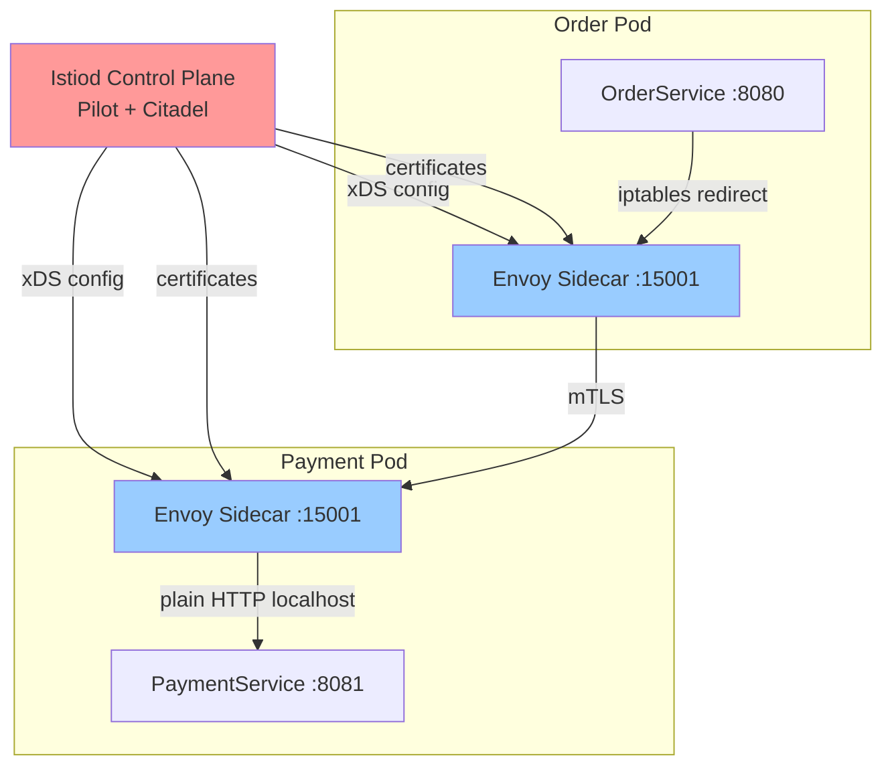

# Service Mesh Deep Dive

---

### 🎯 Model Answer

**30 seconds:**
> A service mesh is an infrastructure layer that manages all service-to-service communication in a microservices system. It deploys a sidecar proxy (Envoy) next to every service. All traffic flows through these proxies. The control plane (Istiod) configures all proxies centrally, providing: mTLS for all traffic, circuit breaking, retries, timeouts, load balancing, distributed tracing, and traffic routing. Services communicate as if they were directly calling each other, unaware that the proxies are intercepting and managing the traffic.

**3 minutes:**
> The service mesh solves the "every service must implement resilience" problem. In a polyglot microservices environment - Java services, Python services, Go services - each must implement retries, circuit breakers, mTLS, and tracing independently. This produces: Java services use Resilience4j, Python services have no circuit breakers, Go services implement tracing differently. The result is inconsistent resilience and observability. A service mesh provides all of this uniformly, regardless of language, through the proxy layer. Architecture: data plane (Envoy sidecar proxies, one per pod) handles actual traffic. Control plane (Istiod for Istio) distributes configuration to all proxies via xDS APIs. Traffic policy configuration in Kubernetes YAML (VirtualService, DestinationRule) is interpreted by Istiod and pushed to all relevant Envoy proxies. No service restart required for policy changes. The cost of a service mesh is real: 1-3ms added latency per hop, ~100MB memory per sidecar, and significant operational complexity. At 500 services with 3 pods each = 1,500 Envoy sidecars. The control plane must maintain xDS connections to all 1,500 proxies. Changes push to all proxies simultaneously. This is a non-trivial operational platform. The decision to adopt a service mesh requires: clear justification (security compliance for mTLS, observability gaps, polyglot resilience), a Platform Engineering team to own and operate it, and the operational maturity to manage it at scale.

**Blank Mind Recovery:**
**(1) What:** "Infrastructure layer - Envoy sidecars on every pod, centrally configured."
**(2) Value:** "Uniform mTLS, resilience, observability across all services regardless of language."
**(3) Cost:** "Latency overhead, memory overhead, operational complexity. Not free."

---

### 📘 Concept Explanation

**What it is:**
A service mesh is a dedicated infrastructure layer for managing service-to-service communication. It consists of proxies (data plane) that handle traffic and a control plane that configures the proxies. Services communicate through the proxy layer transparently.

**Architecture deep dive:**
```
CONTROL PLANE (Istiod):
  Components:
    Pilot: service discovery, traffic management
           distributes xDS API configs to proxies
    Citadel: certificate authority (CA)
             issues/rotates SPIFFE X.509 certs
    Galley: configuration validation and distribution
  
  xDS APIs (Envoy configuration protocol):
    LDS: Listener Discovery Service (ports)
    RDS: Route Discovery Service (routing rules)
    CDS: Cluster Discovery Service (upstream hosts)
    EDS: Endpoint Discovery Service (service instances)

DATA PLANE (Envoy sidecars):
  One Envoy per pod (injected by webhook)
  Intercepts ALL traffic via iptables rules
  
  Inbound traffic:
    -> [iptables redirect: port 15006]
    -> Envoy (strip mTLS, apply policies)
    -> [localhost] -> Application

  Outbound traffic:
    -> [iptables redirect: port 15001]
    -> Envoy (add mTLS, retry, route)
    -> Network -> Target Envoy
```

**Traffic management resources (Istio):**
```yaml
# VirtualService: routing and resiliency rules
apiVersion: networking.istio.io/v1alpha3
kind: VirtualService
metadata:
  name: payment-service
spec:
  hosts:
    - payment-service
  http:
    # Fault injection for chaos testing
    - fault:
        delay:
          percentage:
            value: 5  # inject 5s delay in 5% of requests
          fixedDelay: 5s
      match:
        - headers:
            x-test-chaos:
              exact: "true"
      route:
        - destination:
            host: payment-service
    # Normal traffic: timeout + retry
    - timeout: 3s
      retries:
        attempts: 3
        perTryTimeout: 1s
        retryOn: "5xx,reset,connect-failure"
      route:
        - destination:
            host: payment-service
            subset: v1
          weight: 95  # 95% to stable
        - destination:
            host: payment-service
            subset: v2
          weight: 5   # 5% canary
---
# DestinationRule: traffic policy + circuit breaker
apiVersion: networking.istio.io/v1alpha3
kind: DestinationRule
metadata:
  name: payment-service
spec:
  host: payment-service
  trafficPolicy:
    connectionPool:
      tcp:
        maxConnections: 100  # bulkhead
      http:
        http2MaxRequests: 1000
        pendingRequests: 100
        consecutiveGatewayErrors: 5
    outlierDetection:
      # Circuit breaker: eject unhealthy pods
      consecutive5xxErrors: 5
      interval: 30s
      baseEjectionTime: 30s
      maxEjectionPercent: 50  # max 50% pods ejected
    tls:
      mode: ISTIO_MUTUAL  # enforce mTLS
  subsets:
    - name: v1
      labels:
        version: v1
    - name: v2
      labels:
        version: v2
```

**The key insight:**
Istio's circuit breaker (outlierDetection) works at the pod level, not the service level. When Pod A of PaymentService returns 5 consecutive 5xx errors, Istio ejects that pod from the load balancer for 30 seconds. Other pods continue to receive traffic. This is a smarter circuit breaker than a service-level Resilience4j circuit breaker: it isolates unhealthy pods rather than cutting off the entire service.

---

### 💻 Code Example

```java
// WITHOUT service mesh:
// Every service must implement its own resilience
@Service
public class PaymentService {
  // Must implement mTLS certificate management
  @Autowired SslContextFactory sslFactory;
  
  // Must implement circuit breaker
  @CircuitBreaker(name = "payment-gateway")
  @Retry(name = "payment-gateway")
  @TimeLimiter(name = "payment-gateway")
  public CompletableFuture<PaymentResult>
      processPayment(PaymentRequest req) {
    // Must manually propagate trace headers
    TracingContext ctx = tracingContext.get();
    return CompletableFuture.supplyAsync(
        () -> {
          // Must add tracing headers manually
          HttpRequest request = HttpRequest.newBuilder()
              .header("traceparent",
                  ctx.getTraceParent())
              .header("Authorization",
                  "Bearer " + getServiceToken())
              // Must handle mTLS in client config
              .build();
          return httpClient.send(request,
              bodyHandler);
        });
  }
}
// Python equivalent: no circuit breaker at all
// Go equivalent: different tracing implementation
// Inconsistent resilience across languages
```

> **Code walkthrough:** Without a service mesh, every service in every language implements mTLS, circuit breaking, retry logic, and trace propagation independently. Java uses Resilience4j. Python may have nothing. Go implements it differently. The resilience of the system is as inconsistent as its most poorly-instrumented service.

```java
// WITH service mesh (Istio):
// Service is a thin business logic layer
@Service
public class PaymentService {
  private final PaymentGatewayClient gatewayClient;

  // No mTLS code: Envoy sidecar handles it
  // No circuit breaker: Istio outlierDetection handles it
  // No retry code: Istio VirtualService handles it
  // No trace propagation: Envoy handles it
  // No timeout code: Istio VirtualService handles it
  
  public PaymentResult processPayment(
      PaymentRequest req) {
    // Plain HTTP call - all resilience handled
    // by the Envoy sidecar
    return gatewayClient.charge(
        req.getAmount(),
        req.getPaymentMethod());
  }
}
// Python service:
# def process_payment(req):
#     return gateway_client.charge(req)
# Identical resilience to Java service
# mTLS, retry, circuit breaker all handled by Envoy
```

> **Code walkthrough:** With the service mesh, the service code is pure business logic. All resilience concerns are declarative configuration in VirtualService and DestinationRule YAML, applied consistently to all services regardless of implementation language. A new Python service gets the same mTLS, circuit breaking, retry, and observability as the Java service automatically.

---

### 📊 Diagram

```
ISTIO SERVICE MESH ARCHITECTURE

CONTROL PLANE:
  +------------------+
  |      Istiod      |
  | +--------------+ |
  | |    Pilot     | |  <- xDS config distribution
  | |   Citadel    | |  <- certificate authority
  | +--------------+ |
  +--------+---------+
           |  xDS APIs (gRPC)
           v
DATA PLANE (Kubernetes cluster):
  +-----------pod-----------+  +-----------pod-----------+
  |                         |  |                         |
  | [App: OrderService]     |  | [App: PaymentService]   |
  |       port: 8080        |  |       port: 8081        |
  |          |              |  |          |              |
  | [Envoy sidecar: 15001]  |  | [Envoy sidecar: 15001]  |
  | [iptables redirect]     |  | [iptables redirect]     |
  +--------|----------------+  +---------|---------------+
           |    mTLS (Envoy to Envoy)    |
           +------------ <-> -----------+

  Traffic: OrderService app (8080)
         -> iptables redirect (15001)
         -> Envoy A (add mTLS, apply retry+timeout)
         -> Network
         -> Envoy B (verify mTLS, apply inbound policy)
         -> iptables redirect (15006)
         -> PaymentService app (8081)
  
  Service code: never knows about mTLS or Envoy
```



> **Diagram walkthrough:** Istiod centrally distributes both traffic configuration (via xDS APIs) and TLS certificates to all Envoy proxies. Traffic from OrderService is intercepted by its local Envoy sidecar via iptables rules, transformed to mTLS, and sent across the network. PaymentService's Envoy verifies the mTLS connection, strips TLS, and delivers plain HTTP to the application. The services are unaware of this interception. Istiod's dual role - configuration distributor and certificate authority - is what makes the mesh self-configuring and self-securing.

---

### 🏛️ System Design

**Problem:** Design a service mesh deployment strategy for an enterprise with 200 services, 50 teams, and a mix of Java, Python, Go, and Node.js services. Current pain points: no mTLS between services, inconsistent retry logic, no distributed tracing, and compliance requirement for encryption of all inter-service traffic.

**Design:**

**Phase 1: Foundation (Months 1-2)**
- Deploy Istio to a non-production namespace. Enable permissive mTLS (both mTLS and plain HTTP accepted).
- Instrument 3 pilot services (one Java, one Python, one Go) with the mesh.
- Validate: mTLS is working, observability is working, no latency regression > 5ms.

**Phase 2: Observability rollout (Months 2-4)**
- Enable mesh for all services in staging. Permissive mTLS.
- Deploy Grafana + Prometheus + Jaeger. Configure mesh metrics collection.
- Create service dependency map dashboard. Enable SLO tracking.
- Establish baseline: error rates, latency distributions per service.

**Phase 3: Security hardening (Months 4-6)**
- Switch to STRICT mTLS mode in staging. Verify all services communicate correctly.
- Add AuthorizationPolicies: each service only accepts traffic from its authorized callers.
- Fix any services that were using plain HTTP (should have been caught in permissive mode).
- Roll out STRICT mTLS to production namespace by namespace.

**Phase 4: Traffic management (Months 6-9)**
- Define standard traffic policies (VirtualService templates for each service tier).
- Implement canary deployment process using traffic weighting.
- Add fault injection for chaos engineering.
- Service team self-service: teams submit PRs to configure their own VirtualService.

**Platform Engineering responsibilities:**
- Istio upgrades (major Istio releases 1-2x/year).
- Envoy sidecar version consistency.
- Certificate rotation automation.
- Mesh performance monitoring (control plane lag, proxy CPU/memory).
- SLO dashboards and alerting templates.

**Service team responsibilities:**
- Register VirtualService and DestinationRule configuration.
- Propagate trace headers (the only code change required).
- Review and respond to mesh-generated observability alerts.

**Governance:**
- Service catalog: every service must have a registered AuthorizationPolicy.
- CI validation: VirtualService configurations validated before merge.
- Quarterly mesh health review: latency overhead, certificate rotation health, control plane performance.

---

### 🎓 Answers by Seniority

**Junior / Mid:** "A service mesh deploys a proxy sidecar next to every service container. All traffic goes through these proxies. The proxies handle mTLS encryption, retries, timeouts, and circuit breaking automatically. A central control plane (Istiod for Istio) tells all the proxies what to do. This means every service gets consistent security and resilience without writing any code for it."

**Senior / Staff:** "The service mesh debate is real. It solves genuine problems - polyglot resilience, consistent mTLS, centralized observability - but at a real cost. The cost is additive to each request: 1-3ms latency overhead per hop, 100-200MB RAM per pod for the sidecar, and significant operational complexity for the platform team. At 200 services with 5 pods each: 1,000 Envoy proxies, 100-200GB of total sidecar memory across the cluster, and a control plane that must scale to manage all of them. The decision framework: is there a compliance requirement for mTLS (strong case), are there polyglot resilience gaps causing incidents (strong case), does the team have operational maturity to run Istio in production (required), and is the latency overhead acceptable for latency-sensitive paths (must benchmark)? The alternative: use a common library for resilience in a homogeneous-language environment. Much less operational complexity at the cost of language lock-in."

---

### ⚠️ Common Misconceptions

**Misconception:** "The service mesh handles all security concerns - services don't need any security code."
Reality: The service mesh handles transport security (mTLS for encryption and service identity) and coarse network authorization (this service is allowed to call that service). It does NOT handle: user authentication (validating JWTs), fine-grained authorization (user 123 is allowed to see order 456), input validation (SQL injection prevention), business-level authorization (user has the correct account status to perform this action). Service code must still implement these. The mesh eliminates the network security layer but does not eliminate application security logic.

---

### 🚨 Failure Modes and Diagnosis

**Failure: Istiod unavailable - new pods can't get certificates and config**

Symptoms: New pod starts but fails liveness/readiness probes. istio-proxy container logs show xDS connection errors. Existing pods continue to work normally. Canary deployments fail because new pods can't start properly.

Root cause: Istiod is unhealthy (OOMKill, crash loop). Existing Envoy proxies have cached configuration and certificates, so they continue to work. New proxies need to connect to Istiod to get initial configuration and certificates - they fail at startup.

Diagnosis: `kubectl get pods -n istio-system` - check Istiod pod status. `kubectl logs -n istio-system istiod-xxx` for Istiod crash logs. `istioctl proxy-status` to see which proxies are synced. `kubectl logs {pod} istio-proxy` for xDS connection errors.

Fix: Immediate: if Istiod is crashlooping, review resource limits (Istiod OOM at scale is common). Scale Istiod up or increase memory limits. Long-term: deploy multiple Istiod replicas (HA). Set PodDisruptionBudget to ensure at least one Istiod replica is always available. Set resource requests appropriately for cluster size: ~1GB memory per 1,000 proxies.

---

### 🎯 Interview Deep-Dive

| Category | Time | Minimum |
|---|---|---|
| Definition | 2 min | 1 |
| Mechanism | 3 min | 2 |
| Architecture | 5 min | 2 |
| Security | 3 min | 2 |
| Trade-off | 3 min | 2 |
| Debugging | 3 min | 2 |
| Scenario | 5 min | 2 |
| Scale | 3 min | 1 |
| Design | 5 min | 1 |
| Comparison | 2 min | 1 |
| Anti-pattern | 2 min | 1 |
| Behavioral | 3 min | 1 |

#### Q1 - "Explain how Envoy proxy intercepts traffic without the service knowing about it."
> "Envoy injection: when a pod starts in an Istio-enabled namespace, a mutating admission webhook modifies the pod spec to add two containers: istio-init (init container) and istio-proxy (Envoy sidecar). istio-init runs first with NET_ADMIN capability and modifies the pod's iptables rules: outbound traffic to port 15001 is intercepted by Envoy. Inbound traffic from port 15006 is intercepted by Envoy. This happens in the pod's network namespace - the application code never changes. Outbound flow: application opens TCP connection to payment-service:8080. Kernel routes to 127.0.0.1:15001 (Envoy) via iptables. Envoy looks up the destination (payment-service:8080) in its EDS cluster config, applies mTLS, applies traffic policies (timeout, retry), and makes the actual network connection to the destination pod's Envoy sidecar. The original connection destination (payment-service:8080) is preserved in the metadata."

*What separates good from great:* "The iptables approach requires NET_ADMIN capability in the init container. Some security-hardened environments restrict this capability. Istio Ambient Mesh (released in Istio 1.18+) removes the per-pod sidecar entirely, using a per-node ztunnel (zero-trust tunnel) for L4 mTLS and a shared waypoint proxy for L7 policies. This eliminates the NET_ADMIN requirement and reduces sidecar memory overhead significantly."

---

#### Q2 - "What is the xDS API and how does Istiod use it to configure Envoy?"
> "xDS is the Envoy proxy configuration protocol. x is a placeholder for: Listener (LDS), Route (RDS), Cluster (CDS), Endpoint (EDS), Secret (SDS). Istiod translates Kubernetes service discovery information and Istio CRDs (VirtualService, DestinationRule) into xDS configuration and distributes it to all Envoy proxies via gRPC streaming connections. On every change (new pod, VirtualService update, certificate rotation): Istiod computes the new xDS configuration and pushes it to all relevant proxies. Proxies apply the new configuration without restart. The push is selective: a VirtualService change for PaymentService is pushed only to proxies that route to PaymentService (not all 1,000 proxies). This selective push is critical for control plane scalability. At 1,000 proxies: a full push to all proxies for every change would be expensive. Selective push reduces control plane load dramatically."

*What separates good from great:* "xDS v3 supports delta updates (only send what changed, not the full configuration). At scale, delta xDS is essential - sending the full configuration to 1,000 proxies on every change is expensive. Istio adopted delta xDS APIs starting in Istio 1.12. This dramatically reduces the bandwidth and CPU cost of configuration distribution at large scale."

---

#### Q3 - "How does Istio implement mTLS certificate rotation?"
> "Certificate lifecycle: Istiod has a built-in CA (Citadel). Each Envoy proxy requests a certificate for its pod's SPIFFE identity using the Kubernetes Service Account token as proof of identity (JWT). Istiod validates the service account token, issues an X.509 certificate with the SPIFFE ID (spiffe://cluster.local/ns/default/sa/payment-service), valid for 24 hours by default. Certificate delivery: Istiod delivers the certificate via xDS SDS (Secret Discovery Service). Envoy automatically requests renewal before expiry (~1 hour before). Rotation is transparent: the new certificate is staged before the old one expires. During a brief overlap window, Envoy accepts both. No traffic interruption. If Istiod is unavailable at renewal time: Envoy continues using the existing certificate until expiry. If Istiod remains unavailable past expiry: mTLS connections fail (new connections cannot be established with an expired certificate)."

*What separates good from great:* "External CA integration: enterprises with existing PKI infrastructure (Vault, AWS ACM Private CA) can configure Istiod to use an external CA instead of its built-in one. Istiod requests certificates from the external CA on behalf of each proxy. This integrates Istio with existing certificate management processes and compliance requirements (some compliance frameworks require certificates issued by specific CAs)."

---

#### Q4 - "Design a traffic management strategy for a high-stakes production deployment."
> "Zero-downtime deployment using Istio traffic weighting. Scenario: deploying PaymentService v2. Risk: any regression in payment processing. Strategy: (1) Deploy v2 as a separate Kubernetes Deployment (payment-service-v2) with labels version:v2. Initial traffic: 0% to v2 (VirtualService weight: v1=100%, v2=0%). (2) Internal testing: add header-based routing. Requests with header X-Canary: true go to v2. QA team and internal testers use this header. 0% production traffic affected. (3) 1% canary: shift 1% of production traffic to v2. Monitor error rate, latency, and business metrics (payment success rate) for 30 minutes. (4) Progressive rollout: if metrics healthy: 5%, 10%, 25%, 50%, 100% in steps with monitoring periods between. (5) Instant rollback: if any metric degrades, change VirtualService weights back to v1=100% in seconds (kubectl apply). No pod restart required. Total deployment from 0% to 100%: 2-4 hours with confidence."

*What separates good from great:* "Automated canary with Flagger: an Istio-integrated tool that automates canary deployments based on Prometheus metrics. Define: success criteria (error rate < 1%, latency < 500ms). Flagger automatically shifts traffic and monitors. On failure: automatic rollback. On success: automatic promotion to 100%. This removes human judgment from the traffic shift decision and enables continuous deployment without manual canary monitoring."

---

#### Q5 - "A service mesh is adding 5ms to every request. How do you diagnose and reduce this overhead?"
> "5ms is higher than expected (typical: 1-2ms). Diagnosis: (1) Baseline: disable mTLS for the service temporarily (permissive mode). Measure latency without mTLS. If drops to 2ms: 3ms is from mTLS handshake overhead. If stays at 5ms: mTLS is not the cause. (2) TLS session resumption: check if Envoy is doing full TLS handshakes or session resumption (much cheaper). `istioctl proxy-config stats {pod}` for TLS handshake metrics. (3) Connection pool: is Envoy establishing new TCP connections per request? Check connectionPool settings in DestinationRule. Increase http2MaxRequests (more multiplexing over fewer connections). (4) Envoy filter overhead: custom Lua or WASM filters add CPU cost per request. Profile filter overhead via Envoy admin stats. (5) CPU throttling: Envoy sidecar has too low CPU limit, causing request queuing. Check sidecar resource limits."

*What separates good from great:* "HTTP/2 multiplexing eliminates per-request TLS handshakes: with HTTP/2, multiple requests share one TLS connection. One handshake for many requests. If the Envoy proxies are using HTTP/1.1 between services, every request incurs a new TCP + TLS handshake. Verify HTTP/2 is enabled (it is by default in Istio for gRPC; may need explicit configuration for HTTP)."

---

#### Q6 - "How does Istio's circuit breaker differ from application-level circuit breakers?"
> "Istio outlierDetection: pod-level circuit breaker. Monitors individual pod error rates within a service cluster. If pod A of PaymentService returns 5 consecutive 5xx errors: Istio ejects pod A from the load balancer for the base ejection time. Other pods (B, C, D) continue to receive traffic. Application circuit breaker (Resilience4j): service-level circuit breaker. If 50% of calls to PaymentService fail: the entire circuit opens. All pods of PaymentService are bypassed. Key differences: Istio: granular (ejects unhealthy pods, keeps healthy ones). Good for partial degradation (one bad pod). Resilience4j: service-level (trips on overall error rate). Good for full service failure. They are complementary. Istio handles pod-level health. Application circuit breaker handles service-level health. Use Istio outlierDetection + Resilience4j at the service level for defense in depth."

*What separates good from great:* "The maxEjectionPercent setting in Istio outlierDetection (50% by default) prevents Istio from ejecting so many pods that the remaining pods become overloaded. If 80% of pods are unhealthy, ejecting 80% would overload the remaining 20%. Capping at 50% ensures a minimum available capacity. Set this based on your service's deployment size."

---

#### Q7 - "How do you debug a traffic routing issue in Istio where requests are going to the wrong service version?"
> "Step 1: verify the VirtualService configuration is correct. `kubectl get virtualservice payment-service -o yaml`. Check weights sum to 100%, subset names match DestinationRule subsets, host name matches. Step 2: verify DestinationRule subsets match actual pod labels. `kubectl get destinationrule payment-service -o yaml`. Check that subset v1 and v2 label selectors match actual pod labels: `kubectl get pods -l app=payment-service --show-labels`. Step 3: check that the proxy has received the configuration. `istioctl proxy-config routes {pod} --name 8081 -o json`. Look for the route matching the service and verify the weighted clusters. Step 4: check proxy sync status. `istioctl proxy-status` - if a proxy shows 'STALE', it has not received the latest Istiod configuration. Step 5: traffic test. `kubectl exec -it curl-pod -- curl -v payment-service` multiple times. Check x-envoy-upstream-service-time header and the application's version response."

*What separates good from great:* "`istioctl analyze` runs a set of diagnostics against all Istio configurations in the cluster. It catches: VirtualService referencing a host that has no DestinationRule, subset name mismatches, port mismatches. Run this as the first diagnostic step for any routing issue."

---

#### Q8 - "How does the service mesh interact with Kubernetes service discovery?"
> "Kubernetes Service Discovery: kube-dns resolves payment-service to a ClusterIP (virtual IP). kube-proxy maintains iptables rules that load-balance connections to ClusterIP across all ready pods. Without Istio: client connects to ClusterIP, kube-proxy routes to a pod randomly. With Istio: client connects to payment-service (DNS resolves to ClusterIP). iptables redirect (istio-init) intercepts the connection before it reaches kube-proxy. Envoy receives the connection with the original destination (payment-service) and performs its own load balancing (EDS: list of pods from Istiod). Envoy bypasses kube-proxy's load balancing entirely. This is why Istio can implement: least-connection load balancing (kube-proxy only does round-robin), consistent-hash load balancing (sticky sessions by header), traffic weighting (kube-proxy does not support this), and connection pool limits (per-upstream connection limits)."

*What separates good from great:* "The Istiod endpoint discovery (EDS) gets its list of endpoints from the Kubernetes API server (watching Endpoints or EndpointSlices resources). Istiod distributes this list to all Envoy proxies via xDS. The Envoy proxy has a more up-to-date and feature-rich view of the endpoint list than kube-proxy. When a pod becomes unhealthy (fails health checks), Kubernetes removes it from the EndpointSlice. Istiod propagates this removal to all Envoy proxies within seconds."

---

#### Q9 - "What is Ambient Mesh and how does it differ from sidecar mesh?"
> "Ambient Mesh (Istio 1.18+): removes the per-pod Envoy sidecar. Architecture: ztunnel (zero-trust tunnel) is a per-node DaemonSet. Handles L4 (mTLS, connection routing) for all pods on the node. waypoint proxy: optional per-namespace or per-service proxy. Handles L7 policies (retries, circuit breaking, header manipulation). Pods do NOT have sidecars. Traffic redirection: ztunnel uses network programming (not iptables init container) to intercept traffic. Differences from sidecar: resource efficiency: no 100MB sidecar per pod (ztunnel is shared per node). No NET_ADMIN init container requirement. L7 policies are optional (only deployed if needed). Upgrade path: ztunnel upgraded per node (not per pod - no pod restart required for proxy upgrades). Drawbacks: ztunnel is a per-node shared component - a ztunnel issue affects all pods on the node. L7 policies require an additional waypoint proxy deployment."

*What separates good from great:* "Ambient Mesh changes the operational model for mesh upgrades. Sidecar mesh: upgrading Envoy requires restarting all pods (rolling restart). At 10,000 pods: a mesh upgrade is a multi-hour rolling restart. Ambient Mesh: upgrading ztunnel is a node-level rolling update (controlled by Kubernetes DaemonSet update strategy). Pod restarts are not required for proxy upgrades. This dramatically reduces the operational cost of keeping the mesh proxy up to date."

---

#### Q10 - "At 500 services and 5,000 pods, what are the critical Istiod scaling considerations?"
> "xDS connection overhead: Istiod maintains a persistent gRPC connection to each Envoy proxy. At 5,000 pods: 5,000 xDS connections. Each connection uses ~1-2MB of memory on Istiod. 5,000 * 1.5MB = 7.5GB just for connections. Istiod memory: total memory requirement with endpoint data and configuration: ~10-15GB for 5,000 proxies. Run multiple Istiod replicas (3-5) for HA and load distribution. Configuration push amplification: a single service change triggers xDS pushes to all proxies that route to that service. At 500 services with average 50 dependencies each: a popular service change triggers pushes to 250 proxies. Istiod must serialize and send the update. Batch pushes (debounce interval of 100ms-1s) prevents stampede on rapid config changes. Certificate rotation: Istiod CA issuing certificates for 5,000 proxies. Each certificate valid for 24 hours. 5,000 / 24 hours = ~208 certificate renewals per hour. At 3x safety margin: Istiod CA must handle ~600 certificate operations per hour - not a bottleneck."

*What separates good from great:* "At this scale, Istiod should be deployed with: horizontal pod autoscaling based on CPU (xDS serialization is CPU-intensive), dedicated nodes with guaranteed QoS, persistent volume for CA state (not ephemeral), and load testing of control plane at max proxy count before production. The Istio team provides a performance benchmark guide with recommended Istiod sizing per proxy count."

---

#### Q11 - "How do you enforce zero-trust security at the service level with Istio AuthorizationPolicy?"
> "Istio AuthorizationPolicy implements workload-level access control. Default: allow-all (after enabling mTLS, all services can still call all others). Explicit deny-by-default: apply a default-deny policy to the namespace. Then add allow policies for specific service-to-service communication. Example: OrderService is allowed to call InventoryService on the /api/v1/reservations POST endpoint. No other service can. YAML: AuthorizationPolicy with source.principals (SPIFFE identity of OrderService's service account) and operation.paths/methods specified. Implementation: this runs inside Envoy, not in the application. The check happens before the request reaches the application. A service that receives an unauthorized call gets a 403 response from Envoy - the application never processes it. At 500 services: the total number of AuthorizationPolicy entries is the number of allowed service-to-service call pairs. Start with the minimum necessary list and expand from there."

*What separates good from great:* "AuthorizationPolicy can be combined with JWT (RequestAuthentication): first validate the JWT (RequestAuthentication), then check both the user's role and the service's identity in the AuthorizationPolicy. This provides defense in depth: mTLS verifies the calling service's identity, JWT verifies the user's identity, AuthorizationPolicy combines both for the allow/deny decision."

---

#### Q12 - "Compare Istio, Linkerd, and Consul Connect as service mesh options."
> "Istio: most feature-rich (traffic management, security, observability all built-in), Envoy sidecar (highly capable proxy), large ecosystem, complex to operate. Best for: large enterprises with dedicated Platform Engineering teams, complex traffic management requirements (canary, fault injection, multi-cluster). Linkerd: focused on simplicity and performance. Uses a lighter-weight proxy (Linkerd2-proxy, written in Rust) with lower overhead than Envoy (~10MB vs 50-100MB per sidecar). Opinionated and less configurable. Best for: teams that want service mesh benefits without Istio's operational complexity. Consul Connect: part of the HashiCorp Consul ecosystem. Integrates with Vault for secrets management, supports non-Kubernetes workloads (VMs, bare metal). Best for: hybrid environments mixing Kubernetes and traditional VMs, organizations already using Consul for service discovery. Selection criteria: operational complexity tolerance (Istio > Consul > Linkerd), feature richness needed (Istio > Consul > Linkerd), performance sensitivity (Linkerd > Consul ~ Istio)."

*What separates good from great:* "The service mesh ecosystem is consolidating around Envoy as the data plane. Linkerd is the primary exception with its own proxy. Gateway API (Kubernetes SIG) is standardizing traffic management configuration, reducing lock-in between meshes. New Istio deployments using Gateway API configuration can potentially migrate to another Gateway API-compliant mesh without rewriting all traffic management configs."

---

### ⚖️ Comparison Table

| Feature | Istio | Linkerd | Consul Connect | No Mesh |
|---|---|---|---|---|
| mTLS | Automatic | Automatic | Manual setup | Manual/None |
| Traffic Management | Rich (canary, fault inject) | Basic | Medium | Code-based |
| Observability | Full (metrics, traces, logs) | Metrics + traces | Metrics | Code-based |
| Proxy | Envoy (~50-100MB) | Linkerd2-proxy (~10MB) | Envoy | N/A |
| Non-K8s support | Limited | Kubernetes only | Strong | Any |
| Operational Complexity | High | Low | Medium | None |
| Multi-cluster | Built-in | Built-in (enterprise) | Built-in | Manual |
