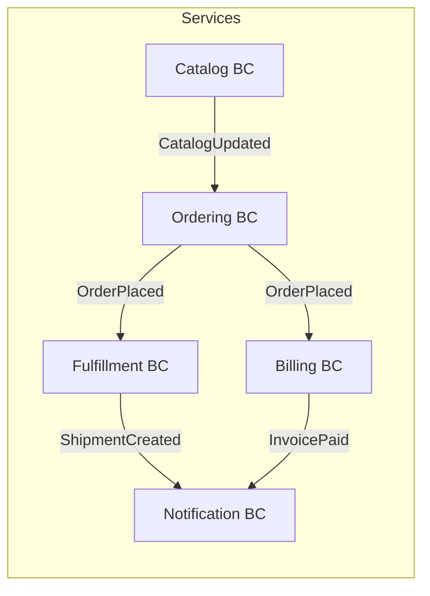
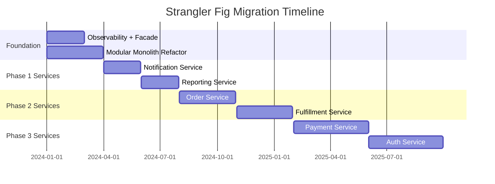
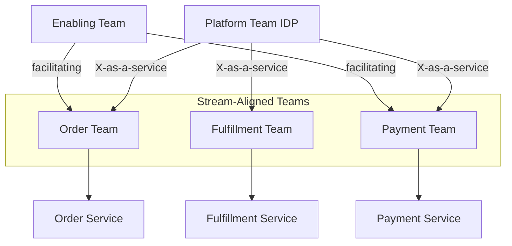
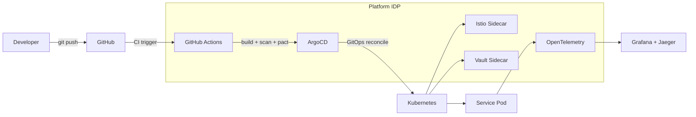
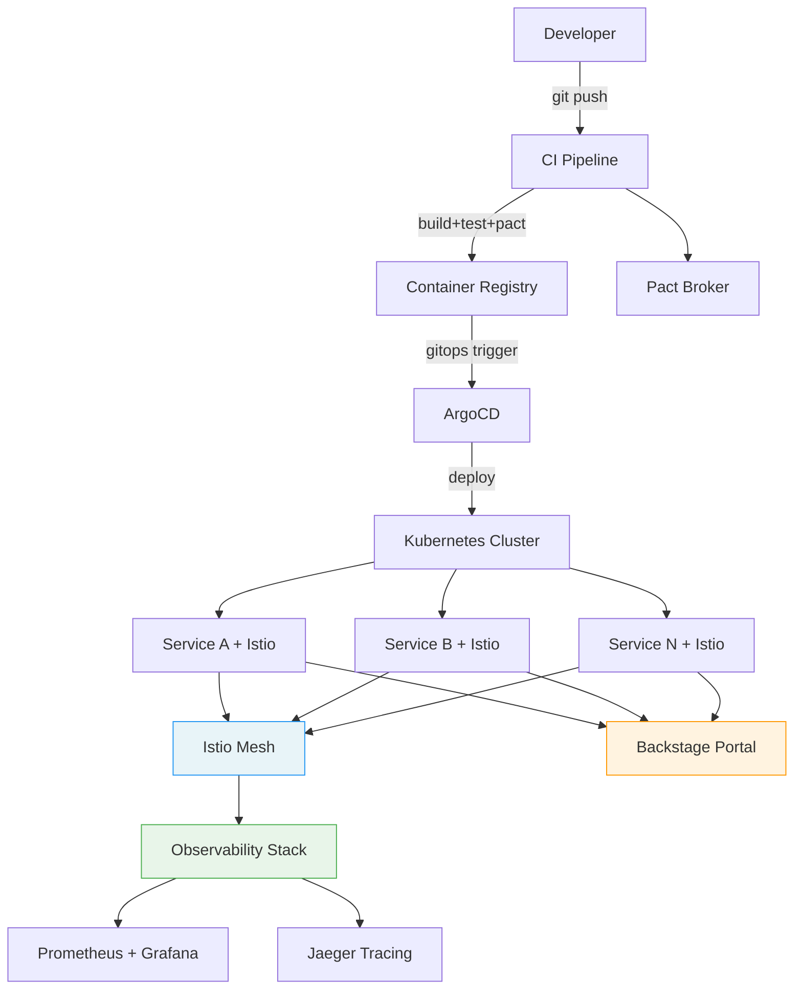

## Keywords in This File

{: .no_toc }

| #   | Keyword                                                              | Weight   |
| --- | -------------------------------------------------------------------- | -------- |
| 1   | [Domain-Driven Design and Bounded Contexts](#domain-driven-design-and-bounded-contexts) | critical |
| 2   | [Microservices at Scale](#microservices-at-scale)                    | high     |
| 3   | [Migration from Monolith Strategy](#migration-from-monolith-strategy) | critical |
| 4   | [Team Topology for Microservices](#team-topology-for-microservices)  | high     |
| 5   | [Platform Strategy for Microservices](#platform-strategy-for-microservices) | high |

---

# Domain-Driven Design and Bounded Contexts

🎯 Interview Weight: critical - DDD and bounded contexts are
the theoretical foundation for correct microservice decomposition;
staff-level interviews probe for concrete application of these
principles.

---

### 🎯 Model Answer

**30 seconds:**
> Domain-driven design (DDD) is a methodology for aligning software
> design with business domains. A bounded context is a boundary
> within which a particular domain model is consistent. Microservice
> boundaries should map to bounded contexts: each service owns
> one bounded context, has its own ubiquitous language, and does
> not share its domain model with other services. Misaligning
> service boundaries with domain boundaries is the root cause
> of the distributed monolith anti-pattern.

**3 minutes (Senior):**
> DDD provides the vocabulary and tools for finding correct service
> boundaries. The key concepts: (1) Ubiquitous language: within
> a bounded context, every term has one precise meaning shared
> by both business and engineering. The term "Order" means
> something different in the fulfillment context (a package to
> be shipped) vs. the billing context (an invoice to be collected).
> Same word, different meaning - different bounded contexts.
>
> (2) Bounded context: a boundary within which a specific domain
> model applies. The model inside the context is consistent;
> the model at the boundary requires translation (an Anti-Corruption
> Layer or a context map). A service should own exactly one
> bounded context; a bounded context should be owned by at most
> one team.
>
> (3) Context mapping: the explicit documentation of how
> bounded contexts relate. Patterns: shared kernel (two contexts
> share a subset of the model - tight coupling), customer-supplier
> (one context depends on another), conformist (downstream adopts
> upstream model with no negotiation), anti-corruption layer
> (downstream translates upstream model into its own language).
>
> The practical guidance: when you cannot find the right service
> boundary, draw the bounded contexts first. The service boundary
> will follow.

**Framework:** WHAT - WHY - HOW - TRADE-OFF - EXAMPLE

**Blank Mind Recovery:**

**(1) Restate:** "You are asking about how to find the correct
boundaries for microservices using DDD."

**(2) First principles:** "A microservice should be a unit of
independent deployment. A bounded context is a unit of coherent
domain logic. The two should align."

**(3) Bridge:** "A hospital has departments: billing, emergency,
pharmacy. Each uses different language for 'patient' - billing
calls them an account; emergency calls them a case. Same person,
different contexts. Each department is a bounded context."

---

### 📘 Concept Explanation

**Core DDD concepts:**
```
UBIQUITOUS LANGUAGE:
  In Ordering context: "Order" = customer's purchase intent
  In Fulfillment context: "Order" = package to be picked
  In Billing context: "Order" = invoice to be processed
  Same word, different bounded contexts, different models

BOUNDED CONTEXT BOUNDARIES:
  OrderService (Ordering BC):
    - Order (cart -> placed -> confirmed)
    - OrderItem, Address, PromoCode
    - Does NOT know about Shipment, Invoice

  FulfillmentService (Fulfillment BC):
    - Shipment (confirmed -> packed -> shipped)
    - PickList, WarehouseLocation
    - Receives OrderPlaced event; translates to its model

  BillingService (Billing BC):
    - Invoice (created -> sent -> paid)
    - PaymentMethod, Tax
    - Receives OrderPlaced event; creates Invoice in its model

CONTEXT MAPPING:
  OrderService -[event]-> FulfillmentService
    (customer-supplier; Order publishes events FulfillService consumes)
  OrderService -[event]-> BillingService
    (customer-supplier; same pattern)
  
  NO shared objects between contexts.
  Translation at the boundary.
```

**Aggregates:**
```
AGGREGATE: a cluster of domain objects treated as one unit
  with a single root entity (Aggregate Root)

OrderAggregate:
  ROOT: Order (the only entry point for mutations)
    CHILD: List<OrderItem>
    CHILD: Address
    CHILD: PaymentReference

Rules:
  - External objects may reference the Aggregate Root by ID only
  - All changes to child entities must go through the root
  - Aggregate boundaries = transaction boundaries
  - Keep aggregates small (avoid "God aggregate")
```

**Event Storming for finding bounded contexts:**
```
PROCESS:
1. List all domain events (orange stickies):
   - OrderPlaced, PaymentProcessed, ItemReserved,
     ShipmentCreated, InvoiceGenerated, OrderCancelled

2. Group events that represent one business process:
   - ORDER FLOW: OrderPlaced, OrderConfirmed, OrderCancelled
   - FULFILLMENT FLOW: ItemReserved, PackagePicked, ShipmentCreated
   - BILLING FLOW: InvoiceGenerated, PaymentProcessed

3. Each group is a bounded context candidate

4. Verify: can each group be developed independently?
   Does each group have its own team ownership?
```

---

### 💻 Code Example

**BAD - Shared domain model across services:**
```java
// WRONG: OrderService and BillingService share the same
// Order class from a shared-kernel library

// shared-lib/Order.java:
public class Order {
    Long id;
    Long customerId;
    List<OrderItem> items;
    BigDecimal total;
    String shippingAddress;  // Needed by Fulfillment
    String invoiceAddress;   // Needed by Billing
    String billingReference; // Needed by Billing only
    String warehouseId;      // Needed by Fulfillment only
    // "God class": satisfies nobody perfectly
}

// Changes to Order for BillingService break FulfillmentService.
// Both services deploy together when the shared lib changes.
// This is the shared kernel anti-pattern.
```

> **Code walkthrough:** A shared domain model couples all services.
> Adding a billing-specific field to Order requires all services
> to update and redeploy. The class satisfies no service's model
> completely (billing does not care about warehouseId; fulfillment
> does not care about invoiceAddress). This is exactly the distributed
> monolith that DDD bounded contexts prevent.

**GOOD - Separate domain models per bounded context:**
```java
// OrderService's own Order model (Ordering BC)
// Only contains what the ordering context cares about
package com.company.orderservice.domain;

@AggregateRoot
public class Order {
    private final OrderId id;
    private final CustomerId customerId;
    private final List<OrderItem> items;
    private OrderStatus status;  // Ordering context lifecycle
    private final ShippingAddress shippingAddress;
    private final Money subtotal;

    // Business behavior - not a dumb data container
    public void confirm() {
        if (this.status != OrderStatus.PENDING) {
            throw new IllegalStateException(
                "Only PENDING orders can be confirmed");
        }
        this.status = OrderStatus.CONFIRMED;
        DomainEventPublisher.raise(
            new OrderConfirmedEvent(this.id));
    }

    public void cancel(CancellationReason reason) {
        if (this.status == OrderStatus.SHIPPED) {
            throw new DomainException(
                "Cannot cancel a shipped order");
        }
        this.status = OrderStatus.CANCELLED;
        DomainEventPublisher.raise(
            new OrderCancelledEvent(this.id, reason));
    }
}

// FulfillmentService's own model (Fulfillment BC)
// Completely independent - has its own "order" concept
package com.company.fulfillmentservice.domain;

@AggregateRoot
public class Shipment {
    private final ShipmentId id;
    private final OrderReference orderRef;  // just the ID
    private final List<PickItem> items;
    private ShipmentStatus status;  // Fulfillment lifecycle

    // Different lifecycle from Order - different BC
    public void markPacked() {
        this.status = ShipmentStatus.PACKED;
    }
}

// Anti-Corruption Layer: translates OrderConfirmedEvent
// into FulfillmentService's model
@Component
public class OrderEventTranslator {

    @EventListener(OrderConfirmedEvent.class)
    public void onOrderConfirmed(OrderConfirmedEvent event) {
        // Translate: Ordering BC event -> Fulfillment BC command
        Shipment shipment = Shipment.create(
            new OrderReference(event.getOrderId()),
            translateItems(event.getItems()),
            translateAddress(event.getShippingAddress()));
        shipmentRepository.save(shipment);
    }
}
```

> **Code walkthrough:** Each bounded context has its own domain
> model. `Order` in OrderService has the ordering lifecycle
> (PENDING -> CONFIRMED -> CANCELLED). `Shipment` in
> FulfillmentService has the fulfillment lifecycle
> (CREATED -> PACKED -> SHIPPED). They share only an `OrderReference`
> (the ID). The Anti-Corruption Layer translates the `OrderConfirmedEvent`
> into FulfillmentService's own language. Both services evolve
> their models independently.

---

### 🎓 Answers by Seniority

**Junior / Mid (0-5 years):**
> DDD is a design approach that aligns software with business
> concepts. A bounded context is a clear boundary around a
> business area where specific domain language and models apply.
> Microservices should align with bounded contexts: OrderService
> owns the ordering context, FulfillmentService owns the fulfillment
> context. Each has its own model of shared concepts like "order."

---

**Senior / Staff (5+ years):**
> DDD's most practical contribution to microservices is the bounded
> context concept: it provides the objective criterion for where
> a service boundary should be. "Where the ubiquitous language
> changes is where the service boundary should be." The context
> map is the architectural diagram that should precede any service
> decomposition - it shows the relationships, translation patterns,
> and team ownership. The most common mistake: skipping the context
> map and making service boundaries based on technical layers (user
> service, product service, order service based on data entities)
> rather than business capabilities.

---

### ⚠️ Common Misconceptions

**Misconception 1: "One service per database table is DDD."**
DDD suggests service boundaries at bounded context boundaries,
not at data entity boundaries. A bounded context typically contains
multiple related entities.

**Misconception 2: "DDD requires microservices."**
DDD originated for monolithic architectures. The bounded context
concept is applicable to any decomposition: modular monolith,
microservices, or a domain-organized monolith.

---

### 🚨 Failure Modes and Diagnosis

**Failure: Services share business logic in a shared library**
Symptom: Teams cannot deploy independently; every library update
requires coordinated deployment of all services.
Diagnosis: Check for shared libraries containing domain objects
(not just utilities). Domain objects should not cross service boundaries.
Fix: Each service implements its own version of shared domain
concepts. Share only infrastructure concerns (logging, tracing).

**Failure: Services call each other synchronously for every operation**
Symptom: A change in ServiceA requires simultaneous changes in
ServiceB and ServiceC.
Diagnosis: Services are in the same logical bounded context but
deployed separately (wrong decomposition).
Fix: Merge services that are always deployed together. Apply
DDD to find the correct bounded context boundary.

---

### 🎯 Interview Deep-Dive

**Timing:** Hard - 12 min target

| Category | Questions |
|---|---|
| Definition | 2 |
| Mechanism | 2 |
| Scenario | 3 |
| Debugging | 1 |
| Deep Dive | 1 |
| Misconception | 1 |
| Trade-off | 2 |

**Definition:**

Q: "What is a bounded context and how do you identify one?"

A: A bounded context is an explicit boundary within which a
particular domain model applies with consistency. Within the
boundary, all terms have one precise meaning (ubiquitous language);
at the boundary, translation is required. Identification: (1) Follow
the language changes: when the same word means different things
to different teams, that is a context boundary. "Customer" means
a lead in the sales context but a payer in the billing context.
(2) Follow the team ownership: teams that can make decisions
independently about a domain area are natural bounded context
owners. (3) Event Storming: list all domain events and group
them by business process - each group is a bounded context
candidate. (4) Conway's Law signal: the system architecture
should mirror the team communication structure. If teams need
to coordinate for every change, the boundary is wrong.

*What separates good from great:* Know that bounded contexts
are discovered, not invented. Event Storming is the discovery
technique. The output of an Event Storming session is a context
map with bounded contexts, events, commands, and aggregates.

---

Q: "What are the DDD context mapping patterns and when do
you use each?"

A: Shared Kernel: two contexts share a subset of the domain
model. Both teams must agree on changes. High coupling. Use
only when separation is genuinely impractical (early stage,
single team). Customer-Supplier: downstream (customer) depends
on upstream (supplier). Upstream considers downstream's needs
in its planning. Use for asymmetric dependencies where one
service's API is consumed by another. Conformist: downstream
adopts upstream model without negotiation. Simpler but less
autonomous for downstream. Use when integrating with an external
system you do not control (bank API, payment gateway).
Anti-Corruption Layer: downstream translates upstream model
into its own language. Maximum downstream autonomy. Use for
legacy integration or when upstream model is poorly suited to
downstream needs. Published Language: upstream provides a
documented schema (Avro, Protobuf, JSON Schema) for all consumers.

*What separates good from great:* Know the ACL pattern by name
and when to apply it: whenever integrating with a legacy system
or external API, always add an ACL. Never let the external model
leak into your domain model.

---

**Mechanism:**

Q: "How do aggregates help define transaction boundaries in
microservices?"

A: An aggregate is a cluster of domain objects with a single
aggregate root. The aggregate root is the entry point for all
mutations. The aggregate boundary is also the transaction boundary:
all changes within one aggregate are atomic (one ACID transaction).
Across aggregates (and across services): no atomic transaction;
use eventual consistency with sagas. This directly guides the
service design: operations that must be atomic must be within
one aggregate in one service. If two operations must always
succeed or fail together, they belong in the same aggregate
in the same service. If they can be eventually consistent, they
can be in separate aggregates (and potentially separate services).

*What separates good from great:* Know the "aggregate = transaction
boundary" rule explicitly. This is the technical translation of
DDD into database design: one aggregate = one database update
(potentially multiple tables in one transaction). Cross-aggregate
= eventual consistency = saga.

---

Q: "What is the difference between an entity and a value object
in DDD?"

A: Entity: has an identity that persists over time. Two entities
with the same attributes are not the same if they have different IDs.
Example: Customer entity with id=42 - even if the name changes,
it is the same customer. Value Object: defined by its attributes,
not by identity. Two value objects with the same attributes are
equal. Immutable. Example: Money(amount=99.99, currency=USD) -
two Money objects with the same amount and currency are interchangeable.
Address - two addresses with the same fields are equivalent.
Design implication: entities need ID management (UUID generation,
database identity). Value objects are embedded (no separate table
needed, stored as columns in the parent entity's table). This
distinction affects database design and object identity.

*What separates good from great:* Know the database mapping
implication: entities map to database tables (with primary key
columns); value objects are embedded (JPA `@Embeddable`) in
the parent entity's table row or stored as JSON columns.
This is the link from DDD theory to implementation.

---

**Scenario:**

Q: "You are helping design a new e-commerce system. Identify
the bounded contexts and their relationships."

A: Event Storming first: domain events include OrderPlaced,
PaymentProcessed, ItemReserved, ShipmentCreated, InvoiceGenerated,
ReviewSubmitted, RecommendationViewed, InventoryUpdated. Grouping:
(1) Catalog BC: ProductListed, PriceUpdated, InventoryUpdated
- owned by Catalog team. (2) Ordering BC: CartCreated,
OrderPlaced, OrderConfirmed, OrderCancelled - owned by Order team.
(3) Fulfillment BC: ItemReserved, PicklistCreated, ShipmentCreated,
ShipmentDelivered - owned by Fulfillment team. (4) Billing BC:
InvoiceGenerated, PaymentProcessed, RefundIssued - owned by
Finance team. (5) Reviews BC: ReviewSubmitted, ReviewModerated
- owned by Community team. Context relationships: Order BC is
supplier to Fulfillment BC (publishes OrderPlaced; Fulfillment
consumes via ACL). Order BC is supplier to Billing BC (same).
Catalog BC is supplier to Order BC.

*What separates good from great:* Identifying the ACL pattern
on the context relationships: Fulfillment and Billing both use
ACLs to translate Order events into their own models. This prevents
the Order model from leaking into Fulfillment and Billing.

---

Q: "A team wants to share the 'Customer' entity between the
Ordering and Loyalty services. How do you advise?"

A: Do not share the entity class directly. Each context has
its own customer model. Approach: (1) Identify what each context
needs from "customer." Ordering needs: name, email, shipping address,
payment method. Loyalty needs: tier, points balance, program ID.
These are different models with different data and different
lifecycle. (2) Create separate customer representations in each
bounded context: `OrderingContext.Customer` and
`LoyaltyContext.Member`. (3) The shared identity: the customer's
unique ID is the bridge. Ordering uses the customer ID as a reference;
Loyalty uses the same ID as the membership ID. No shared class
needed - just a shared identifier. (4) If Loyalty needs to know
when a new customer joins: publish a `CustomerRegisteredEvent`
from the identity/registration bounded context; Loyalty subscribes
and creates a new Member record.

*What separates good from great:* Know the "shared identifier"
pattern: bounded contexts share IDs, not models. The ID is the
bridge; each context builds its own model around that ID.

---

Q: "How do you handle a requirement that two bounded contexts
must always be consistent (e.g., order and payment must always
match)?"

A: If two contexts must always be consistent, question whether
they are genuinely separate bounded contexts. A requirement for
always-consistent operations between two contexts is a strong
signal that they belong in the same context. If the requirement
is: "every order must have exactly one payment record," that
is a candidate for the same aggregate or at least the same service.
If they must remain separate (organizational, team, or scale
reasons): accept eventual consistency with monitoring. The
consistency guarantee is: within T seconds, any payment record
has a corresponding order, monitored by a reconciliation job.
Define the acceptable window (T = 30 seconds) and the escalation
procedure when it is violated. "Always consistent" in distributed
systems is a misleading requirement - the real question is "what
is the acceptable consistency window?"

*What separates good from great:* Know the "reframe the requirement"
response: "always consistent" in a distributed context usually
means "consistent within X seconds with monitoring." Getting
the business to define X is the architectural conversation.

---

**Debugging:**

Q: "After applying DDD and creating bounded contexts, services
are still tightly coupled. What did you do wrong?"

A: Common mistakes: (1) Service boundaries drawn at entity
level (UserService, ProductService, OrderService) instead of
bounded context level. Entity-level services require coordination
for most business operations because business logic spans entities.
(2) Shared library contains domain objects: services share a
domain library that creates compile-time coupling. Each service
must redeploy when the library changes. (3) Synchronous calls
for domain events: ServiceA calls ServiceB synchronously for
events that do not need a response. Replace with async events.
(4) No ACL: ServiceA uses ServiceB's domain model directly.
Changes in B break A. Add translation layer. Diagnosis: draw
the dependency graph. High fan-in (many services depend on one)
signals a "god service." Synchronized deployments signal shared
data or synchronous coupling.

*What separates good from great:* Know the diagnostic: draw the
dependency graph and count fan-in per service. A service with
10+ incoming synchronous dependencies is a distributed monolith
node.

---

**Deep Dive:**

Q: "What is Event Storming and how does it produce a context map?"

A: Event Storming is a collaborative workshop technique (invented
by Alberto Brandolini) for discovering domain knowledge and
bounded contexts. The process: (1) Domain Events (orange stickies):
all participants list everything that happens in the domain
(past tense: "OrderPlaced", "PaymentFailed"). No filtering - chaos
first. (2) Commands (blue stickies): what triggers each event
("PlaceOrder" triggers "OrderPlaced"). (3) Aggregates (yellow
stickies): which entity processes each command. (4) Bounded contexts
emerge: aggregates and events cluster naturally around business
capabilities. (5) Context map: draw the relationships between
clusters - which contexts produce events that other contexts consume.
The output: a visual context map with aggregate roots, commands,
events, and context boundaries. This becomes the blueprint for
service decomposition.

*What separates good from great:* Know the output format:
a context map with aggregates, commands, events, and context
boundaries. The map directly maps to services: one bounded context
per service, events are the API between services, aggregates
define the transaction boundaries.

---

**Misconception / Trap:**

Q: "We should align our microservices with our REST resources
(one service per noun: UserService, ProductService, OrderService)."

A: Resource-based decomposition is a technical decomposition,
not a domain decomposition. It creates services that are too
fine-grained (entity per service = nanoservice) and highly coupled
(business operations span entities). Example: placing an order
touches User (validate address), Product (check availability),
Inventory (reserve), Payment (charge), and Order (create) - six
services in a synchronous chain. The DDD approach groups by
business capability: Ordering BC (creates and manages orders,
validates, reserves), Fulfillment BC (picks and ships), Billing BC
(charges and invoices). Three services instead of six, each with
clear ownership, each independently deployable for its business
capability.

*What separates good from great:* Know the concrete example:
the order placement flow across 6 resource-based services is the
canonical example of why entity decomposition creates a distributed
monolith.

---

**Trade-off:**

Q: "Big bounded contexts (fewer services) vs. small bounded
contexts (more services) - how do you decide?"

A: Bigger bounded contexts: lower operational overhead (fewer
services to deploy and monitor), simpler local ACID transactions,
easier team coordination. Risk: a large context becomes a mini-
monolith that is slow to deploy and deploy frequently. Smaller
bounded contexts: independent deployability at finer granularity,
independent scaling per business capability, smaller team blast
radius. Risk: nanoservice anti-pattern, chatty communication,
higher operational overhead. Decision criteria: team size
(Conway's Law: team per bounded context is the ideal). Scale
requirements: does this capability need to scale independently?
(If search scales 100x more than checkout, separate them.)
Change frequency: if parts of a context change at very different
rates, splitting may be justified. Default: start bigger, split
when independent scaling or deployment requirements emerge.

*What separates good from great:* Know the "start bigger, split
when justified" advice. Martin Fowler and Sam Newman both advocate
starting with a modular monolith or few large services, then
extracting bounded contexts when the operational requirements
justify the cost.

---

Q: "How do you identify a wrong service boundary after deployment?"

A: Wrong service boundary signals: (1) Services are always
deployed together (they are functionally coupled but deployed
separately). (2) A feature requires changes in 3+ services
simultaneously (logic is split across wrong boundaries). (3)
Services call each other synchronously in a chain for every
business operation. (4) One service's API is consumed by 80%+
of other services (it is a distributed monolith hub). (5) Teams
cannot make decisions about their service independently
(they need approval or coordination from other teams). Remediation:
merge services that always deploy together. Apply event-driven
decoupling to break synchronous chains. Re-apply DDD event
storming to find the correct boundary.

*What separates good from great:* Know the "always deploy together"
signal as the most conclusive indicator of a wrong boundary.
If two services require simultaneous deployment for every change,
they are one service in two deployment units.

---

### ⚖️ Comparison Table

| Concept | Scope | Purpose | Microservices Mapping |
|---|---|---|---|
| **Bounded Context** | Business capability boundary | Independent model and language | One service per bounded context |
| Aggregate | Transaction boundary within BC | Atomic consistency unit | One DB transaction per aggregate |
| Domain Event | Cross-context communication | Decouple bounded contexts | Kafka topic per domain event type |
| ACL | Context translation | Prevent model leakage | Service-side event translator |

---

### 🏛️ System Design

*(Conditional: ★★★ - required.)*

**DDD in system design interviews:**
When presenting a microservices design, justify service boundaries
using DDD language: "OrderService owns the Ordering bounded context.
It has its own domain model, its own database, and publishes
domain events. FulfillmentService owns the Fulfillment bounded
context and subscribes to those events via an Anti-Corruption Layer."

**Staff angle:** DDD is not a silver bullet. Applying DDD
correctly requires domain expertise, not just pattern application.
The most common failure: developers apply DDD patterns without
the business knowledge to identify the correct bounded contexts.
Event Storming with actual domain experts (not just engineers)
is required for correct results.

---

### 📊 Diagram

```
CONTEXT MAP:
[Catalog BC] --publishes--> [CatalogEvent] --consumes--> [Ordering BC]
[Ordering BC] --publishes--> [OrderPlaced] --consumes--> [Fulfillment BC]
                                           --consumes--> [Billing BC]
[Fulfillment BC] --publishes--> [Shipment events]
[Billing BC] --publishes--> [Payment events]
```



> **Diagram walkthrough:** Each bounded context publishes events
> that other contexts consume via their own ACL. The Ordering BC
> is the central event producer for the order lifecycle; Fulfillment
> and Billing consume independently. The Notification BC listens
> to all contexts - it is a leaf in the dependency graph (nothing
> depends on it). All communication is event-driven (unidirectional
> arrows), preventing the synchronous chain anti-pattern.

---

---

# Migration from Monolith Strategy

🎯 Interview Weight: critical - monolith-to-microservices
migration is one of the most common real-world challenges;
every senior candidate is expected to describe a safe migration
strategy.

---

### 🎯 Model Answer

**30 seconds:**
> Migrating from a monolith to microservices uses the Strangler
> Fig pattern: incrementally replace monolith functionality with
> new services, routing traffic to the new service for each
> capability. Never big-bang: extract one bounded context at a
> time, starting with the least risky and most business-valuable.
> The monolith shrinks over time; the new services grow. This
> takes months to years, not weeks.

**3 minutes (Senior):**
> The strangler fig pattern works as follows: (1) identify the
> bounded context to extract (start with one that has clear
> boundaries, high independent scaling need, or a team ready to
> own it). (2) Deploy the new service. (3) Route new requests
> for that capability to the new service (via API gateway or
> facade). (4) Migrate data (dual-write + backfill + cutover).
> (5) The monolith's code for that capability can now be removed.
>
> The strangler fig facade (API gateway or proxy) is critical:
> it allows routing to be changed without modifying either the
> monolith or the new service. Start: 0% to new service.
> Ramp: 5%, 20%, 100%. Rollback: 0% instantly.
>
> The most important advice: do not start with the most complex
> or most critical service (payment, auth). Start with the most
> independent, least risk (recommendations, notifications, reports).
> Build the organizational muscle for microservices ownership before
> extracting the most critical capabilities.
>
> Realistic timeline: extracting one bounded context (code,
> data, tests, CI/CD): 2-6 months. Full migration for a large
> monolith: 2-5 years.

**Framework:** WHAT - WHY - HOW - TRADE-OFF - EXAMPLE

**Blank Mind Recovery:**

**(1) Restate:** "You are asking about how to safely move from
a monolith to microservices without downtime or big-bang risk."

**(2) First principles:** "The risk of migration is proportional
to the amount of change done at once. The strangler fig minimizes
batch size to one bounded context at a time."

**(3) Bridge:** "The strangler fig plant grows around a host tree,
eventually replacing it. The host tree does not die suddenly -
the new plant takes over one branch at a time."

---

### 📘 Concept Explanation

**Migration principles:**
```
PRINCIPLE 1: Never big-bang
  Bad: extract all services in one sprint
  Good: one bounded context at a time

PRINCIPLE 2: Start with independent, low-risk contexts
  First candidates:
  - Notifications (low risk, high independence)
  - Reporting/analytics (read-only, no mutations)
  - Recommendations (stateless, easy to scale)
  Avoid first:
  - Auth/identity (too critical)
  - Payment (too complex, regulatory)
  - Core order processing (too high risk)

PRINCIPLE 3: The monolith is not the enemy
  A modular monolith is often better than
  a premature microservices system.
  Prerequisite: understand the bounded contexts
  before extracting them.

PRINCIPLE 4: Data migration is the hardest part
  Code is easy to move.
  Data is hard: live traffic, no downtime, consistency.
  Plan the data migration before the code migration.
```

**Strangler Fig implementation:**
```
STEP 1: Add the facade layer
  Monolith              New Service
  GET /notifications ->  [API Gateway] -> Monolith (100%)
  (no routing change yet)

STEP 2: Deploy new service (no traffic yet)
  NotificationService deployed, tested in staging

STEP 3: Canary routing
  GET /notifications -> [API Gateway] -> New: 5%, Monolith: 95%

STEP 4: Data migration (dual-write + backfill)
  Notifications table -> NotificationService DB

STEP 5: Full cutover
  GET /notifications -> [API Gateway] -> New: 100%

STEP 6: Cleanup
  Remove notification code from monolith
```

**Decision framework for extraction order:**
```
HIGH PRIORITY (extract first):
  - Clear bounded context boundary
  - Independent scaling need
  - Team ready to own it
  - Low data coupling with rest of monolith
  - Low business criticality (acceptable if migration fails)

LOW PRIORITY (extract last):
  - Complex data relationships with rest of monolith
  - High business criticality (auth, payment)
  - No team ready to own it
  - Regulatory complexity
```

---

### 💻 Code Example

**Strangler Fig facade (Spring Cloud Gateway):**
```yaml
# API Gateway routes for strangler fig migration
# routes.yml

spring:
  cloud:
    gateway:
      routes:
        # Notification service: 100% migrated to new service
        - id: notification-service
          uri: lb://notification-service
          predicates:
            - Path=/api/notifications/**
          # No weight: all traffic to new service

        # Order service: in migration - 20% to new service
        # (Canary using weighted routing)
        - id: order-service-new
          uri: lb://order-service-new
          predicates:
            - Path=/api/orders/**
            - Weight=order-group, 20
          metadata:
            version: v2

        - id: order-service-legacy
          uri: lb://monolith
          predicates:
            - Path=/api/orders/**
            - Weight=order-group, 80
          metadata:
            version: v1

        # All other traffic: still in monolith
        - id: monolith-fallback
          uri: lb://monolith
          predicates:
            - Path=/**
```

> **Code walkthrough:** Spring Cloud Gateway provides weighted
> routing for the strangler fig pattern. The notification service
> is fully migrated (100% to new service). The order service is
> in migration (20% to new, 80% to monolith). All other paths
> fall through to the monolith. Changing the weights is a
> configuration change (no redeployment) - the routing is the
> strangler fig facade.

**Feature toggle in the monolith for database migration:**
```java
// Inside the monolith: dual-write during extraction
@Service
public class OrderService {

    // During migration: write to both monolith DB and
    // new OrderService's API simultaneously
    public Order placeOrder(OrderRequest req) {
        // Write to monolith DB (primary)
        Order order = orderRepository.save(new Order(req));

        // Dual write to new service if extraction is in progress
        if (migrationConfig.isDualWriteEnabled("order-service")) {
            try {
                newOrderServiceClient.createOrder(
                    toNewServiceDto(order));
            } catch (Exception e) {
                // Non-blocking: log and alert
                migrationMonitor.reportDualWriteFailure(
                    "order-service", order.getId(), e);
            }
        }

        return order;
    }
}
```

> **Code walkthrough:** The dual-write is controlled by a migration
> configuration flag, not a feature flag for users. When enabled,
> every order write goes to both the monolith database and the
> new OrderService. Failures in the new service write are logged
> (not user-facing) - the monolith transaction is the source of
> truth during migration. This is the transition mechanism that
> populates the new service's database with live data before cutover.

---

### 🎓 Answers by Seniority

**Junior / Mid (0-5 years):**
> The strangler fig pattern is the safe way to migrate: instead
> of replacing the entire monolith at once, extract one capability
> at a time. A facade (API gateway) routes traffic between the
> monolith and the new services. Start with low-risk capabilities
> (notifications, reports). Avoid extracting payment or auth first.

---

**Senior / Staff (5+ years):**
> The migration strategy starts before the first line of new code:
> identify bounded contexts, assess data coupling, and plan the
> data migration before the code migration. The code is the easy
> part; data migration with zero downtime is the hard part. The
> strangler fig provides the routing mechanism; dual-write + backfill
> provides the data migration mechanism. The realistic timeline:
> 2-6 months per bounded context. A large monolith with 20 bounded
> contexts takes 3-5 years. Set expectations accordingly.

---

### ⚠️ Common Misconceptions

**Misconception 1: "We should extract all services in one sprint."**
Big-bang extraction fails because you are building a distributed
system and migrating data simultaneously. The strangler fig's
incremental approach reduces risk at every step.

**Misconception 2: "Microservices are always better than a monolith."**
A well-structured modular monolith is often better than premature
microservices for small teams. Microservices are justified by
independent scaling needs, team autonomy requirements, and
organizational scale.

---

### 🚨 Failure Modes and Diagnosis

**Failure: Migration stalls (monolith never fully replaced)**
Symptom: Some services extracted, but the monolith persists
indefinitely; teams stop migrating.
Diagnosis: Monolith becomes a "core" with too much data coupling.
Fix: Allocate dedicated migration sprints; deprecate monolith
features (not just extract to services). Set a sunset date for
the monolith.

**Failure: New services immediately become as coupled as the monolith**
Symptom: Extracted services require deployment coordination.
Diagnosis: Service boundaries were drawn incorrectly (entity-based
instead of bounded-context-based).
Fix: Apply DDD event storming to re-identify correct boundaries
before further extraction.

---

### 🎯 Interview Deep-Dive

**Timing:** Hard - 12 min target

| Category | Questions |
|---|---|
| Definition | 2 |
| Mechanism | 2 |
| Scenario | 3 |
| Debugging | 1 |
| Deep Dive | 1 |
| Misconception | 1 |
| Trade-off | 2 |

**Definition:**

Q: "What is the Strangler Fig pattern and how does it apply to
microservices migration?"

A: The Strangler Fig pattern (Martin Fowler, named after the
strangler fig tree) is an incremental replacement strategy for
legacy systems. The strangler fig tree grows around its host,
eventually replacing it. Applied to microservices: (1) A facade
(API gateway or proxy) intercepts all calls to the monolith.
(2) For each capability being extracted: deploy a new microservice,
route a percentage of traffic to it via the facade. (3) Once the
new service is validated, route 100% to it. (4) Remove the old
code from the monolith. (5) The monolith gradually shrinks as
services are extracted. Key: the facade is always present as
the routing layer. The client never calls the monolith or the
new service directly - always through the facade.

*What separates good from great:* Know that the facade must
be deployed before any extraction starts. Without the facade,
there is no way to route traffic to the new service without
changing the client or the monolith.

---

Q: "What are the prerequisites before starting a microservices
migration?"

A: (1) Observability: the monolith must have distributed tracing,
structured logging, and metrics before extraction. You cannot
debug a failing extraction without observability. (2) CI/CD
pipeline: automated build and deploy for the monolith and each
new service. Manual deployment is too risky during migration.
(3) Feature flag infrastructure: to toggle traffic routing at
the facade without deployment. (4) Data understanding: document
all database tables, foreign keys, and data flows before any
extraction. The data migration is always the hard part. (5) Team
ownership: identify which team will own each extracted service.
Ownership must precede extraction. Extracting a service without
a clear owner creates an orphan service.

*What separates good from great:* Know the "observability before
extraction" requirement. Extracting a service before instrumentation
is in place makes post-extraction debugging nearly impossible.

---

**Mechanism:**

Q: "How do you handle the database during a monolith-to-microservices
migration?"

A: The database is the hardest migration challenge. Three stages:
Stage 1 (schema isolation): within the monolith, identify which
tables belong to each bounded context. Add package/schema namespacing
(e.g., `schema: ordering`, `schema: fulfillment`). Different code
modules own different schema namespaces. This is a modular monolith
step - no distributed complexity yet. Stage 2 (separate schemas
in same database): move ordering tables to a separate database
schema (or database user with restricted access). Other modules
must go through the OrderService code layer to read/write ordering
data - no direct SQL joins across schemas. Stage 3 (separate
databases): extract the database to a dedicated instance for
the new service. Use dual-write + backfill (described in Data
Migration section). This three-stage progression minimizes risk
at each step.

*What separates good from great:* Know the three-stage progression:
namespace isolation (easy), separate schema (medium), separate
database (hard). Each stage is a checkpoint - the team can
stop at stage 2 if separate databases are not justified.

---

Q: "How do you prioritize which parts of the monolith to
extract first?"

A: Prioritization framework: (1) Value: which capability has
the most to gain from independent scaling or deployment frequency?
High value = extract first. (2) Risk: which capability is most
critical to the business? Auth, payment = high risk = extract
last. (3) Data coupling: which tables have the fewest foreign
key references to other bounded contexts? Low coupling = extract
easier. (4) Team readiness: which team has the skills and
bandwidth to own a new service? Unowned service = dangerous.
(5) Strangler-ability: can the capability be cleanly isolated
in the monolith first (schema namespace, package boundary)?
Clean monolith boundary = easier extraction. Start with: notification,
reporting, search, recommendations. These are low-risk, often
stateless, and high-value for independent scaling.

*What separates good from great:* Know the strangler-ability
criterion: before extracting, the capability should be cleanly
isolatable within the monolith (module boundary, schema boundary).
If you cannot isolate it in the monolith, you cannot safely
extract it as a microservice.

---

**Scenario:**

Q: "Your team is working on a 5-year-old Java monolith with
a 200-table PostgreSQL database. Where do you start?"

A: Week 1-2: Observability foundation. Add distributed tracing
(OpenTelemetry), structured logging, and Prometheus metrics if
not present. Deploy Jaeger. This is a prerequisite. Week 3-4:
Event Storming workshop with the product and engineering team.
Map all domain events, identify bounded context candidates,
create a context map. Week 5-6: Assess the 200-table schema.
Group tables by bounded context candidate. Identify tables with
many cross-boundary foreign keys (these are high-coupling pain
points, not starting points). Week 7-8: Add schema namespacing
to the monolith (PostgreSQL schemas: `ordering.*`, `fulfillment.*`).
Enforce via code review: no cross-schema direct SQL joins. Month 3:
Extract the first low-risk bounded context (notifications or
reports). Month 4+: Continue extraction one bounded context
per 2-4 months.

*What separates good from great:* Know that Week 1 is observability,
not service extraction. Teams that start extracting services
without observability cannot diagnose the failures that follow.

---

Q: "How do you measure migration progress?"

A: Three metrics: (1) Traffic percentage to new services: what
percentage of production requests are served by new microservices
vs. the monolith? Goal: grow this over time. (2) Table count
in monolith database: how many of the original 200 tables remain
in the monolith schema? Goal: reduce over time. (3) Monolith
deployment frequency vs. new service deployment frequency:
are new services deploying more frequently than the monolith?
Goal: yes (this validates the independent deployability benefit).
Additionally: team satisfaction (are teams able to deploy
independently?), incident rate (is migration causing more or
fewer incidents?).

*What separates good from great:* Know the "table count in
monolith" metric as the data migration progress indicator.
Code extraction without data migration is incomplete extraction.

---

Q: "A service extracted 6 months ago is now tightly coupled to
the monolith again (it calls the monolith for data on every request).
How did this happen and how do you fix it?"

A: This is the most common migration regression: a service was
extracted but the team took a shortcut and left some data in
the monolith, calling back to it. Over time, these calls became
the primary integration path. Causes: the extracted service's
bounded context was not fully defined; the service was extracted
before its data was migrated (the service uses an API instead
of its own database for some data). Fix: (1) Identify which
monolith data the service is reading. (2) Determine: does this
data belong in the extracted service's bounded context?
If yes: migrate the data (dual-write + backfill + cutover).
If no: this is a shared context concern - the architecture is
wrong. Rethink the bounded context boundary.

*What separates good from great:* Know the "data not migrated"
root cause. An extracted service that calls the monolith for
data is not fully extracted. Full extraction requires the data
to move too.

---

**Debugging:**

Q: "After extracting a new service, error rates increased 5%
across all services. How do you diagnose?"

A: The new service is a new network hop for requests that used
to be local function calls. Possible causes: (1) Network timeouts:
the caller does not have a timeout configured for the new service
call. Check timeout configuration. (2) Circuit breaker not
configured: if the new service is slow or down, callers queue
up requests. Add circuit breaker immediately. (3) New service
has a bug in the extracted code path. Check the new service's
error logs. (4) The facade routing is sending some requests to
both the monolith and the new service (double processing). Check
gateway configuration. (5) Missing functionality: some requests
that the monolith handled are not handled by the new service
(incomplete extraction). Check 404/500 rate for specific paths
in the new service.

*What separates good from great:* Know the "missing functionality"
cause: a 5% error increase after extraction sometimes means that
5% of the monolith's code paths were not extracted. Check which
specific requests are failing.

---

**Deep Dive:**

Q: "What is the Expand-Contract pattern and how does it apply
to monolith-to-microservices API migration?"

A: During monolith-to-microservices migration, the monolith's
API must continue working for clients while the implementation
moves to a new service. The expand-contract pattern for API
migration: Phase 1 (Expand): add new endpoints in the new service
that mirror the monolith's API. Deploy both. The facade routes
new traffic to the new service; existing traffic stays on the
monolith. Phase 2 (Validate): run shadow reads from the new
service alongside the monolith for a period. Validate response
parity. Phase 3 (Migrate): switch client applications to the
new service endpoints progressively. Phase 4 (Contract): once
all clients have migrated, remove the old monolith endpoints.
This pattern ensures that the API contract for clients remains
stable during the migration - no client changes required during
Phase 1-3.

*What separates good from great:* Know that the expand phase
must come before any client migration - the new API must be
live and validated before any client is asked to change.

---

**Misconception / Trap:**

Q: "We need to finish the microservices migration in 6 months
or it is not worth doing."

A: Microservices migration is not a project with a completion
date - it is an ongoing evolution. The value is delivered
incrementally: each extracted bounded context provides independent
deployability and scaling benefit from the day it is extracted.
A team that extracts 3 services in 6 months has 3 services worth
of benefits, not zero. The realistic expectation: a large monolith
takes 2-5 years to fully migrate, with business benefits delivered
every 2-4 months as each new service is extracted. Setting a
"6 months or nothing" deadline pressures teams into big-bang
extractions that fail or into premature architecture. Set
milestones per bounded context extraction, not a completion date
for the entire monolith.

*What separates good from great:* Know the "incremental value"
argument: each service extraction provides value on its own.
The migration does not need to be complete to provide return
on investment.

---

**Trade-off:**

Q: "Modular monolith vs. microservices during early migration -
which is better?"

A: Modular monolith: one deployable unit with clear internal
module boundaries (package namespacing, enforced via ArchUnit
tests, separate database schemas). Advantages: ACID transactions
still work, no network overhead, simple deployment. Disadvantages:
cannot scale individual components; still one deployment unit.
Microservices: separate deployment units with all the associated
benefits (independent scaling, independent deployment) and costs
(network, operational overhead). During early migration: a modular
monolith is often the correct intermediate step. It establishes
the bounded context boundaries as code boundaries before introducing
distributed system complexity. This reduces the risk of extracting
the wrong boundary as a microservice.

*What separates good from great:* Know ArchUnit for enforcing
module boundaries in a Java modular monolith: `noClasses().that()
.resideInAPackage("..ordering..").should().accessClassesThat()
.resideInAPackage("..fulfillment..")` - this prevents coupling
from emerging between modules.

---

Q: "What is the risk of not migrating to microservices?"

A: Not migrating is a valid choice for many contexts. The risks
of staying on a monolith: (1) Scaling ceiling: the entire monolith
must scale even if only one component (e.g., search) needs more
capacity. (2) Deployment coupling: a bug in any module can delay
the entire deployment. (3) Technology lock-in: the entire system
is bound to one technology stack. Mitigation without full
microservices: a modular monolith with deployment pipeline
optimization can provide most of the developer experience benefit
at lower operational cost. The honest answer: microservices are
not appropriate for every organization size. For teams < 20
engineers or systems < 50k daily active users, a well-structured
modular monolith outperforms premature microservices.

*What separates good from great:* Know the "monolith is valid
for small teams" position. An engineer who knows when NOT to
apply microservices demonstrates more architectural judgment
than one who always advocates for microservices.

---

### ⚖️ Comparison Table

| Strategy | Speed | Risk | Reversible | When to Use |
|---|---|---|---|---|
| **Strangler Fig** | Slow (months) | Low | Yes | Production migration |
| Big-Bang Rewrite | Fast (weeks) | Extreme | No | Never (avoid) |
| Modular Monolith First | Slow (weeks) | Very Low | Yes | New systems, unclear boundaries |
| Extract then Migrate Data | Medium | Medium | Partial | Clear boundary, low coupling |

---

### 🏛️ System Design

*(Conditional: ★★★ - required.)*

**Migration strategy in system design:**
When asked "how do you migrate from a monolith?", present the
3-phase plan: (1) observability and facade (months 1-2), (2) modular
monolith boundary enforcement (months 3-4), (3) strangler fig
extraction per bounded context (months 5+). Always mention
the data migration strategy.

**Staff angle:** Migration requires organizational commitment.
Dedicated migration sprints, a clear extraction roadmap, and
leadership support are required. Technical approach without
organizational buy-in leads to partial migrations (the worst
outcome: all the complexity of microservices with the benefits
of neither).

---

### 📊 Diagram

```
STRANGLER FIG PROGRESSION:
Month 0: [Monolith: 100%] ---------> API Gateway -> All to Monolith
Month 3: [Monolith: 90%] [NotifSvc: 10%] -> GW routes
Month 6: [Monolith: 75%] [Notif: 100%] [Order: 25%] -> partial
Month 12: [Monolith: 20%] [5 services] -> mostly migrated
Month 24: [Monolith: ~0%] [10 services] -> fully migrated
```



> **Diagram walkthrough:** The foundation work (observability,
> facade, modular refactor) runs in parallel at the start - these
> are prerequisites. Phase 1 extracts low-risk services (notifications,
> reports). Phase 2 extracts core business services. Phase 3 extracts
> the highest-risk services (payment, auth) - last, with the most
> experience and the most robust migration infrastructure.

---

---

# Team Topology for Microservices

🎯 Interview Weight: high - team topology is a Staff/Principal
level topic; demonstrates Conway's Law understanding and
organizational design thinking.

---

### 🎯 Model Answer

**30 seconds:**
> Conway's Law states that systems mirror the communication
> structure of the organizations that build them. Team Topologies
> (Skelton and Pais, 2019) provides a framework: Stream-aligned
> teams own end-to-end business capabilities (one team = one or
> more microservices); Platform teams provide internal infrastructure
> as a service; Enabling teams help stream-aligned teams adopt
> new practices. The goal: minimize cognitive load and maximize
> flow.

**3 minutes (Senior):**
> The Team Topologies framework has four team types: (1) Stream-
> aligned: owns a business capability end-to-end. Has the skills
> to build, deploy, and operate their services independently.
> Owns the product, the code, the pipeline, and the on-call.
> This is the primary team type in a microservices organization.
> (2) Platform: provides services that stream-aligned teams
> consume (CI/CD pipeline, observability, Kubernetes platform,
> security scanning, service mesh). The platform team reduces
> cognitive load for stream-aligned teams. (3) Enabling: temporary
> team that helps stream-aligned teams adopt new practices
> (microservices patterns, distributed tracing adoption).
> Self-destructs when the practice is adopted. (4) Complicated
> subsystem: owns a complex technical subsystem (ML inference
> engine, billing calculation engine) with specialized expertise.
>
> The interaction modes: collaboration (working together on a problem),
> X-as-a-service (stream-aligned consumes platform as a service),
> and facilitating (enabling team helps without doing the work).
>
> The key insight: the platform team's goal is to make the
> stream-aligned team's cognitive load minimal. A platform team
> that creates more complexity than it removes is counterproductive.

**Framework:** WHAT - WHY - HOW - TRADE-OFF - EXAMPLE

**Blank Mind Recovery:**

**(1) Restate:** "You are asking about how to organize teams
around microservices."

**(2) First principles:** "Conway's Law: the architecture follows
the team structure. If you want independent services, you need
independent teams. Design the team structure to match the
desired architecture."

**(3) Bridge:** "A stream-aligned team is like a restaurant
kitchen: it owns everything from order intake to plate delivery.
The platform team is the building management - provides the
utilities (electricity, water) that all kitchens share."

---

### 📘 Concept Explanation

**Four team types:**
```
1. STREAM-ALIGNED TEAM (primary)
   - Owns a bounded context (business capability)
   - End-to-end ownership: design, code, test, deploy, operate
   - Goal: fast flow with minimal external dependency
   - Size: "two-pizza rule" (Bezos): 5-10 people
   - Example: Order Team (owns OrderService, OrderDB, order pipeline)

2. PLATFORM TEAM (enabling platform)
   - Provides internal developer platform (IDP)
   - Services: CI/CD, Kubernetes, observability, secrets management
   - Goal: stream-aligned teams self-serve infrastructure
   - Metric: platform adoption rate, cognitive load reduction
   - Example: Infrastructure Team (owns K8s, ArgoCD, Grafana)

3. ENABLING TEAM (temporary coach)
   - Helps stream-aligned teams adopt new practices
   - Does NOT do the work for them; teaches and leaves
   - Goal: grow capability in stream-aligned teams
   - Example: Microservices Adoption Team (for 6 months during migration)

4. COMPLICATED SUBSYSTEM TEAM (specialist)
   - Owns a technically complex system requiring specialist skills
   - Examples: ML platform, recommendation engine, billing engine
   - Stream-aligned teams consume via API (not own)
```

**Interaction modes:**
```
COLLABORATION: work closely together, high bandwidth
  - Use during: innovation, solving new problems
  - Limit: high cognitive load, coordination overhead
  - Example: Platform + Stream-aligned during initial K8s adoption

X-AS-A-SERVICE: stream-aligned consumes platform as a product
  - Use when: platform is stable, well-documented
  - Benefit: low coordination overhead
  - Example: Stream-aligned team uses CI/CD pipeline as a service

FACILITATING: enabling team coaches stream-aligned
  - Use when: stream-aligned needs to learn new practice
  - Goal: transfer knowledge, then disengage
  - Example: DDD coaching for 3 months during microservices migration
```

**Conway's Law implications:**
```
WRONG team structure:
  Backend team (owns all backend services)
  Frontend team (owns all frontends)
  DBA team (owns all databases)
  Result: slow feature delivery (every feature spans all teams)

CORRECT (Inverse Conway Maneuver):
  Order Team (owns OrderService + OrderDB + Order UI)
  Fulfillment Team (owns FulfillmentService + DB + UI)
  Payment Team (owns PaymentService + DB + Payment UI)
  Platform Team (owns Kubernetes, CI/CD, observability)
  Result: each team delivers features independently
```

---

### 💻 Code Example

**Platform team IDP (Internal Developer Platform) contract:**
```yaml
# Platform team provides a standardized service template
# Stream-aligned teams instantiate it with minimal configuration

# service-template/values.yaml (platform-defined defaults)
service:
  name: ""          # required - stream-aligned sets this
  team: ""          # required - ownership tag
  tier: "standard"  # standard | critical | experimental

  resources:
    requests:
      cpu: "250m"   # platform sensible defaults
      memory: "256Mi"
    limits:
      cpu: "1000m"
      memory: "1Gi"

  # Platform provides all of these automatically:
  observability:
    tracing: enabled     # OpenTelemetry auto-configured
    metrics: enabled     # Prometheus scraping auto-configured
    logging: structured  # JSON logs auto-configured

  security:
    mtls: strict         # Istio auto-configured
    secretsBackend: vault  # Vault sidecar auto-injected
    imageScan: required    # Trivy scan in CI

  deployment:
    strategy: canary     # Argo Rollouts canary default
    canarySteps:
      - setWeight: 5
      - pause: {duration: 15m}
      - setWeight: 50
      - pause: {duration: 10m}

# Stream-aligned team's service.yaml (minimal configuration):
service:
  name: order-service
  team: order-team
  tier: critical
  resources:
    requests:
      cpu: "500m"  # override only what is different
```

> **Code walkthrough:** The platform team provides a standardized
> service template with sensible defaults for observability,
> security, and deployment strategy. Stream-aligned teams provide
> minimal configuration (name, team, tier). The platform handles
> all infrastructure concerns automatically. This is the IDP
> (Internal Developer Platform) pattern: the platform reduces
> cognitive load for stream-aligned teams to near zero for
> infrastructure configuration.

---

### 🎓 Answers by Seniority

**Junior / Mid (0-5 years):**
> Team structure for microservices: each team owns a bounded
> context end-to-end (code, deployment, operations). A platform
> team provides shared infrastructure (Kubernetes, CI/CD,
> monitoring) that all other teams use. Conway's Law says the
> system architecture mirrors the team structure - if you want
> independent services, you need independent teams.

---

**Senior / Staff (5+ years):**
> Team Topologies is the framework I use for microservices
> team design. Stream-aligned teams are the primary delivery unit
> - they own a bounded context end-to-end with minimal dependencies
> on other teams. The platform team's effectiveness is measured
> by how little cognitive load it adds to stream-aligned teams.
> A platform that requires 3 tickets to deploy a new service
> has failed at its job. The Inverse Conway Maneuver is the
> strategy: design the team topology to match the desired
> architecture, not the other way around.

---

### ⚠️ Common Misconceptions

**Misconception 1: "Platform team = bottleneck team."**
A platform team that owns a gate (tickets required, waiting
for platform team approval) is an anti-pattern. A correct platform
team provides self-service - stream-aligned teams provision
infrastructure themselves via the platform.

**Misconception 2: "One big backend team can own all microservices."**
One team owning all services has zero independent deployability.
The cognitive load of 20 services on one team is unsustainable.

---

### 🚨 Failure Modes and Diagnosis

**Failure: Platform team is a bottleneck (every team waits for platform)**
Symptom: Stream-aligned teams file tickets to platform for every
infrastructure change; lead time for new service deployment is
weeks.
Fix: Convert platform team deliverable from "do the work" to
"provide self-service tooling." Stream-aligned teams should
provision new services without involving the platform team.

**Failure: Too many "collaboration" interactions (all teams working
with all teams)**
Symptom: No team can ship independently; everything requires
cross-team meetings.
Diagnosis: Bounded context boundaries are wrong (teams own
overlapping domains). Fix: apply DDD to clarify ownership.

---

### 🎯 Interview Deep-Dive

**Timing:** Hard - 12 min target

| Category | Questions |
|---|---|
| Definition | 2 |
| Mechanism | 2 |
| Scenario | 3 |
| Debugging | 1 |
| Deep Dive | 1 |
| Misconception | 1 |
| Trade-off | 2 |

**Definition:**

Q: "What is Conway's Law and what is the Inverse Conway Maneuver?"

A: Conway's Law (Melvin Conway, 1968): "Organizations which design
systems are constrained to produce designs which are copies of
the communication structures of these organizations." A team
split by technical layer (frontend, backend, database) produces
a layered architecture. A team split by business capability
(orders, payments, fulfillment) produces capability-aligned
services. The Inverse Conway Maneuver: deliberately design the
team topology to match the desired architecture. If you want
a microservices architecture with independent services, create
independent teams per service boundary first. The architecture
will follow. This is the organizational strategy for microservices
adoption: structure teams before structuring code.

*What separates good from great:* Know the inverse: team structure
before architecture. The architecture is a consequence of
the team structure, not the other way around.

---

Q: "What is Team Topologies and how does it structure teams for microservices?"

A: Team Topologies (Skelton and Pais, 2019) defines four team types:
(1) Stream-aligned: primary delivery team, owns a business capability
end-to-end. (2) Platform: provides shared infrastructure as a
product (self-service). (3) Enabling: temporary, coaches stream-aligned
teams on new practices. (4) Complicated subsystem: specialist team
for technically complex components. Three interaction modes: collaboration
(tight coupling, high bandwidth), X-as-a-service (platform provides
services consumed by stream-aligned), facilitating (enabling team
coaches stream-aligned). The framework's key metric: cognitive
load. The goal is to minimize the cognitive load on stream-aligned
teams by providing clear boundaries and self-service tooling.

*What separates good from great:* Know the "cognitive load"
metric: Team Topologies explicitly uses cognitive load as the
design criteria. A team structure that maximizes cognitive load
on delivery teams slows feature velocity.

---

**Mechanism:**

Q: "How do you measure team topology effectiveness?"

A: Team topology metrics: (1) Deployment frequency per stream-aligned
team: how often can a team deploy independently? Target: multiple
times per week. (2) Change lead time: time from code commit to
production. Target: < 1 day. (3) Change failure rate: percentage
of deployments causing incidents. (4) Mean time to restore: time
to recover from an incident. These are the DORA metrics. Additionally:
cognitive load survey (do teams feel they can understand and
manage their systems?), platform ticket wait time (how long do
stream-aligned teams wait for platform responses?), inter-team
dependency count (how many cross-team dependencies does each
feature require?).

*What separates good from great:* Know the four DORA metrics
by name and target values: deployment frequency (elite: multiple
per day), lead time (elite: < 1 hour), change failure rate (elite:
0-15%), MTTR (elite: < 1 hour). These are the industry standard
metrics for software delivery performance.

---

Q: "How does the platform team avoid becoming a bottleneck?"

A: The platform team must operate as a product team, not a
service desk. Principles: (1) Self-service first: every platform
capability must be available as self-service (Terraform modules,
Helm charts, Argo Applications) without requiring platform team
intervention. (2) API-first: the platform provides APIs, not
tickets. (3) Developer experience (DX) as a metric: measure how
long it takes a stream-aligned team to create a new service
(target: < 30 minutes). (4) Treat stream-aligned teams as
customers: have office hours, a support channel, and a product
roadmap driven by stream-aligned team feedback. (5) Enable,
then step back: when a new capability is needed, enable
stream-aligned teams to do it themselves.

*What separates good from great:* Know the "< 30 minutes for
a new service" target: this is the concrete DX metric for an
effective IDP (Internal Developer Platform).

---

**Scenario:**

Q: "Your organization has 50 engineers and 15 microservices.
Each feature requires changes in 4-5 services. How do you fix
the team topology?"

A: 4-5 services per feature = services span multiple bounded
contexts or teams do not own their full vertical. Diagnosis:
either (1) team boundaries do not match bounded context boundaries
(team A owns service 1 and 7, team B owns services 2 and 8 -
no logical boundary), or (2) service boundaries are wrong (features
naturally span multiple bounded contexts = wrong decomposition).
Fix: (1) Redraw team ownership to align with bounded contexts.
Each team should own services in one cohesive business area.
(2) If services themselves are wrong: apply DDD Event Storming
to re-identify bounded contexts. The metric to track: features
that require changes in 1 service only. If that percentage
increases after the restructuring, the fix is working.

*What separates good from great:* Know the diagnostic question:
"what percentage of features require changes in only 1 service?"
A high-performing microservices organization achieves 80%+ single-
service features.

---

Q: "A new team (team C) has been created to own the Payment service.
How do you structure the handoff from the existing team (team A)?"

A: Structured handoff in 5 steps: (1) Documentation: team A
documents all operational knowledge - runbooks, architecture
decisions, common failure modes, on-call history. (2) Shadow
on-call: team C shadows team A for on-call for 4 weeks. They
observe incidents, learn the system's behavior, and begin developing
muscle memory. (3) Reverse shadow: team A shadows team C for
2 weeks. Team C is primary; team A is backup. (4) Collaboration
period: 4 weeks where team C owns the service with team A available
for questions but not involved in day-to-day. (5) Full ownership:
team A is removed from the service's access and alert routing.
Total timeline: 3 months. A service without proper knowledge
transfer is a liability - the receiving team will be reactive
(incidents) without understanding.

*What separates good from great:* Know the 3-month timeline
for service ownership transfer. Teams that hand off services
in 2 weeks create high-severity incident risk for the new owner.

---

Q: "How do you handle an on-call rotation for 15 microservices
owned by 5 teams?"

A: Each team owns on-call for its services. On-call structure:
(1) Primary on-call: one person per team, rotates weekly.
(2) Secondary (escalation): one person per team for complex issues.
(3) Cross-team escalation: if team A's service is affected by
team B's service failure, team B is the escalation target.
This requires clear service dependency documentation. Runbook
requirement: every service has a runbook with: common failure modes,
diagnostic steps, escalation paths, and recovery procedures.
Alerting: each team owns its own alert configuration. No shared
"all services" alert that pages everyone for any incident.

*What separates good from great:* Know the "teams own their
own alerts" principle. A shared alert configuration creates
alert fatigue (everyone gets paged for everything) and removes
ownership accountability.

---

**Debugging:**

Q: "Teams report that the platform is causing more overhead
than it reduces. How do you investigate?"

A: Gather data: (1) Ticket analysis: how many tickets to the
platform team per stream-aligned team per month? High ticket
count = platform is a service desk, not self-service. (2) Lead
time for common tasks: how long does it take to provision a
new service? Create a new Kubernetes namespace? Add a new secret?
If any common task takes > 1 day, the platform has a self-service
gap. (3) Team survey: what tasks do stream-aligned teams do
that they feel should be platform-provided? (4) Compare to
alternatives: could stream-aligned teams use a cloud-managed
service (AWS EKS, managed Kafka) and bypass the internal platform
entirely at lower total cost? The platform team should make
its cost-benefit case: "using our platform vs. the alternative
saves X hours per team per month."

*What separates good from great:* Know the "compare to alternatives"
evaluation: if the internal platform costs more (in engineer
time) than buying a managed cloud service, the platform may
not be justified at the current company scale.

---

**Deep Dive:**

Q: "What is cognitive load in the context of Team Topologies
and how does it affect service boundaries?"

A: Cognitive load is the total mental effort required for a
team to understand and manage its systems. Team Topologies
classifies cognitive load: intrinsic (the inherent complexity
of the domain), extraneous (complexity added by poor tooling
or unclear processes), germane (productive learning that builds
understanding). The goal: minimize extraneous cognitive load
(platform makes infrastructure transparent), keep intrinsic
cognitive load manageable (service scope matches team capacity),
and maximize germane load (teams develop deep domain expertise).
Service boundary implication: a team that owns 8 microservices
may have too high cognitive load (too many systems to understand
deeply). The ideal is 2-5 services per team, where the team
can maintain deep understanding of all of them.

*What separates good from great:* Know the 2-5 services per
team guideline. More than 5 services means the team cannot
be in the "on-call for any of them" with deep knowledge.
Fewer than 2 may indicate over-fragmentation.

---

**Misconception / Trap:**

Q: "More teams = faster delivery. We should split into more teams."

A: Team count is not the bottleneck; coordination overhead is.
Brook's Law (Fred Brooks, The Mythical Man-Month): adding people
to a late project makes it later. The same applies to teams:
more teams increase inter-team coordination overhead (team
boundaries = coordination points). The correct question is:
"Are teams blocked by inter-team dependencies?" If yes: the
teams' boundaries are wrong (they should be larger or differently
structured). If no: the team count may be appropriate. Splitting
teams below the bounded context boundary creates nanoservice
teams: teams that must coordinate for every feature, with no
independent deployability.

*What separates good from great:* Know Brook's Law and its
team-level equivalent: splitting teams adds coordination overhead.
Splitting is only beneficial when it reduces coupling, not when
it just adds headcount.

---

**Trade-off:**

Q: "Central platform team vs. embedded infrastructure engineers
(one per stream-aligned team) - trade-offs?"

A: Central platform team: economy of scale for infrastructure
(one team builds CI/CD once for everyone); consistent patterns
across the organization; lower total infrastructure head count.
Risk: becomes a bottleneck if it does not provide self-service.
Requires strong product management to prioritize correctly.
Embedded infra engineers: stream-aligned teams get immediate
infrastructure support; high context (infra engineer knows the
service well). Risk: inconsistent practices across teams; each
team reinvents infrastructure; high total infrastructure head count.
Hybrid approach: central platform team for shared infrastructure
(K8s, observability, security); embedded "DevEx" champions per
team who know the platform deeply and are the primary contact.
The champions do not build the platform - they use it and advocate
for improvements.

*What separates good from great:* Know the hybrid (champion)
model: it provides the scale benefit of a central platform with
the responsiveness benefit of embedded expertise.

---

Q: "How do you align business roadmap with team topology?"

A: The business roadmap drives team topology changes, not the
other way around. If the business is investing heavily in a new
market (international expansion), create a new stream-aligned
team for internationalization before the feature is built.
If a bounded context is being sunset (legacy billing system),
reduce the team and redistribute ownership before the service
is decommissioned. The anti-pattern: team topology lags the
business roadmap. Teams are organized around old priorities;
new priorities require cross-team work because no team fully
owns the new capability. The alignment mechanism: quarterly
review of team topology vs. business roadmap. Each major business
initiative should have a team that owns it end-to-end.

*What separates good from great:* Know the "team topology as
a living document" concept. Team topology is not a one-time
design decision; it evolves with the business roadmap.

---

### ⚖️ Comparison Table

| Team Type | Primary Goal | Interaction with Stream-Aligned | Lifecycle |
|---|---|---|---|
| **Stream-aligned** | Fast feature delivery | Primary unit; owns end-to-end | Permanent |
| Platform | Reduce cognitive load | X-as-a-service (self-service) | Permanent |
| Enabling | Grow capability | Facilitating (temporary) | 3-6 months |
| Complicated Subsystem | Deep specialist work | X-as-a-service | Permanent |

---

### 🏛️ System Design

*(Conditional: ★★★ - required.)*

**Team topology in system design interviews:**
Staff-level interviews often include organizational questions:
"How would you structure the team for this system?" Present
stream-aligned teams per bounded context, a platform team for
shared infrastructure, and enabling teams for new practice
adoption.

**Staff angle:** Conway's Law is not optional. If you design
the architecture without designing the team topology, the
organization will produce a different architecture than what
you designed. Team topology is the implementation plan for
the architecture.

---

### 📊 Diagram

```
TEAM TOPOLOGY:

[Stream-Aligned: Order Team] ----> [Order Service]
[Stream-Aligned: Pay Team] ------> [Payment Service]
[Stream-Aligned: Fulfil Team] ---> [Fulfillment Service]
             |
[Platform Team] ---X-as-a-Service---> all teams
  (CI/CD, K8s, Observability, Secrets)
             |
[Enabling Team] ---facilitates---> adoption of new practices
  (3-6 months, then disengages)
```



> **Diagram walkthrough:** The platform team provides infrastructure
> as a service (X-as-a-service interaction) to all stream-aligned
> teams. The enabling team facilitates new practice adoption
> (temporary). Stream-aligned teams own their services end-to-end.
> This topology enables independent deployment: each stream-aligned
> team can deploy its service without coordinating with other teams.

---

---

# Platform Strategy for Microservices

🎯 Interview Weight: high - platform thinking is required
for Staff/Principal engineers; defines the difference between
building individual services and building a scalable organization.

---

### 🎯 Model Answer

**30 seconds:**
> A microservices platform strategy defines the shared infrastructure
> and tooling that all services use. It includes the CI/CD pipeline,
> the Kubernetes platform, the observability stack, the service
> mesh, the secrets management system, and the service template.
> The goal: a developer should be able to create a production-ready
> service in 30 minutes, not 3 weeks. The platform abstracts
> infrastructure complexity so teams focus on business logic.

**3 minutes (Senior):**
> The Internal Developer Platform (IDP) is the product that the
> platform team delivers to stream-aligned teams. A mature IDP
> provides: (1) service scaffolding (a template that creates
> a new service with CI/CD, Kubernetes deployment, mTLS, distributed
> tracing, and structured logging pre-configured). (2) Deployment
> primitives (canary rollout, feature flags, A/B testing - available
> as first-class primitives, not things each team implements
> themselves). (3) Observability defaults (every service gets
> a Grafana dashboard, alert rules, and distributed tracing out
> of the box). (4) Security defaults (Vault for secrets,
> Istio mTLS, container image scanning). (5) Self-service:
> all of the above are available without a ticket to the platform team.
>
> The platform is itself a product. It has an SLO (the platform's
> availability is more critical than any individual service). It
> has a changelog. It has migration guides for breaking changes.
> The platform team builds for developer experience.
>
> The key metric: time-to-first-deployment for a new engineer
> joining the team. If it takes more than 1 day, the platform
> is not doing its job.

**Framework:** WHAT - WHY - HOW - TRADE-OFF - EXAMPLE

**Blank Mind Recovery:**

**(1) Restate:** "You are asking about how to build shared
infrastructure that enables independent microservices teams."

**(2) First principles:** "Without a platform, each team
solves the same infrastructure problems independently. This is
wasteful and produces inconsistency. The platform is the shared
solution."

**(3) Bridge:** "The IDP is to developers what AWS is to
businesses: you do not build your own data center; you use
AWS. Stream-aligned teams do not build their own CI/CD; they
use the platform."

---

### 📘 Concept Explanation

**IDP components:**
```
SERVICE SCAFFOLDING:
  - New service template (Helm chart + Dockerfile + CI config)
  - One command: `platform new-service order-service order-team`
  - Result: GitHub repo, CI pipeline, K8s deployment, Grafana
    dashboard, Vault access - all configured

DEPLOYMENT PIPELINE:
  - Standardized: lint -> test -> build -> scan -> deploy
  - Canary by default (Argo Rollouts)
  - Environment promotion (dev -> staging -> prod)

OBSERVABILITY:
  - OpenTelemetry auto-instrumentation (no code change)
  - Pre-built Grafana dashboards per service type
  - Alert rules: error rate > 1%, P99 > 500ms

SECURITY:
  - Vault sidecar injection (auto-configured)
  - Istio mTLS STRICT mode (cluster-wide default)
  - Trivy container scan in CI (blocks on HIGH/CRITICAL)
  - NetworkPolicy template (deny-all + explicit allow)

SERVICE MESH:
  - Istio manages mTLS, observability, traffic management
  - Canary deployments via VirtualService weights
  - Rate limiting via EnvoyFilter
```

**IDP maturity model:**
```
Level 1 (Basics):
  - Shared CI/CD template (reduces per-team setup)
  - Kubernetes cluster with RBAC
  - Basic monitoring (Prometheus + Grafana)

Level 2 (Standardized):
  - Service template (one command to new service)
  - Vault secrets management
  - Distributed tracing
  - Security scanning in CI

Level 3 (Self-service):
  - Feature flags as a service
  - Canary deployment as default
  - Service catalog (discover all services)
  - Cost attribution per team

Level 4 (Intelligent):
  - Automated SLO-based canary promotion
  - ML-based anomaly detection
  - Self-healing deployments
```

---

### 💻 Code Example

**Platform service scaffolding CLI:**
```bash
# One command to create a production-ready service
platform new-service \
  --name order-service \
  --team order-team \
  --tier critical \
  --language java

# GENERATED in 30 seconds:
# - GitHub repo with standard .github/workflows/ci.yml
# - Dockerfile (multi-stage build, non-root user)
# - Helm chart with Argo Rollouts canary config
# - Kubernetes namespace with RBAC
# - Vault policy + Kubernetes auth role
# - Grafana dashboard (pre-built for Java/Spring Boot)
# - Alert rules (error rate, latency P99)
# - PagerDuty service + on-call rotation
# - Backstage service catalog entry
# - OpenTelemetry Java agent pre-configured
# - Istio mTLS enabled (cluster default)

# Developer can run locally immediately:
cd order-service && ./gradlew bootRun
# First commit to main -> deployed to dev within 5 minutes
```

> **Code walkthrough:** A single platform CLI command provisions
> all infrastructure for a new service. The developer's first
> experience: create the service, write business logic, push code,
> see it deployed. Infrastructure concerns are invisible. This
> is the IDP promise: zero-to-production in 30 minutes, without
> involving the platform team.

**Service template standardized CI/CD:**
```yaml
# .github/workflows/ci.yml (generated by platform)
# Stream-aligned teams do NOT modify this file
# Platform team owns it via Renovate auto-update PRs

name: Service CI/CD

on:
  push:
    branches: [main]
  pull_request:

jobs:
  quality:
    runs-on: ubuntu-latest
    steps:
      - uses: actions/checkout@v4
      # Platform-managed: consistent version across all services
      - uses: company/platform-java-setup@v3
      - name: Build and Test
        run: ./gradlew build
      - name: Security Scan
        uses: company/trivy-scan@v2  # blocks on HIGH/CRITICAL CVEs
      - name: Contract Tests
        run: ./gradlew pactPublish

  deploy-dev:
    needs: quality
    if: github.ref == 'refs/heads/main'
    uses: company/platform-deploy/.github/workflows/deploy.yml@v5
    with:
      environment: dev
      service: ${{ github.event.repository.name }}
    secrets: inherit

  deploy-staging:
    needs: deploy-dev
    uses: company/platform-deploy/.github/workflows/deploy.yml@v5
    with:
      environment: staging
      service: ${{ github.event.repository.name }}
    secrets: inherit

  deploy-prod:
    needs: deploy-staging
    uses: company/platform-deploy/.github/workflows/deploy.yml@v5
    with:
      environment: prod
      strategy: canary  # Always canary in production
      service: ${{ github.event.repository.name }}
    secrets: inherit
```

> **Code walkthrough:** The CI/CD workflow is generated and
> managed by the platform team. Stream-aligned teams do not modify
> it - they consume it. The platform manages version upgrades
> via Renovate (auto-creates PRs to update the platform action
> versions). This ensures all 30 services in the organization
> use the same security scan, the same deploy logic, and the
> same canary strategy - without each team implementing these
> independently.

---

### 🎓 Answers by Seniority

**Junior / Mid (0-5 years):**
> A platform strategy for microservices means having shared
> tooling that all services use: a common CI/CD pipeline, Kubernetes
> infrastructure, monitoring, and security. The platform team
> provides these as services. Teams use them instead of building
> their own.

---

**Senior / Staff (5+ years):**
> The IDP (Internal Developer Platform) is the product that
> unlocks organizational scale. Without it, 20 teams each solve
> the same infrastructure problems differently - inconsistency,
> waste, and security gaps. With a mature IDP: time-to-first-
> deployment drops to 30 minutes, security defaults are enforced
> without gates, and observability is automatic. The platform
> team's KPI is developer experience: time-to-new-service and
> cognitive load for stream-aligned teams. A platform team
> measuring ticket throughput instead of developer experience
> will build a bottleneck, not a platform.

---

### ⚠️ Common Misconceptions

**Misconception 1: "Platform team = gatekeeper."**
A platform team that gates deployments via approvals reduces
team autonomy and defeats the purpose of microservices. The
correct model: the platform enforces standards automatically
(in CI pipeline) without requiring human approval.

**Misconception 2: "Build the platform before building services."**
Build the minimum viable platform as services are being built.
A platform built in isolation from users (stream-aligned teams)
solves the wrong problems.

---

### 🚨 Failure Modes and Diagnosis

**Failure: Platform adoption is low (teams bypass the platform)**
Symptom: 40% of services have custom CI pipelines; 30% have
custom Kubernetes configurations.
Diagnosis: The platform does not serve team needs (missing
features, too restrictive, poor documentation).
Fix: Treat adoption as a product metric. Interview non-adopting
teams. Add the most-requested missing features.

**Failure: Platform becomes a single point of failure**
Symptom: When the platform's CI/CD is down, all teams cannot deploy.
Fix: Platform SLO must be higher than any individual service.
Invest in platform redundancy and multi-region availability.

---

### 🎯 Interview Deep-Dive

**Timing:** Hard - 12 min target

| Category | Questions |
|---|---|
| Definition | 2 |
| Mechanism | 2 |
| Scenario | 3 |
| Debugging | 1 |
| Deep Dive | 1 |
| Misconception | 1 |
| Trade-off | 2 |

**Definition:**

Q: "What is an Internal Developer Platform and what does it
provide?"

A: An IDP is the self-service layer that abstracts infrastructure
complexity from application developers. It provides: (1) Service
provisioning: create a new production-ready service in one command.
(2) Deployment pipeline: standardized CI/CD with security scanning,
automated testing, and canary deployment. (3) Observability:
automatic metrics, logging, and tracing for every service.
(4) Security: mTLS, secrets management, and vulnerability scanning
as defaults. (5) Service catalog: discover all services in the
organization, their owners, SLOs, and runbooks. The IDP is
different from a CI/CD tool: the IDP is the opinionated platform
that combines multiple tools (GitHub Actions, ArgoCD, Vault,
Istio, Backstage) into a coherent developer experience.

*What separates good from great:* Know Backstage (CNCF) as the
service catalog component. Backstage provides a unified portal
for service discovery, documentation, and onboarding. It is
the "developer portal" layer of the IDP.

---

Q: "How do you measure the success of a platform team?"

A: Three categories of metrics: (1) Developer experience: time-
to-first-deployment for a new service (target: < 30 minutes);
cognitive load survey score; platform NPS (stream-aligned team
satisfaction). (2) Adoption: percentage of services using the
platform's CI/CD; percentage using the platform's observability;
percentage using the platform's secrets management. Target:
95%+ adoption for all core capabilities. (3) Reliability:
platform availability (SLO: 99.9% for CI/CD pipeline); mean
time to restore for platform incidents. If any metric is below
target: investigate the specific capability causing low adoption
or high cognitive load.

*What separates good from great:* Know the NPS metric for
platform: asking stream-aligned teams "on a scale of 0-10, how
likely are you to recommend using the platform to another team?"
gives actionable feedback on what to improve.

---

**Mechanism:**

Q: "How do you enforce security standards across all services
without creating a security team bottleneck?"

A: Shift security left with automated enforcement: (1) Container
image scanning (Trivy) is required in every CI pipeline. Images
with HIGH or CRITICAL CVEs cannot be deployed. This is enforced
in the platform CI template - no per-team opt-in required.
(2) Kubernetes admission control (OPA Gatekeeper or Kyverno):
policies that block non-compliant pod configurations (privileged
containers, missing resource limits, missing security context).
Applied cluster-wide - no per-service configuration. (3) Vault
sidecar injection: secrets cannot be stored in ConfigMaps or
environment variables (Kubernetes audit log checks for this).
Vault is the only approved secrets backend. (4) Network policy
deny-all default: by default, pods cannot communicate with each
other. Stream-aligned teams must explicitly allow traffic.
All four enforced automatically - no security team approval gate.

*What separates good from great:* Know OPA Gatekeeper: it is
the admission webhook that enforces Kubernetes resource policies.
Policies are declarative (Rego language); violations are blocked
at `kubectl apply` time, not discovered post-deployment.

---

Q: "How do you handle breaking changes to the platform?"

A: Platform breaking changes (e.g., upgrading Kubernetes API
version, changing the CI template) require a migration path.
The platform's expand-contract pattern: Phase 1: deploy new
platform feature alongside old (e.g., new CI template v2 alongside
v1). Phase 2: communicate the change: announce the migration
timeline in the platform newsletter and Slack channel. Phase 3:
assist migration: provide a migration guide and a migration tool
(script that updates CI config). Phase 4: deprecate old version
with a sunset date. Phase 5: after sunset: remove old version.
For critical breaking changes (K8s API deprecation): run automated
linting on all service repos to identify affected configurations
and open PRs automatically (Renovate can do this).

*What separates good from great:* Know the automated PR creation
approach: when a platform breaking change affects 40 services,
opening manual PRs is not scalable. Renovate or a custom script
that opens PRs on all affected repos is the correct approach.

---

**Scenario:**

Q: "You are building the platform from scratch for a 20-service
organization. What do you build first?"

A: Week 1-4 (Foundation): (1) Kubernetes cluster (EKS/GKE)
with RBAC. (2) ArgoCD for GitOps deployments. (3) GitHub Actions
standard CI workflow (build, test, deploy to dev). This unblocks
teams immediately. Month 2 (Observability): (4) Prometheus +
Grafana. (5) OpenTelemetry collector. (6) Structured log shipping
(Elasticsearch). This enables debugging. Month 3 (Security):
(7) Vault with Kubernetes auth. (8) Trivy in CI. (9) Istio mTLS.
This prevents security debt accumulating. Month 4+ (Developer
Experience): (10) Service scaffolding CLI. (11) Backstage service
catalog. (12) Canary deployments (Argo Rollouts). Build in order
of developer impact: unblock deployment first, then observe,
then secure, then accelerate.

*What separates good from great:* Know the "unblock deployment
first" priority. A platform that is perfectly secure but does
not allow teams to deploy quickly has failed at its primary
job.

---

Q: "Your platform supports 50 services. A Kubernetes version
upgrade is required. How do you manage it?"

A: Kubernetes version upgrades are critical: API deprecations
can break all 50 services simultaneously. Strategy: (1) Audit:
run `kubent` (kube-no-trouble) against all 50 services' manifests.
Identify deprecated APIs. (2) Automated PRs: script opens PRs
on all affected service repos with the necessary manifest changes.
(3) Non-production first: upgrade dev cluster. Run all 50 services.
Monitor for errors. (4) Canary upgrade: in production, upgrade
one worker node group at a time. Run workloads on upgraded and
non-upgraded nodes simultaneously. (5) Communication: 30-day
advance notice to stream-aligned teams with the migration guide.
(6) Post-upgrade: verify all services are running, all CI pipelines
pass. Total timeline: 4-6 weeks per Kubernetes minor version upgrade.

*What separates good from great:* Know `kubent` as the
deprecation detection tool. Kubernetes deprecated API detection
before the upgrade is the key to safe version upgrades.

---

Q: "50% of engineers report that setting up a new service takes
more than a day. How do you fix this?"

A: Diagnose the blockers: (1) Survey: ask the 50% what the
slowest step was. Common answers: "creating Kubernetes resources,"
"setting up CI," "getting database access," "configuring secrets."
(2) Time each step in the current process. Which step takes the
most time? (3) For the slowest step: is it slow because it requires
a ticket to the platform team? Or because the documentation is
poor? Or because the tooling is complex? Fix per root cause:
(1) Ticket bottleneck: automate the step (self-service Terraform
or CLI). (2) Poor documentation: create a step-by-step video
walkthrough. (3) Complex tooling: build a higher-level abstraction
(the `platform new-service` CLI). After fix: re-measure time-
to-new-service. Target: < 30 minutes.

*What separates good from great:* Know the video walkthrough
as a high-impact low-effort improvement. Documentation that
takes 5 minutes to produce but saves 2 hours per new service
is an excellent ROI for the platform team.

---

**Debugging:**

Q: "Services that use the platform's canary deployment are
showing intermittent 404 errors during rollouts. How do you
investigate?"

A: 404 during canary suggests requests are routing to the new
version before its endpoints are ready (slow startup) or to a
version that does not serve those endpoints. Investigation: (1)
Check canary vs. stable pod readiness: are canary pods passing
readiness probes before receiving traffic? If readiness probe
passes but the application is not ready (lazy initialization),
add a warmup period or delay traffic until the first health
check returns 200 for a specific endpoint. (2) Check Istio
VirtualService: is traffic routing to canary pods by IP or by
label? Label-based routing is more reliable. (3) Check for
the endpoint existing in the new version: if the canary is a
service that changed API paths, old consumers calling old paths
get 404. This is an API breaking change in a canary - should
not happen if API versioning is used.

*What separates good from great:* Know the startup/readiness
issue: `readinessProbe` checks whether the pod can accept traffic.
If the probe checks `/health` but the application's actual endpoints
are not yet registered (Spring lazy loading), the probe passes
but requests to other endpoints return 404. Use `/actuator/health/readiness`
which Spring Boot populates only after full startup.

---

**Deep Dive:**

Q: "What is GitOps and how does it improve platform reliability?"

A: GitOps is the practice of using Git as the single source of
truth for all infrastructure and application configuration.
The reconciliation loop: a GitOps controller (ArgoCD, Flux)
continuously compares the desired state (in Git) with the actual
state (in Kubernetes). Any drift is reconciled automatically.
Benefits: (1) auditability - all configuration changes are Git
commits with author and timestamp. (2) Rollback - revert a Git
commit to roll back a configuration change. (3) Drift prevention -
manual changes to Kubernetes resources are automatically reverted
(the Git state is authoritative). (4) Disaster recovery -
recreating a cluster from Git is fast and consistent. Security:
the GitOps controller has write access to Kubernetes; CI pipelines
only write to Git (never have Kubernetes credentials). This
limits the blast radius of a compromised CI system.

*What separates good from great:* Know the CI credentials
benefit: in GitOps, CI pipelines only update Git repos (limited
blast radius if CI is compromised). In non-GitOps, CI has
`kubectl apply` access (compromised CI = compromised cluster).

---

**Misconception / Trap:**

Q: "The platform team should review and approve every service
deployment."

A: Manual approval gates for deployments defeat the purpose
of a deployment platform. At 50 services with multiple daily
deployments, manual approvals create a bottleneck that slows
everyone and frustrates teams. The correct model: automated
gates (CI tests pass, security scan clean, canary metrics healthy)
replace manual approval. The platform enforces quality standards
programmatically, not manually. Human approval is reserved for
specific exceptions: production deployments of services with
regulatory requirements (payment, health data), major infrastructure
changes. The rule: if a gate can be expressed as a programmatic
check, it should be. Manual gates scale to zero.

*What separates good from great:* Know the "programmatic checks
replace manual gates" principle and the exception for regulatory
requirements. Not all manual gates are wrong; but the default
should be automation.

---

**Trade-off:**

Q: "Build vs. buy for platform components - what is your framework?"

A: Build when: (1) the capability is a differentiator (no off-
the-shelf tool matches exactly), (2) total cost of off-the-shelf
(licensing + integration + maintenance) exceeds build cost,
(3) the team has the expertise to build and maintain it. Buy
(cloud managed or open source) when: (1) the capability is
a commodity (CI/CD, Kubernetes, monitoring - dozens of mature
tools), (2) the team does not have the specialist expertise to
build it correctly, (3) the off-the-shelf tool is actively
maintained and well-documented. My default: buy for commodity
infrastructure (GitHub Actions, ArgoCD, Grafana, Vault). Build
only the thin opinionated layer on top (the platform CLI, the
service template, the custom Grafana dashboards).

*What separates good from great:* Know the "thin opinionated
layer" pattern: the platform team builds the glue (service
template, CLI, default configurations) not the underlying tools
(Kubernetes, ArgoCD, Prometheus). The tools are bought/open-sourced;
the layer is built.

---

Q: "How do you handle a scenario where one stream-aligned team
needs a platform capability that does not exist yet?"

A: Three options in order of preference: (1) Is there an off-
the-shelf solution the team can use directly? Point them to it
and help them integrate. (2) Is this capability useful for
multiple teams? Add it to the platform roadmap. Prioritize based
on number of teams requesting it. Temporary workaround: let
the requesting team build their own solution; when the platform
builds it, provide a migration path. (3) Is this capability
unique to one team? The team builds it themselves. The platform
team provides guidance on security, reliability, and operational
standards. This framework prevents the platform from becoming
a single-team's requirements engine while keeping it responsive
to real needs.

*What separates good from great:* Know the "platform roadmap
prioritization by demand" approach: track requests from stream-aligned
teams. The most-requested capabilities are the highest priority.
A capability requested by one team is a one-team problem; a
capability requested by 10 teams is a platform problem.

---

### ⚖️ Comparison Table

| IDP Maturity | Time-to-New-Service | Platform Cognitive Load | Security Enforcement |
|---|---|---|---|
| Level 1 (Basics) | Days | High | Manual |
| Level 2 (Standardized) | Hours | Medium | Semi-automated |
| Level 3 (Self-service) | < 30 min | Low | Automated |
| Level 4 (Intelligent) | < 30 min | Near-zero | Proactive |

---

### 🏛️ System Design

*(Conditional: ★★★ - required.)*

**Platform strategy in system design:**
When presenting an architecture for 10+ services, include the
platform strategy: "Stream-aligned teams use our IDP (ArgoCD,
GitHub Actions, Grafana, Vault, Istio) via self-service. The
platform provides service scaffolding that creates a production-
ready service in 30 minutes. All security standards are enforced
automatically in the CI pipeline."

**Staff angle:** The platform is the force multiplier for
the entire engineering organization. A platform that enables
100 engineers to be as productive as 120 is worth more than
20 additional engineers without a platform. Platform investment
ROI compounds.

---

### 📊 Diagram

```
IDP ARCHITECTURE:
[Developer] -> git push -> [GitHub]
[GitHub] -> CI trigger -> [GitHub Actions]
[GitHub Actions] -> build + test + scan -> [ArgoCD]
[ArgoCD] -> reconcile -> [Kubernetes]
[Kubernetes] -> [Service] + [Istio mTLS] + [Vault sidecar]
                -> [OpenTelemetry] -> [Grafana]
```



> **Diagram walkthrough:** The developer's workflow is a single
> `git push`. The platform handles everything from CI through
> GitOps deployment to observability and security injection.
> The developer never touches Kubernetes YAML directly; never
> configures Vault; never sets up Grafana dashboards. All platform
> components are in the grey box - invisible to the developer
> except through the git workflow.

---

---

# Microservices at Scale

🎯 Interview Weight: critical - asked at Staff/Principal level;
designing for 50-500 services is a distinct problem from designing
for 5-10; every FAANG-level system design interview expects
candidates to reason about what breaks at scale and how to
address it.

---

### 🎯 Model Answer

**30 seconds:**
> Microservices at scale is where the architecture premises break
> down: service discovery becomes a latency problem, observability
> becomes a data volume problem, deployment pipelines become a
> coordination problem, and the human cognitive load of knowing
> which service does what becomes impossible. The solutions are:
> a service mesh for traffic management, a platform engineering
> team to own shared infrastructure, golden paths for developer
> self-service, and SLO-based reliability contracts between teams.

**3 minutes (Senior):**
> I have worked on systems moving from 15 to 80 microservices and
> the problems at 80 are qualitatively different from the problems
> at 15. At 15 services, you can hold the whole system in your head.
> At 80, you cannot. The architecture must be designed so that no
> individual needs to understand the whole system.
>
> The specific inflection points I have seen: (1) Distributed
> tracing becomes essential, not optional. At 15 services, you can
> follow a request manually by correlating logs. At 80, you cannot
> trace a request without an instrumented trace span. (2) API
> governance breaks down. Teams start making incompatible API
> design decisions (different error formats, inconsistent auth
> patterns, conflicting header names). A platform team with
> enforced standards becomes necessary. (3) Deployment coordination
> becomes impossible. Manual deploys create a traffic jam. GitOps
> with automated promotion and canary deployments is the only
> solution that scales. (4) On-call becomes unsustainable. You
> cannot page one team for 80 services. Clear service ownership
> and SLO-based escalation become non-negotiable.
>
> The Staff-level insight: at 100+ services, the architecture is
> no longer a technical problem - it is an organizational problem.
> Conway's Law operates in full force: the service boundaries that
> survive are the ones that map to team boundaries. The services
> that create the most incidents are the ones where ownership is
> ambiguous. The most impactful technical investment at this scale
> is the internal developer platform - not feature development.

**Framework:** WHAT -> WHY -> HOW -> TRADE-OFF -> EXAMPLE

*Adapting up:* Add cost accounting per service, regulatory
compliance at scale, acquired company integration patterns, and
the case for consolidating over-decomposed services.

*Adapting down:* WHAT (microservices at scale introduces new
operational problems) + WHY (service count creates cognitive
and operational overload) + EXAMPLE (distributed tracing,
service mesh, platform engineering).

**Blank Mind Recovery:**

**(1) Restate:** "You are asking what changes when you go from
10 microservices to 100 - what new problems emerge and how to
address them."

**(2) First principles:** "As service count grows, the operational
overhead per service must decrease, or the total overhead becomes
unsustainable. Every manual process that works at 10 services
fails at 100. What needs to be automated? Deployment, discovery,
tracing, alerting."

**(3) Bridge:** "This is similar to how database scaling works.
What works at 1GB does not work at 1TB. The solution is not
to do the same thing harder - it is to use different strategies:
sharding, caching, replication. Similarly, microservices at scale
need different strategies: service mesh, platform engineering,
golden paths."

---

### 📘 Concept Explanation

**What it is:**
Microservices at scale refers to the operational, organizational,
and architectural challenges that emerge when a microservices system
grows beyond ~20 services and teams. The problems are not the same
as small-scale microservices - they are categorically different in
nature and solution.

**The problem it solves:**
At small scale (5-15 services), microservices teams manage services
manually: deployments are coordinated over Slack, observability
means tailing logs, and one engineer can understand the whole system.
As scale increases, these approaches fail catastrophically. Teams
cannot coordinate 500 deployments per day manually. Logs from 100
services cannot be analyzed without structured tracing. API
inconsistencies accumulate to the point where consumers cannot
predict behavior. Microservices at scale addresses these emerging
problems systematically.

**How it works:**

```
Scale inflection points (service count):

5-15 services:
  - Manual coordination works
  - One-person system knowledge
  - Logs + basic metrics sufficient
  - Shared CI pipeline manageable

15-50 services:
  - Need centralized observability
  - Need standardized CI/CD templates
  - Need API design governance
  - Service mesh worth considering

50-200 services:
  - Platform engineering team required
  - Service mesh mandatory
  - GitOps required for deployment
  - SLO-based reliability contracts

200+ services:
  - Multiple platform teams
  - Cost accounting per service
  - Service consolidation strategy
  - Organizational redesign likely
```

**The key insight:**
At scale, the bottleneck shifts from technical capability to
cognitive load and coordination overhead. Every individual must
be able to operate their services without understanding the whole
system. This is why platform engineering and golden paths emerge:
they encode best practices so that every team automatically does
the right thing without needing to know why.

**When to use it (scale investments):**
- Service mesh: 20+ services in the same cluster
- Platform engineering team: 4+ teams, 20+ services
- GitOps: 3+ environments, 5+ deployments per day
- SLO-based contracts: any production system with external consumers
- Cost accounting per service: 20+ services with growing
  infrastructure costs

**When NOT to invest (common over-engineering):**
- Do not build a platform before the team reaches 3 teams
- Do not introduce a service mesh for fewer than 10 services
- Do not decompose further if service count is already creating
  cognitive overload - consider consolidation
- Do not mandate uniform technology if teams have legitimate
  reasons for diversity

**Alternatives:**
- Modular monolith -> Fewer operational concerns; sacrifices
  independent scaling and deployment; viable up to ~50 engineers
- Macroservices (service consolidation) -> Merge over-decomposed
  services; reduces operational overhead at the cost of deployment
  coupling for the merged set
- Platform-as-a-service (Heroku, Fly.io) -> Offload platform
  engineering to a vendor; reduces infrastructure overhead at the
  cost of control and customization

**First-principles derivation:**
As N services increase, operational overhead grows as O(N) at
minimum (one on-call rotation per service) or O(N^2) in the
worst case (each service interacting with all others). To sustain
growth, the marginal cost of adding a new service must approach
zero. This requires: standardized patterns (golden paths),
automated operations (GitOps, self-healing), and clear ownership
boundaries (team topology). The platform engineering investment
converts fixed overhead per service into amortized overhead
across all services.

---

### 💻 Code Example

**Example 1: Service mesh traffic management at scale**

```yaml
# Istio VirtualService: traffic splitting for canary deployment
# Manages traffic without application code changes
apiVersion: networking.istio.io/v1alpha3
kind: VirtualService
metadata:
  name: product-service
  namespace: production
spec:
  hosts:
    - product-service
  http:
    - match:
        - headers:
            canary:
              exact: "true"
      route:
        - destination:
            host: product-service
            subset: v2
          weight: 100
    - route:
        - destination:
            host: product-service
            subset: v1
          weight: 95
        - destination:
            host: product-service
            subset: v2
          weight: 5
---
apiVersion: networking.istio.io/v1alpha3
kind: DestinationRule
metadata:
  name: product-service
spec:
  host: product-service
  subsets:
    - name: v1
      labels:
        version: v1
    - name: v2
      labels:
        version: v2
  trafficPolicy:
    connectionPool:
      tcp:
        maxConnections: 1000
      http:
        http2MaxRequests: 1000
        pendingHttpRequests: 100
    outlierDetection:
      consecutive5xxErrors: 3
      interval: 30s
      # Eject unhealthy endpoints automatically
      baseEjectionTime: 30s
```

> **Code walkthrough:** At scale, canary deployments must be
> automated and traffic-policy-aware. This Istio configuration
> sends 5% of traffic to v2 of ProductService, with header-based
> override (canary: true header forces 100% to v2 for testing).
> The `outlierDetection` block automatically ejects unhealthy pods
> from the load balancer after 3 consecutive 5xx errors - self-
> healing without human intervention. This pattern replaces manual
> deployment coordination with automated, traffic-safe progression.

**Example 2: SLO definition and error budget management**

```yaml
# OpenSLO format: machine-readable SLO definition
# Used by platforms like Nobl9, Sloth, or custom controllers
apiVersion: openslo/v1
kind: SLO
metadata:
  name: product-service-availability
  labels:
    team: commerce
    service: product-service
spec:
  service: product-service
  description: "ProductService availability SLO"
  # 99.9% availability (43 min downtime/month budget)
  objectives:
    - displayName: "99.9% Availability"
      op: gte
      target: 0.999
      timeSliceTarget: 0.999
  indicator:
    metadata:
      name: product-service-http-availability
    spec:
      ratioMetric:
        good:
          metricSource:
            type: Prometheus
            spec:
              query: |
                sum(rate(
                  http_requests_total{
                    service="product-service",
                    code=~"2..|3.."
                  }[1m]
                ))
        total:
          metricSource:
            type: Prometheus
            spec:
              query: |
                sum(rate(
                  http_requests_total{
                    service="product-service"
                  }[1m]
                ))
  timeWindow:
    - duration: 28d
      isRolling: true
```

> **Code walkthrough:** At 100+ services, SLOs must be machine-
> readable to be enforced automatically. This OpenSLO spec defines
> a 99.9% availability target for ProductService measured against
> real traffic. The error budget (0.1% = 43 minutes/month) is the
> operational currency: if the budget is consumed, deployments freeze
> and the team investigates reliability before continuing feature
> work. Platform tooling (Sloth, error-budget-operator) generates
> Prometheus recording rules and Grafana dashboards from this spec,
> so every team automatically gets SLO monitoring with zero manual
> dashboard configuration.

**Example 3: Golden path service scaffold at scale**

```bash
# Platform CLI: scaffold a new production-ready service
# Encodes all platform standards (golden path)
platform-cli create service \
  --name=pricing-service \
  --team=commerce \
  --language=java \
  --dependencies=postgres,kafka \
  --slo-target=99.9

# GENERATED in 45 seconds:
# pricing-service/
#   src/main/java/...  (Spring Boot skeleton)
#   src/test/java/...  (unit + integration + contract tests)
#   k8s/
#     deployment.yaml  (resource limits, liveness/readiness)
#     service.yaml
#     hpa.yaml         (horizontal pod autoscaler)
#   .github/workflows/
#     ci.yml           (build, test, pact, sonar, publish)
#     cd.yml           (gitops promotion: dev -> staging -> prod)
#   monitoring/
#     slo.yaml         (OpenSLO 99.9% availability SLO)
#     alerts.yaml      (error budget burn rate alerts)
#   docs/
#     runbook.md       (template runbook for on-call)
#     adr/             (architecture decision record template)
```

> **Code walkthrough:** At 50+ services, the marginal cost of
> creating a new service must approach zero. This platform CLI
> generates a complete production-ready service skeleton with CI/CD,
> Kubernetes manifests, SLO definitions, and runbook templates in
> under a minute. Every generated service automatically conforms to
> platform standards: resource limits prevent noisy neighbors,
> liveness probes prevent zombie pods, SLO monitoring gives
> immediate visibility, and canary deployment workflow prevents
> big-bang releases. The golden path encodes years of operational
> learnings into the default template.

---

### 🎓 Answers by Seniority

**Junior / Mid (0-5 years):**
> At scale, the main challenges in microservices are observability
> (how do you trace a request across 50 services?), deployment
> coordination (how do 20 teams deploy independently without
> breaking each other?), and operational overhead (who is on call
> for 100 services?). The answers are distributed tracing for
> observability, GitOps pipelines for independent deployment, and
> clear service ownership with SLOs for on-call management.

Mid-level extension: mention the service mesh as the infrastructure
layer that handles cross-cutting concerns (mTLS, traffic splitting,
circuit breaking) without requiring application code changes.

*Push deeper:* Discuss the distinction between the problems that
require technical solutions (observability, deployment) and the
problems that require organizational solutions (ownership, Conway's
Law, cognitive load).

---

**Senior / Staff (5+ years):**
> The non-obvious truth about microservices at scale is that past
> ~20-30 services, the limiting factor is no longer technology -
> it is organizational design. Conway's Law dominates. The services
> that create the most incidents are the ones with unclear ownership.
> The teams that deploy most frequently and safely are the ones with
> the narrowest, clearest service responsibilities.
>
> From a technical architecture perspective, three investments are
> non-negotiable at scale: (1) A service mesh for traffic management,
> mTLS, and circuit breaking without application code changes.
> (2) Centralized observability with distributed tracing, correlated
> logs, and SLO-based alerting. (3) A platform engineering team
> that owns the internal developer platform - the golden path that
> lets stream-aligned teams create, deploy, and operate services
> without becoming Kubernetes experts.
>
> The Staff-level decision: when to consolidate instead of expand.
> I have seen systems at 200+ services where 40% of the services
> should be merged. The decomposition was done too finely - services
> are 200-line codebases owned by the same team, deployed always
> together, with no independent scaling needs. The test for
> over-decomposition: if you cannot name a business reason why
> two services must deploy independently, they should be one service.

*Push deeper:* Discuss the "microservices premium" concept (Martin
Fowler): at what complexity/scale does the operational overhead
of microservices become worth the benefits? Quantify: typical
premium is 3-5x operational cost vs. a monolith for the same
feature. The break-even point is deployment independence for teams
of 5+ working on the same domain.

---

### ⚠️ Common Misconceptions

**Misconception 1: "More services = better microservices."**
Service count is not a quality metric. Over-decomposition creates
nano-services: 50-line codebases, no independent business value,
always deployed together, high operational overhead. The correct
signal is team ownership: if one team owns 20 services that always
change together, those 20 services should probably be 2-3 services
with module-level separation internally.

**Misconception 2: "A service mesh adds unnecessary complexity."**
At 5-10 services, yes. At 30+ services, a service mesh reduces
complexity by moving cross-cutting concerns (mTLS, circuit breaking,
traffic splitting, retries) out of application code and into the
infrastructure layer. Without it, each service team independently
implements these patterns inconsistently. The service mesh is a
platform component, not a development tax.

**Misconception 3: "Platform engineering slows teams down."**
This is true when the platform is poorly designed. A good platform
makes teams faster: a 45-second `platform-cli create service`
that produces a production-ready service skeleton saves 2-3 days
of setup. The platform team's job is to make the correct path the
easy path, not to gatekeep deployments.

**Misconception 4: "SLOs are only for reliability engineers."**
At scale, SLOs are the interface contract between service teams.
"PaymentService has a 99.9% availability SLO" means OrderService
can design its retry policy based on a known reliability budget.
Without SLOs, teams cannot reason about the reliability of their
dependencies and over-engineer defensive patterns everywhere.

---

### 🚨 Failure Modes and Diagnosis

**Failure 1: The distributed monolith at scale**

Symptom: 100 services, but every deployment requires coordinating
10+ teams. Incident response involves all teams simultaneously.
A change to service A regularly requires changes to services B, C,
D at the same time.

Diagnosis: Tight coupling despite distribution. Common causes:
synchronous call chains (A calls B calls C calls D on every request),
shared databases (multiple services writing to the same tables),
or shared libraries with business logic that creates implicit coupling.

Fix: Draw the actual service dependency graph using distributed
tracing data (Jaeger, Zipkin). Find the synchronous chains. Break
them with async events or aggregator services. Identify shared
databases and migrate to database-per-service over 6-12 months.

**Failure 2: Observability explosion at 100+ services**

Symptom: Alert fatigue. 50 alerts firing simultaneously. On-call
engineers cannot identify which alerts require immediate action.
Grafana dashboards are so dense they are useless.

Diagnosis: Metric and alert proliferation without SLO-based
filtering. Every service owner added their favorite metrics with
arbitrary thresholds. No hierarchy of alert criticality.

Fix: Migrate to SLO-based alerting. Alert only on error budget
burn rate (is this service consuming its error budget 10x faster
than normal?). All other alerts become informational (no wake-up).
Implement alert ownership: every alert must have an owner and
a runbook link. Alerts without owners are deleted.

**Failure 3: Deployment congestion at 200+ services**

Symptom: Deployment queue. Teams wait hours for their service to
deploy because a shared deployment pipeline is saturated.

Diagnosis: Centralized deployment pipeline that is not scaled for
the team count. Each deployment takes 20-30 minutes; 200 services
deploy 3 times per day = 600 deployments * 30 min = 300 hours/day
of pipeline time.

Fix: Migrate to GitOps with per-team ArgoCD applications. Each
team has independent pipeline capacity. Deployment throughput is
parallel across all teams. Centralized pipeline monitoring for
security policy enforcement (separate from deployment execution).

---

### 🎯 Interview Deep-Dive

**Timing:** Hard - 15 min target

| Category | Questions |
|---|---|
| Definition | 2 |
| Mechanism | 2 |
| Comparison | 2 |
| Scenario | 2 |
| Debugging | 1 |
| Deep Dive | 2 |
| Misconception | 1 |

**Definition:**

Q: "What are the operational inflection points as a microservices
system grows from 10 to 100 services?"

A: Three distinct inflection points. First, at ~20 services:
distributed tracing becomes mandatory (you can no longer follow
a request by tailing logs across 20 terminals), and a shared
observability platform (Grafana, Jaeger) is needed. Deployment
pipelines need standardization (every team cannot invent their
own CI/CD). Second, at ~50 services: a platform engineering team
becomes economically justified. Without it, every team spends
15-20% of their time on infrastructure that is not their service's
business logic. The overhead is too dispersed to fix. Third, at
~100 services: service ownership taxonomy becomes critical. Multiple
teams own multiple services; ambiguous ownership causes incidents
to spiral without a clear responsible party. Service registries
(not just DNS discovery but business ownership registries) become
operational necessities.

*What separates good from great:* Know that each inflection point
also has a team-topology inflection point: ~50 engineers = platform
team emerges; ~200 engineers = multiple platform teams; ~500
engineers = internal product managers for the platform. The
organizational response drives the technical solution.

---

Q: "What is the microservices premium and when does it become
worth paying?"

A: The microservices premium is the operational overhead cost of
microservices relative to a monolith: infrastructure costs (more
pods, more load balancers, more network traffic), observability
costs (distributed tracing, centralized logging at scale), platform
costs (service mesh, internal developer platform), and cognitive
costs (engineers must understand distributed systems patterns
that are irrelevant in a monolith). Martin Fowler estimates this
premium at roughly 3-5x operational complexity for the same
feature set. The premium becomes worth paying when: (1) Teams
need truly independent deployment velocity (different parts of
the system change at different rates). (2) Scaling requirements
differ significantly by component (checkout at 100x Black Friday
load vs. reporting at 1x). (3) Team size makes a single codebase
a coordination bottleneck (10+ engineers in one monolith spend
more time resolving merge conflicts than writing code). Below
these thresholds, the premium is pure overhead.

*What separates good from great:* Know the modular monolith as
the intermediate option: strict module boundaries in one codebase,
single deployment unit. The microservices premium is zero at this
point, but the architectural discipline is nearly identical.
Microservices graduation from a modular monolith is a deployment
decision, not an architectural redesign.

---

**Mechanism:**

Q: "How does a service mesh solve cross-cutting concerns at scale
in a way that individual service libraries cannot?"

A: At 50+ services, implementing cross-cutting concerns (mTLS,
circuit breaking, retry logic, distributed tracing) in application
libraries creates four problems: (1) Library inconsistency - teams
adopt different versions, different configurations, different
behavior under failure. (2) Language lock-in - a Java Resilience4j
circuit breaker cannot protect a Python service. (3) Application
coupling - cross-cutting concerns are mixed with business logic,
making both harder to change. (4) Upgrade coordination - updating
a shared library requires coordinating all teams simultaneously.

A service mesh (Istio, Linkerd) moves these concerns to the network
layer via sidecar proxies. The sidecar is injected by the platform,
runs alongside every service pod, and intercepts all network traffic.
Circuit breaking, mTLS, retry policies, and distributed trace
injection happen in the sidecar - invisible to the application.
Platform team updates the mesh version; all services automatically
get the updated behavior without code changes or team coordination.

*What separates good from great:* Know the service mesh overhead:
sidecar proxy adds ~1-3ms latency per call and ~100MB memory per
pod. At 1000 pods, this is 100GB of additional memory. Worth it
at 50+ services; likely not worth it at 10 services.

---

Q: "How do you manage API governance across 100+ microservices
when each team owns their service independently?"

A: API governance at scale requires automated enforcement, not
manual review. Three layers: (1) API linting in CI: tools like
Spectral enforce API design standards (error format, pagination
conventions, header standards) in every pull request. No
standards-violating API can be merged. (2) API registry: a
centralized catalog (Backstage, Apicurio) where every service
publishes its OpenAPI spec on deployment. Teams discover
dependencies through the registry, not by reading READMEs. (3)
Breaking change detection: pact-broker can-i-deploy gates
prevent provider deployments that break known consumers. The
registry is the source of truth; CI enforcement is the gate;
contract testing is the safety net. Manual API design reviews
are reserved for new API designs, not ongoing governance. Ongoing
governance must be automated to work at scale.

*What separates good from great:* Know Backstage as the canonical
internal developer portal that combines the API registry, service
ownership catalog, runbooks, deployment status, and SLO dashboards
in one place. At 100+ services, discoverability is a primary
operational concern - Backstage solves it without custom tooling.

---

**Comparison:**

Q: "Service mesh (Istio) vs. library-based resilience (Resilience4j)
for circuit breaking and retry logic. When would you choose each?"

A: Library-based (Resilience4j): choose when you have fewer than
20 services, all in the same language (Java), and want explicit
application-level control over circuit breaker state and fallback
behavior. The application can customize behavior per call (e.g.,
different timeout for critical vs. non-critical paths) and inspect
circuit breaker state in business logic. Service mesh (Istio):
choose when you have 20+ services, multiple languages, or when
the platform team needs uniform policies across all services.
The mesh handles retries, circuit breaking, and mTLS uniformly
regardless of language. The key limitation: mesh circuit breakers
operate at the pod level (trip when 3 consecutive calls to pod X
fail), not at the business-logic level (library knows if a call
was retried-to-success and applies different fallback logic). The
answer for most scaled systems: both. Library for complex,
business-aware resilience in critical paths; mesh for uniform
baseline policy and mTLS across all services.

*What separates good from great:* Know the "defense in depth"
pattern: application-level retry + mesh-level circuit breaker.
The application retries once on transient failure; the mesh
circuit breaks the pod if pod-level errors spike, protecting
the whole cluster from cascading failures to an unhealthy pod.

---

Q: "Monolith vs. microservices vs. modular monolith for a
startup growing from 3 to 50 engineers. What architecture
at each stage?"

A: Stage 1 (3-10 engineers): Monolith. Zero operational overhead.
All engineers in one codebase, fast iteration, no distributed
systems complexity. Stage 2 (10-25 engineers): Modular monolith.
Introduce strict module boundaries enforced by the build system
(ArchUnit, jdeps). Each module corresponds to a future service.
Monolith deployability; microservices discipline. No distributed
systems overhead yet. Stage 3 (25-50 engineers, distinct product
domains): Extract 3-5 services for the highest-contention domains.
The domains where multiple teams conflict in the same codebase are
the extraction candidates. Do not extract everything at once.
Stage 4 (50+ engineers, teams need deployment independence): Full
microservices migration following bounded contexts. Platform
engineering team forms at this stage. The key principle: never
start with microservices. The correct service boundaries only
emerge from actual usage patterns - the modular monolith reveals
them without distribution overhead.

*What separates good from great:* Know the "strangler fig" as
the migration pattern: extract services one at a time from the
monolith edge-in, using the API gateway to route traffic.
The monolith shrinks as services are extracted; never attempt
a big-bang rewrite.

---

**Scenario:**

Q: "Your 80-service system has a cascading failure: a single
slow dependency causes 40 services to queue up requests and
eventually run out of memory. How do you design the system
to prevent this?"

A: This is the "thundering herd from a slow dependency" failure
mode. Root cause: synchronous dependencies without timeouts
or circuit breakers. When ServiceA takes 30 seconds instead of
100ms, every caller threads are blocked for 30 seconds.
Thread pools fill. Memory fills. Caller goes down.
Prevention design: (1) Aggressive timeouts on all outbound calls
(timeout = 3x P99 latency of the dependency, never more than 5
seconds). (2) Circuit breakers that trip when error rate or
latency exceeds threshold (Resilience4j or Istio). Once tripped,
calls fail fast (10ms) instead of waiting 30 seconds. (3) Bulkhead
pattern: dedicated thread pools per external dependency. Slow
ServiceA consumes only its allocated 10 threads; it cannot starve
ServiceB's threads. (4) Asynchronous by default: wherever possible,
decouple via events rather than synchronous calls. A slow consumer
does not block the producer. Detection: Grafana alert on thread
pool utilization (above 80% = imminent failure) and histogram
P99 latency on outbound calls (sudden increase = dependent slow).

*What separates good from great:* Know that cascading failures
are the most common catastrophic failure mode in microservices at
scale. Bulkhead + circuit breaker is the minimum viable resilience
pattern. Candidates who can describe this without being prompted
signal production experience.

---

Q: "You are joining a company with 150 microservices and no
platform engineering team. Teams spend 30% of their time on
infrastructure tasks. How do you form the platform team and
what do you build first?"

A: Phase 1 (month 1): Identify the top 3 pain points across
all teams. Run a survey: which tasks take the most time and
are most repetitive? Typically: (1) setting up new services,
(2) debugging production incidents across services, (3) managing
Kubernetes manifests. These are the platform team's initial
backlog. Phase 2 (months 2-4): Build the golden path for new
service creation. A CLI that creates a production-ready service
with CI/CD, Kubernetes manifests, SLO definitions, and runbook
templates in under 5 minutes. Measure adoption: if teams use
it for 80% of new services within 3 months, it is a success.
Phase 3 (months 5-8): Centralized observability. Deploy Grafana
stack, instrument service mesh for distributed tracing, standardize
SLO dashboards. Reduce incident MTTR (mean time to resolution)
from hours to minutes. Phase 4 (months 9-12): Self-service
deployment and GitOps. Migrate teams to ArgoCD-based GitOps.
Eliminate deployment queue. Measure: reduction in deployment lead
time (feature commit to production) by 50%.

*What separates good from great:* Know the platform team's north
star metric: cognitive load reduction per developer. The team
succeeds when developers spend 0% of their time on infrastructure
they do not own. Measure this: survey every 3 months on
infrastructure overhead percentage.

---

**Debugging:**

Q: "Your 100-service system has degraded performance.
P99 latency for checkout increased from 200ms to 2s.
How do you diagnose across 100 services?"

A: Step 1: Pull the distributed trace for a slow checkout
request from Jaeger/Zipkin. The trace shows every service in
the request path, each span's latency, and where the time
is spent. P99 of 2s typically has one obvious outlier span.
Step 2: Identify the outlier service. Common patterns: a
database call taking 1.5s (slow query, lock contention, autovacuum),
a downstream service taking 1.5s (overloaded or having its own
slow dependency), or a retry storm (a service is retrying a
failed call 3 times, each taking 400ms). Step 3: For the outlier
service, check the service-level SLO dashboard: error rate,
latency histogram, and resource utilization (CPU, memory).
Check recent deployments: was there a deploy in the last 4 hours?
Step 4: For database slowdowns, check slow query log and pg_stat_activity.
For service overload, check HPA metrics (at max replicas?).
For retry storm, check circuit breaker state.
Step 5: Implement the fix for the identified root cause.
Update the runbook with the diagnostic path.

*What separates good from great:* Name the specific tools:
Jaeger or Zipkin for traces, Prometheus + Grafana for service
metrics, CloudWatch or Datadog for infrastructure metrics.
Show the diagnostic sequence: trace -> service -> resource ->
code. This tells the interviewer you have done this in production.

---

**Deep Dive:**

Q: "How do you handle the service ownership problem at 100+
services? What happens when a service has no clear owner?"

A: Service ownership is a staffing and on-call contract problem,
not a technical one. But it has technical enforcement. Every
service must have: (1) An owning team recorded in the service
registry (Backstage, PagerDuty). (2) An on-call rotation
associated with the team. (3) An SLO with an alert that pages
the owning team's on-call. If a service has no owner, incidents
with that service have no clear responder - they escalate
randomly. How this breaks: when company grows through acquisition,
when team restructures and a service falls between new team
boundaries, or when a service was built as a temporary proof-
of-concept and ownership was never formalized. Fix: quarterly
service ownership audit. Every service must have a named team,
a named on-call, and an active SLO alert. Services that fail
this audit are escalated to engineering leadership. "Zombie
services" (no owner, no known consumers) are decommissioned
on a 30-day notice period. The decommission process: check
API gateway logs for recent traffic, check Pact Broker for
active consumers, then deprecate and remove.

*What separates good from great:* Know the "zombie service"
decommission process in detail. At 100+ services, accumulated
zombie services are a real operational burden (security patching,
on-call alert noise). The quarterly audit + automated traffic
detection + Pact consumer check is the standard production process.

---

Q: "At what point would you recommend consolidating microservices
back toward fewer, larger services? What signals trigger this?"

A: Service consolidation (or "microservices merging") is the
right decision when the decomposition is causing more harm than
good. The signals: (1) Change coupling: two services always
deploy together. If in the last 6 months, every deployment of
ServiceA was paired with a deployment of ServiceB, they are
behaviorally coupled. The split is organizational debt, not
architectural benefit. (2) Single ownership: if ServiceA and
ServiceB are owned by the same team and have no realistic path
to independent ownership, the distribution overhead is pure cost.
(3) Chatty interfaces: ServiceA makes 20+ synchronous calls to
ServiceB per user request. The network overhead is significant,
and the tight coupling is better expressed as in-process calls.
(4) No scaling difference: both services always scale together
(same HPA thresholds, same traffic patterns). There is no
independent scaling benefit.

The consolidation process: merge the codebases, keeping clear
module boundaries (the modules ARE the previous service
boundaries). The merged service is now a mini-modular-service.
If scaling needs diverge later, the module boundary is already
clean for future re-extraction.

*What separates good from great:* Know that consolidation is NOT
admitting microservices "failed." It is correcting over-engineering.
The right service granularity is the one that maximizes team
autonomy while minimizing operational overhead. That granularity
changes as the organization grows and changes.

---

**Misconception / Trap:**

Q: "The solution to microservices operational complexity at scale
is to adopt Kubernetes - it solves service discovery, scaling,
and deployment coordination automatically."

A: Kubernetes is a container orchestration platform, not a
microservices operating system. It solves specific operational
problems: scheduling containers, service discovery (kube-dns),
horizontal pod autoscaling, and declarative deployment. But it
does not solve: API governance (still need OpenAPI enforcement),
distributed tracing (still need Jaeger/Zipkin), service ownership
(still need Backstage), SLO management (still need Prometheus +
alerting), or contract testing (still need Pact). Teams that
adopt Kubernetes expecting it to solve microservices complexity
end up with Kubernetes-shaped problems on top of their
microservices problems. Kubernetes raises the floor (better
than bare VMs for container management) but does not raise the
ceiling (does not make microservices easy). The correct framing:
Kubernetes is a necessary but not sufficient component of a
microservices platform. You also need a service mesh for traffic
management, an observability stack for visibility, a developer
portal for discoverability, and CI/CD automation for safe deployment.

*What separates good from great:* Know the Kubernetes complexity
curve: the first 10 services on Kubernetes are harder than the
same services on a managed PaaS (Heroku, Fly.io). The Kubernetes
investment pays off at 20+ services when the control and
customization it provides becomes worth the operational overhead
it introduces. Below that threshold, managed PaaS is often
the right answer.

---

### ⚖️ Comparison Table

| Scale | Primary Challenge | Key Solution | Organization |
|---|---|---|---|
| 5-15 services | Coordination overhead | Shared CI/CD templates | 1-2 teams |
| 15-50 services | Observability gap | Centralized tracing + metrics | 3-5 teams |
| 50-200 services | Platform inconsistency | Platform engineering team | 5-15 teams |
| 200+ services | Cognitive load + cost | Service consolidation + IDP | 15+ teams |
| Post-scaling | Over-decomposition | Merge chatty coupled services | Org redesign |

**The deciding factor:** Team count and deployment independence.
Scale investments are justified when the number of teams and
services creates coordination overhead that exceeds the cost
of the investment. Measure: hours per week spent on infrastructure
tasks that are not the team's business domain. When this exceeds
20%, platform investment pays off.

---

### 🏛️ System Design

*(Conditional: included because microservices at scale is itself
a system design topic - asked as "design a platform for N teams
and M services" at Staff/Principal level interviews.)*

**Where Microservices at Scale appears in system design:**
- "Design a microservices platform for 20 engineering teams"
- "How do you ensure reliability at 100+ services?"
- "Design the observability stack for a 50-service system"
- "How do you handle API governance across autonomous teams?"

**Example question:** "Design a platform that allows 25
engineering teams to operate 80 microservices independently
with 99.9% availability and less than 30 minutes MTTR."

**6-step framework answer:**

Step 1 CLARIFY (~5 min) - All services in one cloud? Same cluster?
Mixed languages? Existing tooling (which CI platform)? What are
the current pain points (slow deploys? poor observability?
incident coordination?)

Step 2 ESTIMATE (~5 min) - 80 services, 25 teams, 400 deployments/
day; 100 API relationships; 10 incidents/week at 30 min MTTR target;
observability stack: ~50GB/day logs, ~1M metrics/min.

Step 3 DESIGN (~10 min) - Four platform layers: (1) Build: GitHub
Actions + golden path CLI. (2) Deploy: GitOps with ArgoCD,
per-team namespaces, canary deployments. (3) Operate: Istio
service mesh + Prometheus + Grafana + Jaeger. (4) Discover:
Backstage developer portal with service catalog, API registry,
runbooks.

Step 4 DEEP DIVE (~10 min) - SLO-based alerting is the reliability
key: 99.9% availability SLO for each service; alert on error
budget burn rate rather than individual errors. Each team owns
their error budget. Deployment safety: can-i-deploy gates using
Pact contract testing; automated canary analysis with Flagger
(automatic rollback on SLO breach). MTTR target: distributed
tracing in Jaeger allows investigators to find the root cause
within 5 minutes; Backstage runbook links cut resolution time.

Step 5 ALTS (~5 min) - Alternative: centralized ops team owns
all deployments. Rejected: 400 deployments/day cannot be managed
by a 3-person ops team; team autonomy is the requirement.

Step 6 EVOLVE (~5 min) - At 200 services: cost accounting per
service (kubecost); FinOps reviews. At 500 services: multiple
platform teams, platform-as-a-product mindset, platform SLOs.

**Scale inflection point:**
At ~50 services, the SLO dashboard explosion creates alert fatigue.
Implement alert fatigue mitigation: SLO-based alerting with error
budget burn rate (not individual metric thresholds). Reduces
alert volume by 80% while increasing signal-to-noise ratio.

**Common system design traps:**
- Designing for 1000 services when you have 10: over-investment
  in platform before the problems exist
- Centralizing all deployments through a bottleneck pipeline:
  cannot scale to 25 teams deploying independently
- No developer portal: engineers cannot discover which service
  owns which API or find the runbook for their dependency

**Staff angle:** The internal developer platform is a product.
It has users (developers), metrics (deployment frequency, MTTR,
cognitive load survey), and a roadmap. Platform engineering teams
that treat their platform as a product (user research, adoption
metrics, support SLAs) consistently outperform those that treat
it as an infrastructure utility. The platform's north star metric:
time from "I want to build a feature" to "it is live in production"
without waiting on any other team.

---

### 📊 Diagram

*(Conditional: included because the microservices platform
architecture is the canonical system design diagram for
this level.)*

```
Microservices Platform at Scale:

Developer
  | git push
  v
[CI Pipeline]
  | build + test + pact
  v
[Container Registry]
  | gitops trigger
  v
[ArgoCD] --> [Kubernetes]
               |
    +----------+----------+
    |          |          |
[Service A] [Service B] [Service N]
    |    (all with Istio sidecars)
    |
[Istio Mesh] --> [Prometheus + Grafana]
                 [Jaeger Tracing]
                 [Pact Broker]
                 [Backstage Portal]
```



> **Diagram walkthrough:** Every developer workflow starts with
> a git push. CI builds, tests, and publishes contract tests to
> the Pact Broker. On success, ArgoCD picks up the new image and
> deploys to Kubernetes. Every service pod has an Istio sidecar
> injected automatically by the platform - no application code
> changes needed. The Istio mesh feeds metrics and traces to the
> observability stack. Backstage pulls service metadata from all
> services to build the unified developer portal. The four platform
> components - Istio, Observability, Pact Broker, Backstage - are
> platform-team-owned infrastructure, invisible to stream-aligned
> teams but essential to their operational independence.

---
