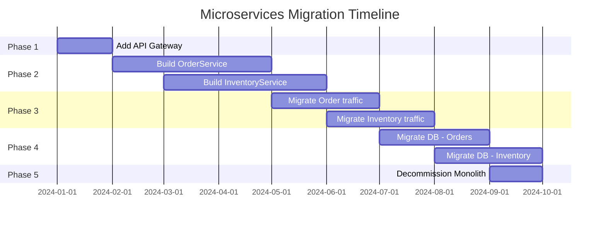

## Keywords in This File
{: .no_toc }

| # | Keyword | Weight |
|---|---|---|
| 1 | [Microservices Migration Strategy from Monolith](#microservices-migration-strategy-from-monolith) | medium |

---

# Microservices Migration Strategy from Monolith

---

### 🎯 Model Answer

**30 seconds:**
> Migrating a monolith to microservices is a multi-year program, not a project. The proven strategy is the strangler fig pattern: gradually replace components of the monolith by building new services around it, routing traffic progressively to the new services, until the monolith handles none of the original load and can be decommissioned. You never do a big-bang rewrite - that approach has a failure rate near 100% for systems of any meaningful complexity.

**3 minutes:**
> The strangler fig pattern works by incrementally replacing the monolith's capabilities. New API gateway routes sit in front of the monolith. When a new microservice is ready for a specific capability: the gateway routes that capability's traffic to the new service. The monolith handles everything else. Over time: the monolith's responsibility shrinks as capabilities migrate out. Eventually: the monolith handles nothing (or a small residual), and is decommissioned. The migration decision framework: start with the capabilities that most need independence. The highest-value migration candidates are: (1) Capabilities that change frequently and are blocked by the monolith's release cycle. (2) Capabilities that have distinct scale requirements (recommendation engine needs 10x more compute than checkout). (3) Capabilities that are causing the most incidents. (4) Capabilities with clear bounded context boundaries (not deeply coupled with every other part of the monolith). What NOT to start with: data tier migration. Shared database migration is the hardest part and should come later. Start with the capability migration (new service wraps monolith calls, or monolith delegates to new service). Database decomposition is a separate, subsequent step. The most common failure: attempting to migrate too many capabilities simultaneously. The monolith team is building new features while the migration team is extracting old ones. Both are modifying the same codebase. Coordination overhead is massive. Solution: feature flag + strangler fig in combination. The new service is built in parallel. When it is ready: a feature flag flips 1% of traffic to it. Monitor. Flip 100%.

**Blank Mind Recovery:**
**(1) Strategy:** "Strangler fig - gradually route traffic to new services, never big-bang rewrite."
**(2) Start with:** "High-change-frequency, clearly bounded, scale-different capabilities first."
**(3) Avoid:** "Data migration before capability migration. Never migrate everything at once."

---

### 📘 Concept Explanation

**What it is:**
A microservices migration strategy is a plan for decomposing a monolithic application into independently deployable services without disrupting ongoing feature development or production availability.

**Migration assessment framework:**
```
MONOLITH ASSESSMENT (before migrating):
  
  1. WHY migrate?
     [ ] Release velocity blocked by monolith?
     [ ] Specific components need different scaling?
     [ ] Technology debt in specific areas?
     [ ] Team autonomy needed across 5+ teams?
     
  If < 2 checked: don't migrate.
  Microservices complexity must be justified.
  
  2. WHAT to migrate first?
     Score each capability:
     
     Change frequency (higher = migrate first)
     Team coupling (higher = migrate later)  
     Data coupling (higher = migrate later)
     Scale requirements (different = migrate first)
     Business risk (higher = migrate later)
     
  3. READINESS:
     Observability: distributed tracing ready?
     CI/CD: can you deploy N services independently?
     Containers: Kubernetes cluster ready?
     If not ready: build infrastructure first.

STRANGLER FIG PHASES:
  
  Phase 1: Route (add abstraction)
    Add API Gateway in front of monolith.
    All traffic still goes to monolith.
    No behavior change. No risk.
    
  Phase 2: Build (new service)
    Build the new service in parallel.
    Test in staging. Feature flag initially off.
    Data: new service reads from monolith DB
    (acceptable temporarily).
    
  Phase 3: Migrate (shift traffic)
    Feature flag: 1% -> 5% -> 50% -> 100%.
    Monitor metrics at each step.
    Rollback: flip feature flag back to 0%.
    
  Phase 4: Decommission (monolith path)
    Remove monolith handler for this capability.
    Migrate data ownership to new service's DB.
    Update all references.
```

> **Code walkthrough:** This Microservices Migration Strategy from Monolith example demonstrates a key concept in practice using SQL. **KEY MECHANISM:** the runtime executes these instructions in sequence with specific memory and execution semantics. **WHY IT MATTERS:** misapplying this pattern causes subtle bugs that only manifest under production load. **TAKEAWAY: understand the execution model before using this pattern in production code.**

**Data decomposition (the hard part):**
```
PATTERN 1: Strangler with shared DB (Phase 1)
  MonolithDB shared between monolith and new service
  Pro: fastest to implement
  Con: tight coupling via DB schema
  Duration: temporary (months)
  
PATTERN 2: Database-per-service with sync
  New service has its own DB.
  A sync job (CDC: Change Data Capture) replicates
  data from MonolithDB to NewServiceDB.
  Pro: data ownership established
  Con: dual-write period complexity
  Duration: transition period (weeks-months)
  
PATTERN 3: Event-driven data ownership
  New service subscribes to monolith events
  to build its own data model.
  Pro: proper decoupling
  Con: requires monolith to publish events
  Duration: permanent architecture
  
PATTERN 4: Direct data migration
  Stop the monolith feature, migrate data,
  start the new service.
  Only for low-traffic, scheduled-maintenance features.
  Risky for high-traffic paths.
```

> **Code walkthrough:** This Microservices Migration Strategy from Monolith example demonstrates a key concept in practice. **KEY MECHANISM:** the runtime executes these instructions in sequence with specific memory and execution semantics. **WHY IT MATTERS:** misapplying this pattern causes subtle bugs that only manifest under production load. **TAKEAWAY: understand the execution model before using this pattern in production code.**

**The key insight:**
The strangler fig succeeds because it is reversible at every step. If the new service has a bug: flip the feature flag back. The monolith is still running. If the migration stalls: the system is still functional (both paths work). The irreversible step is the data migration. Delay it until the service is stable and the traffic is fully migrated. Only then cut the shared DB connection and migrate the data.

---

### 💻 Code Example

```java
// MONOLITH: Original handler (do not modify)
// OrderController.java (in monolith)
@RestController
public class OrderController {
  @GetMapping("/api/orders/{id}")
  public Order getOrder(@PathVariable String id) {
    return orderService.findOrder(id);
  }
  
  @PostMapping("/api/orders")
  public Order createOrder(
      @RequestBody CreateOrderRequest req) {
    return orderService.createOrder(req);
  }
}
```

> **Code walkthrough:** The monolith handler. The strangler fig does NOT modify this initially. It routes traffic around it rather than through it. Modifying the monolith while building the replacement creates merge conflicts and coordination overhead.

```java
// NEW SERVICE: OrderService microservice
// Runs alongside monolith initially
@RestController
public class OrderController {
  private final OrderRepository orderRepository;
  // Initially reads from MonolithDB directly
  // Later: own DB with CDC sync from monolith
  
  @GetMapping("/api/orders/{id}")
  public Order getOrder(@PathVariable String id) {
    return orderRepository.findById(id)
        .orElseThrow(() ->
            new NotFoundException(id));
  }
  
  @PostMapping("/api/orders")
  public Order createOrder(
      @RequestBody CreateOrderRequest req) {
    // New implementation: same business logic
    // but in an independently deployable service
    Order order = Order.from(req);
    return orderRepository.save(order);
  }
}
```

> **Code walkthrough:** The new service implements the same API contract as the monolith. The API Gateway routes 1% of traffic here while the monolith handles 99%. This is the parallel running phase - both implementations handle traffic simultaneously, enabling comparison and gradual cutover.

```yaml
# API Gateway routing (Kong / AWS API Gateway)
# Feature flag: gradual traffic shift
routes:
  - name: order-api
    paths:
      - /api/orders
    plugins:
      - name: traffic-split
        config:
          # Start: 0% to new service
          # Shift: 1% -> 5% -> 25% -> 100%
          # Rollback: flip to 0% immediately
          upstreams:
            - name: order-monolith
              weight: 99     # Shift this down
            - name: order-microservice
              weight: 1      # Shift this up
```

> **Code walkthrough:** The API Gateway implements the feature flag. Adjust `weight` values to shift traffic. This is the control plane for the migration. Zero code changes needed in either the monolith or the new service to shift traffic. Rollback is instant: change weights back to 100/0. This is the power of the strangler fig: every step is reversible.

---

### 📊 Diagram

```
STRANGLER FIG MIGRATION TIMELINE

Phase 1: Add Gateway (Week 1-2)
  Users
    |
    v
  [API Gateway] -> [Monolith]
  All traffic still to monolith.
  Zero risk.

Phase 2: Build New Service (Months 1-3)
  Users
    |
    v
  [API Gateway] -> 100% -> [Monolith]
           \
            0% -> [OrderService v1] (staging)
  New service built in parallel.
  No production traffic yet.

Phase 3: Migrate Traffic (Month 3-4)
  Users
    |
    v
  [API Gateway] -> 95% -> [Monolith]
           \-> 5% -> [OrderService v1]
  Gradual traffic shift with monitoring.

Phase 4: Monolith Residual (Month 4-5)
  Users
    |
    v
  [API Gateway] -> 100% -> [OrderService v1]
  Monolith no longer handles Order API.
  Monolith still runs for other capabilities.

Phase N: Decommission (After all capabilities)
  Monolith removed when all capabilities migrated.
```



> **Diagram walkthrough:** The gantt chart shows the realistic timeline: each capability takes 3+ months to migrate (build + test + gradual rollout + data migration). Multiple capabilities can migrate in parallel if different teams own them. The monolith stays running throughout and is decommissioned only in the final phase after all capabilities have migrated and their data ownership has transferred. A 5-service monolith might take 12-18 months to fully migrate.

---

### 🏛️ System Design

**Problem:** Design a migration strategy for a 5-year-old Java monolith with 200K lines of code, one PostgreSQL database, handling checkout, inventory, user management, product catalog, and order history. 4 teams working on it. Main pain: checkout team releases blocked by catalog team (shared codebase). Scale: 10K req/s at peak.

**Assessment:**
- High-value migration: Checkout (blocked by other teams), Product Catalog (different scale profile - can benefit from CDN caching)
- Medium-value: Inventory (scale requirements similar to checkout)
- Low-value initially: Order History (rarely changed, stable code)
- Complex: User Management (every service needs user data - migrate last)

**Phase 1: Infrastructure (Months 1-3)**
- Deploy Kong API Gateway in front of monolith (zero traffic change)
- Set up Kubernetes cluster for new services
- Deploy distributed tracing (Jaeger) and service mesh (Istio)
- CI/CD pipeline for new services (separate deployment from monolith)

**Phase 2: Product Catalog Service (Months 3-6)**
- Build ProductCatalogService with its own deployment
- Initially: reads from MonolithDB (shared read-only connection)
- Gateway: 1% -> 5% -> 100% traffic shift over 2 weeks with monitoring
- Month 6: data migration - ProductCatalogService gets its own PostgreSQL
- CDC (Debezium) synchronizes monolith -> catalog DB during migration
- Cutover: stop CDC, monolith stops writing to product tables
- Monolith product tables become read-only historical archive

**Phase 3: Checkout Service (Months 4-8)**
- Most complex due to coordination with inventory and payment
- Build CheckoutService orchestrating calls to remaining monolith endpoints
- Introduce Saga pattern for checkout transaction
- Gradually migrate inventory calls once InventoryService is ready
- Database: Order data remains in monolith DB during checkout migration

**Phase 4: Inventory Service (Months 6-10)**
- InventoryService extracts from monolith
- Event-driven: publishes InventoryUpdated events
- Checkout saga switches from monolith inventory calls to InventoryService

**Phase 5: Data sovereignty (Months 10-15)**
- Migrate Order History DB to OrderHistoryService
- Migrate User Management to UserService (last, most shared)
- Decommission shared MonolithDB
- Monolith becomes a thin facade, then decommissioned

**Risk mitigation:**
- Feature flags at every migration step (instant rollback)
- Parallel running: both monolith and new service handle traffic simultaneously for 2+ weeks before completing cutover
- Monitoring: compare error rates and latency between monolith and new service paths before full cutover
- Team structure: dedicated migration team + feature teams continue on monolith (no feature freeze)

---

### 🎓 Answers by Seniority

**Junior / Mid:** "Migrating from a monolith to microservices uses the strangler fig pattern. You add an API Gateway in front of the monolith, then gradually build new services and route traffic to them. You start with the parts of the monolith that are most independent and most frequently changed. The key is to do it gradually - never try to rewrite everything at once. You keep the monolith running while moving traffic to the new services, so if something goes wrong you can quickly route traffic back."

**Senior / Staff:** "The migration strategy is as much an organizational challenge as a technical one. The technical pattern (strangler fig) is well understood. The failure modes are organizational: (1) No feature freeze is possible - teams must continue developing in the monolith while the migration extracts services. This requires disciplined branch management and communication. (2) Data coupling is the hardest technical problem. Services sharing a database are still tightly coupled regardless of how the code is deployed. The decision of when to migrate data ownership (typically after the service is stable in production) is a key milestone. (3) The 'second-system effect': the migration becomes an opportunity to redesign everything. Scope creep extends timelines from 12 months to 3 years. Discipline: migrate the behavior as-is first. Improvements come in the second iteration of the service, after the migration is complete. (4) Team ownership: a service that is owned by nobody (migrated by the central migration team, then handed to a product team) creates a gap in ownership. Establish service ownership before starting migration, not after."

---

### ⚠️ Common Misconceptions

**Misconception:** "You need a feature freeze to successfully migrate to microservices."
Reality: Feature freeze for a multi-year migration is operationally impossible - business development cannot stop. The strangler fig specifically avoids this requirement by running the monolith and new services in parallel. The monolith continues to receive features while the migration extracts capabilities. The discipline required: any new feature added to the monolith in an area scheduled for migration should be added in a way that makes extraction easier (define a clear module boundary, avoid creating new cross-module dependencies). This is harder than a feature freeze but is the only viable approach for live systems.

---

### 🚨 Failure Modes and Diagnosis

**Failure: Dual-write inconsistency during data migration**

Symptoms: After enabling CDC (Debezium) to synchronize monolith data to the new service's database: the new service occasionally returns stale or inconsistent data. Orders that were just created appear missing for a brief window.

Root cause: CDC lag. Changes to the monolith database are replicated to the new service's database with a small delay (typically 100ms - 2 seconds for CDC). During this window: a read to the new service may not see a write that the monolith just committed.

Diagnosis: Measure CDC replication lag (Debezium publishes a metric for this). If lag spikes > 5 seconds: the new service will return data that is 5 seconds stale. Check if read-after-write operations are going to the new service immediately after a monolith write.

Fix: (1) Identify which endpoints have strict read-after-write consistency requirements. Route those to the monolith until data migration is complete. (2) Accept eventual consistency: the new service serves slightly stale data, which is acceptable for most read use cases. (3) Write-through: writes go to both monolith and new service simultaneously. The new service is the authoritative source after successful dual-write.

---

### 🎯 Interview Deep-Dive

| Category | Time | Minimum |
|---|---|---|
| Definition | 2 min | 1 |
| Strategy | 3 min | 2 |
| Scenario | 5 min | 2 |
| Technical | 3 min | 2 |
| Organizational | 3 min | 1 |
| Trade-off | 3 min | 1 |
| Failure modes | 3 min | 1 |
| Design | 5 min | 1 |
| Comparison | 2 min | 1 |
| Anti-pattern | 2 min | 1 |
| Behavioral | 3 min | 1 |
| Advanced | 3 min | 1 |

**[JUNIOR] Q1 - [PRODUCTION] "Why is a big-bang monolith rewrite so often a failure?"**
> "Big-bang rewrite failures: (1) Requirements drift: the monolith embeds years of implicit business requirements. Some are in the code, some in bug fixes, some in edge case handling. A rewrite from scratch re-discovers these requirements through bugs in the new system. The original team also doesn't remember why every piece of code was written. (2) Moving target: while the rewrite takes 18 months, the monolith continues to receive features. The new system is always behind. When the rewrite is 'done': it is already 18 months out of date. (3) Organizational risk: the business is betting on a new system that has never run in production. At cutover: all risk materializes at once. A bug that would have been a minor issue (1% traffic to new service) becomes a P1 (100% traffic to new system). (4) Scope creep: a rewrite is an opportunity to 'do it right'. Every design decision is relitigated. Timelines balloon. (5) Team motivation: 18 months building nothing users see is demoralizing. Key engineers leave. The team changes. Institutional knowledge is lost."

*What separates good from great:* "The only safe big-bang rewrite: when the system is small enough that the rewrite takes weeks, not months or years. At < 10K LOC with < 3 developers: a rewrite might be the right choice. At > 100K LOC with multiple teams: the strangler fig is the only viable approach. Joel Spolsky's 'Things You Should Never Do' (2000) remains the canonical reference: Netscape 6 was a catastrophic big-bang rewrite that gave market share to Internet Explorer. The lesson has been repeatedly re-learned."

---

**[JUNIOR] Q2 - [CONCEPTUAL] "How do you select which capabilities to migrate first?"**
> "Selection criteria: (1) Bounded context clarity: the capability should have a clear, defensible domain boundary. 'Product Catalog' is a clear bounded context: products, prices, categories. 'Checkout' is a less clear bounded context because it coordinates inventory, pricing, user management, and payment. Start with clearly bounded capabilities. (2) Independent change rate: capabilities that change frequently but are blocked by other teams' code are high-value migration candidates. The migration solves a real pain. (3) Different scale requirements: a recommendation engine might need 100x more compute than the auth service. Migrating it enables independent scaling. (4) Low integration complexity: count the number of database tables and API calls the capability shares with other capabilities. Lower integration complexity = easier to extract. Start with loosely coupled capabilities. (5) Business risk: capabilities with the highest business risk (payment processing, auth) should be extracted later, after the team has learned the migration process with lower-risk capabilities."

*What separates good from great:* "Domain-driven design (DDD) Event Storming: run an Event Storming workshop to identify bounded contexts. Map domain events on a timeline. Natural clusters indicate bounded contexts. These clusters suggest service boundaries. Event Storming produces a capability map that makes the 'what to migrate first' decision less arbitrary and more data-driven. The bounded contexts with the highest change frequency and lowest coupling to other contexts are the first migration candidates."

---

**[JUNIOR] Q3 - [ARCHITECTURE] "Walk me through the strangler fig pattern step by step for a specific capability."**
> "Scenario: extracting Product Catalog from the monolith. Step 1 (Week 1-2): add API Gateway routing. All traffic: Gateway -> Monolith. No behavior change. Verify Gateway works correctly. Step 2 (Month 1-2): build ProductCatalogService in parallel. Connect it to the MonolithDB (read-only connection to shared schema). No production traffic. Feature parity: all catalog endpoints implemented. Deploy to staging. Integration tests pass. Step 3 (Month 2): canary deployment. Gateway: 1% to ProductCatalogService, 99% to Monolith. Monitor: error rate, latency, response correctness. Compare product responses from both services. Step 4 (Month 3): gradual shift. 1% -> 5% -> 25% -> 100% over 4 weeks. Each step: 48 hours of monitoring at the new percentage. Rollback if metrics degrade. Step 5 (Month 4-5): data ownership migration. ProductCatalogService gets its own PostgreSQL. Deploy Debezium CDC to sync from MonolithDB to CatalogDB. Stop writes to product tables in monolith (route catalog writes to new service). Verify CDC sync. Step 6 (Month 5): decommission monolith catalog path. Remove product read/write endpoints from monolith. Monolith no longer references product tables. Product schema removed from MonolithDB."

*What separates good from great:* "The 'dark launch': before Step 3 (1% traffic), run both the monolith and new service on 100% of traffic but only return responses from the monolith. Compare responses in the background. This reveals API contract differences (missing fields, different null handling, edge case differences) before any user sees the new service's responses. Only after the dark launch shows consistent responses: shift to 1% canary."

---

**[MID] Q4 - [CONCEPTUAL] "How do you handle the shared database problem during migration?"**
> "Shared database problem: the monolith and new services share one database. New services directly read/write monolith tables. This is the key coupling point that makes migration hard. Migration phases: Phase 1 (acceptable temporary coupling): new service reads from MonolithDB via its own connection. This is acceptable temporarily but creates schema coupling. The monolith owns the schema. Phase 2 (separate schema, same server): create a new schema for the new service's tables within the same database server. The new service uses its own schema. A view or API layer provides access to monolith data. Phase 3 (separate database): new service has its own PostgreSQL instance. CDC (Debezium) replicates required monolith data to the new service's database. The new service now owns its data. Phase 4 (complete independence): the monolith stops writing to the tables that have been migrated. The CDC is turned off. The new service is the authoritative source."

*What separates good from great:* "CDC latency creates an eventual consistency window during migration. For some use cases (product catalog read), eventual consistency is fine. For others (inventory reservation, payment status), it is not. Identify which data has strict consistency requirements. These tables migrate last, after a strategy for maintaining consistency during the cutover window is designed."

---

**[MID] Q5 - [CONCEPTUAL] "How do you manage the team during a multi-year migration?"**
> "Team dynamics during migration: (1) Dual-track development: feature teams continue delivering new features in the monolith. A dedicated migration team (or time allocation per team) works on extraction. Without explicit time allocation: migration is always deprioritized for features. Recommendation: 20% of each team's capacity dedicated to migration, or a dedicated 2-3 person migration team for foundational work. (2) Avoid 'big bang capability handoff': the migration team extracts a service and 'throws it over the wall' to a product team who must now own something they didn't build. They have no context. Solution: the product team participates in the migration from the start. They are the owners during migration, not after. (3) Progress visibility: stakeholders need to see migration progress without interrupting feature development. Create a migration roadmap with capability milestones. Report on percentage of traffic migrated per capability quarterly. (4) Definition of done: a capability migration is complete only when: new service handles 100% of traffic, data is in service's own database, monolith code for this capability is deleted (not just unused)."

*What separates good from great:* "The inverse Conway maneuver: the organization structure drives the architecture. If you want microservices aligned with business capabilities: restructure the teams to match those capabilities first. The services will follow the team structure. Trying to change the architecture without changing the team structure usually produces a different coupling structure, not a decoupled one. The organizational change is harder than the technical change."

---

**[MID] Q6 - [CONCEPTUAL] "What is the role of feature flags in a monolith migration?"**
> "Feature flags provide the control plane for traffic routing during migration. Key uses: (1) Zero-risk canary deployment: 0% of traffic to new service until confident. Increment: 1% -> 5% -> 25% -> 100%. At each step: compare metrics. (2) Instant rollback: change flag from 100% to 0% if metrics degrade. No deployment needed. (3) Beta testing: route internal users (by user ID or IP) to the new service before routing any customer traffic. Catch bugs without customer impact. (4) A/B testing: compare conversion rates between monolith and new service implementation. Validate that the new implementation is equivalent or better. (5) Team-specific testing: route the product team's production traffic to the new service. They dogfood it before general release. Feature flag implementation: LaunchDarkly, Unleash (open source), or simple database-backed flags. For traffic routing in microservices: Istio VirtualService weights combined with LaunchDarkly flags (Istio handles the routing, LaunchDarkly manages the percentages)."

*What separates good from great:* "Technical debt of feature flags: every feature flag is a conditional code path that must eventually be cleaned up. During a migration: each migrated capability creates a feature flag. After 100% traffic migration: the flag is permanent debt. Establish a cleanup process: when a capability is at 100% migration and the new service has been stable for 30 days, delete the flag and remove the monolith code path. This cleanup is as important as the migration itself."

---

**[SENIOR] Q7 - [CONCEPTUAL] "What are the most common reasons microservices migrations fail?"**
> "Common migration failures: (1) Underestimating data complexity: teams plan 6 months for capability migration. Data migration adds 6 more months. Lesson: plan data migration explicitly from the start. (2) Distributed monolith: services are extracted but remain tightly coupled via synchronous calls to each other and shared database access. Result: all the complexity of microservices with none of the independence. Lesson: database-per-service and event-driven communication are not optional. (3) Scope creep: migration becomes 'redesign everything'. Every legacy decision is revisited. Timeline triples. Lesson: migrate behavior as-is, then improve in V2 of the service. (4) No infrastructure investment: services extracted but no distributed tracing, no service mesh, no Kubernetes expertise. Operations become impossible. Lesson: invest in infrastructure before or during migration, not after. (5) Team abandonment: the migration team builds new services. Product teams receive them. Product teams have no context on the new services. Quality degrades. Lesson: product teams own the migration of their capabilities. (6) Feature freeze myth: 'we'll pause features for 6 months to migrate'. Business never agrees. Migration happens in parallel with features. Lesson: plan for parallel development from day one."

*What separates good from great:* "The technical debt accumulation during migration is the hidden cost. While the monolith code is being extracted: the monolith continues receiving features. Each new feature added to the monolith area being extracted makes the extraction harder. Counter-strategy: add a 'migration consideration' step to the feature request process. New features in areas scheduled for migration are either added to the new service directly (even before migration is complete) or added to the monolith in a way that makes extraction easier."

---

**[SENIOR] Q8 - [CONCEPTUAL] "How do you ensure data consistency during the migration period when both monolith and new service are running?"**
> "Dual-write period: both monolith and new service can write data. Three strategies: (1) Monolith as single writer: new service reads from MonolithDB directly. All writes still go through the monolith. New service is read-only during this phase. Simple but maintains coupling. (2) New service as single writer, monolith reads via API: new service owns the data. Monolith calls the new service's API for reads. Monolith POST /orders now calls new service POST /orders instead of writing to DB. More complex but establishes ownership. (3) Dual-write with conflict resolution: both write to their respective databases. CDC synchronizes. Conflict detection: if both modify the same record: conflict resolution logic (last-write-wins, or business-logic-based). Complex and error-prone. Recommendation: strategy 1 is simplest during early migration. Strategy 2 is the target architecture. Strategy 3 is usually too complex to manage safely - avoid it."

*What separates good from great:* "The definition of 'data consistency' changes during migration. Before migration: ACID transactions within the monolith database. During migration: eventual consistency between monolith and new service databases (CDC lag). After migration: distributed consistency managed by sagas or events. Communicating this consistency model change to stakeholders is a non-technical but critical success factor. Business stakeholders need to accept eventual consistency for the migration to be possible."

---

**[SENIOR] Q9 - [CONCEPTUAL] "What metrics do you track to know if a migration is going well?"**
> "Migration health metrics: (1) Traffic migration percentage: what % of capability traffic is served by the new service? Target: 0% -> 100% per capability over time. (2) Error rate parity: new service error rate should be <= monolith error rate. An increase means the new service has bugs. (3) Latency parity: new service P99 should be within 10% of monolith P99. Significant regression indicates performance issues in the new service. (4) Rollback frequency: how often is traffic switched back from new service to monolith? High frequency = quality problems in new service. (5) Capability delivery velocity: are teams shipping new features faster after migration? This is the primary business metric for migration success. If feature velocity doesn't improve: the migration cost is not justified. (6) Incident rate: are incidents decreasing post-migration? If new services are causing more incidents than the monolith: the migration is creating instability. Track per-service incident rate and compare to pre-migration monolith incident rate."

*What separates good from great:* "The ultimate migration metric: time from feature idea to production deployment. In the monolith: all teams share one release cycle. Migration goal: each service team can deploy independently at any time. Track: 'how often does Team X deploy ProductCatalogService per week?' Before migration: once per 2-week monolith release. After migration: 3-5 times per week independently. This delta in deployment frequency is the quantitative proof of migration success."

---

**[STAFF] Q10 - [DEBUGGING] "How do you handle the migration of cross-cutting concerns (authentication, logging, rate limiting)?"**
> "Cross-cutting concerns in the monolith: one library handles auth, one logger configured globally, one rate limiter for the whole app. In microservices: each service needs auth, logging, and rate limiting independently. Solutions: (1) API Gateway layer: authentication (JWT validation), rate limiting, and request logging can all be implemented in the API Gateway. Services don't need to implement these separately. Kong, Nginx, or AWS API Gateway provides these as plugins. This is the cleanest approach - extract cross-cutting concerns to the infrastructure layer. (2) Service mesh (Istio): mutual TLS (service-to-service auth), access logging, and traffic rate limiting all handled by Envoy sidecars. Zero code changes needed in services. (3) Shared library: a company-wide Spring Boot starter handles JWT validation, structured logging configuration, and health endpoints. Simpler than a service mesh but requires redeployment when the library changes. (4) Sidecar pattern: authentication sidecar runs alongside each service and handles auth before requests reach the service. Envoy in Istio is this pattern applied at scale."

*What separates good from great:* "Consistency of cross-cutting concern behavior across all services is harder to ensure than it appears. Different teams implementing their own JWT validation may have different behaviors for edge cases (expired token vs no token vs malformed token). The API Gateway or service mesh approach ensures identical behavior for all services by centralizing the implementation. Inconsistencies in cross-cutting concerns create security vulnerabilities - one service that handles a malformed token differently may allow unauthorized access."

---

**[STAFF] Q11 - [TRADE-OFF] "How do you decide when NOT to migrate to microservices?"**
> "Not migrating is the right decision when: (1) The monolith is not actually causing problems. If a team of 10 deploys the monolith weekly without coordination issues: there is no deployment velocity problem. Migrating adds complexity for no benefit. (2) The system complexity doesn't justify it. A CRUD application with simple business logic in microservices adds operational overhead without any of the benefits (no scale differences, no team autonomy improvements). (3) The team lacks operational maturity. Operating microservices requires: Kubernetes expertise, distributed tracing, CI/CD per service, on-call rotation for multiple services. A team without this capability will have worse availability after migration than before. (4) The business domain is not clearly bounded. A highly connected domain where every entity relates to every other entity will produce a distributed monolith regardless of intent. (5) The team is too small. A 3-person team maintaining 10 services has more operational burden than 3 services. Rule of thumb: one service per 2-3 engineers minimum."

*What separates good from great:* "The Modular Monolith pattern is often a better destination than full microservices for most organizations. A modular monolith has clear module boundaries (enforced by package structure and dependency rules like ArchUnit), modules that could be extracted to services if needed but aren't yet, and one deployment unit that is easy to operate. The benefits: clear domain boundaries, testability, and developer productivity. The deferred cost: independent scaling and independent deployment. For most organizations at most stages of growth, the modular monolith gives 80% of the benefits at 20% of the operational cost."

---

**[STAFF] Q12 - [CONCEPTUAL] "How do you handle a migration that has stalled after 18 months with only 30% of capabilities migrated?"**
> "Stalled migration diagnosis: (1) Why did it stall? Data coupling: teams discovered the data migration is harder than expected. Team capacity: migration work de-prioritized for features. Architecture mismatch: services extracted are becoming distributed monolith. (2) Re-assess the 70% remaining. Which capabilities are still in the monolith? Are they the ones with the highest data coupling? Often, the easy 30% were migrated first. The remaining 70% are harder. Re-prioritize: which of the 70% has the highest business value for being independent? (3) Change the strategy if needed. The original approach may need refinement. If data coupling is the blocker: assess if a shared database with strong schema ownership can be an intermediate step. If team capacity is the blocker: formalize migration as a product (with a dedicated team and a roadmap). (4) Define 'good enough': does the full migration need to complete? If the highest-value capabilities are already migrated: the remaining 70% might stay in a 'modular monolith'. Evaluate the cost-benefit of completing the migration. (5) Organizational accountability: migration stalls when nobody is accountable. Assign a product manager or senior engineer as the migration program owner with a mandate and metrics."

*What separates good from great:* "Sometimes the right answer is to stop the migration at 30% and declare it a success. The capabilities that remain in the monolith may not need to be services. If product catalog and checkout (the highest-value capabilities) are now independent services: the deployment velocity improvement is achieved. Extracting user preferences and order history from the monolith may add complexity without meaningful benefit. The migration is a means to an end (team autonomy, independent scaling) - not an end in itself."

---

### ⚖️ Comparison Table

| Strategy | Risk | Timeline | Use When |
|---|---|---|---|
| Strangler Fig | Low (reversible at each step) | 12-24+ months | Any size monolith |
| Big-Bang Rewrite | Very high (all-or-nothing) | 18-36+ months | Almost never |
| Parallel Run | Low (monolith backup) | Each capability: 3-6 months | Feature-by-feature |
| Database-first | High (data risk) | Long (schema migration) | Never as starting point |
| Modular Monolith (stop here) | None | Weeks-months | < 5 teams, good domain clarity |

---

### 💻 Code Example

*(Omit: this concept does not have a programmatic interface that can be demonstrated in code. The conceptual explanation above is sufficient.)*


---

### 🏛️ System Design

*(Omit: system design diagram not applicable for this concept - see ★★★ keywords for full system design coverage.)*


---

### ⚖️ Comparison Table

*(Omit: this is a ★☆☆ foundational concept with no direct alternatives to compare - see higher-difficulty keywords for trade-off analysis.)*


---

### 📊 Diagram

*(Omit: no standalone visual diagram required for this concept - the explanations and code examples above provide sufficient clarity.)*


